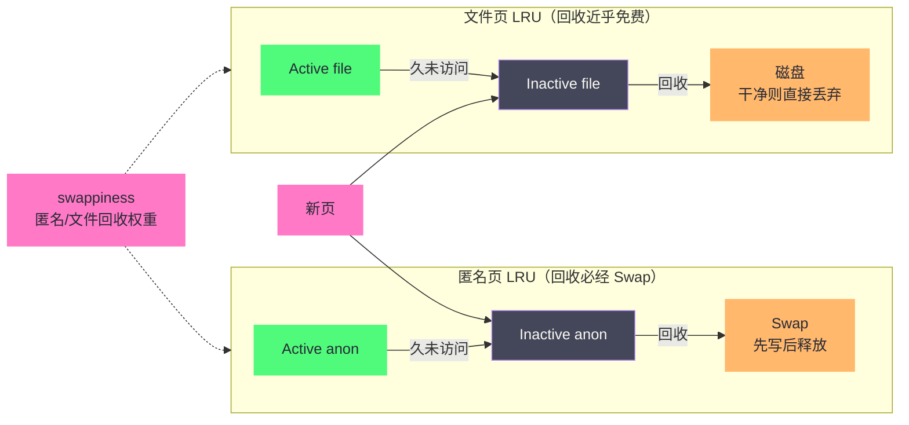
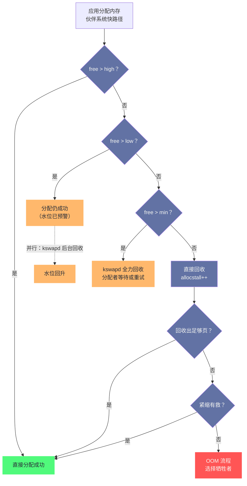

# 内存回收：kswapd、LRU与直接回收的博弈

**摘要：**

前几篇建立的图景里，内存的申请近乎免费、缓存贪婪地填满一切——这份慷慨必然迎来结算日：物理页帧有限，而申请者无穷。**内存回收（Page Reclaim）**就是内核的结算系统：它决定哪些页让出位置、以什么顺序、由谁执行，其质量直接决定一台机器是"平稳运行多年"还是"越跑越卡直到 OOM"。本文分四个层次拆解这套系统：先是**水位线**——min/low/high 三条阈值构成内核的油量表，kswapd 在 low 触发、直接回收在 min 兜底；再看 **LRU 链表**——Active/Inactive 的二次机会算法如何区分冷热，文件页与匿名页的分离记账如何让"回收谁"变成一个可调的权衡（swappiness 的真正含义也在此揭底）；然后是**两套执行者**——后台的 kswapd 与同步的直接回收，它们的成本差出两个数量级，也划出了性能劣化的分水岭；最后是**现代演进**——MGLRU 用分代模型重写扫描逻辑、PSI 把"内存压力"变成第一手指标、cgroup 的主动回收让容器有了新的弹性。读完全文你应当能回答两个问题：内核凭什么判断"哪些页可以让"，以及生产系统内存压力的观测与调优应该从哪些指标入手。

---

## 第 1 章 结算日的经济学：回收为什么存在

### 1.1 三种消耗者与一个有限的水池

把前几篇的结论放在同一张桌子上：匿名页随进程增长（堆、栈、GC 堆），Page Cache 随一切文件访问增长（第 [[04 Page Cache：Linux 为什么要用内存来缓存磁盘|4 篇]] 的贪婪策略），Slab 随内核对象数量增长（连接、文件、进程）。三种消耗者都倾向于"只增不减"，而它们脚下那个由 [[02 物理内存管理：Buddy System 与 Slab 分配器的设计哲学|伙伴系统]] 管理的水池是有限的。没有回收机制的操作系统只有两条路：要么禁止增长（内存够用前拒绝一切新申请），要么放任增长直到物理内存耗尽后崩溃。回收机制提供了第三条路——**收回"不再需要"的页，把有限的水池变成可循环的流动资金**。

"流动资金"这个说法还可以再精确一步：回收让内存管理从"一次性分配"变成了"滚动经营"。分配器（第 2 篇）经营的是页帧的**空间**维度——碎片怎么防、锁竞争怎么降；回收机制经营的是**时间**维度——同一页帧此刻装 A 的数据、下一刻装 B 的数据，物理容量不变而有效容量倍增。两套经营各管一个维度，合起来才是完整的物理内存管理。这也解释了为什么回收机制的复杂度远超分配器：时间维度上的"谁需要、谁可以让"判断，本质是预测，而预测没有完美答案——下面所有机制，都是在给这个无解问题寻找工程上够用的近似。

"不再需要"是这套机制的灵魂，也是它的全部难点。它至少有三种含义：内容可以重建的（干净文件页，丢了再读盘）、内容可以搬家的（脏文件页写盘后释放、匿名页换出到 [[06 Swap机制：磁盘充当内存的代价与边界|Swap]]）、内容真的没用了（进程退出、对象释放）。三种含义对应三种回收成本，从纳秒到毫秒横跨六个数量级——第 4 篇已经给过这笔账：**回收的核心决策，就是永远优先挑成本最低的那类页**。

### 1.2 两个常被误解的目标

理解回收，先纠正两个流行误解。误解一：**回收是为了"腾出大量空闲内存"**。实际上内核根本不追求大量空闲——空闲页帧是零产出的资产，第 4 篇刚说过它们应全部投入缓存。回收真正维护的是一个**安全水位**：保证"内存突发需求"（进程 fork、大块 mmap 触碰、内核临时分配）到来时有货可提。误解二：**回收的触发意味着"内存不够了"**。日常运行中，水位从 high 漂到 low 再被 kswapd 拉回，是每台机器每分钟都在发生的正常循环；真正的问题信号不是回收发生了，而是回收的**方式**（后台还是同步）与**效率**（扫描多少才收回多少）出了问题。带着这两个正确目标读后文，多数机制的设计意图会清晰得多。

### 1.3 价值排序：谁先让路

回收是一台"决策机器"，输入是全部物理页，输出是让出名单。排序的依据可以用一条成本阶梯概括，从便宜到昂贵：

| 优先级 | 页类型 | 回收动作 | 成本 |
|-------|--------|---------|------|
| 1 | 干净文件页 | 直接丢弃 | 纳秒，纯内存操作 |
| 2 | 脏文件页 | 写回磁盘后释放 | 毫秒级写 I/O |
| 3 | 活跃但可重建的缓存 | 先降级观察再丢弃 | 误伤代价：重读一次 |
| 4 | 匿名页 | 写入 Swap 后释放 | 毫秒级写 I/O + 未来可能读回 |
| 5 | 不可回收页（mlock 等） | 不参与回收 | 常驻占用的代价 |

两个细节值得咀嚼。其一，"匿名页生而脏"：匿名页没有磁盘后端，内存里的内容就是唯一副本，回收它必然先写 Swap——这是第 6 篇的存在理由，也是匿名页与文件页回收成本的分水岭。其二，第三档说明回收不只挑"冷"，还要在冷与热之间赌：把活跃页错误降级回收，将来要用时付一次缺页加（可能）一次读盘——**回收算法的全部智慧，都花在减少这种误伤上**。

> [!note] 设计哲学
> 这条成本阶梯还有一层更深的含义：它把"内存"从静态容量问题变成了动态价值问题。同样一页物理内存，装着"可再生的缓存"时价值接近零，装着"进程正在跑的热数据"时价值千金；回收机制做的事情，本质上是让页的价值"流动"起来——把低价值内容的容器让给高价值内容。理解了这一点，就理解了为什么没有任何单一指标能定义"该回收谁"，以及为什么回收调优永远是与具体负载的对话。

### 1.4 第三类消耗者的回收：shrinker 机制

页回收的两个主角（文件页、匿名页）之外，还有一类特殊资产——Slab 里的可回收对象（第 2 篇的 `SReclaimable`，譬如 dentry/inode 缓存）。它们不是页，不能挂 LRU，却占着大量内存；它们的"内容"由各子系统自己理解——dentry 缓存丢掉只是下次路径解析慢一点，某些驱动缓存丢掉则可能丢状态。内核的方案是 **shrinker（收缩器）机制**：每个愿意配合回收的子系统注册一个回调，回收时内核按压力大小调用它，"请你自己丢掉一些最不值钱的对象"。

这个设计又一次体现了"机制与策略分离"：回收框架不认识 dentry，也不知道某个驱动的缓存该怎么淘汰，它只定义了"收缩"这个动作接口与压力参数。生产上的对应观测是 `/proc/slabinfo` 里 dentry/inode 随内存压力下降的现象——那不是泄漏自愈，是 shrinker 在执行回收。`vm.vfs_cache_pressure`（默认 100）就是专门调 vfs 层 shrinker 积极性的旋钮：调高，回收更狠地削 dcache/inode cache；调低，力保目录解析速度。它的适用场景与 swappiness 类似——取决于"文件元数据热"在你的负载里值多少钱。

---

## 第 2 章 水位线：内核的油量表

### 2.1 三条阈值与三档行为

每个 Zone 维护三条水位线——**min（最低）、low（预警）、high（充足）**——它们把内存水位划成三个行为区间：

| 水位区间 | 内核行为 | 执行者 |
|---------|---------|--------|
| free > high | 一切照常 | 无人 |
| low < free < high | **kswapd 被唤醒**，后台异步回收，直到回 high | kswapd（不阻塞任何人） |
| free < min | **分配者同步回收**：谁申请内存谁自己去腾 | 触发分配的进程（阻塞！） |

三条线的语义可以类比汽车油表：high 是"满油"，low 是"油灯亮起"（提醒你去加油，路上还能开），min 是"油管见底"（发动机随时熄火，必须立刻处理）。这套设计的关键洞察是**预警与兜底分离**：low 触发的后台回收给了系统从容处理的余地，min 触发的同步回收则是最后防线——它慢、它抖、它拖累无辜进程，正因为如此，机制的设计目标是**让绝大多数回收发生在 low 与 high 之间**。

min 水位还有一个身份：它是**内核自身的保留库存**（保留内存，reserved memory）。free 接近 min 时，只有满足特定条件（高优先级、原子分配）的请求才能拿走这部分页，普通请求会被卡在同步回收。`vm.min_free_kbytes` 参数直接控制这个保留额度，第 6 章的调优一节会再回到它。

这个"保留库存"的存在也解释了监控里的一个细节：`/proc/meminfo` 的 `MemFree` 与 `MemAvailable` 之间永远有一道距离——前者是"连保留库存都刨除后的真空闲"，后者是"刨除保留后还能安全借出的总量"。把 min 水位理解为"全系统共用的应急车道"，两条指标的关系就再也不会记反。

### 2.2 水位线怎么算出来

三条线不是拍脑袋定的。内核在启动时按物理内存大小自动计算 `min_free_kbytes`（大内存机器上通常数十 MB 量级），然后 low 与 high 在 min 之上按比例展开；4.6 引入的 `vm.watermark_scale_factor`（默认 10）则让 low/high 的间距按**总内存的千分比**伸缩，纠正了大内存机器上"间距太小导致 kswapd 频繁空转或频繁唤醒"的旧病。管理员可以直接覆盖 `vm.min_free_kbytes`，但内核文档的建议是谨慎——它被调得过大，kswapd 与紧缩会整日忙于维持一个虚高的水位；调得过小，min 区的保留库存不足以应付突发原子分配，页分配失败告警随之而来。

水位的实时状态可以直接读：

```bash
$ grep -A 12 "zone      Normal" /proc/zoneinfo | grep -E "min|low|high|present|free"
        min      8250
        low      10312
        high    12375
        present  33123120
        managed  32702123
        nr_free_pages 12108873

# 换算：Normal 区 free=1210 万页 ≈ 46GB，远在 high 之上 —— 该区无压力
```

上面这组数字还透露了水位线的算术关系：low ≈ min × 1.25，high ≈ min × 1.5（粗略比例，实际受 watermark_scale_factor 与各 Zone 参数共同影响）。三条线以 min 为锚逐级展开——**调 min 一处，全体系随之移动**，这也是它常被称为"回收体系总开关"的原因。

### 2.3 三条线背后的并发观

水位线机制值得单独玩味的是它的并发含义。low 与 min 之间的区间，本质是给 kswapd 的**缓冲跑道**：后台回收的速度若能追上分配的速度，同步回收就永远不触发。跑道多宽才够，取决于"分配速率的突发峰值"——这正是 watermark_scale_factor 调优的实质：内存越大、负载突发越猛的机器，跑道应该越宽。**水位线机制把"内存够不够"这个问题，从容量判断变成了速率竞赛**——这也是为什么容量告警看 available，而健康判断看 kswapd 的活动曲线：前者回答水池还剩多少，后者回答注水与放水是否平衡。

### 2.4 水位 Boost 与碎片的水位联动

水位体系还有一个容易被忽略的联动项：**watermark_boost**（4.18 引入）。它的触发场景是大块连续内存分配：order 较高的请求（譬如 THP 的 2MB）需要紧缩腾出连续块，而紧缩"搬家"会临时把水位压低——若此时水位恰在 low 附近，一次紧缩就可能把系统直接推进同步回收区。boost 的对策是**预防性抬高水位**：检测到高阶分配的碎片压力时，临时把各水位线向上顶一段，让 kswapd 提前介入，避免"紧缩压低水位→滑入直接回收"的连锁。这个机制的启示在于：水位线管理的不是单一资源，而是**页帧数量与页帧质量（连续性）两种库存的联动**——第 2 篇的碎片问题在这里与回收问题正式接轨。

---

## 第 3 章 LRU：回收候选的排队规则

### 3.1 从朴素 LRU 到二次机会

水位线回答"何时回收"，LRU 链表回答"回收谁"。最朴素的答案是最少使用页淘汰（LRU, Least Recently Used）：把所有页串成一条链，访问就挪到链头，回收从链尾拿。但朴素的 LRU 有一个著名的致命场景：**一次性的全量扫描会冲垮整条链**。进程顺序读一个 10GB 的文件，每个读到的页都被挪到链头——扫描结束时，链上的"新面孔"全是扫过一次再也不会看的页，真正的热数据全被挤到链尾，下一次回收挑出的恰恰是它们。数据库、文件索引、备份系统都长这样，朴素 LRU 在它们面前形同虚设。

Linux 的解法是**二次机会（Second Chance）**：把一条链拆成 Active（活跃）与 Inactive（不活跃）两条。新读入的页先进 Inactive 尾部；在 Inactive 里**再次被访问**，才有资格升入 Active；Active 里久不访问的页降回 Inactive。回收只从 Inactive 尾部拿——那些页至少已经历过"进入后没人再看"的一轮筛选。扫描冲洗的问题因此被化解：顺序流扫过的页落进 Inactive 就停在原地，升不上去，也就污染不了 Active。用图书管理打比方：新书先放上架下层的"待借阅观察区"，观察期内被反复借阅才升入重点推荐架；回收时先清观察区，推荐架的书不轻易动。

### 3.2 引用位的代价工程

二次机会需要回答一个底层问题：**内核怎么知道页"又被访问了"**？答案是第 1 篇埋过的伏笔——页表 PTE 的 A（Accessed）位由硬件在访问时自动置位。内核回收扫描时检查 A 位：置位说明近期有人碰过，清位并降级；未置位说明冷了，回收候选。整个判断不需要给内存访问插桩，硬件免费记账。

但硬件的记账也有限速：A 位只回答"自上次检查后碰过没有"，碰过一次和碰过一万次看起来一样。内核用一系列工程手段补这个精度：扫描时**清 A 位而不是立即相信它**（下次再看还在不在，就得到了"时间窗口内的访问频率"近似）；对文件页还可以借助第 4 篇的**影子条目**——页被回收后留下的前科记录，让"反复读入又反复回收"的抖动模式（refault）被识别出来，主动干预晋升策略。**用最便宜的信号（一位）加上时间维度与历史维度，拼出可用的冷热判断**——这是内核资源工程学的经典样本。

这套精度工程还有两个实用推论。其一，**链上移动是分批的**：页在 Active/Inactive 之间的晋升与降级通过批量队列（pagevec）攒批处理，单次访问不会立刻搬家——所以观测到的链上分布是"近期趋势"而非"瞬时快照"，排查冷热问题时不要被单次采样误导。其二，**未映射的页要另眼看**：没有页表就没有 A 位，缓存页在"没人映射它"的时期靠页结构自身的引用位近似记账——同一位信号在两种场景下的语义差异，是读回收源码时最容易踩的理解坑。

### 3.3 文件页与匿名页的分离记账

现代 Linux 的 LRU 其实不止两条链：文件页与匿名页各有自己的 Active/Inactive。这一分（2.6.28 时代的 split LRU）来自两种页回收成本的结构性差异——文件页干净时丢弃近乎免费，匿名页回收必经 Swap。两条成本曲线不同的队列，理应分开排队、分开控制节奏。

分开之后，"两类页按什么比例回收"需要一个旋钮，这就是 `vm.swappiness` 被误读半生的真相：**它不是"用不用 Swap 的开关"，而是匿名页与文件页回收倾向的权重（0-100，默认 60）**。调高，内核更积极地回收匿名页（换出更多）；调低，优先回收文件页、保留匿名页。它与"性能"的关系取决于负载——缓存服务器（文件页是主资产）希望 swappiness 低；计算服务（匿名页是主资产、文件页只是代码）反而可能希望它高，让有限的回收预算花在文件页上、别动自己的堆。第 6 篇会展开它的完整语义与调法。

权重的生效方式可以写成一个示意式（非精确公式，便于记忆）：回收时扫描两类链的数量比约为

```
匿名页扫描量 ：文件页扫描量 ≈ swappiness : (200 - swappiness) / 2
```

默认 60 意味着两类页大致按各自压力参与回收、匿名页略占优；调到 10 则文件页几乎包揽全部回收份额。记住"**比例权重，而非开关**"这六个字，就掌握了 swappiness 的一切正确用法。

分离记账还有一层常被忽略的受益者：**cgroup 记账**。每个容器有自己的 LRU 链组（lruvec），匿名页与文件页分开计数，容器的内存限额（第 9 篇）因此能分别约束"这个容器换出了多少匿名页"与"挤占了多少缓存"。全局的回收决策也按 lruvec 逐组执行——**回收体系从"全机一本账"演进为"每租户一本账"，LRU 的分离是账本可以拆分的前提**。



### 3.4 不可回收的页：LRU 体系的边界

四条链之外还有第五条——**不可回收链（unevictable）**。mlock 钉住的页、某些内核结构、被显式声明不可换出的内存住在这里：它们不参与回收竞争，代价是**彻底占用页帧**。mlock 是延迟敏感场景（实时系统、数据库共享内存）的正当工具，但它是与回收机制的"豁免协议"——豁免越多，其他页承担的压力越大，"一部分页获得永久豁免，另一部分页就必须承受全部波动"。观测 unevictable 链的大小（`/proc/meminfo` 的 `Unevictable` 字段）应当成为容量审计的固定科目。

```c
/* 把一块共享内存钉在物理内存里：回收体系从此绕道而行 */
void *shm = mmap(NULL, len, PROT_READ | PROT_WRITE,
                 MAP_SHARED | MAP_LOCKED, shm_fd, 0);
/* MAP_LOCKED = mmap + mlock：分配即钉住，访问延迟不再有缺页/换入惊喜 */
```

使用 mlock 还要注意两个配套细节：进程的 RLIMIT_MEMLOCK 限额（普通用户默认受限，容器里对应 ulimit 配置）；钉住的内存**不计入可回收预算**——容量规划时必须把它们从"名义内存"里扣除。

### 3.5 一页的一生：在 LRU 上的完整旅程

把机制落到一页文件数据的命运上，四条链的协作就有了画面感。数据库读一个索引块，4KB 页从磁盘补入缓存，挂上 Inactive file 的尾部；查询引擎立刻又访问了它——A 位置位，内核晋升它到 Active file；此后它成为热点，稳定居住在 Active。周末一个全表扫描任务开始，海量新页涌入 Inactive，扫描压力顺着 LRU 的降级通道把一些 Active 页挤回 Inactive——我们的索引页也降级了；扫描页短暂充斥 Inactive 尾部后被批量回收，而索引页因为降级后又被访问（A 位再次置位），重新爬回 Active。如此几轮，真正的热点在链上"沉浮"却始终不被丢弃——**双链 + 引用位 + 影子条目三层机制共同实现的，就是这种"让噪声流过、让热点沉淀"的动态秩序**。观测这页的经历也不难：第 4 篇的 workingset_refault 计数器上涨，就是某批页在被反复"回收—重读"。

---

## 第 4 章 两套执行者：kswapd 与直接回收

### 4.1 kswapd：睡到被叫醒的管家

kswapd 是每个 NUMA 节点一个的内核线程，生命周期极简：平时睡觉；水位跌破 low 时被唤醒；一路回收直到水位回 high；再睡。它的工作循环里有两个值得了解的细节。**其一，扫描预算与优先级**：kswapd 从低扫描强度开始，回收不力就逐级加码（扫描量指数上升），大内存机器上一次激进的 kswapd 周期可以扫描数 GB 的页——观测到 kswapd 长时间高 CPU，通常是水位长期回不去 high 的表现，而不是它"疯了"。**其二，回收的批次与节奏**：kswapd 按固定批次（SWAP_CLUSTER_MAX，32 页）工作，批间让出 CPU——后台身份决定了它必须"礼貌"，这也是为什么慢速 I/O（脏页回写、Swap 写入）放在它的路径里可以被容忍。

kswapd 还有一个容易被神化的属性值得澄清：**它不会拦截任何分配**。分配请求到达伙伴系统时，kswapd 是否在工作并不改变本次分配的路径——分配者要么在 high 以上直接成功，要么在 min 以下自己下场。kswapd 的全部意义是**让水位尽快回到让分配者直接成功的区间**。理解这一点，就能理解为什么"kswapd 忙"本身不能作为业务卡顿的证据：它与业务共享受影响的内存状态，但业务卡顿的直接原因只可能是分配变慢（同步回收）或回收误伤（refault）——把中间变量当成病因，是回收问题排查里最常见的逻辑错误。

### 4.2 直接回收：最贵的一档

水位跌破 min 时，触发回收的就是**正在申请内存的那个进程**——它在分配路径上同步执行完整的回收流程（扫描 LRU、回写脏页、等待 I/O），完成后重试分配。这就是直接回收（Direct Reclaim），整个内存系统里最著名的性能杀手：**无辜的进程因为别人耗尽了内存，在自己的申请路径上花数十甚至数百毫秒替人打扫**。观测上它的痕迹清晰：`/proc/vmstat` 的 `allocstall` 计数、`sar -B` 的 pgscand 列。**allocstall 持续增长，几乎总意味着机器的内存配置与负载规模失衡**——正常的系统里它应当接近于零。

直接回收路径上还叠加着另一个昂贵角色：**内存紧缩（Compaction，第 2 篇）**。大块分配（order>0）失败时，分配者先做紧缩再回收，两者交替进行；`compact_stall`（同步紧缩次数）与 `allocstall` 双高，说明这台机器同时承受着"页帧不足"与"连续块不足"两种病。

把一次直接回收的内部循环拆开，成本的去向一目了然。回收器按批次执行一个四步循环：**隔离**（从 LRU 链摘下一批候选页）、**解除映射**（找到所有映射这页的 PTE 并拆除，防止有人还在用）、**善后**（干净页直接释放；脏页提交回写；匿名页写入 Swap）、**归还**（页帧交回伙伴系统）。四步里只有第一步是纯内存操作，后三步都可能涉及 TLB 刷新、磁盘 I/O、锁竞争——同一次回收的耗时可以差出三个数量级，取决于候选页的构成。这也解释了一个调优常识：**回收慢的机器，第一嫌疑不是回收器本身，而是它的候选池里挤满了脏页与匿名页**——让缓存里多存干净页、让 Swap 落在快盘上，回收自然就快。

> [!warning] 生产避坑：直接回收的"无辜者"效应
> 直接回收最阴险的地方在于它的**随机受害者**：触发它的可能是任何一个恰好在此刻申请内存的进程——通常与真正的内存消耗者毫无关系。某个夜间批处理悄悄堆积匿名页，白天高峰期第一个大分配的在线服务被卡在回收路径上，监控看到的是"在线服务延迟抖动"。因此排查延迟尖峰时，除了看受害者的现场，**必须回看 allocstall 的历史曲线与同时段其他进程的内存行为**——受害者与凶手往往是两个进程。容器环境里这条准则更重要：邻居组超额，你的组买单，cgroup 级 PSI 与事件记录是分清责任的关键证据。

### 4.3 OOM：直接回收失败之后

同步回收与紧缩都救不回来时，分配路径的最后一步是触发 OOM（Out of Memory）流程——内核被迫选择牺牲者。这是第 [[07 OOM Killer：内存耗尽时内核如何做出生死抉择|7 篇]] 的全部主题，此处只划清一条边界：**OOM 不是回收机制的故障，而是回收机制宣告"无计可施"的正式声明**。从水位线到 LRU 到 kswapd 到直接回收再到 OOM，整条链是一条责任递进的单行道——生产排查内存问题，本质上就是在这条单行道上定位"卡在哪一环"。

值得提前澄清的是 OOM 触发的两个细节。其一，它受 GFP 标志的约束：`GFP_ATOMIC` 等不可等待的分配在回收无果后可以直接失败返回 NULL，而不必然触发 OOM——触发与否取决于分配者"是否等得起"。其二，容器的 OOM 与全机的 OOM 是两个事件：cgroup 限额触顶时，OOM 流程只在**该 cgroup 内部**选择牺牲者，宿主机水位可能还很充裕（第 9 篇展开）。这两点决定了同一个"内存耗尽"的表象背后，可能藏着完全不同的病根。

### 4.4 两套执行者的对照

把 kswapd 与直接回收放在一起，是理解回收性能的最后一课：

| 维度 | kswapd（后台） | 直接回收（同步） |
|------|--------------|----------------|
| 触发水位 | low | min |
| 执行者 | 专属内核线程 | 申请内存的应用进程自己 |
| 是否阻塞业务 | 否 | 是，且阻塞期间占着分配路径 |
| 时间预算 | 宽裕，可慢慢扫 | 越快越好，越慢业务越抖 |
| 可观测标志 | pgscank 上升 | allocstall 上升、pgscand 上升 |
| 健康系统中的形态 | 间歇性活动 | 几乎为零 |

对照表的核心结论只有一句：**kswapd 的忙碌不是事故，直接回收的出现才是**。监控与告警应当精确地按这条线切分——把"回收发生了"当告警，会把每台正常机器都打成故障；把"直接回收发生了"当告警，才能在容量失衡的早期抓住它。

### 4.5 一张全链路图



两张图合在一起回答的是同一个问题：**系统在内存维度上还健康吗**？绿色区域零成本，黄色区域后台成本，红色区域前台代价。容量规划与告警的真正目标，就是把系统钉在图的上半部。

对照全链路，还可以提炼一份"回收体系的角色清单"，排查时按图索骥：

| 部件 | 一句话职责 | 异常时的名字 |
|------|-----------|-------------|
| 水位线 | 决定何时动手 | 误配：跑道过窄→频繁同步回收 |
| LRU 双链 | 决定对谁动手 | 误伤：refault 持续上涨 |
| kswapd | 后台执行者 | 症状：长期高 CPU 且水位不回 |
| 直接回收 | 同步兜底 | 出现即异常，allocstall 记账 |
| 紧缩 | 补充连续库存 | compact_stall 增长 |
| shrinker | 非 LRU 资产的收缩 | vfs_cache_pressure 失衡 |
| OOM | 最终裁决 | 触发即事故，见第 7 篇 |

---

## 第 5 章 现代演进：MGLRU、PSI 与主动回收

### 5.1 传统体系的天花板

前四节描述的架构（水位 + 双链 LRU + kswapd）服役了近二十年，支撑了 Linux 从桌面到超算的旅程，但它的天花板在两条曲线上逐渐显形。**其一，扫描成本随内存规模线性上升**：大内存机器上一次彻底的冷热判断要触碰海量 PTE，kswapd 的 CPU 代价与扫描延迟在数百 GB 机器上已难忽略。**其二，冷热判断的精度不足**：A 位单比特信号加上时间窗近似，在"大量页冷热快速切换"的现代负载（GC、容器密集调度）面前误差累积，误伤与漏收同时发生。天花板的两个症状——kswapd 烧 CPU 与回收抖动——正是 2010 年代末 Android 与桌面系统上被反复报告的"卡顿"元凶。

这两个天花板还放大了彼此：内存越大，扫描越贵；而为了控制扫描成本，内核又会限制单次扫描的预算，导致冷热判断更加粗略。传统架构在这对矛盾里做了几十年的渐进修补——活跃/不活跃的拆分（2007-2008）、按 cgroup 拆分 LRU、扫描预算的逐级加码——修补的方向一致而收益递减，直到 MGLRU 从排序模型本身下手。**渐进修补与结构性重做之间的切换时机，往往就出现在"修补收益递减曲线"与"业务规模上升曲线"的交叉点上**——这是所有大规模系统都会遇到的工程抉择。

### 5.2 MGLRU：用分代重写扫描逻辑

2022 年的 6.1 内核合入了 **MGLRU（Multi-Gen LRU，多代 LRU）**（Google 的 Yu Zhao 主导）：把页按"年龄代"组织——新访问的页进入年轻的代，随时间与扫描逐级变老，回收优先从最老的代里挑。它的关键改进有二：**用代数（多位信息）替代单比特的 A 位判断**，冷热精度显著提高；**扫描是有偏的**——借助访问位过滤与分代结构，多数页不需要被触碰就能被正确排序，扫描成本与内存规模部分解耦。Google 公布的测试显示它在 Android 与桌面场景大幅削减了 kswapd 的 CPU 与回收抖动。MGLRU 不是对旧体系的推倒重来——水位线、kswapd、swappiness 的骨架原样保留，被替换的是"页如何被排序与扫描"这一层。**架构的骨架可以三十年不动，关节可以整只换掉**——这是它给后来者的启示。

分代模型的内部还有两个值得认识的细节。其一，**"代"是按访问行为动态归档的**：一次扫描里 A 位仍置位的年轻代页被"挽留"晋级，未置位的则顺时针老去——代数（默认最多四代上下）形成一条传送带，页的冷热从"两个桶之间的跳变"变成"传送带上的连续位置"。其二，**文件页与匿名页的老化节奏仍由 swappiness 权衡**：分代结构在两条传送带上分别运转，权重旋钮决定回收预算如何在两条带之间分配——旧体系的核心抽象在这里被完整继承。对运维的实际影响是：启用 MGLRU 的机器，kswapd CPU 与 PSI memory 的 some 值通常会同时下降，而 allocstall 的改善则要看水位配置是否同步优化——**新引擎配旧跑道，跑不出设计速度**。

新旧两代 LRU 的差异收拢成一张表：

| 维度 | 传统 Active/Inactive 双链 | MGLRU 分代 |
|------|--------------------------|-----------|
| 冷热表达 | 两个桶 + A 位单比特 | 多个代 + 访问位过滤 |
| 扫描成本 | 与页总量强相关 | 与页总量部分解耦 |
| 扫描冲洗抵抗力 | 依赖二次机会 | 分代结构天然隔离 |
| refault 感知 | 影子条目 + 计数器 | 内建于代龄推进 |
| 引入时间 | 2.5/2.6 时代，split LRU 2.6.28 | 6.1（2022-12） |

### 5.3 PSI：把"压力"变成第一手指标

前文一直在讲内核如何"想"，PSI（Pressure Stall Information，4.20 合入，Johannes Weiner 主导）解决的是工程师如何"看"：内核直接统计"有多少时间因为有任务在等内存而整体卡住"，暴露在 `/proc/pressure/memory`：

```bash
$ cat /proc/pressure/memory
some avg10=1.23 avg60=0.87 avg300=0.41 total=123456789
full avg10=0.00 avg60=0.02 avg300=0.01 total=1234567

# some：部分任务在等内存的时间占比
# full：所有任务同时被卡的时间占比（更严重）
# avg10/60/300：最近 10 秒 / 1 分钟 / 5 分钟的窗口均值
```

PSI 的革命性在于视角转换：此前的指标（free、回收计数）都在描述**内核在做什么**，PSI 直接描述**用户在承受什么**。some 高而 full 低，说明个别任务在挨饿；full 非零，说明整机已经卡到影响所有人——后者的告警价值远超任何水位阈值。第 [[10 内存性能分析与调优：从 free 到 perf 的工具链|10 篇]] 会把它放进监控体系的核心位，这里只需确立它作为"内存压力金标准"的地位。

PSI 还有两个让它在生产体系里格外好用的性质。**其一，它有 cgroup 级版本**：`/sys/fs/cgroup/<容器>/memory.pressure` 给出每个容器自己的压力曲线，"哪个租户在挨饿"可以精确到户——这在容器混部场景里是宿主机 PSI 无法提供的信息。**其二，它支持阈值触发**：5.2 起允许对 PSI 注册 poll 事件（指定 some/full 在窗口内的阈值），内核在压力越线时直接唤醒监控程序——告警从"轮询计算"变成"内核主动通知"，监控系统的内存压力检测第一次可以做到零采样成本。**指标的可观测性设计到了"被消费的方式"这一层**，PSI 是基础设施指标设计的当代范本。

```c
/* PSI 触发器：内存压力每 10 秒窗口内 some 超过 10% 即唤醒本进程 */
struct pollfd pfd = { .fd = open("/proc/pressure/memory", O_RDWR), .events = POLLPRI };
const char *trigger = "some 100000 1000000";   /* 阈值(微秒) 窗口(微秒) */
write(pfd.fd, trigger, strlen(trigger));
poll(&pfd, 1, -1);                              /* 阻塞等待内核唤醒 */
/* 被唤醒：立刻采集现场（top、smaps 快照），比事后取证准确得多 */
```

触发器模式的实践价值在于"抓现行"：内存抖动往往几十毫秒就消失，事后登录采样十有八九扑空——**让内核在你不在场时替你按秒表**，是内存取证从碰运气变成工程的分水岭。

### 5.4 主动回收：从"被迫让路"到"提前整理"

传统回收是**反应式**的：水位到了才动。容器时代催生了**主动式**的新范式：管理员或编排系统预判需求，提前让出内存。5.19 提供的 `memory.reclaim` 接口允许向指定 cgroup 发起定额回收，配合 MGLRU 的低成本扫描，Kubernetes 等系统开始实现"节点扩容前的软着陆"——在需要发生之前把内存准备好。主动回收与反应式回收的关系，很像缓存预热与按需加载：**预判正确的主动动作可以把昂贵路径变成廉价路径，而预判错误的代价由参数与观测兜底**。

```bash
# 让 cgroup foo 主动归还 1GB 内存（同步等待回收完成）
echo 1G > /sys/fs/cgroup/foo/memory.reclaim
# 排水场景：滚动回收直至目标，配合限速避免一次性冲击
echo 512M > /sys/fs/cgroup/foo/memory.reclaim
```

主动回收在容器平台已经演化出一套标准用法，值得认识三个典型姿势。其一，**滚动驱逐前的预回收**：节点进入排水状态时先对驻留容器逐个发起回收，把被动 OOM 的风险消化成主动的缓存收缩。其二，**与 memory.high 联动的软限**：给 cgroup 设置 high 阈值后，内核会在接近时自动对该组发起回收——相当于"配置化的主动回收"（第 9 篇展开）。其三，**负载波谷调度**：离线任务在凌晨以低速率持续回收自身缓存，为白天的业务高峰让出物理内存——**把回收从"事故响应"变成"容量运营"**，这是内存管理从机器视角走向集群视角的标志性一步。

---

## 第 6 章 诊断与调优：指标、旋钮与判据

### 6.1 回收的仪表盘

把本章机制映射到观测指标，一张仪表盘就够了：

| 指标 | 来源 | 健康判据 |
|------|------|---------|
| kswapd 活动速率 | `sar -B` 的 pgscank/s；`ps` 看 kswapd CPU | 间歇活动正常；持续高 CPU 异常 |
| 直接回收 | pgscand/s；`/proc/vmstat` allocstall | 应接近零；持续非零即容量失衡 |
| 回收效率 | pgscan/s 与 pgsteal/s 之比 | 比值过高说明扫描多、收得少，系统在空转 |
| 回收抖动 | workingset_refault（`/proc/vmstat`） | 持续增长说明页在被反复回收重读 |
| 内存压力 | PSI some/full | full 应长期为零 |

对应的原始计数器集中在 `/proc/vmstat`，一次采样就能看全：

```bash
$ grep -E "pgscan_kswapd|pgscan_direct|pgsteal|allocstall|workingset_refault" /proc/vmstat
pgscan_kswapd_normal 823745612       # kswapd 扫描的页累计
pgsteal_kswapd_normal 612034871      # kswapd 实际收回的页
pgscan_direct_normal 4215            # 直接回收扫描的页
pgsteal_direct_normal 3980           # 直接回收收回的页
allocstall_normal 38                 # 直接回收发生的次数（分 NUMA 节点统计）
workingset_refault_anon 1092834      # 回收后又被读回的页（抖动信号）
```

判读的总纲：**先看压力（PSI），再看方式（pgscand 与 allocstall），最后看效率（pgscan/pgsteal）**。顺序不能反——压力为零的系统，前面所有指标怎么难看都只是"后台在正常干活"。

### 6.2 三个旋钮的适用边界

管理员的调优空间集中在三个旋钮上，每个都有自己的适用边界。**`vm.min_free_kbytes`**：调大保留库存，适合"突发分配密集"或大页整机（预留连续内存的缓冲），过大则 kswapd 与紧缩常年空转。**`vm.watermark_scale_factor`**：调宽 low/high 跑道，让 kswapd 更早起步、更少触发同步回收，适合大内存机器；它的副作用是平均水位更高、缓存预算略降。**`vm.swappiness`**：调整匿名/文件页的回收权重（详见第 6 篇），适合明确知道自身资产结构的负载。三者共同的总原则：**回收调优的目标不是"少回收"而是"回收得优雅"——全部发生在后台、全部命中真冷页**。

把本章所有旋钮收进一张速查表，调优前先对号：

| 参数 | 默认值 | 调大效果 | 调大代价 | 适用场景 |
|------|-------|---------|---------|---------|
| vm.min_free_kbytes | 启动自动计算 | 保留库存更厚 | kswapd/紧缩更忙 | 原子分配密集、大页整机 |
| vm.watermark_scale_factor | 10 | low/high 跑道更宽 | 平均水位更高 | 大内存、突发分配猛 |
| vm.swappiness | 60 | 更倾向换出匿名页 | 应用匿名页被换 | 资产结构明确的负载 |
| vm.vfs_cache_pressure | 100 | 更狠削 dcache/inode | 路径解析变慢 | 内存极度紧张 |

调参的次序也有讲究：**先修负载（写入节奏、扫描模式），再调水位（min、scale_factor），最后才动权重（swappiness、vfs_cache_pressure）**。权重旋钮改变的是"牺牲谁"，而多数问题出在"根本不该牺牲任何人"——负载修好了，权重往往不用动。

> [!warning] 生产避坑：kswapd 烧 CPU 的完整排查链
> 现象：kswapd0 长期占用单核 50% 以上，伴随间歇性业务抖动。排查按固定链路走：一看 PSI——full 为零说明用户无感，some 高说明个别任务在挨饿；二看 `sar -B` 的 pgscand——非零说明已经滑入同步回收区，水位配置偏小；三看 pgscan/pgsteal 比——比值大说明扫描效率低，怀疑回收候选被脏页或不可回收页占据；四查 `Unevictable` 与 slab 的 SUnreclaim——不可回收资产膨胀会挤压可回收空间。这条链能解决九成"内存够用但机器越跑越卡"的案子——**剩下的那一成，通常是 NUMA 单节点失衡**：总量充足而某 Node 的 Zone 独自承压，`numactl` 绑定或 zone_reclaim_mode 调整是解法（第 2 篇讲过参数语义）。

### 6.3 案例骨架：一次"周期性卡顿"的推演

把本章工具串成一个真实感案例。某服务每 30 分钟出现数秒的请求延迟尖峰，CPU 与网络均无异常。按本章仪表盘推演：PSI 的 avg300 显示 memory some 有规律性抬升，时间与尖峰对齐；`sar -B` 显示尖峰时段 pgscand 从零跳升——**同步回收正在发生**；pgscan/pgsteal 比值恶化，且 workingset_refault 同步上涨——**回收正在误伤热文件页，且业务在反复重读它们**。结论呼之欲出：服务的周期性大报表扫描把缓存冲垮（第 3 章的扫描冲洗场景），热数据被挤出后又在重读。解法依次评估：报表读到临时目录（与热数据分离）、fadvise DONTNEED 主动驱逐扫描页（第 4 篇的工具）、或启用 MGLRU 提高扫描抗性。**每一层观测都指向下一层工具**，这就是内存问题排查应有的样子。

这个案例还有一个值得复盘的"反面教训"：最初的排查曾沿着"数据库慢查询"的方向走了两天——直到有人把延迟尖峰的绝对时间与报表任务的 cron 表达式对齐，方向才逆转。**内存压力引发的症状几乎总是"别人的指标先变坏"**（请求延迟、GC 停顿、RPC 超时），它自己的指纹（PSI、pgscand、allocstall）安静地躺在系统级指标里等被发现。把本章仪表盘纳入例行监控的价值，正在于让这类"跨界案件"的第一现场不被错过。

### 6.4 与 cgroup 的联动：从全局均衡到分户治理

本章至此讨论的都是全机视角，容器化的现实要求多问一句：**回收的压力如何分摊到各租户**？cgroup v2 给出的机制是三层递进的：`memory.high` 是"软限额"——越过即对该组发起回收，把超限消化在组内；`memory.max` 是"硬限额"——触顶且组内回收无果则触发组级 OOM；两者之间还有后台回收的水位联动，让每一组在不触限时就维持自己的"体内平衡"。对宿主机的影响是结构性的：**各组的限额与体内平衡做得越好，全机水位就越平稳，kswapd 与直接回收的压力越小**——回收治理的重心正在从"全机参数调优"转向"每租户配额设计"。第 9 篇将以容器视角完整重讲这套机制，此处先建立全机与分户的对照框架。

---

## 第 7 章 小结：在遗忘的艺术里保持平衡

全篇收拢。**水位线**给了回收的时机：low 起跑、min 兜底，预警与兜底分离让正常负载永远停在后台档。**LRU**给了回收的对象：二次机会抵御扫描冲洗，文件/匿名分账让成本结构不同的两种页各按各的节奏让路，swappiness 是这两条节奏线之间的权重旋钮。**kswapd 与直接回收**给出了成本分野：后台的优雅与同步的代价相差两个数量级，allocstall 是"容量失衡"的最直接证据。**MGLRU、PSI、主动回收**是现代答卷新添的三笔：分代扫描降低成本与误伤，压力指标让用户感受成为第一手数据，主动回收把结算日变成可调度的日程。

收一张速查表：

| 现象 | 机制根源 | 处置方向 |
|------|---------|---------|
| kswapd 高 CPU 但业务无感 | 后台回收正常工作 | 看 pgscand 确认无同步回收即可 |
| 周期性卡顿与 PSI 对齐 | 同步回收被触发 | 调宽水位跑道、排查周期性写入/扫描 |
| 缓存命中率先降后升循环 | 回收误伤热文件页（refault） | fadvise 驱逐冷扫描、MGLRU |
| 内存充足仍频繁直接回收 | NUMA 单 Zone 失衡 | numactl 绑定、zone_reclaim_mode |
| min_free_kbytes 调大后变卡 | 保留库存虚高，kswapd 空转 | 回落或改用 watermark_scale_factor |

回收机制是内存专栏前半程的合龙处：虚拟内存的承诺在这里被强制兑现或收回，页缓存在这里被重新定价，伙伴系统在这里接收归还的页帧。它也把全篇的落点指向一个朴素命题：**内存管理的一切高级机制，最终都在回答"有限资源如何在竞争者之间优雅地流转"**——答案没有唯一，只有在具体负载下才成立的具体平衡。而平衡被打破时的最终裁决者——OOM Killer——正是下一篇 [[07 OOM Killer：内存耗尽时内核如何做出生死抉择]] 的主角：当回收无计可施，内核如何在幸存与牺牲之间做出那个不愉快的决定。

最后把本章的比喻收束成一个整体视角。水位线是油量表，LRU 是候客区与贵宾室的分座制，kswapd 是只做预防性补货的管家，直接回收是让顾客自己下厨的应急，shrinker 是向各店铺发出的自愿清仓倡议，PSI 是顾客排队的实时满意度，MGLRU 则是重新设计过的分座算法。每个部件都在自己的岗位上做一件小而确定的事——**回收体系没有天才设计，只有一组各安其位的平凡机制**；这份"平凡"正是它能运转数十年的原因，也是你在生产系统上信任它、调试它的信心来源。

---

## 参考资料

1. Robert Love. Linux Kernel Development, 3rd Edition. Addison-Wesley, 2010.（第 12 章：kswapd 与页回收）
2. Mel Gorman. Understanding the Linux Virtual Memory Manager. Prentice Hall, 2004.（第 6、10 章：页回收与水位）
3. Rik van Riel. Split LRU 与页面回收重设计. Linux 内核邮件列表与合入记录, 2007-2008.
4. Johannes Weiner. PSI: Pressure Stall Information. LWN.net, 2018. https://lwn.net/Articles/759781/
5. Yu Zhao. Multi-Gen LRU（MGLRU 系列补丁与说明）. LKML 与 LWN.net, 2021-2022. https://lwn.net/Articles/856931/
6. Linux Kernel Documentation. https://docs.kernel.org/admin-guide/sysctl/vm.html（min_free_kbytes、watermark_scale_factor、swappiness 官方文档）
7. Jonathan Corbet. Workingset detection 与 refault 计数. LWN.net, 2014 相关篇目.
8. Linux Kernel Source. `mm/vmscan.c`（回收主循环）、`include/linux/mmzone.h`（水位定义）.

---

> [!note] 思考题
> 1. 把一台 256GB 内存的数据库服务器 `swappiness` 调成 0 后，文件页缓存几乎不被挤占，但数月后仍出现匿名页回收引发的直接回收。这说明 swappiness=0 的真实语义是什么？它与 1 的行为差异又在哪里？
> 2. MGLRU 用"代"替代了单比特 A 位判断。请推演：一个 GC 型负载（老年代对象稳定、新生代高频分配回收）在双链 LRU 与 MGLRU 下，回收误伤率会有何不同？你会用哪个 `/proc/vmstat` 计数器验证？
> 3. PSI 的 full 指标回答"所有人是否同时被卡"。设想你为容器平台设计告警：cgroup 级 PSI（`memory.pressure`）与宿主机级 PSI 应该各管什么？两者不一致（容器 full 高而宿主机 some 低）时，第一嫌疑是什么？
