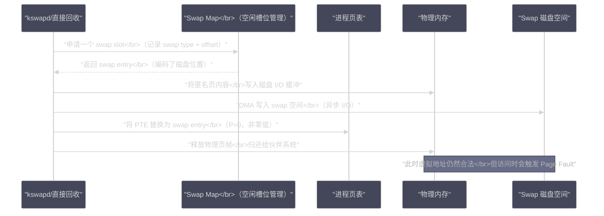

# Swap机制：磁盘充当内存的代价与边界

**摘要：**

Swap 是 Linux 内存管理体系中最被误解的机制之一。很多工程师把 Swap 的使用视为"内存不足的耻辱标志"，恨不得在生产服务器上彻底禁用它；而另一些人则把 Swap 视为扩容内存的廉价方案，认为配置足够大的 Swap 就能解决内存不足的问题。这两种观点都有失偏颇。本文从 Swap 存在的本质原因出发，深入剖析匿名页的换出换入全流程，解析 `vm.swappiness` 参数背后的数学模型（它并非"Swap 百分比"），厘清 Swap 与内存性能之间的真实关系：**少量 Swap 使用未必有问题，而大量 Swap 抖动（Thrashing）才是系统濒临崩溃的信号**。最后给出在不同业务场景下（数据库、JVM 服务、容器环境）Swap 的正确配置策略。

---

## 第 1 章 Swap 为什么存在

### 1.1 物理内存的有限性与虚拟内存的承诺

在[[虚拟内存：为什么每个进程都以为自己独占内存|第01篇]]中，我们提到了 Linux 的**Overcommit（超额分配）**机制：内核允许所有进程声明的虚拟内存总量超过物理内存的实际大小。这个机制的基础，除了按需分配（大量已分配的内存不会被真正使用），还有 Swap——当物理内存真的不够用时，把一部分内存的内容临时转移到磁盘，腾出物理内存空间，等需要时再换回来。

Swap 是虚拟内存体系的"最后防线"：只有当[[内存回收：kswapd、LRU与直接回收的博弈|内存回收]]回收了所有能回收的[[Page Cache：Linux 为什么要用内存来缓存磁盘|文件缓存]]仍然不够用时，内核才会动用 Swap 来换出匿名页（堆、栈等）。

### 1.2 Swap 解决的两个本质问题

**问题一：匿名页的可回收性**

回忆一下[[内存回收：kswapd、LRU与直接回收的博弈|内存回收]]的回收优先级：文件页（Page Cache）可以直接丢弃（干净页）或回写后丢弃（脏页），因为文件在磁盘上有持久化副本，回收后可以重新读取。但**匿名页没有磁盘后端**——进程堆上的数据没有对应的文件，如果直接丢弃，数据就永久丢失了。

Swap 为匿名页提供了一个**临时磁盘后端**：把匿名页内容写入 Swap 空间（Swap 分区或 Swap 文件），在内存中腾出物理页帧供其他用途，同时在 PTE 中记录 Swap 位置（[[缺页异常：一次内存访问的完整旅程|Swap Entry]]）。当进程再次访问这块内存时，触发 Page Fault，内核从 Swap 中把内容读回来。

没有 Swap，匿名页就无法被回收，系统的可用物理内存就等于总物理内存减去所有进程堆/栈的总大小，一旦这些不可回收的内存占满物理内存，就只能 OOM。

**问题二：内存使用的峰谷平衡**

大多数服务器有明显的访问峰谷。白天业务高峰期，内存使用率可能达到 90%；凌晨低谷期，大量进程处于空闲状态，它们的堆内存数据几乎不被访问。Swap 允许在低谷期把这些"冷内存"换出到磁盘，在高峰期把更多物理内存留给活跃进程，从而在整个时间周期内更有效地利用物理内存。

> [!note] 设计哲学
> Swap 的设计哲学和[[Page Cache：Linux 为什么要用内存来缓存磁盘|Page Cache]]正好相反：Page Cache 是"把磁盘数据拉到内存"（磁盘→内存），Swap 是"把内存数据推到磁盘"（内存→磁盘）。两者共同维持了 Linux "内存不浪费"的极致哲学：有空余内存就用来缓存文件，内存不够就把冷数据推到磁盘。这套机制在内存相对廉价的今天仍然有价值，尤其是在 Swap 用 NVMe SSD 时性能代价已经大幅降低。

### 1.3 Swap 的形态：分区与文件

Linux 支持两种形式的 Swap：

**Swap 分区（Swap Partition）**：一个专用的磁盘分区，格式化为 Swap 格式（没有文件系统）。性能最优，内核可以直接按页偏移访问，没有文件系统层的开销。

**Swap 文件（Swap File）**：一个普通文件系统上的文件，通过 `mkswap` + `swapon` 激活为 Swap 空间。灵活，可以在不重新分区的情况下添加 Swap，现代 Linux（4.0+）对 Swap 文件的性能已经优化得很好（与 Swap 分区差距不大）。

可以通过 `swapon -s` 查看当前活跃的 Swap 空间：

```bash
$ swapon -s
Filename                Type        Size       Used    Priority
/dev/sda2               partition   8388604    0       -2
/swapfile               file        2097148    0       -3

# 或者
$ cat /proc/swaps
Filename    Type    Size        Used    Priority
/dev/sda2   partition   8388604   524288    -2
```

多个 Swap 空间可以同时存在，内核通过优先级（Priority）决定先用哪个（优先级数值越高越先用）。相同优先级的多个 Swap 空间会以轮转方式使用（类似 RAID-0，提升 Swap I/O 带宽）。

---

## 第 2 章 Swap 的工作原理：换出与换入

### 2.1 换出（Swap Out）：匿名页的磁盘之旅

当[[内存回收：kswapd、LRU与直接回收的博弈|kswapd 或直接回收]]决定换出一个匿名页时，流程如下：



换出过程的关键细节：

**1. Swap 槽位分配**：Swap 空间被分成等大的"槽位（slot）"，每个槽位 4KB（与页帧大小相同）。内核维护一个 **Swap Map**（本质上是一个计数数组），记录每个槽位的引用计数：0 表示空闲，>0 表示被占用（值表示有多少个 PTE 引用这个槽位，COW 场景下可能多个）。

**2. PTE 替换**：换出完成后，对应的 PTE 被替换为 **Swap Entry**（[[缺页异常：一次内存访问的完整旅程|第03篇]]详细讲过其格式）。Swap Entry 的 P 位=0（不在物理内存），但其他位编码了 Swap 设备号和槽位偏移。所有引用这个匿名页的 PTE（如 fork 后父子共享的页）都需要被更新为 Swap Entry——这需要**逆向映射（Reverse Mapping）**机制来找到所有引用者。

**3. 逆向映射（RMAP）**：通常我们通过 VMA + 虚拟地址可以找到物理页（正向映射：VA→PA）。但换出时，内核拿着一个 `struct page`，需要找到**所有**映射了这个物理页的 PTE（可能跨进程），把它们全部替换为 Swap Entry。这个"反向"的查找就是逆向映射。Linux 通过 `struct anon_vma`（匿名 VMA 树）实现匿名页的逆向映射，每个匿名页通过 `page->mapping` 指向其所属的 `anon_vma` 链，内核遍历这个链找到所有引用者。

### 2.2 Swap Cache：换出路上的临时缓冲

在匿名页换出过程中，有一个中间状态值得关注：**Swap Cache**。

当内核决定换出一个匿名页时，在磁盘 I/O 真正完成之前，这个页会被标记为"正在换出"并加入 **Swap Cache**。Swap Cache 的作用是：

**避免重复换出**：如果换出过程中（I/O 还没完成），另一个进程也需要换出同一个页（比如两个进程 fork 后共享的页），内核发现该页已在 Swap Cache 中，不需要再次发起 I/O，直接复用同一个 Swap 槽位。

**避免换出后立即换回**：如果一个页换出完成后，进程马上又访问它（触发换入 Page Fault），内核先检查 Swap Cache，如果还在（内容未被覆盖），可以直接从 Swap Cache 拿回，不需要真正的磁盘读 I/O。

换入完成后，页从 Swap Cache 中移除（重新成为普通匿名页），对应的 Swap 槽位引用计数减一（降为 0 则释放槽位）。

`/proc/meminfo` 中的 `SwapCached` 字段就反映了当前 Swap Cache 的大小：

```bash
$ grep SwapCached /proc/meminfo
SwapCached:        45678 kB  # 已换出又换回、但 swap 槽位还保留的页
```

`SwapCached` 持续较高说明有大量页在换出/换入之间反复震荡（Thrashing），这是内存严重不足的信号。

### 2.3 换入（Swap In）：从磁盘唤醒内存

换入触发的条件已在[[缺页异常：一次内存访问的完整旅程|第03篇]]详细讲述：进程访问一个 Swap Entry（PTE.P=0 且非零值），触发 Page Fault，`do_swap_page()` 处理：

1. 解码 PTE 中的 Swap Entry，得到 Swap 设备号和槽位偏移
2. 先查 Swap Cache（命中则直接使用，免去磁盘 I/O）
3. Swap Cache 未命中：从伙伴系统分配新物理页帧，向 Swap 磁盘发起读 I/O
4. 等待 I/O 完成（Major Page Fault，进程阻塞）
5. 将换回的页加入 Swap Cache（短暂），更新 PTE 指向新物理页帧（P=1）
6. Swap 槽位引用计数减一，如果降为 0 则释放槽位

**换入时的预读**：类似于 Page Cache 的顺序预读，`swapin_readahead()` 在换入一个页时，会预判性地提前换入若干个相邻的 Swap 槽位（假设内存访问有顺序性），减少后续换入的磁盘 I/O 次数。但 Swap 中的匿名页通常没有顺序性（堆分配是随机的），预读命中率往往不高。

---

## 第 3 章 vm.swappiness：被误解最深的内核参数

### 3.1 swappiness 的错误认知

关于 `vm.swappiness`，流传最广的解释是：
> "swappiness=0 表示不使用 Swap，swappiness=100 表示尽量使用 Swap，swappiness=60 表示当内存使用率到 60% 时开始使用 Swap"

这三种解释**全部是错误的**。正确理解 swappiness，需要从它在内核源码中的实际作用说起。

### 3.2 swappiness 的真实含义：文件页与匿名页回收的权重比

`vm.swappiness`（默认值 60，范围 0~200）控制的是：在[[内存回收：kswapd、LRU与直接回收的博弈|LRU 回收]]扫描时，**扫描匿名页 LRU 的力度** 相对于 **扫描文件页 LRU 的力度** 的比值。

在内核的 `get_scan_count()` 函数中，扫描比率的计算（简化版）：

```c
/*
 * 计算本次回收扫描中，匿名页 LRU 和文件页 LRU 各自应该扫描多少页
 * swappiness 越高，匿名页扫描比例越高（越倾向于换出匿名页）
 * swappiness 越低，文件页扫描比例越高（越倾向于回收 Page Cache）
 */
static void get_scan_count(struct lruvec *lruvec, struct scan_control *sc,
                            unsigned long *nr)
{
    unsigned long anon = lruvec_page_state(lruvec, NR_INACTIVE_ANON) +
                         lruvec_page_state(lruvec, NR_ACTIVE_ANON);
    unsigned long file = lruvec_page_state(lruvec, NR_INACTIVE_FILE) +
                         lruvec_page_state(lruvec, NR_ACTIVE_FILE);
    
    /* swappiness 作为匿名页扫描的"权重分子" */
    unsigned long ap = swappiness;          /* 匿名页扫描权重 */
    unsigned long fp = 200 - swappiness;    /* 文件页扫描权重（旧内核是 100-swappiness）*/
    
    /* 归一化：按各自 LRU 中的实际页数比例分配扫描量 */
    unsigned long total = ap + fp;
    nr[LRU_INACTIVE_ANON] = scan * ap / total * anon / (anon + file);
    nr[LRU_INACTIVE_FILE] = scan * fp / total * file / (anon + file);
    /* ... */
}
```

实际上，内核在 5.8 版本后将 swappiness 的最大值从 100 改为 200，使得可以配置"只换出匿名页，不回收文件页"的极端情况。计算公式也随之演进，但核心逻辑不变：**swappiness 是匿名页扫描力度的权重因子**。

理解了这一点，就能正确解读各种 swappiness 值的含义：

| swappiness 值 | 效果 |
|--------------|------|
| **0** | 只要还有文件页可以回收，就不扫描匿名页 LRU（但不是绝对禁止 Swap，内存极度紧张时仍会 Swap）|
| **1~10** | 极度倾向回收 Page Cache，几乎不换出匿名页，Swap 极少使用 |
| **60**（默认）| 文件页和匿名页按接近 7:3 的比例回收（结合 LRU 中各自数量）|
| **100** | 匿名页和文件页以相近力度回收（平衡策略）|
| **200**（新内核）| 只扫描匿名页，几乎不回收文件页（极端情况，一般不用）|

> [!warning] 生产避坑
> **`swappiness=0` 并不等于"禁用 Swap"**。当内存极度紧张（Min 水位线以下），内核仍然可能换出匿名页，即使 swappiness=0。真正的"完全禁用 Swap"需要 `swapoff -a`（关闭所有 Swap 设备）。很多 Kubernetes 部署指南说"设置 swappiness=0 等效于禁用 swap"，这是不准确的，但在 Kubernetes 场景下 `swappiness=0` + 节点内存充足确实可以做到几乎不 Swap，实践中有效。

### 3.3 不同场景下的 swappiness 推荐值

**场景一：数据库服务器（MySQL、PostgreSQL、Redis）**

数据库对延迟极度敏感，任何因 Swap 换入触发的 Major Page Fault 都可能造成查询超时。同时数据库通常有自己的内存管理（InnoDB Buffer Pool、Redis 内存），倾向于占满所有可用内存。

推荐：`swappiness=1`（或 0，视操作系统版本）

```bash
# MySQL、PostgreSQL 的标准建议：
echo 1 > /proc/sys/vm/swappiness
# 写入 /etc/sysctl.conf 永久生效：
# vm.swappiness = 1
```

降低 swappiness 的原因：宁可回收 Page Cache（损失文件缓存命中率，但可以接受），也不能把数据库 Buffer Pool 换出到 Swap（会导致大量查询延迟飙升）。

**场景二：JVM 服务（Java 应用服务器、Kafka、HBase）**

JVM 堆内存（匿名页）是 GC 的工作区，如果在 GC 工作时大量堆页被换出，GC 暂停时间会急剧增加（GC 扫描对象需要把页换回来，触发大量 Major Page Fault）。

推荐：`swappiness=10`~`30`，并配合 `-XX:+AlwaysPreTouch` 预分配物理页

**场景三：通用 Web 服务器（Nginx、Tomcat 等）**

不像数据库那样对延迟极度敏感，可以容忍偶尔的 Swap 活动。默认值 60 通常没问题，如果内存经常接近上限，可以适当降低到 30~40。

**场景四：桌面环境 / 开发机**

桌面用户对响应速度敏感，但可以接受后台任务被换出以保证前台响应。推荐 `swappiness=10`，让内存不足时优先换出后台进程而非回收文件缓存（文件缓存对桌面系统的响应速度很重要）。

**场景五：Kubernetes 节点**

Kubernetes 1.22 之前不支持 Swap（kubelet 启动时检查到有 Swap 就直接报错退出）。即便如此，最佳实践仍是：
- 若使用 Kubernetes 1.22+（支持 Swap），设置 `swappiness=0` 并通过 kubelet 的 `memorySwap` 配置精细控制
- 老版本 Kubernetes：`swapoff -a` + 禁止 Swap

---

## 第 4 章 Swap 的性能代价分析

### 4.1 换出代价：写磁盘的不可逃避

每次匿名页换出，代价包括：
- **CPU 时间**：遍历 RMAP 找到所有引用者、更新 PTE、管理 Swap Map
- **磁盘 I/O**：写入 4KB 到 Swap 空间（顺序写，相对高效）
- **内存带宽**：从物理内存读出内容，通过 DMA 写入磁盘

对于 NVMe SSD，写一个 4KB 页到 Swap 的延迟约 50~100μs，代价尚可接受。对于 SATA SSD，约 200~500μs。对于机械硬盘，随机写延迟 10~20ms，此时 Swap 使用几乎不可接受。

### 4.2 换入代价：比换出更痛苦

**换入代价远高于换出代价**，原因是：

**换入是同步阻塞的**：换出通常由 kswapd 异步完成（不阻塞业务进程），而换入是由访问该页的进程本身同步触发（Major Page Fault），进程在 I/O 完成前一直阻塞。

**换入的随机性**：堆内存的访问模式通常是随机的（不同变量散布在堆的各处），换入时对 Swap 的访问也是随机的，随机读对于机械硬盘是灾难（随机 I/O 带宽可能低至 0.1~1MB/s）。

**换入引发连锁反应**：一次换入需要从物理内存中腾出一个空闲页帧。如果此时物理内存仍然紧张，腾出一个页帧可能又需要换出另一个匿名页……由此可能形成**Swap Thrashing（抖动）**：系统大量时间花在换入/换出上，真正的计算工作反而极少，CPU 使用率飙高但业务吞吐率接近零。

### 4.3 Swap Thrashing 的识别与应对

Swap Thrashing 是系统严重故障的前兆，识别方法：

```bash
# 方法一：vmstat 1，持续观察 si 和 so
$ vmstat 1
procs ---------memory---------- ---swap-- -----io---- -system-- ------cpu-----
 r  b   swpd   free   buff  cache   si   so    bi    bo   in   cs us sy id wa st
 5  8 2097152   4096   1234  567890 4567 3456  5678  4567 8901 3456 10 25  5 60  0

# 告警指标：
# swpd：Swap 使用量（KB），持续增大说明内存在持续不足
# si（swap in）：每秒从 Swap 换入的 KB，> 100 KB/s 值得关注，> 1MB/s 是严重告警
# so（swap out）：每秒换出的 KB，持续 > 0 是内存压力信号
# wa（iowait CPU%）：I/O 等待 CPU 占比高 + si/so 高 = Swap Thrashing

# 方法二：/proc/meminfo 的 SwapTotal vs SwapFree
$ grep -E "SwapTotal|SwapFree" /proc/meminfo
SwapTotal:       8388608 kB
SwapFree:        1048576 kB  # 已使用 7GB，剩余 1GB，情况危急

# 方法三：sar -W 1 查看换入换出速率
$ sar -W 1 5
09:00:01     pswpin/s pswpout/s
09:00:02     1234.56    567.89   # 每秒换入 1234 页（约 5MB/s），严重 Thrashing
```

**应对 Swap Thrashing 的手段**：
1. **最根本**：增加物理内存（治本）
2. **应急**：`kill` 掉内存占用最大的非核心进程，释放物理内存
3. **调整**：降低 `swappiness`，让内核优先回收 Page Cache 而非换出匿名页（但如果 Page Cache 已经很少，这没用）
4. **预防**：给关键进程设置 `oom_score_adj`（详见[[OOM Killer：内存耗尽时内核如何做出生死抉择|下一篇]]）、用 `mlock` 锁定关键内存防止换出

---

## 第 5 章 Swap 的数据结构与空间管理

### 5.1 swap_info_struct：Swap 设备的描述符

内核用 `swap_info_struct` 描述每一个激活的 Swap 设备（分区或文件）：

```c
/* include/linux/swap.h（简化）*/
struct swap_info_struct {
    unsigned long   flags;          /* 状态标志（SWP_USED, SWP_WRITEOK 等）*/
    signed short    prio;           /* 优先级（swapon -p 指定）*/
    struct file     *swap_file;     /* 对应的文件或块设备 */
    struct block_device *bdev;      /* 块设备指针 */
    
    unsigned char   *swap_map;      /* 槽位引用计数数组
                                       swap_map[i] = 该槽位的引用 PTE 数量
                                       0 = 空闲, SWAP_MAP_MAX = 满了（COW 多次引用）*/
    unsigned long   inuse_pages;    /* 当前已使用的槽位数 */
    unsigned long   pages;          /* 总槽位数 */
    
    spinlock_t      lock;           /* 保护此结构的自旋锁 */
    /* ... */
};
```

`swap_map` 数组是 Swap 空间管理的核心，它的每个元素对应一个 Swap 槽位的引用计数：
- `0`：槽位空闲，可以分配
- `1`：有 1 个 PTE 引用（正常换出）
- `>1`：有多个 PTE 引用（fork 后 COW 页被换出，多个进程共享同一 Swap 槽位）
- `SWAP_MAP_MAX`（255）：引用计数满，新的 COW 需要另分配槽位

### 5.2 Swap Entry 的编码格式

Swap Entry 是一个 64 位值，在 PTE P=0（页不在内存）时编码 Swap 位置信息：

```
x86-64 Swap Entry 格式（64位）：
位 0（P）   : 0，表示页不在物理内存（Present=0）
位 1        : 保留
位 7-2      : swap type（Swap 设备索引，6位，最多 64 个 Swap 设备）
位 63-8     : swap offset（Swap 槽位号，56位，理论上最大 2^56 个槽位）
```

最大 Swap 空间 = `2^56 × 4KB = 256PB`，这个理论上限在实践中几乎不受限。

---

## 第 6 章 zswap 与 zram：内存中的"压缩 Swap"

### 6.1 zswap：Swap I/O 的缓冲层

**zswap** 是 Linux 3.11 引入的一个特性，它在内存中建立一个**压缩缓存**作为 Swap 的前置缓冲层：

```
内存压力增加
    ↓
匿名页被选为换出候选
    ↓
zswap 拦截：将页内容压缩后存储在内存中的压缩池
（而不是立即写入磁盘 Swap 空间）
    ↓
如果压缩池也满了，才将最冷的压缩页写入真正的磁盘 Swap

换入时：先查 zswap 压缩缓存（内存解压，极快）
如果不在 zswap，才从磁盘 Swap 读取（慢）
```

zswap 的工作原理：
- 使用 **LZO、LZ4、ZSTD** 等快速压缩算法，通常能达到 3:1~5:1 的压缩比
- 对于可高度压缩的数据（如大量重复内容的堆内存、全零页），可能实现 10:1 以上压缩比
- 在 zswap 中解压一个页的时间约 1~10μs，远快于磁盘 I/O（100μs~10ms）

适合场景：内存不足但希望减少磁盘 I/O（特别是机械硬盘 Swap 性能极差的系统）。

```bash
# 启用 zswap
echo 1 > /sys/module/zswap/parameters/enabled
echo lz4 > /sys/module/zswap/parameters/compressor  # 选择压缩算法
echo 20 > /sys/module/zswap/parameters/max_pool_percent  # zswap 池最多占总内存 20%
```

### 6.2 zram：完全在内存中的压缩 Swap

**zram** 更进一步：它创建一个**完全在内存中的压缩块设备**，作为 Swap 使用，完全不涉及磁盘 I/O：

```bash
# 创建一个 4GB 的 zram 设备
modprobe zram
echo lz4 > /sys/block/zram0/comp_algorithm
echo 4G > /sys/block/zram0/disksize
mkswap /dev/zram0
swapon /dev/zram0 -p 100  # 高优先级，优先使用 zram
```

zram 的换出/换入本质上是内存→压缩内存的转换，延迟仅有几微秒（压缩/解压时间）。

代价：zram 会消耗 CPU 资源进行压缩/解压，对于 CPU 密集型应用不友好。

Android 手机广泛使用 zram 来扩展有效可用内存；部分低内存 Linux 服务器也用它来应对内存不足而不需要配置磁盘 Swap 的场景。

---

## 第 7 章 生产实践：Swap 的正确姿势

### 7.1 应该配置多大的 Swap 空间

关于 Swap 大小，老规则是"配置物理内存 2 倍的 Swap"，这来自内存昂贵的年代。现代服务器内存通常充足，这个规则已经过时。

**更务实的建议**：

| 场景 | Swap 大小建议 | 理由 |
|-----|-------------|------|
| **内存充足（使用率 < 50%）的生产服务器**| 物理内存的 10%~25% | 作为突发峰值的缓冲，正常运行无需 Swap |
| **内存紧张的服务器** | 物理内存的 50%~100% | 允许更多匿名页被换出，避免 OOM |
| **数据库服务器（MySQL/PostgreSQL）** | 物理内存的 10%~20%，设 `swappiness=1` | 少量 Swap 作为 OOM 最后防线，但不应真正被使用 |
| **Kubernetes 节点（1.22+）** | 按 kubelet 配置的 `memorySwap` 限制 | 精细控制每个容器的 Swap 配额 |
| **无状态容器/函数计算节点** | 可不配置 | 进程生命周期短，Swap 几乎没有价值；OOM 重启成本低 |

### 7.2 监控 Swap 使用的关键指标

生产环境应该监控以下 Swap 相关指标：

```bash
# 综合监控命令
$ vmstat -w 1
# 核心指标：si（swap in）和 so（swap out）

# Swap 使用率
$ free -h
              total        used        free      shared  buff/cache   available
Mem:           125G         78G         12G        567M         34G         46G
Swap:            8G        512M        7.5G  # Swap 使用 6%，处于安全范围

# 查看哪些进程占用了 Swap
$ for pid in /proc/[0-9]*; do
    swap=$(grep VmSwap $pid/status 2>/dev/null | awk '{print $2}')
    if [ ! -z "$swap" ] && [ "$swap" != "0" ]; then
        comm=$(cat $pid/comm 2>/dev/null)
        echo "$swap KB - $comm (PID: ${pid##*/})"
    fi
  done | sort -n -r | head -20
```

**告警阈值建议**：
- `vmstat` 的 `si` 持续 > 10 MB/s：黄色告警，关注
- `vmstat` 的 `si` 持续 > 100 MB/s：红色告警，系统处于 Swap Thrashing
- Swap 使用率 > 50%：黄色告警，内存可能长期不足
- Swap 使用率 > 80%：红色告警，需要立即评估内存扩容

### 7.3 针对特定进程的 Swap 保护

如果不能全局禁用 Swap，但希望保护特定的关键进程不被换出，有两种方法：

**方法一：`mlock()` 锁定内存**
在程序代码中调用 `mlockall(MCL_CURRENT | MCL_FUTURE)` 锁定进程所有内存，内核不会换出被 mlock 的页。

JVM 参数 `-XX:+UseLargePages` 或 Redis 的 `no-appendfsync-on-rewrite no` 等配置，部分实现了类似效果。

**方法二：调整进程的 oom_score_adj**
虽然这不能防止换出，但可以通过调低 OOM score 使进程在内存极度不足时不被 OOM Killer 优先杀死，间接保护进程（详见下篇）。

---

## 第 8 章 总结

Swap 不是洪水猛兽，也不是扩容内存的廉价替代品，它是 Linux 内存管理体系中**匿名页可回收性的保障机制**，有其不可替代的工程价值。

本文核心认知：

**1. Swap 的本质是匿名页的磁盘后端**：让无法被直接丢弃的匿名页有了"临时仓库"，使内核的内存回收能够处理所有类型的页，而不至于一旦 Page Cache 回收完就只能 OOM。

**2. swappiness 是回收权重比，不是使用率阈值**：它控制的是"回收文件页 vs 换出匿名页"的相对力度，`swappiness=0` 不等于禁用 Swap。数据库场景设置为 1，JVM 服务设置为 10~30，普通服务保持默认 60。

**3. 少量 Swap 使用是正常的**：Swap 有一定使用量（Swap Used > 0）不代表有问题，只要 `vmstat` 的 `si`/`so` 接近 0，说明这些页已换出且不再被频繁访问，没有性能影响。

**4. Swap Thrashing 才是警报**：`si` 持续飙高（换入速率高）+ `wa` 高（I/O 等待）+ 系统响应迟缓，这三者同时出现才是真正的危机，需要立即处理。

**5. zswap/zram 是磁盘 Swap 的高性能替代**：对于内存接近上限但希望避免磁盘 I/O 代价的场景，zswap（内存中压缩缓冲）和 zram（纯内存压缩 Swap）是更好的选择。

理解了 Swap 之后，内存管理的最后一道安全网就是 [[OOM Killer：内存耗尽时内核如何做出生死抉择|OOM Killer]]——当连 Swap 都用尽、所有回收手段都失效时，内核不得不采取最终措施：选择一个进程将其杀死。

---

## 参考资料

- Mel Gorman, *Understanding the Linux Virtual Memory Manager*, Chapter 11: Swap Management
- Brendan Gregg, *Systems Performance, 2nd Ed.*, Chapter 7: Memory (Swap section)
- Linux Kernel Documentation: `Documentation/admin-guide/mm/swap.rst`
- Linux Kernel Source: `mm/swap_state.c`, `mm/swapfile.c`, `mm/vmscan.c`
- [zswap: A compressed cache for swap pages](https://www.kernel.org/doc/html/latest/admin-guide/mm/zswap.html)
- [Arch Wiki: Swap](https://wiki.archlinux.org/title/Swap)
