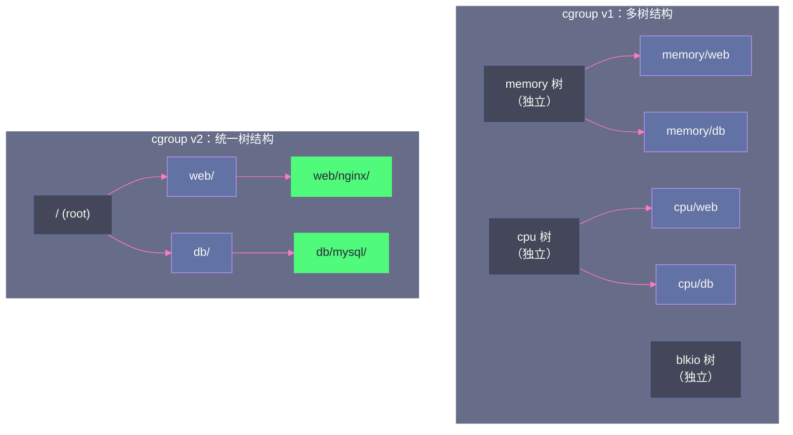
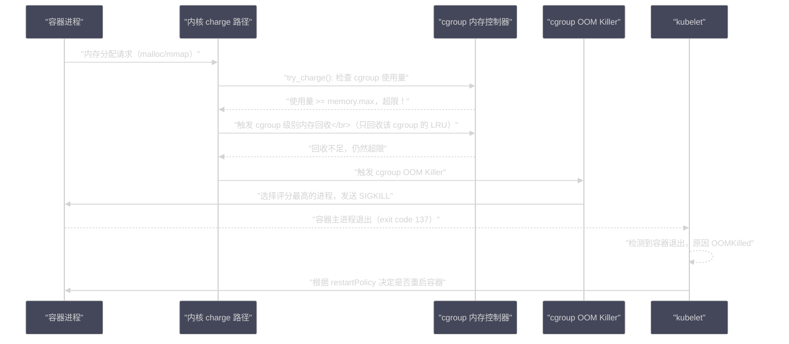

# CGroups 内存子系统：容器内存隔离的底层实现

**摘要：**

当你在 Kubernetes 中写下 `resources.limits.memory: 2Gi` 时，这个数字是如何真正约束容器内进程的内存使用的？答案就在 Linux **cgroup 内存子系统（Memory Controller）**。cgroup 是内核提供的资源隔离与管控框架，内存子系统是其中最复杂、与内存管理体系耦合最深的部分。本文从 cgroup 的层级结构出发，深入剖析 cgroup v1 与 v2 内存子系统的设计差异；重点解析 `memory.limit_in_bytes`（v1）/`memory.max`（v2）限制的内核实现路径——内核如何在每次内存分配时检查 cgroup 限制、触发 cgroup 级别的 OOM；深入分析 `memory.high`（软限制）机制如何实现"优先回收而非立即 OOM"的优雅降级；解析 Page Cache 的 cgroup 归属问题——为什么同一个文件的 Page Cache 可能被记账到多个 cgroup，以及 cgroup v2 的改进方案。最后给出 Kubernetes 内存限制的工程实践与常见误区。

---

## 第 1 章 cgroup 的基础架构

### 1.1 cgroup 是什么，解决什么问题

在多进程、多租户的 Linux 系统上，如果不加限制，任何一个进程（或一组进程）都可以无限制地消耗 CPU、内存、磁盘 I/O 等资源，影响同一主机上其他进程的正常运行。**cgroup（Control Group，控制组）**是 Linux 内核提供的资源隔离与管控机制，它把进程组织成树状层级结构，每个节点（cgroup）可以独立设置资源限制，内核在分配资源时强制执行这些限制。

cgroup 由 Google 工程师 Paul Menage 于 2006 年开发，2007 年合入 Linux 2.6.24。它是所有容器技术（Docker、containerd、LXC）的核心基础之一——容器的资源隔离（CPU、内存、网络带宽等）都通过 cgroup 实现。

cgroup 管理的资源类型：

| 子系统（Controller）| 管控内容 |
|-------------------|----|
| `memory` | 内存使用量（物理内存、Swap）|
| `cpu` / `cpuquota` | CPU 时间配额 |
| `blkio` / `io`（v2）| 块设备 I/O 带宽和 IOPS |
| `cpuset` | 绑定到特定 CPU 核心和 NUMA 节点 |
| `pids` | 进程数量限制 |
| `net_cls` | 网络流量分类 |

本文专注于 `memory` 子系统。

### 1.2 cgroup v1 与 v2 的架构差异

Linux 目前有两个版本的 cgroup 实现并存：

**cgroup v1（旧版，2.6.24~）**：每个子系统（memory、cpu、blkio 等）有独立的层级树，进程可以同时属于不同子系统的不同层级节点。这种"多棵树"的设计导致子系统间协调困难，实现复杂，出现了大量 edge case 和 bug。

**cgroup v2（统一层级，4.5~）**：所有子系统共享同一棵层级树，进程在所有子系统中有相同的层级位置。设计更清晰，解决了 v1 的很多一致性问题，是未来的主流方向。Linux 5.x 之后的大多数发行版（Ubuntu 22.04、RHEL 9、Debian 11+）默认使用 cgroup v2；但 Kubernetes 对 cgroup v2 的完整支持是从 1.25 版本开始的。

```bash
# 检查系统使用的 cgroup 版本
$ stat -f /sys/fs/cgroup/ | grep "Type"
# File system type: tmpfs → cgroup v1
# File system type: cgroup2fs → cgroup v2

# 或者
$ ls /sys/fs/cgroup/
# cgroup v1：能看到 memory、cpu、blkio 等子目录（各自是独立挂载点）
# cgroup v2：只有一个统一的目录结构
```



---

## 第 2 章 内存记账：内核如何追踪 cgroup 的内存使用

### 2.1 mem_cgroup：cgroup 内存账本

每个 cgroup 在内核中对应一个 `mem_cgroup` 结构体，它是 cgroup 内存记账的核心数据结构：

```c
/* include/linux/memcontrol.h（简化）*/
struct mem_cgroup {
    struct cgroup_subsys_state css;  /* cgroup 子系统通用头部 */

    /* 内存使用统计（per-CPU 计数器，避免锁竞争）*/
    struct memcg_vmstats_percpu __percpu *vmstats_percpu;

    /* 内存使用阈值与限制 */
    struct mem_cgroup_thresholds thresholds;   /* 使用量变化通知阈值 */

    /* v1 的硬限制（对应 memory.limit_in_bytes）*/
    unsigned long memory_usage;
    struct res_counter res;         /* 当前使用量 + 硬限制 */
    struct res_counter memsw;       /* memory+swap 使用量 + 限制 */

    /* v2 的限制（对应 memory.max / memory.high / memory.min）*/
    unsigned long memory_max;       /* 硬限制（超过触发 OOM）*/
    unsigned long memory_high;      /* 软限制（超过触发优先回收）*/
    unsigned long memory_min;       /* 最小保证（低于此不回收）*/
    unsigned long memory_low;       /* 低优先级保护 */

    /* LRU 链表：该 cgroup 的 LRU 向量（lruvec）*/
    struct lruvec lruvec;           /* per-cgroup 的 LRU 链表 */

    /* OOM 相关 */
    bool oom_lock;
    struct mem_cgroup *oom_group;
    /* ... */
};
```

每个物理页（`struct page`）通过 `page->mem_cgroup` 指针知道自己"属于"哪个 cgroup，实现精确的内存记账。

### 2.2 内存记账的时机：charge 与 uncharge

内核在物理页帧被分配给某个进程时，把它"记账（charge）"到该进程所属的 cgroup；当页帧被释放时，"取消记账（uncharge）"。

**charge 发生的时机**：
- **匿名页**：Page Fault 时分配物理页帧（`do_anonymous_page()` 或 `do_wp_page()` 中调用 `mem_cgroup_charge()`）
- **文件页（Page Cache）**：文件第一次被读入时（`add_to_page_cache_locked()` 中记账）
- **内核内存（kmem）**：`kmalloc`/`vmalloc` 分配时（需要开启 kmem accounting）

**uncharge 发生的时机**：
- 匿名页被释放（进程退出、`munmap()`、被 OOM 杀死后页帧回收）
- 文件页被从 Page Cache 驱逐（LRU 回收、`drop_caches`）
- 内核内存对象被释放

整个 charge/uncharge 路径是 cgroup 内存子系统对内核内存分配路径侵入的核心，任何分配路径都需要经过 cgroup 检查。

### 2.3 Page Cache 的 cgroup 归属问题

Page Cache 的 cgroup 归属是 v1 中最令人困惑的问题之一：**同一个文件的 Page Cache 页可能被记账到多个不同的 cgroup**。

设想这个场景：
- cgroup A 中的进程读取 `/data/bigfile`，file 的前 100MB 被加载到 Page Cache，记账到 cgroup A
- cgroup B 中的进程随后也读取同一个 `/data/bigfile`，内核发现 Page Cache 中已经有这个文件的数据（命中），不需要重新分配物理页——**但这些页的 `page->mem_cgroup` 仍然指向 cgroup A，cgroup B 不会被记账**

这就带来了一个不公平性：cgroup A 为共享的 Page Cache "承担了费用"，而 cgroup B "免费搭便车"。当 cgroup A 内存不足被 OOM 时，cgroup B 正在使用的共享文件缓存也会被回收，影响 cgroup B 的性能。

**cgroup v2 的改进**：引入了"文件页可以在 cgroup 间重新记账（remap）"的机制——当一个文件页的原始 cgroup 内存压力大需要回收时，如果另一个 cgroup 也在使用这个页，可以将记账转移，避免因为记账不公平导致的错误回收。

---

## 第 3 章 cgroup v1 内存子系统

### 3.1 关键接口文件

cgroup v1 的内存子系统通过 `/sys/fs/cgroup/memory/<cgroup_name>/` 目录下的文件进行配置和查看：

| 文件 | 说明 |
|------|------|
| `memory.limit_in_bytes` | 内存硬限制（不含 Swap），超过触发 cgroup OOM |
| `memory.memsw.limit_in_bytes` | 内存 + Swap 总限制 |
| `memory.soft_limit_in_bytes` | 软限制，内存不足时优先回收超出软限制的 cgroup |
| `memory.usage_in_bytes` | 当前内存使用量（只读，实时）|
| `memory.stat` | 详细内存统计信息 |
| `memory.oom_control` | OOM 控制（可禁用 OOM Killer，改为挂起进程）|
| `memory.swappiness` | 覆盖全局 swappiness，针对该 cgroup |
| `memory.use_hierarchy` | 是否启用层级记账（子 cgroup 的内存计入父 cgroup）|

### 3.2 硬限制（memory.limit_in_bytes）的内核路径

当进程触发内存分配（Page Fault、malloc 等）时，内核在 charge 路径上检查 cgroup 限制：

```c
/* mm/memcontrol.c（简化）*/
static int try_charge(struct mem_cgroup *memcg, gfp_t gfp_mask,
                      unsigned int nr_pages)
{
    unsigned long batch = max(CHARGE_BATCH, nr_pages);
    int ret = 0;
    
retry:
    /* 检查当前使用量 + 新分配量是否超过 limit_in_bytes */
    if (mem_cgroup_is_below_limit(memcg))
        goto done;
    
    /* 超过限制了，先尝试回收该 cgroup 的内存 */
    if (mem_cgroup_reclaim(memcg, gfp_mask, batch))
        goto retry;
    
    /* 回收后仍然超限，触发 cgroup 级别的 OOM */
    if (mem_cgroup_oom(memcg, gfp_mask, get_order(nr_pages * PAGE_SIZE)))
        goto retry;  /* OOM Killer 杀死了某个进程，重试 */
    
    ret = -ENOMEM;  /* 彻底失败 */
done:
    return ret;
}
```

整个 charge 路径是**同步的**：发起内存分配的进程会一直被阻塞，直到要么分配成功，要么 OOM 杀死了某个进程并释放了足够内存，要么彻底失败返回 ENOMEM。

这意味着，当容器内存接近 `memory.limit_in_bytes` 时，**即使系统整体还有大量空闲内存，容器内的进程也会触发内存回收和 cgroup OOM**——cgroup 内存限制是"相对于该 cgroup 的局部内存系统"，与全局物理内存无关。

### 3.3 cgroup 级别的内存回收

当 cgroup 内存使用量接近限制时，`mem_cgroup_reclaim()` 触发**针对该 cgroup 的内存回收**：

- 只扫描该 cgroup 的 LRU 链表（每个 cgroup 有自己的 `lruvec`），不影响其他 cgroup 的内存
- 优先回收该 cgroup 的干净文件页（Page Cache），然后回收脏页（写回磁盘），最后换出匿名页（Swap）
- 如果该 cgroup 的 `memory.swappiness` 设为 0，则不换出匿名页（即使系统全局 swappiness > 0）

### 3.4 memory.oom_control：禁用 OOM 改为挂起

默认情况下，cgroup 内存耗尽时会触发 OOM Killer 杀死进程。但某些场景下（如调试、或希望在内存不足时暂停而非杀死），可以通过 `memory.oom_control` 禁用 OOM Killer：

```bash
# 禁用该 cgroup 的 OOM Killer
echo 1 > /sys/fs/cgroup/memory/myapp/memory.oom_control

# 效果：当内存超限时，进程不会被 OOM 杀死，而是被挂起（D 状态）
# 直到有内存释放，进程才会恢复运行
# 可以通过 eventfd 接收 OOM 事件通知
```

> [!warning] 生产避坑
> 在生产环境**谨慎使用 `oom_control=1`（禁用 cgroup OOM）**。进程被挂起在 D 状态（不可中断睡眠）是非常危险的：进程持有的锁不会释放，可能导致整个服务死锁，甚至影响其他进程。同时 D 状态进程无法被 `kill -9` 终止，只能等待内存被释放或重启。Docker 的 `--oom-kill-disable` 标志就是基于此机制，通常不推荐在生产中使用。

---

## 第 4 章 cgroup v2 内存子系统：更完善的设计

### 4.1 v2 的新接口文件

cgroup v2 重新设计了内存控制接口，更加语义清晰：

| 文件 | 说明 | v1 对应 |
|------|------|---------|
| `memory.max` | 内存硬限制，超过触发 OOM | `memory.limit_in_bytes` |
| `memory.high` | 内存软上限，超过触发优先回收（但不 OOM）| `memory.soft_limit_in_bytes`（语义不同）|
| `memory.min` | 最低内存保证，低于此值时不参与回收 | 无 |
| `memory.low` | 低优先级保护，内存充足时不回收 | 无 |
| `memory.current` | 当前内存使用量（只读）| `memory.usage_in_bytes` |
| `memory.stat` | 详细统计（更丰富）| `memory.stat` |
| `memory.swap.max` | Swap 使用上限 | `memory.memsw.limit_in_bytes` - `memory.limit_in_bytes` |
| `memory.events` | 各类内存事件计数（OOM、high 触发等）| 无 |
| `memory.pressure` | 内存压力指标（PSI）| 无 |

### 4.2 四层内存保护体系：min、low、high、max

cgroup v2 引入了四层内存限制，形成了从"保护"到"限制"的完整语义体系：

```
                                    memory 使用量（递增）→
                                    
  ┌────────────────────────────────────────────────────────────────┐
  │  [min]     [low]           [high]                   [max]      │
  │   ↓          ↓               ↓                       ↓        │
  │  最低保证   软保护          软上限                  硬限制      │
  └────────────────────────────────────────────────────────────────┘
  
  使用量 < min：    全局内存回收时，不回收该 cgroup 的内存（强保护）
  min ≤ 使用量 < low：全局内存回收时，降低优先级（弱保护）
  low ≤ 使用量 < high：正常分配，无特殊处理
  high ≤ 使用量 < max：超出软上限，触发该进程的直接回收，但不 OOM
                         分配请求会被延迟，给回收争取时间
  使用量 ≥ max：   硬限制，触发 cgroup OOM
```

**`memory.high` 软上限**是 v2 最重要的新特性。它的设计目的是：**在内存使用超过预期但还没到灾难性程度时，通过惩罚性延迟触发进程自身的内存回收，而非直接 OOM**。这给了应用程序一个"缓冲区"——在突发流量导致内存使用暂时超出预期时，系统会减速而非崩溃。

`memory.high` 的内核实现：当内存使用量超过 `high` 时，内核在该进程的内存分配路径上额外引入一个**可调节的延迟**（`cgroup_memory_throttle()`），延迟时间与超出 `high` 的程度成正比。同时以**更高优先级**触发该 cgroup 的内存回收（`reclaim_high()`）。

```bash
# 配置示例：为某个容器配置软上限和硬限制
echo "1G" > /sys/fs/cgroup/myapp/memory.high   # 软上限 1GB
echo "1500M" > /sys/fs/cgroup/myapp/memory.max  # 硬限制 1.5GB
# 效果：使用量超过 1GB 时开始限速回收，超过 1.5GB 才 OOM
```

### 4.3 内存压力指标（PSI）

cgroup v2 引入了 **PSI（Pressure Stall Information）**，这是内核对内存（以及 CPU、I/O）压力的量化指标，解决了长期以来难以精确判断"系统有多缺内存"的问题：

```bash
# 查看某个 cgroup 的内存压力
$ cat /sys/fs/cgroup/myapp/memory.pressure
some avg10=2.34 avg60=1.23 avg300=0.45 total=12345678
full avg10=0.45 avg60=0.12 avg300=0.04 total=1234567

# some：至少有一个任务在等待内存的时间比例（%）
# full：所有可运行任务都在等待内存的时间比例（%）
# avg10/avg60/avg300：最近 10s/60s/300s 的平均值
```

- **`some avg10`**：最近 10 秒内，有多少比例的时间里至少有一个进程因为等待内存而被阻塞。这是内存压力的早期预警指标。
- **`full avg10`**：最近 10 秒内，有多少比例的时间里**所有进程**都在等待内存（完全停滞）。这是严重内存压力的指标，接近于直接回收/OOM。

PSI 的设计使得内存压力第一次有了可量化的指标，可以直接接入告警系统（如：`memory.pressure` 的 `some avg10 > 5%` 触发告警）。Facebook 将 PSI 引入内核（Linux 4.20），并在其数据中心中广泛使用 PSI 进行内存压力监控和负载均衡。

---

## 第 5 章 内存统计：memory.stat 详解

### 5.1 memory.stat 的关键字段

```bash
$ cat /sys/fs/cgroup/myapp/memory.stat
anon 1073741824          # 匿名内存（堆、栈）使用量：1GB
file 536870912           # 文件缓存（Page Cache）使用量：512MB
kernel_stack 8388608     # 内核栈使用量
pagetables 4194304       # 页表占用内存
percpu 2097152           # per-CPU 数据
sock 1048576             # Socket 缓冲区
shmem 0                  # 共享内存
file_mapped 268435456    # 文件映射到进程地址空间的部分（mmap 文件）
file_dirty 16777216      # 脏文件页（已修改但未写回磁盘）
file_writeback 8388608   # 正在写回磁盘的脏页
inactive_anon 268435456  # inactive 匿名页 LRU
active_anon 805306368    # active 匿名页 LRU
inactive_file 134217728  # inactive 文件页 LRU
active_file 402653184    # active 文件页 LRU
unevictable 0            # 不可回收页（mlock 锁定）
slab_reclaimable 67108864  # 可回收 Slab 缓存（dentry/inode）
slab_unreclaimable 16777216 # 不可回收 Slab 缓存

# v2 新增
pgfault 12345678         # Page Fault 次数（包括 minor fault）
pgmajfault 1234          # Major Page Fault 次数（涉及磁盘 I/O）
workingset_refault_anon 5678  # anon 页被回收后又换回的次数（反映回收过激）
workingset_refault_file 3456  # file 页被回收后又重新读入次数
oom_kill 2               # 该 cgroup 历史 OOM Killer 触发次数
```

### 5.2 从 memory.stat 诊断内存问题

`memory.stat` 是容器内存问题诊断的第一手资料，几个关键模式：

**模式一：`anon` 持续增长，`file` 很低**
匿名内存（堆）在持续增长，而文件缓存很少。提示：可能存在**内存泄漏**，堆内存没有被释放。检查应用是否有 GC 日志（JVM）或 valgrind 报告。

**模式二：`file_dirty` 持续很高**
大量脏页没有写回磁盘，可能是：写入速度超过了磁盘带宽（磁盘成为瓶颈），或者 `dirty_ratio` 设置过高。如果 `file_dirty` 接近 `memory.max`，会在某个时刻触发大量同步写回，导致延迟抖动。

**模式三：`workingset_refault_file` 持续很高**
文件页被回收后频繁重新读入，说明 cgroup 的内存限制**太紧**，导致频繁"驱逐-重新加载"同一批热点文件页，是严重的性能损耗信号（相当于 Page Cache 命中率极低）。应该考虑增加 `memory.max`。

**模式四：`pgmajfault` 持续很高**
Major Page Fault（需要磁盘 I/O 的缺页异常）频繁发生，说明内存严重不足，频繁 Swap 换入或文件页频繁从磁盘重载。

---

## 第 6 章 Kubernetes 内存限制的底层实现

### 6.1 Pod → cgroup 的映射关系

Kubernetes 通过 kubelet 为每个 Pod 和容器创建对应的 cgroup 层级：

```
cgroup 层级（以 cgroup v1 为例）：
/sys/fs/cgroup/memory/
├── kubepods/                          # 所有 Pod 的父 cgroup
│   ├── besteffort/                    # BestEffort QoS Pod
│   │   └── pod<pod-uid>/
│   │       └── <container-id>/
│   ├── burstable/                     # Burstable QoS Pod
│   │   └── pod<pod-uid>/
│   │       └── <container-id>/
│   └── guaranteed/                    # Guaranteed QoS Pod（静默处理，直接在 kubepods 下）
│       └── pod<pod-uid>/
│           └── <container-id>/
└── system.slice/                      # 系统进程（非 Kubernetes 管理）
```

每个容器的 `memory.limit_in_bytes` = Pod spec 中 `resources.limits.memory`。

kubelet 在创建容器时，通过 container runtime（containerd/Docker）将容器进程加入对应的 cgroup，并写入限制值。

### 6.2 requests 与 limits 在 cgroup 层面的体现

```yaml
resources:
  requests:
    memory: "512Mi"   # 调度用：保证节点有 512MB 可分配
  limits:
    memory: "1Gi"     # 执行用：触发 cgroup memory.limit_in_bytes = 1GB
```

`requests.memory`：**只影响调度**，kube-scheduler 根据它决定将 Pod 调度到哪个节点。在内核层面，`requests` 不设置任何 cgroup 限制。

`limits.memory`：**真正设置 cgroup 限制**，直接写入 `memory.limit_in_bytes`（v1）或 `memory.max`（v2）。

这个差异导致了一个常见的陷阱：**如果只设置 requests 不设置 limits，容器可以无限使用内存**（只受节点物理内存和全局 OOM Killer 约束）——这正是 BestEffort QoS 的行为。

### 6.3 容器 OOM 的完整流程

当容器内存使用量达到 `limits.memory` 时：



> [!info] 核心概念：cgroup OOM 与系统 OOM 的隔离
> cgroup OOM 发生时，系统其他 cgroup（其他容器）完全不受影响。OOM Killer 只在触发 OOM 的 cgroup 范围内选择受害进程，不会跨 cgroup 杀进程。这是容器资源隔离的重要保证。

### 6.4 Kubernetes 内存限制的常见误区

**误区一："limits.memory 是内存的全部上限"**

实际上，`limits.memory` 限制的是容器进程的内存总量（`rss + Page Cache`）。对于 Java 应用，JVM 堆（`-Xmx`）只是 RSS 的一部分，JVM 本身还有 Metaspace、Code Cache、Native 内存、JNI 等额外开销，通常比 `-Xmx` 多 20%~50%。

常见错误：Pod limits 设为 2GB，JVM `-Xmx` 也设为 2GB，结果容器频繁 OOMKilled。正确做法：`-Xmx` 设为 `limits.memory` 的 70%~80%，留出 JVM 元数据和操作系统 overhead 的空间。

```bash
# Java 应用的推荐内存配置（limits.memory=2Gi 为例）：
-Xms512m           # 初始堆：较小，减少启动时物理内存占用
-Xmx1400m          # 最大堆：limits.memory 的 70%
-XX:MaxMetaspaceSize=256m   # 限制 Metaspace
-XX:ReservedCodeCacheSize=256m  # 限制代码缓存
```

**误区二："container_memory_usage_bytes 等于 limits.memory 用量"**

Prometheus 的 `container_memory_usage_bytes` 指标包含了 Page Cache，可能会出现使用量接近或超过 limits 但容器未 OOM 的假象（因为 Page Cache 可以随时回收）。

更准确的指标是 `container_memory_working_set_bytes`（= RSS + 活跃 Page Cache，不含可回收的非活跃 Page Cache），它更接近内核触发 OOM 时的实际参考值。

**误区三："设置 limits.memory 就够了"**

在 cgroup v2 中，合理配置 `memory.high`（软上限）可以避免内存使用突然超过 `memory.max` 触发 OOM。Kubernetes 1.27+ 支持通过 `resources.requests.memory` 隐式设置 `memory.high`（= 1.25 × requests.memory），提供了更优雅的内存压力响应。

---

## 第 7 章 总结

cgroup 内存子系统是容器化基础设施内存隔离的核心基石，本文的核心认知：

**1. cgroup 内存记账嵌入每次内存分配路径**：每次 Page Fault 分配物理页帧时，内核都会通过 `try_charge()` 检查 cgroup 限制并记账。这套机制对应用完全透明，但增加了每次分配的轻微额外开销（约 1~5% CPU）。

**2. cgroup v2 的四层保护体系更完善**：`memory.min`（强保护）→ `memory.low`（弱保护）→ `memory.high`（软上限，优先回收）→ `memory.max`（硬限制，OOM）。合理配置软上限可以让系统在内存压力下优雅降级而非直接崩溃。

**3. Page Cache 的 cgroup 归属是 v1 的经典痛点**：同一文件的 Page Cache 只记账给第一个读取它的 cgroup，导致多容器共享数据时的记账不公平。v2 通过 remap 机制部分改善了这个问题。

**4. Kubernetes 内存限制的最佳实践**：
- `limits.memory` 是 cgroup `memory.max` 的直接映射，必须设置
- Java 应用的 `-Xmx` 必须预留 20%~30% 给 JVM 非堆内存
- 监控用 `container_memory_working_set_bytes` 而非 `container_memory_usage_bytes`
- 利用 PSI（`memory.pressure`）建立早期内存压力告警

至此，专栏的核心原理篇和高级特性篇均已完成。最后一篇[[内存性能分析与调优：从 free 到 perf 的工具链|第10篇]]将从工程实践角度，串联所有工具，建立一套系统化的 Linux 内存性能分析方法论。

---

## 参考资料

- Linux Kernel Documentation: [Memory Resource Controller (v1)](https://docs.kernel.org/admin-guide/cgroup-v1/memory.html)
- Linux Kernel Documentation: [Control Group v2](https://docs.kernel.org/admin-guide/cgroup-v2.html)
- Brendan Gregg, *Systems Performance, 2nd Ed.*, Chapter 7: Memory（cgroup section）
- Linux Kernel Source: `mm/memcontrol.c`
- Kubernetes Documentation: [Resource Management for Pods and Containers](https://kubernetes.io/docs/concepts/configuration/manage-resources-containers/)
- [Diagnosing Linux cgroups v2 Memory Throttling - Netdata](https://www.netdata.cloud/academy/diagnosing-linux-cgroups/)

---

> [!note] 思考题
> 1. CGroups v2 的 `memory.high`（软限制）超过时会'限流'内存分配。限流的具体机制是什么——是减缓 `brk()/mmap()` 的返回速度，还是增加 Page Fault 处理延迟？被限流的应用能感知到什么异常？
> 2. 容器内 `/proc/meminfo` 显示宿主机信息。Java 8u191+ 的 `-XX:+UseContainerSupport` 自动读取 CGroups 限制。Python、Node.js 等不感知 CGroups——如何在这些运行时中正确获取容器可用内存？LXCFS 的方案是什么？
> 3. Page Cache 被计入 CGroup 内存使用量。频繁读文件的容器可能因 Page Cache 膨胀触发 OOM Kill——即使 RSS 远低于限制。`memory.stat` 中的 `file` 和 `anon` 如何帮助区分？你如何避免这种'被 Page Cache 杀死'的问题？
