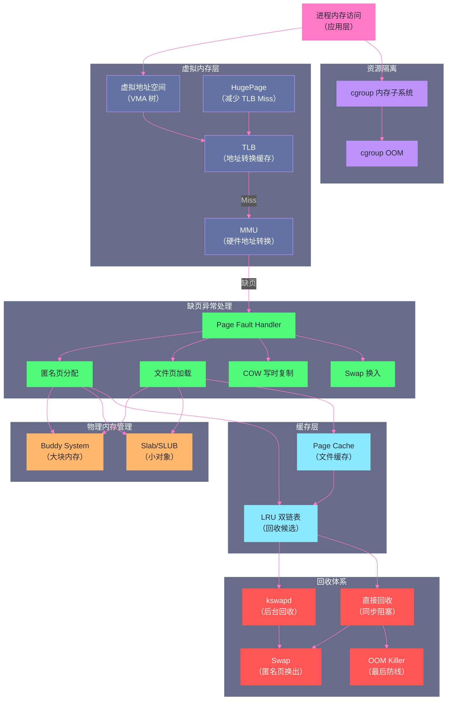

# 内存性能分析与调优：从 free 到 perf 的工具链

**摘要：**

经过前九篇的深度剖析，我们已经建立了 Linux 内存管理的完整知识体系：从[[虚拟内存：为什么每个进程都以为自己独占内存|虚拟内存]]、[[物理内存管理：Buddy System 与 Slab 分配器的设计哲学|物理内存管理]]、[[缺页异常：一次内存访问的完整旅程|缺页异常]]，到[[Page Cache：Linux 为什么要用内存来缓存磁盘|Page Cache]]、[[内存回收：kswapd、LRU与直接回收的博弈|内存回收]]、[[Swap机制：磁盘充当内存的代价与边界|Swap]]、[[OOM Killer：内存耗尽时内核如何做出生死抉败|OOM]]，再到[[大页内存 HugePage：TLB Miss的终极解法|HugePage]] 和 [[CGroups 内存子系统：容器内存隔离的底层实现|cgroup 内存隔离]]。本篇是方法论与工具链的收尾篇，聚焦于工程实践：**如何系统化地诊断一个内存问题**。我们会按照"从宏观到微观"的层次，依次介绍每个阶段的代表性工具（`free`/`vmstat`/`sar`/`smaps`/`perf`），并通过三个典型的生产故障场景（内存泄漏、Page Cache 抖动、Swap Thrashing）串联这些工具的使用方法，最后整理一份可直接落地的内核参数调优清单。

---

## 第 1 章 分析方法论：从"感觉慢"到"找到根因"

### 1.1 为什么需要方法论

内存问题在生产环境中的表现往往不是"内存不够用"这么直白。更常见的症状是：

- 服务响应时间 P99 偶发飙高（每隔几分钟出现一次延迟峰值）
- 系统整体变慢，但 CPU 不高，磁盘 I/O 也正常
- 某个进程内存占用随时间单调增长，慢慢逼近 OOM
- 容器频繁 OOMKilled，但改大 `limits.memory` 后问题依旧

这些症状背后可能对应完全不同的根因：TLB Miss 率高、直接回收频繁、内存泄漏、Page Cache 被错误驱逐、Swap 抖动……每种根因对应完全不同的解法。在没有系统化方法论指导下"凭感觉调参"，极可能调错方向，甚至适得其反。

### 1.2 四层分析框架

借鉴 Brendan Gregg 的 USE（Utilization-Saturation-Errors）方法论，结合 Linux 内存的特点，可以将内存分析分为四个层次，从粗到细逐层递进：

```
第一层：系统内存全局视图（分钟级）
    工具：free、/proc/meminfo、vmstat
    问题：总内存多少？被什么用了？Swap 有没有活动？

第二层：内存压力与回收活动（秒级）
    工具：vmstat、sar -B、/proc/vmstat
    问题：直接回收在发生吗？kswapd 有多忙？Page Cache 命中率如何？

第三层：进程级内存画像（进程维度）
    工具：/proc/pid/smaps、pmap、ps aux
    问题：哪个进程占用最多？RSS 和 VSZ 分别是多少？有没有异常增长？

第四层：内存访问热点（指令级）
    工具：perf mem、perf stat、valgrind、eBPF（bcc/bpftrace）
    问题：TLB Miss 率是多少？哪个函数触发了最多 Page Fault？内存泄漏在哪里？
```

大多数生产问题在第一层或第二层就可以定位根因，只有性能优化类问题才需要深入到第三、四层。

---

## 第 2 章 第一层：系统内存全局视图

### 2.1 free 命令：内存使用的快照

`free` 是最常用的内存概览工具，但它的输出经常被误读：

```bash
$ free -h
              total        used        free      shared  buff/cache   available
Mem:          125.8G       78.3G        2.1G      567.4M       45.4G       46.8G
Swap:           7.8G      512.0M        7.3G
```

**关键字段解读**：

- **`total`**：物理内存总量（固定不变）
- **`used`**：= total - free - buff/cache，即不可回收的内存使用量（进程 RSS + 内核结构）
- **`free`**：完全空闲的内存（没有任何用途）
- **`buff/cache`**：Buffer（块设备 I/O 缓冲）+ Page Cache 使用量。这部分内存**可以被回收**，当进程需要内存时内核会主动释放它
- **`available`**：**真正可用的内存估算**，= free + 可回收的 buff/cache 部分。这才是判断"系统还有多少内存可用"的正确字段

> [!warning] 生产避坑
> 不要用 `free` 这一列来判断系统是否"内存不足"。`free = 2.1GB` 不代表只有 2.1GB 可用——`available = 46.8GB` 才是准确的可用量，包含了可以回收的 Page Cache。很多监控系统错误地用 `free / total` 计算内存使用率并报警，导致大量误报。正确的内存使用率应该是 `(total - available) / total`。

### 2.2 /proc/meminfo：最全面的内存统计

`/proc/meminfo` 是 `free` 命令的数据来源，包含更丰富的字段：

```bash
$ cat /proc/meminfo
MemTotal:       131893248 kB  # 总物理内存
MemFree:          2156832 kB  # 完全空闲
MemAvailable:    47891456 kB  # 真实可用（包含可回收部分）
Buffers:           512000 kB  # 块设备 I/O 缓冲（元数据）
Cached:          43876352 kB  # Page Cache（文件内容缓存）
SwapCached:        46592 kB   # 已换出又换回、swap slot 仍保留的页（> 0 说明有 swap 活动）
Active:          82345678 kB  # active LRU 链表总量（活跃页，回收优先级低）
Inactive:        32456789 kB  # inactive LRU 链表总量（冷页，回收候选）
Active(anon):    56789012 kB  # active 匿名页（堆、栈）
Inactive(anon):  12345678 kB  # inactive 匿名页（换出候选）
Active(file):    25556666 kB  # active 文件页（活跃 Page Cache）
Inactive(file):  20111111 kB  # inactive 文件页（回收候选 Page Cache）
Unevictable:           0 kB   # 不可回收页（mlock 锁定）
Mlocked:               0 kB   # mlocked 的页
SwapTotal:       8191996 kB   # Swap 空间总量
SwapFree:        7667148 kB   # Swap 剩余量（SwapTotal - SwapFree = 已使用）
Dirty:             16384 kB   # 脏页（已修改未写回）
Writeback:          4096 kB   # 正在写回磁盘的脏页
AnonPages:       67890123 kB  # 匿名页总量（RSS 中的匿名部分）
Mapped:          13456789 kB  # mmap 映射的文件页（可执行文件、库、mmap 文件）
Shmem:            580608 kB   # 共享内存（tmpfs、IPC shm）
KReclaimable:   12345678 kB   # 内核可回收内存（SReclaimable 的超集）
Slab:            3456789 kB   # Slab 分配器总占用
SReclaimable:    2345678 kB   # 可回收 Slab（dentry、inode 等，内存压力时会释放）
SUnreclaim:      1111111 kB   # 不可回收 Slab（内核核心结构）
KernelStack:       98765 kB   # 内核栈（每个线程 8KB~16KB）
PageTables:       345678 kB   # 页表占用内存（进程多时可能很大）
CommitLimit:    73800000 kB   # overcommit_memory=2 时的最大可提交内存
Committed_AS:   89567890 kB   # 当前所有进程已承诺使用的内存总量（虚拟地址空间）
VmallocTotal:   34359738367 kB  # vmalloc 地址空间总大小
VmallocUsed:      123456 kB   # vmalloc 实际使用量
HugePages_Total:    2048      # 显式大页总数
HugePages_Free:     1024      # 空闲显式大页
AnonHugePages:    8388608 kB  # THP 使用量（匿名透明大页）
```

**快速诊断检查清单**：

| 检查项 | 正常状态 | 告警状态 |
|--------|---------|---------|
| `MemAvailable` | > 总内存的 10% | < 总内存的 5% |
| `SwapCached` | = 0 或极小 | 持续增大 |
| `Dirty` | < 总内存的 5% | > 10% 且持续增长 |
| `SReclaimable` | < 总内存的 20% | > 40%（大量 dentry/inode 缓存堆积）|
| `Committed_AS` | < `CommitLimit` | > `CommitLimit`（超额分配风险高）|
| `Inactive(anon)` | 与业务匹配 | 持续增大（有内存泄漏或换出候选）|

---

## 第 3 章 第二层：内存压力与回收活动

### 3.1 vmstat：内存回收活动的实时监控

`vmstat` 是诊断内存回收活动最直接的工具，每秒输出一行统计：

```bash
$ vmstat 1
procs -----------memory---------- ---swap-- -----io---- -system-- ------cpu-----
 r  b   swpd   free   buff  cache   si   so    bi    bo   in   cs us sy id wa st
 2  0      0 2156832 512000 43876352  0    0     0   123 1234 5678  5  2 93  0  0
 1  0      0 2145678 512000 43890000  0    0     0    45 1289 5890  6  2 92  0  0
 3  1  46592 1234567 512000 43900000  0  128   234   890 2345 6789 12  8 75  5  0
 5  2 524288  456789 512000 43456789 512  256  1024  1234 4567 8901 15 18 52 15  0
```

**关键列解读**：

- **`b`（blocked）**：在不可中断睡眠（D 状态）的进程数，> 0 说明有进程在等待 I/O（可能是直接回收中的脏页写回，或 Swap 换入）
- **`swpd`**：Swap 使用量（KB），增大说明有换出发生
- **`si`（swap in）**：每秒从 Swap 换入的 KB，持续 > 0 是 Swap 活跃的直接信号
- **`so`（swap out）**：每秒换出到 Swap 的 KB，持续 > 0 说明内存持续不足
- **`bi`（block in）**：每秒从块设备读取的 KB，Swap 换入和 Page Cache Miss 都会增大这个值
- **`wa`（iowait）**：CPU 等待 I/O 的比例，高 wa + 高 si/so = Swap Thrashing

上面示例的第 3、4 行是值得警惕的状态：`swpd` 开始增大（46592 → 524288），`so` 出现，`wa` 从 0 增到 15%，`b` 进程数增加——这是 Swap Thrashing 的初期症状。

### 3.2 sar -B：页面级内存活动统计

`sar -B` 提供每秒的页面扫描、回收统计，是判断直接回收是否发生的最直接工具：

```bash
$ sar -B 1 10
09:00:01     pgpgin/s pgpgout/s   fault/s  majflt/s  pgfree/s pgscank/s pgscand/s pgsteal/s    %vmeff
09:00:02      1234.56   567.89  34567.89      0.00  45678.90  12345.00      0.00  12300.00     99.63
09:00:03       234.56  4567.89  23456.78      5.67  34567.89  23456.00    890.00  23000.00     87.45
09:00:04        45.67  9876.54  45678.90     67.89  23456.78  45678.00   5678.00  44000.00     75.12
```

**关键列解读**：

- **`pgscank/s`**：kswapd 每秒扫描的页数——后台异步回收，正常现象
- **`pgscand/s`**：直接回收（Direct Reclaim）每秒扫描的页数——**持续 > 0 是严重告警**，说明应用进程本身正被迫参与内存回收，延迟抖动必然存在
- **`pgsteal/s`**：每秒实际回收（steal/reclaim）的页数
- **`%vmeff`**：回收效率（pgsteal / pgscank+pgscand），越高说明扫描的页越容易被回收；低值说明大量活跃页被扫描但无法回收，内核在"无效空转"
- **`majflt/s`**：每秒 Major Page Fault 次数（涉及磁盘 I/O 的缺页异常），持续 > 0 说明内存不足导致频繁换入或文件页重载

上面示例第 4 行：`pgscand=5678`（直接回收激活）+ `majflt=67.89`（Major Fault 频繁）+ `%vmeff=75.12`（回收效率下降）——系统已经处于严重内存压力状态。

### 3.3 /proc/vmstat：内核内存事件的完整计数器

`/proc/vmstat` 是内核所有内存相关事件的累积计数器，可以用 `watch -d cat /proc/vmstat` 持续观察变化量：

```bash
$ cat /proc/vmstat | grep -E "pgfault|pgmajfault|pgscan|pgsteal|swap|thp"
pgfault           123456789    # 总 Page Fault 次数（包括 minor）
pgmajfault           12345    # Major Page Fault 次数（磁盘 I/O）
pgscan_kswapd     1234567    # kswapd 扫描的页总数
pgscan_direct      123456    # 直接回收扫描的页总数（> 0 是问题）
pgscan_direct_throttle  1234 # 直接回收被限速的次数
pgsteal_kswapd    1200000    # kswapd 回收的页总数
pgsteal_direct     120000    # 直接回收回收的页总数
swap_ra               123    # Swap 预读次数
swap_ra_hit             45   # Swap 预读命中次数
thp_fault_alloc       5678   # THP 分配成功次数（直接在 fault 时分配大页）
thp_collapse_alloc    1234   # khugepaged 合并成功次数
thp_split_page         456   # 大页被拆分次数
thp_fault_fallback    2345   # 想分配 THP 但退回 4KB（内存碎片化）
```

`pgscan_direct` 是诊断直接回收最精准的指标，在监控系统（Prometheus node_exporter）中对应 `node_vmstat_pgscan_direct`。

---

## 第 4 章 第三层：进程级内存画像

### 4.1 理解 VSZ vs RSS vs PSS vs USS

分析进程内存时，必须清楚四个内存度量指标的区别：

| 指标 | 全称 | 含义 | 特点 |
|------|------|------|------|
| **VSZ** | Virtual Size | 进程虚拟地址空间大小 | 包含未分配物理页的部分，通常虚高，不代表实际内存消耗 |
| **RSS** | Resident Set Size | 当前驻留在物理内存的页总量 | 包含与其他进程共享的库，多进程时会重复计算 |
| **PSS** | Proportional Set Size | RSS 按共享比例分摊 | 共享库按"共享进程数"均摊，更准确反映进程实际消耗 |
| **USS** | Unique Set Size | 只属于该进程的页量 | 排除所有共享部分，是进程独占内存的精确值 |

**使用原则**：
- 排查内存泄漏：关注 **USS**（只计算独占页，排除共享库噪音）
- 评估进程内存成本：关注 **PSS**（合理分摊共享内存）
- 判断 OOM 压力：关注 **RSS**（这是内核 OOM 评分的基础）
- 容器内存监控：关注 **working_set**（active RSS，即 RSS 中非可回收部分）

### 4.2 /proc/pid/smaps：进程内存映射的完整画像

`/proc/<pid>/smaps` 是分析进程内存最详细的文件，每个 VMA（虚拟内存区域）都有独立的详细统计：

```bash
$ cat /proc/$(pgrep java)/smaps | head -50
7f8a00000000-7f8b00000000 rw-p 00000000 00:00 0          [heap segment]
Size:            1048576 kB  # VMA 虚拟地址空间大小
KernelPageSize:       4 kB   # 内核页大小（4KB 普通页）
MMUPageSize:          4 kB   
Rss:              524288 kB  # 实际驻留物理内存
Pss:              524288 kB  # 按共享比例分摊的内存（私有内存 Pss == Rss）
Shared_Clean:          0 kB  # 共享且干净的页（可丢弃）
Shared_Dirty:          0 kB  # 共享且脏的页（需要写回）
Private_Clean:         0 kB  # 私有且干净的页（如 mmap 文件的干净副本）
Private_Dirty:    524288 kB  # 私有且脏的页（堆内存的主体）
Referenced:       456789 kB  # 最近被访问的页（LRU 活跃页）
Anonymous:        524288 kB  # 匿名页（堆内存）
LazyFree:              0 kB  # MADV_FREE 标记的页
AnonHugePages:    262144 kB  # THP 使用量（2MB 大页）
ShmemPmdMapped:        0 kB
Shared_Hugetlb:        0 kB
Private_Hugetlb:       0 kB
Swap:              16384 kB  # 已换出到 Swap 的页（!= 0 说明该 VMA 有换出）
SwapPss:           16384 kB
Locked:                0 kB  # mlock 锁定的页
```

**从 smaps 提取关键统计**：

```bash
# 计算进程的 RSS、PSS、USS
$ python3 -c "
import sys, re
rss = pss = uss = 0
for line in open('/proc/' + sys.argv[1] + '/smaps'):
    m = re.match(r'(Rss|Pss|Private_Clean|Private_Dirty):\s+(\d+)', line)
    if m:
        v = int(m.group(2))
        if m.group(1) == 'Rss': rss += v
        elif m.group(1) == 'Pss': pss += v
        elif m.group(1) in ('Private_Clean', 'Private_Dirty'): uss += v
print(f'RSS={rss//1024}MB PSS={pss//1024}MB USS={uss//1024}MB')
" $(pgrep java)
# RSS=8192MB PSS=7654MB USS=7200MB

# 找出哪个 VMA 换出最多（Swap > 0 的 VMA）
$ awk '/^[0-9a-f]/{vma=$0} /^Swap:/{if($2>0) print $2" kB -> "vma}' \
    /proc/$(pgrep java)/smaps | sort -n -r | head -10
```

### 4.3 pmap：快速查看进程内存映射

`pmap` 是 smaps 的友好版本，适合快速了解进程内存结构：

```bash
$ pmap -x $(pgrep java) | sort -n -k 3 | tail -20
Address           Kbytes     RSS   Dirty Mode  Mapping
00007f8a00000000 1048576  524288  524288 rw--- [anon]  ← JVM 堆（最大的匿名映射）
00007f7a00000000  524288  234567  234567 rw--- [anon]  ← JVM Metaspace
00007f9000000000  262144  123456  123456 rw--- [anon]  ← JVM CodeCache
...
00007f1234560000   12345    5678    4567 r-x-- libjvm.so  ← JVM 共享库（代码只读，共享）
----------------  ------  ------  ------
total kB        10485760 8234567 6789012

# -x：显示 RSS、Dirty 等详细信息
```

### 4.4 诊断内存泄漏：趋势监控 + smaps 对比

内存泄漏的特征是进程 RSS/USS 单调增长，不随业务量波动回落。诊断步骤：

```bash
# 步骤一：确认是否存在内存泄漏（监控 RSS 趋势）
$ while true; do
    echo "$(date) RSS: $(grep VmRSS /proc/$(pgrep java)/status | awk '{print $2}') kB"
    sleep 60
done
# 如果输出值单调递增且无回落，大概率内存泄漏

# 步骤二：定位泄漏的内存类型（smaps 快照对比）
$ cat /proc/$(pgrep java)/smaps > smaps_before.txt
# 等待一段时间后（让泄漏积累）
$ cat /proc/$(pgrep java)/smaps > smaps_after.txt
$ diff smaps_before.txt smaps_after.txt | grep -A 5 "^<"
# 对比找出哪个 VMA 的 Rss 增长最多

# 步骤三：对于 JVM 应用，使用 JVM 内存分析工具
$ jmap -heap $(pgrep java)   # 查看堆内存使用分布
$ jmap -histo $(pgrep java) | head -30  # 查看对象数量排行
# 或触发 heap dump
$ jmap -dump:format=b,file=/tmp/heap.hprof $(pgrep java)
# 然后用 MAT（Eclipse Memory Analyzer Tool）分析
```

---

## 第 5 章 第四层：内存访问热点分析

### 5.1 perf stat：TLB Miss 率的量化

`perf stat` 可以精确量化 TLB Miss 率，是评估是否需要开启 HugePage 的最直接依据：

```bash
# 测量进程的 TLB 访问统计
$ perf stat -e dTLB-load-misses,dTLB-loads,iTLB-load-misses,iTLB-loads \
    -p $(pgrep java) -- sleep 30

Performance counter stats for process id '12345':

    12,345,678      dTLB-load-misses    #   12.34% of all dTLB cache accesses
   100,000,000      dTLB-loads
       567,890      iTLB-load-misses    #    5.68% of all iTLB cache accesses
    10,000,000      iTLB-loads

# dTLB-load-misses 12.34%：每 8 次内存访问就有 1 次 TLB Miss，性能损耗严重
# 开启 HugePage 后，这个比率通常可以降低到 1%~2%
```

**TLB Miss 率的诊断阈值**：
- **< 1%**：TLB 效率很好，不需要 HugePage
- **1%~5%**：可以考虑开启 THP 或显式大页
- **> 5%**：强烈建议开启大页，TLB Miss 是明显的性能瓶颈

### 5.2 perf mem：内存访问延迟分析

`perf mem` 可以采样内存访问操作，分析各种缓存层次的命中率和延迟：

```bash
# 记录内存访问样本（采样 10 秒）
$ perf mem record -p $(pgrep java) -- sleep 10

# 分析内存访问延迟分布
$ perf mem report --sort=mem
# 输出按内存层次分类的访问比例：
# L1 hit（4 cycles）：70%
# L2 hit（12 cycles）：15%
# L3 hit（40 cycles）：10%
# RAM（200 cycles）：4%
# Remote RAM（跨 NUMA，300+ cycles）：1%

# 找出延迟最高的内存访问代码路径
$ perf mem report --sort=symbol,mem | head -30
```

### 5.3 perf record + flamegraph：Page Fault 来自哪里

Page Fault 频繁时，用 flame graph 可以直观定位是哪个函数触发了大量 Page Fault：

```bash
# 采样 Page Fault 事件（软件事件）
$ perf record -e page-faults -g -p $(pgrep java) -- sleep 30

# 生成 flame graph
$ perf script | ./stackcollapse-perf.pl | ./flamegraph.pl > pagefault_flamegraph.svg

# 查看 Major Page Fault 来自哪里
$ perf record -e major-faults -g -p $(pgrep java) -- sleep 30
$ perf report --sort=symbol | head -30
```

### 5.4 eBPF（bpftrace）：无侵入内存事件追踪

对于生产环境中不方便停服的系统，eBPF 提供了低开销、无侵入的内存事件追踪能力：

```bash
# 追踪触发直接回收的进程调用栈
$ bpftrace -e '
kprobe:try_to_free_pages {
    printf("Direct reclaim triggered by: %s (pid %d)\n", comm, pid);
    print(kstack);
}
'

# 统计每个进程每秒的 Page Fault 次数
$ bpftrace -e '
software:page-faults:1 {
    @faults[comm] = count();
}
interval:s:5 {
    print(@faults);
    clear(@faults);
}
'

# 追踪 OOM Killer 事件
$ bpftrace -e '
kprobe:oom_kill_process {
    printf("OOM Kill: victim=%s (pid %d), trigger=%s (pid %d)\n",
           str(((struct task_struct *)arg1)->comm),
           ((struct task_struct *)arg1)->pid,
           comm, pid);
}
'

# 追踪 slab 内存分配（找内存泄漏）
$ bpftrace -e '
kretprobe:kmalloc {
    @allocs[retval] = kstack;
}
kprobe:kfree {
    delete(@allocs[arg0]);
}
END {
    print("Leaked allocations:");
    print(@allocs);
}
'
```

---

## 第 6 章 三个典型故障场景

### 6.1 场景一：服务延迟 P99 偶发飙高

**症状**：Web 服务正常 P99 < 10ms，但每隔 5~10 分钟出现一次延迟峰值（P99 > 500ms），持续约 30 秒后恢复。

**分析步骤**：

```bash
# 第一步：确认是内存问题还是 CPU/IO 问题
$ vmstat 1
# 观察延迟峰值时刻的 b（blocked 进程）、wa（iowait）、so（swap out）

# 第二步：排查直接回收
$ sar -B 1
# 重点看 pgscand/s（直接回收）是否在峰值时刻飙高

# 第三步：如果 pgscand 很低，排查 THP 合并抖动
$ grep thp_collapse_alloc /proc/vmstat
# 在峰值前后对比 thp_collapse_alloc 的增量
# 如果与峰值时刻相关，尝试 echo madvise > /sys/kernel/mm/transparent_hugepage/enabled

# 第四步：排查 kswapd 过于激进
$ grep kswapd /proc/*/status 2>/dev/null | grep -v "0 0"
$ cat /proc/$(pgrep kswapd0)/schedstat
# 查看 kswapd 的 CPU 使用量

# 第五步：如果是 Java 服务，排查 GC + THP 的 COW 问题
$ jstat -gcutil $(pgrep java) 1000
# 观察 GC 时间是否与延迟峰值吻合
# 如果 Full GC 时间与峰值完全吻合，可能不是内存问题而是 GC 问题
```

**常见根因与解法**：
- **直接回收**：增大 `min_free_kbytes`，或增加物理内存
- **THP 合并/拆分**：改为 `madvise` 模式，由应用精确控制大页区域
- **kswapd 过激**：检查 `vm.vfs_cache_pressure`，适当降低
- **GC + THP COW 放大**：JVM 服务用 `-XX:+UseTransparentHugePages`（Java 11+）精确控制 THP 区域

### 6.2 场景二：容器频繁 OOMKilled

**症状**：Kubernetes Pod 频繁以 exit code 137 + OOMKilled 原因重启，调大 `limits.memory` 后一段时间问题又复现。

**分析步骤**：

```bash
# 第一步：确认是真正的内存泄漏还是合法的内存增长
$ kubectl top pod <pod-name> --containers
# 观察内存使用趋势：是单调增长（泄漏）还是随请求量波动（合法）

# 第二步：分析内存组成
# 进入容器内部（或通过 exec 分析 smaps）
$ kubectl exec -it <pod-name> -- cat /proc/1/smaps | \
  awk '/^Anonymous/{sum+=$2} END{print "Anonymous:",sum/1024,"MB"}'

# 第三步：对比 limits.memory 与实际使用量的关系
$ kubectl describe pod <pod-name> | grep -A 5 "Limits"
# 查看 OOMKilled 前的内存使用峰值

# 第四步：查看是否是 Page Cache 导致的假性 OOM
$ kubectl exec -it <pod-name> -- cat /sys/fs/cgroup/memory/memory.stat | \
  grep -E "cache|rss|file"
# 如果 cache 占比高（> 50% of limit），可能是 Page Cache 超限而非真正的内存泄漏
# Page Cache 应该会被自动回收，但在某些情况下（如脏页积压）可能不够及时

# 第五步：对于 JVM 服务
$ kubectl exec -it <pod-name> -- jmap -heap 1 2>/dev/null
# 查看堆使用情况，评估 -Xmx 是否留出了足够的非堆 overhead
```

**常见根因与解法**：
- **JVM 非堆内存未考虑**：`limits.memory` 必须 = `-Xmx` + 非堆（Metaspace + CodeCache + Native）+ 操作系统开销。通常设置 `limits.memory` = `Xmx × 1.5`
- **真正的内存泄漏**：用 JVM heap dump 分析（JVM），或 valgrind（C/C++），或 memory_profiler（Python）定位泄漏点
- **脏页积压导致 Page Cache 无法及时回收**：调整 `vm.dirty_ratio`/`vm.dirty_background_ratio`，或增加磁盘写带宽

### 6.3 场景三：系统整体变慢（Swap Thrashing）

**症状**：服务器整体响应非常缓慢，CPU 不高但 iowait 很高，所有进程响应都变慢，不是单个应用问题。

**分析步骤**：

```bash
# 第一步：确认是 Swap Thrashing
$ vmstat 1
# si > 100 KB/s + so > 0 + wa > 20% = Swap Thrashing 确认

# 第二步：找出占用最多 Swap 的进程
$ for pid in /proc/[0-9]*; do
    swap=$(grep VmSwap $pid/status 2>/dev/null | awk '{print $2}')
    rss=$(grep VmRSS $pid/status 2>/dev/null | awk '{print $2}')
    comm=$(cat $pid/comm 2>/dev/null)
    if [ ! -z "$swap" ] && [ "$swap" -gt "0" ]; then
        echo "$swap kB swap, $rss kB RSS - $comm (${pid##*/})"
    fi
  done | sort -n -r | head -20

# 第三步：应急措施（如果系统可以接受短暂影响）
# 手动释放 Page Cache（减少 Page Cache 占用，间接减轻 Swap 压力）
$ sync; echo 3 > /proc/sys/vm/drop_caches

# 第四步：如果有明确的"不重要进程"大量占用内存
# 临时调高其 oom_score_adj，让 OOM Killer 下次优先杀它
$ echo 500 > /proc/$(pgrep batch_job)/oom_score_adj

# 第五步：评估长期方案
# - 增加物理内存（根本解法）
# - 降低 swappiness，减少匿名页换出
# - 用 zram 替代磁盘 Swap，减少换入/换出的 I/O 代价
```

---

## 第 7 章 内核参数调优速查表

以下是生产环境中最常用的内存相关内核参数，按优先级排序：

| 参数 | 默认值 | 推荐值 | 作用 |
|------|--------|--------|------|
| `vm.min_free_kbytes` | 自动计算 | 总内存 × 0.5%~1% | 提高水位线，减少直接回收 |
| `vm.swappiness` | 60 | 数据库/Redis: 1；JVM: 10~30；通用: 30~60 | 控制匿名页 vs 文件页回收比例 |
| `vm.vfs_cache_pressure` | 100 | 文件服务器: 50；内存紧张系统: 200 | 控制 dentry/inode Slab 回收力度 |
| `vm.dirty_ratio` | 20 | 10~15 | 脏页占总内存比例上限（超出触发同步回写）|
| `vm.dirty_background_ratio` | 10 | 3~5 | 触发后台回写的脏页比例（越小越积极回写）|
| `vm.dirty_expire_centisecs` | 3000 | 1500~3000 | 脏页最大存活时间（0.01秒）|
| `vm.dirty_writeback_centisecs` | 500 | 100~500 | 回写线程唤醒间隔（0.01秒）|
| `vm.overcommit_memory` | 0 | 生产服务: 0；高可靠: 2 | 内存超额分配策略 |
| `vm.zone_reclaim_mode` | 0 | 0（通用）；1（NUMA 敏感应用）| NUMA 系统下的跨节点分配策略 |
| `kernel.numa_balancing` | 1 | 0（关闭，如果 NUMA 拓扑已手工优化）| NUMA 自动平衡 |
| `vm.max_map_count` | 65530 | Java: 262144~1048576 | 进程最大 VMA 数量（Java 应用常需要调大）|

**永久生效配置**（写入 `/etc/sysctl.conf` 或 `/etc/sysctl.d/99-memory.conf`）：

```ini
# 基础配置（适用于大多数服务器）
vm.min_free_kbytes = 524288      # 512MB，减少直接回收
vm.swappiness = 10               # 适度减少 Swap 使用
vm.dirty_ratio = 10              # 及时写回脏页
vm.dirty_background_ratio = 3   # 更积极的后台回写
vm.vfs_cache_pressure = 100     # 保持默认

# 针对数据库服务器的额外配置
vm.swappiness = 1               # 几乎不 Swap
vm.overcommit_memory = 0        # 启发式超额分配

# 生效命令
sysctl -p /etc/sysctl.d/99-memory.conf
```

---

## 第 8 章 总结：Linux 内存管理的全局视图

历经十篇，Linux 内存管理的核心体系已经全部覆盖。用一张图来呈现整个专栏的知识拓扑：



**专栏的核心主线**，从上到下是一次完整的内存访问旅程：

1. 进程发出内存访问（应用层）
2. **虚拟地址** → TLB → MMU → 物理地址（[[虚拟内存：为什么每个进程都以为自己独占内存|第01篇]]）
3. 如果物理页不存在，触发 **Page Fault**（[[缺页异常：一次内存访问的完整旅程|第03篇]]）
4. Page Fault 从 **伙伴系统/Slab** 分配物理页帧（[[物理内存管理：Buddy System 与 Slab 分配器的设计哲学|第02篇]]）
5. 文件访问经过 **Page Cache**（[[Page Cache：Linux 为什么要用内存来缓存磁盘|第04篇]]）
6. 物理页进入 **LRU 链表**，成为回收候选
7. 内存不足时，**kswapd/直接回收** 启动（[[内存回收：kswapd、LRU与直接回收的博弈|第05篇]]）
8. 回收不足则 **Swap 换出**（[[Swap机制：磁盘充当内存的代价与边界|第06篇]]），最终 **OOM Killer** 兜底（[[OOM Killer：内存耗尽时内核如何做出生死抉择|第07篇]]）
9. **HugePage** 是减少 TLB Miss 的性能优化（[[大页内存 HugePage：TLB Miss的终极解法|第08篇]]）
10. **cgroup** 在每个环节注入资源限制（[[CGroups 内存子系统：容器内存隔离的底层实现|第09篇]]）
11. 工具链串联所有层次，提供可观测性（本篇）

至此，Linux 内存管理专栏全部完成。希望这套知识体系能帮助你在面对内存问题时，不再靠直觉猜测，而是能够**系统化地定位问题、有依据地调整参数、有预见性地设计容量**。

---

## 参考资料

- Brendan Gregg, *Systems Performance, 2nd Ed.*, Chapters 7 & 12（Memory & Observability）
- Brendan Gregg, *BPF Performance Tools*, Chapter 7: Memory
- [Memory Flame Graphs - Brendan Gregg](https://www.brendangregg.com/FlameGraphs/memoryflamegraphs.html)
- [Linux Performance Analysis - Brendan Gregg](https://slideshare.net/brendangregg/linux-performance-analysis-and-tools)
- Linux `man` pages: `free(1)`, `vmstat(8)`, `sar(1)`, `pmap(1)`, `perf-mem(1)`
- Linux `/proc` Documentation: `Documentation/filesystems/proc.rst`
