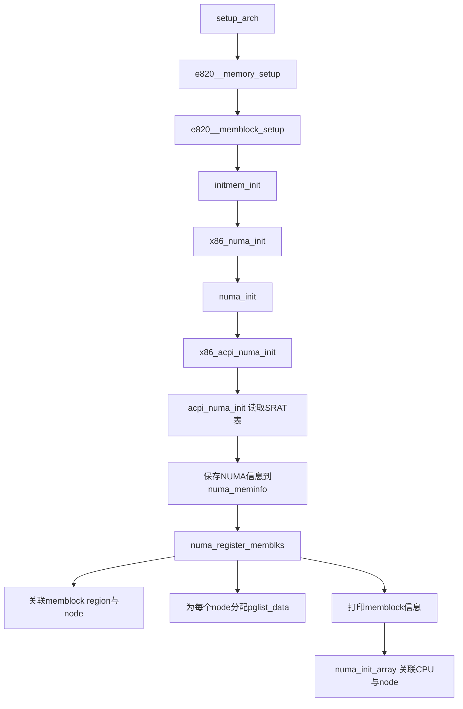

# NUMA信息感知

## 页面 20-24 原始内容（重构后）

假设 `struct page` 结构体大小是 64 字节。那么平均每 4 KB 就额外需要消耗 64 字节内存用来存储这个对象。  
64/4096 ≈ 1.56%，那么管理 16 GB 的内存大约需要 (16 * 1024 MB) * 1.56%，约 256 MB 的内存。

相信看到这里，你就能理解开篇中为什么 `free -m` 看到的内存少了。Linux 并不会把全部的物理内存都提供给我们使用。Linux 为了维护自身的运行，会需要消耗一些内存。在本文中我们介绍了 kdump 机制对内存的消耗，也介绍了内存的页管理机制对内存的占用。但实际上还有一些其他的消耗，例如 NUMA 机制中的 node、zone 的管理等等也都需要内存。所以如果你通过 `free -m` 查看到可用内存比实际的物理内存小也丝毫不必感到奇怪。

## 1.4 NUMA信息感知

在本节中我们来深入了解一下 [[NUMA]] 的原理。在硬件上为什么会存在 NUMA，Linux 操作系统又是如何识别 NUMA 信息，来将 CPU 和内存进行分组划分 node 的。

### 1.4.1 非一致性内存访问原因

NUMA 全称是 **Non-uniform memory access**，是非一致性内存访问的意思。我们需要看看硬件结构就能更好地理解这句话的含义了。

服务器 CPU 和个人 PC CPU 的一个很大的区别就是扩展性。在一台服务器的内部是支持插 2/4/8 等多 CPU 的。每个 CPU 都可以连接几条的内存。两个 CPU 之间如果想要访问对方上连接的内存条，中间就得跨过 [[UPI]] 总线。

下面是一台服务器的实际内部图片。中间两个银色的长方形的东西是罩着散热片的 CPU，每个 CPU 旁边都有一些内存插槽，支持插入多条内存。

> [!INFO] 图片说明
> [Image 103 on Page 20] — 服务器实物图，展示两个CPU及旁边内存插槽。

CPU 扩展性的设计极大地提升了服务器上的 CPU 核数与内存容量。但同时也带来了另外一个问题，那就是 CPU 物理核在访问不同的内存条的时候延迟是不同的。这就是非一致性内存访问的含义。

其实不仅仅是跨 CPU 访问存在延时差异。在服务器高核心 CPU 上，由于 Mesh 架构以及存在两个内存控制器的原因，物理核访问不同的内存控制器上的内存条也会有差异。只不过这个差异没有跨 CPU 差异大。

### 1.4.2 Linux获取NUMA信息

#### 内核识别内存所属node节点

本章前面我们提到过在计算机的体系结构中，除了操作系统和硬件外，其实中间还存在着一层固件（[[firmware]]），它的接口规范是 [[ACPI]]。在 ACPI 的 6.5 接口规范第 17 章中描述了 NUMA 相关的内容。在 ACPI 中定义了两个表分别是：

- **SRAT（System Resource Affinity Table）**：在这个表中表示的是 CPU 核和内存的关系图。包括有几个 node，每个 node 里面有那几个 CPU 逻辑核，有哪些内存。
- **SLIT（System Locality Information Table）**：在这个表中记录的是各个 node 结点之间的距离。

有了这个规范，CPU 读取这两个表就可以获得 NUMA 系统的 CPU 及物理内存分布信息。操作系统在启动的时候会执行 `setup_arch`，会在这个函数中执行发起 NUMA 信息初始化。

```c
//file:arch/x86/kernel/setup.c
void __init setup_arch(char **cmdline_p)
{
  ...
  // 保存物理内存检测结果
  e820__memory_setup();
  // membloc内存分配器初始化
  e820__memblock_setup();
  // 内存初始化(包括 NUMA 机制初始化)
  initmem_init();
}
```

在 `initmem_init` 中，依次调用了 `x86_numa_init`、`numa_init`、`x86_acpi_numa_init`，最后执行到了 `acpi_numa_init` 函数中来读取 ACPI 中的 SRAT 表，获取到各个 node 中的 CPU 逻辑核、内存的分布信息。

在 SRAT 表读取并解析完成后，Linux 操作系统就知道了内存和 node 的关系了。NUMA 信息都最后保存在了 `numa_meminfo` 这个数据结构中，这是一个全局的列表，每一项都是 `(起始地址, 结束地址, 节点编号)` 的三元组，描述了内存块与 NUMA 节点的关联关系。

#### memblock分配器关联NUMA信息

至此内核创建好了 memblock 内存分配器，也通过固件获得了内存块的 node 节点信息。接着还需要把 NUMA 信息写到 memblock 分配器中。

```c
//file:drivers/acpi/numa/srat.c
int __init acpi_numa_init(void)
{
  ...
  // 解析 SRAT 表中的 NUMA 信息
  // 具体包括:CPU_AFFINITY、MEMORY_AFFINITY 等
  if (!acpi_table_parse(ACPI_SIG_SRAT, acpi_parse_srat)) {
    ...
  }
  ...
}
```

```c
//file:arch/x86/mm/numa.c
static struct numa_meminfo numa_meminfo __initdata_or_meminfo;
```

```c
//file:arch/x86/mm/numa_internal.h
struct numa_meminfo {
  int     nr_blks;
  struct numa_memblk  blk[NR_NODE_MEMBLKS];
};
```

```c
//file:arch/x86/mm/numa.c
static int __init numa_init(int (*init_func)(void))
{
  ...
  // 把numa相关的信息保存在 numa_meminfo 中
  init_func();
  // memblock 添加 NUMA 信息,并为每个 node 申请对象
  numa_register_memblks(&numa_meminfo);
  ...
    
  // 用于将各个CPU core与NUMA节点关联
  numa_init_array();
  return 0;
}
```

我们主要看其中的 `numa_register_memblks` 函数执行这一步，在这个函数中共完成了三件事情。

1. 将每一个 `memblock region` 与 NUMA 节点号关联
2. 为每一个 node 都申请一个表示它的内核对象（`pglist_data`）
3. 再次打印 memblock 信息

下面是这个函数的源码。

```c
//file:arch/x86/mm/numa.c
static int __init numa_register_memblks(struct numa_meminfo *mi)
{
  ...
  //1.将每一个 memblock region 与 NUMA 节点号关联
  for (i = 0; i < mi->nr_blks; i++) {
    struct numa_memblk *mb = &mi->blk[i];
    memblock_set_node(mb->start, mb->end - mb->start,
          &memblock.memory, mb->nid);
  }
  ...
  //2.为所有可能存在的node申请pglist_data结构体空间 
  for_each_node_mask(nid, node_possible_map) {
    ...
    //为nid申请一个pglist_data结构体
    alloc_node_data(nid);
  }
  //3.打印MemBlock内存分配器的详细调试信息
  memblock_dump_all();
}
```

这个函数的详细逻辑不过度展开，我们直接来看下 `memblock_dump_all`。如果你开启了 `memblock=debug` 启动参数，在它执行完后，memblock 内存分配器的信息再次被打印了出来。

```
# dmesg
.....
[    0.010796] MEMBLOCK configuration:
[    0.010797]  memory size = 0x00000003fff78c00 reserved size = 0x0000000003d7bd7e
[    0.010797]  memory.cnt  = 0x4
[    0.010799]  memory[0x0] [0x0000000000001000-0x000000000009efff], 0x000000000009e000 
bytes on node 0 flags: 0x0
[    0.010800]  memory[0x1] [0x0000000000100000-0x00000000bffd9fff], 0x00000000bfeda000 
bytes on node 0 flags: 0x0
[    0.010801]  memory[0x2] [0x0000000100000000-0x000000023fffffff], 0x0000000140000000 
bytes on node 0 flags: 0x0
[    0.010802]  memory[0x3] [0x0000000240000000-0x000000043fffffff], 0x0000000200000000 
bytes on node 1 flags: 0x0
[    0.010803]  reserved.cnt  = 0x7
[    0.010804]  reserved[0x0] [0x0000000000000000-0x00000000000fffff], 
0x0000000000100000 bytes on node 0 flags: 0x0
```

> [!NOTE] 图片辅助说明
> 原始文档中包含以下图片，此处用文字保留其上下文：
> - [Image 108 on Page 21] — 可能显示SRAT/SLIT表结构或NUMA节点示意图。
> - [Image 109 on Page 21] — 可能显示 `numa_meminfo` 数据结构或 `memblock_set_node` 调用关系。
> - [Image 115 on Page 22] — 可能显示 `dmesg` 输出或 `numa_register_memblks` 流程图。

---

### 可选补充（Mermaid图）

为直观展示 NUMA 初始化流程，可辅以以下 Mermaid 图（不替换原始信息）：

