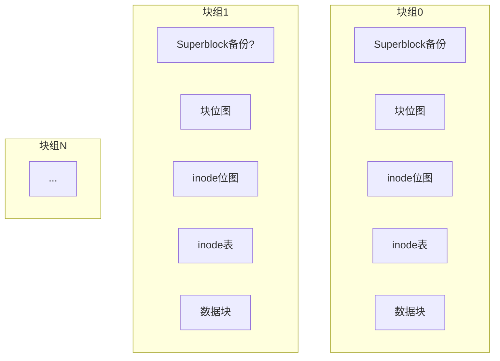

# 第二章 分区与格式化

## 2.1 磁盘分区原理

在前文中，我们了解了机械硬盘的物理构造，是由磁盘面、磁道、扇区等更小的单位组成的，如下图（这里可以链接到物理结构图，若无图则用文字描述：磁盘由多个盘面构成，每个盘面有同心圆磁道，磁道再分为扇区）。

分区是操作系统对磁盘进行管理的第一步，这也是我们任何一个计算机使用者都非常熟悉的概念。例如Windows下的C、D、E、F盘。那么请思考一下，如果你是操作系统的设计者，让你把整块磁盘分成C、D等分区，你会怎么分呢？

为了方便讨论，我们这里要分的硬盘是有50个盘面，3000个柱面。我们给出两种方案：

- **方案一**： 50个盘面，C盘是0-10盘面， D盘是10-20个盘面，……
- **方案二**： 根据柱面划分，C盘0-1000个柱面，D盘1001-20001个柱面，……

接下来我们来讨论下那种方案更优秀，这得从磁盘的读写延时角度说起。

### 磁盘IO耗时分解

读写原理说起来也简单，就是磁头要找到指定的磁道，指定的扇区，进而把数据读取出来或者写入进去的过程。这个过程分成如下三步：

> [!INFO] **第一步：寻道时间**
> 磁头径向移动来寻找数据所在的磁道。这部分时间叫寻道时间。现代磁盘大概在3-15ms，其中寻道时间大小主要受磁头当前所在位置和目标磁道所在位置相对距离的影响。

> [!INFO] **第二步：旋转延迟**
> 找到目标磁道后通过盘面旋转，将目标扇区移动到磁头的正下方，这部分时间叫旋转延迟。现在主流服务器上经常使用的是1W转/分钟的磁盘，每旋转一周所需的时间为60\*1000/10000=6ms，故其旋转延迟为（0-6ms）。

> [!INFO] **第三步：存取时间**
> 向目标扇区读取或者写入数据，这部分时间叫存取时间。这个是电磁操作，所以一般耗时较短，为零点几ms。

**单次磁盘IO时间 = 寻道时间 + 旋转延迟 + 存取时间**

### 方案对比

分区上采用哪一种方案，最主要看的是那种方式性能更快。在磁盘分区的使用中，存在一个基本事实，那就是同一分区下的数据经常会一起读取。两种方案对于旋转延迟和存取时间上表现的性能是一样的，主要区别是在寻道时间的表现上：

- **采用方案一**：磁头需要在3000多个磁道间不停地跳来跳去，这样磁盘的寻道时间就降不下来。
- **采用方案二**：对于磁盘C，只需要磁头在1-1000个磁道间移动即可，大大降低了寻道时间。

所以所有的操作系统采用的都是方案二，没有用方案一的。如果你在Linux下使用过`fdisk`进行过分区的话可以注意到以下信息。

```bash
# 示例:fdisk 分区输出(起始柱面号和截止柱面号)
```

分区的过程就是你输入起始柱面号和截止柱面号的过程。不过在实际中，分区并不能从0号柱面开始的，因为磁盘的第一个磁道对应的柱面会被用来安装引导加载程序以及磁盘分区表。

> [!TIP] **结论**
> 操作系统通过按磁道对应的柱面划分分区，来降低磁盘IO所花费的寻道时间，最终提高磁盘的读写性能。

---

## 2.2 理解格式化原理

在前文《磁盘开篇：扒开机械硬盘坚硬的外壳！》和《拆解固态硬盘结构》中，我们了解到了硬盘基本单位是扇区。在《磁盘分区也是隐含了技术技巧的》中我们也了解了磁盘分区是怎么回事，但刚分完区的硬盘也是不能直接被操作系统使用的，必须还得要经过格式化。那么今天我们就简单聊一聊，Linux下的格式化到底都干了啥。

Linux下的格式化命令是`mkfs`，`mkfs`在格式化的时候需要指定分区以及文件系统类型。该命令其实就是把我们的连续的磁盘空间进行划分和管理。我在我的机器上执行了一下，输出如下：

```bash
# mkfs -t ext4 /dev/vdb
mke2fs 1.42.9 (28-Dec-2013)
文件系统标签=
OS type: Linux
块大小=4096 (log=2)
分块大小=4096 (log=2)
Stride=0 blocks, Stripe width=0 blocks
6553600 inodes, 26214400 blocks
1310720 blocks (5.00%) reserved for the super user
第一个数据块=0
Maximum filesystem blocks=2174746624
800 block groups
32768 blocks per group, 32768 fragments per group
8192 inodes per group
Superblock backups stored on blocks:
  32768, 98304, 163840, 229376, 294912, 819200, 884736, 1605632, 2654208,
  4096000, 7962624, 11239424, 20480000, 23887872
```

### inode与block

在上面的结果中我们看到了几个重要信息：

- 块大小：4096字节
- inode数量：6553600
- block数量：26214400

块大小设置的是4096字节，我们来分析两种场景：

- 假如你的文件系统全部都用来存储1KB以下的小文件，这个时候你的磁盘1/3的空间将会被浪费无法使用。
- 假如你的文件全都是GB以上的大文件，这个时候你的inode索引节点里就需要直接或间接维护许许多多的block索引号。

很明显，以上这两种情况下4096字节的块大小是不合适的。你需要自己根据情况选择自己的块大小进行重新格式化。

我们再看另外的两个数据，inode数量和block数量。我们用block数量除一下inode，26214400/6553600=4，也就是说平均4个block会有一个inode。再举两个极端的例子：

- **第一种情况**：假如说我们的文件都是4KB以下的，那么我们的文件系统用到最后出现的情况就是inode全部用光了，还有1/3的block空闲，而且再也没有办法创建新文件了。
- **第二种情况**：假如我们的文件都特别大，每一个文件需要1000个block，最后的情况就是block全部都用光了，但是inode又都空闲下来了，这个时候也是没办法再建文件的。

> [!WARNING] **inode与block配比**
> 这些情况下，block和inode的配比也都是不符合你使用的，你需要根据自己的业务重新配置。`mkfs`傻瓜格式出来的结果无法满足你的业务需求，你就需要使用另外一些格式化命令了，比如`mke2fs`，这个命令允许你输入更详细的格式化选项，demo如下：

```bash
mke2fs -j -L "卷标" -b 2048 -i 8192 /dev/sdb1
```

### 块组（Block Groups）

我们再回头看格式化后的结果，结果中显示了一些和groups相关的东东，如下：

```
800 block groups
32768 blocks per group, 32768 fragments per group
8192 inodes per group
```

那么这个groups到底说的是啥呢？其实呀，格式化后的所有inode并不是挨着一起放的，同样block也不是。而是分成了一个个的group，每一个group里都有一些inode和block。逻辑图如下（替代为Mermaid图）：



这个块组一般是多大呢？注意每个块中的数据块位图只有一个，假如你的块大小为4KB，这样一个bit代表一个数据块，4KB可以有32KB个bit，可以管理32K\*4K=128M的数据块。来让我们实际动手验证一下，如下：

```bash
# dumpe2fs /dev/vdb
......
Block size:               4096
Inode size:               256
Inode count:              6553600
Block count:              26214400
......
Group 16: (Blocks 524288-557055) [INODE_UNINIT, ITABLE_ZEROED]
  Checksum 0xe838, unused inodes 8192
  Block bitmap at 524288 (+0), Inode bitmap at 524304 (+16)
  Inode表位于 524320-524831 (+32)
  24544 free blocks, 8192 free inodes, 0 directories, 8192个未使用的inodes
  可用块数: 532512-557055
  可用inode数: 131073-139264
......
Group 799: (Blocks 26181632-26214399) [INODE_UNINIT, ITABLE_ZEROED]
......
```

上述结果中包含信息如下：

- 该分区总共格式化好了800个块组
- 块组16共有32K个block(第524288-557055)，
- block位图在524288这个块上
- inode位图在524304这个块上
- inode table占用了612个block（524320-524831）
- 剩下的其它的block（32K-1-1-612）就都真的是给用户准备的了，目前空闲未分配的在Free blocks可以查看到。

### 再次理解目录

好了，了解了以上原理以后，让我们回头再来看看目录使用的数据是怎么在磁盘上组织的。创建目录的时候，操作系统会在inode位图上寻找尚未使用的inode编号，找到后把inode分配给你。目录会默认分配一个block，所以还需要查询block位图，找到后分配一个block。在block里面，存储的就是文件系统自己定义的`denty`结构了（目录项结构），每一个结构里会保存其下的文件名，文件的inode编号等信息。某个实际文件夹在磁盘上最终使用的空间如下图所示（文字描述）：

- 目录本身占用一个inode（包含权限、时间戳等属性）
- 目录的block中存放多个目录项结构体，每个结构体包含文件名和对应的inode编号。

目录的block中保存的是其下面的文件和子目录的`denty`结构体，保存着它们的文件名和inode号。理解了目录，对于文件也是一样的。也需要消耗inode，当有数据写入的时候，再去申请block。

---

## 结论

硬盘就是一个扇区组成的大数组，是无法被我们使用的，需要经过分区、格式化和挂载三个步骤。分区是把所有的扇区按照柱面分割成不同的大块，格式化就把原始的扇区数组变成了可被Linux文件系统使用的inode、block等基本元素了。感觉格式化程序有点像是厨师团队里的那个切墩的，把原材料变成了可被厨师直接使用的葱花，肉段。格式化完后再经过最后一步挂载，对应的命令是`mount`，然后你就可以在它下面创建和保存文件了。

再扩展一下其实刚分完区的设备也是可以使用的，这个时候的分区叫裸分区，也叫裸设备。比如Oracle就是绕开操作系统直接使用裸设备的。但是这个时候你就无法利用Linux文件系统里为你封装好的inode、block组成的文件与目录了，开发工作量会增加。

---

> [!INFO] **相关资源**
> - Github：https://github.com/yanfeizhang/coder-kung-fu
> - 欢迎关注个人公众号“开发内功修炼”，了解你的每一比特，用好你的每一纳秒。
> - 有想继续加入知识星球的同学微信扫描下面的二维码即可加入。另外在公众号后台发送「星球优惠券」可以获取开发内功修炼读者的专属优惠券。