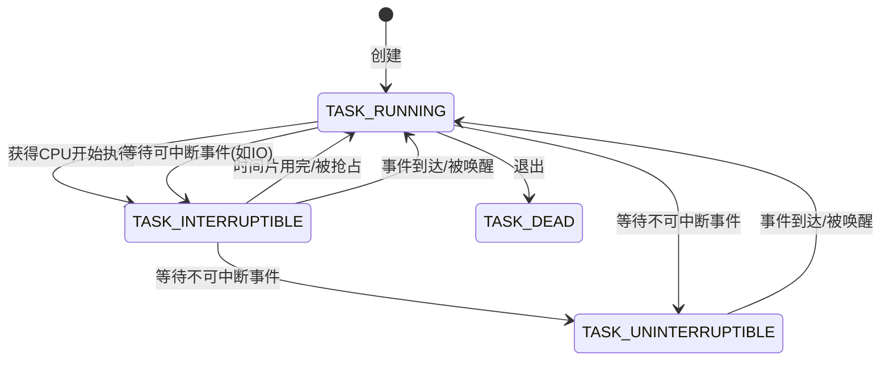
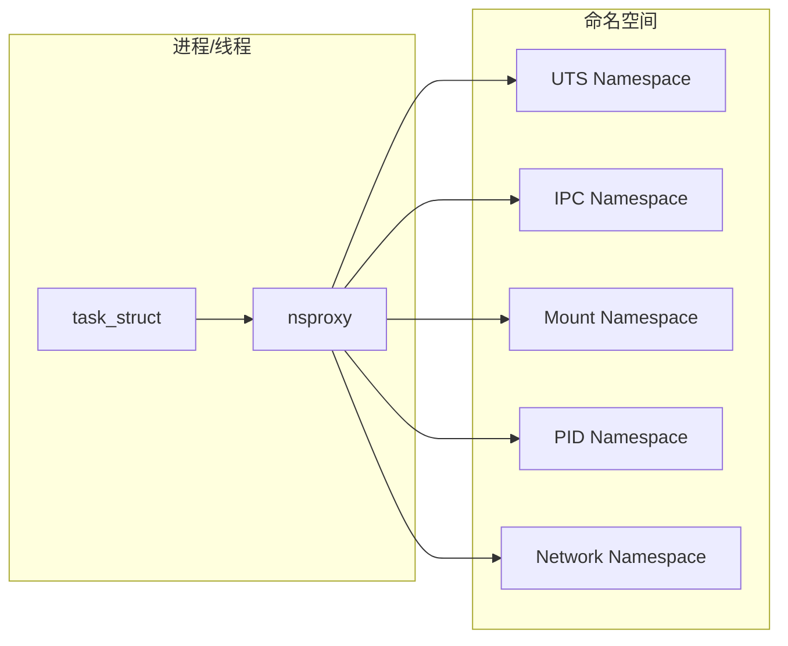

# 1.1 进程线程定义与对比

## 核心数据结构：task_struct

在技术圈和网上的很多讨论中，对进程和线程的讨论大多都聚集在这二位有啥不同。但事实在 Linux 上，进程和线程的相同点要远远大于不同点。在操作系统理论中，进程和线程分别是用户[[进程控制块]]（PCB）和[[线程控制块]]（TCB）来表示的。但其实在 Linux 的实现里，无论进程还是线程，都抽象成了 **任务**，在源码里用 `task_struct` 结构来实现。

> [!INFO] 术语约定  
> 在本书中如果提到 **任务**，那就表示的是进程或者线程。

我们来看看表示进程和线程的 `task_struct` 具体的定义，它位于 `include/linux/sched.h`。

```c
// file:include/linux/sched.h
struct task_struct {
    // 1 进程线程状态
    unsigned int __state;
    // 2 进程线程的pid
    pid_t pid;
    pid_t tgid;
    // 3 进程树关系:父进程、子进程、兄弟进程
    struct task_struct __rcu *parent;
    struct list_head children;
    struct list_head sibling;
    struct task_struct *group_leader;
    // 4 进程调度优先级
    int prio;
    int static_prio;
    int normal_prio;
    unsigned int rt_priority;
    // 5 进程地址空间
    struct mm_struct    *mm;
    struct mm_struct    *active_mm;
    // 6 进程文件系统信息(当前目录等)
    struct fs_struct *fs;
    // 7 进程打开的文件信息
    struct files_struct *files;
    // 8 namespaces
    struct nsproxy *nsproxy;
    ......
};
```

在这个内核结构体中，将很多资源都封装了起来。包括进程线程的状态、进程线程的pid、进程调度相关的优先级信息、进程所使用的虚拟内存信息、进程所在的文件系统当前目录、进程打开的文件句柄、进程所在的各种命名空间等。

可以说 `task_struct` 是内核中最为核心的数据结构也不为过。它将系统中的各种资源都统一进行封装，抽象成了进程线程来给开发者们使用。接下来让我们分别来看一下进程线程所拥有的这些资源或属性。理解了这些属性对我们下一步掌握进程线程的创建会有很大的帮助。

---

## 1 进程线程状态

进程线程都是有状态的，它的状态就保存在 `state` 字段中。常见的状态中 `TASK_RUNNING` 表示进程线程处于就绪状态或者是正在执行。`TASK_INTERRUPTIBLE` 表示进程线程进入了阻塞状态。

一个任务（进程或线程）刚创建出来的时候是 `TASK_RUNNING` 就绪状态，等待调度器的调度。调度器执行 `schedule` 后，任务获得 CPU 后进入 `TASK_INTERRUPTIBLE` 执行状态进行运行。当需要等待某个事件的时候，例如阻塞式 read 某个 socket 上的数据，但是数据还没有到达的时候，任务进入 `TASK_INTERRUPTIBLE` 或 `TASK_UNINTERRUPTIBLE` 状态，任务被阻塞掉。

当等待的事件到达以后，例如 socket 上的数据到达了。内核在收到数据后会查看 socket 上阻塞的等待任务队列，然后将之唤醒，使得任务重新进入 `TASK_RUNNING` 就绪状态。任务如此往复地在各个状态之间循环，直到退出。

一个任务的大概状态流转图如下。

> [!INFO] 图片占位符说明  
> 原始文档此处有状态流转图（Image 67 on Page 11），以下用 Mermaid 状态图补充表示。



全部的状态值在 `include/linux/sched.h` 中进行了定义。

```c
// file:include/linux/sched.h
#define TASK_RUNNING        0x00000000
#define TASK_INTERRUPTIBLE  0x00000001
#define TASK_UNINTERRUPTIBLE  0x00000002
#define __TASK_STOPPED      0x00000004
#define __TASK_TRACED       0x00000008
......
#define TASK_DEAD           0x00000080
#define TASK_WAKEKILL       0x00000100
#define TASK_WAKING         0x00000200
......
#define TASK_STATE_MAX      0x00010000
```

---

## 2 进程ID与线程ID

我们知道，每一个进程或线程都有一个进程号的概念。在 `task_struct` 中有两个相关的字段，分别是 `pid` 和 `tgid`。

```c
// file:include/linux/sched.h
struct task_struct {
    ......
    pid_t pid;
    pid_t tgid;
}
```

其中 `pid` 是 Linux 为了标识每一个进程而分配给它们的唯一号码，称为进程 ID 号，简称 PID。对于没有创建线程的进程（只包含一个主线程）来说，这个 `pid` 就是进程的 PID（Process ID），`tgid` 和 `pid` 是相同的。

> [!INFO] pid_t 类型定义  
> 这个 `pid_t` 类型其实就是 `int`。
> ```c
> // file:include/linux/types.h
> typedef __kernel_pid_t    pid_t;
> // file:include/uapi/asm-generic/posix_types.h
> typedef int   __kernel_pid_t;
> ```

在 Linux 内核中并没有对线程做特殊处理，还是由 `task_struct` 来管理。从内核的角度看，用户态的线程本质上还是一个进程。只不过和普通进程的区别是会和父进程共享虚拟地址空间等数据结构，会更轻量一些。所以在 Linux 下的线程也叫 **轻量级进程**。

假如一个进程下创建了多个线程（轻量级进程）出来，那么每个线程（轻量级进程）的 `pid` 都是不同的。这是内核唯一标识它们的地方，所以必须得不一致。他们通过 `tgid` 字段来表示自己所属的进程 ID。

对于用户程序来说，调用 `getpid()` 函数其实返回的是 `tgid`，这样无论进程还是线程获取到的进程 id 看起来就符合我们的预期了。

---

## 3 进程树关系

在 Linux 下所有的进程都是通过一棵树来管理的。在操作系统启动的时候，会创建 `init` 进程，接下来所有的进程都是由这个进程直接或者间接创建的。通过 `pstree` 命令可以查看你当前服务器上的进程树信息。

```text
init-+-atd
     |-cron
     |-db2fmcd
     |-db2syscr-+-db2fmp---4*[{db2fmp}]
     |          |-db2fmp---3*[{db2fmp}]
     |          |-db2sysc---13*[{db2sysc}]
     |          |-3*[db2syscr]
     |          |-db2vend
     |          `-{db2syscr}
     |-dbus-daemon
```

那么，这棵进程树就是由 `task_struct` 下的 `parent`、`children`、`sibling` 等字段来表示的。这几个字段将系统中的所有 task 串成了一棵树。

```c
// file:include/linux/sched.h
struct task_struct {
    ......
    struct task_struct __rcu *parent;   // 父进程
    struct list_head children;          // 子进程链表
    struct list_head sibling;           // 兄弟进程链表
    struct task_struct *group_leader;   // 线程组组长
    ......
}
```

---

## 4 进程调度优先级

在 Linux 的调度器主要分实时进程调度和普通进程调度，对于普通进程采用的调度器是 [[CFS]]（Completely Fair Scheduler，完全公平调度器）。无论是哪种调度都需要使用一些优先级，在进程调度的时候会根据这几个字段来决定优先让哪个任务（进程或线程）开始执行。

在 `task_struct` 中如下几个字段是表示进程优先级的。

| 字段 | 含义 | 取值范围 |
|------|------|----------|
| `static_prio` | 静态优先级，可以调用 `nice` 系统调用来修改 | 100~139 |
| `rt_priority` | 实时优先级 | 0~99 |
| `prio` | 动态优先级 | 计算得出 |
| `normal_prio` | 它的值取决于静态优先级和调度策略 | 计算得出 |

```c
// file:include/linux/sched.h
struct task_struct {
    ......
    int       prio;
    int       static_prio;
    int       normal_prio;
    unsigned int rt_priority;
    ......
}
```

---

## 5 进程地址空间

对于用户进程来讲，内存描述符 `mm_struct`（`mm` 代表的是 memory descriptor）是非常核心的数据结构。整个进程的虚拟地址空间部分都是由它来表示的。

进程在运行的时候，在用户态其所需要的内存数据，如代码，全局变量数据，以及 mmap 内存映射等全部都是通过 `mm_struct` 来进行内存查找和寻址的。这个数据结构的定义位于 `include/linux/mm_types.h` 文件下。

```c
// file:include/linux/mm_types.h
struct mm_struct {
    unsigned long mmap_base;    /* base of mmap area */
    unsigned long task_size;    /* size of task vm space */
    unsigned long start_code, end_code, start_data, end_data;
    unsigned long start_brk, brk, start_stack;
    unsigned long arg_start, arg_end, env_start, env_end;
    ......
}
```

其中：
- `start_code`、`end_code` 分别指向代码段的开始与结尾
- `start_data` 和 `end_data` 共同决定数据段的区域
- `start_brk` 和 `brk` 中间是堆内存的位置
- `start_stack` 是用户态堆栈的起始地址

整个 `mm_struct` 和地址空间、页表、物理内存的关系如下图。

> [!INFO] 图片占位符说明  
> 原始文档此处有 `mm_struct` 与地址空间、页表、物理内存的关系图（Image 75 on Page 13 及后续相关图片）。以下用文本描述示意：
> - 用户进程的虚拟地址空间由 `mm_struct` 描述
> - 虚拟地址通过页表（Page Table）映射到物理内存
> - MMU（Memory Management Unit）配合 TLB 缓存完成地址转换

`mm_struct` 中所有的成员共同一起表示了一个虚拟地址空间。当虚拟地址空间中的内存区域被访问的时候，会由 CPU 中的 MMU 配合 TLB 缓存来将虚拟地址转换成物理地址来进行访问。

> [!NOTE] 内核线程的特殊情况  
> 对于内核线程来说，由于它只工作在地址空间固定较高的那部分，所以并没有涉及到对虚拟内存部分的使用。内核线程的 `mm_struct` 都是 `null`。
> 
> 在内核内存区域，可以通过直接计算得出物理内存地址，并不需要复杂的页表计算。而且最重要的是所有内核进程、以及用户进程的内核态，这部分内存都是共享的。

**区分一个任务该叫线程还是改叫进程，一个主要的区分点就在于看它是否有独立的地址空间。** 如果有，就应该叫做进程，如果没有就应该叫做线程。

对于内核任务来说，因为没有独立的地址空间，所以称之为线程更为合适。所以应该叫**内核线程**而不是内核进程！

---

## 6 进程文件系统信息（当前目录等）

进程的文件位置等信息是由 `fs_struct` 来描述的，它的定义位于 `include/linux/fs_struct.h` 文件中。

```c
// file:include/linux/fs_struct.h
struct fs_struct {
    ...
    struct path root, pwd;
};
```

其中 `pwd` 就是我们在编程中所熟知的进程当前目录。该指针指向的是进程当前目录所处的 dentry 目录项。假如我们在 shell 进程中执行 `pwd`，或者用户进程查找当前目录下的某些文件的时候，都是通过访问 `pwd` 这个对象，进而找到当前目录的 `dentry` 的。

```c
// file:include/linux/path.h
struct path {
    struct vfsmount *mnt;
    struct dentry *dentry;
} __randomize_layout;
```

通过以上代码可以看出，在 `fs_struct` 中包含了两个 `path` 对象，而每个 `path` 中都指向了一个 `struct dentry`。在 Linux 内核中，`dentry` 结构是对一个目录项的描述。

---

## 7 进程打开的文件信息

每个进程用一个 `files_struct` 结构来记录文件描述符的使用情况，这个 `files_struct` 结构称为用户打开文件表。它的定义位于 `include/linux/fdtable.h`。

```c
// file:include/linux/fdtable.h
struct files_struct {
    ......
    // fdtable
    struct fdtable __rcu *fdt;
    // 下一个要分配的文件句柄号
    int next_fd;
    ......
}

struct fdtable {
    // 当前的文件数组
    struct file __rcu **fd;
    ......
};
```

在 `files_struct` 中，最重要的是在 `fdtable` 中包含的 `file **fd` 这个数组。这个数组的下标就是文件描述符，其中 0、1、2 三个描述符总是默认分配给标准输入、标准输出和标准错误。这就是你在 shell 命令中经常看到的 `2>&1` 的由来。这几个字符的含义就是把标准错误也一并打到标准输出中来。

在数组元素中记录了当前进程打开的每一个文件的指针。这个文件是 Linux 中抽象的文件，可能是真的磁盘上的文件，也可能是一个 socket。

> [!TIP] 内核参数限制  
> Linux 会通过 `fs.file-max` 和 `fs.nr_open` 内核参数限制进程的打开文件句柄的数量。判断的时候就是通过 `*file[]` 这个数组要分配的下标来判断的，参见《深入理解Linux网络》中的8.1节。

---

## 8 Namespaces

在 Linux 中，namespace 是用来隔离内核资源的方式。通过 namespace 可以让一些进程只能看到与自己相关的一部分资源，而另外一些进程也只能看到与它们自己相关的资源，这两拨进程根本就感觉不到对方的存在。

具体的实现方式是把一个或多个进程的相关资源指定在同一个 namespace 中，而进程究竟是属于哪个 namespace，都是在 `task_struct` 中由 `*nsproxy` 指针表明了这个归属关系。

```c
// file:include/linux/nsproxy.h
struct nsproxy {
    atomic_t count;
    struct uts_namespace *uts_ns;
    struct ipc_namespace *ipc_ns;
    struct mnt_namespace *mnt_ns;
    struct pid_namespace *pid_ns;
    struct net       *net_ns;
    ......
};
```

在 Linux 中实现了多种不同的命名空间，分别用来隔离不同的资源。

| 命名空间 | 隔离的资源 |
|----------|-----------|
| PID命名空间 | 进程的PID |
| 挂载点命名空间 | 文件系统挂载点 |
| 网络命名空间 | 网络资源 |
| UTS命名空间 | 主机名和域名 |
| User命名空间 | 用户ID和组ID |
| IPC命名空间 | System V IPC 和 POSIX 消息队列 |

各个命名空间和进程 `task_struct` 内核对象的关系如下图所示。

> [!INFO] 图片占位符说明  
> 原始文档此处有 namespace 与 task_struct 关系图（Image 98 on Page 17 等），以下用 Mermaid 图补充表示。

