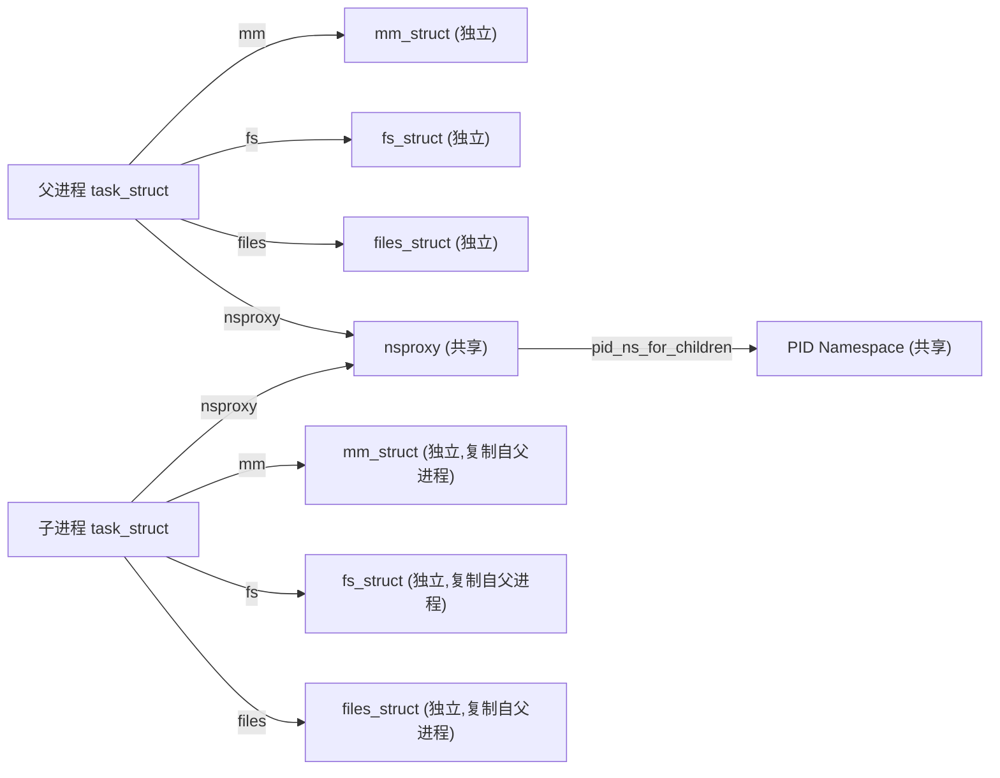

# 进程的创建

通过内核对外暴露的 `proc` 伪文件系统可以查看进程所在的命名空间。

```bash
ll /proc/$$/ns
total 0
... 0 Jan 27 21:57 cgroup -> 'cgroup:[4026531835]'
... 0 Jan 27 21:57 ipc -> 'ipc:[4026531839]'
... 0 Jan 27 21:57 mnt -> 'mnt:[4026531840]'
... 0 Jan 27 21:57 net -> 'net:[4026531992]'
... 0 Jan 27 21:57 pid -> 'pid:[4026531836]'
... 0 Jan 27 21:57 pid_for_children -> 'pid:[4026531836]'
... 0 Jan 27 21:57 user -> 'user:[4026531837]'
... 0 Jan 27 21:57 uts -> 'uts:[4026531838]'
```

每个命名空间都用来隔离了不同类型的资源。我们拿网络命名空间来举例。每个网络命名空间下都有自己专属的 `loopback` 设备、路由表、`iptables` 规则。在系统启动时，有一个默认的网络命名空间叫 `init_inet`。

如果创建进程时指定了 `CLONE_NEWNET` 标记，则会创建一个新的网络命名空间出来。这个命名空间内也有自己独立的 `loopback` 设备、路由表、`iptables`。同时该新进程的 `net_ns` 指向这个新的命名空间。这样将来在该新进程，以及其后面可能创建的子进程里看的话，就只能看到自己的路由表等资源了，就无法再查看到母机的资源了。详情参见《深入理解Linux网络》第10.3节。

## 1.2 进程的创建

在 Linux 中，进程是我们日常编程中非常熟悉的东西了，哪怕是只写过一天代码的人也都用过它。但是你确定它不是你最熟悉的陌生人？它的创建过程你是否足够了解？本小节中我们通过深度剖析进程的创建过程，帮助你提高对进程的认知深度。

在前面的小节中我们已经了解了进程的数据结构 [[task_struct]]。在本小节我会用 Nginx 创建 worker 进程的例子作为引入，然后再带大家看一下 `fork` 执行的内部原理。

### 1.2.1 Nginx使用fork创建Worker

在 Linux 进程的创建中，最核心的就是 `fork` 系统调用。不过我们先不着急介绍它，先拿多进程服务中的一个经典例子 —— Nginx，来看看它是如何使用 `fork` 来创建 worker 的。这里我们要注意它在调用 `fork` 时传入的参数中的 flag 选项。

Nginx源码下载地址：<https://github.com/nginx/nginx>

Nginx服务采用的是多进程方式来工作的，它启动的时候会创建若干个 worker 进程出来，来响应和处理用户请求。创建 worker 子进程的源码位于 Nginx 源码的 `src/os/unix/ngx_process_cycle.c` 文件中。通过循环调用 `ngx_spawn_process` 来创建若干个 worker 进程出来。

```c
// file:src/os/unix/ngx_process_cycle.c
static void ngx_start_worker_processes(...)
{
  ...
  for (i = 0; i < n; i++) {
    ngx_spawn_process(cycle, ngx_worker_process_cycle,
              (void *) (intptr_t) i, "worker process", type);
    ...
  }
}
```

我们再来看下负责具体进程创建的 `ngx_spawn_process` 函数。

```c
// file: src/os/unix/ngx_process.c
ngx_pid_t ngx_spawn_process(ngx_cycle_t *cycle, ngx_spawn_proc_pt proc,...)
{
  //调用fork来创建子进程
  pid = fork();
  switch (pid) {
    case -1: //出错了
      ... 
    case 0: //子进程创建成功
      ...
      proc(cycle, data);
      break;
  }
  ...
}
```

在 `ngx_spawn_process` 中调用 `fork` 来创建进程，创建成功后 worker 进程就进入自己的入口函数中开始工作了。

### 1.2.2 fork系统调用原理

前面我们看了 Nginx 使用 `fork` 来创建 worker 进程，也了解了进程的数据结构 `task_struct`，我们再来看看 `fork` 系统调用的内部逻辑。这个 `fork` 在内核中是以一个系统调用来实现的，它的内核入口是在 `kernel/fork.c` 下。

在 5.4 和 6.1 的版本的实现上有了比较大的改动，在 5.4 版本中是调用 `do_fork` 来实现的。

```c
// file:linux-5.4.56:kernel/fork.c
SYSCALL_DEFINE0(fork)
{
  return do_fork(SIGCHLD, 0, 0, NULL, NULL);
}
```

在 6.1 版本中调用的是 `kernel_clone`。

```c
// file:kernel/fork.c
SYSCALL_DEFINE0(fork)
{
  struct kernel_clone_args args = {
    .exit_signal = SIGCHLD,
  };
  return kernel_clone(&args);
}
```

但无论是在哪个版本的实现中，都是通过参数传入了一个 flag 选项。这个 flag 可以传入的值包括 `CLONE_VM`、`CLONE_FS` 和 `CLONE_FILES` 等等很多，所有的 flag 定义都在 `include/uapi/linux/sched.h` 文件下。

```c
// file:include/uapi/linux/sched.h
#define CLONE_VM     0x00000100 /* set if VM shared between processes */
#define CLONE_FS     0x00000200 /* set if fs info shared between processes */  
#define CLONE_FILES  0x00000400 /* set if open files shared between processes */
...
#define CLONE_NEWNS        0x00020000 /* New mount namespace group */
...
#define CLONE_NEWCGROUP    0x02000000  /* New cgroup namespace */
#define CLONE_NEWUTS       0x04000000  /* New utsname namespace */
#define CLONE_NEWIPC       0x08000000  /* New ipc namespace */
#define CLONE_NEWUSER      0x10000000  /* New user namespace */
#define CLONE_NEWPID       0x20000000  /* New pid namespace */
#define CLONE_NEWNET       0x40000000  /* New network namespace */
```

简单介绍下每种 flag 的含义：

- **CLONE_VM**：如果用了该标记，则新任务会创建虚拟地址空间。
- **CLONE_FS**：如果用了该标记，则新任务会创建新的文件系统信息。
- **CLONE_FILES**：如果用了该标记，则新任务会有新的打开文件列表。
- 还有几个是和命名空间、cgroup 相关的：
    - **CLONE_NEWNS**：如果用了该标记，则新任务会创建新的挂载点命名空间（隔离文件系统挂载点）
    - **CLONE_NEWCGROUP**：如果用了该标记，则新任务会创建新的 CGroup
    - **CLONE_NEWUTS**：如果用了该标记，则新任务会创建新的 UTS 命名空间（隔离主机名和域名）
    - **CLONE_NEWIPC**：如果用了该标记，则新任务会创建新的 IPC 命名空间（隔离主机名和域名）
    - **CLONE_NEWUSER**：如果用了该标记，则新任务会创建新的 User 命名空间（隔离用户 ID 和组 ID）
    - **CLONE_NEWPID**：如果用了该标记，则新任务会创建新的 PID 命名空间（隔离进程的 PID）
    - **CLONE_NEWNET**：如果用了该标记，则新任务创建新的网络命名空间（隔离网卡设备、路由表等）

但是这里只传了一个 `SIGCHLD`（子进程在终止后发送 `SIGCHLD` 信号通知父进程），并没有传 `CLONE_FS` 等其他 flag。

在无论是 5.4 版本的 `do_fork` 函数，还是 6.1 版本的 `kernel_clone`，其核心是一个 `copy_process` 函数，它以拷贝父进程的方式来生成一个新的 `task_struct` 出来。然后调用 `wake_up_new_task` 将新进程添加到调度队列中等待调度。

```c
// file:linux-5.4.56:kernel/fork.c
long do_fork(unsigned long clone_flags, ...)
{
  // 复制一个 task_struct 出来
  struct task_struct *p;
  p = copy_process(clone_flags, stack_start, stack_size,
       child_tidptr, NULL, trace);
  // 子任务加入到就绪队列中去,等待调度器调度
  wake_up_new_task(p);
  ...
}
```

```c
// file:kernel/fork.c
pid_t kernel_clone(struct kernel_clone_args *args)
{
  // 复制一个 task_struct 出来
  struct task_struct *p;
  p = copy_process(NULL, trace, NUMA_NO_NODE, args);
  // 子任务加入到就绪队列中去,等待调度器调度
  wake_up_new_task(p);
  ...
}
```

在 `copy_process` 生成新的 `task_struct` 后，调用 `wake_up_new_task` 将新创建的任务添加到就绪队列中，等待调度器调度执行。我们先展开了解下 `copy_process` 都做了啥，它的代码很长，我对其进行了一定程度的精简，参见下面的代码。

```c
// file:kernel/fork.c
static struct task_struct *copy_process(...)
{
  const u64 clone_flags = args->flags;
  struct nsproxy *nsp = current->nsproxy;
  ...
  // 1 复制进程 task_struct 结构体
  struct task_struct *p;
  p = dup_task_struct(current, ...);
  ...
  // 2 拷贝 files_struct
  retval = copy_files(clone_flags, p);
  // 3 拷贝 fs_struct
  retval = copy_fs(clone_flags, p);
  // 4 拷贝 mm_struct
  retval = copy_mm(clone_flags, p);
  // 5 拷贝进程的命名空间 nsproxy
  retval = copy_namespaces(clone_flags, p);
  ...
  // 6 申请 pid && 设置进程号
  pid = alloc_pid(p->nsproxy->pid_ns_for_children, ...);
  p->pid = pid_nr(pid);
  if (clone_flags & CLONE_THREAD){
    p->tgid = current->tgid;
  } else {
    p->tgid = p->pid;
  }
  ......
}
```

可见 `copy_process` 先是调用 `dup_task_struct` 复制了一个新的 `task_struct` 内核对象出来，然后调用 `copy_xxx` 系列的函数对 `task_struct` 中的各种核心对象进行拷贝处理，还申请了 pid。可见，创建进程时会对进程所管理的所有类型的资源进行了处理。

接下来我们分小节来查看该函数的每一个细节。

#### 1 复制进程 task_struct 结构体

注意 `copy_process` 调用 `dup_task_struct` 时传入的参数是 `current`，它表示的是当前进程。

```c
// file:kernel/fork.c
static struct task_struct *copy_process(...)
{
  // 1 复制进程 task_struct 结构体
  struct task_struct *p;
  p = dup_task_struct(current, ...);
  ...
}
```

在 `dup_task_struct` 里，会申请一个新的 `task_struct` 内核对象，然后将当前进程复制给它。需要注意的是，这次拷贝只会拷贝 `task_struct` 结构体本身，它内部包含的 `mm_struct` 等成员只是复制了指针，仍然指向和 `current` 相同的对象。

我们来简单看下具体的代码。

```c
// file:kernel/fork.c
static struct task_struct *dup_task_struct(struct task_struct *orig, int node)
{
  // 申请task_struct内核对象
  tsk = alloc_task_struct_node(node);
  // 复制task_struct
  err = arch_dup_task_struct(tsk, orig);
  ...
}
```

其中 `alloc_task_struct_node` 用于在 slab 内核内存管理区中申请一块内存出来。关于 slab 机制的详细工作原理请参考《深入理解Linux网络》第七章，这里我们就不过多展开介绍，只需要知道它申请了一块内存就行了。

```c
// file:kernel/fork.c
static struct kmem_cache *task_struct_cachep;
static inline struct task_struct *alloc_task_struct_node(int node)
{
  return kmem_cache_alloc_node(task_struct_cachep, GFP_KERNEL, node);
}
```

申请完内存后，调用 `arch_dup_task_struct` 进行内存拷贝。

```c
// file:kernel/fork.c
int arch_dup_task_struct(struct task_struct *dst,
               struct task_struct *src)
{
  *dst = *src;
  return 0;
}
```

这里只会拷贝 `task_struct` 结构体本身，它内部包含的 `mm_struct` 等成员只是复制了指针，仍然指向和原来的对象。

#### 2 拷贝 files_struct

由于进程之间都是独立的，所以创建出来的新进程需要拷贝一份独立的 `files` 成员出来。

我们看 `copy_files` 是如何申请和拷贝 `files` 成员的。

```c
// file:kernel/fork.c
static int copy_files(unsigned long clone_flags, struct task_struct *tsk)
{
  struct files_struct *oldf, *newf;
  oldf = current->files;
  if (clone_flags & CLONE_FILES) {
    atomic_inc(&oldf->count);
    goto out;
  }
  newf = dup_fd(oldf, &error);
  tsk->files = newf;
  ...
}
```

看上面代码中判断了是否有 `CLONE_FILES` 标记，如果有的话就不执行 `dup_fd` 函数了，增加个引用计数就返回了。前面我们说了，`kernel_clone` 被调用时并没有传这个标记。所以还是会执行到 `dup_fd` 函数：

```c
// file:fs/file.c
struct files_struct *dup_fd(struct files_struct *oldf, ...)
{
  // 为新files_struct申请内存
  struct files_struct *newf;
  newf = kmem_cache_alloc(files_cachep, GFP_KERNEL);
  // 初始化&拷贝
  new_fdt->max_fds = NR_OPEN_DEFAULT;
  ...
}
```

这个函数就是到内核中申请一块内存出来，保存 `files_struct` 使用。然后对新的 `files_struct` 进行各种初始化和拷贝。至此，新进程有了自己独立的 `files` 成员了。

#### 3 拷贝 fs_struct

同样，新进程也需要一份独立的文件系统信息 —— `fs_struct` 成员。

我们来看 `copy_fs` 是如何申请和初始化 `fs_struct` 的。

```c
// file:kernel/fork.c
static int copy_fs(unsigned long clone_flags, struct task_struct *tsk)
{
  struct fs_struct *fs = current->fs;
  if (clone_flags & CLONE_FS) {
    fs->users++;
    return 0;
  }
  tsk->fs = copy_fs_struct(fs);
  return 0;
}
```

在创建进程的时候，也没有传递 `CLONE_FS` 这个标志（源文本在此结束，无后续内容。）

## 1.2 进程的创建

### 5. 拷贝进程的命名空间 `nsproxy`

在创建进程或线程的时候，还可以让内核帮我们创建独立的命名空间。在 `fork` 系统调用中，创建进程没有指定命名空间相关的标记，因此也不会创建。新旧进程仍然复用同一套命名空间对象。

### 6. 申请 PID

接下来 `copy_process` 还会进入 `alloc_pid` 来为当前任务申请 PID。

```c
// file:kernel/fork.c
static struct task_struct *copy_process(...)
{
  ...
  // 申请pid
  pid = alloc_pid(p->nsproxy->pid_ns_for_children, ...);
  // 赋值
  p->pid = pid_nr(pid);
  p->tgid = p->pid;
  ...
}
```

注意下，在调用 `alloc_pid` 的时候，其参数传递的是新进程的 pid namespace。我们来深看一下 `alloc_pid` 的执行逻辑。

这里的 PID 并不是一个整数，而是一个结构体，所以先试用 `kmem_cache_alloc` 把它申请出来。接下来调用 `idr_alloc` 到 pid 命名空间中申请一个 pid 号出来，申请完后赋值记录。

在 3.10 版本中，申请进程号使用的函数并不是 `idr_alloc`，而是 `alloc_pidmap`。这是因为当时的版本里命名空间下所有的 pid 分配情况是通过 bitmap 来管理的。bitmap 最大的好处是非常的节约内存。

```c
// file:kernel/fork.c
struct mm_struct *dup_mm(struct task_struct *tsk, struct mm_struct *oldmm)
{
  struct mm_struct *mm;
  mm = allocate_mm();
  memcpy(mm, oldmm, sizeof(*mm));
  dup_mmap(mm, oldmm);
  ...
}
```

```c
// file:kernel/pid.c
struct pid *alloc_pid(struct pid_namespace *ns, ...)
{
  // 申请 pid 内核对象
  pid = kmem_cache_alloc(ns->pid_cachep, GFP_KERNEL);
  if (!pid)
    goto out;
  // 调用到idr_alloc来分配一个空闲的pid编号
  // 注意,在每一个命令空间中都需要分配进程号
  tmp = ns;
  pid->level = ns->level;
  for (i = ns->level; i >= 0; i--) {
    nr = idr_alloc(&tmp->idr, NULL, tid,
               tid + 1, GFP_ATOMIC);
    ...
    pid->numbers[i].nr = nr;
    pid->numbers[i].ns = tmp;
    tmp = tmp->parent;
  }
  ...
  return pid
}
```

在上面的 bitmap 中，第 3 个 bit 为 1，就表示的是 3 这个 PID 号已经使用过了。通过这种方式，原本需要一个 int（4 个字节）的整形变量，到了 bitmap 中只需要一个 bit（一个字节里有 8 个 bit）就可以存储了。

> [!INFO] **内存节约示例**
> 假如内核要支持最大 65535 个进程，那存储这些进程号需要 65535 * 4 字节 = 262,140 字节 ≈ 260 KB。如果使用 bitmap 来存储使用过的进程号，只需要 65535 / 8 = 8 KB 的内存就够用了。内存节约的非常的多。

在每一个 pid 命名空间内部，会有一个或者多个页面来作为 bitmap。其中每一个 bit 位（再强调下是 bit 位，不是字节）的 0 或者 1 的状态来表示当前序号的 pid 是否被占用。

```c
// file:include/linux/pid_namespace.h
#define BITS_PER_PAGE   (PAGE_SIZE * 8)
#define PIDMAP_ENTRIES    ((PID_MAX_LIMIT+BITS_PER_PAGE-1)/BITS_PER_PAGE)
struct pid_namespace {
  struct pidmap pidmap[PIDMAP_ENTRIES];
  ...
}
```

`alloc_pidmap` 中就是以 bit 的方式遍历整个 bitmap，找到合适的未使用的 bit，将其设置为已使用，然后返回。

```c
// file:kernel/pid.c
static int alloc_pidmap(struct pid_namespace *pid_ns)
{
  ...
  map = &pid_ns->pidmap[pid/BITS_PER_PAGE];
  for (i = 0; i <= max_scan; ++i) {
    for ( ; ; ) {
      if (!test_and_set_bit(offset, map->page)) {
        atomic_dec(&map->nr_free);
        set_last_pid(pid_ns, last, pid);
        return pid;
      }
      offset = find_next_offset(map, offset);
      pid = mk_pid(pid_ns, map, offset);
      ...
    }
    ...
  }
}
```

虽然 pidmap 在空间上非常节约，但其分配函数 `alloc_pidmap` 却计算复杂度比较高。从上述源码中可以看出，套了两层循环才完成 pid 的申请。而且系统中进程的数量越多，再分配新进程号时就越需要循环更多次来选择进程号。

> [!NOTE] **数据结构演进**
> 在最近几年的业界发展中，服务器的内存越来越大，服务器上几百 GB 的内存都很常见。另外随着这几年轻量化容器云的发展，服务器上运行的进程数越来越多。传统的基于 bitmap 来管理分配的 pid 的节约内存的优势越来越显得没有价值，而它分配新 pid 时占用的 CPU 资源较高这一缺点越来越明显。所以在 2017 年的时候，为了降低分配 pid 时的计算复杂度，将底层数据结构从 pidmap 换成了基数树（radix tree）。

基数树是树数据结构的其中一种。它有最明显的特点是它的每一层只管理 32 bit 整数范围中 6 bit 一个的分段，也称之为基数为 6 的基数树。所以它的分叉数基本是固定的 64（2^6=64）（根节点除外），整颗树的层数也是固定的。

> [!TIP] 内核中基数树分别支持 4bit 和 6bit 两种，默认情况下使用 6bit。

基数树节点的数据结构定义中，有几个非常重要的字段，分别是 `shift`、`slots` 和 `tags`。

- **`shift`**：表示了自己在数字中表示第几段数字。在 Linux 中默认的基数大小为 6。这种情况下最低一层的内部节点，`shift` 为 0，倒数第二层 `shift` 为 6。再上一层节点的 `shift` 为 12。以此类推，`shift` 从低往高，逐层递增 6。
- **`slots`**：是一个指针数组，存储的是其指向的子节点的指针。内核中默认情况下 `XA_CHUNK_SIZE` 是 64，也就是一个 `*slots[64]`。每个元素都指向下一级的树节点，没有下一级子节点的话指针指向 null。
- **`tags`**：用来记录 `slog` 数组中每一个下标的存储状态，用来表示每一个 `slot` 是否已经分配出去的状态。它是一个 `long` 类型的数组，一个 `long` 类型的变量是 8 个字节，正好有 64 个 bit 位，用起来没有一丁点的浪费。

```c
//file:include/linux/xarray.h
struct xa_node {
  ...
  unsigned char shift;
  void __rcu  *slots[XA_CHUNK_SIZE];
  union {
    unsigned long tags[XA_MAX_MARKS][XA_MARK_LONGS];
    ...
  };
}
```

为了更好地理解，我们再使用一个简单的例子来看一下基数树在内存中的样子。内核中的基数树是用于管理 32 bit 位的整数 ID 的，但为了举例更简单清晰，我们用 16 bit 的整数组成的基数树来举例。

16 bit 的无符号整数的表示范围是 0 - 65536。假设有一个有已经分配出去的 100、1000、10000、50000、60000 的整数 ID。我们把这几个数组来组成的基数树。

首先把上述各个整数的二进制形式按照 6 bit 为一段，转化出来如下：

```
100:   0000,000001,100100
1000:  0000,001111,101000
10000: 0010,011100,010000
50000: 1100,001101,010000
60000: 1110,101001,100000
```

再将上述每一个整数按照 6 bit 为分段，表示成 10 进制如下：

```
100:   0, 1, 36
1000:  0, 15, 40
10000: 2, 28, 16
50000: 12, 13, 16
60000: 14, 41, 32
```

在基数树中，根节点用来存储的每个数字的第一段。如果其中某一个数字已占用，那就把 slot 对应的下标的指针指向其子节点。否则为空。在计算机中计算的时候，是通过将每个值右移 `shift` 这么多位，根节点的 `shift` 为 12，那就右移 12 位取得其结果。接下来的其它段放到对应的各级子节点中。最终的基数树整体上在内存中的结构如下：

```mermaid
graph TD
    root["根节点 (shift=12, slots[0..63])"]
    root -->|slots[0]| l1_0["第二层节点 (shift=6, slots[0..63])"]
    l1_0 -->|slots[1]| l2_0["第三层节点 (shift=0, slots[0..63])"]
    l2_0 -->|slots[36]| val100["值: 100"]
    l1_0 -->|slots[15]| l2_15["第三层节点 (shift=0)"]
    l2_15 -->|slots[40]| val1000["值: 1000"]
    root -->|slots[2]| l1_2["第二层节点 (shift=6)"]
    l1_2 -->|slots[28]| l2_28["第三层节点 (shift=0)"]
    l2_28 -->|slots[16]| val10000["值: 10000"]
    root -->|slots[12]| l1_12["第二层节点 (shift=6)"]
    l1_12 -->|slots[13]| l2_13["第三层节点 (shift=0)"]
    l2_13 -->|slots[16]| val50000["值: 50000"]
    root -->|slots[14]| l1_14["第二层节点 (shift=6)"]
    l1_14 -->|slots[41]| l2_41["第三层节点 (shift=0)"]
    l2_41 -->|slots[32]| val60000["值: 60000"]
```

> [!figure] 基数树示例结构（16bit 整数，6bit 分段，仅显示分配的数字）

拿整数 100 举例，按每 6 bit 一段分表示后为 0, 1, 36。其第一段是 0，那就在基数树的根节点的 slots 的 0 号下标存储其子节点指针。其第 2 分段为 1，那就在其第二层节点的 slots 的 1 号下标存储其子节点指针。在第三层节点的 slots 的 36 号下标存储最终的值 100。

基数树就这样建立好了。在这个树的基础上判断一个整数值是否存在，或者是从这个树中分配一个新的未使用过的整数 ID 出来的时候，只需要分别对 3 层的树节点进行遍历分别查看每一层中的 tag 状态位，看 `slots` 对应的下标是否已经占用即可。不像 bitmap 需要遍历整个 bit 数组。计算复杂度得到大大降低。

内核和上面例子的区别是其基数树存储的是 32 bit 位的整数。树的层次也就需要 6 层节点来存储。使用了基数树后，内核源码也发生了变化。在比较新的 6.1 版本的内核中，`alloc_pid` 变成了通过调用基数树相关的 `idr_alloc` 函数来申请一个未使用过的进程 ID 出来。

```c
// file:kernel/pid.c
struct pid *alloc_pid(struct pid_namespace *ns, ...)
{
  ...
  // 进程可能归属多个命名空间,在每一个命令空间中都需要分配进程号
  // 实际调用 idr_alloc 来申请整数类型的进程号
  tmp = ns;
  pid->level = ns->level;
  for (i = ns->level; i >= 0; i--) {
    nr = idr_alloc(&tmp->idr, NULL, tid,
               tid + 1, GFP_ATOMIC);
    ...
    pid->numbers[i].nr = nr;
    pid->numbers[i].ns = tmp;
    tmp = tmp->parent;
  }
  ...
}
```

其申请的核心过程是 `idr_get_free`，主要就是遍历这颗基数树的相关节点，并根据每个节点的 `tag`、`slot` 等字段找出还未被占用的整数 ID。

```c
// file:lib/radix-tree.c
void __rcu **idr_get_free(struct radix_tree_root *root, ...)
{
  ...
  shift = radix_tree_load_root(root, &child, &maxindex);
  while (shift) {
    shift -= RADIX_TREE_MAP_SHIFT; //RADIX_TREE_MAP_SHIFT为6
    ...
    // 遍历 tag 状态 bitmap,寻找下一个可用的下标
    offset = radix_tree_find_next_bit(node, IDR_FREE,
              offset + 1);
    start = next_index(start, node, offset);
  }
  ...
}
```

根据该 patch 的提交者 Gargi Sharma 提供的实验数据（<https://lwn.net/Articles/735675/>）。在使用 radix-tree 后，pid 相关的 `ps`、`pstree` 等命令在进程数量为 10000 的时候，性能差不多翻了一倍。

```
ps:
  With IDR API  With bitmap
real  0m1.479s  0m2.319s
user  0m0.070s  0m0.060s
sys   0m0.289s  0m0.516s

pstree:
  With IDR API  With bitmap
real  0m1.024s  0m1.794s
user  0m0.348s  0m0.612s
sys   0m0.184s  0m0.264s
```

回顾我们开篇提到的一个问题，内核在保存使用的 pid 号时是如何优化内存占用的？结论就是内核在之前的版本中一直是使用 bitmap 来保存使用过的 PID 号的。在各种语言中，一般一个 int 都是 4 个字节，换算成 bit 就是 32 bit。而使用 bitmap 的思想的话，只需要一个 bit 就可以表示一个整数，相当的节约内存。所以，在很多超大规模数据处理中都会用到这种思想来进行优化内存占用的。

> [!TIP] **面试知识**
> 这种类似的问题在互联网大厂的招聘面试中出现频率非常的高。面试题中会设计一些场景，让你尽可能节约内存的方式存储一些数据。很多情况下都可以用 bitmap 来解决的。如果你在面试的时候不光能用 bitmap 解决问题，还能顺带提一嘴内核中已经使用的 PID 号也是曾用 bitmap 来存储的，面试官一定会对你刮目相看的。

只不过后来，内核觉得对于 CPU 性能的耗时更重要了，内存多占用点无所谓，才于 2017 年用基数树替换掉了经典的 bitmap。但其实即使是在基数树内部，其 `tag` 字段仍然是沿用的 bit 位表达的思想，每一个 bit 就能表示一个状态。

### 7. 进入就绪队列

当 `copy_process` 执行完毕的时候，表示新进程的一个新的 `task_struct` 对象就创建出来了。接下来内核会调用 `wake_up_new_task` 将这个新创建出来的子进程添加到就绪队列中等待调度。

```c
// file:kernel/fork.c
pid_t kernel_clone(struct kernel_clone_args *args)
{
  // 复制一个 task_struct 出来
  struct task_struct *p;
  p = copy_process(NULL, trace, NUMA_NO_NODE, args);
  // 子任务加入到就绪队列中去,等待调度器调度
  wake_up_new_task(p);
  ...
}
```

这时候进程只是进入了就绪态而已。真正的运行还得等操作系统调度选中它的时候，子进程中的代码才可以真正开始执行了。

### 1.2.3 本节小结

在本节中，我用 Nginx 创建 worker 进程的例子作为引入，带大家看一下 fork 执行的过程。

在 fork 创建子进程的时候，地址空间 `mm_struct`、挂载点 `fs_struct`、打开文件列表 `files_struct` 都要是独立拥有的，所以都去申请内存并初始化了它们。但父子进程是同一个命名空间，所以 `nsproxy` 还仍然是共用的。

所有创建出来的子进程和父进程的数据结构关系如下：



> [!figure] 父子进程创建后的数据结构关系示意图

> [!INFO] 图中展示了 fork 后父子进程各自独立拥有 mm_struct、fs_struct、files_struct，但共享 nsproxy 及对应的命名空间（如 PID 命名空间）。