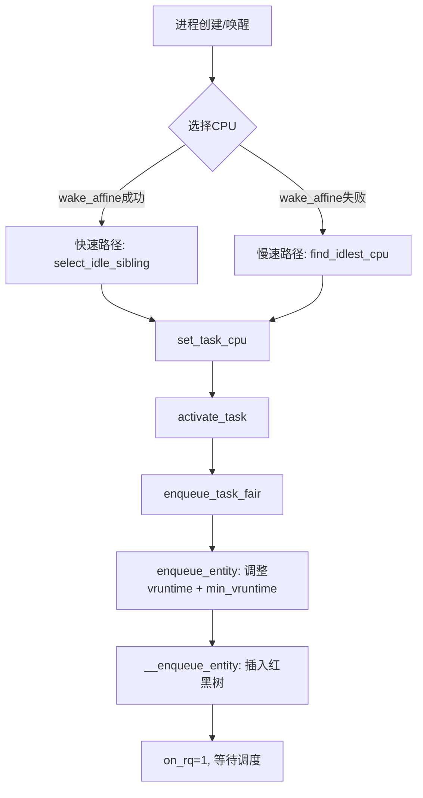

# 3.2 调度器定义与任务队列选择

CFS 重新对公平性进行了思考，其思想精髓是：“对于 N 个进程的系统，在时间周期 T 内，每一个进程运行 T/N 的时间！”。

CFS 摒弃了固定时间片的思路。根据当前系统的情况动态地计算调度周期。CFS 中的时间片从固定分配转化成为按比例。在一个调度周期这么长的时间内，将时间公平地分配给就绪任务。但绝对公平也是不现实的，有的进程可能确实就需要更多的 CPU，所以实际上分配是按比例来的。这个比例是按照优先级来的。该算法既保证了公平性，也兼顾了整体的调度延迟可控。接下来的小节中我们将深入地了解 CFS 的内部实现。

## 3.2 Linux 调度器定义

上一小节中，我们介绍了调度器的发展历程。在这个小节中，我们回到本书使用的内核版本 5.4 上。来观察下在今天的 Linux 上，调度器是如何实现的。

在 Linux 的调度策略的实现上，对于实时进程和普通用户进程是分开来考虑的。

- 对于 **实时进程** 采用多优先级任务队列。优先级高的进程有绝对的优先执行权。在同一优先级内部可以采用先来先服务或者是时间片轮转来分配 CPU。在内核中定义的调度策略是 `SCHED_RR` 和 `SCHED_FIFO`。
- 对于 **普通用户进程** 采用改进的时间片轮转 —— 完全公平调度器。在内核中对应的调度策略是 `SCHED_OTHER`。在这块，优先级的作用并不是绝对保证高优先级的服务优先调度。而是影响当进程被调度后，该使用多长的 CPU 时间。

系统的整体优先级策略是：如果系统中存在需要执行的实时进程，则优先执行实时进程。直到实时进程退出或者主动让出 CPU 时，才会调度执行普通进程。这几种调度策略的定义位于：

```c
// file:include/uapi/linux/sched.h
#define SCHED_NORMAL    0
#define SCHED_FIFO      1
#define SCHED_RR        2
......
```

在调度器中，运行队列是一个很重要的数据结构，它最重要的作用是管理那些处于可运行状态的进程。进程创建完后需要被添加到运行队列中。在说运行队列之前，我们得先回忆一下 CPU 的物理结构。在第一章我们提到过，现代主流的服务器都是多 CPU 架构，每颗 CPU 会包含多个物理核，每个物理核又可以超线程出多个逻辑核来供操作系统管理和使用。

拿我某台线上的服务器 32 核的服务器来举例，该服务器实际上是有 2 颗 CPU，每颗 CPU 包含了 8 个物理核心。这样总共包含的是 16 个物理核。因为该服务器每个物理核心又可以当成两个超线程来用，所以通过 top 命令可以看到有 32 “核”，这里看到的核其实是逻辑核。

为了让每个 CPU 核（逻辑核）都能更好地参与进程任务处理，不需要考虑和其他处理器竞争的问题，也能充分利用本地硬件 Cache 来对访问加速。新版的 Linux 内核会为每个 CPU 核都分配一个运行队列，也就是 `struct rq` 内核对象。我们来看看这个运行队列究竟是长什么样子的。

内核定义是通过 `DEFINE_PER_CPU` 来定义 Per CPU 变量的。其中运行队列使用的是 `DEFINE_PER_CPU_SHARED_ALIGNED` 宏。`DEFINE_PER_CPU_SHARED_ALIGNED` 宏接收两个参数，第一个参数可以理解为是数组类型，第二个参数可以理解为数组名。

```c
// file:kernel/sched/core.c
DEFINE_PER_CPU_SHARED_ALIGNED(struct rq, runqueues);

// file:include/linux/percpu-defs.h
#define DEFINE_PER_CPU_SHARED_ALIGNED(type, name)                     \
  DEFINE_PER_CPU_SECTION(type, name, PER_CPU_SHARED_ALIGNED_SECTION) \
  ____cacheline_aligned_in_smp
```

这个宏执行后的效果是初始化出来一个 `runqueues` 数组，在该数组中为每一个 CPU 核都配置了一个运行队列（`struct rq`）对象。

Linux 操作系统进程调度有多种多样的需求。例如有的需要按优先级来实时调度，只要高优先级的进程一就绪，就需要立即抢占 CPU 资源。有的不需要抢占这么频繁，对实时性要求没那么高，但需要进程公平地被分配 CPU 资源就可以了。

为了满足各种复杂的调度策略，内核在 `struct rq` 中实现了不同的调度类（Scheduling Class）。不同调度需求的进程放在不同的调度类中。

在优先级上，5.4 还沿用 O(1) 时代的 140 个优先级。[0,99] 还是给实时进程使用，[100,139] 还是给普通进程使用。另外在普通进程的优先级上，又额外引入了一个 nice 值。这个值和原来的优先级还是一一对应的，对应关系如下。

接下来我们详细看看实时调度器和完全公平调度器是如何实现的。

```c
// file:kernel/sched/sched.h
struct rq {
  // 实时任务调度器
  struct rt_rq rt;
  // CFS完全公平调度器
  struct cfs_rq cfs;
  struct dl_rq    dl;
  ...
}
```

### 3.2.1 实时调度器

在实时类调度需求中，内核线程如 migration 一般对实时性的要求比较高，这类进程需要尽可能实时地调度分配 CPU。

在这种调度算法中，优先级是最主要的考虑因素。高优先级的进程可以抢占低优先级进程 CPU 资源来运行。同一个优先级的进程按照先到先服务（`SCHED_FIFO`）或者时间片轮转（`SCHED_RR`）。

这种调度方式实现起来比较简单，只需要定义一些优先级，并为每个优先级各分配一个链表当队列即可，也叫多优先级队列。

我们来看下代码实现。其中 `rt_prio_array` 就是多优先级队列的实现，我们来看下它的定义。其中 `MAX_RT_PRIO` 定义在 `include/linux/sched/prio.h` 文件中，它的值为 100。也就是说有 100 个对应不同优先级的队列。

```c
// file:kernel/sched/sched.h
struct rt_rq {
  struct rt_prio_array active;
  unsigned int rt_nr_running;
  ...
}

struct rt_prio_array {
  ...
  struct list_head queue[MAX_RT_PRIO];
};

// file: include/linux/sched/prio.h
#define MAX_RT_PRIO   100
...
```

### 3.2.2 完全公平调度器

Linux 主要是用来运行用户进程的。对于绝大部分的用户进程来说，对实时性的要求没那么高。如果因为优先级的问题频繁地发生抢占，进而导致过多的进程上下文切换的开销，对系统整体的性能是有不利的影响的。所以用户进程采用的是不同的调度算法。

Linux 2.6.23 之后采用了完全公平调度器（Completely Fair Scheduler，CFS）作为对用户进程的调度算法。CFS 调度器的核心思想是强调让每个进程尽量公平地分配到 CPU 时间。

完全公平调度器在公平性的实现上，通过引入了一个虚拟时间 `vruntime`（virtual runtime）的概念来极大地维护了调度算法的简洁性。调度器只需要保证所有进程的 `vruntime` 是基本平衡的就可以。

CFS 在选择下一个进程的时候，以任务队列的 `vruntime` 大小来决定下一次调度该调度谁。`vruntime` 是根据静态优先级和物理时间片来综合计算得出的。一旦进程运行虚拟时间就会增加。尽量让虚拟时间最小的进程运行，谁小就要多运行，谁大就要少获得 CPU。最后尽量保证所有进程的虚拟时间相等。

但是在数据结构的组织上，有一个小小的难点要解决。那就是当所有程序运行起来后，每一个进程的虚拟时间是不断地在变化的。如何动态管理这些虚拟时间不断在变化的进程，快速把虚拟时间最少的进程找出来。CFS 调度器最终采用的解决办法是使用红黑树来管理任务。红黑树把进程按虚拟运行时间为 key，从小到大排序。越靠树的左侧，进程的运行虚拟时间越小。越靠树的右侧，进程的运行虚拟时间就越大。这样每当想挑选可运行进程时，直接从树的最左侧选择节点就可以了，计算速度非常的快。

以下是完全公平调度器 `cfs_rq` 内核对象的定义。在该对象中，最核心的是这个 `rb_root_cached` 类型的对象，这就是按照 `vruntime` 大小来管理所有就绪任务的红黑树。

```c
// file:kernel/sched/sched.h
struct cfs_rq {
  ...
  // 当前队列中所有进程vruntime中的最小值  
  u64 min_vruntime;
  // 保存就绪任务的红黑树
  struct rb_root_cached tasks_timeline;
  ...
}
```

在红黑树的节点中，放的是一个调度实体 `sched_entity` 对象。该对象有可能是一个真正的进程，也有可能是一个进程组。关于进程组在第八章中我们再介绍。在本章中，大家可以把 `sched_entity` 对象和进程一一对应起来就行。在这个 `sched_entity` 对象中，为每一个进程都保存了 `vruntime` 信息。

来简单看下代表进程线程的结构体 `task_struct`。在 `task_struct` 中定义了当前任务所使用的调度策略、也指明了调度亲和性，还有就是带了一个调度实体。在这个调度实体中会存储着完全公平调度器所需要的一些信息，以下是相关定义。

```c
// file:include/linux/sched.h 
struct task_struct {
  ...
  // 调度策略
  const struct sched_class  *sched_class;
  // 调度亲和性相关
  const cpumask_t     *cpus_ptr;
  cpumask_t     cpus_mask;
  int       nr_cpus_allowed;
  // 调度实体
  struct sched_entity   se;
  ...
}

// file:include/linux/sched.h
struct sched_entity {
  // 当前进程的权重信息
  struct load_weight    load;
  // 指向自己在红黑树上的节点位置
  struct rb_node      run_node;
  // 进程开始执行时的时间,将来用来计算运行时长
  u64       exec_start;
  // 记录总的运行时间
  u64       sum_exec_runtime;
  // 进程的虚拟运行时间,也是红黑树中的key
  u64       vruntime;  
  ...
}
```

该结构体中的这些字段都是完全公平调度器所必须要使用的信息。CFS 调度器一旦选择了一个进程进入执行状态，会立刻开启对其虚拟时间的跟踪过程，并且会动态地更新进程的 `vruntime`。有了这个信息，调度器就可以不断的检查目前系统的公平性。失去 CPU 执行权的那个任务会被重新插入红黑树，其在红黑树中的位置是由它接下来的的 `vruntime` 值决定。通过这样动态地运转，进而保证所有任务的 `vruntime` 是公平的。

还得强调的是，`vruntime` 只是一个虚拟运行时间。它是经过真实运行时间换算出来的结果，其中调度实体 `sched_entity` 中的 `struct load_weight load` 就是这个换算的依据。会按照这个权重进行换算。

## 3.3 进程的任务队列选择

在这一小节中，我们来看下进程时如何选择并加入到一个任务队列中的。有几种时机需要将进程加入到运行队列，包括新进程创建出来的时候，老进程唤醒的时候。

### 3.3.1 新进程创建时加入

上面的小节中我们看到了进程的 `task_struct` 中包含了实现完全公平调度器的一些成员。进程在创建的时候就需要对这些成员进行必要的初始化。我们来看下这个初始化过程。

之前在第二章中我们讲到，fork 创建时主要是调用了 `copy_process` 对新进程的 `task_struct` 进行各种初始化。在初始化的过程中，也涉及到几个进程调度相关的变量的初始化，这里我们专门来看一下。

在创建进程 `copy_process` 时会调用 `sched_fork` 来完成调度相关的初始化。

```c
// file:kernel/fork.c
static struct task_struct *copy_process(...)
{
  ...
  retval = sched_fork(clone_flags, p);
  ...
}

// file:kernel/sched/core.c
int sched_fork(unsigned long clone_flags, struct task_struct *p)
{
  __sched_fork(clone_flags, p);
  p->__state = TASK_NEW;
  if (rt_prio(p->prio))
    p->sched_class = &rt_sched_class;
  else
    p->sched_class = &fair_sched_class;
  ...
}
```

对于大部分的应用程序来说都是会走到上面代码中最重要的 `p->sched_class = &fair_sched_class`。这一行表示这个进程将会被完全公平调度策略进行调度。其中 `fair_sched_class` 是一个全局对象，代表完全公平调度器。它实现了调度器类中要求的添加任务队列、删除任务队列、从队列中选择进程等方法。`fair_sched_class` 是在 `kernel/sched/fair.c` 下定义的。

另外就是把进程的虚拟运行时间初始化为 0，迁移次数初始化为 0。

前面我们说过完全公平调度队列里的进程按照 `vruntime` 来调度的，谁的最小就优先调度谁。新进程的 `p->se.vruntime` 被初始化为 0，比其它老进程的值要小很多。那么在相当长的时间里它都将占据调度优势。这显然是不太公平的。为了解决这个问题，完全公平调度器会在每个 `cfs_rq` 中都会维护一个 `min_vruntime` 值，存储当前队列中所有进程的最小的 `min_vruntime`。在新进程真正加入运行队列时，会将其值设置为 `min_vruntime`。通过这种方式来保证新老进程的公平性。在接下来的小节中我们将看到这段逻辑。

进程在 `copy_process` 创建完毕后，通过调用 `wake_up_new_task` 将新进程加入到就绪队列中，等待调度器调度。

```c
// file:kernel/sched/fair.c
DEFINE_SCHED_CLASS(fair) = {
  .enqueue_task   = enqueue_task_fair,
  .dequeue_task   = dequeue_task_fair,
  ...
}

// file:kernel/sched/sched.h
#define DEFINE_SCHED_CLASS(name) \
const struct sched_class name##_sched_class \
  __aligned(__alignof__(struct sched_class)) \
  __section("__" #name "_sched_class")

// file:kernel/sched/core.c
static void __sched_fork(struct task_struct *p)
{
  p->on_rq      = 0;
  ...
  p->se.nr_migrations   = 0;
  p->se.vruntime      = 0;
  ...
}
```

今天我们可以来展开看看 `wake_up_new_task` 执行时具体都发生了什么。新进程是如何加入到 CPU 运行队列（`struct rq`）中的。

`wake_up_new_task` 主要做的是选择一个合适 CPU，然后将进程添加到所选的 CPU 的任务队列中。接下来我们分别展开来看一下。

```c
// file:kernel/fork.c
pid_t kernel_clone(struct kernel_clone_args *args)
{
  // 复制一个 task_struct 出来
  struct task_struct *p;
  p = copy_process(NULL, trace, NUMA_NO_NODE, args);
  // 子任务加入到就绪队列中去,等待调度器调度
  wake_up_new_task(p);
  ...
}

// file:kernel/sched/core.c
void wake_up_new_task(struct task_struct *p)
{
  // 1 为进程选择一个合适的CPU
  // 2 为进程指定运行队列
  __set_task_cpu(p, select_task_rq(p, task_cpu(p), WF_FORK));
  // 3 将进程添加到运行队列红黑树
  rq = __task_rq_lock(p);
  activate_task(rq, p, 0);
  ...
}
```

#### 1 选择合适的 CPU 运行队列

前面我们讲到，每个 CPU 核都有一个对应的运行队列 `runqueue`（`struct rq`）。所以新进程在加入调度前的第一件事就是选择一个合适的运行队列。然后使用该任务队列中，并等待调度。

要稍微注意的是，在 `__set_task_cpu(p, select_task_rq(p, task_cpu(p), WF_FORK))` 这一行代码中包含对两个函数的调用。

- `select_task_rq` 是选择一个合适的 CPU（运行队列）
- `__set_task_cpu` 是使用选择好的 CPU

在讲选择运行队列之前，我们先简单回顾一下 CPU 里的缓存。

CPU 同一个物理核上的两个逻辑核是共享一组 L1 和 L2 缓存的。整颗物理 CPU 上所有的核心共享同一组 L3。每一级 Cache 的访问耗时都差别非常大，L1 大约是 1 ns 多一些，L2 大约是 2 ns 多，L3 大约是 4 - 8 ns。而内存耗时在最坏的随机 IO 情况下可以达到 30 多 ns。

了解了 CPU 的物理结构以及各级缓存的性能差异，你就大概能弄明白选择 CPU 的核心目的了。CPU 调度是在缓存性能和空闲核心两个点之间做权衡。同等条件下会尽量优先考虑缓存命中率，选择同 L1/L2 的核，其次会选择同一个物理 CPU 上的（共享 L3选择运行队列 `select_task_rq` 这个函数有点复杂。但是理解了上面这个逻辑后，相信你理解起来就会容易很多。

在本章前面我们提到了 fork 出来的新进程的 `sched_class` 使用的是公平调度器 `fair_sched_class`，再翻开这个结构体的定义，可以找到其定义的 `select_task_rq` 函数的具体实现为 `select_task_rq_fair`。

所以上面的 `p->sched_class->select_task_rq` 这一句实际是进入到了 `fair_sched_class` 的 `select_task_rq_fair` 方法里，通过公平调度器实现的选择任务队列的函数来选择的。

```c
//file:kernel/sched/core.c
static inline
int select_task_rq(struct task_struct *p, int sd_flags, int wake_flags)
{
  int cpu = p->sched_class->select_task_rq(p, sd_flags, wake_flags);
  ...
  return cpu;
}

// file:kernel/sched/fair.c
DEFINE_SCHED_CLASS(fair) = {
  ...
  .select_task_rq   = select_task_rq_fair,
  ...
}

//file:kernel/sched/fair.c
static int
select_task_rq_fair(struct task_struct *p, int prev_cpu, int wake_flags)
```

为了方便你理解，我把 `select_task_rq_fair` 源码精简处理后，只留下了关键逻辑。我们本书使用的源码版本是 6.2，这个版本在选择核的时候，首先第一个策略是 `wake_affine` 机制。这个 `wake_affine` 机制简单来讲，就是尽量优先选择要唤醒的进程上一次使用的 CPU 逻辑核，或者是要唤醒它的进程所在的核（当前逻辑核）。因为这两个核上大概率缓存还是热的，进程调度上来会运行的比较快。

在快速路径选择中，主要的策略就是考虑共享 cache 且 idle 的 CPU。优先选择任务上一次运行的 CPU，其次是唤醒任务的 CPU。如果快速路径没选到，那就进入慢速路径。首选出负载最小的组（`find_idlest_group`），然后再从该组中选出最空闲的 CPU（`find_idlest_cpu`）。当进入到慢速路径以后，会导致进程下一次执行的时候跑的别的核、甚至是别的物理 CPU 上，这样以前跑热的 L1、L2、L3 就都失效了。用户进程过多地发生这种漂移会对性能造成影响。当然内核在极力地避免。如果你想强行干掉漂移，可以试试 `taskset` 命令。

讲到这里，我得说一下现在整个国内互联网公司都在流行的在线离线混部。业界的公司为了更充分地将 CPU 利用率给拉起来，会在在线业务的机器上部署离线计算任务，目的是更充分地压榨 CPU 资源。但是这里面有一个细节非常需要注意。那就是在线离线混布会破坏掉内核的 `wake_affine` 机制。

`wake_affine` 机制生效的前提得是 `pre_cpu` 或当前 CPU 变量对应的 CPU 核得有空闲才行。假如说这台机器上进行了在线离线混布，宿主机整体的 CPU 利用率被打到很高的水平，比如说 70%。那么 `wake_affine` 机制能起作用的概率就会低很多。进程在不同的核上运行概率增加，Cache 中的数据都是凉的，穿透到内存的访问次数增加，进程的运行性能就会下降很多。

```c
{
    struct sched_domain *tmp, *sd = NULL;
    ...
```

# 3.2 调度器定义与任务队列选择

## wake_affine机制

```c
// wake_affine机制
    for_each_domain(cpu, tmp) {
        ...
        if (want_affine && (tmp->flags & SD_WAKE_AFFINE) &&
            cpumask_test_cpu(prev_cpu, sched_domain_span(tmp))) {
            if (cpu != prev_cpu)
                new_cpu = wake_affine(tmp, p, cpu, prev_cpu, sync);
            sd = NULL; 
            break;
        }
    }
    ...
    if (unlikely(sd)) {
        // 慢速路径
        new_cpu = find_idlest_cpu(sd, p, cpu, prev_cpu, sd_flag);
    } else if (sd_flag & SD_BALANCE_WAKE) { /* XXX always ? */
        // 快速路径
        new_cpu = select_idle_sibling(p, prev_cpu, new_cpu);
    }
    return new_cpu;
}
```

> [!NOTE] **wake_affine机制与离线混布**
> 离线混布会**破坏内核的wake_affine机制**。该机制生效的前提是 `pre_cpu` 或当前 `cpu` 变量对应的CPU核有空闲。若宿主机整体CPU利用率很高（如70%），wake_affine机制起作用的概率就会降低，进程在不同核上运行的概率增加，Cache数据变冷，穿透到内存的访问次数增加，导致性能下降。
>
> 从CPU利用率角度看：假设在线任务消耗30%，离线任务单独跑也消耗30%，混布后由于wake_affine被破坏，整体可能变成70%+（而非简单的60%）。因此离线混布虽好，使用时需注意。

## 2 为进程指定运行队列

选择CPU后，`set_task_cpu` 为进程指定运行队列。

```c
//file:kernel/sched/core.c
void set_task_cpu(struct task_struct *p, unsigned int new_cpu)
{
  ...
  if (task_cpu(p) != new_cpu) {
    if (p->sched_class->migrate_task_rq)
      p->sched_class->migrate_task_rq(p, new_cpu);
    p->se.nr_migrations++;
    ...
  }
  __set_task_cpu(p, new_cpu);
}
```

函数开始时先判断是否是迁移，是则调用调度器实现的 `migrate_task_rq`，并将调度实体 `se` 中的 `nr_migrations` 加1。然后依次调用 `__set_task_cpu`、`set_task_rq`，最终为新进程的调度实体 `se` 上设置好正确的运行队列。

```c
//file:kernel/sched/sched.h
static inline void set_task_rq(struct task_struct *p, unsigned int cpu)
{
  struct task_group *tg = task_group(p);
  set_task_rq_fair(&p->se, p->se.cfs_rq, tg->cfs_rq[cpu]);
  p->se.cfs_rq = tg->cfs_rq[cpu];
  p->se.parent = tg->se[cpu];
}
```

## 3 将进程添加到运行队列红黑树

新进程 `task_struct` 指针 `p` 上记录了所在的任务队列。调用 `__task_rq_lock` 函数给 CPU 的运行队列 `struct rq` 加锁防止冲突。接着调用 `activate_task` 将新进程添加到该 CPU 运行队列中。

```c
// file:kernel/sched/core.c
void wake_up_new_task(struct task_struct *p)
{
  // 1 为进程选择一个合适的CPU
  // 2 为进程指定运行队列
  __set_task_cpu(p, select_task_rq(p, task_cpu(p), WF_FORK));
  // 3 将进程添加到运行队列红黑树中
  rq = __task_rq_lock(p);
  activate_task(rq, p, 0);
  ...
}
```

翻开 [[完全公平调度器]] `fair_sched_class` 对象的定义，可见 `p->sched_class->enqueue_task` 实际调用的是 `enqueue_task_fair`。经过 `enqueue_task_fair` → `enqueue_entity` → `__enqueue_entity`，最终插入到红黑树中等待调度。

不过在进入任务队列之前，需要对进程的 `vruntime` 进行适当调整。否则新进程的 `vruntime` 为 0，对老进程不公平。调整方式是将当前运行队列的 `min_vruntime` 加给新进程。

这样新进程的 `vruntime` 虽然也是最低的，但不会长时间占据调度优势。最后插入红黑树的真正函数是 `__enqueue_entity`。`se->on_rq` 标记当前任务已进入就绪队列等待。

```c
// file: kernel/sched/core.c
void activate_task(struct rq *rq, struct task_struct *p, int flags)
{
  ......
  enqueue_task(rq, p, flags);
}

static inline void enqueue_task(struct rq *rq, struct task_struct *p, int flags)
{
  ......
  p->sched_class->enqueue_task(rq, p, flags);
}

// file:kernel/sched/fair.c
DEFINE_SCHED_CLASS(fair) = {
  .enqueue_task   = enqueue_task_fair,
  ...
}

// file:kernel/sched/fair.c
static void
enqueue_entity(struct cfs_rq *cfs_rq, struct sched_entity *se, int flags)
{
  ...
  se->vruntime += cfs_rq->min_vruntime;
  __enqueue_entity(cfs_rq, se);
  se->on_rq = 1;
}

// file:kernel/sched/fair.c
static void __enqueue_entity(struct cfs_rq *cfs_rq, struct sched_entity *se)
{
  rb_add_cached(&se->run_node, &cfs_rq->tasks_timeline, __entity_less);
}

// file:include/linux/rbtree.h
static __always_inline struct rb_node *
```

在 `__enqueue_entity` 中，首先根据进程的 `vruntime` 寻找合适的位置。`entity_before` 用于判断两个节点谁的 `vruntime` 更小。找到位置后，调用 `rb_insert_xxx` 将节点插入红黑树。这样下一步就有机会被调度到真正运行了。

## 3.3.2 老进程唤醒时加入

进程阻塞后等待的事件就绪时（如等待的 socket 网络请求到达），内核会依次调用 `default_wake_function`、`try_to_wake_up` 来将进程唤醒。

```c
rb_add_cached(struct rb_node *node, struct rb_root_cached *tree, ...)
{
  struct rb_node **link = &tree->rb_root.rb_node;
  struct rb_node *parent = NULL;
  ...
  // 根据进程的vruntime值在红黑树中寻找位置
  while (*link) {
    ...
    if (entity_before(se, entry)) {
      link = &parent->rb_left;
    } else {
      link = &parent->rb_right;
    }
  }
  
  // 插入到红黑树中
  rb_link_node(node, parent, link);
  rb_insert_color_cached(node, tree, leftmost);
}

// file:kernel/sched/fair.c 
static inline bool entity_before(struct sched_entity *a,
        struct sched_entity *b)
{
  return (s64)(a->vruntime - b->vruntime) < 0;
}
```

### 图像说明

[Image 431 on Page 92] — 此处对应 `wake_affine` 机制流程示意图  
[Image 432 on Page 92] — `wake_affine` 中快速/慢速路径选择图  
[Image 438 on Page 93] — `set_task_cpu` 函数调用关系图  
[Image 439 on Page 93] — `set_task_rq` 内部结构图  
[Image 445 on Page 94] — `wake_up_new_task` 整体流程  
[Image 450 on Page 95] — `activate_task` 与 `enqueue_task` 关系  
[Image 455 on Page 96] — `enqueue_entity` 中 `vruntime` 调整示意图  
[Image 470 on Page 100] — `__enqueue_entity` 红黑树插入过程  
[Image 481 on Page 103] — 唤醒进程 `try_to_wake_up` 调用链

> [!TIP] 以上图片可在原始PDF的对应页码中找到，展示了调度器关键函数的数据流与控制流。

### 可选Mermaid流程图（补充说明）



> 此图仅为辅助理解，原图像细节以PDF中的截图为准。