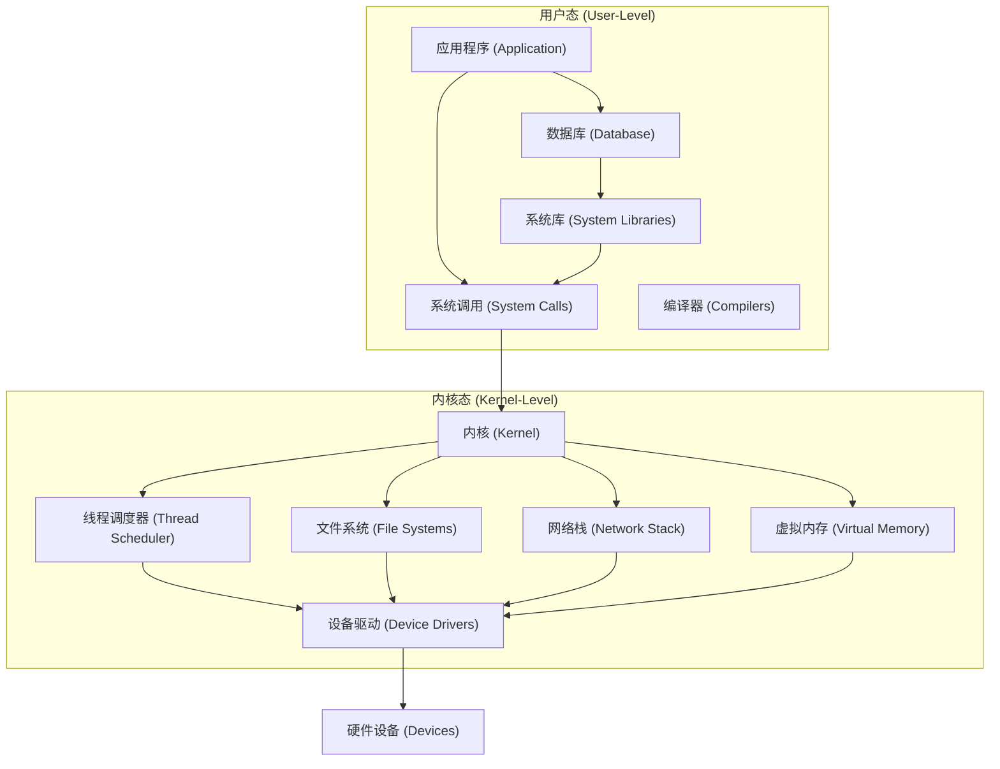
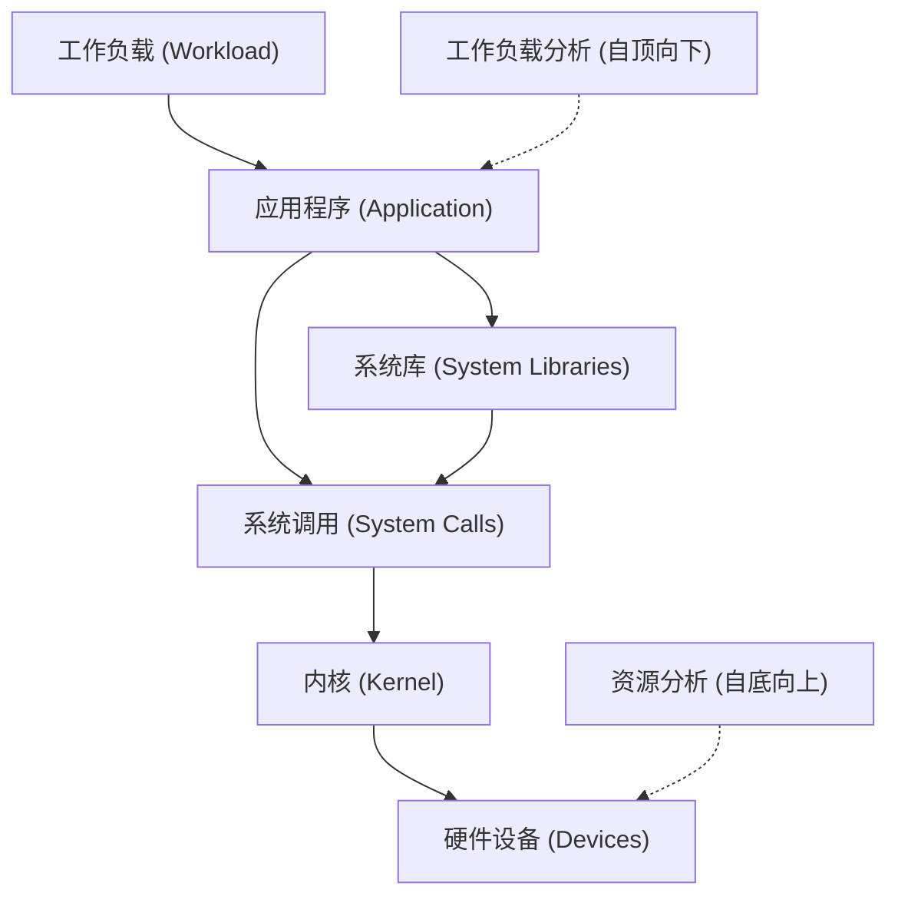
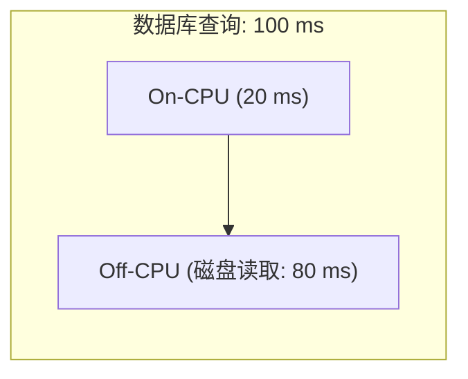
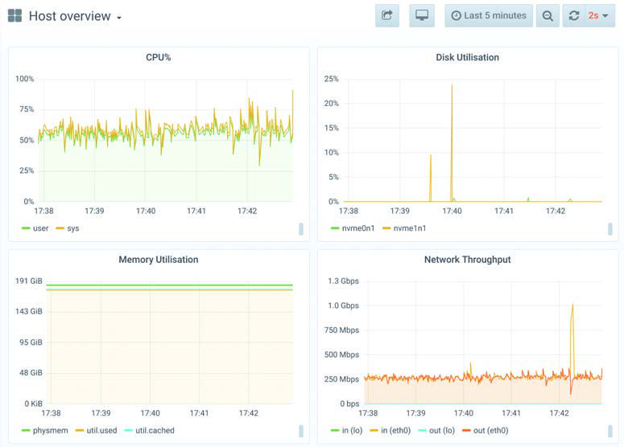
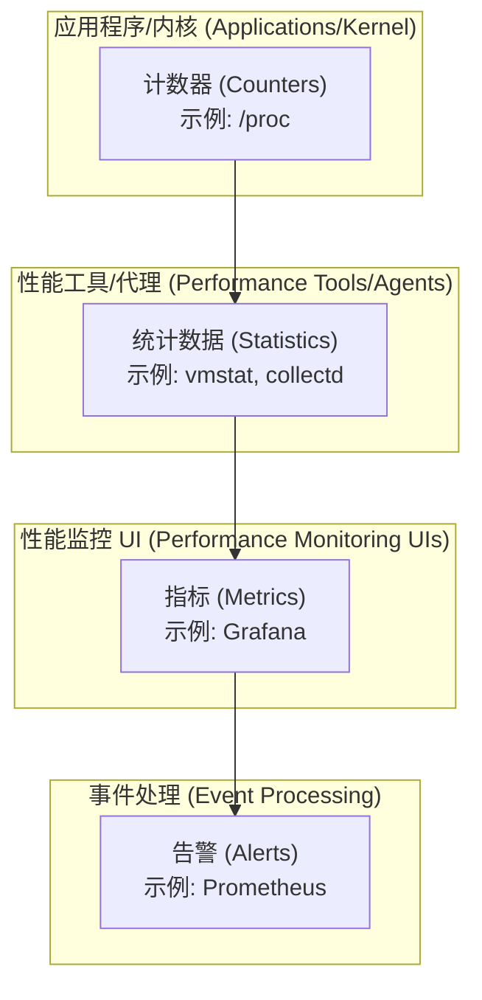
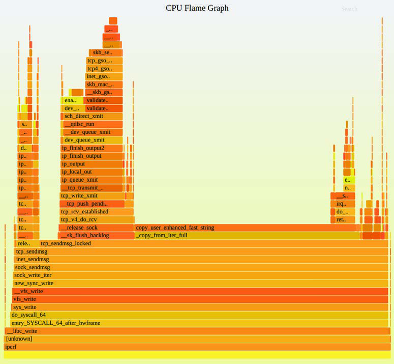

# 第 1 章 绪论

计算机性能是一门令人兴奋、充满变化且具有挑战性的学科。本章将向你介绍系统性能领域。本章的学习目标包括：

- 理解系统性能、角色、活动以及面临的挑战。
- 理解可观测性工具与实验性工具之间的区别。
- 建立对性能可观测性的基础理解：统计数据、剖析（Profiling）、火焰图（Flame Graphs）、追踪（Tracing）、静态插桩与动态插桩。
- 学习方法论的作用以及 Linux 60 秒分析清单。

本章包含了对后续章节的引用，因此它既是系统性能的入门指南，也是本书的导读。本章最后通过案例研究展示了系统性能在实践中是如何运作的。

## 1.1 系统性能 (Systems Performance)

[[系统性能]]（Systems Performance）研究的是整个计算机系统的性能，包括所有主要的软件和硬件组件。数据路径上的任何环节，从存储设备到应用程序软件，都包含在内，因为它们都可能影响性能。对于分布式系统，这意味着涉及多个服务器和应用程序。如果你还没有一份展示环境数据路径的图表，请找一份或自己画一份；这将帮助你理解组件之间的关系，并确保你不会遗漏整个区域。

系统性能的典型目标是通过减少[[延迟]]（Latency）来改善最终用户体验，并降低计算成本。降低成本可以通过消除低效环节、提高系统[[吞吐量]]（Throughput）以及常规调优来实现。

图 1.1 展示了单台服务器上的通用系统软件栈，包括操作系统（OS）内核，以及示例数据库和应用层。


**图 1.1 通用系统软件栈**

术语“全栈”（Full Stack）有时仅用于描述应用环境，包括数据库、应用程序和 Web 服务器。但在谈论系统性能时，我们使用“全栈”来指代从应用程序一直到硬件（Metal，即硬件本身）的整个软件栈，包括系统库、内核和硬件。系统性能研究的是全栈。

图 1.1 中包含了编译器，因为它们在系统性能中发挥着重要作用。这个软件栈将在第 3 章“操作系统”中讨论，并在后续章节中进行更详细的研究。以下章节将更详细地描述系统性能。

## 1.2 角色 (Roles)

系统性能由多种职业角色负责，包括系统管理员、[[网站可靠性工程师 (SRE)]]、应用开发人员、网络工程师、数据库管理员、Web 管理员和其他支持人员。对于其中的许多角色，性能只是工作的一部分，性能分析往往集中在该角色的职责范围内：网络团队检查网络，数据库团队检查数据库，依此类推。对于某些性能问题，寻找根本原因或促成因素需要多个团队的协作努力。

有些公司聘请专门的性能工程师，其主要活动就是性能优化。他们可以跨多个团队工作，对环境进行整体研究，这种方法对于解决复杂的性能问题可能至关重要。他们还可以作为中心资源，为整个环境寻找和开发更好的性能分析及[[容量规划]]工具。

例如，Netflix 有一个云性能团队，我就是其中一员。我们协助微服务和 SRE 团队进行性能分析，并构建供所有人使用的性能工具。

聘请多名性能工程师的公司可以允许个人专注于一个或多个领域，提供更深层次的支持。例如，大型性能工程团队可能包括内核性能、客户端性能、语言性能（如 Java）、运行时性能（如 JVM）、性能工具等方面的专家。

## 1.3 活动 (Activities)

系统性能涉及多种活动。以下是软件项目从构思到开发再到生产部署的生命周期中理想的活动步骤列表。本书涵盖了帮助执行这些活动的方法论和工具。

1. 为未来产品设定性能目标并进行性能建模。
2. 对原型软件和硬件进行性能表征（Performance characterization）。
3. 在测试环境中对开发中的产品进行性能分析。
4. 针对新产品版本进行非回归测试（Non-regression testing）。
5. 对产品发布版本进行[[基准测试]]。
6. 在目标生产环境中进行概念验证（PoC）测试。
7. 在生产环境中进行性能调优。
8. 监控运行中的生产软件。
9. 生产环境问题的性能分析。
10. 生产环境问题的事件回顾（Incident reviews）。
11. 开发性能工具以增强生产分析能力。

步骤 1 到 5 构成了传统的产品开发过程，无论是销往客户的产品还是公司内部服务。产品随后被发布，可能先在目标环境（客户或本地）进行概念验证测试（步骤 6），或者直接进行部署和配置。如果在目标环境中遇到问题（步骤 6 到 9），意味着该问题在开发阶段未被检测到或修复。

性能工程理想情况下应在选择任何硬件或编写软件之前开始：第一步应是设定目标并创建性能模型。然而，产品开发往往在没有这一步的情况下进行，将性能工程工作推迟到问题出现后的晚些时候。随着开发流程的每一步推进，修复由于早期架构决策导致的性能问题会变得越来越困难。

云计算为概念验证测试（步骤 6）提供了新技术，鼓励跳过早期步骤（步骤 1 到 5）。
- 一种技术是在单个实例上测试新软件，仅承载一小部分生产负载：这被称为**金丝雀测试 (Canary Testing)**。
- 另一种技术将此作为软件部署的常规步骤：流量逐渐迁移到新实例池，同时保留旧池在线作为备份；这被称为**蓝绿部署 (Blue-Green Deployment)**（Netflix 使用术语“红黑部署”）。

有了这些“安全失败”选项，新软件往往在没有任何事先性能分析的情况下就在生产中进行测试，并在需要时快速回滚。我建议在实际操作中也要执行早期活动，以获得最佳性能（尽管可能有缩短上市时间的原因促使更早进入生产）。

术语“容量规划”可以指上述多项活动。在设计阶段，它包括研究开发软件的资源占用，以查看设计在多大程度上能满足目标需求。部署后，它包括监控资源使用情况，以便在问题发生前进行预测。

生产问题的性能分析（步骤 9）也可能涉及网站可靠性工程师（SRE）；随后是事件回顾会议（步骤 10），分析发生了什么，分享调试技术，并寻找避免相同事件再次发生的方法。此类会议类似于开发人员的回顾展。

环境和活动因公司和产品而异，在许多情况下并非所有十个步骤都会执行。你的工作也可能只专注于其中的某些或仅一项活动。

## 1.4 视角 (Perspectives)

除了关注不同的活动外，性能角色还可以从不同的视角来看待。图 1.2 标注了两种性能分析视角：[[工作负载分析]]和[[资源分析]]，它们从不同的方向切入软件栈。


**图 1.2 分析视角**

资源分析视角通常由负责系统资源的系统管理员采用。应用开发人员负责交付工作负载的性能，通常关注工作负载分析视角。每种视角都有其优势，详见第 2 章。对于挑战性问题，尝试从两个视角同时分析会很有帮助。

## 1.5 性能的挑战性 (Performance Is Challenging)

系统性能工程是一个挑战性领域，原因有多种，包括：它是主观的、它是复杂的、可能没有单一的根本原因，并且通常涉及多个问题。

### 1.5.1 主观性 (Subjectivity)
技术学科往往是客观的，以至于行业内的人以看待事物的“黑白分明”而闻名。软件故障排除通常就是这样：要么存在 Bug，要么不存在；要么修复了，要么没修复。此类 Bug 通常以错误消息的形式出现，可以很容易地被解释和理解为错误的存在。

然而，性能往往是主观的。对于性能问题，有时甚至不清楚是否存在问题，以及何时算作修复。一个用户认为的“差”性能（因此被视为问题），对另一个用户来说可能是“好”性能。

考虑以下信息：
> 平均磁盘 I/O 响应时间为 1 毫秒。

这是“好”还是“差”？虽然响应时间（或延迟）是最好的指标之一，但解读延迟信息却很困难。在某种程度上，一个给定的指标是好是坏可能取决于应用开发人员和最终用户的性能预期。

主观性能可以通过定义明确的目标变为客观性能，例如设定目标平均响应时间，或要求一定百分比的请求落在特定的延迟范围内。第 2 章介绍了处理这种主观性的其他方法，包括延迟分析。

### 1.5.2 复杂性 (Complexity)
除了主观性，由于系统的复杂性以及缺乏明显的分析起点，性能也是一门具有挑战性的学科。在云计算环境中，你甚至可能不知道该先看哪台服务器实例。有时我们从一个假设开始（例如归咎于网络或数据库），性能分析师必须弄清楚这是否是正确的方向。

性能问题也可能源于子系统之间复杂的相互作用，而这些子系统在孤立分析时表现良好。这可能由于“级联故障”引起，即一个失效组件导致其他组件出现性能问题。要理解产生的问题，你必须理清组件之间的关系并了解它们的贡献。

[[瓶颈]]也可能非常复杂并以意想不到的方式相关联；修复一个可能只是将瓶颈转移到系统的其他地方，整体性能并未如预想般提升。

除了系统的复杂性，性能问题也可能由生产工作负载的复杂特性引起。这些案例在实验环境中可能永远无法重现，或者只能间歇性重现。

解决复杂的性能问题通常需要一种整体（Holistic）方法。可能需要调查整个系统——包括其内部结构和外部交互。这需要广泛的技能，并使性能工程成为一项多样化且极具智力挑战的工作。

不同的方法论可以指导我们应对这些复杂性，如第 2 章所述；第 6 至 10 章包含了针对特定系统资源（CPU、内存、文件系统、磁盘和网络）的具体方法论。在某些情况下，性能问题可能是由于这些资源的相互作用引起的。

### 1.5.3 多重原因 (Multiple Causes)
有些性能问题没有单一的根本原因，而是由多个促成因素组成的。想象一下，三个正常的事件同时发生并结合在一起导致了性能问题：每个事件在孤立状态下都是正常的，都不是根本原因。

### 1.5.4 多重性能问题 (Multiple Performance Issues)
发现一个性能问题通常不是难事；在复杂的软件中往往有很多问题。为了说明这一点，试着查看你操作系统的 Bug 数据库并搜索“performance”这个词。你可能会感到惊讶！通常会有一些已知但尚未修复的性能问题，即使是在被认为具有高性能的成熟软件中也是如此。这给分析性能带来了又一个困难：真正的任务不是寻找问题；而是确定哪个或哪些问题最重要。

为此，性能分析师必须量化问题的量级。有些性能问题可能并不适用于你的工作负载，或者仅在极小程度上适用。理想情况下，你不仅要量化问题，还要估计每个问题可能带来的潜在加速比（Speedup）。当管理层寻求投入工程或运营资源的理由时，这些信息非常有价值。

一种非常适合性能量化的指标（如果可用）是延迟。

## 1.6 延迟 (Latency)

[[延迟]]是衡量等待时间的指标，也是一个核心性能指标。广义上，它可以指任何操作完成所需的时间，如应用请求、数据库查询、文件系统操作等。例如，延迟可以表达网站加载完毕所需的时间，从点击链接到屏幕渲染（Screen paint）。对于客户和网站提供商来说，这都是一个重要指标：高延迟会导致挫败感，客户可能会流失到其他地方。

作为指标，延迟可以用来估计最大加速比。例如，图 1.3 描绘了一个耗时 100 毫秒的数据库查询（这就是延迟），其中有 80 毫秒阻塞在等待磁盘读取上。通过消除磁盘读取（例如通过缓存）所能达到的最大性能提升可以计算出来：从 100 毫秒减少到 20 毫秒（100 - 80），速度提升了 5 倍（5x）。这就是估计的加速比，计算过程也量化了性能问题：磁盘读取导致查询运行慢了高达 5 倍。


**图 1.3 磁盘 I/O 延迟示例**

使用其他指标无法进行此类计算。例如，每秒 I/O 操作数（IOPS）取决于 I/O 类型，通常无法直接比较。如果某项变更减少了 80% 的 IOPS 速率，很难知道性能影响。IOPS 可能减少了 5 倍，但如果每个 I/O 的大小（字节）增加了 10 倍呢？

延迟术语也可能存在歧义。例如，在网络中，延迟可能指连接建立时间，不包括数据传输时间；也可能指连接的总持续时间，包括数据传输（例如 DNS 延迟通常这样测量）。本书将尽量使用明确的术语：上述例子最好描述为“连接延迟”和“请求延迟”。延迟术语在每章开头也有总结。

虽然延迟是有用的指标，但并非总是在需要的时间和地点可用。某些系统区域仅提供平均延迟；某些则完全没有延迟测量。随着新的基于 [[BPF]] 的可观测性工具的出现，现在可以从任意感兴趣的点测量延迟，并提供展示延迟完整分布的数据。

## 1.7 可观测性 (Observability)

[[可观测性]]是指通过观测来理解系统，并对完成此任务的工具进行分类。这包括使用计数器、剖析（Profiling）和追踪（Tracing）的工具。它不包括基准测试工具，因为后者通过执行工作负载实验来修改系统状态。在生产环境中，应尽可能优先尝试可观测性工具，因为实验性工具可能会通过资源竞争干扰生产工作负载。对于空闲的测试环境，你可能希望从基准测试工具开始以确定硬件性能。

在本节中，我将介绍计数器、指标、剖析和追踪。我将在第 4 章更详细地解释可观测性，涵盖系统级与进程级可观测性、Linux 可观测性工具及其内部原理。第 5 至 11 章包含特定章节的可观测性内容，例如第 6.6 节讨论 CPU 可观测性工具。

### 1.7.1 计数器、统计数据与指标 (Counters, Statistics, and Metrics)
应用程序和内核通常提供有关其状态和活动的数据：操作计数、字节计数、延迟测量、资源利用率和错误率。它们通常实现为硬编码在软件中的整数变量，称为[[计数器]]，其中一些是累加的且始终递增。性能工具可以在不同时间读取这些累加计数器以计算[[统计数据]]：随时间的变化率、平均值、百分位数等。

例如，`vmstat(8)` 实用程序会打印系统范围的虚拟内存统计数据汇总等，数据基于 `/proc` 文件系统中的内核计数器。以下 `vmstat(8)` 输出示例来自一台拥有 48 个 CPU 的生产环境 API 服务器：

```bash
$ vmstat 1 5
procs -----------memory---------- ---swap-- -----io---- -system-- ------cpu-----
 r  b   swpd   free   buff  cache   si   so    bi    bo   in   cs us sy id wa st
19  0      0 6531592  42656 1672040    0    0     1     7   21   33 51  4 46  0  0
26  0      0 6533412  42656 1672064    0    0     0     0 81262 188942 54  4 43  0  0
62  0      0 6533856  42656 1672088    0    0     0     8 80865 180514 53  4 43  0  0
34  0      0 6532972  42656 1672088    0    0     0     0 81250 180651 53  4 43  0  0
31  0      0 6534876  42656 1672088    0    0     0     0 74389 168210 46  3 51  0  0
```
这显示系统范围的 CPU 利用率约为 57%（`cpu us + sy` 列）。这些列在第 6 章和第 7 章中有详细解释。

[[指标]]是为评估或监控目标而选定的统计数据。大多数公司使用监控代理定期记录选定的统计数据（指标），并在图形界面中绘制图表以查看随时间的变化。监控软件还可以支持从这些指标创建自定义告警，例如在检测到问题时发送电子邮件通知员工。

这种从计数器到告警的层次结构如图 1.4 所示。图 1.4 作为一个指南帮助你理解这些术语，但它们在行业中的使用并不僵化。“计数器”、“统计数据”和“指标”这些术语通常可以互换使用。此外，告警可能由任何层产生，而不局限于专门的告警系统。

作为绘制指标图表的示例，图 1.5 是一个观察前述 `vmstat(8)` 输出中同一台服务器的 Grafana 界面截图。这些折线图对于容量规划非常有用，可以帮助你预测资源何时会耗尽。


**图 1.5 系统指标 GUI (Grafana)**

你对性能统计数据的解读将随着对其计算方式的理解而提高。包括平均值、分布、众数和离群值在内的统计数据在第 2 章“方法论”第 2.8 节“统计学”中有总结。


**图 1.4 性能插桩术语层级**

有时，时间序列指标足以解决性能问题。了解问题开始的确切时间可能与已知的软件或配置变更相关联，从而进行回滚。其他时候，指标只能指明方向，提示存在 CPU 或磁盘问题，但无法解释原因。剖析或追踪工具对于深入挖掘并寻找原因是必要的。

### 1.7.2 剖析 (Profiling)
在系统性能中，术语[[剖析]]通常指使用执行采样的工具：提取测量的子集（样本）以描绘目标的粗略概貌。CPU 是常见的剖析目标。通常用于剖析 CPU 的方法是对 CPU 上的代码路径进行定时采样。

[[火焰图]]（Flame Graphs）是 CPU 剖析的一种有效可视化方式。除了指标之外，CPU 火焰图能比其他任何工具帮你发现更多的性能收益。它们不仅能揭示 CPU 问题，还能通过留下的 CPU 足迹发现其他类型的问题。通过寻找同步路径（spin paths）中的 CPU 时间可以发现锁竞争问题；通过寻找内存分配函数（`malloc()`）中的过度 CPU 时间及其引导代码路径，可以分析内存问题；通过查看缓慢或遗留代码路径中的 CPU 时间，可以发现涉及网络配置错误的性能问题；依此类推。

图 1.6 是一个示例 CPU 火焰图，展示了 `iperf(1)` 网络微基准测试工具所消耗的 CPU 周期。


**图 1.6 使用火焰图进行 CPU 剖析**

这张火焰图展示了拷贝字节所花费的 CPU 时间（以 `copy_user_enhanced_fast_string()` 结尾的路径）与 TCP 传输（左侧包含 `tcp_write_xmit()` 的塔）之间的对比。宽度与消耗的 CPU 时间成正比，纵轴显示了代码路径。

剖析器在第 4、5 和 6 章有解释，火焰图可视化在第 6.7.3 节有解释。

### 1.7.3 追踪 (Tracing)
[[追踪]]是基于事件的记录，其中事件数据被捕获并保存以供后续分析，或实时消费以生成自定义摘要和其他操作。有专门用于系统调用的追踪工具（如 Linux `strace(1)`）和网络包的追踪工具（如 Linux `tcpdump(8)`）；以及可以分析所有软件和硬件事件执行情况的通用追踪工具（如 Linux Ftrace, BCC 和 bpftrace）。这些“全知”的追踪器使用各种事件源，特别是静态和动态插桩，以及用于可编程性的 BPF。

#### 静态插桩 (Static Instrumentation)
[[静态插桩]]描述了添加到源代码中的硬编码软件插桩点。Linux 内核中有数百个这样的点，用于插桩磁盘 I/O、调度器事件、系统调用等。Linux 内核静态插桩技术称为“追踪点”（Tracepoints）。还有一种用于用户空间软件的静态插桩技术，称为“用户静态定义追踪”（USDT）。USDT 被库（如 `libc`）用于插桩库调用，并被许多应用程序用于插桩服务请求。

作为使用静态插桩的工具示例，`execsnoop(8)` 通过为 `execve(2)` 系统调用插桩一个追踪点，打印在其运行期间创建的新进程。以下显示了 `execsnoop(8)` 追踪 SSH 登录的过程：

```bash
# execsnoop
PCOMM            PID    PPID   RET ARGS
ssh              30656  20063    0 /usr/bin/ssh 0
sshd             30657  1401     0 /usr/sbin/sshd -D -R
sh               30660  30657    0   
env              30661  30660    0 /usr/bin/env -i PATH=/usr/local/sbin:/usr/local...
run-parts        30661  30660    0 /bin/run-parts --lsbsysinit /etc/update-motd.d
00-header        30662  30661    0 /etc/update-motd.d/00-header
uname            30663  30662    0 /bin/uname -o
uname            30664  30662    0 /bin/uname -r
uname            30665  30662    0 /bin/uname -m
10-help-text     30666  30661    0 /etc/update-motd.d/10-help-text
50-motd-news     30667  30661    0 /etc/update-motd.d/50-motd-news
cat              30668  30667    0 /bin/cat /var/cache/motd-news
cut              30671  30667    0 /usr/bin/cut -c -80
tr               30670  30667    0 /usr/bin/tr -d \000-\011\013\014\016-\037
head             30669  30667    0 /usr/bin/head -n 10
80-esm           30672  30661    0 /etc/update-motd.d/80-esm
lsb_release      30673  30672    0 /usr/bin/lsb_release -cs
[...]
```
这对于发现可能被 `top(1)` 等其他可观测性工具错过的短寿命进程特别有用。这些短寿命进程可能是性能问题的源头。详见第 4 章关于追踪点和 USDT 探针的信息。

#### 动态插桩 (Dynamic Instrumentation)
[[动态插桩]]在软件运行后通过修改内存中的指令来插入插桩例程，从而创建插桩点。这类似于调试器如何在运行软件的任何函数上插入断点。调试器在命中断点时将执行流传递给交互式调试器，而动态插桩则运行一个例程然后继续目标软件。这种能力允许从任何运行中的软件创建自定义性能统计数据。由于缺乏可观测性而以前无法解决或解决起来极其困难的问题，现在可以得到修复。

动态插桩与传统观测如此不同，以至于起初可能难以理解其角色。考虑一个操作系统内核：分析内核内部就像进入一间暗室，蜡烛（系统计数器）被放置在内核工程师认为需要的地方。动态插桩就像拥有一个可以指向任何地方的手电筒。

动态插桩最初创建于 1990 年代，随之而来的是使用它的工具，称为动态追踪器（如 `kerninst`）。对于 Linux，动态插桩最早开发于 2000 年，并于 2004 年开始合并入内核（`kprobes`）。然而，这些技术并不广为人知且难以使用。当 Sun Microsystems 在 2005 年推出自己的版本 DTrace 时，情况发生了变化，它易于使用且生产安全。我开发了许多基于 DTrace 的工具，展示了它对系统性能的重要性，这些工具得到了广泛使用，并帮助 DTrace 和动态插桩变得家喻户晓。

#### BPF
[[BPF]]（原为 Berkeley Packet Filter）支撑着 Linux 最新的动态追踪工具。BPF 起源于内核中的微型虚拟机，用于加速 `tcpdump(8)` 表达式的执行。自 2013 年起，它被扩展（因此有时被称为 eBPF）成为通用的内核执行环境，提供安全性并能快速访问资源。在它的许多新用途中包括追踪工具，它为 BPF 编译器集合（BCC）和 bpftrace 前端提供可编程性。前面展示的 `execsnoop(8)` 就是一个 BCC 工具（我最早为 DTrace 开发了它，此后又为包括 BCC 和 bpftrace 在内的其他追踪器开发了它）。

第 3 章解释了 BPF，第 15 章介绍了 BPF 追踪前端：BCC 和 bpftrace。其他章节在可观测性部分介绍了许多基于 BPF 的追踪工具；例如，第 6.6 节包含了 CPU 追踪工具。我也出版过关于追踪工具的著作。

`perf(1)` 和 Ftrace 也是追踪器，具有与 BPF 前端类似的一些功能。它们在第 13 和 14 章中介绍。

## 1.8 实验性 (Experimentation)

除了可观测性工具，还有实验性工具，其中大部分是基准测试工具。它们通过对系统应用合成工作负载并测量其性能来进行实验。这必须谨慎进行，因为实验性工具会扰动被测系统的性能。

有宏观基准测试（Macro-benchmark）工具模拟真实世界的工作负载，如客户端发起应用请求；还有微观基准测试（Micro-benchmark）工具测试特定组件，如 CPU、磁盘或网络。类比来说：一辆车在拉古纳塞卡赛道（Laguna Seca Raceway）的单圈时间可以被认为是宏观基准，而其最高速度和 0 到 60 mph 的加速时间可以被认为是微观基准。两种基准测试类型都很重要，尽管微观基准通常更容易调试、重复和理解，且更稳定。

以下示例在空闲服务器上使用 `iperf(1)` 对远程空闲服务器执行 TCP 网络吞吐量微基准测试。该基准运行了 10 秒（`-t 10`）并生成每秒平均值（`-i 1`）：

```bash
# iperf -c 100.65.33.90 -i 1 -t 10
------------------------------------------------------------
Client connecting to 100.65.33.90, TCP port 5001
TCP window size: 12.0 MByte (default)
------------------------------------------------------------
[  3] local 100.65.170.28 port 39570 connected with 100.65.33.90 port 5001
[ ID] Interval       Transfer     Bandwidth
[  3]  0.0- 1.0 sec   582 MBytes  4.88 Gbits/sec
[  3]  1.0- 2.0 sec   568 MBytes  4.77 Gbits/sec
[  3]  2.0- 3.0 sec   574 MBytes  4.82 Gbits/sec
[  3]  3.0- 4.0 sec   571 MBytes  4.79 Gbits/sec
[  3]  4.0- 5.0 sec   571 MBytes  4.79 Gbits/sec
[  3]  5.0- 6.0 sec   432 MBytes  3.63 Gbits/sec
[  3]  6.0- 7.0 sec   383 MBytes  3.21 Gbits/sec
[  3]  7.0- 8.0 sec   388 MBytes  3.26 Gbits/sec
[  3]  8.0- 9.0 sec   390 MBytes  3.28 Gbits/sec
[  3]  9.0-10.0 sec   383 MBytes  3.22 Gbits/sec
[  3]  0.0-10.0 sec  4.73 GBytes  4.06 Gbits/sec
```
输出显示前五秒的吞吐量约为 4.8 Gbits，随后降至约 3.2 Gbits/sec。这是一个有趣的结果，展示了双峰（bi-modal）吞吐量。为了提高性能，可以专注于 3.2 Gbits/sec 模式，并寻找可以解释它的其他指标。

考虑仅使用可观测性工具在生产服务器上调试此性能问题的弊端。网络吞吐量可能由于客户端工作负载的自然波动而每秒都在变化，网络潜在的双峰行为可能并不明显。通过使用 `iperf(1)` 固定工作负载，你消除了客户端波动，揭示了由于其他因素（如外部网络节流、缓冲区利用等）引起的波动。

正如我之前建议的，在生产系统上应先尝试可观测性工具。然而，由于可观测性工具如此之多，你可能花费数小时研究它们，而实验性工具能更快得出结果。多年前一位资深性能工程师（Roch Bourbonnais）教给我的一个类比是：你拥有两只手，可观测性和实验。仅使用一类工具就像试图用一只手解决问题。

第 6 至 10 章包含关于实验性工具的部分；例如，第 6.8 节讨论 CPU 实验性工具。

## 1.9 云计算 (Cloud Computing)

云计算作为一种按需部署计算资源的方式，通过支持将应用部署在被称为“实例”的小型虚拟系统上来实现应用的快速扩展。这减少了对严谨容量规划的需求，因为可以根据需要在短时间内从云端增加更多容量。在某些情况下，它也增加了对性能分析的渴望，因为使用更少的资源意味着更少的系统。由于云使用通常按分钟或小时计费，由此带来的更少系统的性能收益意味着直接的成本节省。将此情境与企业数据中心对比，在那里你可能被锁定在固定的多年支持合同中，直到合同结束才能实现成本节省。

云计算和虚拟化带来的新困难包括管理来自其他租户的性能影响（有时称为[[性能隔离]]）以及每个租户对物理系统的可观测性。例如，除非系统管理得当，磁盘 I/O 性能可能会因为邻居的竞争而变差。在某些环境中，每个租户可能无法观测到物理磁盘的真实使用情况，使得识别此类问题变得困难。

这些主题在第 11 章“云计算”中涵盖。

## 1.10 方法论 (Methodologies)

[[方法论]]是记录执行系统性能各项任务推荐步骤的一种方式。没有方法论，性能调查可能会变成“钓鱼行动”：随机尝试各种手段，希望撞大运。这可能既耗时又低效，同时容易忽略重要区域。第 2 章包含了系统性能方法论库。以下是我针对任何性能问题首先使用的工具清单。

### 1.10.1 Linux 60 秒性能分析清单 (Linux Perf Analysis in 60 Seconds)
这是一个基于 Linux 工具的清单，可以在性能问题调查的前 60 秒内执行，使用的是大多数 Linux 发行版都应具备的传统工具。表 1.1 显示了命令、检查内容以及本书中详细介绍该命令的章节。

**表 1.1 Linux 60 秒分析清单**

| # | 工具 | 检查内容 | 章节 |
|---|---|---|---|
| 1 | `uptime` | 平均负载，识别负载是在增加还是减少（比较 1、5 和 15 分钟平均值）。 | 6.6.1 |
| 2 | `dmesg -T \| tail` | 内核错误，包括 OOM 事件。 | 7.5.11 |
| 3 | `vmstat -SM 1` | 系统全局统计：运行队列长度、交换分区、整体 CPU 使用率。 | 7.5.1 |
| 4 | `mpstat -P ALL 1` | 每个 CPU 的平衡情况：单个 CPU 繁忙可能意味着线程扩展性差。 | 6.6.3 |
| 5 | `pidstat 1` | 每个进程的 CPU 使用情况：识别意外的 CPU 消费者，以及每个进程的用户/系统 CPU 时间。 | 6.6.7 |
| 6 | `iostat -sxz 1` | 磁盘 I/O 统计：IOPS 和吞吐量、平均等待时间、忙碌百分比。 | 9.6.1 |
| 7 | `free -m` | 内存使用情况，包括文件系统缓存。 | 8.6.2 |
| 8 | `sar -n DEV 1` | 网络设备 I/O：数据包和吞吐量。 | 10.6.6 |
| 9 | `sar -n TCP,ETCP 1` | TCP 统计：连接速率、重传。 | 10.6.6 |
| 10 | `top` | 检查概览。 | 6.6.6 |

该清单也可以通过监控 GUI 来执行，只要具备相同的指标。

第 2 章以及后续章节包含更多性能分析方法论，包括 USE 方法、工作负载表征、延迟分析等。

## 1.11 案例研究 (Case Studies)

如果你是系统性能领域的新手，展示何时及为何执行各项活动的案例研究可以帮你将它们与当前环境联系起来。这里总结了两个假设的例子；一个是涉及磁盘 I/O 的性能问题，一个是关于软件变更的性能测试。

这些案例研究描述了本书其他章节会详细解释的活动。这里描述的方法也不旨在展示正确或唯一的方法，而是作为一种可以执行性能活动的方式，供你批判性思考。

### 1.11.1 磁盘缓慢 (Slow Disks)
Sumit 是一家中型公司的系统管理员。数据库团队提交了一个工单，抱怨其中一台数据库服务器上的“磁盘缓慢”。

Sumit 的首要任务是了解更多关于该问题的信息，收集细节以形成问题陈述。工单声称磁盘很慢，但并未解释这是否导致了数据库问题。Sumit 回复并询问了以下问题：
- 当前是否存在数据库性能问题？是如何测量的？
- 这个问题出现了多久？
- 数据库近期是否有任何变更？
- 为什么怀疑磁盘？

数据库团队回复道：“我们有一个针对慢于 1000 毫秒查询的日志。这些通常不会发生，但在过去一周内它们增加到了每小时几十个。AcmeMon 显示磁盘很忙。”

这证实了确实存在真实的数据库问题，但也表明磁盘假设可能是一个猜测。Sumit 想要检查磁盘，但他也想快速检查其他资源，以防猜测错误。

AcmeMon 是公司的基础服务器监控系统，提供基于标准操作系统指标的历史性能图表，这些指标与 `mpstat(1)`、`iostat(1)` 和系统实用程序打印的相同。Sumit 登录 AcmeMon 亲自查看。

Sumit 从一种名为 USE 方法（定义见第 2.5.9 节）的方法论开始，快速检查资源瓶颈。正如数据库团队报告的那样，磁盘利用率很高，约为 80%，而其他资源（CPU、网络）的利用率要低得多。历史数据显示，过去一周磁盘利用率稳步上升，而 CPU 利用率保持稳定。AcmeMon 不提供磁盘的饱和度或错误统计，因此为了完成 USE 方法，Sumit 必须登录服务器运行一些命令。

他检查了来自 `/sys` 的磁盘错误计数器；结果为零。他运行了间隔为一秒的 `iostat(1)`，并观察随时间变化的利用率和饱和度指标。AcmeMon 报告了 80% 的利用率，但使用的是一分钟间隔。在秒级粒度下，Sumit 可以看到磁盘利用率在波动，经常达到 100% 并导致饱和度水平上升和磁盘 I/O 延迟增加。

为了进一步确认这阻塞了数据库——且对于数据库查询不是异步的——他使用了一个名为 `offcputime(8)` 的 BCC/BPF 追踪工具，以捕获数据库被内核取消调度时的堆栈轨迹，以及非 CPU 时间。堆栈轨迹显示，数据库在查询期间经常阻塞在文件系统读取上。这对 Sumit 来说证据已经足够。

下一个问题是为什么。磁盘性能统计数据似乎与高负载一致。Sumit 执行工作负载表征以进一步理解这一点，使用 `iostat(1)` 测量 IOPS、吞吐量、平均磁盘 I/O 延迟以及读/写比。为了获取更多细节，Sumit 可以使用磁盘 I/O 追踪；然而，他已经满意这指向了高磁盘负载的情况，而不是磁盘本身的问题。

Sumit 在工单中增加了更多细节，陈述了他检查的内容并包含了研究磁盘时使用的命令截图。他目前的总结是磁盘处于高负载下，这增加了 I/O 延迟并使查询变慢。然而，磁盘在当前负载下的表现似乎正常。他询问是否存在简单的解释：数据库负载增加了吗？

数据库团队回应说并没有，且查询速率（AcmeMon 未报告）一直很稳定。这与之前的发现——CPU 利用率稳定——是一致的。

Sumit 思考还有什么能导致更高的磁盘 I/O 负载而没有明显的 CPU 增长，并与同事进行了简短交流。其中一人建议查一下文件系统碎片，这在文件系统接近 100% 容量时是预期内的。Sumit 发现它仅处于 30%。

Sumit 知道他可以执行钻取分析（Drill-down analysis）来理解磁盘 I/O 的确切原因，但这可能很耗时。他试图先思考基于其对内核 I/O 栈的了解可以快速检查的其他简单解释。他记得这种磁盘 I/O 大部分是由文件系统缓存（页缓存）缺失引起的。

Sumit 使用 `cachestat(8)` 检查了文件系统缓存命中率，发现当前为 91%。这听起来很高（很好），但他没有可以比较的历史数据。他登录到其他运行类似工作负载的数据库服务器，发现它们的缓存命中率超过 98%。他还发现其他服务器上的文件系统缓存容量要大得多。

将注意力转向文件系统缓存大小和服务器内存使用情况，他发现了一些被忽略的事实：一个开发项目有一个原型应用程序，正在消耗越来越多的内存，尽管它尚未承受生产负载。这部分内存是从文件系统缓存可用内存中拿走的，降低了命中率并导致更多文件系统读取变成了磁盘读取。

Sumit 联系了应用开发团队，告知其数据库问题，并请他们关闭该应用并迁移到其他服务器。在他们这样做之后，Sumit 在 AcmeMon 中观察到磁盘利用率随着文件系统缓存恢复到原始大小而逐渐下降。慢查询回归为零，他将工单结案为已解决。

### 1.11.2 软件变更 (Software Change)
Pamela 是一家小公司的性能与可伸缩性工程师，负责所有与性能相关的活动。应用开发人员开发了一项新的核心功能，不确定其引入是否会损害性能。Pamela 决定在新应用版本部署到生产环境之前对其执行非回归测试。

Pamela 获取了一台空闲服务器用于测试，并寻找客户端工作负载模拟器。应用团队以前写过一个，虽然有各种限制和已知 Bug。她决定尝试一下，但想确认它是否充分模拟了当前的生产工作负载。

她配置了服务器以匹配当前的部署配置，并从另一台系统向服务器运行客户端工作负载模拟器。客户端工作负载可以通过研究访问日志来表征，公司已有一个现成工具可以做到这一点。她还针对生产服务器日志运行了该工具，对比了不同时段的工作负载。看起来客户端模拟器应用了平均生产工作负载，但未考虑波动。她记录了这一点并继续分析。

Pamela 知道此时可以采用多种方法。她选择了最简单的一种：增加来自客户端模拟器的负载直到达到限制（这有时被称为压力测试）。客户端模拟器可以配置为执行目标每秒客户端请求数，她之前使用的是默认值 1000。她决定从 100 开始增加负载，以 100 为增量，直到达到限制，每个级别测试一分钟。她写了一个 Shell 脚本来执行测试，并将结果收集在一个文件中，以便用其他工具绘图。

在负载运行期间，她执行主动基准测试以确定限制因素。服务器资源和服务器线程看起来大部分是空闲的。客户端模拟器显示请求吞吐量在每秒 700 左右趋于平稳。

她切换到新软件版本并重复测试。这也达到了 700 关口并趋于平稳。她也分析了服务器寻找限制因素，但同样没有发现。

她绘制了结果，展示已完成请求率与负载的关系，以直观识别可伸缩性概貌。两者似乎都达到了一个突发的上限。

虽然看起来两个软件版本具有类似的性能特征，但 Pamela 很失望没能识别导致可伸缩性上限的限制因素。她知道自己只检查了服务器资源，限制因素可能是应用程序逻辑问题，也可能在其他地方：网络或客户端模拟器。

Pamela 思考是否需要不同的方法，比如运行固定的操作速率然后表征资源使用（CPU、磁盘 I/O、网络 I/O），从而可以将其表达为单个客户端请求的开销。她以每秒 700 的速率为当前软件和新软件运行模拟器，并测量资源消耗。当前软件在给定负载下驱动 32 个 CPU 达到平均 20% 的利用率。新软件在相同负载下驱动相同的 CPU 达到 30% 的利用率。看起来这确实是一个衰退（Regression），消耗了更多 CPU 资源。

出于对 700 限制的好奇，Pamela 启动了更高的负载，然后调查了数据路径中的所有组件，包括网络、客户端系统和客户端工作负载生成器。她还对服务器和客户端软件执行了钻取分析。她记录了检查内容（包括截图）以备查。

为了调查客户端软件，她执行了线程状态分析，发现它是单线程的！那一个线程花费了 100% 的时间在 CPU 上执行。这让她确信这就是测试的限制因素。

作为实验，她在不同的客户端系统上并行启动了客户端软件。通过这种方式，她驱动服务器在当前软件和新软件下均达到 100% CPU 利用率。当前版本达到了每秒 3500 次请求，新版本为 2300 次，这与早先的资源消耗发现一致。

Pamela 告知应用开发人员新软件版本存在衰退，并开始使用 CPU 火焰图剖析其 CPU 使用情况以理解原因：哪些代码路径产生了贡献。她指出测试的是平均生产工作负载，而未测试波动的负载。她还提交了一个 Bug，指出客户端工作负载生成器是单线程的，这可能成为瓶颈。

### 1.11.3 延伸阅读
第 16 章提供了一个更详细的案例研究，记录了我如何解决一个特定的云性能问题。下一章介绍用于性能分析的方法论，剩余章节涵盖必要的背景和细节。

## 1.12 参考文献 (References)

- [Hollingsworth 94] Hollingsworth, J., Miller, B., and Cargille, J., “Dynamic Program Instrumentation for Scalable Performance Tools,” Scalable High-Performance Computing Conference (SHPCC), May 1994.
- [Tamches 99] Tamches, A., and Miller, B., “Fine-Grained Dynamic Instrumentation of Commodity Operating System Kernels,” Proceedings of the 3rd Symposium on Operating Systems Design and Implementation, February 1999.
- [Kleen 08] Kleen, A., “On Submitting Kernel Patches,” Intel Open Source Technology Center, http://halobates.de/on-submitting-patches.pdf, 2008.
- [Gregg 11a] Gregg, B., and Mauro, J., *DTrace: Dynamic Tracing in Oracle Solaris, Mac OS X and FreeBSD*, Prentice Hall, 2011.
- [Gregg 15a] Gregg, B., “Linux Performance Analysis in 60,000 Milliseconds,” Netflix Technology Blog, http://techblog.netflix.com/2015/11/linux-performance-analysis-in-60s.html, 2015.
- [Dekker 18] Dekker, S., *Drift into Failure: From Hunting Broken Components to Understanding Complex Systems*, CRC Press, 2018.
- [Gregg 19] Gregg, B., *BPF Performance Tools: Linux System and Application Observability*, Addison-Wesley, 2019.
- [Corry 20] Corry, A., *Retrospectives Antipatterns*, Addison-Wesley, 2020.

---
源自：*Systems Performance: Enterprise and the Cloud (2nd Edition)*
