# 第 2 章 方法论

授人以鱼，不如授人以渔。
（Give a man a fish and you feed him for a day. Teach a man to fish and you feed him for a lifetime.）
——中国谚语

我的职业生涯始于一名初级系统管理员，那时我以为仅通过学习命令行工具和指标就能掌握性能。我错了。我从头到尾阅读了 man 手册，学习了页面错误（Page faults）、上下文切换（Context switches）以及各种其他系统指标的定义，但我不知道该如何使用它们：不知道如何从信号转向解决方案。

我注意到，每当出现性能问题时，资深系统管理员都有他们自己的心理程序（Mental procedures），能够通过工具和指标快速找到根本原因。他们理解哪些指标是重要的，何时它们指向了一个问题，以及如何使用它们来缩小调查范围。这种诀窍（Know-how）正是 man 手册中所缺失的——它通常是在资深管理员或工程师身旁观摩学习而来的。

从那时起，我收集、记录、分享并开发了我自己的性能方法论。本章包含了这些方法论以及系统性能的其他重要背景：概念、术语、统计学和可视化。这涵盖了在后续章节深入实施之前的理论部分。

本章的学习目标包括：

- 理解关键性能指标：延迟（Latency）、利用率（Utilization）和饱和度（Saturation）。
- 培养对测量时间的直觉，下至纳秒级。
- 学习调优的权衡（Trade-offs）、目标以及何时停止分析。
- 识别工作负载（Workload）与架构（Architecture）的问题。
- 考虑资源分析与工作负载分析。
- 遵循不同的性能方法论，包括：USE 方法、工作负载表征、延迟分析、静态性能调优和性能准则（Performance mantras）。
- 理解统计学和队列理论的基础知识。

在本书的所有章节中，这一章自第一版以来变化最小。在我的职业生涯中，软件、硬件、性能工具和性能可调参数都发生了变化。保持不变的是理论和方法论：即本章所涵盖的持久技能。

本章分为三个部分：

- **背景 (Background)** 介绍术语、基本模型、关键性能概念和视角。其中的大部分内容将作为本书其余部分的假设知识。
- **方法论 (Methodology)** 讨论性能分析方法论，包括观测性分析和实验性分析；建模；以及容量规划。
- **指标 (Metrics)** 介绍性能统计数据、监控和可视化。

这里介绍的许多方法论将在后续章节中得到更详细的探讨，包括第 5 章至第 10 章中的方法论部分。

## 2.1 术语 (Terminology)

以下是系统性能的关键术语。后续章节将提供额外的术语，并在不同的上下文中描述其中的一些。

- **[[IOPS]]**：每秒输入/输出操作数（Input/output operations per second）是衡量数据传输操作速率的指标。对于磁盘 I/O，IOPS 指的是每秒的读写次数。
- **[[吞吐量]] (Throughput)**：执行工作的速率。特别是在通信领域，该术语用于指代数据速率（字节/秒或比特/秒）。在某些上下文（如数据库）中，吞吐量可以指操作速率（操作/秒或事务/秒）。
- **[[响应时间]] (Response time)**：操作完成的时间。这包括等待时间和服务时间（Service time），以及传输结果的时间。
- **[[延迟]] (Latency)**：衡量操作等待被服务的时间。在某些上下文中，它可以指操作的整个时间，等同于响应时间。参见第 2.3 节“概念”中的示例。
- **[[利用率]] (Utilization)**：对于服务请求的资源，利用率是衡量资源繁忙程度的指标，基于在给定时间间隔内其主动执行工作的时间占比。对于提供存储的资源，利用率可能指消耗的容量（如内存利用率）。
- **[[饱和度]] (Saturation)**：资源因无法服务而排队工作的程度。
- **[[瓶颈]] (Bottleneck)**：在系统性能中，瓶颈是限制系统性能的资源。识别并消除系统性瓶颈是系统性能的一项关键活动。
- **[[工作负载]] (Workload)**：系统的输入或施加的负载即为工作负载。对于数据库，工作负载由客户端发送的数据库查询和命令组成。
- **[[缓存]] (Cache)**：一种快速存储区域，可以复制或缓冲少量数据，以避免直接与较慢的存储层通信，从而提高性能。出于经济原因，缓存通常比慢速层更小。

术语表（Glossary）包含了更多术语以供需要时参考。

## 2.2 模型 (Models)

以下简单模型说明了系统性能的一些基本原理。

### 2.2.1 被测系统 (System Under Test)

图 2.1 展示了被测系统（SUT）的性能。

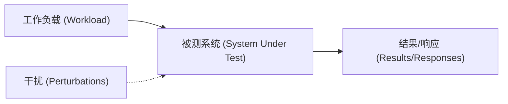
**图 2.1 被测系统的方框图**

重要的是要意识到[[干扰]]（Perturbations）会影响结果，包括由计划中的系统活动、系统的其他用户以及其他工作负载引起的干扰。干扰的来源可能并不明显，可能需要对系统性能进行仔细研究才能确定。在某些云计算环境中这可能特别困难，因为物理宿主系统上的其他活动（由其他租户发起）可能无法从客户 SUT 内部观测到。

现代环境的另一个困难在于，它们可能由多个联网组件组成以服务输入工作负载，包括负载均衡器、代理服务器、Web 服务器、缓存服务器、应用服务器、数据库服务器和存储系统。仅仅是对环境进行绘图（Mapping）的操作，就可能有助于发现先前被忽视的干扰源。环境也可以建模为队列系统网络，以便进行分析研究。

### 2.2.2 队列系统 (Queueing System)

某些组件和资源可以建模为[[队列系统]]（Queueing system），以便根据该模型预测它们在不同情况下的性能。磁盘通常被建模为队列系统，这可以预测响应时间在负载下如何退化。图 2.2 展示了一个简单的队列系统。


**图 2.2 简单队列模型**

第 2.6 节“建模”中介绍的队列理论领域研究队列系统和队列系统网络。

## 2.3 概念 (Concepts)

以下是系统性能的重要概念，它们是本章其余部分以及本书的假设知识。在后续章节的“架构”部分引入特定实现的细节之前，这些主题将以通用方式进行描述。

### 2.3.1 延迟 (Latency)

对于某些环境，延迟是性能的唯一焦点。对于其他环境，它是分析的前一两位关键指标之一，与吞吐量并列。

作为延迟的一个例子，图 2.3 显示了一个网络传输（例如 HTTP GET 请求），时间被划分为延迟和数据传输组件。

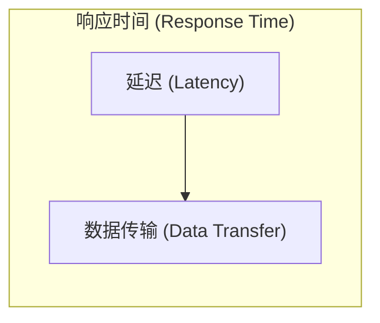
**图 2.3 网络连接延迟**

延迟是在执行操作前花费在等待上的时间。在这个例子中，操作是传输数据的网络服务请求。在该操作发生之前，系统必须等待网络连接建立，这就是该操作的延迟。响应时间跨越了这段延迟和操作时间。

由于延迟可以从不同位置进行测量，它通常会指明测量的目标。例如，一个网站的加载时间可能由三个从不同位置测量的不同时间组成：DNS 延迟、TCP 连接延迟，然后是 TCP 数据传输时间。DNS 延迟指的是整个 DNS 操作。TCP 连接延迟仅指初始化（TCP 握手）。

在更高的层次上，所有这些（包括 TCP 数据传输时间）都可能被视为其他事物的延迟。例如，从用户点击网站链接到结果页面完全加载完毕的时间可能被称为延迟，这包括了浏览器通过网络获取网页并进行渲染的时间。由于单个词“延迟”可能具有歧义，最好包含限定术语来解释其测量内容：请求延迟、TCP 连接延迟等。

由于延迟是基于时间的指标，因此可以进行各种计算。性能问题可以使用延迟进行量化并排序，因为它们使用相同的单位（时间）表达。预测的加速比也可以通过考虑何时可以减少或移除延迟来计算。这些操作都无法使用例如 IOPS 指标精确执行。

作为参考，表 2.1 列出了时间的数量级及其缩写。

**表 2.1 时间单位**

| 单位 | 缩写 | 1 秒的分数 |
|---|---|---|
| 分钟 (Minute) | m | 60 |
| 秒 (Second) | s | 1 |
| 毫秒 (Millisecond) | ms | 0.001 或 1/1000 或 1 × 10⁻³ |
| 微秒 (Microsecond) | μs | 0.000001 或 1/1,000,000 或 1 × 10⁻⁶ |
| 纳秒 (Nanosecond) | ns | 0.000000001 或 1/1,000,000,000 或 1 × 10⁻⁹ |
| 皮秒 (Picosecond) | ps | 0.000000000001 或 1/1,000,000,000,000 或 1 × 10⁻¹² |

在可能的情况下，将其他指标类型转换为延迟或时间可以进行比较。如果你必须在 100 次网络 I/O 或 50 次磁盘 I/O 之间做出选择，你如何知道哪种性能更好？这是一个复杂的问题，涉及许多因素：网络跳数、网络丢包率和重传率、I/O 大小、随机或顺序 I/O、磁盘类型等。但如果你比较 100 ms 的总网络 I/O 和 50 ms 的总磁盘 I/O，区别就很明显了。

### 2.3.2 时间尺度 (Time Scales)

虽然时间可以进行数值比较，但拥有对时间的直觉以及对来自不同来源的延迟的合理预期也是有帮助的。系统组件在截然不同的时间尺度（数量级）上运行，以至于很难掌握这些差异到底有多大。在表 2.2 中，提供了示例延迟，从 3.5 GHz 处理器的 CPU 寄存器访问开始。为了展示我们所处理的时间尺度的差异，该表显示了每项操作可能花费的平均时间，并将其缩放到一个虚构系统中，在这个系统中，现实生活中的一个 CPU 周期——0.3 ns（约十亿分之一秒的三分之一）——花费整整一秒钟。

**表 2.2 系统延迟的时间尺度示例**

| 事件 | 延迟 | 缩放后时间 |
|---|---|---|
| 1 个 CPU 周期 | 0.3 ns | 1 秒 |
| 一级缓存 (L1) 访问 | 0.9 ns | 3 秒 |
| 二级缓存 (L2) 访问 | 3 ns | 10 秒 |
| 三级缓存 (L3) 访问 | 10 ns | 33 秒 |
| 主内存访问 (DRAM, 来自 CPU) | 100 ns | 6 分钟 |
| 固态硬盘 I/O (闪存) | 10–100 μs | 9–90 小时 |
| 旋转磁盘 I/O | 1–10 ms | 1–12 个月 |
| 互联网：旧金山到纽约 | 40 ms | 4 年 |
| 互联网：旧金山到英国 | 81 ms | 8 年 |
| 轻量级硬件虚拟化启动 | 100 ms | 11 年 |
| 互联网：旧金山到澳大利亚 | 183 ms | 19 年 |
| 操作系统虚拟化系统启动 | < 1 s | 105 年 |
| 基于定时器的 TCP 重传 | 1–3 s | 105–317 年 |
| SCSI 命令超时 | 30 s | 3000 年 (3 millennia) |
| 硬件 (HW) 虚拟化系统启动 | 40 s | 4000 年 |
| 物理系统重启 | 5 m | 32,000 年 |

如你所见，CPU 周期的时间尺度极小。光传播 0.5 米所需的时间（大约是你的眼睛到这一页的距离）约为 1.7 ns。在同样的时间内，现代 CPU 可能已经执行了 5 个 CPU 周期并处理了多条指令。

有关 CPU 周期和延迟的更多信息，见第 6 章；有关磁盘 I/O 延迟，见第 9 章。包含的互联网延迟来自第 10 章，那里有更多示例。

### 2.3.3 权衡 (Trade-Offs)

你应该意识到一些常见的性能[[权衡]]（Trade-offs）。图 2.4 展示了“好/快/省，三选二”的权衡，以及针对 IT 项目调整后的术语。

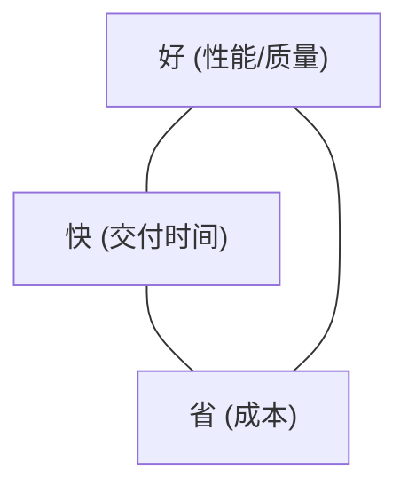
**图 2.4 权衡：三选二**

许多 IT 项目选择“按时”和“廉价”，将性能留给以后解决。当早期的决策抑制了性能改进时，这种选择就会变得有问题，例如选择并填充了次优的存储架构，使用实现低效的编程语言或操作系统，或者选择了缺乏全面性能分析工具的组件。

性能调优中一个常见的权衡是 CPU 和内存之间的权衡，因为内存可以用来缓存结果，从而减少 CPU 使用。在 CPU 资源丰富的现代系统中，这种权衡可能反过来：花费 CPU 时间压缩数据以减少内存使用。

可调参数通常也带有权衡。以下是几个例子：

- **文件系统记录大小 (或块大小)**：小的记录大小（接近应用 I/O 大小）对于随机 I/O 工作负载表现更好，并在应用运行时更有效地使用文件系统缓存。大的记录大小将改善流式工作负载，包括文件系统备份。
- **网络缓冲区大小**：小的缓冲区大小将减少每个连接的内存开销，帮助系统扩展。大的缓冲区大小将改善网络吞吐量。

在对系统进行更改时，请寻找此类权衡。

### 2.3.4 调优努力 (Tuning Efforts)

性能调优在最接近工作执行的地方进行时最有效。对于由应用程序驱动的工作负载，这意味着在应用程序内部进行。表 2.3 展示了一个带有调优可能性的示例软件栈。

通过在应用程序级别进行调优，你可能能够消除或减少数据库查询，并显著提高性能（例如 20 倍）。调优下至存储设备级别可能会消除或改善存储 I/O，但已经在执行更高级别 OS 栈代码中付出了“税收”，因此这可能只能将最终的应用性能提高百分之几（例如 20%）。

**表 2.3 调优目标示例**

| 层级 | 示例调优目标 |
|---|---|
| 应用程序 | 应用逻辑、请求队列大小、执行的数据库查询 |
| 数据库 | 数据库表布局、索引、缓冲 |
| 系统调用 | 内存映射或读/写、同步或异步 I/O 标志 |
| 文件系统 | 记录大小、缓存大小、文件系统可调参数、日志记录 |
| 存储 | RAID 级别、磁盘数量和类型、存储可调参数 |

在应用程序级别寻找巨大的性能收益还有另一个原因。如今的许多环境以快速部署特性和功能为目标，每周或每天都会将软件变更推向生产环境。因此，应用开发和测试倾向于关注正确性，在生产部署前很少或根本没有时间进行性能测量或优化。这些活动是在以后性能成为问题时才进行的。

虽然应用程序是调优最有效的层级，但它不一定是进行观测最有效的层级。慢查询可能最容易从它们花费在 CPU 上的时间，或者它们执行的文件系统和磁盘 I/O 中得到理解。这些可以通过操作系统工具观测到。

在许多环境（特别是云计算）中，应用层处于不断的开发中，每周或每天都会将软件变更推向生产。随着应用代码的变化，经常能发现巨大的性能收益，包括对回归（Regressions）的修复。在这些环境中，针对操作系统的调优以及来自操作系统的观测性很容易被忽视。请记住，操作系统性能分析也可以识别应用级别的问题，而不只是 OS 级别的问题，在某些情况下，这比仅从应用程序层面分析更容易。

### 2.3.5 适用水平 (Level of Appropriateness)

不同的组织和环境对性能有不同的要求。你可能加入了一个习惯于比你以前见过甚至认为可能的分析都要深入得多的组织。或者你可能发现，在你新的工作场所，你认为的基础分析被认为是高级的，并且以前从未执行过（好消息：随手可得的成果！）。

这并不一定意味着某些组织做对了而某些做错了。这取决于性能专业知识的投资回报率（ROI）。拥有大型数据中心或大型云环境的组织可能会雇佣一个性能工程师团队，他们分析一切，包括内核内部结构和 CPU 性能计数器，并频繁使用各种追踪工具。他们还可能正式建立性能模型，并为未来的增长制定准确的预测。对于每年在计算上花费数百万美元的环境，雇佣这样一个性能团队很容易证明其合理性，因为他们发现的收益就是 ROI。拥有适度计算支出的小型初创公司可能只执行浅层的检查，信任第三方监控解决方案来检查其性能并提供告警。

然而，正如第 1 章所介绍的，系统性能不仅仅关乎成本：它还关乎最终用户体验。一家初创公司可能会发现有必要在性能工程上进行投入，以改善网站或应用的延迟。这里的 ROI 不一定是成本的降低，而是更快乐的客户，而不是流失的客户。

最极端的环境包括证券交易所和高频交易商，那里的性能和延迟至关重要，可以证明密集的努力和昂贵的支出是合理的。作为一个例子，一条连接纽约和伦敦交易所的跨大西洋电缆计划耗资 3 亿美元，仅为了将传输延迟降低 6 毫秒 [Williams 11]。

在进行性能分析时，适用水平在决定何时停止分析时也会发挥作用。

### 2.3.6 何时停止分析 (When to Stop Analysis)

进行性能分析时的一个挑战是知道何时停止。有那么多工具，有那么多东西可以检查！

当我教授性能课程时，我可以给我的学生一个有三个促成原因的性能问题，结果发现有些学生在找到一个原因后停止，有些在找到两个后停止，还有些找到全部三个。有些学生甚至继续深入，试图为性能问题寻找更多原因。谁做得对？说你应该在找到全部三个原因后停止可能很容易，但在现实生活中的问题中，你并不知道原因的数量。

以下是三种你可以考虑停止分析的情境，并附带一些个人例子：

- **当你已经解释了性能问题的大部分原因时**。一个 Java 应用程序消耗的 CPU 比以前多了三倍。我发现的第一个问题是异常栈（Exception stacks）消耗了 CPU。随后我量化了这些栈中的时间，发现它们仅占总 CPU 足迹的 12%。如果那个数字接近 66%，我本可以停止分析——3 倍的减速本可以得到解释。但在这种情况下，由于只有 12%，我需要继续寻找。
- **当潜在的 ROI 小于分析成本时**。我处理的一些性能问题可以带来每年以数千万美元计的收益。对于这些问题，我可以证明花费数月时间进行分析（工程成本）是合理的。其他的性能收益，比如针对微小的微服务，可能以数百美元计：花费哪怕一个小时的工程时间进行分析可能都不值得。例外情况可能包括当我没有更好的事可做（这在实践中从未发生过），或者如果我怀疑这可能是未来更大问题的预兆（金丝雀），因此值得在问题扩大前进行调试。
- **当别处有更大的 ROI 时**。即使前两个场景尚未满足，别处可能有更高优先级的更大 ROI。

如果你全职担任性能工程师，根据潜在的 ROI 对不同问题的分析进行优先级排序很可能是日常工作。

### 2.3.7 特定时间点的建议 (Point-in-Time Recommendations)

由于增加了更多的用户、更新的硬件以及更新的软件或固件，环境的性能特征会随着时间而改变。目前受限于 10 Gbit/s 网络基础设施的环境，在升级到 100 Gbit/s 后，可能会开始遇到磁盘或 CPU 性能的瓶颈。

性能建议，特别是可调参数的值，仅在特定的时间点有效。一位性能专家在一周内给出的最佳建议，在下一周进行软件或硬件升级，或者增加更多用户后，可能会变得无效。

在互联网上搜索到的可调参数值有时可以提供快速的收益。但如果它们不适合你的系统或工作负载，或者曾经适合但现在不适合，或者仅作为针对已在后续软件升级中妥善修复的软件 Bug 的临时变通方法，它们也可能会严重损害性能。这类似于搜刮别人的药箱并服用可能不适合你、可能已过期或本应只服用短时间的药物。

浏览此类建议以了解存在哪些可调参数以及过去哪些参数需要更改，这可能会很有用。你的任务随后变为查看是否以及如何为你的系统和工作负载调整这些参数。但如果你所需的某个重要参数别人以前不需要调整，或者虽然调整了但没有在任何地方分享经验，你可能仍会遗漏该参数。

在更改可调参数时，将它们存储在具有详细历史记录的版本控制系统中可能会很有帮助。（当你使用配置管理工具如 Puppet、Salt、Chef 等时，你可能已经做了类似的事情。）这样，以后就可以检查调整的时间和原因。

### 2.3.8 负载 vs. 架构 (Load vs. Architecture)

应用程序性能差可能是由于其运行的软件配置和硬件问题引起的：即其架构和实现。然而，应用程序性能差也可能仅仅是由于施加了过多的负载，导致排队和长延迟。负载和架构的关系如图 2.5 所示。


**图 2.5 负载 vs. 架构**

如果对架构的分析显示工作在排队，但执行工作的方式没有问题，那么问题可能是施加的负载过多。在云计算环境中，这是可以根据需求引入更多服务器实例来处理工作的时候。

例如，一个架构问题可能是一个忙于 CPU 的单线程应用程序，当其他 CPU 可用且闲置时，请求仍在排队。在这种情况下，性能受到应用程序单线程架构的限制。另一个架构问题可能是一个多线程程序竞争单个锁，导致只有一个线程可以向前推进，而其他线程在等待。

一个负载问题可能是一个忙于所有可用 CPU 的多线程应用程序，请求仍在排队。在这种情况下，性能受到可用 CPU 容量的限制，或者换句话说，负载超过了 CPU 的处理能力。

### 2.3.9 可伸缩性 (Scalability)

系统在增加负载下的表现即为其[[可伸缩性]]（Scalability）。图 2.6 显示了系统负载增加时典型的吞吐量概貌。

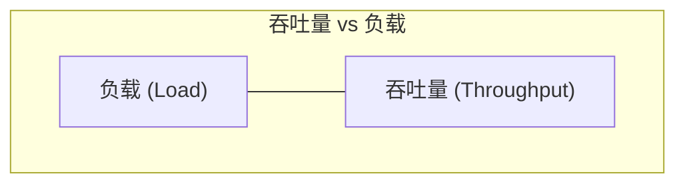
**图 2.6 吞吐量 vs. 负载**

在一段时间内，可以观察到线性可伸缩性。随后到达一个点（图中用虚线标记），此时对资源的竞争开始降低吞吐量。这个点可以被描述为拐点（Knee point），因为它是两个函数之间的边界。超过这一点后，随着对资源竞争的增加，吞吐量概貌偏离了线性可伸缩性。最终，由于竞争增加和一致性（Coherency）产生的开销导致完成的工作变少，吞吐量下降。

这个点可能发生在组件达到 100% 利用率时：即饱和点。它也可能发生在组件接近 100% 利用率且排队开始变得频繁且显著时。

一个可能表现出这种概貌的示例系统是一个执行繁重计算的应用程序，随着更多线程的加入，负载也随之增加。随着 CPU 接近 100% 利用率，随着 CPU 调度器延迟增加，响应时间开始变差。在 100% 利用率达到峰值性能后，随着加入更多线程，吞吐量开始下降，导致更多的上下文切换，这消耗了 CPU 资源并导致实际完成的工作减少。

如果你将 x 轴上的“负载”替换为 CPU 核心等资源，也可以看到同样的曲线。有关此话题的更多内容，请参见第 2.6 节“建模”。

对于非线性可伸缩性，性能退化（以平均响应时间或延迟衡量）如图 2.7 所示 [Cockcroft 95]。


**图 2.7 性能退化**

更高的响应时间当然是不好的。“快速”退化概貌可能发生在内存负载中，此时系统开始将内存页移动到磁盘（换页）以释放主内存。“缓慢”退化概貌可能发生在 CPU 负载中。

另一个“快速”退化的例子是磁盘 I/O。随着负载（以及由此产生的磁盘利用率）增加，I/O 更有可能在其他 I/O 之后排队。一个空闲的旋转磁盘（非固态硬盘）可能以约 1 ms 的响应时间服务 I/O，但当负载增加时，这可能会接近 10 ms。这在第 2.6.5 节“队列理论”中的 M/D/1 和 60% 利用率下进行了建模，磁盘性能在第 9 章中涵盖。

如果应用程序在资源不可用时开始返回错误而不是排队工作，响应时间可能会出现线性可伸缩性。例如，Web 服务器可能会返回 503“服务不可用”，而不是将请求添加到队列中，这样被服务的请求就可以在一致的响应时间内完成。

### 2.3.10 指标 (Metrics)

性能指标是由系统、应用程序或测量感兴趣活动的额外工具生成的选定统计数据。它们被用于性能分析和监控，既可以在命令行以数值形式研究，也可以使用可视化技术以图形形式研究。

常见的系统性能指标类型包括：

- **吞吐量 (Throughput)**：每秒的操作数或数据量。
- **IOPS**：每秒 I/O 操作数。
- **利用率 (Utilization)**：资源的繁忙程度，以百分比表示。
- **延迟 (Latency)**：操作时间，以平均值或百分位数表示。

吞吐量的用法取决于其上下文。数据库吞吐量通常是每秒查询或请求（操作）的度量。网络吞吐量是每秒比特或字节（数据量）的度量。

IOPS 仅针对 I/O 操作（读和写）的吞吐量度量。同样，上下文很重要，定义也可能有所不同。

#### 开销 (Overhead)
性能指标不是免费的；在某些点上，必须消耗 CPU 周期来收集和存储它们。这会产生开销，从而对被测量目标的性能产生负面影响。这被称为[[观测者效应]]（Observer effect）。（它经常与海森堡测不准原理混淆，后者描述的是物理属性对（如位置和动量）已知精度的限制。）

#### 问题 (Issues)
你可能会认为软件供应商提供的指标是经过精心选择的、无 Bug 的，并且提供了完整的可见性。实际上，指标可能会令人困惑、复杂、不可靠、不准确，甚至是完全错误的（由于 Bug）。有时一个指标在某个软件版本中是正确的，但没有更新以反映新代码和代码路径的增加。

有关指标问题的更多信息，请参阅第 4 章“可观测性工具”的第 4.6 节“观测可观测性”。

### 2.3.11 利用率 (Utilization)

术语[[利用率]]（Utilization）在操作系统中常被用来描述设备使用情况，如 CPU 和磁盘设备。利用率可以是基于时间的，也可以是基于容量的。

#### 基于时间 (Time-Based)
基于时间的利用率在队列理论中有正式定义。例如 [Gunther 97]：
> 服务器或资源繁忙的平均时间

连同比率：
> U = B / T

其中 U = 利用率，B = 在观测周期 T 内系统繁忙的总时间。

这也是从操作系统性能工具中最容易获得的“利用率”。磁盘监控工具 `iostat(1)` 将此指标称为 `%b`（百分比繁忙），这个术语更好地传达了底层指标：B/T。

这种利用率指标告诉我们一个组件有多忙：当一个组件接近 100% 利用率时，如果存在对资源的竞争，性能可能会严重下降。可以检查其他指标来确认，并查看该组件是否因此成为了系统瓶颈。

某些组件可以并行服务多个操作。对于它们，在 100% 利用率下性能可能不会下降太多，因为它们可以接受更多工作。为了理解这一点，可以考虑建筑电梯。它在楼层间移动时可能被认为是被利用的，而在闲置等待时被认为是不被利用的。然而，即使电梯在 100% 的时间里忙于响应呼叫——也就是说，它处于 100% 利用率——它也可能能够接纳更多乘客。

一个 100% 繁忙的磁盘也可能能够接受并处理更多工作，例如，通过在磁盘内缓存中缓冲写入以便稍后完成。存储阵列经常运行在 100% 利用率下，因为某些磁盘 100% 的时间都在忙，但阵列仍有大量闲置磁盘并可以接受更多工作。

#### 基于容量 (Capacity-Based)
利用率的另一种定义被 IT 专业人士用于容量规划的语境中 [Wong 97]：
> 一个系统或组件（如磁盘驱动器）能够提供一定量的吞吐量。在任何性能水平下，系统或组件都在以其容量的某种比例工作。这种比例被称为利用率。

这根据容量而不是时间定义了利用率。它意味着 100% 利用率的磁盘无法再接受任何工作。而在基于时间的定义中，100% 利用率仅意味着它 100% 的时间都在忙。

> 100% 繁忙并不意味着 100% 产能 (100% busy does not mean 100% capacity)。

对于电梯的例子，100% 容量可能意味着电梯已达到其最大载重，无法再接纳更多乘客。

在理想的情况下，我们能够测量一个设备的两类利用率，这样你就知道磁盘何时 100% 繁忙（且性能因竞争而开始下降），以及何时达到了 100% 容量（且无法接受更多工作）。不幸的是，这通常是不可能的。对于磁盘，这需要了解磁盘板载控制器的活动并对容量进行预测。磁盘目前并不提供这些信息。

在本书中，利用率通常指基于时间的版本，你也可以称之为非空闲时间。容量版本用于某些基于量的指标，如内存使用率。

### 2.3.12 饱和度 (Saturation)

对资源的请求超过其处理能力的程度即为[[饱和度]]（Saturation）。饱和度在 100% 利用率（基于容量）处开始发生，因为额外的工作无法被处理并开始排队。如图 2.8 所示。


**图 2.8 利用率 vs. 饱和度**

图中描绘了随着负载继续增加，饱和度在 100% 容量利用率标记之外线性增加。任何程度的饱和度都是性能问题，因为时间被花在了等待（延迟）上。对于基于时间的利用率（百分比繁忙），排队（以及由此产生的饱和度）可能不会在 100% 利用率标记处开始，这取决于资源并行处理工作的程度。

### 2.3.13 剖析 (Profiling)

剖析构建了一个可以被研究和理解的目标画像。在计算机性能领域，剖析通常通过以定时时间间隔对系统状态进行采样，然后研究这一系列样本来执行。

与之前涵盖的包括 IOPS 和吞吐量在内的指标不同，采样的使用提供了目标活动的一个粗略视图。视图有多粗略取决于采样的速率。

作为剖析的一个例子，通过以频繁的时间间隔对 CPU 指令指针或栈追踪（Stack trace）进行采样，以收集消耗 CPU 资源的各种代码路径的统计信息，可以相当详细地了解 CPU 使用情况。这一主题在第 6 章中涵盖。

### 2.3.14 缓存 (Caching)

缓存经常被用来提高性能。缓存将来自较慢存储层的结果存储在较快存储层中以供参考。一个例子是在主内存（RAM）中缓存磁盘块。

可能会使用多层缓存。CPU 通常为主内存采用多级硬件缓存（一级、二级和三级），从极快但很小的缓存（一级）开始，存储大小和访问延迟随层级增加。这是密度和延迟之间的经济权衡；选择层级和大小是为了在可用的芯片空间内获得最佳性能。这些缓存在第 6 章中涵盖。

系统中还存在许多其他缓存，其中许多是使用主内存作为存储在软件中实现的。有关缓存层的列表，请参阅第 3 章“操作系统”的第 3.2.11 节“缓存”。

理解缓存性能的一个指标是每个缓存的[[命中率]]（Hit ratio）——在缓存中找到所需数据的次数（命中）与总访问次数（命中 + 未命中）之比：
> 命中率 = 命中次数 / (命中次数 + 未命中次数)

命中率越高越好，因为较高的比例反映了更多数据成功从更快的介质中访问。图 2.9 显示了增加缓存命中率预期带来的性能提升。


**图 2.9 缓存命中率与性能**

98% 和 99% 之间的性能差异远大于 10% 和 11% 之间的差异。这是一个非线性概貌，因为缓存命中和未命中（即参与运作的两个存储层）之间存在速度差异。差异越大，斜率就越陡。

理解缓存性能的另一个指标是[[缓存未命中率]]（Cache miss rate），即每秒未命中的次数。这与每次未命中的性能损失成正比（线性关系），且更容易解释。

例如，工作负载 A 和 B 使用不同的算法执行相同的任务，并使用主内存缓存来避免从磁盘读取。工作负载 A 的缓存命中率为 90%，工作负载 B 为 80%。仅凭这些信息似乎工作负载 A 表现更好。但如果工作负载 A 的未命中率为 200 次/秒，而工作负载 B 为 20 次/秒呢？从这个角度看，工作负载 B 的磁盘读取次数减少了 10 倍，这可能使任务比 A 完成得早得多。为了确定，可以计算每个工作负载的总运行时间：
> 运行时间 = (命中率 × 命中延迟) + (未命中率 × 未命中延迟)

此计算使用平均命中和未命中延迟，并假设工作是串行执行的。

#### 算法 (Algorithms)
缓存管理算法和策略决定了在有限的缓存空间内存储什么。

**最近最少使用 (LRU, Least Recently Used)** 可以指一种等效的缓存置换策略，决定在需要更多空间时从缓存中移除哪些对象。与之对应的是**最近最常使用 (MRU, Most Recently Used)**。还有**最常使用 (MFU, Most Frequently Used)** 和**最不常使用 (LFU, Least Frequently Used)** 策略。你可能还会遇到**不常使用 (NFU, Not Frequently Used)**，它可能是 LRU 的一种廉价但不够彻底的版本。

#### 冷、暖与热缓存 (Hot, Cold, and Warm Caches)
这些词常被用来描述缓存的状态：
- **冷 (Cold)**：冷缓存是空的，或者填充了不需要的数据。冷缓存的命中率为零（或在开始变暖时接近零）。
- **暖 (Warm)**：暖缓存是指填充了有用数据，但命中率还不够高，不足以被称为“热”的缓存。
- **热 (Hot)**：热缓存填充了常用的请求数据，并且具有很高的命中率，例如超过 99%。
- **温暖度 (Warmth)**：缓存温暖度描述了缓存有多热或多冷。提高缓存温暖度的活动是旨在提高缓存命中率的活动。

当缓存首次初始化时，它们从冷状态开始，然后随着时间的推移而变暖。当缓存很大或下一级存储很慢（或两者兼有）时，缓存可能需要很长时间才能完成填充并变暖。

例如，我曾在一台存储设备上工作，它有 128 Gbytes 的 DRAM 作为文件系统缓存，600 Gbytes 的闪存作为二级缓存，以及旋转磁盘用于存储。在随机读取工作负载下，磁盘每秒交付大约 2,000 次读取。在 8 Kbyte 的 I/O 大小下，这意味着缓存变暖的速度仅为 16 Mbytes/s (2,000 × 8 Kbytes)。当两个缓存都从冷状态开始时，DRAM 缓存需要 2 个多小时才能变暖，而闪存缓存则需要 10 个多小时。

### 2.3.15 已知的未知 (Known-Unknowns)

在序言中介绍过，[[已知的已知]]、[[已知的未知]]和[[未知的未知]]的概念对于性能领域非常重要。对于系统性能分析，其细分如下：
- **已知的已知 (Known-knowns)**：这些是你了解的事情。你知道你应该检查某个性能指标，并且你知道它当前的值。例如，你知道你应该检查 CPU 利用率，并且你也知道它的平均值是 10%。
- **已知的未知 (Known-unknowns)**：这些是你意识到自己不知道的事情。你知道你可以检查某个指标或某个子系统的存在，但你尚未对其进行观测。例如，你知道你可以使用剖析来检查是什么让 CPU 繁忙，但尚未执行此操作。
- **未知的未知 (Unknown-unknowns)**：这些是你不知道自己不知道的事情。例如，你可能不知道设备中断会成为沉重的 CPU 消费者，因此你没有检查它们。

性能是一个“你知道得越多，你就发现自己不知道的也越多”的领域。你对系统了解得越多，你意识到的“未知的未知”就越多，这些随后会变成你可以检查的“已知的未知”。

## 2.4 视角 (Perspectives)

性能分析有两种常见的视角，每种视角都有不同的受众、指标和方法。它们是工作负载分析和资源分析。它们可以被视为对操作系统软件栈的自顶向下或自底向上的分析，如图 2.10 所示。

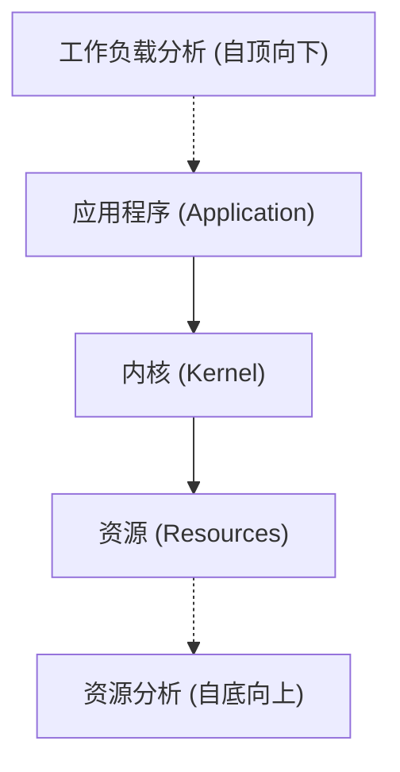
**图 2.10 分析视角**

第 2.5 节“方法论”提供了适用于每种视角的具体策略。这里更详细地介绍这些视角。

### 2.4.1 资源分析 (Resource Analysis)

资源分析从对系统资源的分析开始：CPU、内存、磁盘、网络接口、总线和互连。它最常由系统管理员——即负责物理资源的人——执行。活动包括：
- **性能问题调查**：查看是否是某种特定类型的资源造成的。
- **容量规划**：获取信息以帮助调整新系统的规模，并查看现有系统资源何时可能耗尽。

这种视角专注于利用率，以识别资源何时达到或接近其极限。某些资源类型（如 CPU）具有现成的利用率指标。其他资源的利用率可以根据可用指标进行估计，例如，通过将发送和接收的每秒兆比特数（吞吐量）与已知或预期的最大带宽进行比较，来估计网络接口的利用率。

最适合资源分析的指标包括：
- IOPS
- 吞吐量
- 利用率
- 饱和度

这些指标衡量了资源被要求做的事情，以及在给定负载下其被利用或饱和的程度。其他类型的指标（包括延迟）对于查看资源在给定工作负载下的响应情况也非常有用。

资源分析是一种常见的性能分析方法，部分原因是关于该主题的文档广泛可用。此类文档重点关注操作系统的“stat”工具：`vmstat(8)`、`iostat(1)`、`mpstat(1)`。阅读此类文档时，重要的是要理解这是一种视角，但不是唯一的视角。

### 2.4.2 工作负载分析 (Workload Analysis)

工作负载分析（见图 2.11）检查应用程序的性能：施加的工作负载以及应用程序的响应方式。它最常由应用开发人员和支持人员——即负责应用程序软件和配置的人员——使用。


**图 2.11 工作负载分析**

工作负载分析的目标是：
- **请求 (Requests)**：施加的工作负载。
- **延迟 (Latency)**：应用程序的响应时间。
- **完成情况 (Completion)**：查看错误。

研究工作负载请求通常涉及检查并汇总其属性：这就是[[工作负载表征]]过程（在第 2.5 节“方法论”中详述）。对于数据库，这些属性可能包括客户端主机、数据库名称、表和查询字符串。这些数据可能有助于识别不必要的工作或不平衡的工作。即使系统当前的工作负载执行良好（低延迟），检查这些属性也可能找到减少或消除施加工作的方法。请记住，最快的查询是你根本不执行的那个。

延迟（响应时间）是表达应用程序性能最重要的指标。对于 MySQL 数据库，它是查询延迟；对于 Apache，它是 HTTP 请求延迟；依此类推。在这些上下文中，术语延迟被用来指代响应时间（参考第 2.3.1 节关于上下文的内容）。

工作负载分析的任务包括识别和确认问题——例如，通过寻找超过可接受阈值的延迟——然后找到延迟的来源，并确认在应用修复后延迟得到了改善。请注意，起点是应用程序。调查延迟通常涉及进一步深入到应用程序、库和操作系统（内核）。

系统问题可能通过研究与事件完成相关的特征（包括其错误状态）来识别。虽然一个请求可能很快完成，但它可能带有一个导致请求重试的错误状态，从而累积了延迟。

最适合工作负载分析的指标包括：
- 吞吐量 (每秒事务数)
- 延迟

这些衡量了请求率以及产生的性能。

## 2.5 方法论 (Methodology)

面对性能不佳且复杂的系统环境，第一个挑战可能是知道从哪里开始分析以及如何进行。正如我在第 1 章中所说的，性能问题可能产生于任何地方，包括软件、硬件以及数据路径上的任何组件。方法论可以通过展示从何处开始分析并建议一个有效的执行程序来帮助你应对这些复杂的系统。

本节描述了许多用于系统性能和调优的方法论和程序，其中一些是我开发的。这些方法论帮助初学者入门，并作为专家的提醒。一些“反方法论”（Anti-methodologies）也被包含在内。

为了帮助总结它们的作用，这些方法论被分类为不同类型，如观测分析和实验分析，如表 2.4 所示。

**表 2.4 通用系统性能方法论**

| 章节 | 方法论 | 类型 |
|---|---|---|
| 2.5.1 | 街灯反方法 (Streetlight anti-method) | 观测分析 |
| 2.5.2 | 随机更改反方法 (Random change anti-method) | 实验分析 |
| 2.5.3 | 责怪他人反方法 (Blame-someone-else anti-method) | 假设分析 |
| 2.5.4 | 即兴清单法 (Ad hoc checklist method) | 观测与实验分析 |
| 2.5.5 | 问题陈述 (Problem statement) | 信息收集 |
| 2.5.6 | 科学方法 (Scientific method) | 观测分析 |
| 2.5.7 | 诊断循环 (Diagnosis cycle) | 分析生命周期 |
| 2.5.8 | 工具法 (Tools method) | 观测分析 |
| 2.5.9 | USE 方法 (The USE Method) | 观测分析 |

### 2.5.1 街灯反方法 (Streetlight Anti-Method)

这种“反方法论”之所以得名，是因为一个关于有人在街灯下寻找丢失钥匙的笑话：当被问及是否是在那里丢的钥匙时，那人回答：“不，但我在这里看得见。”

性能分析中的**街灯法**（Streetlight method）是指用户只观察他们熟悉的或刚好有现成工具可看的指标。这种方法完全是随机的，因为它没有基于对系统的整体研究来寻找根本原因。这种方法可能会命中问题（如果你走运的话），但也可能让你由于对不相关指标的误读而浪费数天时间。

采用这种方法的一个症状是人们尝试不同的性能工具，看看是否有任何“看起来不对劲”的东西。虽然了解你的工具有哪些功能是有帮助的，但这并不应该成为你的主要性能分析方法。

### 2.5.2 随机更改反方法 (Random Change Anti-Method)

这是一种实验性的反方法论：用户随机尝试更改（例如：让我们把那个可调参数改为 100，看看会发生什么！），直到问题消失。这也是一种非常耗时的方法，并且由于一些更改可能有助于性能而其他一些则有害，它们的结果可能会相互抵消。更糟糕的是，一个更改可能在当前这种特定的、负载较轻的情况下有所帮助，但当负载在稍后增加时（或者当工作负载特性发生细微变化时）会导致性能大幅退化。

这种方法也可能由于这些随机更改被永久保留在系统配置中（因为没有人记得将它们调回原位）而导致难以察觉的技术债务积累。

### 2.5.3 责怪他人反方法 (Blame-Someone-Else Anti-Method)

这种假设性的反方法论遵循以下步骤：
1. 寻找一个你负责之外的组件。
2. 假设该组件存在性能问题。
3. 将问题重定向到负责该组件的团队。
4. 如果被证明错误，请返回步骤 1。

例如：“这一定是网络问题。你能查一下网络团队最近是否有任何丢包吗？”

这种方法不仅低效且具有破坏性，因为它在没有证据的情况下浪费了其他团队的时间。

### 2.5.4 即兴清单法 (Ad Hoc Checklist Method)

当支持工程师被要求在短时间内检查一台系统时，他们通常会走一遍一系列即兴的步骤，例如运行 `uptime` 查看平均负载，运行 `top` 查看是否有任何显眼的进程。这些是一系列根据经验总结出的步骤。

虽然这比前几种方法好，但它仍是不完整的。这些清单通常只关注“已知的已知”，即工程师以前见过的问题。如果遇到的性能问题具有新的或不同的特性，这个清单可能会完全错过它。

第 1 章提到的“60 秒分析清单”也是一种即兴清单，尽管它被设计为涵盖主要系统组件的基础内容。

### 2.5.5 问题陈述 (Problem Statement)

定义问题陈述是支持人员在首次响应问题时的常规任务。这是通过向客户询问以下问题来完成的：

1. 是什么让你认为存在性能问题？
2. 该系统以前是否表现良好？
3. 最近发生了什么变化？软件？硬件？负载？
4. 问题是否可以用延迟或运行时间来表达？
5. 问题是否影响其他人或应用程序（还是只有你）？
6. 环境是什么样的？使用了哪些软件和硬件？版本？配置？

仅仅询问并回答这些问题通常就能指向直接的原因和解决方案。因此，问题陈述已被作为一种独立的方法论包含在这里，并且应该是你在处理新问题时使用的第一种方法。

我曾仅通过使用问题陈述法，通过电话解决了性能问题，而无需登录任何服务器或查看任何指标。

### 2.5.6 科学方法 (Scientific Method)

科学方法通过提出假设并进行测试来研究未知。它可以总结为以下步骤：

1. **提出问题 (Question)**
2. **作出假设 (Hypothesis)**
3. **进行预测 (Prediction)**
4. **测试 (Test)**
5. **分析结果 (Analysis)**

“提出问题”即性能问题陈述。由此你可以假设性能不佳的原因可能是什么。然后，你构建一个观测性或实验性的“测试”，该测试验证基于假设的“预测”。最后，你对收集到的测试数据进行“分析”。

例如，你可能会发现应用性能在迁移到主内存较小的系统后下降了，于是你假设性能不佳的原因是文件系统缓存变小了。你可以使用观测性测试来测量两个系统上的缓存未命中率，预测较小系统上的缓存未命中率会更高。一个实验性测试是增加缓存大小（增加 RAM），预测性能会提高。另一个可能更简单的实验性测试是人为地减小缓存大小（使用可调参数），预测性能会变差。

以下是更多示例。

#### 示例 (观测性)
1. **提出问题**：是什么导致数据库查询变慢？
2. **作出假设**：嘈杂的邻居（其他云计算租户）正在执行磁盘 I/O，（通过文件系统）与数据库磁盘 I/O 发生竞争。
3. **进行预测**：如果在查询期间测量文件系统 I/O 延迟，它将显示文件系统对查询变慢负责。
4. **测试**：对数据库文件系统延迟占查询延迟的比例进行追踪，显示只有不到 5% 的时间花在等待文件系统上。
5. **分析结果**：文件系统和磁盘不对查询变慢负责。

尽管问题仍未解决，但环境中的一些大型组件已被排除。进行调查的人可以返回步骤 2 并制定新的假设。

#### 示例 (实验性)
1. **提出问题**：为什么从主机 A 到主机 C 的 HTTP 请求比从主机 B 到主机 C 耗时更长？
2. **作出假设**：主机 A 和主机 B 位于不同的数据中心。
3. **进行预测**：将主机 A 移至与主机 B 相同的数据中心将解决问题。
4. **测试**：移动主机 A 并测量性能。
5. **分析结果**：性能已修复——与假设一致。

如果问题未解决，在开始新假设前请撤销实验性更改（在本例中将主机 A 移回）——同时改变多个因素会使识别哪个因素起作用变得更加困难！

#### 示例 (实验性)
1. **提出问题**：为什么文件系统性能随着文件系统缓存容量的增加而退化？
2. **作出假设**：较大的缓存存储了更多的记录，管理大缓存比小缓存需要更多的计算资源。
3. **进行预测**：使记录大小逐渐变小，从而导致使用更多记录来存储相同数量的数据，将使性能逐渐变差。
4. **测试**：使用逐渐减小的记录大小测试相同的工作负载。
5. **分析结果**：结果绘制成图表，与预测一致。现在对缓存管理例程执行钻取分析。

这是一个负面测试的例子——通过故意损害性能来更多地了解目标系统。

### 2.5.7 诊断循环 (Diagnosis Cycle)

与科学方法类似的是诊断循环：
> 假设 (Hypothesis) → 插桩 (Instrumentation) → 数据 (Data) → 假设 (Hypothesis)

与科学方法一样，该方法也通过收集数据来深思熟虑地测试假设。该循环强调数据可以迅速导致新的假设，然后对其进行测试和细化，以此类推。这类似于医生进行一系列小测试来诊断病人，并根据每个测试的结果细化假设。

这两种方法在理论和数据之间都有很好的平衡。尝试快速从假设转向数据，以便尽早识别并丢弃错误的理论，并建立更好的理论。

### 2.5.8 工具法 (Tools Method)

一种以工具为导向的方法如下：

1. 列出可用的性能工具（可选：安装或购买更多）。
2. 对于每个工具，列出它提供的有用指标。
3. 对于每个指标，列出可能的解释方式。

其结果是一个规定性的清单，显示运行哪个工具、读取哪些指标以及如何解释它们。虽然这相当有效，但它完全依赖于可用的（或已知的）工具，这可能会提供一个不完整的系统视图，类似于街灯反方法。更糟的是，用户意识不到他们拥有的是一个不完整的视图——并可能一直意识不到。需要定制工具（如动态追踪）的问题可能永远无法被识别和解决。

在实践中，工具法确实可以识别某些资源瓶颈、错误和其他类型的问题，尽管效率可能不高。

当有大量工具和指标可用时，遍历它们可能会非常耗时。当多个工具似乎具有相同的功能，而你花费额外时间尝试理解每个工具的优缺点时，情况会变得更糟。在某些情况下，例如文件系统微基准测试工具，有超过一打的工具可供选择，而你可能只需要一个。[^4]

[^4]: 顺便提一下，我遇到过支持多个重叠工具的一个论点是“竞争是有益的”。对此我会保持谨慎：虽然拥有重叠的工具用于交叉检查结果可能有所帮助（我也经常使用 Ftrace 交叉检查 BPF 工具），但多个重叠的工具可能会浪费开发人员的时间（这些时间本可以更有效地用于他处），也会浪费必须评估每个选择的最终用户的时间。

### 2.5.9 USE 方法 (The USE Method)

[[USE 方法]]（Utilization, Saturation, and Errors）应在性能调查的早期使用，以识别系统性瓶颈 [Gregg 13b]。这是一种专注于系统资源的方法论，可以总结为：

> **对于每一个资源，检查利用率、饱和度和错误。**

这些术语定义如下：

- **资源 (Resources)**：所有物理服务器的功能组件（CPU、总线等）。如果指标有意义，也可以检查某些软件资源。
- **利用率 (Utilization)**：在设定的时间间隔内，资源忙于服务工作的时间百分比。在繁忙期间，资源仍可能能够接受更多工作；它无法接受更多工作的程度由饱和度标识。
- **饱和度 (Saturation)**：资源具有其无法服务的额外工作的程度，通常在队列中等待。另一个术语是压力（Pressure）。
- **错误 (Errors)**：错误事件的计数。

对于某些资源类型，包括主内存，利用率是所使用的资源的容量。这与基于时间的定义不同，早先在第 2.3.11 节“利用率”中已解释。一旦容量资源达到 100% 利用率，就无法再接受更多工作，资源要么将工作排队（饱和），要么返回错误，这些也可以使用 USE 方法识别。

应该调查错误，因为它们会损害性能，但当故障模式是可恢复的时，可能不会立即被注意到。这包括失败并重试的操作，以及冗余设备池中发生故障的设备。

与工具法相比，USE 方法涉及的是对系统资源而不是工具进行迭代。这有助于你创建一个完整的问题清单，然后才去寻找工具来回答这些问题。即使找不到回答某些问题的工具，知道这些问题未得到回答对性能分析师也极其有用：它们现在变成了“已知的未知”。

USE 方法还将分析导向有限数量的关键指标，以便尽快检查所有系统资源。之后，如果没有发现问题，可以使用其他方法论。

#### 程序 (Procedure)
USE 方法的流程如图 2.12 所示。错误首先被检查，因为它们通常解释起来很快（它们通常是客观的而非主观的指标），在调查其他指标前排除它们是高效的。饱和度第二个检查，因为它比利用率解释起来更快：任何程度的饱和度都可能是一个问题。

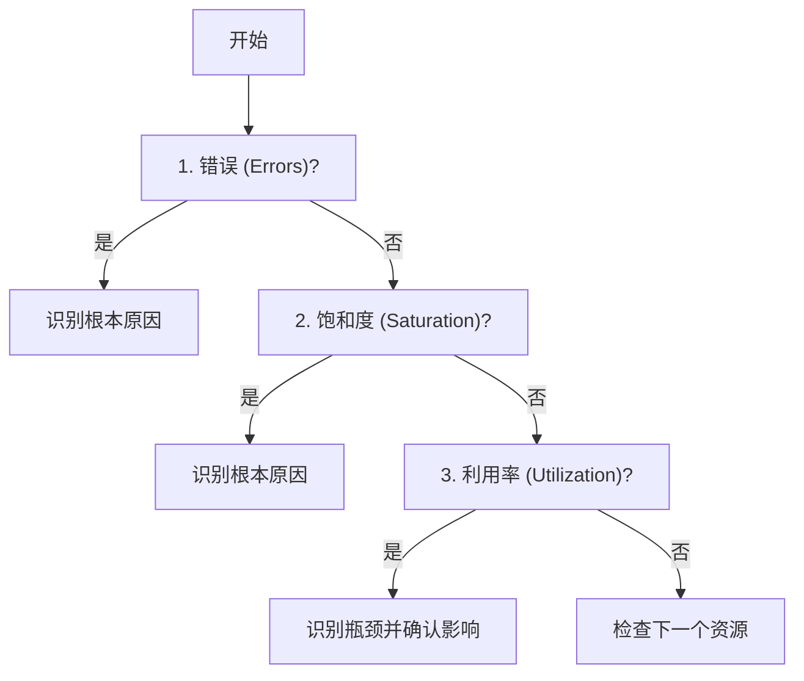
**图 2.12 USE 方法流程**

该方法识别出可能成为系统瓶颈的问题。不幸的是，一个系统可能遭受不止一个性能问题的困扰，因此你发现的第一件事可能是一个问题，但不是那个（最核心的）问题。每个发现都可以使用进一步的方法论进行调查，然后根据需要返回 USE 方法对更多资源进行迭代。

#### 指标表达 (Expressing Metrics)
USE 方法指标通常表达如下：

- **利用率**：作为一个时间间隔内的百分比（例如：“一个 CPU 运行在 90% 利用率”）。
- **饱和度**：作为一个等待队列长度（例如：“CPU 的平均运行队列长度为 4”）。
- **错误**：报告的错误数量（例如：“该磁盘驱动器已发生了 50 次错误”）。

虽然这看起来可能违反直觉，但短时间的利用率爆发可能会导致饱和度与性能问题，即使在较长的时间间隔内整体利用率很低。一些监控工具按 5 分钟平均值报告利用率。例如，CPU 利用率可能会在秒与秒之间剧烈波动，因此 5 分钟的平均值可能会掩盖短时间的 100% 利用率，从而掩盖了饱和度。

考虑高速公路上的收费站。利用率可以定义为有多少个收费窗口在忙于服务车辆。100% 的利用率意味着你找不到空的窗口，必须在某人后面排队（饱和）。如果我告诉你全天窗口的利用率是 40%，你能告诉我当天是否有任何车辆排过队吗？在高峰时段（此时利用率为 100%）它们很可能排过队，但在全天平均值中是看不出来的。

#### 资源列表 (Resource List)
USE 方法的第一步是创建一个资源列表。尝试尽可能地完整。以下是一个通用的服务器硬件资源列表，以及具体的示例：

- **CPU**：插槽 (Sockets)、核心 (Cores)、硬件线程 (Hardware threads/vCPUs)
- **主内存**：DRAM
- **网络接口**：以太网端口、InfiniBand
- **存储设备**：磁盘、存储适配器
- **加速器**：GPU、TPU、FPGA 等（如果在使用中）
- **控制器**：存储、网络
- **互连 (Interconnects)**：CPU、内存、I/O

每个组件通常充当单一资源类型。例如，主内存是容量资源，而网络接口是 I/O 资源（可以表示 IOPS 或吞吐量）。某些组件可以表现为多种资源类型：例如，存储设备既是 I/O 资源又是容量资源。考虑所有可能导致性能瓶颈的类型。另请注意，I/O 资源可以进一步作为队列系统进行研究，这些系统将请求排队然后服务。

某些物理组件，如硬件缓存（如 CPU 缓存），可以从你的清单中剔除。USE 方法对于在利用率高或饱和时会遭受性能退化并导致瓶颈的资源最为有效，而缓存则是在利用率高时提高性能。这些可以使用其他方法论来检查。如果你不确定是否包含某个资源，请包含它，然后看看指标在实践中表现如何。

#### 功能框图 (Functional Block Diagram)
对资源进行迭代的另一种方法是寻找或绘制系统的功能框图，如图 2.13 所示。这样的图表还展示了关系，这在寻找数据流中的瓶颈时非常有用。

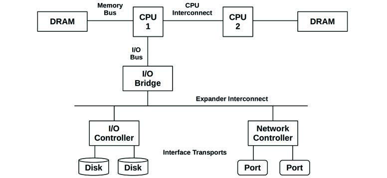
**图 2.13 示例双处理器功能框图**

CPU、内存和 I/O 互连及总线经常被忽视。幸运的是，它们并不是常见的系统瓶颈，因为它们通常被设计为提供过剩的吞吐量。不幸的是，如果它们确实成了瓶颈，问题可能会很难解决。也许你可以升级主板，或者减轻负载；例如，“零拷贝”软件技术可以减轻内存总线负载。

要调查互连，请参阅第 6 章“CPU”第 6.4.1 节“硬件”中的“CPU 性能计数器”。

#### 指标 (Metrics)
一旦你有了资源列表，考虑适用于每个资源的指标类型：利用率、饱和度和错误。表 2.6 展示了一些示例资源和指标类型，以及可能的指标（通用操作系统）。

**表 2.6 USE 方法指标示例**

| 资源 | 类型 | 指标 |
|---|---|---|
| CPU | 利用率 | CPU 利用率（每个 CPU 或系统平均值） |
| CPU | 饱和度 | 运行队列长度、调度延迟、CPU 压力 (Linux PSI) |
| 内存 | 利用率 | 可用空闲内存（系统全局） |
| 内存 | 饱和度 | 交换 (匿名页换出)、页面扫描、内存不足 (OOM) 事件、内存压力 (Linux PSI) |
| 网络接口 | 利用率 | 接收吞吐量/最大带宽、发送吞吐量/最大带宽 |
| 存储设备 I/O | 利用率 | 设备繁忙百分比 |
| 存储设备 I/O | 饱和度 | 等待队列长度、I/O 压力 (Linux PSI) |
| 存储设备 I/O | 错误 | 设备错误（“软”错误、“硬”错误） |

这些指标既可以是每个间隔的平均值，也可以是计数。

对所有组合重复此过程，并附上获取每个指标的说明。记下当前不可用的指标；这些就是“已知的未知”。你最终会得到一个包含大约 30 个指标的列表，其中一些很难测量，而有些则根本无法测量。幸运的是，最常见的问题通常可以通过较容易的指标找到（例如：CPU 饱和、内存容量饱和、网络接口利用率、磁盘利用率），因此可以首先检查这些。

表 2.7 提供了一些更难组合的示例。

**表 2.7 USE 方法高级指标示例**

| 资源 | 类型 | 指标 |
|---|---|---|
| CPU | 错误 | 例如：机器检查异常 (Machine check exceptions)、CPU 缓存错误[^5] |
| 内存 | 错误 | 例如：失败的 `malloc()` 调用（由于过度承诺，默认 Linux 内核配置中这很少见） |
| 网络 | 饱和度 | 与饱和相关的网络接口或 OS 错误，例如：Linux “overruns” |
| 存储控制器 | 利用率 | 取决于控制器；它可能有最大 IOPS 或吞吐量，可与当前活动对比 |
| CPU 互连 | 利用率 | 每个端口的吞吐量/最大带宽（使用 CPU 性能计数器） |
| 内存互连 | 饱和度 | 内存停顿周期 (Stall cycles)、高每指令周期数 (CPI)（使用 CPU 性能计数器） |
| I/O 互连 | 利用率 | 总线吞吐量/最大带宽（你的硬件可能存在性能计数器，如 Intel “uncore” 事件） |

[^5]: 例如：CPU 缓存行的可恢复纠错码 (ECC) 错误（如果支持）。如果检测到这些错误增加，某些内核会使 CPU 下线。

其中一些可能无法从标准操作系统工具中获得，可能需要使用动态追踪或 CPU 性能监控计数器。

附录 A 是 Linux 系统的 USE 方法清单示例，它结合 Linux 可观测性工具集对硬件资源的所有组合进行了迭代，并包含了一些软件资源，如下一节所述。

#### 软件资源 (Software Resources)
某些软件资源也可以类似地进行检查。这通常适用于软件的较小组件（不是整个应用程序），例如：

- **互斥锁 (Mutex locks)**：利用率可以定义为持有锁的时间，饱和度则由排队等待锁的线程定义。
- **线程池 (Thread pools)**：利用率可以定义为线程忙于处理工作的时间，饱和度则由等待被线程池服务的请求数量定义。
- **进程/线程容量**：系统可能具有有限数量的进程或线程，其当前用法可定义为利用率；等待分配可定义为饱和度；错误则是分配失败（例如：“cannot fork”）。
- **文件描述符容量**：类似于进程/线程容量，但针对文件描述符。

如果指标在你的案例中运行良好，请使用它们；否则，可以应用延迟分析等替代方法。

#### 建议的解释 (Suggested Interpretations)
以下是解释指标类型的一些通用建议：

- **利用率**：利用率达到 100% 通常是瓶颈的迹象（检查饱和度及其影响以确认）。利用率超过 60% 可能是一个问题，原因有二：取决于间隔，它可能隐藏了短时间的 100% 利用率爆发。此外，某些资源如硬盘（但不是 CPU）在操作期间通常无法被中断，即使是为了更高优先级的工作。随着利用率增加，排队延迟变得更频繁且更显著。关于 60% 利用率的更多信息，请参见第 2.6.5 节“队列理论”。
- **饱和度**：任何程度的饱和度（非零）都可能是一个问题。它可能被测量为等待队列的长度，或者是花在队列中等待的时间。
- **错误**：非零错误计数器值得调查，特别是如果它们在性能不佳时正在增加。

解释负面情况很容易：低利用率、无饱和、无错误。这比听起来更有用——缩小调查范围可以帮助你快速专注于问题区域，因为已经识别出它可能不是资源问题。这就是排除法。

#### 资源控制 (Resource Controls)
在云计算和容器环境中，可能存在软件资源控制，以限制或节流（Throttle）共享一个系统的租户。这些可能会限制内存、CPU、磁盘 I/O 和网络 I/O。例如，Linux 容器使用 cgroups 来限制资源使用。每一个此类资源限制都可以使用 USE 方法进行检查，类似于检查物理资源。

例如，“内存容量利用率”可以是租户的内存使用量与其内存上限的比值。“内存容量饱和度”可以通过该租户受限导致的分配错误或交换（Swapping）来观察，即使宿主系统并未经历内存压力。这些限制在第 11 章“云计算”中讨论。

#### 微服务 (Microservices)
微服务架构面临着与资源指标过多类似的问题：每个服务可能有如此多的指标，以至于逐一检查非常劳累，并且可能会遗漏尚未建立指标的领域。USE 方法也可以解决微服务中的这些问题。例如，对于典型的 Netflix 微服务，USE 指标是：

- **利用率**：整个实例集群的平均 CPU 利用率。
- **饱和度**：一个近似值是第 99 百分位延迟与平均延迟之间的差异（假设第 99 百分位是由饱和度驱动的）。
- **错误**：请求错误。

这三个指标已经使用 Atlas 全云监控工具对 Netflix 的每个微服务进行了检查 [Harrington 14]。

有一种专门为服务设计的方法论：RED 方法。

### 2.5.10 RED 方法 (The RED Method)

该方法论的重点是服务，通常是微服务架构中的云服务。它确定了三个从用户角度监控健康状况的指标，可以总结为 [Wilkie 18]：

> **对于每一个服务，检查请求速率、错误和持续时间。**

指标如下：

- **请求速率 (Request rate)**：每秒的服务请求数。
- **错误 (Errors)**：失败的请求数。
- **持续时间 (Duration)**：请求完成所需的时间（除平均值外，还应考虑百分位数等分布统计数据：参见第 2.8 节“统计学”）。

你的任务是绘制微服务架构图，并确保为每个服务监控这三个指标。（分布式追踪工具可能会为你提供此类图表。）其优势与 USE 方法类似：RED 方法快速、易于遵循且全面。

RED 方法由 Tom Wilkie 创建，他还为 Prometheus 开发了 USE 和 RED 方法指标的实现，并使用 Grafana 仪表板进行展示 [Wilkie 18]。这些方法论是互补的：USE 方法用于机器健康，RED 方法用于用户健康。

包含请求速率在调查中提供了一个重要的早期线索：性能问题是负载问题还是架构问题（参见第 2.3.8 节“负载 vs. 架构”）。如果请求速率稳定但请求持续时间增加，则指向架构问题：服务本身。如果请求速率和持续时间都增加了，那么问题可能是施加的负载引起的。这可以通过工作负载表征进一步调查。

### 2.5.11 工作负载表征 (Workload Characterization)

工作负载表征是识别一类问题（即由于施加的负载引起的问题）的一种简单且有效的方法。它关注系统的输入，而不是由此产生的性能。你的系统可能不存在架构、实现或配置问题，但正在承受超出其合理处理能力的负载。

工作负载可以通过回答以下问题来表征：

- **谁在引起负载？** 进程 ID、用户 ID、远程 IP 地址？
- **为什么调用负载？** 代码路径、栈追踪？
- **负载特征是什么？** IOPS、吞吐量、方向（读/写）、类型？在适当时包含变异数（标准差）。
- **负载如何随时间变化？** 是否存在每日模式？

检查所有这些问题通常很有用，即使你对答案有很强的预期，因为你可能会感到惊讶。

考虑这样一个场景：你有一个数据库性能问题，其客户端是一池 Web 服务器。你应该检查是谁在使用数据库的 IP 地址吗？根据配置，你已经预期它们是 Web 服务器。你还是检查了一下，结果发现整个互联网似乎都在向数据库施加负载，破坏了它们的性能。你实际上正遭受拒绝服务（DoS）攻击！

最好的性能收益是消除不必要工作的产物。有时不必要的工作是由应用程序故障引起的，例如，一个线程卡在循环中产生了不必要的 CPU 工作。它也可能由错误的配置引起——例如，在高峰时段运行全系统备份——甚至是如前所述的 DoS 攻击。表征工作负载可以识别这些问题，通过维护或重新配置，它们可能会被消除。

如果识别出的工作负载无法消除，另一种方法可能是使用系统资源控制来节流它。例如，系统备份任务可能通过消耗 CPU 资源进行压缩，然后消耗网络资源进行传输，从而干扰生产数据库。这种 CPU 和网络使用可以使用资源控制（如果系统支持）进行节流，以便备份运行得更慢而不损害数据库。

除了识别问题外，工作负载表征还可以作为模拟基准测试设计的输入。如果工作负载测量值是平均值，理想情况下你还会收集分布和变异的细节。这对于模拟预期的各种工作负载（而不是仅测试平均工作负载）非常重要。参见第 2.8 节“统计学”中关于平均值和变异（标准差）的内容，以及第 12 章“基准测试”。

通过识别负载问题，工作负载分析还有助于将负载问题从架构问题中分离出来。负载 vs. 架构在第 2.3.8 节中已介绍。

执行工作负载表征的具体工具和指标取决于目标。一些应用程序记录了客户端活动的详细日志，这些可以作为统计分析的来源。它们可能已经提供了客户端用法的每日或每月报告，可以从中挖掘细节。

### 2.5.12 钻取分析 (Drill-Down Analysis)

钻取分析从在高层检查问题开始，然后根据之前的发现缩小焦点，丢弃看起来不感兴趣的区域，并深入挖掘感兴趣的区域。该过程可能涉及钻取软件栈的深层，必要时直至硬件，以找到问题的根本原因。

以下是一个针对系统性能的三阶段钻取分析方法论 [McDougall 06a]：

1. **监控 (Monitoring)**：用于随时间持续记录高层统计数据，并识别或告警是否存在问题。
2. **识别 (Identification)**：给定一个疑似问题，这会将调查缩小到特定的资源或感兴趣的领域，识别可能的瓶颈。
3. **分析 (Analysis)**：对特定系统区域进行进一步检查，尝试寻找根本原因并量化问题。

监控可能在全公司范围内执行，并汇总所有服务器或云实例的结果。执行此操作的一项历史技术是简单网络管理协议（SNMP），它可以用于监控任何支持它的联网设备。现代监控系统使用导出器（Exporters）：在每个系统上运行以收集并发布指标的软件代理。产生的数据由监控系统记录，并由前端 GUI 可视化。这可能会揭示长期模式，这些模式在短时间内使用命令行工具可能会被漏掉。许多监控解决方案在怀疑有问题时提供告警，促使分析进入下一阶段。

识别通过直接分析服务器并检查系统组件（CPU、磁盘、内存等）来执行。历史上它一直使用命令行工具如 `vmstat(8)`、`iostat(1)` 和 `mpstat(1)` 来执行。今天有许多 GUI 仪表板暴露相同的指标以允许更快的分析。

分析工具包括基于追踪或剖析的工具，用于对可疑区域进行更深层的检查。这种更深层的分析可能涉及创建定制工具和检查源代码（如果可用）。这里是大部分钻取发生的地方，根据需要剥开软件栈的层级以找到根本原因。在 Linux 上执行此操作的工具包括 `strace(1)`、`perf(1)`、BCC 工具、bpftrace 和 Ftrace。

作为该三阶段方法论的一个示例实现，以下是 Netflix 云中使用的技术：

1. **监控**：Netflix Atlas：一个开源的全云监控平台 [Harrington 14]。
2. **识别**：Netflix perfdash（正式名称为 Netflix Vector）：一个用于通过仪表板（包括 USE 方法指标）分析单个实例的 GUI。
3. **分析**：Netflix FlameCommander，用于生成不同类型的火焰图；以及通过 SSH 会话运行的命令行工具，包括基于 Ftrace 的工具、BCC 工具和 bpftrace。

我们在 Netflix 使用这一序列的例子：Atlas 可能会识别出一个有问题的微服务，perfdash 随后可能将问题缩小到一个资源，然后 FlameCommander 显示消耗该资源的的代码路径，接着可以使用 BCC 工具和定制的 bpftrace 工具对这些路径进行插桩。

#### 五个为什么 (Five Whys)
在钻取分析阶段你可以使用的另一种方法论是五个为什么技术 [Wikipedia 20]：问自己“为什么？”，然后回答问题，总共重复五次（或更多）。以下是一个示例过程：

1. 数据库在处理许多查询时开始表现不佳。为什么？
2. 它由于内存换页被磁盘 I/O 延迟了。为什么？
3. 数据库内存使用量增长得太大了。为什么？
4. 分配器消耗的内存超过了它应该消耗的量。为什么？
5. 分配器存在内存碎片问题。

这是一个真实的例子，出乎意料地导致了系统内存分配库中的修复。正是这种坚持不懈的提问和对核心问题的钻取才导致了修复。

### 2.5.13 延迟分析 (Latency Analysis)

延迟分析检查完成一项操作所需的时间，然后将其分解为较小的组件，继续对具有最高延迟的组件进行细分，以便识别并量化根本原因。与钻取分析类似，延迟分析可能会钻取软件栈的层级以找到延迟问题的根源。

分析可以从施加的工作负载开始，检查该工作负载在应用程序中是如何处理的，然后钻取到操作系统库、系统调用、内核和设备驱动程序。

例如，MySQL 查询延迟分析可能涉及回答以下问题（此处给出了示例回答）：

1. 是否存在查询延迟问题？（是）
2. 查询时间主要花在 CPU 上还是花在非 CPU 的等待上？（非 CPU）
3. 非 CPU 时间花在等待什么上？（文件系统 I/O）
4. 文件系统 I/O 时间是由于磁盘 I/O 还是锁竞争引起的？（磁盘 I/O）
5. 磁盘 I/O 时间主要花在排队还是服务 I/O 上？（服务）
6. 磁盘服务时间主要是 I/O 初始化还是数据传输？（数据传输）

对于这个例子，过程中的每一步都提出了一个将延迟分为两部分的问题，然后继续分析较大的那部分：如果你愿意的话，可以称之为延迟的二分搜索。该过程如图 2.14 所示。

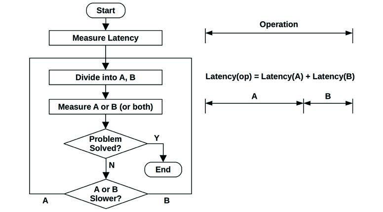
**图 2.14 延迟分析过程**

随着 A 或 B 中较慢的一个被识别出来，它随后被进一步分解为 A 或 B，进行分析，以此类推。

数据库查询的延迟分析是 Method R 的目标。

### 2.5.14 Method R (Method R)

Method R 是一种专为 Oracle 数据库开发的性能分析方法论，侧重于基于 Oracle 追踪事件寻找延迟的起源 [Millsap 03]。它被描述为“一种基于响应时间的性能改进方法，为您的业务产出最大的经济价值”，并专注于识别和量化查询期间的时间去向。虽然这被用于研究数据库，但其方法可以应用于任何系统，值得作为一种可能的学习途径在此提及。

### 2.5.15 事件追踪 (Event Tracing)

系统通过处理离散事件来运行。这些事件包括 CPU 指令、磁盘 I/O 和其他磁盘命令、网络数据包、系统调用、库调用、应用事务、数据库查询等。性能分析通常研究这些事件的摘要，例如每秒操作数、每秒字节数或平均延迟。有时在摘要中会丢失重要的细节，而通过逐个检查事件可以最好地理解它们。

网络排查通常需要逐个数据包检查，使用 `tcpdump(8)` 等工具。以下示例将数据包概括为单行文本：

```bash
# tcpdump -ni eth4 -ttt
tcpdump: verbose output suppressed, use -v or -vv for full protocol decode
listening on eth4, link-type EN10MB (Ethernet), capture size 65535 bytes
00:00:00.000000 IP 10.2.203.2.22 > 10.2.0.2.33986: Flags [P.], seq 
1182098726:1182098918, ack 4234203806, win 132, options [nop,nop,TS val 1751498743 
ecr 1751639660], length 192
00:00:00.000392 IP 10.2.0.2.33986 > 10.2.203.2.22: Flags [.], ack 192, win 501, 
options [nop,nop,TS val 1751639684 ecr 1751498743], length 0
00:00:00.009561 IP 10.2.203.2.22 > 10.2.0.2.33986: Flags [P.], seq 192:560, ack 1, 
win 132, options [nop,nop,TS val 1751498744 ecr 1751639684], length 368
00:00:00.000351 IP 10.2.0.2.33986 > 10.2.203.2.22: Flags [.], ack 560, win 501, 
options [nop,nop,TS val 1751639685 ecr 1751498744], length 0
00:00:00.010489 IP 10.2.203.2.22 > 10.2.0.2.33986: Flags [P.], seq 560:896, ack 1, 
win 132, options [nop,nop,TS val 1751498745 ecr 1751639685], length 336
00:00:00.000369 IP 10.2.0.2.33986 > 10.2.203.2.22: Flags [.], ack 896, win 501, 
options [nop,nop,TS val 1751639686 ecr 1751498745], length 0
[...]
```

根据需要，`tcpdump(8)` 可以打印不同数量的信息（见第 10 章“网络”）。

块设备层的存储设备 I/O 可以使用 `biosnoop(8)`（基于 BCC/BPF）进行追踪：

```bash
# biosnoop
TIME(s)     COMM           PID    DISK    T SECTOR     BYTES   LAT(ms)
0.000004    supervise      1950   xvda1   W 13092560   4096       0.74
0.000178    supervise      1950   xvda1   W 13092432   4096       0.61
0.001469    supervise      1956   xvda1   W 13092440   4096       1.24
0.001588    supervise      1956   xvda1   W 13115128   4096       1.09
1.022346    supervise      1950   xvda1   W 13115272   4096       0.98
[...]
```

该 `biosnoop(8)` 输出包含 I/O 完成时间（TIME(s)）、发起进程详情（COMM, PID）、磁盘设备（DISK）、I/O 类型（T）、大小（BYTES）和 I/O 持续时间（LAT(ms)）。有关此工具的更多信息，请参见第 9 章“磁盘”。

系统调用层是另一个常见的追踪位置。在 Linux 上，可以使用 `strace(1)` 和 `perf(1)` 的 `trace` 子命令进行追踪（参见第 5 章“应用程序”）。这些工具也有打印时间戳的选项。

执行事件追踪时，寻找以下信息：

- **输入 (Input)**：事件请求的所有属性：类型、方向、大小等。
- **时间 (Times)**：开始时间、结束时间、延迟（差异）。
- **结果 (Result)**：错误状态、事件结果（例如：成功的传输大小）。

有时通过检查事件的属性（无论是请求还是结果），可以理解性能问题。事件时间戳对于分析延迟特别有用，通常可以通过使用事件追踪工具包含在内。前面的 `tcpdump(8)` 输出使用 `-ttt` 包含了增量时间戳（Delta timestamps），测量数据包之间的时间。

研究先前的事件提供了更多信息。一个异常高的延迟事件，被称为[[延迟离群值]]（Latency outlier），可能是由先前的事件而不是该事件本身引起的。例如，队列末尾的事件可能具有高延迟，但是由先前排队的事件引起的，而不是它本身的属性。这种情况可以从追踪的事件中识别出来。

### 2.5.16 基准统计信息 (Baseline Statistics)

环境通常使用监控解决方案来记录服务器性能指标，并将其可视化为折线图，x 轴表示时间（见第 2.9 节“监控”）。这些折线图只需通过检查线条的变化，就可以显示指标最近是否发生了变化，如果发生了，现在有何不同。有时会添加额外的线条以包含更多历史数据，例如历史平均值或仅仅是用于与当前范围进行比较的历史时间范围。例如，许多 Netflix 仪表板会画出一条额外的线来显示前一周同一时间范围的情况，这样周二下午 3 点的行为就可以直接与上周二下午 3 点进行比较。

这些方法对于已经监控的指标和可视化它们的 GUI 效果很好。然而，在命令行中还有更多的系统指标和详情可能并未被监控。你可能会面临不熟悉的系统统计数据，并怀疑它们对于该服务器是否“正常”，或者它们是否是问题的证据。

这不是一个新问题，有一种方法论可以在折线图监控解决方案广泛使用之前解决它。这就是收集[[基准统计信息]]。这可能涉及在系统处于“正常”负载下时收集所有系统指标，并将其记录在文本文件或数据库中以供以后参考。基准软件可以是一个运行可观测性工具并收集其他来源（如对 `/proc` 文件执行 `cat(1)`）的 shell 脚本。剖析器和追踪工具也可以包含在基准中，提供比监控产品通常记录的远为详细的信息（但要小心这些工具的开销，以免干扰生产）。这些基准可以定期收集（如每日），也可以在系统或应用程序更改前后收集，以便分析性能差异。

如果没有收集基准且监控不可用，一些可观测性工具（基于内核计数器的工具）可以显示自启动以来的摘要平均值，以便与当前活动进行比较。这虽然粗略，但总比没有好。

### 2.5.17 静态性能调优 (Static Performance Tuning)

静态性能调优专注于配置架构的问题。其他方法论侧重于施加负载的性能：动态性能 [Elling 00]。静态性能分析可以在系统静止且没有施加负载时执行。

对于静态性能分析和调优，逐步检查系统的所有组件并核对以下内容：

- **组件是否有意义？**（过时、性能不足等）
- **配置对于预期的工作负载是否有意义？**
- **组件是否自动配置在了对于预期工作负载的最佳状态？**
- **组件是否经历了错误，以至于现在处于退化状态？**

以下是使用静态性能调优可能发现的问题示例：

- **网络接口协商**：选择了 1 Gbit/s 而不是 10 Gbit/s。
- **RAID 池中存在故障磁盘**。
- **使用了旧版本的操作系统、应用程序或固件**。
- **文件系统接近写满**（可能导致性能问题）。
- **文件系统记录大小与工作负载 I/O 大小不匹配**。
- **应用程序运行在意外开启的代价高昂的调试模式下**。
- **服务器被意外配置为网络路由器**（启用了 IP 转发）。
- **服务器配置为使用远程数据中心的资源**（如身份验证），而不是本地资源。

幸运的是，这些类型的问题很容易检查；难点在于记得去检查！

### 2.5.18 缓存调优 (Cache Tuning)

应用程序和操作系统可能会采用多级缓存来提高 I/O 性能，从应用程序一直到磁盘。完整列表见第 3 章“操作系统”第 3.2.11 节“缓存”。以下是调优每个缓存层级的通用策略：

1. **目标是尽可能在栈的高层进行缓存**，更接近执行工作的地方，从而减少缓存命中的操作开销。此位置还应有更多可用的元数据，可用于改进缓存保留策略。
2. **检查缓存是否已启用并正在工作**。
3. **检查缓存命中/未命中率以及未命中率**。
4. **如果缓存大小是动态的，检查其当前大小**。
5. **针对工作负载调优缓存**。此任务取决于可用的缓存可调参数。
6. **针对缓存调优工作负载**。这包括减少不必要的缓存消费者，从而为目标工作负载腾出更多空间。

留意**双重缓存**（Double caching）——例如，两个不同的缓存都消耗主内存并两次缓存相同的数据。

还要考虑每一级缓存调优的整体性能收益。调优 CPU 一级缓存可能会节省纳秒，因为缓存未命中随后可能会由二级缓存服务。但改进 CPU 三级缓存可能会避免慢得多的 DRAM 访问，并产生更大的整体性能收益。（这些 CPU 缓存在第 6 章中描述。）

### 2.5.19 微基准测试 (Micro-Benchmarking)

微基准测试测试简单且人工构建的工作负载的性能。这与宏基准测试（或行业基准测试）不同，后者通常旨在测试真实的、自然的工作负载。宏基准测试通过运行工作负载模拟来执行，执行和理解起来可能很复杂。

由于涉及的因素较少，微基准测试执行和理解起来较不复杂。常用的微基准测试是 Linux 的 `iperf(1)`，它执行 TCP 吞吐量测试：通过在生产工作负载期间检查 TCP 计数器，这可以识别外部网络瓶颈（否则很难发现）。

微基准测试可以由应用工作负载并测量其性能的微基准测试工具执行，也可以使用仅应用工作负载的负载生成工具，而将性能测量留给其他可观测性工具（示例负载生成器见第 12 章“基准测试”第 12.2.2 节“模拟”）。两种方法都可以，但使用微基准测试工具并使用其他工具进行二次检查是最安全的。

微基准测试的一些示例目标（包括测试的第二个维度）有：

- **系统调用时间**：针对 `fork(2)`、`execve(2)`、`open(2)`、`read(2)`、`close(2)`。
- **文件系统读取**：从缓存的文件中读取，将读取大小从 1 字节变动到 1 Mbyte。
- **网络吞吐量**：在 TCP 端点之间传输数据，变动套接字缓冲区大小。

微基准测试通常尽可能快地执行目标操作，并测量大量此类操作完成的时间。然后可以计算平均时间（平均时间 = 运行时间 / 操作计数）。

后续章节包含具体的微基准测试方法论，列出了要测试的目标和属性。基准测试的主题在第 12 章“基准测试”中更详细地介绍。

### 2.5.20 性能真言 (Performance Mantras)

这是一种调优方法论，展示了如何最好地提高性能，按从最有效到最不有效的顺序列出了可操作项。它是：

1. **别做它 (Don’t do it)**。
2. **做它，但别再做第二次 (Do it, but don’t do it again)**。
3. **少做点 (Do it less)**。
4. **晚点做 (Do it later)**。
5. **趁他们没看的时候做 (Do it when they’re not looking)**。
6. **并发做 (Do it concurrently)**。
7. **更便宜地做 (Do it more cheaply)**。

以下是每一项的一些示例：

1. **别做它**：消除不必要的工作。
2. **做它，但别再做第二次**：缓存。
3. **少做点**：调优刷新、轮询或更新，使频率降低。
4. **晚点做**：写回缓存 (Write-back caching)。
5. **趁他们没看的时候做**：安排工作在非高峰时段运行。
6. **并发做**：从单线程切换到多线程。
7. **更便宜地做**：购买更快的硬件。

这是我最喜欢的方法论之一，是我在 Netflix 工作时从 Scott Emmons 那里学到的。他将其归功于 Craig Hanson 和 Pat Crain（虽然我尚未找到已发表的引用）。

## 2.6 建模 (Modeling)

系统的分析建模可以用于各种目的，特别是[[可伸缩性]]分析：研究性能如何随着负载或资源的增加而伸缩。资源可以是硬件（如 CPU 核心）或软件（进程或线程）。

分析建模可以被认为是性能评估活动的第三种类型，与生产系统的可观测性（“测量”）和实验性测试（“模拟”）并列 [Jain 91]。当至少执行其中两项活动时，性能才能得到最好的理解：分析建模与模拟，或模拟与测量。

如果分析是针对现有系统的，你可以从测量开始：表征负载和由此产生的性能。如果在系统尚未承受生产负载，或者为了测试生产中见不到的工作负载，可以使用通过测试工作负载模拟进行的实验分析。分析建模可以用于预测性能，并可以基于测量或模拟的结果。

可伸缩性分析可能会揭示，由于资源限制，性能在特定点停止线性伸缩。这被称为**拐点**（Knee point）：当一个函数切换到另一个函数时，在本例中，是从线性伸缩切换到竞争。寻找这些点是否存在以及在哪里，可以将调查导向抑制可伸缩性的性能问题，以便在生产中遇到它们之前将其修复。

关于这些步骤的更多信息，请参见第 2.5.11 节“工作负载表征”和第 2.5.19 节“微基准测试”。

### 2.6.1 企业 vs. 云 (Enterprise vs. Cloud)

虽然建模允许我们在没有拥有大型企业系统的费用的情况下模拟它们，但大规模环境的性能通常很复杂且难以准确建模。

有了云计算，任何规模的环境都可以短时间租用——即基准测试的时间。与其创建一个预测性能的数学模型，不如表征工作负载，进行模拟，然后在不同规模的云上进行测试。一些发现（如拐点）可能相同，但现在将基于测量数据而非理论模型，并且通过测试真实环境，你可能会发现模型中未包含的限制因素。

### 2.6.2 视觉识别 (Visual Identification)

当可以通过实验收集到足够的结果时，将它们绘制为交付的性能与缩放参数的对比图，可能会揭示出某种模式。

图 2.15 显示了随着线程数增加，应用程序的吞吐量情况。在 8 个线程左右似乎有一个拐点，斜率发生了变化。现在可以对此进行调查，例如通过查看应用程序和系统配置，寻找任何与数值 8 相关的设置。

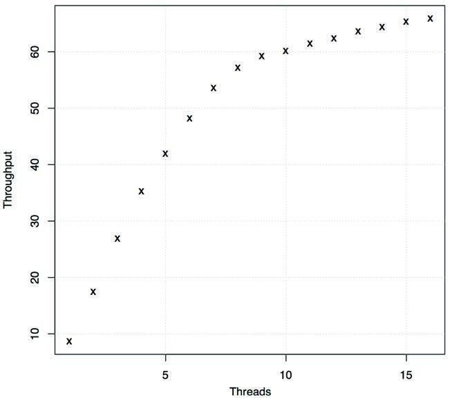
**图 2.15 可伸缩性测试结果**

在这种情况下，系统是一个 8 核系统，每个核心有两个硬件线程。为了进一步确认这与 CPU 核心数有关，可以调查并对比线程数少于和多于 8 个时的 CPU 效应（例如 IPC；见第 6 章“CPU”）。或者，可以通过在具有不同核心数的系统上重复缩放测试，并确认拐点按预期移动，来进行实验性调查。

有许多可伸缩性概貌可以寻找，这些概貌可以通过视觉识别，而无需使用正式模型。这些如图 2.16 所示。

对于其中的每一个，x 轴是可伸缩性维度，y 轴是产生的性能（吞吐量、每秒事务数等）。这些模式是：

- **线性可伸缩性 (Linear scalability)**：性能随着资源的增加成比例增加。这可能不会永远持续下去，反而可能是另一种可伸缩性模式的早期阶段。
- **竞争 (Contention)**：架构中的某些组件是共享的且只能串行使用，对这些共享资源的竞争开始降低缩放的效果。
- **一致性 (Coherency)**：维护数据一致性（包括变更传播）的代价开始超过缩放的收益。
- **拐点 (Knee point)**：在某个可伸缩性点遇到了改变可伸缩性概貌的因素。
- **可伸缩性天花板 (Scalability ceiling)**：达到了硬性限制。这可能是一个设备瓶颈，例如总线或互连达到了最大吞吐量，或者是软件强加的限制（系统资源控制）。

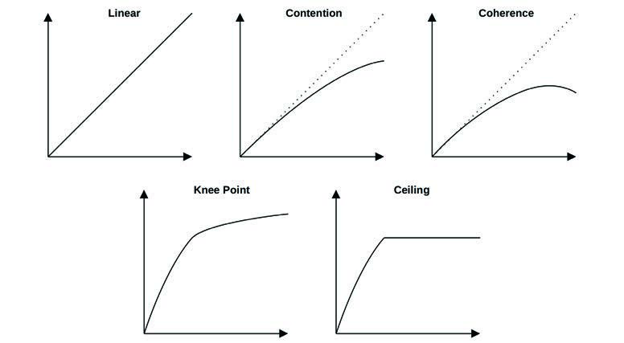
**图 2.16 可伸缩性概貌**

虽然视觉识别既简单又有效，但通过使用数学模型，你可以了解更多关于系统可伸缩性的信息。模型可能会以意想不到的方式偏离数据，这对于调查非常有用：要么是模型有问题（从而你对系统的理解有问题），要么是问题出在系统的真实可伸缩性上。接下来的章节将介绍阿姆达尔可伸缩性定律、通用可伸缩性定律和队列理论。

### 2.6.3 阿姆达尔可伸缩性定律 (Amdahl’s Law of Scalability)

该定律以计算机架构师 Gene Amdahl 命名 [Amdahl 67]，用于建立系统可伸缩性模型，考虑了工作负载中无法并行缩放的串行组件。它可以用于研究 CPU、线程、工作负载等的缩放。

阿姆达尔可伸缩性定律在之前的可伸缩性概貌中表现为“竞争”，描述了对串行资源或工作负载组件的竞争。它可以定义为 [Gunther 97]：

> C(N) = N / (1 + α(N − 1))

相对容量是 C(N)，N 是缩放维度，如 CPU 数量或用户负载。α 参数（其中 0 <= α <= 1）代表串行化程度，以及它是如何偏离线性可伸缩性的。

可以通过以下步骤应用阿姆达尔可伸缩性定律：

1. **收集一系列 N 的数据**，可以通过观测现有系统或使用微基准测试或负载生成器进行实验。
2. **执行回归分析以确定阿姆达尔参数 (α)**；这可以使用统计软件（如 gnuplot 或 R）完成。
3. **展示分析结果**。收集到的数据点可以与模型函数一起绘制，以预测缩放情况并揭示数据与模型之间的差异。这也可以使用 gnuplot 或 R 完成。

以下是用于阿姆达尔可伸缩性定律回归分析的示例 gnuplot 代码，以提供有关如何执行此步骤的感觉：

```gnuplot
inputN = 10                     # 作为模型输入的行数
alpha = 0.1                     # 起始点 (种子值)
amdahl(N) = N1 * N/(1 + alpha * (N - 1))
# 回归分析 (非线性最小二乘拟合)
fit amdahl(x) filename every ::1::inputN using 1:2 via alpha
```

在 R 中处理此过程需要类似数量的代码，涉及使用 `nls()` 函数进行非线性最小二乘拟合以计算系数，然后将其用于绘图。完整代码（包括 gnuplot 和 R 版本）请参见本章末尾参考文献中的“性能可伸缩性模型工具包” [Gregg 14a]。

下一节将展示一个阿姆达尔可伸缩性定律函数的示例。

### 2.6.4 通用可伸缩性定律 (Universal Scalability Law)

通用可伸缩性定律 (USL)，以前称为超串行模型 (Super-serial model) [Gunther 97]，由 Neil Gunther 博士开发，加入了一个一致性延迟参数。这在之前被描绘为“一致性”可伸缩性概貌，它包含了竞争的影响。

USL 可以定义为：

> C(N) = N / (1 + α(N − 1) + βN(N − 1))

C(N)、N 和 α 与阿姆达尔可伸缩性定律相同。β 是一致性参数。当 β == 0 时，该定律退化为阿姆达尔可伸缩性定律。

USL 和 阿姆达尔可伸缩性定律分析的示例均绘于图 2.17 中。

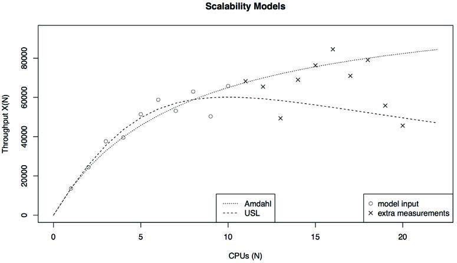
**图 2.17 可伸缩性模型**

输入数据集具有高度的变异性，这使得很难通过视觉确定其可伸缩性概貌。前十个数据点（以圆圈表示）提供给了模型。另外十个数据点（以叉号表示）也被绘制出来，用于根据现实检查模型的预测。

更多关于 USL 分析的内容，请参见 [Gunther 97] 和 [Gunther 07]。

### 2.6.5 队列理论 (Queueing Theory)

队列理论是对具有队列的系统的数学研究，提供了分析其队列长度、等待时间（延迟）和利用率（基于时间）的方法。计算机中的许多组件，无论是软件还是硬件，都可以被建模为队列系统。对多个队列系统的建模被称为[[队列网络]]（Queueing networks）。

本节总结了队列理论的作用，并提供了一个示例来帮助您理解该作用。这是一个庞大的研究领域，在其他著作中已有详细介绍 [Jain 91][Gunther 97]。

队列理论建立在数学和统计学的各个领域之上，包括概率分布、随机过程、埃尔朗 C 公式（Agner Krarup Erlang 发明了队列理论）以及利特尔定律。[[利特尔定律]]（Little’s Law）可以表达为：

> L = λW

它将系统中请求的平均数量 L，确定为平均到达率 λ 乘以请求在系统中的平均停留时间 W。这可以应用于队列，此时 L 是队列中的请求数，W 是在队列中的平均等待时间。

队列系统可以用来回答各种问题，包括以下内容：

- 如果负载翻倍，平均响应时间会是多少？
- 增加一个额外的处理器对平均响应时间有什么影响？
- 当负载翻倍时，系统能否提供低于 100 ms 的第 90 百分位响应时间？

除了响应时间外，还可以研究利用率、队列长度和常驻作业数量等其他因素。

一个简单的队列系统模型如图 2.18 所示。

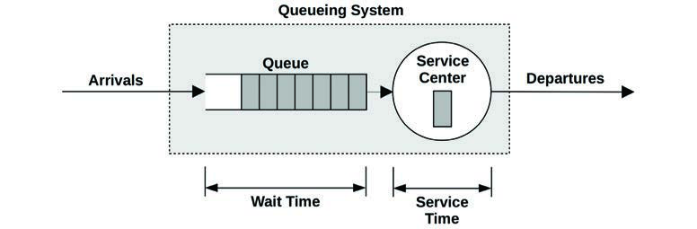
**图 2.18 队列模型**

它有一个从队列中处理作业的服务中心。队列系统可以有多个并行处理工作的服务中心。在队列理论中，服务中心通常被称为服务器。

队列系统可以按三个因素分类：

- **到达过程 (Arrival process)**：这描述了请求到达队列系统的间隔时间，可能是随机的、固定时间的，或者是像泊松过程（对到达时间使用指数分布）那样的过程。
- **服务时间分布 (Service time distribution)**：这描述了服务中心的服务时间。它们可能是固定的（确定性的）、指数分布的，或者是其他分布类型。
- **服务中心数量**：一个或多个。

这些因素可以用肯德尔表示法书写。

#### 肯德尔表示法 (Kendall’s Notation)
这种表示法为每个属性分配代码。它的形式为：
> A/S/m

分别代表到达过程 (A)、服务时间分布 (S) 和服务中心数量 (m)。肯德尔表示法还有一个扩展形式，包含更多因素：系统中的缓冲区数量、人口规模和服务规程。

常用研究的队列系统示例有：

- **M/M/1**：马尔可夫到达（指数分布的到达时间）、马尔可夫服务时间（指数分布）、一个服务中心。
- **M/M/c**：与 M/M/1 相同，但具有多个服务器 (c)。
- **M/G/1**：马尔可夫到达、普通服务时间分布（任意）、一个服务中心。
- **M/D/1**：马尔可夫到达、确定性服务时间（固定）、一个服务中心。

M/G/1 常用于研究旋转硬盘的性能。

#### M/D/1 与 60% 利用率
作为一个队列理论的简单例子，考虑一个以确定性方式响应工作负载的磁盘（这是一种简化）。模型是 M/D/1。

提出的问题是：随着磁盘利用率的增加，磁盘的响应时间如何变化？

队列理论允许计算 M/D/1 的响应时间：
> r = s(2 − ρ) / 2(1 − ρ)

其中响应时间 r 是根据服务时间 s 和利用率 ρ 定义的。

对于 1 ms 的服务时间，以及 0 到 100% 的利用率，这种关系已绘于图 2.19 中。

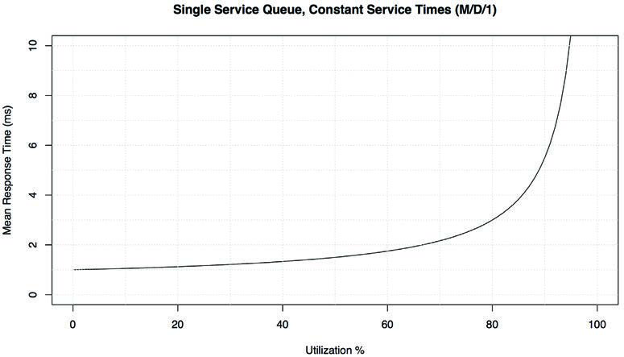
**图 2.19 M/D/1 平均响应时间 vs. 利用率**

超过 60% 的利用率后，平均响应时间翻倍。到 80% 时，它已经翻了三倍。由于磁盘 I/O 延迟通常是应用程序的限制资源，将平均延迟增加一倍或更多可能会对应用程序性能产生显著的负面影响。这就是为什么磁盘利用率在达到 100% 之前很久就会成为问题的原因，因为它是一个请求（通常）不能被中断且必须排队等候的队列系统。这与 CPU 不同，例如，在 CPU 中更高优先级的工作可以进行抢占。

该图可以视觉化地回答之前的一个问题——“如果负载翻倍，平均响应时间会是多少？”——此时利用率与负载成正比。

该模型很简单，在某些方面它展示了最好的情况。服务时间的变动可能会推动平均响应时间更高（例如：使用 M/G/1 或 M/M/1）。此外还存在响应时间的分布，图 2.19 中未绘出，即第 90 和第 99 百分位在超过 60% 利用率后退化得快得多。

与之前阿姆达尔可伸缩性定律的 gnuplot 示例一样，展示一些实际代码可能具有说明意义，以便了解可能涉及的内容。这次使用的是 R 统计软件 [R Project 20]：

```R
svc_ms <- 1                   # 平均磁盘 I/O 服务时间，ms
util_min <- 0                 # 绘图范围
util_max <- 100               # "
ms_min <- 0                   # "
ms_max <- 10                  # "
# 绘制平均响应时间 vs 利用率 (M/D/1)
plot(x <- c(util_min:util_max), svc_ms * (2 - x/100) / (2 * (1 - x/100)),
    type="l", lty=1, lwd=1,
    xlim=c(util_min, util_max), ylim=c(ms_min, ms_max),
    xlab="Utilization %", ylab="Mean Response Time (ms)")
```

之前的 M/D/1 方程已传递给 `plot()` 函数。这段代码的大部分内容指定了图表的界限、线条属性和轴标签。

## 2.7 容量规划 (Capacity Planning)

容量规划研究系统处理负载的能力，以及随着负载增加系统将如何伸缩。它可以以多种方式执行，包括研究资源限制和因素分析（此处描述），以及之前介绍的建模。本节还包括缩放解决方案，包括负载均衡器和分片（Sharding）。有关此话题的更多信息，请参阅《容量规划的艺术》 [Allspaw 08]。

对于特定应用程序的容量规划，有一个量化的性能目标会有所帮助。第 5 章“应用程序”的开头讨论了如何确定该目标。

### 2.7.1 资源限制 (Resource Limits)

这种方法是寻找在负载下将成为瓶颈的资源。对于容器，资源可能会遇到软件强加的限制，这些限制也会成为瓶颈。该方法的步骤是：

1. **测量服务器请求率**，并随时间监控此速率。
2. **测量硬件和软件资源使用情况**。随时间监控此速率。
3. **根据所使用的资源来表达服务器请求**。
4. **将服务器请求外推到每个资源的已知（或通过实验确定的）限制**。

首先识别服务器的角色及其服务的请求类型。例如，Web 服务器服务 HTTP 请求，网络文件系统 (NFS) 服务器服务 NFS 协议请求（操作），数据库服务器服务查询请求（或命令请求，查询是其子集）。

下一步是确定每个请求的系统资源消耗。对于现有系统，可以测量当前的请求速率以及资源利用率。然后可以使用外推法来查看哪个资源将首先达到 100% 利用率，以及届时的请求速率会是多少。

对于未来的系统，可以在测试环境中使用微基准测试或负载生成工具模拟预期的请求，同时测量资源利用率。在给定的客户端负载充足的情况下，你可能能够通过实验找到限制。

要监控的资源包括：

- **硬件**：CPU 利用率、内存使用量、磁盘 IOPS、磁盘吞吐量、磁盘容量（已使用的卷）、网络吞吐量。
- **软件**：虚拟内存使用量、进程/任务/线程、文件描述符。

假设你正在查看一个现有系统，当前每秒执行 1,000 个请求。最忙的资源是 16 个 CPU，平均利用率为 40%；你预测一旦 CPU 达到 100% 利用率，它们将成为该工作负载的瓶颈。问题变为：届时的每秒请求速率是多少？

> 每个请求的 CPU% = 总 CPU% / 请求数 = 16 × 40% / 1,000 = 0.64% 每个请求的 CPU
>
> 最大请求数/秒 = 100% × 16 个 CPU / 每个请求的 CPU% = 1,600 / 0.64 = 2,500 请求/秒

预测结果是 2,500 请求/秒，届时 CPU 将 100% 繁忙。这是对容量的一个粗略的最佳情况估算，因为在请求达到该速率之前可能会遇到其他限制因素。

该练习仅使用了一个数据点：1,000 的应用吞吐量（每秒请求数）与 40% 的设备利用率。如果启用了随时间变化的监控，则可以包含在不同吞吐量和利用率下的多个数据点，以提高估算的准确性。图 2.20 展示了处理这些数据并外推最大应用吞吐量的视觉方法。

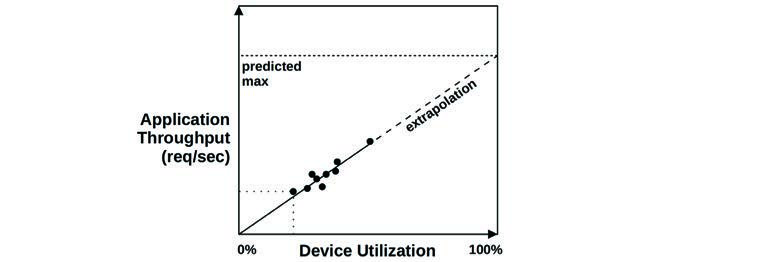
**图 2.20 资源限制分析**

2,500 请求/秒够吗？回答这个问题需要了解峰值工作负载会是多少，这表现在每日访问模式中。对于已经随时间监控的现有系统，你可能已经知道峰值会是什么样子。

考虑一个每天处理 100,000 次网站点击的 Web 服务器。这听起来可能很多，但平均每秒只有一次请求——并不多。然而，可能这 100,000 次点击大部分发生在发布新内容后的几秒钟内，因此峰值是很显著的。

### 2.7.2 因素分析 (Factor Analysis)

在购买和部署新系统时，通常有许多因素可以改变以达到预期的性能。这些因素可能包括变动磁盘和 CPU 的数量、RAM 的容量、闪存设备的使用、RAID 配置、文件系统设置等。任务通常是以最小的成本达到所需的性能。

测试所有组合将确定哪种组合具有最佳的性价比；然而，这很快就会失控：八个二进制因素就需要 256 次测试。

一个解决方案是测试有限的一组组合。以下是一种基于已知最大系统配置的方法：

1. **测试所有因素配置为最大时的性能**。
2. **逐个更改因素，测试性能**（每次性能都应该下降）。
3. **根据测量结果为每个因素归因性能下降百分比**，以及成本节约。
4. **从最大性能（和成本）开始，选择节省成本的因素**，同时根据它们的综合性能下降维持所需的每秒请求数。
5. **重新测试计算出的配置以确认交付的性能**。

对于一个八因素系统，这种方法可能只需要十次测试。

例如，考虑为一个新的存储系统进行容量规划，要求是 1 Gbyte/s 的读取吞吐量和 200 Gbyte 的工作集大小。最大配置实现了 2 Gbytes/s，包括四个处理器、256 Gbytes 的 DRAM、2 块双端口 10 GbE 网卡、巨型帧（Jumbo frames），且未启用压缩或加密（激活这些成本很高）。切换到两个处理器使性能降低 30%，一块网卡降低 25%，非巨型帧降低 35%，加密降低 10%，压缩降低 40%，更少的 DRAM 降低 90%（因为预期工作负载不再能完全缓存）。根据这些性能下降及其已知的节约成本，现在可以计算出满足要求的最佳性价比系统；它可能是一个带有单网卡的两处理器系统，满足所需的吞吐量：估算为 2 × (1 − 0.30) × (1 − 0.25) = 1.04 Gbytes/s。随后测试此配置以进行确认是明智的，以防这些组件在共同使用时表现得与预期性能不同。

### 2.7.3 缩放解决方案 (Scaling Solutions)

满足更高的性能需求通常意味着使用更大的系统，这种策略称为[[垂直缩放]]（Vertical scaling）。将负载分散到众多系统上（通常由称为负载均衡器的系统引导，使它们看起来像一个整体）称为[[水平缩放]]（Horizontal scaling）。

云计算进一步推进了水平缩放，通过构建在较小的虚拟化系统而不是整个系统之上。这在购买计算能力以处理所需负载时提供了更细的颗粒度，并允许以小而高效的增量进行缩放。由于不需要像企业大型机那样进行初始的大宗采购（包括支持合同承诺），因此在项目早期阶段不太需要严格的容量规划。

有一些技术可以根据性能指标自动执行云缩放。AWS 用于此的技术称为自动缩放组 (ASG)。可以创建一个自定义缩放策略，根据使用情况指标增加和减少实例数量。如图 2.21 所示。

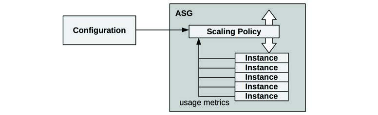
**图 2.21 自动缩放组**

Netflix 通常使用目标 CPU 利用率为 60% 的 ASG，并随负载上下缩放以维持该目标。

容器编排系统也可能提供自动缩放支持。例如，Kubernetes 提供了水平 Pod 自动缩放器 (HPA)，可以根据 CPU 利用率或其他自定义指标缩放 Pod（容器）的数量 [Kubernetes 20a]。

对于数据库，一种常见的缩放策略是[[分片]]（Sharding），将数据拆分为逻辑组件，每个组件由自己的数据库（或冗余数据库组）管理。例如，客户数据库可以通过将客户名称按字母范围拆分来拆分为多个部分。选择有效的分片键对于在数据库之间均匀分布负载至关重要。

## 2.8 统计学 (Statistics)

很好地理解如何使用统计学及其局限性非常重要。本节讨论使用统计数据（指标）量化性能问题，以及包括平均值、标准差和百分位数在内的统计类型。

### 2.8.1 量化性能收益 (Quantifying Performance Gains)

量化问题及修复它们的潜在性能改进，使得可以对它们进行比较和优先级排序。该任务可以使用观测或实验来执行。

#### 基于观测
使用观测来量化性能问题：
1. **选择一个可靠的指标**。
2. **估算解决问题带来的性能收益**。

例如：
- **观测到**：应用请求耗时 10 ms。
- **观测到**：其中 9 ms 是磁盘 I/O。
- **建议**：配置应用程序在内存中缓存 I/O，预期 DRAM 延迟约为 10 μs。
- **估算收益**：10 ms → 1.01 ms (10 ms - 9 ms + 10 μs) = 约 9 倍收益。

如第 2.3 节“概念”中所述，延迟（时间）非常适合此类计算，因为它可以直接在组件之间进行比较。

使用延迟时，确保它是作为应用请求的同步组件被测量的。某些事件是异步发生的，例如后台磁盘 I/O（写刷写到磁盘），并不直接影响应用程序性能。

#### 基于实验
实验性地量化性能问题：
1. **应用修复**。
2. **使用可靠指标对修复前后的情况进行量化**。

例如：
- **观测到**：应用事务平均延迟为 10 ms。
- **实验**：增加应用线程数以允许更多并发而不是排队。
- **观测到**：应用事务平均延迟为 2 ms。
- **收益**：10 ms → 2 ms = 5 倍。

如果修复在生产环境中尝试起来成本很高，这种方法可能不合适！在这种情况下，应使用基于观测的方法。

### 2.8.2 平均值 (Averages)

平均值通过单一数值代表一个数据集：中心趋势的指数。最常用的平均值类型是[[算术平均值]]（简称平均值），它是数值之和除以数值个数。其他类型包括几何平均值和调和平均值。

#### 几何平均值 (Geometric Mean)
几何平均值是相乘数值的 n 次方根（n 是数值个数）。这在 [Jain 91] 中有描述，包括一个将其用于网络性能分析的例子：如果内核网络栈的每一层性能改进都被单独测量，那么平均性能改进是多少？由于各层在同一个数据包上协同工作，性能改进具有“相乘”效应，这通过几何平均值可以得到最好的概括。

#### 调和平均值 (Harmonic Mean)
调和平均值是数值个数除以其倒数之和。它更适合对速率求平均值，例如，计算 800 Mbytes 数据发送的平均传输速率，其中前 100 Mbytes 以 50 Mbytes/s 发送，剩余 700 Mbytes 以 10 Mbytes/s 的节流速率发送。使用调和平均值的答案是 800 / (100/50 + 700/10) = 11.1 Mbytes/s。

#### 随时间变化的平均值 (Averages over Time)
在性能方面，我们研究的许多指标都是随时间变化的平均值。CPU 永远不会处于“50% 利用率”；它是在某个间隔（可以是一秒、一分钟或一小时）的 50% 时间内被利用了。在考虑平均值时，检查间隔是很重要的。

例如，我曾遇到一个客户的性能问题是由 CPU 饱和（调度器延迟）引起的，尽管他们的监控工具显示 CPU 利用率从未高于 80%。监控工具报告的是 5 分钟平均值，这掩盖了 CPU 利用率连续数秒达到 100% 的时期。

#### 衰减平均值 (Decayed Average)
衰减平均值有时被用于系统性能。一个例子是各种工具（包括 `uptime(1)`）报告的系统“平均负载”（Load averages）。

衰减平均值仍是在一个时间间隔内测量的，但近期时间的权重比过去更重。这减少（缓冲）了平均值的短期波动。

更多信息请参见第 6 章“CPU”第 6.6 节“可观测性工具”中的“平均负载”。

#### 局限性 (Limitations)
平均值是一种隐藏细节的摘要统计数据。我曾分析过许多偶尔磁盘 I/O 延迟离群值超过 100 ms 的案例，而平均延迟接近 1 ms。为了更好地理解数据，可以使用下一节涵盖的其他统计数据。

### 2.8.3 标准差、百分位数、中位数 (Standard Deviation, Percentiles, Median)

标准差和百分位数（如第 99 百分位）是提供数据分布信息的统计技术。标准差是变异性的度量，较大的数值表示与平均值（算术平均值）的变异较大。第 99 百分位显示了包含 99% 数值的数据分布点。图 2.22 描绘了正态分布的这些数值，以及最小值和最大值。

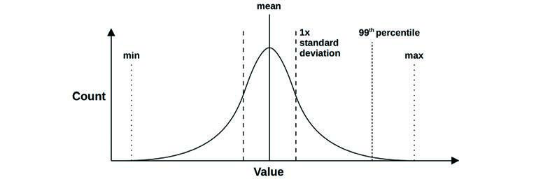
**图 2.22 统计值**

百分位数如第 90、95、99 和 99.9 百分位被用于请求延迟的性能监控，以量化群体中最慢的部分。这些也可能在服务水平协议 (SLA) 中指定，作为衡量对大多数用户而言性能是否可接受的一种方式。

第 50 百分位被称为[[中位数]]（Median），可以用来显示大部分数据所在的位置。

### 2.8.4 变异系数 (Coefficient of Variation)

由于标准差是相对于平均值的，只有同时考虑标准差和平均值才能理解变异。单独一个 50 的标准差告诉我们的很少。加上 200 的平均值就告诉了我们很多。

有一种将变异表达为单一指标的方法：标准差与平均值的比率，这被称为[[变异系数]]（CoV 或 CV）。对于这个例子，CV 是 25%。较低的 CV 意味着较小的变异。

变异的另一种表达方式是 z 值，即一个数值距离平均值有多少个标准差。

### 2.8.5 多峰分布 (Multimodal Distributions)

算术平均值、标准差和百分位数存在一个问题，这从之前的图表中可能很明显：它们是为类正态分布或单峰分布设计的。系统性能通常是[[多峰分布]]（Multimodal distributions），比如对于快速代码路径返回低延迟，对于慢速路径返回高延迟；或者对于缓存命中返回低延迟，对于缓存未命中返回高延迟。也可能存在两个以上的峰值。

图 2.23 显示了读写混合工作负载（包括随机和顺序 I/O）的磁盘 I/O 延迟分布。

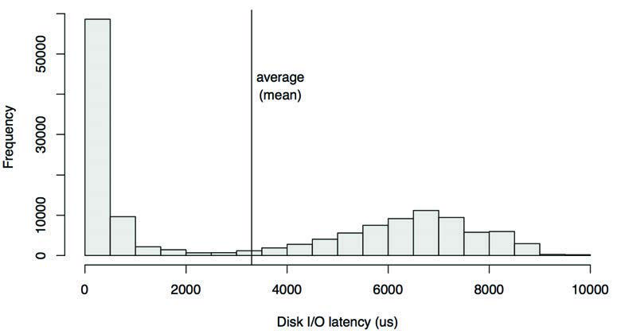
**图 2.23 延迟分布**

这以直方图形式呈现，显示了两个峰值。左侧的峰值显示了小于 1 ms 的延迟，这是针对磁盘内缓存命中的。右侧在 7 ms 左右有一个峰值，是针对磁盘内缓存未命中（随机读取）的。平均（算术平均）I/O 延迟是 3.3 ms，绘为一条垂直线。该平均值并不是中心趋势的指数；事实上，它几乎恰恰相反。作为指标，该分布的平均值具有严重的误导性。

> 曾有一人淹死在平均深度仅六英寸的小溪里。 —— W. I. E. Gates

每当你看到平均值被用作性能指标时，特别是平均延迟，请问：分布是什么样的？第 2.10 节“可视化”提供了另一个例子，并展示了不同的可视化和指标在展示此分布方面的效果。

### 2.8.6 离群值 (Outliers)

另一个统计学问题是[[离群值]]（Outliers）的存在：极少数极大或极小的数值，似乎不符合预期的分布（无论是单峰还是多峰）。

磁盘 I/O 延迟离群值是一个例子——极偶尔的磁盘 I/O 可能耗时超过 1,000 ms，而大多数磁盘 I/O 在 0 到 10 ms 之间。像这样的延迟离群值可能会导致严重的性能问题，但除了作为最大值以外，很难从大多数指标类型中识别出它们。另一个例子是由 TCP 基于定时器的重传引起的网络 I/O 延迟离群值。

对于正态分布，离群值的存在可能会使平均值移动一点，但不会使中位数移动（考虑中位数可能很有用）。标准差和第 99 百分位更有可能识别出离群值，但这仍取决于它们的频率。

为了更好地理解多峰分布、离群值和其他复杂但常见的行为，请检查完整的分布，例如通过使用直方图。更多方法请参见第 2.10 节“可视化”。

## 2.9 监控 (Monitoring)

系统性能监控随时间记录性能统计数据（时间序列），以便将过去与现在进行比较，并识别基于时间的使用模式。这对于容量规划、量化增长和显示峰值使用非常有用。历史值还可以通过显示过去的“正常”范围和平均值，为理解性能指标的当前值提供背景。

### 2.9.1 基于时间的模式 (Time-Based Patterns)

图 2.24、2.25 和 2.26 显示了基于时间的模式示例，它们绘制了一台云计算服务器在不同时间间隔内的文件系统读取情况。

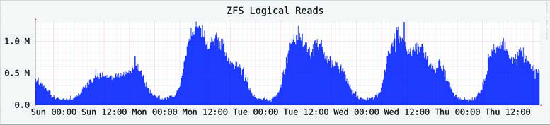
**图 2.24 监控活动：一天**

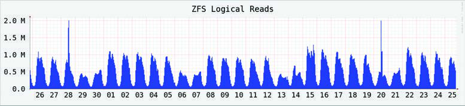
**图 2.25 监控活动：五天**

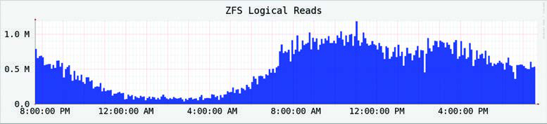
**图 2.26 监控活动：30 天**

这些图表显示了每日模式：早上 8 点左右开始攀升，下午略有下降，然后在夜间衰减。更长比例的图表显示周末两天的活动较低。在 30 天图表中还可以看到几个短尖峰。

在历史数据中通常可以看到各种行为周期，包括：

- **每小时**：来自应用环境的活动可能每小时发生一次，例如监控和报告任务。这些任务也常以 5 分钟或 10 分钟为周期执行。
- **每日**：可能存在与工作时间（上午 9 点到下午 5 点）重合的每日使用模式，如果服务器面向多个时区，该模式可能会拉长。对于互联网服务器，该模式可能遵循全球用户的活跃时间。其他每日活动可能包括夜间日志轮转和备份。
- **每周**：除了每日模式外，还可能存在基于工作日和周末的每周模式。
- **每季度**：财务报告按季度计划执行。
- **每年**：每年的负载模式可能由学校课表和假期引起。

不规则的负载增加可能会随着其他活动发生，例如在网站上发布新内容以及促销活动（美国的黑色星期五/网络星期一）。不规则的负载减少可能由于外部活动引起，例如大规模的停电或互联网中断，以及体育决赛（届时所有人都在看比赛而不是使用你的产品）。[^6]

[^6]: 当我在 Netflix SRE 轮值值班时，我针对这些情况学习了一些非传统的分析工具：检查社交媒体以寻找疑似停电，以及在团队聊天室询问是否有人知道体育决赛。

### 2.9.2 监控产品 (Monitoring Products)

市面上有许多第三方系统性能监控产品。典型功能包括存档数据并将其呈现为基于浏览器的交互式图表，以及提供可配置的告警。

其中一些通过在系统上运行代理（也称为导出器，Exporters）来收集统计数据。这些代理要么执行操作系统可观测性工具（如 `iostat(1)` 或 `sar(1)`）并解析输出文本（这被认为效率低下），要么直接从操作系统库和内核接口读取。监控产品支持一系列用于从特定目标导出统计数据的自定义代理：Web 服务器、数据库和语言运行时。

随着系统变得更加分布式以及云计算的使用持续增长，你将越来越经常地需要监控大量系统：成百上千甚至更多。这就是集中式监控产品特别有用的地方，它允许从一个界面监控整个环境。

作为一个具体例子：Netflix 云由超过 200,000 个实例组成，使用 Atlas 全云监控工具进行监控，该工具由 Netflix 为在此规模下运行而定制构建并已开源 [Harrington 14]。其他监控产品在第 4 章“可观测性工具”第 4.2.4 节“监控”中讨论。

### 2.9.3 自启动以来的摘要 (Summary-Since-Boot)

如果尚未执行监控，请检查操作系统是否至少提供了自启动以来的摘要值，这些值可以用来与当前值进行比较。

## 2.10 可视化 (Visualizations)

可视化允许检查比文本更容易理解（甚至有时比文本更容易显示）的更多数据。它们还能实现模式识别和模式匹配。这可以成为识别不同指标源之间相关性的有效方式，这种相关性可能难以通过编程完成，但通过视觉很容易实现。

### 2.10.1 折线图 (Line Chart)

折线图（也称为线形图）是一种众所周知的基础可视化。它通常用于检查随时间变化的性能指标，在 x 轴上显示时间的流逝。

图 2.27 是一个例子，显示了 20 秒期间的平均（算术平均）磁盘 I/O 延迟。这是在一台运行 MySQL 数据库的生产云服务器上测量的，当时怀疑磁盘 I/O 延迟导致了查询变慢。

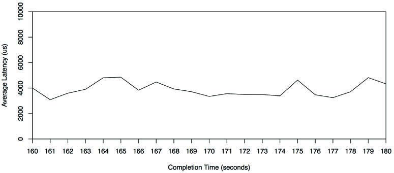
**图 2.27 平均延迟折线图**

该折线图显示了相当一致的约 4 ms 的平均读取延迟，这比这些磁盘的预期延迟要高。

可以在同一组轴上绘制多条线，显示相关数据。在这个例子中，可以为每个磁盘绘制一条单独的线，显示它们是否表现出类似的性能。

也可以绘制统计值，提供更多关于数据分布的信息。图 2.28 显示了同一范围内的磁盘 I/O 事件，增加了每秒中位数、标准差和百分位数的线条。请注意，y 轴现在的范围比之前的折线图大得多（大了 8 倍）。

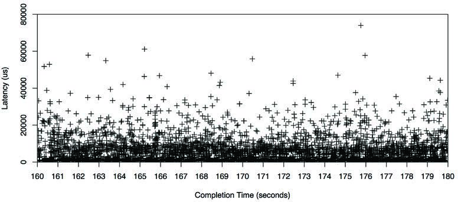
**图 2.28 中位数、平均值、标准差、百分位数**

这显示了为什么平均值高于预期：分布中包含了更高延迟的 I/O。具体而言，1% 的 I/O 超过了 20 ms，如第 99 百分位所示。中位数还显示了 I/O 延迟预期所在的位置，约 1 ms。

### 2.10.2 散点图 (Scatter Plots)

图 2.29 将同一时间范围内的磁盘 I/O 事件显示为散点图，这使得所有数据都可见。每个磁盘 I/O 都被绘制为一个点，x 轴表示完成时间，y 轴表示延迟。

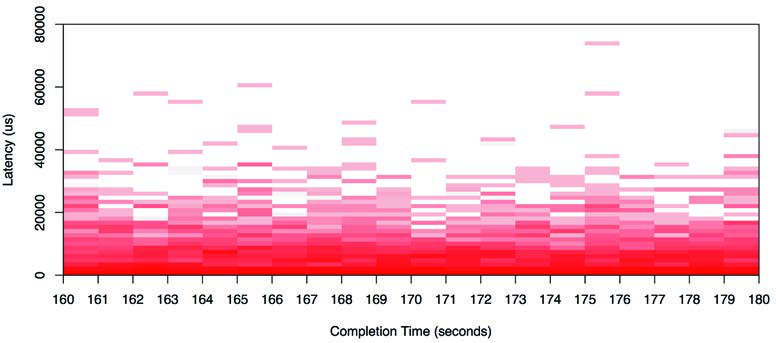
**图 2.29 散点图**

现在可以完全理解高于预期的平均延迟的来源了：有许多延迟为 10 ms、20 ms，甚至超过 50 ms 的磁盘 I/O。散点图显示了所有数据，揭示了这些离群值的存在。

许多 I/O 是亚毫秒级的，显示在靠近 x 轴的地方。这是散点图分辨率开始成为问题的地方，因为点会重叠并变得难以区分。随着数据的增多，情况会变得更糟：想象一下在同一个散点图上绘制来自整个云、涉及数百万个数据点的事件：点可能会融合并变成一堵“油漆墙”。

另一个问题是必须收集和处理的数据量：每个 I/O 的 x 和 y 坐标。

### 2.10.3 热力图 (Heat Maps)

热力图（更准确地说是列量化，Column quantization）可以通过将 x 和 y 范围量化为称为“桶”（Buckets）的组，来解决散点图的可伸缩性问题。这些桶显示为大的像素，根据该 x 和 y 范围内事件的数量进行着色。这种量化也解决了散点图的视觉密度限制，允许热力图以相同的方式显示来自单个系统或数千个系统的数据。热力图以前曾用于位置，如磁盘偏移量（例如 TazTool [McDougall 06a]）；我发明了它们在计算中用于延迟、利用率和其他指标的用途。延迟热力图最初包含在 2008 年发布的 Sun Microsystems ZFS 存储设备的 Analytics 中 [Gregg 10a][Gregg 10b]，现在在 Grafana 等性能监控产品中已司空见惯 [Grafana 20]。

早先绘制的同一数据集在图 2.30 中以热力图形式显示。


**图 2.30 热力图**

高延迟离群值可以被识别为热力图中位置较高的块，通常颜色较浅，因为它们跨越的 I/O 很少（通常是单个 I/O）。大部分数据的模式开始显现，这在散点图中可能无法看到。

该磁盘 I/O 追踪的完整秒数范围（之前未显示）显示在图 2.31 的热力图中。

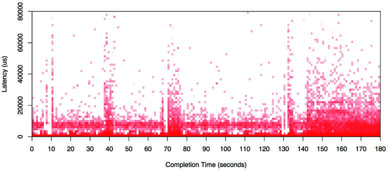
**图 2.31 热力图：全范围**

尽管跨度是之前范围的九倍，但可视化效果仍然非常易读。在大部分范围内可以看到双峰分布，一些 I/O 以接近零的延迟返回（可能是磁盘缓存命中），另一些延迟略低于 1 ms（可能是磁盘缓存未命中）。

本书后面还有其他热力图示例，包括第 6 章“CPU”第 6.7 节“可视化”；第 8 章“文件系统”第 8.6.18 节“可视化”；以及第 9 章“磁盘”第 9.7.3 节“延迟热力图”。我的网站也有关于延迟、利用率和亚秒偏移热力图的示例 [Gregg 15b]。

### 2.10.4 时间线图 (Timeline Charts)

时间线图将一组活动显示为时间线上的条形。它们通常用于前端性能分析（Web 浏览器），在那里它们也被称为[[瀑布图]]（Waterfall charts），显示网络请求的时间安排。图 2.32 显示了 Firefox Web 浏览器的示例。

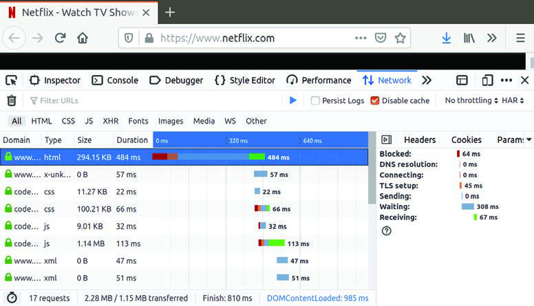
**图 2.32 Firefox 时间线图**

在图 2.32 中，第一个网络请求被高亮显示：除了将其持续时间显示为水平条外，该持续时间的组成部分也显示为彩色条。这些在右侧面板中也有解释：第一个请求最慢的组件是“等待”（Waiting），即等待来自服务器的 HTTP 响应。请求 2 到 6 在第一个请求开始接收数据后开始，并且可能依赖于这些数据。如果图表中包含显式的依赖箭头，它就变成了一种甘特图（Gantt chart）。

对于后端性能分析（服务器），类似的图表被用于显示线程或 CPU 的时间线。示例软件包括 KernelShark [KernelShark 20] 和 Trace Compass [Eclipse 20]。有关 KernelShark 的屏幕截图示例，请参见第 14 章“Ftrace”第 14.11.5 节“KernelShark”。Trace Compass 还会绘制显示依赖关系的箭头，其中一个线程唤醒了另一个线程。

### 2.10.5 曲面图 (Surface Plot)

这是三维数据的表示，呈现为三维表面。当三维数值在相邻点之间不会发生剧烈变化时，它的效果最好，能产生类似于起伏山丘的表面。曲面图通常呈现为线框模型。

图 2.33 显示了每个 CPU 利用率的线框曲面图。它包含了来自许多服务器的 60 秒每秒采样值（这是从一张跨越 300 多台物理服务器和 5,312 个 CPU 的数据中心图像中裁剪出来的） [Gregg 11b]。

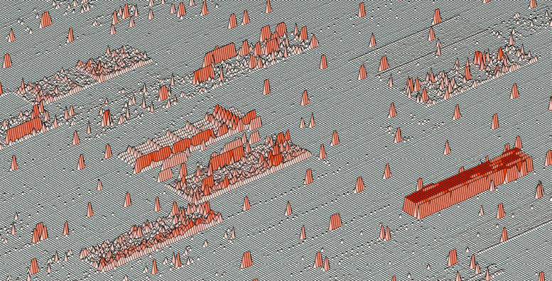
**图 2.33 线框曲面图：数据中心 CPU 利用率**

每台服务器通过在曲面上将其 16 个 CPU 绘制为行、将 60 个每秒利用率测量值绘制为列来表示，然后将表面的高度设置为利用率值。颜色也被设置为反映利用率值。如果需要，色调和饱和度都可以用来在可视化中添加第四和第五个数据维度。（如果有足够的分辨率，还可以使用某种模式来指示第六个维度。）

这些 16 × 60 的服务器矩形随后像棋盘一样映射在曲面上。即使没有标记，图像中也可以清楚地看到一些服务器矩形。右侧一个看起来像升起的高原的部分显示了其 CPU 几乎总是处于 100% 的状态。

网格线的使用突出了海拔的微妙变化。可以看到一些微弱的线条，表明单个 CPU 持续以低利用率（几个百分点）运行。

### 2.10.6 可视化工具 (Visualization Tools)

Unix 性能分析在历史上一直侧重于使用基于文本的工具，部分原因是图形支持有限。此类工具可以在登录会话中快速执行并实时报告数据。可视化一直以来访问起来更耗时，并且通常需要“追踪并报告”周期。在处理紧急性能问题时，访问指标的速度可能至关重要。

现代可视化工具提供系统性能的实时视图，可通过浏览器和移动设备访问。有许多产品可以做到这一点，包括许多可以监控整个云的产品。第 1 章“绪论”第 1.7.1 节“计数器、统计数据和指标”包含了一款此类产品 Grafana 的示例屏幕截图，其他监控产品在第 4 章“可观测性工具”第 4.2.4 节“监控”中讨论。

## 2.11 习题 (Exercises)

1. 回答以下关于关键性能术语的问题：
   - 什么是 IOPS？
   - 什么是利用率 (Utilization)？
   - 什么是饱和度 (Saturation)？
   - 什么是延迟 (Latency)？
   - 什么是微基准测试 (Micro-benchmarking)？
2. 为你的（或假设的）环境选择五种方法论。选择可以进行这些方法论的顺序，并解释选择每种方法论的原因。
3. 总结仅使用平均延迟作为唯一性能指标时存在的问题。通过包含第 99 百分位能解决这些问题吗？

## 2.12 参考文献 (References)

- [Amdahl 67] Amdahl, G., “Validity of the Single Processor Approach to Achieving Large Scale Computing Capabilities,” AFIPS, 1967.
- [Jain 91] Jain, R., The Art of Computer Systems Performance Analysis: Techniques for Experimental Design, Measurement, Simulation and Modeling, Wiley, 1991.
- [Cockcroft 95] Cockcroft, A., Sun Performance and Tuning, Prentice Hall, 1995.
- [Gunther 97] Gunther, N., The Practical Performance Analyst, McGraw-Hill, 1997.
- [Wong 97] Wong, B., Configuration and Capacity Planning for Solaris Servers, Prentice Hall, 1997.
- [Elling 00] Elling, R., “Static Performance Tuning,” Sun Blueprints, 2000.
- [Millsap 03] Millsap, C., and J. Holt., Optimizing Oracle Performance, O’Reilly, 2003.
- [McDougall 06a] McDougall, R., Mauro, J., and Gregg, B., Solaris Performance and Tools: DTrace and MDB Techniques for Solaris 10 and OpenSolaris, Prentice Hall, 2006.
- [Gunther 07] Gunther, N., Guerrilla Capacity Planning, Springer, 2007.
- [Allspaw 08] Allspaw, J., The Art of Capacity Planning, O’Reilly, 2008.
- [Gregg 10a] Gregg, B., “Visualizing System Latency,” Communications of the ACM, July 2010.
- [Gregg 10b] Gregg, B., “Visualizations for Performance Analysis (and More),” USENIX LISA, https://www.usenix.org/legacy/events/lisa10/tech/#gregg, 2010.
- [Gregg 11b] Gregg, B., “Utilization Heat Maps,” http://www.brendangregg.com/HeatMaps/utilization.html, published 2011.
- [Williams 11] Williams, C., “The $300m Cable That Will Save Traders Milliseconds,” The Telegraph, https://www.telegraph.co.uk/technology/news/8753784/The-300m-cable-that-will-save-traders-milliseconds.html, 2011.
- [Gregg 13b] Gregg, B., “Thinking Methodically about Performance,” Communications of the ACM, February 2013.
- [Gregg 14a] Gregg, B., “Performance Scalability Models,” https://github.com/brendangregg/PerfModels, 2014.
- [Harrington 14] Harrington, B., and Rapoport, R., “Introducing Atlas: Netflix’s Primary Telemetry Platform,” Netflix Technology Blog, https://medium.com/netflix-techblog/introducing-atlas-netflixs-primary-telemetry-platform-bd31f4d8ed9a, 2014.
- [Gregg 15b] Gregg, B., “Heatmaps,” http://www.brendangregg.com/heatmaps.html, 2015.
- [Wilkie 18] Wilkie, T., “The RED Method: Patterns for Instrumentation & Monitoring,” Grafana Labs, https://www.slideshare.net/grafana/the-red-method-how-to-monitoring-your-microservices, 2018.
- [Eclipse 20] Eclipse Foundation, “Trace Compass,” https://www.eclipse.org/tracecompass, accessed 2020.
- [Wikipedia 20] Wikipedia, “Five Whys,” https://en.wikipedia.org/wiki/Five_whys, accessed 2020.
- [Grafana 20] Grafana Labs, “Heatmap,” https://grafana.com/docs/grafana/latest/features/panels/heatmap, accessed 2020.
- [KernelShark 20] “KernelShark,” https://www.kernelshark.org, accessed 2020.
- [Kubernetes 20a] Kubernetes, “Horizontal Pod Autoscaler,” https://kubernetes.io/docs/tasks/run-application/horizontal-pod-autoscale, accessed 2020.
- [R Project 20] R Project, “The R Project for Statistical Computing,” https://www.r-project.org, accessed 2020.

