# 第 3 章 操作系统

对操作系统及其内核的理解对于系统性能分析至关重要。你经常需要针对系统行为提出假设并进行测试，例如系统调用是如何执行的、内核如何在 CPU 上调度线程、有限的内存如何影响性能，或者文件系统如何处理 I/O。这些活动都需要你运用关于操作系统和内核的知识。

本章的学习目标包括：

- 学习内核术语：上下文切换、交换、分页、抢占等。
- 理解内核和系统调用的角色。
- 掌握内核内部机制的基础知识，包括：中断、调度器、虚拟内存和 I/O 栈。
- 了解从 Unix 到 Linux 增加了哪些内核性能特性。
- 对扩展 BPF 有基本的了解。

本章提供了操作系统和内核的概览，是本书其余部分的预备知识。如果你错过了操作系统课程，可以把这看作是一个速成班。留意你知识中的任何漏洞，因为最后会有一次考试（开个玩笑；只是个小测验）。有关内核内部机制的更多信息，请参阅本章末尾的参考文献。

本章包含三个部分：

- **术语 (Terminology)**：列出基本术语。
- **背景 (Background)**：总结关键的操作系统和内核概念。
- **内核 (Kernels)**：总结 Linux 及其他内核的实现细节。

与性能相关的领域，包括 CPU 调度、内存、磁盘、文件系统、网络以及许多具体的性能工具，将在后续章节中更详细地介绍。

## 3.1 术语 (Terminology)

供参考，以下是本书中使用的核心操作系统术语。其中许多也是在这一章及后续章节中会详细解释的概念。

- **操作系统 (Operating system)**：指安装在系统上的软件和文件，使系统能够引导并执行程序。它包括内核、管理工具和系统库。
- **内核 (Kernel)**：内核是管理系统的程序，包括（取决于内核模型）硬件设备、内存和 CPU 调度。它运行在允许直接访问硬件的特权 CPU 模式下，称为[[内核态]]（Kernel mode）。
- **进程 (Process)**：执行程序的 OS 抽象和环境。程序运行在[[用户态]]（User mode），通过系统调用或陷阱（Traps）进入内核态访问内核（例如，为了执行设备 I/O）。
- **线程 (Thread)**：可以被调度在 CPU 上运行的可执行上下文。内核有多个线程，一个进程包含一个或多个线程。
- **任务 (Task)**：Linux 的可运行实体，可以指进程（具有单个线程）、多线程进程中的线程或内核线程。
- **BPF 程序 (BPF program)**：运行在 BPF[^1] 执行环境中的内核态程序。
- **主存 (Main memory)**：系统的物理内存（例如 RAM）。
- **虚拟内存 (Virtual memory)**：主存的一种抽象，支持多任务和超额订购（Over-subscription）。实际上，它是一种无限的资源。
- **内核空间 (Kernel space)**：内核的虚拟内存地址空间。
- **用户空间 (User space)**：进程的虚拟内存地址空间。
- **用户地 (User land)**：用户级程序和库（`/usr/bin`, `/usr/lib` ...）。
- **上下文切换 (Context switch)**：从运行一个线程或进程切换到另一个。这是内核 CPU 调度器的正常功能，涉及将运行中的 CPU 寄存器集（线程上下文）切换到新的一组。
- **模式切换 (Mode switch)**：在内核态和用户态之间的切换。
- **系统调用 (System call / syscall)**：用户程序请求内核执行特权操作（包括设备 I/O）的一种定义良好的协议。
- **处理器 (Processor)**：不要与进程混淆，处理器是包含一个或多个 CPU 的物理芯片。
- **陷阱 (Trap)**：发送给内核以请求系统例程（特权操作）的信号。陷阱类型包括系统调用、处理器异常和中断。
- **硬件中断 (Hardware interrupt)**：物理设备发送给内核的信号，通常是为了请求 I/O 服务。中断是陷阱的一种。

[^1]: BPF 最初代表 Berkeley Packet Filter（伯克利数据包过滤器），但今天的技术与伯克利、数据包或过滤几乎没有关系，以至于 BPF 本身已经成为一个名称，而不是缩写。

词汇表（Glossary）包含了更多术语供参考，如果本章需要，包括地址空间（Address space）、缓冲区（Buffer）、CPU、文件描述符（File descriptor）、POSIX 和寄存器（Registers）。

## 3.2 背景 (Background)

以下章节描述了通用的操作系统和内核概念，将帮助你理解任何操作系统。为了帮助你理解，本节包含了一些 Linux 实现细节。接下来的 3.3 节“内核”和 3.4 节“Linux”侧重于 Unix、BSD 和 Linux 内核实现的细节。

### 3.2.1 内核 (Kernel)

内核是操作系统的核心软件。它的功能取决于内核模型：类 Unix 操作系统（包括 Linux 和 BSD）具有[[宏内核]]（Monolithic kernel），负责管理 CPU 调度、内存、文件系统、网络协议和系统设备（磁盘、网络接口等）。这种内核模型如图 3.1 所示。

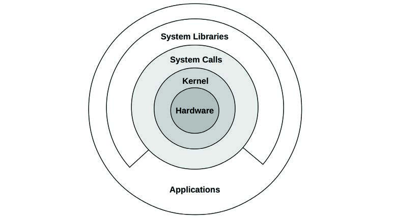
**图 3.1 宏内核操作系统的角色**

图中还显示了系统库，它们通常用于提供比单独的系统调用更丰富、更简单的编程接口。应用程序包括所有运行的用户级软件，包括数据库、Web 服务器、管理工具和操作系统 Shell。

系统库在这里被画成一个断开的环，以表明应用程序可以直接调用系统调用（Syscalls）。[^2] 例如，Golang 运行时拥有自己的系统调用层，不需要系统库 `libc`。传统上，此图被画成完整的环，反映了从中心内核开始不断降低的特权级别（这种模型起源于 Multics [Graham 68]，即 Unix 的前身）。

[^2]: 这种模型也有一些例外。内核旁路（Kernel bypass）技术有时用于网络，允许用户级直接访问硬件（见第 10 章“网络”第 10.4.3 节“软件”标题“内核旁路”）。对硬件的 I/O 也可能在不产生系统调用接口开销的情况下提交（尽管初始化需要系统调用），例如，通过内存映射 I/O、主缺页（见第 7 章“内存”第 7.2.3 节“请求分页”）、`sendfile(2)` 和 Linux `io_uring`（见第 5 章“应用程序”第 5.2.6 节“非阻塞 I/O”）。

还存在其他内核模型：[[微内核]]（Microkernels）采用一个小型内核，其功能被移至用户态程序中；而[[单内核]]（Unikernels）将内核和应用程序代码编译在一起作为一个单一程序。此外还有混合内核（Hybrid kernels），如 Windows NT 内核，它同时采用了宏内核和微内核的方法。这些在 3.5 节“其他主题”中进行了总结。

Linux 最近通过引入一种新的软件类型改变了其模型：[[扩展 BPF]]（Extended BPF），它实现了安全的内核态应用程序，并拥有自己的内核 API：BPF 助手（Helpers）。这允许一些应用程序和系统功能用 BPF 重写，提供更高水平的安全性和性能。如图 3.2 所示。

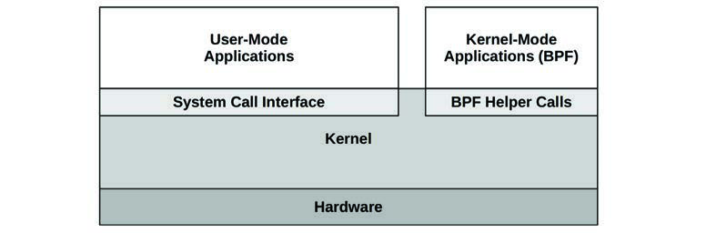
**图 3.2 BPF 应用程序**

扩展 BPF 在 3.4.4 节“扩展 BPF”中总结。

内核是一个庞大的程序，通常有数百万行代码。它主要按需执行，当用户级程序执行系统调用或设备发送中断时执行。一些内核线程异步运行以进行内务管理，这可能包括内核时钟例程和内存管理任务，但这些线程尽量保持轻量级，消耗极少的 CPU 资源。

工作负载执行频繁的 I/O（如 Web 服务器）主要在内核上下文中执行。计算密集型的工作负载通常运行在用户态，不受内核干扰。人们可能倾向于认为内核不会影响这些计算密集型工作负载的性能，但在许多情况下确实会。最明显的是 CPU 争用，当其他线程竞争 CPU 资源时，内核调度器需要决定谁运行，谁等待。内核还选择线程在哪个 CPU 上运行，并且可以为进程选择具有更“温”的硬件缓存或更好的内存局部性的 CPU，从而显著提高性能。

### 3.2.2 内核态和用户态 (Kernel and User Modes)

内核运行在一种称为[[内核态]]（Kernel mode）的特殊 CPU 模式下，允许完全访问设备并执行特权指令。内核仲裁设备访问以支持多任务，防止进程和用户在未明确允许的情况下相互访问数据。

用户程序（进程）运行在[[用户态]]（User mode），它们通过系统调用向内核请求特权操作，例如 I/O。

内核态和用户态是在处理器上使用[[特权环]]（Privilege rings，或保护环）实现的，遵循图 3.1 中的模型。例如，x86 处理器支持四个特权环，编号从 0 到 3。通常只使用两个或三个：分别用于用户态、内核态，以及（如果存在）虚拟机管理程序（Hypervisor）。用于访问设备的特权指令仅允许在内核态执行；在用户态执行它们会引发异常，然后由内核处理（例如，生成权限被拒绝错误）。

在传统内核中，系统调用是通过切换到内核态然后执行系统调用代码来执行的。如图 3.3 所示。

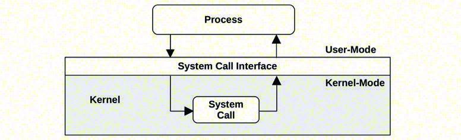
**图 3.3 系统调用执行模式**

在用户态和内核态之间的切换是[[模式切换]]（Mode switch）。

所有系统调用都会发生模式切换。一些系统调用还会发生[[上下文切换]]（Context switch）：那些阻塞的系统调用，例如磁盘和网络 I/O，会发生上下文切换，以便在第一个线程阻塞时让另一个线程运行。

由于模式切换和上下文切换会产生少量的开销（CPU 周期），[^3] 有各种优化措施来避免它们，包括：

- **用户态系统调用**：可以在纯用户态库中实现某些系统调用。Linux 内核通过导出映射到进程地址空间的虚拟动态共享对象（vDSO）来做到这一点，其中包含 `gettimeofday(2)` 和 `getcpu(2)` 等系统调用 [Drysdale 14]。
- **内存映射**：用于请求分页（见第 7 章“内存”第 7.2.3 节“请求分页”），也可用于数据存储和其他 I/O，从而避免系统调用开销。
- **内核旁路 (Kernel bypass)**：这允许用户态程序直接访问设备，绕过系统调用和典型的内核代码路径。例如用于网络的 DPDK：数据平面开发工具包（Data Plane Development Kit）。
- **内核态应用程序**：包括实现在内核中的 TUX Web 服务器 [Lever 00]，以及最近如图 3.2 所示的扩展 BPF 技术。

内核态和用户态拥有各自的软件执行上下文，包括堆栈和寄存器。某些处理器架构（如 SPARC）为内核使用独立的地址空间，这意味着模式切换还必须更改虚拟内存上下文。

[^3]: 随着针对 Meltdown 漏洞的当前缓解措施的实施，上下文切换现在变得更加昂贵。见 3.4.3 节“KPTI (Meltdown)”。

### 3.2.3 系统调用 (System Calls)

系统调用请求内核执行特权系统例程。虽然有数百个系统调用可用，但内核维护者努力使这个数字尽可能小，以保持内核简单（Unix 哲学；[Thompson 78]）。更复杂的接口可以在用户地作为系统库构建在它们之上，在那里它们更容易开发和维护。操作系统通常包含一个 C 标准库，为许多常见的系统调用提供更易于使用的接口（例如 `libc` 或 `glibc` 库）。

需要记住的关键系统调用列在表 3.1 中。

**表 3.1 关键系统调用**

| 系统调用 | 描述 |
| :--- | :--- |
| `read(2)` | 读取字节 |
| `write(2)` | 写入字节 |
| `open(2)` | 打开文件 |
| `close(2)` | 关闭文件 |
| `fork(2)` | 创建新进程 |
| `clone(2)` | 创建新进程或线程 |
| `exec(2)` | 执行新程序 |
| `connect(2)` | 连接到网络主机 |
| `accept(2)` | 接受网络连接 |
| `stat(2)` | 获取文件统计信息 |
| `ioctl(2)` | 设置 I/O 属性或其他杂项功能 |
| `mmap(2)` | 将文件映射到内存地址空间 |
| `brk(2)` | 扩展堆指针 |
| `futex(2)` | 快速用户空间互斥锁 |

系统调用有详尽的文档，每个系统调用都有一个通常随操作系统一起发布的帮助页（man page）。它们通常具有简单且一致的接口，并在需要时使用错误代码来描述错误（例如，`ENOENT` 表示“无此文件或目录”）。[^4]

许多系统调用的目的很明显。以下是一些常见用法可能不太明显的系统调用：

- **`ioctl(2)`**：通常用于向内核请求杂项操作，特别是对于系统管理工具，当另一个（更明显的）系统调用不合适时。请参阅后面的示例。
- **`mmap(2)`**：通常用于将可执行文件和库映射到进程地址空间，以及用于内存映射文件。有时它被用来分配进程的工作内存，而不是基于 `brk(2)` 的 `malloc(2)`，以降低系统调用率并提高性能（由于涉及权衡：内存映射管理，这并不总是有效）。
- **`brk(2)`**：用于扩展堆指针，该指针定义了进程工作内存的大小。当系统内存分配库（如 `malloc(3)` 调用）无法从堆中的现有空间满足需求时，通常会执行此操作。见第 7 章“内存”。
- **`futex(2)`**：此系统调用用于处理用户空间锁的一部分：即可能阻塞的部分。

如果某个系统调用不熟悉，你可以在其帮助页中了解更多信息（这些位于帮助页的第 2 部分：syscalls）。

`ioctl(2)` 系统调用可能由于其模糊的性质而最难学习。举个例子，Linux `perf(1)` 工具（在第 6 章“CPU”中介绍）执行特权操作以协调性能检测。开发人员没有为每个操作增加系统调用，而是增加了一个系统调用：`perf_event_open(2)`，它返回一个文件描述符供 `ioctl(2)` 使用。然后可以使用不同的参数调用此 `ioctl(2)` 以执行不同的所需操作。例如，`ioctl(fd, PERF_EVENT_IOC_ENABLE)` 启用检测。在这个例子中，参数 `PERF_EVENT_IOC_ENABLE` 可以更容易地被开发人员添加和更改。

[^4]: `glibc` 将这些错误提供在一个 `errno`（错误编号）整型变量中。

### 3.2.4 中断 (Interrupts)

中断是发给处理器的一个信号，表明发生了某些需要处理的事件，并中断处理器的当前执行来处理该事件。它通常会导致处理器进入内核态（如果尚未进入），保存当前线程状态，然后运行一个[[中断服务例程]]（ISR）来处理该事件。

存在由外部硬件产生的异步中断，以及由软件指令产生的同步中断。如图 3.4 所示。

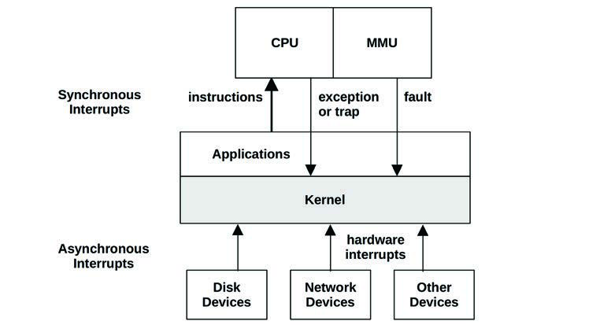
**图 3.4 中断类型**

为了简单起见，图 3.4 显示了发送给内核处理的所有中断；这些中断首先被发送到 CPU，由 CPU 选择内核中的 ISR 来运行该事件。

#### 异步中断 (Asynchronous Interrupts)
硬件设备可以向处理器发送[[中断服务请求]]（IRQ），这些请求对于当前运行的软件来说是异步到达的。硬件中断的例子包括：

- 磁盘设备发出磁盘 I/O 完成的信号
- 硬件指示故障情况
- 网络接口发出数据包到达的信号
- 输入设备：键盘和鼠标输入

为了解释异步中断的概念，图 3.5 展示了一个示例场景，显示了运行在 CPU 0 上的数据库 (MySQL) 从文件系统读取数据随时间变化的过程。由于文件系统内容必须从磁盘获取，调度器在数据库等待期间将上下文切换到另一个线程（一个 Java 应用程序）。稍后，磁盘 I/O 完成，但此时数据库已不再运行在 CPU 0 上。完成中断是相对于数据库异步发生的，在图 3.5 中用虚线表示。

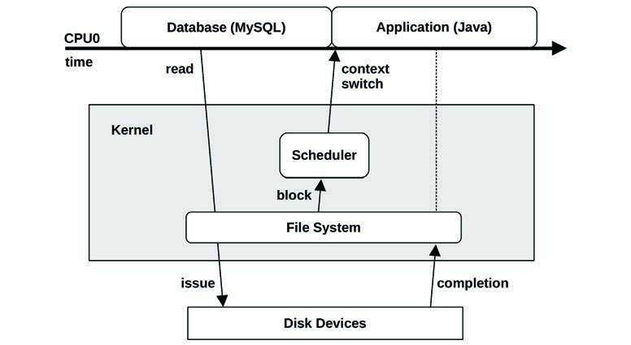
**图 3.5 异步中断示例**

#### 同步中断 (Synchronous Interrupts)
同步中断由软件指令产生。以下使用陷阱（Traps）、异常（Exceptions）和故障（Faults）等术语来描述不同类型的软件中断；然而，这些术语经常被互换使用。

- **陷阱 (Traps)**：对内核的有意识调用，例如通过 `int`（中断）指令。系统调用的一种实现涉及调用带有系统调用处理程序向量的 `int` 指令（例如 Linux x86 上的 `int 0x80`）。`int` 会引发软件中断。
- **异常 (Exceptions)**：一种异常情况，例如执行除以零的指令。
- **故障 (Faults)**：通常用于内存事件的术语，例如通过访问没有 MMU 映射的内存位置触发的[[缺页故障]]（Page faults）。见第 7 章“内存”。

对于这些中断，负责的软件和指令仍然在 CPU 上。

#### 中断线程 (Interrupt Threads)
中断服务例程（ISR）被设计成尽可能快地运行，以减少中断活动线程的影响。如果中断需要执行较多工作，特别是如果它可能在锁上阻塞，则可以由内核调度的[[中断线程]]来处理。如图 3.6 所示。

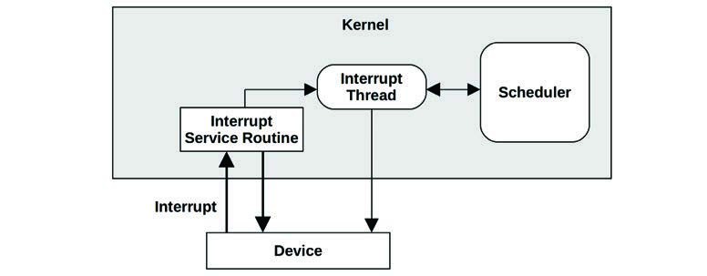
**图 3.6 中断处理**

具体的实现取决于内核版本。在 Linux 上，设备驱动程序可以被建模为两半：[[上半部]]（Top half）快速处理中断，并调度[[下半部]]（Bottom half）工作待稍后处理 [Corbet 05]。快速处理中断非常重要，因为上半部运行在禁中断模式下，以推迟新中断的递送，如果运行时间过长，可能会给其他线程带来延迟问题。下半部可以是任务（Tasklets）或工作队列（Work queues）；后者是可被内核调度且可以在必要时睡眠的线程。

例如，Linux 网络驱动程序有一个上半部来处理入站数据包的 IRQ，它调用下半部将数据包推向网络栈。下半部被实现为[[软中断]]（softirq）。

从中断到达扫处理中断的时间是[[中断延迟]]（Interrupt latency），这取决于硬件和实现。这是实时或低延迟系统研究的主题。

#### 中断屏蔽 (Interrupt Masking)
内核中的某些代码路径不能被安全地中断。一个例子是内核代码在系统调用期间获取了一个自旋锁（Spin lock），而这个自旋锁可能也被中断所需要。在持锁期间接收中断可能会导致死锁。为了防止这种情况，内核可以通过设置 CPU 的中断屏蔽寄存器来临时屏蔽中断。禁中断的时间应尽可能短，因为它会干扰由其他中断唤醒的应用程序的及时执行。这是[[实时系统]]（Real-time systems，即具有严格响应时间要求的系统）的一个重要因素。禁中断时间也是性能分析的目标（Ftrace `irqsoff` 追踪器直接支持此类分析，见第 14 章“Ftrace”）。

一些高优先级事件不应被忽略，因此被实现为[[不可屏蔽中断]]（NMI）。例如，Linux 可以使用智能平台管理接口（IPMI）看门狗定时器，根据一段时间内是否缺乏中断来检查内核是否似乎已锁定。如果是这样，看门狗可以发出 NMI 中断来重启系统。[^5]

[^5]: Linux 还有一个用于检测锁定的软件 NMI 看门狗 [Linux 20d]。

### 3.2.5 时钟和空闲 (Clock and Idle)

原始 Unix 内核的一个核心组件是从定时器中断执行的 `clock()` 例程。历史上，它每秒执行 60、100 或 1,000 次[^6]（通常以赫兹表示：每秒周期数），每次执行被称为一个[[滴答]]（Tick）。[^7] 它的功能包括更新系统时间、处理到期的定时器和用于线程调度的片、维护 CPU 统计数据以及执行调度的内核例程。

时钟曾存在性能问题，在后来的内核中得到了改进，包括：

- **滴答延迟 (Tick latency)**：对于 100 赫兹的时钟，定时器在等待下一个滴答处理时可能会遇到高达 10 毫秒的额外延迟。这已使用高分辨率实时中断解决，使得执行能够立即发生。
- **滴答开销 (Tick overhead)**：滴答会消耗 CPU 周期并轻微干扰应用程序，这也是所谓的操作系统[[抖动]]（Jitter）的一个原因。现代处理器还具有动态电源特性，可以在空闲期间关闭部分电源。时钟例程会中断这种空闲时间，从而造成不必要的功耗。

现代内核已将许多功能从时钟例程移至按需中断，力求创建[[无滴答内核]]（Tickless kernel）。这通过允许处理器长时间保持在睡眠状态，减少了开销并提高了电源效率。

Linux 的时钟例程是 `scheduler_tick()`，Linux 可以在没有 CPU 负载时省略时钟调用。时钟本身通常运行在 250 赫兹（通过 `CONFIG_HZ` 内核配置选项及其变体配置），通过 `NO_HZ` 功能（通过 `CONFIG_NO_HZ` 及其变体配置）减少时钟调用，该功能现在通常是启用的 [Linux 20a]。

#### 空闲线程 (Idle Thread)
当 CPU 没有工作可执行时，内核会调度一个等待工作的占位线程，称为[[空闲线程]]（Idle thread）。一个简单的实现是在循环中检查新工作的可用性。在现代 Linux 中，空闲任务可以调用 `hlt`（停止）指令来关闭 CPU 电源，直到收到下一个中断，从而节省能源。

[^6]: 其他频率包括 Linux 2.6.13 的 250、Ultrix 的 256 和 OSF/1 的 1,024 [Mills 94]。
[^7]: Linux 还会跟踪 jiffies，这是一种类似于滴答的时间单位。

### 3.2.6 进程 (Processes)

进程是执行用户级程序的环境。它由内存地址空间、文件描述符、线程堆栈和寄存器组成。在某种程度上，进程就像一台虚拟的早期计算机，只有一个程序在使用自己的寄存器和堆栈执行。

内核对进程进行多任务处理，通常支持在单个系统上执行数千个进程。它们通过进程 ID (PID) 进行单独标识，这是一个唯一的数字标识符。

一个进程包含一个或多个线程，这些线程在进程地址空间内运行并共享相同的文件描述符。线程是一个可执行上下文，由堆栈、寄存器和指令指针（也称为程序计数器）组成。多线程允许单个进程在多个 CPU 上并行执行。在 Linux 上，线程和进程都是[[任务]]（Tasks）。

内核启动的第一个进程称为 “init”，默认源自 `/sbin/init`，PID 为 1，它启动用户空间服务。在 Unix 中，这涉及从 `/etc` 运行启动脚本，这种方法现在被称为 SysV（源自 Unix System V）。Linux 发行版现在通常使用 `systemd` 软件来启动服务并跟踪它们的依赖关系。

#### 进程创建 (Process Creation)
在 Unix 系统上，进程通常使用 `fork(2)` 系统调用创建。在 Linux 上，C 库通常通过封装多功能的 `clone(2)` 系统调用来实现 `fork` 函数。这些系统调用会创建进程的副本，并拥有自己的进程 ID。然后可以调用 `exec(2)` 系统调用（或其变体，如 `execve(2)`）来开始执行一个不同的程序。

图 3.7 显示了执行 `ls` 命令的 bash shell (bash) 的示例进程创建过程。

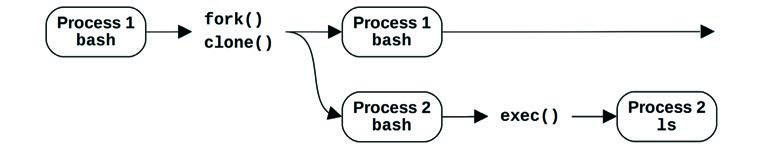
**图 3.7 进程创建**

`fork(2)` 或 `clone(2)` 系统调用可能会使用[[写时复制]]（Copy-on-write, COW）策略来提高性能。这会添加对先前地址空间的引用，而不是复制所有内容。一旦任一进程修改了多重引用的内存，就会为修改的部分创建一个单独的副本。这种策略推迟或消除了复制内存的需要，减少了内存和 CPU 的使用。

#### 进程生命周期 (Process Life Cycle)
进程的生命周期如图 3.8 所示。这是一个简化图；对于现代多线程操作系统，被调度和运行的是线程，并且关于这些线程如何映射到进程状态还有一些额外的实现细节（参见第 5 章中的图 5.6 和 5.7 以获取更详细的图表）。

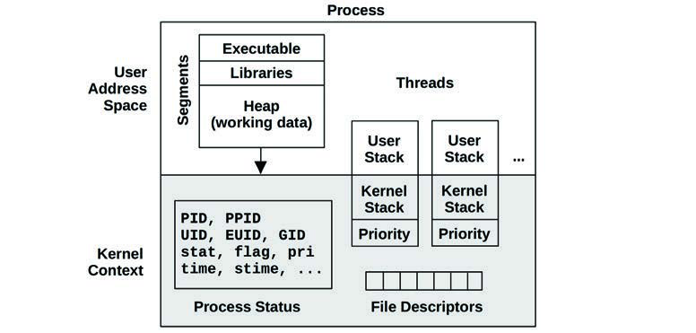
**图 3.8 进程生命周期**

`on-proc` 状态是在处理器（CPU）上运行。`ready-to-run` 状态是进程可运行，但在 CPU 运行队列中等待轮到自己上 CPU。大多数 I/O 会阻塞，使进程进入 `sleep` 状态，直到 I/O 完成且进程被唤醒。`zombie`（僵尸）状态发生在进程终止期间，此时进程等待其状态被父进程回收（reaped）或被内核移除。

#### 进程环境 (Process Environment)
进程环境如图 3.9 所示；它由进程地址空间中的数据和内核中的元数据（上下文）组成。

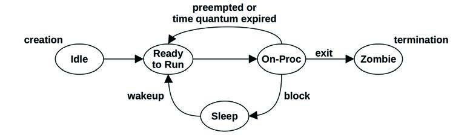
**图 3.9 进程环境**

内核上下文由各种进程属性和统计数据组成：其进程 ID (PID)、所有者的用户 ID (UID) 以及各种时间。这些通常通过 `ps(1)` 和 `top(1)` 命令检查。它还拥有一组文件描述符，这些描述符指向打开的文件，并且（通常）在线程之间共享。

本例描绘了两个线程，每个线程都包含一些元数据，包括内核上下文中的优先级[^8]和用户地址空间中的用户堆栈。图表未按比例绘制；内核上下文与进程地址空间相比非常小。

用户地址空间包含进程的内存段：可执行文件、库和堆。有关更多细节，见第 7 章“内存”。

在 Linux 上，每个线程都有自己的用户堆栈和内核异常堆栈[^9] [Owens 20]。

[^8]: 内核上下文可能是它自己完整的地址空间（如 SPARC 处理器），或者是与用户地址不重叠的受限范围（如 x86 处理器）。
[^9]: 每个 CPU 还有特殊用途的内核堆栈，包括用于中断的堆栈。

### 3.2.7 堆栈 (Stacks)

[[堆栈]]（Stack）是用于临时数据的内存存储区域，组织为后进先出（LIFO）列表。它用于存储比 CPU 寄存器组能容纳的数据更不重要的数据。当调用一个函数时，返回地址被保存到堆栈中。如果某些寄存器的值在调用后还需要，也可以将它们保存到堆栈中。[^10] 当被调用的函数执行完毕时，它会恢复任何需要的寄存器，并通过从堆栈中获取返回地址，将执行权交给调用函数。堆栈还可以用于向函数传递参数。堆栈上与函数执行相关的一组数据称为[[栈帧]]（Stack frame）。

通过检查线程堆栈中所有栈帧中保存的返回地址，可以看到当前正在执行的函数的调用路径（这个过程称为[[栈回溯]]，Stack walking）。[^11] 这个调用路径被称为[[堆栈回溯]]（Stack back trace）或[[堆栈追踪]]（Stack trace）。在性能工程中，它通常简称为“堆栈”。这些堆栈可以回答为什么某些东西正在执行，是调试和性能分析的无价工具。

#### 如何阅读堆栈 (How to Read a Stack)
以下示例内核堆栈（来自 Linux）显示了 TCP 传输所采用的路径，由追踪工具打印：

```text
tcp_sendmsg+1
sock_sendmsg+62
SYSC_sendto+319
sys_sendto+14
do_syscall_64+115
entry_SYSCALL_64_after_hwframe+61
```

堆栈通常按“叶到根”（leaf-to-root）的顺序打印，因此打印的第一行是当前正在执行的函数，其下方是其父函数，然后是祖父函数，依此类推。在这个例子中，正在执行的是 `tcp_sendmsg()` 函数，由 `sock_sendmsg()` 调用。在这个堆栈示例中，函数名右侧是指令偏移量，显示了在函数内部的位置。第一行显示 `tcp_sendmsg()` 偏移量 1（这将是第二条指令），由 `sock_sendmsg()` 偏移量 62 调用。只有当你渴望对所采取的代码路径有指令级的深入理解时，这个偏移量才有用。

通过向下阅读堆栈，可以看到完整的祖先关系：函数、父函数、祖父函数等等。或者，通过自底向上阅读，你可以跟随执行路径到达当前函数：我们是如何到达这里的。

由于堆栈暴露了通过源代码采取的内部路径，因此除了代码本身之外，通常没有这些函数的文档。对于这个示例堆栈，文档就是 Linux 内核源代码。一个例外是函数属于 API 的一部分并有文档记录。

[^10]: 处理器 ABI 的调用约定规定了哪些寄存器在函数调用后应保留其值（它们是非易失性的），并由被调用函数保存到堆栈中（“被调用者保存”，callee-saves）。其他寄存器是易失性的，可能会被被调用函数破坏；如果调用者希望保留它们的值，则必须将其保存到堆栈中（“调用者保存”，caller-saves）。
[^11]: 有关栈回溯和不同可能技术（包括：基于帧指针、debuginfo、最后分支记录和 ORC）的更多细节，见《BPF 性能工具》第 2 章“技术”第 2.4 节“栈回溯” [Gregg 19]。

#### 用户栈和内核栈 (User and Kernel Stacks)
在执行系统调用时，进程线程有两个堆栈：用户级堆栈和内核级堆栈。它们的范围如图 3.10 所示。

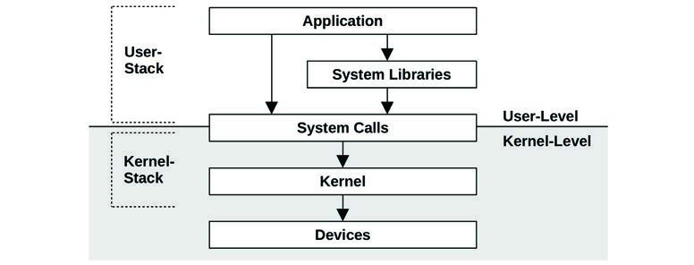
**图 3.10 用户栈和内核栈**

在系统调用期间，被阻塞线程的用户级堆栈不会改变，因为线程在内核上下文中执行时使用的是单独的内核级堆栈。（信号处理程序可能是一个例外，根据配置，它们可能会借用用户级堆栈。）

在 Linux 上，有多个用于不同目的的内核堆栈。系统调用使用与每个线程关联的内核异常堆栈，还有与软中断和硬中断 (IRQ) 关联的堆栈 [Bovet 05]。

### 3.2.8 虚拟内存 (Virtual Memory)

[[虚拟内存]]（Virtual memory）是主存的一种抽象，为进程和内核提供它们自己的、几乎是无限的[^12]私有主存视图。它支持多任务处理，允许进程和内核在各自的私有地址空间上运行而无需担心冲突。它还支持主存的超额订购（Over-subscription），允许操作系统根据需要在主存和辅助存储（磁盘）之间透明地映射虚拟内存。

虚拟内存的作用如图 3.11 所示。一级存储（Primary memory）是主存 (RAM)，二级存储（Secondary memory）是存储设备 (磁盘)。

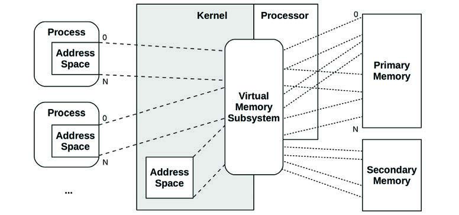
**图 3.11 虚拟内存地址空间**[^13]

虚拟内存由处理器和操作系统的共同支持实现。它不是真实内存，大多数操作系统仅在按需（首次填充/写入）时才将虚拟内存映射到真实内存。

有关虚拟内存的更多信息，见第 7 章“内存”。

#### 内存管理 (Memory Management)
虽然虚拟内存允许使用辅助存储来扩展主存，但内核力求将最活跃的数据保留在主存中。内核有两种方案来实现这一点：

- **进程交换 (Process swapping)**：在主存和辅助存储之间移动整个进程。
- **分页 (Paging)**：移动称为“页”（Pages）的小内存单位（例如 4 Kbytes）。

进程交换是原始的 Unix 方法，会导致严重的性能损失。分页效率更高，随着分页虚拟内存的引入被加入到 BSD 中。在这两种情况下，最近最少使用（或最近未使用）的内存被移至辅助存储，只有在再次需要时才移回主存。

在 Linux 中，术语[[交换]]（Swapping）被用来指代分页。Linux 内核不支持（旧式的）整个线程和进程的 Unix 式进程交换。

有关分页和交换的更多信息，见第 7 章“内存”。

[^12]: 无论如何，在 64 位处理器上是这样的。对于 32 位处理器，由于 32 位地址的限制，虚拟内存被限制在 4 Gbytes（内核可能将其限制在更小的量）。
[^13]: 图中进程虚拟内存显示为从 0 开始是一种简化。今天的内核通常使进程的虚拟地址空间从某个偏移量开始，例如 `0x10000` 或一个随机地址。这样做的一个好处是，取消引用 NULL (0) 指针的常见编程错误将导致程序崩溃 (SIGSEGV)，因为 0 地址是无效的。这通常优于误操作地址 0 处的数据，因为那样程序会带着损坏的数据继续运行。

### 3.2.9 调度器 (Schedulers)

Unix 及其衍生产品是[[分时系统]]（Time-sharing systems），通过在进程之间划分执行时间来允许多个进程同时运行。进程在处理器和单个 CPU 上的调度由[[调度器]]（Scheduler）执行，它是操作系统内核的关键组件。

调度器的作用如图 3.12 所示，它表明调度器操作线程（在 Linux 中为任务），将它们映射到 CPU。

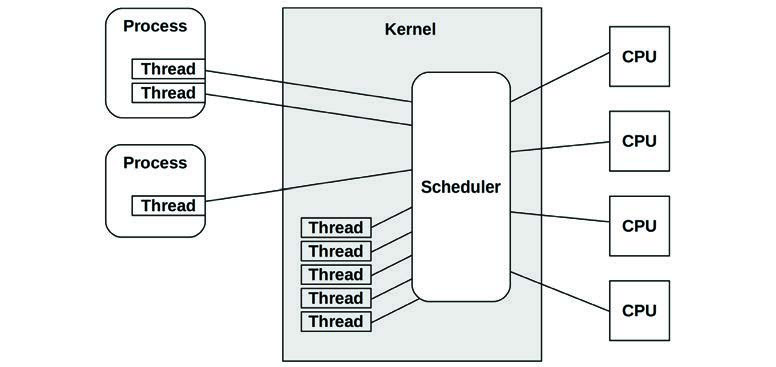
**图 3.12 内核调度器**

其基本意图是在活动进程和线程之间划分 CPU 时间，并维持优先级的概念，以便更重要的工作可以更早执行。调度器跟踪所有处于 `ready-to-run` 状态的线程，传统上是在称为[[运行队列]]（Run queues）的按优先级排列的队列中 [Bach 86]。现代内核可能会按 CPU 实现这些队列，并且除了队列之外，还可能使用其他数据结构来跟踪线程。当想要运行的线程多于可用 CPU 时，低优先级线程将等待轮到自己。大多数内核线程的运行优先级高于用户级进程。

调度器可以动态修改进程优先级，以提高某些工作负载的性能。工作负载可以分为：

- **CPU 密集型 (CPU-bound)**：执行繁重计算的应用程序，例如科学和数学分析，预计运行时间较长（秒、分钟、小时、天，甚至更久）。这些受到 CPU 资源的限制。
- **I/O 密集型 (I/O-bound)**：执行 I/O 且计算量很少的应用程序，例如 Web 服务器、文件服务器和交互式 Shell，这些应用程序需要低延迟响应。当它们的负载增加时，它们受到存储或网络资源 I/O 的限制。

一种可以追溯到 UNIX 的常用调度策略是识别 CPU 密集型工作负载并降低其优先级，从而允许 I/O 密集型工作负载（由于需要低延迟响应更理想）更早运行。这可以通过计算近期计算时间（在 CPU 上执行的时间）与实时时间（经过的时间）的比率，并降低具有高（计算）比率的进程的优先级来实现 [Thompson 78]。这种机制优先处理运行时间较短的进程，这些进程通常是执行 I/O 的进程，包括人类交互进程。

现代内核支持多种[[调度类]]（Scheduling classes）或调度策略 (Linux)，它们应用不同的算法来管理优先级和可运行线程。这些可能包括[[实时调度]]（Real-time scheduling），其优先级高于所有非关键工作（包括内核线程）。结合抢占支持（稍后描述），实时调度为需要它的系统提供可预测且低延迟的调度。

见第 6 章“CPU”了解更多关于内核调度器和其他调度算法的信息。

### 3.2.10 文件系统 (File Systems)

文件系统是将数据组织为文件和目录的组织形式。它们有一个用于访问它们的基于文件的接口，通常基于 POSIX 标准。内核支持多种文件系统类型和实例。提供文件系统是操作系统的最重要的角色之一，曾被描述为最重要的角色 [Ritchie 74]。

操作系统提供了一个全局文件命名空间，组织为以根级别（“/”）开始的自顶向下的树型拓扑。文件系统通过[[挂载]]（Mounting）加入该树，将其自身的树附加到一个目录（[[挂载点]]，Mount point）。这允许最终用户透明地导航文件命名空间，而不管底层文件系统类型如何。

典型的操作系统可能组织如图 3.13 所示。

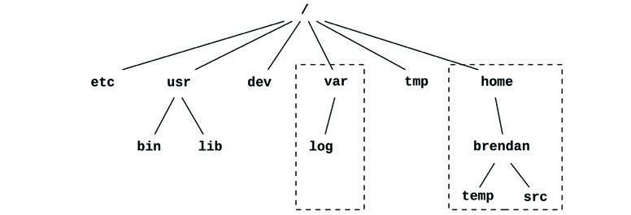
**图 3.13 操作系统文件层级**

顶级目录包括：`etc` 用于系统配置文件，`usr` 用于系统提供的用户级程序和库，`dev` 用于设备节点，`var` 用于变化的变量文件（包括系统日志），`tmp` 用于临时文件，`home` 用于用户家目录。在图中所示的例子中，`var` 和 `home` 可能驻留在它们自己的文件系统实例和独立的存储设备上；但是，它们可以像树的任何其他组件一样被访问。

大多数文件系统类型使用存储设备（磁盘）来存储其内容。某些文件系统类型由内核动态创建，例如 `/proc` 和 `/dev`。

内核通常提供不同的方式来将进程隔离到文件命名空间的一部分，包括 `chroot(8)`，以及在 Linux 上通常用于容器的[[挂载命名空间]]（Mount namespaces）（见第 11 章“云计算”）。

#### VFS
[[虚拟文件系统]]（Virtual File System, VFS）是用于抽象文件系统类型的内核接口，最初由 Sun Microsystems 开发，以便 Unix 文件系统 (UFS) 和网络文件系统 (NFS) 可以更容易地共存。其作用如图 3.14 所示。

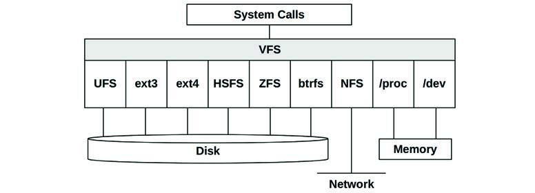
**图 3.14 虚拟文件系统**

VFS 接口使得向内核添加新的文件系统类型变得更加容易。它还支持提供前面描绘的全局文件命名空间，以便用户程序和应用程序可以透明地访问各种文件系统类型。

#### I/O 栈 (I/O Stack)
对于基于存储设备的文件系统，从用户级软件到存储设备的路径被称为[[I/O 栈]]（I/O Stack）。这是前面显示的整个软件栈的一个子集。一个通用的 I/O 栈如图 3.15 所示。

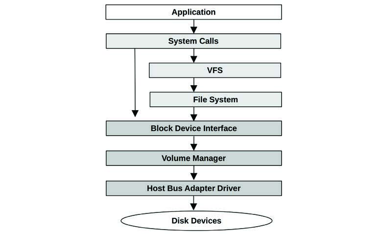
**图 3.15 通用 I/O 栈**

图 3.15 左侧显示了通往块设备的直接路径，绕过了文件系统。管理工具和数据库有时会使用这条路径。

文件系统及其性能在第 8 章“文件系统”中详细介绍，它们所构建的存储设备在第 9 章“磁盘”中介绍。

### 3.2.11 缓存 (Caching)

由于磁盘 I/O 历来具有高延迟，软件栈的许多层都试图通过缓存读取和缓冲写入来避免磁盘 I/O。缓存可能包括表 3.2 所示的那些（按检查顺序排列）。

**表 3.2 磁盘 I/O 的示例缓存层**

| 缓存层 | 缓存 | 示例 |
| :--- | :--- | :--- |
| 1 | 客户端缓存 | 浏览器缓存 |
| 2 | 应用程序缓存 | — |
| 3 | Web 服务器缓存 | Apache 缓存 |
| 4 | 缓存服务器 | memcached |
| 5 | 数据库缓存 | MySQL 缓冲区缓存 |
| 6 | 目录缓存 | dcache |
| 7 | 文件元数据缓存 | inode 缓存 |
| 8 | 操作系统缓冲区缓存 | Buffer cache |
| 9 | 文件系统一级缓存 | Page cache, ZFS ARC |
| 10 | 文件系统二级缓存 | ZFS L2ARC |
| 11 | 设备缓存 | ZFS vdev |
| 12 | 块缓存 | Buffer cache |
| 13 | 磁盘控制器缓存 | RAID 卡缓存 |
| 14 | 存储阵列缓存 | — |
| 15 | 磁盘内置缓存 | — |

例如，[[缓冲区缓存]]（Buffer cache）是主存的一个区域，存储最近使用的磁盘块。如果请求的块存在于缓存中，磁盘读取可以立即从缓存中得到响应，从而避免磁盘 I/O 的高延迟。

存在的缓存类型会根据系统和环境的不同而有所差异。

### 3.2.12 网络 (Networking)

现代内核提供了一套内置的网络协议栈，允许系统通过网络通信并参与分布式系统环境。这被称为[[网络协议栈]]或 TCP/IP 栈（以常用的 TCP 和 IP 协议命名）。用户级应用程序通过称为[[套接字]]（Sockets）的可编程端点访问网络。

连接到网络的物理设备是网络接口，通常由[[网络接口卡]]（NIC）提供。系统管理员的一项历史职责是将 IP 地址与网络接口关联，以便其能够与网络通信；这些映射现在通常通过[[动态主机配置协议]]（DHCP）自动化。

网络协议不经常更改，但有一种新的传输协议正在得到越来越多的采用：QUIC（在第 10 章“网络”中总结）。协议增强功能和选项更改得更频繁，例如较新的 TCP 选项和 TCP 拥塞控制算法。较新的协议和增强功能通常需要内核支持（用户空间协议实现除外）。另一个变化是对不同网络接口卡的支持，这需要内核提供新的设备驱动程序。

有关网络和网络性能的更多信息，见第 10 章“网络”。

### 3.2.13 设备驱动程序 (Device Drivers)

内核必须与各种物理设备通信。这种通信是使用[[设备驱动程序]]（Device drivers）实现的：用于设备管理和 I/O 的内核软件。设备驱动程序通常由开发硬件设备的供应商提供。某些内核支持可插拔设备驱动程序，可以在无需重启系统的情况下加载和卸载。

设备驱动程序可以为其设备提供字符和/或块接口。[[字符设备]]（Character devices，也称为原始设备）提供任何 I/O 大小（小至单个字符，取决于设备）的无缓冲顺序访问。此类设备包括键盘和串口（在原始 Unix 中还包括纸带和行式打印机设备）。

[[块设备]]（Block devices）以块为单位执行 I/O，历史上每块为 512 字节。这些可以根据其块偏移量（从块设备开头 0 开始）进行随机访问。在原始 Unix 中，块设备接口还提供块设备缓冲区的缓存以提高性能，该区域位于主存中，称为[[缓冲区缓存]]（Buffer cache）。在 Linux 中，此缓冲区缓存现在是页缓存（Page cache）的一部分。

### 3.2.14 多处理器 (Multiprocessor)

多处理器支持允许操作系统使用多个 CPU 实例来并行执行工作。它通常被实现为[[对称多处理]]（SMP），其中所有 CPU 都被同等对待。这在技术上很难实现，为并行运行的线程访问和共享内存及 CPU 带来了难题。在多处理器系统上，还可能有连接到不同插槽（物理处理器）的主存库，形成[[非统一内存访问]]（NUMA）架构，这也带来了性能挑战。详见第 6 章“CPU”（包括调度和线程同步）以及第 7 章“内存”（了解内存访问和架构的细节）。

#### IPIs

对于多处理器系统，有时 CPU 之间需要进行协调，例如为了内存转换条目的缓存一致性（通知其他 CPU 某个条目如果被缓存了，现在已失效）。一个 CPU 可以使用[[处理器间中断]]（IPI，也称为 SMP 调用或 CPU 跨调用）请求其他 CPU（或所有 CPU）立即执行此类工作。IPI 是设计用于快速执行的处理器中断，旨在最大限度地减少对其他线程的干扰。

IPI 也可以被抢占使用。

### 3.2.15 抢占 (Preemption)

内核抢占支持允许高优先级的用户级线程中断内核并执行。这使得实时系统能够在给定的时间约束内执行工作，包括飞机和医疗设备中使用的系统。支持抢占的内核被称为“全抢占式”内核，尽管实际上它仍会有一些无法中断的小型关键代码路径。

Linux 支持的另一种方法是“自愿内核抢占”，其中内核代码中的逻辑停止点可以进行检查并执行抢占。这避免了支持全抢占式内核的一些复杂性，并为常见工作负载提供低延迟抢占。自愿内核抢占通常在 Linux 中通过 `CONFIG_PREEMPT_VOLUNTARY` Kconfig 选项启用；此外还有 `CONFIG_PREEMPT` 允许所有内核代码（关键区域除外）可抢占，以及 `CONFIG_PREEMPT_NONE` 用于禁用抢占，以更高的延迟为代价提高吞吐量。

### 3.2.16 资源管理 (Resource Management)

操作系统可以提供各种可配置的控制，用于微调对系统资源（如 CPU、内存、磁盘和网络）的访问。这些是[[资源控制]]，可用于管理运行不同应用程序或承载多个租户（云计算）的系统性能。此类控制可以对每个进程（或进程组）的资源使用施加固定限制，或者采用更灵活的方法——允许在它们之间共享空闲资源。

Unix 和 BSD 的早期版本具有基本的每进程资源控制，包括使用 `nice(1)` 的 CPU 优先级，以及使用 `ulimit(1)` 的一些资源限制。

对于 Linux，[[控制组]]（cgroups）已开发并集成在 Linux 2.6.24 (2008) 中，此后又添加了各种其他控制。这些记录在内核源码的 `Documentation/cgroups` 下。还有一个改进的统一层级方案，称为 cgroup v2，在 Linux 4.5 (2016) 中可用，并记录在 `Documentation/admin-guide/cgroup-v2.rst` 中。

特定的资源控制将在随后的章节中视情况提及。第 11 章“云计算”描述了一个管理操作系统虚拟化租户性能的示例用例。

### 3.2.17 可观测性 (Observability)

操作系统由内核、库和程序组成。这些程序包括观察系统活动和分析性能的工具，通常安装在 `/usr/bin` 和 `/usr/sbin` 中。系统上还可以安装第三方工具以提供额外的可观测性。

第 4 章介绍了可观测性工具以及构建它们所依赖的操作系统组件。

## 3.3 内核 (Kernels)

接下来的部分将讨论类 Unix 内核的实现细节，重点关注性能。作为背景，将讨论早期内核的性能特性：Unix、BSD 和 Solaris。Linux 内核将在 3.4 节“Linux”中更详细地讨论。

内核差异可能包括它们支持的文件系统（见第 8 章“文件系统”）、系统调用（syscall）接口、网络栈架构、实时支持，以及 CPU、磁盘 I/O 和网络的调度算法。

表 3.3 显示了 Linux 和其他内核版本的比较，系统调用计数基于操作系统帮助页第 2 部分的条目数。这是一个粗略的比较，但足以看到一些差异。

**表 3.3 具有文档记录的系统调用计数的内核版本**

| 内核版本 | 系统调用数 |
| :--- | :--- |
| UNIX Version 7 | 48 |
| SunOS (Solaris) 5.11 | 142 |
| FreeBSD 12.0 | 222 |
| Linux 2.6.32-21-server | 408 |
| Linux 2.6.32-220.el6.x86_64 | 427 |
| Linux 3.2.6-3.fc16.x86_64 | 431 |
| Linux 4.15.0-66-generic | 480 |
| Linux 5.3.0-1010-aws | 493 |

这些只是有文档记录的系统调用；通常内核还会提供更多供操作系统软件私用的系统调用。

> [!quote]
> UNIX 最初只有 20 个系统调用，而今天的 Linux——它是直接后代——拥有超过一千个……我只是担心那些不断增长的事物的复杂性和规模。
> — Ken Thompson, ACM Turing Centenary Celebration, 2012

Linux 的复杂性正在增长，并通过增加新的系统调用或其他内核接口将这种复杂性暴露给用户地。额外的复杂性使得学习、编程和调试更加耗时。

### 3.3.1 Unix

Unix 由 Ken Thompson、Dennis Ritchie 和其他人在 1969 年及随后的几年里在 AT&T 贝尔实验室开发。它的确切起源在《UNIX 分时系统》[Ritchie 74] 中有描述：

> [!info]
> 第一个版本是在我们中的一个人 (Thompson) 对现有的计算机设施感到不满，发现了一台很少使用的 PDP-7 并着手创造一个更友好的环境时编写的。

UNIX 的开发者之前曾在多路信息和计算服务（Multics）操作系统上工作。UNIX 被开发为一个轻量级的多任务操作系统和内核，最初命名为 UNiplexed Information and Computing Service (UNICS)，作为对 Multics 的双关语。摘自《UNIX 实现》[Thompson 78]：

> [!info]
> 内核是唯一不能被用户根据自己的爱好替换的 UNIX 代码。出于这个原因，内核应该尽可能少地做出实际决定。这并不意味着允许用户有一百万个选项来做同样的事情。相反，它意味着只允许用一种方式做一件事，但要让这种方式成为所有可能提供的选项的最小公分母。

虽然内核很小，但它确实提供了一些高性能特性。进程拥有调度优先级，减少了高优先级工作的运行队列延迟。为了提高效率，磁盘 I/O 以大块（512 字节）执行，并缓存在内存中的每设备缓冲区缓存（Buffer cache）中。空闲进程可以被交换（Swap out）到存储设备，允许更繁忙的进程运行在主存中。当然，系统是多任务的——允许并行运行多个进程，提高了作业吞吐量。

为了支持网络、多种文件系统、分页以及我们现在认为标准的其他功能，内核不得不增长。随着包括 BSD、SunOS (Solaris) 和后来的 Linux 在内的多种衍生版本的出现，内核性能变得具有竞争力，这推动了更多功能和代码的加入。

### 3.3.2 BSD

伯克利软件发行版 (BSD) 操作系统始于对加州大学伯克利分校 Unix 第 6 版的增强，并于 1978 年首次发布。由于原始 Unix 代码需要 AT&T 软件许可证，到 1990 年代初，这些 Unix 代码在新的 BSD 许可证下被重写为 BSD，允许包括 FreeBSD 在内的自由发行。

主要的 BSD 内核开发，特别是与性能相关的开发，包括：

- **分页虚拟内存**：BSD 为 Unix 带来了分页虚拟内存：不是将整个进程交换出去以释放主存，而是可以移动（分页）较小的最近最少使用的内存块。见第 7 章“内存”第 7.2.2 节“分页”。
- **请求分页 (Demand paging)**：这会将物理内存到虚拟内存的映射推迟到第一次写入时，避免了对可能永远不会使用的页面的早期、有时是不必要的性能和内存成本。请求分页由 BSD 引入 Unix。见第 7 章“内存”第 7.2.2 节“分页”。
- **FFS**：伯克利快速文件系统 (FFS) 将磁盘分配划分为柱面组，大大减少了旋转磁盘上的碎片并提高了性能，同时也支持更大的磁盘和其他增强功能。FFS 成为包括 UFS 在内的许多其他文件系统的基础。见第 8 章“文件系统”第 8.4.5 节“文件系统类型”。
- **TCP/IP 网络栈**：BSD 为 Unix 开发了第一个高性能 TCP/IP 网络栈，包含在 4.2BSD (1983) 中。BSD 至今仍以其高性能网络栈而闻名。
- **套接字 (Sockets)**：Berkeley Sockets 是用于连接端点的 API。包含在 4.2BSD 中，它们已成为网络的标准。见第 10 章“网络”。
- **Jails**：轻量级操作系统级虚拟化，允许多个访客（Guests）共享一个内核。Jails 最初发布在 FreeBSD 4.0 中。
- **内核 TLS**：由于传输层安全 (TLS) 现在在互联网上普遍使用，内核 TLS 将大部分 TLS 处理移至内核，提高了性能[^14] [Stewart 15]。

虽然不像 Linux 那样流行，但 BSD 被用于一些对性能要求极高的环境，包括 Netflix 的内容分发网络 (CDN)，以及来自 NetApp、Isilon 等公司的文件服务器。Netflix 在 2019 年总结了其 CDN 上的 FreeBSD 性能 [Looney 19]：

> [!quote]
> 使用 FreeBSD 和商品化部件，我们在 16 核 2.6-GHz CPU 上以约 55% 的 CPU 使用率实现了 90 Gb/s 的 TLS 加密连接服务。

关于 FreeBSD 的内部机制有一本出色的参考书，由出版此书的同一出版社出版：《FreeBSD 操作系统的设计与实现》第 2 版 [McKusick 15]。

### 3.3.3 Solaris

Solaris 是 Sun Microsystems 在 1982 年创建的源自 Unix 和 BSD 的内核和操作系统。它最初被命名为 SunOS，并针对 Sun 工作站进行了优化。到 1980 年代末，AT&T 基于 SVR3、SunOS、BSD 和 Xenix 的技术开发了新的 Unix 标准：Unix System V Release 4 (SVR4)。Sun 创建了基于 SVR4 的新内核，并将操作系统更名为 Solaris。

主要的 Solaris 内核开发，特别是与性能相关的开发，包括：

- **VFS**：虚拟文件系统 (VFS) 是一种抽象和接口，允许各种文件系统轻松共存。Sun 最初创建它是为了让 NFS 和 UFS 共存。VFS 在第 8 章“文件系统”中介绍。
- **完全可抢占内核**：这为高优先级工作（包括实时工作）提供了低延迟。
- **多处理器支持**：在 1990 年代初，Sun 大量投入于多处理器操作系统支持，开发了支持非对称和对称多处理（ASMP 和 SMP）的内核 [Mauro 01]。
- **Slab 分配器**：内核 Slab 内存分配器取代了 SVR4 Buddy 分配器，通过预分配缓冲区的每 CPU 缓存提供更好的性能，这些缓冲区可以被快速重用。这种分配器类型及其衍生产品已成为包括 Linux 在内的内核标准。
- **DTrace**：一个静态和动态追踪框架及工具，提供对整个软件栈几乎无限的可观测性，支持实时和生产环境。Linux 拥有 BPF 和 bpftrace 来实现此类可观测性。
- **Zones**：一种基于操作系统的虚拟化技术，用于创建共享同一个内核的操作系统实例，类似于早期的 FreeBSD Jails 技术。操作系统虚拟化现在作为 Linux 容器被广泛使用。见第 11 章“云计算”。
- **ZFS**：一个具有企业级特性和性能的文件系统。它现在也可用于其他操作系统，包括 Linux。见第 8 章“文件系统”。

Oracle 在 2010 年收购了 Sun Microsystems，Solaris 现在被称为 Oracle Solaris。本书第 1 版更详细地介绍了 Solaris。

## 3.4 Linux

Linux 由 Linus Torvalds 于 1991 年创建，作为一种用于 Intel 个人电脑的自由操作系统。他在 Usenet 帖中宣布了该项目：

> [!info]
> 我正在为一个 (自由) 操作系统 (只是个爱好，不会像 gnu 那样大而专业) 开发 386(486) AT 兼容机版本。这个项目从 4 月份就开始酝酿了，现在开始准备就绪。我想听听人们对 minix 的优缺点的反馈，因为我的操作系统在某些方面与其相似 (由于实际原因，文件系统的物理布局相同等等)。

这指的是 MINIX 操作系统，它当时被开发为适用于小型计算机的 Unix 自由精简版（Mini 版）。BSD 当时也致力于提供自由的 Unix 版本，尽管当时它面临法律诉讼。

Linux 内核借鉴了许多先辈的通用思想，包括：

- **Unix (和 Multics)**：操作系统层、系统调用、多任务、进程、进程优先级、虚拟内存、全局文件系统、文件系统权限、设备节点、缓冲区缓存
- **BSD**：分页虚拟内存、请求分页、快速文件系统 (FFS)、TCP/IP 网络栈、套接字
- **Solaris**：VFS、NFS、页缓存、统一页缓存、Slab 分配器
- **Plan 9**：资源分叉 (rfork)，用于在进程和线程 (任务) 之间创建不同级别的共享

Linux 现在广泛用于服务器、云实例和包括移动电话在内的嵌入式设备。

### 3.4.1 Linux 内核开发 (Linux Kernel Developments)

Linux 内核的开发，特别是与性能相关的开发，包括以下内容（其中许多描述包含了它们首次引入时的 Linux 内核版本）：

- **CPU 调度类**：开发了各种先进的 CPU 调度算法，包括调度域 (2.6.7) 以在非统一内存访问 (NUMA) 方面做出更好的决策。见第 6 章“CPU”。
- **I/O 调度类**：开发了不同的块 I/O 调度算法，包括 Deadline (2.5.39)、Anticipatory (2.5.75) 和完全公平队列 (CFQ) (2.6.6)。这些在直到 Linux 5.0 的内核中都可用，Linux 5.0 删除了它们以仅支持更新的多队列 I/O 调度器。见第 9 章“磁盘”。
- **TCP 拥塞算法**：Linux 允许配置不同的 TCP 拥塞控制算法，并在稍后提到的内核中支持 Reno、Cubic 等。见第 10 章“网络”。
- **超额订购 (Overcommit)**：连同内存不足 (OOM) 杀手，这是一种用较少主存做更多事情的策略。见第 7 章“内存”。
- **Futex (2.5.7)**：快速用户空间互斥锁 (Fast User-space Mutex) 的简称，用于提供高性能的用户级同步原语。
- **大页 (Huge pages) (2.5.36)**：这提供了内核和内存管理单元 (MMU) 对预分配大内存页的支持。见第 7 章“内存”。
- **OProfile (2.5.43)**：一个用于研究内核和应用程序的 CPU 使用率及其他事件的系统分析器。
- **RCU (2.5.43)**：内核提供了一种读-复制-更新 (Read-Copy Update) 同步机制，允许在更新的同时并发进行多次读取，提高了以读为主的数据的性能和可伸缩性。
- **epoll (2.5.46)**：一个用于高效等待多个打开文件描述符 I/O 的系统调用，提高了服务器应用程序的性能。
- **模块化 I/O 调度 (2.6.10)**：Linux 为调度块设备 I/O 提供了可插拔的调度算法。见第 9 章“磁盘”。
- **DebugFS (2.6.11)**：一个简单的非结构化接口，内核通过它向用户级暴露数据，一些性能工具会使用它。
- **Cpusets (2.6.12)**：为进程提供独占的 CPU 分组。
- **自愿内核抢占 (2.6.13)**：此过程在没有完全抢占的复杂性的情况下提供低延迟调度。
- **inotify (2.6.13)**：一个用于监控文件系统事件的框架。
- **blktrace (2.6.17)**：一个用于追踪块 I/O 事件的框架和工具（后来迁移到 Tracepoints 中）。
- **splice (2.6.17)**：一个在文件描述符和管道之间快速移动数据而无需经过用户空间的系统调用。（`sendfile(2)` 系统调用现在是 `splice(2)` 的封装，它能高效地在文件描述符之间移动数据。）
- **延迟统计 (Delay accounting) (2.6.18)**：跟踪每个任务的延迟状态。见第 4 章“可观测性工具”。
- **IO 统计 (IO accounting) (2.6.20)**：测量每个进程的各种存储 I/O 统计数据。
- **DynTicks (2.6.21)**：动态滴答允许内核定时器中断（时钟）在空闲期间不触发，节省 CPU 资源和功耗。
- **SLUB (2.6.22)**：Slab 内存分配器的一个新的且简化的版本。
- **CFS (2.6.23)**：完全公平调度器 (Completely Fair Scheduler)。见第 6 章“CPU”。
- **cgroups (2.6.24)**：控制组允许测量和限制进程组的资源使用。
- **TCP LRO (2.6.24)**：TCP 大量接收卸载 (Large Receive Offload) 允许网络驱动程序和硬件在将数据包发送到网络栈之前将其聚合为更大的尺寸。Linux 还支持发送路径的大量发送卸载 (LSO)。
- **latencytop (2.6.25)**：用于观察操作系统中延迟来源的检测手段和工具。
- **Tracepoints (2.6.28)**：静态内核追踪点（又名静态探针），用于检测内核中的逻辑执行点，供追踪工具使用（以前称为内核标记）。追踪工具在第 4 章“可观测性工具”中介绍。
- **perf (2.6.31)**：Linux 性能事件 (Performance Events, perf) 是一组用于性能观测的工具，包括 CPU 性能计数器分析以及静态和动态追踪。见第 6 章“CPU”中的介绍。
- **No BKL (2.6.37)**：最终移除了大内核锁 (Big Kernel Lock) 这一性能瓶颈。
- **透明大页 (Transparent huge pages) (2.6.38)**：这是一个允许轻松使用大内存页的框架。见第 7 章“内存”。
- **KVM**：基于内核的虚拟机 (Kernel-based Virtual Machine, KVM) 技术由 Qumranet 为 Linux 开发，该公司于 2008 年被 Red Hat 收购。KVM 允许创建运行自己内核的虚拟操作系统实例。见第 11 章“云计算”。
- **BPF JIT (3.0)**：针对伯克利数据包过滤器 (BPF) 的即时 (Just-In-Time) 编译器，通过将 BPF 字节码编译为原生指令来提高数据包过滤性能。
- **CFS 带宽控制 (3.2)**：一种支持 CPU 配额和限制的 CPU 调度算法。
- **TCP 抗 Bufferbloat (3.3+)**：从 Linux 3.3 开始进行了各种增强以应对 Bufferbloat 问题，包括用于数据包传输的字节队列限制 (BQL) (3.3)、CoDel 队列管理 (3.5)、TCP 小队列 (3.6) 和比例积分控制器增强 (PIE) 数据包调度器 (3.14)。
- **uprobes (3.5)**：用于动态追踪用户级软件的基础设施，被其他工具（perf, SystemTap 等）使用。
- **TCP 早期重传 (3.5)**：RFC 5827，用于减少触发快速重传所需的重复确认数。
- **TFO (3.6, 3.7, 3.13)**：TCP 快速打开 (TCP Fast Open, TFO) 可以通过带有 TFO cookie 的单个 SYN 数据包将 TCP 三次握手减少到一次，从而提高性能。它在 3.13 中成为默认设置。
- **NUMA 平衡 (3.8+)**：增加了内核在多 NUMA 系统上自动平衡内存位置的方法，减少了 CPU 互连流量并提高了性能。
- **SO_REUSEPORT (3.9)**：一个套接字选项，允许多个监听套接字绑定到同一个端口，提高了多线程可伸缩性。
- **SSD 缓存设备 (3.9)**：设备映射器支持将 SSD 设备用作较慢旋转磁盘的缓存。
- **bcache (3.10)**：一种针对块接口的 SSD 缓存技术。
- **TCP TLP (3.10)**：TCP 尾部丢失探测 (Tail Loss Probe, TLP) 是一种通过在较短的探测超时后发送新数据或最后未确认的段来避免昂贵的基于定时器的重传方案，以触发更快的恢复。
- **NO_HZ_FULL (3.10, 3.12)**：也称为无定时器多任务或无滴答内核，这允许非空闲线程在没有时钟滴答的情况下运行，避免了工作负载扰动 [Corbet 13a]。
- **多队列块 I/O (3.13)**：这提供了每 CPU 的 I/O 提交队列，而不是单个请求队列，提高了可伸缩性，特别是对于高 IOPS 的 SSD 设备 [Corbet 13b]。
- **SCHED_DEADLINE (3.14)**：一个可选的调度策略，实现了最早截止时间优先 (EDF) 调度 [Linux 20b]。
- **TCP 自动软木塞 (autocorking) (3.14)**：这允许内核合并小的写入，减少发送的数据包。是 `setsockopt(2)` 中 `TCP_CORK` 的自动版本。
- **MCS 锁和 qspinlocks (3.15)**：高效的内核锁，使用每 CPU 结构等技术。MCS 以原始锁发明者 (Mellor-Crummey 和 Scott) 的名字命名 [Mellor-Crummey 91][Corbet 14]。
- **扩展 BPF (3.18+)**：一个用于运行安全内核态程序的内核执行环境。扩展 BPF 的大部分内容是在 4.x 系列中添加的。对附加到 kprobes 的支持在 3.19 中添加，对 Tracepoints 的支持在 4.7 中添加，对软件和硬件事件的支持在 4.9 中添加，对 cgroups 的支持在 4.10 中添加。5.3 中增加了有界循环，同时也增加了指令限制以允许复杂的应用程序。见 3.4.4 节“扩展 BPF”。
- **Overlayfs (3.18)**：包含在 Linux 中的联合挂载文件系统。它在其他文件系统之上创建虚拟文件系统，也可以在不更改第一个文件系统的情况下对其进行修改。常用于容器。
- **DCTCP (3.18)**：数据中心 TCP (Data Center TCP, DCTCP) 拥塞控制算法，旨在提供高突发容忍度、低延迟 and 高吞吐量 [Borkmann 14a]。
- **DAX (4.0)**：直接访问 (Direct Access, DAX) 允许用户空间直接从持久内存存储设备读取数据，而没有缓冲区开销。ext4 可以使用 DAX。
- **队列自旋锁 (Queued spinlocks) (4.2)**：在争用情况下提供更好的性能，在 4.2 中成为默认的自旋锁内核实现。
- **TCP 无锁监听器 (4.4)**：TCP 监听器快速路径变为无锁，提高了性能。
- **cgroup v2 (4.5, 4.15)**：统一的 cgroups 层次结构在更早的内核中就存在，并在 4.5 中被认为是稳定且暴露的，命名为 cgroup v2 [Heo 15]。cgroup v2 CPU 控制器在 4.15 中添加。
- **epoll 可伸缩性 (4.5)**：为了多线程可伸缩性，`epoll(7)` 避免了为每个事件唤醒所有等待在相同文件描述符上的线程，这曾导致惊群 (Thundering-herd) 性能问题 [Corbet 15]。
- **KCM (4.6)**：内核连接多路复用器 (Kernel Connection Multiplexor, KCM) 提供了一种基于 TCP 的高效消息接口。
- **TCP NV (4.8)**：New Vegas (NV) 是一种适用于高带宽网络（运行速度在 10+ Gbps 以上的网络）的新 TCP 拥塞控制算法。
- **XDP (4.8, 4.18)**：快速数据路径 (eXpress Data Path, XDP) 是一种基于 BPF 的高性能网络可编程快速路径 [Herbert 16]。4.18 中增加了可以绕过大部分网络栈的 `AF_XDP` 套接字地址族。
- **TCP BBR (4.9)**：瓶颈带宽和 RTT (Bottleneck Bandwidth and RTT, BBR) 是一种 TCP 拥塞控制算法，可以在遭受数据包丢失和 Bufferbloat 的网络上提供改进的延迟和吞吐量 [Cardwell 16]。
- **硬件延迟追踪器 (4.9)**：一个 Ftrace 追踪器，可以检测由硬件和固件（包括系统管理中断, SMIs）引起的系统延迟。
- **perf c2c (4.10)**：`perf` 的 `c2c` (cache-to-cache) 子命令可以帮助识别 CPU 缓存性能问题，包括伪共享 (False sharing)。
- **Intel CAT (4.10)**：支持 Intel 缓存分配技术 (Cache Allocation Technology, CAT)，允许任务拥有专用的 CPU 缓存空间。这可以被容器用来解决“吵闹邻居”问题。
- **多队列 I/O 调度器: BFQ, Kyber (4.12)**：预算公平队列 (Budget Fair Queueing, BFQ) 多队列 I/O 调度器为交互式应用程序提供低延迟 I/O，特别是对于较慢的存储设备。BFQ 在 5.2 中得到了显著改进。Kyber I/O 调度器适用于快速多队列设备 [Corbet 17]。
- **内核 TLS (4.13, 4.17)**：内核 TLS 的 Linux 版本 [Edge 15]。
- **MSG_ZEROCOPY (4.14)**：一个 `send(2)` 标志，用于避免在应用程序和网络接口之间进行额外的数据包字节复制 [Linux 20c]。
- **PCID (4.14)**：Linux 增加了对进程上下文 ID (Process-Context ID, PCID) 的支持，这是一种处理器 MMU 特性，有助于在上下文切换时避免 TLB 刷新。这降低了缓解 Meltdown 漏洞所需的内核页表隔离 (KPTI) 补丁的性能成本。见 3.4.3 节“KPTI (Meltdown)”。
- **PSI (4.20, 5.2)**：压力阻塞信息 (Pressure Stall Information, PSI) 是一组新的指标，显示在 CPU、内存或 I/O 上阻塞的时间。5.2 中增加了 PSI 阈值通知以支持 PSI 监控。
- **TCP EDT (4.20)**：TCP 栈切换到早期离去时间 (Early Departure Time, EDT)：这使用时间轮调度器来发送数据包，提供更好的 CPU 效率和更小的队列 [Jacobson 18]。
- **多队列 I/O (5.0)**：多队列块 I/O 调度器在 5.0 中成为默认设置，经典的调度器被移除。
- **UDP GRO (5.0)**：UDP 通用接收卸载 (Generic Receive Offload, GRO) 通过允许驱动程序和网卡聚合数据包并向上传递栈来提高性能。
- **io_uring (5.1)**：一种通用的异步接口，利用共享环形缓冲区实现应用程序和内核之间的快速通信。主要用途包括快速磁盘和网络 I/O。
- **MADV_COLD, MADV_PAGEOUT (5.4)**：这些 `madvise(2)` 标志是给内核的提示，表示内存需要但短期内不会使用。`MADV_PAGEOUT` 也是一个内存可以立即回收的提示。这些对于内存受限的嵌入式 Linux 设备特别有用。
- **多路径 TCP (5.6)**：可以使用多个网络链路（例如 3G 和 WiFi）来提高单个 TCP 连接的性能和可靠性。
- **引导时追踪 (5.6)**：允许 Ftrace 追踪早期的引导过程。（`systemd` 可以提供后期引导过程的时间信息：见 3.4.2 节“systemd”。）
- **热压力 (Thermal pressure) (5.7)**：调度器考虑热限制以做出更好的放置决策。
- **perf 火焰图 (5.8)**：`perf(1)` 支持火焰图可视化。

这里未列出的是针对锁定、驱动程序、VFS、文件系统、异步 I/O、内存分配器、NUMA、新处理器指令支持、GPU 以及性能工具 `perf(1)` 和 Ftrace 的许多小的性能改进。随着 `systemd` 的采用，系统引导时间也得到了改进。

以下部分更详细地描述了对性能重要的三个 Linux 主题：systemd、KPTI 和扩展 BPF。

### 3.4.2 systemd

`systemd` 是 Linux 常用的服务管理器，作为原始 UNIX init 系统的替代方案而开发。`systemd` 具有多种特性，包括依赖感知的服务启动和服务时间统计。

系统性能分析中的一项偶尔的任务是优化系统的引导时间，`systemd` 的时间统计可以显示在哪里进行优化。总的引导时间可以使用 `systemd-analyze(1)` 报告：

```bash
# systemd-analyze
Startup finished in 1.657s (kernel) + 10.272s (userspace) = 11.930s 
graphical.target reached after 9.663s in userspace
```

此输出显示系统引导（在本例中达到 `graphical.target`）耗时 9.663 秒。使用 `critical-chain` 子命令可以查看更多信息：

```bash
# systemd-analyze critical-chain
The time when unit became active or started is printed after the "@" character.
The time the unit took to start is printed after the "+" character.
graphical.target @9.663s
└─multi-user.target @9.661s
  └─snapd.seeded.service @9.062s +62ms
    └─basic.target @6.336s
      └─sockets.target @6.334s
        └─snapd.socket @6.316s +16ms
          └─sysinit.target @6.281s
            └─cloud-init.service @5.361s +905ms
              └─systemd-networkd-wait-online.service @3.498s +1.860s
                └─systemd-networkd.service @3.254s +235ms
                  └─network-pre.target @3.251s
                    └─cloud-init-local.service @2.107s +1.141s
                      └─systemd-remount-fs.service @391ms +81ms
                        └─systemd-journald.socket @387ms
                          └─system.slice @366ms
                            └─-.slice @366ms
```

此输出显示了关键路径：导致延迟的步骤序列（在本例中为服务）。最慢的服务是 `systemd-networkd-wait-online.service`，启动耗时 1.86 秒。

还有其他有用的子命令：`blame` 显示最慢的初始化时间，`plot` 生成 SVG 图表。有关更多信息，请参阅 `systemd-analyze(1)` 的帮助页。

### 3.4.3 KPTI (Meltdown)

2018 年加入 Linux 4.14 的内核页表隔离 (Kernel Page Table Isolation, KPTI) 补丁是针对名为“Meltdown”的 Intel 处理器漏洞的缓解措施。较旧的 Linux 内核版本有类似目的的 KAISER 补丁，其他内核也采用了缓解措施。虽然这些措施解决了安全问题，但由于额外的 CPU 周期以及在上下文切换和系统调用时额外的 TLB 刷新，它们也降低了处理器性能。Linux 在同一发行版中增加了进程上下文 ID (PCID) 支持，如果处理器支持 PCID，则可以避免某些 TLB 刷新。

我评估了 KPTI 对 Netflix 云生产工作负载的性能影响，根据工作负载的系统调用率（越高成本越高），影响在 0.1% 到 6% 之间 [Gregg 18a]。进一步的调优将进一步降低成本：使用大页以便刷新的 TLB 能更快变温，以及使用追踪工具检查系统调用以寻找降低其速率的方法。许多此类追踪工具都是使用扩展 BPF 实现的。

### 3.4.4 扩展 BPF (Extended BPF)

BPF 代表伯克利数据包过滤器 (Berkeley Packet Filter)，这是一种最初开发于 1992 年的模糊技术，它提高了数据包捕获工具的性能 [McCanne 92]。2013 年，Alexei Starovoitov 提出了 BPF 的一次重大重写 [Starovoitov 13]，随后由他本人和 Daniel Borkmann 进一步开发，并于 2014 年包含在 Linux 内核中 [Borkmann 14b]。这使 BPF 变成了一个通用的执行引擎，可用于各种事情，包括网络、可观测性和安全。

BPF 本身是一种灵活且高效的技术，由指令集、存储对象（映射）和助手函数组成。由于其虚拟指令集规范，它可以被认为是一个虚拟机。BPF 程序运行在内核态（如前面的图 3.2 所示），并被配置为在事件发生时运行：套接字事件、Tracepoints、USDT 探针、kprobes、uprobes 和 perf_events。这些如图 3.16 所示。

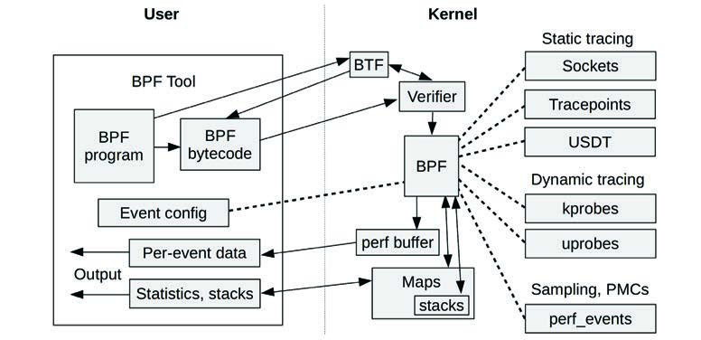
**图 3.16 BPF 组件**

BPF 字节码必须首先通过验证器 (Verifier) 进行安全检查，确保 BPF 程序不会崩溃或损坏内核。它还可能使用 BPF 类型格式 (BTF) 系统来理解数据类型和结构。BPF 程序可以通过 perf 环形缓冲区输出数据（这是一种发射每事件数据的有效方式），或者通过适合统计数据的映射 (Maps) 输出数据。

因为 BPF 驱动了新一代高效、安全且先进的追踪工具，它对系统性能分析非常重要。它为现有的内核事件源（Tracepoints、kprobes、uprobes 和 perf_events）提供了可编程性。例如，BPF 程序可以在 I/O 开始和结束时记录时间戳以计时其持续时间，并将其记录在自定义直方图中。本书包含许多使用 BCC 和 bpftrace 前端的基于 BPF 的程序。这些前端在第 15 章中介绍。

## 3.5 其他主题 (Other Topics)

其他一些值得总结的内核和操作系统主题包括 PGO 内核、Unikernels、微内核、混合内核以及分布式操作系统。

### 3.5.1 PGO 内核 (PGO Kernels)

配置文件引导优化 (Profile-guided optimization, PGO)，也称为反馈引导优化 (Feedback-directed optimization, FDO)，使用 CPU 分析信息来改进编译器的决策 [Yuan 14a]。这可以应用于内核构建，过程如下：

1. 在生产环境中进行 CPU 分析。
2. 根据该 CPU 分析结果重新编译内核。
3. 在生产环境中部署新内核。

这创建了一个针对特定工作负载改进了性能的内核。诸如 JVM 之类的运行时会自动执行此操作，结合即时 (JIT) 编译，根据其运行时性能重新编译 Java 方法。创建 PGO 内核的过程则涉及手动步骤。

相关的编译优化是链接时间优化 (Link-Time Optimization, LTO)，其中整个二进制文件一次性编译，以允许跨整个程序的优化。Microsoft Windows 内核大量使用 LTO 和 PGO，从 PGO 中获得了 5% 到 20% 的改进 [Bearman 20]。Google 也使用 LTO 和 PGO 内核来提高性能 [Tolvanen 20]。

gcc 和 clang 编译器以及 Linux 内核都支持 PGO。内核 PGO 通常涉及运行经过专门插桩的内核以收集分析数据。Google 发布了一个 AutoFDO 工具，绕过了对这种特殊内核的需求：AutoFDO 允许使用 `perf(1)` 从普通内核收集分析数据，然后将其转换为编译器可以使用的正确格式 [Google 20a]。

关于使用 PGO 或 AutoFDO 构建 Linux 内核的最新文档仅有 2020 年 Linux Plumbers 会议上来自 Microsoft [Bearman 20] 和 Google [Tolvanen 20] 的两次演讲。[^15]

[^15]: 有一段时间，最新的文档是 2014 年针对 Linux 3.13 的 [Yuan 14b]，这阻碍了在较新内核上的采用。

### 3.5.2 单内核 (Unikernels)

单内核 (Unikernel) 是一种单一应用程序机器镜像，它将内核、库和应用程序软件组合在一起，通常可以在硬件虚拟机或裸机上的单一地址空间中运行。这具有潜在的性能和安全优势：较少的指令文本意味着更高的 CPU 缓存命中率和更少的安全漏洞。这也带来了一个问题：可能没有 SSH、Shell 或性能工具供你登录和调试系统，也没有任何添加它们的方法。

为了在生产环境中对 Unikernel 进行性能调优，必须构建新的性能工具和指标来支持它们。作为概念证明，我构建了一个从 Xen dom0 运行的初级 CPU 分析器，用于分析 domU Unikernel 客体，然后构建了 CPU 火焰图，仅为了证明这是可能的 [Gregg 16a]。

Unikernel 的例子包括 MirageOS [MirageOS 20]。

### 3.5.3 微内核和混合内核 (Microkernels and Hybrid Kernels)

本章的大部分内容讨论的是类 Unix 内核，也被称为宏内核 (Monolithic kernels)，其中管理设备的所有代码作为单个大型内核程序一起运行。对于[[微内核]]（Microkernel）模型，内核软件被保持在最低限度。微内核支持诸如内存管理、线程管理和进程间通信 (IPC) 等核心功能。文件系统、网络栈和驱动程序被实现为用户模式软件，这使得这些用户模式组件更容易修改和替换。想象一下，不仅可以选择安装哪个数据库或 Web 服务器，还可以选择安装哪个网络栈。微内核也更具容错性：驱动程序中的崩溃不会导致整个内核崩溃。微内核的例子包括 QNX 和 Minix 3。

微内核的一个缺点是执行 I/O 和其他功能时需要额外的 IPC 步骤，降低了性能。解决这个问题的一种方案是[[混合内核]]（Hybrid kernels），它结合了微内核和宏内核的优点。混合内核将对性能至关重要的服务移回内核空间（使用直接函数调用而不是 IPC），就像宏内核一样，但保留了微内核的模块化设计和容错性。混合内核的例子包括 Windows NT 内核和 Plan 9 内核。

### 3.5.4 分布式操作系统 (Distributed Operating Systems)

分布式操作系统在通过网络连接的一组独立计算机节点上运行单个操作系统实例。每个节点上通常使用微内核。分布式操作系统的例子包括来自贝尔实验室的 Plan 9 和 Inferno 操作系统。

虽然设计新颖，但这种模型尚未得到广泛使用。Plan 9 和 Inferno 的共同创造者 Rob Pike 描述了其中的各种原因，包括 [Pike 00]：

> [!quote]
> 在 1970 年代末和 1980 年代初有一种说法，Unix 扼杀了操作系统研究，因为没有人会尝试其他任何东西。当时，我不相信。今天，我勉强接受这种说法可能是真的（尽管有微软存在）。

在云端，当今通用的计算节点扩展模型是在一组相同的 OS 实例之间进行负载平衡，这些实例可能会根据负载进行缩放（见第 11 章“云计算”第 11.1.3 节“容量规划”）。

## 3.6 内核比较 (Kernel Comparisons)

哪个内核最快？这在一定程度上取决于 OS 配置和工作负载，以及内核参与的程度。总的来说，我预计 Linux 将优于其他内核，因为它在性能改进、应用程序和驱动程序支持方面进行了大量工作，且被广泛使用，拥有庞大的发现和报告性能问题的社区。自 1993 年以来由 TOP500 列表跟踪的全球前 500 强超级计算机在 2017 年已 100% 使用 Linux [TOP500 17]。也会有一些例外；例如，Netflix 在云端使用 Linux，而在其 CDN 上使用 FreeBSD。[^16]

内核性能通常使用微基准测试 (Micro-benchmarks) 进行比较，这很容易出错。此类基准测试可能会发现一个内核在某个特定的系统调用上快得多，但该系统调用在生产工作负载中并未被使用。（或者它被使用了，但带有微基准测试未测试的某些标志，而这些标志会极大地影响性能。）准确比较内核性能是高级性能工程师的任务——这项任务可能需要数周时间。请参阅第 12 章“基准测试”第 12.3.2 节“主动基准测试”作为应遵循的方法。

在本书的第一版中，我在本节结尾指出 Linux 没有成熟的动态追踪器，没有它你可能会错过巨大的性能提升。自第一版以来，我已转向全职 Linux 性能角色，并帮助开发了 Linux 所缺失的动态追踪器：基于扩展 BPF 的 BCC 和 bpftrace。这些在第 15 章和我的上一本书 [Gregg 19] 中有介绍。

3.4.1 节“Linux 内核开发”列出了从第一版到本版之间发生的许多其他 Linux 性能开发，涵盖了内核版本 3.1 到 5.8。前面未列出的一个重大进展是 OpenZFS 现在将 Linux 作为其主要内核支持，为 Linux 提供了一个高性能且成熟的文件系统选项。

然而，随着所有这些 Linux 的发展，复杂性也随之而来。Linux 上有如此多的性能特性和可调参数，以至于为每个工作负载配置和调优它们已变得非常费力。我见过许多部署在未调优的情况下运行。在比较内核性能时请记住这一点：每个内核都经过调优了吗？本书后面的章节及其调优部分可以帮助你补救这一点。

[^16]: FreeBSD 为 Netflix CDN 工作负载提供了更高的性能，特别是由于 Netflix OCA 团队对内核进行的改进。这会定期进行测试，最近一次是在 2019 年，我对 Linux 5.0 与 FreeBSD 进行了生产环境比较，我协助了分析。

## 3.7 习题 (Exercises)

1. 回答以下关于操作系统术语的问题：
    - 进程、线程和任务之间有什么区别？
    - 模式切换和上下文切换有什么区别？
    - 分页和进程交换之间有什么区别？
    - I/O 密集型和 CPU 密集型工作负载之间有什么区别？
2. 回答以下概念性问题：
    - 描述内核的角色。
    - 描述系统调用的角色。
    - 描述 VFS 的角色及其在 I/O 栈中的位置。
3. 回答以下更深入的问题：
    - 列出线程离开当前 CPU 的原因。
    - 描述虚拟内存和请求分页的优点。

## 3.8 参考文献 (References)

[Graham 68] Graham, B., “Protection in an Information Processing Utility,” Communications of the ACM, May 1968.

[Ritchie 74] Ritchie, D. M., and Thompson, K., “The UNIX Time-Sharing System,” Communications of the ACM 17, no. 7, pp. 365–75, July 1974.

[Thompson 78] Thompson, K., UNIX Implementation, Bell Laboratories, 1978.

[Bach 86] Bach, M. J., The Design of the UNIX Operating System, Prentice Hall, 1986.

[Mellor-Crummey 91] Mellor-Crummey, J. M., and Scott, M., “Algorithms for Scalable Synchronization on Shared-Memory Multiprocessors,” ACM Transactions on Computing Systems, Vol. 9, No. 1, 1991.

[McCanne 92] McCanne, S., and Jacobson, V., “The BSD Packet Filter: A New Architecture for User-Level Packet Capture”, USENIX Winter Conference, 1993.

[Mills 94] Mills, D., “RFC 1589: A Kernel Model for Precision Timekeeping,” Network Working Group, 1994.

[Lever 00] Lever, C., Eriksen, M. A., and Molloy, S. P., “An Analysis of the TUX Web Server,” CITI Technical Report 00-8, 2000.

[Pike 00] Pike, R., “Systems Software Research Is Irrelevant,” 2000.

[Mauro 01] Mauro, J., and McDougall, R., Solaris Internals: Core Kernel Architecture, Prentice Hall, 2001.

[Bovet 05] Bovet, D., and Cesati, M., Understanding the Linux Kernel, 3rd Edition, O’Reilly, 2005.

[Corbet 05] Corbet, J., Rubini, A., and Kroah-Hartman, G., Linux Device Drivers, 3rd Edition, O’Reilly, 2005.

[Corbet 13a] Corbet, J., “Is the whole system idle?” LWN.net, 2013.

[Corbet 13b] Corbet, J., “The multiqueue block layer,” LWN.net, 2013.

[Starovoitov 13] Starovoitov, A., “[PATCH net-next] extended BPF,” Linux kernel mailing list, 2013.

[Borkmann 14a] Borkmann, D., “net: tcp: add DCTCP congestion control algorithm,” 2014.

[Borkmann 14b] Borkmann, D., “[PATCH net-next 1/9] net: filter: add jited flag to indicate jit compiled filters,” netdev mailing list, 2014.

[Corbet 14] Corbet, J., “MCS locks and qspinlocks,” LWN.net, 2014.

[Drysdale 14] Drysdale, D., “Anatomy of a system call, part 2,” LWN.net, 2014.

[Yuan 14a] Yuan, P., Guo, Y., and Chen, X., “Experiences in Profile-Guided Operating System Kernel Optimization,” APSys, 2014.

[Yuan 14b] Yuan P., Guo, Y., and Chen, X., “Profile-Guided Operating System Kernel Optimization,” 2014.

[Corbet 15] Corbet, J., “Epoll evolving,” LWN.net, 2015.

[Edge 15] Edge, J., “TLS in the kernel,” LWN.net, 2015.

[Heo 15] Heo, T., “Control Group v2,” Linux documentation, 2015.

[McKusick 15] McKusick, M. K., Neville-Neil, G. V., and Watson, R. N. M., The Design and Implementation of the FreeBSD Operating System, 2nd Edition, Addison-Wesley, 2015.

[Stewart 15] Stewart, R., Gurney, J. M., and Long, S., “Optimizing TLS for High-Bandwidth Applications in FreeBSD,” AsiaBSDCon, 2015.

[Cardwell 16] Cardwell, N., Cheng, Y., Stephen Gunn, C., Hassas Yeganeh, S., and Jacobson, V., “BBR: Congestion-Based Congestion Control,” ACM queue, 2016.

[Gregg 16a] Gregg, B., “Unikernel Profiling: Flame Graphs from dom0,” 2016.

[Herbert 16] Herbert, T., and Starovoitov, A., “eXpress Data Path (XDP): Programmable and High Performance Networking Data Path,” 2016.

[Corbet 17] Corbet, J., “Two new block I/O schedulers for 4.12,” LWN.net, 2017.

[TOP500 17] TOP500, “List Statistics,” 2017.

[Gregg 18a] Gregg, B., “KPTI/KAISER Meltdown Initial Performance Regressions,” 2018.

[Jacobson 18] Jacobson, V., “Evolving from AFAP: Teaching NICs about Time,” netdev 0x12, 2018.

[Gregg 19] Gregg, B., BPF Performance Tools: Linux System and Application Observability, Addison-Wesley, 2019.

[Looney 19] Looney, J., “Netflix and FreeBSD: Using Open Source to Deliver Streaming Video,” FOSDEM, 2019.

[Bearman 20] Bearman, I., “Exploring Profile Guided Optimization of the Linux Kernel,” Linux Plumber’s Conference, 2020.

[Google 20a] Google, “AutoFDO,” 2020.

[Linux 20a] “NO_HZ: Reducing Scheduling-Clock Ticks,” Linux documentation, 2020.

[Linux 20b] “Deadline Task Scheduling,” Linux documentation, 2020.

[Linux 20c] “MSG_ZEROCOPY,” Linux documentation, 2020.

[Linux 20d] “Softlockup Detector and Hardlockup Detector (aka nmi_watchdog),” Linux documentation, 2020.

[MirageOS 20] MirageOS, “Mirage OS,” 2020.

[Owens 20] Owens, K., et al., “4. Kernel Stacks,” Linux documentation, 2020.

[Tolvanen 20] Tolvanen, S., Wendling, B., and Desaulniers, N., “LTO, PGO, and AutoFDO in the Kernel,” Linux Plumber’s Conference, 2020.

### 3.8.1 延伸阅读 (Additional Reading)

操作系统及其内核是一个迷人且广泛的话题。本章仅总结了精华。除了本章提到的资源外，以下也是出色的参考资料，适用于基于 Linux 的操作系统及其他操作系统：

[Goodheart 94] Goodheart, B., and Cox J., The Magic Garden Explained: The Internals of UNIX System V Release 4, an Open Systems Design, Prentice Hall, 1994.

[Vahalia 96] Vahalia, U., UNIX Internals: The New Frontiers, Prentice Hall, 1996.

[Singh 06] Singh, A., Mac OS X Internals: A Systems Approach, Addison-Wesley, 2006.

[McDougall 06b] McDougall, R., and Mauro, J., Solaris Internals: Solaris 10 and OpenSolaris Kernel Architecture, Prentice Hall, 2006.

[Love 10] Love, R., Linux Kernel Development, 3rd Edition, Addison-Wesley, 2010.

[Tanenbaum 14] Tanenbaum, A., and Bos, H., Modern Operating Systems, 4th Edition, Pearson, 2014.

[Yosifovich 17] Yosifovich, P., Ionescu, A., Russinovich, M. E., and Solomon, D. A., Windows Internals, Part 1 (Developer Reference), 7th Edition, Microsoft Press, 2017.

[^14]: 开发用于提高 Netflix FreeBSD 开放连接设备 (OCAs) 的性能，这些设备构成了 Netflix CDN。
