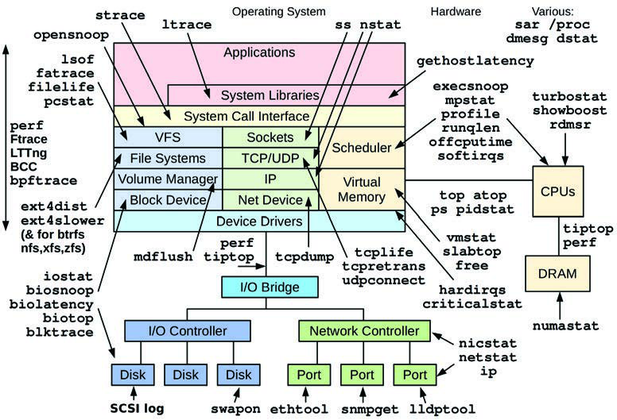
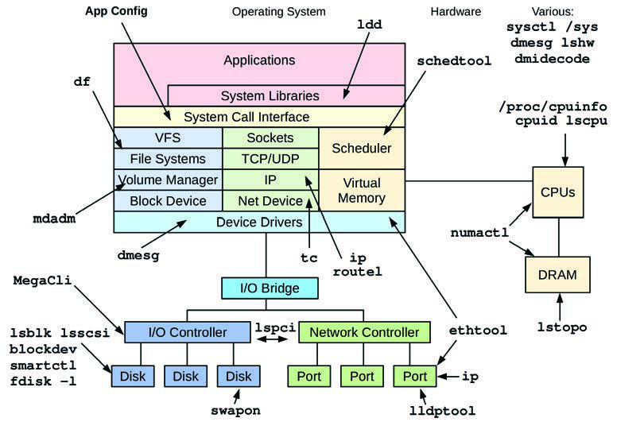
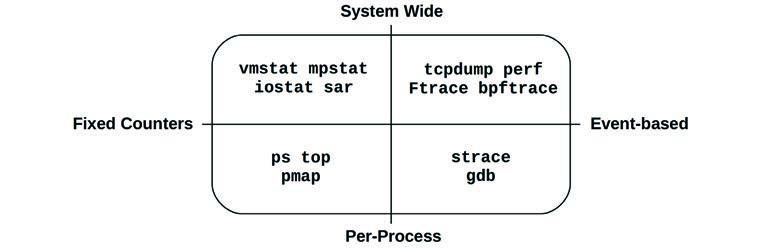
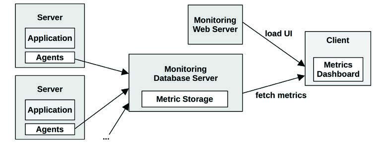
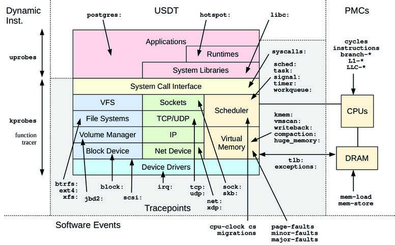
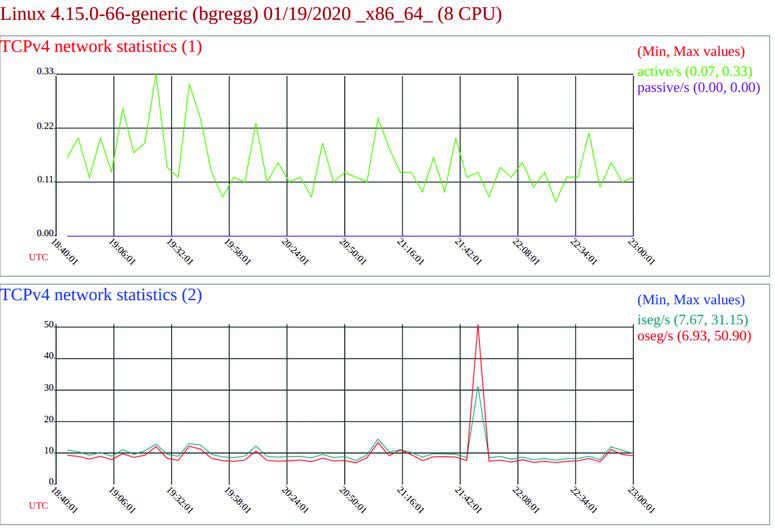

# 第 4 章 可观测性工具 (Observability Tools)

历史上，操作系统提供了许多用于观察系统软件和硬件组件的工具。对于初学者来说，琳琅满目的工具和指标似乎暗示着一切——或者至少是所有重要的事情——都可以被观察到。现实情况是，其中存在许多空白，系统性能专家变得精通于推断和解释的艺术：从间接的工具和统计数据中弄清楚活动。例如，网络数据包可以被逐个检查（嗅探），但磁盘 I/O 却不能（至少不容易做到）。

得益于动态追踪工具的兴起，包括基于 BPF 的 BCC 和 bpftrace，Linux 的可观测性得到了极大的提高。曾经阴暗的角落现在已被照亮，包括使用 `biosnoop(8)` 观察单个磁盘 I/O。然而，许多公司和商业监控产品尚未采用系统追踪技术，错失了它所带来的洞察力。我通过开发、发布和解释新的追踪工具引领了这一潮流，这些工具已被 Netflix 和 Facebook 等公司采用。

本章的学习目标是：

- 识别静态性能工具和危机处理工具。
- 理解工具类型及其开销：计数器、剖析和追踪。
- 了解可观测性数据源，包括：`/proc`、`/sys`、tracepoints、kprobes、uprobes、USDT 和 PMCs。
- 学习如何配置 `sar(1)` 以存档统计数据。

在第 1 章中，我介绍了不同类型的可观测性：计数器、剖析和追踪，以及静态和动态插桩。本章将详细解释可观测性工具及其数据源，包括 `sar(1)`（系统活动报告器）的总结和追踪工具的介绍。这为你理解 Linux 可观测性提供了必要的基础；后续章节（第 6 到 11 章）将使用这些工具 and 数据源来解决特定问题。第 13 到 15 章将深入探讨追踪器。

本章以 Ubuntu Linux 发行版为例；大多数工具在其他 Linux 发行版上是通用的，在这些工具起源的其他内核和操作系统中也存在类似的工具。

## 4.1 工具覆盖范围 (Tool Coverage)

图 4.1 显示了一张操作系统图表，我已在图中注明了与每个组件相关的 Linux 工作负载可观测性工具[^1]。


**图 4.1 Linux 工作负载可观测性工具**

这些工具大多专注于特定的资源，如 CPU、内存或磁盘，并将在后续专门讨论该资源的章节中涵盖。还有一些可以分析多个领域的“多功能工具”，它们将在本章稍后介绍：`perf`、`Ftrace`、`BCC` 和 `bpftrace`。

### 4.1.1 静态性能工具 (Static Performance Tools)

还有另一种类型的可观测性，它检查系统在静止状态下而非活跃工作负载下的属性。这在第 2 章“方法论”2.5.17 节“静态性能调优方法论”中有所描述，这些工具如图 4.2 所示。


**图 4.2 Linux 静态性能调优工具**

请记住使用图 4.2 中的工具来检查配置和组件问题。有时性能问题仅仅是由于配置错误造成的。

### 4.1.2 危机处理工具 (Crisis Tools)

当你遇到生产环境性能危机，需要各种性能工具来调试时，你可能会发现系统中一个工具都没有安装。更糟糕的是，由于服务器正遭受性能问题，安装工具可能比平时花费更长的时间，从而延长危机。

对于 Linux，表 4.1 列出了提供这些危机处理工具的推荐安装包或源码仓库。表中显示了 Ubuntu/Debian 的软件包名称（这些名称在不同的 Linux 发行版中可能有所不同）。

**表 4.1 Linux 危机处理工具包**

| 软件包 | 提供的工具 |
| :--- | :--- |
| **procps** | `ps(1)`, `vmstat(8)`, `uptime(1)`, `top(1)` |
| **util-linux** | `dmesg(1)`, `lsblk(1)`, `lscpu(1)` |
| **sysstat** | `iostat(1)`, `mpstat(1)`, `pidstat(1)`, `sar(1)` |
| **iproute2** | `ip(8)`, `ss(8)`, `nstat(8)`, `tc(8)` |
| **numactl** | `numastat(8)` |
| **linux-tools-common**<br>**linux-tools-$(uname -r)** | `perf(1)`, `turbostat(8)` |
| **bcc-tools**<br>(又名 bpfcc-tools) | `opensnoop(8)`, `execsnoop(8)`, `runqlat(8)`, `runqlen(8)`, `softirqs(8)`, `hardirqs(8)`, `ext4slower(8)`, `ext4dist(8)`, `biotop(8)`, `biosnoop(8)`, `biolatency(8)`, `tcptop(8)`, `tcplife(8)`, `trace(8)`, `argdist(8)`, `funccount(8)`, `stackcount(8)`, `profile(8)` 等 |
| **bpftrace** | `bpftrace`, 基础版的 `opensnoop(8)`, `execsnoop(8)`, `runqlat(8)`, `runqlen(8)`, `biosnoop(8)`, `biolatency(8)` 等 |
| **perf-tools-unstable** | 基于 Ftrace 的 `opensnoop(8)`, `execsnoop(8)`, `iolatency(8)`, `iosnoop(8)`, `bitesize(8)`, `funccount(8)`, `kprobe(8)` |
| **trace-cmd** | `trace-cmd(1)` |
| **nicstat** | `nicstat(1)` |
| **ethtool** | `ethtool(8)` |
| **tiptop** | `tiptop(1)` |
| **msr-tools** | `rdmsr(8)`, `wrmsr(8)` |
| **github.com/brendangregg/msr-cloud-tools** | `showboost(8)`, `cpuhot(8)`, `cputemp(8)` |
| **github.com/brendangregg/pmc-cloud-tools** | `pmcarch(8)`, `cpucache(8)`, `icache(8)`, `tlbstat(8)`, `resstalls(8)` |

大型公司（如 Netflix）拥有操作系统和性能团队，负责确保生产系统安装了所有这些软件包。默认的 Linux 发行版可能只安装了 `procps` 和 `util-linux`，因此必须添加所有其他软件包。

在容器环境中，可能需要创建一个拥有完整系统访问权限[^2]并安装了所有工具的特权调试容器。该容器的镜像可以安装在容器宿主机上，并在需要时部署。

仅仅添加工具包通常是不够的：内核和用户空间软件也可能需要配置以支持这些工具。追踪工具通常需要启用某些内核 `CONFIG` 选项，例如 `CONFIG_FTRACE` 和 `CONFIG_BPF`。剖析工具通常需要将软件配置为支持堆栈行走（stack walking），方法是使用框架指针（frame-pointer）编译所有软件（包括系统库：`libc`, `libpthread` 等），或者安装 `debuginfo` 软件包以支持 dwarf 堆栈行走。如果你的公司尚未这样做，你应该在危机迫切需要这些工具之前，检查每个性能工具是否工作，并修复那些无法工作的工具。

接下来的章节将更详细地解释性能可观测性工具。

## 4.2 工具类型 (Tool Types)

性能可观测性工具的一个有用分类是它们提供的是系统级还是每进程的可观测性，以及它们是基于计数器还是基于事件的。这些属性如图 4.3 所示，并附带了 Linux 工具示例。


**图 4.3 可观测性工具类型**

有的工具属于多个象限；例如，`top(1)` 也有系统范围的摘要，而系统级事件工具通常可以过滤特定进程（`-p PID`）。

基于事件的工具包括剖析器（profilers）和追踪器（tracers）。剖析器通过对事件进行一系列快照来观察活动，绘制出目标对象的粗略轮廓。追踪器会对每个感兴趣的事件进行插桩，并可能对它们进行处理，例如生成自定义计数器。计数器、追踪和剖析已在第 1 章中介绍过。

接下来的章节将描述使用固定计数器、追踪和剖析的 Linux 工具，以及执行监控（指标）的工具。

### 4.2.1 固定计数器 (Fixed Counters)

内核维护各种计数器以提供系统统计信息。它们通常实现为无符号整数，在事件发生时递增。例如，有网络接收数据包数、发出的磁盘 I/O 数以及发生的中断数等计数器。这些由监控软件作为指标公开（见 4.2.4 节“监控”）。

内核的一种常用方法是维护一对累积计数器：一个用于计算事件数，另一个用于记录事件的总时长。通过将总时长除以次数，可以直接获得事件计数和平均时间（或延迟）。由于它们是累积的，通过在一段时间间隔（例如一秒）内读取这对计数器，可以计算出增量（delta），并据此计算出每秒次数和平均延迟。许多系统统计信息都是这样计算的。

从性能角度来看，计数器被认为是“免费”使用的，因为它们默认启用并由内核持续维护。使用它们的唯一额外成本是从用户空间读取其值的行为（这应该是微不足道的）。以下示例工具读取系统范围或每进程的计数器。

#### 系统范围 (System-Wide)

这些工具使用内核计数器在系统软件或硬件资源的上下文中检查系统范围的活动。Linux 工具包括：

- **vmstat(8)**：系统范围的虚拟和物理内存统计信息。
- **mpstat(1)**：每个 CPU 的使用情况。
- **iostat(1)**：每个磁盘的 I/O 使用情况，从块设备接口报告。
- **nstat(8)**：TCP/IP 协议栈统计信息。
- **sar(1)**：各种统计信息；还可以将它们存档以供历史报告使用。

这些工具通常对系统上的所有用户（非 root 用户）可见。它们的统计信息也通常由监控软件绘制成图表。

许多工具遵循一种使用惯例，即接受可选的时间间隔和次数。例如，`vmstat(8)` 的时间间隔为一秒，输出次数为三次：

```bash
$ vmstat 1 3
procs -----------memory---------- ---swap-- -----io---- -system-- ------cpu-----
 r  b   swpd   free   buff  cache   si   so    bi    bo   in   cs us sy id wa st
 4  0 1446428 662012 142100 5644676    1    4    28   152   33    1 29  8 63  0  0
 4  0 1446428 665988 142116 5642272    0    0     0   284 4957 4969 51  0 48  0  0
 4  0 1446428 685116 142116 5623676    0    0     0     0 4488 5507 52  0 48  0  0
```

输出的第一行是“自启动以来的摘要”，显示了系统运行以来的平均值。随后的行是一秒间隔的摘要，显示当前活动。至少初衷是这样：这个 Linux 版本在第一行混合了“自启动以来的摘要”和“当前值”（内存列是当前值；`vmstat(8)` 在第 7 章中解释）。

#### 每进程 (Per-Process)

这些工具以进程为中心，使用内核为每个进程维护的计数器。Linux 工具包括：

- **ps(1)**：显示进程状态，显示各种进程统计信息，包括内存和 CPU 使用情况。
- **top(1)**：显示排名靠前的进程，按 CPU 使用率或其他统计信息排序。
- **pmap(1)**：列出进程内存段及使用统计信息。

这些工具通常从 `/proc` 文件系统读取统计信息。

### 4.2.2 剖析 (Profiling)

剖析通过收集一组其行为的样本或快照来刻画目标特征。CPU 使用率是剖析的常见目标，其中对指令指针或堆栈轨迹进行基于定时器的采样，以刻画消耗 CPU 的代码路径。这些样本通常以固定频率收集，例如在所有 CPU 上以 100 Hz（每秒循环次数）收集，并持续较短时间（如一分钟）。剖析工具或剖析器通常使用 99 Hz 而不是 100 Hz，以避免与目标活动同步采样，否则可能导致计数过多或不足。

剖析也可以基于非定时硬件事件，例如 CPU 硬件缓存未命中或总线活动。它可以显示哪些代码路径对此负责，这些信息特别能帮助开发人员优化代码的内存使用。

与固定计数器不同，剖析（和追踪）通常仅在需要时启用，因为收集它们会产生一定的 CPU 开销，存储它们会产生存储开销。这些开销的大小取决于工具及其插桩的事件率。基于定时器的剖析器通常更安全：事件率是已知的，因此其开销可以预测，并且可以选择事件率以使开销微乎其微。

#### 系统范围 (System-Wide)

系统范围的 Linux 剖析器 include：

- **perf(1)**：标准的 Linux 剖析器，包含剖析子命令。
- **profile(8)**：BCC 仓库中一个基于 BPF 的 CPU 剖析器（在第 15 章“BPF”中介绍），它在内核上下文中对堆栈轨迹进行频率计数。
- **Intel VTune Amplifier XE**：Linux 和 Windows 剖析器，带有包括源代码浏览在内的图形界面。

这些工具也可以用于针对单个进程。

#### 每进程 (Per-Process)

以进程为中心的剖析器包括：

- **gprof(1)**：GNU 剖析工具，分析编译器添加的剖析信息（例如 `gcc -pg`）。
- **cachegrind**：valgrind 工具集中的一个工具，可以剖析硬件缓存使用情况（及更多），并使用 `kcachegrind` 可视化剖析结果。
- **Java Flight Recorder (JFR)**：编程语言通常有自己的专用剖析器，可以检查语言上下文。例如 Java 的 JFR。

有关剖析工具的更多信息，请参见第 6 章“CPU”和第 13 章“perf”。

### 4.2.3 追踪 (Tracing)

追踪会插桩事件的每一次发生，并可以存储基于事件的细节以供以后分析，或生成摘要。这与剖析类似，但意图是收集或检查所有事件，而不仅仅是样本。追踪产生的 CPU 和存储开销可能比剖析更高，这可能会降低追踪目标的运行速度。应该考虑到这一点，因为它可能会对生产工作负载产生负面影响，并且测量的延迟也可能会受到追踪器的干扰而产生偏差。与剖析一样，追踪通常仅在需要时使用。

日志记录（将错误和警告等频率较低的事件写入日志文件以便以后读取）可以被认为是默认启用的低频追踪。日志包括系统日志。

以下是系统范围和每进程追踪工具的示例。

#### 系统范围 (System-Wide)

这些追踪工具使用内核追踪设施，在系统软件或硬件资源的上下文中检查系统范围的活动。Linux 工具包括：

- **tcpdump(8)**：网络数据包追踪（使用 `libpcap`）。
- **biosnoop(8)**：块 I/O 追踪（使用 BCC 或 bpftrace）。
- **execsnoop(8)**：新进程追踪（使用 BCC 或 bpftrace）。
- **perf(1)**：标准的 Linux 剖析器，也可以追踪事件。
- **perf trace**：一个特殊的 perf 子命令，追踪系统范围的系统调用。
- **Ftrace**：Linux 内置追踪器。
- **BCC**：基于 BPF 的追踪库和工具包。
- **bpftrace**：基于 BPF 的追踪器 (`bpftrace(8)`) 和工具包。

`perf(1)`、`Ftrace`、`BCC` 和 `bpftrace` 在 4.5 节“追踪工具”中介绍，并在第 13 至 15 章中详细讲解。有超过一百个使用 BCC 和 bpftrace 构建的追踪工具，包括此列表中的 `biosnoop(8)` 和 `execsnoop(8)`。本书中提供了更多示例。

#### 每进程 (Per-Process)

这些追踪工具及其基于的操作系统框架是以进程为中心的。Linux 工具包括：

- **strace(1)**：系统调用追踪。
- **gdb(1)**：源代码级调试器。

调试器可以检查每事件的数据，但它们必须通过停止和启动目标的执行来实现。这可能会带来巨大的开销，使其不适合在生产环境中使用。

系统范围的追踪工具（如 `perf(1)` 和 `bpftrace`）支持过滤以检查单个进程，并且能以更低的开销运行，因此在可用时是首选。

### 4.2.4 监控 (Monitoring)

监控已在第 2 章“方法论”中介绍过。与前面介绍的工具类型不同，监控会持续记录统计信息，以备后用。

#### sar(1)

监控单个操作系统主机的传统工具是系统活动报告器 `sar(1)`，它起源于 AT&T Unix。`sar(1)` 是基于计数器的，并且有一个代理程序在预定时间（通过 cron）执行，以记录系统范围计数器的状态。`sar(1)` 工具允许在命令行查看这些信息，例如：

```bash
# sar
Linux 4.15.0-66-generic (bgregg)  12/21/2019        _x86_64_        (8 CPU)
12:00:01 AM     CPU     %user     %nice   %system   %iowait    %steal     %idle
12:05:01 AM     all      3.34      0.00      0.95      0.04      0.00     95.66
12:10:01 AM     all      2.93      0.00      0.87      0.04      0.00     96.16
12:15:01 AM     all      3.05      0.00      1.38      0.18      0.00     95.40
12:20:01 AM     all      3.02      0.00      0.88      0.03      0.00     96.06
[...]
Average:        all      0.00      0.00      0.00      0.00      0.00      0.00
```

默认情况下，`sar(1)` 读取其统计存档（如果已启用）以打印最近的历史统计信息。你可以指定可选的时间间隔和次数，让它按指定的速率检查当前活动。

`sar(1)` 可以记录数十种不同的统计信息，以提供对 CPU、内存、磁盘、网络、中断、功耗等方面的洞察。它在 4.4 节“sar”中有更详细的介绍。

第三方监控产品通常基于 `sar(1)` 或其使用的相同可观测性统计信息构建，并过网络公开这些指标。

#### SNMP

网络监控的传统技术是简单网络管理协议（SNMP）。设备和操作系统可以支持 SNMP，在某些情况下默认提供该协议，从而避免安装第三方代理或导出器。SNMP 包含许多基础操作系统指标，尽管它尚未扩展到现代应用程序。大多数环境已转向基于自定义代理的监控。

#### 代理 (Agents)

现代监控软件在每个系统上运行代理（也称为导出器 exporters 或插件 plugins）来记录内核和应用程序指标。这些可以包括针对特定应用程序和目标的代理，例如 MySQL 数据库服务器、Apache Web 服务器和 Memcached 缓存系统。此类代理可以提供系统计数器无法提供的详细应用程序请求指标。

Linux 的监控软件和代理包括：

- **Performance Co-Pilot (PCP)**：PCP 支持数十种不同的代理（称为性能指标域代理：PMDAs），包括基于 BPF 的指标 [PCP 20]。
- **Prometheus**：Prometheus 监控软件支持数十种不同的导出器，用于数据库、硬件、消息传递、存储、HTTP、API 和日志 [Prometheus 20]。
- **collectd**：支持数十种不同的插件。

图 4.4 展示了一个示例监控架构，涉及一个用于存档指标的监控数据库服务器，以及一个用于提供客户端 UI 的监控 Web 服务器。指标由代理发送（或提供）给数据库服务器，然后提供给客户端 UI，以折线图和仪表板的形式显示。例如，Graphite Carbon 是一个监控数据库服务器，Grafana 是一个监控 Web 服务器/仪表板。


**图 4.4 示例监控架构**

有数十种监控产品，以及数百种针对不同目标类型的不同代理。涵盖它们超出了本书的范围。然而，这里涵盖了一个共同点：系统统计信息（基于内核计数器）。监控产品显示的系统统计信息通常与系统工具显示的信息相同：`vmstat(8)`、`iostat(1)` 等。即使你从不使用命令行工具，学习这些工具也将有助于你理解监控产品。这些工具将在后续章节中介绍。

一些监控产品通过运行系统工具并解析文本输出来读取其系统指标，这效率低下。更好的监控产品使用库和内核接口直接读取指标——也就是命令行工具所使用的相同接口。这些来源将在下一节中介绍，重点是最大的公分母：内核接口。

## 4.3 可观测性数据源 (Observability Sources)

接下来的章节描述了在 Linux 上为可观测性工具提供数据的各种接口。表 4.2 对它们进行了总结。

**表 4.2 Linux 可观测性数据源**

| 类型 | 数据源 |
| :--- | :--- |
| **每进程计数器** | `/proc` |
| **系统级计数器** | `/proc`, `/sys` |
| **设备配置与计数器** | `/sys` |
| **Cgroup 统计信息** | `/sys/fs/cgroup` |
| **每进程追踪** | `ptrace` |
| **硬件计数器 (PMCs)** | `perf_event` |
| **网络统计信息** | `netlink` |
| **网络数据包捕获** | `libpcap` |
| **每线程延迟指标** | `Delay accounting` |
| **系统级追踪** | 函数剖析 (`Ftrace`)、`tracepoints`、软件事件、`kprobes`、`uprobes`、`perf_event` |

接下来将介绍系统性能统计信息的主要来源：`/proc` 和 `/sys`。然后介绍其他 Linux 数据源：延迟记账（delay accounting）、netlink、tracepoints、kprobes、USDT、uprobes、PMCs 等。

第 13 章 `perf`、第 14 章 `Ftrace` 和 第 15 章 `BPF` 涵盖的追踪器利用了其中的许多数据源，尤其是系统级追踪。这些追踪数据源的范围如图 4.5 所示，并附带了事件和组名称：例如，`block:` 对应所有的块 I/O 追踪点，包括 `block:block_rq_issue`。


**图 4.5 Linux 追踪数据源**

图 4.5 仅展示了几个 USDT 数据源示例，分别针对 PostgreSQL 数据库（`postgres:`）、JVM hotspot 编译器（`hotspot:`）和 `libc`（`libc:`）。根据你的用户层软件，你可能还有更多数据源。

有关 tracepoints、kprobes 和 uprobes 如何工作的更多信息，它们的内部细节记录在《BPF Performance Tools》[Gregg 19] 的第 2 章中。

### 4.3.1 /proc

这是一个用于内核统计信息的文件系统接口。`/proc` 包含许多目录，其中每个目录都以其代表的进程 ID 命名。在这些目录中，有许多包含每个进程的信息和统计信息的文件，这些文件由内核数据结构映射而来。`/proc` 中还有一些用于系统级统计信息的文件。

`/proc` 由内核动态创建，不驻留在存储设备上（它运行在内存中）。它大部分是只读的，为可观测性工具提供统计信息。有些文件是可写的，用于控制进程和内核行为。

文件系统接口非常方便：它是一个直观的框架，通过目录树将内核统计信息暴露给用户层，并具有众所周知的 POSIX 文件系统调用编程接口：`open()`、`read()`、`close()`。你也可以在命令行使用 `cd`、`cat(1)`、`grep(1)` 和 `awk(1)` 进行探索。文件系统还通过文件访问权限提供用户级安全性。在极少数无法执行典型进程观测工具（`ps(1)`、`top(1)` 等）的情况下，仍可以通过 `/proc` 目录中的 shell 内置命令执行一些进程调试。

读取大多数 `/proc` 文件的开销可以忽略不计；例外情况包括一些遍历页表的内存映射相关文件。

#### 每进程统计信息

`/proc` 中提供了各种文件用于每进程统计信息。以下是可能可用的内容示例（Linux 5.4），此处查看的是 PID 18733[^3]：

```bash
$ ls -F /proc/18733
arch_status      environ     mountinfo      personality   statm
attr/            exe@        mounts         projid_map    status
autogroup        fd/         mountstats     root@         syscall
auxv             fdinfo/     net/           sched         task/
cgroup           gid_map     ns/            schedstat     timers
clear_refs       io          numa_maps      sessionid     timerslack_ns
cmdline          limits      oom_adj        setgroups     uid_map
comm             loginuid    oom_score      smaps         wchan
coredump_filter  map_files/  oom_score_adj  smaps_rollup
cpuset           maps        pagemap        stack
cwd@             mem         patch_state    stat
```

可用文件的确切列表取决于内核版本和 `CONFIG` 选项。

与每进程性能可观测性相关的包括：

- **limits**：生效的资源限制。
- **maps**：映射的内存区域。
- **sched**：各种 CPU 调度器统计信息。
- **schedstat**：CPU 运行时间、延迟和时间片。
- **smaps**：带有使用统计信息的映射内存区域。
- **stat**：进程状态和统计信息，包括总的 CPU 和内存使用情况。
- **statm**：以页为单位的内存使用摘要。
- **status**：带有标签的 `stat` 和 `statm` 信息。
- **fd**：文件描述符符号链接目录（另见 `fdinfo`）。
- **cgroup**：控制组（Cgroup）成员信息。
- **task**：每任务（线程）统计信息目录。

以下显示了 `top(1)` 如何读取每进程统计信息，使用 `strace(1)` 进行追踪：

```bash
stat("/proc/14704", {st_mode=S_IFDIR|0555, st_size=0, ...}) = 0
open("/proc/14704/stat", O_RDONLY)      = 4
read(4, "14704 (sshd) S 1 14704 14704 0 -"..., 1023) = 232
close(4)
```

这在以进程 ID（14704）命名的目录中打开了一个名为“stat”的文件，然后读取了文件内容。

`top(1)` 对系统上所有活跃进程重复此操作。在某些系统上，尤其是那些具有大量进程的系统，执行这些操作带来的开销会变得很明显，特别是对于在每次屏幕更新时都为每个进程重复此序列的 `top(1)` 版本。这可能导致 `top(1)` 报告 `top` 本身是最高的 CPU 消耗者！

#### 系统级统计信息

Linux 还扩展了 `/proc` 以包含系统级统计信息，这些信息包含在以下附加文件和目录中：

```bash
$ cd /proc; ls -Fd [a-z]*
acpi/      dma          kallsyms     mdstat        schedstat      thread-self@
buddyinfo  driver/      kcore        meminfo       scsi/          timer_list
bus/       execdomains  keys         misc          self@          tty/
cgroups    fb           key-users    modules       slabinfo       uptime
cmdline    filesystems  kmsg         mounts@       softirqs       version
consoles   fs/          kpagecgroup  mtrr          stat           vmallocinfo
cpuinfo    interrupts   kpagecount   net@          swaps          vmstat
crypto     iomem        kpageflags   pagetypeinfo  sys/           zoneinfo
devices    ioports      loadavg      partitions    sysrq-trigger
diskstats  irq/         locks        sched_debug   sysvipc/
```

与性能可观测性相关的系统级文件包括：

- **cpuinfo**：物理处理器信息，包括每个虚拟 CPU、模型名称、时钟速度和缓存大小。
- **diskstats**：所有磁盘设备的磁盘 I/O 统计信息。
- **interrupts**：每个 CPU 的中断计数器。
- **loadavg**：平均负载（Load averages）。
- **meminfo**：系统内存使用明细。
- **net/dev**：网络接口统计信息。
- **net/netstat**：系统级网络统计信息。
- **net/tcp**：活跃 TCP 套接字信息。
- **pressure/**：压力停顿信息（PSI）文件。
- **schedstat**：系统级 CPU 调度器统计信息。
- **self**：指向当前进程 ID 目录的符号链接，方便使用。
- **slabinfo**：内核 slab 分配器缓存统计信息。
- **stat**：内核和系统资源统计摘要：CPU、磁盘、分页、交换、进程。
- **zoneinfo**：内存区域（Zone）信息。

这些由系统级工具读取。例如，以下是 `vmstat(8)` 读取 `/proc` 的过程，由 `strace(1)` 追踪：

```bash
open("/proc/meminfo", O_RDONLY)         = 3
lseek(3, 0, SEEK_SET)                   = 0
read(3, "MemTotal:         889484 kB\nMemF"..., 2047) = 1170
open("/proc/stat", O_RDONLY)            = 4
read(4, "cpu  14901 0 18094 102149804 131"..., 65535) = 804
open("/proc/vmstat", O_RDONLY)          = 5
lseek(5, 0, SEEK_SET)                   = 0
read(5, "nr_free_pages 160568\nnr_inactive"..., 2047) = 1998
```

此输出显示 `vmstat(8)` 正在读取 `meminfo`、`stat` 和 `vmstat`。

#### CPU 统计信息的准确性

`/proc/stat` 文件提供了系统级 CPU 利用率统计信息，并被许多工具（`vmstat(8)`、`mpstat(1)`、`sar(1)`、监控代理）使用。这些统计信息的准确性取决于内核配置。默认配置（`CONFIG_TICK_CPU_ACCOUNTING`）以时钟滴答为粒度衡量 CPU 利用率 [Weisbecker 13]，这可能是 4 毫秒（取决于 `CONFIG_HZ`）。这通常是足够的。有一些选项可以通过使用更高分辨率的计数器来提高准确性，尽管会带来很小的性能成本（`VIRT_CPU_ACCOUNTING_NATIVE` 和 `VIRT_CPU_ACCOUTING_GEN`），此外还有一个用于更准确的中断（IRQ）时间的选项（`IRQ_TIME_ACCOUNTING`）。获取准确 CPU 利用率测量值的另一种方法是使用 MSRs 或 PMCs。

#### 文件内容

`/proc` 文件通常是文本格式的，允许从命令行轻松读取并由 shell 脚本工具处理。例如：

```bash
$ cat /proc/meminfo 
MemTotal:       15923672 kB
MemFree:        10919912 kB
MemAvailable:   15407564 kB
Buffers:           94536 kB
Cached:          2512040 kB
SwapCached:            0 kB
Active:          1671088 kB
[...]
$ grep Mem /proc/meminfo 
MemTotal:       15923672 kB
MemFree:        10918292 kB
MemAvailable:   15405968 kB
```

虽然这很方便，但内核将统计信息编码为文本以及任何用户层工具随后解析文本都会增加少量开销。4.3.4 节介绍的 `netlink` 是一个更高效的二进制接口。

`/proc` 的内容记录在 `proc(5)` 帮助手册和 Linux 内核文档 `Documentation/filesystems/proc.txt` [Bowden 20] 中。有些部分有详细文档，例如 `Documentation/iostats.txt` 中的 `diskstats` 和 `Documentation/scheduler/sched-stats.txt` 中的调度器统计。除了文档之外，你还可以研究内核源代码，以了解 `/proc` 中所有项目的确切来源。阅读使用它们的工具的源代码也很有帮助。

某些 `/proc` 条目取决于 `CONFIG` 选项：`schedstats` 通过 `CONFIG_SCHEDSTATS` 启用，`sched` 通过 `CONFIG_SCHED_DEBUG` 启用，`pressure` 通过 `CONFIG_PSI` 启用。

### 4.3.2 /sys

Linux 提供了一个挂载在 `/sys` 上的 `sysfs` 文件系统，它随 2.6 内核引入，为内核统计信息提供目录结构。这与 `/proc` 不同，后者随时间演进，各种系统统计信息大多被添加到顶层目录。`sysfs` 最初设计用于提供设备驱动程序统计信息，但后来被扩展到包含任何类型的统计信息。

例如，以下列出了 CPU 0 的 `/sys` 文件（已截断）：

```bash
$ find /sys/devices/system/cpu/cpu0 -type f
/sys/devices/system/cpu/cpu0/uevent
/sys/devices/system/cpu/cpu0/hotplug/target
/sys/devices/system/cpu/cpu0/hotplug/state
/sys/devices/system/cpu/cpu0/hotplug/fail
/sys/devices/system/cpu/cpu0/crash_notes_size
/sys/devices/system/cpu/cpu0/power/runtime_active_time
/sys/devices/system/cpu/cpu0/power/runtime_active_kids
/sys/devices/system/cpu/cpu0/power/pm_qos_resume_latency_us
/sys/devices/system/cpu/cpu0/power/runtime_usage
[...]
/sys/devices/system/cpu/cpu0/topology/die_id
/sys/devices/system/cpu/cpu0/topology/physical_package_id
/sys/devices/system/cpu/cpu0/topology/core_cpus_list
/sys/devices/system/cpu/cpu0/topology/die_cpus_list
/sys/devices/system/cpu/cpu0/topology/core_siblings
[...]
```

列出的许多文件提供了关于 CPU 硬件缓存的信息。以下输出显示了它们的内容（使用 `grep(1)` 以便在输出中包含文件名）：

```bash
$ grep . /sys/devices/system/cpu/cpu0/cache/index*/level 
/sys/devices/system/cpu/cpu0/cache/index0/level:1
/sys/devices/system/cpu/cpu0/cache/index1/level:1
/sys/devices/system/cpu/cpu0/cache/index2/level:2
/sys/devices/system/cpu/cpu0/cache/index3/level:3
$ grep . /sys/devices/system/cpu/cpu0/cache/index*/size  
/sys/devices/system/cpu/cpu0/cache/index0/size:32K
/sys/devices/system/cpu/cpu0/cache/index1/size:32K
/sys/devices/system/cpu/cpu0/cache/index2/size:1024K
/sys/devices/system/cpu/cpu0/cache/index3/size:33792K
```

这显示 CPU 0 可以访问两个 1 级缓存（每个 32 KB）、一个 1 MB 的 2 级缓存和一个 33 MB 的 3 级缓存。

`/sys` 文件系统通常在只读文件中包含数万个统计信息，此外还有许多用于更改内核状态的可写文件。例如，通过向名为“online”的文件写入“1”或“0”，可以将 CPU 设置为上线或离线状态。与读取统计信息一样，某些状态设置可以通过在命令行使用文本字符串（`echo 1 > filename`）而非二进制接口来完成。

### 4.3.3 延迟记账 (Delay Accounting)

启用了 `CONFIG_TASK_DELAY_ACCT` 选项的 Linux 系统会跟踪每个任务在以下状态下花费的时间：

- **调度器延迟**：在 CPU 上等待运行的时间。
- **块 I/O**：等待块 I/O 完成的时间。
- **交换 (Swapping)**：等待页面调度（内存压力）的时间。
- **内存回收**：等待内存回收例程的时间。

从技术上讲，调度器延迟统计信息来源于 `schedstats`（前面提到的 `/proc` 中），但它是与其他延迟记账状态一起暴露出来的。（它在 `struct sched_info` 中，而不是 `struct task_delay_info` 中。）

用户级工具可以使用 `taskstats`（这是一个用于获取每任务和进程统计信息的基于 netlink 的接口）读取这些统计信息。在内核源代码中有：

- `Documentation/accounting/delay-accounting.txt`：文档。
- `tools/accounting/getdelays.c`：示例消费者。

以下是 `getdelays.c` 的一些输出：

```bash
$ ./getdelays -dp 17451
print delayacct stats ON
PID    17451
CPU             count     real total  virtual total    delay total  delay average
                  386     3452475144    31387115236     1253300657          3.247ms
IO              count    delay total  delay average
                  302     1535758266              5ms
SWAP            count    delay total  delay average
                    0              0              0ms
RECLAIM         count    delay total  delay average
                    0              0              0ms
```

除非另有说明，时间均以纳秒为单位。此示例取自一个 CPU 负载沉重的系统，检查的进程正遭受调度器延迟。

### 4.3.4 netlink

`netlink` 是一种特殊的套接字地址族（`AF_NETLINK`），用于获取内核信息。使用 `netlink` 涉及使用 `AF_NETLINK` 地址族打开一个网络套接字，然后使用一系列 `send(2)` 和 `recv(2)` 调用来传递请求并接收二进制结构形式的信息。虽然这个接口比 `/proc` 使用起来更复杂，但它更高效，并且还支持通知。`libnetlink` 库有助于简化使用。

与前面的工具一样，可以使用 `strace(1)` 来查看内核信息的来源。检查套接字统计工具 `ss(8)`：

```bash
# strace ss
[...]
socket(AF_NETLINK, SOCK_RAW|SOCK_CLOEXEC, NETLINK_SOCK_DIAG) = 3
[...]
```

这打开了一个针对 `NETLINK_SOCK_DIAG` 组的 `AF_NETLINK` 套接字，它返回有关套接字的信息。它记录在 `sock_diag(7)` 帮助手册中。`netlink` 组包括：

- **NETLINK_ROUTE**：路由信息（也有 `/proc/net/route`）。
- **NETLINK_SOCK_DIAG**：套接字信息。
- **NETLINK_SELINUX**：SELinux 事件通知。
- **NETLINK_AUDIT**：审计（安全）。
- **NETLINK_SCSITRANSPORT**：SCSI 传输。
- **NETLINK_CRYPTO**：内核加密信息。

使用 `netlink` 的命令包括 `ip(8)`、`ss(8)`、`routel(8)`，以及较旧的 `ifconfig(8)` 和 `netstat(8)`。

### 4.3.5 追踪点 (Tracepoints)

追踪点是基于静态插桩的 Linux 内核事件源，这个术语在第 1 章引言 1.7.3 节“追踪”中介绍过。追踪点是硬编码在内核代码逻辑位置的插桩点。例如，在系统调用的开始和结束、调度器事件、文件系统操作和磁盘 I/O 中都有追踪点。[^4] 追踪点基础设施由 Mathieu Desnoyers 开发，并于 2009 年在 Linux 2.6.32 版本中首次提供。追踪点是一个稳定的 API[^5]，且数量有限。

追踪点是性能分析的重要资源，因为它们为高级追踪工具提供动力，这些工具超越了摘要统计，提供了对内核行为的更深层见解。虽然基于函数的追踪可以提供类似的能力（例如 4.3.6 节“kprobes”），但只有追踪点提供稳定的接口，允许开发健壮的工具。

本节将解释追踪点。这些追踪点可以被 4.5 节“追踪工具”中介绍的追踪器使用，并将在第 13 至 15 章中深入探讨。

#### 追踪点示例

可用的追踪点可以使用 `perf list` 命令列出（`perf(1)` 的语法在第 14 章中涵盖）：

```bash
# perf list tracepoint
List of pre-defined events (to be used in -e):
[...]
  block:block_rq_complete                            [Tracepoint event]
  block:block_rq_insert                              [Tracepoint event]
  block:block_rq_issue                               [Tracepoint event]
[...]
  sched:sched_wakeup                                 [Tracepoint event]
  sched:sched_wakeup_new                             [Tracepoint event]
  sched:sched_waking                                 [Tracepoint event]
  scsi:scsi_dispatch_cmd_done                        [Tracepoint event]
  scsi:scsi_dispatch_cmd_error                       [Tracepoint event]
  scsi:scsi_dispatch_cmd_start                       [Tracepoint event]
  scsi:scsi_dispatch_cmd_timeout                     [Tracepoint event]
[...]
  skb:consume_skb                                    [Tracepoint event]
  skb:kfree_skb                                      [Tracepoint event]
[...]
```

我截断了输出，以展示来自块设备层、调度器和 SCSI 的一打示例追踪点。在我的系统上，有 1808 个不同的追踪点，其中 634 个用于插桩系统调用（syscalls）。

除了显示事件发生的时间外，追踪点还可以提供有关事件的上下文数据。作为一个例子，以下 `perf(1)` 命令追踪 `block:block_rq_issue` 追踪点并实时打印事件：

```bash
# perf trace -e block:block_rq_issue
[...]
     0.000 kworker/u4:1-e/20962 block:block_rq_issue:259,0 W 8192 () 875216 + 16 
[kworker/u4:1]
   255.945 :22696/22696 block:block_rq_issue:259,0 RA 4096 () 4459152 + 8 [bash]
   256.957 :22705/22705 block:block_rq_issue:259,0 RA 16384 () 367936 + 32 [bash]
[...]
```

前三个字段是时间戳（秒）、进程详细信息（名称/线程 ID）和事件描述（后面跟着冒号分隔符而不是空格）。其余字段是追踪点的参数，由下文解释的格式字符串生成；对于特定的 `block:block_rq_issue` 格式字符串，见第 9 章“磁盘” 9.6.5 节 `perf`。

关于术语的一个说明：追踪点（Tracepoints 或 trace points）技术上是指放置在内核源码中的追踪函数（也称为追踪钩子 tracing hooks）。例如，`trace_sched_wakeup()` 是一个追踪点，你可以在 `kernel/sched/core.c` 中找到它。这个追踪点可能被追踪器使用名称 `sched:sched_wakeup` 进行插桩；然而，这在技术上是由 `TRACE_EVENT` 宏定义的**追踪事件**（trace event）。`TRACE_EVENT` 还定义并格式化了它的参数，自动生成 `trace_sched_wakeup()` 代码，并将追踪事件放置在 `tracefs` 和 `perf_event_open(2)` 接口中 [Ts’o 20]。追踪工具主要插桩追踪事件，尽管它们可能将其称为“追踪点”。`perf(1)` 将追踪事件称为“Tracepoint event”，这令人困惑，因为基于 kprobe 和 uprobe 的追踪事件也被标记为“Tracepoint event”。

#### 追踪点参数与格式字符串

每个追踪点都有一个格式字符串，其中包含事件参数：关于事件的额外上下文。该格式字符串的结构可以在 `/sys/kernel/debug/tracing/events` 下的“format”文件中看到。例如：

```bash
# cat /sys/kernel/debug/tracing/events/block/block_rq_issue/format 
name: block_rq_issue
ID: 1080
format:
        field:unsigned short common_type;  offset:0;  size:2;  signed:0;
        field:unsigned char common_flags;  offset:2;  size:1;  signed:0;
        field:unsigned char common_preempt_count;  offset:3;  size:1;  signed:0;
        field:int common_pid;   offset:4;  size:4;  signed:1;
        field:dev_t dev;        offset:8;  size:4;  signed:0;
        field:sector_t sector;  offset:16;  size:8;  signed:0;
        field:unsigned int nr_sector;  offset:24;  size:4;  signed:0;
        field:unsigned int bytes;      offset:28;  size:4;  signed:0;
        field:char rwbs[8];   offset:32;  size:8;  signed:1;
        field:char comm[16];  offset:40;  size:16;  signed:1;
        field:__data_loc char[] cmd;  offset:56;  size:4;  signed:1;
```

最后一行显示了字符串格式和参数。以下显示了该输出中的字符串格式化，随后是上一个 `perf` 脚本输出中的示例格式字符串：

```text
%d,%d %s %u (%s) %llu + %u [%s]
259,0 W 8192 () 875216 + 16 [kworker/u4:1]
```

这些是匹配的。

追踪器通常可以通过名称从格式字符串中访问参数。例如，以下使用 `perf(1)` 仅在大小（`bytes` 参数）大于 65536[^6] 时追踪块 I/O 发出事件：

```bash
# perf trace -e block:block_rq_issue --filter 'bytes > 65536'
     0.000 jbd2/nvme0n1p1/174 block:block_rq_issue:259,0 WS 77824 () 2192856 + 152 
[jbd2/nvme0n1p1-]
     5.784 jbd2/nvme0n1p1/174 block:block_rq_issue:259,0 WS 94208 () 2193152 + 184 
[jbd2/nvme0n1p1-]
[...]
```

作为另一个追踪器的示例，以下使用 `bpftrace` 仅打印该追踪点的 `bytes` 参数（`bpftrace` 语法在第 15 章“BPF”中介绍；后续示例我将使用 `bpftrace`，因为它使用简洁，需要的命令更少）：

```bash
# bpftrace -e 't:block:block_rq_issue { printf("size: %d bytes\n", args->bytes); }'
Attaching 1 probe...
size: 4096 bytes
size: 49152 bytes
size: 40960 bytes
[...]
```

输出显示了每个 I/O 发出的行及其大小。

追踪点是一个稳定的 API，由追踪点名称、格式字符串和参数组成。

#### 追踪点接口

追踪工具可以通过 `tracefs`（通常挂载在 `/sys/kernel/debug/tracing`）中的追踪事件文件或 `perf_event_open(2)` 系统调用来使用追踪点。作为一个例子，我基于 Ftrace 的 `iosnoop(8)` 工具使用 `tracefs` 文件：

```bash
# strace -e openat ~/Git/perf-tools/bin/iosnoop
chdir("/sys/kernel/debug/tracing")      = 0
openat(AT_FDCWD, "/var/tmp/.ftrace-lock", O_WRONLY|O_CREAT|O_TRUNC, 0666) = 3
[...]
openat(AT_FDCWD, "events/block/block_rq_issue/enable", O_WRONLY|O_CREAT|O_TRUNC, 
0666) = 3
openat(AT_FDCWD, "events/block/block_rq_complete/enable", O_WRONLY|O_CREAT|O_TRUNC, 
0666) = 3
[...]
```

输出包括 `chdir(2)` 到 `tracefs` 目录，以及打开块追踪点的“enable”文件。它还包含一个 `/var/tmp/.ftrace-lock`：这是我编写的一个预防措施，用于阻止并发工具用户，因为 `tracefs` 接口不直接支持并发。`perf_event_open(2)` 接口支持并发用户，在可能的情况下是首选。我同名工具的较新 BCC 版本使用了该接口：

```bash
# strace -e perf_event_open /usr/share/bcc/tools/biosnoop 
perf_event_open({type=PERF_TYPE_TRACEPOINT, size=0 /* PERF_ATTR_SIZE_??? */, 
config=2323, ...}, -1, 0, -1, PERF_FLAG_FD_CLOEXEC) = 8
perf_event_open({type=PERF_TYPE_TRACEPOINT, size=0 /* PERF_ATTR_SIZE_??? */, 
config=2324, ...}, -1, 0, -1, PERF_FLAG_FD_CLOEXEC) = 10
[...]
```

`perf_event_open(2)` 是指向内核 `perf_events` 子系统的接口，该子系统提供各种剖析和追踪功能。详情请见其帮助手册，以及第 13 章中的 `perf(1)` 前端。

#### 追踪点开销

当追踪点被激活时，它们会为每个事件增加少量的 CPU 开销。追踪工具还可能增加 CPU 开销来对事件进行后处理，并增加文件系统开销来记录它们。开销是否高到足以干扰生产应用程序取决于事件发生的频率和 CPU 的数量，这是你在使用追踪点时需要考虑的事情。

在当今典型的系统（4 到 128 个 CPU）上，我发现每秒少于 10,000 次的事件率产生的开销微乎其微，只有超过 100,000 次时，开销才开始变得可测量。作为事件示例，你会发现磁盘事件通常每秒少于 10,000 次，但调度器事件可能远超每秒 100,000 次，因此追踪起来可能非常昂贵。

我之前分析过特定系统的开销，发现最小的追踪点开销为 96 纳秒 CPU 时间 [Gregg 19]。Linux 4.7（2018 年）增加了一种名为“原始追踪点”（raw tracepoints）的新型追踪点，它避免了创建稳定追踪点参数的成本，从而降低了开销。

除了追踪点在使用中的启用开销外，为了使其可用还存在禁用开销。一个禁用的追踪点变成了少量的指令：对于 x86_64，它是一个 5 字节的空操作（nop）指令。在函数的末尾还添加了一个追踪点处理程序，这会稍微增加其文本段大小。虽然这些开销非常小，但在向内核添加追踪点时，你应该分析并理解它们。

#### 追踪点文档

追踪点技术记录在内核源码中的 `Documentation/trace/tracepoints.rst` 下。追踪点本身（有时）记录在定义它们的头文件中，可以在 Linux 源码的 `include/trace/events` 下找到。我在《BPF Performance Tools》第 2 章 [Gregg 19] 中总结了高级追踪点话题：它们是如何被添加到内核代码中的，以及它们在指令级是如何工作的。

有时你可能希望追踪没有追踪点的软件执行：为此，你可以尝试不稳定的 `kprobes` 接口。

### 4.3.6 kprobes

`kprobes`（内核探测点的简称）是一个基于动态插桩的追踪器 Linux 内核事件源，这个术语在第 1 章引言 1.7.3 节“追踪”中介绍过。`kprobes` 可以追踪任何内核函数或指令，并于 2004 年发布的 Linux 2.6.9 中提供。它们被认为是不稳定的 API，因为它们暴露了原始内核函数和参数，而这些可能会在内核版本之间发生变化。

`kprobes` 在内部可以以不同的方式工作。标准方法是修改运行中内核代码的指令文本，在需要的地方插入插桩指令。在插桩函数入口时，可能会使用一种优化，即 `kprobes` 利用现有的 Ftrace 函数追踪，因为它的开销更低。[^7]

`kprobes` 非常重要，因为它们是获取生产环境中几乎无限的内核行为信息的最后手段[^8]，这对于观察其他工具无法看到的性能问题至关重要。它们可以被 4.5 节“追踪工具”中介绍的追踪器使用，并将在第 13 至 15 章中深入探讨。

`kprobes` 与 `tracepoints` 的对比如表 4.3 所示。

**表 4.3 kprobes 与 tracepoints 的对比**

| 细节 | kprobes | Tracepoints |
| :--- | :--- | :--- |
| **类型** | 动态 | 静态 |
| **事件概数** | 50,000+ | 1,000+ |
| **内核维护** | 无 | 需要 |
| **禁用开销** | 无 | 极小 (NOPs + 元数据) |
| **稳定 API** | 否 | 是 |

`kprobes` 可以追踪函数入口以及函数内的指令偏移。使用 `kprobes` 会创建 `kprobe` 事件（基于 kprobe 的追踪事件）。这些 `kprobe` 事件仅在追踪器创建它们时存在：默认情况下，内核代码以未修改的方式运行。

#### kprobes 示例

作为使用 `kprobes` 的一个例子，以下 `bpftrace` 命令插桩 `do_nanosleep()` 内核函数并打印在 CPU 上运行的进程：

```bash
# bpftrace -e 'kprobe:do_nanosleep { printf("sleep by: %s\n", comm); }'
Attaching 1 probe...
sleep by: mysqld
sleep by: mysqld
sleep by: sleep
^C
#
```

输出显示了名为 `mysqld` 的进程进行的几次休眠，以及一次由 `sleep`（可能是 `/bin/sleep`）进行的休眠。`do_nanosleep()` 的 `kprobe` 事件在 `bpftrace` 程序开始运行时创建，并在 `bpftrace` 终止（Ctrl-C）时被移除。

#### kprobes 参数

由于 `kprobes` 可以追踪内核函数调用，因此通常希望检查函数参数以获取更多上下文。每个追踪工具都以自己的方式公开它们，这将在后面的章节中涵盖。例如，使用 `bpftrace` 打印 `do_nanosleep()` 的第二个参数，即 `hrtimer_mode`：

```bash
# bpftrace -e 'kprobe:do_nanosleep { printf("mode: %d\n", arg1); }'
Attaching 1 probe...
mode: 1
mode: 1
mode: 1
[...]
```

在 `bpftrace` 中，函数参数可以使用 `arg0..argN` 内置变量获得。

#### kretprobes

内核函数的返回及其返回值可以使用 `kretprobes`（内核返回探测点的简称）进行追踪，它们与 `kprobes` 类似。`kretprobes` 是通过在函数入口处使用一个 `kprobe` 来实现的，该 `kprobe` 会插入一个跳转（trampoline）函数来插桩返回。

当 `kretprobes` 与 `kprobes` 以及记录时间戳的追踪器配合使用时，可以测量内核函数的持续时间。例如，使用 `bpftrace` 测量 `do_nanosleep()` 的持续时间：

```bash
# bpftrace -e 'kprobe:do_nanosleep { @ts[tid] = nsecs; }
    kretprobe:do_nanosleep /@ts[tid]/ {
    @sleep_ms = hist((nsecs - @ts[tid]) / 1000000); delete(@ts[tid]); }
    END { clear(@ts); }'
Attaching 3 probes...
^C
@sleep_ms: 
[0]                 1280 |@@@@@@@@@@@@@@@@@@@@@@@@@@@@@@@@@@@@@@@@@@@@@@@@@@@@|
[1]                    1 |                                                    |
[2, 4)                 1 |                                                    |
[4, 8)                 0 |                                                    |
[8, 16)                0 |                                                    |
[16, 32)               0 |                                                    |
[32, 64)               0 |                                                    |
[64, 128)              0 |                                                    |
[128, 256)             0 |                                                    |
[256, 512)             0 |                                                    |
[512, 1K)              2 |                                                    |
```

输出显示 `do_nanosleep()` 通常是一个快速的函数，有 1,280 次在 0 毫秒（向下取整）内返回。有两次达到了 512 到 1024 毫秒的范围。

`bpftrace` 语法在第 15 章“BPF”中解释，其中包括一个类似的用于测量 `vfs_read()` 时间的示例。

#### kprobes 接口与开销

`kprobes` 接口与追踪点类似。可以通过 `/sys` 文件、通过 `perf_event_open(2)` 系统调用（这是首选）以及通过 `register_kprobe()` 内核 API 来插桩它们。当追踪函数入口时，开销与追踪点类似（如果可用 Ftrace 方法），当追踪函数偏移时（断点方法）或使用 `kretprobes` 时（跳转方法）开销更高。对于特定系统，我测得的最小 `kprobe` CPU 成本为 76 纳秒，最小 `kretprobe` CPU 成本为 212 纳秒 [Gregg 19]。

#### kprobes 文档

`kprobes` 记录在 Linux 源码的 `Documentation/kprobes.txt` 下。它们插桩的内核函数通常不在内核源码之外记录（因为大多数不是 API，所以不需要）。我在《BPF Performance Tools》第 2 章 [Gregg 19] 中总结了高级 `kprobe` 话题：它们在指令级是如何工作的。

### 4.3.7 uprobes

`uprobes`（用户空间探测点）与 `kprobes` 类似，但针对用户空间。它们可以动态地插桩应用程序和库中的函数，并提供了一个不稳定的 API，用于深入挖掘软件内部，这超出了其他工具的范围。`uprobes` 于 2012 年发布的 Linux 3.5 中提供。

`uprobes` 可以被 4.5 节“追踪工具”中介绍的追踪器使用，并将在第 13 至 15 章中深入探讨。

#### uprobes 示例

作为使用 `uprobes` 的一个例子，以下 `bpftrace` 命令列出了 `bash(1)` shell 中可能的 `uprobe` 函数入口位置：

```bash
# bpftrace -l 'uprobe:/bin/bash:*'
uprobe:/bin/bash:rl_old_menu_complete
uprobe:/bin/bash:maybe_make_export_env
uprobe:/bin/bash:initialize_shell_builtins
uprobe:/bin/bash:extglob_pattern_p
uprobe:/bin/bash:dispose_cond_node
uprobe:/bin/bash:decode_prompt_string
[..]
```

完整的输出显示了 1,507 个可能的 `uprobes`。`uprobes` 在需要时插桩代码并创建 `uprobe` 事件（基于 uprobe 的追踪事件）：用户空间代码默认以未修改的方式运行。这类似于使用调试器为函数添加断点：在添加断点之前，函数是以未修改的方式运行的。

#### uprobes 参数

用户函数的参数可以通过 `uprobes` 获得。作为一个例子，以下使用 `bpftrace` 插桩 `bash` 的 `decode_prompt_string()` 函数，并将第一个参数作为字符串打印：

```bash
# bpftrace -e 'uprobe:/bin/bash:decode_prompt_string { printf("%s\n", str(arg0)); }'
Attaching 1 probe...
\[\e[31;1m\]\u@\h:\w>\[\e[0m\] 
\[\e[31;1m\]\u@\h:\w>\[\e[0m\] 
^C
```

输出显示了该系统上的 `bash(1)` 提示符字符串。`decode_prompt_string()` 的 `uprobe` 在 `bpftrace` 程序开始运行时创建，并在 `bpftrace` 终止（Ctrl-C）时被移除。

#### uretprobes

用户函数的返回及其返回值可以使用 `uretprobes`（用户级返回探测点的简称）进行追踪，它们与 `uprobes` 类似。当 `uretprobes` 与 `uprobes` 以及记录时间戳的追踪器配合使用时，可以测量用户级函数的持续时间。请注意，对于快速函数，`uretprobes` 的开销会显著干扰此类测量。

#### uprobes 接口与开销

`uprobes` 接口与 `kprobes` 类似。可以通过 `/sys` 文件插桩它们，也可以（最好）通过 `perf_event_open(2)` 系统调用来插桩。

`uprobes` 目前通过陷入（trap）内核来工作。这比 `kprobes` 或 `tracepoints` 消耗更高的 CPU 开销。对于我测量的一个特定系统，最小的 `uprobe` 成本为 1,287 纳秒，最小的 `uretprobe` 成本为 1,931 纳秒 [Gregg 19]。`uretprobe` 的开销更高，因为它是 `uprobe` 加上一个跳转函数。

#### uprobes 文档

`uprobes` 记录在 Linux 源码中的 `Documentation/trace/uprobetracer.rst` 下。我在《BPF Performance Tools》第 2 章 [Gregg 19] 中总结了高级 `uprobe` 话题：它们在指令级是如何工作的。它们插桩的用户函数通常不在应用程序源码之外记录（因为大多数不太可能是 API，所以不需要）。对于有文档记录的用户空间追踪，请使用 USDT。

### 4.3.8 USDT

用户级静态定义追踪（USDT）是追踪点的用户空间版本。USDT 之于 `uprobes` 就像追踪点之于 `kprobes`。一些应用程序和库在它们的代码中添加了 USDT 探测点，为追踪应用程序级事件提供了一个稳定的（且有文档记录的）API。例如，Java JDK、PostgreSQL 数据库和 `libc` 中都有 USDT 探测点。以下使用 `bpftrace` 列出 OpenJDK 的 USDT 探测点：

```bash
# bpftrace -lv 'usdt:/usr/lib/jvm/openjdk/libjvm.so:*'
usdt:/usr/lib/jvm/openjdk/libjvm.so:hotspot:class__loaded
usdt:/usr/lib/jvm/openjdk/libjvm.so:hotspot:class__unloaded
usdt:/usr/lib/jvm/openjdk/libjvm.so:hotspot:method__compile__begin
usdt:/usr/lib/jvm/openjdk/libjvm.so:hotspot:method__compile__end
usdt:/usr/lib/jvm/openjdk/libjvm.so:hotspot:gc__begin
usdt:/usr/lib/jvm/openjdk/libjvm.so:hotspot:gc__end
[...]
```

这列出了用于 Java 类加载和卸载、方法编译和垃圾回收的 USDT 探测点。许多其他的已被截断：完整的列表显示该 JDK 版本有 524 个 USDT 探测点。

许多应用程序已经有了可以启用和配置的自定义事件日志，这对于性能分析非常有用。USDT 探测点的不同之处在于，它们可以被各种追踪器使用，这些追踪器可以将应用程序上下文与内核事件（如磁盘和网络 I/O）相结合。应用程序级的记录器可能会告诉你一个数据库查询由于文件系统 I/O 而变慢，但追踪器可以揭示更多信息：例如，查询变慢是由于文件系统中的锁争用，而不是你可能认为的磁盘 I/O。

某些应用程序包含 USDT 探测点，但在应用程序的打包版本中当前未启用（OpenJDK 就是这种情况）。使用它们需要从源码重新构建应用程序并带有适当的配置选项。该选项可能被称为 `--enable-dtrace-probes`，以 DTrace 追踪器命名，它推动了 USDT 在应用程序中的采用。

USDT 探测点必须编译进它们插桩的可执行文件中。对于像 Java 这样通常即时编译的 JIT 语言，这是不可能的。解决此问题的方法是动态 USDT，它将探测点预编译为共享库，并提供从 JIT 编译语言调用它们的接口。Java、Node.js 和其他语言都存在动态 USDT 库。解释型语言也有类似的问题和对动态 USDT 的需求。

USDT 探测点在 Linux 上使用 `uprobes` 实现：有关 `uprobes` 及其开销的描述，请参阅上一节。除了启用开销外，USDT 探测点还在代码中放置了 nop 指令，追踪点也是如此。

USDT 探测点可以被 4.5 节“追踪工具”中介绍的追踪器使用，并在第 13 至 15 章中深入探讨（尽管在 Ftrace 中使用 USDT 需要一些额外工作）。

#### USDT 文档

如果应用程序提供了 USDT 探测点，它们应该记录在应用程序的文档中。我在《BPF Performance Tools》第 2 章 [Gregg 19] 中总结了高级 USDT 话题：如何将 USDT 探测点添加到应用程序代码中、它们在内部如何工作以及动态 USDT。

### 4.3.9 硬件计数器 (PMCs)

处理器和其他设备通常支持用于观察活动的硬件计数器。主要来源是处理器，它们通常被称为性能监控计数器（PMCs）。它们还有其他名称：CPU 性能计数器（CPCs）、性能插桩计数器（PICs）和性能监控单元事件（PMU 事件）。这些指的都是同一件事：处理器上的可编程硬件寄存器，提供 CPU 周期级别的低级性能信息。

PMCs 是性能分析的重要资源。只有通过 PMCs，你才能测量 CPU 指令的效率、CPU 缓存的命中率、内存和设备总线的利用率、互联利用率、停顿周期等等。使用这些来分析性能可以引导各种性能优化。

#### PMC 示例

虽然有很多 PMCs，但 Intel 选择了七个作为“架构集”，它们提供了某些核心功能的高级概览 [Intel 16]。这些架构集 PMCs 的存在可以使用 `cpuid` 指令检查。表 4.4 显示了该集合，它作为一组有用的 PMCs 示例。

**表 4.4 Intel 架构 PMCs**

| 事件名称 | UMask | 事件选择 | 示例事件掩码助记符 |
| :--- | :--- | :--- | :--- |
| **UnHalted Core Cycles** | 00H | 3CH | `CPU_CLK_UNHALTED.THREAD_P` |
| **Instruction Retired** | 00H | C0H | `INST_RETIRED.ANY_P` |
| **UnHalted Reference Cycles** | 01H | 3CH | `CPU_CLK_THREAD_UNHALTED.REF_XCLK` |
| **LLC References** | 4FH | 2EH | `LONGEST_LAT_CACHE.REFERENCE` |
| **LLC Misses** | 41H | 2EH | `LONGEST_LAT_CACHE.MISS` |
| **Branch Instruction Retired** | 00H | C4H | `BR_INST_RETIRED.ALL_BRANCHES` |
| **Branch Misses Retired** | 00H | C5H | `BR_MISP_RETIRED.ALL_BRANCHES` |

作为 PMCs 的一个例子，如果你在不指定事件（不带 `-e`）的情况下运行 `perf stat` 命令，它默认插桩架构 PMCs。例如，以下对 `gzip(1)` 命令运行 `perf stat`：

```bash
# perf stat gzip words
 Performance counter stats for 'gzip words':
        156.927428      task-clock (msec)         #    0.987 CPUs utilized          
                 1      context-switches          #    0.006 K/sec                  
                 0      cpu-migrations            #    0.000 K/sec                  
               131      page-faults               #    0.835 K/sec                  
       209,911,358      cycles                    #    1.338 GHz                    
       288,321,441      instructions              #    1.37  insn per cycle         
        66,240,624      branches                  #  422.110 M/sec                  
         1,382,627      branch-misses             #    2.09% of all branches        
       0.159065542 seconds time elapsed 
```

原始计数在第一列；哈希后面是一些统计信息，包括一个重要的性能指标：每周期指令数（insn per cycle）。这显示了 CPU 执行指令的效率——越高越好。该指标在第 6 章“CPU” 6.3.7 节“IPC, CPI”中解释。

#### PMC 接口

在 Linux 上，通过 `perf_event_open(2)` 系统调用访问 PMCs，并被包括 `perf(1)` 在内的工具消耗。

虽然有数百个可用的 PMCs，但在 CPU 中同时测量它们的寄存器数量是有限发，可能只有六个。你需要选择要在这些寄存器上测量的 PMCs，或者循环遍历不同的 PMC 集合作为采样它们的一种方式（Linux `perf(1)` 自动支持此功能）。其他软件计数器不受这些限制。

PMCs 可以以不同的模式使用：计数（counting），它们以几乎为零的开销计算事件；以及溢出采样（overflow sampling），每当发生可配置数量的事件时就会引发一次中断，以便捕获状态。计数可用于量化问题；溢出采样可用于显示负责的代码路径。

`perf(1)` 可以使用 `stat` 子命令执行计数，使用 `record` 子命令执行采样；参见第 13 章 `perf`。

#### PMC 挑战

使用 PMCs 时的两个常见挑战是它们用于溢出采样的准确性以及它们在云环境中的可用性。

由于中断延迟（通常称为“滑行” skid）或指令的乱序执行，溢出采样可能无法记录触发事件的正确指令指针。对于 CPU 周期剖析，这种滑行可能不是问题，并且一些剖析器故意引入抖动以避免步调一致的采样（或使用偏移采样率，如 99 赫兹）。但对于测量其他事件（如 LLC 未命中），采样的指令指针需要准确。

解决方案是处理器支持所谓的精确事件。在 Intel 上，精确事件使用一种称为精确事件采样（PEBS）[^9] 的技术，它使用硬件缓冲区在 PMC 事件发生时记录更准确（“精确”）的指令指针。在 AMD 上，精确事件使用基于指令的采样（IBS）[Drongowski 07]。Linux `perf(1)` 命令支持精确事件（见第 13 章 `perf` 13.9.2 节“CPU 剖析”）。

另一个挑战是云计算，因为许多云环境对其客户机禁用 PMC 访问。从技术上讲，启用它是可能的：例如，Xen 管理程序具有 `vpmu` 命令行选项，允许向客户机公开不同的 PMC 集合[^10] [Xenbits 20]。亚马逊为其 Nitro 管理程序客户机启用了许多 PMCs。[^11] 此外，一些云提供商提供“裸金属实例”，客户机拥有完全的处理器访问权限，因此也拥有完全的 PMC 访问权限。

#### PMC 文档

PMCs 是特定于处理器的，记录在相应的处理器软件开发人员手册中。按处理器制造商列举的示例：

- **Intel**：Intel® 64 and IA-32 Architectures Software Developer’s Manual Volume 3 [Intel 16] 的第 19 章，“Performance Monitoring Events”。
- **AMD**：Open-Source Register Reference For AMD Family 17h Processors Models 00h-2Fh [AMD 18] 的第 2.1.1 节，“Performance Monitor Counters”。
- **ARM**：Arm® Architecture Reference Manual Armv8, for Armv8-A architecture profile [ARM 19] 的第 D7.10 节，“PMU Events and Event Numbers”。

目前已开展工作以开发一种可在所有处理器上支持的 PMC 标准命名方案，称为性能应用程序编程接口（PAPI） [UTK 20]。操作系统对 PAPI 的支持参差不齐：它需要频繁更新以将 PAPI 名称映射到供应商 PMC 代码。

第 6 章“CPU” 6.4.1 节“硬件”中的“硬件计数器 (PMCs)”小节更详细地描述了它们的实现，并提供了额外的 PMC 示例。

### 4.3.10 其他可观测性数据源

其他可观测性数据源包括：

- **MSRs**：PMCs 是使用模型特定寄存器（MSRs）实现的。还有其他 MSRs 用于显示系统的配置和健康状况，包括 CPU 时钟频率、使用情况、温度和功耗。可用的 MSRs 取决于处理器类型（模型特定）、BIOS 版本和设置以及管理程序设置。一种用途是基于周期的 CPU 利用率精确测量。
- **ptrace(2)**：此系统调用控制进程追踪，被 `gdb(1)` 用于进程调试，以及被 `strace(1)` 用于追踪系统调用。它是基于断点的，可能使目标运行速度减慢一百倍以上。Linux 还有追踪点（在 4.3.5 节“追踪点”中介绍），用于更高效的系统调用追踪。
- **函数剖析**：在 x86 上，函数剖析调用（`mcount()` 或 `__fentry__()`）被添加到所有非内联内核函数的开头，以实现高效的 Ftrace 函数追踪。在需要之前，它们被转换为 nop 指令。见第 14 章 `Ftrace`。
- **网络嗅探 (libpcap)**：这些接口提供了一种从网络设备捕获数据包的方法，用于详细调查数据包和协议性能。在 Linux 上，嗅探通过 `libpcap` 库和 `/proc/net/dev` 提供，并被 `tcpdump(8)` 工具使用。捕获和检查所有数据包会产生 CPU 和存储开销。见第 10 章了解有关网络嗅探的更多信息。
- **netfilter conntrack**：Linux `netfilter` 技术允许在事件上执行自定义处理程序，不仅用于防火墙，还用于连接跟踪（conntrack）。这允许创建网络流日志 [Ayuso 12]。
- **进程记账 (Process accounting)**：这可以追溯到大型机，以及根据进程的执行和运行时间向部门和用户收取计算机使用费的需求。它以某种形式存在于 Linux 和其他系统中，有时对进程层级的性能分析很有帮助。例如，Linux `atop(1)` 工具使用进程记账来捕获并显示来自短寿命进程的信息，否则在对 `/proc` 进行快照时会遗漏这些信息 [Atoptool 20]。
- **软件事件**：这些与硬件事件相关，但在软件中插桩。页缺失（Page faults）就是一个例子。软件事件通过 `perf_event_open(2)` 接口提供，并被 `perf(1)` 和 `bpftrace` 使用。它们如图 4.5 所示。
- **系统调用**：一些系统或库调用可能提供一些性能指标。这些包括 `getrusage(2)`，这是一个让进程获取自身资源使用统计信息的系统调用，包括用户和系统时间、错误、消息和上下文切换。

如果你对这些如何工作感兴趣，你会发现通常可以找到相关文档，旨在为在这些接口之上构建工具的开发人员提供参考。

#### 更多来源

根据你的内核版本和启用的选项，可能还有更多可观测性数据源可用。其中一些在本书后面的章节中提到。对于 Linux，这些包括 I/O 记账、`blktrace`、`timer_stats`、`lockstat` 和 `debugfs`。

找到此类来源的一种方法是阅读你感兴趣观察的内核代码，并查看那里放置了哪些统计信息或追踪点。

在某些情况下，可能没有你想要的内核统计信息。除了动态插桩（Linux `kprobes` 和 `uprobes`）之外，你可能会发现调试器（如 `gdb(1)` 和 `lldb(1)`）可以获取内核和应用程序变量，从而为调查提供一些线索。

#### Solaris Kstat

作为提供系统统计信息的另一种方式的例子，基于 Solaris 的系统使用内核统计（Kstat）框架，该框架提供了内核统计信息的一致分层结构，每个统计信息都使用以下四元组命名：

`module:instance:name:statistic`

它们是：

- **module**：这通常指创建该统计信息的内核模块，例如用于 SCSI 磁盘驱动器的 `sd`，或用于 ZFS 文件系统的 `zfs`。
- **instance**：一些模块以多个实例的形式存在，例如每个 SCSI 磁盘都有一个 `sd` 模块。实例是一个枚举。
- **name**：这是统计信息组的名称。
- **statistic**：这是单个统计信息的名称。

Kstats 使用二进制内核接口访问，并存在各种库。

作为一个 Kstat 示例，以下使用 `kstat(1M)` 并指定完整的四元组来读取 `nproc` 统计信息：

```bash
$ kstat -p unix:0:system_misc:nproc
unix:0:system_misc:nproc        94
```

此统计信息显示当前运行的进程数量。

相比之下，Linux 上 `/proc/stat` 风格的数据源格式不一致，通常需要文本解析来处理，这会消耗一些 CPU 周期。

## 4.4 sar

`sar(1)` 在 4.2.4 节“监控”中作为关键监控设施被引入。虽然最近 BPF 追踪超能力（我也负有部分责任）令人兴奋，但不应忽视 `sar(1)` 的效用——它是一个基本的系统性能工具，可以独立解决许多性能问题。Linux 版本的 `sar(1)` 也设计良好，具有自描述性的列标题、网络指标组和详细文档（帮助手册）。

`sar(1)` 通过 `sysstat` 软件包提供。

### 4.4.1 sar(1) 覆盖范围

图 4.6 显示了来自不同 `sar(1)` 命令行选项的可观测性覆盖范围。


**图 4.6 Linux sar(1) 可观测性**

该图显示 `sar(1)` 提供了对内核和设备的广泛覆盖，甚至可以对风扇进行可观测性。`-m`（电源管理）选项还支持图中未显示的其他参数，包括用于电压输入的 `IN`、用于设备温度的 `TEMP` 和用于 USB 设备电源统计信息的 `USB`。

### 4.4.2 sar(1) 监控

你可能会发现你的 Linux 系统已经启用了 `sar(1)` 数据收集（监控）。如果还没有，你需要启用它。要检查，只需运行不带选项的 `sar`。例如：

```bash
$ sar
Cannot open /var/log/sysstat/sa19: No such file or directory
Please check if data collecting is enabled
```

输出显示该系统尚未启用 `sar(1)` 数据收集（`sa19` 文件指的是该月 19 日的每日归档）。启用它的步骤可能因你的发行版而异。

#### 配置 (Ubuntu)

在此 Ubuntu 系统上，我可以通过编辑 `/etc/default/sysstat` 文件并将 `ENABLED` 设置为 `true` 来启用 `sar(1)` 数据收集：

```bash
ubuntu# vi /etc/default/sysstat 
#
# Default settings for /etc/init.d/sysstat, /etc/cron.d/sysstat
# and /etc/cron.daily/sysstat files
#
# Should sadc collect system activity informations? Valid values
# are "true" and "false". Please do not put other values, they
# will be overwritten by debconf!
ENABLED="true"
```

然后使用以下命令重启 `sysstat`：

```bash
ubuntu# service sysstat restart
```

可以在 `sysstat` 的 crontab 文件中修改统计信息记录的计划：

```bash
ubuntu# cat /etc/cron.d/sysstat 
# The first element of the path is a directory where the debian-sa1
# script is located
PATH=/usr/lib/sysstat:/usr/sbin:/usr/sbin:/usr/bin:/sbin:/bin
# Activity reports every 10 minutes everyday
5-55/10 * * * * root command -v debian-sa1 > /dev/null && debian-sa1 1 1
# Additional run at 23:59 to rotate the statistics file
59 23 * * * root command -v debian-sa1 > /dev/null && debian-sa1 60 2
```

语法 `5-55/10` 表示它将在每小时的第 5 分钟到第 55 分钟之间每隔 10 分钟记录一次。你可以根据所需的精度进行调整：该语法记录在 `crontab(5)` 帮助手册中。更频繁的数据收集将增加 `sar(1)` 归档文件的大小，这些文件可以在 `/var/log/sysstat` 中找到。

我经常将数据收集更改为：

```bash
*/5 * * * * root command -v debian-sa1 > /dev/null && debian-sa1 1 1 -S ALL
```

`*/5` 将每五分钟记录一次，`-S ALL` 将记录所有统计信息。默认情况下，`sar(1)` 将记录大部分（但不是全部）统计信息组。`-S ALL` 选项用于记录所有统计信息组——它被传递给 `sadc(1)`，并记录在 `sadc(1)` 的帮助手册中。还有一个扩展版本 `-S XALL`，它记录统计信息的额外细目。

#### 报告

执行 `sar(1)` 时可以使用图 4.6 中显示的任何选项来报告选定的统计信息组。可以指定多个选项。例如，以下报告 CPU 统计信息（`-u`）、TCP（`-n TCP`）和 TCP 错误（`-n ETCP`）：

```bash
$ sar -u -n TCP,ETCP
Linux 4.15.0-66-generic (bgregg)  01/19/2020         _x86_64_        (8 CPU)
10:40:01 AM     CPU     %user     %nice   %system   %iowait    %steal     %idle
10:45:01 AM     all      6.87      0.00      2.84      0.18      0.00     90.12
10:50:01 AM     all      6.87      0.00      2.49      0.06      0.00     90.58
[...]
10:40:01 AM  active/s passive/s    iseg/s    oseg/s
10:45:01 AM      0.16      0.00     10.98      9.27
10:50:01 AM      0.20      0.00     10.40      8.93
[...]
10:40:01 AM  atmptf/s  estres/s retrans/s isegerr/s   orsts/s
10:45:01 AM      0.04      0.02      0.46      0.00      0.03
10:50:01 AM      0.03      0.02      0.53      0.00      0.03
[...]
```

输出的第一行是系统摘要，显示了内核类型和版本、主机名、日期、处理器架构和 CPU 数量。

运行 `sar -A` 将导出所有统计信息。

#### 输出格式

`sysstat` 软件包附带了一个 `sadf(1)` 命令，用于以不同的格式查看 `sar(1)` 统计信息，包括 JSON、SVG 和 CSV。以下示例以这些格式输出 TCP（`-n TCP`）统计信息。

**JSON (-j):**
JavaScript 对象表示法（JSON）可以被许多编程语言轻松解析和导入，这使其成为在 `sar(1)` 之上构建其他软件时合适的输出格式。

```bash
$ sadf -j -- -n TCP
{"sysstat": {
  "hosts": [
    {
      "nodename": "bgregg",
      "sysname": "Linux",
      "release": "4.15.0-66-generic",
      "machine": "x86_64",
      "number-of-cpus": 8,
      "file-date": "2020-01-19",
      "file-utc-time": "18:40:01",
      "statistics": [
        {
          "timestamp": {"date": "2020-01-19", "time": "18:45:01", "utc": 1, 
"interval": 300},
          "network": {
            "net-tcp": {"active": 0.16, "passive": 0.00, "iseg": 10.98, "oseg": 9.27}
          }
        },
[...]
```

你可以在命令行使用 `jq(1)` 工具处理 JSON 输出。

**SVG (-g):**
`sadf(1)` 可以生成可在 Web 浏览器中查看的可缩放矢量图形（SVG）文件。图 4.7 显示了一个示例。你可以使用此输出格式构建初步的仪表板。


**图 4.7 sar(1) sadf(1) SVG 输出**[^12]

**CSV (-d):**
逗号分隔值（CSV）格式旨在供数据库导入（实际使用分号）：

```bash
$ sadf -d -- -n TCP
# hostname;interval;timestamp;active/s;passive/s;iseg/s;oseg/s
bgregg;300;2020-01-19 18:45:01 UTC;0.16;0.00;10.98;9.27
bgregg;299;2020-01-19 18:50:01 UTC;0.20;0.00;10.40;8.93
bgregg;300;2020-01-19 18:55:01 UTC;0.12;0.00;9.27;8.07
[...]
```

### 4.4.3 sar(1) 实时模式

当指定间隔（interval）和可选的次数（count）执行时，`sar(1)` 进行实时报告。即使未启用数据收集，也可以使用此模式。

例如，显示 TCP 统计信息，间隔为 1 秒，次数为 5 次：

```bash
$ sar -n TCP 1 5
Linux 4.15.0-66-generic (bgregg)  01/19/2020         _x86_64_        (8 CPU)
03:09:04 PM  active/s passive/s    iseg/s    oseg/s
03:09:05 PM      1.00      0.00     33.00     42.00
03:09:06 PM      0.00      0.00    109.00     86.00
03:09:07 PM      0.00      0.00    107.00     67.00
03:09:08 PM      0.00      0.00    104.00    119.00
03:09:09 PM      0.00      0.00     70.00     70.00
Average:         0.20      0.00     84.60     76.80
```

数据收集旨在用于长间隔（如 5 或 10 分钟），而实时报告允许你查看每秒的变化。

后面的章节包括实时 `sar(1)` 统计信息的各种示例。

### 4.4.4 sar(1) 文档

`sar(1)` 的帮助手册记录了各个统计信息，并在方括号中包含 SNMP 名称。例如：

```bash
$ man sar
[...]
              active/s
                     The number of times TCP connections have  made  a  direct
                     transition  to  the  SYN-SENT state from the CLOSED state
                     per second [tcpActiveOpens].

              passive/s
                     The number of times TCP connections have  made  a  direct
                     transition  to  the  SYN-RCVD state from the LISTEN state
                     per second [tcpPassiveOpens].
              iseg/s
                     The total number of segments received per second, includ-
                     ing  those  received  in  error  [tcpInSegs].  This count
                     includes segments received on currently established  con-
                     nections.
[...]
```

本书后面会描述 `sar(1)` 的具体用途；见第 6 章至第 10 章。附录 C 是 `sar(1)` 选项和指标的摘要。

## 4.5 追踪工具 (Tracing Tools)

Linux 追踪工具利用前面描述的事件接口（tracepoints、kprobes、uprobes、USDT）进行高级性能分析。主要的追踪工具包括：

- **perf(1)**：官方的 Linux 剖析器。它非常适合 CPU 剖析（堆栈轨迹采样）和 PMC 分析，并且可以插桩其他事件，通常记录到输出文件中进行后处理。
- **Ftrace**：官方的 Linux 追踪器，它是一个由不同追踪实用程序组成的多功能工具。它适用于内核代码路径分析和资源受限的系统，因为它可以在没有依赖项的情况下使用。
- **BPF (BCC, bpftrace)**：扩展 BPF 在第 3 章“操作系统” 3.4.4 节“扩展 BPF”中介绍过。它驱动着先进的追踪工具，主要包括 BCC 和 `bpftrace`。BCC 提供了强大的工具，而 `bpftrace` 提供了一种用于自定义单行命令和短程序的高级语言。
- **SystemTap**：一种高级语言和追踪器，具有许多用于追踪不同目标的 tapsets（库） [Eigler 05][Sourceware 20]。它最近一直在开发 BPF 后端，我推荐使用它（参见 `stapbpf(8)` 帮助手册）。
- **LTTng**：一种为黑盒记录而优化的追踪器：以最佳方式记录许多事件以便以后分析 [LTTng 20]。

前三个追踪器在第 13 章 `perf`、第 14 章 `Ftrace` 和 第 15 章 `BPF` 中介绍。接下来的章节（第 5 章到第 12 章）包含了这些追踪器的各种用途，展示了要输入的命令以及如何解释输出。这种排序是刻意安排的，首先关注用途和性能改进，然后在需要时更详细地介绍追踪器。

在 Netflix，我使用 `perf(1)` 进行 CPU 分析，使用 `Ftrace` 进行内核代码挖掘，使用 `BCC`/`bpftrace` 处理其他所有事情（内存、文件系统、磁盘、网络和应用程序追踪）。

## 4.6 观测可观测性 (Observing Observability)

可观测性工具及其构建所依据的统计信息是在软件中实现的，而所有软件都有出现 bug 的可能。描述软件的文档也是如此。对任何对你来说是全新的统计信息保持适度的怀疑，质疑它们的真实含义以及它们是否真的正确。

指标可能会受到以下任何问题的影响：

- 工具和测量有时是错误的。
- 帮助手册并不总是正确的。
- 可用的指标可能是不完整的。
- 可用的指标可能设计得很糟糕且令人困惑。
- 指标收集器（例如，解析工具输出的收集器）可能有 bug。[^13]
- 指标处理（算法/电子表格）也可能引入错误。

当多个可观测性工具具有重叠的覆盖范围时，你可以使用它们相互交叉检查。理想情况下，它们将使用不同的插桩框架来检查框架中的 bug。动态插桩对于此目的特别有用，因为可以创建自定义工具来反复检查指标。

另一种验证技术是应用已知的负载，然后检查可观测性工具是否与你预期的结果一致。这可能涉及使用报告其自身统计信息以供比较的微基准测试（micro-benchmarking）工具。

有时出错的不是工具或统计信息，而是描述它的文档，包括帮助手册。软件可能已经演进，而文档却没有更新。

现实地讲，你可能没有时间仔细检查你使用的每一个性能测量结果，只有在你遇到异常结果或对公司至关重要的结果时才会这样做。即使你不仔细检查，意识到你没有这样做并且你假设工具是正确的，也是有价值的。

指标也可能是不完整的。面对大量的工具和指标，人们很容易假设它们提供了完整有效的覆盖。事实往往并非如此：指标可能是由程序员为了调试自己的代码而添加的，后来在没有太多研究实际客户需求的情况下被构建到可观测性工具中。一些程序员可能根本没有在新的子系统中添加任何指标。

识别指标缺失可能比识别指标质量差更困难。

## 4.7 练习 (Exercises)

1. 解释计数器和性能分析（profiling）的区别。
2. 解释追踪（tracing）和监控（monitoring）的区别。
3. 如果你在生产服务器上发现了一个以前从未见过的性能问题，你首先运行的五个工具是什么？
4. 描述动态插桩（dynamic instrumentation）的作用。
5. 静态和动态插桩的开销有什么不同？
6. `/proc` 的用途是什么？
7. 如果你想从命令行确定 CPU L1 缓存的大小，你会看哪里？
8. `sar(1)` 的用途是什么？
9. 硬件性能监控计数器（PMCs）的重要用途是什么？
10. `perf(1)` 的用途是什么？
11. `Ftrace` 的用途是什么？
12. `BPF` (BCC 和 `bpftrace`) 的用途是什么？
13. 什么是观测可观测性（Observing observability），为什么它很重要？

## 4.8 参考文献 (References)

[Ayuso 12] Ayuso, P. N., “Netfilter’s Connection Tracking System,” *Linux Journal*, 2012.  
[Bowden 20] Bowden, B., et al., *The /proc Filesystem*, Linux kernel documentation, 2020.  
[Eigler 05] Eigler, F., et al., “Architecture of SystemTap: A Red Hat Instrumentation Tool,” *Proceedings of the Ottawa Linux Symposium*, 2005.  
[Gregg 13c] Gregg, B., “Lightning Talk: Benchmarking the Benchmarkers,” *Surge Conference*, 2013.  
[Gregg 19] Gregg, B., *BPF Performance Tools: Linux System and Application Observability*, Addison-Wesley, 2019.  
[Gregg 20a] Gregg, B., “Linux Performance,” http://www.brendangregg.com/linuxperf.html, 2020.  
[Intel 16] Intel Corporation, *Intel® 64 and IA-32 Architectures Software Developer’s Manual Volume 3 (3A, 3B, 3C & 3D): System Programming Guide*, 2016.  
[LTTng 20] “LTTng: Linux Trace Toolkit Next Generation,” http://lttng.org, 2020.  
[Sourceware 20] “SystemTap,” https://sourceware.org/systemtap, 2020.  
[Ts’o 20] Ts’o, T., et al., *The Event Tracing Network*, Linux kernel documentation, 2020.  
[UTK 20] University of Tennessee, Knoxville, “PAPI: Performance Application Programming Interface,” http://icl.cs.utk.edu/papi, 2020.  
[Weisbecker 13] Weisbecker, F., “The Tickless Kernel,” *LWN.net*, https://lwn.net/Articles/549580, 2013.  
[Xenbits 20] “Xen Command Line Parameters,” https://xenbits.xen.org/docs/unstable/misc/xen-command-line.html, 2020.

[^13]: 在这种情况下，工具和测量是正确的，但自动收集器引入了错误。在 Surge 2013 大会上，我做了一个关于一个惊人案例的闪电演讲 [Gregg 13c]：一家基准测试公司报告了我支持的一款产品的糟糕指标，我深入挖掘了下去。结果发现，他们用来自动化基准测试的 shell 脚本有两个 bug。首先，在处理 `fio(1)` 的输出时，它会取一个诸如 `100KB/s` 的结果，并使用正则表达式省略非数字字符，包括 `KB/s`，从而将其变成 `100`。由于 `fio(1)` 报告的结果具有不同的单位（bytes、Kbytes、Mbytes），这引入了巨大的（1024 倍）错误。其次，他们还省略了小数点，所以 `1.6` 的结果变成了 `16`。

[^12]: 注意，我编辑了 SVG 文件以使该图更清晰，更改了颜色并增大了字体大小。

[^9]: 一些 Intel 文档对 PEBS 的展开不同，为：处理器事件采样（processor event-based sampling）。
[^10]: 我编写了允许不同 PMC 模式的 Xen 代码：“ipc”仅用于每周期指令 PMCs，“arch”用于 Intel 架构集。我的代码只是 Xen 中现有 vpmu 支持的一个防火墙。
[^11]: 目前仅适用于较大的 Nitro 实例，其中虚拟机拥有整个处理器插槽（或更多）。

[^1]: 在 2000 年代中期教授性能课程时，我会在白板上画出自己的内核图，并在图上注明不同的性能工具及其观察对象。我发现这是一种非常有用的方法，可以将工具覆盖范围解释为一种心理地图。此后，我发布了这些图表的数字版本，它们装饰着世界各地办公室的隔断墙。你可以在我的网站上下载它们 [Gregg 20a]。
[^2]: 也可以将其配置为与要分析的目标容器共享命名空间。
[^3]: 你也可以检查 `/proc/self` 以获取当前进程（shell）的信息。
[^4]: 有些受到 `Kconfig` 选项的限制，如果内核编译时没有包含它们，则可能不可用；例如 RCU 追踪点和 `CONFIG_RCU_TRACE`。
[^5]: 我称之为“尽力而为的稳定”。虽然罕见，但我确实见过追踪点发生变化。
[^6]: `perf trace` 的 `--filter` 参数是在 Linux 5.5 中加入的。在旧内核上，你可以通过以下方式实现：`perf trace -e block:block_rq_issue --filter 'bytes > 65536' -a; perf script`。
[^7]: 也可以通过 `debug.kprobes-optimization sysctl(8)` 启用/禁用。
[^8]: 如果没有 `kprobes`，最后的手段就是修改内核代码以在需要的地方添加插桩，重新编译并重新部署。
