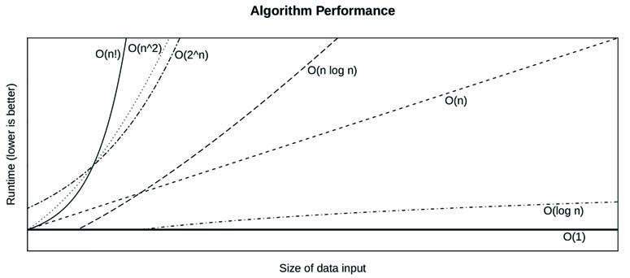
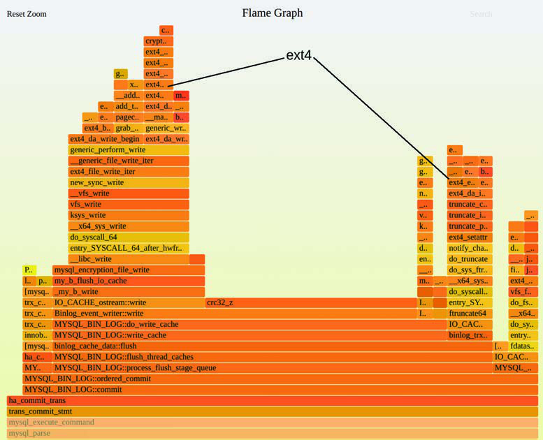
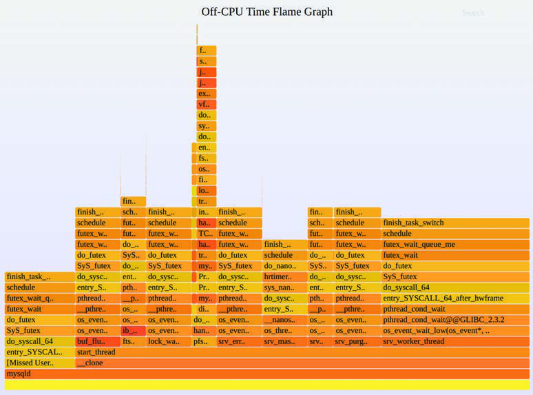
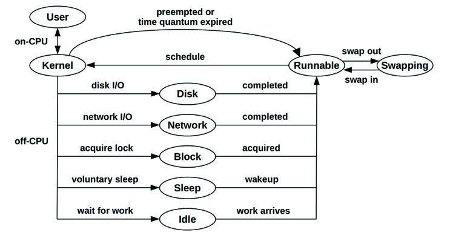
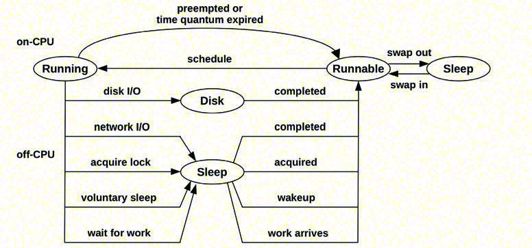

# 第 5 章 应用程序 (Applications)

性能调优最好在最接近工作执行的地方进行：在应用程序中。这些程序包括数据库、Web 服务器、应用服务器、负载均衡器、文件服务器等。后续章节将从应用程序消耗的资源角度（CPU、内存、文件系统、磁盘和网络）来探讨它们。本章则侧重于应用程序层面。

应用程序本身可能变得极其复杂，尤其是在涉及多个组件的分布式环境中。对应用程序内部的研究通常属于应用开发者的范畴，可能包括使用第三方内省（introspection）工具。对于研究系统性能的人员来说，应用性能分析包括配置应用程序以最佳利用系统资源、刻画应用程序如何使用系统的特征，以及分析常见的病态情况。

本章的学习目标是：

- 描述性能调优目标。
- 熟悉性能改进技术，包括多线程编程、哈希表和非阻塞 I/O。
- 理解常见的锁定和同步原语。
- 理解不同编程语言带来的挑战。
- 遵循线程状态分析方法论。
- 执行 CPU 和 Off-CPU 剖析。
- 执行系统调用分析，包括追踪进程执行。
- 意识到堆栈跟踪（stack trace）的陷阱：缺失符号和堆栈。

本章将讨论应用程序基础知识、应用性能基础、编程语言和编译器、通用应用性能分析策略以及基于系统的应用可观测性工具。

## 5.1 应用程序基础 (Application Basics)

在深入研究应用性能之前，你应该熟悉应用程序的角色、其基本特征以及其在行业中的生态系统。这构成了你理解应用活动的上下文，也为你提供了了解常见性能问题和调优的机会，并为进一步研究提供了途径。为了了解这些背景，请尝试回答以下问题：

- **功能**：应用程序的角色是什么？是数据库服务器、Web 服务器、负载均衡器、文件服务器还是对象存储？
- **操作**：应用程序处理哪些请求，或者执行哪些操作？数据库处理查询（和命令），Web 服务器处理 HTTP 请求，等等。这可以作为一种速率进行测量，用于衡量负载和容量规划。
- **性能要求**：运行该应用程序的公司是否有服务水平目标（SLO）（例如，99.9% 的请求延迟 < 100 毫秒）？
- **CPU 模式**：应用程序是作为用户级还是内核级软件实现的？大多数应用程序是用户级的，作为一或多个进程执行，但有些是作为内核服务实现的（例如 NFS），BPF 程序也是内核级的。
- **配置**：应用程序是如何配置的，为什么要这样配置？这些信息可以在配置文件中或通过管理工具找到。检查是否更改了任何与性能相关的可调参数，包括缓冲区大小、缓存大小、并行性（进程或线程）以及其他选项。
- **主机**：什么托管了应用程序？服务器还是云实例？CPU、内存拓扑、存储设备等是什么？它们的限制是什么？
- **指标**：是否提供应用指标，如操作速率？它们可能由捆绑工具或第三方工具、通过 API 请求或通过处理操作日志提供。
- **日志**：应用程序创建哪些操作日志？可以启用哪些日志？日志中提供哪些性能指标（包括延迟）？例如，MySQL 支持慢查询日志，为每个慢于特定阈值的查询提供有价值的性能细节。
- **版本**：应用程序是否为最新版本？在最近版本的发布说明中是否提到了性能修复或改进？
- **错误（Bugs）**：该应用程序是否有错误数据库？你所运行的版本有哪些“性能”错误？如果你当前遇到性能问题，请搜索错误数据库，看看以前是否发生过类似情况，是如何调查的，以及还涉及哪些内容。
- **源代码**：应用程序是否开源？如果是，可以通过剖析器（profilers）和追踪器（tracers）识别的代码路径进行研究，从而潜在地获得性能收益。你也许能够自己修改应用代码以提高性能，并将你的改进提交给上游，以便包含在官方应用程序中。
- **社区**：该应用程序是否有分享性能发现的社区？社区可能包括论坛、博客、互联网中继聊天（IRC）频道、其他聊天频道（如 Slack）、聚会（meetups）和会议。聚会和会议经常在线发布幻灯片和视频，这些在多年后都是有用的资源。它们可能还有一名社区经理，负责分享社区更新和新闻。
- **书籍**：是否有关于该应用程序和/或其性能的书籍？它们是好书吗（例如，由专家编写、实用/可操作、充分利用读者时间、及时更新等）？
- **专家**：该应用程序公认的性能专家是谁？了解他们的名字可以帮助你找到他们编写的资料。

无论来源如何，你的目标都是从高层次理解应用程序——它做什么，如何运行，以及表现如何。一个非常有用的资源（如果你能找到的话）是说明应用程序内部结构的**功能图**。

接下来的章节将涵盖其他应用基础知识：设定目标、优化常见情况、可观测性和 Big O 表示法。

### 5.1.1 目标 (Objectives)

性能目标为你性能分析工作提供了方向，并帮助你选择要执行的活动。如果没有明确的目标，性能分析就有可能变成一种随机的“钓鱼远征”。

对于应用性能，你可以从应用程序执行哪些操作（如前所述）以及性能目标是什么开始。目标可能是：

- **延迟（Latency）**：低或一致的应用程序响应时间。
- **吞吐量（Throughput）**：高应用程序操作率或数据传输率。
- **资源利用率**：给定应用工作负载下的效率。
- **价格**：提高性能/价格比，降低计算成本。

如果能使用源自业务或服务质量要求的指标对这些目标进行量化，那就更好了。例如：

- 平均应用请求延迟为 5 毫秒。
- 95% 的请求在 100 毫秒或更短的时间内完成。
- 消除延迟离群值：零请求超过 1,000 毫秒。
- 在给定大小的服务器上，最大吞吐量至少为每秒 10,000 个应用请求[^1]。
- 在每秒 10,000 个应用请求的情况下，平均磁盘利用率低于 50%。

一旦选定了目标，你就可以针对该目标的限制因素开展工作。对于延迟，限制因素可能是磁盘或网络 I/O；对于吞吐量，可能是 CPU 使用情况。本章和其他章节中的策略将帮助你识别它们。

对于基于吞吐量的目标，请注意，并非所有操作在性能或成本方面都是平等的。如果目标是特定的操作速率，那么指定它们是什么类型的操作也很重要。这可以是基于预期或测量的负载分布。

5.2 节“应用性能技术”描述了改进应用性能的常用方法。其中一些可能对一个目标有意义，但对另一个目标则不然；例如，选择较大的 I/O 大小可能会以增加延迟为代价来提高吞吐量。在确定哪些主题最适用时，请记住你追求的目标。

#### Apdex

一些公司使用目标应用性能指数（ApDex 或 Apdex）作为目标和监控指标。它可以更好地传达客户体验，首先涉及将客户事件分类为“满意”、“可容忍”或“令人沮丧”。然后使用以下公式计算 Apdex [Apdex 20]：

$$Apdex = (满意 + 0.5 \times 可容忍 + 0 \times 令人沮丧) / 总事件$$

生成的 Apdex 范围从 0（没有满意的客户）到 1（所有满意的客户）。

### 5.1.2 优化常见情况 (Optimize the Common Case)

软件内部可能很复杂，具有许多不同的代码路径 and 行为。如果你浏览源代码，这一点可能会尤为明显：应用程序通常有数万行代码，而操作系统内核则高达数十万行。随机选择要优化的区域可能会涉及大量工作，但收益却微乎其微。

一种有效提高应用性能的方法是找到生产工作负载下最常用的代码路径，并从改进该路径开始。如果应用程序是 CPU 绑定的（CPU-bound），那可能意味着经常在 CPU 上运行的代码路径。如果应用程序是 I/O 绑定的（I/O-bound），你应该寻找经常导致 I/O 的代码路径。这些可以通过应用程序的分析和剖析来确定，包括研究堆栈跟踪（stack traces）和火焰图（flame graphs），这在后面的章节中会涵盖。应用可观测性工具也可能提供理解常见情况的更高层上下文。

### 5.1.3 可观测性 (Observability)

正如我在本书许多章节中重申的那样，最大的性能收益可能来自于消除不必要的工作。

当根据性能选择应用程序时，这一事实有时会被忽视。如果基准测试显示应用程序 A 比应用程序 B 快 10%，那么选择应用程序 A 可能很有诱惑力。然而，如果应用程序 A 是不透明的，而应用程序 B 提供了一套丰富的可观测性工具，那么从长远来看，应用程序 B 极有可能成为更好的选择。这些可观测性工具使得观察和消除不必要的工作、以及更好地理解和调优活跃工作成为可能。通过增强的可观测性获得的性能提升可能会使最初 10% 的性能差异显得微不足道。选择语言和运行时也是如此：例如选择成熟且拥有许多可观测性工具的 Java 或 C，还是选择一种新语言。

### 5.1.4 Big O 表示法 (Big O Notation)

Big O 表示法常作为计算机科学科目讲授，用于分析算法的复杂性，并建模它们在输入数据集规模扩大时的表现。O 指的是函数的阶数（Order），描述其增长率。这种表示法帮助程序员在开发应用程序时挑选更高效和高性能的算法 [Knuth 76][Knuth 97]。

常见的 Big O 表示法和算法示例如表 5.1 所示。

**表 5.1 Big O 表示法示例**

| 表示法 | 示例 |
| :--- | :--- |
| **O(1)** | 布尔测试 |
| **O(log n)** | 已排序数组的二分搜索 |
| **O(n)** | 链表的线性搜索 |
| **O(n log n)** | 快速排序（平均情况） |
| **O(n^2)** | 冒泡排序（平均情况） |
| **O(2^n)** | 分解质因数；指数增长 |
| **O(n!)** | 旅行商问题的暴力破解 |

这种表示法允许程序员估算不同算法的加速效果，确定哪些代码区域将带来最大的改进。例如，对于搜索一个包含 100 个项的已排序数组，线性搜索和二分搜索之间的差异是 21 倍（100 / log(100)）。

这些算法的性能如图 5.1 所示，展示了它们随规模变化的趋势。


**图 5.1 不同算法的运行时间与输入规模的关系**

这种分类有助于系统性能分析师理解某些算法在规模扩大时表现会非常糟糕。当应用程序被推向服务比以往更多的用户或数据对象时，可能会出现性能问题，此时像 $O(n^2)$ 这样的算法可能会开始变得病态。解决方法可能是开发者使用更高效的算法，或者对群体进行不同的分区。

Big O 表示法确实忽略了每种算法产生的一些恒定计算成本。在 $n$（输入数据大小）较小的情况下，这些成本可能会占据主导地位。

## 5.2 应用性能技术 (Application Performance Techniques)

本节描述了一些常用的改进应用性能的技术：选择 I/O 大小、缓存、缓冲、轮询、并发和并行、非阻塞 I/O 以及处理器绑定。请参阅应用程序文档以了解使用了其中的哪些技术，以及任何其他的应用特定功能。

### 5.2.1 选择 I/O 大小 (Selecting an I/O Size)

与执行 I/O 相关的成本可能包括初始化缓冲区、执行系统调用、模式或上下文切换、分配内核元数据、检查进程特权和限制、将地址映射到设备、执行内核和驱动程序代码以交付 I/O，以及最后释放元数据和缓冲区。“初始化税”对小 I/O 和大 I/O 都是一样要付出的。为了提高效率，每次 I/O 传输的数据越多越好。

增加 I/O 大小是应用程序提高吞吐量的常用策略。考虑到任何固定的每 I/O 成本，将 128 KB 作为一个单一 I/O 传输通常比作为 128 个 1 KB 的 I/O 传输效率高得多。尤其是旋转磁盘 I/O，由于寻道时间的原因，历史上一直具有较高的每 I/O 成本。

当应用程序不需要较大的 I/O 大小时，也会有缺点。执行 8 KB 随机读取的数据库在 128 KB 磁盘 I/O 大小下可能运行得更慢，因为 120 KB 的数据传输是被浪费的。这引入了 I/O 延迟，可以通过选择更接近应用程序请求大小的较小 I/O 大小来降低延迟。不必要的大 I/O 大小也会浪费缓存空间。

### 5.2.2 缓存 (Caching)

操作系统使用缓存来提高文件系统读取性能和内存分配性能；应用程序出于类似原因也经常使用缓存。与其总是执行昂贵的操作，不如将常用操作的结果存储在本地缓存中以备将来使用。一个例子是数据库缓冲区缓存，它存储来自常用数据库查询的数据。

部署应用程序时的一项常见任务是确定提供了哪些缓存（或可以启用哪些缓存），然后配置其大小以适应系统。

虽然缓存提高了读取性能，但其存储空间通常也用作缓冲区（buffers）以提高写入性能。

### 5.2.3 缓冲 (Buffering)

为了提高写入性能，数据可以在发送到下一层之前在缓冲区中合并。这增加了 I/O 大小和操作效率。根据写入的类型，它也可能增加写入延迟，因为缓冲区的第一次写入在被发送之前会等待后续的写入。

环形缓冲区（或循环缓冲区）是一种固定大小的缓冲区，可用于组件之间的连续传输，这些组件对缓冲区进行异步操作。它可以使用开始和结束指针来实现，每个组件在追加或删除数据时可以移动这些指针。

### 5.2.4 轮询 (Polling)

轮询是一种技术，系统通过在一个循环中检查事件状态（并在检查之间暂停）来等待事件发生。当工作量很少时，轮询存在一些潜在的性能问题：

- 重复检查导致的昂贵 CPU 开销。
- 事件发生到下一次轮询检查之间的高延迟。

在这是一个性能问题的地方，应用程序也许能够改变其行为来“监听”事件的发生，这样可以立即通知应用程序并执行所需的例程。

#### poll() 系统调用

有一个 `poll(2)` 系统调用用于检查文件描述符的状态，其功能与轮询类似，尽管它是基于事件的，因此不会遭受轮询的性能开销。

`poll(2)` 接口支持以数组形式提供多个文件描述符，这要求应用程序在事件发生时扫描数组以找到相关的文件描述符。这种扫描是 $O(n)$ 的（见 5.1.4 节“Big O 表示法”），其开销在规模扩大时可能成为性能问题。Linux 上的一个替代方案是 `epoll(2)`，它可以避免扫描，因此是 $O(1)$ 的。在 BSD 上，等效的是 `kqueue(2)`。

### 5.2.5 并发和并行 (Concurrency and Parallelism)

尽管这些术语经常互换使用，但它们指的是不同的概念（如图 5.2 所示）：

- **并发（Concurrency）**：指两个或多个进程（或线程）正在取得进展（执行）的情况。这包括其中一个执行正在暂停而另一个正在执行的切换。
- **并行（Parallelism）**：指两个或多个进程（或线程）在同一时刻执行的情况。这通常需要多核心处理器。

应用程序可以通过多进程或多线程来利用并发和并行。


**图 5.2 并发与并行的对比**

多线程通常用于利用多核心处理器，因为线程比进程更轻量（上下文切换开销更低），并且由于共享内存而更容易通信。然而，多线程也引入了通过**同步原语（synchronization primitives）**进行协调的需求，以保护共享数据（如计数器、列表、哈希表等）。这些原语包括：

- **互斥锁（Mutexes）**：一种用于确保只有一个线程可以访问共享资源的机制。如果一个线程试图获取一个已被占用的互斥锁，它通常会被置于睡眠状态，直到锁被释放。
- **自旋锁（Spinlocks）**：类似于互斥锁，但如果锁已被占用，线程会在循环中“自旋”（消耗 CPU）直到锁变得可用。自旋锁适用于锁持有时间极短的情况，因为睡眠 and 唤醒线程的开销可能大于自旋的开销。
- **自适应互斥锁（Adaptive Mutexes）**：一种混合方案，它首先自旋一小段时间，如果锁仍未释放，则切换到睡眠。Linux 的互斥锁实现通常包含自适应自旋逻辑 [Zijlstra 09][Molnar 20]。
- **读写锁（Read/Write Locks）**：允许多个读者并发访问，但在有写者时只允许一个写者访问。
- **读-复制-更新（RCU）**：一种用于读取频繁数据结构的无锁技术。读者可以并发运行而不受阻碍，而写者则通过创建数据的新版本并在所有读者完成对旧版本的引用后才将其删除来执行更新 [Linux 20e]。

同步原语本身可能成为性能瓶颈，这种情况称为**锁竞争（lock contention）**。

#### 锁竞争

当多个线程尝试同时获取同一个锁时，会导致锁竞争。这会限制并行度，使得即使有更多的 CPU 核心可用，吞吐量也无法提升。

解决锁竞争的技术包括：

- **细粒度锁定（Fine-grained locking）**：将一个大型锁拆分为多个小型锁，每个锁保护数据的一个子集。例如，与其锁定整个哈希表，不如为哈希表的每个桶（bucket）提供一个锁（见图 5.2[^2]）。
- **无锁数据结构**：使用不依赖显式锁定的算法和指令（如原子操作）。
- **减少关键段（critical sections）**：减少持有锁的时间。


**图 5.2 哈希表中的每个桶（bucket）使用独立的锁，以支持并行处理。**

### 5.2.6 非阻塞 I/O (Non-Blocking I/O)

默认情况下，许多 I/O 操作是**阻塞的（blocking）**：发起 I/O 的线程会暂停执行，直到操作完成。

**非阻塞 I/O** 允许线程在 I/O 进行时继续执行其他工作。这通常涉及：

- 发起异步请求。
- 稍后通过轮询（如 `epoll`）或接收信号来检查结果。

这种技术对于高性能网络服务器至关重要，它允许少量的线程处理数千个并发连接（例如 Nginx、Node.js）。

### 5.2.7 处理器绑定 (Processor Binding)

处理器绑定（或 CPU 亲和性，CPU affinity）是将进程或线程配置为仅在特定的 CPU（或一组 CPU）上运行。这可以提高性能，因为它：

- **提高缓存命中率**：线程留在同一个 CPU 上，增加了重用 CPU 缓存（L1/L2）的机会。
- **减少内存延迟**：在 NUMA 系统上，可以将线程绑定到物理上靠近其分配内存的 CPU 核心上。

处理器绑定通常使用 `taskset(1)` 工具或通过 `sched_setaffinity(2)` 系统调用来配置。

## 5.3 编程语言 (Programming Languages)

应用程序编写所使用的编程语言及其编译器或运行时对性能有着显著的影响。本节简要介绍不同类别的语言及其性能特征。

### 5.3.1 编译型语言 (Compiled Languages)

编译型语言（如 C、C++、Rust 和 Go）由编译器转换为机器代码，由处理器直接执行。

性能优势包括：

- **直接执行**：没有解释或虚拟机的开销。
- **编译器优化**：编译器可以在构建时执行复杂的优化（如内联、循环展开、向量化）。

从性能分析的角度来看，编译型语言通常是最容易观察的，因为它们的符号（函数名）和堆栈跟踪通常可以由标准的系统剖析器（如 `perf`）直接读取。然而，如果编译器优化（如省略帧指针 `-fomit-frame-pointer`）被启用，可能会导致堆栈跟踪受损（见 5.6.2 节“缺失堆栈”）。

### 5.3.2 解释型语言 (Interpreted Languages)

解释型语言（如 Python、Ruby 和 PHP 的早期版本）在运行时由解释器程序读取并执行。

性能特征包括：

- **解释开销**：解释器必须在执行每一行代码时进行解析和处理，这比直接执行机器代码慢得多。
- **内省能力**：由于程序上下文在解释器中是可用的，因此通常可以轻松获得应用层面的指标。

根据解释器的不同，程序上下文可能作为解释器函数的参数可用，这可以通过动态追踪看到。另一种方法是检查进程的内存，前提是了解程序布局（例如，使用 Linux 的 `process_vm_readv(2)` 系统调用）。

通常，这些程序通过简单地添加打印语句和时间戳来进行研究。更严谨的性能分析并不常见，因为解释型语言通常最初就不是为了高性能应用而选择的。

### 5.3.3 虚拟机 (Virtual Machines)

语言虚拟机（也称为进程虚拟机）是模拟计算机的软件。一些编程语言，包括 Java 和 Erlang，通常使用虚拟机（VM）执行，这些虚拟机为它们提供了一个平台无关的编程环境。应用程序被编译为虚拟机指令集（字节码），然后由虚拟机执行。这允许编译后的对象具有可移植性，前提是目标平台上有一个可用的虚拟机来运行它们。

字节码可以由语言虚拟机以不同方式执行。Java HotSpot 虚拟机支持通过解释执行，也支持 **JIT（即时）编译**，它将字节码编译为机器代码以便由处理器直接执行。这提供了编译代码的性能优势，以及虚拟机的可移植性。

虚拟机通常是语言类型中最难观察的。当程序在 CPU 上执行时，可能已经经过了多阶段的编译或解释，关于原始程序的信息可能无法轻易获得。性能分析通常集中在语言虚拟机提供的工具集上（其中许多提供 USDT 探针）以及第三方工具上。

### 5.3.4 垃圾回收 (Garbage Collection)

一些语言使用自动内存管理，分配的内存不需要被显式释放，而是留给异步的垃圾回收（GC）过程。虽然这使程序更易于编写，但也会带来一些缺点：

- **内存增长**：对应用程序内存使用的控制较少，当对象没有被自动识别为符合释放条件时，内存可能会增长。如果应用程序增长过大，可能会触及自身的限制或遇到系统分页（Linux 交换），严重损害性能。
- **CPU 成本**：GC 通常会间歇性运行，涉及在内存中搜索或扫描对象。这会消耗 CPU 资源，在短时间内减少应用程序可用的资源。随着应用程序内存的增长，GC 的 CPU 消耗也可能增长。在某些情况下，这可能达到 GC 持续消耗整个 CPU 的程度。
- **延迟离群值**：应用程序执行可能会在 GC 执行时暂停，导致偶尔出现被 GC 中断的高延迟应用响应[^3]。这取决于 GC 类型：停止世界（stop-the-world）、增量式或并发式。

GC 是性能调优的常见目标，以降低 CPU 成本和减少延迟离群值的发生。例如，Java VM 提供了许多可调参数来设置 GC 类型、GC 线程数、最大堆大小、目标堆空闲率等。

如果调优无效，问题可能是应用程序创建了过多的垃圾，或存在引用泄露。这些是需要应用开发者解决的问题。一种方法是尽可能减少对象的分配，以减轻 GC 负载。显示对象分配及其代码路径的可观测性工具可用于寻找消除目标。

## 5.4 方法论 (Methodology)

本节介绍应用分析和调优的方法论。用于分析的工具要么在这里介绍，要么从其他章节引用。方法论总结在表 5.2 中。

**表 5.2 应用性能方法论**

| 章节 | 方法论 | 类型 |
| :--- | :--- | :--- |
| 5.4.1 | CPU 剖析 | 观测分析 |
| 5.4.2 | Off-CPU 剖析 | 观测分析 |
| 5.4.3 | 系统调用分析 | 观测分析 |
| 5.4.4 | USE 方法 | 观测分析 |
| 5.4.5 | 线程状态分析 | 观测分析 |
| 5.4.6 | 锁分析 | 观测分析 |
| 5.4.7 | 静态性能调优 | 观测分析、调优 |
| 5.4.8 | 分布式追踪 | 观测分析 |

请参阅第 2 章“方法论”以了解其中一些方法的介绍，以及其他通用的方法论：对于应用程序，尤其要考虑 CPU 剖析、工作负载特征分析和钻取分析（drill-down analysis）。另请参阅后续关于系统资源分析和虚拟化的章节。

这些方法论可以单独遵循，也可以结合使用。我的建议是按照表中列出的顺序尝试它们。

除了这些，还应针对特定应用程序及其开发语言寻找自定义分析技术。这些技术可能会考虑应用程序的逻辑行为（包括已知问题），并带来一些快速的性能提升。

### 5.4.1 CPU 剖析 (CPU Profiling)

CPU 剖析是应用性能分析的一项重要活动，在第 6 章“CPU”中从 6.5.4 节“剖析”开始介绍。本节总结了 CPU 剖析和 CPU 火焰图，并描述了 CPU 剖析如何用于一些 Off-CPU 分析。

Linux 有许多 CPU 剖析器，包括 `perf(1)` 和 `profile(8)`（在 5.5 节“可观测性工具”中总结），它们都使用定时采样。这些剖析器运行在内核模式，可以捕获内核和用户栈，产生混合模式的剖析。这为 CPU 使用情况提供了（几乎）完整的可见性。

应用程序和运行时有时会提供运行在用户模式的自带剖析器，它们无法显示内核 CPU 使用情况。这些基于用户的剖析器可能会对 CPU 时间产生偏差，因为它们可能无法意识到内核何时取消了应用程序的调度，并且无法对其进行核算。我总是从基于内核的剖析器（`perf(1)` 和 `profile(8)`）开始，并将基于用户的剖析器作为最后的手段。

基于采样的剖析器会产生许多样本：Netflix 的典型 CPU 剖析以 49 Hz 的频率在 32 个 CPU 上收集堆栈跟踪，持续 30 秒：这将产生总计 47,040 个样本。为了理清这些样本，剖析器通常提供不同的方式来汇总或可视化它们。一种常用于采样堆栈跟踪的可视化工具被称为**火焰图（flame graphs）**，它是由我发明的。

#### CPU 火焰图

第 1 章展示了一个 CPU 火焰图示例，图 2.15 展示了另一个不同的摘录。图 5.3 的示例包含了一个 `ext4` 注释以备后用。这些是混合模式火焰图，显示了用户和内核栈。

在火焰图中，每个矩形代表堆栈跟踪中的一个帧，y 轴显示代码流：从下往上显示当前函数及其祖先。帧的宽度与它在剖析中出现的比例成正比，x 轴的顺序没有意义（它是按字母顺序排序的）。你要寻找大的“平台”或“塔”——那是大部分 CPU 时间花费的地方。有关火焰图的更多细节，请参阅第 6 章“CPU”的 6.7.3 节“火焰图”。


**图 5.3 CPU 火焰图摘录**

在图 5.3 中，`crc32_z()` 是在 CPU 上运行最多的函数，占据了该摘录的大约 40%（中间的平台）。左侧的一座塔显示了进入内核的系统调用 `write(2)` 路径，总计占据了大约 30% 的 CPU 时间。通过快速浏览，我们将这两个确定为可能的低级优化目标。浏览代码路径的祖先（向下看）可以揭示高级目标：在这种情况下，所有的 CPU 使用都来自 `MYSQL_BIN_LOG::commit()` 函数。

我并不知道 `crc32_z()` 或 `MYSQL_BIN_LOG::commit()` 的具体作用（尽管我可以大概猜到）。CPU 剖析揭示了应用程序的内部运作，除非你是应用开发者，否则你不需要知道这些函数具体是什么。你需要对它们进行研究，以制定可行的性能改进方案。

作为一个例子，我针对 `MYSQL_BIN_LOG::commit()` 进行了互联网搜索，并迅速找到了描述 MySQL 二进制日志（用于数据库恢复和复制）的文章，以及如何对其进行调优或完全禁用。对 `crc32_z()` 的快速搜索显示它是来自 `zlib` 的校验和函数。也许有更新、更快的 `zlib` 版本？处理器是否有优化的 CRC 指令，`zlib` 是否在使用它？MySQL 甚至需要计算 CRC 吗，或者可以将其关闭？有关这种思维方式的更多信息，请参阅第 2 章“方法论”的 2.5.20 节“性能格言”。

5.5.1 节“perf”总结了使用 `perf(1)` 生成 CPU 火焰图的说明。

#### Off-CPU 足迹

CPU 剖析不仅可以显示 CPU 使用情况。你还可以寻找其他 Off-CPU 问题类型的证据。例如，磁盘 I/O 在某种程度上可以通过其用于文件系统访问和块 I/O 初始化的 CPU 使用情况看出来。这就像发现熊的脚印：你没有看到熊，但你发现了一只熊的存在。

通过浏览 CPU 火焰图，你可能会发现文件系统 I/O、磁盘 I/O、网络 I/O、锁竞争等的证据。图 5.3 高亮显示了 `ext4` 文件系统 I/O 作为一个例子。如果你浏览足够多的火焰图，你就会熟悉要寻找的函数名：内核 TCP 函数的“tcp_*”，内核块 I/O 函数的“blk_*”等。以下是针对 Linux 系统的一些建议搜索词：

- **“ext4”**（或“btrfs”、“xfs”、“zfs”）：寻找文件系统操作。
- **“blk”**：寻找块 I/O。
- **“tcp”**：寻找网络 I/O。
- **“utex”**：显示锁竞争（“mutex” 或 “futex”）。
- **“alloc”** 或 **“object”**：显示执行内存分配的代码路径。

这种方法只能识别这些活动的存在，而不能识别其量级。CPU 火焰图显示的是 CPU 使用的量级，而不是在 Off-CPU 阻塞上花费的时间。要直接测量 Off-CPU 时间，你可以使用接下来介绍的 Off-CPU 分析，尽管测量它的开销通常更大。

### 5.4.2 Off-CPU 分析 (Off-CPU Analysis)

Off-CPU 分析是对当前未在 CPU 上运行的线程的研究：这种状态被称为 **Off-CPU**。它包括线程阻塞的所有原因：磁盘 I/O、网络 I/O、锁竞争、显式睡眠、调度器抢占等。对这些原因及其引起的性能问题的分析通常涉及各种各样的工具。Off-CPU 分析是分析所有这些原因的一种方法，并且可以由单一的 Off-CPU 剖析工具提供支持。

Off-CPU 剖析可以通过不同方式执行，包括：

- **采样**：收集处于 Off-CPU 状态的线程的基于定时器的样本，或者干脆是所有线程（称为挂钟采样，wallclock sampling）。
- **调度器追踪**：对内核 CPU 调度器进行插桩，以测量线程处于 Off-CPU 状态的持续时间，并将这些时间与 Off-CPU 堆栈跟踪一起记录。当线程处于 Off-CPU 状态时，堆栈跟踪不会改变（因为它没有运行来改变它），因此对于每个阻塞事件，堆栈跟踪只需要读取一次。
- **应用插桩**：一些应用程序具有针对常见阻塞代码路径（如磁盘 I/O）的内置插桩。此类插桩可能包含应用特定的上下文。虽然方便且有用，但这种方法通常对其他 Off-CPU 事件（调度器抢占、页错误等）是盲目的。

前两种方法更可取，因为它们适用于所有应用程序并能看到所有 Off-CPU 事件；但是，它们带来了巨大的开销。以 49 Hz 采样在例如 8 CPU 系统上应该只消耗微不足道的开销，但 Off-CPU 采样必须对线程池而不是 CPU 池进行采样。同一个系统可能有 10,000 个线程，其中大多数是空闲的，因此对它们进行采样会使开销增加 1,000 倍[^4]（想象一下对一个 10,000 CPU 的系统进行 CPU 剖析）。调度器追踪也可能消耗显著的开销，因为同一个系统每秒可能有 100,000 个或更多的调度器事件。

调度器追踪是现在常用的技术，基于我自己的工具，如 `offcputime(8)`（5.5.3 节“offcputime”）。我使用的一种优化是仅记录超过极短持续时间的 Off-CPU 事件，这减少了样本数量[^5]。我还使用 BPF 在内核上下文中聚合堆栈，而不是将所有样本发送到用户空间，从而进一步降低开销。尽管这些技术很有帮助，但在生产环境中使用 Off-CPU 剖析时仍应小心，并在使用前在测试环境中评估开销。

#### Off-CPU 时间火焰图

Off-CPU 剖析可以可视化为 Off-CPU 时间火焰图。图 5.4 展示了一个 30 秒的系统范围 Off-CPU 剖析，我已将其放大以显示一个正在处理命令（查询）的 MySQL 服务器线程。


**图 5.4 Off-CPU 时间火焰图（局部放大）**

大部分 Off-CPU 时间是在 `fsync()` 代码路径和 `ext4` 文件系统中。鼠标指针悬停在一个函数 `Prepared_statement::execute()` 上，以演示底部的状态行显示了该函数中的总 Off-CPU 时间：总计 3.97 秒。解释方法与 CPU 火焰图类似：寻找最宽的塔并首先调查那些。

通过同时使用 On-CPU 和 Off-CPU 火焰图，你可以完整地了解代码路径在 On-CPU 和 Off-CPU 上的时间分布：这是一个强大的工具。我通常将它们显示为单独的火焰图。虽然可以将它们合并为单个火焰图（我称之为“冷热火焰图”），但效果并不理想：CPU 时间会被挤压成一根细长的塔，因为冷热火焰图的大部分都在显示等待时间。这是因为 Off-CPU 线程数可能比运行中的 On-CPU 线程数多两个数量级，导致冷热火焰图由 99% 的 Off-CPU 时间组成，而这些时间（除非经过过滤）大部分是等待时间。

#### 等待时间 (Wait Time)

除了收集 Off-CPU 剖析的开销外，另一个问题是解释它们：它们可能被等待时间所主导。这是线程等待工作所花费的时间。图 5.5 展示了同样的 Off-CPU 时间火焰图，但没有放大到有趣的线程。


**图 5.5 Off-CPU 时间火焰图（完整）**

现在，该火焰图中的大部分时间都在类似的 `pthread_cond_wait()` 和 `futex()` 代码路径中：这些是正在等待工作的线程。可以在火焰图中看到线程函数：从右到左有 `srv_worker_thread()`、`srv_purge_coordinator_thread()`、`srv_monitor_thread()` 等等。

寻找真正重要的 Off-CPU 时间有几种技术：

- **放大（或过滤）应用请求处理函数**，因为我们最关心的是处理应用请求期间的 Off-CPU 时间。对于 MySQL 服务器，这是 `do_command()` 函数。搜索 `do_command()` 然后放大，会产生类似于图 5.4 的火焰图。虽然这种方法很有效，但你需要知道在特定应用程序中要搜索哪个函数。
- **在收集期间使用内核过滤器**来排除不感兴趣的线程状态。其有效性取决于内核；在 Linux 上，匹配 `TASK_UNINTERRUPTIBLE` 可以专注于许多有趣的 Off-CPU 事件，但也会排除一些。

你有时会发现应用阻塞的代码路径正在等待其他事情，例如锁。要进一步钻取，你需要知道为什么锁的持有者花了这么长时间才释放它。除了 5.4.7 节“锁分析”中描述的锁分析外，一种通用技术是对唤醒者（waker）事件进行插桩。这是一项高级活动：请参阅《BPF Performance Tools》[Gregg 19] 的第 14 章，以及 BCC 中的 `wakeuptime(8)` 和 `offwaketime(8)` 工具。

5.5.3 节“offcputime”展示了使用 BCC 的 `offcputime(8)` 生成 Off-CPU 火焰图的说明。除了调度器事件外，系统调用事件是研究应用程序的另一个有用目标。

### 5.4.3 系统调用分析 (Syscall Analysis)

系统调用（syscalls）可以被插桩，用于研究基于资源的性能问题。其意图是查明系统调用时间花在了哪里，包括系统调用的类型以及调用它的原因。

系统调用分析的目标包括：

- **新进程追踪**：通过追踪 `execve(2)` 系统调用，你可以记录新进程的执行，并分析短寿命进程的问题。参见 5.5.5 节“execsnoop”中的 `execsnoop(8)` 工具。
- **I/O 剖析**：追踪 `read(2)`/`write(2)`/`send(2)`/`recv(2)` 及其变体，研究它们的 I/O 大小、标志和代码路径，将帮助你识别次优 I/O 问题，例如大量的小 I/O。参见 5.5.7 节“bpftrace”中的 `bpftrace` 工具。
- **内核时间分析**：当系统显示大量的内核 CPU 时间（通常报告为“%sys”）时，对系统调用进行插桩可以定位原因。参见 5.5.6 节“syscount”中的 `syscount(8)` 工具。系统调用解释了大部分但非全部的内核 CPU 时间；例外情况包括页错误、异步内核线程和中断。

系统调用是文档齐全的 API（man 手册），这使得它们成为易于研究的事件源。它们也是与应用程序同步调用的，这意味着从系统调用收集堆栈跟踪将显示负责的应用程序代码路径。此类堆栈跟踪可以可视化为火焰图。

### 5.4.4 USE 方法 (USE Method)

正如在第 2 章“方法论”中介绍并在后续章节中应用的那样，USE 方法检查所有硬件资源的利用率（utilization）、饱和度（saturation）和错误（errors）。许多应用性能问题可以通过这种方式解决，即证明某个资源已成为瓶颈。

USE 方法也可以应用于软件资源。如果你能找到显示应用程序内部组件的功能图，请考虑每个软件资源的利用率、饱和度和错误指标，看看哪些是有意义的。

例如，应用程序可能使用工作线程池来处理请求，并有一个等待处理的请求队列。将此视为一种资源，那么三个指标可以定义如下：

- **利用率**：在一个间隔期间，忙于处理请求的平均线程数占总线程数的百分比。例如，50% 意味着平均有一半的线程在处理请求。
- **饱和度**：一个间隔期间，请求队列的平均长度。这显示了有多少请求在排队等待工作线程。
- **错误**：由于任何原因被拒绝或失败的请求。

你的任务是查明这些指标如何测量。它们可能已经由应用程序在某处提供，或者可能需要使用其他工具（如动态追踪）来添加或测量。

排队系统（如本例）也可以使用排队理论进行研究（参见第 2 章“方法论”）。

对于另一个例子，考虑文件描述符。系统可能会施加限制，使得这些成为一种有限资源。三个指标可能如下：

- **利用率**：正在使用的文件描述符数量占限制的百分比。
- **饱和度**：取决于操作系统的行为：如果线程在等待文件描述符时阻塞，这可以是等待此资源的阻塞线程数。
- **错误**：分配错误，例如 `EMFILE`，“打开的文件过多”。

为你的应用程序组件重复此练习，并跳过任何不适用的指标。这个过程可以帮助你制定一个在进入其他方法论之前检查应用健康的简短清单。

### 5.4.5 线程状态分析 (Thread State Analysis)

这是我对每个性能问题使用的第一个方法论，但它在 Linux 上也是一项高级活动。其目标是在高层次上识别应用程序线程在哪里花费时间，这可以直接解决某些问题，并为其他问题的调查提供方向。你可以通过将每个应用程序的线程时间划分为若干个有意义的状态来实现这一点。

至少有两个线程状态：**On-CPU**（在 CPU 上）和 **Off-CPU**（不在 CPU 上）。你可以使用标准指标和工具（如 `top(1)`）识别线程是否处于 On-CPU 状态，并根据需要进行 CPU 剖析或 Off-CPU 分析（见 5.4.1 节“CPU 剖析”和 5.4.2 节“Off-CPU 分析”）。状态越多，此方法论就越有效。

#### 九种状态

这是我选出的九种线程状态列表，旨在提供比之前的两种状态（On-CPU 和 Off-CPU）更好的分析起点：

- **User**：在用户模式下处于 On-CPU 状态。
- **Kernel**：在内核模式下处于 On-CPU 状态。
- **Runnable**：Off-CPU 状态，正在等待轮到自己上 CPU。
- **Swapping (anonymous paging)**：Runnable 状态，但因匿名页换入而阻塞。
- **Disk I/O**：等待块设备 I/O：读/写，数据/文本页换入。
- **Net I/O**：等待网络设备 I/O：套接字读/写。
- **Sleeping**：自愿睡眠。
- **Lock**：等待获取同步锁（等待其他人）。
- **Idle**：等待工作。

这个九状态模型如图 5.6 所示。


**图 5.6 九状态线程模型**

通过减少除 Idle 之外的每个状态的时间，可以提高应用程序请求的性能。在其他条件相同的情况下，这意味着应用程序请求具有较低的延迟，且应用程序可以处理更多负载。

一旦确定了线程在哪些状态下花费时间，就可以进一步调查它们：

- **User 或 Kernel**：剖析可以确定哪些代码路径正在消耗 CPU，包括在锁上自旋花费的时间。见 5.4.1 节“CPU 剖析”。
- **Runnable**：处于此状态的时间意味着应用程序想要更多的 CPU 资源。检查整个系统的 CPU 负载，以及为应用程序存在的任何 CPU 限制（例如，资源控制）。
- **Swapping (anonymous paging)**：应用程序缺乏可用的主内存可能导致交换延迟。检查整个系统的内存使用情况以及存在的任何内存限制。详情请参阅第 7 章“内存”。
- **Disk**：此状态包括直接磁盘 I/O 和页错误。要进行分析，请参阅 5.4.3 节“系统调用分析”、第 8 章“文件系统”和第 9 章“磁盘”。工作负载特征分析可以帮助解决许多磁盘 I/O 问题；检查文件名、I/O 大小和 I/O 类型。
- **Network**：此状态适用于在网络 I/O（发送/接收）期间阻塞的时间，但不包括监听新连接（那是 Idle 时间）。要进行分析，请参阅 5.4.3 节“系统调用分析”、5.5.7 节“bpftrace”及其“I/O 剖析”标题，以及第 10 章“网络”。工作负载特征分析对于网络 I/O 问题也很有用；检查主机名、协议和吞吐量。
- **Sleeping**：分析睡眠的原因（代码路径）和持续时间。
- **Lock**：识别锁、持有锁的线程，以及持有者持有锁这么长时间的原因。原因可能是持有者被另一个锁阻塞，这需要进一步展开分析。这是一项高级活动，通常由对应用程序及其锁定层次结构有深入了解的软件开发者执行。我开发了一个 BCC 工具来辅助此类分析：`offwaketime(8)`（包含在 BCC 中），它显示阻塞堆栈跟踪以及唤醒者。

由于应用程序通常等待工作的方式，你经常会发现 Network I/O 和 Lock 状态下的时间实际上是 Idle 时间。应用程序工作线程可能会通过等待网络 I/O 以获取下一个请求（例如 HTTP keep-alive）或等待条件变量（Lock 状态）被唤醒以处理工作来实现空闲（Idle）。

以下总结了如何在 Linux 上测量这些线程状态。

#### Linux 线程状态

图 5.7 展示了一个基于内核线程状态的 Linux 线程状态模型。

内核线程状态基于内核 `task_struct` 的 `state` 成员：Runnable 是 `TASK_RUNNING`，Disk 是 `TASK_UNINTERRUPTIBLE`，Sleep 是 `TASK_INTERRUPTIBLE`。这些状态由包括 `ps(1)` 和 `top(1)` 在内的工具使用单字母代码显示：分别为 R、D 和 S。（还有更多状态，例如被调试器停止，我在这里没有包含。）


**图 5.7 Linux 线程状态**

虽然这为进一步分析提供了一些线索，但它远未将时间划分为前面描述的九种状态。需要更多信息：例如，Runnable 可以使用 `/proc` 或 `getrusage(2)` 统计数据拆分为用户时间和内核时间。

其他内核通常提供更多状态，使得此方法论更易于应用。我最初在 Solaris 内核上开发并使用了此方法论，受到其微状态核算（microstate accounting）功能的启发，该功能将线程时间记录在八个不同的状态中：用户、系统、陷阱（trap）、文本错误（text fault）、数据错误（data fault）、锁、睡眠和运行队列（调度延迟）。这些并不完全匹配我的理想状态，但它们是一个更好的起点。

我将讨论在 Linux 上使用的三种方法：基于线索的、Off-CPU 分析和直接测量。

##### 基于线索 (Clue-Based)
你可以先使用常用的操作系统工具（如 `pidstat(1)` 和 `vmstat(8)`）来推测线程状态时间可能花费在哪里。感兴趣的工具和列如下：

- **User**：`pidstat(1)` “%usr”（此状态直接测量）。
- **Kernel**：`pidstat(1)` “%system”（此状态直接测量）。
- **Runnable**：`vmstat(8)` “r”（系统范围）。
- **Swapping**：`vmstat(8)` “si” 和 “so”（系统范围）。
- **Disk I/O**：`pidstat(1) -d` “iodelay”（包括交换状态）。
- **Network I/O**：`sar(1) -n DEV` “rxkB/s” 和 “txkB/s”（系统范围）。
- **Sleeping**：不易获得。
- **Lock**：`perf(1) top`（可能直接识别自旋锁时间）。
- **Idle**：不易获得。

其中一些统计数据是系统范围的。如果你通过 `vmstat(8)` 发现存在系统范围的交换速率，你可以使用更深层的工具调查该状态，以确认应用程序是否受到影响。这些工具在以下章节中涵盖。

##### Off-CPU 分析
由于许多状态都是 Off-CPU 的（除 User 和 Kernel 之外的所有状态），你可以应用 Off-CPU 分析来确定线程状态。见 5.4.2 节“Off-CPU 分析”。

##### 直接测量 (Direct Measurement)
按线程状态准确测量线程时间如下：

- **User**：用户模式 CPU 时间可以从许多工具以及 `/proc/PID/stat` 和 `getrusage(2)` 中获得。`pidstat(1)` 将其报告为 %usr。
- **Kernel**：内核模式 CPU 时间也在 `/proc/PID/stat` 和 `getrusage(2)` 中。`pidstat(1)` 将其报告为 %system。
- **Runnable**：这由内核 `schedstats` 功能以纳秒为单位跟踪，并通 过 `/proc/PID/schedstat` 暴露。它也可以使用追踪工具测量，但会有一些开销，包括 `perf(1)` 的 `sched` 子命令和 BCC 的 `runqlat(8)`，两者都在第 6 章“CPU”中涵盖。
- **Swapping**：以纳秒为单位的交换（匿名页换入）时间可以通过延迟核算（delay accounting）测量，详见第 4 章“可观测性工具”的 4.3.3 节“延迟核算”，其中包含一个示例工具 `getdelays.c`。追踪工具也可用于对交换延迟进行插桩。
- **Disk**：`pidstat(1) -d` 显示 “iodelay”，即进程因块 I/O 和交换而延迟的时钟滴答数；如果没有系统范围的交换（如 `vmstat(8)` 所报告），你可以断定任何 iodelay 都是 I/O 状态。延迟核算和其他核算功能（如果启用）也提供块 I/O 时间，例如 `iotop(8)` 所使用的。你也可以使用来自 BCC 的 `biotop(8)` 等追踪工具。
- **Network**：可以使用 BCC 和 bpftrace 等追踪工具调查网络 I/O，包括用于 TCP 网络 I/O 的 `tcptop(8)` 工具。应用程序也可能具有跟踪 I/O 时间（网络和磁盘）的插桩。
- **Sleeping**：可以使用追踪器和事件（包括 `syscalls:sys_enter_nanosleep` 追踪点）检查进入自愿睡眠的时间。我的 `naptime.bt` 工具追踪这些睡眠并打印 PID 和持续时间 [Gregg 19][Gregg 20b]。
- **Lock**：可以使用追踪工具调查锁时间，包括来自 BCC 的 `klockstat(8)`，以及来自 `bpf-perf-tools-book` 仓库的用于 pthread 互斥锁的 `pmlock.bt` 和 `pmheld.bt`，以及用于内核互斥锁的 `mlock.bt` 和 `mheld.bt`。
- **Idle**：追踪工具可用于对处理等待工作的应用程序代码路径进行插桩。

有时应用程序可能看起来完全处于睡眠状态：它们保持 Off-CPU 阻塞，没有 I/O 或其他事件速率。为了确定应用程序线程处于什么状态，可能有必要使用 `pstack(1)` 或 `gdb(1)` 等调试器来检查线程堆栈跟踪，或者从 `/proc/PID/stack` 文件中读取它们。请注意，这类调试器可能会暂停目标应用程序并导致其自身的性能问题：在尝试在生产环境中使用它们之前，请了解如何使用它们及其风险。

### 5.4.6 锁分析 (Lock Analysis)

对于多线程应用程序，锁可能成为瓶颈，抑制并行性和可伸缩性。单线程应用程序可能受到内核锁（例如文件系统锁）的限制。

锁可以通过以下方式进行分析：

- 检查竞争（contention）。
- 检查过长的持有时间（hold times）。

前者可以识别当前是否存在问题。过长的持有时间不一定是眼前的问题，但随着并行负载的增加，未来可能会成为问题。对于每一项，尝试识别锁的名称（如果存在）以及导致使用它的代码路径。

虽然有专门用于锁分析的工具，但有时仅通过 CPU 剖析就能解决问题。对于自旋锁，竞争表现为 CPU 使用率，可以通过对堆栈跟踪进行 CPU 剖析轻松识别。对于自适应互斥锁，竞争通常涉及一些自旋，这也可以通过堆栈跟踪的 CPU 剖析来识别。在这种情况下，请注意 CPU 剖析只能给出故事的一部分，因为线程在等待锁时可能已经阻塞并睡眠了。见 5.4.1 节“CPU 剖析”。

有关 Linux 上的特定锁分析工具，请参见 5.5.7 节“bpftrace”。

### 5.4.7 静态性能调优 (Static Performance Tuning)

静态性能调优侧重于已配置环境的问题。对于应用程序性能，请检查静态配置的以下方面：

- 运行的是应用程序的哪个版本，其依赖项是什么？是否有更新版本？它们的发布说明是否提到了性能改进？
- 是否有已知的性能问题？是否有列出这些问题的错误数据库？
- 应用程序是如何配置的？
- 如果其配置或调优不同于默认值，原因是什么？（是基于测量和分析，还是基于猜测？）
- 应用程序是否使用了对象缓存？它是如何定量的？
- 应用程序是否并发运行？它是如何配置的（例如线程池大小）？
- 应用程序是否运行在特殊模式下？（例如，调试模式可能已被启用并降低了性能，或者应用程序可能是调试构建版本而非发布构建版本。）
- 应用程序使用哪些系统库？它们的版本是什么？
- 应用程序使用哪种内存分配器？
- 应用程序是否配置为在其堆中使用大页面（large pages）？
- 应用程序是否经过编译？编译器的哪个版本？使用了哪些编译器选项和优化？64 位？
- 原生代码是否包含高级指令？（是否应该包含？）（例如，包含 Intel SSE 的 SIMD/向量指令。）
- 应用程序是否遇到了错误，现在是否处于降级模式？或者它是否配置错误并始终运行在降级模式？
- 对于 CPU、内存、文件系统、磁盘或网络使用，是否存在系统强加的限制或资源控制？（这些在云计算中很常见。）

回答这些问题可能会揭示被忽视的配置选择。

### 5.4.8 分布式追踪 (Distributed Tracing)

在分布式环境中，一个应用程序可能由运行在独立系统上的服务组成。虽然每个服务都可以像其自身是一个微型应用程序一样进行研究，但也有必要将分布式应用程序作为一个整体进行研究。这需要新的方法论和工具，通常使用分布式追踪来执行。

分布式追踪涉及在每个服务请求上记录信息，然后稍后合并这些信息进行研究。跨越多个服务的每个应用请求随后可以分解为其依赖请求，并识别出导致高应用延迟或错误的服务。

收集的信息可以包括：

- 应用请求的唯一标识符（外部请求 ID）。
- 有关其在依赖层次结构中位置的信息。
- 开始和结束时间。
- 错误状态。

分布式追踪的一个挑战是生成的日志数据量：每个应用请求都有多个条目。一种解决方案是执行基于头部的采样（head-based sampling），即在请求开始（“头部”）时决定是否进行采样（“追踪”）：例如，每万个请求追踪一个。这足以分析大部分请求的性能，但由于数据有限，可能难以分析间歇性错误或离群值。一些分布式追踪器是基于尾部的（tail-based），即首先捕获所有事件，然后决定保留什么，或许基于延迟和错误。

一旦识别出有问题的服务，就可以使用其他方法论和工具对其进行更详细的分析。

## 5.5 可观测性工具 (Observability Tools)

本节介绍基于 Linux 操作系统的应用性能可观测性工具。使用策略请参见前一节。

本节中的工具列在表 5.3 中，并说明了这些工具在本章中的用途。

**表 5.3 Linux 应用程序可观测性工具**

| 章节 | 工具 | 描述 |
| :--- | :--- | :--- |
| 5.5.1 | perf | CPU 剖析、CPU 火焰图、系统调用追踪 |
| 5.5.2 | profile | 使用定时采样的 CPU 剖析 |
| 5.5.3 | offcputime | 使用调度器追踪的 Off-CPU 剖析 |
| 5.5.4 | strace | 系统调用追踪 |
| 5.5.5 | execsnoop | 新进程追踪 |
| 5.5.6 | syscount | 系统调用计数 |
| 5.5.7 | bpftrace | 信号追踪、I/O 剖析、锁分析 |

这些工具从 CPU 剖析工具开始，然后是追踪工具。许多追踪工具是基于 BPF 的，并使用 BCC 和 bpftrace 前端（见第 15 章）；它们是：`profile(8)`、`offcputime(8)`、`execsnoop(8)` 和 `syscount(8)`。有关每个工具的完整参考资料，请参阅其文档（包括其 man 手册）。

此外，还应寻找表中未列出的特定于应用程序的性能工具。后续章节涵盖了面向资源的工具：CPU、内存、磁盘等，这些对应用程序分析也很有用。

下面许多工具都会收集应用程序堆栈跟踪。如果你发现堆栈跟踪包含 “[unknown]” 帧或显得异常短，请参见 5.6 节“陷阱”，其中描述了常见问题并总结了解决方法。

### 5.5.1 perf

`perf(1)` 是标准的 Linux 剖析器，是一个多功能工具。它在第 13 章“perf”中进行了解释。由于 CPU 剖析对应用程序分析至关重要，这里包含了一个使用 `perf(1)` 进行 CPU 剖析的简要说明。第 6 章“CPU”更详细地介绍了 CPU 剖析和火焰图。

#### CPU 剖析
下面使用 `perf(1)` 在所有 CPU 上（-a）以 49 Hz 的频率（-F 49：每秒采样数）对堆栈跟踪进行采样（-g），持续 30 秒，然后列出样本：

```bash
# perf record -F 49 -a -g -- sleep 30
[ perf record: Woken up 1 times to write data ]
[ perf record: Captured and wrote 0.560 MB perf.data (2940 samples) ]
# perf script
mysqld 10441 [000] 64918.205722:   10101010 cpu-clock:pppH:
        5587b59bf2f0 row_mysql_store_col_in_innobase_format+0x270 (/usr/sbin/mysqld)
        5587b59c3951 [unknown] (/usr/sbin/mysqld)
        5587b58803b3 ha_innobase::write_row+0x1d3 (/usr/sbin/mysqld)
        5587b47e10c8 handler::ha_write_row+0x1a8 (/usr/sbin/mysqld)
        5587b49ec13d write_record+0x64d (/usr/sbin/mysqld)
        5587b49ed219 Sql_cmd_insert_values::execute_inner+0x7f9 (/usr/sbin/mysqld)
        5587b45dfd06 Sql_cmd_dml::execute+0x426 (/usr/sbin/mysqld)
        5587b458c3ed mysql_execute_command+0xb0d (/usr/sbin/mysqld)
        5587b4591067 mysql_parse+0x377 (/usr/sbin/mysqld)
        5587b459388d dispatch_command+0x22cd (/usr/sbin/mysqld)
        5587b45943b4 do_command+0x1a4 (/usr/sbin/mysqld)
        5587b46b22c0 [unknown] (/usr/sbin/mysqld)
        5587b5cfff0a [unknown] (/usr/sbin/mysqld)
        7fbdf66a9669 start_thread+0xd9 (/usr/lib/x86_64-linux-gnu/libpthread-2.30.so)
[...]
```

此剖析中有 2,940 个堆栈样本；此处仅包含一个堆栈。`perf(1)` 的 `script` 子命令会打印先前记录的剖析（perf.data 文件）中的每个堆栈样本。`perf(1)` 还有一个 `report` 子命令，用于将剖析汇总为代码路径层次结构。剖析也可以可视化为 CPU 火焰图。

#### CPU 火焰图
CPU 火焰图在 Netflix 已实现自动化，操作人员和开发者可以通过浏览器 UI 请求。它们可以完全使用开源软件构建，包括以下命令中提到的 GitHub 仓库。对于前面显示的图 5.3 CPU 火焰图，使用的命令是：

```bash
# perf record -F 49 -a -g -- sleep 10; perf script --header > out.stacks
# git clone https://github.com/brendangregg/FlameGraph; cd FlameGraph
# ./stackcollapse-perf.pl < ../out.stacks | ./flamegraph.pl --hash > out.svg
```

生成的 `out.svg` 文件随后可以在 Web 浏览器中加载。

`flamegraph.pl` 为不同的语言提供了自定义调色板：例如，对于 Java 应用程序，尝试 `--color=java`。运行 `flamegraph.pl -h` 查看所有选项。

#### 系统调用追踪
`perf(1)` 的 `trace` 子命令默认追踪系统调用，是 `perf(1)` 版本的 `strace(1)`（见 5.5.4 节“strace”）。例如，追踪一个 MySQL 服务器进程：

```bash
# perf trace -p $(pgrep mysqld)
         ? (         ): mysqld/10120  ... [continued]: futex())
= -1 ETIMEDOUT (Connection timed out)
     0.014 ( 0.002 ms): mysqld/10120 futex(uaddr: 0x7fbddc37ed48, op: WAKE|
PRIVATE_FLAG, val: 1)           = 0
     0.023 (10.103 ms): mysqld/10120 futex(uaddr: 0x7fbddc37ed98, op: WAIT_BITSET|
PRIVATE_FLAG, utime: 0x7fbdc9cfcbc0, val3: MATCH_ANY) = -1 ETIMEDOUT (Connection
timed out)
[...]
```

仅包含了少量输出行，显示了当各个 MySQL 线程等待工作时调用的 `futex(2)`（这些调用在图 5.5 的 Off-CPU 时间火焰图中占据了主导地位）。

`perf(1)` 的优势在于它使用按 CPU 分配的缓冲区来降低开销，这使得它比当前的 `strace(1)` 实现要安全得多。它还可以进行系统范围的追踪，而 `strace(1)` 仅限于一组进程（通常是单个进程），并且它可以追踪系统调用以外的事件。然而，`perf(1)` 的系统调用参数转换不如 `strace(1)` 丰富；下面是一行来自 `strace(1)` 的输出供对比：

```text
[pid 10120] futex(0x7fbddc37ed98, FUTEX_WAIT_BITSET_PRIVATE, 0, {tv_sec=445110,
tv_nsec=427289364}, FUTEX_BITSET_MATCH_ANY) = -1 ETIMEDOUT (Connection timed out)
```

`strace(1)` 版本展开了 `utime` 结构体。目前正在开展工作，使 `perf(1) trace` 能使用 BPF 来改进参数的“美化”。最终目标是使 `perf(1) trace` 能够完全替代 `strace(1)`。（有关 `strace(1)` 的更多信息，请参见 5.5.4 节“strace”。）

#### 内核时间分析
由于 `perf(1) trace` 显示了在系统调用中花费的时间，它有助于解释监控工具中常见的系统 CPU 时间，尽管从摘要（summary）开始比从逐个事件的输出开始要容易。`perf(1) trace` 使用 `-s` 来汇总系统调用：

```text
# perf trace -s -p $(pgrep mysqld)
 mysqld (14169), 225186 events, 99.1%

   syscall            calls    total       min       avg       max      stddev
                               (msec)    (msec)    (msec)    (msec)        (%)
   --------------- -------- --------- --------- --------- ---------     ------
   sendto             27239   267.904     0.002     0.010     0.109      0.28%
   recvfrom           69861   212.213     0.001     0.003     0.069      0.23%
   ppoll              15478   201.183     0.002     0.013     0.412      0.75%
[...]
```

输出显示了每个线程的系统调用计数和计时。

前面显示的 `futex(2)` 调用如果单独看并不是很有趣，而且在任何繁忙的应用程序上运行 `perf(1) trace` 都会产生海量的输出。先从这个摘要开始，然后使用带有过滤器的 `perf(1) trace` 来检查感兴趣的系统调用类型会更有帮助。

#### I/O 剖析
I/O 系统调用特别有趣，前面的输出中已经看到了一些。使用过滤器（-e）追踪 `sendto(2)` 调用：

```bash
# perf trace -e sendto -p $(pgrep mysqld)
     0.000 ( 0.015 ms): mysqld/14097 sendto(fd: 37<socket:[833323]>, buff:
0x7fbdac072040, len: 12664, flags: DONTWAIT) = 12664
     0.451 ( 0.019 ms): mysqld/14097 sendto(fd: 37<socket:[833323]>, buff:
0x7fbdac072040, len: 12664, flags: DONTWAIT) = 12664
     0.624 ( 0.011 ms): mysqld/14097 sendto(fd: 37<socket:[833323]>, buff:
0x7fbdac072040, len: 11, flags: DONTWAIT) = 11
     0.788 ( 0.010 ms): mysqld/14097 sendto(fd: 37<socket:[833323]>, buff:
0x7fbdac072040, len: 11, flags: DONTWAIT) = 11
[...]
```

输出显示了两个 12664 字节的发送，随后是两个 11 字节的发送，全部带有 `DONTWAIT` 标志。如果我看到大量的小型发送，我可能会考虑是否可以通过合并它们或避免使用 `DONTWAIT` 标志来提高性能。

虽然 `perf(1) trace` 可用于某些 I/O 剖析，但我经常希望更深入地挖掘参数并以自定义方式对其进行汇总。例如，这个 `sendto(2)` 追踪显示了文件描述符（37）和套接字编号（833323），但我更愿意看到套接字类型、IP 地址和端口。对于此类自定义追踪，你可以切换到 5.5.7 节中的 `bpftrace`。

### 5.5.2 profile

`profile(8)`[^6] 是来自 BCC（第 15 章）的基于定时器的 CPU 剖析器。它使用 BPF 通过在内核上下文中聚合堆栈跟踪来降低开销，并且仅将唯一的堆栈及其计数传递给用户空间。

下面的 `profile(8)` 示例以 49 Hz 的频率在所有 CPU 上采样，持续 10 秒：

```text
# profile -F 49 10
Sampling at 49 Hertz of all threads by user + kernel stack for 10 secs.
[...]

    SELECT_LEX::prepare(THD*)
    Sql_cmd_select::prepare_inner(THD*)
    Sql_cmd_dml::prepare(THD*)
    Sql_cmd_dml::execute(THD*)
    mysql_execute_command(THD*, bool)
    Prepared_statement::execute(String*, bool)
    Prepared_statement::execute_loop(String*, bool)
    mysqld_stmt_execute(THD*, Prepared_statement*, bool, unsigned long, PS_PARAM*)
    dispatch_command(THD*, COM_DATA const*, enum_server_command)
    do_command(THD*)
    [unknown]
    [unknown]
    start_thread
    -                mysqld (10106)
        13
[...]
```

此输出中仅包含一个堆栈跟踪，显示 `SELECT_LEX::prepare()` 在该祖先路径下被采样到处于 On-CPU 状态 13 次。

`profile(8)` 在第 6 章“CPU”的 6.6.14 节中进一步讨论，该节列出了其各种选项，并包含了从其输出生成 CPU 火焰图的说明。

### 5.5.3 offcputime

`offcputime(8)`[^7] 是一个 BCC 和 bpftrace 工具（第 15 章），用于汇总线程阻塞且处于 Off-CPU 状态的时间，并显示堆栈跟踪以解释原因。它支持 Off-CPU 分析（5.4.2 节“Off-CPU 分析”）。`offcputime(8)` 是 `profile(8)` 的对应物：两者合起来可以显示线程在系统上花费的所有时间。

下面展示了来自 BCC 的 `offcputime(8)`，追踪持续 5 秒：

```text
# offcputime 5
Tracing off-CPU time (us) of all threads by user + kernel stack for 5 secs.
[...]

    finish_task_switch
    schedule
    jbd2_log_wait_commit
    jbd2_complete_transaction
    ext4_sync_file
    vfs_fsync_range
    do_fsync
    __x64_sys_fdatasync
    do_syscall_64
    entry_SYSCALL_64_after_hwframe
    fdatasync
    IO_CACHE_ostream::sync()
    MYSQL_BIN_LOG::sync_binlog_file(bool)
    MYSQL_BIN_LOG::ordered_commit(THD*, bool, bool)
    MYSQL_BIN_LOG::commit(THD*, bool)
    ha_commit_trans(THD*, bool, bool)
    trans_commit(THD*, bool)
    mysql_execute_command(THD*, bool)
    Prepared_statement::execute(String*, bool)
    Prepared_statement::execute_loop(String*, bool)
    mysqld_stmt_execute(THD*, Prepared_statement*, bool, unsigned long, PS_PARAM*)
    dispatch_command(THD*, COM_DATA const*, enum_server_command)
    do_command(THD*)
    [unknown]
    [unknown]
    start_thread
    -                mysqld (10441)
        352107
[...]
```

输出显示了唯一的堆栈跟踪及其在 Off-CPU 状态下花费的时间（以微秒为单位）。这个特定的堆栈通过 `MYSQL_BIN_LOG::sync_binlog_file()` 的代码路径显示了 `ext4` 文件系统同步操作，在此追踪期间总计 352 毫秒。

为了提高效率，`offcputime(8)` 在内核上下文中聚合这些堆栈，并仅将唯一的堆栈发送到用户空间。它还仅记录超过阈值的 Off-CPU 持续时间的堆栈跟踪，默认为 1 微秒，可以使用 `-m` 选项进行调优。

还有一个 `-M` 选项用于设置记录堆栈的最大时间。为什么我们会想要排除持续时间长的堆栈？这可以是过滤掉不感兴趣的堆栈的一种有效方法：在循环中等待工作并阻塞一秒或多秒的线程。尝试使用 `-M 900000`，以排除长于 900 毫秒的持续时间。

#### Off-CPU 时间火焰图
尽管只显示唯一的堆栈，前面示例的完整输出仍超过 200,000 行。为了理清它，可以将其可视化为 Off-CPU 时间火焰图。图 5.4 展示了一个示例。生成这些图的命令与 `profile(8)` 类似：

```bash
# git clone https://github.com/brendangregg/FlameGraph; cd FlameGraph
# offcputime -f 5 | ./flamegraph.pl --bgcolors=blue \
    --title="Off-CPU Time Flame Graph" > out.svg
```

这一次我将背景颜色设置为蓝色，作为这不仅是常用的 CPU 火焰图，而且是一个 Off-CPU 火焰图的视觉提醒。

### 5.5.4 strace

`strace(1)` 命令是 Linux 系统调用追踪器[^8]。它可以追踪系统调用，为每个调用打印一行摘要，还可以对系统调用进行计数并打印报告。

例如，追踪 PID 为 1884 的系统调用：

```bash
$ strace -ttt -T -p 1884
1356982510.395542 close(3)              = 0 <0.000267>
1356982510.396064 close(4)              = 0 <0.000293>
1356982510.396617 ioctl(255, TIOCGPGRP, [1975]) = 0 <0.000019>
1356982510.396980 rt_sigprocmask(SIG_SETMASK, [], NULL, 8) = 0 <0.000024>
1356982510.397288 rt_sigprocmask(SIG_BLOCK, [CHLD], [], 8) = 0 <0.000014>
1356982510.397365 wait4(-1, [{WIFEXITED(s) && WEXITSTATUS(s) == 0}], WSTOPPED|
WCONTINUED, NULL) = 1975 <0.018187>
[...]
```

此调用中的选项 include（有关所有选项请参见 `strace(1)` man 手册）：

- **-ttt**：打印第一列的时间戳（自纪元以来的秒数，微秒分辨率）。
- **-T**：打印最后一列（<time>），即系统调用的持续时间（以秒为单位，微秒分辨率）。
- **-p PID**：追踪此进程 ID。也可以指定一个命令，以便 `strace(1)` 启动并追踪它。

此处未使用的其他选项包括用于追踪子线程的 `-f`，以及用于将 `strace(1)` 输出写入给定文件名的 `-o filename`。

从输出中可以看到 `strace(1)` 的一个特性——将系统调用参数翻译成人类可读的形式。这对于理解 `ioctl(2)` 调用特别有用。

`-c` 选项可用于汇总系统调用活动。下面的示例调用并追踪一个命令（`dd(1)`），而不是附加到一个 PID：

```bash
$ strace -c dd if=/dev/zero of=/dev/null bs=1k count=5000k
5120000+0 records in
5120000+0 records out
5242880000 bytes (5.2 GB) copied, 140.722 s, 37.3 MB/s
% time     seconds  usecs/call     calls    errors syscall
------ ----------- ----------- --------- --------- ----------------
 51.46    0.008030           0   5120005           read
 48.54    0.007574           0   5120003           write
  0.00    0.000000           0        20        13 open
[...]
------ ----------- ----------- --------- --------- ----------------
100.00    0.015604              10240092        19 total
```

输出以 `dd(1)` 的三行开始，随后是 `strace(1)` 摘要。各列为：

- **time**：显示系统 CPU 时间花费在哪里的百分比。
- **seconds**：总系统 CPU 时间（以秒为单位）。
- **usecs/call**：平均每次调用的系统 CPU 时间（以微秒为单位）。
- **calls**：系统调用次数。
- **syscall**：系统调用名称。

#### strace 开销
**警告：当前版本的 `strace(1)` 采用基于断点的追踪，通过 Linux 的 `ptrace(2)` 接口实现。它为所有系统调用的进入和返回设置断点（即使使用 `-e` 选项仅选择了部分调用）。这是侵入性的，系统调用频率高的应用程序可能会发现其性能下降一个数量级。** 为了说明这一点，以下是同样的没有 `strace(1)` 的 `dd(1)` 命令：

```bash
$ dd if=/dev/zero of=/dev/null bs=1k count=5000k
5120000+0 records in
5120000+0 records out
5242880000 bytes (5.2 GB) copied, 1.91247 s, 2.7 GB/s
```

`dd(1)` 在最后一行包含了吞吐量统计数据：通过对比，我们可以得出结论：`strace(1)` 使 `dd(1)` 慢了 73 倍。这是一个特别严重的情况，因为 `dd(1)` 执行了极高频率的系统调用。

根据应用需求，这种风格的追踪可能在短时间内用于确定正在调用的系统调用类型。如果开销不是那么大的问题，`strace(1)` 会更有用。其他追踪器，包括 `perf(1)`、Ftrace、BCC 和 bpftrace，通过使用缓冲追踪大大降低了追踪开销，事件被写入共享的内核环形缓冲区，用户级追踪器定期读取该缓冲区。这减少了用户和内核上下文之间的上下文切换，降低了开销。

`strace(1)` 的未来版本可能会通过成为 `perf(1) trace` 子命令（前面在 5.5.1 节“perf”中描述过）的别名来解决其开销问题。其他基于 BPF 的高性能 Linux 系统调用追踪器包括：英特尔的 `vltrace` [Intel 18]，以及微软推出的 Windows ProcMon 工具的 Linux 版本 [Microsoft 20]。

### 5.5.5 execsnoop

`execsnoop(8)`[^9] 是一个 BCC 和 bpftrace 工具，用于在全系统范围内追踪新进程的执行。它可以发现消耗 CPU 资源的短寿命进程问题，还可用于调试软件执行，包括应用程序启动脚本。

来自 BCC 版本的示例输出：

```text
# execsnoop
PCOMM            PID    PPID   RET ARGS
oltp_read_write  13044  18184    0 /usr/share/sysbench/oltp_read_write.lua --db-
driver=mysql --mysql-password=... --table-size=100000 run
oltp_read_write  13047  18184    0 /usr/share/sysbench/oltp_read_write.lua --db-
driver=mysql --mysql-password=... --table-size=100000 run
sh               13050  13049    0 /bin/sh -c command -v debian-sa1 > /dev/null &&
debian-sa1 1 1 -S XALL
debian-sa1       13051  13050    0 /usr/lib/sysstat/debian-sa1 1 1 -S XALL
sa1              13051  13050    0 /usr/lib/sysstat/sa1 1 1 -S XALL
sadc             13051  13050    0 /usr/lib/sysstat/sadc -F -L -S DISK 1 1 -S XALL
/var/log/sysstat
[...]
```

我在我的数据库系统上运行了它，看看是否能发现任何有趣的事情，结果确实有：前两行显示一个读写微基准测试仍在运行，循环启动 `oltp_read_write` 命令——我竟然不小心让它跑了几天！由于数据库正在处理不同的工作负载，从显示 CPU 和磁盘负载的其他系统指标中并不容易发现。`oltp_read_write` 之后的几行显示了 `sar(1)` 正在收集系统指标。

`execsnoop(8)` 通过追踪 `execve(2)` 系统调用来工作，并为每个调用打印一行摘要。该工具支持一些选项，包括用于时间戳的 `-t`。

第 1 章展示了 `execsnoop(8)` 的另一个示例。我还为 bpftrace 发布了一个 `threadsnoop(8)` 工具，用于通过 `libpthread` 的 `pthread_create()` 追踪线程的创建。

### 5.5.6 syscount

`syscount(8)`[^10] 是一个 BCC 和 bpftrace 工具，用于在全系统范围内对系统调用进行计数。

来自 BCC 版本的示例输出：

```text
# syscount
Tracing syscalls, printing top 10... Ctrl+C to quit.
^C[05:01:28]
SYSCALL                   COUNT
recvfrom                 114746
sendto                    57395
ppoll                     28654
futex                       953
io_getevents                 55
bpf                          33
rt_sigprocmask               12
epoll_wait                   11
select                        7
nanosleep                     6

Detaching...
```

这显示最频繁的系统调用是 `recvfrom(2)`，在追踪期间被调用了 114,746 次。你可以使用其他追踪工具进一步探索，以检查系统调用参数、延迟和调用堆栈追踪。例如，你可以使用带有 `-e recvfrom` 过滤器的 `perf(1) trace`，或者使用 bpftrace 对 `syscalls:sys_enter_recvfrom` 追踪点进行插桩。请参见第 13 至 15 章中的追踪器。

`syscount(8)` 还可以使用 `-P` 按进程进行计数：

```text
# syscount -P
Tracing syscalls, printing top 10... Ctrl+C to quit.
^C[05:03:49]
PID    COMM               COUNT
10106  mysqld            155463
13202  oltp_read_only.    61779
9618   sshd                  36
344    multipathd            13
13204  syscount-bpfcc        12
519    accounts-daemon        5
```

输出显示了进程和系统调用计数。

### 5.5.7 bpftrace

bpftrace 是一个基于 BPF 的追踪器，提供了一种高级编程语言，允许创建强大的单行命令和短脚本。它非常适合基于来自其他工具的线索进行自定义应用程序分析。

bpftrace 在第 15 章中进行了说明。本节展示了一些用于应用程序分析的示例。

#### 信号追踪
这个 bpftrace 单行命令追踪进程信号（通过 `kill(2)` 系统调用），显示源 PID 和进程名称，以及目标 PID 和信号编号：

```bash
# bpftrace -e 't:syscalls:sys_enter_kill { time("%H:%M:%S ");
    printf("%s (PID %d) send a SIG %d to PID %d\n",
    comm, pid, args->sig, args->pid); }'
Attaching 1 probe...
09:07:59 bash (PID 9723) send a SIG 2 to PID 9723
09:08:00 systemd-journal (PID 214) send a SIG 0 to PID 501
09:08:00 systemd-journal (PID 214) send a SIG 0 to PID 550
09:08:00 systemd-journal (PID 214) send a SIG 0 to PID 392
...
```

输出显示 bash shell 向自身发送信号 2 (Ctrl-C)，随后是 `systemd-journal` 向其他 PID 发送信号 0。信号 0 不做任何事：它通常用于根据系统调用返回值检查另一个进程是否依然存在。

这个单行命令对于调试奇怪的应用程序问题（如提前终止）很有用。包含时间戳是为了与监控软件中的性能问题进行交叉核对。追踪信号在 BCC 和 bpftrace 中也可作为独立的 `killsnoop(8)` 工具使用。

#### I/O 剖析
bpftrace 可用于以各种方式分析 I/O：检查大小、延迟、返回值和堆栈跟踪[^11]。例如，`recvfrom(2)` 系统调用在前面的示例中被频繁调用，可以使用 bpftrace 进一步检查。

以直方图形式显示 `recvfrom(2)` 缓冲区大小：

```text
# bpftrace -e 't:syscalls:sys_enter_recvfrom { @bytes = hist(args->size); }'
Attaching 1 probe...
^C

@bytes:
[4, 8)             40142 |@@@@@@@@@@@@@@@@@@@@@@@@@@@@@@@@@@@@@@@@@@@@@@@@@@@@|
[8, 16)             1218 |@                                                   |
[16, 32)           17042 |@@@@@@@@@@@@@@@@@@@@@@                              |
[16K, 32K)         19477 |@@@@@@@@@@@@@@@@@@@@@@@@@                           |
```

输出显示大约一半的大小非常小，在 4 到 7 字节之间，最大的大小在 16 到 32 KB 范围内。通过追踪系统调用退出追踪点，将此缓冲区大小直方图与实际接收到的字节数进行对比可能也很有用：

```bash
# bpftrace -e 't:syscalls:sys_exit_recvfrom { @bytes = hist(args->ret); }'
```

巨大的不匹配可能表明应用程序分配了比所需更大的缓冲区。（注意，这个 exit 单行命令将在直方图中包含大小为 -1 的系统调用错误。）

如果接收到的大小也显示出一些小型和一些大型 I/O，这可能也会影响系统调用的延迟，大型 I/O 花费的时间更长。要测量 `recvfrom(2)` 延迟，可以同时追踪系统调用的开始和结束，如下面的 bpftrace 程序所示。语法在第 15 章“BPF”的 15.2.4 节“编程”中进行了说明，该节最后为内核函数提供了一个类似的延迟直方图。

```text
# bpftrace -e 't:syscalls:sys_enter_recvfrom { @ts[tid] = nsecs; }
    t:syscalls:sys_exit_recvfrom /@ts[tid]/ {
    @usecs = hist((nsecs - @ts[tid]) / 1000); delete(@ts[tid]); }'
Attaching 2 probes...
^C
@usecs:
[0]                23280 |@@@@@@@@@@@@@@@@@@@@@@@@@@@@@                       |
[1]                40468 |@@@@@@@@@@@@@@@@@@@@@@@@@@@@@@@@@@@@@@@@@@@@@@@@@@@@|
[2, 4)               144 |                                                    |
[4, 8)             31612 |@@@@@@@@@@@@@@@@@@@@@@@@@@@@@@@@@@@@@@@@            |
[8, 16)               98 |                                                    |
[16, 32)              98 |                                                    |
[32, 64)           20297 |@@@@@@@@@@@@@@@@@@@@@@@@@@                          |
[64, 128)           5365 |@@@@@@                                              |
[128, 256)          5871 |@@@@@@@                                             |
[256, 512)           384 |                                                    |
[512, 1K)             16 |                                                    |
[1K, 2K)              14 |                                                    |
[2K, 4K)               8 |                                                    |
[8K, 16K)              1 |                                                    |
```

输出显示 `recvfrom(2)` 通常少于 8 微秒，在 32 到 256 微秒之间有一个较慢的模式。存在一些延迟离群值，最慢的达到了 8 到 16 毫秒的范围。

你可以继续进一步深入钻取。例如，输出映射声明（@usecs = ...）可以更改为：

- **@usecs[args->ret]**：按系统调用返回值分解，显示每个返回值的直方图。由于返回值是接收到的字节数，或者是 -1 表示错误，这种分解将确认较大的 I/O 大小是否导致了更高的延迟。
- **@usecs[ustack]**：按用户堆栈跟踪分解，显示每个代码路径的延迟直方图。

我还会考虑在第一个追踪点后添加一个过滤器，以便仅显示 MySQL 服务器，而不显示其他进程：

```bash
# bpftrace -e 't:syscalls:sys_enter_recvfrom /comm == "mysqld"/ { ...
```

你也可以添加过滤器，使其仅匹配延迟离群值或慢速模式。

#### 锁追踪
bpftrace 可以通过多种方式调查应用程序的锁竞争。对于典型的 pthread 互斥锁，可以使用 uprobes 来追踪 pthread 库函数：`pthread_mutex_lock()` 等；还可以使用追踪点来追踪管理锁阻塞的 `futex(2)` 系统调用。

我之前开发了用于插桩 pthread 库函数的 `pmlock(8)` 和 `pmheld(8)` bpftrace 工具，并已将其作为开源发布 [Gregg 20b]（另见 [Gregg 19] 的第 13 章）。例如，追踪 `pthread_mutex_lock()` 函数的持续时间：

```text
# pmlock.bt $(pgrep mysqld)
Attaching 4 probes...
Tracing libpthread mutex lock latency, Ctrl-C to end.
^C
[...]

@lock_latency_ns[0x7f37280019f0,
    pthread_mutex_lock+36
    THD::set_query(st_mysql_const_lex_string const&)+94
    Prepared_statement::execute(String*, bool)+336
    Prepared_statement::execute_loop(String*, bool, unsigned char*, unsigned char*...
    mysqld_stmt_execute(THD*, unsigned long, unsigned long, unsigned char*, unsign...
, mysqld]:
[1K, 2K)              47 |                                                    |
[2K, 4K)             945 |@@@@@@@@                                            |
[4K, 8K)            3290 |@@@@@@@@@@@@@@@@@@@@@@@@@@@@@@                      |
[8K, 16K)           5702 |@@@@@@@@@@@@@@@@@@@@@@@@@@@@@@@@@@@@@@@@@@@@@@@@@@@@|
```

此输出已截断，仅显示打印的许多堆栈之一。该堆栈显示通过 `THD::setquery()` 代码路径获取了锁地址 `0x7f37280019f0`，获取时间通常在 8 到 16 微秒范围内。

为什么这个锁花了这么长时间？`pmheld.bt` 通过追踪从加锁到解锁的持续时间，显示持有者的堆栈跟踪：

```text
# pmheld.bt $(pgrep mysqld)
Attaching 5 probes...
Tracing libpthread mutex held times, Ctrl-C to end.
^C
[...]

@held_time_ns[0x7f37280019f0,
    __pthread_mutex_unlock+0
    THD::set_query(st_mysql_const_lex_string const&)+147
    dispatch_command(THD*, COM_DATA const*, enum_server_command)+1045
    do_command(THD*)+544
    handle_connection+680
, mysqld]:
[2K, 4K)            3848 |@@@@@@@@@@@@@@@@@@@@@@@@@@@@@@@@@@@@@@@             |
[4K, 8K)            5038 |@@@@@@@@@@@@@@@@@@@@@@@@@@@@@@@@@@@@@@@@@@@@@@@@@@@@|
[32K, 64K)             1 |                                                    |
```

这显示了持有者的不同代码路径。

如果锁有一个符号名称，则打印它而不是地址。如果没有符号名称，你可以从堆栈跟踪中识别锁：这是 `THD::set_query()` 中指令偏移量为 147 处的一个锁。该函数的源代码显示它仅获取一个锁：`LOCK_thd_query`。

追踪锁确实会增加开销，且锁事件可能很频繁。请参阅第 4 章“可观测性工具”第 4.3.7 节“uprobes”中的 uprobes 开销详情。也许可以开发类似的基于内核 `futex` 函数 kprobes 的工具，从而稍微降低开销。另一种开销可以忽略不计的替代方法是使用 CPU 剖析。CPU 剖析通常开销很小，因为它受采样率限制，而沉重的锁竞争可能消耗足够的 CPU 周期，从而在 CPU 剖析中显示出来。

#### 应用程序内部
如果需要，你可以开发自定义工具来汇总应用程序内部情况。首先检查是否有 USDT 探针可用，或者是否可以使其可用（通常通过带有选项的重新编译）。如果无法使其可用或不足够，请考虑使用 uprobes。有关 bpftrace 以及 uprobes 和 USDT 的示例，请参阅第 4 章“可观测性工具”的 4.3.7 节 “uprobes” 和 4.3.8 节 “USDT”。4.3.8 节还描述了动态 USDT，这对于洞察 JIT 编译的软件可能是必要的，而 uprobes 可能无法对其进行插桩。

一个复杂的例子是 Java：uprobes 可以插桩 JVM 运行时（C++ 代码）和 OS 库，USDT 可以插桩高级 JVM 事件，而动态 USDT 可以放置在 Java 代码中以提供方法执行的洞察。

## 5.6 陷阱 (Gotchas)

在研究应用程序性能时，可能会遇到许多陷阱，包括解释器的性质、JIT 编译器的行为、自动内存管理的性质以及编译器优化的影响。此外，还存在与工具使用相关的陷阱，包括由 `strace(1)` 产生的巨大开销，以及导致堆栈跟踪受损的问题。本节重点讨论最后两个问题。

### 5.6.1 缺失符号 (Missing Symbols)

当剖析器（profiler）打印堆栈跟踪时，如果它无法将内存地址映射到函数名，它可能会打印类似 “[unknown]” 的内容。

这通常意味着符号表已被剥离（stripped）以减小二进制文件的大小。对于 OS 软件包，符号可能在单独的 “debuginfo” 或 “dbgsym” 软件包中提供，安装后即可解决问题。

如果应用程序是内部开发的，请确保在编译时包含符号（例如，对于 C 编译器使用 `-g`），并在部署时不要剥离符号。

### 5.6.2 缺失堆栈 (Missing Stacks)

如果堆栈跟踪显得异常短（只有一两个帧），或者如果你看到很多只有一个或两个帧的类似 “[unknown]” 的堆栈，则堆栈跟踪可能已受损。

发生这种情况的一个常见原因是在编译时为了腾出一个额外的寄存器而省略了帧指针（frame pointer）。在 x86_64 架构上，这是通过 gcc 的 `-fomit-frame-pointer` 选项实现的。由于许多基于系统库的代码（如 glibc）默认启用此优化，这在 Linux 上是一个严重的问题。

解决方法包括：

- **重新编译**：使用 `-fno-omit-frame-pointer` 标志重新编译。
- **使用 DWARF**：一些剖析器（如 `perf(1)`）可以通过采样部分用户堆栈并稍后使用 DWARF 调试信息（`-g --call-graph dwarf`）来展开堆栈。这会带来更高的磁盘 I/O 和存储开销。
- **使用 LBR**：一些剖析器可以使用 Intel 处理器的上次分支记录（LBR）功能。

如果可能，我总是建议使用帧指针进行重新编译，因为它是性能开销最低且最可靠的获取完整、全系统堆栈跟踪的方法。

## 5.7 习题 (Exercises)

1. 解释并发和并行的区别。
2. 解释互斥锁和自旋锁的区别。
3. 什么是锁竞争？
4. 描述垃圾回收（GC）如何影响应用程序性能。
5. 定义 USE 方法中利用率、饱和度和错误的含义，并将其应用于一个软件资源。
6. 为什么在 Linux 上对应用程序进行 Off-CPU 剖析可能比 CPU 剖析开销大得多？
7. `strace(1)` 如何测量系统调用时间，为什么它的开销可能很大？

## 5.8 参考文献 (References)

[Knuth 76] Knuth, D., "Big Omicron and Big Omega and Big Theta," *ACM SIGACT News*, 8(2), 1976.
[Knuth 97] Knuth, D., *The Art of Computer Programming, Volume 1: Fundamental Algorithms*, 3rd ed., Addison-Wesley, 1997.
[Molnar 20] Molnar, I., et al., "The Linux Kernel Mutex Implementation," 2020, https://github.com/torvalds/linux/blob/master/kernel/locking/mutex.c.
[Zijlstra 09] Zijlstra, P., "The Adaptive Mutex," *Linux Weekly News*, 2009, https://lwn.net/Articles/361248/.
[Linux 20e] "Read-Copy Update (RCU)," *The Linux Kernel Documentation*, 2020, https://www.kernel.org/doc/html/latest/RCU/index.html.
[Apdex 20] Apdex Alliance, "Apdex Technical Specification," 2020, http://www.apdex.org/.
[Schwartz 18] Schwartz, B., "Garbage Collection and Performance," 2018, https://www.vividcortext.com/blog/garbage-collection-and-performance.
[Intel 18] Intel Corporation, "vltrace: A low-overhead system call tracer for Linux," 2018, https://github.com/intel/vltrace.
[Microsoft 20] Microsoft Corporation, "Sysinternals Process Monitor for Linux," 2020, https://github.com/microsoft/ProcMon-for-Linux.
[Gregg 19] Gregg, B., *BPF Performance Tools: Linux System and Application Observability*, Addison-Wesley, 2019.
[Gregg 20b] Gregg, B., "BPF Performance Tools (book) scripts," 2020, https://github.com/brendangregg/bpf-perf-tools-book.

 [^1]: 如果服务器大小是可变的（如云实例）。这可能更好地用绑定资源来表达：例如，对于 CPU 绑定的工作负载，每个 CPU 每秒最多处理 1,000 个应用请求。
 [^2]: 注意：源文本在第 217 页再次使用了图 5.2 的标签来描述哈希表锁分解。
 [^3]: 关于减少 GC 时间或 GC 引起的应用程序中断的技术已经有很多工作。一个例子是使用系统和应用指标来确定何时最适合调用 GC [Schwartz 18]。
 [^4]: 可能更高，因为这需要为处于 Off-CPU 状态的线程采样堆栈跟踪，而它们的堆栈不太可能被 CPU 缓存（与 CPU 剖析不同）。将其限制在单个应用程序上应该有助于减少线程数，尽管剖析将是不完整的。
 [^5]: 在你问“如果有一连串极短的睡眠持续时间被这种优化排除了怎么办？”之前——你应该在 CPU 剖析中看到由于如此频繁地调用调度器而产生的证据，从而促使你关闭此优化。
 [^6]: 出处：我在 2016 年 7 月 15 日为 BCC 开发了 `profile(8)`，基于 Sasha Goldshtein、Andrew Birchall、Evgeny Vereshchagin 和 Teng Qin 的代码。
 [^7]: 出处：我在 2005 年创建了 Off-CPU 分析作为一种方法论以及执行该方法论的工具；我在 2016 年 1 月 13 日开发了这个 `offcputime(8)` BCC 工具。
 [^8]: 其他操作系统的系统调用追踪器有：BSD 有 `ktrace(1)`，Solaris 有 `truss(1)`，OS X 有 `dtruss(1)`（我最初开发的一个工具），Windows 有许多选项，包括 `logger.exe` 和 `ProcMon`。
 [^9]: 出处：我在 2004 年 3 月 24 日创建了第一个 `execsnoop`；我在 2016 年 2 月 7 日开发了 Linux BCC 版本，并在 2017 年 11 月 15 日开发了 bpftrace 版本。详见 [Gregg 19] 了解更多起源细节。
 [^10]: 出处：我最初在 2014 年 7 月 7 日使用 Ftrace 和 `perf(1)` 为 perf-tools 集合创建了此工具，Sasha Goldshtein 在 2017 年 2 月 15 日开发了 BCC 版本。
 [^11]: 例如来自 [Gregg 19] 的 `ioprofile(8)`，尽管在实践中这通常无法捕获完整堆栈，因为 glibc 默认缺失帧指针；参见 5.3.1 节“编译型语言”。
