# 第 6 章 CPU (CPUs)

CPU 驱动着所有软件，且通常是系统性能分析的首要目标。本章将解释 CPU 硬件和软件，并展示如何详细检查 CPU 使用情况以寻找性能改进点。

从高层来看，可以监控系统范围内的 CPU 利用率，并检查各进程或线程的使用情况。在较低层级，可以对应用程序和内核内部的代码路径进行剖析（profiling）和研究，同时分析中断产生的 CPU 使用。在最底层，可以分析 CPU 指令执行和周期行为。此外，还可以调查其他行为，包括任务在 CPU 上等待轮候时的调度器延迟（scheduler latency），这会损害性能。

本章的学习目标是：

- 理解 CPU 模型和概念。
- 熟悉 CPU 硬件内部机制。
- 熟悉 CPU 调度器内部机制。
- 遵循不同的 CPU 分析方法论。
- 解读负载平均值（load averages）和 PSI。
- 刻画系统范围和各 CPU 利用率的特征。
- 识别并量化调度器延迟问题。
- 执行 CPU 周期分析以识别低效点。
- 使用剖析器（profilers）和 CPU 火焰图调查 CPU 使用情况。
- 识别软中断和硬中断（soft and hard IRQ）的 CPU 消耗者。
- 解读 CPU 火焰图和其他 CPU 可视化。
- 意识到 CPU 可调参数。

本章分为六个部分。前三部分为 CPU 分析提供基础，后三部分展示其在基于 Linux 的系统上的实际应用。各部分如下：

- **背景 (Background)**：介绍 CPU 相关术语、CPU 基本模型以及关键 CPU 性能概念。
- **架构 (Architecture)**：介绍处理器和内核调度器架构。
- **方法论 (Methodology)**：描述观测分析和实验分析的性能分析方法论。
- **可观测性工具 (Observability Tools)**：描述基于 Linux 的系统上的 CPU 性能分析工具，包括剖析、追踪和可视化。
- **实验 (Experimentation)**：总结 CPU 基准测试工具。
- **调优 (Tuning)**：包括可调参数示例。

本章还涵盖了内存 I/O 对 CPU 性能的影响，包括 CPU 周期在内存上的停顿（stall）以及 CPU 缓存的性能。第 7 章“内存”将继续讨论内存 I/O，包括 MMU、NUMA/UMA、系统互联和内存总线。

## 6.1 术语 (Terminology)

作为参考，本章使用的 CPU 相关术语包括：

- **处理器 (Processor)**：插入系统或处理器板插槽的物理芯片，包含一或多个作为核心或硬件线程实现的 CPU。
- **核心 (Core)**：多核心处理器上的独立 CPU 实例。使用核心是扩展处理器的一种方式，称为芯片级多处理（CMP）。
- **硬件线程 (Hardware thread)**：支持在单个核心上并行执行多个线程（包括 Intel 的超线程技术）的 CPU 架构，其中每个线程都是一个独立的 CPU 实例。这种扩展方法称为同步多线程（SMT）。
- **CPU 指令 (CPU instruction)**：来自其指令集的单个 CPU 操作。有用于算术运算、内存 I/O 和控制逻辑的指令。
- **逻辑 CPU (Logical CPU)**：也称为虚拟处理器[^1]，是一个操作系统 CPU 实例（可调度的 CPU 实体）。这可能由处理器实现为硬件线程（在这种情况下也可能被称为虚拟核心）、核心或单核心处理器。
- **调度器 (Scheduler)**：分配线程在 CPU 上运行的内核子系统。
- **运行队列 (Run queue)**：等待 CPU 服务的可运行线程队列。现代内核可能使用其他数据结构（例如红黑树）来存储可运行线程，但我们通常仍使用“运行队列”一词。

本章还会介绍其他术语。词汇表包含了参考的基础术语，包括 CPU、CPU 周期和堆栈。另见第 2 章和第 3 章中的术语部分。

## 6.2 模型 (Models)

以下简单模型阐明了 CPU 和 CPU 性能的一些基本原理。6.4 节“架构”将深入探讨并包含具体的实现细节。

### 6.2.1 CPU 架构 (CPU Architecture)

图 6.1 展示了一个示例 CPU 架构，包含一个具有四个核心、总共八个硬件线程的处理器。图中展示了物理架构以及操作系统如何看待它[^2]。

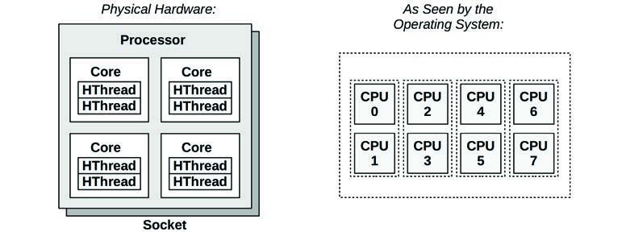
**图 6.1 CPU 架构**

每个硬件线程都可作为一个逻辑 CPU 被寻址，因此该处理器表现为八个 CPU。操作系统可能具有一些额外的拓扑知识以改进其调度决策，例如哪些 CPU 在同一个核心上，以及如何共享 CPU 缓存。

### 6.2.2 CPU 内存缓存 (CPU Memory Caches)

处理器提供各种硬件缓存以提高内存 I/O 性能。图 6.2 展示了缓存大小的关系，越接近 CPU 的缓存越小且越快（这是一种权衡）。

是否存在缓存，以及它们是在处理器上（集成）还是在处理器外部，取决于处理器类型。早期的处理器提供的集成缓存层级较少。


**图 6.2 CPU 缓存大小**

### 6.2.3 CPU 运行队列 (CPU Run Queues)

图 6.3 展示了一个由内核调度器管理的 CPU 运行队列。


**图 6.3 CPU 运行队列**

图中所示的线程状态（就绪运行和在 CPU 上）在第 3 章“操作系统”的图 3.8 中有涵盖。

排队并就绪运行的软件线程数量是衡量 CPU 饱和度的重要性能指标。在此图中（此时时刻），有四个线程在排队，还有一个线程在 CPU 上运行。在 CPU 运行队列中等待的时间有时被称为运行队列延迟（run-queue latency）或调度器队列延迟（dispatcher-queue latency）。在本书中，通常使用“调度器延迟（scheduler latency）”一词，因为它适用于所有调度器，包括那些不使用队列的调度器（见 6.4.2 节“软件”中关于 CFS 的讨论）。

对于多处理器系统，内核通常为每个 CPU 提供一个运行队列，并旨在将线程保持在同一个运行队列中。这意味着线程更有可能在同一个 CPU 上保持运行，从而重用 CPU 缓存中缓存的数据。这些缓存被描述为具有**缓存热度（cache warmth）**，这种保持线程在相同 CPU 上运行的策略称为 **CPU 亲和性（CPU affinity）**。在 NUMA 系统上，每个 CPU 的运行队列还可以改进内存局部性。这通过保持线程在同一个内存节点上运行来提高性能（如第 7 章“内存”所述），并避免了队列操作的线程同步（互斥锁）开销，如果运行队列是全局且由所有 CPU 共享的，这将损害可伸缩性。

[^1]: 有时也称为虚拟 CPU；然而，该术语更常用于指代由虚拟化技术提供的虚拟 CPU 实例。见第 11 章“云计算”。
[^2]: Linux 有一个工具 `lstopo(1)`，可以为当前系统生成类似于此图的图表，示例在 6.6.21 节“其他工具”中。

## 6.3 概念 (Concepts)

以下是关于 CPU 性能的一些重要概念，首先总结处理器内部结构：CPU 时钟频率以及指令如何执行。这是后续性能分析的基础，特别是对于理解**每周期指令数（IPC）**指标。

### 6.3.1 时钟频率 (Clock Rate)

时钟是驱动所有处理器逻辑的数字信号。每个 CPU 指令可能需要一或多个时钟周期（称为 CPU 周期）来执行。CPU 以特定的时钟频率执行；例如，4 GHz 的 CPU 每秒执行 40 亿个时钟周期。

一些处理器能够改变其时钟频率，增加频率以提高性能，或降低频率以减少功耗。频率可以由操作系统请求改变，或者由处理器自身动态改变。例如，内核空闲线程可以请求 CPU 降频以节省能源。

时钟频率通常被宣传为处理器的主要特征，但这可能有些误导。即使您系统中的 CPU 似乎已被充分利用（瓶颈），更快的时钟频率也不一定能加速性能——这取决于这些快速的 CPU 周期实际在做什么。如果它们大多是在等待内存访问时的**停顿周期（stall cycles）**，那么更快地执行它们并不能实际增加 CPU 指令速率或工作负载吞吐量。

### 6.3.2 指令 (Instructions)

CPU 执行从其指令集中选择的指令。一条指令包括以下步骤，每个步骤由 CPU 的一个称为**功能单元（functional unit）**的组件处理：

1. **指令获取 (Instruction fetch)**
2. **指令解码 (Instruction decode)**
3. **执行 (Execute)**
4. **内存访问 (Memory access)**
5. **寄存器写回 (Register write-back)**

最后两个步骤是可选的，取决于指令。许多指令仅对寄存器进行操作，不需要内存访问步骤。

这些步骤中的每一步至少需要一个时钟周期来执行。内存访问通常是最慢的，因为读写主内存可能需要数十个时钟周期，在此期间指令执行会停顿（这些停顿期间的周期称为停顿周期）。这就是为什么 CPU 缓存很重要的原因，如 6.4.1 节“硬件”所述：它可以显著减少内存访问所需的周期数。

### 6.3.3 指令流水线 (Instruction Pipeline)

指令流水线是一种 CPU 架构，它可以通过同时执行不同指令的不同组件来并行执行多条指令。它类似于工厂装配线，生产阶段可以并行执行，从而提高吞吐量。

考虑前面列出的指令步骤。如果每步需要一个时钟周期，完成指令将需要五个周期。在指令的每一步中，只有一个功能单元是活跃的，四个是空闲的。通过使用流水线技术，多个功能单元可以同时活跃，处理流水线中的不同指令。理想情况下，处理器随后可以在每个时钟周期完成一条指令。

指令流水线可能涉及将指令分解为多个简单步骤以便并行执行。（取决于处理器，这些步骤可能变成称为**微操作（micro-operations, uOps）**的简单操作，由称为**后端（back-end）**的处理器区域执行。这种处理器的**前端（front-end）**负责指令获取和分支预测。）

#### 分支预测 (Branch Prediction)
现代处理器可以执行流水线的**乱序执行（out-of-order execution）**，即在早期指令停顿时可以完成后续指令，从而提高指令吞吐量。然而，条件分支指令会带来问题。分支指令会将执行跳转到不同的指令，而条件分支是基于测试结果进行跳转的。对于条件分支，处理器不知道后续指令会是什么。作为一种优化，处理器通常实现**分支预测（branch prediction）**，它们会猜测测试结果并开始处理结果指令。如果后来证明猜测错误，指令流水线中的进度必须被丢弃，从而损害性能。为了提高猜测正确的机会，程序员可以在代码中放置提示（例如 Linux 内核源码中的 `likely()` 和 `unlikely()` 宏）。

### 6.3.4 指令宽度 (Instruction Width)

但我们可以变得更快。可以包含多个相同类型的功能单元，以便在每个时钟周期内有更多的指令能够取得进展。这种 CPU 架构称为**超级标量（superscalar）**，通常与流水线技术结合使用以实现高指令吞吐量。

**指令宽度（instruction width）**描述了并行处理指令的目标数量。现代处理器通常是 3 宽或 4 宽的，这意味着它们每个周期可以完成多达三或四条指令。其具体工作方式取决于处理器，因为每个阶段可能有不同数量的功能单元。

### 6.3.5 指令大小 (Instruction Size)

另一个指令特征是**指令大小（instruction size）**：对于某些处理器架构，它是可变的。例如，被归类为**复杂指令集计算机（CISC）**的 x86 允许长达 15 字节的指令。**精简指令集计算机（RISC）**的 ARM，在 AArch32/A32 中具有 4 字节指令和 4 字节对齐，而在 ARM Thumb 中具有 2 字节或 4 字节指令。

### 6.3.6 SMT

**同步多线程（SMT）**利用超级标量架构和硬件多线程支持（由处理器提供）来提高并行性。它允许一个 CPU 核心运行多个线程，在指令执行期间（例如，当一条指令在内存 I/O 上停顿时）有效地在它们之间进行调度。内核将这些硬件线程呈现为虚拟 CPU，并像往常一样在其上调度线程和进程。这已在 6.2.1 节“CPU 架构”中介绍并绘出。

一个示例实现是 Intel 的超线程技术（Hyper-Threading Technology），其中每个核心通常有两个硬件线程。另一个例子是 POWER8，它每个核心有八个硬件线程。

每个硬件线程的性能与独立的 CPU 核心并不相同，并且取决于工作负载。为了避免性能问题，内核可能会将 CPU 负载分散到各个核心上，以便每个核心只有一个硬件线程处于繁忙状态，从而避免硬件线程竞争。停顿周期密集型（低 IPC）的工作负载也可能比指令密集型（高 IPC）的工作负载具有更好的性能，因为停顿周期减少了核心竞争。

### 6.3.7 IPC, CPI

**每周期指令数（IPC）**是描述 CPU 如何花费其时钟周期以及理解 CPU 利用率性质的重要高层指标。该指标也可以表示为**每指令周期数（CPI）**，即 IPC 的倒数。Linux 社区和 Linux `perf(1)` 剖析器更常使用 IPC，而 Intel 和其他地方更常使用 CPI[^3]。

低 IPC 表明 CPU 经常停顿，通常是因为内存访问。高 IPC 表明 CPU 经常不停顿，且具有高指令吞吐量。这些指标揭示了性能调优努力应该重点投向何处。

例如，内存密集型工作负载可以通过安装更快的内存（DRAM）、改进内存局部性（软件配置）或减少内存 I/O 量来改进。安装具有更高时钟频率的 CPU 可能无法按预期程度提高性能，因为 CPU 可能仍需等待相同的时间来完成内存 I/O。换句话说，更快的 CPU 可能意味着更多的停顿周期，但每秒完成指令的速率保持不变。

高或低 IPC 的实际值取决于处理器 and 处理器特性，可以通过运行已知工作负载进行实验确定。例如，您可能会发现低 IPC 工作负载的 IPC 在 0.2 或更低，而高 IPC 工作负载的 IPC 超过 1.0（由于前面描述的指令流水线 and 宽度，这是可能的）。在 Netflix，云工作负载的 IPC 范围从 0.2（被认为慢）到 1.5（被认为好）。以 CPI 表示，该范围是 5.0 到 0.66。

应当注意，IPC 显示的是指令处理的效率，而不是指令本身的效率。考虑一个增加了低效软件循环的软件变更，该循环主要在 CPU 寄存器上操作（无停顿周期）：这样的变更可能会导致更高的整体 IPC，但也会导致更高的 CPU 使用率 and 利用率。

### 6.3.8 利用率 (Utilization)

CPU 利用率衡量的是在特定间隔内，CPU 实例处于繁忙状态（正在执行工作）的时间，以百分比表示。它可以测量为 CPU **未**运行内核空闲线程，而是正在运行用户级应用程序线程、其他内核线程或处理中断的时间。

高 CPU 利用率不一定是个问题，而可能是系统正在工作的标志。有些人还认为这是一个投资回报率（ROI）指标：高度利用的系统被认为具有良好的 ROI，而空闲系统被认为是浪费。与其他资源类型（磁盘）不同，在高利用率下性能不会急剧下降，因为内核支持优先级、抢占和时间片轮转。这些机制共同使内核能够理解什么具有更高优先级，并确保其优先运行。

CPU 利用率的测量涵盖了符合条件的所有活动的时钟周期，包括内存停顿周期。这可能会产生误导：CPU 可能因为经常在等待内存 I/O 时停顿而具有高利用率，而不仅仅是因为正在执行指令，如前一节所述。对于 Netflix 云来说就是这种情况，其 CPU 利用率大多是内存停顿周期 [Gregg 17b]。

CPU 利用率通常被拆分为独立的内核时间（kernel-time）和用户时间（user-time）指标。

### 6.3.9 用户时间/内核时间 (User Time/Kernel Time)

执行用户级软件花费的 CPU 时间称为**用户时间（user time）**，执行内核级软件花费的时间称为**内核时间（kernel time）**。内核时间包括系统调用期间的时间、内核线程时间和中断时间。在整个系统范围内测量时，用户时间/内核时间的比例指示了所执行工作负载的类型。

计算密集型应用程序可能几乎将所有时间都花在执行用户级代码上，用户/内核比例接近 99/1。例子包括图像处理、机器学习、基因组学和数据分析。

I/O 密集型应用程序具有很高的系统调用率，它们执行内核代码来执行 I/O。例如，执行网络 I/O 的 Web 服务器的用户/内核比例可能在 70/30 左右。

这些数值取决于许多因素，包含在这里是为了表达预期的比例类型。

### 6.3.10 饱和度 (Saturation)

处于 100% 利用率的 CPU 是饱和的，线程在等待上 CPU 运行时将遇到调度器延迟，从而降低整体性能。这种延迟是在 CPU 运行队列或其他用于管理线程的结构中等待的时间。

另一种形式的 CPU 饱和涉及 CPU 资源控制，例如可能在多租户云计算环境中实施的控制。虽然 CPU 可能尚未达到 100% 利用率，但已达到施加的限制，可运行的线程必须轮候。这对系统用户的可见程度取决于所使用的虚拟化类型；见第 11 章“云计算”。

饱和运行的 CPU 比其他资源类型的问题要小，因为高优先级的工作可以抢占当前线程。

### 6.3.11 抢占 (Preemption)

第 3 章“操作系统”中介绍的**抢占（preemption）**允许更高优先级的线程抢占当前正在运行的线程并开始执行。这消除了高优先级工作的运行队列延迟，从而提高了其性能。

### 6.3.12 优先级翻转 (Priority Inversion)

优先级翻转发生在低优先级线程持有资源并阻塞高优先级线程运行时。这降低了高优先级工作的性能，因为它被阻塞在等待中。

这可以使用**优先级继承（priority inheritance）**方案来解决。以下是一个工作示例（基于真实案例）：

1. 线程 A 执行监控，具有低优先级。它获取生产数据库的地址空间锁以检查内存使用情况。
2. 线程 B（执行系统日志压缩的常规任务）开始运行。
3. 没有足够的 CPU 同时运行两者。线程 B 抢占 A 并运行。
4. 线程 C 来自生产数据库，具有高优先级，之前一直在睡眠等待 I/O。该 I/O 现在完成，将线程 C 置回可运行状态。
5. 线程 C 抢占 B，运行，但随后在线程 A 持有的地址空间锁上阻塞。线程 C 离开 CPU。
6. 调度器挑选下一个最高优先级的线程运行：B。
7. 在线程 B 运行时，高优先级线程 C 实际上被阻塞在一个较低优先级的线程 B 上。这就是优先级翻转。
8. 优先级继承给予线程 A 与线程 C 相同的高优先级，从而抢占 B，直到它释放锁。线程 C 现在可以运行。

自 2.6.18 以来，Linux 提供了支持优先级继承的用户级互斥锁，旨在用于实时工作负载 [Corbet 06a]。

### 6.3.13 多进程、多线程 (Multiprocess, Multithreading)

大多数处理器都以某种形式提供多个 CPU。为了让应用程序能够利用它们，它需要独立的执行线程以便并行运行。例如，对于 64-CPU 系统，如果应用程序可以并行利用所有 CPU，则执行速度最高可提高 64 倍，或者处理 64 倍的负载。应用程序随着 CPU 数量增加而有效扩展的程度是衡量**可伸缩性（scalability）**的标准。

在 CPU 之间扩展应用程序的两种技术是**多进程（multiprocess）**和**多线程（multithreading）**，如图 6.4 所示。（注意这是软件多线程，而不是前面提到的基于硬件的 SMT。）

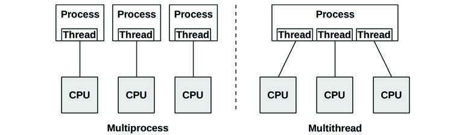
**图 6.4 软件 CPU 可伸缩性技术**

在 Linux 上，多进程和多线程模型都可以使用，并且两者都由**任务（tasks）**实现。

多进程和多线程之间的区别如表 6.1 所示。

**表 6.1 多进程与多线程属性**

| 属性 | 多进程 | 多线程 |
| :--- | :--- | :--- |
| **开发** | 可能更容易。使用 `fork(2)` 或 `clone(2)`。 | 使用线程 API (`pthreads`)。 |
| **内存开销** | 每个进程独立的地址空间消耗一些内存资源（通过页面级写时复制在一定程度上减少）。 | 小。仅需要额外的堆栈和寄存器空间，以及线程局部数据的空间。 |
| **CPU 开销** | `fork(2)`/`clone(2)`/`exit(2)` 的成本，包括管理地址空间的 MMU 工作。 | 小。API 调用。 |
| **通信** | 通过 IPC。除非使用共享内存区域，否则这会产生 CPU 成本，包括在地址空间之间移动数据的上下文切换。 | 最快。直接访问共享内存。通过同步原语（如互斥锁）保证完整性。 |
| **崩溃恢复能力** | 高，进程是独立的。 | 低，任何错误都可能导致整个应用程序崩溃。 |
| **内存使用** | 虽然有些内存可能会重复，但独立进程可以 `exit(2)` 并将所有内存返回给系统。 | 通过系统分配器。这可能会导致来自多个线程的 CPU 竞争，以及在内存被重用之前产生碎片。 |

尽管表中显示了多线程的所有优势，但通常认为多线程更优，尽管开发者实现起来更复杂。多线程编程在 [Stevens 13] 中有涵盖。

无论使用哪种技术，重要的是创建足够的进程或线程来跨越所需数量的 CPU——为了获得最高性能，这可能是所有可用的 CPU。当线程同步的成本和降低的内存局部性（NUMA）超过跨更多 CPU 运行的好处时，某些应用程序在较少的 CPU 上运行可能会表现得更好。

并行架构在第 5 章“应用程序”的 5.2.5 节“并发与并行”中也有讨论，该节还总结了协程。

### 6.3.14 字长 (Word Size)

处理器围绕最大**字长（word size）**设计——32 位或 64 位——这是整数大小和寄存器大小。字长通常也用于（取决于处理器）地址空间大小和数据路径宽度（有时称为位宽）。

更大的尺寸意味着更好的性能，尽管这并不像听起来那么简单。对于某些数据类型中未使用的位，更大的尺寸可能会导致内存开销。当指针（字长）的大小增加时，数据占用空间也会增加，这可能需要更多的内存 I/O。对于 x86 64 位架构，这些开销通过寄存器的增加和更高效的寄存器调用约定得到补偿，因此 64 位应用程序可能比其 32 位版本更快。

处理器和操作系统可以支持多种字长，并可以同时运行为不同字长编译的应用程序。如果软件是为较小的字长编译的，它可能会成功执行，但性能相对较差。

### 6.3.15 编译器优化 (Compiler Optimization)

应用程序的 CPU 运行时间可以通过编译器选项（包括设置字长）和优化得到显著改进。编译器也经常更新，以利用最新的 CPU 指令集并实现其他优化。有时，仅仅通过使用更新的编译器，应用程序性能就可以得到显著提高。

该主题在第 5 章“应用程序”的 5.3.1 节“编译型语言”中有更详细的涵盖。

## 6.4 架构 (Architecture)

本节介绍 CPU 架构及其硬件和软件的实现。简单的 CPU 模型已在 6.2 节“模型”中介绍，通用概念已在前一节中介绍。

这里我将这些主题总结为性能分析的背景。更多详情请参阅供应商处理器手册和操作系统内部机制文档。本章末尾列出了一些相关资源。

### 6.4.1 硬件 (Hardware)

CPU 硬件包括处理器及其子系统，以及多处理器系统的 CPU 互连。

#### 处理器 (Processor)
图 6.5 展示了一个通用的双核心处理器的组件。

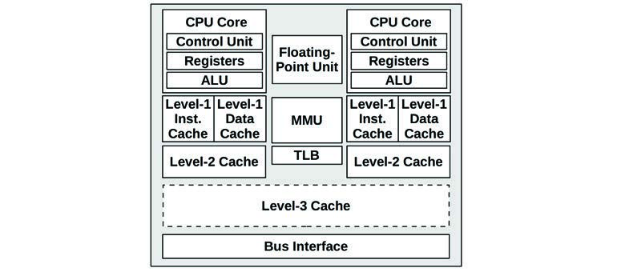
**图 6.5 通用双核心处理器组件**

**控制单元（control unit）**是 CPU 的核心，负责指令获取、解码、管理执行和存储结果。

此示例处理器描绘了一个共享的浮点单元和（可选的）共享 L3 缓存。您处理器中的实际组件将取决于其类型和型号。可能存在的其他性能相关组件包括：

- **P-cache**：预取缓存（每个 CPU 核心）。
- **W-cache**：写缓存（每个 CPU 核心）。
- **时钟（Clock）**：为 CPU 时钟生成信号（或由外部提供）。
- **时间戳计数器（Timestamp counter）**：用于高分辨率时间，随始终递增。
- **微代码 ROM**：快速将指令转换为电路信号。
- **温度传感器**：用于热监控。
- **网络接口**：如果存在于芯片上（为了高性能）。

某些类型的处理器使用温度传感器作为单个核心动态超频（包括 Intel Turbo Boost 技术）的输入，在核心保持在其温度包络范围内时增加时钟频率。可能的时钟频率可以由 P-states 定义。

#### P-States 和 C-States
Intel 处理器使用的**高级配置与电源接口（ACPI）**标准定义了处理器性能状态（P-states）和处理器电源状态（C-states）[ACPI 17]。

- **P-states**：通过改变 CPU 频率在正常执行期间提供不同层级的性能：P0 是最高频率（对于某些 Intel CPU，这是最高的“加速（turbo boost）”级别），P1...N 是较低频率的状态。这些状态可以由硬件（例如，基于处理器温度）或通过软件（例如，内核节能模式）控制。当前的运行频率和可用状态可以使用特定型号寄存器（MSRs）观察（例如，使用 6.6.10 节中的 `showboost(8)` 工具）。
- **C-states**：在执行停止时提供不同的空闲状态，以节省功耗。C-states 如表 6.2 所示：C0 用于正常操作，C1 及以上用于空闲状态：数字越高，状态越深。

**表 6.2 处理器电源状态 (C-states)**

| C-state | 描述 |
| :--- | :--- |
| **C0** | 正在执行。CPU 完全开启，处理指令。 |
| **C1** | 停止执行。通过 `hlt` 指令进入。缓存被维持。从此状态唤醒的延迟最低。 |
| **C1E** | 增强型停止，具有更低的功耗（由某些处理器支持）。 |
| **C2** | 停止执行。通过硬件信号进入。这是一个更深的睡眠状态，具有更高的唤醒延迟。 |
| **C3** | 比 C1 和 C2 具有更好的节能效果的更深睡眠状态。缓存可能维持状态，但停止监听（缓存一致性），将其推迟给操作系统。 |

处理器制造商可以定义 C3 以外的其他状态。一些 Intel 处理器定义了高达 C10 的额外层级，此时更多的处理器功能（包括缓存内容）被关闭。

#### CPU 缓存 (CPU Caches)
各种硬件缓存通常包含在处理器中（称为片上、片内、嵌入式或集成）或随处理器一起提供（外部）。这些通过使用更快的内存类型来缓存读取和缓冲写入，从而提高内存性能。通用处理器的缓存访问层级如图 6.6 所示。

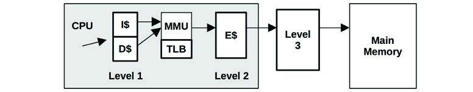
**图 6.6 CPU 缓存层级**

它们包括：

- **L1 指令缓存 (I$)**
- **L1 数据缓存 (D$)**
- **转换后备缓冲区 (TLB)**
- **L2 缓存 (E$)**
- **L3 缓存（可选）**

E$ 中的 E 最初代表外部（external）缓存，但随着 L2 缓存的集成，此后它被巧妙地称为嵌入式（embedded）缓存。现如今通常使用“Level”术语而不是“E$”风格的符号，这避免了此类混淆。

通常希望指代主内存之前的最后一个缓存，它可能是也可能不是 L3。Intel 使用术语**末级缓存（last-level cache, LLC）**来指代这一点，也被描述为最长延迟缓存。

每个处理器上可用的缓存取决于其类型和型号。随着时间的推移，这些缓存的数量和大小一直在增加。表 6.3 说明了这一点，该表列出了自 1978 年以来的 Intel 处理器示例，包括缓存方面的进步 [Intel 19a][Intel 20a]。

**表 6.3 1978 年至 2019 年 Intel 处理器缓存大小示例**

| 处理器 | 年份 | 最大频率 | 核心/线程 | 晶体管 | 数据总线 (bits) | L1 | L2 | L3 |
| :--- | :--- | :--- | :--- | :--- | :--- | :--- | :--- | :--- |
| 8086 | 1978 | 8 MHz | 1/1 | 29 K | 16 | — | — | — |
| Intel 286 | 1982 | 12.5 MHz | 1/1 | 134 K | 16 | — | — | — |
| Intel 386 DX | 1985 | 20 MHz | 1/1 | 275 K | 32 | — | — | — |
| Intel 486 DX | 1989 | 25 MHz | 1/1 | 1.2 M | 32 | 8 KB | — | — |
| Pentium | 1993 | 60 MHz | 1/1 | 3.1 M | 64 | 16 KB | — | — |
| Pentium Pro | 1995 | 200 MHz | 1/1 | 5.5 M | 64 | 16 KB | 256/512 KB | — |
| Pentium II | 1997 | 266 MHz | 1/1 | 7 M | 64 | 32 KB | 256/512 KB | — |
| Pentium III | 1999 | 500 MHz | 1/1 | 8.2 M | 64 | 32 KB | 512 KB | — |
| Intel Xeon | 2001 | 1.7 GHz | 1/1 | 42 M | 64 | 8 KB | 512 KB | — |
| Pentium M | 2003 | 1.6 GHz | 1/1 | 77 M | 64 | 64 KB | 1 MB | — |
| Intel Xeon MP | 2005 | 3.33 GHz | 1/2 | 675 M | 64 | 16 KB | 1 MB | 8 MB |
| Intel Xeon 7140M | 2006 | 3.4 GHz | 2/4 | 1.3 B | 64 | 16 KB | 1 MB | 16 MB |
| Intel Xeon 7460 | 2008 | 2.67 GHz | 6/6 | 1.9 B | 64 | 64 KB | 3 MB | 16 MB |
| Intel Xeon 7560 | 2010 | 2.26 GHz | 8/16 | 2.3 B | 64 | 64 KB | 256 KB | 24 MB |
| Intel Xeon E7-8870 | 2011 | 2.4 GHz | 10/20 | 2.2 B | 64 | 64 KB | 256 KB | 30 MB |
| Intel Xeon E7-8870v2 | 2014 | 3.1 GHz | 15/30 | 4.3 B | 64 | 64 KB | 256 KB | 37.5 MB |
| Intel Xeon E7-8870v3 | 2015 | 2.9 GHz | 18/36 | 5.6 B | 64 | 64 KB | 256 KB | 45 MB |
| Intel Xeon E7-8870v4 | 2016 | 3.0 GHz | 20/40 | 7.2 B | 64 | 64 KB | 256 KB | 50 MB |
| Intel Platinum 8180 | 2017 | 3.8 GHz | 28/56 | 8.0 B | 64 | 64 KB | 1 MB | 38.5 MB |
| Intel Xeon Platinum 9282 | 2019 | 3.8 GHz | 56/112 | 8.0 B | 64 | 64 KB | 1 MB | 77 MB |

对于多核心和多线程处理器，一些缓存可能在核心和线程之间共享。对于表 6.3 中的示例，自 Intel Xeon 7460 (2008) 以来的所有处理器都具有多个 L1 和 L2 缓存，通常每个核心一个（表中的大小是指每个核心的缓存，而不是总大小）。

除了 CPU 缓存的数量和大小在增加之外，还存在一种将这些缓存提供在芯片上（此时访问延迟可以降至最低）而不是在处理器外部提供的趋势。

#### 延迟 (Latency)
使用多层缓存是为了提供大小和延迟的最佳配置。L1 缓存的访问时间通常为几个 CPU 时钟周期，较大的 L2 缓存访问时间约为十二个左右的时钟周期。主内存访问可能需要约 60 ns（对于 4 GHz 处理器约为 240 个周期），MMU 的地址转换也会增加延迟。

您处理器的 CPU 缓存延迟特征可以使用微基准测试实验确定 [Ruggiero 08]。图 6.7 展示了其结果，绘制了使用 LMbench 测试 Intel Xeon E5620 2.4 GHz 在不断增加的内存范围内的内存访问延迟 [McVoy 12]。

两个轴都是对数的。图中的阶梯显示了何时超过了某个缓存层级，访问延迟随后变成下一个（更慢的）缓存层级的结果。

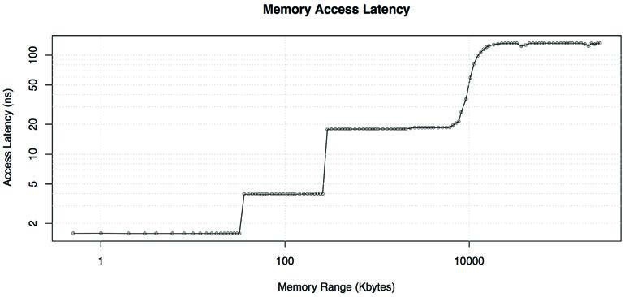
**图 6.7 内存访问延迟测试**

#### 相联度 (Associativity)
相联度是描述在缓存中定位新条目的约束的缓存特征。类型包括：

- **全相联 (Fully associative)**：缓存可以在任何地方定位新条目。例如，可以使用最近最少使用（LRU）算法在整个缓存中进行驱逐。
- **直接映射 (Direct mapped)**：每个条目在缓存中只有一个有效位置，例如内存地址的哈希，使用地址位的一个子集在缓存中形成地址。
- **组相联 (Set associative)**：通过映射（例如哈希）识别缓存的一个子集，在该子集内可以执行另一种算法（例如 LRU）。它根据子集大小来描述；例如，四路组相联将地址映射到四个可能的位置，然后从这四个位置中选出最好的一个（例如最近最少使用的位置）。

CPU 缓存通常使用组相联作为全相联（执行成本昂贵）和直接映射（命中率差）之间的平衡。

#### 缓存行 (Cache Line)
CPU 缓存的另一个特征是它们的缓存行大小。这是一个作为一个单元存储和传输的字节范围，可提高内存吞吐量。x86 处理器的典型缓存行大小为 64 字节。编译器在针对性能进行优化时会考虑到这一点。程序员有时也会这样做；见第 5 章“应用程序”的 5.2.5 节“并发与并行”中的哈希表部分。

#### 缓存一致性 (Cache Coherency)
内存可能同时缓存于不同处理器上的多个 CPU 缓存中。当一个 CPU 修改内存时，所有缓存都需要意识到它们缓存的副本现在已过时并应丢弃，以便将来的任何读取都能检索到新修改的副本。这个过程称为**缓存一致性（cache coherency）**，它确保 CPU 始终访问内存的正确状态。

缓存一致性的影响之一是 LLC 访问惩罚。以下示例作为粗略指南提供（这些来自 [Levinthal 09]）：

- **LLC 命中，行未共享**：约 40 个 CPU 周期
- **LLC 命中，行在另一个核心中共享**：约 65 个 CPU 周期
- **LLC 命中，行在另一个核心中修改**：约 75 个 CPU 周期

缓存一致性是设计可伸缩多处理器系统面临的最大挑战之一，因为内存可能会被迅速修改。

#### MMU
**内存管理单元（MMU）**负责虚拟地址到物理地址的转换。

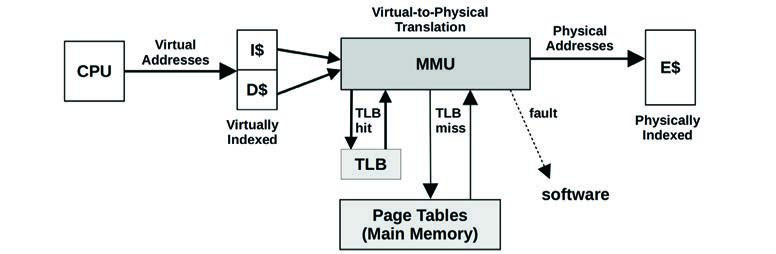
**图 6.8 内存管理单元与 CPU 缓存**

图 6.8 描绘了一个通用的 MMU 以及 CPU 缓存类型。该 MMU 使用片上**转换后备缓冲区（TLB）**来缓存地址转换。缓存未命中由主内存（DRAM）中的转换表（称为**页表**）满足，页表由 MMU（硬件）直接读取并由内核维护。

这些因素取决于处理器。一些（较早的）处理器使用内核软件遍历页表来处理 TLB 未命中，然后用请求的映射填充 TLB。此类软件可能会维护其自身的、更大的、内存中的转换缓存，称为**转换存储缓冲区（translation storage buffer, TSB）**。较新的处理器可以在硬件中处理 TLB 未命中，从而大大降低其成本。

#### 互连 (Interconnects)
对于多处理器架构，处理器使用共享系统总线或专用互连进行连接。这与系统的内存架构有关：**统一内存访问（UMA）**或 **NUMA**，如第 7 章“内存”所述。

早期 Intel 处理器使用的共享系统总线（称为**前端总线**）由图 6.9 中的四处理器示例说明。

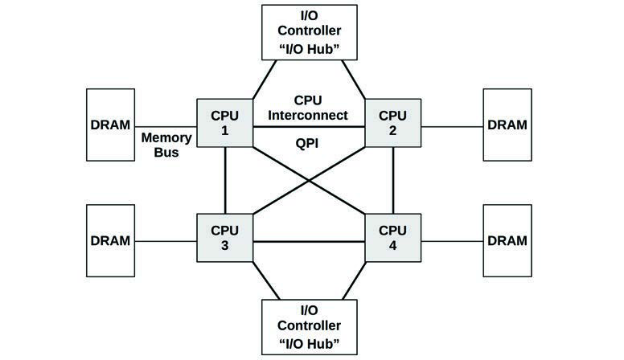
**图 6.9 四处理器 Intel 前端总线架构示例**

由于对共享总线资源的竞争，当处理器数量增加时，使用系统总线会存在可伸缩性问题。现代服务器通常是多处理器的、NUMA 的，并转而使用 CPU 互连。

互连可以连接除处理器之外的其他组件，例如 I/O 控制器。互连示例包括 Intel 的 Quick Path Interconnect (QPI)、Intel 的 Ultra Path Interconnect (UPI)、AMD 的 HyperTransport (HT)、ARM 的 CoreLink Interconnects（有三种不同类型）以及 IBM 的 Coherent Accelerator Processor Interface (CAPI)。图 6.10 展示了一个四处理器系统的示例 Intel QPI 架构。

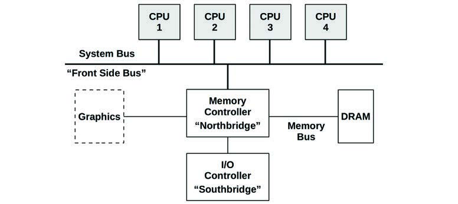
**图 6.10 四处理器 Intel QPI 架构示例**

处理器之间的私有连接允许无竞争的访问，并且还允许比共享系统总线更高的带宽。表 6.4 展示了 Intel FSB 和 QPI 的一些示例速度 [Intel 09][Mulnix 17]。

**表 6.4 Intel CPU 互连带宽示例**

| Intel | 传输速率 | 宽度 | 带宽 |
| :--- | :--- | :--- | :--- |
| **FSB (2007)** | 1.6 GT/s | 8 字节 | 12.8 Gbytes/s |
| **QPI (2008)** | 6.4 GT/s | 2 字节 | 25.6 Gbytes/s |
| **UPI (2017)** | 10.4 GT/s | 2 字节 | 41.6 Gbytes/s |

为了解释传输速率如何与带宽相关，我将解释 QPI 示例，它针对 3.2 GHz 时钟。QPI 是双抽样（double-pumped）的，在时钟的上升沿和下降沿都执行数据传输[^4]。这使传输速率翻倍（3.2 GHz × 2 = 6.4 GT/s）。最终 25.6 Gbytes/s 的带宽是发送和接收两个方向的总和（6.4 GT/s × 2 字节宽度 × 2 个方向 = 25.6 Gbytes/s）。

QPI 的一个有趣细节是它的缓存一致性模式可以在 BIOS 中调节，选项包括用于优化内存带宽的 Home Snoop、用于优化内存延迟的 Early Snoop 以及用于改进可伸缩性的 Directory Snoop（它涉及跟踪哪些内容是共享的）。正在取代 QPI 的 UPI 仅支持 Directory Snoop。

除了外部互连，处理器还具有用于核心通信的内部互连。

互连通常设计为高带宽，这样它们就不会成为系统性瓶颈。如果它们成为了瓶颈，性能将随着 CPU 指令在涉及互连的操作（例如远程内存 I/O）中遇到停顿周期而下降。衡量这一点的一个关键指标是 IPC 的下降。可以使用 CPU 性能计数器分析 CPU 指令、周期、IPC、停顿周期和内存 I/O。

#### 硬件计数器 (PMCs)
**性能监控计数器（PMCs）**在第 4 章“可观测性工具”的 4.3.9 节“硬件计数器（PMCs）”中被总结为可观测性统计数据的一个来源。本节更详细地描述它们的 CPU 实现，并提供额外的示例。

PMCs 是在硬件中实现的处理器寄存器，可以编程以计数低层 CPU 活动。它们通常包括以下方面的计数器：

- **CPU 周期**：包括停顿周期和停顿周期类型。
- **CPU 指令**：已退休（执行）的指令。
- **L1, L2, L3 缓存访问**：命中、未命中。
- **浮点单元**：运算操作。
- **内存 I/O**：读取、写入、停顿周期。
- **资源 I/O**：读取、写入、停顿周期。

每个 CPU 都有少量的寄存器，通常在两个到八个之间，可以编程来记录这些事件。可用的寄存器取决于处理器类型和型号，并记录在处理器手册中。

作为一个相对简单的例子，Intel P6 系列处理器通过四个特定型号寄存器（MSRs）提供性能计数器。两个 MSR 是计数器，是只读的。另外两个 MSR（称为事件选择 MSR）用于对计数器进行编程，是可读写的。性能计数器是 40 位寄存器，事件选择 MSR 是 32 位。图 6.11 展示了事件选择 MSR 的格式。


**图 6.11 示例 Intel 性能事件选择 MSR**

计数器由**事件选择（event select）**和 **UMASK** 识别。事件选择标识要计数的事件类型，UMASK 标识子类型或子类型组。可以设置 OS 和 USR 位，以便根据处理器保护环，仅在内核模式（OS）或用户模式（USR）时增加计数器。CMASK 可以设置为事件阈值，必须达到该阈值后计数器才会增加。

Intel 处理器手册（第 3B 卷 [Intel 19b]）列出了可以通过其事件选择和 UMASK 值计数的数十个事件。表 6.5 中选择的示例展示了可以观察到的不同目标（处理器功能单元），包括来自手册的描述。您需要参考当前的处理器手册来查看您实际拥有的内容。

**表 6.5 Intel CPU 性能计数器选择示例**

| 事件选择 | UMASK | 单元 | 名称 | 描述 |
| :--- | :--- | :--- | :--- | :--- |
| 0x43 | 0x00 | 数据缓存 | DATA_MEM_REFS | 所有内存类型的加载；所有内存类型的存储。分割的每一部分被单独计数。……不包括 I/O 访问或其他非内存访问。 |
| 0x48 | 0x00 | 数据缓存 | DCU_MISS_OUTSTANDING | 当 DCU 未命中挂起时的加权周期数，按任何特定时间的挂起缓存未命中数增加。仅考虑可缓存的读取请求。…… |
| 0x80 | 0x00 | 指令获取单元 | IFU_IFETCH | 指令获取次数，包括可缓存和不可缓存的，包括 UC（不可缓存）获取。 |
| 0x28 | 0x0F | L2 缓存 | L2_IFETCH | L2 指令获取次数。…… |
| 0xC1 | 0x00 | 浮点单元 | FLOPS | 已退休的计算型浮点运算次数。…… |
| 0x7E | 0x00 | 外部总线逻辑 | BUS_SNOOP_STALL | 总线处于监听停顿状态的时钟周期数。 |
| 0xC0 | 0x00 | 指令解码与退休 | INST_RETIRED | 已退休的指令数。 |
| 0xC8 | 0x00 | 中断 | HW_INT_RX | 接收到的硬件中断次数。 |
| 0xC5 | 0x00 | 分支 | BR_MISS_PRED_RETIRED | 已退休的误预测分支次数。 |
| 0xA2 | 0x00 | 停顿 | RESOURCE_STALLS | 在存在资源相关停顿的每个周期内增加一。…… |
| 0x79 | 0x00 | 时钟 | CPU_CLK_UNHALTED | 处理器未停顿时（non-halted）的周期数。 |

还有非常非常多的计数器，特别是对于较新的处理器。

另一个需要注意的处理器细节是它提供了多少个硬件计数器寄存器。例如，Intel Skylake 微架构每个硬件线程提供三个固定计数器，并且每个核心提供额外的八个可编程计数器（“通用”）。这些在读取时是 48 位计数器。

有关 PMCs 的更多示例，请参见 4.3.9 节中的表 4.4，了解 Intel 架构集。4.3.9 节还提供了 AMD 和 ARM 处理器供应商的 PMC 参考资料。

#### GPUs
**图形处理单元（GPUs）**最初是为了支持图形显示而创建的，现在正被用于其他工作负载，包括人工智能、机器学习、分析、图像处理和加密货币挖掘。对于服务器和云实例，GPU 是一种类似于处理器的资源，可以执行工作负载的一部分（称为计算内核），该部分适用于高度并行的矩阵变换等数据处理。来自 Nvidia 的通用 GPU 使用其 **CUDA（Compute Unified Device Architecture）** 得到了广泛应用。CUDA 为使用 Nvidia GPU 提供了 API 和软件库。

虽然处理器（CPU）可能包含十几个核心，但 GPU 可能包含数百或数千个称为**流处理器（streaming processors, SPs）**[^5] 的较小核心，每个 SP 都可以执行一个线程。由于 GPU 工作负载高度并行，可以并行执行的线程被分组为**线程块（thread blocks）**，它们之间可以互相协作。这些线程块可以由称为**流式多处理器（streaming multiprocessors, SMs）**的 SP 组执行，SM 还提供包括内存缓存在内的其他资源。表 6.6 进一步比较了处理器（CPUs）与 GPUs [Ather 19]。

**表 6.6 CPU 与 GPU 对比**

| 属性 | CPU | GPU |
| :--- | :--- | :--- |
| **封装** | 处理器封装插入系统板上的插槽，直接连接到系统总线或 CPU 互连。 | GPU 通常作为扩展卡提供，通过扩展总线（例如 PCIe）连接。它们也可能嵌入在系统板或处理器封装中（片上）。 |
| **封装可伸缩性** | 多插槽配置，通过 CPU 互连（例如 Intel UPI）连接。 | 多 GPU 配置是可能的，通过 GPU 到 GPU 互连（例如 NVIDIA 的 NVLink）连接。 |
| **核心** | 如今典型的处理器包含 2 到 64 个核心。 | GPU 可能具有类似数量的流式多处理器（SMs）。 |
| **线程** | 典型的核心可能执行两个硬件线程（或更多，取决于处理器）。 | 一个 SM 可能包含数十或数百个流处理器（SPs）。每个 SP 只能执行一个线程。 |
| **缓存** | 每个核心都有 L1 和 L2 缓存，并可能共享 L3 缓存。 | 每个 SM 都有一个缓存，并且它们之间可能共享一个 L2 缓存。 |
| **时钟** | 高（例如 3.4 GHz）。 | 相对较低（例如 1.0 GHz）。 |

必须使用自定义工具进行 GPU 可观测性。可能的 GPU 性能指标包括每周期指令数、缓存命中率和内存总线利用率。

#### 其他加速器 (Other Accelerators)
除了 GPU 之外，请注意可能还存在其他加速器，用于将 CPU 工作卸载到更快的专用集成电路。这些包括**现场可编程门阵列（FPGAs）**和**张量处理单元（TPUs）**。如果在使用中，应与 CPU 一起分析其使用情况和性能，尽管它们通常需要自定义工具。

GPU 和 FPGA 被用于提高加密货币挖掘的性能。

### 6.4.2 软件 (Software)

支持 CPU 的内核软件包括调度器、调度类和空闲线程。

#### 调度器 (Scheduler)
内核 CPU 调度器的主要功能如图 6.12 所示。

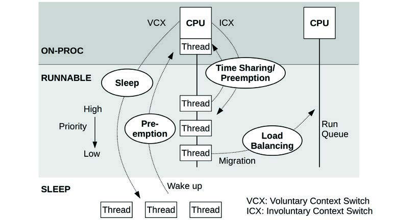
**图 6.12 内核 CPU 调度器功能**

这些功能包括：

- **分时 (Time sharing)**：在可运行线程之间进行多任务处理，首先执行优先级最高的线程。
- **抢占 (Preemption)**：对于已变为高优先级可运行状态的线程，调度器可以抢占当前运行的线程，以便立即开始执行高优先级线程。
- **负载均衡 (Load balancing)**：将可运行线程移至空闲或较不繁忙的 CPU 的运行队列中。

图 6.12 展示了运行队列，这是最初实现调度的方式。该术语和心理模型仍被用于描述等待的任务。然而，Linux CFS 调度器实际上使用了未来任务执行的红黑树。

在 Linux 中，分时由系统定时器中断驱动，通过调用 `scheduler_tick()` 来实现，该函数调用调度类函数来管理优先级和称为**时间片（time slices）**的 CPU 时间单位的过期。当线程变为可运行且调度类 `check_preempt_curr()` 函数被调用时，会触发抢占。线程切换由 `__schedule()` 管理，它通过 `pick_next_task()` 选择最高优先级的线程运行。负载均衡由 `load_balance()` 函数执行。

Linux 调度器还使用逻辑来避免在预期成本超过收益时进行迁移，倾向于让繁忙线程在 CPU 缓存仍应保持热度的同一个 CPU 上运行（CPU 亲和性）。在 Linux 源码中，请参阅 `idle_balance()` 和 `task_hot()` 函数。

请注意，所有这些函数名都可能发生变化；更多详情请参考 Linux 源码，包括 `Documentation` 目录中的文档。

#### 调度类 (Scheduling Classes)
调度类管理可运行线程的行为，具体包括它们的优先级、它们的 CPU 运行时间是否分时，以及这些时间片的持续时间（也称为时间量子）。此外，还可以通过调度策略进行额外控制，调度策略可以在调度类中选择，并可以控制相同优先级线程之间的调度。图 6.13 描绘了 Linux 的调度类以及线程优先级范围。

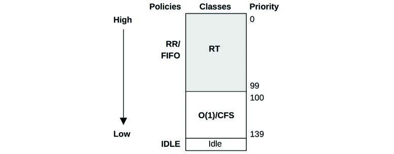
**图 6.13 Linux 线程调度器优先级**

用户级线程的优先级受用户定义的 **nice 值**影响，可以设置该值以降低不重要工作的优先级（以便对其他系统用户表现得友好）。在 Linux 中，nice 值设置线程的静态优先级，这与调度器计算的动态优先级是分开的。

对于 Linux 内核，调度类包括：

- **RT**：为实时工作负载提供固定且高优先级。内核支持用户级和内核级抢占，允许以低延迟调度 RT 任务。优先级范围是 0–99 (`MAX_RT_PRIO-1`)。
- **O(1)**：O(1) 调度器在 Linux 2.6 中引入，作为用户进程的默认分时调度器。其名称源于算法复杂度 O(1)（参见第 5 章“应用程序”中的大 O 符号总结）。先前的调度器包含遍历所有任务的例程，使其成为 O(n)，这成了可伸缩性问题。O(1) 调度器动态地提高 I/O 密集型工作负载相对于 CPU 密集型工作负载的优先级，以减少交互式和 I/O 工作负载的延迟。
- **CFS**：**完全公平调度（Completely Fair Scheduling）**在 Linux 2.6.23 内核中被加入，作为用户进程的默认分时调度器。该调度器基于任务 CPU 时间的红黑树（而不是传统的运行队列）来管理任务。这使得低 CPU 消耗者可以很容易地被找到并优先于 CPU 密集型工作负载执行，从而提高交互式和 I/O 密集型工作负载的性能。
- **Idle**：以尽可能最低的优先级运行线程。
- **Deadline**：在 Linux 3.14 中加入，使用三个参数应用最早截止时间优先（EDF）调度：运行时间（runtime）、周期（period）和截止时间（deadline）。任务应在每个“周期”微秒内获得“运行时间”微秒的 CPU 时间，并在“截止时间”内完成。

要选择调度类，用户级进程可以使用 `sched_setscheduler(2)` 系统调用或 `chrt(1)` 工具选择映射到该类的调度策略。

调度策略包括：

- **RR**：`SCHED_RR` 是轮询调度（round-robin）。一旦线程用完了它的时间量子，它就会被移至该优先级级别运行队列的末尾，允许同优先级的其他线程运行。使用 RT 调度类。
- **FIFO**：`SCHED_FIFO` 是先进先出调度，它持续运行位于运行队列头部的线程，直到它自愿离开或有更高优先级的线程到达。即使运行队列上有其他同优先级线程，该线程也会继续运行。使用 RT 类。
- **NORMAL**：`SCHED_NORMAL`（之前称为 `SCHED_OTHER`）是分时调度，也是用户进程的默认策略。调度器根据调度类动态调整优先级。对于 O(1)，时间片时长根据静态优先级设置：高优先级工作的时长更长。对于 CFS，时间片是动态的。使用 CFS 调度类。
- **BATCH**：`SCHED_BATCH` 与 `SCHED_NORMAL` 类似，但预期该线程将是 CPU 密集型的，且不应调度其去中断其他 I/O 密集型的交互式工作。使用 CFS 调度类。
- **IDLE**：`SCHED_IDLE` 使用 Idle 调度类。
- **DEADLINE**：`SCHED_DEADLINE` 使用 Deadline 调度类。

随着时间的推移，可能会添加其他类和策略。已经研究出的调度算法包括超线程感知的 [Bulpin 05] 和温度感知的 [Otto 06]，它们通过考虑额外的处理器因素来优化性能。

当没有线程可运行时，一个特殊的空闲任务（也称为空闲线程）会被执行作为占位符，直到另一个线程变为可运行。

#### 空闲线程 (Idle Thread)
在第 3 章中介绍过，当没有其他可运行线程时，内核“空闲”线程（或空闲任务）会在 CPU 上运行，并具有尽可能最低的优先级。它通常被编程为通知处理器 CPU 执行可以停止（`halt` 指令）或降频以节省功耗。CPU 将在下一次硬件中断时唤醒。

#### NUMA 分组 (NUMA Grouping)
通过使内核具备 NUMA 感知能力，可以显著提高 NUMA 系统上的性能，从而使其能够做出更好的调度和内存放置决策。这可以自动检测并创建本地化 CPU 和内存资源的组，并以拓扑结构组织它们以反映 NUMA 架构。这种拓扑结构允许估计任何内存访问的成本。

在 Linux 系统上，这些被称为**调度域（scheduling domains）**，处于一个从根域开始的拓扑结构中。

系统管理员可以执行手动形式的分组，方法是将进程绑定为仅在一个或多个 CPU 上运行，或者为进程创建一个专用的 CPU 集合。见 6.5.10 节“CPU 绑定”。

#### 处理器资源感知 (Processor Resource-Aware)
内核也可以理解 CPU 资源拓扑，以便为电源管理、硬件缓存使用和负载均衡做出更好的调度决策。

## 6.5 方法论 (Methodology)

本节描述用于 CPU 分析和调优的各种方法论和练习。表 6.7 总结了这些主题。

**表 6.7 CPU 性能方法论**

| 节 | 方法论 | 类型 |
| :--- | :--- | :--- |
| **6.5.1** | 工具法 (Tools method) | 观测分析 |
| **6.5.2** | USE 法 (USE method) | 观测分析 |
| **6.5.3** | 工作负载特征分析 (Workload characterization) | 观测分析、容量规划 |
| **6.5.4** | 剖析 (Profiling) | 观测分析 |
| **6.5.5** | 周期分析 (Cycle analysis) | 观测分析 |
| **6.5.6** | 性能监控 (Performance monitoring) | 观测分析、容量规划 |
| **6.5.7** | 静态性能调优 (Static performance tuning) | 观测分析、容量规划 |
| **6.5.8** | 优先级调优 (Priority tuning) | 调优 |
| **6.5.9** | 资源控制 (Resource controls) | 调优 |
| **6.5.10** | CPU 绑定 (CPU binding) | 调优 |
| **6.5.11** | 微基准测试 (Micro-benchmarking) | 实验分析 |

有关更多方法论及其中许多内容的介绍，请参见第 2 章“方法论”。您不需要使用所有方法；将此视为可以单独遵循或组合使用的配方食谱。

我的建议是按以下顺序使用：性能监控、USE 法、剖析、微基准测试和静态性能调优。

6.6 节“可观测性工具”及后续章节展示了应用这些方法论的操作系统工具。

### 6.5.1 工具法 (Tools Method)

工具法是一个遍历可用工具、检查它们提供的关键指标的过程。虽然这是一种简单的方法论，但它可能会忽略工具无法提供或可见性较差的问题，并且执行起来可能很费时。

对于 CPU，工具法可以涉及检查以下内容（Linux）：

- **uptime/top**：检查负载平均值以查看负载随时间是增加还是减少。在使用后续工具时要记住这一点，因为在分析期间负载可能会发生变化。
- **vmstat**：以一秒为间隔运行 `vmstat(1)`，检查系统范围内的 CPU 利用率（“us” + “sy”）。利用率接近 100% 会增加调度器延迟的可能性。
- **mpstat**：检查每个 CPU 的统计数据，并检查是否存在单个繁忙（hot）的 CPU，这可能识别出线程可伸缩性问题。
- **top**：查看哪些进程和用户是主要的 CPU 消耗者。
- **pidstat**：将主要 CPU 消耗者分解为用户时间和系统时间。
- **perf/profile**：剖析用户时间或内核时间的 CPU 使用堆栈回溯，以识别 CPU 为什么在使用中。
- **perf**：测量 IPC 作为周期性效率低下的指标。
- **showboost/turboboost**：检查当前 CPU 时钟频率，以防它们异常低。
- **dmesg**：检查 CPU 温度停顿消息（“cpu clock throttled”）。

如果发现问题，请检查可用工具中的所有字段以了解更多背景。参见 6.6 节“可观测性工具”了解每个工具的更多信息。

### 6.5.2 USE 法 (USE Method)

USE 法可用于在性能调查早期识别所有组件的瓶颈和错误，然后再尝试更深入、更耗时的策略。

对于每个 CPU，检查：

- **利用率 (Utilization)**：CPU 繁忙的时间（不在空闲线程中）。
- **饱和度 (Saturation)**：可运行线程在运行队列中轮候其在 CPU 上运行机会的程度。
- **错误 (Errors)**：CPU 错误，包括可纠正错误。

您可以先检查错误，因为它们通常检查起来很快且最容易解释。一些处理器和操作系统会感知可纠正错误（纠错码，ECC）的增加，并作为预防措施将 CPU 离线，以免不可纠正的错误导致 CPU 故障。检查这些错误可以只是检查所有 CPU 是否仍然在线。

利用率通常由操作系统工具现成提供，表现为忙碌百分比。应检查每个 CPU 的该指标，以排查可伸缩性问题。高 CPU 和核心利用率可以通过剖析和周期分析来理解。

对于实施 CPU 限制或配额（资源控制；例如 Linux tasksets 和 cgroups）的环境（这在云计算环境中很常见），除了物理限制外，还应根据施加的限制来测量 CPU 利用率。您的系统可能会在物理 CPU 达到 100% 利用率之前很久就耗尽其 CPU 配额，从而比预期更早遇到饱和。

饱和度指标通常在系统范围内提供，包括作为负载平均值的一部分。该指标量化了 CPU 过载的程度，或者 CPU 配额（如果存在）被用尽的程度。

根据可用指标，您可以遵循类似的过程来检查 GPU 和其他加速器（如果在使用中）的健康状况。

### 6.5.3 工作负载特征分析 (Workload Characterization)

表征所施加的负载在容量规划、基准测试和模拟工作负载中非常重要。通过识别可以消除的不必要工作，它还可以带来一些最大的性能收益。

表征 CPU 工作负载的基本属性包括：

- CPU 负载平均值（利用率 + 饱和度）
- 用户时间与系统时间的比例
- 系统调用速率
- 自愿上下文切换速率
- 中断速率

其目的是表征**施加的负载**，而不是**交付的性能**。某些操作系统（例如 Solaris）上的负载平均值仅显示 CPU 需求，使其成为 CPU 工作负载特征分析的主要指标。然而，在 Linux 上，负载平均值包括其他负载类型。参见 6.6.1 节 `uptime` 中的示例和进一步解释。

速率指标稍微难以解读，因为它们既反映了施加的负载，又在某种程度上反映了交付的性能，这可能会限制它们的速率[^6]。

用户时间与系统时间的比例显示了施加负载的类型，如 6.3.9 节“用户时间/内核时间”中所述。高用户时间率是由于应用程序花费时间执行其自身的计算。高系统时间则显示时间花在内核中，这可以通过系统调用和中断率进一步理解。I/O 密集型工作负载比 CPU 密集型工作负载具有更高的系统时间、系统调用和更高的自愿上下文切换，因为线程会阻塞等待 I/O。

以下是一个工作负载描述示例，旨在展示这些属性如何一起表达：

> 在一台平均拥有 48 个 CPU 的应用服务器上，白天的负载平均值在 30 到 40 之间波动。用户/系统比例为 95/5，因为这是一个 CPU 密集型工作负载。系统调用率约为 325 K/s，自愿上下文切换率约为 80 K/s。

这些特征会随着遇到不同的负载而随时间变化。

#### 进阶工作负载特征分析/清单
可以包含更多细节来表征工作负载。这些列在下面作为思考的问题，在彻底研究 CPU 问题时也可以作为清单：

- 全系统的 CPU 利用率是多少？每个 CPU？每个核心？
- CPU 负载的并行度如何？是单线程的吗？有多少个线程？
- 哪些应用程序或用户正在使用 CPU？使用了多少？
- 哪些内核线程正在使用 CPU？使用了多少？
- 中断的 CPU 使用率是多少？
- CPU 互连利用率是多少？
- 为什么正在使用 CPU（用户级和内核级调用路径）？
- 遇到了哪些类型的停顿周期？

参见第 2 章“方法论”了解该方法论更高层级的总结以及要测量的特征（谁、为什么、什么、如何）。随后的章节扩展了此清单中的最后两个问题：如何使用剖析（profiling）分析调用路径，以及使用周期分析（cycle analysis）分析停顿周期。

### 6.5.4 剖析 (Profiling)

剖析构建了研究目标的画像。CPU 剖析可以以不同方式执行，通常是：

- **基于定时器的采样 (Timer-based sampling)**：采集当前运行的函数或堆栈跟踪的基于定时器的样本。每个 CPU 通常使用的速率是 99 赫兹（每秒样本数）。这提供了 CPU 使用情况的粗略视图，具有足够的细节来处理大大小小的问题。使用 99 是为了避免在 100 赫兹下可能发生的步调一致（lock-step）采样，这会产生偏差。如果需要，可以降低定时器频率并扩大时间跨度，直到开销可以忽略不计并适合在生产环境中使用。
- **函数追踪 (Function tracing)**：对所有或某些函数调用进行插桩以测量它们的持续时间。这提供了精细的视图，但开销对于生产环境可能过高（通常为 10% 或更多），因为函数追踪会为每次函数调用添加插桩。

生产中常用的大多数剖析器（以及本书中的剖析器）都使用基于定时器的采样。如图 6.14 所示，应用程序调用函数 A()，后者调用函数 B() 等等，同时收集堆栈回溯样本。参见第 3 章“操作系统”的 3.2.7 节“堆栈”以了解堆栈跟踪及其阅读方法。

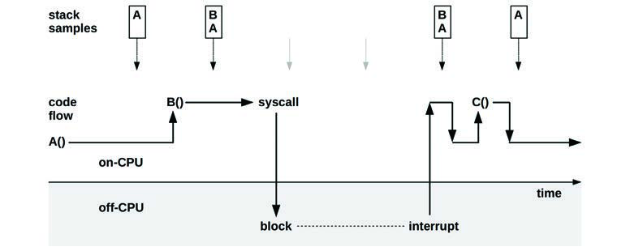
**图 6.14 样本驱动的 CPU 剖析**

图 6.14 显示了样本如何仅在进程在 CPU 上时被收集：两个样本显示函数 A() 在 CPU 上，两个样本显示函数 B() 在 CPU 上并由 A() 调用。系统调用期间的非 CPU 时间未被采样。此外，短寿命的函数 C() 完全被采样错过。

内核通常为进程维护两个堆栈跟踪：在内核上下文（例如系统调用）中时的用户级堆栈和内核堆栈。为了获得完整的 CPU 剖析，剖析器必须记录两个堆栈（如果可用）。

除了采样堆栈回溯外，剖析器还可以仅记录指令指针，这显示了正在 CPU 上的函数 and 指令偏移。有时这足以解决问题，且没有收集堆栈跟踪的额外开销。

#### 样本处理
如第 5 章所述，Netflix 的典型 CPU 剖析会在约 32 个 CPU 上以 49 赫兹收集 30 秒的用户 and 内核堆栈跟踪：这总共产生 47,040 个样本，并带来了两个挑战：

1. **存储 I/O**：剖析器通常将样本写入剖析文件，然后可以以不同方式读取 and 检查。然而，向文件系统写入如此多的样本会产生存储 I/O，从而干扰生产应用程序的性能。基于 BPF 的 `profile(8)` 工具通过在内核内存中汇总样本并仅发出汇总结果来解决存储 I/O 问题。不使用中间剖析文件。
2. **可理解性**：逐个阅读 47,040 个多行堆栈回溯是不切实际的：必须使用汇总 and 可视化来理解剖析结果。一种常用的堆栈跟踪可视化是**火焰图（flame graphs）**，其示例已在前面章节（1 and 5）中展示；本章还有更多示例。

图 6.15 展示了从 `perf(1)` and `profile` 生成 CPU 火焰图的总体步骤，解决了可理解性问题。它还展示了存储 I/O 问题是如何解决的：`profile(8)` 不使用中间文件，节省了开销。具体的命令列在 6.6.13 节 `perf` 中。

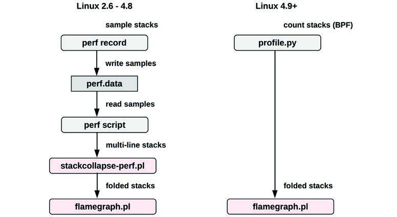
**图 6.15 CPU 火焰图生成**

虽然基于 BPF 的方法开销较低，但 `perf(1)` 方法保存了原始样本（带时间戳），这些样本可以使用不同的工具重新处理，包括 FlameScope（6.7.4 节）。

#### 剖析解读
一旦您收集并汇总或可视化了 CPU 剖析，下一步任务就是理解它并寻找性能问题。图 6.16 展示了一个 CPU 火焰图摘录，阅读该可视化的说明在 6.7.3 节“火焰图”中。您将如何总结该剖析？

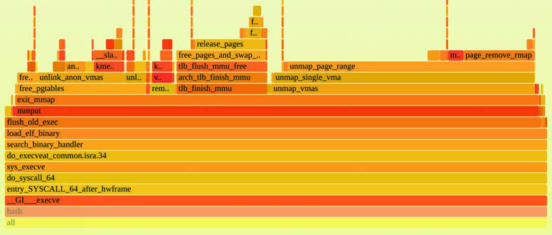
**图 6.16 CPU 火焰图摘录**

我在 CPU 火焰图中寻找性能收益的方法如下：

1. **自顶向下（从叶到根）寻找大的“平台（plateaus）”**。这些显示单个函数在许多样本期间都在 CPU 上，并能带来一些快速的收益。在图 6.16 中，右侧有两个平台，分别在 `unmap_page_range()` 和 `page_remove_rmap()` 中，都与内存页有关。也许一个快速的收益是让应用程序转而使用大页（large pages）。
2. **自底向上理解代码层次结构**。在这个例子中，`bash(1)` shell 正在调用 `execve(2)` 系统调用，该调用最终调用了页面函数。也许一个更大的收益是以某种方式避免 `execve(2)`，例如通过使用 bash 内置指令而不是外部进程，或者切换到另一种语言。
3. **更仔细地自顶向下观察分散但常见的 CPU 使用**。也许有许多与同一个问题相关的小框，例如锁竞争。将火焰图的合并顺序反转（使其从叶到根合并并变成冰柱图）可以帮助发现这些情况。

解释 CPU 火焰图的另一个示例见第 5 章“应用程序”的 5.4.1 节“CPU 剖析”。

#### 更多信息
CPU 剖析和火焰图的命令在 6.6 节“可观测性工具”中提供。另请参阅 5.4.1 节关于应用程序的 CPU 分析，以及 5.6 节“坑”，其中描述了因缺少堆栈跟踪 and 符号而导致的常见剖析问题。

对于特定 CPU 资源（如缓存 and 互连）的使用情况，剖析可以使用基于 PMC 事件的触发器而不是时间间隔。这将在下一节中描述。

### 6.5.5 周期分析 (Cycle Analysis)

您可以使用性能监控计数器（PMCs）来理解周期级别的 CPU 利用率。这可能会揭示出周期是花在等待 1、2 或 3 级缓存未命中、内存或资源 I/O 上，或者是花在浮点运算或其他活动上。这些信息可能会展示出通过调整编译器选项或更改代码可以实现的性能收益。

通过测量 IPC（CPI 的倒数）开始周期分析。如果 IPC 较低，请继续调查停顿周期的类型。如果 IPC 较高，请在代码中寻找减少指令执行的方法。IPC 的“高”或“低”值取决于您的处理器：低值可能小于 0.2，高值可能大于 1。您可以通过执行已知的内存 I/O 密集型或指令密集型工作负载并测量产生的 IPC 来感知这些数值。

除了测量计数器值外，PMCs 还可以配置为在给定值溢出时中断内核。例如，每发生 10,000 次 3 级缓存未命中时，内核可能会被中断以采集堆栈回溯。随着时间的推移，内核会建立导致 3 级缓存未命中的代码路径剖析，而没有测量每一次未命中的过高开销。这通常被集成开发环境（IDE）软件使用，用于在代码中注释引起内存 I/O and 停顿周期的位置。

如第 4 章“可观测性工具”的 4.3.9 节“PMC 挑战”所述，由于**偏离（skid）**和乱序执行，溢出采样可能会错过记录正确的指令。在 Intel 上，解决方案是 PEBS，它受到 Linux `perf(1)` 工具的支持。

周期分析是一项高级活动，使用命令行工具执行可能需要数天时间，如 6.6 节“可观测性工具”所示。您还应该预期要花费大量时间研读 CPU 供应商的处理器手册。Intel vTune [Intel 20b] 和 AMD uprof [AMD 20] 等性能分析器可以节省时间，因为它们经过编程可以找到您感兴趣的 PMCs。

### 6.5.6 性能监控 (Performance Monitoring)

性能监控可以识别活跃的问题和随时间变化的行为模式。CPU 的关键指标包括：

- **利用率 (Utilization)**：忙碌百分比。
- **饱和度 (Saturation)**：运行队列长度或调度器延迟。

应在每个 CPU 的基础上监控利用率，以识别线程可伸缩性问题。对于实施 CPU 限制 or 配额（资源控制）的环境（如云计算环境），还应记录与这些限制相比的 CPU 使用情况。

在监控 CPU 使用情况时，选择正确的测量 and 存档间隔是一个挑战。一些监控工具使用五分钟的间隔，这可能会掩盖较短的 CPU 利用率峰值（bursts）。每秒测量是更好的选择，但您应该意识到，即使在一秒钟内也可能存在峰值。这些可以通过饱和度来识别，并使用 FlameScope（6.7.4 节）进行检查，它是为亚秒级分析而创建的。

### 6.5.7 静态性能调优 (Static Performance Tuning)

静态性能调优侧重于已配置环境的问题。对于 CPU 性能，请检查静态配置的以下方面：

- 有多少 CPU 可供使用？它们是核心吗？硬件线程吗？
- GPU 或其他加速器是否可用并在使用中？
- CPU 架构是单处理器还是多处理器？
- CPU 缓存的大小是多少？它们是共享的吗？
- CPU 时钟速度是多少？它是动态的吗（例如，Intel Turbo Boost 和 SpeedStep）？这些动态功能在 BIOS 中启用了吗？
- BIOS 中启用或禁用了哪些其他 CPU 相关功能？例如，turboboost、总线设置、节能设置。
- 该处理器型号是否存在性能问题（缺陷）？它们是否列在处理器勘误表中？
- 微代码版本是什么？它是否包含针对安全漏洞（例如，Spectre/Meltdown）的性能影响缓解措施？
- 该 BIOS 固件版本是否存在性能问题（缺陷）？
- 是否存在软件强加的 CPU 使用限制（资源控制）？它们是什么？

这些问题的答案可能会揭示之前被忽视的配置选择。最后一点对于 CPU 使用通常受到限制的云计算环境尤其重要。

### 6.5.8 优先级调优 (Priority Tuning)

Unix 始终提供用于调整进程优先级的 `nice(2)` 系统调用，它设置一个 niceness 值。正的 nice 值会导致较低的进程优先级（更 nice），负值（只能由超级用户 root 设置[^7]）会导致较高的优先级。随后出现了 `nice(1)` 命令用于启动带 nice 值的程序，后来（在 BSD 中）又添加了 `renice(1M)` 命令用于调整已运行进程的 nice 值。Unix 第 4 版的手册页提供了这个示例 [TUHS 73]：

> 建议希望执行长时间运行程序而又不希望受到管理部门指责的用户使用 16 这个值。

nice 值在今天对于调整进程优先级仍然有用。当 CPU 存在竞争，导致高优先级工作的调度器延迟时，这最为有效。您的任务是识别低优先级的工作（可能包括监控代理和定期备份），并将它们修改为以 nice 值启动。也可以进行分析以检查调优是否有效，以及高优先级工作的调度器延迟是否保持在较低水平。

除了 nice 之外，操作系统还可能为进程优先级提供更高级的控制，例如更改调度类 and 调度策略，以及可调参数。Linux 包含一个实时调度类，它可以允许进程抢占所有其他工作。虽然这可以消除调度器延迟（除了针对其他实时进程 and 中断外），但请确保您了解其后果。如果实时应用程序遇到多个线程进入死循环的 bug，它可能会导致所有 CPU 对于所有其他工作都不可用——包括手动解决问题所需的管理 shell[^8]。

### 6.5.9 资源控制 (Resource Controls)

操作系统可能提供细粒度的控制，用于将 CPU 周期分配给进程 or 进程组。这些可能包括 CPU 利用率的固定限制，以及采用更灵活方法的份额（shares）——允许根据份额值消耗空闲的 CPU 周期。这些具体如何工作取决于实现，并在 6.9 节“调优”中讨论。

### 6.5.10 CPU 绑定 (CPU Binding)

另一种调优 CPU 性能的方法涉及将进程 and 线程绑定到单个 CPU or CPU 集合。这可以增加进程的 CPU 缓存热度，从而提高其内存 I/O 性能。对于 NUMA 系统，它还改进了内存局部性，进一步提高了性能。

通常有两种执行方式：

- **CPU 绑定 (CPU binding)**：配置一个进程仅在单个 CPU 上运行，或者仅在定义的集合中的一个 CPU 上运行。
- **独占 CPU 集合 (Exclusive CPU sets)**：划分出一组 CPU，仅供分配给它们的进程使用。这可以进一步提高 CPU 缓存热度，因为当该进程空闲时，其他进程不能使用这些 CPU。

在基于 Linux 的系统上，独占 CPU 集合方法可以使用 cpusets 实现。6.9 节“调优”中提供了配置示例。

### 6.5.11 微基准测试 (Micro-Benchmarking)

CPU 微基准测试工具通常测量执行简单操作多次所花费的时间。操作可能基于：

- **CPU 指令**：整数算术、浮点运算、内存加载 and 存储、分支及其他指令。
- **内存访问**：研究不同 CPU 缓存的延迟 and 主内存吞吐量。
- **高级语言**：类似于 CPU 指令测试，但使用高级解释型 or 编译型语言编写。
- **操作系统操作**：测试系统库 and 系统调用中属于 CPU 密集型的函数，例如 `getpid(2)` and 进程创建。

CPU 基准测试的一个早期例子是国家物理实验室的 Whetstone，于 1972 年用 Algol 60 编写，旨在模拟科学工作负载。Dhrystone 基准测试于 1984 年开发，用于模拟当时的整数工作负载，并成为比较 CPU 性能的流行手段。这些基准测试，以及包括进程创建 and 管道吞吐量在内的各种 Unix 基准测试，被包含在一个名为 UnixBench 的集合中，该集合最初来自莫纳什大学并由 BYTE 杂志发布 [Hinnant 84]。最近创建的 CPU 基准测试用于测试压缩速度、素数计算、加密 and 编码。

无论您使用哪种基准测试，在比较系统之间的结果时，重要的是要了解真正测试的是什么。像前面列出的那些基准测试往往最终测试的是不同编译器版本之间的编译器优化差异，而不是基准测试代码 or CPU 速度。许多基准测试是以单线程执行的，其结果在具有多个 CPU 的系统中失去了意义。（一个四 CPU 系统基准测试可能比八 CPU 系统稍快，但后者在给定足够的并行可运行线程时可能会交付大得多的吞吐量。）

有关基准测试的更多信息，见第 12 章“基准测试”。

## 6.6 可观测性工具 (Observability Tools)

本节介绍基于 Linux 操作系统的 CPU 性能可观测性工具。使用它们时请遵循上一节中的方法论。

本节涉及的工具列在表 6.8 中。

**表 6.8 Linux CPU 可观测性工具**

| 节 | 工具 | 描述 |
| :--- | :--- | :--- |
| **6.6.1** | uptime | 负载平均值 |
| **6.6.2** | vmstat | 包含系统范围的 CPU 平均值 |
| **6.6.3** | mpstat | 每个 CPU 的统计信息 |
| **6.6.4** | sar | 历史统计信息 |
| **6.6.5** | ps | 进程状态 |
| **6.6.6** | top | 监控每个进程/线程的 CPU 使用情况 |
| **6.6.7** | pidstat | 每个进程/线程的 CPU 细分 |
| **6.6.8** | time, ptime | 对命令进行计时，带 CPU 细分 |
| **6.6.9** | turbostat | 显示 CPU 时钟频率和其他状态 |
| **6.6.10** | showboost | 显示 CPU 时钟频率和 Turbo Boost |
| **6.6.11** | pmcarch | 显示高层级 CPU 周期使用情况 |
| **6.6.12** | tlbstat | 汇总 TLB 周期 |
| **6.6.13** | perf | CPU 剖析和 PMC 分析 |
| **6.6.14** | profile | 采样 CPU 堆栈跟踪 |
| **6.6.15** | cpudist | 汇总在 CPU 上的时间 |
| **6.6.16** | runqlat | 汇总 CPU 运行队列延迟 |
| **6.6.17** | runqlen | 汇总 CPU 运行队列长度 |
| **6.6.18** | softirqs | 汇总软中断时间 |
| **6.6.19** | hardirqs | 汇总硬中断时间 |
| **6.6.20** | bpftrace | 用于 CPU 分析的追踪程序 |

这是一组用于支持 6.5 节“方法论”的工具和功能。我们首先介绍传统的 CPU 统计工具，然后介绍用于使用代码路径剖析、CPU 周期分析和追踪工具进行更深入分析的工具。其中一些传统工具可能在其他类 Unix 操作系统上可用（有时起源于这些系统），包括：`uptime(1)`、`vmstat(8)`、`mpstat(1)`、`sar(1)`、`ps(1)`、`top(1)` 和 `time(1)`。追踪工具基于 BPF 及其 BCC 和 bpftrace 前端（见第 15 章），包括：`profile(8)`、`cpudist(8)`、`runqlat(8)`、`runqlen(8)`、`softirqs(8)` 和 `hardirqs(8)`。

有关各工具的功能完整参考，请参阅其文档（包括手册页）。

### 6.6.1 uptime

`uptime(1)` 是打印系统负载平均值的几个命令之一：

```bash
$ uptime
  9:04pm  up 268 day(s), 10:16,  2 users,  load average: 7.76, 8.32, 8.60
```

最后三个数字是 1 分钟、5 分钟和 15 分钟的负载平均值。通过比较这三个数字，您可以确定负载在过去 15 分钟（左右）内是在增加、减少还是平稳。这很有用：如果您正在响应生产环境性能问题并发现负载正在下降，您可能已经错过了问题；如果负载正在增加，问题可能会变得更糟！

以下各节将更详细地解释负载平均值，但它们只是一个起点，因此在转向其他指标之前，您不应花费超过五分钟的时间来考虑它们。

#### 负载平均值 (Load Averages)
负载平均值指示了对系统资源的需求：越高意味着需求越大。在某些操作系统（如 Solaris）上，负载平均值显示的是 CPU 需求，早期版本的 Linux 也是如此。但在 1993 年，Linux 将负载平均值更改为显示全系统的需求：CPU、磁盘和其他资源[^9]。这是通过在负载计算中包含处于 `TASK_UNINTERRUPTIBLE` 线程状态（一些工具显示为状态“D”，该状态在第 5 章“应用程序”的 5.4.5 节“线程状态分析”中提到过）的线程来实现的。

负载被测量为当前资源使用量（利用率）加上排队的请求（饱和度）。想象一下一个汽车收费站：您可以通过计算正在接受服务的汽车数量（利用率）加上正在排队的汽车数量（饱和度）来测量一天中各个时间点的负载。

平均值是一个指数衰减的移动平均值，它反映了 1 分钟、5 分钟和 15 分钟时间之外的负载（这些时间实际上是指数移动总和中使用的常数 [Myer 73]）。图 6.17 展示了一个简单实验的结果，在该实验中启动了一个单 CPU 密集型线程并绘制了负载平均值图。

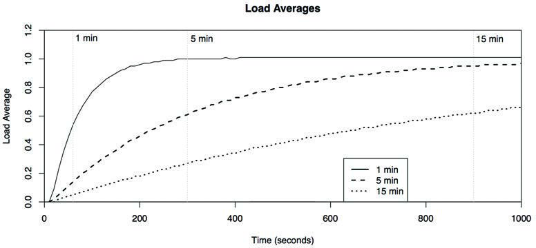
**图 6.17 指数衰减的负载平均值**

到 1 分钟、5 分钟和 15 分钟标记处，负载平均值已达到已知负载 1.0 的约 61%。

负载平均值在早期 BSD 中被引入到 Unix，并基于调度器平均队列长度和早期操作系统（CTSS、Multics [Saltzer 70]、TENEX [Bobrow 72]）中常用的负载平均值。它们在 RFC 546 [Thomas 73] 中被描述为：

> [1] TENEX 负载平均值是 CPU 需求的衡量标准。负载平均值是在给定时间段内可运行进程数量的平均值。例如，每小时 10 的负载平均值意味着（对于单 CPU 系统）在该小时内的任何时间，人们都可以预期看到 1 个进程正在运行，另外 9 个进程处于就绪状态（即未因 I/O 而阻塞）等待 CPU。

作为一个现代示例，考虑一个负载平均值为 128 的 64-CPU 系统。如果负载仅来自 CPU，这意味着平均而言每个 CPU 始终有一个线程正在运行，且每个 CPU 都有一个线程正在等待。具有 CPU 负载平均值为 20 的同一系统则指示有显著的余量，因为在所有 CPU 都变忙之前它还可以运行另外 44 个 CPU 密集型线程。（一些公司监控**归一化负载平均值（normalized load average）**指标，该指标会自动除以 CPU 数量，使其无需知道 CPU 数量即可被解释。）

#### 压力停顿信息 (Pressure Stall Information, PSI)
在本手册的第一版中，我描述了如何为每种资源类型提供负载平均值以辅助解释。Linux 4.20 中现在添加了一个提供此类细分的接口：压力停顿信息 (PSI)，它提供 CPU、内存和 I/O 的平均值。该平均值显示了某物在资源上停滞（仅限饱和度）的时间百分比。表 6.9 将其与负载平均值进行了比较。

**表 6.9 Linux 负载平均值与压力停顿信息的对比**

| 属性 | 负载平均值 | 压力停顿信息 |
| :--- | :--- | :--- |
| **资源** | 全系统 | cpu, memory, io (各自独立) |
| **指标** | 忙碌和排队任务的数量 | 停滞（等待）的时间百分比 |
| **时间** | 1 min, 5 min, 15 min | 10 s, 60 s, 300 s |
| **平均值** | 指数衰减移动总和 | 指数衰减移动总和 |

表 6.10 展示了该指标在不同场景下的表现：

**表 6.10 Linux 负载平均值示例与压力停顿信息的对比**

| 示例场景 | 负载平均值 | 压力停顿信息 |
| :--- | :--- | :--- |
| 2 CPUs, 1 个忙碌线程 | 1.0 | 0.0 |
| 2 CPUs, 2 个忙碌线程 | 2.0 | 0.0 |
| 2 CPUs, 3 个忙碌线程 | 3.0 | 50.0 |
| 2 CPUs, 4 个忙碌线程 | 4.0 | 100.0 |
| 2 CPUs, 5 个忙碌线程 | 5.0 | 100.0 |

例如，展示 2 CPU 配合 3 个忙碌线程的场景：

```bash
$ uptime
 07:51:13 up 4 days,  9:56,  2 users,  load average: 3.00, 3.00, 2.55
$ cat /proc/pressure/cpu
some avg10=50.00 avg60=50.00 avg300=49.70 total=1031438206
```

这个 50.0 的值意味着一个线程（“some”）有 50% 的时间处于停滞状态。`io` 和 `memory` 指标包含第二行，用于表示所有非空闲线程都停滞的情况（“full”）。PSI 最能回答这个问题：任务必须等待资源的可能性有多大？

无论您使用负载平均值还是 PSI，您都应该迅速转向更详细的指标来了解负载，例如 `vmstat(1)` 和 `mpstat(1)` 提供的指标。

### 6.6.2 vmstat

虚拟内存统计命令 `vmstat(8)` 在最后几列打印全系统的 CPU 平均值，并在第一列打印可运行线程的数量。以下是 Linux 版本的输出示例：

```bash
$ vmstat 1
procs -----------memory---------- ---swap-- -----io---- -system-- ------cpu-----
 r  b   swpd   free   buff  cache   si   so    bi    bo   in   cs us sy id wa st
15  0      0 451732  70588 866628    0    0     1    10   43   38  2  1 97  0  0
15  0      0 450968  70588 866628    0    0     0   612 1064 2969 72 28  0  0  0
15  0      0 450660  70588 866632    0    0     0     0  961 2932 72 28  0  0  0
15  0      0 450952  70588 866632    0    0     0     0 1015 3238 74 26  0  0  0
[...]
```

输出的第一行应该是自启动以来的汇总。然而，在 Linux 上，procs 和 memory 列一开始显示的是当前状态。（也许有一天它们会被修复。）CPU 相关的列有：

- **r**: 运行队列长度——可运行线程的总数
- **us**: 用户时间百分比
- **sy**: 系统时间（内核）百分比
- **id**: 空闲百分比
- **wa**: 等待 I/O 百分比，测量当线程阻塞在磁盘 I/O 时 CPU 空闲的时间
- **st**: 窃取（stolen）百分比，对于虚拟化环境，显示花在服务其他租户上的 CPU 时间

所有这些值都是全系统所有 CPU 的平均值，唯一的例外是 **r**，它是总数。

在 Linux 上，**r** 列是等待任务加上运行任务的总数。对于其他操作系统（如 Solaris），**r** 列仅显示等待的任务，而不包括正在运行的任务。Bill Joy 和 Ozalp Babaoglu 在 1979 年为 3BSD 编写的原始 `vmstat(1)` 以 **RQ** 列开始，表示可运行和运行进程的数量，正如 Linux 的 `vmstat(8)` 目前所做的那样。

### 6.6.3 mpstat

多处理器统计工具 `mpstat(1)` 可以按 CPU 报告统计信息。以下是 Linux 版本的输出示例：

```bash
$ mpstat -P ALL 1
Linux 5.3.0-1009-aws (ip-10-0-239-218)  02/01/20        _x86_64_        (2 CPU)

18:00:32  CPU   %usr  %nice   %sys %iowait   %irq  %soft %steal %guest %gnice  %idle
18:00:33  all  32.16   0.00  61.81    0.00   0.00   0.00   0.00   0.00   0.00   6.03
18:00:33    0  32.00   0.00  64.00    0.00   0.00   0.00   0.00   0.00   0.00   4.00
18:00:33    1  32.32   0.00  59.60    0.00   0.00   0.00   0.00   0.00   0.00   8.08

18:00:33  CPU   %usr  %nice   %sys %iowait   %irq  %soft %steal %guest %gnice  %idle
18:00:34  all  33.83   0.00  61.19    0.00   0.00   0.00   0.00   0.00   0.00   4.98
18:00:34    0  34.00   0.00  62.00    0.00   0.00   0.00   0.00   0.00   0.00   4.00
18:00:34    1  33.66   0.00  60.40    0.00   0.00   0.00   0.00   0.00   0.00   5.94
[...]
```

使用了 `-P ALL` 选项来打印每个 CPU 的报告。默认情况下，`mpstat(1)` 仅打印全系统汇总行（all）。列包括：

- **CPU**: 逻辑 CPU ID，或 `all` 表示汇总
- **%usr**: 用户时间，不包括 `%nice`
- **%nice**: 具有 nice 优先级的进程的用户时间
- **%sys**: 系统时间（内核）
- **%iowait**: I/O 等待
- **%irq**: 硬件中断 CPU 使用率
- **%soft**: 软件中断 CPU 使用率
- **%steal**: 花在服务其他租户上的时间
- **%guest**: 花在客户虚拟机中的 CPU 时间
- **%gnice**: 运行 niced 客户机的 CPU 时间
- **%idle**: 空闲

关键列是 `%usr`、`%sys` 和 `%idle`。这些可以识别每个 CPU 的 CPU 使用情况，并显示用户时间/内核时间比例（见 6.3.9 节“用户时间/内核时间”）。这还可以识别“热（hot）”CPU——那些运行在 100% 利用率（`%usr` + `%sys`）而其他 CPU 则不然的情况，这可能是由单线程应用程序工作负载或设备中断映射引起的。

请注意，该工具和其他从相同内核统计信息（`/proc/stat` 等）获取来源的工具所报告的 CPU 时间，以及这些统计信息的准确性取决于内核配置。参见第 4 章“可观测性工具”的 4.3.1 节 `/proc` 下的“CPU 统计准确性”标题。

### 6.6.4 sar

系统活动报告器 `sar(1)` 可用于观察当前活动，并可配置为存档和报告历史统计信息。它在第 4 章“可观测性工具”的 4.4 节 `sar` 中介绍过，并在其他章节中根据需要提到。

Linux 版本为 CPU 分析提供了以下选项：

- **-P ALL**: 与 `mpstat -P ALL` 相同
- **-u**: 与 `mpstat(1)` 的默认输出相同：仅全系统平均值
- **-q**: 包含作为 `runq-sz` 的运行队列大小（等待加运行，与 `vmstat(1)` 的 **r** 相同）和负载平均值

可以启用 `sar(1)` 数据收集，以便可以观察过去的这些指标。更多细节见 4.4 节 `sar`。

### 6.6.5 ps

进程状态命令 `ps(1)` 可以列出所有进程的详细信息，包括 CPU 使用统计。例如：

```bash
$ ps aux
USER       PID %CPU %MEM    VSZ   RSS TTY      STAT START   TIME COMMAND
root         1  0.0  0.0  23772  1948 ?        Ss    2012   0:04 /sbin/init
root         2  0.0  0.0      0     0 ?        S     2012   0:00 [kthreadd]
root         3  0.0  0.0      0     0 ?        S     2012   0:26 [ksoftirqd/0]
root         4  0.0  0.0      0     0 ?        S     2012   0:00 [migration/0]
root         5  0.0  0.0      0     0 ?        S     2012   0:00 [watchdog/0]
[...]
web      11715 11.3  0.0 632700 11540 pts/0    Sl   01:36   0:27 node indexer.js
web      11721 96.5  0.1 638116 52108 pts/1    Rl+  01:37   3:33 node proxy.js
[...]
```

这种操作风格起源于 BSD，可以通过 `aux` 选项前缺少连字符来识别。这些选项列出所有用户 (a)，带有扩展的用户详细信息 (u)，并包括没有终端的进程 (x)。终端在 teletype (TTY) 列中显示。

另一种源自 SVR4 的风格使用前缀带连字符的选项：

```bash
$ ps -ef
UID        PID  PPID  C STIME TTY          TIME CMD
root         1     0  0 Nov13 ?        00:00:04 /sbin/init
root         2     0  0 Nov13 ?        00:00:00 [kthreadd]
root         3     2  0 Nov13 ?        00:00:00 [ksoftirqd/0]
root         4     2  0 Nov13 ?        00:00:00 [migration/0]
root         5     2  0 Nov13 ?        00:00:00 [watchdog/0]
[...]
```

这列出了每个进程 (-e) 及其完整详细信息 (-f)。`ps(1)` 还有各种其他可用选项，包括 `-o` 用于自定义输出和显示的列。

CPU 使用的关键列是 **TIME** 和 **%CPU**（见前面的例子）。

**TIME** 列显示了自进程创建以来消耗的总 CPU 时间（用户 + 系统），格式为 小时:分钟:秒。

在 Linux 上，第一个例子中的 **%CPU** 列显示了进程在其生命周期内的平均 CPU 利用率，跨所有 CPU 求和。一个始终处于 CPU 密集型状态的单线程进程将报告 100%。一个两线程的 CPU 密集型进程将报告 200%。其他操作系统可能会将 **%CPU** 归一化为 CPU 数量，使其最大值为 100%，并且它们可能只显示近期或当前的 CPU 使用情况，而不是整个生命周期内的平均值。在 Linux 上，要查看进程当前的 CPU 使用情况，可以使用 `top(1)`。

### 6.6.6 top

`top(1)` 由 William LeFebvre 在 1984 年为 BSD 创建。他的灵感来自于 VMS 命令 `MONITOR PROCESS/TOPCPU`，该命令显示了主要 CPU 消耗作业的 CPU 百分比和 ASCII 条形图直方图（但不是数据列）。

`top(1)` 命令监控排名前列的运行进程，并定期更新屏幕。例如，在 Linux 上：

```bash
$ top
top - 01:38:11 up 63 days,  1:17,  2 users,  load average: 1.57, 1.81, 1.77
Tasks: 256 total,   2 running, 254 sleeping,   0 stopped,   0 zombie
Cpu(s):  2.0%us,  3.6%sy,  0.0%ni, 94.2%id,  0.0%wa,  0.0%hi,  0.2%si,  0.0%st
Mem:  49548744k total, 16746572k used, 32802172k free,   182900k buffers
Swap: 100663292k total,        0k used, 100663292k free, 14925240k cached

  PID USER      PR  NI  VIRT  RES  SHR S %CPU %MEM    TIME+  COMMAND
11721 web       20   0  623m  50m 4984 R   93  0.1   0:59.50 node
11715 web       20   0  619m  20m 4916 S   25  0.0   0:07.52 node
   10 root      20   0     0    0    0 S    1  0.0 248:52.56 ksoftirqd/2
   51 root      20   0     0    0    0 S    0  0.0   0:35.66 events/0
11724 admin     20   0 19412 1444  960 R    0  0.0   0:00.07 top
    1 root      20   0 23772 1948 1296 S    0  0.0   0:04.35 init
```

顶部是全系统汇总，底部是进程/任务列表，默认按最高 CPU 消耗者排序。全系统汇总包括负载平均值和 CPU 状态：`%us`、`%sy`、`%ni`、`%id`、`%wa`、`%hi`、`%si`、`%st`。这些状态等同于前面描述的 `mpstat(1)` 打印的状态，并且是跨所有 CPU 的平均值。

CPU 使用情况由 **TIME+** 和 **%CPU** 列显示。**TIME+** 是进程消耗的总 CPU 时间，分辨率为百分之一秒。例如，“1:36.53”意味着总共有 1 分钟 36.53 秒的在 CPU 上的时间。某些版本的 `top(1)` 提供可选的“累积时间”模式，其中包括已退出的子进程的 CPU 时间。

**%CPU** 列显示当前屏幕更新间隔内的总 CPU 利用率。在 Linux 上，这没有按 CPU 数量进行归一化，因此一个两线程的 CPU 密集型进程将报告 200%；`top(1)` 称之为“Irix 模式”，因其在 IRIX 上的行为而得名。这可以切换到“Solaris 模式”（通过按 `I` 键切换模式），该模式会将 CPU 使用率除以 CPU 数量。在这种情况下，16-CPU 服务器上的两线程进程将报告 CPU 为 12.5%。

虽然 `top(1)` 经常是初级性能分析人员的工具，但您应该意识到 `top(1)` 本身的 CPU 使用率可能会变得很大，并使 `top(1)` 成为排名第一的 CPU 消耗进程！这是由于它用于读取 `/proc` 的系统调用——`open(2)`、`read(2)`、`close(2)`——以及在许多进程上调用这些函数造成的。其他操作系统上的某些 `top(1)` 版本通过保持文件描述符打开并调用 `pread(2)` 来减少了开销。

`top(1)` 有一个名为 `htop(1)` 的变体，它提供了更多交互功能、自定义和用于 CPU 使用率的 ASCII 条形图。它还调用了四倍于此的系统调用，对系统的干扰甚至更大。我很少使用它。

由于 `top(1)` 拍摄 `/proc` 的快照，它可能会错过在快照拍摄之前退出的短寿命进程。这在软件构建过程中经常发生，此时 CPU 可能会被来自构建过程的许多短寿命工具重负载运行。Linux 的 `top(1)` 变体 `atop(1)` 使用进程记账来捕捉短寿命进程的存在，并将其包含在显示中。

### 6.6.7 pidstat

Linux 的 `pidstat(1)` 工具打印按进程或线程划分的 CPU 使用情况，包括用户时间和系统时间的细分。默认情况下，它打印仅针对活跃进程的滚动输出。例如：

```bash
$ pidstat 1
Linux 2.6.35-32-server (dev7)   11/12/12        _x86_64_        (16 CPU)

22:24:42          PID    %usr %system  %guest    %CPU   CPU  Command
22:24:43         7814    0.00    1.98    0.00    1.98     3  tar
22:24:43         7815   97.03    2.97    0.00  100.00    11  gzip

22:24:43          PID    %usr %system  %guest    %CPU   CPU  Command
22:24:44          448    0.00    1.00    0.00    1.00     0  kjournald
22:24:44         7814    0.00    2.00    0.00    2.00     3  tar
22:24:44         7815   97.00    3.00    0.00  100.00    11  gzip
22:24:44         7816    0.00    2.00    0.00    2.00     2  pidstat
[...]
```

这个例子捕捉了一个系统备份，涉及用于从文件系统读取文件的 `tar(1)` 命令，以及用于压缩文件的 `gzip(1)` 命令。正如预期的那样，`gzip(1)` 的用户时间很高，因为它在压缩代码中变成了 CPU 密集型。`tar(1)` 命令在内核中花费的时间更多，用于从文件系统读取。

可以使用 `-p ALL` 选项打印所有进程，包括空闲进程。`-t` 打印按线程统计的信息。其他 `pidstat(1) `选项包含在本书的其他章节中。

### 6.6.8 time, ptime

`time(1)` 命令可用于运行程序并报告 CPU 使用情况。它由操作系统在 `/usr/bin` 下提供，也作为 shell 内置指令提供。

本例在 `cksum(1)` 命令上运行两次 `time`，计算一个大文件的校验和：

```bash
$ time cksum ubuntu-19.10-live-server-amd64.iso
1044945083 883949568 ubuntu-19.10-live-server-amd64.iso

real     0m5.590s
user     0m2.776s
sys      0m0.359s
$ time cksum ubuntu-19.10-live-server-amd64.iso
1044945083 883949568 ubuntu-19.10-live-server-amd64.iso

real     0m2.857s
user     0m2.733s
sys      0m0.114s
```

第一次运行耗时 5.6 秒，其中 2.8 秒处于用户模式，计算校验和。系统时间有 0.4 秒，涵盖了读取文件所需的系统调用。缺失的 2.4 秒（5.6 – 2.8 – 0.4）很可能是阻塞在磁盘 I/O 读取上的时间，因为该文件仅被部分缓存。第二次运行完成得更快，耗时 2.9 秒，几乎没有阻塞时间。这是预料之中的，因为文件在第二次运行中可能已完全缓存到主内存中。

在 Linux 上，`/usr/bin/time` 版本支持详细（verbose）模式。例如：

```bash
$ /usr/bin/time -v cp fileA fileB
        Command being timed: "cp fileA fileB"
        User time (seconds): 0.00
        System time (seconds): 0.26
        Percent of CPU this job got: 24%
        Elapsed (wall clock) time (h:mm:ss or m:ss): 0:01.08
        Average shared text size (kbytes): 0
        Average unshared data size (kbytes): 0
        Average stack size (kbytes): 0
        Average total size (kbytes): 0
        Maximum resident set size (kbytes): 3792
        Average resident set size (kbytes): 0
        Major (requiring I/O) page faults: 0
        Minor (reclaiming a frame) page faults: 294
        Voluntary context switches: 1082
        Involuntary context switches: 1
        Swaps: 0
        File system inputs: 275432
        File system outputs: 275432
        Socket messages sent: 0
        Socket messages received: 0
        Signals delivered: 0
        Page size (bytes): 4096
        Exit status: 0
```

`-v` 选项通常不在 shell 内置版本中提供。

### 6.6.9 turbostat

`turbostat(1)` 是一个基于特定型号寄存器 (MSR) 的工具，显示 CPU 的状态，通常在 `linux-tools-common` 包中提供。MSR 在第 4 章“可观测性工具”的 4.3.10 节“其他可观测性源”中提到过。以下是一些示例输出：

```bash
# turbostat
turbostat version 17.06.23 - Len Brown <lenb@kernel.org>
CPUID(0): GenuineIntel 22 CPUID levels; family:model:stepping 0x6:8e:a (6:142:10)
CPUID(1): SSE3 MONITOR SMX EIST TM2 TSC MSR ACPI-TM TM
CPUID(6): APERF, TURBO, DTS, PTM, HWP, HWPnotify, HWPwindow, HWPepp, No-HWPpkg, EPB
cpu0: MSR_IA32_MISC_ENABLE: 0x00850089 (TCC EIST No-MWAIT PREFETCH TURBO)
CPUID(7): SGX
cpu0: MSR_IA32_FEATURE_CONTROL: 0x00040005 (Locked SGX)
CPUID(0x15): eax_crystal: 2 ebx_tsc: 176 ecx_crystal_hz: 0
TSC: 2112 MHz (24000000 Hz * 176 / 2 / 1000000)
CPUID(0x16): base_mhz: 2100 max_mhz: 4200 bus_mhz: 100
[...]

Core    CPU     Avg_MHz  Busy%   Bzy_MHz  TSC_MHz  IRQ     SMI     C1      C1E
        C3      C6       C7s     C8       C9       C10     C1%     C1E%    C3%
        C6%     C7s%     C8%     C9%      C10%     CPU%c1  CPU%c3  CPU%c6  CPU%c7
        CoreTmp PkgTmp   GFX%rc6 GFXMHz   Totl%C0  Any%C0  GFX%C0  CPUGFX% Pkg%pc2
        Pkg%pc3 Pkg%pc6  Pkg%pc7 Pkg%pc8  Pkg%pc9  Pk%pc10 PkgWatt CorWatt GFXWatt
        RAMWatt PKG_%    RAM_%
[...]
0       0       97       2.70    3609     2112     1370    0       41      293
        41      453      0       693      0        311     0.24    1.23    0.15
        5.35    0.00     39.33   0.00     50.97    7.50    0.18    6.26    83.37
        52      75       91.41   300      118.58   100.38  8.47    8.30    0.00
        0.00    0.00     0.00    0.00     0.00     0.00    17.69   14.84   0.65
        1.23    0.00     0.00
[...]
```

`turbostat(8)` 首先打印有关 CPU 和 MSR 的信息，这可能有超过 50 行的输出，此处已截断。然后它以默认 5 秒的间隔打印所有 CPU 和每个 CPU 指标的间隔摘要。在这个例子中，间隔摘要输出宽度为 389 个字符，且行已折叠了五次，使其难以阅读。列包括 CPU 编号 (CPU)、平均时钟速率 (Avg_MHz)、C 状态信息、温度 (*Tmp) 和功率 (*Watt)。

### 6.6.10 showboost

在 Netflix 云端提供 `turbostat(8)` 之前，我开发了 `showboost(1)` 来显示带有每间隔摘要的 CPU 时钟速率。`showboost(1)` 是“show turbo boost”的缩写，也使用 MSR。一些示例输出：

```bash
# showboost
Base CPU MHz : 3000
Set CPU MHz  : 3000
Turbo MHz(s) : 3400 3500
Turbo Ratios : 113% 116%
CPU 0 summary every 1 seconds...

TIME       C0_MCYC      C0_ACYC        UTIL  RATIO    MHz
21:41:43   3021819807   3521745975     100%   116%   3496
21:41:44   3021682653   3521564103     100%   116%   3496
21:41:45   3021389796   3521576679     100%   116%   3496
[...]
```

此输出显示 CPU0 的时钟速率为 3496 MHz。基准 CPU 频率为 3000 MHz：它通过 Intel turbo boost 达到了 3496。可能的 turbo boost 级别或“步阶（steps）”也列在输出中：3400 和 3500 MHz。

`showboost(8)` 包含在我的 `msr-cloud-tools` 存储库中 [Gregg 20d]，由于我是为了在云中使用而开发的，所以这样命名。因为我只保持它在 Netflix 环境中工作，所以它可能因 CPU 差异而无法在其他地方工作，在这种情况下可以尝试 `turboboost(1)`。

### 6.6.11 pmcarch

`pmcarch(8)` 显示 CPU 周期性能的高层视图。它是一个基于 PMCs 的工具，基于 Intel 的“架构集（architectural set）”PMCs，因此得名（PMCs 已在第 4 章“可观测性工具”的 4.3.9 节“硬件计数器 (PMCs)”中解释过）。在某些云环境中，这些架构 PMCs 是唯一可用的（例如，某些 AWS EC2 实例）。一些示例输出：

```bash
# pmcarch
K_CYCLES   K_INSTR    IPC BR_RETIRED   BR_MISPRED  BMR% LLCREF    LLCMISS     LLC%
96163187   87166313  0.91 19730994925  679187299   3.44 656597454 174313799  73.45
93988372   87205023  0.93 19669256586  724072315   3.68 666041693 169603955  74.54
93863787   86981089  0.93 19548779510  669172769   3.42 649844207 176100680  72.90
93739565   86349653  0.92 19339320671  634063527   3.28 642506778 181385553  71.77
[...]
```

该工具打印原始计数器以及一些以百分比表示的比率。列包括：

- **K_CYCLES**: CPU 周期 x 1000
- **K_INSTR**: CPU 指令 x 1000
- **IPC**: 每周期指令数 (Instructions-Per-Cycle)
- **BMR%**: 分支预测错误率，百分比
- **LLC%**: 最后一级缓存命中率，百分比

IPC 在 6.3.7 节“IPC, CPI”中连同示例值一起解释过。提供的其他比率 BMR% 和 LLC% 提供了关于为什么 IPC 可能较低以及停顿周期可能在哪里的见解。

我为我的 `pmc-cloud-tools` 存储库开发了 `pmcarch(8)`，该存储库中还有用于更多 CPU 缓存统计信息的 `cpucache(8)` [Gregg 20e]。这些工具采用了变通方法并使用处理器特定的 PMCs，以便它们在 AWS EC2 云上工作，可能无法在其他地方工作。即使这对您永远不起作用，它也提供了有用的 PMCs 示例，您可以直接使用 `perf(1)` 对其进行插桩（6.6.13 节 `perf`）。

### 6.6.12 tlbstat

`tlbstat(8)` 是 `pmc-cloud-tools` 的另一个工具，显示 TLB 缓存统计信息。示例输出：

```bash
# tlbstat -C0 1
K_CYCLES   K_INSTR      IPC DTLB_WALKS ITLB_WALKS K_DTLBCYC  K_ITLBCYC  DTLB% ITLB%
2875793    276051      0.10 89709496   65862302   787913     650834     27.40 22.63
2860557    273767      0.10 88829158   65213248   780301     644292     27.28 22.52
2885138    276533      0.10 89683045   65813992   787391     650494     27.29 22.55
2532843    243104      0.10 79055465   58023221   693910     573168     27.40 22.63
[...]
```

此特定输出展示了针对 KPTI 补丁的最坏情况，这些补丁用于绕过 Meltdown CPU 漏洞（KPTI 的性能影响在第 3 章“操作系统”的 3.4.3 节“KPTI (Meltdown)”中总结过）。KPTI 在系统调用和其他事件时刷新 TLB 缓存，导致 TLB 遍历期间产生停顿周期：这显示在最后两列中。在此输出中，CPU 大约花费其一半的时间在 TLB 遍历上，预计应用程序工作负载运行速度大约会减慢一半。

列包括：

- **K_CYCLES**: CPU 周期 × 1000
- **K_INSTR**: CPU 指令 × 1000
- **IPC**: 每周期指令数
- **DTLB_WALKS**: 数据 TLB 遍历（计数）
- **ITLB_WALKS**: 指令 TLB 遍历（计数）
- **K_DTLBCYC**: 至少一个 PMH 处于活动状态进行数据 TLB 遍历的周期 × 1000
- **K_ITLBCYC**: 至少一个 PMH 处于活动状态进行指令 TLB 遍历的周期 × 1000
- **DTLB%**: 数据 TLB 活动周期占总周期的比例
- **ITLB%**: 指令 TLB 活动周期占总周期的比例

与 `pmcarch(8)` 一样，该工具可能因处理器差异而无法在您的环境中工作。尽管如此，它仍是一个有用的点子来源。

### 6.6.13 perf

`perf(1)` 是官方的 Linux 剖析器，是一个具有多种功能的多功能工具。第 13 章提供了 `perf(1)` 的摘要。本节涵盖其在 CPU 分析中的用法。

#### 一行命令 (One-Liners)
以下一行命令既有用，又展示了 `perf(1)` 用于 CPU 分析的不同功能。其中一些在后续章节中有更详细的解释。

采样指定命令的在 CPU 上的函数，频率为 99 赫兹：

```bash
perf record -F 99 command
```

全系统范围内采样 CPU 堆栈跟踪（通过帧指针），持续 10 秒：

```bash
perf record -F 99 -a -g -- sleep 10
```

采样指定 PID 的 CPU 堆栈跟踪，使用 dwarf（调试信息）来回溯堆栈：

```bash
perf record -F 99 -p PID --call-graph dwarf -- sleep 10
```

通过 exec 记录新进程事件：

```bash
perf record -e sched:sched_process_exec -a
```

记录上下文切换事件，持续 10 秒，并带有堆栈跟踪：

```bash
perf record -e sched:sched_switch -a -g -- sleep 10
```

采样 10 秒内的 CPU 迁移：

```bash
perf record -e migrations -a -- sleep 10
```

记录 10 秒内的所有 CPU 迁移：

```bash
perf record -e migrations -a -c 1 -- sleep 10
```

将 `perf.data` 显示为文本报告，并合并数据、显示计数和百分比：

```bash
perf report -n --stdio
```

列出所有 `perf.data` 事件，带有数据头（推荐）：

```bash
perf script --header
```

显示整个系统的 PMC 统计信息，持续 5 秒：

```bash
perf stat -a -- sleep 5
```

显示命令的 CPU 最后一级缓存 (LLC) 统计信息：

```bash
perf stat -e LLC-loads,LLC-load-misses,LLC-stores,LLC-prefetches command
```

每秒显示一次全系统的内存总线吞吐量：

```bash
perf stat -e uncore_imc/data_reads/,uncore_imc/data_writes/ -a -I 1000
```

显示每秒的上下文切换率：

```bash
perf stat -e sched:sched_switch -a -I 1000
```

显示每秒非自愿上下文切换率（前一个状态为 `TASK_RUNNING`）：

```bash
perf stat -e sched:sched_switch --filter 'prev_state == 0' -a -I 1000
```

显示每秒的模式切换和上下文切换率：

```bash
perf stat -e cpu_clk_unhalted.ring0_trans,cs -a -I 1000
```

记录 10 秒的调度器概况：

```bash
perf sched record -- sleep 10
```

从调度器概况中显示每个进程的调度延迟：

```bash
perf sched latency
```

从调度器概况中列出每个事件的调度延迟：

```bash
perf sched timehist
```

有关更多 `perf(1)` 一行命令，请参见第 13 章“perf”的 13.2 节“一行命令”。

#### 全系统 CPU 剖析 (System-Wide CPU Profiling)
`perf(1)` 可用于剖析 CPU 调用路径，汇总内核空间和用户空间中 CPU 时间的去向。这是由 `record` 命令执行的，它将样本捕获到 `perf.data` 文件中。然后可以使用 `report` 命令查看文件内容。它通过使用可用的最准确计时器来工作：如果可用则基于 CPU 周期，否则基于软件（`cpu-clock` 事件）。

在以下示例中，所有 CPU (`-a`[^10]) 以 99 Hz (`-F 99`) 采样调用堆栈 (`-g`)，持续 10 秒 (`sleep 10`)。`report` 的 `--stdio` 选项用于打印所有输出，而不是在交互模式下操作。

```bash
# perf record -a -g -F 99 -- sleep 10
[ perf record: Woken up 20 times to write data ]
[ perf record: Captured and wrote 5.155 MB perf.data (1980 samples) ]
# perf report --stdio
[...]
# Children      Self  Command          Shared Object              Symbol
# ........  ........  ...............  .........................  ...................
...................................................................
#
    29.49%     0.00%  mysqld           libpthread-2.30.so         [.] start_thread
            |
            ---start_thread
               0x55dadd7b473a
               0x55dadc140fe0
               |
                --29.44%--do_command
                          |
                          |--26.82%--dispatch_command
                          |          |
                          |           --25.51%--mysqld_stmt_execute
                          |                     |
                          |                      --25.05%--Prepared_statement::execute_loop
                          |                                |
                          |                                 --24.90%--Prepared_statement::execute
                          |                                           |
                          |                                            --24.34%--mysql_execute_command
                          |                                                      |
[...]
```

完整输出长达数页，按样本计数降序排列。这些样本计数以百分比形式给出，显示了 CPU 时间花在了哪里。在本例中，29.44% 的时间花在了 `do_command()` 及其子函数中，包括 `mysql_execute_command()`。这些内核和进程符号仅在它们的调试信息（debuginfo）文件可用时才可用；否则，将显示十六进制地址。

堆栈排序在 Linux 4.4 中从 callee（从在 CPU 上的函数开始并列出祖先）更改为 caller（从父函数开始并列出子函数）。您可以使用 `-g` 切换回 callee：

```bash
# perf report -g callee --stdio
[...]
    19.75%     0.00%  mysqld           mysqld                     [.] Sql_cmd_dml::execute_inner
                |
                ---Sql_cmd_dml::execute_inner
                   Sql_cmd_dml::execute
                   mysql_execute_command
                   Prepared_statement::execute
                   Prepared_statement::execute_loop
                   mysqld_stmt_execute
                   dispatch_command
                   do_command
                   0x55dadc140fe0
                   0x55dadd7b473a
                   start_thread
[...]
```

要理解一个剖析结果，您可以尝试两种排序方式。如果您无法在命令行中快速理清头绪，请尝试使用火焰图等可视化工具。

#### CPU 火焰图 (CPU Flame Graphs)
通过使用 Linux 5.8 中添加的 `flamegraph` 报告[^11]，可以从同一个 `perf.data` 剖析文件生成 CPU 火焰图。例如：

```bash
# perf record -F 99 -a -g -- sleep 10
# perf script report flamegraph
```

这使用 `/usr/share/d3-flame-graph/d3-flamegraph-base.html` 中的 `d3-flame-graph` 模板文件创建一个火焰图（如果您没有此文件，可以通过 `d3-flame-graph` 软件构建 [Spier 20b]）。这些也可以合并为一个命令：

```bash
# perf script flamegraph -a -F 99 sleep 10
```

对于旧版本的 Linux，您可以使用我原始的火焰图软件来可视化 `perf script` 报告的样本。步骤（也包含在第 5 章中）如下：

```bash
# perf record -F 99 -a -g -- sleep 10
# perf script --header > out.stacks
```

```bash
$ git clone https://github.com/brendangregg/FlameGraph; cd FlameGraph
$ ./stackcollapse-perf.pl < ../out.stacks | ./flamegraph.pl --hash > out.svg
```

`out.svg` 文件即为 CPU 火焰图，可以在 Web 浏览器中加载。它包含用于交互的 JavaScript：点击缩放，以及 Ctrl-F 搜索。见 6.5.4 节“剖析”，图 6.15 插图说明了这些步骤。

您可以修改这些步骤，将 `perf script` 直接管道传输到 `stackcollapse-perf.pl`，从而避免产生 `out.stacks` 文件。然而，我发现存档这些文件以便以后参考和与其他工具（例如 FlameScope）一起使用是很有用的。

**选项 (Options)**

`flamegraph.pl` 支持各种选项，包括：

- **--title TEXT**: 设置标题。
- **--subtitle TEXT**: 设置副标题。
- **--width NUM**: 设置图像宽度（默认 1200 像素）。
- **--countname TEXT**: 更改计数标签（默认“samples”）。
- **--colors PALETTE**: 为框颜色设置调色板。其中一些使用搜索术语或注释为不同代码路径使用不同色调。选项包括 `hot`（默认）、`mem`、`io`、`java`、`js`、`perl`、`red`、`green`、`blue`、`yellow`。
- **--bgcolors COLOR**: 设置背景颜色。渐变选择有 `yellow`（默认）、`blue`、`green`、`grey`；对于平面（非渐变）颜色，使用“#rrggbb”。
- **--hash**: 颜色按函数名哈希键控，以保持一致性。
- **--reverse**: 生成堆栈反转的火焰图，从叶到根进行合并。
- **--inverted**: 翻转 y 轴以生成冰柱图（icicle graph）。
- **--flamechart**: 生成火焰图表（时间在 x 轴上）。

例如，这是我用于 Java CPU 火焰图的一组选项：

```bash
$ ./flamegraph.pl --colors=java --hash \
    --title="CPU Flame Graph, $(hostname), $(date)" < ...
```

这在火焰图中包含了主机名和日期。

见 6.7.3 节“火焰图”了解如何解释火焰图。

#### 进程 CPU 剖析 (Process CPU Profiling)
除了跨所有 CPU 进行剖析外，还可以使用 `-p PID` 针对单个进程，并且 `perf(1)` 可以直接执行命令并对其进行剖析：

```bash
# perf record -F 99 -g command
```

在命令之前通常会插入一个“--”，以停止 `perf(1)` 处理来自该命令的命令行选项。

#### 调度器延迟 (Scheduler Latency)
`sched` 命令记录并报告调度器统计信息。例如：

```bash
# perf record -a -e sched:sched_switch,sched:sched_wakeup -- sleep 10
# perf sched record -- sleep 10
[ perf record: Woken up 63 times to write data ]
[ perf record: Captured and wrote 125.873 MB perf.data (1117146 samples) ]
# perf sched latency
-------------------------------------------------------------------------------------
Task                 | Runtime ms  | Switches | Average delay ms | Maximum delay ms |
-------------------------------------------------------------------------------------
jbd2/nvme0n1p1-:175  |    0.209 ms |        3 | avg:    0.549 ms | max:    1.630 ms |
kauditd:22           |    0.180 ms |        6 | avg:    0.463 ms | max:    2.300 ms |
oltp_read_only.:(4)  | 3969.929 ms |   184629 | avg:    0.007 ms | max:    5.484 ms |
mysqld:(27)          | 8759.265 ms |    96025 | avg:    0.007 ms | max:    4.133 ms |
bash:21391           |    0.275 ms |        1 | avg:    0.007 ms | max:    0.007 ms |
[...]
-------------------------------------------------------------------------------------
TOTAL:               |  12916.132 ms |   281395 |
-------------------------------------------------
```

该延迟报告汇总了每个进程的平均和最大调度延迟（也称为运行队列延迟）。虽然 `oltp_read_only` 和 `mysqld` 进程有很多次上下文切换，但它们的平均和最大调度延迟仍然很低。（为了适应这里的输出宽度，我省略了最后的“Maximum delay at”列。）

调度器事件非常频繁，因此此类追踪会产生显著的 CPU 和存储开销。在本例中，仅 10 秒的追踪就产生了 125 Mbytes 的 `perf.data` 文件。调度器事件的频率可能会淹没 `perf(1)` 的每个 CPU 环形缓冲区，导致事件丢失：如果发生这种情况，报告将在最后说明。请注意这种开销，因为它可能会干扰生产应用程序。

`perf(1) sched` 还有 `map` 和 `timehist` 报告，用于以不同方式显示调度器概况。`timehist` 报告显示了每个事件的详细信息：

```bash
# perf sched timehist
Samples do not have callchains.
          time    cpu  task name                     wait time  sch delay   run time
                       [tid/pid]                        (msec)     (msec)     (msec)
-------------- ------  ----------------------------  ---------  ---------  ---------
 437752.840756 [0000]  mysqld[11995/5187]                0.000      0.000      0.000
 437752.840810 [0000]  oltp_read_only.[21483/21482]      0.000      0.000      0.054
 437752.840845 [0000]  mysqld[11995/5187]                0.054      0.000      0.034
 437752.840847 [0000]  oltp_read_only.[21483/21482]      0.034      0.002      0.002
[...]
 437762.842139 [0001]  sleep[21487]                  10000.080      0.004      0.127
```

该报告显示了每个上下文切换事件，包括睡眠时间 (wait time)、调度延迟 (sch delay) 和在 CPU 上花费的时间 (runtime)，单位均为毫秒。最后一行显示了用于设置 `perf record` 持续时间的虚拟 `sleep(1)` 命令，它睡眠了 10 秒。

#### PMCs (硬件事件)
`stat` 子命令对事件进行计数并生成摘要，而不是将事件记录到 `perf.data` 中。默认情况下，`perf stat` 计数多个 PMCs 以显示 CPU 周期的概括。例如，汇总 `gzip(1)` 命令：

```bash
$ perf stat gzip ubuntu-19.10-live-server-amd64.iso

 Performance counter stats for 'gzip ubuntu-19.10-live-server-amd64.iso':

      25235.652299      task-clock (msec)         #    0.997 CPUs utilized
               142      context-switches          #    0.006 K/sec
                25      cpu-migrations            #    0.001 K/sec
               128      page-faults               #    0.005 K/sec
    94,817,146,941      cycles                    #    3.757 GHz
   152,114,038,783      instructions              #    1.60  insn per cycle
    28,974,755,679      branches                  # 1148.167 M/sec
     1,020,287,443      branch-misses             #    3.52% of all branches

      25.312054797 seconds time elapsed
```

统计数据包括周期和指令计数，以及 IPC。如前所述，这是一个非常有用的高级指标，用于确定发生的周期类型以及其中有多少是停顿周期。在本例中，IPC 为 1.6，表现“良好”。

这是一个全系统测量 IPC 的例子，这次来自 Shopify 的一项基准测试，旨在调查 NUMA 调优，该调优最终将应用程序吞吐量提高了 20-30%。这些命令在所有 CPU 上测量 30 秒。

调优前：

```bash
# perf stat -a -- sleep 30
[...]
      404,155,631,577      instructions              #    0.72  insns per cycle
[100.00%]
[...]
```

NUMA 调优后：

```bash
# perf stat -a -- sleep 30
[...]
      490,026,784,002      instructions              #    0.89  insns per cycle
[100.00%]
[...]
```

IPC 从 0.72 提高到 0.89：提高了 24%，与最终的获益相符。（参见第 16 章“案例研究”了解另一个生产中测量 IPC 的例子。）

#### 硬件事件选择 (Hardware Event Selection)
还有许多硬件事件可以被计数。您可以使用 `perf list` 列出它们：

```bash
# perf list
[...]
  branch-instructions OR branches                    [Hardware event]
  branch-misses                                      [Hardware event]
  bus-cycles                                         [Hardware event]
  cache-misses                                       [Hardware event]
  cache-references                                   [Hardware event]
  cpu-cycles OR cycles                               [Hardware event]
  instructions                                       [Hardware event]
  ref-cycles                                         [Hardware event]
[...]
  LLC-load-misses                                    [Hardware cache event]
  LLC-loads                                          [Hardware cache event]
  LLC-store-misses                                   [Hardware cache event]
  LLC-stores                                         [Hardware cache event]
[...]
```

寻找“Hardware event”和“Hardware cache event”。对于某些处理器，您会发现额外的 PMCs 组；第 13 章“perf”的 13.3 节“perf 事件”提供了一个更长的例子。可用的事件取决于处理器架构，并记录在处理器手册中（例如，Intel 软件开发人员手册）。

这些事件可以使用 `-e` 指定。例如（这是一个 Intel Xeon）：

```bash
$ perf stat -e instructions,cycles,L1-dcache-load-misses,LLC-load-misses,dTLB-load-misses gzip ubuntu-19.10-live-server-amd64.iso

 Performance counter stats for 'gzip ubuntu-19.10-live-server-amd64.iso':

   152,226,453,131      instructions              #    1.61  insn per cycle
    94,697,951,648      cycles
     2,790,554,850      L1-dcache-load-misses
         9,612,234      LLC-load-misses
           357,906      dTLB-load-misses

      25.275276704 seconds time elapsed
```

除了指令和周期，本例还测量了以下内容：

- **L1-dcache-load-misses**: 1 级数据缓存加载未命中。这衡量了应用程序造成的内存负载，在某些负载已从 1 级缓存返回之后。它可以与其他 L1 事件计数器进行比较以确定缓存命中率。
- **LLC-load-misses**: 最后一级缓存加载未命中。在最后一级之后，这将访问主内存，因此这是主内存负载的衡量标准。它与 `L1-dcache-load-misses` 之间的差异可以反映 1 级之后的 CPU 缓存有效性，但为了完整起见还需要其他计数器。
- **dTLB-load-misses**: 数据转换后备缓冲区未命中。这显示了 MMU 为工作负载缓存页映射的有效性，并可以衡量内存工作负载的大小（工作集）。

还可以检查许多其他计数器。`perf(1)` 支持描述性名称（如本例中使用的那些）和十六进制值。对于您在处理器手册中找到的未提供描述性名称的高级计数器，后者可能是必要的。

#### 软件追踪 (Software Tracing)
`perf` 也可以记录和计数软件事件。列出一些 CPU 相关的事件：

```bash
# perf list

[...]
  context-switches OR cs                             [Software event]
  cpu-migrations OR migrations                       [Software event]
[...]
  sched:sched_kthread_stop                           [Tracepoint event]
  sched:sched_kthread_stop_ret                       [Tracepoint event]
  sched:sched_wakeup                                 [Tracepoint event]
  sched:sched_wakeup_new                             [Tracepoint event]
  sched:sched_switch                                 [Tracepoint event]
[...]
```

以下示例使用上下文切换软件事件来追踪应用程序何时离开 CPU，并收集一秒钟的调用堆栈：

```bash
# perf record -e sched:sched_switch -a -g -- sleep 1
[ perf record: Woken up 46 times to write data ]
[ perf record: Captured and wrote 11.717 MB perf.data (50649 samples) ]
```

```bash
# perf report --stdio
[...]
    16.18%    16.18%  prev_comm=mysqld prev_pid=11995 prev_prio=120 prev_state=S ==> next_comm=swapper/1 next_pid=0 next_prio=120
                |
                ---__sched_text_start
                   schedule
                   schedule_hrtimeout_range_clock
                   schedule_hrtimeout_range
                   poll_schedule_timeout.constprop.0
                   do_sys_poll
                   __x64_sys_ppoll
                   do_syscall_64
                   entry_SYSCALL_64_after_hwframe
                   ppoll
                   vio_socket_io_wait
                   vio_read
                   my_net_read
                   Protocol_classic::read_packet
                   Protocol_classic::get_command
                   do_command
                   start_thread
[...]
```

这段截断的输出显示 `mysql` 上下文切换为通过 `poll(2)` 阻塞在套接字上。要进一步调查，请参阅第 5 章“应用程序”的 5.4.2 节“非 CPU 分析”中的非 CPU 分析方法，以及 5.5.3 节 `offcputime` 中的支持工具。

第 9 章“磁盘”包含另一个使用 `perf(1)` 进行静态追踪的例子：块 I/O 追踪点。第 10 章“网络”包含一个使用 `perf(1)` 对 `tcp_sendmsg()` 内核函数进行动态插桩的例子。

#### 硬件追踪 (Hardware Tracing)
如果处理器支持，`perf(1)` 还能使用硬件追踪进行逐条指令分析。这是一项低级别的进阶活动，此处不予介绍，但在第 13 章“perf”的 13.13 节“其他命令”中会再次提及。

#### 文档 (Documentation)
有关 `perf(1)` 的更多信息，见第 13 章“perf”。另请参阅其手册页、Linux 内核源代码 `tools/perf/Documentation` 下的文档、我的“perf 示例”页面 [Gregg 20f]、“Perf 教程” [Perf 15] 以及“非官方 Linux Perf 事件网页” [Weaver 11]。

### 6.6.14 profile

`profile(8)` 是一个 BCC 工具，用于采样 CPU 调用栈并报告汇总的计数。它比 `perf(1)` 更高效，因为它在内核中对调用栈进行频率汇总，只将摘要发送到用户空间。而 `perf(1)` 在用户空间进行汇总，并将所有样本发送到那里（尽管在 Linux 5.8 及更高版本中，通过 BPF 进行的 `perf` 聚合也在改进 [Gospodarek 20]）。

以下是一个对所有 CPU 进行 10 秒 49 赫兹采样的示例（默认设置）：

```bash
# profile 10
Tracing vents at 49Hz... Hit Ctrl-C to end.
[...]
    finish_task_switch
    __sched_text_start
    schedule
    schedule_hrtimeout_range_clock
    schedule_hrtimeout_range
    poll_schedule_timeout.constprop.0
    do_sys_poll
    __x64_sys_ppoll
    do_syscall_64
    entry_SYSCALL_64_after_hwframe
    ppoll
    vio_socket_io_wait(Vio*, enum_vio_io_event)
    vio_read(Vio*, unsigned char*, unsigned long)
    my_net_read(NET*)
    Protocol_classic::read_packet()
    Protocol_classic::get_command(COM_DATA*, enum_server_command*)
    do_command(THD*)
    start_thread
    -                mysqld (5187)
        151
```

输出将调用栈显示为函数列表，后接连字符（“-”）、进程名和括号中的 PID，最后是该调用栈的计数。调用栈按频率排序打印，从最不频繁到最频繁。

本例中的完整输出有 8,261 行，此处截断仅显示最后也是最频繁的一个调用栈。它显示调度器函数处于在 CPU 状态，是从 `poll(2)` 代码路径调用的。这个特定的调用栈在追踪期间被采样了 151 次。

`profile(8)` 支持各种选项，包括：

- **-U**: 仅包含用户级堆栈
- **-K**: 仅包含内核级堆栈
- **-a**: 包含帧注释（例如，内核帧为“_[k]”）
- **-d**: 在内核/用户堆栈之间包含分隔符
- **-f**: 以折叠（folded）格式提供输出
- **-p PID**: 仅剖析此进程
- **--stack-storage-size SIZE**: 唯一堆栈跟踪的数量（默认 16,384）

如果 `profile(8)` 打印此类警告：
`WARNING: 5 stack traces could not be displayed.`
这意味着超出了堆栈存储限制。您可以使用 `--stack-storage-size` 选项增加它。

#### profile CPU 火焰图 (profile CPU Flame Graphs)
`-f` 选项提供的输出适合由我的火焰图软件导入。示例说明：

```bash
# profile -af 10 > out.stacks
# git clone https://github.com/brendangregg/FlameGraph; cd FlameGraph
# ./flamegraph.pl --hash < out.stacks > out.svg
```

然后可以在 Web 浏览器中加载 `out.svg` 文件。

`profile(8)` 以及以下工具（`runqlat(8)`、`runqlen(8)`、`softirqs(8)`、`hardirqs(8)`）是来自 BCC 存储库的基于 BPF 的工具，第 15 章将介绍这些工具。

### 6.6.15 cpudist

`cpudist(8)`[^12] 是一个 BCC 工具，用于显示每个线程唤醒的在 CPU 上的时间分布。这可以用来帮助表征 CPU 工作负载，为以后的调优和设计决策提供细节。例如，来自一个 2-CPU 数据库实例：

```bash
# cpudist 10 1
Tracing on-CPU time... Hit Ctrl-C to end.

     usecs               : count     distribution
         0 -> 1          : 0        |                                        |
         2 -> 3          : 135      |                                        |
         4 -> 7          : 26961    |********                                |
         8 -> 15         : 123341   |****************************************|
        16 -> 31         : 55939    |******************                      |
        32 -> 63         : 70860    |**********************                  |
        64 -> 127        : 12622    |****                                    |
       128 -> 255        : 13044    |****                                    |
       256 -> 511        : 3090     |*                                       |
       512 -> 1023       : 2        |                                        |
      1024 -> 2047       : 6        |                                        |
      2048 -> 4095       : 1        |                                        |
      4096 -> 8191       : 2        |                                        |
```

输出显示该数据库通常在 CPU 上花费 4 到 63 微秒。这非常短。

选项包括：

- **-m**: 以毫秒为单位打印输出
- **-O**: 显示非 CPU 时间（off-CPU time）而不是在 CPU 时间
- **-P**: 为每个进程打印直方图
- **-p PID**: 仅追踪此进程 ID

这可以与 `profile(8)` 结合使用，以汇总应用程序在 CPU 上运行了多长时间以及它在做什么。

### 6.6.16 runqlat

`runqlat(8)`[^13] 是一个 BCC 和 bpftrace 工具，用于测量 CPU 调度器延迟，通常称为运行队列延迟（即使不再使用运行队列实现）。它对于识别和量化 CPU 饱和问题非常有用，即对 CPU 资源的需求超过了它们所能提供的服务。`runqlat(8)` 测量的指标是每个线程（任务）等待其轮到 CPU 的时间。

以下显示了在全系统 CPU 利用率约为 15% 的 2-CPU MySQL 数据库云实例上运行的 BCC `runqlat(8)`。`runqlat(8)` 的参数是“10 1”，用于设置 10 秒的间隔并仅输出一次：

```bash
# runqlat 10 1
Tracing run queue latency... Hit Ctrl-C to end.

     usecs               : count     distribution
         0 -> 1          : 9017     |*****                                   |
         2 -> 3          : 7188     |****                                   |
         4 -> 7          : 5250     |***                                     |
         8 -> 15         : 67668    |****************************************|
        16 -> 31         : 3529     |**                                      |
        32 -> 63         : 315      |                                        |
        64 -> 127        : 98       |                                        |
       128 -> 255        : 99       |                                        |
       256 -> 511        : 9        |                                        |
       512 -> 1023       : 15       |                                        |
      1024 -> 2047       : 6        |                                        |
      2048 -> 4095       : 2        |                                        |
      4096 -> 8191       : 3        |                                        |
      8192 -> 16383      : 1        |                                        |
     16384 -> 32767      : 1        |                                        |
     32768 -> 65535      : 2        |                                        |
     65536 -> 131071     : 88       |                                        |
```

对于这样一个负载较轻的系统，输出结果可能令人惊讶：似乎存在很高的调度器延迟，在 65 到 131 毫秒范围内有 88 个事件。事实证明，由于该实例受到了管理程序的 CPU 限制（throttled），从而注入了调度器延迟。

选项包括：

- **-m**: 以毫秒为单位打印输出
- **-P**: 为每个进程 ID 打印直方图
- **--pidnss**: 为每个 PID 命名空间打印直方图
- **-p PID**: 仅追踪此进程 ID
- **-T**: 输出中包含时间戳

`runqlat(8)` 通过对调度器唤醒和上下文切换事件进行插桩，以确定从唤醒到运行的时间。在繁忙的生产系统上，这些事件可能非常频繁，每秒超过一百万次。尽管 BPF 已经过优化，但在这种频率下，即使每个事件增加一微秒也会造成明显开销。请谨慎使用，并考虑改用 `runqlen(8)`。

### 6.6.17 runqlen

`runqlen(8)`[^14] 是一个 BCC 和 bpftrace 工具，用于采样 CPU 运行队列的长度，计算有多少任务正在等待轮到它们，并以线性直方图的形式呈现。这可以用于进一步表征运行队列延迟问题，或者作为一种开销更小的替代方法。由于它在所有 CPU 上以 99 赫兹进行采样，开销通常可以忽略不计。相比之下，`runqlat(8)` 采样每一次上下文切换，这可能会达到每秒数百万次事件。

以下显示了在全系统 CPU 利用率约为 15% 的 2-CPU MySQL 数据库实例上运行的来自 BCC 的 `runqlen(8)`（与之前展示 `runqlat(8)` 的是同一个实例）。`runqlen(8)` 的参数是“10 1”，用于设置 10 秒的间隔并仅输出一次：

```bash
# runqlen 10 1
Sampling run queue length... Hit Ctrl-C to end.

     runqlen       : count     distribution
        0          : 1824     |****************************************|
        1          : 158      |***                                     |
```

此输出显示在大部分时间内运行队列长度为零，大约 8% 的时间运行队列长度为 1，这意味着线程需要等待它们的轮次。

选项包括：

- **-C**: 为每个 CPU 打印直方图
- **-O**: 打印运行队列占有率（run queue occupancy）
- **-T**: 输出中包含时间戳

运行队列占有率是一个独立的指标，显示了存在线程正在等待的时间百分比。当监控、报警和绘图需要单一指标时，这有时很有用。

### 6.6.18 softirqs

`softirqs(8)`[^15] 是一个 BCC 工具，显示服务软 IRQ（软中断）所花费的时间。不同工具都可以轻松获得全系统软中断时间。例如，`mpstat(1)` 将其显示为 `%soft`。还有 `/proc/softirqs` 显示软 IRQ 事件的计数。BCC 的 `softirqs(8)` 工具的不同之处在于它可以显示每个软 IRQ 的时间，而不是事件计数。

例如，来自一个 2-CPU 数据库实例和 10 秒追踪：

```bash
# softirqs 10 1
Tracing soft irq event time... Hit Ctrl-C to end.

SOFTIRQ          TOTAL_usecs
net_tx                     9
rcu                      751
sched                   3431
timer                   5542
tasklet                11368
net_rx                 12225
```

此输出显示在 `net_rx` 中花费的时间最多，总计 12 毫秒。这为在典型 CPU 剖析中可能不可见的 CPU 消耗者提供了见解，因为这些例程可能无法被 CPU 剖析器中断。

选项包括：

- **-d**: 将 IRQ 时间显示为直方图
- **-T**: 输出中包含时间戳

`-d` 选项可用于显示每个 IRQ 事件的时间分布。

### 6.6.19 hardirqs

`hardirqs(8)`[^16] 是一个 BCC 工具，显示服务硬 IRQ（硬中断）所花费的时间。不同工具都可以轻松获得全系统硬中断时间。例如，`mpstat(1)` 将其显示为 `%irq`。还有 `/proc/interrupts` 显示硬 IRQ 事件的计数。BCC 的 `hardirqs(8)` 工具的不同之处在于它可以显示每个硬 IRQ 的时间，而不是事件计数。

例如，来自一个 2-CPU 数据库实例和 10 秒追踪：

```bash
# hardirqs 10 1
Tracing hard irq event time... Hit Ctrl-C to end.

HARDIRQ                    TOTAL_usecs
nvme0q2                             35
ena-mgmnt@pci:0000:00:05.0          72
ens5-Tx-Rx-1                       326
nvme0q1                            878
ens5-Tx-Rx-0                      5922
```

输出显示在追踪期间花费了 5.9 毫秒服务 `ens5-Tx-Rx-0` IRQ（网络）。与 `softirqs(8)` 一样，这可以显示通常不包含在 CPU 剖析中的 CPU 消耗者。

`hardirqs(8)` 具有与 `softirqs(8)` 类似的选项。

### 6.6.20 bpftrace

bpftrace 是一个基于 BPF 的追踪器，提供了一种高级编程语言，允许创建强大的一行命令和短脚本。它非常适合基于其他工具的线索进行自定义应用程序分析。在 bpftrace 存储库中，有早期工具 `runqlat(8)` 和 `runqlen(8)` 的 bpftrace 版本 [Iovisor 20a]。

bpftrace 在第 15 章中有详细解释。本节展示了一些用于 CPU 分析的示例一行命令。

#### 一行命令 (One-liners)
以下一行命令非常有用，并展示了不同的 bpftrace 功能。

追踪带有参数的新进程：
`bpftrace -e 'tracepoint:syscalls:sys_enter_execve { join(args->argv); }'`

按进程统计系统调用：
`bpftrace -e 'tracepoint:raw_syscalls:sys_enter { @[pid, comm] = count(); }'`

按系统调用探针名统计系统调用：
`bpftrace -e 'tracepoint:syscalls:sys_enter_* { @[probe] = count(); }'`

以 99 赫兹采样运行中的进程名：
`bpftrace -e 'profile:hz:99 { @[comm] = count(); }'`

全系统范围内，以 49 赫兹采样用户和内核栈，带有进程名：
`bpftrace -e 'profile:hz:49 { @[kstack, ustack, comm] = count(); }'`

针对 PID 189，以 49 赫兹采样用户级栈：
`bpftrace -e 'profile:hz:49 /pid == 189/ { @[ustack] = count(); }'`

针对 PID 189，以 49 赫兹采样深度为 5 层的用户级栈：
`bpftrace -e 'profile:hz:49 /pid == 189/ { @[ustack(5)] = count(); }'`

针对名为 “mysqld” 的进程，以 49 赫兹采样用户级栈：
`bpftrace -e 'profile:hz:49 /comm == "mysqld"/ { @[ustack] = count(); }'`

统计内核 CPU 调度器追踪点：
`bpftrace -e 'tracepont:sched:* { @[probe] = count(); }'`

统计上下文切换事件的非 CPU 内核栈：
`bpftrace -e 'tracepont:sched:sched_switch { @[kstack] = count(); }'`

统计以 “vfs_” 开头的内核函数调用：
`bpftrace -e 'kprobe:vfs_* { @[func] = count(); }'`

通过 `pthread_create()` 追踪新线程：
`bpftrace -e 'u:/lib/x86_64-linux-gnu/libpthread-2.27.so:pthread_create { printf("%s by %s (%d)\n", probe, comm, pid); }'`

#### 示例 (Examples)
以下显示了 bpftrace 以 49 赫兹剖析 MySQL 数据库服务器，并仅收集前三层用户栈：

```bash
# bpftrace -e 'profile:hz:49 /comm == "mysqld"/ { @[ustack(3)] = count(); }'
Attaching 1 probe...
^C
[...]
@[
    my_lengthsp_8bit(CHARSET_INFO const*, char const*, unsigned long)+32
    Field::send_to_protocol(Protocol*) const+194
    THD::send_result_set_row(List<Item>*)+203
]: 8
@[
    ppoll+166
    vio_socket_io_wait(Vio*, enum_vio_io_event)+22
    vio_read(Vio*, unsigned char*, unsigned long)+236
]: 10
[...]
```

输出已截断，仅包含两个调用栈，分别采样了 8 次和 10 次。这两者似乎都显示了花在网络上的 CPU 时间。

#### 调度器内部机制 (Scheduling Internals)
如果需要，您可以开发显示 CPU 调度器行为的自定义工具。首先尝试追踪点。列出它们：

```bash
# bpftrace -l 'tracepoint:sched:*'
tracepoint:sched:sched_kthread_stop
tracepoint:sched:sched_kthread_stop_ret
tracepoint:sched:sched_waking
tracepoint:sched:sched_wakeup
tracepoint:sched:sched_wakeup_new
tracepoint:sched:sched_switch
tracepoint:sched:sched_migrate_task
tracepoint:sched:sched_process_free
[...]
```

其中每一个都有可以使用 `-lv` 列出的参数。如果追踪点不足，可以考虑使用 kprobes 进行动态插桩。列出以 “sched” 开头的内核函数的 kprobe 目标：

```bash
# bpftrace -lv 'kprobe:sched*'
kprobe:sched_itmt_update_handler
kprobe:sched_set_itmt_support
kprobe:sched_clear_itmt_support
kprobe:sched_set_itmt_core_prio
kprobe:schedule_on_each_cpu
kprobe:sched_copy_attr
kprobe:sched_free_group
[...]
```

在这个内核版本 (5.3) 上，有 24 个 `sched` 追踪点和 104 个可能以 “sched” 开头的 kprobes。

因为调度器事件可能很频繁，对它们进行插桩可能会消耗大量开销。请谨慎操作，并想办法减少这种开销：使用映射来汇总统计数据，而不是打印每个事件的细节，并追踪尽可能少的事件。

### 6.6.21 其他工具

本书其他章节以及《BPF Performance Tools》[Gregg 19] 中包含的 CPU 可观测性工具列在表 6.11 中。

**表 6.11 其他 CPU 可观测性工具**

| 节 | 工具 | 描述 |
| :--- | :--- | :--- |
| **5.5.3** | offcputime | 使用调度器追踪进行非 CPU 剖析 |
| **5.5.5** | execsnoop | 列出新进程执行 |
| **5.5.6** | syscount | 按类型和进程统计系统调用 |
| **[Gregg 19]** | runqslower | 打印慢于阈值的运行队列等待 |
| **[Gregg 19]** | cpufreq | 按进程采样 CPU 频率 |
| **[Gregg 19]** | smpcalls | 对 SMP 远程 CPU 调用进行计时 |
| **[Gregg 19]** | llcstat | 按进程汇总 LLC 命中率 |

其他 Linux CPU 可观测性工具和源包括：

- **oprofile**: 由 John Levon 开发的原始 CPU 剖析工具。
- **atop**: 包含更多全系统统计信息，并使用进程记账来捕捉短寿命进程的存在。
- **/proc/cpuinfo**: 可以读取它来查看处理器详情，包括时钟速度和功能标志。
- **lscpu**: 显示 CPU 架构信息。
- **lstopo**: 显示硬件拓扑（由 `hwloc` 包提供）。
- **cpupower**: 显示处理器电源状态。
- **getdelays.c**: 这是一个延迟记账可观测性的例子，包括每个进程的 CPU 调度器延迟。它在第 4 章“可观测性工具”中进行了演示。
- **valgrind**: 一个内存调试和剖析工具包 [Valgrind 20]。它包含 `callgrind`，一个用于追踪函数调用并收集调用图的工具，可以使用 `kcachegrind` 进行可视化；以及 `cachegrind`，用于分析给定程序对硬件缓存的使用情况。

图 6.18 展示了一个作为 SVG 的 `lstopo(1)` 输出示例。


**图 6.18 lstopo(1) SVG 输出**

这个 `lstopo(1)` 可视化显示了哪些逻辑 CPU 映射到了哪些 CPU 核心（例如，CPU 0 和 4 映射到核心 0）。

另一个值得展示的工具是 `cpupower(1)` 的这个输出：

```bash
# cpupower idle-info
CPUidle driver: intel_idle
CPUidle governor: menu
analyzing CPU 0:

Number of idle states: 9
Available idle states: POLL C1 C1E C3 C6 C7s C8 C9 C10
POLL:
Flags/Description: CPUIDLE CORE POLL IDLE
Latency: 0
Usage: 80442
Duration: 36139954
C1:
Flags/Description: MWAIT 0x00
Latency: 2
Usage: 3832139
Duration: 542192027
C1E:
Flags/Description: MWAIT 0x01
Latency: 10
Usage: 10701293
Duration: 1912665723
[...]
C10:
Flags/Description: MWAIT 0x60
Latency: 890
Usage: 7179306
Duration: 48777395993
```

这不仅列出了处理器的电源状态，还提供了一些统计数据：**Usage** 显示了进入该状态的次数，**Duration** 是在该状态下花费的时间（以微秒为单位），**Latency** 是退出延迟（以微秒为单位）。这只显示了 CPU 0：您可以从它们的 `/sys` 文件中看到所有 CPU，例如，可以从 `/sys/devices/system/cpu/cpu*/cpuidle/state0/time` 读取持续时间 [Wysocki 19]。

还有一些复杂的 CPU 性能分析产品，特别是 Intel vTune [22] 和 AMD uprof [23]。

#### GPU
目前还没有一套全面的标准 GPU 分析工具。GPU 厂商通常会发布仅适用于其自身产品的特定工具。示例包括：

- **nvidia-smi, nvperf, 以及 Nvidia Visual Profiler**: 针对 Nvidia GPUs
- **intel_gpu_top 和 Intel vTune**: 针对 Intel GPUs
- **radeontop**: 针对 Radeon GPUs

这些工具提供基础的可观测性统计信息，如指令速率和 GPU 资源利用率。其他可能的可观测性来源是 PMCs 和追踪点（尝试 `perf list | grep gpu`）。

GPU 剖析与 CPU 剖析不同，因为 GPU 没有显示代码路径祖先的栈追踪。剖析器转而可以对 API 和内存传输调用及其计时进行插桩。

## 6.7 可视化 (Visualizations)

CPU 使用率历来被可视化为利用率或负载平均值的线图，包括原始的 X11 负载工具 `xload(1)`。这种线图是显示变化的有效方式，因为可以进行视觉上的幅度对比。它们还可以显示随时间变化的模式，正如第 2 章“方法论”的 2.9 节“监控”所示。

然而，每个 CPU 利用率的线图无法适应我们今天看到的 CPU 数量，特别是涉及数万个 CPU 的云计算环境——10,000 条线的图表会变成一团乱麻。

以线图形式绘制的其他统计数据，包括平均值、标准差、最大值和百分位数，虽然提供了一些价值且具有扩展性，但 CPU 利用率通常是双峰的——由一些空闲或接近空闲的 CPU 以及一些利用率为 100% 的 CPU 组成——这些统计数据无法有效地传达这种特征。通常需要研究完整的分布。利用率热力图使这成为可能。

以下各节介绍 CPU 利用率热力图、CPU 亚秒级偏移热力图、火焰图和 FlameScope。我创建了这些可视化类型是为了解决企业级和云端性能分析中的问题。

### 6.7.1 利用率热力图 (Utilization Heat Map)

利用率与时间的关系可以呈现为热力图，每个像素的饱和度（深浅）显示了在该利用率和时间范围内的 CPU 数量 [Gregg 10a]。热力图已在第 2 章“方法论”中介绍过。

图 6.19 显示了运行公共云环境的整个数据中心的 CPU 利用率。它包含 300 多台物理服务器和 5,312 个 CPU。

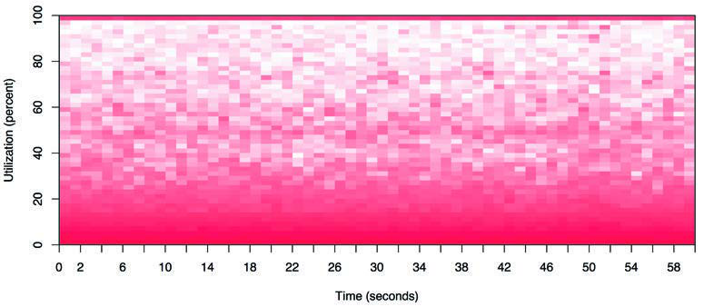
**图 6.19 CPU 利用率热力图，5,312 个 CPU**

该热力图底部较深的阴影显示大多数 CPU 的利用率在 0% 到 30% 之间。然而，顶部的实线显示，随着时间的推移，也有一些 CPU 的利用率为 100%。这条线颜色较深这一事实表明，有多个 CPU 处于 100% 状态，而不仅仅是一个。

### 6.7.2 亚秒级偏移热力图 (Subsecond-Offset Heat Map)

这种热力图类型允许检查一秒钟内的活动。CPU 活动通常以微秒或毫秒为单位进行测量；将这些数据报告为整秒内的平均值可能会抹去有用的信息。亚秒级偏移热力图将亚秒级偏移放在 y 轴上，每个偏移处的非空闲 CPU 数量由饱和度显示。这将每一秒可视化为一个列，从底部到顶部进行“绘制”。

图 6.20 显示了一个云数据库 (Riak) 的 CPU 亚秒级偏移热力图。

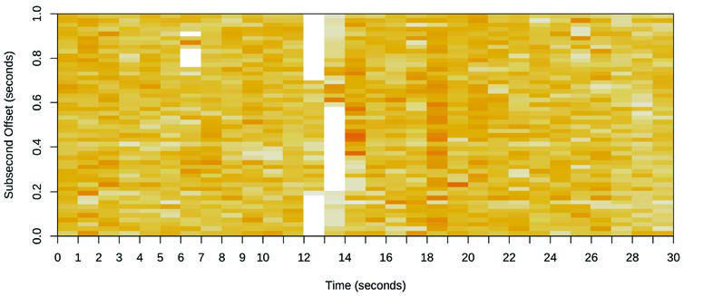
**图 6.20 CPU 亚秒级偏移热力图**

这个热力图的有趣之处不在于 CPU 忙于服务数据库的时间，而在于它们不忙的时间，由白色列表示。这些间隙的持续时间也很有趣：数百毫秒内，没有一个数据库线程在 CPU 上。这导致发现了一个锁定问题，整个数据库一次被阻塞数百毫秒。

如果我们使用线图检查这些数据，每秒 CPU 利用率的下降可能会被认为是负载波动而未进一步调查。

### 6.7.3 火焰图 (Flame Graphs)

剖析调用栈是解释 CPU 使用情况的有效方式，显示了哪些内核级或用户级代码路径负有责任。然而，它可能会产生数千页的输出。CPU 火焰图将剖析调用栈可视化，以便更快速、更清晰地理解 CPU 使用情况 [Gregg 16b]。图 6.21 中的例子显示了使用 `perf(1)` 剖析出的 Linux 内核 CPU 火焰图。

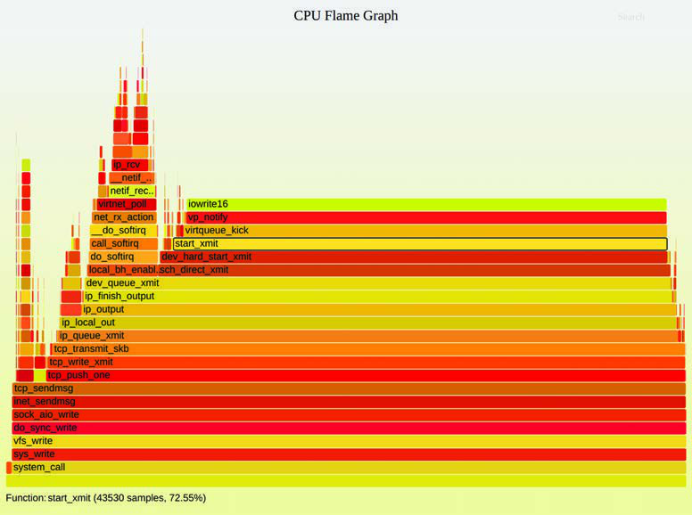
**图 6.21 Linux 内核火焰图**

火焰图可以从任何包含调用栈的 CPU 剖析中构建，包括来自 `perf(1)`、`profile(8)`、`bpftrace` 等的剖析。火焰图还可以可视化 CPU 剖析之外的其他剖析。本节介绍由 `flamegraph.pl` 生成的 CPU 火焰图 [Gregg 20g]。（还有许多其他实现，包括由我的同事 Martin Spier 创建的 d3 火焰图 [Spier 20a]。）

#### 特征 (Characteristics)
CPU 火焰图具有以下特征：

- **每个框代表栈中的一个函数（一个“栈帧”）。**
- **y 轴显示栈深度（栈中的帧数）。** 最顶层的框显示了当时在 CPU 上的函数。其下方的所有内容都是祖先。一个函数下方的函数是其父函数，正如前面显示的调用栈一样。
- **x 轴涵盖样本总体。** 它并不像大多数图表那样显示从左到右的时间流逝。左到右的排序没有意义（它是按字母顺序排序的）。
- **框的宽度显示了该函数在 CPU 上或作为在 CPU 上的祖先的一部分所花费的总时间（基于样本计数）。** 较宽框的函数可能比较窄框的函数慢，或者仅仅是因为它们被调用的次数更多。调用次数不显示（也无法通过采样获知）。

如果多个线程并行运行并被采样，样本计数可以超过经过的时间（elapsed time）。

#### 颜色 (Colors)
帧可以根据不同的方案进行着色。图 6.21 中显示的默认方案对每个帧使用随机暖色，这有助于在视觉上区分相邻的塔。多年来我增加了更多的配色方案。我发现以下配色方案对火焰图终端用户最有用：

- **色调 (Hue):** 色调指示代码类型[^17]。例如，红色可以指示原生用户级代码，橙色指示原生内核级代码，黄色指示 C++，绿色指示解释执行的函数，青色指示内联函数，等等，取决于你使用的语言。洋红色用于高亮搜索匹配项。一些开发人员定制了火焰图，始终以某种色调突出显示他们自己的代码，使其脱颖而出。
- **饱和度 (Saturation):** 饱和度是根据函数名哈希得出的。它提供了一些颜色变化以帮助区分相邻的塔，同时为相同的函数名保留相同的颜色，以便更轻松地对比多个火焰图。
- **背景颜色:** 背景颜色提供了火焰图类型的视觉提醒。例如，你可以对 CPU 火焰图使用黄色，对非 CPU 或 I/O 火焰图使用蓝色，对内存火焰图使用绿色。

另一种有用的配色方案是用于 IPC（每周期指令数）火焰图，其中另一个维度 IPC 通过使用从蓝色到白色再到红色的渐变对每个帧进行着色来可视化。

#### 交互性 (Interactivity)
火焰图是交互式的。我原始的 `flamegraph.pl` 生成一个嵌入了 JavaScript 例程的 SVG，当在浏览器中打开时，它允许你将鼠标停留在元素上以在底部显示详情，以及其他交互功能。在图 6.21 的例子中，`start_xmit()` 被高亮显示，这表明它出现在 72.55% 的采样栈中。

你还可以点击进行缩放[^18]，并按 Ctrl-F 搜索[^19] 某个术语。搜索时，还会显示一个累积百分比，指示包含该搜索术语的调用栈出现的频率。这使得计算特定代码区域在剖析中占多少比例变得轻而易举。例如，你可以搜索“tcp_”来显示内核 TCP 代码占了多少比例。

#### 解释 (Interpretation)
为了详细解释如何理解火焰图，考虑图 6.22 所示的简单合成 CPU 火焰图。

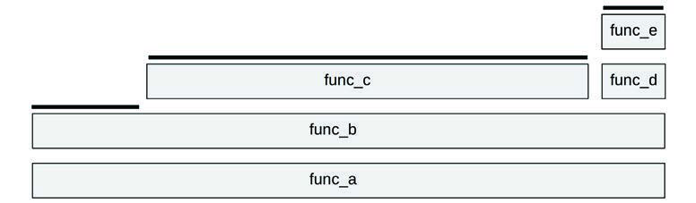
**图 6.22 合成 CPU 火焰图**

顶边缘已用线高亮显示：这显示了直接在 CPU 上运行的函数。`func_c()` 有 70% 的时间直接在 CPU 上，`func_b()` 有 20% 的时间在 CPU 上，`func_e()` 有 10% 的时间在 CPU 上。其他函数 `func_a()` 和 `func_d()` 从未被直接采样到在 CPU 上运行。

阅读火焰图时，寻找最宽的塔并首先理解它们。在图 6.22 中，它是代码路径 `func_a() -> func_b() -> func_c()`。在图 6.21 的火焰图中，它是以 `iowrite16()` 平台（plateau）结尾的代码路径。

对于包含数千个样本的大型剖析，可能存在仅被采样几次的代码路径，它们打印出的塔非常窄，以至于没有空间包含函数名。由于这种原因，较窄的塔往往会被忽略，而较宽的塔——代表了大部分 CPU 使用情况——则是显而易见的。

注意，对于递归函数，每一层都由一个单独的帧显示。

6.5.4 节“剖析”包含了更多解释技巧，而 6.6.13 节 `perf` 显示了如何使用 `perf(1)` 创建它们。

### 6.7.4 FlameScope

FlameScope 是 Netflix 开发的一款开源工具，它结合了前两种可视化：亚秒级偏移热力图和火焰图 [Gregg 18b]。亚秒级偏移热力图显示 CPU 剖析结果，可以选择包括亚秒级范围在内的各种范围，以显示仅针对该范围的火焰图。图 6.23 显示了带有注释和说明的 FlameScope 热力图。

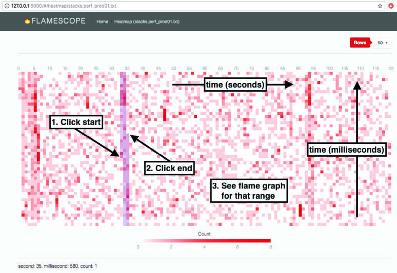
**图 6.23 FlameScope**

FlameScope 适合研究问题或扰动（perturbations）以及变动。在一次性显示完整剖析的 CPU 火焰图中，这些可能因为太小而无法看到：在 30 秒的剖析中，100 毫秒的 CPU 扰动仅占火焰图宽度的 0.3%。在 FlameScope 中，100 毫秒的扰动将显示为热力图高度 1/10 的垂直条纹。在图 6.23 的例子中可以看到几个这样的扰动。选中后，将显示仅针对这些时间范围的 CPU 火焰图，从而显示负责的代码路径。

FlameScope 是开源的 [Netflix 19]，已在 Netflix 用于发现众多性能改进点。

## 6.8 实验 (Experimentation)

本节介绍用于主动测试 CPU 性能的工具。背景信息见 6.5.11 节“微基准测试”。

使用这些工具时，建议让 `mpstat(1)` 持续运行，以确认 CPU 使用情况和并行性。

### 6.8.1 Ad Hoc

虽然这微不足道且不测量任何东西，但它可以作为一种已知的有用工作负载，用于确认可观测性工具是否显示了它们声称显示的内容。这创建了一个单线程的 CPU 密集型工作负载（“在一个 CPU 上跑满”）：

```bash
# while :; do :; done &
```

这是一个在后台执行无限循环的 Bourne shell 程序。一旦你不再需要它，就需要将其杀掉。

### 6.8.2 SysBench

SysBench 系统基准测试套件有一个简单的 CPU 基准测试工具，可以计算素数。例如：

```bash
# sysbench --num-threads=8 --test=cpu --cpu-max-prime=100000 run
sysbench 0.4.12:  multi-threaded system evaluation benchmark

Running the test with following options:
Number of threads: 8

Doing CPU performance benchmark

Threads started!
Done.

Maximum prime number checked in CPU test: 100000

Test execution summary:
    total time:                          30.4125s
    total number of events:              10000
    total time taken by event execution: 243.2310
    per-request statistics:
         min:                                 24.31ms
         avg:                                 24.32ms
         max:                                 32.44ms
         approx.  95 percentile:              24.32ms

Threads fairness:
    events (avg/stddev):           1250.0000/1.22
    execution time (avg/stddev):   30.4039/0.01
```

这执行了 8 个线程，最大素数为 100,000。运行时间为 30.4 秒，可用于与其他系统或配置的结果进行比较（假设了许多前提，例如使用了相同的编译器选项来构建软件；见第 12 章“基准测试”）。

## 6.9 调优 (Tuning)

对于 CPU，最大的性能收益通常来自于消除不必要的工作，这是一种有效的调优形式。6.5 节“方法论”和 6.6 节“可观测性工具”介绍了分析和识别所执行工作的许多方法，帮助你发现任何不必要的工作。还介绍了其他调优方法论：优先级调优和 CPU 绑定。本节包含这些方法以及其他调优示例。

调优的具体细节——可用的选项以及设置为什么值——取决于处理器类型、操作系统版本和预期的工作负载。以下按类型组织的内容提供了可能有哪些可用选项以及如何调优它们的示例。前面的方法论章节提供了关于何时以及为何调优这些参数的指导。

### 6.9.1 编译器选项 (Compiler Options)

编译器及其提供的代码优化选项可以对 CPU 性能产生显著影响。常见的选项包括针对 64 位而非 32 位进行编译，以及选择优化级别。编译器优化在第 5 章“应用程序”中讨论。

### 6.9.2 调度优先级与类别 (Scheduling Priority and Class)

`nice(1)` 命令可用于调整进程优先级。正的 nice 值会降低优先级，而负的 nice 值（只有超级用户可以设置）会提高优先级。范围是从 -20 到 +19。例如：

```bash
$ nice -n 19 command
```

以 19 的 nice 值运行命令——这是 `nice` 能设置的最低优先级。要更改已经在运行的进程的优先级，请使用 `renice(1)`。

在 Linux 上，`chrt(1)` 命令可以直接显示和设置调度优先级以及调度策略。例如：

```bash
$ chrt -b command
```

将在 `SCHED_BATCH` 模式下运行命令（见 6.4.2 节“软件”中的调度类别）。`nice(1)` 和 `chrt(1)` 也可以针对 PID 而不是启动命令（见它们的手册页）。

调度优先级也可以使用 `setpriority(2)` 系统调用直接设置，优先级和调度策略可以使用 `sched_setscheduler(2)` 系统调用设置。

### 6.9.3 调度器选项 (Scheduler Options)

你的内核可能会提供可调参数来控制调度器行为，尽管这些通常不需要调优。

在 Linux 系统上，各种 `CONFIG` 选项在高层级控制调度器行为，并可以在内核编译期间设置。表 6.12 显示了来自 Ubuntu 19.10 和 Linux 5.3 内核的示例。

**表 6.12 示例 Linux 调度器 CONFIG 选项**

| 选项 | 默认值 | 描述 |
| :--- | :--- | :--- |
| **CONFIG_CGROUP_SCHED** | y | 允许对任务进行分组，以组为单位分配 CPU 时间 |
| **CONFIG_FAIR_GROUP_SCHED** | y | 允许对 CFS 任务进行分组 |
| **CONFIG_RT_GROUP_SCHED** | n | 允许对实时任务进行分组 |
| **CONFIG_SCHED_AUTOGROUP** | y | 自动识别并创建任务组（例如构建作业） |
| **CONFIG_SCHED_SMT** | y | 超线程支持 |
| **CONFIG_SCHED_MC** | y | 多核支持 |
| **CONFIG_HZ** | 250 | 设置内核时钟频率（定时器中断） |
| **CONFIG_NO_HZ** | y | 无滴答（Tickless）内核行为 |
| **CONFIG_SCHED_HRTICK** | y | 使用高分辨率定时器 |
| **CONFIG_PREEMPT** | n | 全内核抢占（自旋锁区域和中断除外） |
| **CONFIG_PREEMPT_NONE** | n | 无抢占 |
| **CONFIG_PREEMPT_VOLUNTARY** | y | 在自愿内核代码点进行抢占 |

还有一些调度器 `sysctl(8)` 可调参数可以在运行中的系统上实时设置，包括表 6.13 中列出的参数，默认值来自相同的 Ubuntu 系统。

**表 6.13 示例 Linux 调度器 sysctl(8) 可调参数**

| sysctl | 默认值 | 描述 |
| :--- | :--- | :--- |
| **kernel.sched_cfs_bandwidth_slice_us** | 5000 | 用于 CFS 带宽计算的 CPU 时间配额。 |
| **kernel.sched_latency_ns** | 12000000 | 目标抢占延迟。增加此值可以增加任务在 CPU 上的时间，代价是抢占延迟。 |
| **kernel.sched_migration_cost_ns** | 500000 | 任务迁移延迟成本，用于亲和性计算。比该值更近期运行过的任务被认为是缓存热的（cache hot）。 |
| **kernel.sched_nr_migrate** | 32 | 设置负载均衡时一次可以迁移多少任务。 |
| **kernel.sched_schedstats** | 0 | 启用额外的调度器统计信息，包括 `sched:sched_stat*` 追踪点。 |

这些 `sysctl(8)` 可调参数也可以从 `/proc/sys/sched` 设置。

### 6.9.4 调频器 (Scaling Governors)

Linux 支持不同的 CPU 调频器，通过软件（内核）控制 CPU 时钟频率。这些可以通过 `/sys` 文件设置。例如，对于 CPU 0：

```bash
# cat /sys/devices/system/cpu/cpufreq/policy0/scaling_available_governors
performance powersave
# cat /sys/devices/system/cpu/cpufreq/policy0/scaling_governor
powersave
```

这是一个未调优系统的例子：当前的调频器是 “powersave”，它将使用较低的 CPU 频率来节省功耗。这可以设置为 “performance” 以始终使用最高频率。例如：

```bash
# echo performance > /sys/devices/system/cpu/cpufreq/policy0/scaling_governor
```

这必须针对所有 CPU 执行（policy0..N）。此 policy 目录还包含直接设置频率的文件（`scaling_setspeed`）和确定可能频率范围的文件（`scaling_min_freq`、`scaling_max_freq`）。

将 CPU 设置为始终以最高频率运行可能会给环境带来巨大代价。如果此设置不能提供明显的性能改进，为了地球着想，请考虑继续使用 powersave 设置。对于可以访问功耗 MSRs 的主机（云客户机可能会过滤掉它们），你也可以使用这些 MSRs 来测量在使用和不使用最高 CPU 频率设置时的功耗，以量化（部分[^20]）环境代价。

### 6.9.5 电源状态 (Power States)

可以使用 `cpupower(1)` 工具启用和禁用处理器电源状态。正如之前在 6.6.21 节“其他工具”中所见，较深的睡眠状态可能具有较高的退出延迟（显示 C10 为 890 μs）。可以使用 `-d` 禁用单个状态，使用 `-D latency` 将禁用所有退出延迟高于给定值（以微秒为单位）的状态。这允许你精细调优可以使用哪些低功耗状态，禁用那些延迟过高的状态。

### 6.9.6 CPU 绑定 (CPU Binding)

一个进程可以绑定到一个或多个 CPU，这可以通过提高缓存热度和内存局部性来提高其性能。

在 Linux 上，这可以使用 `taskset(1)` 命令执行，该命令使用 CPU 掩码或范围来设置 CPU 亲和性。例如：

```bash
$ taskset -pc 7-10 10790
pid 10790's current affinity list: 0-15
pid 10790's new affinity list: 7-10
```

这将 PID 10790 设置为仅在 CPU 7 到 10 上运行。

`numactl(8)` 命令也可以设置 CPU 绑定以及内存节点绑定（见第 7 章“内存”的 7.6.4 节“NUMA 绑定”）。

### 6.9.7 排他性 CPU 集 (Exclusive CPU Sets)

Linux 提供了 `cpusets`，允许将 CPU 分组并将进程分配给它们。这可以提高性能，类似于 CPU 绑定，但通过使 `cpuset` 变为排他性（exclusive）可以进一步提高性能，防止其他进程使用它。代价是减少了系统其余部分可用的 CPU。

以下带注释的示例创建了一个排他性集：

```bash
# mount -t cgroup -ocpuset cpuset /sys/fs/cgroup/cpuset  # 可能不是必需的
# cd /sys/fs/cgroup/cpuset
# mkdir prodset                    # 创建一个名为 "prodset" 的 cpuset
# cd prodset
# echo 7-10 > cpuset.cpus          # 分配 CPU 7-10
# echo 1 > cpuset.cpu_exclusive    # 使 prodset 变为排他性
# echo 1159 > tasks                # 将 PID 1159 分配给 prodset
```

参考资料见 `cpuset(7)` 手册页。

创建 CPU 集时，你可能还希望研究哪些 CPU 将继续服务中断。`irqbalance(1)` 守护进程将尝试跨 CPU 分配中断以提高性能。你可以通过 `/proc/irq/IRQ/smp_affinity` 文件手动按 IRQ 设置 CPU 亲和性。

### 6.9.8 资源控制 (Resource Controls)

除了将进程与整个 CPU 关联之外，现代操作系统还提供了用于精细分配 CPU 使用量的资源控制。

对于 Linux，有控制组（cgroups），它也可以控制进程或进程组的资源使用。可以使用 shares 来控制 CPU 使用量，CFS 调度器允许施加固定限制（CPU 带宽），即按间隔分配 CPU 周期的微秒数。

第 11 章“云计算”描述了一个管理操作系统虚拟化租户 CPU 使用量的用例，包括如何配合使用 shares 和 limits。

### 6.9.9 安全引导选项 (Security Boot Options)

针对 Meltdown 和 Spectre 安全漏洞的各种内核缓解措施具有降低性能的副作用。在某些场景下，安全不是必需的，但高性能是必需的，你可能希望禁用这些缓解措施。由于出于安全风险考虑不建议这样做，我不会在这里列出所有选项；但你应该知道它们存在。它们是 grub 命令行选项，包括 `nospectre_v1` 和 `nospectre_v2`。这些记录在 Linux 源代码的 `Documentation/admin-guide/kernel-parameters.txt` 中 [Linux 20f]；摘录如下：

> nospectre_v1 [PPC] 禁用针对 Spectre Variant 1 (bounds check bypass) 的缓解措施。使用此选项，系统中可能发生数据泄漏。
>
> nospectre_v2 [X86,PPC_FSL_BOOK3E,ARM64] 禁用针对 Spectre variant 2 (indirect branch prediction) 漏洞的所有缓解措施。使用此选项，系统可能允许数据泄漏。

还有一个网站列出了它们：https://make-linux-fast-again.com。该网站缺少内核文档中列出的警告。

### 6.9.10 处理器选项 (BIOS 调优) (Processor Options (BIOS Tuning))

处理器通常提供用于启用、禁用和调优处理器级功能的设置。在 x86 系统上，这些通常在启动时通过 BIOS 设置菜单访问。

这些设置通常默认提供最大性能，不需要调整。我今天调整这些设置最常见的原因是禁用 Intel Turbo Boost，以便 CPU 基准测试以一致的时钟频率执行（请记住，对于生产用途，应启用 Turbo Boost 以获得稍快的性能）。

## 6.10 习题 (Exercises)

1. 回答以下关于 CPU 术语的问题：
   - 进程（process）和处理器（processor）有什么区别？
   - 什么是硬件线程？
   - 什么是运行队列？
   - 用户时间（user time）和内核时间（kernel time）有什么区别？

2. 回答以下概念性问题：
   - 描述 CPU 利用率和饱和度。
   - 描述指令流水线如何提高 CPU 吞吐量。
   - 描述处理器指令宽度如何提高 CPU 吞吐量。
   - 描述多进程和多线程模型的优点。

3. 回答以下更深入的问题：
   - 描述当系统 CPU 被可运行的工作过载时会发生什么，包括对应用程序性能的影响。
   - 当没有可运行的工作需要执行时，CPU 会做什么？
   - 当遇到疑似 CPU 性能问题时，列举两个你在调查初期会使用的方法论，并解释原因。

4. 为你的环境开发以下规程：
   - CPU 资源的 USE 方法检查清单。包括如何获取每个指标（例如，执行哪个命令）以及如何解释结果。在安装或使用额外的软件产品之前，尝试使用现有的操作系统可观测性工具。
   - CPU 资源的工作负载表征检查清单。包括如何获取每个指标，并尝试首先使用现有的操作系统可观测性工具。

5. 执行以下任务：
   - 计算以下系统的负载平均值，该负载处于稳定状态，没有明显的磁盘/锁定负载：
     - 系统有 64 个 CPU。
     - 全系统 CPU 利用率为 50%。
     - 全系统 CPU 饱和度（测量为平均可运行和排队线程的总数）为 2.0。
   - 选择一个应用程序，并剖析其用户级 CPU 使用情况。显示哪些代码路径消耗了最多的 CPU。

6. （可选，进阶）开发 `bustop(1)`——一个显示物理总线或互连利用率的工具——其呈现形式类似于 `iostat(1)`：总线列表，每个方向吞吐量的列，以及利用率。如果可能，包括饱和度和错误指标。这将需要使用 PMCs。

## 6.11 参考文献 (References)

[Saltzer 70] Saltzer, J., and Gintell, J., “The Instrumentation of Multics,” Communications of the ACM, August 1970.

[Bobrow 72] Bobrow, D. G., Burchfiel, J. D., Murphy, D. L., and Tomlinson, R. S., “TENEX: A Paged Time Sharing System for the PDP-10*,” Communications of the ACM, March 1972.

[Myer 73] Myer, T. H., Barnaby, J. R., and Plummer, W. W., TENEX Executive Manual, Bolt, Baranek and Newman, Inc., April 1973.

[Thomas 73] Thomas, B., “RFC 546: TENEX Load Averages for July 1973,” Network Working Group, http://tools.ietf.org/html/rfc546, 1973.

[TUHS 73] “V4,” The Unix Heritage Society, http://minnie.tuhs.org/cgi-bin/utree.pl?file=V4, materials from 1973.

[Hinnant 84] Hinnant, D., “Benchmarking UNIX Systems,” BYTE magazine 9, no. 8, August 1984.

[Bulpin 05] Bulpin, J., and Pratt, I., “Hyper-Threading Aware Process Scheduling Heuristics,” USENIX, 2005.

[Corbet 06a] Corbet, J., “Priority inheritance in the kernel,” LWN.net, http://lwn.net/Articles/178253, 2006.

[Otto 06] Otto, E., “Temperature-Aware Operating System Scheduling,” University of Virginia (Thesis), 2006.

[Ruggiero 08] Ruggiero, J., “Measuring Cache and Memory Latency and CPU to Memory Bandwidth,” Intel (Whitepaper), 2008.

[Intel 09] “An Introduction to the Intel QuickPath Interconnect,” Intel (Whitepaper), 2009.

[Levinthal 09] Levinthal, D., “Performance Analysis Guide for Intel® Core™ i7 Processor and Intel® Xeon™ 5500 Processors,” Intel (Whitepaper), 2009.

[Gregg 10a] Gregg, B., “Visualizing System Latency,” Communications of the ACM, July 2010.

[Weaver 11] Weaver, V., “The Unofficial Linux Perf Events Web-Page,” http://web.eece.maine.edu/~vweaver/projects/perf_events, 2011.

[McVoy 12] McVoy, L., “LMbench - Tools for Performance Analysis,” http://www.bitmover.com/lmbench, 2012.

[Stevens 13] Stevens, W. R., and Rago, S., Advanced Programming in the UNIX Environment, 3rd Edition, Addison-Wesley 2013.

[Perf 15] “Tutorial: Linux kernel profiling with perf,” perf wiki, https://perf.wiki.kernel.org/index.php/Tutorial, last updated 2015.

[Gregg 16b] Gregg, B., “The Flame Graph,” Communications of the ACM, Volume 59, Issue 6, pp. 48–57, June 2016.

[ACPI 17] Advanced Configuration and Power Interface (ACPI) Specification, https://uefi.org/sites/default/files/resources/ACPI%206_2_A_Sept29.pdf, 2017.

[Gregg 17b] Gregg, B., “CPU Utilization Is Wrong,” http://www.brendangregg.com/blog/2017-05-09/cpu-utilization-is-wrong.html, 2017.

[Gregg 17c] Gregg, B., “Linux Load Averages: Solving the Mystery,” http://www.brendangregg.com/blog/2017-08-08/linux-load-averages.html, 2017.

[Mulnix 17] Mulnix, D., “Intel® Xeon® Processor Scalable Family Technical Overview,” https://software.intel.com/en-us/articles/intel-xeon-processor-scalable-family-technical-overview, 2017.

[Gregg 18b] Gregg, B., “Netflix FlameScope,” Netflix Technology Blog, https://netflixtechblog.com/netflix-flamescope-a57ca19d47bb, 2018.

[Ather 19] Ather, A., “General Purpose GPU Computing,” http://techblog.cloudperf.net/2019/12/general-purpose-gpu-computing.html, 2019.

[Gregg 19] Gregg, B., BPF Performance Tools: Linux System and Application Observability, Addison-Wesley, 2019.

[Intel 19a] Intel 64 and IA-32 Architectures Software Developer’s Manual, Combined Volumes 1, 2A, 2B, 2C, 3A, 3B, and 3C. Intel, 2019.

[Intel 19b] Intel 64 and IA-32 Architectures Software Developer’s Manual, Volume 3B, System Programming Guide, Part 2. Intel, 2019.

[Netflix 19] “FlameScope Is a Visualization Tool for Exploring Different Time Ranges as Flame Graphs,” https://github.com/Netflix/flamescope, 2019.

[Wysocki 19] Wysocki, R., “CPU Idle Time Management,” Linux documentation, https://www.kernel.org/doc/html/latest/driver-api/pm/cpuidle.html, 2019.

[AMD 20] “AMD μProf,” https://developer.amd.com/amd-uprof, accessed 2020.

[Gregg 20d] Gregg, B., “MSR Cloud Tools,” https://github.com/brendangregg/msr-cloud-tools, last updated 2020.

[Gregg 20e] Gregg, B., “PMC (Performance Monitoring Counter) Tools for the Cloud,” https://github.com/brendangregg/pmc-cloud-tools, last updated 2020.

[Gregg 20f] Gregg, B., “perf Examples,” http://www.brendangregg.com/perf.html, accessed 2020.

[Gregg 20g] Gregg, B., “FlameGraph: Stack Trace Visualizer,” https://github.com/brendangregg/FlameGraph, last updated 2020.

[Intel 20a] “Product Specifications,” https://ark.intel.com, accessed 2020.

[Intel 20b] “Intel® VTune™ Profiler,” https://software.intel.com/content/www/us/en/develop/tools/vtune-profiler.html, accessed 2020.

[Iovisor 20a] “bpftrace: High-level Tracing Language for Linux eBPF,” https://github.com/iovisor/bpftrace, last updated 2020.

[Linux 20f] “The Kernel’s Command-Line Parameters,” Linux documentation, https://www.kernel.org/doc/html/latest/admin-guide/kernel-parameters.html, accessed 2020.

[Spier 20a] Spier, M., “A D3.js Plugin That Produces Flame Graphs from Hierarchical Data,” https://github.com/spiermar/d3-flame-graph, last updated 2020.

[Spier 20b] Spier, M., “Template,” https://github.com/spiermar/d3-flame-graph#template, last updated 2020.

[Valgrind 20] “Valgrind Documentation,” http://valgrind.org/docs/manual, May 2020.

[Verma 20] Verma, A., “CUDA Cores vs Stream Processors Explained,” https://graphicscardhub.com/cuda-cores-vs-stream-processors, 2020.

[^1]: 有时也称为虚拟 CPU；然而，该术语更常用于指代由虚拟化技术提供的虚拟 CPU 实例。见第 11 章“云计算”。
[^2]: Linux 有一个工具 `lstopo(1)`，可以为当前系统生成类似于此图的图表，示例在 6.6.21 节“其他工具”中。
[^3]: 在本书的第一版中我使用了 CPI；在那之后我转向在 Linux 上做更多工作，包括转向使用 IPC。
[^4]: 还有四抽样（quad-pumped），其中数据在时钟周期的上升沿、峰值、下降沿和槽部传输。四抽样用于 Intel FSB。
[^5]: Nvidia 也将这些称为 CUDA 核心 [Verma 20]。
[^6]: 例如，想象一下发现给定的批处理计算工作负载在更快的 CPU 上运行时具有更高的系统调用率，即使工作负载是相同的。它完成得更早！
[^7]: 自 Linux 2.6.12 以来，可以按进程修改“nice 天花板”，允许 non-root 进程具有更低的 nice 值。例如使用：`prlimit --nice=-19 -p PID`。
[^8]: 自 2.6.25 以来，Linux 针对此问题有一个解决方案：`RLIMIT_RTTIME`，它设置了实时线程在进行阻塞系统调用前可以消耗的 CPU 时间限制（以微秒为单位）。
[^9]: 该更改发生得太久以前，以至于更改的原因已被遗忘且未记录在案，早于 git 和其他资源中的 Linux 历史；我最终在旧邮件系统存档的一个在线压缩包中找到了原始补丁。Matthias Urlichs 进行了该更改，并指出如果需求从 CPU 转移到磁盘，那么负载平均值应该保持不变，因为需求并未改变 [Gregg 17c]。我给他发了邮件（生平第一次）询问他 24 年前的更改，并在一小时内收到了回复！
[^10]: 在 Linux 4.11 中，`-a` 选项成为了默认选项。
[^11]: 感谢 Andreas Gerstmayr 添加了此选项。
[^12]: 起源：Sasha Goldshtein 在 2016 年 6 月 29 日开发了 BCC `cpudist(8)`。我在 2005 年为 Solaris 开发了一个 `cpudists` 直方图工具。
[^13]: 起源：受我早期的 Solaris `dispqlat.d` 工具（调度器队列延迟：Solaris 对运行队列延迟的术语）启发，我于 2016 年 2 月 7 日开发了 BCC `runqlat` 版本，并于 2018 年 9 月 17 日开发了 bpftrace 版本。
[^14]: 起源：受我早期的 `dispqlen.d` 工具启发，我于 2016 年 12 月 12 日开发了 BCC 版本，并于 2018 年 10 月 7 日开发了 bpftrace 版本。
[^15]: 起源：我于 2015 年 10 月 20 日开发了 BCC 版本。
[^16]: 起源：受我早期的 `inttimes.d` 工具启发，我于 2015 年 10 月 19 日开发了 BCC 版本，而该工具本身基于另一个 `intr.d` 工具。
[^17]: 这是由我的同事 Amer Ather 建议的。我的第一个版本是一个五分钟搞定的正则 hack。
[^18]: Adrien Mahieux 为火焰图开发了水平缩放功能。
[^19]: Thorsten Lorenz 率先在他的火焰图实现中增加了搜索功能。
[^20]: 基于主机的功率测量不考虑服务器空调、服务器制造和运输以及其他成本的环境代价。
