# 第 7 章 内存 (Memory)

系统主内存存储应用程序和内核指令、它们的工作数据以及文件系统缓存。这些数据的二级存储通常是存储设备——磁盘——它们的运行速度比主内存慢几个数量级。一旦主内存填满，系统可能会开始在主内存和存储设备之间交换数据。这是一个缓慢的过程，通常会成为系统瓶颈，大幅降低性能。系统还可能终止消耗内存最大的进程，导致应用程序停机。

其他需要考虑的性能因素包括分配和释放内存、复制内存以及管理内存地址空间映射的 CPU 开销。在多插槽架构上，内存局部性可能成为一个因素，因为连接到本地插槽的内存比远程插槽具有更低的访问延迟。

本章的学习目标是：

- 理解内存概念。
- 熟悉内存硬件内部结构。
- 熟悉内核和用户分配器内部结构。
- 掌握 MMU 和 TLB 的实际知识。
- 遵循不同的内存分析方法论。
- 刻画系统级和每进程内存使用情况。
- 识别由低可用内存引起的问题。
- 在进程地址空间和内核 slab 中定位内存使用。
- 使用剖析器、追踪器和火焰图调查内存使用情况。
- 了解内存的可调参数。

本章分为五个部分，前三部分为内存分析提供基础，最后两部分展示其在基于 Linux 的系统中的实际应用。各部分如下：

- **背景** 介绍内存相关的术语和关键内存性能概念。
- **架构** 提供硬件和软件内存架构的通用描述。
- **方法论** 解释性能分析方法论。
- **可观测性工具** 描述用于内存分析的性能工具。
- **调优** 解释调优和示例可调参数。

CPU 上的内存缓存（L1/L2/L3, TLB）在第 6 章“CPU”中涵盖。

## 7.1 术语 (Terminology)

作为参考，本章中使用的内存相关术语包括：

- **主内存 (Main memory)**：也称为物理内存，描述计算机的高速数据存储区域，通常由 DRAM 提供。
- **虚拟内存 (Virtual memory)**：主内存的一个抽象，（几乎）是无限的且非竞争的。虚拟内存不是真实的内存。
- **驻留内存 (Resident memory)**：当前驻留在主内存中的内存。
- **匿名内存 (Anonymous memory)**：没有文件系统位置或路径名的内存。它包括进程地址空间的工作数据，称为堆。
- **地址空间 (Address space)**：一个内存上下文。每个进程都有虚拟地址空间，内核也有。
- **段 (Segment)**：为特定目的标记的虚拟内存区域，例如用于存储可执行或可写页面。
- **指令文本 (Instruction text)**：指内存中的 CPU 指令，通常位于一个段中。
- **OOM**：内存不足 (Out of memory)，当内核检测到低可用内存时。
- **页 (Page)**：内存单位，由操作系统和 CPU 使用。历史上它是 4 或 8 KB。现代处理器支持多种页大小。
- **页错误 (Page fault)**：无效的内存访问。在使用按需虚拟内存时，这些是正常发生的。
- **分页 (Paging)**：主内存和存储设备之间的页面传输。
- **交换 (Swapping)**：Linux 使用术语“交换”来指代到交换设备的匿名分页（交换页的传输）。在 Unix 和其他操作系统中，“交换”是指在主内存和存储设备之间传输整个进程。本书使用该术语的 Linux 版本。
- **交换区 (Swap)**：用于存储已分页匿名数据的磁盘区域。它可能是存储设备上的一个区域（也称为物理交换设备），或者是文件系统文件（称为交换文件）。一些工具使用术语“交换”来指代虚拟内存（这既令人困惑又不正确）。

本章中还会介绍其他术语。如果需要，词汇表（Glossary）包含了基础术语以供参考，包括地址、缓冲区和 DRAM。另请参阅第 2 章和第 3 章中的术语部分。

## 7.2 概念 (Concepts)

以下是关于内存和内存性能的一系列重要概念。

### 7.2.1 虚拟内存 (Virtual Memory)

虚拟内存是一个抽象层，为每个进程和内核提供其自身的、巨大的、线性的且私有的地址空间。它简化了软件开发，将物理内存的放置留给操作系统管理。它还支持多任务处理（虚拟地址空间在设计上是分离的）和超额订购（正在使用的内存可以扩展到主内存之外）。虚拟内存在第 3 章“操作系统” 3.2.8 节“虚拟内存”中已作介绍。有关历史背景，请参见 [Denning 70]。

图 7.1 显示了虚拟内存在具有交换设备（二级存储）的系统上为进程扮演的角色。图中显示了一个内存页，因为大多数虚拟内存实现都是基于页的。

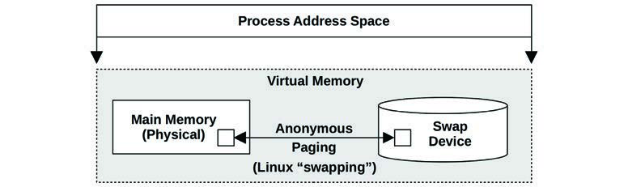
**图 7.1 进程虚拟内存**

进程地址空间由虚拟内存子系统映射到主内存和物理交换设备。内存页可以根据内核的需要在这两者之间移动，Linux 将这一过程称为“交换”（swapping，其他操作系统称为匿名分页）。这允许内核超额订购主内存。

内核可能会对超额订购施加限制。一个常用的限制是主内存大小加上物理交换设备的大小。内核可能会使尝试超过此限制的分配失败。这种“虚拟内存不足”错误在初看时可能会令人困惑，因为虚拟内存本身是一个抽象资源。

Linux 还允许其他行为，包括不对内存分配设置限制。这被称为“过度承诺”（overcommit），将在接下来的分页和按需分页章节之后介绍，这些是过度承诺正常工作所必需的。

### 7.2.2 分页 (Paging)

分页是将页面移入和移出主内存的过程，分别称为页入（page-ins）和页出（page-outs）。它最初由 1962 年的 Atlas 计算机引入 [Corbató 68]，允许：

- 执行部分加载的程序
- 执行比主内存更大的程序
- 在主内存和存储设备之间高效移动程序

这些能力在今天依然成立。与早期交换出整个程序的技术不同，分页是一种更细粒度的管理和释放主内存的方法，因为页单位相对较小（例如 4 KB）。

带有虚拟内存的分页（分页虚拟内存）通过 BSD [Babaoglu 79] 引入 Unix 并成为标准。

随着后来用于共享文件系统页面的页缓存（page cache）的加入（参见第 8 章“文件系统”），出现了两种不同类型的分页：文件系统分页和匿名分页。

#### 文件系统分页 (File System Paging)

文件系统分页是由内存映射文件（memory-mapped files）的读写引起的。对于使用文件内存映射（`mmap(2)`）的应用程序和使用页缓存的文件系统（大多数都使用；见第 8 章“文件系统”）来说，这是正常行为。它被称为“好”的分页 [McDougall 06a]。

在需要时，内核可以通过页出部分页面来释放内存。这里的术语有些微妙：如果一个文件系统页面在主内存中被修改了（称为脏页 dirty），则页出需要将其写入磁盘。相反，如果文件系统页面未被修改（称为干净页 clean），则页出仅仅是释放内存以供立即重用，因为磁盘上已经存在副本。正因为如此，术语“页出”意味着页面被移出了内存——这可能包含也可能不包含对存储设备的写入（你可能会在其他教材中看到对页出的不同定义）。

#### 匿名分页 (Swapping)

匿名分页涉及进程私有的数据：进程堆和栈。它被称为匿名是因为它在操作系统中没有命名的位置（即没有文件系统路径名）。匿名页出需要将数据移动到物理交换设备或交换文件。Linux 使用术语“交换”来指代这种类型的分页。

匿名分页会损害性能，因此被称为“坏”的分页 [McDougall 06a]。当应用程序访问已被页出的内存页时，它们会阻塞在将其读回主内存所需的磁盘 I/O 上[^1]。这是一个匿名页入，它为应用程序引入了同步延迟。匿名页出可能不会直接影响应用程序性能，因为它们可以由内核异步执行。

当没有匿名分页（交换）时，性能最佳。这可以通过配置应用程序保持在可用主内存范围内，并监控页面扫描、内存利用率和匿名分页来确保没有内存短缺的指标来实现。

### 7.2.3 按需分页 (Demand Paging)

支持按需分页的操作系统（大多数都支持）根据需求将虚拟内存页映射到物理内存，如图 7.2 所示。这推迟了创建映射的 CPU 开销，直到它们被实际需要和访问时，而不是在首次分配内存范围时。

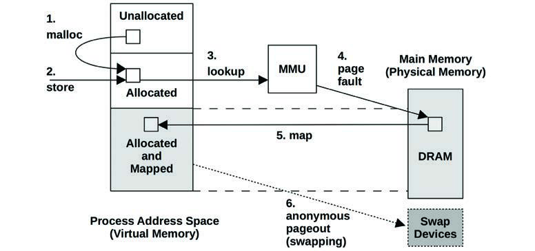
**图 7.2 页错误示例**

图 7.2 显示的序列始于 `malloc()`（步骤 1）提供已分配的内存，然后是一个向该新分配内存执行的存储（store）指令（步骤 2）。为了让 MMU 确定存储的主内存位置，它对该内存页执行虚拟到物理查找（步骤 3），由于尚未建立映射，查找失败。这种失败被称为页错误（page fault，步骤 4），它触发内核创建一个按需映射（步骤 5）。稍后，该内存页可能会被页出到交换设备以释放内存（步骤 6）。

在映射文件的情况下，步骤 2 也可以是加载（load）指令，该文件应该包含数据但尚未映射到此进程地址空间。

如果映射可以从内存中的另一个页面得到满足，则称为次要错误（minor fault）。这可能发生在从可用内存映射一个新页面时，或者在进程内存增长期间（如图所示）。它也可能发生在映射到另一个现有页面时，例如从映射的共享库读取页面。

需要访问存储设备（图中未显示）的页错误，例如访问未缓存的内存映射文件，被称为主要错误（major fault）。

虚拟内存模型和按需分配的结果是，任何虚拟内存页可能处于以下状态之一：

- **A. 未分配 (Unallocated)**
- **B. 已分配，但未映射 (Allocated, but unmapped)**（未填充且尚未发生错误）
- **C. 已分配，并映射到主内存 (Allocated, and mapped to main memory)** (RAM)
- **D. 已分配，并映射到物理交换设备 (Allocated, and mapped to physical swap device)** (disk)

如果页面由于系统内存压力被页出，则达到状态 (D)。从 (B) 到 (C) 的转变是页错误。如果它需要磁盘 I/O，则是主要页错误；否则是次要页错误。

根据这些状态，还可以定义两个内存使用术语：

- **驻留集大小 (Resident set size, RSS)**：已分配的主内存页面的大小 (C)。
- **虚拟内存大小 (Virtual memory size)**：所有已分配区域的大小 (B + C + D)。

按需分页通过 BSD 引入 Unix，与分页虚拟内存一起成为标准，并被 Linux 使用。

### 7.2.4 过度承诺 (Overcommit)

Linux 支持“过度承诺”的概念，它允许分配比系统可能存储的更多的内存——超过物理内存和交换设备的总和。它依赖于按需分页以及应用程序倾向于不使用它们所分配的大部分内存。

通过过度承诺，应用程序的内存请求（例如 `malloc(3)`）在原本会失败的情况下能够成功。应用程序程序员可以慷慨地分配内存，稍后根据需求稀疏地使用它，而不是为了保持在虚拟内存限制内而保守地分配内存。

在 Linux 上，过度承诺的行为可以通过可调参数进行配置。详情请见 7.6 节“调优”。过度承诺的后果取决于内核如何管理内存压力；请参见 7.3 节“架构”中关于 OOM 杀手的讨论。

### 7.2.5 进程交换 (Process Swapping)

进程交换是在主内存和物理交换设备或交换文件之间移动整个进程的过程。这是管理主内存的原始 Unix 技术，也是术语“交换”的起源 [Thompson 78]。

要交换出一个进程，其所有的私有数据必须写入交换设备，包括进程堆（匿名数据）、其打开文件表以及仅在进程活动时需要的其他元数据。源自文件系统且未被修改的数据可以被丢弃，并在需要时再次从原始位置读取。

进程交换严重损害性能，因为一个被交换出的进程需要大量的磁盘 I/O 才能再次运行。它对于当时的机器（如 PDP-11）上的早期 Unix 更有意义，当时的进程最大大小为 64 KB [Bach 86]。（现代系统允许以 GB 为单位的进程大小。）

此描述是为了提供历史背景。Linux 系统根本不交换进程，仅依赖分页。

### 7.2.6 文件系统缓存使用 (File System Cache Usage)

系统启动后，操作系统使用可用内存来缓存文件系统以提高性能，因此内存使用量会增长，这是正常的。原则是：如果有空闲的主内存，就把它用于有用的地方。这可能会让那些看到可用空闲内存接近于零的初级用户感到困扰。但这不会给应用程序带来问题，因为当应用程序需要时，内核应该能够迅速从文件系统缓存中释放内存。

有关可以消耗主内存的各种文件系统缓存的更多信息，请参见第 8 章“文件系统”。

### 7.2.7 利用率和饱和度 (Utilization and Saturation)

主内存利用率可以计算为已用内存与总内存的比值。文件系统缓存使用的内存可以被视为未使用的，因为它可以被应用程序重用。

如果对内存的需求超过了主内存量，主内存就会变得饱和。操作系统随后可能会通过采用分页、进程交换（如果支持）以及（在 Linux 上）OOM 杀手（稍后描述）来释放内存。这些活动中的任何一个都是主内存饱和的指标。

如果系统对其愿意分配的虚拟内存量施加了限制（Linux 的过度承诺则没有），那么可以根据容量利用率来研究虚拟内存。如果是这样，一旦虚拟内存耗尽，内核将使分配失败；例如，`malloc(3)` 失败，并将 `errno` 设置为 `ENOMEM`。

请注意，系统上当前的可用虚拟内存有时（令人困惑地）被称为“可用交换区”（available swap）。

### 7.2.8 分配器 (Allocators)

虚拟内存处理物理内存的多任务处理，而虚拟地址空间内的实际分配和放置通常由分配器处理。这些要么是用户级库，要么是基于内核的例程，它们为软件程序员提供了易于使用的内存使用接口（例如 `malloc(3)`、`free(3)`）。

分配器对性能有显著影响，系统可能会提供多个用户级分配器库供选择。它们可以通过使用包括每线程对象缓存（per-thread object caching）在内的技术来提高性能，但如果分配变得碎片化且浪费，也会损害性能。具体示例在 7.3 节“架构”中涵盖。

### 7.2.9 共享内存 (Shared Memory)

内存可以在进程之间共享。这通常用于系统库，通过让所有使用该库的进程共享其只读指令文本的一个副本来节省内存。

这给显示每进程主内存使用情况的可观测性工具带来了困难。在报告进程的总内存大小时是否应包含共享内存？Linux 使用的一种技术是提供一个额外的度量，即比例集大小（proportional set size, PSS），它包括私有内存（非共享）加上共享内存除以用户数量的结果。请参见 7.5.9 节 `pmap`，了解一个可以显示 PSS 的工具。

### 7.2.10 工作集大小 (Working Set Size)

工作集大小（Working set size, WSS）是进程执行工作时频繁使用的主内存量。它是内存性能调优的一个有用概念：如果 WSS 能装入 CPU 缓存而非主内存，性能将大大提高。此外，如果 WSS 超过了主内存大小，应用程序必须交换才能执行工作，性能将大大下降。

虽然作为一个概念很有用，但在实践中很难测量：可观测性工具中没有 WSS 统计数据（它们通常报告 RSS，而不是 WSS）。7.4.10 节“内存收缩”描述了一种用于 WSS 估计的实验性方法论，7.5.12 节 `wss` 展示了一个实验性的工作集大小估计工具 `wss(8)`。

### 7.2.11 字长 (Word Size)

正如第 6 章“CPU”中所介绍的，处理器可能支持多种字长，如 32 位和 64 位，允许运行针对两者的软件。由于地址空间大小受限于字长对应的寻址范围，需要超过 4 GB 内存的应用程序对于 32 位地址空间来说太大了，需要针对 64 位或更高位进行编译[^2]。

根据内核和处理器的不同，地址空间的一部分可能会保留给内核地址，应用程序无法使用。一个极端情况是 32 位字长的 Windows，默认情况下为内核保留了 2 GB，仅为应用程序留下了 2 GB [Hall 09]。在 Linux 上（或启用了 `/3GB` 选项的 Windows 上），内核保留空间为 1 GB。在 64 位字长下（如果处理器支持），地址空间变得如此之大，以至于内核保留不应再成为问题。

根据 CPU 架构，通过使用更大的位宽也可以提高内存性能，因为指令可以操作更大的字长。在数据类型在较大位宽下有未使用位的情况下，可能会浪费少量内存。

## 7.3 架构 (Architecture)

本节介绍内存架构，包括硬件和软件，涵盖处理器和操作系统的细节。

这些主题已被总结为性能分析和调优的背景。更多详情，请参见本章末尾列出的供应商处理器手册和操作系统内核教材。

### 7.3.1 硬件 (Hardware)

内存硬件包括主内存、总线、CPU 缓存和 MMU。

#### 主内存 (Main Memory)

当今常用的主内存类型是动态随机存取存储器（DRAM）。这是一种易失性内存——断电后其内容会丢失。DRAM 提供高密度存储，因为每个位仅使用两个逻辑组件实现：一个电容器和一个晶体管。电容器需要定期刷新以保持电荷。

企业服务器根据其用途配置不同容量的 DRAM，通常从 1 GB 到 1 TB 甚至更大。云计算实例通常较小，介于 512 MB 到 256 GB 之间[^3]。然而，云计算旨在将负载分散到实例池中，因此它们可以共同为分布式应用程序带来更多的 DRAM，尽管一致性成本要高得多。

#### 延迟 (Latency)

主内存的访问时间可以用列地址选通（column address strobe, CAS）延迟来衡量：从向内存模块发送所需地址（列）到数据可供读取之间的时间。这取决于内存类型（对于 DDR4，约为 10 到 20 纳秒 [Crucial 18]）。对于内存 I/O 传输，这种延迟可能会多次发生，以便内存总线（例如 64 位宽）传输一个缓存行（例如 64 字节宽）。CPU 和 MMU 在读取新可用数据时还涉及其他延迟。当读取指令从 CPU 缓存返回时，可以避免这些延迟；如果处理器支持回写缓存（例如 Intel 处理器），写指令也可以避免这些延迟。

#### 主内存架构 (Main Memory Architecture)

图 7.3 显示了一个通用的双处理器统一内存访问（UMA）系统的示例主内存架构。

每个 CPU 通过共享的系统总线对所有内存具有均匀的访问延迟。当由运行在所有处理器上的单个操作系统内核实例管理时，这也是对称多处理（SMP）架构。

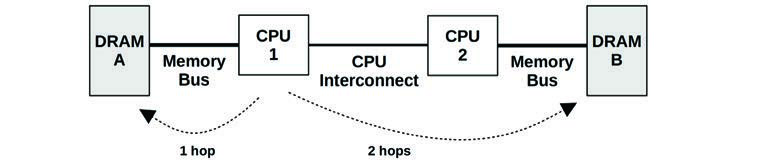
**图 7.3 示例 UMA 主内存架构，双处理器**

作为对比，图 7.4 显示了一个示例双处理器非统一内存访问（NUMA）系统，它使用 CPU 互连，成为内存架构的一部分。对于这种架构，主内存的访问时间根据其相对于 CPU 的位置而变化。

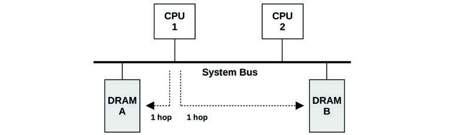
**图 7.4 示例 NUMA 主内存架构，双处理器**

CPU 1 可以通过其内存总线直接对 DRAM A 执行 I/O。这被称为本地内存。CPU 1 通过 CPU 2 和 CPU 互连对 DRAM B 执行 I/O（两跳）。这被称为远程内存，具有更高的访问延迟。

连接到每个 CPU 的内存库被称为内存节点，或简称节点。操作系统可以根据处理器提供的信息了解内存节点拓扑。这使其能够根据内存局部性分配内存和调度线程，尽可能倾向于本地内存以提高性能。

#### 总线 (Buses)

主内存如何物理连接到系统取决于主内存架构，如前所述。实际实现可能涉及 CPU 和内存之间的额外控制器和总线。主内存可以通过以下方式之一访问：

- **共享系统总线**：单处理器或多处理器，通过共享系统总线、内存桥接控制器，最后是内存总线。这已在图 7.3 的 UMA 示例以及第 6 章“CPU”图 6.9 的 Intel 前端总线示例中显示。在该示例中的内存控制器是北桥（Northbridge）。
- **直接连接**：单处理器通过内存总线直接连接内存。
- **互连**：多处理器，每个处理器通过内存总线直接连接内存，且处理器通过 CPU 互连连接。这已在之前的图 7.4 NUMA 示例中显示；CPU 互连在第 6 章“CPU”中讨论。

如果你怀疑你的系统不属于上述任何一种，请查找系统功能图并遵循 CPU 与内存之间的数据路径，记录沿途的所有组件。

#### DDR SDRAM

对于任何架构，内存总线的速度通常由处理器和系统板支持的内存接口标准决定。自 1996 年以来使用的一种通用标准是双倍数据速率同步动态随机存取存储器（DDR SDRAM）。术语“双倍数据速率”是指在时钟信号的上升沿和下降沿都传输数据（也称为双倍泵送 double-pumped）。术语“同步”是指内存与 CPU 同步时钟。

表 7.1 显示了示例 DDR SDRAM 标准。

**表 7.1 示例 DDR 带宽**

| 标准 | 规范年份 | 内存时钟 (MHz) | 数据速率 (MT/s) | 峰值带宽 (MB/s) |
| :--- | :--- | :--- | :--- | :--- |
| DDR-200 | 2000 | 100 | 200 | 1,600 |
| DDR-333 | 2000 | 167 | 333 | 2,667 |
| DDR2-667 | 2003 | 167 | 667 | 5,333 |
| DDR2-800 | 2003 | 200 | 800 | 6,400 |
| DDR3-1333 | 2007 | 167 | 1,333 | 10,667 |
| DDR3-1600 | 2007 | 200 | 1,600 | 12,800 |
| DDR4-3200 | 2012 | 200 | 3,200 | 25,600 |
| DDR5-4800 | 2020 | 200 | 4,800 | 38,400 |
| DDR5-6400 | 2020 | 200 | 6,400 | 51,200 |

DDR5 标准预计将于 2020 年由 JEDEC 固态技术协会发布。这些标准还使用“PC-”后跟以 MB/s 为单位的数据传输速率来命名，例如 PC-1600。

#### 多通道 (Multichannel)

系统架构可能支持并行使用多个内存总线，以提高带宽。常见的倍数是双通道、三通道和四通道。例如，Intel Core i7 处理器支持高达四通道的 DDR3-1600，最大内存带宽为 51.2 GB/s。

#### CPU 缓存 (CPU Caches)

处理器通常包括片上硬件缓存以提高内存访问性能。缓存可能包括以下级别，速度递减且大小递增：

- **L1 级**：通常分为独立的指令缓存和数据缓存。
- **L2 级**：用于指令和数据的缓存。
- **L3 级**：另一个更大的缓存级别。

根据处理器的不同，L1 通常由虚拟内存地址引用，L2 及其后级别由物理内存地址引用。

这些缓存在第 6 章“CPU”中进行了更深入的讨论。本章将讨论另一种类型的硬件缓存——TLB。

#### MMU

MMU（内存管理单元）负责虚拟地址到物理地址的转换。这些转换按页执行，页内的偏移量直接映射。MMU 在第 6 章“CPU”中在附近 CPU 缓存的上下文中被介绍。

一个通用的 MMU 如图 7.5 所示，带有各级 CPU 缓存和主内存。

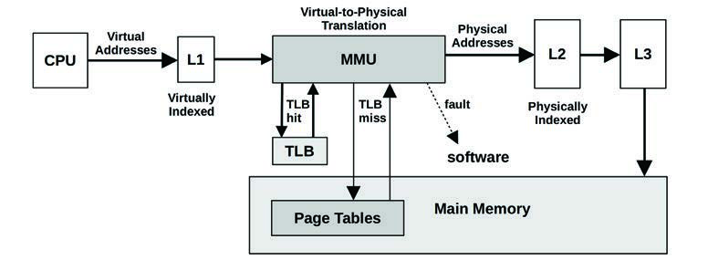
**图 7.5 内存管理单元**

#### 多种页大小 (Multiple Page Sizes)

现代处理器支持多种页大小，允许操作系统和 MMU 使用不同的页大小（例如 4 KB、2 MB、1 GB）。Linux 的大页（huge pages）特性支持更大的页大小，如 2 MB 或 1 GB。

#### TLB

图 7.5 中显示的 MMU 使用 TLB（转换后备缓冲区）作为地址转换缓存的第一级，随后是主内存中的页表。TLB 可以分为独立的指令和数据页面缓存。

由于 TLB 的映射条目数量有限，使用较大的页大小会增加可以从其缓存中转换的内存范围（其覆盖范围 reach），从而减少 TLB 未命中并提高系统性能。TLB 可能会进一步分为针对每种页大小的独立缓存，从而提高在缓存中保留较大映射的可能性。

作为 TLB 大小的示例，典型的 Intel Core i7 处理器提供表 7.2 所示的四个 TLB [Intel 19a]。

**表 7.2 典型 Intel Core i7 处理器的 TLB**

| 类型 | 页大小 | 条目数 |
| :--- | :--- | :--- |
| 指令 | 4 KB | 每线程 64 个，每核心 128 个 |
| 指令 | 大页 | 每线程 7 个 |
| 数据 | 4 KB | 64 个 |
| 数据 | 大页 | 32 个 |

该处理器有一级数据 TLB。Intel Core 微架构支持两级，类似于 CPU 提供多级主内存缓存的方式。

TLB 的确切组成取决于处理器类型。有关处理器中 TLB 的详细信息及其操作的更多信息，请参阅供应商处理器手册。

### 7.3.2 软件 (Software)

内存管理的软件包括虚拟内存系统、地址转换、交换、分页和分配。与性能最相关的主题包含在本节中：释放内存、空闲列表、页面扫描、交换、进程地址空间和内存分配器。

#### 释放内存 (Freeing Memory)

当系统上的可用内存变低时，内核可以使用各种方法来释放内存，将其添加到空闲页面列表（free list）中。图 7.6 显示了 Linux 中这些方法的常规使用顺序，随着可用内存的减少，依次使用。

这些方法是：

- **空闲列表 (Free list)**：未使用的页面列表（也称为空闲内存 idle memory），可供立即分配。这通常实现为多个空闲页面列表，每个局部性组（NUMA）一个。
- **页缓存 (Page cache)**：文件系统缓存。名为 `swappiness` 的可调参数设置了系统倾向于从页缓存释放内存而不是交换的程度。
- **交换 (Swapping)**：这是由页出守护进程 `kswapd` 管理的分页，它寻找最近未使用的页面并将其添加到空闲列表中，包括应用程序内存。这些页面被页出，可能涉及写入基于文件系统的交换文件或交换设备。当然，这仅在配置了交换文件或设备时才可用。
- **收割 (Reaping)**：当跨过低内存阈值时，可以指示内核模块和内核 slab 分配器立即释放任何可以轻松释放的内存。这也被称为“收缩”（shrinking）。
- **OOM 杀手 (OOM killer)**：内存不足杀手将通过查找并杀死一个牺牲进程来释放内存。牺牲进程由 `select_bad_process()` 找到，然后通过调用 `oom_kill_process()` 杀死。这可能会在系统日志（`/var/log/messages`）中记录为“Out of memory: Kill process”消息。

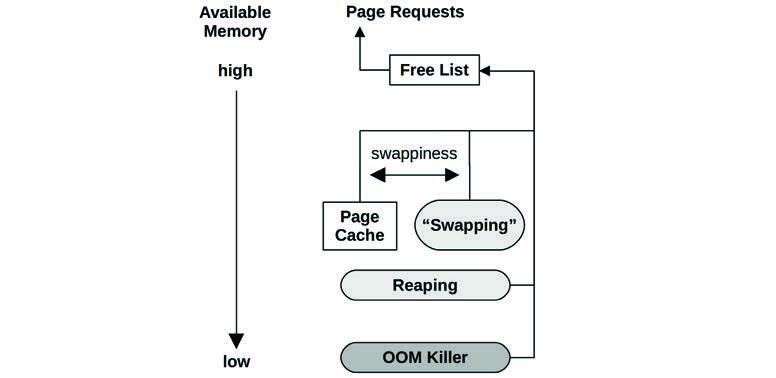
**图 7.6 Linux 内存可用性管理**

Linux 的 `swappiness` 参数控制是倾向于通过分页应用程序释放内存，还是通过从页缓存回收内存。它是一个介于 0 到 100 之间的数字（默认值为 60），值越高越倾向于通过分页释放内存。控制这些内存释放技术之间的平衡，允许通过保留热的文件系统缓存同时页出冷的应用程序内存来提高系统吞吐量 [Corbet 04]。

有趣的是，如果没有配置交换设备或交换文件会发生什么。这限制了虚拟内存大小，因此如果过度承诺被禁用，内存分配将更早失败。在 Linux 上，这也可能意味着 OOM 杀手会更早被使用。

考虑一个具有无止境内存增长问题的应用程序。有了交换，这很可能首先因为分页而成为性能问题，这是一个实时调试问题的机会。如果没有交换，就没有分页缓冲期，因此应用程序要么遇到“内存不足”错误，要么被 OOM 杀手终止。如果这仅在数小时的使用后才出现，可能会延迟问题的调试。

在 Netflix 云中，实例通常不使用交换，因此如果应用程序耗尽内存，它们会被 OOM 杀死。应用程序分布在大量的实例池中，一个被 OOM 杀死的实例会导致流量立即重定向到其他健康的实例。这被认为优于让一个实例由于交换而运行缓慢。

当使用内存 cgroups 时，可以使用与图 7.6 所示类似的技术来管理 cgroup 内存。系统可能有充足的空闲内存，但由于容器耗尽了其 cgroup 控制的限制，正在发生交换或遇到 OOM 杀手 [Evans 17]。有关 cgroup 和容器的更多信息，请参见第 11 章“云计算”。

接下来的部分描述空闲列表、收割和页出守护进程。

#### 空闲列表 (Free List(s))

原始的 Unix 内存分配器使用内存映射和首次适应扫描。随着 BSD 中分页虚拟内存的引入，增加了一个空闲列表和一个页出守护进程 [Babaoglu 79]。图 7.7 所示的空闲列表允许立即定位可用内存。

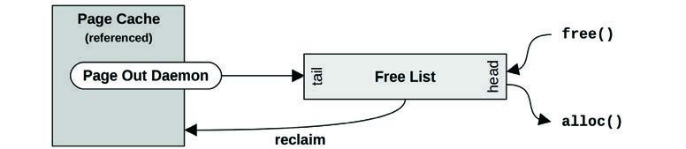
**图 7.7 空闲列表操作**

释放的内存被添加到列表头部以供未来的分配。由页出守护进程释放的内存——可能仍包含有用的缓存文件系统页面——被添加到尾部。如果对这些页面之一的未来请求在该有用页面被重用之前发生，它可以被重新声明（reclaim）并从空闲列表中移除。

Linux 系统仍在使用某种形式的空闲列表，如图 7.6 所示。空闲列表通常通过分配器消耗，例如内核的 slab 分配器和用户空间的 `libc malloc()`（它有自己的空闲列表）。这些分配器反过来消耗页面，然后通过其分配器 API 暴露它们。

Linux 使用“伙伴分配器”（buddy allocator）管理页面。这为不同大小的内存分配提供了多个空闲列表，遵循 2 的幂方案。术语“伙伴”（buddy）指的是寻找空闲内存的相邻页面，以便它们可以一起分配。有关历史背景，请参见 [Peterson 77]。

伙伴空闲列表处于以下层次结构的底部，始于每内存节点的 `pg_data_t`：

- **节点 (Nodes)**：内存库，NUMA 感知。
- **区域 (Zones)**：用于某些目的的内存范围（直接内存访问 [DMA][^4]、普通、高内存）。
- **迁移类型 (Migration types)**：不可移动、可回收、可移动等。
- **大小 (Sizes)**：页面的 2 的幂次方数量。

在节点空闲列表中分配可以提高内存局部性和性能。对于最常见的分配——单页，伙伴分配器为每个 CPU 保留单页列表，以减少 CPU 锁竞争。

#### 收割 (Reaping)

收割主要涉及从内核 slab 分配器缓存中释放内存。这些缓存包含 slab 大小块的未使用内存，随时待用。收割将这些内存返回给系统用于页面分配。

在 Linux 上，内核模块也可以调用 `register_shrinker()` 来注册特定的函数，以便收割它们自己的内存。

#### 页面扫描 (Page Scanning)

通过分页释放内存由内核页出守护进程管理。当空闲列表中的可用主内存下降到阈值以下时，页出守护进程开始页面扫描。页面扫描仅在需要时发生。一个正常平衡的系统可能不会经常进行页面扫描，即使进行也只是短时间的爆发。

在 Linux 上，页出守护进程被称为 `kswapd`，它扫描非活动和活动内存的 LRU 页面列表以释放页面。它根据空闲内存和两个阈值被唤醒以提供滞后（hysteresis），如图 7.8 所示。

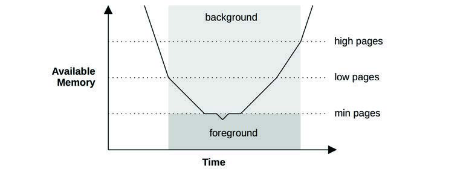
**图 7.8 kswapd 唤醒和模式**

一旦空闲内存达到最低阈值，`kswapd` 就在前台运行，同步地释放被请求的内存页，这种方法有时被称为直接回收（direct-reclaim）[Gorman 04]。这个最低阈值是可调的（`vm.min_free_kbytes`），其他阈值则基于它按比例缩放（低阈值为 2 倍，高阈值为 3 倍）。对于分配爆发超过 `kswap` 回收速度的工作负载，Linux 提供了额外的可调参数用于更具侵略性的扫描：`vm.watermark_scale_factor` 和 `vm.watermark_boost_factor`。见 7.6.1 节“可调参数”。

页缓存对非活动页面和活动页面有单独的列表。这些以 LRU 方式运作，允许 `kswapd` 快速找到空闲页面。它们如图 7.9 所示。

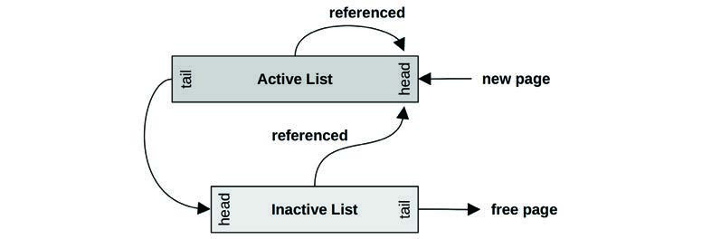
**图 7.9 kswapd 列表**

`kswapd` 首先扫描非活动列表，如果需要再扫描活动列表。术语“扫描”是指在遍历列表时检查页面：如果页面被锁定/脏，则可能不符合被释放的条件。`kswapd` 使用的术语“扫描”与原始 UNIX 页出守护进程进行的扫描具有不同的含义，后者扫描所有内存。

### 7.3.3 进程虚拟地址空间 (Process Virtual Address Space)

进程虚拟地址空间由硬件和软件共同管理，是一系列按需映射到物理页面的虚拟页面。地址被划分为称为段（segment）的区域，用于存储线程栈、进程可执行文件、库和堆。图 7.10 显示了 Linux 上 32 位进程的示例，包括 x86 和 SPARC 处理器。

在 SPARC 上，内核位于一个独立的完整地址空间中（图 7.10 中未显示）。请注意，在 SPARC 上，仅凭指针值无法区分用户地址和内核地址；x86 采用不同的方案，用户地址和内核地址互不重叠[^5]。

程序可执行段包含独立的文本段和数据段。库也由独立的执行文本段和数据段组成。这些不同的段类型包括：

- **可执行文本 (Executable text)**：包含进程的执行 CPU 指令。这是从文件系统上二进制程序的文本段映射而来的。它是只读的，具有执行权限。
- **可执行数据 (Executable data)**：包含从二进制程序的数据段映射的初始化变量。它具有读/写权限，以便在程序运行时修改变量。它还有一个私有标志，因此修改不会刷新到磁盘。
- **堆 (Heap)**：程序的临时内存，是匿名内存（没有文件系统位置）。它根据需要增长，通过 `malloc(3)` 分配。
- **栈 (Stack)**：运行线程的栈，映射为读/写。

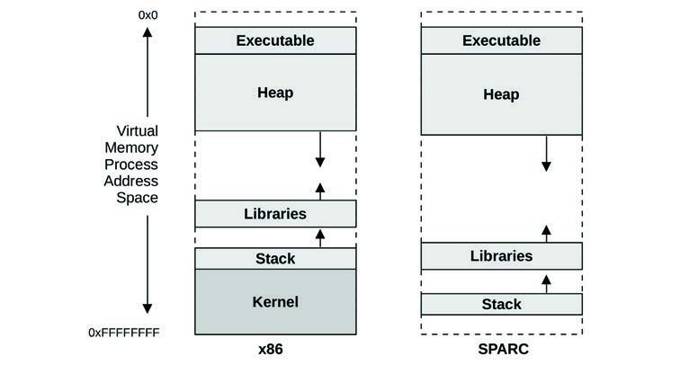
**图 7.10 示例进程虚拟内存地址空间**

库文本段可以被使用同一库的其他进程共享，每个进程都有该库数据段的私有副本。

#### 堆增长 (Heap Growth)

一个常见的困惑来源是堆的无止境增长。这是内存泄漏吗？对于简单的分配器，`free(3)` 不会将内存返回给操作系统；相反，内存被保留以服务未来的分配。这意味着进程驻留内存只能增长，这是正常的。进程减少系统内存使用的方法 include:

- **重新执行 (Re-exec)**：调用 `execve(2)` 从一个空的地址空间开始。
- **内存映射 (Memory mapping)**：使用 `mmap(2)` 和 `munmap(2)`，它们会将内存返回给系统。

内存映射文件在第 8 章“文件系统” 8.3.10 节“内存映射文件”中描述。

Linux 上常用的 Glibc 是一个高级分配器，它支持 `mmap` 操作模式，以及 `malloc_trim(3)` 函数来向系统释放空闲内存。当堆顶空闲内存变得足够大时[^6]，`free(3)` 会自动调用 `malloc_trim(3)`，并通过 `sbrk(2)` 系统调用将其释放。

#### 分配器 (Allocators)

有多种用于内存分配的用户级和内核级分配器。图 7.11 显示了分配器的角色，包括一些常见类型。

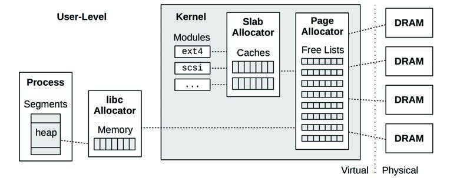
**图 7.11 用户级和内核级内存分配器**

页面管理已在之前的 7.3.2 节“软件”中的“空闲列表”部分描述。

内存分配器的特性可以包括：

- **简单的 API**：例如 `malloc(3)`、`free(3)`。
- **高效的内存使用**：在服务各种大小的内存分配时，内存使用可能会变得碎片化，其中存在许多浪费内存的未使用区域。分配器可以努力合并这些未使用区域，以便较大的分配可以使用它们，从而提高效率。
- **性能**：内存分配可能非常频繁，在多线程环境中，由于同步原语的竞争，它们可能表现不佳。分配器可以设计为谨慎使用锁，还可以利用每线程或每 CPU 缓存来提高内存局部性。
- **可观测性**：分配器可以提供统计信息和调试模式，以显示其如何被使用，以及哪些代码路径负责分配。

接下来的部分描述内核级分配器——slab 和 SLUB，以及用户级分配器——glibc、TCMalloc 和 jemalloc。

#### Slab

内核 slab 分配器管理特定大小对象的缓存，允许它们被快速回收，而无需页面分配的开销。这对于内核分配尤其有效，因为内核分配经常针对固定大小的结构体。

作为内核示例，以下两行来自 ZFS `arc.c`[^7]：

```c
df = kmem_alloc(sizeof (l2arc_data_free_t), KM_SLEEP);
head = kmem_cache_alloc(hdr_cache, KM_PUSHPAGE);
```

第一行 `kmem_alloc()` 显示了传统风格的内核分配，其大小作为参数传递。内核根据该大小将其映射到一个 slab 缓存（非常大的尺寸由超大 arena 处理，处理方式不同）。第二行 `kmem_cache_alloc()` 直接操作自定义 slab 分配器缓存，在本例中为 `(kmem_cache_t *)hdr_cache`。

slab 分配器最初为 Solaris 2.4 开发 [Bonwick 94]，后来增强了称为杂志（magazines）的每 CPU 缓存 [Bonwick 01]：

> 我们的基本方法是给每个 CPU 一个名为杂志（magazine）的 M 元素对象缓存，类比自动武器。每个 CPU 的杂志在 CPU 需要重新加载（即将其空的杂志更换为满的杂志）之前可以满足 M 次分配。

除了高性能外，原始的 slab 分配器还具有调试和分析设施，包括用于追踪分配详情和堆栈追踪的审计功能。

Slab 分配已被各种操作系统采用。BSD 有一个称为通用内存分配器（UMA）的内核 slab 分配器，它是高效且 NUMA 感知的。Linux 在 2.2 版本中也引入了 slab 分配器，在那里它作为默认选项使用了多年。Linux 后来转向了 SLUB 作为选项或默认设置。

#### SLUB

Linux 内核 SLUB 分配器基于 slab 分配器，旨在解决各种问题，特别是关于 slab 分配器的复杂性。改进包括移除了对象队列和每 CPU 缓存——将 NUMA 优化留给页面分配器（参见之前的“空闲列表”部分）。

SLUB 分配器在 Linux 2.6.23 中成为默认选项 [Lameter 07]。

#### glibc

用户级 GNU libc 分配器基于 Doug Lea 的 `dlmalloc`。其行为取决于分配请求的大小。较小的分配从内存箱（bins）中服务，其中包含相似大小的单元，可以使用类伙伴算法（buddy-like algorithm）进行合并。较大的分配可以使用树查找来高效寻找空间。非常大的分配切换为使用 `mmap(2)`。最终结果是一个高性能的分配器，受益于多种分配策略。

#### TCMalloc

TCMalloc 是用户级线程缓存 malloc，它为较小的分配使用每线程缓存，减少了锁竞争并提高了性能 [Ghemawat 07]。定期的垃圾回收将内存移回中央堆进行分配。

#### jemalloc

`libjemalloc` 最初作为 FreeBSD 用户级 libc 分配器，也可用于 Linux。它使用多种 arena、每线程缓存和小对象 slab 等技术来提高可扩展性并减少内存碎片。它可以使用 `mmap(2)` 和 `sbrk(2)` 来获取系统内存，且倾向于使用 `mmap(2)`。Facebook 使用 jemalloc 并增加了剖析和其他优化 [Facebook 11]。

Facebook 使用 jemalloc 并增加了剖析和其他优化 [Facebook 11]。

## 7.4 方法论 (Methodology)

本节描述用于内存分析和调优的各种方法论和练习。主题总结在表 7.3 中。

**表 7.3 内存性能方法论**

| 节 | 方法论 | 类型 |
| :--- | :--- | :--- |
| 7.4.1 | 工具法 | 观测分析 |
| 7.4.2 | USE 法 | 观测分析 |
| 7.4.3 | 刻画使用情况 | 观测分析、容量规划 |
| 7.4.4 | 周期分析 | 观测分析 |
| 7.4.5 | 性能监控 | 观测分析、容量规划 |
| 7.4.6 | 泄漏检测 | 观测分析 |
| 7.4.7 | 静态性能调优 | 观测分析、容量规划 |
| 7.4.8 | 资源控制 | 调优 |
| 7.4.9 | 微基准测试 | 实验分析 |
| 7.4.10 | 内存收缩 | 实验分析 |

有关更多策略及其中许多策略的介绍，请参见第 2 章“方法论”。

这些方法可以单独遵循或结合使用。在排查内存问题时，我的建议是按以下顺序开始：性能监控、USE 法和刻画使用情况。

7.5 节“可观测性工具”展示了用于应用这些方法的操作系统工具。

### 7.4.1 工具法 (Tools Method)

工具法是一个在可用工具上迭代、检查它们提供的关键指标的过程。这是一个简单的方法论，但可能会忽略由于现有工具可见性较差或没有可见性而产生的问题，并且执行起来可能很耗时。

对于内存，工具法在 Linux 上可以涉及检查以下内容：

- **页面扫描 (Page scanning)**：寻找持续的页面扫描（超过 10 秒）作为内存压力的迹象。这可以使用 `sar -B` 并检查 `pgscan` 列来完成。
- **压力停顿信息 (PSI)**：`cat /proc/pressure/memory`（Linux 4.20+）检查内存压力（饱和度）统计信息及其随时间的变化。
- **交换 (Swapping)**：如果配置了交换，内存页面的交换（Linux 对交换的定义）是系统内存不足的进一步迹象。可以使用 `vmstat(8)` 并检查 `si` 和 `so` 列。
- **vmstat**：运行 `vmstat 1` 并检查 `free` 列以获取可用内存。
- **OOM 杀手**：这些事件可以在系统日志 `/var/log/messages` 或通过 `dmesg(1)` 看到。搜索“Out of memory”。
- **top**：查看哪些进程和用户是主要的物理内存消费者（驻留）和虚拟内存消费者（查看 man 手册了解列名，不同版本有所不同）。`top(1)` 也会总结空闲内存。
- **perf(1)/BCC/bpftrace**：使用堆栈追踪记录内存分配，以识别内存使用的原因。请注意，这可能会产生相当大的开销。一个更便宜虽然较粗糙的方案是执行 CPU 剖析（定时堆栈采样）并搜索分配代码路径。

有关每个工具的更多信息，请参见 7.5 节“可观测性工具”。

### 7.4.2 USE 法 (USE Method)

USE 法用于在性能调查的早期识别所有组件的瓶颈和错误，然后再遵循更深入且更耗时的策略。

在系统范围内检查：

- **利用率 (Utilization)**：有多少内存在使用，有多少可用。物理内存和虚拟内存都应该检查。
- **饱和度 (Saturation)**：页面扫描、分页、交换以及为缓解内存压力而执行的 Linux OOM 杀手牺牲的程度。
- **错误 (Errors)**：软件或硬件错误。

你可能想先检查饱和度，因为持续的饱和是内存问题的迹象。这些指标通常很容易从操作系统工具中获得，包括用于交换统计的 `vmstat(8)` 和 `sar(1)`，以及用于 OOM 杀手牺牲的 `dmesg(1)`。对于配置了独立磁盘交换设备的系统，交换设备的任何活动都是内存压力的另一个迹象。Linux 还通过压力停顿信息（PSI）提供内存饱和度统计。

物理内存利用率在不同的工具中可能会有不同的报告，这取决于它们是否计入未引用的文件系统缓存页面或非活动页面。一个系统可能报告它只有 10 MB 的可用内存，而实际上它有 10 GB 的文件系统缓存，可以在应用程序需要时立即回收。请查看工具文档以了解包含哪些内容。

虚拟内存利用率也可能需要检查，这取决于系统是否执行过度承诺。对于不执行过度承诺的系统，一旦虚拟内存耗尽，内存分配将失败——这是一种内存错误。

内存错误可能由软件引起，如失败的内存分配或 Linux OOM 杀手，也可能由硬件引起，如 ECC 错误。历史上，内存分配错误一直留给应用程序报告，尽管并非所有应用程序都这样做（而且，随着 Linux 的过度承诺，开发人员可能觉得没有必要）。硬件错误也很难诊断。一些工具可以报告 ECC 可纠正错误（例如在 Linux 上，`dmidecode(8)`、`edac-utils`、`ipmitool sel`），当使用 ECC 内存时。这些可纠正错误可以用作 USE 法的错误指标，并可能是不可纠正错误即将发生的迹象。对于实际的（不可纠正的）内存错误，你可能会遇到任意应用程序的无法解释、无法复现的崩溃（包括段错误 segfaults 和总线错误信号 bus error signals）。

对于实施内存限制或配额（资源控制）的环境（如某些云计算环境），内存利用率和饱和度可能需要以不同的方式衡量。你的操作系统实例可能已达到其软件内存限制并正在交换，尽管宿主机上有充足的物理内存可用。请参见第 11 章“云计算”。

### 7.4.3 刻画使用情况 (Characterizing Usage)

在容量规划、基准测试和模拟工作负载时，刻画内存使用情况是一项重要的练习。它还可以通过发现和纠正错误配置来带来一些最大的性能增益。例如，数据库缓存可能配置得太小而导致命中率低，或者配置得太大而导致系统分页。

对于内存，刻画使用情况涉及识别在哪里使用了多少内存：

- 系统范围的物理和虚拟内存利用率
- 饱和度：交换和 OOM 杀死
- 内核和文件系统缓存内存使用情况
- 每进程物理和虚拟内存使用情况
- 内存资源控制的使用情况（如果存在）

以下示例描述展示了如何将这些属性表达在一起：

> 系统具有 256 GB 的主内存，其中进程正在使用（利用）1%，文件系统缓存占 30%。最大的进程是一个数据库，消耗 2 GB 的主内存（RSS），这是根据它从中迁移而来的前一个系统所配置的限制。

随着更多内存用于缓存工作数据，这些特征可能会随时间变化。除了正常的缓存增长外，内核或应用程序内存也可能由于内存泄漏（一种软件错误）而随时间持续增长。

#### 高级使用分析/检查清单

此处列出了其他特征作为思考题，也可以在彻底研究内存问题时作为检查清单：

- 应用程序的工作集大小（WSS）是多少？
- 内核内存在哪里使用？每个 slab 使用了多少？
- 文件系统缓存中有多少是活动的，有多少是非活动的？
- 进程内存在哪里使用（指令、缓存、缓冲区、对象等）？
- 为什么进程在分配内存（调用路径）？
- 为什么内核在分配内存（调用路径）？
- 进程库映射是否有任何异常（例如随时间变化）？
- 哪些进程正在被积极地交换出？
- 哪些进程之前已被交换出？
- 进程或内核是否有内存泄漏？
- 在 NUMA 系统中，内存在内存节点上的分布情况如何？
- IPC 和内存停顿周期率是多少？
- 内存总线的平衡程度如何？
- 执行了多少本地内存 I/O，执行了多少远程内存 I/O？

接下来的部分可以帮助回答其中一些问题。有关此方法论及要测量的特征（谁、为什么、什么、如何）的高级摘要，请参见第 2 章“方法论”。

### 7.4.4 周期分析 (Cycle Analysis)

内存总线负载可以通过检查 CPU 性能监控计数器（PMC）来确定，这些计数器可以编程为计算内存停顿周期、内存总线使用情况等。首先要检查的一个指标是每周期指令数（IPC），它反映了 CPU 负载对内存的依赖程度。请参见第 6 章“CPU”。

### 7.4.5 性能监控 (Performance Monitoring)

性能监控可以识别活跃的问题和随时间变化的行为模式。内存的关键指标是：

- **利用率**：使用的百分比，可以从可用内存推断出来。
- **饱和度**：交换、OOM 杀死。

对于实施内存限制或配额（资源控制）的环境，可能还需要收集与施加的限制相关的统计信息。

也可以监控错误（如果可用），如 7.4.2 节“USE 法”中关于利用率和饱和度的描述。

随时间监控内存使用情况（特别是按进程监控）可以帮助识别内存泄漏的存在和速率。

### 7.4.6 泄漏检测 (Leak Detection)

当应用程序或内核模块无止境增长，消耗空闲列表、文件系统缓存并最终消耗其他进程的内存时，就会出现此问题。这通常首先被注意到，因为系统由于无止境的内存压力而开始交换，或者应用程序被 OOM 杀死。

此类问题是由以下原因之一引起的：

- **内存泄漏 (Memory leak)**：一种软件漏洞，内存不再被使用但从未被释放。这可以通过修改软件代码，或通过应用补丁或升级（修改代码）来修复。
- **内存增长 (Memory growth)**：软件正在正常消耗内存，但其速率远高于系统所能承受的程度。这可以通过更改软件配置，或者由软件开发人员更改应用程序消耗内存的方式来修复。

内存增长问题经常被误认为是内存泄漏。要问的第一个问题是：它本该那样吗？检查内存使用情况、应用程序的配置以及其分配器的行为。应用程序可能被配置为填充内存缓存，观察到的增长可能是缓存预热。

如何分析内存泄漏取决于软件和语言类型。一些分配器提供用于记录分配详情的调试模式，随后可以进行事后分析以识别负责的代码路径。一些运行具有堆转储（heap dump）分析方法以及其他用于内存泄漏调查的工具。

Linux BCC 追踪工具包含用于增长和泄漏分析的 `memleak(8)`：它追踪分配并记录在一段间隔内未被释放的分配，以及分配代码路径。它无法判断这些是泄漏还是正常增长，因此你的任务是分析代码路径以确定属于哪种情况。（请注意，在高分配率下，该工具也会产生高开销。）BCC 在第 15 章“BPF” 15.1 节“BCC”中涵盖。

### 7.4.7 静态性能调优 (Static Performance Tuning)

静态性能调优侧重于已配置环境的问题。对于内存性能，请检查静态配置的以下方面：

- 总共有多少主内存？
- 应用程序被配置为使用多少内存（它们自身的配置）？
- 应用程序使用哪些内存分配器？
- 主内存的速度是多少？它是目前最快的类型吗（DDR5）？
- 主内存是否曾被全面测试过（例如，使用 Linux `memtester`）？
- 系统架构是什么？NUMA、UMA？
- 操作系统是否能感知 NUMA？它是否提供 NUMA 可调参数？
- 内存是连接到同一个插槽，还是分散在多个插槽中？
- 存在多少个内存总线？
- CPU 缓存的数量和大小是多少？TLB 呢？
- BIOS 设置是什么？
- 是否配置并使用了大页？
- 过度承诺是否可用且已配置？
- 还在使用哪些其他系统内存可调参数？
- 是否存在软件强加的内存限制（资源控制）？

回答这些问题可能会揭示被忽视的配置选择。

### 7.4.8 资源控制 (Resource Controls)

操作系统可以为进程或进程组的内存分配提供细粒度的控制。这些控制可能包括主内存和虚拟内存使用的固定限制。它们的工作方式取决于具体实现，并在 7.6 节“调优”和第 11 章“云计算”中讨论。

### 7.4.9 微基准测试 (Micro-Benchmarking)

微基准测试可用于确定主内存的速度以及 CPU 缓存和缓存行大小等特征。在分析系统之间的差异时，它可能会有所帮助，因为内存访问速度对性能的影响可能比 CPU 时钟频率更大，这取决于应用程序和工作负载。

在第 6 章“CPU”中，“CPU 缓存”下的“延迟”部分（ 6.4.1 节“硬件”）显示了微基准测试内存访问延迟以确定 CPU 缓存特征的结果。

### 7.4.10 内存收缩 (Memory Shrinking)

这是一种工作集大小（WSS）估计方法，使用反向实验，需要配置交换设备来执行实验。应用程序可用的主内存被逐渐减少，同时测量性能和交换情况：性能急剧下降且交换大幅增加的点显示了 WSS 何时不再能装入可用内存。

虽然值得作为反向实验的一个例子提及，但不建议在生产环境中使用，因为它会故意损害性能。有关其他 WSS 估计技术，请参见 7.5.12 节实验性 `wss(8)` 工具，以及我的 WSS 估计网站 [Gregg 18c]。

## 7.5 可观测性工具 (Observability Tools)

本节介绍基于 Linux 操作系统的内存可观测性工具。有关使用这些工具时应遵循的方法论，请参见上一节。

本节中的工具列于表 7.4。

**表 7.4 Linux 内存可观测性工具**

| 节 | 工具 | 描述 |
| :--- | :--- | :--- |
| 7.5.1 | vmstat | 虚拟和物理内存统计 |
| 7.5.2 | PSI | 内存压力停顿信息 |
| 7.5.3 | swapon | 交换设备使用情况 |
| 7.5.4 | sar | 历史统计 |
| 7.5.5 | slabtop | 内核 slab 分配器统计 |
| 7.5.6 | numastat | NUMA 统计 |
| 7.5.7 | ps | 进程状态 |
| 7.5.8 | top | 监控每进程内存使用 |
| 7.5.9 | pmap | 进程地址空间统计 |
| 7.5.10 | perf | 内存 PMC 和追踪点分析 |
| 7.5.11 | drsnoop | 直接回收追踪 |
| 7.5.12 | wss | 工作集大小估计 |
| 7.5.13 | bpftrace | 用于内存分析的追踪程序 |

这是一组支持 7.4 节“方法论”的工具和功能。我们从系统级内存使用统计开始，然后深入到每进程和分配追踪。一些传统工具可能在它们起源的其他类 Unix 操作系统上也能找到，包括：`vmstat(8)`、`sar(1)`、`ps(1)`、`top(1)` 和 `pmap(1)`。`drsnoop(8)` 是来自 BCC（第 15 章）的一个 BPF 工具。

有关每个工具功能的完整参考，请参见其文档，包括 man 手册。

### 7.5.1 vmstat

虚拟内存统计命令 `vmstat(8)` 提供了系统内存 health 状况的高级视图，包括当前空闲内存和分页统计。CPU 统计信息也包含在内，如第 6 章“CPU”所述。

当 Bill Joy 和 Ozalp Babaoglu 在 1979 年为 BSD 引入它时，最初的 man 手册包含：

> BUGS: 打印出的数字太多，有时很难弄清楚该看哪一个。

以下是 Linux 版本的示例输出：

```bash
$ vmstat 1
procs -----------memory---------- ---swap-- -----io---- -system-- ----cpu----
 r  b   swpd   free   buff  cache   si   so    bi    bo   in   cs us sy id wa
 4  0      0 34454064 111516 13438596   0   0    0    5    2    0  0  0 100  0
 4  0      0 34455208 111516 13438596   0   0    0    0 2262 15303 16 12 73  0
 5  0      0 34455588 111516 13438596   0   0    0    0 1961 15221 15 11 74  0
 4  0      0 34456300 111516 13438596   0   0    0    0 2343 15294 15 11 73  0
[...]
```

此版本的 `vmstat(8)` 不会在输出的第一行打印自启动以来的摘要值（针对 procs 或 memory 列），而是立即显示当前状态。列默认以 KB 为单位，分别为：

- **swpd**：已换出的内存量
- **free**：空闲可用内存
- **buff**：缓冲区缓存中的内存
- **cache**：页缓存中的内存
- **si**：换入的内存（分页）
- **so**：换出的内存（分页）

缓冲区缓存和页缓存将在第 8 章“文件系统”中描述。系统启动后空闲内存下降并被这些缓存用于提高性能是正常的。需要时可以将其释放给应用程序使用。

如果 `si` 和 `so` 列持续非零，则系统处于内存压力下，正在向交换设备或文件进行交换（见 `swapon(8)`）。其他工具，包括显示每进程内存的工具（例如 `top(1)`、`ps(1)`），可用于调查是什么在消耗内存。

在具有大量内存的系统上，列可能会变得不对齐且有点难以阅读。你可以尝试使用 `-S` 选项将输出单位更改为 MB（使用 `m` 代表 1,000,000，使用 `M` 代表 1,048,576）：

```bash
$ vmstat -Sm 1
procs -----------memory---------- ---swap-- -----io---- -system-- ----cpu----
 r  b   swpd   free   buff  cache   si   so    bi    bo   in   cs us sy id wa
 4  0      0  35280    114  13761    0    0     0     5    2    1  0  0 100  0
 4  0      0  35281    114  13761    0    0     0     0 2027 15146 16 13 70  0
[...]
```

还有一个 `-a` 选项可以打印页缓存中非活动和活动内存的细分：

```bash
$ vmstat -a 1
procs -----------memory---------- ---swap-- -----io---- -system-- ----cpu----
 r  b   swpd   free  inact active   si   so    bi    bo   in   cs us sy id wa
 5  0      0 34453536 10358040 3201540   0   0    0    5    2    0  0  0 100  0
 4  0      0 34453228 10358040 3200648   0   0    0    0 2464 15261 16 12 71  0
[...]
```

这些内存统计信息可以使用小写的 `-s` 选项以列表形式打印。

### 7.5.2 PSI

Linux 压力停顿信息（PSI），添加于 Linux 4.20，包含了内存饱和度的统计信息。这些不仅显示是否存在内存压力，还显示过去五分钟内的变化情况。示例输出：

```bash
# cat /proc/pressure/memory
some avg10=2.84 avg60=1.23 avg300=0.32 total=1468344
full avg10=1.85 avg60=0.66 avg300=0.16 total=702578
```

此输出显示内存压力正在增加，10 秒平均值（2.84）高于 300 秒平均值（0.32）。这些平均值是任务因内存停顿的时间百分比。`some` 行显示部分任务（线程）受影响的时间，`full` 行显示所有可运行任务都受影响的时间。

PSI 统计信息也按 cgroup2 进行追踪（cgroup 在第 11 章“云计算”中涵盖）[Facebook 19]。

### 7.5.3 swapon

`swapon(1)` 可以显示是否配置了交换设备以及其容量使用了多少。例如：

```bash
$ swapon
NAME      TYPE      SIZE   USED PRIO
/dev/dm-2 partition 980M 611.6M   -2
/swap1    file       30G  10.9M   -3
```

此输出显示了两个交换设备：一个 980 MB 的物理磁盘分区，以及一个名为 `/swap1` 的 30 GB 文件。输出还显示了两者的使用情况。现在许多系统没有配置交换；在这种情况下，`swapon(1)` 将不会打印任何输出。

如果交换设备有活跃的 I/O，可以在 `vmstat(1)` 的 `si` 和 `so` 列中看到，并可以在 `iostat(1)` 中作为设备 I/O 看到（第 9 章）。

### 7.5.4 sar

系统活动报告器 `sar(1)` 可用于观察当前活动，并可配置为归档和报告历史统计信息。本书多章中都提到了它提供的各种统计信息，并在第 4 章“可观测性工具” 4.4 节 `sar` 中进行了介绍。

Linux 版本通过以下选项提供内存统计信息：

- **-B**：分页统计信息
- **-H**：大页统计信息
- **-r**：内存利用率
- **-S**：交换空间统计信息
- **-W**：交换活动统计信息

这些涵盖了内存使用、页出守护进程的活动和大页使用情况。有关这些主题的背景，请参见 7.3 节“架构”。

提供的统计信息包括表 7.5 中的内容。

**表 7.5 Linux sar 内存统计信息**

| 选项 | 指标 | 描述 | 单位 |
| :--- | :--- | :--- | :--- |
| -B | pgpgin/s | 页入速率 | KB/s |
| -B | pgpgout/s | 页出速率 | KB/s |
| -B | fault/s | 主要和次要页错误总数 | 次/s |
| -B | majflt/s | 主要页错误 | 次/s |
| -B | pgfree/s | 添加到空闲列表的页面 | 次/s |
| -B | pgscank/s | 后台页出守护进程（kswapd）扫描的页面 | 次/s |
| -B | pgscand/s | 直接页面扫描 | 次/s |
| -B | pgsteal/s | 页面和交换缓存回收 | 次/s |
| -B | %vmeff | 页面回收效率（页面回收/页面扫描的比率） | 百分比 |
| -H | hbhugfree | 空闲大页内存 | KB |
| -H | hbhugused | 已用大页内存 | KB |
| -H | %hugused | 大页使用率 | 百分比 |
| -r | kbmemfree | 空闲内存（完全未使用） | KB |
| -r | kbavail | 可用内存，包括可从页缓存中轻松释放的页面 | KB |
| -r | kbmemused | 已用内存（不包括内核） | KB |
| -r | %memused | 内存使用率 | 百分比 |
| -r | kbbuffers | 缓冲区缓存大小 | KB |
| -r | kbcached | 页缓存大小 | KB |
| -r | kbcommit | 已承诺的主内存：服务当前负载所需的估计量 | KB |
| -r | %commit | 服务当前负载所需的主内存估计百分比 | 百分比 |
| -r | kbactive | 活动列表内存大小 | KB |
| -r | kbinact | 非活动列表内存大小 | KB |
| -r | kbdirty | 等待写入磁盘的已修改内存 | KB |
| -r ALL | kbanonpg | 进程匿名内存 | KB |
| -r ALL | kbslab | 内核 slab 缓存大小 | KB |
| -r ALL | kbkstack | 内核栈空间大小 | KB |
| -r ALL | kbpgtbl | 最底层页表大小 | KB |
| -r ALL | kbvmused | 已用虚拟地址空间 | KB |
| -S | kbswpfree | 空闲交换空间 | KB |
| -S | kbswpused | 已用交换空间 | KB |
| -S | %swpused | 交换空间使用率 | 百分比 |
| -S | kbswpcad | 缓存的交换空间：驻留在主内存和交换设备中，无需磁盘 I/O 即可换出 | KB |
| -S | %swpcad | 缓存交换与已用交换的比率 | 百分比 |
| -W | pswpin/s | 页入（Linux 的“swap-ins”） | 页/s |
| -W | pswpout/s | 页出（Linux 的“swap-outs”） | 页/s |

许多指标名称包含了所测量的单位：`pg` 代表页面，`kb` 代表千字节，`%` 代表百分比，`/s` 代表每秒。完整列表请参阅 man 手册，其中包含一些额外的基于百分比的统计信息。

重要的是要记住，在需要时，可以获得关于高级内存子系统的使用和操作的如此多细节。为了更深入地理解这些，你可能需要使用追踪器来对内存追踪点和内核函数进行插桩，例如后面章节中的 `perf(1)` 和 `bpftrace`。你还可以浏览 `mm` 中的源代码，特别是 `mm/vmscan.c`。`linux-mm` 邮件列表上的许多帖子提供了进一步的见解，开发人员会在那里讨论这些统计信息应该是怎样的。

`%vmeff` 指标是页面回收效率的一个有用衡量标准。高值意味着页面成功地从非活动列表中被回收（健康）；低值意味着系统正在挣扎。man 手册将接近 100% 描述为高，低于 30% 描述为低。

另一个有用的指标是 `pgscand`，它有效地显示了应用程序因内存分配而阻塞并进入直接回收的速率（越高越差）。要查看应用程序在直接回收事件期间花费的时间，你可以使用追踪工具：见 7.5.11 节 `drsnoop`。

### 7.5.5 slabtop

Linux `slabtop(1)` 命令打印来自 slab 分配器的内核 slab 缓存使用情况。像 `top(1)` 一样，它实时刷新屏幕。

以下是一些示例输出：

```bash
# slabtop -sc
 Active / Total Objects (% used)    : 686110 / 867574 (79.1%)
 Active / Total Slabs (% used)      : 30948 / 30948 (100.0%)
 Active / Total Caches (% used)     : 99 / 164 (60.4%)
 Active / Total Size (% used)       : 157680.28K / 200462.06K (78.7%)
 Minimum / Average / Maximum Object : 0.01K / 0.23K / 12.00K

  OBJS ACTIVE  USE OBJ SIZE  SLABS OBJ/SLAB CACHE SIZE NAME
 45450  33712  74%    1.05K   3030       15     48480K ext4_inode_cache
 161091  81681  50%    0.19K   7671       21     30684K dentry
 222963 196779  88%    0.10K   5717       39     22868K buffer_head
 35763  35471  99%    0.58K   2751       13     22008K inode_cache
 26033  13859  53%    0.57K   1860       14     14880K radix_tree_node
 93330  80502  86%    0.13K   3111       30     12444K kernfs_node_cache
  2104   2081  98%    4.00K    263        8      8416K kmalloc-4k
   528    431  81%    7.50K    132        4      4224K task_struct
 [...]
```

输出顶部有一个摘要，下面是 slab 列表，包括它们的对象计数（OBJS）、有多少是活动的（ACTIVE）、使用的百分比（USE）、对象的大小（OBJ SIZE，字节）以及缓存的总大小（CACHE SIZE，字节）。在本例中，使用了 `-sc` 选项按缓存大小排序，最大的在顶部：`ext4_inode_cache`。

slab 统计信息来自 `/proc/slabinfo`，也可以通过 `vmstat -m` 打印。

### 7.5.6 numastat

`numastat(8)`[^8] 工具为非统一内存访问（NUMA）系统提供统计信息，通常是那些具有多个 CPU 插槽的系统。以下是一个双插槽系统的示例输出：

```bash
# numastat
                           node0           node1
numa_hit            210057224016    151287435161
numa_miss             9377491084       291611562
numa_foreign           291611562      9377491084
interleave_hit             36476           36665
local_node          210056887752    151286964112
other_node            9377827348       292082611
```

该系统有两个 NUMA 节点，每个内存库连接到一个插槽。Linux 尝试在最近的 NUMA 节点上分配内存，`numastat(8)` 显示了这种尝试的成功程度。关键统计数据包括：

- **numa_hit**：在预期的 NUMA 节点上进行的内存分配。
- **numa_miss + numa_foreign**：未在首选 NUMA 节点上进行的内存分配。（`numa_miss` 显示本应在其他地方的本地分配，`numa_foreign` 显示本应在本地的远程分配。）
- **other_node**：当进程在其他地方运行时在此节点上进行的内存分配。

示例输出显示 NUMA 分配策略表现良好：与其他统计数据相比，命中的次数非常多。如果命中率低得多，你可能会考虑调整 `sysctl(8)` 中的 NUMA 可调参数，或使用其他方法来改善内存局部性（例如，对工作负载或系统进行分区，或选择具有更少 NUMA 节点的系统）。如果无法改进 NUMA，`numastat(8)` 至少有助于解释糟糕的内存 I/O 性能。

`numastat(8)` 支持 `-n` 以 MB 为单位打印统计数据，支持 `-m` 以 `/proc/meminfo` 的风格打印输出。根据你的 Linux 发行版，`numastat(8)` 可能会在 `numactl` 软件包中提供。

### 7.5.7 ps

进程状态命令 `ps(1)` 列出了所有进程的详细信息，包括内存使用统计信息。其用法在第 6 章“CPU”中进行了介绍。

例如，使用 BSD 风格的选项：

```bash
$ ps aux
USER       PID %CPU %MEM    VSZ   RSS TTY  STAT START   TIME COMMAND
[...]
bind      1152  0.0  0.4 348916 39568 ?    Ssl  Mar27  20:17 /usr/sbin/named -u bind
root      1371  0.0  0.0  39004  2652 ?    Ss   Mar27  11:04 /usr/lib/postfix/master
root      1386  0.0  0.6 207564 50684 ?    Sl   Mar27   1:57 /usr/sbin/console-kit-
daemon --no-daemon
rabbitmq  1469  0.0  0.0  10708   172 ?    S    Mar27   0:49 /usr/lib/erlang/erts-
5.7.4/bin/epmd -daemon
rabbitmq  1486  0.1  0.0 150208  2884 ?    Ssl  Mar27 453:29 /usr/lib/erlang/erts-
5.7.4/bin/beam.smp -W w -K true -A30 ...
```

此输出包括以下列：

- **%MEM**：主内存使用率（物理内存，RSS）占系统总量的百分比
- **RSS**：驻留集大小（KB）
- **VSZ**：虚拟内存大小（KB）

虽然 RSS 显示了主内存的使用情况，但它包括了共享内存段，如系统库，这些库可能被数十个进程映射。如果你将 RSS 列求和，你可能会发现它超过了系统中可用的内存，这是由于共享内存的重复计算。有关共享内存的背景，请参见 7.2.9 节“共享内存”，以及随后的 `pmap(1)` 命令，用于分析共享内存使用情况。

这些列可以使用 SVR4 风格的 `-o` 选项进行选择，例如：

```bash
# ps -eo pid,pmem,vsz,rss,comm
  PID %MEM  VSZ  RSS COMMAND
[...]
13419  0.0 5176 1796 /opt/local/sbin/nginx
13879  0.1 31060 22880 /opt/local/bin/ruby19
13418  0.0 4984 1456 /opt/local/sbin/nginx
15101  0.0 4580   32 /opt/riak/lib/os_mon-2.2.6/priv/bin/memsup
10933  0.0 3124 2212 /usr/sbin/rsyslogd
[...]
```

Linux 版本还可以打印主要和次要错误的列（`maj_flt`、`min_flt`）。

`ps(1)` 的输出可以根据内存列进行后置排序，以便快速识别最高消费者。或者尝试 `top(1)`，它提供交互式排序。

### 7.5.8 top

`top(1)` 命令监控最活跃的运行进程，并包含内存使用统计信息。它在第 6 章“CPU”中被介绍过。例如，在 Linux 上：

```bash
$ top -o %MEM
top - 00:53:33 up 242 days,  2:38,  7 users,  load average: 1.48, 1.64, 2.10
Tasks: 261 total,   1 running, 260 sleeping,   0 stopped,   0 zombie
Cpu(s):  0.0%us,  0.0%sy,  0.0%ni, 99.9%id,  0.0%wa,  0.0%hi,  0.0%si,  0.0%st
Mem:   8181740k total,  6658640k used,  1523100k free,   404744k buffers
Swap:  2932728k total,   120508k used,  2812220k free,  2893684k cached

  PID USER      PR  NI  VIRT  RES  SHR S %CPU %MEM    TIME+  COMMAND
29625 scott     20   0 2983m 2.2g 1232 S   45 28.7  81:11.31 node
 5121 joshw     20   0  222m 193m  804 S    0  2.4 260:13.40 tmux
 1386 root      20   0  202m  49m 1224 S    0  0.6   1:57.70 console-kit-dae
 6371 stu       20   0 65196  38m  292 S    0  0.5  23:11.13 screen
 1152 bind      20   0  340m  38m 1700 S    0  0.5  20:17.36 named
15841 joshw     20   0 67144  23m  908 S    0  0.3 201:37.91 mosh-server
18496 root      20   0 57384  16m 1972 S    3  0.2   2:59.99 python
 1258 root      20   0  125m 8684 8264 S    0  0.1   2052:01 l2tpns
16295 wesolows  20   0 95752 7396  944 S    0  0.1   4:46.07 sshd
23783 brendan   20   0 22204 5036 1676 S    0  0.1   0:00.15 bash
[...]
```

顶部的摘要显示了主内存（Mem） and 虚拟内存（Swap）的总量、已用量和空闲量。还显示了缓冲区缓存（buffers）和页缓存（cached）的大小。

在本例中，使用 `-o` 设置排序列，对每进程输出按 `%MEM` 进行了排序。本例中最大的进程是 `node`，使用了 2.2 GB 的主内存和将近 3 GB 的虚拟内存。

主内存百分比列（`%MEM`）、虚拟内存大小（`VIRT`）和驻留集大小（`RES`）与前面描述的 `ps(1)` 的等效列含义相同。有关 `top(1)` 内存统计信息的更多细节，请参见 `top(1)` man 手册中的“Linux Memory Types”章节，该章节解释了每个可能的内存列显示的是哪种类型的内存。你还可以在使用 `top(1)` 时键入“?”来查看其内置的交互式命令摘要。

### 7.5.9 pmap

`pmap(1)` 命令列出进程的内存映射，显示其大小、权限和映射对象。这允许更详细地检查进程内存使用情况，并量化共享内存。

例如，在基于 Linux 的系统上：

```bash
# pmap -x 5187
5187:   /usr/sbin/mysqld
Address           Kbytes     RSS   Dirty Mode  Mapping
000055dadb0dd000   58284   10748       0 r-x-- mysqld
000055dade9c8000    1316    1316    1316 r---- mysqld
000055dadeb11000    3592     816     764 rw--- mysqld
000055dadee93000    1168    1080    1080 rw---   [ anon ]
000055dae08b5000    5168    4836    4836 rw---   [ anon ]
00007f018c000000    4704    4696    4696 rw---   [ anon ]
00007f018c498000   60832       0       0 -----   [ anon ]
00007f0190000000     132      24      24 rw---   [ anon ]
[...]
00007f01f99da000       4       4       0 r---- ld-2.30.so
00007f01f99db000     136     136       0 r-x-- ld-2.30.so
00007f01f99fd000      32      32       0 r---- ld-2.30.so
00007f01f9a05000       4       0       0 rw-s- [aio] (deleted)
00007f01f9a06000       4       4       4 r---- ld-2.30.so
00007f01f9a07000       4       4       4 rw--- ld-2.30.so
00007f01f9a08000       4       4       4 rw---   [ anon ]
00007ffd2c528000     132      52      52 rw---   [ stack ]
00007ffd2c5b3000      12       0       0 r----   [ anon ]
00007ffd2c5b6000       4       4       0 r-x--   [ anon ]
ffffffffff600000       4       0       0 --x--   [ anon ]
---------------- ------- ------- -------
total kB         1828228  450388  434200
```

这显示了 MySQL 数据库服务器的内存映射，包括虚拟内存（Kbytes）、主内存（RSS）、私有匿名内存（Dirty）和权限（Mode）。对于许多映射，匿名内存非常少，且许多映射是只读的（`r-...`），允许这些页面与其他进程共享。对于系统库尤其如此。本例中消耗的大部分内存位于堆中，显示为第一波 `[ anon ]` 段（在此输出中已截断）。

`-x` 选项打印扩展字段。还有 `-X` 提供更多细节，以及 `-XX` 提供内核提供的“一切”。仅显示这些模式的标头：

```bash
# pmap -X $(pgrep mysqld) | head -2
5187:   /usr/sbin/mysqld
         Address Perm   Offset Device   Inode    Size    Rss    Pss Referenced
Anonymous LazyFree ShmemPmdMapped Shared_Hugetlb Private_Hugetlb Swap SwapPss Locked
THPeligible ProtectionKey Mapping
[...]
# pmap -XX  $(pgrep mysqld) | head -2
5187:   /usr/sbin/mysqld
         Address Perm   Offset Device   Inode    Size KernelPageSize MMUPageSize
Rss    Pss Shared_Clean Shared_Dirty Private_Clean Private_Dirty Referenced Anonymous
LazyFree AnonHugePages ShmemPmdMapped Shared_Hugetlb Private_Hugetlb Swap SwapPss
Locked THPeligible ProtectionKey                 VmFlags Mapping
[...]
```

这些额外字段取决于内核版本。它们包括大页使用、交换使用的详情，以及映射的比例集大小（Pss）（已高亮）。PSS 显示了映射拥有多少私有内存，加上共享内存除以用户数量。这为主内存使用量提供了一个更现实的值。

### 7.5.10 perf

`perf(1)` 是官方的 Linux 剖析器，是一个具有多种功能的多功能工具。第 13 章提供了 `perf(1)` 的摘要。本节涵盖其在内存分析中的用法。另请参见第 6 章中关于内存 PMC 的 `perf(1)` 分析。

#### 一行命令 (One-Liners)

以下一行命令既有用，又演示了 `perf(1)` 进行内存分析的不同能力。

在全系统范围内采样页错误（RSS 增长）及其堆栈追踪，直到按 Ctrl-C：

```bash
perf record -e page-faults -a -g
```

为 PID 1843 记录所有页错误及其堆栈追踪，持续 60 秒：

```bash
perf record -e page-faults -c 1 -p 1843 -g -- sleep 60
```

通过 `brk(2)` 记录堆增长，直到按 Ctrl-C：

```bash
perf record -e syscalls:sys_enter_brk -a -g
```

在 NUMA 系统上记录页面迁移：

```bash
perf record -e migrate:mm_migrate_pages -a
```

对所有 `kmem` 事件进行计数，每秒打印一次报告：

```bash
perf stat -e 'kmem:*' -a -I 1000
```

对所有 `vmscan` 事件进行计数，每秒打印一次报告：

```bash
perf stat -e 'vmscan:*' -a -I 1000
```

对所有内存压缩（compaction）事件进行计数，每秒打印一次报告：

```bash
perf stat -e 'compaction:*' -a -I 1000
```

追踪 `kswapd` 唤醒事件及其堆栈追踪，直到按 Ctrl-C：

```bash
perf record -e vmscan:mm_vmscan_wakeup_kswapd -ag
```

剖析给定命令的内存访问：

```bash
perf mem record command
```

总结内存剖析：

```bash
perf mem report
```

对于记录或采样事件的命令，使用 `perf report` 来总结剖析结果，或使用 `perf script --header` 来打印所有事件。

参见第 13 章“perf” 13.2 节“一行命令”以获取更多 `perf(1)` 一行命令，以及 7.5.13 节 `bpftrace`，它在许多相同的事件上构建可观测性程序。

#### 页错误采样 (Page Fault Sampling)

`perf(1)` 可以记录页错误时的堆栈追踪，显示触发此事件的代码路径。由于页错误发生在进程增加其驻留集大小（RSS）时，分析它们可以解释为什么进程的主内存正在增长。有关内存使用期间页错误的作用，请参见图 7.2。

在以下示例中，在所有 CPU 上（`-a`[^9]）追踪 `page-faults` 软件事件及其堆栈追踪（`-g`），持续 60 秒，然后打印堆栈：

```bash
# perf record -e page-faults -a -g -- sleep 60
[ perf record: Woken up 4 times to write data ]
[ perf record: Captured and wrote 1.164 MB perf.data (2584 samples) ]
# perf script
[...]
sleep  4910 [001] 813638.716924:          1 page-faults:
        ffffffff9303f31e __clear_user+0x1e ([kernel.kallsyms])
        ffffffff9303f37b clear_user+0x2b ([kernel.kallsyms])
        ffffffff92941683 load_elf_binary+0xf33 ([kernel.kallsyms])
        ffffffff928d25cb search_binary_handler+0x8b ([kernel.kallsyms])
        ffffffff928d38ae __do_execve_file.isra.0+0x4fe ([kernel.kallsyms])
        ffffffff928d3e09 __x64_sys_execve+0x39 ([kernel.kallsyms])
        ffffffff926044ca do_syscall_64+0x5a ([kernel.kallsyms])
        ffffffff9320008c entry_SYSCALL_64_after_hwframe+0x44 ([kernel.kallsyms])
            7fb53524401b execve+0xb (/usr/lib/x86_64-linux-gnu/libc-2.30.so)
[...]
mysqld  4918 [000] 813641.075298:          1 page-faults:
            7fc6252d7001 [unknown] (/usr/lib/x86_64-linux-gnu/libc-2.30.so)
            562cacaeb282 pfs_malloc_array+0x42 (/usr/sbin/mysqld)
            562cacafd582 PFS_buffer_scalable_container<PFS_prepared_stmt, 1024, 1024,
PFS_buffer_default_array<PFS_prepared_stmt>,
PFS_buffer_default_allocator<PFS_prepared_stmt> >::allocate+0x262 (/usr/sbin/mysqld)
            562cacafd820 create_prepared_stmt+0x50 (/usr/sbin/mysqld)
            562cacadbbef [unknown] (/usr/sbin/mysqld)
            562cab3719ff mysqld_stmt_prepare+0x9f (/usr/sbin/mysqld)
            562cab3479c8 dispatch_command+0x16f8 (/usr/sbin/mysqld)
            562cab348d74 do_command+0x1a4 (/usr/sbin/mysqld)
            562cab464fe0 [unknown] (/usr/sbin/mysqld)
            562cacad873a [unknown] (/usr/sbin/mysqld)
            7fc625ceb669 start_thread+0xd9 (/usr/lib/x86_64-linux-gnu/libpthread-
2.30.so)
[...]
```

这里仅包含两个堆栈。第一个来自 `perf(1)` 调用的哑 `sleep(1)` 命令，第二个是 MySQL 服务器。当进行全系统追踪时，你可能会看到许多来自短寿命进程的堆栈，这些进程在退出前短暂增长了内存，触发了页错误。你可以使用 `-p PID` 代替 `-a` 来匹配特定进程。

完整输出有 222,582 行；`perf report` 将代码路径总结为层级结构，但输出仍有 7,592 行。火焰图可以更有效地可视化整个剖析结果。

#### 页错误火焰图 (Page Fault Flame Graphs)

图 7.12 显示了从之前的剖析结果生成的页错误火焰图。

图 7.12 的火焰图显示，MySQL 服务器中一半以上的内存增长来自 `JOIN::optimize()` 代码路径（左侧的大塔）。鼠标悬停在 `JOIN::optimize()` 上显示它及其子调用负责了 3,226 个页错误；对于 4 KB 的页面，这相当于大约 12 MB 的主内存增长。

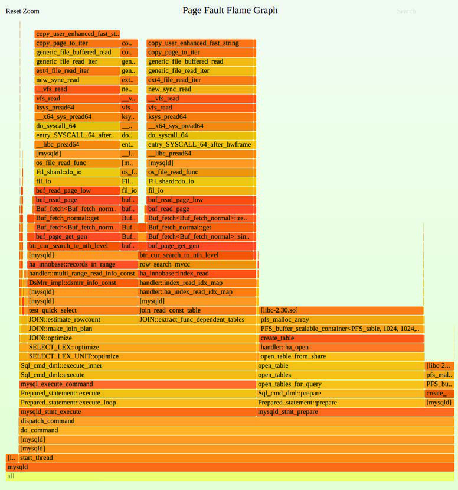
**图 7.12 页错误火焰图**

用于生成此火焰图的命令（包括记录页错误的 `perf(1)` 命令）如下：

```bash
# perf record -e page-faults -a -g -- sleep 60
# perf script --header > out.stacks
$ git clone https://github.com/brendangregg/FlameGraph; cd FlameGraph
$ ./stackcollapse-perf.pl < ../out.stacks | ./flamegraph.pl --hash \
    --bgcolor=green --count=pages --title="Page Fault Flame Graph" > out.svg
```

我将背景颜色设置为绿色，作为视觉提醒，这不属于典型的 CPU 火焰图（黄色背景），而属于内存火焰图（绿色背景）。

### 7.5.11 drsnoop

`drsnoop(8)`[^10] 是一个 BCC 工具，用于追踪释放内存的直接回收方法，显示受影响的进程和延迟：回收所花费的时间。它可以用来量化内存受限系统对应用程序性能的影响。例如：

```bash
# drsnoop -T
TIME(s)       COMM           PID     LAT(ms) PAGES
0.000000000   java           11266      1.72    57
0.004007000   java           11266      3.21    57
0.011856000   java           11266      2.02    43
0.018315000   java           11266      3.09    55
0.024647000   acpid          1209       6.46    73
[...]
```

此输出显示了 Java 的一些直接回收，耗时在 1 到 7 毫秒之间。这些回收的速率及其以毫秒为单位的持续时间（LAT(ms)）可以作为量化应用程序影响的考虑因素。

该工具通过追踪 `vmscan mm_vmscan_direct_reclaim_begin` 和 `mm_vmscan_direct_reclaim_end` 追踪点来工作。这些预期是低频事件（通常成批发生），因此开销应该可以忽略不计。

`drsnoop(8)` 支持 `-T` 选项以包含时间戳，支持 `-p PID` 以匹配单个进程。

### 7.5.12 wss

`wss(8)` 是我开发的一个实验性工具，用于演示如何使用页表项（PTE）的“已访问”位来测量进程的工作集大小（WSS）。这是一项总结确定工作集大小的不同方式的长篇研究的一部分 [Gregg 18c]。我在这里包含 `wss(8)` 是因为工作集大小（频繁访问的内存量）是理解内存使用的重要指标，拥有一个带有警告的实验性工具总比没有好。

以下输出显示 `wss(8)` 正在测量 MySQL 数据库服务器（`mysqld`）的 WSS，每隔一秒打印一次累积 WSS：

```bash
# ./wss.pl $(pgrep -n mysqld) 1
Watching PID 423 page references grow, output every 1 seconds...
Est(s)     RSS(MB)    PSS(MB)    Ref(MB)
1.014       403.66     400.59      86.00
2.034       403.66     400.59      90.75
3.054       403.66     400.59      94.29
4.074       403.66     400.59      97.53
5.094       403.66     400.59     100.33
6.114       403.66     400.59     102.44
7.134       403.66     400.59     104.58
8.154       403.66     400.59     106.31
9.174       403.66     400.59     107.76
10.194      403.66     400.59     109.14
```

输出显示，到 5 秒标记时，`mysqld` 已经触及了大约 100 MB 的内存。`mysqld` 的 RSS 为 400 MB。输出还包括了该间隔的估计时间，包括设置和读取已访问位所花费的时间（Est(s)），以及比例集大小（PSS），它考虑了与其他进程共享页面的情况。

该工具的工作原理是重置进程中每个页面的 PTE 已访问位，暂停一段时间间隔，然后检查这些位以查看哪些已被设置。由于这是基于页面的，因此分辨率为页面大小，通常为 4 KB。请认为它报告的数字已向上取整到页面大小。

> [!WARNING]
> 该工具使用 `/proc/PID/clear_refs` 和 `/proc/PID/smaps`，当内核遍历页面结构时，可能会导致应用程序延迟略微增加（例如 10%）。对于大型进程（> 100 GB），这种延迟增加的持续时间可能会超过一秒，在此期间该工具正在消耗系统 CPU 时间。请记住这些开销。该工具还会重置引用标志，这可能会使内核对回收哪些页面感到困惑，特别是在交换活跃时。此外，它还会激活一些在你的环境中之前可能从未被使用过的旧内核代码。请先在实验环境中进行测试，以确保你了解其开销。

### 7.5.13 bpftrace

`bpftrace` 是一个基于 BPF 的追踪器，它提供了一种高级编程语言，允许创建强大的一行命令和短脚本。它非常适合基于其他工具提供的线索进行自定义应用程序分析。`bpftrace` 仓库包含了额外的内存分析工具，包括 `oomkill.bt` [Robertson 20]。

`bpftrace` 在第 15 章“BPF”中讲解。本节展示一些内存分析的示例。

#### 一行命令 (One-liners)

以下一行命令既有用，又演示了 `bpftrace` 的不同能力。

按用户堆栈和进程汇总 `libc malloc()` 请求的字节数（高开销）：

```bash
bpftrace -e 'uprobe:/lib/x86_64-linux-gnu/libc.so.6:malloc {
    @[ustack, comm] = sum(arg0); }'
```

为 PID 181 按用户堆栈汇总 `libc malloc()` 请求的字节数（高开销）：

```bash
bpftrace -e 'uprobe:/lib/x86_64-linux-gnu/libc.so.6:malloc /pid == 181/ {
    @[ustack] = sum(arg0); }'
```

按用户堆栈为 PID 181 显示 `libc malloc()` 请求字节数的 2 的幂直方图（高开销）：

```bash
bpftrace -e 'uprobe:/lib/x86_64-linux-gnu/libc.so.6:malloc /pid == 181/ {
    @[ustack] = hist(arg0); }'
```

按内核堆栈追踪汇总内核 `kmem` 缓存分配字节数：

```bash
bpftrace -e 't:kmem:kmem_cache_alloc { @bytes[kstack] = sum(args->bytes_alloc); }'
```

按代码路径计算进程堆扩展（`brk(2)`）次数：

```bash
bpftrace -e 'tracepoint:syscalls:sys_enter_brk { @[ustack, comm] = count(); }'
```

按进程计算页错误次数：

```bash
bpftrace -e 'software:page-fault:1 { @[comm, pid] = count(); }'
```

按用户级堆栈追踪计算用户页错误次数：

```bash
bpftrace -e 't:exceptions:page_fault_user { @[ustack, comm] = count(); }'
```

按追踪点计算 `vmscan` 操作次数：

```bash
bpftrace -e 'tracepoint:vmscan:* { @[probe] = count(); }'
```

按进程计算换入（swapins）次数：

```bash
bpftrace -e 'kprobe:swap_readpage { @[comm, pid] = count(); }'
```

计算页面迁移次数：

```bash
bpftrace -e 'tracepoint:migrate:mm_migrate_pages { @ = count(); }'
```

追踪压缩事件：

```bash
bpftrace -e 't:compaction:mm_compaction_begin { time(); }'
```

列出 `libc` 中的 USDT 探针：

```bash
bpftrace -l 'usdt:/lib/x86_64-linux-gnu/libc.so.6:*'
```

列出内核 `kmem` 追踪点：

```bash
bpftrace -l 't:kmem:*'
```

列出所有内存子系统（`mm`）追踪点：

```bash
bpftrace -l 't:*:mm_*'
```

#### 用户分配堆栈 (User Allocation Stacks)

可以从所使用的分配函数中追踪用户级分配。在此示例中，为 PID 4840（一个 MySQL 数据库服务器）追踪来自 `libc` 的 `malloc(3)` 函数。分配请求的大小被记录为按用户级堆栈追踪键控的直方图：

```bash
# bpftrace -e 'uprobe:/lib/x86_64-linux-gnu/libc.so.6:malloc /pid == 4840/ {
    @[ustack] = hist(arg0); }'
Attaching 1 probe...
^C
[...]


    __libc_malloc+0
    Filesort_buffer::allocate_sized_block(unsigned long)+52
    0x562cab572344
    filesort(THD*, Filesort*, RowIterator*, Filesort_info*, Sort_result*, unsigned
long long*)+4017
    SortingIterator::DoSort(QEP_TAB*)+184
    SortingIterator::Init()+42
    SELECT_LEX_UNIT::ExecuteIteratorQuery(THD*)+489
    SELECT_LEX_UNIT::execute(THD*)+266
    Sql_cmd_dml::execute_inner(THD*)+563
    Sql_cmd_dml::execute(THD*)+1062
    mysql_execute_command(THD*, bool)+2380
    Prepared_statement::execute(String*, bool)+2345
    Prepared_statement::execute_loop(String*, bool)+172
    mysqld_stmt_execute(THD*, Prepared_statement*, bool, unsigned long, PS_PARAM*)
+385
    dispatch_command(THD*, COM_DATA const*, enum_server_command)+5793
    do_command(THD*)+420
    0x562cab464fe0
    0x562cacad873a
    start_thread+217
]:
[32K, 64K)           676 |@@@@@@@@@@@@@@@@@@@@@@@@@@@@@@@@@@@@@@@@@@@@@@@@@@@@|
[64K, 128K)          338 |@@@@@@@@@@@@@@@@@@@@@@@@@@                          |
```

输出显示，在追踪期间，该代码路径有 676 个大小在 32 到 64 KB 之间的 `malloc()` 请求，以及 338 个大小在 64 到 128 KB 之间的请求。

#### malloc() 字节火焰图 (malloc() Bytes Flame Graph)

前一个一行命令的输出长达许多页，因此通过火焰图更容易理解。可以使用以下步骤生成一个：

```bash
# bpftrace -e 'u:/lib/x86_64-linux-gnu/libc.so.6:malloc /pid == 4840/ {
    @[ustack] = hist(arg0); }' > out.stacks
$ git clone https://github.com/brendangregg/FlameGraph; cd FlameGraph
$ ./stackcollapse-bpftrace.pl < ../out.stacks | ./flamegraph.pl --hash \
    --bgcolor=green --count=bytes --title="malloc() Bytes Flame Graph" > out.svg
```

> [!WARNING]
> 用户级分配请求可能是一项频繁的活动，每秒发生数百万次。虽然插桩成本很小，但当乘以高频率时，它可能导致追踪期间产生显著的 CPU 开销，使目标变慢两倍或更多——请谨慎使用。由于成本较低，我首先使用堆栈追踪的 CPU 剖析来了解分配路径，或者使用下一节中展示的页错误追踪。

#### 页错误火焰图 (Page Fault Flame Graphs)

追踪页错误显示了进程何时增长内存大小。之前的 `malloc()` 一行命令显示了内存分配，但许多分配可能从未被触及，因此从未触发页错误，也从未消耗主内存。页错误显示了实际的内存使用情况。

有关生成火焰图的更多详细信息，请参见 7.5.10 节中的页错误火焰图描述。

### 7.5.14 其他工具

本书其他章节以及《BPF Performance Tools》[Gregg 19] 中包含的内存可观测性工具列于表 7.6。

**表 7.6 其他内存可观测性工具**

| 章节 | 工具 | 描述 |
| :--- | :--- | :--- |
| 6.6.11 | pmcarch | CPU 周期使用情况，包括 LLC 未命中 |
| 6.6.12 | tlbstat | 总结 TLB 周期 |
| 8.6.2 | free | 缓存容量统计 |
| 8.6.12 | cachestat | 页缓存统计 |
| [Gregg 19] | oomkill | 显示 OOM 杀掉事件的额外信息 |
| [Gregg 19] | memleak | 显示可能的内存泄漏代码路径 |
| [Gregg 19] | mmapsnoop | 在全系统范围内追踪 `mmap(2)` 调用 |
| [Gregg 19] | brkstack | 显示带有用户堆栈追踪的 `brk()` 调用 |
| [Gregg 19] | shmsnoop | 追踪共享内存调用及其详细信息 |
| [Gregg 19] | faults | 按用户堆栈追踪显示页错误 |
| [Gregg 19] | ffaults | 按文件名显示页错误 |
| [Gregg 19] | vmscan | 测量 VM 扫描器的收缩和回收时间 |
| [Gregg 19] | swapin | 按进程显示换入（swap-ins）情况 |
| [Gregg 19] | hfaults | 按进程显示大页错误 |

其他 Linux 内存可观测性工具和来源包括：

- **dmesg**：检查来自 OOM 杀手的“Out of memory”消息。
- **dmidecode**：显示内存库的 BIOS 信息。
- **tiptop**：一个按进程显示 PMC 统计信息的 `top(1)` 版本。
- **valgrind**：一个性能分析套件，包括 `memcheck`，它是用户级分配器的包装器，用于内存使用分析（包括泄漏检测）。这会产生显著的开销；手册建议它会导致目标运行速度慢 20 到 30 倍 [Valgrind 20]。
- **iostat**：如果交换设备是物理磁盘或分区，可以使用 `iostat(1)` 观察设备 I/O，这表明系统正在分页。
- **/proc/zoneinfo**：内存区域（DMA 等）的统计信息。
- **/proc/buddyinfo**：内核页面伙伴分配器的统计信息。
- **/proc/pagetypeinfo**：内核空闲内存页统计信息；可用于帮助调试内核内存碎片问题。
- **/sys/devices/system/node/node\*/numastat**：NUMA 节点的统计信息。
- **SysRq m**：魔术 SysRq 有一个“m”键，可以将内存信息转储到控制台。

以下是 `dmidecode(8)` 显示一个内存库的示例输出：

```bash
# dmidecode
[...]
Memory Device
        Array Handle: 0x0003
        Error Information Handle: Not Provided
        Total Width: 64 bits
        Data Width: 64 bits
        Size: 8192 MB
        Form Factor: SODIMM
        Set: None
        Locator: ChannelA-DIMM0
        Bank Locator: BANK 0
        Type: DDR4
        Type Detail: Synchronous Unbuffered (Unregistered)
        Speed: 2400 MT/s
        Manufacturer: Micron
        Serial Number: 00000000
        Asset Tag: None
        Part Number: 4ATS1G64HZ-2G3A1
        Rank: 1
        Configured Clock Speed: 2400 MT/s
        Minimum Voltage: Unknown
        Maximum Voltage: Unknown
        Configured Voltage: 1.2 V
[...]
```

此输出对于静态性能调优很有用（例如，它显示类型是 DDR4 而不是 DDR5）。不幸的是，这些信息通常对云端客户机不可用。

以下是来自 SysRq “m” 触发器的示例输出：

```bash
# echo m > /proc/sysrq-trigger
# dmesg
[...]
[334849.389256] sysrq: Show Memory
[334849.391021] Mem-Info:
[334849.391025] active_anon:110405 inactive_anon:24 isolated_anon:0
                 active_file:152629 inactive_file:137395 isolated_file:0
                 unevictable:4572 dirty:311 writeback:0 unstable:0
                 slab_reclaimable:31943 slab_unreclaimable:14385
                 mapped:37490 shmem:186 pagetables:958 bounce:0
                 free:37403 free_pcp:478 free_cma:2289

[334849.391028] Node 0 active_anon:441620kB inactive_anon:96kB active_file:610516kB
inactive_file:549580kB unevictable:18288kB isolated(anon):0kB isolated(file):0kB
mapped:149960kB dirty:1244kB writeback:0kB shmem:744kB shmem_thp: 0kB
shmem_pmdmapped: 0kB anon_thp: 2048kB writeback_tmp:0kB unstable:0kB
all_unreclaimable? no
[334849.391029] Node 0 DMA free:12192kB min:360kB low:448kB high:536kB ...
[...]
```

如果系统已锁定，这可能很有用，因为如果可用的话，仍然可以使用控制台键盘上的 SysRq 键序列请求此信息 [Linux 20g]。

应用程序和虚拟机（例如 Java VM）也可能提供它们自己的内存分析工具。见第 5 章“应用程序”。

## 7.6 调优

你能做的最重要的内存调优是确保应用程序留在主内存中，并且不会频繁发生分页和交换。识别此问题在 7.4 节“方法论”和 7.5 节“可观测性工具”中已有介绍。本节讨论其他内存调优：内核可调参数、配置大页、分配器和资源控制。

调优的具体细节——可用选项以及将它们设置为什么值——取决于操作系统版本和预期负载。以下部分按调优类型组织，提供了哪些可调参数可能可用以及为什么需要调优它们的示例。

### 7.6.1 可调参数

本节描述了近期 Linux 内核的可调参数示例。

各种内存可调参数在内核源码文档 `Documentation/sysctl/vm.txt` 中有描述，可以使用 `sysctl(8)` 进行设置。表 7.7 中的示例来自 5.3 内核，默认值来自 Ubuntu 19.10（本书第一版中列出的那些自那时以来没有改变）。

**表 7.7 Linux 内存可调参数示例**

| 选项 | 默认值 | 描述 |
| :--- | :--- | :--- |
| `vm.dirty_background_bytes` | 0 | 触发 pdflush 后台写回的脏内存量 |
| `vm.dirty_background_ratio` | 10 | 触发 pdflush 后台写回的系统脏内存百分比 |
| `vm.dirty_bytes` | 0 | 导致写入进程开始写回的脏内存量 |
| `vm.dirty_ratio` | 20 | 导致写入进程开始写回的系统脏内存比例 |
| `vm.dirty_expire_centisecs` | 3,000 | 脏内存在符合 pdflush 条件之前的最小时间（促进写入取消） |
| `vm.dirty_writeback_centisecs` | 500 | pdflush 唤醒间隔（0 为禁用） |
| `vm.min_free_kbytes` | 动态 | 设置期望的空闲内存量（某些内核原子分配会消耗此内存） |
| `vm.watermark_scale_factor` | 10 | 控制唤醒和睡眠的 kswapd 水位线（min, low, high）之间的距离（单位是 10000 的分数，因此 10 表示系统内存的 0.1%） |
| `vm.watermark_boost_factor` | 5000 | 当内存碎片化（最近发生了碎片化事件）时，kswapd 扫描超过高水位线多远；单位是 10000 的分数，因此 5000 意味着 kswapd 可以提升到高水位线的 150%；0 为禁用 |
| `percpu_pagelist_fraction` | 0 | 这可以覆盖可以分配给每个 CPU 页面列表的最大页面比例（值为 10 限制为页面的 1/10） |
| `vm.overcommit_memory` | 0 | 0 = 使用启发式算法允许合理的超付；1 = 总是超付；2 = 不超付 |
| `vm.swappiness` | 60 | 释放内存时，相对于从页缓存中回收，更倾向于通过交换（分页）释放内存的程度 |
| `vm.vfs_cache_pressure` | 100 | 回收缓存的目录和索引节点对象的程度；较低的值会更多地保留它们；0 表示永不回收——很容易导致内存不足的情况 |
| `kernel.numa_balancing` | 1 | 启用自动 NUMA 页面平衡 |
| `kernel.numa_balancing_scan_size_mb` | 256 | 每次 NUMA 平衡扫描时扫描多少 MB 的页面 |

可调参数使用了一致的命名方案，其中包括单位。请注意，`dirty_background_bytes` 和 `dirty_background_ratio` 是互斥的，`dirty_bytes` 和 `dirty_ratio` 也是如此（当设置其中一个时，它会覆盖另一个）。

`vm.min_free_kbytes` 的大小作为主内存的一小部分动态设置。选择它的算法不是线性的，因为对空闲内存的需求不会随着主内存大小线性扩展。（作为参考，这记录在 Linux 源码的 `mm/page_alloc.c` 中。）可以减少 `vm.min_free_kbytes` 以便为应用程序腾出一些内存，但这也会导致内核在内存压力期间不堪重负，并更早地诉诸 OOM。增加它可以帮助避免 OOM 杀掉。

另一个避免 OOM 的参数是 `vm.overcommit_memory`，它可以设置为 2 以禁用超付并避免导致 OOM 的情况。如果你想在每个进程的基础上控制 OOM 杀手，请检查你的内核版本中是否有 `/proc` 可调参数，如 `oom_adj` 或 `oom_score_adj`。这些在 `Documentation/filesystems/proc.txt` 中有描述。

如果 `vm.swappiness` 可调参数比预期的更早开始交换应用程序内存，它会显著影响性能。此可调参数的值可以在 0 到 100 之间，较高的值倾向于交换应用程序，从而保留页缓存。可能希望将其设置为零，以便在牺牲页缓存的情况下尽可能长时间地保留应用程序内存。当仍然存在内存短缺时，内核仍然可以使用交换。

在 Netflix，对于较早的内核（大约 Linux 3.13），`kernel.numa_balancing` 被设置为零，因为过于激进的 NUMA 扫描消耗了过多的 CPU [Gregg 17d]。这在后来的内核中得到了修复，并且还有其他可调参数，包括 `kernel.numa_balancing_scan_size_mb`，用于调整 NUMA 扫描的激进程度。

### 7.6.2 多种页面大小

大页面大小可以通过提高 TLB 缓存的命中率（增加其覆盖范围）来提高内存 I/O 性能。大多数现代处理器支持多种页面大小，例如 4 KB 默认值和 2 MB 大页。

在 Linux 上，大页（称为 huge pages）可以通过多种方式配置。作为参考，见 `Documentation/vm/hugetlbpage.txt`。

这些通常始于创建大页：

```bash
# echo 50 > /proc/sys/vm/nr_hugepages
# grep Huge /proc/meminfo
AnonHugePages:         0 kB
HugePages_Total:      50
HugePages_Free:       50
HugePages_Rsvd:        0
HugePages_Surp:        0
Hugepagesize:       2048 kB
```

应用程序消耗大页的一种方式是通过共享内存段，以及 `shmget(2)` 的 `SHM_HUGETLBS` 标志。另一种方式涉及创建一个基于大页的文件系统，供应用程序从中映射内存：

```bash
# mkdir /mnt/hugetlbfs
# mount -t hugetlbfs none /mnt/hugetlbfs -o pagesize=2048K
```

其他方式包括 `mmap(2)` 的 `MAP_ANONYMOUS|MAP_HUGETLB` 标志以及使用 `libhugetlbfs` API [Gorman 10]。

最后，透明大页（THP）是另一种使用大页的机制，它通过自动将普通页面提升为大页或将大页降级，而无需应用程序指定大页 [Corbet 11]。在 Linux 源码中，见 `Documentation/vm/transhuge.txt` 和 `admin-guide/mm/transhuge.rst`。[^11]

### 7.6.3 分配器

可能会有不同的用户级分配器可用，为多线程应用程序提供改进的性能。这些可以在编译时选择，或者在执行时通过设置 `LD_PRELOAD` 环境变量来选择。

例如，可以使用以下命令选择 `libtcmalloc` 分配器：

```bash
export LD_PRELOAD=/usr/lib/x86_64-linux-gnu/libtcmalloc_minimal.so.4
```

这可以放在其启动脚本中。

### 7.6.4 NUMA 绑定

在 NUMA 系统上，`numactl(8)` 命令可用于将进程绑定到 NUMA 节点。这可以提高不需要超过单个 NUMA 节点主内存的应用程序的性能。示例用法：

```bash
# numactl --membind=0 3161
```

这将 PID 3161 绑定到 NUMA 节点 0。如果无法从此节点满足，该进程未来的内存分配将失败。使用此选项时，你还应该研究使用 `--physcpubind` 选项，以将 CPU 使用限制在连接到该 NUMA 节点的 CPU 上。我通常同时使用 NUMA 和 CPU 绑定来将进程限制在单个插槽，以避免 CPU 互联访问的性能损失。

使用 `numastat(8)`（7.5.6 节）列出可用的 NUMA 节点。

### 7.6.5 资源控制

基本资源控制，包括设置主内存限制和虚拟内存限制，可以使用 `ulimit(1)` 实现。

对于 Linux，容器组（cgroups）内存子系统提供了各种额外的控制。这些包括：

- **memory.limit_in_bytes**：允许的最大用户内存，包括文件缓存使用情况，以字节为单位。
- **memory.memsw.limit_in_bytes**：允许的最大内存和交换空间，以字节为单位（当使用交换时）。
- **memory.kmem.limit_in_bytes**：允许的最大内核内存，以字节为单位。
- **memory.tcp.limit_in_bytes**：最大的 TCP 缓冲区内存，以字节为单位。
- **memory.swappiness**：类似于前面描述的 `vm.swappiness`，但可以为 cgroup 设置。
- **memory.oom_control**：可以设置为 0，以允许此 cgroup 的 OOM 杀手，或设置为 1，以禁用它。

Linux 还允许在 `/etc/security/limits.conf` 中进行全系统配置。

有关资源控制的更多信息，见第 11 章“云计算”。

## 7.7 习题

1. 回答以下关于内存术语的问题：
   - 什么是内存页（page）？
   - 什么是驻留内存（resident memory）？
   - 什么是虚拟内存（virtual memory）？
   - 使用 Linux 术语，分页（paging）和交换（swapping）之间有什么区别？

2. 回答以下概念性问题：
   - 请求分页（demand paging）的目的是什么？
   - 描述内存利用率（utilization）和饱和度（saturation）。
   - MMU 和 TLB 的目的是什么？
   - 换页守护进程（page-out daemon）的作用是什么？
   - OOM 杀手的作用是什么？

3. 回答以下更深层次的问题：
   - 什么是匿名分页，为什么分析它比分析文件系统分页更重要？
   - 描述在基于 Linux 的系统上，当空闲内存耗尽时，内核为释放更多内存所采取的步骤。
   - 描述基于 slab 分配的性能优势。

4. 为你的操作系统开发以下程序：
   - 一个针对内存资源的 USE 方法清单。包括如何获取每个指标（例如，执行哪个命令）以及如何解释结果。在安装或使用额外的软件产品之前，尝试使用现有的操作系统可观测性工具。
   - 为内存资源创建一个工作负载表征清单。包括如何获取每个指标，并尝试先使用现有的操作系统可观测性工具。

5. 执行以下任务：
   - 选择一个应用程序，并总结导致内存分配（`malloc(3)`）的代码路径。
   - 选择一个具有一定程度内存增长（调用 `brk(2)` 或 `sbrk(2)`）的应用程序，并总结导致这种增长的代码路径。
   - 仅根据以下 Linux 输出描述可见的内存活动：

     ```bash
     # vmstat 1
     procs -----------memory-------- ---swap-- -----io---- --system-- -----cpu-----
      r  b   swpd   free  buff cache   si   so    bi    bo   in   cs us sy id wa st
      2  0 413344  62284    72  6972    0    0    17    12    1    1  0  0 100  0  0
      2  0 418036  68172    68  3808    0 4692  4520  4692 1060 1939 61 38  0  1  0
      2  0 418232  71272    68  1696    0  196 23924   196 1288 2464 51 38  0 11  0
      2  0 418308  68792    76  2456    0   76  3408    96 1028 1873 58 39  0  3  0
      1  0 418308  67296    76  3936    0    0  1060     0 1020 1843 53 47  0  0  0
      1  0 418308  64948    76  3936    0    0     0     0 1005 1808 36 64  0  0  0
      1  0 418308  62724    76  6120    0    0  2208     0 1030 1870 62 38  0  0  0
      1  0 422320  62772    76  6112    0 4012     0  4016 1052 1900 49 51  0  0  0
      1  0 422320  62772    76  6144    0    0     0     0 1007 1826 62 38  0  0  0
      1  0 422320  60796    76  6144    0    0     0     0 1008 1817 53 47  0  0  0
      1  0 422320  60788    76  6144    0    0     0     0 1006 1812 49 51  0  0  0
      3  0 430792  65584    64  5216    0 8472  4912  8472 1030 1846 54 40  0  6  0
      1  0 430792  64220    72  6496    0    0  1124    16 1024 1857 62 38  0  0  0
      2  0 434252  68188    64  3704    0 3460  5112  3460 1070 1964 60 40  0  0  0
      2  0 434252  71540    64  1436    0    0 21856     0 1300 2478 55 41  0  4  0
      1  0 434252  66072    64  3912    0    0  2020     0 1022 1817 60 40  0  0  0
     [...]
     ```

6. （可选，高级）寻找或开发指标，以显示内核 NUMA 内存局部性策略在实践中的运行效果。开发具有良好或较差内存局部性的“已知”工作负载，用于测试这些指标。

## 7.8 参考文献

- [Corbató 68] Corbató, F. J., A Paging Experiment with the Multics System, MIT Project MAC Report MAC-M-384, 1968.
- [Denning 70] Denning, P., “Virtual Memory,” ACM Computing Surveys (CSUR) 2, no. 3, 1970.
- [Peterson 77] Peterson, J., and Norman, T., “Buddy Systems,” Communications of the ACM, 1977.
- [Thompson 78] Thompson, K., UNIX Implementation, Bell Laboratories, 1978.
- [Babaoglu 79] Babaoglu, O., Joy, W., and Porcar, J., Design and Implementation of the Berkeley Virtual Memory Extensions to the UNIX Operating System, Computer Science Division, Deptartment of Electrical Engineering and Computer Science, University of California, Berkeley, 1979.
- [Bach 86] Bach, M. J., The Design of the UNIX Operating System, Prentice Hall, 1986.
- [Bonwick 94] Bonwick, J., “The Slab Allocator: An Object-Caching Kernel Memory Allocator,” USENIX, 1994.
- [Bonwick 01] Bonwick, J., and Adams, J., “Magazines and Vmem: Extending the Slab Allocator to Many CPUs and Arbitrary Resources,” USENIX, 2001.
- [Corbet 04] Corbet, J., “2.6 swapping behavior,” LWN.net, http://lwn.net/Articles/83588, 2004
- [Gorman 04] Gorman, M., Understanding the Linux Virtual Memory Manager, Prentice Hall, 2004.
- [McDougall 06a] McDougall, R., Mauro, J., and Gregg, B., Solaris Performance and Tools: DTrace and MDB Techniques for Solaris 10 and OpenSolaris, Prentice Hall, 2006.
- [Ghemawat 07] Ghemawat, S., “TCMalloc : Thread-Caching Malloc,” https://gperftools.github.io/gperftools/tcmalloc.html, 2007.
- [Lameter 07] Lameter, C., “SLUB: The unqueued slab allocator V6,” Linux kernel mailing list, http://lwn.net/Articles/229096, 2007.
- [Hall 09] Hall, A., “Thanks for the Memory, Linux,” Andrew Hall, https://www.ibm.com/developerworks/library/j-nativememory-linux, 2009.
- [Gorman 10] Gorman, M., “Huge pages part 2: Interfaces,” LWN.net, http://lwn.net/Articles/375096, 2010.
- [Corbet 11] Corbet, J., “Transparent huge pages in 2.6.38,” LWN.net, http://lwn.net/Articles/423584, 2011.
- [Facebook 11] “Scalable memory allocation using jemalloc,” Facebook Engineering, https://www.facebook.com/notes/facebook-engineering/scalable-memory-allocation-using-jemalloc/480222803919, 2011.
- [Evans 17] Evans, J., “Swapping, memory limits, and cgroups,” https://jvns.ca/blog/2017/02/17/mystery-swap, 2017.
- [Gregg 17d] Gregg, B., “AWS re:Invent 2017: How Netflix Tunes EC2,” http://www.brendangregg.com/blog/2017-12-31/reinvent-netflix-ec2-tuning.html, 2017.
- [Corbet 18a] Corbet, J., “Is it time to remove ZONE_DMA?” LWN.net, https://lwn.net/Articles/753273, 2018.
- [Crucial 18] “The Difference between RAM Speed and CAS Latency,” https://www.crucial.com/articles/about-memory/difference-between-speed-and-latency, 2018.
- [Gregg 18c] Gregg, B., “Working Set Size Estimation,” http://www.brendangregg.com/wss.html, 2018.
- [Facebook 19] “Getting Started with PSI,” Facebook Engineering, https://facebookmicrosites.github.io/psi/docs/overview, 2019.
- [Gregg 19] Gregg, B., BPF Performance Tools: Linux System and Application Observability, Addison-Wesley, 2019.
- [Intel 19a] Intel 64 and IA-32 Architectures Software Developer’s Manual, Combined Volumes: 1, 2A, 2B, 2C, 3A, 3B and 3C, Intel, 2019.
- [Amazon 20] “Amazon EC2 High Memory Instances,” https://aws.amazon.com/ec2/instance-types/high-memory, accessed 2020.
- [Linux 20g] “Linux Magic System Request Key Hacks,” Linux documentation, https://www.kernel.org/doc/html/latest/admin-guide/sysrq.html, accessed 2020.
- [Robertson 20] Robertson, A., “bpftrace,” https://github.com/iovisor/bpftrace, last updated 2020.
- [Valgrind 20] “Valgrind Documentation,” http://valgrind.org/docs/manual, May 2020.

[^1]: 如果使用更快的存储设备作为交换设备，例如具有亚 10 微秒延迟的 3D XPoint，交换可能不再是以前那种“坏”分页，而是成为一种有意扩展主内存的简单方式，且具有成熟的内核支持。
[^2]: x86 还有物理地址扩展（PAE）特性（变通方法），允许 32 位处理器访问更大的内存范围（但不能在单个进程中访问）。
[^3]: 例外包括 AWS EC2 高内存实例，其内存达到 24 TB [Amazon 20]。
[^4]: 尽管 `ZONE_DMA` 可能会被移除 [Corbet 18a]。
[^5]: 请注意，对于 64 位地址，处理器可能不支持完整的 64 位范围：AMD 规范允许实现仅支持 48 位地址，其中未使用的最高有效位设置为最后一位：这创建了两个可用的地址范围，称为规范地址（canonical address），0 到 `0x00007fffffffffff` 用于用户空间，`0xffff800000000000` 到 `0xffffffffffffffff` 用于内核空间。这就是为什么 x86 内核地址以 `0xffff` 开头的原因。
[^6]: 大于 `M_TRIM_THRESHOLD` `mallopt(3)` 参数，默认情况下为 128 KB。
[^7]: 想到这些作为例子的唯一原因是这些代码是我开发的。
[^8]: 起源：Andi Kleen 在 2003 年左右将原始的 `numastat` 工具编写为 Perl 脚本；Bill Gray 在 2012 年编写了当前版本。
[^9]: `-a` 选项在 Linux 4.11 中成为默认选项。
[^10]: 起源：这是由张稳步在 2019 年 2 月 10 日创建的。
[^11]: 请注意，从历史上看，透明大页存在性能问题，阻碍了其使用。这些问题有望得到修复。
