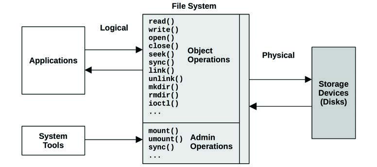
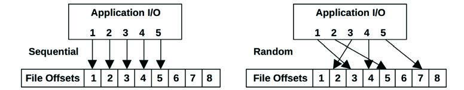
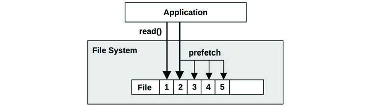
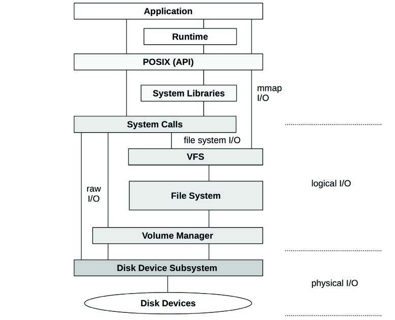
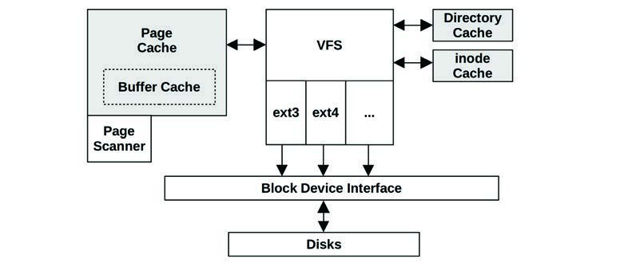
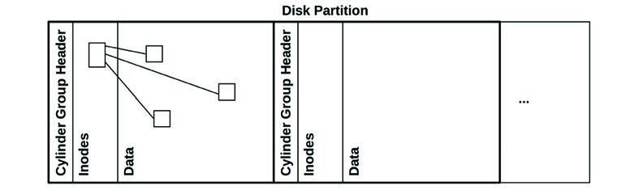
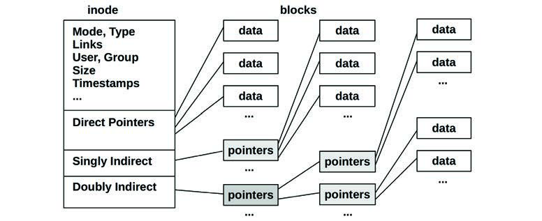
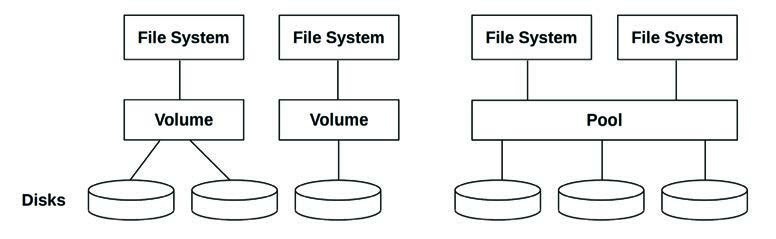
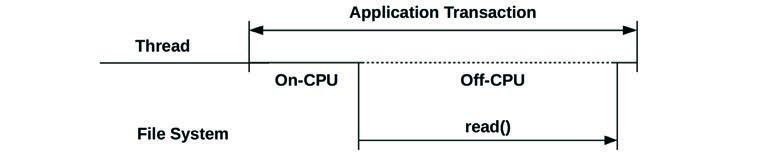

# 第 8 章 文件系统 (File Systems)

对于应用程序而言，文件系统性能通常比磁盘或存储设备性能更重要，因为应用程序直接与之交互并等待其响应。文件系统可以使用缓存、缓冲和异步 I/O 来避免让应用程序承受磁盘级（或远程存储系统）的延迟。

系统性能分析和监控工具历来侧重于磁盘性能，而将文件系统性能视为盲点。本章将深入探讨文件系统，展示它们的工作原理以及如何测量其延迟和其他细节。这通常可以排除文件系统及其底层磁盘设备作为性能不佳的根源，从而允许调查转移到其他领域。

本章的学习目标是：

- 理解文件系统模型和概念。
- 理解文件系统工作负载如何影响性能。
- 熟悉文件系统缓存。
- 熟悉文件系统内部结构和性能特性。
- 遵循各种文件系统分析方法论。
- 测量文件系统延迟以识别模式和离群值。
- 使用追踪工具调查文件系统使用情况。
- 使用微基准测试测试文件系统性能。
- 了解文件系统可调参数。

本章由六部分组成，前三部分提供文件系统分析的基础，最后三部分展示其在基于 Linux 的系统中的实际应用。各部分如下：

- **背景** 介绍文件系统相关的术语和基本模型，说明文件系统原理和关键的文件系统性能概念。
- **架构** 介绍通用和特定的文件系统架构。
- **方法论** 描述性能分析方法论，包括观察型和实验型。
- **可观测性工具** 展示用于基于 Linux 的系统的文件系统可观测性工具，包括静态和动态插桩。
- **实验** 总结文件系统基准测试工具。
- **调优** 描述文件系统可调参数。

## 8.1 术语 (Terminology)

作为参考，本章中使用的文件系统相关术语包括：

- **文件系统 (File system)**：将数据组织为文件和目录的一种组织形式，具有访问它们的基于文件的接口，以及控制访问的文件权限。额外内容可能包括用于设备、套接字和管道的特殊文件类型，以及包含文件访问时间戳在内的元数据。
- **文件系统缓存 (File system cache)**：主内存（通常是 DRAM）的一个区域，用于缓存文件系统内容，其中可能包括针对各种数据和元数据类型的不同缓存。
- **操作 (Operations)**：文件系统操作是对文件系统的请求，包括 `read(2)`, `write(2)`, `open(2)`, `close(2)`, `stat(2)`, `mkdir(2)` 等操作。
- **I/O**：输入/输出。文件系统 I/O 可以有多种定义方式；在这里，它仅指直接进行读写的操作（执行 I/O），包括 `read(2)`, `write(2)`, `stat(2)`（读取统计数据）和 `mkdir(2)`（写入新的目录项）。I/O 不包括 `open(2)` 和 `close(2)`（尽管这些调用会更新元数据并可能引起间接的磁盘 I/O）。
- **逻辑 I/O (Logical I/O)**：由应用程序发给文件系统的 I/O。
- **物理 I/O (Physical I/O)**：由文件系统直接发给磁盘（或通过原始 I/O）的 I/O。
- **块大小 (Block size)**：也称为记录大小（record size），是文件系统磁盘上数据组的大小。见 8.4.4 节“文件系统特性”中的“块与范围（Block vs. Extent）”。
- **吞吐量 (Throughput)**：应用程序与文件系统之间的当前数据传输速率，以每秒字节数测量。
- **inode**：索引节点（index node）是一个数据结构，包含文件系统对象的元数据，包括权限、时间戳和数据指针。
- **VFS**：虚拟文件系统（Virtual File System），是一个内核接口，用于抽象和支持不同的文件系统类型。
- **卷 (Volume)**：比使用整个存储设备提供更多灵活性的一种存储实例。一个卷可以是设备的一部分，也可以是多个设备。
- **卷管理器 (Volume manager)**：以灵活方式管理物理存储设备的软件，创建供操作系统使用的虚拟卷。

本章中还会介绍其他术语。词汇表（Glossary）包含了基础术语以供参考，包括 `fsck`, `IOPS`, 操作率和 `POSIX`。另请参阅第 2 章和第 3 章中的术语部分。

## 8.2 模型 (Models)

以下简单模型说明了文件系统及其性能的一些基本原理。

### 8.2.1 文件系统接口 (File System Interfaces)

图 8.1 从接口的角度展示了一个文件系统的基本模型。


**图 8.1 文件系统接口**

图中还标注了逻辑操作和物理操作发生的位置。有关这些内容的更多信息，见 8.3.12 节“逻辑 I/O 与物理 I/O”。

图 8.1 展示了通用的对象操作。内核可能会实现额外的变体：例如，Linux 提供了 `readv(2)`, `writev(2)`, `openat(2)` 等。

研究文件系统性能的一种方法是将其视为黑盒，专注于对象操作的延迟。这在 8.5.2 节“延迟分析”中有更详细的解释。

### 8.2.2 文件系统缓存 (File System Cache)

图 8.2 描绘了主内存中存储的通用文件系统缓存，正在为读操作提供服务。

**图 8.3 文件系统二级缓存**

## 8.3 概念 (Concepts)

以下是一系列重要的文件系统性能概念。

### 8.3.1 文件系统延迟 (File System Latency)

文件系统延迟是文件系统性能的主要指标，测量为从逻辑文件系统请求到其完成的时间。它包括在文件系统和磁盘 I/O 子系统中花费的时间，以及等待磁盘设备（物理 I/O）的时间。应用程序线程通常在应用程序请求期间阻塞，以等待文件系统请求完成——通过这种方式，文件系统延迟直接且成比例地影响应用程序性能。

应用程序可能不会直接受影响的情况包括使用非阻塞 I/O、预取（8.3.4 节），以及当 I/O 是从异步线程（例如后台刷新线程）发出时。如果应用程序提供了其文件系统使用的详细指标，则可能能够识别这些情况。如果没有，一种通用的方法是使用内核追踪工具，显示导致逻辑文件系统 I/O 的用户级堆栈追踪。然后可以研究此堆栈追踪，以查看是哪些应用程序例程发出了请求。

操作系统历来没有使文件系统延迟易于观测，而是提供磁盘设备级的统计数据。但在许多情况下，此类统计数据与应用程序性能无关，甚至具有误导性。一个例子是文件系统执行已写入数据的后台刷新，这可能表现为高延迟磁盘 I/O 的突发。从磁盘设备级的统计数据来看，这看起来很令人担忧；然而，并没有应用程序在等待这些操作完成。有关更多情况，请参阅 8.3.12 节“逻辑 I/O 与物理 I/O”。

### 8.3.2 缓存 (Caching)

文件系统通常使用主内存（RAM）作为缓存来提高性能。对于应用程序而言，此过程是透明的：应用程序逻辑 I/O 延迟变得低得多（更好），因为它可以在主内存中提供服务，而不是慢得多的磁盘设备。

随着时间的推移，缓存会增长，而操作系统的空闲内存会缩小。这可能会让新用户感到担忧，但这完全是正常的。原则是：如果有闲置的主内存，就用它做点有用的事情。当应用程序需要更多内存时，内核应该迅速从文件系统缓存中释放它以供使用。

文件系统使用缓存来提高读性能，并使用缓冲（在缓存中）来提高写性能。文件系统和块设备子系统通常使用多种类型的缓存，可能包括表 8.1 中的那些。

**表 8.1 示例缓存类型**

| 缓存 | 示例 |
| :--- | :--- |
| 页缓存 (Page cache) | 操作系统页缓存 |
| 文件系统一级缓存 (File system primary cache) | ZFS ARC |
| 文件系统二级缓存 (File system secondary cache) | ZFS L2ARC |
| 目录缓存 (Directory cache) | dentry cache |
| inode 缓存 | inode cache |
| 设备缓存 (Device cache) | ZFS vdev |
| 块设备缓存 (Block device cache) | 缓冲区缓存 (Buffer cache) |

特定的缓存类型在 8.4 节“架构”中描述，而第 3 章“操作系统”包含了缓存的完整列表（包括应用程序级和设备级）。

### 8.3.3 随机与顺序 I/O (Random vs. Sequential I/O)

一系列逻辑文件系统 I/O 可以根据每个 I/O 的文件偏移量被描述为随机或顺序的。在顺序 I/O 中，每个 I/O 的偏移量都从上一个 I/O 的末尾开始。随机 I/O 之间没有明显的关系，且偏移量随机变化。随机文件系统工作负载也可能指随机访问许多不同的文件。


**图 8.4 顺序与随机文件 I/O**

图 8.4 说明了这些访问模式，展示了一系列有序的 I/O 和示例文件偏移量。

由于某些存储设备（在第 9 章“磁盘”中描述）的性能特性，文件系统历来试图通过将文件数据顺序且连续地放置在磁盘上来减少随机 I/O。术语“碎片化（fragmentation）”描述了当文件系统在这一点上做得不好时发生的情况，导致文件散布在驱动器上，使得顺序逻辑 I/O 产生随机物理 I/O。

文件系统可以测量逻辑 I/O 访问模式，以便识别顺序工作负载，然后使用预取（prefetch）或预读（read-ahead）来提高其性能。这对旋转磁盘很有帮助，对闪存驱动器的作用较小。

### 8.3.4 预取 (Prefetch)

一个常见的文件系统工作负载涉及顺序读取大量文件数据，例如进行文件系统备份。这些数据可能太大而无法放入缓存，或者它们可能仅被读取一次，且不太可能保留在缓存中（取决于缓存驱逐策略）。这种工作负载的性能相对较差，因为它的缓存命中率很低。

预取是解决此问题的常用文件系统特性。它可以根据当前和之前的文件 I/O 偏移量检测顺序读工作负载，然后在应用程序请求之前发出磁盘读。这会填充文件系统缓存，这样如果应用程序确实执行了预期的读取，就会产生缓存命中（所需的数据已经在缓存中）。一个示例场景如下：

1. 应用程序发出一个文件 `read(2)`，将执行权交给内核。
2. 数据未缓存，因此文件系统向磁盘发出读请求。
3. 将之前的文件偏移量指针与当前位置进行比较，如果是顺序的，文件系统发出额外的读请求（预取）。
4. 第一个读操作完成，内核将数据和执行权传回应用程序。
5. 任何预取读取完成，填充缓存以供未来的应用程序读取。
6. 未来的顺序应用程序读取通过 RAM 中的缓存迅速完成。

图 8.5 也说明了这一场景，其中应用程序对偏移量 1 然后是 2 的读取触发了对接下来三个偏移量的预取。


**图 8.5 文件系统预取**

当预取检测工作良好时，应用程序显示出显著提高的顺序读性能；磁盘始终领先于应用程序请求（前提是它们有足够的带宽）。当预取检测工作不佳时，会发出应用程序不需要的、不必要的 I/O，从而污染缓存并消耗磁盘和 I/O 传输资源。文件系统通常允许根据需要调优预取。

### 8.3.5 预读 (Read-Ahead)

历史上，预取（prefetch）也被称为预读（read-ahead）。Linux 将预读术语用于系统调用 `readahead(2)`，该调用允许应用程序显式地预热文件系统缓存。

### 8.3.6 写回缓存 (Write-Back Caching)

写回缓存常用于文件系统以提高写性能。它的工作原理是将写入在传输到主内存后即视为完成，并在稍后某个时间异步地将其写入磁盘。将此“脏”数据写入磁盘的文件系统过程称为刷新（flushing）。一个示例序列如下：

1. 应用程序发出一个文件 `write(2)`，将执行权交给内核。
2. 应用程序地址空间的数据被复制到内核。
3. 内核将 `write(2)` 系统调用视为已完成，将执行权传回应用程序。
4. 稍后，一个异步内核任务找到已写入的数据并发出磁盘写请求。

权衡之处在于可靠性。基于 DRAM 的主内存是易失性的，脏数据在发生电源故障时可能会丢失。数据也可能被不完整地写入磁盘，导致磁盘状态损坏。

如果文件系统元数据损坏，文件系统可能无法再加载。这种状态可能只能从系统备份中恢复，从而导致长时间停机。更糟糕的是，如果损坏影响了应用程序读取和使用的文件内容，业务可能会受到威胁。

为了平衡对速度和可靠性的需求，文件系统默认提供写回缓存，并提供同步写选项以绕过此行为并直接写入持久化存储设备。

### 8.3.7 同步写 (Synchronous Writes)

同步写仅在完全写入持久化存储（例如磁盘设备）时才完成，这包括写入必要的任何文件系统元数据更改。这些比异步写（写回缓存）慢得多，因为同步写会产生磁盘设备 I/O 延迟（并且由于文件系统元数据，可能会产生多个 I/O）。同步写由一些应用程序使用，例如数据库日志写入器，对于这些应用程序来说，异步写导致的系统损坏风险是不可接受的。

同步写有两种形式：单独的 I/O（同步写入）和先前写入的组（同步提交）。

#### 单独的同步写

当使用 `O_SYNC` 标志或其变体 `O_DSYNC` 和 `O_RSYNC`（自 Linux 2.6.31 起，glibc 将其映射到 `O_SYNC`）打开文件时，写 I/O 是同步的。一些文件系统具有挂载选项，强制所有文件的所有写 I/O 均为同步。

#### 同步提交先前的写入

除了同步写入单个 I/O 之外，应用程序可以在代码中的检查点使用 `fsync(2)` 系统调用同步提交先前的异步写入。这可以通过对写入进行分组来提高性能，还可以通过使用写入取消来避免多次元数据更新。

还有其他情况会提交先前的写入，例如关闭文件句柄，或当文件上的未提交缓冲区过多时。前者在解压包含许多文件的存档时经常表现为长时间停顿，尤其是在使用 NFS 时。

### 8.3.8 原始 I/O 和直接 I/O (Raw and Direct I/O)

这些是应用程序可能使用的其他类型的 I/O，如果内核或文件系统支持的话：

**原始 I/O (Raw I/O)** 直接发给磁盘偏移量，完全绕过文件系统。它已被某些应用程序（尤其是数据库）使用，这些应用程序可以比文件系统缓存更好地管理和缓存其自身的数据。缺点是软件更加复杂，以及管理上的困难：常规的文件系统工具集无法用于备份/恢复或可观测性。

**直接 I/O (Direct I/O)** 允许应用程序使用文件系统但绕过文件系统缓存，例如通过在 Linux 上使用 `O_DIRECT` `open(2)` 标志。这类似于同步写（但没有 `O_SYNC` 提供的保证），它也适用于读取。它不像原始设备 I/O 那样直接，因为文件偏移量到磁盘偏移量的映射仍必须由文件系统代码执行，并且 I/O 还可能被调整大小以匹配文件系统用于磁盘布局的大小（其记录大小），否则可能会报错（`EINVAL`）。取决于文件系统，这不仅可能会禁用读缓存和写缓冲，还可能会禁用预取。

### 8.3.9 非阻塞 I/O (Non-Blocking I/O)

通常，文件系统 I/O 要么立即完成（例如从缓存），要么在等待后完成（例如等待磁盘设备 I/O）。如果需要等待，应用程序线程将阻塞并离开 CPU，允许其他线程在它等待时执行。虽然阻塞的线程无法执行其他工作，但这通常不是问题，因为多线程应用程序可以创建额外的线程来在某些线程阻塞时执行。

在某些情况下，非阻塞 I/O 是理想的，例如在避免创建线程的性能或资源开销时。非阻塞 I/O 可以通过向 `open(2)` 系统调用提供 `O_NONBLOCK` 或 `O_NDELAY` 标志来执行，这导致读和写返回 `EAGAIN` 错误而不是阻塞，这告诉应用程序稍后重试。（对此的支持取决于文件系统，文件系统可能仅对建议性或强制性文件锁支持非阻塞。）

操作系统也可能提供单独的异步 I/O 接口，例如 `aio_read(3)` 和 `aio_write(3)`。Linux 5.1 增加了一个名为 `io_uring` 的新异步 I/O 接口，具有改进的易用性、效率和性能 [Axboe 19]。

非阻塞 I/O 也在第 5 章“应用程序”的 5.2.6 节“非阻塞 I/O”中讨论。

### 8.3.10 内存映射文件 (Memory-Mapped Files)

对于某些应用程序和工作负载，可以通过将文件映射到进程地址空间并直接访问内存偏移量来提高文件系统 I/O 性能。这避免了调用 `read(2)` 和 `write(2)` 系统调用来访问文件数据时产生的系统调用执行和上下文切换开销。如果内核支持直接将文件数据缓冲区映射到进程地址空间，它还可以避免数据的二次复制。

内存映射使用 `mmap(2)` 系统调用创建，并使用 `munmap(2)` 删除。映射可以使用 `madvise(2)` 进行调优，如 8.8 节“调优”中所述。一些应用程序在其配置中提供了使用 `mmap` 系统调用的选项（可能被称为“mmap 模式”）。例如，Riak 数据库可以为其中内存数据存储使用 `mmap`。

我注意到一种倾向，即在没有首先分析文件系统性能问题的情况下，尝试使用 `mmap(2)` 来解决它们。如果问题是磁盘设备的高 I/O 延迟，那么当高磁盘 I/O 延迟仍然存在且占据主导地位时，使用 `mmap(2)` 避开微小的系统调用开销可能收效甚微。

在多处理器系统上使用映射的一个缺点是保持每个 CPU MMU 同步的开销，特别是用于删除映射的 CPU 跨步调用（TLB shootdowns）。根据内核和映射的不同，可以通过延迟 TLB 更新（延迟跨步调用）来将其降至最低 [Vahalia 96]。

### 8.3.11 元数据 (Metadata)

虽然数据描述文件和目录的内容，但元数据描述有关它们的信息。元数据可能指可以从文件系统接口（POSIX）读取的信息，或实现文件系统磁盘布局所需的信息。这些分别称为逻辑元数据和物理元数据。

#### 逻辑元数据

逻辑元数据是由消费者（应用程序）读取和写入文件系统的信息，可以是：

- **显式地**：读取文件统计信息（`stat(2)`），创建和删除文件（`creat(2)`, `unlink(2)`）和目录（`mkdir(2)`, `rmdir(2)`），设置文件属性（`chown(2)`, `chmod(2)`）。
- **隐式地**：文件系统访问时间戳更新、目录修改时间戳更新、已用块位图更新、空闲空间统计。

一个“元数据密集型”的工作负载通常指逻辑元数据，例如 Web 服务器 `stat(2)` 文件以确保它们自缓存以来没有发生变化，其频率远高于读取文件数据内容。

#### 物理元数据

物理元数据是指记录所有文件系统信息所必需的磁盘布局元数据。使用的元数据类型取决于文件系统，可能包括超级块（superblocks）、inodes、数据指针块（一级、二级……）和空闲列表。

逻辑和物理元数据是逻辑 I/O 和物理 I/O 之间存在差异的原因之一。

### 8.3.12 逻辑 I/O 与物理 I/O (Logical vs. Physical I/O)

尽管这看起来可能有悖常理，但由于多种原因，应用程序发给文件系统的 I/O（逻辑 I/O）可能与磁盘 I/O（物理 I/O）不匹配。

文件系统的功能远不止将持久化存储（磁盘）呈现为基于文件的接口。它们缓存读取、缓冲写入、将文件映射到地址空间，并创建额外的 I/O 来维护记录一切位置所需的磁盘物理布局元数据。与应用程序 I/O 相比，这会导致无关的、间接的、隐式的、膨胀的或缩减的磁盘 I/O。示例如下。

#### 无关 (Unrelated)

这是与应用程序无关的磁盘 I/O，可能归因于：

- **其他应用程序**。
- **其他租户**：磁盘 I/O 来自另一个云租户（在某些虚拟化技术下可通过系统工具看到）。
- **其他内核任务**：例如，当内核正在重建软件 RAID 卷或执行异步文件系统校验和验证时（见 8.4 节“架构”）。
- **管理任务**：如备份。

#### 间接 (Indirect)

这是由应用程序引起但没有立即对应的应用程序 I/O 的磁盘 I/O。这可能是由于：

- **文件系统预取**：增加了应用程序可能使用也可能不使用的额外 I/O。
- **文件系统缓冲**：使用写回缓存来推迟和合并写入，以便稍后刷新到磁盘。某些系统可能会在写入前缓冲写入几十秒，然后表现为巨大的、罕见的突发。

#### 隐式 (Implicit)

这是由显式文件系统读写以外的应用程序事件直接触发的磁盘 I/O，例如：

- **内存映射加载/存储**：对于内存映射（`mmap(2)`）文件，加载和存储指令可能会触发磁盘 I/O 来读取或写入数据。写入可能会被缓冲并稍后写入。在分析文件系统操作（`read(2)`, `write(2)`）并无法找到 I/O 来源时，这可能会令人困惑（因为它是通过指令而不是系统调用触发的）。

#### 缩减 (Deflated)

磁盘 I/O 小于应用程序 I/O，甚至不存在。这可能是由于：

- **文件系统缓存**：从主内存而不是磁盘满足读取。
- **文件系统写入取消**：相同的字节偏移量在被刷新到磁盘一次之前被多次修改。
- **压缩**：减少从逻辑 I/O 到物理 I/O 的数据量。
- **合并 (Coalescing)**：在将顺序 I/O 发给磁盘之前将其合并（这减少了 I/O 次数，但没有减少总大小）。
- **内存文件系统**：内容可能永远不会被写入磁盘（例如 `tmpfs`[^12]）。

#### 膨胀 (Inflated)

磁盘 I/O 大于应用程序 I/O。这是典型情况，归因于：

- **文件系统元数据**：增加额外的 I/O。
- **文件系统记录大小**：向上舍入 I/O 大小（膨胀字节），或拆分 I/O（膨胀次数）。
- **文件系统日志 (Journaling)**：如果采用，这会使磁盘写入翻倍，一次写日志，另一次写最终目的地。
- **卷管理器奇偶校验**：读-修改-写循环，增加额外的 I/O。
- **RAID 膨胀**：写入额外的奇偶校验数据，或将数据写入镜像卷。

#### 示例

为了展示这些因素如何共同发生，以下示例描述了一个 1 字节应用程序写入可能发生的情况：

1. 应用程序向一个现有文件执行 1 字节写入。
2. 文件系统确定该位置属于一个 128 KB 的文件系统记录，该记录未被缓存（但引用它的元数据已被缓存）。
3. 文件系统请求从磁盘加载该记录。
4. 磁盘设备层将 128 KB 读取拆分为适合设备的更小读取。
5. 磁盘执行多次较小的读取，共计 128 KB。
6. 文件系统现在用新字节替换记录中的 1 字节。
7. 稍后，文件系统或内核请求将该 128 KB 脏记录写回磁盘。
8. 磁盘写入该 128 KB 记录（如有需要则拆分）。
9. 文件系统写入新的元数据，例如更新引用（用于写时复制）或访问时间。
10. 磁盘执行更多写入。

因此，虽然应用程序仅执行了单次 1 字节写入，但磁盘执行了多次读取（总计 128 KB）和更多的写入（超过 128 KB）。

### 8.3.13 操作是不平等的 (Operations Are Not Equal)

从前面的章节可以清楚地看出，文件系统操作根据其类型会表现出不同的性能。仅凭“500 操作/秒”这一速率，你无法了解关于工作负载的太多信息。某些操作可能以主内存速度从文件系统缓存返回；其他操作可能从磁盘返回，并慢上几个数量级。其他决定因素包括操作是随机还是顺序、读取还是写入、同步写入还是异步写入、它们的 I/O 大小、它们是否包含其他操作类型、它们的 CPU 执行成本（以及系统的 CPU 负载如何）以及存储设备特性。

确定这些性能特征的常见做法是对不同的文件系统操作进行微基准测试。作为一个例子，表 8.2 中的结果来自 ZFS 文件系统，运行在一个原本空闲的 Intel Xeon 2.4 GHz 多核处理器上。

**表 8.2 示例文件系统操作延迟**

| 操作 | 平均值 (μs) |
| :--- | :--- |
| `open(2)` (已缓存[^13]) | 2.2 |
| `close(2)` (干净[^14]) | 0.7 |
| `read(2)` 4 KB (已缓存) | 3.3 |
| `read(2)` 128 KB (已缓存) | 13.9 |
| `write(2)` 4 KB (异步) | 9.3 |
| `write(2)` 128 KB (异步) | 55.2 |

这些测试没有涉及存储设备，而是对文件系统软件和 CPU 速度的测试。一些特殊文件系统从不访问持久化存储设备。

这些测试也是单线程的。并行 I/O 性能可能会受到所使用的文件系统锁的类型和组织方式的影响。

### 8.3.14 特殊文件系统 (Special File Systems)

文件系统的意图通常是持久地存储数据，但在 Linux 上还有用于其他目的的特殊文件系统类型，包括临时文件（`/tmp`）、内核设备路径（`/dev`）、系统统计数据（`/proc`）和系统配置（`/sys`）。[^15]

### 8.3.15 访问时间戳 (Access Timestamps)

许多文件系统支持访问时间戳，它记录每个文件和目录被访问（读取）的时间。这导致每当读取文件时都会更新文件元数据，从而产生消耗磁盘 I/O 资源的写工作负载。8.8 节“调优”展示了如何关闭这些更新。

一些文件系统通过推迟和分组访问时间戳写入来优化它们，以减少对活动工作负载的干扰。

### 8.3.16 容量 (Capacity)

当文件系统填满时，性能可能会因为几个原因而下降。首先，在写入新数据时，可能需要更多的 CPU 时间和磁盘 I/O 来寻找磁盘上的空闲块。[^16] 其次，磁盘上的空闲空间区域可能变得更小且分布更分散，从而因较小的 I/O 或随机 I/O 而降低性能。

这个问题有多严重取决于文件系统类型、其磁盘布局、其对写时复制的使用以及其存储设备。下一节将描述各种文件系统类型。

## 8.4 架构 (Architecture)

本节介绍通用和特定的文件系统架构，从 I/O 栈、VFS、文件系统缓存和特性开始，然后介绍常见的文件系统类型、卷和池。这些背景知识在确定要分析和调优哪些文件系统组件时非常有用。

如需更深入的内部机制和其他文件系统主题，请参考源代码（如果可用）和外部文档。本章末尾列出了一些此类资源。

### 8.4.1 文件系统 I/O 栈 (File System I/O Stack)

图 8.6 描绘了文件系统 I/O 栈的通用模型，侧重于文件系统接口。具体的组件、层和 API 取决于操作系统类型、版本和所使用的文件系统。第 3 章“操作系统”中包含了一个更高层级的 I/O 栈图，第 9 章“磁盘”中包含了一个更详细显示磁盘组件的图。


**图 8.6 通用文件系统 I/O 栈**

该图显示了 I/O 从应用程序和系统库到系统调用并穿过内核的路径。从系统调用直接到磁盘设备子系统的路径是原始 I/O（raw I/O）。通过 VFS 和文件系统的路径是文件系统 I/O，包括绕过文件系统缓存的直接 I/O（direct I/O）。

### 8.4.2 VFS

VFS（虚拟文件系统接口）为不同的文件系统类型提供了一个通用接口。其位置如图 8.7 所示。


**图 8.7 虚拟文件系统接口**

VFS 起源于 SunOS，现已成为文件系统的标准抽象。

Linux VFS 接口使用的术语可能有点令人困惑，因为它重用了 inode 和超级块（superblock）这两个术语来指代 VFS 对象——这两个术语起源于 Unix 文件系统磁盘上的数据结构。用于 Linux 磁盘数据结构的术语通常带有其文件系统类型前缀，例如 `ext4_inode` 和 `ext4_super_block`。VFS inode 和 VFS 超级块仅存在于内存中。

VFS 接口也可以作为测量任何文件系统性能的通用位置。这可以通过操作系统提供的统计数据，或者静态或动态插桩来实现。

### 8.4.3 文件系统缓存 (File System Caches)

Unix 最初只有缓冲区缓存（buffer cache）来提高块设备访问的性能。如今，Linux 拥有多种不同的缓存类型。图 8.8 概述了 Linux 上的文件系统缓存，显示了标准文件系统类型可用的通用缓存。


**图 8.8 Linux 文件系统缓存**

#### 缓冲区缓存 (Buffer Cache)

Linux 最初像 Unix 一样使用缓冲区缓存。自 Linux 2.4 以来，缓冲区缓存也存储在页缓存中（因此在图 8.8 中使用虚线边界），从而避免了重复缓存和同步开销。缓冲区缓存的功能仍然存在，用于提高块设备 I/O 的性能，并且该术语仍然出现在 Linux 可观测性工具中（例如 `free(1)`）。

缓冲区缓存的大小是动态的，可以从 `/proc` 观测到。

#### 页缓存 (Page Cache)

页缓存最初在 1985 年虚拟内存重写期间引入 SunOS，并被添加到 SVR4 Unix 中 [Vahalia 96]。它缓存虚拟内存页面，包括映射的文件系统页面，从而提高文件和目录 I/O 的性能。它比缓冲区缓存更有效地访问文件，后者需要对每次查找进行从文件偏移量到磁盘偏移量的转换。多种文件系统类型都可以使用页缓存，包括最初的消费者 UFS 和 NFS。其大小是动态的：页缓存会增长以使用可用内存，并在应用程序需要时再次释放。

Linux 拥有具有相同属性的页缓存。Linux 页缓存的大小也是动态的，并有一个可调参数用于设置在从页缓存中驱逐和交换（swappiness）之间的平衡（见第 7 章“内存”）。

内核线程会将文件系统所需的脏（已修改）内存页刷新到磁盘。在 Linux 2.6.32 之前，存在一个页脏刷新（pdflush）线程池，根据需要有 2 到 8 个线程。此后，它们被刷新线程（名为 `flush`）取代，每个设备创建一个刷新线程，以更好地平衡每个设备的工作负载并提高吞吐量。页面由于以下原因被刷新到磁盘：

- 达到时间间隔（30 秒）后。
- 调用 `sync(2)`, `fsync(2)`, `msync(2)` 系统调用。
- 脏页过多（`dirty_ratio` 和 `dirty_bytes` 可调参数）。
- 页缓存中没有可用页面。

如果系统内存不足，另一个内核线程，即页出守护进程（kswapd，也称为页扫描器），也可能发现并调度脏页写入磁盘，以便它可以释放内存页供重用（见第 7 章“内存”）。对于可观测性，kswapd 和刷新线程可以作为内核任务通过操作系统性能工具看到。

有关页扫描器的更多细节，见第 7 章“内存”。

#### 目录项缓存 (Dentry Cache)

目录项缓存（Dcache）记住从目录项（`struct dentry`）到 VFS inode 的映射，类似于早期的 Unix 目录名查找缓存（DNLC）。Dcache 提高了路径名查找（例如通过 `open(2)`）的性能：当遍历路径名时，每个名称查找都可以检查 Dcache 以获取直接的 inode 映射，而不是步进式地遍历目录内容。Dcache 条目存储在哈希表中，以便快速且可扩展地查找（通过父 dentry 和目录项名称进行哈希）。

多年来性能得到了进一步提高，包括使用读取-复制-更新-行走（RCU-walk）算法 [Corbet 10]。这试图在不更新 dentry 引用计数的情况下行走路径名，引用计数曾因多 CPU 系统上高频率路径名查找导致的缓存一致性问题而引起可扩展性问题。如果遇到不在缓存中的 dentry，RCU-walk 会恢复到较慢的引用计数行走（ref-walk），因为在文件系统查找和阻塞期间引用计数将是必需的。对于繁忙的工作负载，预计 dentry 数据很可能已被缓存，且 RCU-walk 方法将成功。

Dcache 还执行负向缓存（negative caching），它记住对不存在条目的查找。这提高了失败查找的性能，失败查找在搜索共享库时经常发生。

Dcache 动态增长，当系统需要更多内存时通过 LRU（最近最少使用）进行收缩。其大小可以通过 `/proc` 查看。

#### inode 缓存 (Inode Cache)

此缓存包含 VFS inode（`struct inodes`），每个 inode 描述文件系统对象的属性，其中许多属性通过 `stat(2)` 系统调用返回。这些属性在文件系统工作负载中经常被访问，例如在打开文件时检查权限，或在修改期间更新时间戳。这些 VFS inode 存储在哈希表中以实现快速且可扩展的查找（通过 inode 编号和文件系统超级块进行哈希），尽管大多数查找将通过目录项缓存（Dentry cache）完成。

inode 缓存动态增长，至少持有由 Dcache 映射的所有 inode。当系统内存压力大时，inode 缓存将收缩，丢弃没有关联 dentry 的 inode。其大小可以通过 `/proc/sys/fs/inode*` 文件查看。

### 8.4.4 文件系统特性 (File System Features)

这里描述了影响性能的其他关键文件系统特性。

#### 块与范围 (Block vs. Extent)

基于**块**的文件系统将数据存储在固定大小的块中，由存储在元数据块中的指针引用。对于大文件，这可能需要许多块指针和元数据块，且块的放置可能会变得分散，导致随机 I/O。一些基于块的文件系统尝试连续放置块以避免这种情况。另一种方法是使用可变块大小，以便随着文件的增长可以使用更大的尺寸，这也可以减少元数据开销。

基于**范围 (Extent)** 的文件系统预先为文件分配连续空间（范围），并根据需要进行增长。这些范围长度可变，代表一个或多个连续的块。这提高了流式传输性能，并且由于文件数据是局部化的，可以提高随机 I/O 性能。它还提高了元数据性能，因为需要跟踪的对象较少，同时不会牺牲范围中未使用块的空间。

#### 日志 (Journaling)

文件系统日志记录对文件系统的更改，以便在系统崩溃或断电的情况下，可以原子地回放更改——要么全部成功，要么全部失败。这允许文件系统快速恢复到一致状态。如果与更改相关的数据和元数据写入不完整，非日志文件系统在系统崩溃期间可能会损坏。从这种崩溃中恢复需要行走所有的文件系统结构，对于大型（太字节）文件系统来说，这可能需要数小时。

日志同步写入磁盘，对于某些文件系统，可以配置为使用单独的设备。一些日志同时记录数据和元数据，这会消耗更多的存储 I/O 资源，因为所有 I/O 都会写入两次。其他的仅记录元数据，并通过采用写时复制来维护数据完整性。

有一种完全由日志组成的文件系统类型：日志结构文件系统（log-structured file system），其中所有数据和元数据更新都写入连续且循环的日志中。这优化了写性能，因为写入始终是顺序的，并且可以合并以使用更大的 I/O 大小。

#### 写时复制 (Copy-on-Write)

写时复制 (COW) 文件系统不覆盖现有块，而是遵循以下步骤：

1. 将块写入新位置（新副本）。
2. 更新对新块的引用。
3. 将旧块添加到空闲列表。

这有助于在系统发生故障时维护文件系统完整性，并且还通过将随机写入转换为顺序写入来提高性能。

当文件系统接近满容量时，COW 可能导致文件的磁盘数据布局碎片化，从而降低性能（特别是对于 HDD）。文件系统碎片整理（如果可用）可能有助于恢复性能。

#### 擦除 (Scrubbing)

这是一种文件系统特性，异步读取所有数据块并验证校验和，以尽可能早地检测驱动器故障，理想情况下是在故障由于 RAID 仍可恢复时。然而，擦除读 I/O 可能会损害性能，因此应以低优先级或在工作负载较低时运行。

#### 其他特性

其他影响性能的文件系统特性包括快照、压缩、内置冗余、去重、TRIM 支持等。下一节描述特定文件系统的各种此类特性。

### 8.4.5 文件系统类型 (File System Types)

本章的大部分内容描述了可应用于所有文件系统类型的通用特性。以下各节总结了常用文件系统的特定性能特性。它们的分析和调优将在后面的章节中涵盖。

#### FFS

许多文件系统最终都基于伯克利快速文件系统 (FFS)，该系统旨在解决原始 Unix 文件系统的问题。[^17] 一些背景知识可以帮助解释今天文件系统的状态。

原始 Unix 文件系统的磁盘布局由一个 inode 表、512 字节的存储块和一个在分配资源时使用的信息超级块组成 [Ritchie 74][Lions 77]。inode 表和存储块将磁盘分区划分为两个范围，这在两者之间寻道时会导致性能问题。另一个问题是使用较小的固定块大小（512 字节），这限制了吞吐量并增加了存储大文件所需的元数据（指针）量。一项将其翻倍至 1024 字节的实验以及随后遇到的瓶颈由 [McKusick 84] 描述：

> 尽管吞吐量翻了一番，但旧文件系统仍仅使用了约 4% 的磁盘带宽。主要问题是，尽管空闲列表最初是为优化访问而排序的，但随着文件的创建和删除，它很快变得混乱。最终空闲列表变得完全随机，导致文件块在磁盘上随机分配。这迫使在每次块访问之前都进行寻道。尽管旧文件系统在最初创建时提供了高达 175 KB/s 的传输速率，但在中度使用几周后，由于数据块放置的这种随机化，该速率恶化到 30 KB/s。

这段摘录描述了空闲列表碎片化，随着文件系统的使用，它会随着时间的推移降低性能。


**图 8.9 柱面组**

FFS 通过将分区拆分为许多**柱面组**（如图 8.9 所示）来提高性能，每个柱面组都有自己的 inode 数组和数据块。文件 inode 和数据尽可能保持在一个柱面组内（如图 8.9 所示），从而减少磁盘寻道。其他相关数据也放置在附近，包括目录及其条目的 inode。inode 的设计类似，具有指针和数据块的层次结构，如图 8.10 所示（此处未显示具有三级指针的三级间接块） [Bach 86]。


**图 8.10 Inode 数据结构**

块大小增加到最小 4 KB，从而提高了吞吐量。这减少了存储文件所需的数据块数量，因此也减少了引用数据块所需的间接块数量。由于间接指针块也更大了，所需数量进一步减少。为了提高小文件的空间效率，每个块可以拆分为 1 KB 的片段（fragments）。

FFS 的另一个性能特性是块交错（block interleaving）：在磁盘上放置顺序文件块时，它们之间留出一个或多个块的间隔 [Doeppner 10]。这些额外的块为内核和处理器提供了发出下一个顺序文件读取的时间。如果没有交错，下一个块可能会在准备好发出读取之前经过（旋转）磁盘头，从而导致在等待完整旋转时产生延迟。

#### ext3

Linux 扩展文件系统 (ext) 开发于 1992 年，是 Linux 及其 VFS 的第一个文件系统，基于原始 Unix 文件系统。第二个版本 ext2 (1993) 包含了 FFS 的多个时间戳和柱面组。第三个版本 ext3 (1999) 包含了文件系统增长和日志功能。

关键的性能特性（包括自发布以来添加的特性）有：

- **日志 (Journaling)**：有序模式（仅元数据）或日志模式（元数据和数据）。日志提高了系统崩溃后的启动性能，避免了运行 `fsck` 的需要。它还可能通过合并元数据写入来提高某些写工作负载的性能。
- **日志设备**：可以使用外部日志设备，使日志工作负载不会与读工作负载竞争。
- **Orlov 块分配器**：这会将顶级目录分散到各个柱面组中，以便子目录及其内容更有可能位于同一位置，从而减少随机 I/O。
- **目录索引**：为文件系统添加了哈希 B 树，以便更快地进行目录查找。

可配置特性在 `mke2fs(8)` 手册页中有详细说明。

#### ext4

Linux ext4 文件系统发布于 2008 年，在 ext3 基础上扩展了新特性和性能改进：范围 (extents)、大容量、通过 `fallocate(2)` 进行预分配、延迟分配、日志校验和、更快的 `fsck`、多块分配器、纳秒级时间戳和快照。

关键的性能特性（包括自发布以来添加的特性）有：

- **范围 (Extents)**：范围改进了连续放置，减少了随机 I/O 并增加了顺序 I/O 的 I/O 大小。它们在 8.4.4 节“文件系统特性”中介绍。
- **预分配**：通过 `fallocate(2)` 系统调用，允许应用程序预先分配可能是连续的空间，从而提高以后的写性能。
- **延迟分配**：块分配被延迟到刷新到磁盘时，允许写入分组（通过多块分配器），从而减少碎片。
- **更快的 fsck**：标记未分配的块和 inode 条目，减少 `fsck` 时间。

某些特性的状态可以通过 `/sys` 文件系统查看。例如：

```bash
# cd /sys/fs/ext4/features
# grep . *
batched_discard:supported
casefold:supported
encryption:supported
lazy_itable_init:supported
meta_bg_resize:supported
metadata_csum_seed:supported
```

可配置特性在 `mke2fs(8)` 手册页中有详细说明。某些特性（如范围）也可应用于 ext3 文件系统。

#### XFS

XFS 由 Silicon Graphics 公司于 1993 年为其 IRIX 操作系统创建，旨在解决之前基于 FFS 的 IRIX 文件系统 EFS 的扩展性限制 [Sweeney 96]。XFS 补丁在 2000 年代初期合并进 Linux 内核。如今，大多数 Linux 发行版都支持 XFS，并可用于根文件系统。例如，Netflix 为其 Cassandra 数据库实例使用 XFS，因为 XFS 在该工作负载下具有高性能（并为根文件系统使用 ext4）。

关键的性能特性（包括自发布以来添加的特性）有：

- **分配组 (Allocation Groups)**：分区被划分为大小相等的分配组 (AG)，可以并行访问。为了限制竞争，每个 AG 的元数据（如 inode 和空闲块列表）是独立管理的，而文件和目录可以跨越 AG。
- **范围 (Extents)**：（见前文 ext4 中的描述。）
- **日志 (Journaling)**：日志提高了系统崩溃后的启动性能，避免了运行 `fsck(8)` 的需要。它还可能通过合并元数据写入来提高某些写工作负载的性能。
- **日志设备**：可以使用外部日志设备，使日志工作负载不会与数据工作负载竞争。
- **条带化分配 (Striped allocation)**：如果在条带化 RAID 或 LVM 设备上创建文件系统，可以提供数据和日志的条带单元，以确保数据分配针对底层硬件进行了优化。
- **延迟分配**：范围分配被延迟到数据刷新到磁盘时，允许写入分组并减少碎片。在内存中为文件保留块，以便在刷新发生时有可用空间。
- **在线碎片整理**：XFS 提供了一个碎片整理工具，可以在文件系统处于活跃使用状态时运行。虽然 XFS 使用范围和延迟分配来防止碎片，但某些工作负载和条件仍可能导致文件系统碎片化。

可配置特性在 `mkfs.xfs(8)` 手册页中有详细说明。XFS 的内部性能数据可以通过 `/proc/fs/xfs/stat` 查看。这些数据是为高级分析设计的：更多信息请见 XFS 网站 [XFS 06][XFS 10]。

#### ZFS

ZFS 由 Sun Microsystems 开发并于 2005 年发布，它将文件系统与卷管理器相结合，并包含众多企业级特性，使其成为文件服务器（filers）的理想选择。ZFS 以开源形式发布，并被多种操作系统使用，尽管由于 ZFS 使用 CDDL 许可证，通常作为附加组件。大多数开发都在 OpenZFS 项目中进行，该项目于 2019 年宣布支持 Linux 作为主要操作系统 [Ahrens 19]。虽然它在 Linux 中的支持和使用不断增长，但由于源代码许可证的原因，仍存在阻力，包括来自 Linus Torvalds 的阻力 [Torvalds 20a]。

关键的 ZFS 性能特性（包括自发布以来添加的特性）有：

- **池化存储 (Pooled storage)**：所有分配的存储设备都放置在一个池中，从中创建文件系统。这允许并行使用所有设备以获得最大吞吐量和 IOPS。可以使用不同的 RAID 类型：0, 1, 10, Z（基于 RAID-5）, Z2（双重奇偶校验）和 Z3（三重奇偶校验）。
- **写时复制 (COW)**：复制已修改的块，然后将它们分组并顺序写入。
- **记录 (Logging)**：ZFS 以批次形式刷新事务组 (TXG) 更改，这些更改作为一个整体要么成功要么失败，从而使磁盘格式始终保持一致。
- **ARC**：自适应替换缓存通过同时使用多种缓存算法（最近最少使用 MRU 和最经常使用 MFU）实现高缓存命中率。主内存根据其性能在这些算法之间进行平衡，这是通过维护额外的元数据（幽灵列表 ghost lists）来了解如果每种算法统治整个主内存将表现如何来确定的。
- **智能预取**：ZFS 根据需要应用不同类型的预取：针对元数据、针对 znodes（文件内容）以及针对 vdevs（虚拟设备）。
- **多预取流**：一个文件上的多个流式读取者在文件系统在它们之间寻道时会产生随机 I/O 工作负载。ZFS 跟踪单个预取流，允许新流加入。
- **快照**：由于 COW 架构，可以几乎瞬间创建快照，将新块的复制推迟到需要时。
- **ZIO 流水线**：设备 I/O 由一个阶段流水线处理，每个阶段由一个线程池提供服务以提高性能。
- **压缩**：支持多种算法，这些算法通常会因为 CPU 开销而降低性能。`lzjb` (Lempel-Ziv Jeff Bonwick) 选项是轻量级的，通过减少 I/O 负载（因为已压缩）可以略微提高存储性能，代价是消耗一些 CPU。
- **SLOG**：ZFS 独立意图日志允许将同步写入写入单独的设备，从而避免与池磁盘工作负载的竞争。写入 SLOG 的内容仅在系统故障时读取以进行回放。
- **L2ARC**：二级 ARC 是主内存之后的二级缓存，用于在基于闪存的固态硬盘 (SSD) 上缓存随机读工作负载。它不缓冲写工作负载，仅包含池磁盘上已存在的干净数据。它还可以复制 ARC 中的数据，以便系统在主内存刷新扰动时能更快恢复。
- **数据去重**：这是一种文件系统级特性，可避免记录相同数据的多个副本。该特性具有重大的性能影响，既有好的方面（减少设备 I/O），也有坏的方面（当哈希表不再能容纳在主内存中时，设备 I/O 会膨胀，甚至大幅增加）。初始版本仅适用于预期哈希表始终能容纳在主内存中的工作负载。

ZFS 有一种行为在与其他文件系统比较时可能会降低性能：默认情况下，ZFS 向存储设备发出缓存刷新（cache flush）命令，以确保在断电情况下写入已完成。这是 ZFS 完整性特性之一；然而，它是有代价的：它可能会为必须等待缓存刷新的 ZFS 操作引入延迟。

#### btrfs

B 树文件系统 (btrfs) 基于写时复制 B 树。这是一种现代的文件系统与卷管理器结合的架构，类似于 ZFS，预计最终将提供类似的特性集。目前的特性包括池化存储、大容量、范围、COW、卷的增长和收缩、子卷、块设备的添加和移除、快照、克隆、压缩以及各种校验和（包括 crc32c, xxhash64, sha256 和 blake2b）。开发工作由 Oracle 于 2007 年开始。

关键性能特性包括：

- **池化存储**：存储设备被放置在一个组合卷中，从中创建文件系统。这允许并行使用所有设备以获得最大吞吐量和 IOPS。可以使用 RAID 0, 1 和 10。
- **写时复制 (COW)**：分组并顺序写入数据。
- **在线平衡**：对象可以在存储设备之间移动以平衡其工作负载。
- **范围 (Extents)**：改进顺序布局和性能。
- **快照**：由于 COW 架构，可以几乎瞬间创建快照，将新块的复制推迟到需要时。
- **压缩**：支持 zlib 和 LZO。
- **日志 (Journaling)**：可以为每个子卷创建一个日志树，用于记录同步 COW 工作负载。

计划中的性能相关特性包括 RAID-5 和 6、对象级 RAID、增量转储和数据去重。

### 8.4.6 卷与池 (Volumes and Pools)

历史上，文件系统构建在单个磁盘或磁盘分区之上。卷和池允许将文件系统构建在多个磁盘之上，并可以配置不同的 RAID 策略（见第 9 章“磁盘”）。


**图 8.11 卷与池**

**卷 (Volumes)** 将多个磁盘呈现为一个虚拟磁盘，文件系统构建在其上。当构建在整个磁盘（而非切片或分区）上时，卷可以隔离工作负载，减少竞争导致的性能问题。

卷管理软件包括用于基于 Linux 的系统的逻辑卷管理器 (LVM)。卷或虚拟磁盘也可以由硬件 RAID 控制器提供。

**池化存储 (Pooled storage)** 将多个磁盘包含在一个存储池中，从中可以创建多个文件系统。这在图 8.11 中与卷进行了对比。池化存储比卷存储更灵活，因为文件系统可以根据后端设备的情况增长或收缩。现代文件系统（包括 ZFS 和 btrfs）使用了这种方法，也可以通过 LVM 实现。

池化存储可以为所有文件系统使用所有磁盘设备，从而提高性能。工作负载不是隔离的；在某些情况下，可能会使用多个池来隔离工作负载，这需要权衡一定的灵活性，因为磁盘设备必须最初放置在一个或另一个池中。请注意，池化磁盘可以是不同类型和大小的，而卷可能受限于卷内的统一磁盘。

使用软件卷管理器或池化存储时的其他性能考虑因素包括：

- **条带宽度**：将其与工作负载匹配。
- **可观测性**：虚拟设备利用率可能会令人困惑；请检查各个物理设备。
- **CPU 开销**：尤其是在执行 RAID 奇偶校验计算时。随着现代更快 CPU 的出现，这已不再是一个大问题。（奇偶校验计算也可以卸载到硬件 RAID 控制器。）
- **重建 (Rebuilding)**：也称为重新条带化（resilvering），是指向 RAID 组添加空盘（例如更换故障磁盘）并填充必要数据以加入组的过程。这可能会显著影响性能，因为它消耗 I/O 资源，并且可能持续数小时甚至数天。

重建是一个日益严重的问题，因为存储设备的容量增长速度超过了其吞吐量，增加了重建时间，并使得在重建期间发生故障或介质错误的风险更大。在可能的情况下，对卸载的驱动器进行离线重建可以提高重建时间。

## 8.5 方法论 (Methodology)

本节描述了文件系统分析和调优的各种方法论和练习。主题总结在表 8.3 中。

**表 8.3 文件系统性能方法论**

| 章节 | 方法论 | 类型 |
| :--- | :--- | :--- |
| 8.5.1 | 磁盘分析 | 观察型分析 |
| 8.5.2 | 延迟分析 | 观察型分析 |
| 8.5.3 | 工作负载表征 | 观察型分析、容量规划 |
| 8.5.4 | 性能监控 | 观察型分析、容量规划 |
| 8.5.5 | 静态性能调优 | 观察型分析、容量规划 |
| 8.5.6 | 缓存调优 | 观察型分析、调优 |
| 8.5.7 | 工作负载分离 | 调优 |
| 8.5.8 | 微基准测试 | 实验型分析 |

有关更多策略以及其中许多策略的介绍，请参阅第 2 章“方法论”。

这些可以单独遵循或结合使用。我的建议是按以下顺序开始使用这些策略：延迟分析、性能监控、工作负载表征、微基准测试和静态性能调优。你可能会想出适合你环境的不同组合和顺序。

8.6 节“可观测性工具”展示了应用这些方法的操作系统工具。

### 8.5.1 磁盘分析 (Disk Analysis)

一种常见的故障排除策略是忽略文件系统，而侧重于磁盘性能。这假设最糟糕的 I/O 是磁盘 I/O，因此通过仅分析磁盘，你方便地专注于预期的性能问题源头。

对于简单的文件系统和较小的缓存，这通常是有效的。如今，这种方法变得令人困惑，并且会错过整类问题（见 8.3.12 节“逻辑 I/O 与物理 I/O”）。

### 8.5.2 延迟分析 (Latency Analysis)

对于延迟分析，首先测量文件系统操作的延迟。这应包括所有的对象操作，而不仅仅是 I/O（例如包含 `sync(2)`）。

$$操作延迟 = 操作完成时间 - 操作请求时间$$

这些时间可以从表 8.4 所示的四个层级之一进行测量。

**表 8.4 用于分析文件系统延迟的目标（层级）**

| 层级 | 优点 | 缺点 |
| :--- | :--- | :--- |
| **应用程序** | 最接近测量文件系统延迟对应用程序的影响；还可以检查应用程序上下文，以确定延迟是发生在应用程序的主要功能期间，还是异步发生的。 | 技术因应用程序和应用程序软件版本而异。 |
| **系统调用接口** | 记录良好的接口。通常可通过操作系统工具和静态追踪进行观测。 | 系统调用捕获所有文件系统类型，包括非存储文件系统（统计、套接字），除非进行过滤，否则可能会令人困惑。更令人困惑的是，同一个文件系统功能可能有多个系统调用。例如，对于读取，可能有 `read(2)`, `pread64(2)`, `preadv(2)`, `preadv2(2)` 等，所有这些都需要被测量。 |
| **VFS** | 所有文件系统的标准接口；文件系统操作只需一次调用（例如 `vfs_write()`）。 | VFS 追踪所有文件系统类型，包括非存储文件系统，除非进行过滤，否则可能会令人困惑。 |
| **文件系统顶部** | 仅追踪目标文件系统类型；提供一些文件系统内部上下文以获取扩展详情。 | 文件系统特定；追踪技术可能因文件系统软件版本而异（尽管文件系统可能具有映射到 VFS 的类似 VFS 的接口，因此不会经常更改）。 |

层级的选择可能取决于工具的可用性。检查以下内容：

- **应用程序文档**：某些应用程序已经提供了文件系统延迟指标，或者能够开启这些指标的收集。
- **操作系统工具**：操作系统也可能提供指标，理想情况下是为每个文件系统或应用程序提供单独的统计数据。
- **动态插桩**：如果你的系统具有动态插桩（Linux kprobes 和 uprobes，由各种追踪器使用），则可以通过自定义追踪程序检查所有层级，而无需重启任何内容。

延迟可以表现为每个时间间隔的平均值、分布（例如直方图或热图：见 8.6.18 节），或者作为每个操作及其延迟的列表。对于缓存命中率很高（超过 99%）的文件系统，每个时间间隔的平均值可能会被缓存命中延迟所主导。当存在孤立的高延迟实例（离群值）时，这可能会很不幸，因为离群值对于识别很重要，但很难从平均值中看到。检查完整分布或每个操作的延迟允许调查此类离群值，以及不同层级延迟的影响，包括文件系统缓存命中和未命中。

一旦发现高延迟，继续进行深入分析（drill-down analysis）进入文件系统以确定来源。

#### 事务成本 (Transaction Cost)

表示文件系统延迟的另一种方式是，在应用程序事务（例如数据库查询）期间等待文件系统的总时间：

$$文件系统时间百分比 = 100 \times \frac{文件系统阻塞总延迟}{应用程序事务时间}$$

这允许根据应用程序性能量化文件系统操作的成本，并预测性能改进。该指标可以表示为间隔内所有事务的平均值，或单个事务的平均值。

图 8.12 显示了为一个事务提供服务的应用程序线程所花费的时间。该事务发出单个文件系统读请求；应用程序阻塞并等待其完成，转换到非 CPU 状态。在这种情况下，总阻塞时间是单次文件系统读请求的时间。如果在事务期间调用了多个阻塞 I/O，则总时间是它们的总和。


**图 8.12 应用程序与文件系统延迟**

作为一个具体的例子，一个应用程序事务耗时 200 毫秒，期间它在多个文件系统 I/O 上共等待了 180 毫秒。应用程序被文件系统阻塞的时间是 90% ($100 \times 180\text{ ms} / 200\text{ ms}$)。消除文件系统延迟最多可将性能提高 10 倍。

作为另一个例子，如果一个应用程序事务耗时 200 毫秒，其中仅有 2 毫秒花在文件系统上，那么文件系统——以及整个磁盘 I/O 栈——对事务运行时间的贡献仅为 1%。这一结果非常有用，因为它可以将性能调查转向真正的延迟来源。

如果应用程序以非阻塞方式发出 I/O，则应用程序可以在文件系统响应时继续在 CPU 上执行。在这种情况下，阻塞文件系统延迟仅测量应用程序在非 CPU 状态下被阻塞的时间。

### 8.5.3 工作负载表征 (Workload Characterization)

表征所施加的负载是容量规划、基准测试和模拟工作负载时的重要练习。它还可以通过识别可以消除的不必要工作来带来一些最大的性能收益。

以下是表征文件系统工作负载的基本属性：

- 操作速率和操作类型
- 文件 I/O 吞吐量
- 文件 I/O 大小
- 读/写比例
- 同步写比例
- 随机与顺序文件偏移量访问

操作速率和吞吐量在 8.1 节“术语”中定义。同步写以及随机与顺序在 8.3 节“概念”中描述。

这些特征可能每秒都在变化，特别是对于按间隔执行的定时应用程序任务。为了更好地表征工作负载，请捕获最大值以及平均值。更好的是，检查随时间变化的值的全分布。

以下是一个工作负载描述示例，说明如何将这些属性表达在一起：

> 在一家金融交易数据库上，文件系统具有随机读工作负载，平均为 18,000 次读/秒，平均读取大小为 4 KB。总操作速率为 21,000 次/秒，其中包括读取、stat、open、close 以及大约 200 次同步写/秒。写速率稳定，而读速率变化较大，最高达到 39,000 次读/秒。

这些特征可以根据单个文件系统实例或系统中同类型的所有实例来描述。

#### 高级工作负载表征/检查清单

可以包含额外的细节来表征工作负载。这里列出了一些可供考虑的问题，在彻底研究文件系统问题时，这些问题也可以作为检查清单：

- 文件系统缓存命中率是多少？未命中率是多少？
- 文件系统缓存容量和当前使用量是多少？
- 还存在哪些其他缓存（目录、inode、缓冲），它们的统计数据是什么？
- 过去是否进行过任何调优文件系统的尝试？是否有任何文件系统参数被设置为非默认值？
- 哪些应用程序或用户在使用文件系统？
- 正在访问哪些文件和目录？创建和删除了哪些？
- 是否遇到了任何错误？这是由于无效请求，还是文件系统的问题？
- 为什么发出文件系统 I/O（用户级调用路径）？
- 应用程序在多大程度上直接（同步地）请求文件系统 I/O？
- I/O 到达时间的分布是什么？

其中许多问题可以针对每个应用程序或每个文件提出。它们中的任何一个也可以随着时间的推移进行检查，以寻找最大值、最小值和基于时间的变化。另请参阅第 2 章“方法论”中的 2.5.10 节“工作负载表征”，该节提供了要测量的特征（谁、为什么、什么、如何）的高级总结。

#### 性能表征

之前的工作负载表征清单检查的是所施加的工作负载。以下检查的是由此产生的性能：

- 平均文件系统操作延迟是多少？
- 是否存在高延迟的离群值？
- 操作延迟的全分布是什么？
- 是否存在并激活了针对文件系统或磁盘 I/O 的系统资源控制？

前三个问题可以针对每种操作类型分别提出。

#### 事件追踪 (Event Tracing)

追踪工具可用于将所有文件系统操作及详情记录到日志中，以便以后分析。这可以包括每此 I/O 的操作类型、操作参数、文件路径名、开始和结束时间戳、完成状态以及进程 ID 和名称。虽然这可能是工作负载表征的终极工具，但在实践中，由于文件系统操作率很高，它可能会产生巨大的开销，因此除非经过严格过滤，否则通常是不切实际的（例如，日志中仅包含慢速 I/O：见 8.6.14 节中的 `ext4slower(8)` 工具）。

### 8.5.4 性能监控 (Performance Monitoring)

性能监控可以识别活动问题和随时间变化的分析行为。文件系统性能的关键指标是：

- 操作速率
- 操作延迟

操作速率是所施加工作负载的最基本特征，而延迟是产生的性能。正常或糟糕延迟的值取决于你的工作负载、环境和延迟要求。如果你不确定，可以执行已知良好与糟糕工作负载的微基准测试来调查延迟（例如，通常命中文件系统缓存的工作负载与通常未命中的工作负载）。见 8.7 节“实验”。

操作延迟指标可以作为每秒平均值进行监控，也可以包括最大值和标准差等其他值。理想情况下，应该能够检查延迟的全分布，例如使用直方图或热图，以寻找离群值和其他模式。

速率和延迟也可以针对每种操作类型（read, write, stat, open, close 等）进行记录。通过识别特定操作类型的差异，这样做将极大地帮助工作负载和性能变化的调查。

对于实施了基于文件系统的资源控制的系统，可以包含统计数据以显示是否以及何时使用了限制（throttling）。

不幸的是，在 Linux 中通常没有现成可用的文件系统操作统计数据（NFS 是个例外，可以通过 `nfsstat(8)` 获取）。

### 8.5.5 静态性能调优 (Static Performance Tuning)

静态性能调优侧重于已配置环境的问题。对于文件系统性能，请检查静态配置的以下方面：

- 挂载并活跃使用了多少个文件系统？
- 文件系统记录大小（record size）是多少？
- 是否启用了访问时间戳（access timestamps）？
- 还启用了哪些其他文件系统选项（压缩、加密……）？
- 文件系统缓存是如何配置的？最大容量是多少？
- 其他缓存（目录、inode、缓冲）是如何配置的？
- 是否存在并使用了二级缓存？
- 存在并使用了多少个存储设备？
- 存储设备配置如何？RAID？
- 使用了哪些文件系统类型？
- 文件系统（或内核）的版本是什么？
- 是否有应该考虑的文件系统漏洞/补丁？
- 是否对文件系统 I/O 使用了资源控制？

回答这些问题可以揭示被忽视的配置选择。有时系统是为一个工作负载配置的，然后被重新用于另一个工作负载。这种方法将提醒你重新审视这些选择。

### 8.5.6 缓存调优 (Cache Tuning)

内核和文件系统可能会使用许多不同的缓存，包括缓冲区缓存、目录缓存、inode 缓存和文件系统（页）缓存。各种缓存在 8.4 节“架构”中已有描述。根据可用的可调选项，可以对这些缓存进行检查并通常可以进行调优。

### 8.5.7 工作负载分离 (Workload Separation)

某些类型的工作负载在配置为使用其专属的文件系统和磁盘设备时表现更好。这种方法被称为使用“独立主轴”（separate spindles），因为在两个不同的工作负载位置之间寻道所产生的随机 I/O 对于旋转磁盘来说特别糟糕（见第 9 章“磁盘”）。

例如，数据库可能会受益于为其日志文件和数据库文件配置独立的系统和磁盘。数据库安装指南通常包含关于其数据存储放置的建议。

### 8.5.8 微基准测试 (Micro-Benchmarking)

文件系统和磁盘基准测试工具（种类繁多）可用于测试特定工作负载下不同文件系统类型或文件系统内设置的性能。典型的测试因素可能包括：

- **操作类型**：读取、写入和其他文件系统操作的速率。
- **I/O 大小**：从 1 字节到 1 MB 及更大。
- **文件偏移模式**：随机或顺序。
- **随机访问模式**：均匀分布、随机分布或帕累托（Pareto）分布。
- **写入类型**：异步或同步 (`O_SYNC`)。
- **工作集大小 (WSS)**：它在文件系统缓存中的拟合程度。
- **并发性**：并行 I/O 的数量或执行 I/O 的线程数。
- **内存映射**：通过 `mmap(2)` 而非 `read(2)`/`write(2)` 进行文件访问。
- **缓存状态**：文件系统缓存是“冷”（未填充）还是“热”。
- **文件系统可调参数**：可能包括压缩、数据去重等。

常见的组合包括随机读、顺序读、随机写和顺序写。我在此列表中没有包含直接 I/O，因为其在微基准测试中的意图是绕过文件系统并测试磁盘设备性能（见第 9 章“磁盘”）。

进行文件系统微基准测试时的一个关键因素是**工作集大小 (WSS)**：即访问的数据量。根据基准测试的不同，这可能是所用文件的总大小。较小的工作集大小可能会完全从主内存 (DRAM) 中的文件系统缓存返回，除非使用了直接 I/O 标志。较大的工作集大小可能主要从存储设备（磁盘）返回。性能差异可能达到多个数量级。在刚挂载的文件系统上运行基准测试，然后在缓存填充后运行第二次并对比结果，通常是对 WSS 的很好说明。（另见 8.7.3 节“缓存刷新”。）

考虑表 8.5 中针对不同基准测试（包括文件总大小 WSS）的一般预期。

**表 8.5 文件系统基准测试预期**

| 系统内存 | 文件总大小 (WSS) | 基准测试 | 预期 |
| :--- | :--- | :--- | :--- |
| 128 GB | 10 GB | 随机读 | 100% 缓存命中 |
| 128 GB | 10 GB | 随机读，直接 I/O | 100% 磁盘读（由于直接 I/O） |
| 128 GB | 1,000 GB | 随机读 | 主要是磁盘读，约 12% 缓存命中 |
| 128 GB | 10 GB | 顺序读 | 100% 缓存命中 |
| 128 GB | 1,000 GB | 顺序读 | 缓存命中（大多数归功于预取）与磁盘读的混合 |
| 128 GB | 10 GB | 缓冲写 | 主要是缓存命中（缓冲），根据文件系统行为，写入时可能会有一些阻塞 |
| 128 GB | 10 GB | 同步写 | 100% 磁盘写 |

一些文件系统基准测试工具没有明确说明它们在测试什么，可能会暗示是磁盘基准测试，但使用了较小的文件总大小，这完全从缓存返回，因此并未测试磁盘。见 8.3.12 节“逻辑 I/O 与物理 I/O”，以了解测试文件系统（逻辑 I/O）和测试磁盘（物理 I/O）之间的区别。

一些磁盘基准测试工具通过使用直接 I/O 绕过缓存和缓冲来操作文件系统。文件系统仍然扮演着次要角色，增加了代码路径开销以及文件与磁盘上放置之间的映射差异。

有关此通用主题的更多信息，请参阅第 12 章“基准测试”。

## 8.6 可观测性工具 (Observability Tools)

本节介绍用于 Linux 操作系统的文件系统可观测性工具。使用这些工具时，请参阅前一节中的策略。

本节中的工具如表 8.6 所示。

**表 8.6 文件系统可观测性工具**

| 章节 | 工具 | 描述 |
| :--- | :--- | :--- |
| 8.6.1 | mount | 列出文件系统及其挂载标志 |
| 8.6.2 | free | 缓存容量统计 |
| 8.6.3 | top | 包含内存使用摘要 |
| 8.6.4 | vmstat | 虚拟内存统计 |
| 8.6.5 | sar | 各种统计，包括历史记录 |
| 8.6.6 | slabtop | 内核 slab 分配器统计 |
| 8.6.7 | strace | 系统调用追踪 |
| 8.6.8 | fatrace | 使用 fanotify 追踪文件系统操作 |
| 8.6.9 | latencytop | 显示全系统延迟源 |
| 8.6.10 | opensnoop | 追踪打开的文件 |
| 8.6.11 | filetop | 按 IOPS 和字节数显示的常用文件 |
| 8.6.12 | cachestat | 页缓存统计 |
| 8.6.13 | ext4dist (xfs, zfs, btrfs, nfs) | 显示 ext4 操作延迟分布 |
| 8.6.14 | ext4slower (xfs, zfs, btrfs, nfs) | 显示慢速 ext4 操作 |
| 8.6.15 | bpftrace | 自定义文件系统追踪 |

这是支持 8.5 节“方法论”的一组精选工具和能力。它从传统工具开始，然后涵盖基于追踪的工具。一些传统工具可能在它们起源的其他类 Unix 操作系统上也可使用，包括：`mount(8)`, `free(1)`, `top(1)`, `vmstat(8)` 和 `sar(1)`。许多追踪工具是基于 BPF 的，并使用 BCC 和 bpftrace 前端（第 15 章）；它们包括：`opensnoop(8)`, `filetop(8)`, `cachestat(8)`, `ext4dist(8)` 和 `ext4slower(8)`。

有关每个工具功能的完整参考，请参阅其文档（包括手册页）。

### 8.6.1 mount

Linux `mount(1)` 命令列出已挂载的文件系统及其挂载标志：

```bash
$ mount
/dev/nvme0n1p1 on / type ext4 (rw,relatime,discard)
devtmpfs on /dev type devtmpfs (rw,relatime,size=986036k,nr_inodes=246509,mode=755)
sysfs on /sys type sysfs (rw,nosuid,nodev,noexec,relatime)
proc on /proc type proc (rw,nosuid,nodev,noexec,relatime)
securityfs on /sys/kernel/security type securityfs (rw,nosuid,nodev,noexec,relatime)
tmpfs on /dev/shm type tmpfs (rw,nosuid,nodev)
[...]
```

第一行显示存储在 `/dev/nvme0n1p1` 上的 ext4 文件系统挂载在 `/` 上，挂载标志为 `rw`, `relatime` 和 `discard`。`relatime` 是一个提高性能的选项，它通过仅在修改或更改时间也被更新时，或者在上次更新超过一天前才更新访问时间，从而减少 inode 访问时间更新以及随后的磁盘 I/O 开销。

### 8.6.2 free

Linux `free(1)` 命令显示内存和交换统计信息。以下两个命令分别显示普通输出和宽（`-w`）输出，均以 MB（`-m`）为单位：

```bash
$ free -m
              total        used        free      shared  buff/cache   available
Mem:           1950         568         163           0        1218        1187
Swap:             0           0           0

$ free -mw
              total        used        free      shared     buffers       cache   available
Mem:           1950         568         163           0          84        1133        1187
Swap:             0           0           0
```

宽输出显示了缓冲区缓存大小的 `buffers` 列和页缓存大小的 `cache` 列。默认输出将这两者合并为 `buff/cache`。

一个重要的列是 `available`（`free(1)` 的新成员），它显示了在不需要交换的情况下应用程序可用的内存量。它考虑了无法立即回收的内存。

这些字段也可以从 `/proc/meminfo` 读取，该文件以 KB 为单位提供这些信息。

### 8.6.3 top

某些版本的 `top(1)` 命令包含文件系统缓存详情。Linux 版 `top(1)` 的这些行包含了 `free(1)` 打印的 `buff/cache` 和可用（`avail Mem`）统计数据：

```text
MiB Mem :   1950.0 total,    161.2 free,    570.3 used,   1218.6 buff/cache
MiB Swap:      0.0 total,      0.0 free,      0.0 used.   1185.9 avail Mem
```

有关 `top(1)` 的更多信息，见第 6 章“CPU”。

### 8.6.4 vmstat

`vmstat(1)` 命令与 `top(1)` 类似，也可能包含文件系统缓存的详情。有关 `vmstat(1)` 的更多细节，请参阅第 7 章“内存”。

以下运行 `vmstat(1)`，间隔为 1 秒以提供更新：

```bash
$ vmstat 1
procs -----------memory---------- ---swap-- -----io---- -system-- ------cpu-----
 r  b   swpd   free   buff  cache   si   so    bi    bo   in   cs us sy id wa st
 0  0      0 167644  87032 1161112    0    0     7    14   14    1  4  2 90  0  5
 0  0      0 167636  87032 1161152    0    0     0     0  162  376  0  0 100  0  0
[...]
```

`buff` 列显示缓冲区缓存大小，`cache` 列显示页缓存大小，单位均为 KB。

### 8.6.5 sar

系统活动报告器 `sar(1)` 提供各种文件系统统计信息，并可配置为定期记录这些信息。`sar(1)` 在本书的不同章节中因其提供的不同统计数据而被提及，并在 4.4 节“sar”中进行了介绍。

执行 `sar(1)`，间隔一秒以报告当前活动：

```bash
# sar -v 1
Linux 5.3.0-1009-aws (ip-10-1-239-218)     02/08/20       _x86_64_  (2 CPU)

21:20:24    dentunusd   file-nr  inode-nr    pty-nr
21:20:25        27027      1344     52945         2
21:20:26        27012      1312     52922         2
21:20:27        26997      1248     52899         2
[...]
```

`-v` 选项提供了以下列：

- **dentunusd**：目录项缓存（Dcache）中未使用的条目数（可用条目数）。
- **file-nr**：正在使用的文件句柄数量。
- **inode-nr**：正在使用的 inode 数量。
- **pty-nr**：正在使用的伪终端数量。

还有一个 `-r` 选项，它打印以 KB 为单位的 `kbbuffers` 和 `kbcached` 列，分别对应缓冲区缓存和页缓存的大小。

### 8.6.6 slabtop

Linux `slabtop(1)` 命令打印关于内核 slab 缓存的信息，其中一些用于文件系统缓存：

```bash
# slabtop -o
 Active / Total Objects (% used)    : 604675 / 684235 (88.4%)
 Active / Total Slabs (% used)      : 24040 / 24040 (100.0%)
 Active / Total Caches (% used)     : 99 / 159 (62.3%)
 Active / Total Size (% used)       : 140593.95K / 160692.10K (87.5%)
 Minimum / Average / Maximum Object : 0.01K / 0.23K / 12.00K

  OBJS ACTIVE  USE OBJ SIZE  SLABS OBJ/SLAB CACHE SIZE NAME
 165945 149714  90%    0.10K   4255       39     17020K buffer_head
 107898  66011  61%    0.19K   5138       21     20552K dentry
  67350  67350 100%    0.13K   2245       30      8980K kernfs_node_cache
  41472  40551  97%    0.03K    324      128      1296K kmalloc-32
  35940  31460  87%    1.05K   2396       15     38336K ext4_inode_cache
  33514  33126  98%    0.58K   2578       13     20624K inode_cache
  24576  24576 100%    0.01K     48      512       192K kmalloc-8
[...]
```

输出中可以看到一些与文件系统相关的 slab 缓存：`dentry`, `ext4_inode_cache` 和 `inode_cache`。如果不使用 `-o`（一次性）输出模式，`slabtop(1)` 将刷新并更新屏幕。

Slab 可能包括：

- **buffer_head**：由缓冲区缓存使用。
- **dentry**：目录项缓存。
- **inode_cache**：inode 缓存。
- **ext3_inode_cache**：ext3 的 inode 缓存。
- **ext4_inode_cache**：ext4 的 inode 缓存。
- **xfs_inode**：XFS 的 inode 缓存。
- **btrfs_inode**：btrfs 的 inode 缓存。

`slabtop(1)` 使用 `/proc/slabinfo`，如果启用了 `CONFIG_SLAB`，则该文件存在。

### 8.6.7 strace

可以使用包括 Linux 版 `strace(1)` 在内的追踪工具在系统调用接口处测量文件系统延迟。然而，当前基于 `ptrace(2)` 的 `strace(1)` 实现会严重损害性能，仅适用于性能开销可接受且无法使用其他方法分析延迟的情况。有关 `strace(1)` 的更多信息，见第 5 章 5.5.4 节。

这个示例显示了 `strace(1)` 对 ext4 文件系统上读取操作的计时：

```bash
$ strace -ttT -p 845
[...]
18:41:01.513110 read(9, "\334\260/\224\356k..."..., 65536) = 65536 <0.018225>
18:41:01.531646 read(9, "\371X\265|\244\317..."..., 65536) = 65536 <0.000056>
18:41:01.531984 read(9, "\357\311\347\1\241..."..., 65536) = 65536 <0.005760>
18:41:01.538151 read(9, "*\263\264\204|\370..."..., 65536) = 65536 <0.000033>
18:41:01.538549 read(9, "\205q\327\304f\370..."..., 65536) = 65536 <0.002033>
18:41:01.540923 read(9, "\6\2738>zw\321\353..."..., 65536) = 65536 <0.000032>
```

`-tt` 选项在左侧打印相对时间戳，`-T` 在右侧打印系统调用耗时。每次 `read(2)` 都是 64 KB，第一次耗时 18 毫秒，随后是 56 微秒（可能已缓存），然后是 5 毫秒。这些读取是针对文件描述符 9 进行的。要检查这是否指向文件系统（而不是套接字），可以在之前的 `strace(1)` 输出中查看 `open(2)` 系统调用，或者使用 `lsof(8)` 等其他工具。你也可以在 `/proc` 文件系统中找到有关 FD 9 的信息：`/proc/845/fd{,info}/9`。

鉴于目前 `strace(1)` 的开销，测得的延迟可能会因观察者效应而产生偏差。请参阅更新的追踪工具，包括 `ext4slower(8)`，它们使用每个 CPU 的缓冲追踪和 BPF 来极大降低开销，提供更准确的延迟测量。

### 8.6.8 fatrace

`fatrace(1)` 是一个使用 Linux fanotify API（文件访问通知）的专用追踪器。输出示例：

```bash
# fatrace
sar(25294): O /etc/ld.so.cache
sar(25294): RO /lib/x86_64-linux-gnu/libc-2.27.so
sar(25294): C /etc/ld.so.cache
sar(25294): O /usr/lib/locale/locale-archive
sar(25294): O /usr/share/zoneinfo/America/Los_Angeles
sar(25294): RC /usr/share/zoneinfo/America/Los_Angeles
sar(25294): RO /var/log/sysstat/sa09
sar(25294): R /var/log/sysstat/sa09
[...]
```

每行显示进程名称、PID、事件类型、完整路径和可选状态。事件类型可以是打开 (O)、读取 (R)、写入 (W) 和关闭 (C)。`fatrace(1)` 可用于工作负载表征：了解所访问的文件，并寻找可以消除的不必要工作。

然而，对于繁忙的文件系统工作负载，`fatrace(1)` 每秒可能产生数万行输出，并消耗大量 CPU 资源。通过过滤到一种事件类型，这种情况可能会有所缓解。基于 BPF 的追踪工具（包括 8.6.10 节中的 `opensnoop(8)`）也极大地降低了开销。

### 8.6.9 LatencyTOP

LatencyTOP 是一个报告延迟来源的工具，在全系统和每个进程级别进行聚合。LatencyTOP 会报告文件系统延迟。例如：

```text
Cause                                                Maximum     Percentage
Reading from file                                 209.6 msec         61.9 %
synchronous write                                  82.6 msec         24.0 %
Marking inode dirty                                 7.9 msec          2.2 %
Waiting for a process to die                        4.6 msec          1.5 %
Waiting for event (select)                          3.6 msec         10.1 %
Page fault                                          0.2 msec          0.2 %

Process gzip (10969)                       Total: 442.4 msec
Reading from file                                 209.6 msec         70.2 %
synchronous write                                  82.6 msec         27.2 %
Marking inode dirty                                 7.9 msec          2.5 %
```

上部是全系统摘要，下部是针对正在压缩文件的单个 `gzip(1)` 进程。`gzip(1)` 的大部分延迟源于“从文件读取”，占 70.2%，另外 27.2% 是在写入新的压缩文件时的“同步写入”。

输出显示了许多同步操作 (S) 超过了 10 毫秒（`ext4slower(8)` 的默认阈值）。阈值可以作为参数提供；选择 0 毫秒显示所有操作。

```bash
# ext4slower 0
Tracing ext4 operations
21:36:50 mysqld         22935  W 917504  2048        0.42 ibdata1
21:36:50 mysqld         22935  W 1024    14165       0.00 ib_logfile1
21:36:50 mysqld         22935  W 512     14166       0.00 ib_logfile1
21:36:50 mysqld         22935  S 0       0           3.21 ib_logfile1
21:36:50 mysqld         22935  W 1746    21714       0.02 binlog.000026
21:36:50 mysqld         22935  S 0       0           5.56 ibdata1
21:36:50 mysqld         22935  W 16384   4640        0.01 undo_001
21:36:50 mysqld         22935  W 16384   11504       0.01 sbtest1.ibd
21:36:50 mysqld         22935  W 16384   13248       0.01 sbtest1.ibd
21:36:50 mysqld         22935  W 16384   11808       0.01 sbtest1.ibd
21:36:50 mysqld         22935  W 16384   1328        0.01 undo_001
21:36:50 mysqld         22935  W 16384   6768        0.01 undo_002
[...]
```

从输出中可以看到一个模式：`mysqld` 执行了对文件的写入，随后进行了同步操作。

追踪所有操作可能会产生大量输出并伴随开销。我通常只进行短时间（例如 10 秒）的追踪，以了解在其他摘要（如 `ext4dist(8)`）中不可见的文件系统操作模式。

选项包括 `-p PID` 以仅追踪单个进程，以及 `-j` 以产生可解析的 (CSV) 输出。[^23]


### 8.6.10 opensnoop

`opensnoop(8)` [^19] 是一个 BCC 和 bpftrace 工具，用于追踪文件打开操作。它对于发现数据文件、日志文件和配置文件所在的位置非常有用。它还可以发现由频繁打开操作导致的性能问题，或帮助排除由于文件缺失引起的问题。以下是一些带有 `-T`（包含时间戳）的示例输出：

```bash
# opensnoop -T
TIME(s)       PID    COMM               FD ERR PATH
0.000000000   26447  sshd                5   0 /var/log/btmp
[...]
1.961686000   25983  mysqld              4   0 /etc/mysql/my.cnf
1.961715000   25983  mysqld              5   0 /etc/mysql/conf.d/
1.961770000   25983  mysqld              5   0 /etc/mysql/conf.d/mysql.cnf
1.961799000   25983  mysqld              5   0 /etc/mysql/conf.d/mysqldump.cnf
1.961818000   25983  mysqld              5   0 /etc/mysql/mysql.conf.d/
1.961843000   25983  mysqld              5   0 /etc/mysql/mysql.conf.d/mysql.cnf
1.961862000   25983  mysqld              5   0 /etc/mysql/mysql.conf.d/mysqld.cnf
[...]
2.438417000   25983  mysqld              4   0 /var/log/mysql/error.log
[...]
2.816953000   25983  mysqld             30   0 ./binlog.000024
2.818827000   25983  mysqld             31   0 ./binlog.index_crash_safe
2.820621000   25983  mysqld              4   0 ./binlog.index
[...]
```

此输出包含了 MySQL 数据库的启动过程，`opensnoop` 揭示了配置文件、日志文件、数据文件（二进制日志）等。

`opensnoop(8)` 通过仅追踪 `open(2)` 变体系统调用（`open(2)` 和 `openat(2)`）来工作。由于打开操作通常并不频繁，预计其开销是可以忽略不计的。

BCC 版本的选项包括：

- `-T`：包含时间戳列。
- `-x`：仅显示失败的打开操作。
- `-p PID`：仅追踪此进程。
- `-n NAME`：仅显示进程名包含 NAME 的打开操作。

`-x` 选项可用于故障排除：专注于应用程序无法打开文件的情况。

### 8.6.11 filetop

`filetop(8)` [^20] 是一个 BCC 工具，类似于针对文件的 `top(1)`，显示读写最频繁的文件名。示例输出：

```bash
# filetop
Tracing... Output every 1 secs. Hit Ctrl-C to end

19:16:22 loadavg: 0.11 0.04 0.01 3/189 23035

TID    COMM             READS  WRITES R_Kb    W_Kb    T FILE
23033  mysqld           481    0      7681    0       R sb1.ibd
23033  mysqld           3      0      48      0       R mysql.ibd
23032  oltp_read_only.  3      0      20      0       R oltp_common.lua
23031  oltp_read_only.  3      0      20      0       R oltp_common.lua
23032  oltp_read_only.  1      0      19      0       R Index.xml
23032  oltp_read_only.  4      0      16      0       R openssl.cnf
23035  systemd-udevd    4      0      16      0       R sys_vendor
[...]
```

默认情况下，显示前 20 个文件，按读取字节列排序。首行显示 `mysqld` 对 `sb1.ibd` 文件执行了 481 次读取，共计 7,681 KB。

此工具用于工作负载表征和通用文件系统可观测性。就像你可以使用 `top(1)` 发现一个意外消耗 CPU 的进程一样，这可以帮助你发现一个意外的 I/O 繁忙文件。

`filetop` 默认也仅显示常规文件。`-a` 选项显示所有文件，包括 TCP 套接字和设备节点：

```bash
# filetop -a
[...]
TID    COMM             READS  WRITES R_Kb    W_Kb    T FILE
21701  sshd             1      0      16      0       O ptmx
23033  mysqld           1      0      16      0       R sbtest1.ibd
23335  sshd             1      0      8       0       S TCP
1      systemd          4      0      4       0       R comm
[...]
```

输出现在包含了文件类型“其他”(O) 和“套接字”(S)。在这种情况下，类型为“其他”的文件 `ptmx` 是 `/dev` 中的一个字符特殊文件。

选项包括：

- `-C`：不要清屏，滚动输出。
- `-a`：显示所有文件类型。
- `-r ROWS`：打印指定行数（默认 20）。
- `-p PID`：仅追踪此进程。

屏幕每秒刷新一次（类似于 `top(1)`），除非使用了 `-C`。我更喜欢使用 `-C`，这样输出会保存在终端滚动回放缓冲区中，以便稍后参考。

### 8.6.12 cachestat

`cachestat(8)` [^21] 是一个 BCC 工具，显示页缓存的命中和未命中统计信息。这可以用来检查页缓存的命中率和效率，并在调查系统和应用程序调优时运行，以获取关于缓存性能的反馈。示例输出：

```bash
$ cachestat -T 1
TIME         HITS   MISSES  DIRTIES HITRATIO   BUFFERS_MB  CACHED_MB
21:00:48      586        0     1870  100.00%          208        775
21:00:49      125        0     1775  100.00%          208        776
21:00:50      113        0     1644  100.00%          208        776
21:00:51       23        0     1389  100.00%          208        776
21:00:52      134        0     1906  100.00%          208        777
[...]
```

此输出显示了一个完全被缓存的读取工作负载（HITS 且 HITRATIO 为 100%）和较高的写入工作负载（DIRTIES）。理想情况下，命中率应接近 100%，这样应用程序的读取才不会被磁盘 I/O 阻塞。

如果你遇到可能损害性能的低命中率，你也许可以将应用程序的内存大小调得稍微小一点，为页缓存留出更多空间。如果配置了交换设备，还有一个 `swappiness` 可调参数，用于在驱逐页缓存和交换之间进行权衡。

选项包括 `-T` 以打印时间戳。

虽然此工具为页缓存命中率提供了至关重要的见解，但它也是一个使用 kprobes 追踪某些内核函数的实验性工具，因此需要维护才能在不同的内核版本上工作。更好的是，如果添加了追踪点或 `/proc` 统计信息，此工具可以重写以利用它们并变得稳定。它目前最好的用途可能仅仅是展示这样一种工具是可能的。

### 8.6.13 ext4dist (xfs, zfs, btrfs, nfs)

`ext4dist(8)` [^22] 是一个 BCC 和 bpftrace 工具，用于对 ext4 文件系统进行插桩，并将常见操作（读取、写入、打开和 fsync）的延迟分布显示为直方图。针对其他文件系统也有相应版本：`xfsdist(8)`, `zfsdist(8)`, `btrfsdist(8)` 和 `nfsdist(8)`。示例输出：

```bash
# ext4dist 10 1
Tracing ext4 operation latency... Hit Ctrl-C to end.

21:09:46:

operation = read
     usecs               : count     distribution
         0 -> 1          : 783      |***********************                 |
         2 -> 3          : 88       |**                                      |
         4 -> 7          : 449      |*************                           |
         8 -> 15         : 1306     |****************************************|
        16 -> 31         : 48       |*                                       |
        32 -> 63         : 12       |                                        |
        64 -> 127        : 39       |*                                       |
       128 -> 255        : 11       |                                        |
       256 -> 511        : 158      |****                                    |
       512 -> 1023       : 110      |***                                     |
      1024 -> 2047       : 33       |*                                       |

operation = write
     usecs               : count     distribution
         0 -> 1          : 1073     |****************************            |
         2 -> 3          : 324      |********                                |
         4 -> 7          : 1378     |************************************    |
         8 -> 15         : 1505     |****************************************|
        16 -> 31         : 183      |****                                    |
        32 -> 63         : 37       |                                        |
        64 -> 127        : 11       |                                        |
       128 -> 255        : 9        |                                        |

operation = open
     usecs               : count     distribution
         0 -> 1          : 672      |****************************************|
         2 -> 3          : 10       |                                        |

operation = fsync
     usecs               : count     distribution
       256 -> 511        : 485      |**********                              |
       512 -> 1023       : 308      |******                                  |
      1024 -> 2047       : 1779     |****************************************|
      2048 -> 4095       : 79       |*                                       |
      4096 -> 8191       : 26       |                                        |
      8192 -> 16383      : 4        |                                        |
```

这使用 10 秒的间隔和 1 次计数来显示单次 10 秒的追踪。它显示了一个双峰读延迟分布，其中一个峰值在 0 到 15 微秒之间，很可能是内存缓存命中，另一个在 256 到 2048 微秒之间，很可能是磁盘读取。其他操作的分布也可以进行研究。写入很快，很可能是由于被缓冲了，稍后使用较慢的 fsync 操作刷新到磁盘。

此工具及其同类 `ext4slower(8)`（下一节）显示了应用程序可能体验到的延迟。在磁盘层面测量延迟也是可能的，并将在第 9 章中展示，但应用程序可能并不直接被磁盘 I/O 阻塞，这使得这些测量结果更难解释。在可能的情况下，我在使用磁盘 I/O 延迟工具之前会先使用 `ext4dist(8)`/`ext4slower(8)` 工具。见 8.3.12 节，了解此工具测量的对文件系统的逻辑 I/O 与对磁盘的物理 I/O 之间的差异。

选项包括：

- `-m`：以毫秒为单位打印输出。
- `-p PID`：仅追踪此进程。

此工具的输出可以可视化为延迟热图。有关慢速文件系统 I/O 的更多信息，请运行 `ext4slower(8)` 及其变体。

### 8.6.14 ext4slower (xfs, zfs, btrfs, nfs)

`ext4slower(8)` [^23] 追踪常见的 ext4 操作，并为那些慢于给定阈值的操作打印逐个事件的详情。追踪的操作包括读取、写入、打开和 fsync。示例输出：

```bash
# ext4slower
Tracing ext4 operations slower than 10 ms
TIME     COMM           PID    T BYTES   OFF_KB   LAT(ms) FILENAME
21:36:03 mysqld         22935  S 0       0          12.81 sbtest1.ibd
21:36:15 mysqld         22935  S 0       0          12.13 ib_logfile1
21:36:15 mysqld         22935  S 0       0          10.46 binlog.000026
21:36:15 mysqld         22935  S 0       0          13.66 ib_logfile1
21:36:15 mysqld         22935  S 0       0          11.79 ib_logfile1
[...]
```

列显示了时间 (TIME)、进程名 (COMM) 和 PID、操作类型 (T: R 为读取，W 为写入，O 为打开，S 为同步)、以 KB 为单位的偏移量 (OFF_KB)、以毫秒为单位的操作延迟 (LAT(ms)) 以及文件名 (FILENAME)。

输出显示了许多同步操作 (S) 超过了 10 毫秒（`ext4slower(8)` 的默认阈值）。阈值可以作为参数提供；选择 0 毫秒显示所有操作。

[^12]: 虽然 `tmpfs` 也可以被写入交换设备。
[^13]: 文件 inode 已缓存。
[^14]: 不包含需要刷新到磁盘的脏数据。
[^15]: 要列出 Linux 上不使用存储设备的特殊文件系统类型：`grep '^nodev' /proc/filesystems`。
[^16]: 例如 ZFS，当池存储超过阈值（最初为 80%，后来改为 99%）时，会切换到一种不同且更慢的空闲块查找算法。见 “Pool performance can degrade when a pool is very full” [Oracle 12]。
[^17]: 原始 Unix 文件系统不应与后来被称为 UFS 的文件系统混淆，后者是基于 FFS 的。
[^18]: `CONFIG_LATENCYTOP` 和 `CONFIG_HAVE_LATENCYTOP_SUPPORT`。
[^19]: 起源：我在 2004 年创建了第一个 `opensnoop`，BCC 版本于 2015 年 9 月 17 日创建，bpftrace 版本于 2018 年 9 月 8 日创建。
[^20]: 起源：我在 2016 年 2 月 6 日为 BCC 创建了此工具，灵感来自 William LeFebvre 的 `top(1)`。
[^21]: 起源：我在 2014 年 12 月 28 日将其创建为一个实验性的 Ftrace 工具。Allan McAleavy 于 2015 年 11 月 6 日将其移植到 BCC。
[^22]: 起源：我在 2016 年 2 月 12 日创建了 BCC 工具，并在 2019 年 2 月 2 日为 [Gregg 19] 创建了 bpftrace 版本。这些是基于我在 2012 年开发的一个早期 ZFS 工具。
[^23]: 起源：我在 2016 年 2 月 11 日开发了此工具，基于我在 2011 年开发的一个早期 ZFS 工具。

### 8.6.15 bpftrace

bpftrace 是一个基于 BPF 的追踪器，它提供了一种高级编程语言，允许创建强大的单行命令和短脚本。它非常适合根据来自其他工具的线索进行自定义文件系统分析。

第 15 章“BPF”详细解释了 bpftrace。本节展示一些用于文件系统分析的示例：单行命令、系统调用追踪、VFS 追踪和文件系统内部细节。

#### 单行命令 (One-Liners)

以下单行命令非常有用，并展示了 bpftrace 的不同能力。

追踪通过 `openat(2)` 打开的文件及进程名：

```bash
bpftrace -e 't:syscalls:sys_enter_openat { printf("%s %s\n", comm, str(args->filename)); }'
```

按系统调用类型统计读取系统调用次数：

```bash
bpftrace -e 'tracepoint:syscalls:sys_enter_*read* { @[probe] = count(); }'
```

按系统调用类型统计写入系统调用次数：

```bash
bpftrace -e 'tracepoint:syscalls:sys_enter_*write* { @[probe] = count(); }'
```

显示 `read(2)` 系统调用请求大小的分布：

```bash
bpftrace -e 'tracepoint:syscalls:sys_enter_read { @ = hist(args->count); }'
```

显示 `read(2)` 系统调用实际读取字节数（以及错误）的分布：

```bash
bpftrace -e 'tracepoint:syscalls:sys_exit_read { @ = hist(args->ret); }'
```

按错误代码统计 `read(2)` 系统调用错误次数：

```bash
bpftrace -e 't:syscalls:sys_exit_read /args->ret < 0/ { @[- args->ret] = count(); }'
```

统计 VFS 调用次数：

```bash
bpftrace -e 'kprobe:vfs_* { @[probe] = count(); }'
```

统计 PID 为 181 的进程的 VFS 调用次数：

```bash
bpftrace -e 'kprobe:vfs_* /pid == 181/ { @[probe] = count(); }'
```

统计 ext4 追踪点：

```bash
bpftrace -e 'tracepoint:ext4:* { @[probe] = count(); }'
```

统计 xfs 追踪点：

```bash
bpftrace -e 'tracepoint:xfs:* { @[probe] = count(); }'
```

按进程名和用户级堆栈统计 ext4 文件读取次数：

```bash
bpftrace -e 'kprobe:ext4_file_read_iter { @[ustack, comm] = count(); }'
```

追踪 ZFS `spa_sync()` 时间：

```bash
bpftrace -e 'kprobe:spa_sync { time("%H:%M:%S ZFS spa_sync()\n"); }'
```

按进程名和 PID 统计目录项缓存引用次数：

```bash
bpftrace -e 'kprobe:lookup_fast { @[comm, pid] = count(); }'
```

#### 系统调用追踪 (Syscall Tracing)

系统调用是追踪的一个绝佳目标，也是许多追踪工具的插桩来源。然而，某些系统调用缺乏文件系统上下文，这使得它们使用起来令人困惑。我将提供一个成功的例子（`openat(2)` 追踪）和一个失败的例子（`read(2)` 追踪），并给出建议的补救措施。

##### openat(2)

追踪 `open(2)` 系列系统调用可以显示被打开的文件。如今 `openat(2)` 变体更常用。追踪它：

```bash
# bpftrace -e 't:syscalls:sys_enter_openat { printf("%s %s\n", comm, str(args->filename)); }'
Attaching 1 probe...
sa1 /etc/sysstat/sysstat
sadc /etc/ld.so.cache
sadc /lib/x86_64-linux-gnu/libsensors.so.5
sadc /lib/x86_64-linux-gnu/libc.so.6
sadc /lib/x86_64-linux-gnu/libm.so.6
sadc /sys/class/i2c-adapter
sadc /sys/bus/i2c/devices
sadc /sys/class/hwmon
sadc /etc/sensors3.conf
[...]
```

此输出捕获了执行 `sar(1)` 以归档统计数据及其打开的文件。bpftrace 使用了追踪点中的 `filename` 参数；所有参数都可以使用 `-lv` 列出：

```bash
# bpftrace -lv t:syscalls:sys_enter_openat
tracepoint:syscalls:sys_enter_openat
    int __syscall_nr;
    int dfd;
    const char * filename;
    int flags;
    umode_t mode;
```

参数包括系统调用号、文件描述符、文件名、打开标志和打开模式：这些信息足以供单行命令和工具（如 `opensnoop(8)`）使用。

##### read(2)

`read(2)` 本应是了解文件系统读取延迟的一个有用追踪目标。然而，请考虑追踪点参数（看看你是否能发现问题）：

```bash
# bpftrace -lv t:syscalls:sys_enter_read
tracepoint:syscalls:sys_enter_read
    int __syscall_nr;
    unsigned int fd;
    char * buf;
    size_t count;
```

`read(2)` 可以针对文件系统、套接字、`/proc` 以及其他目标被调用，而参数并未区分它们。为了展示这有多令人困惑，以下按进程名统计 `read(2)` 系统调用次数：

```bash
# bpftrace -e 't:syscalls:sys_enter_read { @[comm] = count(); }'
Attaching 1 probe...
^C

@[systemd-journal]: 13
@[sshd]: 141
@[java]: 3472
```

在追踪期间，Java 执行了 3,472 次 `read(2)` 系统调用，但它们是来自文件系统、套接字，还是别的什么？（`sshd` 的读取很可能是套接字 I/O。）

`read(2)` 确实以整数形式提供了文件描述符 (FD)，但它只是一个数字，并不显示 FD 类型（且 bpftrace 运行在受限内核模式下：它无法在 `/proc` 中查找 FD 信息）。对此至少有四种解决方案：

- 从 bpftrace 打印 PID 和 FD，稍后使用 `lsof(8)` 或 `/proc` 查找 FD 以查看它们是什么。
- 一个即将推出的 BPF 辅助函数 `get_fd_path()` 可以返回 FD 的路径名。这将有助于区分文件系统读取（具有路径名）与其他类型。
- 改为从 VFS 进行追踪，那里有更多的数据结构可用。
- 直接追踪文件系统函数，这些函数排除了其他 I/O 类型。这种方法被 `ext4dist(8)` 和 `ext4slower(8)` 所采用。

接下来的“VFS 延迟追踪”部分展示了基于 VFS 的解决方案。

#### VFS 追踪 (VFS Tracing)

由于虚拟文件系统 (VFS) 抽象了所有文件系统（以及其他设备），追踪其调用提供了一个观察所有文件系统的单一位置。

##### VFS 计数

统计 VFS 调用可以提供正在使用的操作类型的高级概览。以下使用 kprobes 统计以 `vfs_` 开头的内核函数：

```bash
# bpftrace -e 'kprobe:vfs_* { @[func] = count(); }'
Attaching 65 probes...
^C
[...]
@[vfs_statfs]: 36
@[vfs_readlink]: 164
@[vfs_write]: 364
@[vfs_lock_file]: 516
@[vfs_iter_read]: 2551
@[vfs_statx]: 3141
@[vfs_statx_fd]: 4214
@[vfs_open]: 5271
@[vfs_read]: 5602
@[vfs_getattr_nosec]: 7794
@[vfs_getattr]: 7795
```

这显示了全系统范围内发生的各种操作类型。在追踪期间，发生了 7,795 次 `vfs_read()`。

##### VFS 延迟

与系统调用一样，VFS 读取可以针对文件系统、套接字和其他目标。以下 bpftrace 程序从内核结构（inode 超级块名称）中获取类型，按类型提供以微秒为单位的 `vfs_read()` 延迟细分：

```bash
# vfsreadlat.bt
Tracing vfs_read() by type... Hit Ctrl-C to end.
^C
[...]
@us[sockfs]:
[0]                  141 |@@@@@@@@@@@@@@@@@@@@@@@@@@@@@@@@@@@@@@@@@@@@@@@@@@@@|
[1]                   91 |@@@@@@@@@@@@@@@@@@@@@@@@@@@@@@@@@                   |
[2, 4)                57 |@@@@@@@@@@@@@@@@@@@@@                               |
[4, 8)                53 |@@@@@@@@@@@@@@@@@@@                                 |
[8, 16)               86 |@@@@@@@@@@@@@@@@@@@@@@@@@@@@@@@                     |
[16, 32)               2 |                                                    |
[...]

@us[proc]:
[0]                  242 |@@@@@@@@@@@@@@@@@@@@@@@@@@@@@@@@@@@@@@@@@@@@@@@@@@@@|
[1]                   41 |@@@@@@@@                                            |
[2, 4)                40 |@@@@@@@@                                            |
[4, 8)                61 |@@@@@@@@@@@@@                                       |
[8, 16)               44 |@@@@@@@@@                                           |
[16, 32)              40 |@@@@@@@@                                            |
[32, 64)               6 |@                                                   |
[64, 128)              3 |                                                    |

@us[ext4]:
[0]                  653 |@@@@@@@@@@@@@@@@@@@@@@@@@@@@@@@@@@@@@@@@@@@         |
[1]                  447 |@@@@@@@@@@@@@@@@@@@@@@@@@@@@@@                      |
[2, 4)                70 |@@@@                                                |
[4, 8)               774 |@@@@@@@@@@@@@@@@@@@@@@@@@@@@@@@@@@@@@@@@@@@@@@@@@@@@|
[8, 16)              417 |@@@@@@@@@@@@@@@@@@@@@@@@@@@@                        |
[16, 32)              25 |@                                                   |
[32, 64)               7 |                                                    |
[64, 128)            170 |@@@@@@@@@@@                                         |
[128, 256)            55 |@@@                                                 |
[256, 512)            59 |@@@                                                 |
[512, 1K)            118 |@@@@@@@                                             |
[1K, 2K)               3 |@@                                                  |
```

输出（已截断）还包括以下延迟直方图：sysfs, devpts, pipefs, devtmpfs, tmpfs 和 anon_inodefs。

源代码如下：

```bpftrace
#!/usr/local/bin/bpftrace
#include <linux/fs.h>

BEGIN
{
        printf("Tracing vfs_read() by type... Hit Ctrl-C to end.\n");
}

kprobe:vfs_read
{
        @file[tid] = ((struct file *)arg0)->f_inode->i_sb->s_type->name;
        @ts[tid] = nsecs;
}

kretprobe:vfs_read
/@ts[tid]/
{
        @us[str(@file[tid])] = hist((nsecs - @ts[tid]) / 1000);
        delete(@file[tid]); delete(@ts[tid]);
}

END
{
        clear(@file); clear(@ts);
}
```

你可以扩展此工具以包含其他操作，如 `vfs_readv()`, `vfs_write()`, `vfs_writev()` 等。要理解此代码，请从 15.2.4 节“编程”开始，该节解释了计时 `vfs_read()` 的基础知识。

请注意，正如在 8.3.1 节“文件系统延迟”中所提到的，这种延迟可能直接影响应用程序性能，也可能不影响。这取决于延迟是发生在应用程序请求期间，还是发生在异步后台任务期间。为了回答这个问题，你可以包含用户栈追踪 (ustack) 作为额外的直方图键，这可能会揭示 `vfs_read()` 调用是否发生在应用程序请求期间。

#### 文件系统内部细节 (File System Internals)

如果需要，你可以开发自定义工具来显示文件系统内部的行为。首先尝试使用追踪点（如果可用）。列出 ext4 的追踪点：

```bash
# bpftrace -l 'tracepoint:ext4:*'
tracepoint:ext4:ext4_other_inode_update_time
tracepoint:ext4:ext4_free_inode
tracepoint:ext4:ext4_request_inode
tracepoint:ext4:ext4_allocate_inode
tracepoint:ext4:ext4_evict_inode
tracepoint:ext4:ext4_drop_inode
[...]
```

每一个都有可以使用 `-lv` 列出的参数。如果追踪点不足（或者针对你的文件系统类型不可用），请考虑使用 kprobes 的动态插桩。列出 ext4 的 kprobe 目标：

```bash
# bpftrace -lv 'kprobe:ext4_*'
kprobe:ext4_has_free_clusters
kprobe:ext4_validate_block_bitmap
kprobe:ext4_get_group_number
kprobe:ext4_get_group_no_and_offset
kprobe:ext4_get_group_desc
kprobe:ext4_wait_block_bitmap
[...]
```

在这个内核版本 (5.3) 中，有 105 个 ext4 追踪点和 538 个可能的 ext4 kprobes。

### 8.6.17 其他工具 (Other Tools)

本书其他章节以及《BPF 性能追踪》 [Gregg 19] 中包含的文件系统可观测性工具如表 8.7 所示。

**表 8.7 其他文件系统可观测性工具**

| 章节 | 工具 | 描述 |
| :--- | :--- | :--- |
| 5.5.6 | syscount | 统计系统调用，包括与文件系统相关的 |
| [Gregg 19] | statsnoop | 追踪各种 `stat(2)` 调用 |
| [Gregg 19] | syncsnoop | 追踪带有时间戳的各种 `sync(2)` 调用 |
| [Gregg 19] | mmapfiles | 统计 `mmap(2)` 文件 |
| [Gregg 19] | scread | 统计 `read(2)` 文件 |
| [Gregg 19] | fmapfault | 统计文件映射缺页中断 |
| [Gregg 19] | filelife | 以秒为单位追踪短寿命文件及其寿命 |
| [Gregg 19] | vfsstat | 通用 VFS 操作统计 |
| [Gregg 19] | vfscount | 统计所有 VFS 操作 |
| [Gregg 19] | vfssize | 显示 VFS 读写大小 |
| [Gregg 19] | fsrwstat | 按文件系统类型显示 VFS 读写 |
| [Gregg 19] | fileslower | 显示慢速文件读写 |
| [Gregg 19] | filetype | 按文件类型和进程显示 VFS 读写 |
| [Gregg 19] | ioprofile | 统计 I/O 时的堆栈以显示代码路径 |
| [Gregg 19] | writesync | 按同步标志显示常规文件写入 |
| [Gregg 19] | writeback | 显示回写事件和延迟 |
| [Gregg 19] | dcstat | 目录项缓存命中统计 |
| [Gregg 19] | dcsnoop | 追踪目录项缓存查找 |
| [Gregg 19] | mountsnoop | 全系统追踪挂载和卸载 |
| [Gregg 19] | icstat | inode 缓存命中统计 |
| [Gregg 19] | bufgrow | 按进程和字节显示缓冲区缓存增长 |
| [Gregg 19] | readahead | 显示预读命中率和效率 |

其他 Linux 文件系统相关工具包括：

- `df(1)`：报告文件系统使用量和容量统计。
- `inotify`：一个用于监控文件系统事件的 Linux 框架。

某些文件系统类型除了操作系统提供的工具外，还拥有其特定的性能工具，例如 ZFS。

#### ZFS

ZFS 带有 `zpool(1M)`，它有一个 `iostat` 子选项用于观察 ZFS 池统计信息。它报告池操作速率（读取和写入）和吞吐量。

一个流行的插件是 `arcstat.pl` 工具，它报告 ARC 和 L2ARC 的大小以及命中率和未命中率。例如：

```bash
$ arcstat 1
    time  read  miss  miss%  dmis  dm%  pmis  pm%  mmis  mm%  arcsz     c
04:45:47     0     0      0     0    0     0    0     0    0    14G   14G
04:45:49   15K    10      0    10    0     0    0     1    0    14G   14G
04:45:50   23K    81      0    81    0     0    0     1    0    14G   14G
04:45:51   65K    25      0    25    0     0    0     4    0    14G   14G
[...]
```

统计数据按时间间隔显示，包括：

- **read, miss**：总 ARC 访问次数、未命中次数。
- **miss%, dm%, pm%, mm%**：ARC 未命中百分比总计、按需、预取、元数据。
- **dmis, pmis, mmis**：按需、预取、元数据的未命中次数。
- **arcsz, c**：ARC 大小、ARC 目标大小。

`arcstat.pl` 是一个从 kstat 读取统计数据的 Perl 程序。

### 8.6.18 可视化 (Visualizations)

施加到文件系统的负载可以随时间绘制成折线图，以帮助识别基于时间的用法模式。为读取、写入和其他文件系统操作绘制独立的图表会很有用。

文件系统延迟的分布预计是双峰的：一个峰值处于文件系统缓存命中的低延迟处，另一个处于缓存未命中（存储设备 I/O）的高延迟处。因此，使用单一值（如均值、众数或中位数）来表示分布是具有误导性的。

解决此问题的一种方法是使用显示全分布的可视化，如热图。热图在第 2 章“方法论”的 2.10.3 节中进行了介绍。图 8.13 显示了一个文件系统延迟热图示例：它在 x 轴上显示时间流逝，在 y 轴上显示 I/O 延迟 [Gregg 09a]。

此热图显示了启用 L2ARC 设备对 NFSv3 延迟的影响。L2ARC 设备是主内存之后的二级 ZFS 缓存，通常使用闪存（它在 8.3.2 节“缓存”中被提及）。图 8.13 中的系统具有 128 GB 的主内存 (DRAM) 和 600 GB 的 L2ARC（读优化 SSD）。热图的左半部分显示没有 L2ARC 设备（L2ARC 被禁用），右半部分显示启用 L2ARC 设备后的延迟。


**图 8.13 文件系统延迟热图**

对于左半部分，文件系统延迟要么很低，要么很高，中间隔着一个间隙。低延迟是底部约 0 毫秒处的蓝线，很可能是主内存缓存命中。高延迟始于约 3 毫秒并延伸至顶部，表现为“云状”，这很可能是旋转磁盘延迟。这种双峰延迟分布是旋转磁盘后端文件系统延迟的典型特征。

对于右半部分，启用了 L2ARC，延迟现在通常低于 3 毫秒，且较高的磁盘延迟较少。你可以看到 L2ARC 的延迟如何填补了热图左侧存在的间隙范围，从而降低了整体文件系统延迟。

## 8.7 实验 (Experimentation)

本节介绍用于主动测试文件系统性能的工具。有关建议遵循的策略，请参阅 8.5.8 节“微基准测试”。

在使用这些工具时，最好让 `iostat(1)` 持续运行，以确认工作负载是否如预期那样到达磁盘，或者根本没有到达。例如，当测试一个本应能轻松装入文件系统缓存的工作集大小时，对于读取工作负载的预期是 100% 缓存命中，因此 `iostat(1)` 不应显示实质性的磁盘 I/O。`iostat(1)` 将在第 9 章“磁盘”中介绍。

### 8.7.1 临时测试 (Ad Hoc)

`dd(1)` 命令（设备到设备复制）可用于执行顺序文件系统性能的临时测试。以下命令写入并读取一个名为 `file1` 的 1 GB 文件，I/O 大小为 1 MB：

写入：`dd if=/dev/zero of=file1 bs=1024k count=1k`
读取：`dd if=file1 of=/dev/null bs=1024k`

Linux 版本的 `dd(1)` 在完成后会打印统计信息。例如：

```bash
$ dd if=/dev/zero of=file1 bs=1024k count=1k
1024+0 records in
1024+0 records out
1073741824 bytes (1.1 GB, 1.0 GiB) copied, 0.76729 s, 1.4 GB/s
```

这显示了 1.4 GB/s 的文件系统写入吞吐量（正在使用写回缓存，因此这仅污染了内存，稍后将根据 `vm.dirty_*` 调优设置刷新到磁盘：见第 7 章“内存”的 7.6.1 节“调优参数”）。

### 8.7.2 微基准测试工具 (Micro-Benchmark Tools)

有许多文件系统基准测试工具可用，包括 Bonnie, Bonnie++, iozone, tiobench, SysBench, fio 和 FileBench。这里讨论其中几个，按复杂程度递增排序。另见第 12 章“基准测试”。我个人的建议是使用 `fio`。

#### Bonnie, Bonnie++

Bonnie 工具是一个简单的 C 程序，用于从单个线程测试单个文件上的几种工作负载。它最初由 Tim Bray 在 1989 年编写 [Bray 90]。用法很简单，不需要参数（将使用默认值）：

```bash
$ ./Bonnie
File './Bonnie.9598', size: 104857600
[...]
              -------Sequential Output-------- ---Sequential Input-- --Random--
              -Per Char- --Block--- -Rewrite-- -Per Char- --Block--- --Seeks---
Machine    MB K/sec %CPU K/sec %CPU K/sec %CPU K/sec %CPU K/sec %CPU  /sec %CPU
          100 123396 100.0 1258402 100.0 996583 100.0 126781 100.0 2187052 100.0
164190.1 299.0
```

输出包含了每个测试期间的 CPU 时间，100% 的值表示 Bonnie 从未在磁盘 I/O 上阻塞，而是始终命中缓存并保持在 CPU 上。原因是目标文件大小为 100 MB，在此系统上被完全缓存。你可以使用 `-s size` 更改文件大小。

有一个名为 Bonnie-64 的 64 位版本，允许测试更大的文件。还有一个由 Russell Coker 使用 C++ 重写的版本叫 Bonnie++ [Coker 01]。

不幸的是，除非你清楚地了解正在测试什么，否则像 Bonnie 这样的文件系统基准测试工具可能会产生误导。第一个结果 `putc(3)` 测试可能会因系统库实现的差异而有所不同，这样测试的目标就变成了系统库而非文件系统。见第 12 章“基准测试”的 12.3.2 节“主动基准测试”中的示例。

#### fio

Jens Axboe 开发的灵活 I/O 测试器 (fio) 是一个具有许多高级功能的可定制文件系统基准测试工具 [Axboe 20]。有两个特点让我选择它而不是其他基准测试工具：

- **非均匀随机分布**：可以更准确地模拟现实世界的访问模式（例如，`-random_distribution=pareto:0.9`）。
- **延迟百分位数报告**：包括 99.00, 99.50, 99.90, 99.95, 99.99。

以下是一个示例输出，显示了随机读取工作负载，I/O 大小为 8 KB，工作集大小为 5 GB，且采用非均匀访问模式 (pareto:0.9)：

```bash
# fio --runtime=60 --time_based --clocksource=clock_gettime --name=randread --numjobs=1 --rw=randread --random_distribution=pareto:0.9 --bs=8k --size=5g --filename=fio.tmp
randread: (g=0): rw=randread, bs=8K-8K/8K-8K/8K-8K, ioengine=sync, iodepth=1
fio-2.0.13-97-gdd8d
Starting 1 process
Jobs: 1 (f=1): [r] [100.0% done] [3208K/0K/0K /s] [401 /0 /0  iops] [eta 00m:00s]
randread: (groupid=0, jobs=1): err= 0: pid=2864: Tue Feb  5 00:13:17 2013
  read : io=247408KB, bw=4122.2KB/s, iops=515 , runt= 60007msec
    clat (usec): min=3 , max=67928 , avg=1933.15, stdev=4383.30
     lat (usec): min=4 , max=67929 , avg=1934.40, stdev=4383.31
    clat percentiles (usec):
     |  1.00th=[    5],  5.00th=[    5], 10.00th=[    5], 20.00th=[    6],
     | 30.00th=[    6], 40.00th=[    6], 50.00th=[    7], 60.00th=[  620],
     | 70.00th=[  692], 80.00th=[ 1688], 90.00th=[ 7648], 95.00th=[10304],
     | 99.00th=[19584], 99.50th=[24960], 99.90th=[39680], 99.95th=[51456],
     | 99.99th=[63744]
    bw (KB/s)  : min= 1663, max=71232, per=99.87%, avg=4116.58, stdev=6504.45
    lat (usec) : 4=0.01%, 10=55.62%, 20=1.27%, 50=0.28%, 100=0.13%
    lat (usec) : 500=0.01%, 750=15.21%, 1000=4.15%
    lat (msec) : 2=3.72%, 4=2.57%, 10=11.50%, 20=4.57%, 50=0.92%
    lat (msec) : 100=0.05%
  cpu          : usr=0.18%, sys=1.39%, ctx=13260, majf=0, minf=42
  IO depths    : 1=100.0%, 2=0.0%, 4=0.0%, 8=0.0%, 16=0.0%, 32=0.0%, >=64=0.0%
     submit    : 0=0.0%, 4=100.0%, 8=0.0%, 16=0.0%, 32=0.0%, 64=0.0%, >=64=0.0%
     complete  : 0=0.0%, 4=100.0%, 8=0.0%, 16=0.0%, 32=0.0%, 64=0.0%, >=64=0.0%
     issued    : total=r=30926/w=0/d=0, short=r=0/w=0/d=0
```

延迟百分位数 (clat) 显示直到第 50 百分位延迟都非常低，基于此延迟（5 到 7 微秒），我可以假设它们是缓存命中。剩余的百分位显示了缓存未命中的影响，包括队列的尾部；在这种情况下，第 99.99 百分位显示了 63 毫秒的延迟。

虽然这些百分位数缺乏真正理解（可能是多模态分布）所需的信息，但它们确实聚焦于最有趣的部分：慢速模式的尾部（磁盘 I/O）。

对于类似但更简单的工具，你可以尝试 SysBench（第 6 章 6.8.2 节中有使用 SysBench 进行 CPU 分析的示例）。另一方面，如果你想要更多的控制权，可以尝试 FileBench。

#### FileBench

FileBench 是一个可编程的文件系统基准测试工具，可以通过在其工作负载模型语言 (Workload Model Language) 中描述应用程序工作负载来模拟它们。这允许模拟具有不同行为的线程，并指定同步线程行为。它附带了多种此类配置，称为 personalities，其中一个用于模拟 Oracle 数据库 I/O 模型。不幸的是，FileBench 并不是一个易于学习和使用的工具，可能只有全职从事文件系统工作的人才会对其感兴趣。

### 8.7.3 缓存刷新 (Cache Flushing)

Linux 提供了一种刷新（从其中删除条目）文件系统缓存的方法，这对于在系统启动后的那种一致且“冷”的缓存状态下测试性能可能很有用。这种机制在内核源码文档 (`Documentation/sysctl/vm.txt`) 中有非常简单的描述：

- 释放页缓存 (pagecache)：`echo 1 > /proc/sys/vm/drop_caches`
- 释放可回收的 slab 对象（包括目录项和 inode）：`echo 2 > /proc/sys/vm/drop_caches`
- 释放 slab 对象和页缓存：`echo 3 > /proc/sys/vm/drop_caches`

在其他基准测试运行之前释放所有内容 (3) 特别有用，这样系统就处于一致的状态（冷缓存），有助于提供一致的基准测试结果。

## 8.8 调优 (Tuning)

许多调优方法已经在 8.5 节“方法论”中涵盖，包括缓存调优和工作负载表征。后者可以通过识别并消除不必要的工作来获得最高的调优收益。本节包含特定的调优参数（tunables）。

调优的具体细节——可选的选项及其设置值——取决于操作系统版本、文件系统类型以及预期的工作负载。以下各节提供了可能可用的示例以及为什么需要对它们进行调优。我涵盖了应用程序调用和两个示例文件系统类型：ext4 和 ZFS。有关页缓存的调优，见第 7 章“内存”。

### 8.8.1 应用程序调用 (Application Calls)

8.3.7 节“同步写入”提到，通过使用 `fsync(2)` 刷新逻辑组写入，而不是在使用 `O_DSYNC`/`O_RSYNC` 的 `open(2)` 标志时单独刷新，可以提高同步写入工作负载的性能。

其他可以提高性能的调用包括 `posix_fadvise()` 和 `madvise(2)`，它们提供了关于缓存资格的提示。

#### posix_fadvise()

此库调用（`fadvise64(2)` 系统调用的包装器）对文件的某个区域进行操作，其函数原型为：

```c
int posix_fadvise(int fd, off_t offset, off_t len, int advice);
```

建议（advice）可以如表 8.8 所示。

**表 8.8 Linux posix_fadvise() 建议标志**

| 建议 | 描述 |
| :--- | :--- |
| POSIX_FADV_SEQUENTIAL | 指定的数据范围将按顺序访问。 |
| POSIX_FADV_RANDOM | 指定的数据范围将随机访问。 |
| POSIX_FADV_NOREUSE | 数据将不会被重用。 |
| POSIX_FADV_WILLNEED | 数据在不久的将来会再次被使用。 |
| POSIX_FADV_DONTNEED | 数据在不久的将来不会再次被使用。 |

内核可以利用这些信息来提高性能，帮助它决定何时最好预取数据，以及何时最好缓存数据。根据应用程序的建议，这可以提高更高优先级数据的缓存命中率。有关建议参数的完整列表，请参阅系统上的手册页。

#### madvise()

此系统调用对内存映射进行操作，其概要为：

```c
int madvise(void *addr, size_t length, int advice);
```

建议可以如表 8.9 所示。

**表 8.9 Linux madvise(2) 建议标志**

| 建议 | 描述 |
| :--- | :--- |
| MADV_RANDOM | 偏移量将以随机顺序访问。 |
| MADV_SEQUENTIAL | 偏移量将以顺序方式访问。 |
| MADV_WILLNEED | 数据将再次被需要（请缓存）。 |
| MADV_DONTNEED | 数据将不再被需要（无需缓存）。 |

与 `posix_fadvise()` 一样，内核可以利用这些信息来提高性能，包括做出更好的缓存决策。

### 8.8.2 ext4

在 Linux 上，ext2, ext3 和 ext4 文件系统可以通过以下四种方式之一进行调优：

- 挂载选项
- `tune2fs(8)` 命令
- `/sys/fs/ext4` 属性文件
- `e2fsck(8)` 命令

#### mount 和 tune2fs

挂载选项可以在挂载时设置，可以手动使用 `mount(8)` 命令，也可以在启动时在 `/boot/grub/menu.lst` 和 `/etc/fstab` 中设置。可用选项在 `mount(8)` 的手册页中。一些示例选项：

```text
# man mount
[...]
FILESYSTEM-INDEPENDENT MOUNT OPTIONS
[...]
       atime  不使用 noatime 特性，因此 inode 访问时间由内核默认值控制。另见 relatime 和 strictatime 挂载选项的描述。

       noatime
              不在此文件系统上更新 inode 访问时间（例如，为了更快地访问新闻池以加速新闻服务器）。
[...]
       relatime
              相对于修改或更改时间更新 inode 访问时间。仅当先前的访问时间早于当前修改或更改时间时，才会更新访问时间。（类似于 noatime，但它不会破坏 mutt 或其他需要知道文件自上次修改以来是否已被读取的应用程序。）

              自 Linux 2.6.30 起，内核默认为此选项提供的行为（除非指定了 noatime），并且需要 strictatime 选项才能获得传统语义。此外，自 Linux 2.6.30 起，如果文件的上次访问时间超过 1 天，则始终会更新。
[...]
```

历史上，`noatime` 选项一直被用于通过避免访问时间戳更新及其相关的磁盘 I/O 来提高性能。如该输出所述，`relatime` 现在是默认设置，它也减少了这些更新。

`mount(8)` 手册页涵盖了通用挂载选项和文件系统特定的挂载选项；然而，对于 ext4，文件系统特定的挂载选项有其自己的手册页 `ext4(5)`：

```text
# man ext4
[...]
Mount options for ext4
[...]
       选项 journal_dev, journal_path, norecovery, noload, data, commit, orlov, oldalloc, [no]user_xattr, [no]acl, bsddf, minixdf, debug, errors, data_err, grpid, bsdgroups, nogrpid, sysvgroups, resgid, resuid, sb, quota, noquota, nouid32, grpquota, usrquota, usrjquota, grpjquota 和 jqfmt 与 ext3 或 ext2 向后兼容。

       journal_checksum | nojournal_checksum
              journal_checksum 选项启用日志事务的校验和。这将允许 e2fsck 中的恢复代码……
[...]
```

当前的挂载设置可以使用 `tune2fs -l device` 和 `mount`（无选项）查看。`tune2fs(8)` 可以设置或清除各种挂载选项，如其自身的手册页所述。

一个常用来提高性能的挂载选项是 `noatime`：它避免了文件访问时间戳的更新，如果不被文件系统用户需要，这将减少后端 I/O。

#### /sys/fs 属性文件

一些额外的调优参数可以通过 `/sys` 文件系统实时设置。对于 ext4：

```bash
# cd /sys/fs/ext4/nvme0n1p1
# ls
delayed_allocation_blocks  last_error_time        msg_ratelimit_burst
err_ratelimit_burst        lifetime_write_kbytes  msg_ratelimit_interval_ms
err_ratelimit_interval_ms  max_writeback_mb_bump  reserved_clusters
errors_count               mb_group_prealloc      session_write_kbytes
extent_max_zeroout_kb      mb_max_to_scan         trigger_fs_error
first_error_time           mb_min_to_scan         warning_ratelimit_burst
inode_goal                 mb_order2_req          warning_ratelimit_interval_ms
inode_readahead_blks       mb_stats
journal_task               mb_stream_req
# cat inode_readahead_blks
32
```

此输出显示 ext4 最多将预读 32 个 inode 表块。并非所有这些文件都是调优参数：有些仅用于提供信息。它们记录在 Linux 源码的 `Documentation/admin-guide/ext4.rst` [Linux 20h] 下，该文档同时也记录了挂载选项。

#### e2fsck

最后，`e2fsck(8)` 命令可用于对 ext4 文件系统中的目录进行重索引，这可能有助于提高性能。例如：

```bash
e2fsck -D -f /dev/hdX
```

`e2fsck(8)` 的其他选项与检查和修复文件系统有关。

### 8.8.3 ZFS

ZFS 支持每个文件系统的大量调优参数（称为属性），并有少量可以全系统设置。这些可以使用 `zfs(1)` 命令列出。例如：

```bash
# zfs get all zones/var
NAME       PROPERTY              VALUE                  SOURCE
[...]
zones/var  recordsize            128K                   default
zones/var  mountpoint            legacy                 local
zones/var  sharenfs              off                    default
zones/var  checksum              on                     default
zones/var  compression           off                    inherited from zones
zones/var  atime                 off                    inherited from zones
[...]
```

（已截断的）输出包含了属性名、当前值和来源列。来源显示了它是如何设置的：是从更高层级的 ZFS 数据集继承的、默认值，还是针对该文件系统局部设置的。

参数也可以使用 `zfs(1M)` 命令设置，并记录在其手册页中。表 8.10 列出了与性能相关的关键参数。

**表 8.10 ZFS 数据集关键调优参数**

| 参数 | 选项 | 描述 |
| :--- | :--- | :--- |
| recordsize | 512 到 128 K | 建议的文件块大小 |
| compression | on \| off \| lzjb \| gzip \| gzip-[1–9] \| zle \| lz4 | 轻量级算法（如 lzjb）在某些情况下可以通过缓解后端 I/O 拥塞来提高性能 |
| atime | on \| off | 访问时间戳更新（导致读取后产生一些写入） |
| primarycache | all \| none \| metadata | ARC 策略；通过使用 “none” 或 “metadata”（仅），可以减少由于低优先级文件系统（如归档）造成的缓存污染 |
| secondarycache | all \| none \| metadata | L2ARC 策略 |
| logbias | latency \| throughput | 同步写入建议：“latency” 使用日志设备，而 “throughput” 使用池设备 |
| sync | standard \| always \| disabled | 同步写入行为 |

通常最需要调优的参数是记录大小 (record size)，以匹配应用程序的 I/O。它通常默认为 128 KB，对于小的、随机的 I/O 可能效率低下。请注意，这不适用于小于记录大小的文件，这些文件使用等于其文件长度的动态记录大小进行保存。如果不需要这些时间戳，禁用 `atime` 也可以提高性能。

ZFS 还提供了全系统调优参数，包括调优事务组 (TXG) 同步时间 (`zfs_txg_synctime_ms`, `zfs_txg_timeout`)，以及 metaslabs 切换到空间优化而非时间优化分配的阈值 (`metaslab_df_free_pct`)。将 TXG 调小可以减少与其他 I/O 的竞争和排队，从而提高性能。

与其他内核调优参数一样，请查看它们的文档以获取完整列表、描述和警告。

## 8.9 练习 (Exercises)

1. 回答以下关于文件系统术语的问题：
   - 逻辑 I/O 和物理 I/O 之间有什么区别？
   - 随机 I/O 和顺序 I/O 之间有什么区别？
   - 什么是直接 I/O？
   - 什么是非阻塞 I/O？
   - 什么是工作集大小？

2. 回答以下概念性问题：
   - VFS 的作用是什么？
   - 描述文件系统延迟，特别是它可以从哪里测量。
   - 预取（read-ahead）的目的是什么？
   - 直接 I/O 的目的是什么？

3. 回答以下更深层次的问题：
   - 描述使用 `fsync(2)` 优于 `O_SYNC` 的优点。
   - 描述 `mmap(2)` 优于 `read(2)`/`write(2)` 的优缺点。
   - 描述逻辑 I/O 在变成物理 I/O 时被放大的原因。
   - 描述逻辑 I/O 在变成物理 I/O 时被缩小的原因。
   - 解释文件系统写时复制 (COW) 如何提高性能。

4. 为你的操作系统制定以下流程：
   - 文件系统缓存调优清单。该清单应列出存在的文件系统缓存、如何检查其当前大小和使用情况，以及命中率。
   - 文件系统操作的工作负载表征清单。包括如何获取每个细节，并尝试首先使用现有的操作系统可观测性工具。

5. 执行这些任务：
   - 选择一个应用程序，测量其文件系统操作和延迟。包括：
     - 文件系统操作延迟的全分布，而不仅仅是平均值。
     - 每个应用程序线程每秒花在文件系统操作上的比例。
   - 使用微基准测试工具，通过实验确定文件系统缓存的大小。解释你在使用该工具时的选择。同时展示当工作集不再被缓存时性能下降的情况（使用任何指标）。

6. （可选，进阶）开发一个可观测性工具，提供同步与异步文件系统写入的指标。这应包括它们的速率和延迟，并能够识别发出它们的进程 ID，使其适用于工作负载表征。

7. （可选，进阶）开发一个工具，提供间接和放大文件系统 I/O 的统计信息：额外的字节和非应用程序直接发出的 I/O。该工具应将这些额外的 I/O 分解为不同的类型以解释其原因。

## 8.10 参考文献 (References)

- [Ritchie 74] Ritchie, D. M., and Thompson, K., “The UNIX Time-Sharing System,” Communications of the ACM 17, no. 7, pp. 365–75, July 1974.
- [Lions 77] Lions, J., A Commentary on the Sixth Edition UNIX Operating System, University of New South Wales, 1977.
- [McKusick 84] McKusick, M. K., Joy, W. N., Leffler, S. J., and Fabry, R. S., “A Fast File System for UNIX.” ACM Transactions on Computer Systems (TOCS) 2, no. 3, August 1984.
- [Bach 86] Bach, M. J., The Design of the UNIX Operating System, Prentice Hall, 1986.
- [Bray 90] Bray, T., “Bonnie,” http://www.textuality.com/bonnie, 1990.
- [Sweeney 96] Sweeney, A., “Scalability in the XFS File System,” USENIX Annual Technical Conference, https://www.cs.princeton.edu/courses/archive/fall09/cos518/papers/xfs.pdf, 1996.
- [Vahalia 96] Vahalia, U., UNIX Internals: The New Frontiers, Prentice Hall, 1996.
- [Coker 01] Coker, R., “bonnie++,” https://www.coker.com.au/bonnie++, 2001.
- [XFS 06] “XFS User Guide,” https://xfs.org/docs/xfsdocs-xml-dev/XFS_User_Guide/tmp/en-US/html/index.html, 2006.
- [Gregg 09a] Gregg, B., “L2ARC Screenshots,” http://www.brendangregg.com/blog/2009-01-30/l2arc-screenshots.html, 2009.
- [Corbet 10] Corbet, J., “Dcache scalability and RCU-walk,” LWN.net, http://lwn.net/Articles/419811, 2010.
- [Doeppner 10] Doeppner, T., Operating Systems in Depth: Design and Programming, Wiley, 2010.
- [XFS 10] “Runtime Stats,” https://xfs.org/index.php/Runtime_Stats, 2010.
- [Oracle 12] “ZFS Storage Pool Maintenance and Monitoring Practices,” Oracle Solaris Administration: ZFS File Systems, https://docs.oracle.com/cd/E36784_01/html/E36835/storage-9.html, 2012.
- [Ahrens 19] Ahrens, M., “State of OpenZFS,” OpenZFS Developer Summit 2019, https://drive.google.com/file/d/197jS8_MWtfdW2LyvIFnH58uUasHuNszz/view, 2019.
- [Axboe 19] Axboe, J., “Efficient IO with io_uring,” https://kernel.dk/io_uring.pdf, 2019.
- [Gregg 19] Gregg, B., BPF Performance Tools: Linux System and Application Observability, Addison-Wesley, 2019.
- [Axboe 20] Axboe, J., “Flexible I/O Tester,” https://github.com/axboe/fio, last updated 2020.
- [Linux 20h] “ext4 General Information,” Linux documentation, https://www.kernel.org/doc/html/latest/admin-guide/ext4.html, accessed 2020.
- [Torvalds 20a] Torvalds, L., “Re: Do not blame anyone. Please give polite, constructive criticism,” https://www.realworldtech.com/forum/?threadid=189711&curpostid=189841, 2020.

