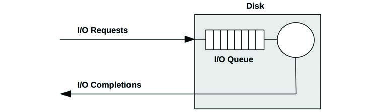
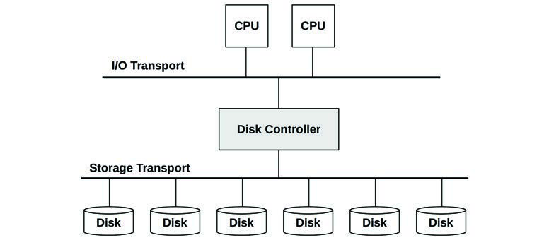
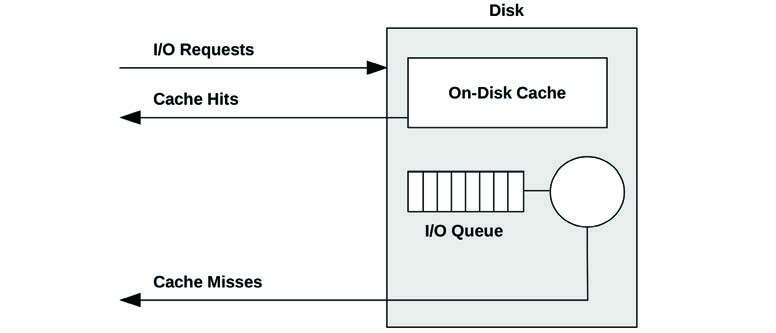
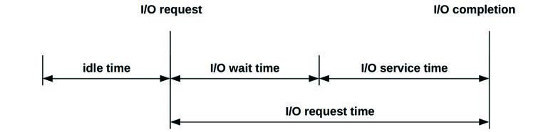
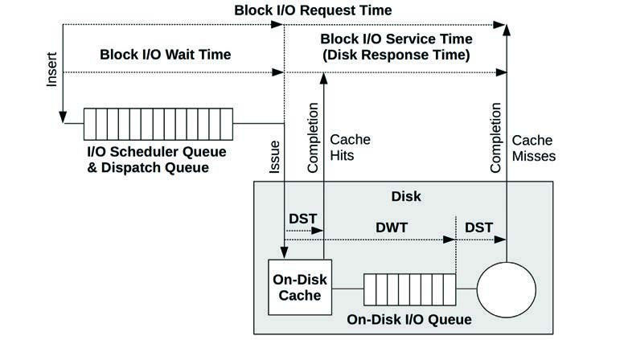
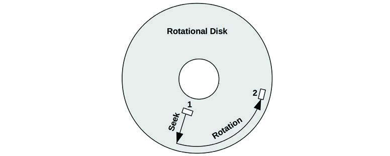
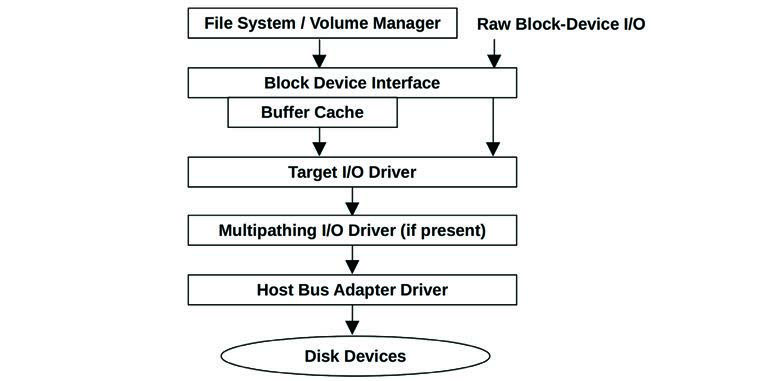
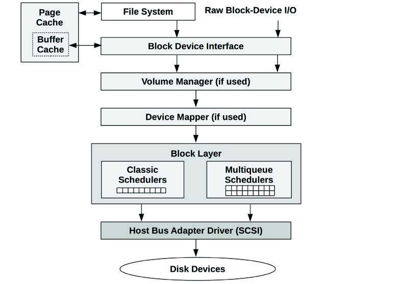
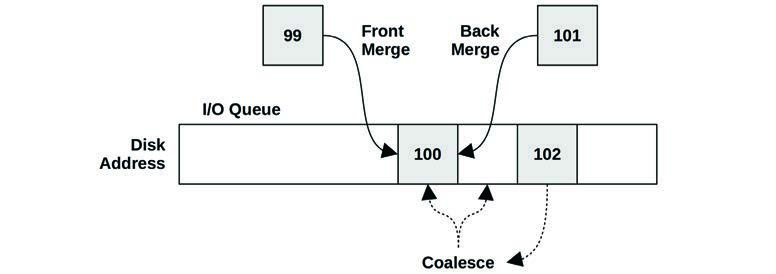
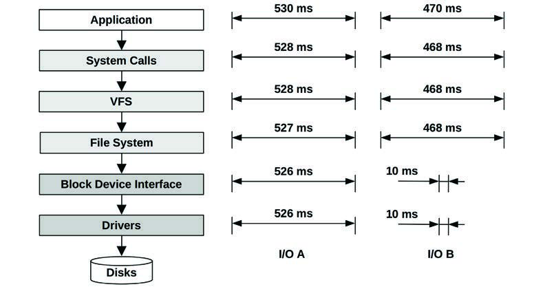

# 第 9 章 磁盘 (Disks)

磁盘 I/O 可能会导致显著的应用程序延迟，因此是系统性能分析的重要目标。在高负载下，磁盘会成为瓶颈，由于系统等待磁盘 I/O 完成，CPU 会处于空闲状态。识别并消除这些瓶颈可以将性能和应用程序吞吐量提高几个数量级。

“磁盘”一词是指系统的主要存储设备。它们包括基于闪存的固态硬盘 (SSD) 和磁性旋转磁盘。引入 SSD 主要是为了提高磁盘 I/O 性能，它们确实做到了这一点。然而，对容量、I/O 速率和吞吐量的需求也在不断增长，闪存设备也无法免受性能问题的影响。

本章的学习目标是：
- 理解磁盘模型和概念。
- 理解磁盘访问模式如何影响性能。
- 理解解释磁盘利用率时的陷阱。
- 熟悉磁盘设备的特性和内部结构。
- 熟悉从文件系统到设备的内核路径。
- 理解 RAID 级别及其性能。
- 遵循不同的磁盘性能分析方法。
- 表征系统级和每个进程的磁盘 I/O。
- 测量磁盘 I/O 延迟分布并识别离群值。
- 识别请求磁盘 I/O 的应用程序和代码路径。
- 使用追踪器详细调查磁盘 I/O。
- 了解磁盘调优参数。

本章由六部分组成，前三部分提供了磁盘 I/O 分析的基础，后三部分展示了其在 Linux 系统中的实际应用。各部分如下：
- **背景 (Background)**：介绍存储相关的术语、磁盘设备的基本模型和关键的磁盘性能概念。
- **架构 (Architecture)**：提供存储硬件和软件架构的通用描述。
- **方法论 (Methodology)**：描述性能分析方法论，包括观察法和实验法。
- **可观测性工具 (Observability Tools)**：展示 Linux 系统的磁盘性能可观测性工具，包括追踪和可视化。
- **实验 (Experimentation)**：总结磁盘基准测试工具。
- **调优 (Tuning)**：描述磁盘调优参数示例。

前一章涵盖了构建在磁盘之上的文件系统的性能，那是理解应用程序性能更好的研究目标。

## 9.1 术语 (Terminology)

本章使用的磁盘相关术语包括：
- **虚拟磁盘 (Virtual disk)**：存储设备的仿真。它对系统显示为单个物理磁盘，但可能由多个磁盘或磁盘的一部分构建而成。
- **传输 (Transport)**：用于通信的物理总线，包括数据传输 (I/O) 和其他磁盘命令。
- **扇区 (Sector)**：磁盘上的存储块，传统大小为 512 字节，但现在通常为 4 KB。
- **I/O**：严格来说，I/O 仅包括磁盘读取和写入，不包括其他磁盘命令。I/O 至少可以由方向（读或写）、磁盘地址（位置）和大小（字节）来描述。
- **磁盘命令 (Disk commands)**：磁盘可能会被命令执行其他非数据传输命令（例如，缓存刷新）。
- **吞吐量 (Throughput)**：对于磁盘，吞吐量通常指当前的数据传输速率，以每秒字节数测量。
- **带宽 (Bandwidth)**：存储传输或控制器的最大可能数据传输速率；它受硬件限制。
- **I/O 延迟 (I/O latency)**：I/O 操作从开始到结束的时间。9.3.1 节“测量时间”定义了更精确的时间术语。请注意，网络领域使用延迟一词来指代启动 I/O 所需的时间，后跟数据传输时间。
- **延迟离群值 (Latency outliers)**：具有异常高延迟的磁盘 I/O。

其他术语在本章中陆续介绍。术语表包含了基础术语供参考，包括磁盘、磁盘控制器、存储阵列、本地磁盘、远程磁盘和 IOPS。另见第 2 章和第 3 章的术语部分。

## 9.2 模型 (Models)

以下简单模型说明了磁盘 I/O 性能的一些基本原理。

### 9.2.1 简单磁盘 (Simple Disk)

现代磁盘包含一个用于 I/O 请求的盘上队列，如图 9.1 所示。



被磁盘接受的 I/O 可能正在队列中等待，也可能正在被服务。这个简单模型类似于超市结账，客户排队等待服务。它也非常适合使用排队论进行分析。

虽然这可能暗示是一个先来先服务 (FIFO) 队列，但盘上控制器可以应用其他算法来优化性能。这些算法可能包括用于旋转磁盘的电梯寻道（见 9.4.1 节“磁盘类型”中的讨论），或者为读取和写入 I/O 设置单独的队列（特别是对于基于闪存的磁盘）。

### 9.2.2 带有缓存的磁盘 (Caching Disk)

增加盘上缓存允许某些读取请求从更快的内存类型中得到满足，如图 9.2 所示。这可能实现为物理磁盘设备内部包含的一少量内存 (DRAM)。



虽然缓存命中以极低（好）的延迟返回，但缓存未命中的情况仍然很频繁，以较高的磁盘设备延迟返回。

盘上缓存也可用于通过作为写回 (write-back) 缓存来提高写入性能。这在数据传输到缓存后、较慢地传输到持久磁盘存储之前，就发出写入已完成的信号。与之对应的术语是全写 (write-through) 缓存，它仅在完全传输到下一级后才完成写入。

在实践中，存储写回缓存通常配有电池，以便在断电的情况下仍能保存缓冲的数据。此类电池可能安装在磁盘或磁盘控制器上。

### 9.2.3 控制器 (Controller)

一种简单类型的磁盘控制器如图 9.3 所示，它桥接了 CPU I/O 传输总线与存储传输总线及连接的磁盘设备。这些也被称为主机总线适配器 (HBA)。



性能可能受限于这些总线中的任何一个、磁盘控制器或磁盘。有关磁盘控制器的更多信息，请参见 9.4 节“架构”。

## 9.3 概念 (Concepts)

以下是磁盘性能中的重要概念。

### 9.3.1 测量时间 (Measuring Time)

I/O 时间可以按以下方式测量：
- **I/O 请求时间 (I/O request time)**（也称为 I/O 响应时间）：从发出 I/O 到其完成的全部时间。
- **I/O 等待时间 (I/O wait time)**：在队列中等待的时间。
- **I/O 服务时间 (I/O service time)**：I/O 被处理（而非等待）的时间。

这些如图 9.4 所示。



“服务时间”一词起源于磁盘是由操作系统直接管理的简单设备时代，因此操作系统知道磁盘何时在积极服务 I/O。磁盘现在执行自己的内部队列，操作系统的服务时间包括在内核队列中等待的时间。

在可能的情况下，我使用澄清术语来陈述正在测量的内容，从哪个起始事件到哪个结束事件。起始和结束事件可以是基于内核的或基于磁盘的，基于内核的时间是从磁盘设备的块 I/O 接口测量的（如图 9.7 所示）。

**从内核角度看：**
- **块 I/O 等待时间 (Block I/O wait time)**（也称为 OS 等待时间）是从创建一个新 I/O 并将其插入内核 I/O 队列，到它离开最后一个内核队列并被发送到磁盘设备的时间。这可能跨越多个内核级队列，包括块 I/O 层队列和磁盘设备队列。
- **块 I/O 服务时间 (Block I/O service time)** 是从向设备发出请求到收到设备发出的完成中断的时间。
- **块 I/O 请求时间 (Block I/O request time)** 既包括块 I/O 等待时间也包括块 I/O 服务时间：即从创建 I/O 到其完成的全过程时间。

**从磁盘角度看：**
- **磁盘等待时间 (Disk wait time)** 是在盘上队列中花费的时间。
- **磁盘服务时间 (Disk service time)** 是在盘上队列之后，一个 I/O 被积极处理所需的时间。
- **磁盘请求时间 (Disk request time)**（也称为磁盘响应时间或磁盘 I/O 延迟）既包括磁盘等待时间也包括磁盘服务时间，等于块 I/O 服务时间。

这些如图 9.5 所示，其中 DWT 是磁盘等待时间，DST 是磁盘服务时间。该图还显示了盘上缓存，以及磁盘缓存命中如何产生更短的磁盘服务时间 (DST)。



**I/O 延迟 (I/O latency)** 是另一个常用术语，在第 1 章中介绍过。与其他术语一样，其含义取决于测量位置。单独的 I/O 延迟可能指块 I/O 请求时间：即整个 I/O 时间。应用程序和性能工具通常使用术语“磁盘 I/O 延迟”来指代磁盘请求时间：即在设备上花费的全部时间。如果你从硬件角度与硬件工程师交流，他们可能会使用术语“磁盘 I/O 延迟”来指代磁盘等待时间。

块 I/O 服务时间通常被视为衡量当前磁盘性能的标准（这是旧版本 `iostat(1)` 显示的内容）；然而，你应该意识到这是一种简化。在图 9.7 中，描绘了一个通用的 I/O 栈，它显示了块设备接口下可能有三个驱动层。其中任何一层都可能实现自己的队列，或者在互斥锁上阻塞，从而为 I/O 增加延迟。这种延迟包含在块 I/O 服务时间中。

#### 计算时间 (Calculating Time)

内核统计数据通常无法直接观察到磁盘服务时间，但可以使用利用率和 IOPS 推导出平均磁盘服务时间：

$$磁盘服务时间 = 利用率 / IOPS$$

例如，60% 的利用率和 300 的 IOPS 得到 2 毫秒的平均服务时间 (600 ms / 300 IOPS)。这假设利用率反映的是单个设备（或服务中心），该设备一次只能处理一个 I/O。磁盘通常可以并行处理多个 I/O，这使得这种计算不准确。

可以使用事件追踪来提供准确的磁盘服务时间，方法是测量磁盘 I/O 的发出和完成的高分辨率时间戳，而不是使用内核统计数据。这可以使用本章后面描述的工具来完成（例如 9.6.6 节中的 `biolatency(8)`）。

### 9.3.2 时间尺度 (Time Scales)

磁盘 I/O 的时间尺度可能变化几个数量级，从几十微秒到几千毫秒。在尺度最慢的一端，应用程序响应时间差可能是由单个慢速磁盘 I/O 引起的；在最快的一端，只有在大量存在时（许多快速 I/O 的总和等于一个慢速 I/O），磁盘 I/O 才可能成为问题。

作为参考，表 9.1 提供了磁盘 I/O 延迟可能范围的通用概念。有关精确且当前的数值，请咨询磁盘厂商文档并进行你自己的微基准测试。另见第 2 章“方法论”中磁盘 I/O 以外的时间尺度。

为了更好地说明涉及的数量级，“等比缩放”列显示了基于假设盘上缓存命中延迟为 1 秒的比较。

**表 9.1 磁盘 I/O 延迟的时间尺度示例**

| 事件 | 延迟 | 等比缩放 |
| :--- | :--- | :--- |
| 盘上缓存命中 | < 100 µs [^1] | 1 秒 |
| 闪存读取 | ~100 到 1,000 µs (小到大 I/O) | 1 到 10 秒 |
| 旋转磁盘顺序读取 | ~1 ms | 10 秒 |
| 旋转磁盘随机读取 (7,200 rpm) | ~8 ms | 1.3 分钟 |
| 旋转磁盘随机读取 (慢速，排队) | > 10 ms | 1.7 分钟 |
| 旋转磁盘随机读取 (数十个在排队) | > 100 ms | 17 分钟 |
| 最坏情况下的虚拟磁盘 I/O (硬件控制器, RAID-5, 排队, 随机 I/O) | > 1,000 ms | 2.8 小时 |

这些延迟可能会根据环境需求有不同的解释。在企业存储行业工作时，我认为任何超过 10 毫秒的磁盘 I/O 都是异常缓慢的，并且是性能问题的潜在来源。在云计算行业，对高延迟有更大的容忍度，特别是对于已经预料到网络和客户端浏览器之间存在高延迟的面向 Web 的应用程序。在这些环境中，磁盘 I/O 只有在超过 50 毫秒时（单独地，或在应用程序请求期间总计）才可能成为问题。

该表还说明了磁盘可以返回两种类型的延迟：一种用于盘上缓存命中（小于 100 µs），另一种用于未命中（1-8 ms 及更高，取决于访问模式和设备类型）。由于磁盘会返回这些延迟的混合，将它们一起表达为平均延迟（如 `iostat(1)` 所做的那样）可能会产生误导，因为这实际上是一个具有两个众数的分布。有关磁盘 I/O 延迟分布作为直方图的示例，请参见第 2 章“方法论”中的图 2.23。

### 9.3.3 缓存 (Caching)

最好的磁盘 I/O 性能是根本没有磁盘 I/O。软件栈的许多层都试图通过缓存读取和缓冲写入来避免磁盘 I/O，一直延伸到磁盘本身。这些缓存的完整列表见第 3 章“操作系统”的表 3.2，其中包括应用程序级和文件系统缓存。在磁盘设备驱动层及以下，它们可能包括表 9.2 中列出的缓存。

**表 9.2 磁盘 I/O 缓存**

| 缓存 | 示例 |
| :--- | :--- |
| 设备缓存 | ZFS vdev |
| 块缓存 | 缓冲区缓存 (Buffer cache) |
| 磁盘控制器缓存 | RAID 卡缓存 |
| 存储阵列缓存 | 阵列缓存 |
| 盘上缓存 | 连接到磁盘数据控制器 (DDC) 的 DRAM |

基于块的缓冲区缓存在第 8 章“文件系统”中已有描述。这些磁盘 I/O 缓存对于提高随机 I/O 工作负载的性能尤为重要。

### 9.3.4 随机与顺序 I/O (Random vs. Sequential I/O)

根据 I/O 在磁盘上的相对位置（磁盘偏移量），磁盘 I/O 工作负载可以使用术语“随机”和“顺序”来描述。这些术语在第 8 章“文件系统”中关于文件访问模式的部分已有讨论。

顺序工作负载也被称为流式工作负载 (streaming workloads)。“流式”一词通常在应用程序层使用，用于描述向磁盘（文件系统）发出的流式读写。

在磁性旋转磁盘时代，研究随机与顺序磁盘 I/O 模式非常重要。对于这类磁盘，随机 I/O 会导致额外的延迟，因为磁盘磁头需要寻道且磁盘盘片在 I/O 之间旋转。如图 9.6 所示，磁头要在扇区 1 和 2 之间移动，寻道和旋转都是必要的（实际采取的路径将尽可能直接）。性能调优涉及识别随机 I/O 并尝试以多种方式消除它，包括缓存、将随机 I/O 隔离到单独的磁盘以及通过磁盘放置来缩短寻道距离。



其他磁盘类型，包括基于闪存的 SSD，通常在随机和顺序读取模式下表现没有差别。根据驱动器的不同，由于其他因素可能会有微小的差别，例如，一个地址查找缓存可以覆盖顺序访问但无法覆盖随机访问。小于块大小的写入可能会由于读-修改-写 (read-modify-write) 循环而遇到性能损失，特别是对于随机写入。

请注意，从操作系统看到的磁盘偏移量可能与物理磁盘上的偏移量不匹配。例如，硬件提供的虚拟磁盘可能会跨多个磁盘映射连续的偏移量范围。磁盘也可能以自己的方式重新映射偏移量（通过磁盘数据控制器）。有时无法通过检查偏移量来识别随机 I/O，但可以通过测量增加的磁盘服务时间来推断。

### 9.3.5 读/写比例 (Read/Write Ratio)

除了识别随机与顺序工作负载外，另一个特征度量是读写比例，指 IOPS 或吞吐量。这可以表达为随时间变化的比例，或百分比，例如：“自系统启动以来，系统一直以 80% 的读取率运行。”

了解这个比例有助于设计和配置系统。具有高读取率的系统可能从增加缓存中获益最多。具有高写入率的系统可能从增加更多磁盘中获益最多，以增加最大可用吞吐量和 IOPS。

读取和写入本身可能显示不同的工作负载模式：读取可能是随机 I/O，而写入可能是顺序的（特别是对于写时复制文件系统）。它们也可能表现出不同的 I/O 大小。

### 9.3.6 I/O 大小 (I/O Size)

平均 I/O 大小（字节）或 I/O 大小分布是另一个工作负载特征。较大的 I/O 大小通常提供更高的吞吐量，尽管每笔 I/O 的延迟更长。

I/O 大小可能会被磁盘设备子系统改变（例如，量子化为 512 字节的扇区）。自从 I/O 在应用程序级别发出以来，由于文件系统、卷管理器和设备驱动程序等内核组件的作用，该大小可能也被放大或缩小。见第 8 章“文件系统” 8.3.12 节“逻辑与物理 I/O”中的“放大”和“缩小”部分。

某些磁盘设备，尤其是基于闪存的设备，在处理不同的读写大小时性能差异很大。例如，基于闪存的磁盘驱动器在 4 KB 读取和 1 MB 写入时可能表现最佳。理想的 I/O 大小可以通过磁盘厂商文档获取，或通过微基准测试识别。当前使用的 I/O 大小可以通过观察工具发现（见 9.6 节“可观测性工具”）。

### 9.3.7 IOPS 不等价 (IOPS Are Not Equal)

由于最后这三个特征，IOPS 并不是生而平等的，不能在不同的设备和工作负载之间直接进行比较。单独的 IOPS 值并没有太大意义。

例如，对于旋转磁盘，5,000 次顺序 IOPS 的工作负载可能比 1,000 次随机 IOPS 快得多。基于闪存的 IOPS 也很难比较，因为它们的 I/O 性能通常相对于 I/O 大小和方向（读或写）而言。

IOPS 对应用程序工作负载甚至可能没那么重要。由随机请求组成的工作负载通常对延迟敏感，在这种情况下，高 IOPS 速率是理想的。流式（顺序）工作负载对吞吐量敏感，这可能使得较大 I/O 的较低 IOPS 速率更为理想。

要理解 IOPS，请包含其他细节：随机或顺序、I/O 大小、读/写、缓冲/直接以及并行 I/O 数量。还要考虑使用基于时间的指标，如利用率和服务时间，它们反映了最终的性能，并且更容易进行比较。

### 9.3.8 非数据传输磁盘命令 (Non-Data-Transfer Disk Commands)

除了 I/O 读写之外，磁盘还可以接收其他命令。例如，带有盘上缓存 (RAM) 的磁盘可能会被命令将缓存刷新到磁盘。这样的命令不是数据传输；数据之前已经通过写入操作发送到了磁盘。

另一个命令示例用于丢弃数据：ATA TRIM 命令或 SCSI UNMAP 命令。这告诉驱动器某个扇区范围不再需要，可以帮助 SSD 驱动器维持写入性能。

这些磁盘命令会影响性能，并可能导致磁盘在其他 I/O 等待时被占用。

### 9.3.9 利用率 (Utilization)

利用率可以计算为一个间隔内磁盘积极执行工作的时间。

利用率为 0% 的磁盘是“空闲”的，100% 的磁盘正在持续执行 I/O（和其他磁盘命令）。利用率达到 100% 的磁盘很可能是性能问题的来源，特别是如果它们持续保持在 100% 一段时间。然而，由于磁盘 I/O 通常是一项缓慢的活动，任何水平的磁盘利用率都可能导致性能不佳。

在 0% 到 100% 之间也可能存在一个点（比如 60%），此时由于在盘上队列或操作系统中排队的可能性增加，磁盘的性能不再令人满意。产生问题的确切利用率值取决于磁盘、工作负载和延迟要求。见第 2 章“方法论” 2.6.5 节“排队论”中的“M/D/1 和 60% 利用率”部分。

要确认高利用率是否引起了应用程序问题，请研究磁盘响应时间以及应用程序是否阻塞在该 I/O 上。应用程序或操作系统可能正在异步执行 I/O，这样慢速 I/O 就不会直接导致应用程序等待。

请注意，利用率是一个间隔汇总值。磁盘 I/O 可能以突发方式发生，特别是由于写入刷新，这在对较长间隔进行汇总时可能会被掩盖。有关利用率指标类型的进一步讨论，见第 2 章“方法论”的 2.3.11 节“利用率”。

#### 虚拟磁盘利用率 (Virtual Disk Utilization)

对于由硬件（例如磁盘控制器或网络附加存储）提供的虚拟磁盘，操作系统可能知道虚拟磁盘何时繁忙，但对其构建所基于的底层磁盘的性能一无所知。这导致操作系统报告的虚拟磁盘利用率与实际磁盘上发生的情况显著不同（且违反直觉）：
- 一个 100% 繁忙且构建在多个物理磁盘之上的虚拟磁盘可能仍能接受更多工作。在这种情况下，100% 可能意味着某些磁盘一直繁忙，但并非所有磁盘一直繁忙，因此有些磁盘是空闲的。
- 包含写回缓存的虚拟磁盘在写入工作负载期间可能看起来并不繁忙，因为磁盘控制器会立即返回写入完成，即使底层磁盘随后会繁忙一段时间。
- 磁盘可能由于硬件 RAID 重建而繁忙，但操作系统看不到相应的 I/O。

由于同样的原因，解释操作系统软件（软件 RAID）创建的虚拟磁盘利用率可能也很困难。然而，操作系统也应该公开物理磁盘的利用率，这些是可以被检查的。

一旦物理磁盘达到 100% 利用率并请求更多 I/O，它就变得饱和了。

### 9.3.10 饱和度 (Saturation)

饱和度是衡量排队工作量超出资源交付能力的指标。对于磁盘设备，它可以计算为操作系统中设备等待队列的平均长度（假设它执行排队）。

这提供了一种衡量超出 100% 利用率点性能的方法。100% 利用率的磁盘可能没有饱和（排队），也可能有大量饱和，由于 I/O 排队而严重影响性能。

你可能会认为利用率低于 100% 的磁盘没有饱和，但这实际上取决于利用率间隔：一个间隔内 50% 的磁盘利用率可能意味着该时间的一半是 100% 利用率，其余时间是空闲。任何间隔汇总都可能遭受类似的问题。当需要确切了解发生的情况时，可以使用追踪工具来检查 I/O 事件。

### 9.3.11 I/O 等待 (I/O Wait)

I/O 等待是一个每 CPU 性能指标，显示 CPU 处于空闲状态的时间，此时 CPU 调度队列中有处于睡眠状态且阻塞在磁盘 I/O 上的线程。这由于将 CPU 空闲时间划分为“无事可做的时间”和“阻塞在磁盘 I/O 上的时间”。每 CPU 较高比例的 I/O 等待表明磁盘可能是瓶颈，导致 CPU 在等待它们时处于空闲状态。

I/O 等待可能是一个非常令人困惑的指标。如果另一个消耗 CPU 的进程出现，I/O 等待值可能会下降：CPU 现在有事可做了，而不是处于空闲状态。然而，尽管 I/O 等待指标下降，同样的磁盘 I/O 仍然存在并阻塞着线程。反之亦然，有时系统管理员升级应用程序软件后，新版本效率更高且使用更少的 CPU 周期，从而显现出 I/O 等待。这会让系统管理员认为升级导致了磁盘问题并使性能变差，而事实上磁盘性能没变，只是 CPU 性能提升了。

一个更可靠的指标是应用程序线程阻塞在磁盘 I/O 上的时间。这捕捉到了由磁盘引起的应用程序线程所遭受的痛苦，无论 CPU 可能正在做其他什么工作。该指标可以使用静态或动态插桩进行测量。

I/O 等待在 Linux 系统上仍然是一个受欢迎的指标，尽管它具有迷惑性，但它成功地用于识别一种磁盘瓶颈：磁盘繁忙，CPU 空闲。解释它的一种方法是将任何等待 I/O 视为系统瓶颈的标志，然后调优系统以最小化它——即使 I/O 仍然与 CPU 利用率并发发生。并发 I/O 更有可能是非阻塞 I/O，不太可能引起直接问题。由 I/O 等待识别的非并发 I/O 更有可能是应用程序阻塞 I/O，并且是一个瓶颈。

### 9.3.12 同步与异步 (Synchronous vs. Asynchronous)

如果应用程序 I/O 和磁盘 I/O 异步操作，理解磁盘 I/O 延迟可能不会直接影响应用程序性能是很重要的。这种情况通常发生在写回缓存中，应用程序 I/O 提前完成，而磁盘 I/O 稍后发出。

应用程序可以使用预读 (read-ahead) 来执行异步读取，在磁盘完成 I/O 时可能不会阻塞应用程序。文件系统本身可能会启动这一操作来预热缓存（预取）。

即使应用程序正在同步等待 I/O，该应用程序代码路径也可能是非关键的且相对于客户端应用程序请求是异步的。它可能是一个应用程序 I/O 工作线程，创建它是为了在其他线程继续处理工作时管理 I/O。

内核通常也支持异步或非阻塞 I/O，提供 API 供应用程序请求 I/O 并在稍后获得完成通知。有关这些主题的更多信息，请参阅第 8 章“文件系统”的 8.3.9 节“非阻塞 I/O”、8.3.5 节“预读”、8.3.4 节“预取”和 8.3.7 节“同步写入”。

### 9.3.13 磁盘与应用程序 I/O (Disk vs. Application I/O)

磁盘 I/O 是各种内核组件（包括文件系统和设备驱动程序）的最终结果。磁盘 I/O 的速率和量可能与应用程序发出的 I/O 不匹配，原因有很多。这些包括：
- **文件系统放大、缩小和无关 I/O**：见第 8 章“文件系统” 8.3.12 节“逻辑与物理 I/O”。
- **由于系统内存短缺导致的分页**：见第 7 章“内存” 7.2.2 节“分页”。
- **设备驱动程序 I/O 大小**：向上取整 I/O 大小，或对 I/O 进行分段。
- **RAID 写入镜像或校验块，或验证读取数据**。

这种不匹配在出乎意料时可能会令人困惑。可以通过学习架构并执行分析来理解它。

## 9.4 架构 (Architecture)

本节描述磁盘架构，通常在容量规划期间研究，以确定不同组件和配置选择的限制。在调查后期的性能问题时也应检查它，以防问题源于架构选择而非当前的负载和调优。

### 9.4.1 磁盘类型 (Disk Types)

目前最常用的两种磁盘类型是磁性旋转磁盘和基于闪存的 SSD。这两者都提供永久存储；与易失性内存不同，存储的内容在断电重启后仍然可用。

#### 9.4.1.1 磁性旋转磁盘 (Magnetic Rotational)

也被称为硬盘驱动器 (HDD)，这类磁盘由一个或多个盘片 (platters) 组成，盘片上涂有氧化铁颗粒。这些颗粒的一个小区域可以在两个方向之一被磁化；这种方向用于存储一个比特。盘片旋转，而带有读取和写入数据电路的机械臂伸向表面。这些电路包括磁盘磁头，一个机械臂可能有多个磁头，允许同时读取和写入多个比特。数据以圆形磁道的形式存储在盘片上，每个磁道被划分为扇区。

作为机械设备，它们的性能相对较慢，特别是对于随机 I/O。随着闪存技术的进步，SSD 正在取代旋转磁盘，可以预见有一天旋转磁盘将会过时（连同其他旧的存储技术：鼓式磁盘和磁芯存储）。与此同时，旋转磁盘在某些场景下仍然具有竞争力，例如经济型高密度存储（每兆字节成本低），特别是对于数据仓库。[^2]

以下主题总结了旋转磁盘性能的因素。

**寻道与旋转 (Seek and Rotation)**
磁性旋转磁盘的慢速 I/O 通常是由磁盘磁头的寻道时间和磁盘盘片的旋转时间引起的，这两者都可能耗时数毫秒。最好的情况是下一次请求的 I/O 位于当前服务 I/O 的末尾，这样磁盘磁头就不需要寻道或等待额外的旋转。如前所述，这被称为顺序 I/O，而需要磁头寻道或等待旋转的 I/O 称为随机 I/O。

有许多策略可以减少寻道和旋转等待时间，包括：
- **缓存**：完全消除 I/O。
- **文件系统放置和行为**：包括写时复制（使写入变为顺序，但可能使以后的读取变为随机）。
- **将不同的工作负载分离到不同的磁盘**：避免在不同工作负载的 I/O 之间进行寻道。
- **将不同的工作负载移至不同的系统**（某些云计算环境可以这样做以减少多租户效应）。
- **电梯寻道**：由磁盘本身执行。
- **高密度磁盘**：紧缩工作负载的位置。
- **分区（或“切片”）配置**：例如短行程 (short-stroking)。

减少旋转等待时间的另一种策略是使用更快的磁盘。磁盘有不同的旋转速度，包括 5400, 7200, 10 K 和 15 K 转/分 (rpm)。请注意，更高的速度可能会由于增加的热量和磨损导致磁盘寿命缩短。

**理论最大吞吐量 (Theoretical Maximum Throughput)**
如果已知磁盘每条磁道的最大扇区数，可以使用以下公式计算磁盘吞吐量：

$$最大吞吐量 = 每条磁道最大扇区数 \times 扇区大小 \times rpm / 60s$$

这个公式对于能够准确暴露这些信息的旧款磁盘更有用。现代磁盘向操作系统提供磁盘的虚拟映像，并仅公开这些属性的合成值。

**短行程 (Short-Stroking)**
短行程是指仅将磁盘的外圈磁道用于工作负载；其余部分要么不使用，要么用于低吞吐量的工作负载（例如归档）。这减少了寻道时间，因为磁头移动被限制在较小的范围内，并且磁盘可能会让磁头在闲置时停留在外边缘，从而减少闲置后的第一次寻道。由于扇区重组 (sector zoning)，外圈磁道通常也具有更好的吞吐量（见下一节）。在研究发布的磁盘基准测试时要留意短行程，特别是那些不包含价格的基准测试，其中可能使用了许多短行程磁盘。

**扇区重组 (Sector Zoning)**
磁盘磁道的长度各不相同，最中心的最短，最外缘的最长。扇区重组（也称为多区记录）并不是让每条磁道的扇区数（和比特数）固定，而是增加了较长磁道的扇区计数，因为物理上可以写入更多扇区。由于旋转速度恒定，较长的外缘磁道比内圈磁道提供更高的吞吐量（MB/s）。

**扇区大小 (Sector Size)**
存储行业开发了一种新的磁盘设备标准，称为高级格式 (Advanced Format)，以支持更大的扇区大小，特别是 4 KB。这减少了 I/O 计算开销，提高了吞吐量，并减少了磁盘每个扇区存储的元数据的开销。512 字节的扇区仍然可以通过称为 Advanced Format 512e 的仿真标准由磁盘固件提供。根据磁盘的不同，这可能会增加写入开销，调用读-修改-写循环以将 512 字节映射到 4 KB 扇区。其他要注意的性能问题包括未对齐的 4 KB I/O，它们跨越两个扇区，从而放大了服务它们的扇区 I/O。

**盘上缓存 (On-Disk Cache)**
这些磁盘的一个常见组件是少量内存 (RAM)，用于缓存读取结果和缓冲写入。该内存还允许在设备上对 I/O（命令）进行排队并更有效地重新排序。对于 SCSI，这是标记队列命令 (Tagged Command Queueing, TCQ)；对于 SATA，它被称为原生命令队列 (Native Command Queueing, NCQ)。

**电梯寻道 (Elevator Seeking)**
电梯算法（也称为电梯寻道）是命令队列提高效率的一种方式。它根据 I/O 的盘上位置对它们进行重新排序，以最小化磁盘磁头的行程。其结果类似于建筑物的电梯，电梯不会根据按下楼层按钮的顺序来服务楼层，而是上下扫射建筑，在当前请求的楼层停靠。

这种行为在检查磁盘 I/O 追踪并发现按完成时间排序与按开始时间排序不匹配时变得很明显：I/O 是乱序完成的。

虽然这看起来明显是性能上的提升，但请考虑以下场景：磁盘已被发送了一批靠近偏移量 1,000 的 I/O，以及一个位于偏移量 2,000 的单一 I/O。磁盘磁头当前位于 1,000。偏移量 2,000 的 I/O 何时会被服务？现在考虑，当服务 1,000 附近的 I/O 时，更多 I/O 到达 1,000 附近，且越来越多，多到足以让磁盘在 1,000 偏移量附近持续忙碌 10 秒。那么 2,000 偏移量的 I/O 何时会被服务，其最终的 I/O 延迟是多少？

**数据完整性 (Data Integrity)**
磁盘在每个扇区的末尾存储纠错码 (ECC) 以确保数据完整性，以便驱动器验证数据是否被正确读取，或纠正可能发生的任何错误。如果扇区未被正确读取，磁盘磁头可能会在下一次旋转时重试读取（并且可能会重试多次，每次稍微改变磁头的位置）。这可能是异常缓慢的 I/O 的解释。驱动器可能会向操作系统提供软错误 (soft errors) 以解释发生了什么。监控软错误率是有益的，因为增加的软错误率可能表明驱动器很快就会失效。

行业从 512 字节切换到 4 KB 扇区的一个好处是，相同数据量所需的 ECC 比特更少，因为 ECC 对于较大的扇区大小更有效 [Smith 09]。

请注意，也可能正在使用其他校验和来验证数据。例如，循环冗余校验 (CRC) 可能用于验证到主机的传输，文件系统也可能正在使用其他校验和。

**震动 (Vibration)**
虽然磁盘设备厂商非常清楚震动问题，但这些问题在行业内并不为人所共知，也没有被认真对待。2008 年，在调查一个神秘的性能问题时，我进行了一个诱导震动的实验：对着正在执行写入基准测试的磁盘阵列大喊大叫，这导致了一阵非常缓慢的 I/O。我的实验立即被录制并上传到 YouTube，在那里迅速走红，它被描述为震动对磁盘性能影响的首次演示 [Turner 10]。该视频的观看次数已超过 1,700,000 次，提升了人们对磁盘震动问题的认识 [Gregg 08]。根据我收到的电子邮件，我还似乎意外地催生了一个数据中心隔音行业：你现在可以聘请专业人士来分析数据中心的声级，并通过抑制震动来提高磁盘性能。

**树懒磁盘 (Sloth Disks)**
某些旋转磁盘当前的性能问题是发现了所谓的“树懒磁盘”。这些磁盘有时会返回非常慢的 I/O（超过一秒），且没有任何报告的错误。这比基于 ECC 的重试所花的时间要长得多。如果这类磁盘直接返回失败而不是花费这么长时间，情况可能反而会更好，这样操作系统或磁盘控制器就可以采取纠正措施，例如在冗余环境中将磁盘下线并报告故障。树懒磁盘是一个麻烦，特别是当它们是存储阵列提供的虚拟磁盘的一部分而操作系统没有直接可见性时，这使它们更难被识别。[^3]

**SMR**
叠瓦式磁记录 (Shingled Magnetic Recording, SMR) 驱动器通过使用更窄的磁道提供更高的密度。这些磁道对于写入磁头来说太窄而无法记录，但对于（较小的）读取磁头来说并非无法读取，因此它通过与其他磁道部分重叠的方式来写入，其风格类似于屋顶瓦片（因此得名）。使用 SMR 的驱动器密度增加了约 25%，代价是写入性能下降，因为重叠的数据会被破坏且必须重新写入。这些驱动器适用于写一次后主要读取的归档工作负载，但不适用于 RAID 配置中的高写入工作负载 [Mellor 20]。

**磁盘数据控制器 (Disk Data Controller)**
机械磁盘向系统提供一个简单的接口，暗示了固定的每磁道扇区比例和连续的可寻址偏移量范围。磁盘上实际发生的情况取决于磁盘数据控制器——一个由固件编程的磁盘内部微处理器。磁盘可能会实现包括扇区重组在内的算法，从而影响偏移量的布局方式。这是需要注意的一点，但很难分析——操作系统无法查看到磁盘数据控制器内部。

#### 9.4.1.2 固态硬盘 (Solid-State Drives)

它们也被称为固态盘 (SSDs)。“固态”一词是指它们使用固态电子设备，提供可编程的非易失性内存，其性能通常远优于旋转磁盘。由于没有移动部件，这些磁盘在物理上也很耐用，并且不会受到震动引起的性能问题的影响。

这类磁盘的性能在不同偏移量上通常是一致的（没有旋转或寻道延迟），并且对于给定的 I/O 大小是可预测的。工作负载的随机或顺序特征比旋转磁盘要重要得多。所有这些都使它们更容易研究和进行容量规划。然而，如果它们确实遇到了性能病理，理解它们可能由于其内部运行方式而与旋转磁盘一样复杂。

一些 SSD 使用非易失性 DRAM (NV-DRAM)。大多数使用闪存。

**闪存 (Flash Memory)**
基于闪存的 SSD 提供极高的读取性能，特别是随机读取性能，可以比旋转磁盘快几个数量级。大多数是使用 NAND 闪存构建的，它使用基于电子的陷阱电荷存储介质，可以在无电状态下持久地存储电子。[^4] [Cornwell 12] “闪存”这个名字与数据的写入方式有关，它需要一次擦除一整个内存块（包括多个页面，通常每页 8 或 64 KB）并重写内容。由于这些写入开销，闪存具有不对称的读/写性能：读取快，写入慢。驱动器通常使用写回缓存来缓解这一问题，并使用一个小电容作为备份电池，以防断电。

闪存有不同的类型：
- **单层单元 (SLC)**：在单个单元中存储数据位。
- **多层单元 (MLC)**：每个单元存储多个位（通常为两个，需要四个电压水平）。
- **企业级多层单元 (eMLC)**：具有专为企业使用设计的高级固件的 MLC。
- **三层单元 (TLC)**：存储三个位（八个电压水平）。
- **四层单元 (QLC)**：存储四个位。
- **3D NAND / 垂直 NAND (V-NAND)**：堆叠闪存层（例如 TLC）以增加密度和存储容量。

这个列表大致按时间顺序排列，最新技术列在最后：3D NAND 自 2013 年起已商业化。

与其它类型相比，SLC 往往具有更高的性能和可靠性，曾是企业使用的首选，但成本也更高。尽管 MLC 可靠性较低，但由于其更高的密度，现在常用于企业。闪存可靠性通常以驱动器预期支持的块写入次数（编程/擦除循环）来衡量。对于 SLC，这一预期约为 50,000 到 100,000 次循环；MLC 约为 5,000 到 10,000 次循环；TLC 约为 3,000 次循环；QLC 约为 1,000 次循环 [Liu 20]。

**控制器 (Controller)**
SSD 控制器的任务如下 [Leventhal 13]：
- **输入**：读取和写入按页进行（通常为 8 KB）；写入只能针对已擦除的页；页按块擦除（32 到 64 页，即 256-512 KB）。
- **输出**：模拟硬盘块接口：对任意扇区（512 字节或 4 KB）进行读取或写入。

输入和输出之间的转换由控制器的闪存转换层 (FTL) 执行，它还必须跟踪空闲块。它本质上使用自己的文件系统来执行此操作，例如日志结构文件系统。

写入特性可能是写入工作负载的一个问题，特别是当写入的 I/O 大小小于闪存块大小（可能高达 512 KB）时。这会导致写入放大 (write amplification)，即块的其余部分在擦除前被复制到别处，并且至少会导致擦除-写入循环的延迟。一些闪存驱动器通过提供带有电池备份的盘上缓冲区 (基于 RAM) 来缓解延迟问题，这样写入可以被缓冲并稍后写入，即使在断电的情况下也是如此。

我使用过的最常见的企业级闪存驱动器由于闪存布局的原因，在 4 KB 读取和 1 MB 写入时表现最佳。这些值因驱动器而异，可以通过 I/O 大小的微基准测试找到。

鉴于闪存的原生操作与暴露的块接口之间的差异，操作系统及其文件系统还有改进空间。TRIM 命令就是一个例子：它通知 SSD 某个区域已不再使用，从而使 SSD 能够更轻松地汇集其空闲块池，减少写入放大。（对于 SCSI，这可以使用 UNMAP 或 WRITE SAME 命令实现；对于 ATA，使用 DATA SET MANAGEMENT 命令。Linux 的支持包括 `discard` 挂载选项和 `fstrim(8)` 命令。）

**寿命 (Lifespan)**
作为存储介质，NAND 闪存存在各种问题，包括烧毁、数据褪色和读取干扰 [Cornwell 12]。这些可以由 SSD 控制器解决，控制器可以移动数据以避免问题。它通常会采用磨损均衡 (wear leveling) 技术，将写入分散到不同的块以减少单个块的写入循环，以及内存过度供应 (memory overprovisioning)，预留额外的内存，以便在需要时映射到服务中。

虽然这些技术延长了寿命，但 SSD 的每个块仍有有限的写入循环次数，这取决于闪存的类型和驱动器采用的缓解功能。企业级驱动器使用内存过度供应和最可靠的闪存类型 SLC，以实现 100 万次及更高的写入循环率。基于 MLC 的消费级驱动器可能仅提供 1,000 次循环。

**病理 (Pathologies)**
以下是需要注意的一些闪存 SSD 病理：
- 由于老化导致的延迟离群值，以及 SSD 更加努力地提取正确数据（使用 ECC 校验）。
- 由于碎片化导致的较高延迟（重新格式化可以通过清理 FTL 块映射来修复此问题）。
- 如果 SSD 实现了内部压缩，其吞吐量性能会降低。

留意 SSD 性能特征和遇到的问题的其它发展。

#### 9.4.1.3 持久内存 (Persistent Memory)

以电池备份 [^5] 的 DRAM 形式存在的持久内存被用于存储控制器的写回缓存。这种类型的性能比闪存快几个数量级，但其成本和有限的电池寿命限制了它仅用于专门用途。

由 Intel 和 Micron 开发的一种名为 3D XPoint 的新型持久内存将允许持久内存在更多应用中以极具吸引力的价格/性能比使用，介于 DRAM 和闪存之间。3D XPoint 通过在可堆叠的交叉网格数据访问阵列中存储位来工作，并且是按字节寻址的。Intel 的一项性能比较报告称，3D XPoint 的访问延迟为 14 微秒，而 3D NAND SSD 为 200 微秒 [Hady 18]。3D XPoint 在其测试中也表现出一致的延迟，而 3D NAND 具有较宽的延迟分布，可达 3 毫秒。

3D XPoint 自 2017 年起已商业化。Intel 使用 Optane 品牌名称，并以 DIMM 封装的形式发布 Intel Optane 持久内存，以及 Intel Optane SSD。

### 9.4.2 接口 (Interfaces)

接口是驱动器与系统通信（通常通过磁盘控制器）所支持的协议。以下是对 SCSI, SAS, SATA, FC 和 NVMe 接口的简要总结。你需要检查当前的接口和支持的带宽，因为它们会随着新规范的开发和采用而不断变化。

**SCSI**
小型计算机系统接口 (Small Computer System Interface) 最初是一种并行传输总线，使用多个电气连接器并行传输位。1986 年的第一个版本 SCSI-1 具有 8 位的带宽，允许每个时钟传输一个字节，并提供 5 MB/s 的带宽。它使用 50 针 Centronics C50 连接。后来的并行 SCSI 版本使用了更宽的数据总线和更多的连接器引脚（高达 80 针），带宽达到了数百兆字节。

由于并行 SCSI 是共享总线，它可能会因为总线争用而遭受性能问题，例如当计划内系统备份使用低优先级 I/O 饱和总线时。解决方法包括将低优先级设备放在各自的 SCSI 总线或控制器上。

并行总线的时钟同步在更高速度下也会成为问题，加上其他问题（包括有限的设备和对 SCSI 终端电阻包的需求），导致了向串行版本的切换：SAS。

**SAS**
串行连接 SCSI (Serial Attached SCSI) 接口被设计为高速点对点传输，避免了并行 SCSI 的总线争用问题。初始 SAS-1 规范为 3 Gbit/s (2003 年发布)，随后 SAS-2 支持 6 Gbit/s (2009 年)，SAS-3 支持 12 Gbit/s (2012 年)，SAS-4 支持 22.5 Gbit/s (2017 年)。支持链路聚合，以便多个端口可以组合以提供更高的带宽。由于 8b/10b 编码，实际数据传输率为带宽的 80%。

其他 SAS 特性包括用于冗余连接器和架构的驱动器双端口、I/O 多路径、SAS 域、热插拔以及对 SATA 设备的兼容性支持。这些特性使 SAS 在企业用途中非常受欢迎，尤其是冗余架构。

**SATA**
由于与 SCSI 和 SAS 类似的原因，并行 ATA (又名 IDE) 接口标准演变成了串行 ATA (Serial ATA) 接口。SATA 1.0 创建于 2003 年，支持 1.5 Gbit/s；后来的主要版本是支持 3.0 Gbit/s 的 SATA 2.0 (2004 年) 和支持 6.0 Gbit/s 的 SATA 3.0 (2008 年)。主要和次要版本中增加了额外功能，包括原生命令队列支持。SATA 使用 8b/10b 编码，因此数据传输率为带宽的 80%。SATA 常用于消费级台式机和笔记本电脑。

**FC**
光纤通道 (Fibre Channel, FC) 是一种高速数据传输接口标准，最初仅用于光纤电缆（因此得名），后来也支持铜缆。FC 常用于企业环境，以通过光纤通道交换矩阵 (Fibre Channel Fabric) 将多个存储设备连接到多个服务器，从而创建存储区域网络 (SAN)。这提供了比其他接口更大的可扩展性和可访问性，类似于通过网络连接多个主机。并且与网络一样，FC 可以涉及使用交换机来连接多个本地端点（服务器和存储）。光纤通道标准的开发始于 1988 年，第一个版本于 1994 年获得 ANSI 批准 [FICA 20]。此后出现了许多变体和速度改进，最近的 Gen 7 256GFC 标准全双工带宽达到了 51,200 MB/s [FICA 18]。

**NVMe**
非易失性内存规范 (Non-Volatile Memory express, NVMe) 是用于存储设备的 PCIe 总线规范。NVMe 设备本身就是一块直接连接到 PCIe 总线的卡，而不是将存储设备连接到存储控制器卡。NVMe 1.0e 规范创建于 2011 年 (2013 年发布)，最新版本是 1.4 (2019 年) [NVMe 20]。较新的规范增加了各种功能，例如热管理功能以及用于自检、验证数据和清理数据（使恢复变得不可能）的命令。NVMe 卡的带宽受限于 PCIe 总线；目前常用的 PCIe 4.0 版本对于 x16 卡（链路宽度）具有 31.5 GB/s 的单向带宽。

NVMe 相对于传统 SAS 和 SATA 的一个优势是它支持多个硬件队列。这些队列可以从同一个 CPU 使用，以提升缓存热度（并且配合 Linux 多队列支持，还避免了内核共享锁）。这些队列还允许更大的缓冲，每个队列支持高达 6.4 万个命令，而典型的 SAS 和 SATA 分别限制为 256 和 32 个命令。

NVMe 还支持 SR-IOV，用于提高虚拟机存储性能（见第 11 章“云计算” 11.2 节“硬件虚拟化”）。

NVMe 用于低延迟闪存设备，预期的 I/O 延迟小于 20 微秒。

### 9.4.3 存储类型 (Storage Types)

存储可以通过多种方式提供给服务器；以下部分描述了四种通用架构：磁盘设备、RAID、存储阵列和网络附加存储 (NAS)。

**磁盘设备 (Disk Devices)**
最简单的架构是带有内部磁盘的服务器，由操作系统单独控制。磁盘连接到磁盘控制器（主板上的电路或扩展卡），系统可以通过该控制器看到并访问磁盘设备。在这种架构中，磁盘控制器仅充当渠道，以便系统可以与磁盘通信。典型的个人电脑或笔记本电脑都以这种方式连接磁盘作为主要存储。

这种架构最容易使用性能工具进行分析，因为每个磁盘对操作系统都是可见的，并且可以单独观察。

一些磁盘控制器支持这种架构，此时称为“简单磁盘捆绑” (Just a Bunch of Disks, JBOD)。

**RAID**
高级磁盘控制器可以为磁盘设备提供独立磁盘冗余阵列 (RAID) 架构（最初是廉价磁盘冗余阵列 [Patterson 88]）。RAID 可以将多个磁盘呈现为一个大、快且可靠的虚拟磁盘。这些控制器通常包含板载缓存 (RAM) 以提高读写性能。

由磁盘控制器卡提供 RAID 称为硬件 RAID。RAID 也可以由操作系统软件实现，但硬件 RAID 曾更受青睐，因为 CPU 昂贵的校验和与奇偶校验计算可以在专用硬件上更快地执行，而且此类硬件还可以包含电池备份单元 (BBU) 以增强韧性。然而，处理器的进步产生了具有剩余周期和核心的 CPU，减少了卸载奇偶校验计算的需求。许多存储解决方案已转回软件 RAID（例如使用 ZFS），这降低了复杂性和硬件成本，并提高了操作系统的可观测性。在发生重大故障的情况下，软件 RAID 可能也比硬件 RAID 更容易修复（想象一下 RAID 卡坏了的情况）。

以下部分描述了 RAID 的性能特征。经常使用“条带” (stripe) 一词：这指的是将数据分组为跨多个驱动器写入的块（就像在所有驱动器上画一条条带一样）。

**RAID 类型**
各种 RAID 类型可用于满足不同的容量、性能和可靠性需求。本总结重点关注表 9.3 中显示的性能特征。

**表 9.3 RAID 类型**

| 级别 | 描述 | 性能 |
| :--- | :--- | :--- |
| 0 (拼接/concat.) | 依次填满驱动器。 | 当多个驱动器可以参与时，最终提高随机读取性能。 |
| 0 (条带/stripe) | 驱动器并行使用，将 I/O 分散（条带化）到多个驱动器上。 | 预期最佳的随机和顺序 I/O 性能（取决于条带大小和工作负载模式）。 |
| 1 (镜像/mirror) | 多个驱动器（通常为两个）成组，存储相同内容以实现冗余。 | 良好的随机和顺序读取性能（取决于实现，可以同时从所有驱动器读取）。写入受限于镜像中最慢的磁盘，且吞吐量开销翻倍（两个驱动器）。 |
| 10 | RAID-0 条带跨越 RAID-1 驱动器组的组合，提供容量和冗余。 | 具有与 RAID-1 类似的性能特征，但允许更多驱动器组参与，类似于 RAID-0，增加了带宽。 |
| 5 | 数据以条带形式存储在多个磁盘上，同时带有额外的奇偶校验信息以实现冗余。 | 由于读-修改-写循环和奇偶校验计算，写入性能较差。 |
| 6 | 每个条带带有两个奇偶校验磁盘的 RAID-5。 | 与 RAID-5 类似，但更糟。 |

虽然 RAID-0 条带化性能最好，但它没有冗余，因此对于大多数生产用途来说并不切实际。可能的例外包括不存储关键数据且故障实例会自动替换的容错云计算环境，以及仅用于缓存的存储服务器。

**可观测性**
如前所述，在虚拟磁盘利用率一节中，使用硬件提供的虚拟磁盘设备会增加操作系统的观测难度，因为操作系统不知道物理磁盘正在做什么。如果 RAID 通过软件提供，通常可以观察到单个磁盘设备，因为操作系统直接管理它们。

**读-修改-写 (Read-Modify-Write)**
当数据以包含奇偶校验的条带形式存储时（如 RAID-5），写入 I/O 可能会产生额外的读取 I/O 和计算时间。这是因为小于条带大小的写入可能需要读取整个条带、修改字节、重新计算奇偶校验，然后重写条带。RAID-5 可能会使用一种优化来避免这种情况：不再读取整个条带，而是仅读取包含修改数据的条带部分（strips）以及奇偶校验。通过一系列 XOR 操作，可以计算出更新后的奇偶校验，并连同修改后的 strips 一起写入。

跨越整个条带的写入可以直接覆盖之前的内容，无需先读取它们。在这种环境下，可以通过平衡条带大小与平均写入 I/O 大小来优化性能，从而减少额外的读取开销。

**缓存**
实现 RAID-5 的磁盘控制器可以通过使用写回缓存来缓解读-写-修改性能。这些缓存必须有电池备份，以便在断电的情况下仍能完成缓冲的写入。

**其他特性**
请注意，高级磁盘控制器卡可以提供影响性能的高级功能。浏览厂商文档是个好主意，这样你至少能知道哪些功能可能在发挥作用。例如，以下是 Dell PERC 5 卡的两个特性 [Dell 20]：
- **巡检读取 (Patrol read)**：每隔几天，读取所有磁盘块并验证其校验和。如果磁盘忙于处理请求，分配给巡检读取功能的资源就会减少，以避免与系统工作负载竞争。
- **缓存刷新间隔 (Cache flush interval)**：缓存中脏数据刷新到磁盘的时间（秒）。较长的时间可能会由于写入取消和更好的聚合写入而减少磁盘 I/O；然而，它们也可能在较大的刷新期间导致更高的读取延迟。

这两者都可能对性能产生显著影响。

**存储阵列 (Storage Arrays)**
存储阵列允许将许多磁盘连接到系统。它们使用高级磁盘控制器以便配置 RAID，并且通常提供大型缓存（数 GB）以提高读写性能。这些缓存通常也有电池备份，允许它们在写回模式下运行。一个常见的策略是在电池失效时切换到全写模式，这可能会因为等待读-修改-写循环而表现为写入性能突然下降。

另一个性能考虑因素是存储阵列如何连接到系统——通常通过外部存储控制器卡。该卡以及它与存储阵列之间的传输都将具有 IOPS 和吞吐量限制。为了提高性能和可靠性，存储阵列通常是双连接的，这意味着它们可以使用两条物理电缆连接到一个或两个不同的存储控制器卡。

**网络附加存储 (Network-Attached Storage)**
NAS 通过网络协议（如 NFS, SMB/CIFS 或 iSCSI）通过现有网络提供给系统，通常来自被称为 NAS 设备的专用系统。这些是独立的系统，应作为独立系统进行分析。可以在客户端执行一些性能分析，以检查应用的负载和 I/O 延迟。网络的性能也成为一个因素，网络拥塞和多跳延迟可能会引发问题。

### 9.4.4 操作系统磁盘 I/O 栈 (Operating System Disk I/O Stack)

磁盘 I/O 栈中的组件和层取决于操作系统、版本以及所使用的软件 and 硬件技术。图 9.7 描绘了一个通用模型。有关包括应用程序在内的类似模型，请参阅第 3 章“操作系统”。



**块设备接口 (Block Device Interface)**
块设备接口是在早期 Unix 中创建的，用于以 512 字节的块为单位访问存储设备，并提供缓冲区缓存以提高性能。该接口在 Linux 中依然存在，尽管随着第 8 章“文件系统”中所述的其他文件系统缓存的引入，缓冲区缓存的作用已经减弱。

Unix 提供了一种绕过缓冲区缓存的路径，称为原始块设备 I/O (或简称原始 I/O)，可以通过字符特殊设备文件使用（见第 3 章“操作系统”）。这些文件在 Linux 中默认不再常用。原始块设备 I/O 与第 8 章“文件系统”中描述的“直接 I/O”文件系统特性不同，但在某些方面相似。

块 I/O 接口通常可以通过操作系统性能工具 (`iostat(1)`) 进行观察。它也是静态插桩的常用位置，最近也可以使用动态插桩进行探索。Linux 通过附加特性增强了内核的这一区域。

**Linux**
Linux 块 I/O 栈的主要组件如图 9.8 所示。



Linux 通过增加 I/O 合并和 I/O 调度器来提高性能，通过卷管理器对多个设备进行分组，并使用设备映射器 (device mapper) 创建虚拟设备。

**I/O 合并 (I/O merging)**
当创建 I/O 请求时，Linux 可以如图 9.9 所示对它们进行合并和合并。



这可以对 I/O 进行分组，减少内核存储栈中的每 I/O CPU 开销以及磁盘上的开销，从而提高吞吐量。这些前向合并和后向合并的统计数据可以在 `iostat(1)` 中获取。

合并后，I/O 随后被调度以发送到磁盘。

**I/O 调度器 (I/O Schedulers)**
I/O 在块层中由经典调度器（仅存在于 Linux 5.0 之前的版本）或更新的多队列调度器进行排队和调度。这些调度器允许对 I/O 进行重排序（或重新调度）以优化交付。这可以改善并更公平地平衡性能，特别是对于具有高 I/O 延迟的设备（旋转磁盘）。

经典调度器包括：
- **Noop**：不执行调度（noop 是 CPU 术语，表示无操作），当认为调度的开销是不必要时（例如在 RAM 磁盘中）可以使用。
- **Deadline**：试图强制执行延迟截止时间；例如，可以选择以毫秒为单位的读写过期时间。这对于追求确定性的实时系统很有用。它还可以解决饥饿 (starvation) 问题：即一个 I/O 请求因为新发出的 I/O 插队而被剥夺了磁盘资源，导致延迟离群值。饥饿可能由于写操作剥夺读操作引起，也可能是电梯寻道和对磁盘某一区域的高强度 I/O 剥夺了对另一区域的 I/O 所致。Deadline 调度器通过为 I/O 使用三个独立的队列（读 FIFO、写 FIFO 和已排序）在一定程度上解决了这个问题 [Love 10]。
- **CFQ**：完全公平队列 (completely fair queueing) 调度器向进程分配 I/O 时间片，类似于 CPU 调度，以公平使用磁盘资源。它还允许通过 `ionice(1)` 命令为用户进程设置优先级和类别。

经典调度器的一个问题是它们使用单个请求队列，并受单个锁保护，这在高 I/O 速率下成为了性能瓶颈。多队列驱动程序 (`blk-mq`，在 Linux 3.13 中加入) 通过为每个 CPU 使用独立的提交队列，并为设备使用多个分发队列来解决此问题。与经典调度器相比，这为 I/O 提供了更好的性能和更低的延迟，因为请求可以并行处理，并且可以在发起 I/O 的同一个 CPU 上进行处理。这对于支持能够处理数百万次 IOPS 的闪存及其他设备类型是必要的 [Corbet 13b]。

多队列调度器 include:
- **None**：不进行排队。
- **BFQ**：预算公平队列 (budget fair queueing) 调度器，类似于 CFQ，但除了 I/O 时间外还分配带宽。它为每个执行磁盘 I/O 的进程创建一个队列，并为每个队列维护一个以扇区衡量的预算。还有一个系统级的预算超时，以防止一个进程持有设备过长时间。BFQ 支持 cgroups。
- **mq-deadline**：`blk-mq` 版本的 deadline（前文已描述）。
- **Kyber**：一种调度器，它根据性能调整读写分发队列的长度，以便满足目标读或写延迟。它是一个简单的调度器，只有两个可调参数：目标读取延迟 (`read_lat_nsec`) 和目标同步写入延迟 (`write_lat_nsec`)。Kyber 在 Netflix 云中表现出了改善的存储 I/O 延迟，并在那里默认使用。

自 Linux 5.0 起，多队列调度器成为默认调度器（经典调度器不再包含在内）。

I/O 调度器在 Linux 源码的 `Documentation/block` 下有详细记录。

在 I/O 调度之后，请求被放置在块设备队列中，以便发往设备。

## 9.5 方法论 (Methodology)

本节描述磁盘 I/O 分析和调优的各种方法和练习。这些主题总结在表 9.4 中。

**表 9.4 磁盘性能方法论**

| 章节 | 方法论 | 类型 |
| :--- | :--- | :--- |
| 9.5.1 | 工具法 | 观察分析 |
| 9.5.2 | USE 方法 | 观察分析 |
| 9.5.3 | 性能监控 | 观察分析、容量规划 |
| 9.5.4 | 工作负载特征提取 | 观察分析、容量规划 |
| 9.5.5 | 延迟分析 | 观察分析 |
| 9.5.6 | 静态性能调优 | 观察分析、容量规划 |
| 9.5.7 | 缓存调优 | 观察分析、调优 |
| 9.5.8 | 资源控制 | 调优 |
| 9.5.9 | 微基准测试 | 实验分析 |
| 9.5.10 | 扩容 | 容量规划、调优 |

有关更多方法论及其中许多方法的介绍，请参阅第 2 章“方法论”。

这些方法可以单独遵循，也可以结合使用。在调查磁盘问题时，我的建议按以下顺序使用这些策略：USE 方法、性能监控、工作负载特征提取、延迟分析、微基准测试、静态分析和事件追踪。

第 9.6 节“可观测性工具”展示了应用这些方法的操作系统工具。

### 9.5.1 工具法 (Tools Method)

工具法是一个在可用工具上进行迭代、检查它们提供的关键指标的过程。虽然这是一种简单的方法论，但它可能会忽略工具提供能见度较差或完全没有能见度的问题，并且执行起来可能很耗时。

对于磁盘，工具法可能涉及检查以下内容（针对 Linux）：
- **iostat**：使用扩展模式查找繁忙的磁盘（利用率超过 60%）、高平均服务时间（例如超过 10 ms）和高 IOPS（视情况而定）。
- **iotop/biotop**：识别是哪个进程引起了磁盘 I/O。
- **biolatency**：以直方图形式检查 I/O 延迟分布，寻找多峰分布和延迟离群值（例如超过 100 ms）。
- **biosnoop**：检查单个 I/O。
- **perf(1)/BCC/bpftrace**：进行自定义分析，包括查看发出 I/O 的用户栈和内核栈。
- **磁盘控制器特定工具**（来自厂商）。

如果发现了问题，请检查可用工具中的所有字段以了解更多上下文。有关每个工具的更多信息，请参见 9.6 节“可观测性工具”。也可以使用其他方法论，它们可以识别更多类型的问题。

### 9.5.2 USE 方法 (USE Method)

USE 方法用于在性能调查早期识别所有组件的瓶颈和错误。接下来的部分描述了如何将 USE 方法应用于磁盘设备和控制器，而第 9.6 节“可观测性工具”展示了测量特定指标的工具。

#### 磁盘设备 (Disk Devices)

对于每个磁盘设备，检查：
- **利用率 (Utilization)**：设备繁忙的时间。
- **饱和度 (Saturation)**：I/O 在队列中等待的程度。
- **错误 (Errors)**：设备错误。

可以先检查错误。它们有时会被忽视，因为尽管发生了磁盘故障，系统仍能正常运行（尽管较慢）：磁盘通常配置在冗余磁盘池中，旨在容忍某些故障。除了操作系统的标准磁盘错误计数器外，磁盘设备还可能支持更广泛的错误计数器，可以通过特殊工具检索（例如 SMART 数据 [^6]）。

如果磁盘设备是物理磁盘，利用率应该很容易找到。如果它们是虚拟磁盘，利用率可能无法反映底层物理磁盘的情况。有关此问题的更多讨论，请参见 9.3.9 节“利用率”。

#### 磁盘控制器 (Disk Controllers)

对于每个磁盘控制器，检查：
- **利用率 (Utilization)**：当前吞吐量与最大吞吐量的对比，以及操作速率的对比。
- **饱和度 (Saturation)**：I/O 由于控制器饱和而等待的程度。
- **错误 (Errors)**：控制器错误。

这里的利用率指标不是根据时间定义的，而是根据磁盘控制器卡的限制定义的：吞吐量（每秒字节数）和操作速率（每秒操作数）。操作包括读写和其他磁盘命令。吞吐量或操作速率也可能受到连接磁盘控制器到系统的传输总线的限制，正如它们可能受到从控制器到单个磁盘的传输总线的限制一样。每个传输总线都应该以同样的方式进行检查：错误、利用率、饱和度。

你可能会发现可观测性工具（如 Linux `iostat(1)`）不提供每个控制器的指标，而仅提供每个磁盘的指标。对此有变通方法：如果系统只有一个控制器，你可以通过对所有磁盘的这些指标求和来确定控制器的 IOPS 和吞吐量。如果系统有多个控制器，你需要确定哪些磁盘属于哪个控制器，并相应地对指标求和。

磁盘控制器和传输总线的性能往往被忽视。幸运的是，它们并不是常见的系统瓶颈来源，因为它们的容量通常超过了连接的磁盘。如果总磁盘吞吐量或 IOPS 即使在不同的工作负载下也总是停留在某个特定的速率，这可能是一个线索，表明磁盘控制器或传输总线实际上造成了问题。

### 9.5.3 性能监控 (Performance Monitoring)

性能监控可以识别活跃的问题和随时间变化的统计模式。磁盘 I/O 的关键指标是：
- 磁盘利用率
- 响应时间

磁盘利用率持续数秒处于 100% 极有可能是一个问题。根据你的环境，超过 60% 也可能因为排队增加而导致性能下降。“正常”或“坏”的数值取决于你的工作负载、环境和延迟要求。如果你不确定，可以进行已知“好”与“坏”工作负载的微基准测试，以展示如何通过磁盘指标发现这些问题。见 9.8 节“实验”。

这些指标应该在每个磁盘的基础上进行检查，以寻找不平衡的工作负载和个别性能不佳的磁盘。响应时间指标可以作为每秒平均值进行监控，并且可以包括其他值，如最大值和标准差。理想情况下，应该能够检查响应时间的完整分布，例如通过使用直方图或热图，以寻找延迟离群值和其他模式。

如果系统施加了磁盘 I/O 资源控制，也可以收集显示这些控制何时以及如何使用的统计数据。由于强加的限制，磁盘 I/O 可能会成为瓶颈，而不仅仅是因为磁盘本身的活动。

利用率和响应时间显示了磁盘性能的结果。可以增加更多指标来表征工作负载，包括 IOPS 和吞吐量，为容量规划提供重要数据（见下一节和 9.5.10 节“扩容”）。

### 9.5.4 工作负载特征提取 (Workload Characterization)

表征应用的负载是容量规划、基准测试和模拟工作负载中的一项重要工作。通过识别可以消除的不必要工作，它还可以带来一些最大的性能收益。

以下是表征磁盘 I/O 工作负载的基本属性：
- I/O 速率
- I/O 吞吐量
- I/O 大小
- 读写比
- 随机与顺序

随机与顺序、读写比和 I/O 大小在 9.3 节“概念”中已有描述。I/O 速率 (IOPS) 和 I/O 吞吐量在 9.1 节“术语”中已有定义。

这些特征可能每秒都在变化，特别是对于缓冲并在间隔内刷新写入的应用程序和文件系统。为了更好地表征工作负载，请捕捉最大值以及平均值。更好的是，检查随时间变化的完整分布值。

以下是一个工作负载描述示例，展示了如何将这些属性表达在一起：

> 系统磁盘具有轻度的随机读取工作负载，平均 350 IOPS，吞吐量为 3 MB/s，其中 96% 是读取。偶尔会有短时间的顺序写入突发，持续 2 到 5 秒，使磁盘达到最高 4,800 IOPS 和 560 MB/s。读取大小约为 8 KB，写入大小约为 128 KB。

除了在全系统范围内描述这些特征外，它们还可以用于描述每个磁盘和每个控制器的 I/O 工作负载。

#### 高级工作负载特征提取/检查单 (Advanced Workload Characterization/Checklist)

可以包含额外的细节来表征工作负载。这些已被列为供考虑的问题，在深入研究磁盘问题时也可以作为检查单：
- 全系统的 IOPS 速率是多少？每个磁盘？每个控制器？
- 全系统的吞吐量是多少？每个磁盘？每个控制器？
- 哪些应用程序或用户在使用磁盘？
- 正在访问哪些文件系统或文件？
- 是否遇到了任何错误？是由于无效请求还是磁盘本身的问题？
- I/O 在可用磁盘上的平衡程度如何？
- 涉及的每个传输总线的 IOPS 是多少？
- 涉及的每个传输总线的吞吐量是多少？
- 正在发出哪些非数据传输磁盘命令？
- 为什么发出磁盘 I/O（内核调用路径）？
- 磁盘 I/O 在多大程度上是应用程序同步的？
- I/O 到达时间的分布是怎样的？

IOPS 和吞吐量的问题可以针对读和写分别提出。任何这些都可以随时间进行检查，以寻找最大值、最小值和随时间的变化。另见第 2 章“方法论” 2.5.11 节“工作负载特征提取”，其中提供了要衡量的特征（谁、为什么、什么、如何）的高级总结。

#### 性能特征提取 (Performance Characterization)

之前的工作负载特征提取列表检查的是所应用的负载。以下检查由此产生的性能：
- 每个磁盘有多忙（利用率）？
- 每个磁盘的 I/O 饱和程度如何（等待队列）？
- 平均 I/O 服务时间是多少？
- 平均 I/O 等待时间是多少？
- 是否存在高延迟的 I/O 离群值？
- I/O 延迟的完整分布是怎样的？
- 系统资源控制（如 I/O 节流）是否存在并处于活动状态？
- 非数据传输磁盘命令的延迟是多少？

#### 事件追踪 (Event Tracing)

追踪工具可用于将所有文件系统操作及细节记录到日志中，以便稍后分析（例如 9.6.7 节 `biosnoop`）。这可以包括磁盘设备 ID、I/O 或命令类型、偏移量、大小、发出和完成时间戳、完成状态以及发起的进程 ID 和名称（如果可能）。有了发出和完成时间戳，就可以计算 I/O 延迟（或者直接包含在日志中）。通过研究请求和完成时间戳的序列，还可以识别设备对 I/O 的重排序。虽然这可能是工作负载特征提取的终极工具，但在实践中，捕获和保存可能会产生明显的开销，具体取决于磁盘操作的速率。如果事件追踪的磁盘写入本身包含在追踪中，它不仅可能污染追踪，还可能创建一个反馈循环和性能问题。

### 9.5.5 延迟分析 (Latency Analysis)

延迟分析涉及深入系统寻找延迟源。对于磁盘，这通常以磁盘接口结束：即 I/O 请求与完成中断之间的时间。如果这与应用程序级别的 I/O 延迟相匹配，通常可以放心地假设 I/O 延迟源自磁盘，从而让你能够专注于研究它们。如果延迟不匹配，在操作系统栈的不同级别测量延迟将识别出其来源。

图 9.10 描绘了一个通用的 I/O 栈，显示了两个 I/O 离群值 A 和 B 在不同级别的延迟。



I/O A 的延迟在从应用程序到磁盘驱动器的每个级别都相似。这种相关性表明磁盘（或磁盘驱动器）是导致延迟的原因。如果各层是独立测量的，根据它们之间相似的延迟值，可以推断出这一点。

B 的延迟似乎起源于文件系统级别（锁定或排队？），而较低级别的 I/O 延迟贡献的时间要少得多。请注意，栈的不同层可能会放大或缩小 I/O，这意味着大小、计数和延迟将从一层到下一层有所不同。B 示例可能是一个在较低层仅观察到一个 I/O（10 ms）的情况，但未能解释为服务同一文件系统 I/O 而发生的其他相关 I/O（例如元数据）。

每个级别的延迟可以表示为：
- **每间隔 I/O 平均值**：通常由操作系统工具报告。
- **完整 I/O 分布**：作为直方图或热图；见 9.7.3 节“延迟热图”。
- **每 I/O 延迟值**：见前文“事件追踪”部分。

后两者对于跟踪离群值的来源非常有用，并且可以帮助识别 I/O 被拆分或合并的情况。

### 9.5.6 静态性能调优 (Static Performance Tuning)

静态性能调优专注于配置环境的问题。对于磁盘性能，请检查静态配置的以下方面：
- 存在多少磁盘？属于哪些类型（例如 SMR, MLC）？多大容量？
- 磁盘固件版本是什么？
- 存在多少个磁盘控制器？属于哪些接口类型？
- 磁盘控制器卡是否连接到高速插槽？
- 每个 HBA 连接了多少个磁盘？
- 如果存在磁盘/控制器电池备份，它们的电量如何？
- 磁盘控制器固件版本是什么？
- 是否配置了 RAID？具体是如何配置的，包括条带宽度？
- 是否可用且配置了多路径？
- 磁盘设备驱动程序版本是什么？
- 服务器主内存大小是多少？页面缓存和缓冲区缓存使用了多少？
- 任何存储设备驱动程序是否存在操作系统错误/补丁？
- 是否对磁盘 I/O 使用了资源控制？

请注意，设备驱动程序和固件中可能存在性能错误，理想情况下可以通过厂商的更新来修复。

回答这些问题可以揭示被忽略的配置选择。有时一个系统是为一种工作负载配置的，然后被重新用于另一种工作负载。这一策略将重新审视这些选择。

在担任 Sun 公司 ZFS 存储产品的性能主管期间，我收到的最常见的性能投诉是由误配置引起的：在 JBOD 的一半（12 个磁盘）上使用 RAID-Z2（宽条带）。这种配置提供了良好的可靠性，但性能平平，类似于单个磁盘。我学会了先询问配置详情（通常是通过电话），然后再花时间登录系统检查 I/O 延迟。

### 9.5.7 缓存调优 (Cache Tuning)

系统中可能存在许多不同的缓存，包括应用程序级、文件系统、磁盘控制器和磁盘本身的缓存。这些列表已包含在 9.3.3 节“缓存”中，可以按照第 2 章“方法论” 2.5.18 节“缓存调优”所述进行调优。总之，检查存在哪些缓存，检查它们是否在工作，检查它们的工作效果，然后针对缓存调优工作负载，并针对工作负载调优缓存。

### 9.5.8 资源控制 (Resource Controls)

操作系统可以提供将磁盘 I/O 资源分配给进程或进程组的控制。这些可以包括 IOPS 和吞吐量的固定限制，或者是用于更灵活方法的份额。它们如何工作取决于具体的实现，如 9.9 节“调优”中所讨论的。

### 9.5.9 微基准测试 (Micro-Benchmarking)

磁盘 I/O 微基准测试在第 8 章“文件系统”中已有介绍，该章解释了测试文件系统 I/O 与测试磁盘 I/O 之间的区别。在这里，我们想要测试磁盘 I/O，这通常意味着通过操作系统的设备路径（特别是原始设备路径，如果可用）进行测试，以避免所有文件系统行为（包括缓存、缓冲、I/O 拆分、I/O 合并、代码路径开销和偏移映射差异）。

微基准测试的因素包括：
- **方向**：读或写。
- **磁盘偏移模式**：随机或顺序。
- **偏移范围**：整个磁盘或紧凑范围（例如仅偏移量 0）。
- **I/O 大小**：从 512 字节（典型最小值）到 1 MB。
- **并发性**：在途 I/O 的数量，或执行 I/O 的线程数。
- **设备数量**：单个磁盘测试，或多个磁盘（以探索控制器和总线限制）。

接下来的两个部分展示了如何结合这些因素来测试磁盘和磁盘控制器的性能。关于可用于执行这些测试的具体工具详情，见 9.8 节“实验”。

#### 磁盘 (Disks)

可以在每个磁盘的基础上执行微基准测试，以确定以下内容（以及建议的工作负载）：
- **最大磁盘吞吐量 (MB/s)**：128 KB 或 1 MB 读取，顺序。
- **最大磁盘操作速率 (IOPS)**：512 字节读取 [^7]，仅偏移量 0。
- **最大磁盘随机读取 (IOPS)**：512 字节读取，随机偏移量。
- **读取延迟配置文件 (平均微秒)**：顺序读取，针对 512 字节、1 K、2 K、4 K 等重复测试。
- **随机 I/O 延迟配置文件 (平均微秒)**：512 字节读取，针对整个偏移范围、仅起始偏移、仅结束偏移重复测试。

这些测试可以针对写入重复进行。使用“仅偏移量 0”是为了将数据缓存在盘上缓存中，以便测量缓存访问时间。[^8]

#### 磁盘控制器 (Disk Controllers)

磁盘控制器可以通过将设计为冲击控制器极限的工作负载应用于多个磁盘来进行微基准测试。可以使用以下内容以及建议的磁盘工作负载来执行这些测试：
- **最大控制器吞吐量 (MB/s)**：128 KB，仅偏移量 0。
- **最大控制器操作速率 (IOPS)**：512 字节读取，仅偏移量 0。

将工作负载逐个应用于磁盘，观察极限。可能需要超过十二个磁盘才能找到磁盘控制器的极限。

### 9.5.10 扩容 (Scaling)

磁盘和磁盘控制器具有吞吐量和 IOPS 限制，可以通过前文所述的微基准测试来证明。调优只能在这些限制范围内提高性能。如果需要更多的磁盘性能，且缓存等其他策略不起作用，则需要对磁盘进行扩容。

以下是一个基于资源容量规划的简单方法：
1. **确定目标磁盘工作负载**（吞吐量和 IOPS）。如果是新系统，见第 2 章“方法论” 2.7 节“容量规划”。如果系统已有工作负载，请根据当前磁盘吞吐量和 IOPS 表达用户群体，并将这些数字扩展到目标用户群体。（如果缓存不同步扩展，磁盘工作负载可能会增加，因为人均缓存比例变小了。）
2. **计算支持此工作负载所需的磁盘数量**。考虑 RAID 配置。不要使用每块磁盘的最大吞吐量和 IOPS 值，因为这会导致磁盘在 100% 利用率下运行，从而由于饱和和排队立即引发性能问题。选择一个目标利用率（比如 50%）并相应地缩放数值。
3. **计算支持此工作负载所需的磁盘控制器数量**。
4. **检查是否超出了传输总线的限制**，必要时扩展传输总线。
5. **计算每次磁盘 I/O 的 CPU 周期**，以及所需的 CPU 数量（这可能需要多个 CPU 和并行 I/O）。

所使用的最大每磁盘吞吐量和 IOPS 数字将取决于它们的类型和磁盘类型。见 9.3.7 节“IOPS 不等价”。可以使用微基准测试来寻找给定 I/O 大小和 I/O 类型的特定限制，并可以在现有工作负载上使用工作负载特征提取来查看哪些大小和类型重要。

为了满足磁盘工作负载要求，服务器需要几十个磁盘并连接存储阵列的情况并不少见。我们过去常说“增加更多主轴 (spindles)”。我们现在可能会说“增加更多闪存”。

[^6]: 在 Linux 上，请查看诸如 MegaCLI 和 smartctl（稍后介绍）、cciss-vol-status、cpqarrayd、varmon 和 dpt-i2o-raidutils 等工具。
[^7]: 该大小旨在匹配最小的磁盘块大小。如今许多磁盘使用 4 KB。
[^8]: 我听说过一个传言，说一些驱动器制造商有固件例程来加速扇区 0 的 I/O，从而虚报这类测试的性能。你可以通过测试扇区 0 与你喜欢的扇区号来验证这一点。

[^2]: Netflix 的 Open Connect Appliances (OCAs)（托管视频流媒体）听起来可能是 HDD 的另一个用例，但每个服务器支持大量并发客户可能会导致随机 I/O。一些 OCA 已转向闪存驱动器 [Netflix 20]。
[^3]: 如果正在使用 Linux 分布式复制块设备 (DRBD) 系统，它确实提供了一个 “disk-timeout” 参数。
[^4]: 但不是无限期的。现代 MLC 的数据保留错误可能在断电后的短短几个月内发生 [Cassidy 12][Cai 15]。
[^5]: 电池或超级电容。

[^1]: 对于非易失性内存主机控制器接口规范 (NVMe) 存储设备，延迟为 10 到 20 µs：这些通常是连接在 PCIe 总线卡上的闪存。

## 9.6 可观测性工具 (Observability Tools)

本节介绍 Linux 操作系统的磁盘 I/O 可观测性工具。使用策略请参见前一节。

表 9.5 列出了本节涉及的工具。

**表 9.5 磁盘可观测性工具**

| 章节 | 工具 | 描述 |
| :--- | :--- | :--- |
| 9.6.1 | iostat | 各种每磁盘统计信息 |
| 9.6.2 | sar | 历史磁盘统计信息 |
| 9.6.3 | PSI | 磁盘压力停顿信息 |
| 9.6.4 | pidstat | 按进程查看磁盘 I/O 使用情况 |
| 9.6.5 | perf | 记录块 I/O 追踪点 |
| 9.6.6 | biolatency | 以直方图总结磁盘 I/O 延迟 |
| 9.6.7 | biosnoop | 带有 PID 和延迟的磁盘 I/O 追踪 |
| 9.6.8 | iotop, biotop | 磁盘的 top：按进程总结磁盘 I/O |
| 9.6.9 | biostacks | 显示带有初始化堆栈的磁盘 I/O |
| 9.6.10 | blktrace | 磁盘 I/O 事件追踪 |
| 9.6.11 | bpftrace | 自定义磁盘追踪 |
| 9.6.12 | MegaCli | LSI 控制器统计信息 |
| 9.6.13 | smartctl | 磁盘控制器统计信息 |

这是一个精选的工具列表，旨在支持 9.5 节“方法论”，从传统的工具和统计信息开始，然后是追踪工具，最后是磁盘控制器统计信息。一些传统工具在它们起源的其他类 Unix 操作系统上可能也可用，包括 `iostat(8)` 和 `sar(1)`。许多追踪工具是基于 BPF 的，并使用 BCC 和 bpftrace 前端（第 15 章）；它们是：`biolatency(8)`、`biosnoop(8)`、`biotop(8)` 和 `biostacks(8)`。

有关每个工具功能的完整参考，请参见其文档，包括手册页。

### 9.6.1 iostat

`iostat(1)` 总结了每个磁盘的 I/O 统计信息，提供了工作负载特征提取、利用率和饱和度的指标。它可由任何用户执行，通常是命令行调查磁盘 I/O 问题的首选命令。它提供的统计信息通常也会显示在监控软件中，因此详细学习 `iostat(1)` 以加深对监控统计信息的理解是值得的。这些统计信息在内核中默认开启 [^9]，因此该工具的开销被认为是微不足道的。

“iostat” 是 “I/O statistics” 的缩写，尽管叫它 “diskiostat” 可能更好，以反映它报告的 I/O 类型。这偶尔会导致混淆，即用户知道应用程序正在执行 I/O（发往文件系统），但想知道为什么在 `iostat(1)`（发往磁盘）中看不到它。

`iostat(1)` 编写于 20 世纪 80 年代早期的 Unix，不同操作系统有不同的版本。可以通过 `sysstat` 软件包将其添加到 Linux 系统中。以下描述的是 Linux 版本。

#### iostat 默认输出

在没有任何参数或选项的情况下，会打印出自系统启动以来的 CPU 和磁盘统计摘要。这里作为该工具的介绍；但是，你不必使用这种模式，因为稍后介绍的扩展模式更有用。

```bash
$ iostat
Linux 5.3.0-1010-aws (ip-10-1-239-218)    02/12/20        _x86_64_  (2 CPU)

avg-cpu:  %user   %nice %system %iowait  %steal   %idle
           0.29    0.01    0.18    0.03    0.21   99.28

Device             tps    kB_read/s    kB_wrtn/s    kB_read    kB_wrtn
loop0             0.00         0.05         0.00       1232          0
[...]
nvme0n1           3.40        17.11        36.03     409902     863344
```

第一行是系统摘要，包括内核版本、主机名、日期、架构和 CPU 计数。后续行显示 CPU（avg-cpu；这些统计信息已在第 6 章“CPU”中介绍）和磁盘设备（Device: 下）自系统启动以来的统计摘要。

每个磁盘设备显示为一行，各列包含基本详情：
- **tps**：每秒事务数 (IOPS)。
- **kB_read/s, kB_wrtn/s**：每秒读取和写入的千字节数。
- **kB_read, kB_wrtn**：读取和写入的总千字节数。

某些 SCSI 设备（包括 CD-ROM）可能不会显示在 `iostat(1)` 中。可以使用 `sysstat` 包中的 `tapestat(1)` 来检查 SCSI 磁带机。另外请注意，虽然 `iostat(1)` 报告块设备读写，但根据内核的不同，它可能会排除某些其他类型的磁盘设备命令（见内核函数 `blk_do_io_stat()` 中的逻辑）。`iostat(1)` 扩展模式包含了针对这些设备命令的额外字段。

#### iostat 选项

`iostat(1)` 可以带各种选项执行，后跟可选的间隔和次数。例如：

`# iostat 1 10`

将打印十次一秒钟的摘要。而：

`# iostat 1`

将不停地打印一秒钟的摘要（直到按 Ctrl-C）。

常用选项包括：
- `-c`：显示 CPU 报告。
- `-d`：显示磁盘报告。
- `-k`：使用千字节而非 (512 字节) 块。
- `-m`：使用兆字节而非 (512 字节) 块。
- `-p`：包含每个分区的统计信息。
- `-t`：在输出中包含时间戳。
- `-x`：扩展统计信息。
- `-s`：短（窄）输出。
- `-z`：跳过显示无活动摘要。

还有一个环境变量 `POSIXLY_CORRECT=1`，用于输出块（每个 512 字节）而非千字节。某些旧版本包含了用于 NFS 统计信息的选项 `-n`。自 `sysstat` 9.1.3 版本起，这已被移至独立的 `nfsiostat` 命令中。

#### iostat 扩展短输出 (Extended Short Output)

扩展输出 (`-x`) 提供了对前文所述方法论非常有用的额外列。这些额外列包括用于工作负载特征提取的 IOPS 和吞吐量指标、用于 USE 方法的利用率和队列长度，以及用于性能表征和延迟分析的磁盘响应时间。

多年来，扩展输出增加了越来越多的字段，最新版本（12.3.1，2019 年 12 月）产生的输出宽度达到 197 个字符。这不仅在本书中放不下，在许多宽屏终端中也放不下，由于换行导致输出难以阅读。2017 年增加了一个解决方案：`-s` 选项，提供一种旨在适应 80 字符宽度的“短”或窄输出。

以下是一个扩展 (`-x`) 统计信息短输出 (`-s`) 并跳过无活动设备 (`-z`) 的示例：

```bash
$ iostat -sxz 1
[...]
avg-cpu:  %user   %nice %system %iowait  %steal   %idle
          15.82    0.00   10.71   31.63    1.53   40.31

Device             tps      kB/s    rqm/s   await aqu-sz  areq-sz  %util
nvme0n1        1642.00   9064.00   664.00    0.44   0.00     5.52 100.00
[...]
```

磁盘列如下：
- **tps**：每秒发出的事务数 (IOPS)。
- **kB/s**：每秒千字节数。
- **rqm/s**：每秒排队并合并的请求数。
- **await**：平均 I/O 响应时间，包括在 OS 中的排队时间和设备的 I/O 响应时间 (ms)。
- **aqu-sz**：在驱动程序请求队列中等待和在设备上活动的请求的平均数量。
- **areq-sz**：平均请求大小 (KB)。
- **%util**：设备繁忙处理 I/O 请求的时间百分比（利用率）。

对于交付的性能来说，最重要的指标是 **await**，显示了 I/O 的平均总等待时间。什么是“好”或“坏”取决于你的需求。在示例输出中，await 为 0.44 ms，对于这台数据库服务器来说是令人满意的。它可能由于多种原因增加：排队（负载）、更大的 I/O 大小、旋转设备上的随机 I/O 以及设备错误。

对于资源使用和容量规划，**%util** 很重要，但请记住，它仅是对忙碌程度（非空闲时间）的衡量，对于由多个磁盘组成的虚拟设备可能意义不大。这些设备通过所应用的负载可能被更好地理解：**tps** (IOPS) 和 **kB/s** (吞吐量)。

**rqm/s** 列中的非零计数显示连续的请求在发送到设备之前已被合并，以提高性能。该指标也是顺序工作负载的标志。

由于 **areq-sz** 是合并后的大小，小尺寸（8 KB 或更小）是无法合并的随机 I/O 工作负载的指标。大尺寸可能是大 I/O 或合并后的顺序工作负载（由前面的列指示）。

#### iostat 扩展输出 (Extended Output)

如果不带 `-s` 选项，`-x` 会打印更多列。以下是 `sysstat` 12.3.2 版本（2020 年 4 月）自启动以来的摘要：

```bash
$ iostat -x
[...]
Device            r/s     rkB/s   rrqm/s  %rrqm r_await rareq-sz     w/s     wkB/s
wrqm/s  %wrqm w_await wareq-sz     d/s     dkB/s   drqm/s  %drqm d_await dareq-sz
f/s f_await  aqu-sz  %util
nvme0n1          0.23      9.91     0.16  40.70    0.56    43.01    3.10     33.09
0.92  22.91    0.89    10.66    0.00      0.00     0.00   0.00    0.00     0.00
0.00    0.00    0.00   0.12
```

这些将许多 `-sx` 指标分解为读取和写入组件，还包括丢弃 (discards) 和刷新 (flushes)。

额外的列包括：
- **r/s, w/s, d/s, f/s**：磁盘设备每秒完成的读、写、丢弃和刷新请求（合并后）。
- **rkB/s, wkB/s, dkB/s**：磁盘设备每秒读取、写入和丢弃的千字节数。
- **%rrqm/s, %wrqm/s, %drqm/s**：排队并合并的读、写、丢弃请求占该类型总请求的百分比。
- **r_await, w_await, d_await, f_await**：读、写、丢弃、刷新的平均响应时间，包括 OS 排队时间和设备响应时间 (ms)。
- **rareq-sz, wareq-sz, dareq-sz**：读、写、丢弃的平均大小 (KB)。

分别检查读取和写入非常重要。应用程序和文件系统通常使用减轻写入延迟的技术（例如写回缓存），因此应用程序不太可能被阻塞在磁盘写入上。这意味着任何将读写组合在一起的指标都会受到一个可能并不直接相关的组件（写入）的扭曲。通过拆分它们，你可以开始检查 **r_await**，它显示平均读取延迟，并且很可能是应用程序性能最重要的指标。

作为 IOPS (**r/s, w/s**) 和吞吐量 (**rkB/s, wkB/s**) 的读写对于工作负载特征提取非常重要。

丢弃和刷新统计信息是 `iostat(1)` 的新成员。丢弃操作释放驱动器上的块（ATA TRIM 命令），它们的统计信息是在 Linux 4.19 内核中加入的。刷新统计信息是在 Linux 5.5 中加入的。这些可以帮助缩小磁盘延迟的原因。

这是另一个有用的 `iostat(1)` 组合：

```bash
$ iostat -dmstxz -p ALL 1
Linux 5.3.0-1010-aws (ip-10-1-239-218)    02/12/20        _x86_64_  (2 CPU)

02/12/20 17:39:29
Device             tps      MB/s    rqm/s   await  areq-sz  aqu-sz  %util
nvme0n1           3.33      0.04     1.09    0.87    12.84    0.00   0.12
nvme0n1p1         3.31      0.04     1.09    0.87    12.91    0.00   0.12

02/12/20 17:39:30
Device             tps      MB/s    rqm/s   await  areq-sz  aqu-sz  %util
nvme0n1        1730.00     14.97   709.00    0.54     8.86    0.02  99.60
nvme0n1p1      1538.00     14.97   709.00    0.61     9.97    0.02  99.60
[...]
```

第一次输出是启动以来的摘要，随后是一秒钟的间隔。`-d` 专注于磁盘统计（无 CPU），`-m` 使用 MB，`-t` 用于时间戳（在与其他带时间戳的数据源比较时很有用），`-p ALL` 包含每个分区的统计信息。

遗憾的是，当前版本的 `iostat(1)` 不包含磁盘错误；否则所有的 USE 方法指标都可以通过这一个工具来检查！

### 9.6.2 sar

系统活动报告器 `sar(1)` 可用于观察当前活动，并可配置为存档和报告历史统计信息。它在 4.4 节介绍过，并在本书的其他章节中多次提及。

`sar(1)` 的磁盘摘要使用 `-d` 选项打印，以下示例演示了间隔一秒的情况。由于输出很宽，这里分两部分列出 (`sysstat` 12.3.2)：

```bash
$ sar -d 1
Linux 5.3.0-1010-aws (ip-10-0-239-218)    02/13/20        _x86_64_  (2 CPU)

09:10:22          DEV       tps     rkB/s     wkB/s     dkB/s   areq-sz \ ...
09:10:23     dev259-0   1509.00  11100.00  12776.00      0.00     15.82 / ...
[...]
```

剩余列如下：

```bash
$ sar -d 1
09:10:22     \ ... \  aqu-sz     await     %util
09:10:23     / ... /    0.02      0.60     94.00
[...]
```

这些列也出现在 `iostat(1) -x` 输出中，前文已作描述。此输出显示了混合读写工作负载，await 为 0.6 ms，将磁盘驱动到 94% 的利用率。

旧版本的 `sar(1)` 包含一个 **svctm** (service time) 列：推导出的平均磁盘响应时间 (ms)。有关服务时间的背景请见 9.3.1 节。由于其过于简单的计算对于执行并行 I/O 的现代磁盘不再准确，**svctm** 已在后期版本中被移除。

### 9.6.3 PSI

Linux 压力停顿信息 (PSI) 在 Linux 4.20 中加入，包含了 I/O 饱和度的统计信息。这些不仅显示是否存在 I/O 压力，还显示过去五分钟内的变化情况。示例输出：

```bash
# cat /proc/pressure/io
some avg10=63.11 avg60=32.18 avg300=8.62 total=667212021
full avg10=60.76 avg60=31.13 avg300=8.35 total=622722632
```

此输出显示 I/O 压力正在增加，10 秒平均值 (63.11) 高于 300 秒平均值 (8.62)。这些平均值是任务遭遇 I/O 停顿的时间百分比。**some** 行显示某些任务（线程）受到影响的时间，**full** 行显示所有可运行任务都受到影响的时间。

与平均负载一样，这可以作为一个高级指标用于告警。一旦意识到存在磁盘性能问题，就可以使用其他工具寻找根本原因，包括 `pidstat(8)` 按进程查看磁盘统计信息。

### 9.6.4 pidstat

Linux `pidstat(1)` 工具默认打印 CPU 使用情况，并包含用于磁盘 I/O 统计信息的 `-d` 选项。这在 2.6.20 及以后的内核上可用。例如：

```bash
$ pidstat -d 1
Linux 5.3.0-1010-aws (ip-10-0-239-218)    02/13/20        _x86_64_  (2 CPU)

09:47:41      UID       PID   kB_rd/s   kB_wr/s kB_ccwr/s iodelay  Command
09:47:42        0      2705  32468.00      0.00      0.00       5  tar
09:47:42        0      2706      0.00   8192.00      0.00       0  gzip

[...]
09:47:56      UID       PID   kB_rd/s   kB_wr/s kB_ccwr/s iodelay  Command
09:47:57        0       229      0.00     72.00      0.00       0  systemd-journal
09:47:57        0       380      0.00      4.00      0.00       0  auditd
09:47:57        0      2699      4.00      0.00      0.00      10  kworker/u4:1-flush-259:0
09:47:57        0      2705  15104.00      0.00      0.00       0  tar
09:47:57        0      2706      0.00   6912.00      0.00       0  gzip
```

列包括：
- **kB_rd/s**：每秒读取的千字节数。
- **kB_wd/s**：每秒发出的写入千字节数。
- **kB_ccwr/s**：每秒取消的写入千字节数（例如在刷新前被覆盖或删除）。
- **iodelay**：进程因磁盘 I/O 阻塞的时间（时钟滴答），包括交换。

输出中看到的工作负载是一个 `tar` 命令将文件系统读取到管道，以及 `gzip` 读取管道并写入压缩归档文件。`tar` 读取导致了 **iodelay**（5 个时钟滴答），而 `gzip` 写入则没有，这是由于页面缓存中的写回缓存。一段时间后页面缓存被刷新，这可以在第二个间隔输出中通过 `kworker/u4:1-flush-259:0` 进程看到，它经历了 **iodelay**。

**iodelay** 是最近加入的，显示了性能问题的严重程度：应用程序等待了多久。其他列显示了所应用的负载。

请注意，只有超级用户 (root) 才能访问不属于自己的进程的磁盘统计信息。这些数据是通过 `/proc/PID/io` 读取的。

### 9.6.5 perf

`perf(1)` 命令行工具（在第 13 章介绍）可用于通过追踪点追踪磁盘 I/O 事件。

例如，以下命令记录块设备问题（block device issues）及其堆栈跟踪。`sleep 10` 命令作为追踪的持续时间。

```bash
# perf record -e block:block_rq_issue -a -g sleep 10
[ perf record: Woken up 22 times to write data ]
[ perf record: Captured and wrote 5.701 MB perf.data (19267 samples) ]
# perf script --header
[...]
mysqld  1965 [001] 160501.158573: block:block_rq_issue: 259,0 WS 12288 () 10329704 + 24 [mysqld]
        ffffffffb12d5040 blk_mq_start_request+0xa0 ([kernel.kallsyms])
        ffffffffb12d5040 blk_mq_start_request+0xa0 ([kernel.kallsyms])
        ffffffffb1532b4c nvme_queue_rq+0x16c ([kernel.kallsyms])
        ffffffffb12d7b46 __blk_mq_try_issue_directly+0x116 ([kernel.kallsyms])
        ffffffffb12d87bb blk_mq_request_issue_directly+0x4b ([kernel.kallsyms])
        ffffffffb12d8896 blk_mq_try_issue_list_directly+0x46 ([kernel.kallsyms])
        ffffffffb12dce7e blk_mq_sched_insert_requests+0xae ([kernel.kallsyms])
        ffffffffb12d86c8 blk_mq_flush_plug_list+0x1e8 ([kernel.kallsyms])
        ffffffffb12cd623 blk_flush_plug_list+0xe3 ([kernel.kallsyms])
        ffffffffb12cd676 blk_finish_plug+0x26 ([kernel.kallsyms])
        ffffffffb119771c ext4_writepages+0x77c ([kernel.kallsyms])
        ffffffffb10209c3 do_writepages+0x43 ([kernel.kallsyms])
        ffffffffb1017ed5 __filemap_fdatawrite_range+0xd5 ([kernel.kallsyms])
        ffffffffb10186ca file_write_and_wait_range+0x5a ([kernel.kallsyms])
        ffffffffb118637f ext4_sync_file+0x8f ([kernel.kallsyms])
        ffffffffb1105869 vfs_fsync_range+0x49 ([kernel.kallsyms])
        ffffffffb11058fd do_fsync+0x3d ([kernel.kallsyms])
        ffffffffb1105944 __x64_sys_fsync+0x14 ([kernel.kallsyms])
        ffffffffb0e044ca do_syscall_64+0x5a ([kernel.kallsyms])
        ffffffffb1a0008c entry_SYSCALL_64_after_hwframe+0x44 ([kernel.kallsyms])
            7f2285d1988b fsync+0x3b (/usr/lib/x86_64-linux-gnu/libpthread-2.30.so)
            55ac10a05ebe Fil_shard::redo_space_flush+0x44e (/usr/sbin/mysqld)
            55ac10a06179 Fil_shard::flush_file_redo+0x99 (/usr/sbin/mysqld)
            55ac1076ff1c [unknown] (/usr/sbin/mysqld)
            55ac10777030 log_flusher+0x520 (/usr/sbin/mysqld)
            55ac10748d61 std::thread::_State_impl<std::thread::_Invoker<std::tuple<Runnable, void (*)(log_t*), log_t*> > >::_M_run+0xc1 (/usr/sbin/mysql)
            7f228559df74 [unknown] (/usr/lib/x86_64-linux-gnu/libstdc++.so.6.0.28)
            7f226c3652c0 [unknown] ([unknown])
            55ac107499f0 std::thread::_State_impl<std::thread::_Invoker<std::tuple<Runnable, void (*)(log_t*), log_t*> > >::~_State_impl+0x0 (/usr/sbin/)
        5441554156415741 [unknown] ([unknown])
[...]
```

输出是每个事件的一行摘要，后跟引导至该事件的堆栈跟踪。一行摘要以来自 `perf(1)` 的默认字段开始：进程名、线程 ID、CPU ID、时间戳和事件名称（见第 13 章 `perf` 13.11 节 `perf script`）。剩余字段是特定于追踪点的：对于这个 `block:block_rq_issue` 追踪点，字段及其内容包括：
- **磁盘主设备号和次设备号**：259,0
- **I/O 类型**：WS (同步写入)
- **I/O 大小**：12288 (字节)
- **I/O 命令字符串**：()
- **扇区地址**：10329704
- **扇区数量**：24
- **进程**：mysqld

这些字段来自追踪点的格式化字符串（见第 4 章“可观测性工具” 4.3.5 节“追踪点”中的“追踪点参数和格式化字符串”）。

堆栈跟踪可以帮助解释磁盘 I/O 的本质。在本例中，它来自调用 `fsync(2)` 的 `mysqld` `log_flusher()` 例程。内核代码路径显示它由 ext4 文件系统处理，并通过 `blk_mq_try_issue_list_directly()` 变成了一个磁盘 I/O 问题。

通常 I/O 会被排队，然后稍后由内核线程发出，此时追踪 `block:block_rq_issue` 追踪点将不会显示发起进程或用户级堆栈跟踪。在这些情况下，你可以尝试追踪 `block:block_rq_insert`，它是用于队列插入的。注意它会漏掉没有排队的 I/O。

#### 一行命令 (One-Liners)

以下一行命令演示了在块追踪点上使用过滤器。

追踪所有大小至少为 100 KB 的块完成事件，直到按 Ctrl-C [^10]：

`perf record -e block:block_rq_complete --filter 'nr_sector > 200'`

追踪所有同步写入块完成事件，直到按 Ctrl-C：

`perf record -e block:block_rq_complete --filter 'rwbs == "WS"'`

追踪所有类型的写入块完成事件，直到按 Ctrl-C：

`perf record -e block:block_rq_complete --filter 'rwbs ~ "*W*"'`

#### 磁盘 I/O 延迟

磁盘 I/O 延迟（前文描述为磁盘请求时间）也可以通过记录磁盘发出和完成事件来进行后续分析。以下命令记录 60 秒的事件，然后将其写入 `out.disk01.txt` 文件：

```bash
perf record -e block:block_rq_issue,block:block_rq_complete -a sleep 60
perf script --header > out.disk01.txt
```

你可以使用任何方便的工具对输出文件进行后处理：`awk(1)`、Perl、Python、R、Google Spreadsheets 等。将发出事件与完成事件关联起来，并使用记录的时间戳来计算延迟。

接下来的工具 `biolatency(8)` 和 `biosnoop(8)` 使用 BPF 程序在内核空间高效地计算磁盘 I/O 延迟，并在输出中直接包含延迟。

### 9.6.6 biolatency

`biolatency(8)` [^11] 是一个 BCC 和 bpftrace 工具，用于以直方图显示磁盘 I/O 延迟。这里使用的术语“I/O 延迟”是指从向设备发出请求到请求完成的时间（又称磁盘请求时间）。

以下显示了 BCC 的 `biolatency(8)` 追踪块 I/O 10 秒的情况：

```text
# biolatency 10 1
Tracing block device I/O... Hit Ctrl-C to end.

     usecs               : count     distribution
         0 -> 1          : 0        |                                        |
         2 -> 3          : 0        |                                        |
         4 -> 7          : 0        |                                        |
         8 -> 15         : 0        |                                        |
        16 -> 31         : 2        |                                        |
        32 -> 63         : 0        |                                        |
        64 -> 127        : 0        |                                        |
       128 -> 255        : 1065     |*****************                       |
       256 -> 511        : 2462     |****************************************|
       512 -> 1023       : 1949     |*******************************         |
      1024 -> 2047       : 373      |******                                  |
      2048 -> 4095       : 1815     |*****************************           |
      4096 -> 8191       : 591      |*********                               |
      8192 -> 16383      : 397      |******                                  |
     16384 -> 32767      : 50       |                                        |
```

此输出显示了双峰分布，一个众数在 128 到 1023 微秒之间，另一个在 2048 到 4095 微秒（2.0 到 4.1 毫秒）之间。既然我知道设备延迟是双峰的，了解原因可能会引导至将更多 I/O 移动到较快模式的调优。例如，较慢的 I/O 可能是随机 I/O 或较大尺寸的 I/O（可以使用其他 BPF 工具确定），或者是不同的 I/O 标志（使用 `-F` 选项显示）。此输出中最慢的 I/O 达到了 16 到 32 毫秒范围：这听起来像是设备上的排队。

BCC 版本的 `biolatency(8)` 支持的选项包括：
- `-m`：以毫秒为单位输出。
- `-Q`：包含 OS 队列 I/O 时间（OS 请求时间）。
- `-F`：为每个设置的 I/O 标志显示直方图。
- `-D`：为每个磁盘设备显示直方图。

使用 `-Q` 使 `biolatency(8)` 报告从在内核队列中创建和插入到设备完成的完整 I/O 时间，即前文描述的块 I/O 请求时间。

BCC `biolatency(8)` 也接受可选的间隔和次数参数（以秒为单位）。

#### 每标志 (Per-Flag)

`-F` 选项特别有用，它为每个 I/O 标志分解分布。例如，结合 `-m` 获取毫秒直方图：

```text
# biolatency -Fm 10 1
Tracing block device I/O... Hit Ctrl-C to end.

flags = Sync-Write
     msecs               : count     distribution
         0 -> 1          : 2        |****************************************|

flags = Flush
     msecs               : count     distribution
         0 -> 1          : 1        |****************************************|

flags = Write
     msecs               : count     distribution
         0 -> 1          : 14       |****************************************|
         2 -> 3          : 1        |**                                      |
         4 -> 7          : 10       |****************************            |
         8 -> 15         : 11       |*******************************         |
        16 -> 31         : 11       |*******************************         |

flags = NoMerge-Write
     msecs               : count     distribution
         0 -> 1          : 95       |**********                              |
         2 -> 3          : 152      |*****************                       |
         4 -> 7          : 266      |******************************          |
         8 -> 15         : 350      |****************************************|
        16 -> 31         : 298      |**********************************      |

flags = Read
     msecs               : count     distribution
         0 -> 1          : 11       |****************************************|

flags = ReadAhead-Read
     msecs               : count     distribution
         0 -> 1          : 5261     |****************************************|
         2 -> 3          : 1238     |*********                               |
         4 -> 7          : 481      |***                                     |
         8 -> 15         : 5        |                                        |
        16 -> 31         : 2        |                                        |
```

存储设备可能会以不同方式处理这些标志；将它们分开可以让我们孤立地研究它们。前面的输出显示写入比读取慢，并且可以解释早期的双峰分布。

`biolatency(8)` 总结了磁盘 I/O 延迟。要检查每个 I/O 的延迟，请使用 `biosnoop(8)`。

### 9.6.7 biosnoop

`biosnoop(8)` [^12] 是一个 BCC 和 bpftrace 工具，它为每个磁盘 I/O 打印一行摘要。例如：

```text
# biosnoop
TIME(s)        COMM           PID    DISK    T  SECTOR    BYTES   LAT(ms)
0.009165000    jbd2/nvme0n1p1 174    nvme0n1 W  2116272   8192       0.43
0.009612000    jbd2/nvme0n1p1 174    nvme0n1 W  2116288   4096       0.39
0.011836000    mysqld         1948   nvme0n1 W  10434672  4096       0.45
0.012363000    jbd2/nvme0n1p1 174    nvme0n1 W  2116296   8192       0.49
0.012844000    jbd2/nvme0n1p1 174    nvme0n1 W  2116312   4096       0.43
0.016809000    mysqld         1948   nvme0n1 W  10227712  262144     1.82
0.017184000    mysqld         1948   nvme0n1 W  10228224  262144     2.19
0.017679000    mysqld         1948   nvme0n1 W  10228736  262144     2.68
0.018056000    mysqld         1948   nvme0n1 W  10229248  262144     3.05
0.018264000    mysqld         1948   nvme0n1 W  10229760  262144     3.25
0.018657000    mysqld         1948   nvme0n1 W  10230272  262144     3.64
0.018954000    mysqld         1948   nvme0n1 W  10230784  262144     3.93
0.019053000    mysqld         1948   nvme0n1 W  10231296  131072     4.03
0.019731000    jbd2/nvme0n1p1 174    nvme0n1 W  2116320   8192       0.49
0.020243000    jbd2/nvme0n1p1 174    nvme0n1 W  2116336   4096       0.46
0.020593000    mysqld         1948   nvme0n1 R  4495352   4096       0.26
[...]
```

此输出显示了对磁盘 `nvme0n1` 的写入工作负载，主要来自 `mysqld` (PID 174)，具有不同的 I/O 大小。列如下：
- **TIME(s)**：I/O 完成时间（秒）。
- **COMM**：进程名称（如果此工具已知）。
- **PID**：进程 ID（如果此工具已知）。
- **DISK**：存储设备名称。
- **T**：类型：R == 读取，W == 写入。
- **SECTOR**：以 512 字节扇区为单位的磁盘地址。
- **BYTES**：I/O 请求的大小。
- **LAT(ms)**：从发出到设备到设备完成的 I/O 持续时间（磁盘请求时间）。

示例输出的中间部分是一系列 262,144 字节的写入，延迟从 1.82 毫秒开始，随后每个 I/O 的延迟都在增加，最后以 4.03 毫秒结束。这是我经常看到的模式，可能的原因可以从输出中的另一列计算出来：**TIME(s)**。如果你从 **TIME(s)** 列减去 **LAT(ms)** 列，你就得到了 I/O 的开始时间，而这些 I/O 大约是在同一时间开始的。这看起来像是一组被同时发送、在设备上排队并依次完成的写入，每个写入的延迟随之增加。

通过仔细检查开始和结束时间，也可以识别设备上的重排序。由于输出可能有数万行，我经常使用 R 统计软件将输出绘制为散点图，以帮助识别这些模式（见 9.7 节“可视化”）。

#### 离群值分析 (Outlier Analysis)

这里有一个使用 `biosnoop(8)` 寻找并分析延迟离群值的方法。

1. 将输出写入文件：
   `# biosnoop > out.biosnoop01.txt`

2. 按延迟列对输出进行排序，并打印最后五个条目（延迟最高的条目）：
   ```bash
   # sort -n -k 8,8 out.biosnoop01.txt | tail -5
   31.344175   logger         10994  nvme0n1 W 15218056   262144   30.92
   31.344401   logger         10994  nvme0n1 W 15217544   262144   31.15
   31.344757   logger         10994  nvme0n1 W 15219080   262144   31.49
   31.345260   logger         10994  nvme0n1 W 15218568   262144   32.00
   46.059274   logger         10994  nvme0n1 W 15198896   4096     64.86
   ```

3. 在文本编辑器（如 `vi(1)` 或 `vim(1)`）中打开输出：
   `# vi out.biosnoop01.txt`

4. 从最慢到最快检查离群值，搜索第一列中的时间。最慢的是 64.86 毫秒，完成时间为 46.059274（秒）。搜索 46.059274：
   ```text
   [...]
   45.992419   jbd2/nvme0n1p1 174    nvme0n1 W 2107232    8192      0.45
   45.992988   jbd2/nvme0n1p1 174    nvme0n1 W 2107248    4096      0.50
   46.059274   logger         10994  nvme0n1 W 15198896   4096     64.86
   [...]
   ```

5. 查看离群值之前发生的事件，看看它们是否具有相似的延迟，从而确定这是否是由于排队造成的（类似于第一个 `biosnoop(8)` 示例输出中看到的 1.82 到 4.03 毫秒的斜坡），或者寻找任何其他线索。这里的情况并非如此：前一个事件大约早了 6 毫秒，延迟为 0.5 毫秒。设备可能对事件进行了重排序并先完成了其他事件。如果前一个完成事件发生在大约 64 毫秒前，那么设备完成之间的缺口可能由其他因素解释：例如，此系统是一个 VM 实例，在 I/O 期间可能被虚拟机管理程序去调度（de-scheduled），从而将这段时间增加了 I/O 时间。

#### 排队时间 (Queued Time)

BCC `biosnoop(8)` 的 `-Q` 选项可用于显示 I/O 创建与发出到设备之间的时间（以前称为块 I/O 等待时间或 OS 等待时间）。这段时间主要花在 OS 队列上，但也可能包括内存分配和锁获取。例如：

```text
# biosnoop -Q
TIME(s)     COMM           PID    DISK    T SECTOR     BYTES  QUE(ms) LAT(ms)
0.000000    kworker/u4:0   9491   nvme0n1 W 5726504    4096      0.06    0.60
0.000039    kworker/u4:0   9491   nvme0n1 W 8128536    4096      0.05    0.64
0.000084    kworker/u4:0   9491   nvme0n1 W 8128584    4096      0.05    0.68
0.000138    kworker/u4:0   9491   nvme0n1 W 8128632    4096      0.05    0.74
0.000231    kworker/u4:0   9491   nvme0n1 W 8128664    4096      0.05    0.83
[...]
```

排队时间显示在 **QUE(ms)** 列中。

### 9.6.8 iotop, biotop

我在 2005 年为基于 Solaris 的系统编写了第一个 `iotop` [McDougall 06a]。现在有许多版本，包括一个基于内核核算统计信息的 Linux `iotop(1)` 工具 [^13] [Chazarain 13]，以及我自己的基于 BPF 的 `biotop(8)`。

#### iotop

`iotop` 通常可以通过 `iotop` 软件包安装。当不带参数运行时，它每秒刷新一次屏幕，显示最活跃的磁盘 I/O 进程。批处理模式 (`-b`) 可用于提供滚动输出（不清屏）；这里演示了仅显示 I/O 进程 (`-o`) 且间隔为 5 秒 (`-d5`) 的情况：

```text
# iotop -bod5
Total DISK READ:       4.78 K/s | Total DISK WRITE:      15.04 M/s
  TID  PRIO  USER     DISK READ  DISK WRITE  SWAPIN      IO    COMMAND
22400 be/4 root        4.78 K/s    0.00 B/s  0.00 % 13.76 % [flush-252:0]
  279 be/3 root        0.00 B/s 1657.27 K/s  0.00 %  9.25 % [jbd2/vda2-8]
22446 be/4 root        0.00 B/s   10.16 M/s  0.00 %  0.00 % beam.smp -K true ...
Total DISK READ:       0.00 B/s | Total DISK WRITE:      10.75 M/s
  TID  PRIO  USER     DISK READ  DISK WRITE  SWAPIN      IO    COMMAND
  279 be/3 root        0.00 B/s    9.55 M/s  0.00 %  0.01 % [jbd2/vda2-8]
22446 be/4 root        0.00 B/s   10.37 M/s  0.00 %  0.00 % beam.smp -K true ...
  646 be/4 root        0.00 B/s  272.71 B/s  0.00 %  0.00 % rsyslogd -n -c 5
[...]
```

输出显示 `beam.smp` 进程 (Riak) 正在执行大约 10 MB/s 的磁盘写入工作负载。列包括：
- **DISK READ**：读取千字节/秒。
- **DISK WRITE**：写入千字节/秒。
- **SWAPIN**：线程花在等待换入 (swap-in) I/O 上的时间百分比。
- **IO**：线程花在等待 I/O 上的时间百分比。

`iotop(8)` 支持各种其他选项，包括用于累计统计信息（而非按间隔）的 `-a`，用于匹配进程的 `-p PID`，以及用于设置间隔的 `-d SEC`。

我建议你使用已知的工作负载测试 `iotop(8)` 并检查数字是否匹配。我刚刚尝试过（iotop 0.6 版本），发现它极大地低估了写入工作负载。你也可以使用 `biotop(8)`，它使用不同的插桩源，并且与我的测试工作负载相匹配。

#### biotop

`biotop(8)` 是一个 BCC 工具，是磁盘的另一个 `top(1)`。示例输出：

```text
# biotop
Tracing... Output every 1 secs. Hit Ctrl-C to end

08:04:11 loadavg: 1.48 0.87 0.45 1/287 14547

PID    COMM             D MAJ MIN DISK       I/O  Kbytes  AVGms
14501  cksum            R 202 1   xvda1      361   28832   3.39
6961   dd               R 202 1   xvda1     1628   13024   0.59
13855  dd               R 202 1   xvda1     1627   13016   0.59
326    jbd2/xvda1-8     W 202 1   xvda1        3     168   3.00
1880   supervise        W 202 1   xvda1        2       8   6.71
1873   supervise        W 202 1   xvda1        2       8   2.51
1871   supervise        W 202 1   xvda1        2       8   1.57
1876   supervise        W 202 1   xvda1        2       8   1.22
[...]
```

这显示了 `cksum(1)` 和 `dd(1)` 命令正在执行读取，以及 `supervise` 进程正在执行一些写入。这是识别谁在执行磁盘 I/O 以及执行了多少磁盘 I/O 的快速方法。列如下：
- **PID**：缓存的进程 ID（尽力而为）。
- **COMM**：缓存的进程名称（尽力而为）。
- **D**：方向（R == 读取，W == 写入）。
- **MAJ MIN**：磁盘主设备号和次设备号（内核标识符）。
- **DISK**：磁盘名称。
- **I/O**：间隔内的磁盘 I/O 数量。
- **Kbytes**：间隔内的总磁盘吞吐量（千字节）。
- **AVGms**：I/O 的平均时间（延迟），从向设备发出到完成（毫秒）。

当磁盘 I/O 被发出到设备时，请求进程可能已不在 CPU 上，识别它可能很困难。`biotop(8)` 使用一种尽力而为的方法：**PID** 和 **COMM** 列通常会匹配正确的进程，但不能保证百分之百准确。

`biotop(8)` 支持可选的间隔和次数列（默认间隔为一秒），使用 `-C` 不清屏，使用 `-r MAXROWS` 指定显示的顶级进程数量。

### 9.6.9 biostacks

`biostacks(8)` [^14] 是一个 bpftrace 工具，用于追踪带有 I/O 初始化堆栈跟踪的块 I/O 请求时间（从 OS 入队到设备完成）。例如：

```text
# biostacks.bt
Attaching 5 probes...
Tracing block I/O with init stacks. Hit Ctrl-C to end.
^C
[...]

@usecs[
    blk_account_io_start+1
    blk_mq_make_request+1069
    generic_make_request+292
    submit_bio+115
    submit_bh_wbc+384
    ll_rw_block+173
    ext4_bread+102
    __ext4_read_dirblock+52
    ext4_dx_find_entry+145
    ext4_find_entry+365
    ext4_lookup+129
    lookup_slow+171
    walk_component+451
    path_lookupat+132
    filename_lookup+182
    user_path_at_empty+54
    sys_access+175
    do_syscall_64+115
    entry_SYSCALL_64_after_hwframe+61
]:
[2K, 4K)               2 |@@                                                  |
[4K, 8K)              37 |@@@@@@@@@@@@@@@@@@@@@@@@@@@@@@@@@@@@@@@@@@@@@@@@@@@@|
[8K, 16K)             15 |@@@@@@@@@@@@@@@@@@@@@                               |
[16K, 32K)             9 |@@@@@@@@@@@@                                        |
[32K, 64K)             1 |@                                                   |
```

输出显示了磁盘 I/O 的延迟直方图（以微秒为单位），以及请求 I/O 的堆栈：通过 `access(2)` 系统调用、`filename_lookup()` 和 `ext4_lookup()`。这种 I/O 是由于在文件权限检查期间查找路径名引起的。输出中包含了许多此类堆栈，它们显示 I/O 是由于读取和写入以外的活动引起的。

我曾见过没有任何应用程序引起却产生神秘磁盘 I/O 的情况。原因后来证明是后台文件系统任务。（在一种情况下，它是 ZFS 的后台清洗程序 scrubber，定期验证校验和。）`biostacks(8)` 可以通过显示内核堆栈跟踪来识别磁盘 I/O 的真实原因。

### 9.6.10 blktrace

`blktrace(8)` 是 Linux 上针对块设备 I/O 事件的自定义追踪工具，使用内核 `blktrace` 追踪器。这是一个通过 `BLKTRACE` `ioctl(2)` 系统调用受控于磁盘设备文件的专门追踪器。前端工具包括 `blktrace(8)`、`blkparse(1)` 和 `btrace(8)`。

`blktrace(8)` 开启内核块驱动程序追踪并检索原始追踪数据，这些数据可以使用 `blkparse(1)` 进行处理。为了方便起见，`btrace(8)` 工具同时运行 `blktrace(8)` 和 `blkparse(1)`，因此以下命令是等价的：

```bash
# blktrace -d /dev/sda -o - | blkparse -i -
# btrace /dev/sda
```

`blktrace(8)` 是一个低级工具，它为每个 I/O 显示多个事件。

#### 默认输出

以下显示了 `btrace(8)` 的默认输出，捕获了由 `cksum(1)` 命令发起的一次磁盘读取事件：

```text
# btrace /dev/sdb
  8,16   3        1     0.429604145 20442  A   R 184773879 + 8 <- (8,17) 184773816
  8,16   3        2     0.429604569 20442  Q   R 184773879 + 8 [cksum]
  8,16   3        3     0.429606014 20442  G   R 184773879 + 8 [cksum]
  8,16   3        4     0.429607624 20442  P   N [cksum]
  8,16   3        5     0.429608804 20442  I   R 184773879 + 8 [cksum]
  8,16   3        6     0.429610501 20442  U   N [cksum] 1
  8,16   3        7     0.429611912 20442  D   R 184773879 + 8 [cksum]
  8,16   1        1     0.440227144     0  C   R 184773879 + 8 [0]
[...]
```

这次单独的磁盘 I/O 报告了八行输出，显示了涉及块设备队列和设备的每个动作（事件）。

默认情况下有七列：
1. 设备主、次设备号
2. CPU ID
3. 序列号
4. 动作时间（秒）
5. 进程 ID
6. 动作标识符：事件类型（见“动作标识符”标题）
7. RWBS 描述：I/O 标志（见“RWBS 描述”标题）

这些输出列可以使用 `-f` 选项进行自定义。它们之后是基于动作的自定义数据。

最后的数据取决于动作。例如，`184773879 + 8 [cksum]` 表示在块地址 184773879 处进行大小为 8（扇区）的 I/O，来自名为 `cksum` 的进程。

#### 动作标识符 (Action Identifiers)

这些描述在 `blkparse(1)` 手册页中：
- **A**：I/O 被重映射到不同设备
- **B**：I/O 回弹 (bounced)
- **C**：I/O 完成 (completion)
- **D**：I/O 已发布到驱动程序 (issued to driver)
- **F**：I/O 前合并 (front merged) 到队列请求
- **G**：获取请求 (Get request)
- **I**：I/O 插入到请求队列 (inserted onto request queue)
- **M**：I/O 后合并 (back merged) 到队列请求
- **P**：插队请求 (Plug request)
- **Q**：I/O 由请求队列代码处理
- **S**：休眠请求
- **T**：由于超时拔出 (Unplug due to timeout)
- **U**：拔出请求 (Unplug request)
- **X**：拆分 (Split)

列出此表是因为它还显示了 `blktrace` 框架可以观察到的事件。

#### RWBS 描述

为了追踪可观测性，内核提供了一种使用名为 `rwbs` 的字符串来描述每个 I/O 类型的方法。`rwbs` 被 `blktrace(8)` 和其他磁盘追踪工具使用。它在内核 `blk_fill_rwbs()` 函数中定义，并使用以下字符：
- **R**：读取 (Read)
- **W**：写入 (Write)
- **M**：元数据 (Metadata)
- **S**：同步 (Synchronous)
- **A**：预读 (Read-ahead)
- **F**：刷新或强制单元访问 (Flush or force unit access)
- **D**：丢弃 (Discard)
- **E**：擦除 (Erase)
- **N**：无 (None)

字符可以组合。例如，“WM”表示元数据的写入。

#### 动作过滤 (Action Filtering)

`blktrace(8)` 和 `btrace(8)` 命令可以过滤动作以仅显示感兴趣的事件类型。例如，要仅追踪 **D** 动作（已发布的 I/O），使用过滤选项 `-a issue`：

```bash
# btrace -a issue /dev/sdb
  8,16   1        1     0.000000000   448  D   W 38978223 + 8 [kjournald]
  8,16   1        2     0.000306181   448  D   W 104685503 + 24 [kjournald]
  8,16   1        3     0.000496706   448  D   W 104685527 + 8 [kjournald]
  8,16   1        1     0.010441458 20824  D   R 184944151 + 8 [tar]
[...]
```

其他过滤器描述在 `blktrace(8)` 手册页中，包括仅追踪读取 (`-a read`)、写入 (`-a write`) 或同步操作 (`-a sync`) 的选项。

#### 分析 (Analyze)

`blktrace` 软件包包含 `btt(1)` 用来分析 I/O 追踪。这是一个调用示例，现在在 `/dev/nvme0n1p1` 上使用 `blktrace(8)` 写入追踪文件（使用了一个新目录，因为这些命令会创建多个文件）：

```bash
# mkdir tracefiles; cd tracefiles
# blktrace -d /dev/nvme0n1p1 -o out -w 10
=== nvme0n1p1 ===
  CPU  0:                20135 events,      944 KiB data
  CPU  1:                38272 events,     1795 KiB data
  Total:                 58407 events (dropped 0),     2738 KiB data
# blkparse -i out.blktrace.* -d out.bin
259,0    1        1     0.000000000  7113  A  RM 161888 + 8 <- (259,1) 159840
259,0    1        1     0.000000000  7113  A  RM 161888 + 8 <- (259,1) 159840
[...]
# btt -i out.bin
==================== All Devices ====================

            ALL           MIN           AVG           MAX           N
--------------- ------------- ------------- ------------- -----------

Q2Q               0.000000001   0.000365336   2.186239507       24625
Q2A               0.000037519   0.000476609   0.001628905        1442
Q2G               0.000000247   0.000007117   0.006140020       15914
G2I               0.000001949   0.000027449   0.000081146         602
Q2M               0.000000139   0.000000198   0.000021066        8720
I2D               0.000002292   0.000008148   0.000030147         602
M2D               0.000001333   0.000188409   0.008407029        8720
D2C               0.000195685   0.000885833   0.006083538       12308
Q2C               0.000198056   0.000964784   0.009578213       12308
[...]
```

这些统计信息单位为秒，显示了 I/O 处理各阶段的时间。有趣的时间包括：
- **Q2C**：从 I/O 请求到完成的总时间（块层中的时间）。
- **D2C**：从向设备发布到完成的时间（磁盘 I/O 延迟）。
- **I2D**：从插入设备队列到向设备发布的时间（请求队列时间）。
- **M2D**：从 I/O 合并到发布的时间。

输出显示平均 **D2C** 时间为 0.86 毫秒，最大 **M2D** 为 8.4 毫秒。诸如此类的最大值可能导致 I/O 延迟离群值。

更多信息请参见 `btt` 用户指南 [Brunelle 08]。

#### 可视化 (Visualizations)

`blktrace(8)` 工具可以将事件记录到追踪文件中，这些文件可以使用 `blktrace` 软件包中提供的 `iowatcher(1)` 进行可视化，也可以使用 Chris Mason 的 `seekwatcher` [Mason 08] 进行可视化。

### 9.6.11 bpftrace

bpftrace 是一个基于 BPF 的追踪器，提供了一种高级编程语言，允许创建强大的一行命令和短脚本。它非常适合根据其他工具的线索进行自定义磁盘分析。

bpftrace 在第 15 章中有详细解释。本节展示了一些用于磁盘分析的示例：一行命令、磁盘 I/O 大小和磁盘 I/O 延迟。

#### 一行命令 (One-Liners)

以下一行命令非常有用，演示了 bpftrace 的不同功能。

计数块 I/O 追踪点事件：
`bpftrace -e 'tracepoint:block:* { @[probe] = count(); }'`

以直方图总结块 I/O 大小：
`bpftrace -e 't:block:block_rq_issue { @bytes = hist(args->bytes); }'`

计数块 I/O 请求用户堆栈跟踪：
```bash
bpftrace -e 't:block:block_rq_issue { @[ustack] = count(); }'
bpftrace -e 't:block:block_rq_insert { @[ustack] = count(); }'
```

计数块 I/O 类型标志：
`bpftrace -e 't:block:block_rq_issue { @[args->rwbs] = count(); }'`

追踪带有设备和 I/O 类型的块 I/O 错误：
```bash
bpftrace -e 't:block:block_rq_complete /args->error/ {
    printf("dev %d type %s error %d\n", args->dev, args->rwbs, args->error); }'
```

计数 SCSI 操作码：
`bpftrace -e 't:scsi:scsi_dispatch_cmd_start { @opcode[args->opcode] = count(); }'`

计数 SCSI 结果代码：
`bpftrace -e 't:scsi:scsi_dispatch_cmd_done { @result[args->result] = count(); }'`

计数 SCSI 驱动程序函数：
`bpftrace -e 'kprobe:scsi* { @[func] = count(); }'`

#### 磁盘 I/O 大小

有时磁盘 I/O 慢仅仅是因为它很大，尤其是对于 SSD 驱动器。另一个与大小相关的问题是应用程序请求了许多小的 I/O，而这些 I/O 本可以聚合成更大的尺寸以减少 I/O 栈开销。这两类问题都可以通过检查 I/O 大小分布来调查。

使用 bpftrace，以下显示了按请求进程名称分解的磁盘 I/O 大小分布：

```text
# bpftrace -e 't:block:block_rq_issue /args->bytes/ { @[comm] = hist(args->bytes); }'
Attaching 1 probe...
^C
[...]

@[kworker/3:1H]:
[4K, 8K)               1 |@@@@@@@@@@                                          |
[8K, 16K)              0 |                                                    |
[16K, 32K)             0 |                                                    |
[32K, 64K)             0 |                                                    |
[64K, 128K)            0 |                                                    |
[128K, 256K)           0 |                                                    |
[256K, 512K)           0 |                                                    |
[512K, 1M)             5 |@@@@@@@@@@@@@@@@@@@@@@@@@@@@@@@@@@@@@@@@@@@@@@@@@@@@|
[1M, 2M)               3 |@@@@@@@@@@@@@@@@@@@@@@@@@@@@@@@                     |

@[dmcrypt_write]:
[4K, 8K)             103 |@@@@@@@@@@@@@@@@@@@@@@@@@@@@@@@@@@@@@@@@@@@@@@@@@@@@|
[8K, 16K)             46 |@@@@@@@@@@@@@@@@@@@@@@@                             |
[16K, 32K)            11 |@@@@@                                               |
[32K, 64K)             0 |                                                    |
[64K, 128K)            1 |                                                    |
[128K, 256K)           1 |                                                    |
```

输出显示名为 `dmcrypt_write` 的进程正在执行小的 I/O，大多在 4 到 32 KB 范围内。

追踪点 `block:block_rq_issue` 显示了 I/O 何时被发送到设备驱动程序以交付给磁盘设备。不能保证发起进程仍处于 CPU 上，特别是如果 I/O 被调度器排队，因此显示的进程名称可能是稍后从队列中读取 I/O 进行设备交付的内核工作线程。你可以将追踪点切换到 `block:block_rq_insert` 以从入队处开始测量，这可能会提高进程名的准确性，但也可能会漏掉绕过队列的 I/O（这在 9.6.5 节 `perf` 中也提到过）。

如果你将 `args->rwbs` 添加为直方图键，输出将进一步按 I/O 类型分解：

```bash
# bpftrace -e 't:block:block_rq_insert /args->bytes/ { @[comm, args->rwbs] = hist(args->bytes); }'
Attaching 1 probe...
^C
[...]

@[dmcrypt_write, WS]:
[4K, 8K)               4 |@@@@@@@@@@@@@@@@@@@@@@@@@@@@@@@@@@@@@@@@@@@@@@@@@@@@|
[8K, 16K)              1 |@@@@@@@@@@@@@                                       |
[16K, 32K)             0 |                                                    |
[32K, 64K)             1 |@@@@@@@@@@@@@                                       |
[64K, 128K)            1 |@@@@@@@@@@@@@                                       |
[128K, 256K)           1 |@@@@@@@@@@@@@                                       |

@[dmcrypt_write, W]:
[512K, 1M)             8 |@@@@@@@@@@                                          |
[1M, 2M)              38 |@@@@@@@@@@@@@@@@@@@@@@@@@@@@@@@@@@@@@@@@@@@@@@@@@@@@|
```

输出现在包含了 **W**（写入）、**WS**（同步写入）等。这些字母的解释请参见前文的 RWBS 描述部分。

#### 磁盘 I/O 延迟

磁盘响应时间（通常称为磁盘 I/O 延迟）可以通过对设备发出到完成事件进行插桩来测量。`biolatency.bt` 工具可以做到这一点，以直方图形式显示磁盘 I/O 延迟。例如：

```text
# biolatency.bt
Attaching 4 probes...
Tracing block device I/O... Hit Ctrl-C to end.
^C

@usecs:
[32, 64)               2 |@                                                   |
[64, 128)              1 |                                                    |
[128, 256)             1 |                                                    |
[256, 512)            27 |@@@@@@@@@@@@@@@@@@@@@@@@@@                          |
[512, 1K)             43 |@@@@@@@@@@@@@@@@@@@@@@@@@@@@@@@@@@@@@@@@@           |
[1K, 2K)              54 |@@@@@@@@@@@@@@@@@@@@@@@@@@@@@@@@@@@@@@@@@@@@@@@@@@@@|
[2K, 4K)              41 |@@@@@@@@@@@@@@@@@@@@@@@@@@@@@@@@@@@@@@@             |
[4K, 8K)              47 |@@@@@@@@@@@@@@@@@@@@@@@@@@@@@@@@@@@@@@@@@@@@@@@@@@@@|
[8K, 16K)             16 |@@@@@@@@@@@@@@@                                     |
[16K, 32K)             4 |@@@                                                 |
```

此输出显示 I/O 通常在 256 微秒到 16 毫秒（16K 微秒）之间完成。

源代码如下：

```c
#!/usr/local/bin/bpftrace
BEGIN
{
    printf("Tracing block device I/O... Hit Ctrl-C to end.\n");
}

tracepoint:block:block_rq_issue
{
    @start[args->dev, args->sector] = nsecs;
}

tracepoint:block:block_rq_complete
/@start[args->dev, args->sector]/
{
    @usecs = hist((nsecs - @start[args->dev, args->sector]) / 1000);
    delete(@start[args->dev, args->sector]);
}

END
{
    clear(@start);
}
```

测量 I/O 延迟需要为每个 I/O 的开始存储一个自定义时间戳，然后在 I/O 完成时引用它以计算耗时。当在第 8 章“文件系统” 8.6.15 节 `bpftrace` 中测量 VFS 延迟时，开始时间戳存储在以线程 ID 为键的 BPF 映射中：这行得通是因为同一个线程 ID 将在开始和完成事件期间处于 CPU 上。但这不适用于磁盘 I/O，因为完成事件将中断 CPU 上的任何其他内容。`biolatency.bt` 中的唯一 ID 由设备和扇区号构建：它假设一次只有一个 I/O 会发往给定的扇区。

与 I/O 大小的一行命令一样，你可以将 `args->rwbs` 添加到映射键中以按 I/O 类型分解。

#### 磁盘 I/O 错误

I/O 错误状态是 `block:block_rq_complete` 追踪点的一个参数，以下 `bioerr(8)` 工具 [^15] 使用它打印发生错误的 I/O 操作细节（该工具的一行命令版本见前文）：

```c
#!/usr/local/bin/bpftrace

BEGIN
{
    printf("Tracing block I/O errors. Hit Ctrl-C to end.\n");
}

tracepoint:block:block_rq_complete
/args->error != 0/
{
    time("%H:%M:%S ");
    printf("device: %d,%d, sector: %d, bytes: %d, flags: %s, error: %d\n",
        args->dev >> 20, args->dev & ((1 << 20) - 1), args->sector,
        args->nr_sector * 512, args->rwbs, args->error);
}
```

寻找关于磁盘错误的更多信息可能需要更低级的磁盘工具，例如接下来的三个（MegaCli, smartctl, SCSI Logging）。

### 9.6.12 MegaCli

磁盘控制器（主机总线适配器）由系统外部的硬件和固件组成。操作系统分析工具，甚至是动态追踪器，都无法直接观察它们的内部。有时可以通过仔细观察输入和输出（包括通过内核静态或动态插桩）来推断它们的工作方式，以了解磁盘控制器如何响应一系列 I/O。

有一些针对特定磁盘控制器的分析工具，例如 LSI 的 MegaCli。以下显示了最近的控制器事件：

```bash
# MegaCli -AdpEventLog -GetLatest 50 -f lsi.log -aALL
# more lsi.log
seqNum: 0x0000282f
Time: Sat Jun 16 05:55:05 2012
Code: 0x00000023
Class: 0
Locale: 0x20
Event Description: Patrol Read complete
Event Data:
===========
None


seqNum: 0x000027ec
Time: Sat Jun 16 03:00:00 2012
Code: 0x00000027
Class: 0
Locale: 0x20
Event Description: Patrol Read started
[...]
```

最后两个事件显示，在凌晨 3:00 到 5:55 之间发生了一次巡检读取（可能会影响性能）。巡检读取在 9.4.3 节“存储类型”中提到过；它们读取磁盘块并验证其校验和。

MegaCli 有许多其他选项，可以显示适配器信息、磁盘设备信息、虚拟设备信息、外壳信息、电池状态和物理错误。这些有助于识别配置问题和错误。即使有了这些信息，某些类型的问题也无法轻易分析，例如为什么某个特定 I/O 花费了数百毫秒。

请查阅厂商文档，了解是否存在磁盘控制器分析接口。

### 9.6.13 smartctl

磁盘具有控制磁盘操作的逻辑，包括排队、缓存和错误处理。与磁盘控制器类似，磁盘的内部行为无法被操作系统直接观察到，通常是通过观察 I/O 请求及其延迟来推断的。

许多现代驱动器提供 SMART (Self-Monitoring, Analysis and Reporting Technology) 数据，提供各种健康统计信息。以下 Linux 上的 `smartctl(8)` 输出显示了可用数据的类型（这是通过 `-d megaraid,0` 访问虚拟 RAID 设备中的第一个磁盘）：

```text
# smartctl --all -d megaraid,0 /dev/sdb
smartctl 5.40 2010-03-16 r3077 [x86_64-unknown-linux-gnu] (local build)
Copyright (C) 2002-10 by Bruce Allen, http://smartmontools.sourceforge.net


Device: SEAGATE  ST3600002SS      Version: ER62
Serial number: 3SS0LM01
Device type: disk
Transport protocol: SAS
Local Time is: Sun Jun 17 10:11:31 2012 UTC
Device supports SMART and is Enabled
Temperature Warning Disabled or Not Supported
SMART Health Status: OK


Current Drive Temperature:     23 C
Drive Trip Temperature:        68 C
Elements in grown defect list: 0
Vendor (Seagate) cache information
  Blocks sent to initiator = 3172800756
  Blocks received from initiator = 2618189622
  Blocks read from cache and sent to initiator = 854615302
  Number of read and write commands whose size <= segment size = 30848143
  Number of read and write commands whose size > segment size = 0
Vendor (Seagate/Hitachi) factory information
  number of hours powered up = 12377.45
  number of minutes until next internal SMART test = 56


Error counter log:
           Errors Corrected by         Total  Correction   Gigabytes   Total
               ECC        rereads/    errors  algorithm    processed uncorrected
           fast | delayed rewrites  corrected invocations [10^9 bytes] errors
read:    7416197        0       0   7416197   7416197     1886.494          0
write:         0        0       0         0         0     1349.999          0
verify: 142475069        0       0  142475069  142475069   22222.134         0


Non-medium error count:     2661


SMART Self-test log
Num  Test              Status     segment  LifeTime  LBA_first_err [SK ASC ASQ]
     Description                  number   (hours)
# 1  Background long   Completed      16       3                 - [-   -    -]
# 2  Background short  Completed      16       0                 - [-   -    -]


Long (extended) Self Test duration: 6400 seconds [106.7 minutes]
```

虽然这非常有用，但它不具备像内核追踪框架那样回答有关单个慢速磁盘 I/O 问题的分辨率。纠正后的错误信息对于监控、帮助在故障发生前预测磁盘故障以及确认磁盘是否已损坏或正在损坏非常有用。

### 9.6.14 SCSI Logging

Linux 具有用于 SCSI 事件记录的内置设施。可以通过 `sysctl(8)` 或 `/proc` 开启。例如，这两个命令都将所有事件类型的日志记录设置为最高级别（警告：根据你的磁盘工作负载，这可能会淹没系统日志）：

```bash
# sysctl -w dev.scsi.logging_level=03333333333
# echo 03333333333 > /proc/sys/dev/scsi/logging_level
```

该数字的格式是一个位字段，为 10 种不同的事件类型设置从 1 到 7 的日志级别（此处写为八进制；十六进制为 0x1b6db6db）。此位字段在 `drivers/scsi/scsi_logging.h` 中定义。`sg3-utils` 软件包提供了一个 `scsi_logging_level(8)` 工具用于设置这些级别。例如：

`# scsi_logging_level -s --all 3`

示例事件：

```text
# dmesg
[...]
[542136.259412] sd 0:0:0:0: tag#0 Send: scmd 0x0000000001fb89dc
[542136.259422] sd 0:0:0:0: tag#0 CDB: Test Unit Ready 00 00 00 00 00 00
[542136.261103] sd 0:0:0:0: tag#0 Done: SUCCESS Result: hostbyte=DID_OK driverbyte=DRIVER_OK
[542136.261110] sd 0:0:0:0: tag#0 CDB: Test Unit Ready 00 00 00 00 00 00
[542136.261115] sd 0:0:0:0: tag#0 Sense Key : Not Ready [current]
[542136.261121] sd 0:0:0:0: tag#0 Add. Sense: Medium not present
[542136.261127] sd 0:0:0:0: tag#0 0 sectors total, 0 bytes done.
[...]
```

这可以用于帮助调试错误和超时。虽然提供了时间戳（第一列），但在没有唯一标识细节的情况下，使用它们计算 I/O 延迟是很困难的。

### 9.6.15 其他工具 (Other Tools)

本书其他章节以及《BPF Performance Tools》 [Gregg 19] 中包含的磁盘工具列于表 9.6 中。

**表 9.6 其他磁盘可观测性工具**

| 章节 | 工具 | 描述 |
| :--- | :--- | :--- |
| 7.5.1 | vmstat | 包含交换在内的虚拟内存统计 |
| 7.5.3 | swapon | 交换设备使用情况 |
| [Gregg 19] | seeksize | 显示请求的 I/O 寻道距离 |
| [Gregg 19] | biopattern | 识别随机/顺序磁盘访问模式 |
| [Gregg 19] | bioerr | 追踪磁盘错误 |
| [Gregg 19] | mdflush | 追踪 md 刷新请求 |
| [Gregg 19] | iosched | 总结 I/O 调度器延迟 |
| [Gregg 19] | scsilatency | 显示 SCSI 命令延迟分布 |
| [Gregg 19] | scsiresult | 显示 SCSI 命令结果代码 |
| [Gregg 19] | nvmelatency | 总结 NVME 驱动程序命令延迟 |

其他 Linux 磁盘可观测性工具和源包括：
- **/proc/diskstats**：高级别每磁盘统计信息
- **seekwatcher**：可视化磁盘访问模式 [Mason 08]

磁盘厂商可能有额外的工具来访问固件统计信息，或者通过安装固件的调试版本来获取。

## 9.7 可视化 (Visualizations)

有许多类型的可视化可以帮助分析磁盘 I/O 性能。本节通过各种工具的截图来演示这些可视化。有关可视化的一般讨论，请参见第 2 章“方法论” 2.10 节“可视化”。

### 9.7.1 线图 (Line Graphs)

性能监控解决方案通常将随时间变化的磁盘 IOPS、吞吐量和利用率测量值绘制为线图。这有助于说明基于时间的模式，例如一天中负载的变化，或循环发生的事件，如文件系统刷新间隔。

注意所绘制的指标。平均延迟可能会隐藏多峰分布和离群值。跨所有磁盘设备的平均值可能会隐藏不平衡的行为，包括单个设备的离群值。跨长时间段的平均值也可能会隐藏短期波动。

### 9.7.2 延迟散点图 (Latency Scatter Plots)

散点图对于可视化每个事件的 I/O 延迟非常有用，这可能包括数千个事件。x 轴可以显示完成时间，y 轴可以显示 I/O 响应时间（延迟）。图 9.11 中的示例绘制了来自生产 MySQL 数据库服务器的 1,400 个 I/O 事件，这些事件使用 `iosnoop(8)` 捕获并使用 R 绘制。


**图 9.11 磁盘读取和写入延迟散点图**

散点图以不同方式显示读取 (+) 和写入 (o)。也可以绘制其他维度，例如，在 y 轴上绘制磁盘块地址而不是延迟。

这里可以看到几个读取离群值，延迟超过 150 毫秒。这些离群值的原因以前是未知的。这个散点图以及其他包含类似离群值的散点图显示，它们发生在写入爆发之后。写入具有低延迟，因为它们是从 RAID 控制器写回缓存返回的，控制器在返回完成信号后将其写入设备。我怀疑读取是在设备写入之后排队的。

这个散点图显示了单个服务器几秒钟的情况。多个服务器或更长的间隔可以捕获更多的事件，当绘制在一起时，它们会融合在一起变得难以阅读。届时，请考虑使用延迟热图。

### 9.7.3 延迟热图 (Latency Heat Maps)

热图可用于可视化延迟，将时间的推移放在 x 轴上，I/O 延迟放在 y 轴上，并将特定时间和延迟范围内的 I/O 数量放在 z 轴上，通过颜色显示（颜色越深表示数量越多）。热图在第 2 章“方法论” 2.10.3 节“热图”中介绍过。图 9.12 显示了一个有趣的磁盘示例。

可视化的负载是实验性的：我逐个向多个磁盘施加顺序读取，以探索总线和控制器的限制。产生的热图是意想不到的（它被描述为翼手龙），并显示了仅考虑平均值时会遗漏的信息。看到的每个细节都有技术原因：例如，“喙”部在 8 个磁盘处结束，等于连接的 SAS 端口数量（两个 x4 端口），而“头”部在 9 个磁盘处开始，因为这些端口开始遭受争用。

我发明了延迟热图来可视化随时间变化的延迟，灵感来自于下一节描述的 `taztool`。图 9.12 来自 Sun Microsystems ZFS 存储设备的分析工具 [Gregg 10a]：我收集了这张和其他有趣的延迟热图来公开分享并推广它们的使用。


**图 9.12 磁盘延迟翼手龙**

x 轴和 y 轴与延迟散点图相同。热图的主要优点是它们可以扩展到数百万个事件，而散点图会变成“涂鸦”。这个问题在 2.10.2 节“散点图”和 2.10.3 节“热图”中讨论过。

### 9.7.4 偏移热图 (Offset Heat Maps)

I/O 位置或偏移量也可以可视化为热图（在计算中早于延迟热图）。图 9.13 显示了一个示例。


**图 9.13 DTraceTazTool**

磁盘偏移（块地址）显示在 y 轴上，时间显示在 x 轴上。每个像素根据落入该时间和延迟范围内的 I/O 数量进行着色，颜色越深表示数量越多。可视化的工作负载是一个文件系统归档，它从块 0 开始在磁盘上爬行。深色线条表示顺序 I/O，浅色云表示随机 I/O。

这种可视化是由 Richard McDougall 在 1995 年随着 `taztool` 引入的。这张截图来自 `DTraceTazTool`，是我在 2006 年编写的一个版本。磁盘 I/O 偏移热图可从多种工具中获得，包括 `seekwatcher` (Linux)。

### 9.7.5 利用率热图 (Utilization Heat Maps)

每设备利用率也可以显示为热图，以便识别设备利用率平衡情况和单个离群值 [Gregg 11b]。在这种情况下，百分比利用率在 y 轴上，颜色越深表示在该利用率水平下的磁盘越多。这种热图类型对于识别单个热磁盘（包括迟缓磁盘）非常有用，表现为热图顶部的线条 (100%)。有关利用率热图的示例，请参见第 6 章“CPU” 6.7.1 节“利用率热图”。

## 9.8 实验 (Experimentation)

本节介绍用于主动测试磁盘 I/O 性能的工具。有关建议遵循的方法论，请参见 9.5.9 节“微基准测试”。

在使用这些工具时，最好让 `iostat(1)` 持续运行，以便立即复核任何结果。某些微基准测试工具可能需要“直接” (direct) 操作模式，以绕过文件系统缓存并专注于磁盘设备性能。

### 9.8.1 特设 (Ad Hoc)

`dd(1)` 命令（设备对设备复制）可用于执行顺序磁盘性能的特设测试。例如，测试 I/O 大小为 1 MB 的顺序读取：

```bash
# dd if=/dev/sda1 of=/dev/null bs=1024k count=1k
1024+0 records in
1024+0 records out
1073741824 bytes (1.1 GB) copied, 7.44024 s, 144 MB/s
```

由于内核可以缓存和缓冲数据，`dd(1)` 测得的吞吐量可能是缓存和磁盘的吞吐量，而不仅仅是磁盘。要仅测试磁盘性能，可以对磁盘使用字符特殊设备：在 Linux 上，`raw(8)` 命令（如果可用）可以在 `/dev/raw` 下创建这些设备。顺序写入可以类似地测试；但是，要小心销毁磁盘上的所有数据，包括主引导记录和分区表！

更安全的方法是对 `dd(1)` 和文件系统文件使用直接 I/O 标志，而不是磁盘设备。请记住，测试现在包含了某些文件系统开销。例如，对名为 `out1` 的文件执行写入测试：

```bash
# dd if=/dev/zero of=out1 bs=1024k count=1000 oflag=direct
1000+0 records in
1000+0 records out
1048576000 bytes (1.0 GB, 1000 MiB) copied, 1.79189 s, 585 MB/s
```

另一个终端会话中的 `iostat(1)` 确认磁盘 I/O 写入吞吐量约为 585 MB/s。

对于输入文件的直接 I/O，使用 `iflag=direct`。

### 9.8.2 自定义负载生成器 (Custom Load Generators)

要测试自定义负载，你可以编写自己的负载生成器，并使用 `iostat(1)` 测量产生的性能。自定义负载生成器可以是一个简短的 C 程序，它打开设备路径并应用预期的负载。在 Linux 上，块特殊设备文件可以使用 `O_DIRECT` 打开，以避免缓冲。如果你使用高级语言，请尝试使用避免库缓冲的系统级接口（例如 Perl 中的 `sysread()`），并且最好也避免内核缓冲（例如 `O_DIRECT`）。

### 9.8.3 微基准测试工具 (Micro-Benchmark Tools)

可用的磁盘基准测试工具包括，例如 Linux 上的 `hdparm(8)`：

```text
# hdparm -Tt /dev/sdb

/dev/sdb:
 Timing cached reads:   16718 MB in  2.00 seconds = 8367.66 MB/sec
 Timing buffered disk reads:  846 MB in  3.00 seconds = 281.65 MB/sec
```

`-T` 选项测试缓存读取，`-t` 测试磁盘设备读取。结果显示了磁盘缓存命中和未命中之间的巨大差异。

研究工具文档以了解任何注意事项，并参见第 12 章“基准测试”了解更多关于微基准测试的背景。另请参见第 8 章“文件系统”中通过文件系统测试磁盘性能的工具（此类工具更多）。

### 9.8.4 随机读取示例 (Random Read Example)

作为一个实验示例，我编写了一个自定义工具来对磁盘设备路径执行随机 8 KB 读取负载。同时运行一到五个该工具的实例，并运行 `iostat(1)`。包含零的写入列已被删除：

```text
Device:    rrqm/s      r/s    rkB/s  avgrq-sz   aqu-sz r_await  svctm  %util
sda        878.00   234.00  2224.00     19.01     1.00    4.27   4.27 100.00
[...]
Device:    rrqm/s      r/s    rkB/s  avgrq-sz   aqu-sz r_await  svctm  %util
sda       1233.00   311.00  3088.00     19.86     2.00    6.43   3.22 100.00
[...]
Device:    rrqm/s      r/s    rkB/s  avgrq-sz   aqu-sz r_await  svctm  %util
sda       1366.00   358.00  3448.00     19.26     3.00    8.44   2.79 100.00
[...]
Device:    rrqm/s      r/s    rkB/s  avgrq-sz   aqu-sz r_await  svctm  %util
sda       1775.00   413.00  4376.00     21.19     4.01    9.66   2.42 100.00
[...]
Device:    rrqm/s      r/s    rkB/s  avgrq-sz   aqu-sz r_await  svctm  %util
sda       1977.00   423.00  4800.00     22.70     5.04   12.08   2.36 100.00
```

注意 `aqu-sz` 的阶梯式增加，以及 `r_await` 延迟的增加。

### 9.8.5 ioping

`ioping(1)` 是一个有趣的磁盘微基准测试工具，类似于 ICMP `ping(8)` 工具。在 `nvme0n1` 磁盘设备上运行 `ioping(1)`：

```text
# ioping /dev/nvme0n1
4 KiB <<< /dev/nvme0n1 (block device 8 GiB): request=1 time=438.7 us (warmup)
4 KiB <<< /dev/nvme0n1 (block device 8 GiB): request=2 time=421.0 us
4 KiB <<< /dev/nvme0n1 (block device 8 GiB): request=3 time=449.4 us
4 KiB <<< /dev/nvme0n1 (block device 8 GiB): request=4 time=412.6 us
4 KiB <<< /dev/nvme0n1 (block device 8 GiB): request=5 time=468.8 us
^C
--- /dev/nvme0n1 (block device 8 GiB) ioping statistics ---
4 requests completed in 1.75 ms, 16 KiB read, 2.28 k iops, 8.92 MiB/s
generated 5 requests in 4.37 s, 20 KiB, 1 iops, 4.58 KiB/s
min/avg/max/mdev = 412.6 us / 437.9 us / 468.8 us / 22.4 us
```

默认情况下，`ioping(1)` 每秒发出一个 4 KB 的读取，并打印其以微秒为单位的 I/O 延迟。终止时，会打印各种统计信息。

使 `ioping(1)` 与其他基准测试工具不同的是，它的负载非常轻。以下是 `ioping(1)` 运行时的一些 `iostat(1)` 输出：

```bash
$ iostat -xsz 1
[...]
Device             tps      kB/s    rqm/s   await aqu-sz  areq-sz  %util
nvme0n1           1.00      4.00     0.00    0.00   0.00     4.00   0.40
```

磁盘的利用率仅达到 0.4%。`ioping(1)` 可能可以用于调试生产环境中的问题，而其他通常会将目标磁盘驱动到 100% 利用率的微基准测试则不适合。

### 9.8.6 fio

灵活 I/O 测试器 (fio) 是一个文件系统基准测试工具，它也可以阐明磁盘设备性能，特别是当与 `--direct=true` 选项一起使用以使用非缓冲 I/O 时（当文件系统支持非缓冲 I/O 时）。它在第 8 章“文件系统” 8.7.2 节“微基准测试工具”中介绍过。

### 9.8.7 blkreplay

块 I/O 重放工具 (`blkreplay`) 可以重放使用 `blktrace`（9.6.10 节 `blktrace`）或 Windows `DiskMon` [Schöbel-Theuer 12] 捕获的块 I/O 负载。这在调试难以用微基准测试工具重现的磁盘问题时非常有用。

关于如果目标系统已更改，磁盘 I/O 重放可能会如何误导的示例，请参见第 12 章“基准测试” 12.2.3 节“重放”。

## 9.9 调优 (Tuning)

许多调优方法已在 9.5 节“方法论”中介绍过，包括缓存调优、扩展和工作负载特征分析，这些可以帮助你识别并消除不必要的工作。调优的另一个重要领域是存储配置，这可以作为静态性能调优方法论的一部分进行研究。

接下来的章节展示了可以调优的领域：操作系统、磁盘设备和磁盘控制器。可用的调优参数因操作系统的版本、磁盘型号、磁盘控制器及其固件而异；请参阅它们各自的文档。虽然更改可调参数很容易做到，但默认设置通常是合理的，很少需要太多调整。

### 9.9.1 操作系统可调参数 (Operating System Tunables)

这些包括 `ionice(1)`、资源控制和内核可调参数。

#### ionice

在 Linux 上，`ionice(1)` 命令可用于为进程设置 I/O 调度类别和优先级。调度类别通过数字标识：
- **0, none**：未指定类别，因此内核将选择默认值——尽力而为 (best effort)，优先级基于进程的 nice 值。
- **1, real-time**：对磁盘的最高优先级访问。如果滥用，可能会导致其他进程饥饿（就像 RT CPU 调度类别一样）。
- **2, best effort**：默认调度类别，支持优先级 0-7，其中 0 为最高。
- **3, idle**：仅在磁盘空闲一段宽限期后才允许磁盘 I/O。

示例用法：

`# ionice -c 3 -p 1623`

这将进程 ID 1623 放入空闲 I/O 调度类别。对于长时间运行的备份作业，这可能是理想的，这样它们就不太可能干扰生产工作负载。

#### 资源控制 (Resource Controls)

现代操作系统提供资源控制，以自定义方式管理磁盘或文件系统 I/O 使用情况。

对于 Linux，容器组 (cgroups) 块 I/O (blkio) 子系统为进程或进程组提供存储设备资源控制。这可以是一个比例权重（类似于 share）或一个固定限制。限制可以分别为读取和写入设置，也可以分别为 IOPS 或吞吐量（字节每秒）设置。更多详情请参见第 11 章“云计算”。

#### 可调参数 (Tunable Parameters)

示例 Linux 可调参数包括：
- **/sys/block/*/queue/scheduler**：选择 I/O 调度策略：这些可能包括 `noop`、`deadline`、`cfq` 等。请参阅 9.4 节“架构”中之前对这些的描述。
- **/sys/block/*/queue/nr_requests**：块层可以分配的读取或写入请求数量。
- **/sys/block/*/queue/read_ahead_kb**：文件系统请求的最大预读千字节数。

与其他内核可调参数一样，请查看文档以获取完整列表、说明和警告。在 Linux 源码中，请参见 `Documentation/block/queue-sysfs.txt`。

### 9.9.2 磁盘设备可调参数 (Disk Device Tunables)

在 Linux 上，`hdparm(8)` 工具可以设置各种磁盘设备可调参数，包括电源管理和停转超时 [Archlinux 20]。使用此工具时要非常小心，并学习 `hdparm(8)` 手册页——各种选项被标记为“DANGEROUS”，因为它们可能导致数据丢失。

### 9.9.3 磁盘控制器可调参数 (Disk Controller Tunables)

可用的磁盘控制器可调参数取决于磁盘控制器型号和厂商。为了让你了解这些可能包括什么，以下显示了戴尔 PERC 6 卡的一些设置，使用 `MegaCli` 命令查看：

```text
# MegaCli -AdpAllInfo -aALL
[...]
Predictive Fail Poll Interval    : 300sec
Interrupt Throttle Active Count  : 16
Interrupt Throttle Completion    : 50us
Rebuild Rate                     : 30%
PR Rate                          : 0%
BGI Rate                         : 1%
Check Consistency Rate           : 1%
Reconstruction Rate              : 30%
Cache Flush Interval             : 30s
Max Drives to Spinup at One Time : 2
Delay Among Spinup Groups        : 12s
Physical Drive Coercion Mode     : 128MB
Cluster Mode                     : Disabled
Alarm                            : Disabled
Auto Rebuild                     : Enabled
Battery Warning                  : Enabled
Ecc Bucket Size                  : 15
Ecc Bucket Leak Rate             : 1440 Minutes
Load Balance Mode                : Auto
[...]
```

每个设置都有一个相当具描述性的名称，并在厂商文档中有更详细的描述。

## 9.10 练习 (Exercises)

1. 回答下列关于磁盘术语的问题：
   - 什么是 IOPS？
   - 服务时间 (service time) 和等待时间 (wait time) 之间有什么区别？
   - 什么是磁盘 I/O 等待时间？
   - 什么是延迟离群值 (latency outlier)？
   - 什么是无数据传输 (non-data-transfer) 磁盘命令？

2. 回答下列概念性问题：
   - 描述磁盘利用率和饱和度。
   - 描述随机和顺序磁盘 I/O 之间的性能差异。
   - 描述磁盘缓存对读取和写入 I/O 的作用。

3. 回答下列更深层的问题：
   - 解释为什么虚拟磁盘的利用率（繁忙百分比）可能会产生误导。
   - 解释为什么 “I/O wait” 指标可能会产生误导。
   - 描述 RAID-0（条带化）和 RAID-1（镜像）的性能特征。
   - 描述当磁盘工作负载过重时会发生什么，包括对应用程序性能的影响。
   - 描述当存储控制器工作负载过重（无论是吞吐量还是 IOPS）时会发生什么，包括对应用程序性能的影响。

4. 为你的操作系统开发以下程序：
   - 一个针对磁盘资源（磁盘和控制器）的 USE 方法清单。包括如何获取每个指标（例如，执行哪个命令）以及如何解释结果。在安装或使用其他软件产品之前，尝试使用现有的 OS 可观测性工具。
   - 一个针对磁盘资源的工作负载特征分析清单。包括如何获取每个指标，并尝试首先使用现有的 OS 可观测性工具。

5. 仅根据此 Linux `iostat(1)` 输出描述可见的磁盘行为：
   ```bash
   $ iostat -x 1
   [...]
   avg-cpu:  %user   %nice %system %iowait  %steal   %idle
              3.23    0.00   45.16   31.18    0.00   20.43

   Device:         rrqm/s   wrqm/s     r/s     w/s    rkB/s    wkB/s avgrq-sz avgqu-sz   await r_await w_await  svctm  %util
   vda              39.78 13156.99  800.00  151.61  3466.67 41200.00    93.88    11.99    7.49    0.57   44.01   0.49  46.56
   vdb               0.00     0.00    0.00    0.00     0.00     0.00     0.00     0.00    0.00    0.00    0.00   0.00   0.00
   ```

6. （可选，高级）开发一个工具来追踪除读取和写入以外的所有磁盘命令。这可能需要从 SCSI 级别进行追踪。

## 9.11 参考文献 (References)

- [Patterson 88] Patterson, D., Gibson, G., and Kats, R., “A Case for Redundant Arrays of Inexpensive Disks,” ACM SIGMOD, 1988.
- [McDougall 06a] McDougall, R., Mauro, J., and Gregg, B., Solaris Performance and Tools: DTrace and MDB Techniques for Solaris 10 and OpenSolaris, Prentice Hall, 2006.
- [Brunelle 08] Brunelle, A., “btt User Guide,” blktrace package, /usr/share/doc/blktrace/btt.pdf, 2008.
- [Gregg 08] Gregg, B., “Shouting in the Datacenter,” https://www.youtube.com/watch?v=tDacjrSCeq4, 2008.
- [Mason 08] Mason, C., “Seekwatcher,” https://oss.oracle.com/~mason/seekwatcher, 2008.
- [Smith 09] Smith, R., “Western Digital’s Advanced Format: The 4K Sector Transition Begins,” https://www.anandtech.com/show/2888, 2009.
- [Gregg 10a] Gregg, B., “Visualizing System Latency,” Communications of the ACM, July 2010.
- [Love 10] Love, R., Linux Kernel Development, 3rd Edition, Addison-Wesley, 2010.
- [Turner 10] Turner, J., “Effects of Data Center Vibration on Compute System Performance,” USENIX SustainIT, 2010.
- [Gregg 11b] Gregg, B., “Utilization Heat Maps,” http://www.brendangregg.com/HeatMaps/utilization.html, published 2011.
- [Cassidy 12] Cassidy, C., “SLC vs MLC: Which Works Best for High-Reliability Applications?” https://www.eetimes.com/slc-vs-mlc-which-works-best-for-high-reliability-applications/#, 2012.
- [Cornwell 12] Cornwell, M., “Anatomy of a Solid-State Drive,” Communications of the ACM, December 2012.
- [Schöbel-Theuer 12] Schöbel-Theuer, T., “blkreplay - a Testing and Benchmarking Toolkit,” http://www.blkreplay.org, 2012.
- [Chazarain 13] Chazarain, G., “Iotop,” http://guichaz.free.fr/iotop, 2013.
- [Corbet 13b] Corbet, J., “The multiqueue block layer,” LWN.net, https://lwn.net/Articles/552904, 2013.
- [Leventhal 13] Leventhal, A., “A File System All Its Own,” ACM Queue, March 2013.
- [Cai 15] Cai, Y., Luo, Y., Haratsch, E. F., Mai, K., and Mutlu, O., “Data Retention in MLC NAND Flash Memory: Characterization, Optimization, and Recovery,” IEEE 21st International Symposium on High Performance Computer Architecture (HPCA), 2015. https://users.ece.cmu.edu/~omutlu/pub/flash-memory-data-retention_hpca15.pdf
- [FICA 18] “Industry’s Fastest Storage Networking Speed Announced by Fibre Channel Industry Association—64GFC and Gen 7 Fibre Channel,” Fibre Channel Industry Association, https://fibrechannel.org/industrys-fastest-storage-networking-speed-announced-by-fibre-channel-industry-association-%E2%94%80-64gfc-and-gen-7-fibre-channel, 2018.
- [Hady 18] Hady, F., “Achieve Consistent Low Latency for Your Storage-Intensive Workloads,” https://www.intel.com/content/www/us/en/architecture-and-technology/optane-technology/low-latency-for-storage-intensive-workloads-article-brief.html, 2018.
- [Gregg 19] Gregg, B., BPF Performance Tools: Linux System and Application Observability, Addison-Wesley, 2019.
- [Archlinux 20] “hdparm,” https://wiki.archlinux.org/index.php/Hdparm, last updated 2020.
- [Dell 20] “PowerEdge RAID Controller,” https://www.dell.com/support/article/en-us/sln312338/poweredge-raid-controller?lang=en, accessed 2020.
- [FCIA 20] “Features,” Fibre Channel Industry Association, https://fibrechannel.org/fibre-channel-features, accessed 2020.
- [Liu 20] Liu, L., “Samsung QVO vs EVO vs PRO: What’s the Difference? [Clone Disk],” https://www.partitionwizard.com/clone-disk/samsung-qvo-vs-evo.html, 2020.
- [Mellor 20] Mellor, C., “Western Digital Shingled Out in Lawsuit for Sneaking RAID-unfriendly Tech into Drives for RAID arrays,” TheRegister, https://www.theregister.com/2020/05/29/wd_class_action_lawsuit, 2020.
- [Netflix 20] “Open Connect Appliances,” https://openconnect.netflix.com/en/appliances, accessed 2020.
- [NVMe 20] “NVM Express,” https://nvmexpress.org, accessed 2020.

[^6]: 在 Linux 上，请查看诸如 MegaCLI 和 smartctl（稍后介绍）、cciss-vol-status、cpqarrayd、varmon 和 dpt-i2o-raidutils 等工具。
[^7]: 该大小旨在匹配最小的磁盘块大小。如今许多磁盘使用 4 KB。
[^8]: 我听说过一个传言，说一些驱动器制造商有固件例程来加速扇区 0 的 I/O，从而虚报这类测试的性能。你可以通过测试扇区 0 与你喜欢的扇区号来验证这一点。
[^9]: 可以通过 `/sys/block/<dev>/queue/iostats` 文件禁用统计信息。我从未听说过有人这样做。
[^10]: 扇区大小为 512 字节时，100 KB 意味着 200 个扇区。
[^11]: 起源：我在 2015 年 9 月 20 日为 BCC 创建了 `biolatency`，并在 2018 年 9 月 13 日为 bpftrace 创建了 `biolatency`，基于我之前开发的一个 `iolatency` 工具。我在这类工具中增加了 “b” 以明确它是指块 I/O。
[^12]: 起源：我在 2015 年 9 月 16 日创建了 BCC 版本，并在 2017 年 11 月 15 日创建了 bpftrace 版本，基于我 2003 年的一个早期工具。完整的起源在 [Gregg 19] 中有描述。
[^13]: `iotop(1)` 需要 `CONFIG_TASK_DELAY_ACCT`、`CONFIG_TASK_IO_ACCOUNTING`、`CONFIG_TASKSTATS` 和 `CONFIG_VM_EVENT_COUNTERS`。
[^14]: 起源：我在 2019 年 3 月 19 日为 [Gregg 19] 创建了它。
[^15]: 起源：我在 2019 年 3 月 19 日为 BPF 书创建了它 [Gregg 19]。

[^6]: 在 Linux 上，请查看诸如 MegaCLI 和 smartctl（稍后介绍）、cciss-vol-status、cpqarrayd、varmon 和 dpt-i2o-raidutils 等工具。
[^7]: 该大小旨在匹配最小的磁盘块大小。如今许多磁盘使用 4 KB。
[^8]: 我听说过一个传言，说一些驱动器制造商有固件例程来加速扇区 0 的 I/O，从而虚报这类测试的性能。你可以通过测试扇区 0 与你喜欢的扇区号来验证这一点。
[^9]: 可以通过 `/sys/block/<dev>/queue/iostats` 文件禁用统计信息。我从未听说过有人这样做。
[^10]: 扇区大小为 512 字节时，100 KB 意味着 200 个扇区。
[^11]: 起源：我在 2015 年 9 月 20 日为 BCC 创建了 `biolatency`，并在 2018 年 9 月 13 日为 bpftrace 创建了 `biolatency`，基于我之前开发的一个 `iolatency` 工具。我在这类工具中增加了 “b” 以明确它是指块 I/O。
[^12]: 起源：我在 2015 年 9 月 16 日创建了 BCC 版本，并在 2017 年 11 月 15 日创建了 bpftrace 版本，基于我 2003 年的一个早期工具。完整的起源在 [Gregg 19] 中有描述。
[^13]: `iotop(1)` 需要 `CONFIG_TASK_DELAY_ACCT`、`CONFIG_TASK_IO_ACCOUNTING`、`CONFIG_TASKSTATS` 和 `CONFIG_VM_EVENT_COUNTERS`。
[^14]: 起源：我在 2019 年 3 月 19 日为 [Gregg 19] 创建了它。
[^15]: 起源：我在 2019 年 3 月 19 日为 BPF 书创建了它 [Gregg 19]。

[^6]: 在 Linux 上，请查看诸如 MegaCLI 和 smartctl（稍后介绍）、cciss-vol-status、cpqarrayd、varmon 和 dpt-i2o-raidutils 等工具。
[^7]: 该大小旨在匹配最小的磁盘块大小。如今许多磁盘使用 4 KB。
[^8]: 我听说过一个传言，说一些驱动器制造商有固件例程来加速扇区 0 的 I/O，从而虚报这类测试的性能。你可以通过测试扇区 0 与你喜欢的扇区号来验证这一点。
[^9]: 可以通过 `/sys/block/<dev>/queue/iostats` 文件禁用统计信息。我从未听说过有人这样做。
[^10]: 扇区大小为 512 字节时，100 KB 意味着 200 个扇区。
[^11]: 起源：我在 2015 年 9 月 20 日为 BCC 创建了 `biolatency`，并在 2018 年 9 月 13 日为 bpftrace 创建了 `biolatency`，基于我之前开发的一个 `iolatency` 工具。我在这类工具中增加了 “b” 以明确它是指块 I/O。
[^12]: 起源：我在 2015 年 9 月 16 日创建了 BCC 版本，并在 2017 年 11 月 15 日创建了 bpftrace 版本，基于我 2003 年的一个早期工具。完整的起源在 [Gregg 19] 中有描述。
[^13]: `iotop(1)` 需要 `CONFIG_TASK_DELAY_ACCT`、`CONFIG_TASK_IO_ACCOUNTING`、`CONFIG_TASKSTATS` 和 `CONFIG_VM_EVENT_COUNTERS`。
[^14]: 起源：我在 2019 年 3 月 19 日为 [Gregg 19] 创建了它。

[^6]: 在 Linux 上，请查看诸如 MegaCLI 和 smartctl（稍后介绍）、cciss-vol-status、cpqarrayd、varmon 和 dpt-i2o-raidutils 等工具。
[^7]: 该大小旨在匹配最小的磁盘块大小。如今许多磁盘使用 4 KB。
[^8]: 我听说过一个传言，说一些驱动器制造商有固件例程来加速扇区 0 的 I/O，从而虚报这类测试的性能。你可以通过测试扇区 0 与你喜欢的扇区号来验证这一点。
[^9]: 可以通过 `/sys/block/<dev>/queue/iostats` 文件禁用统计信息。我从未听说过有人这样做。
[^10]: 扇区大小为 512 字节时，100 KB 意味着 200 个扇区。
[^11]: 起源：我在 2015 年 9 月 20 日为 BCC 创建了 `biolatency`，并在 2018 年 9 月 13 日为 bpftrace 创建了 `biolatency`，基于我之前开发的一个 `iolatency` 工具。我在这类工具中增加了 “b” 以明确它是指块 I/O。
[^12]: 起源：我在 2015 年 9 月 16 日创建了 BCC 版本，并在 2017 年 11 月 15 日创建了 bpftrace 版本，基于我 2003 年的一个早期工具。完整的起源在 [Gregg 19] 中有描述。

[^6]: 在 Linux 上，请查看诸如 MegaCLI 和 smartctl（稍后介绍）、cciss-vol-status、cpqarrayd、varmon 和 dpt-i2o-raidutils 等工具。
[^7]: 该大小旨在匹配最小的磁盘块大小。如今许多磁盘使用 4 KB。
[^8]: 我听说过一个传言，说一些驱动器制造商有固件例程来加速扇区 0 的 I/O，从而虚报这类测试的性能。你可以通过测试扇区 0 与你喜欢的扇区号来验证这一点。
[^9]: 可以通过 `/sys/block/<dev>/queue/iostats` 文件禁用统计信息。我从未听说过有人这样做。

