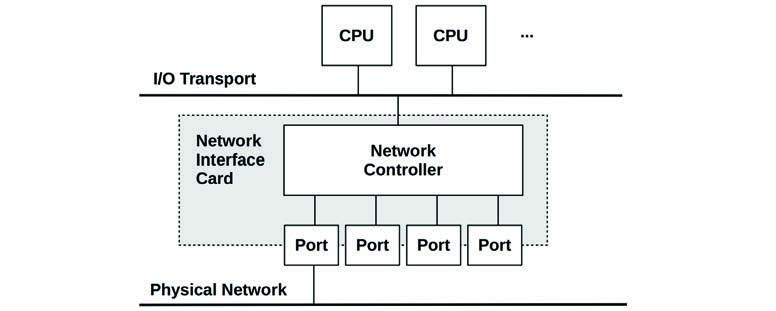
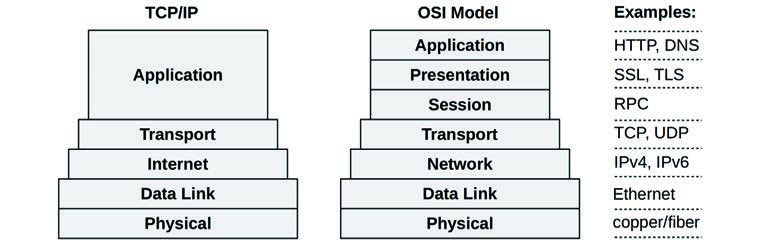
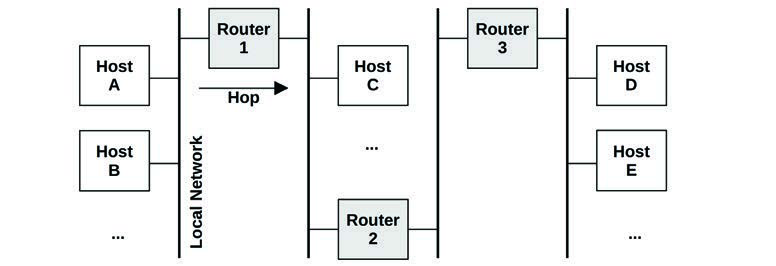
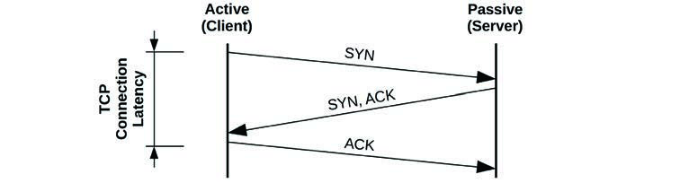
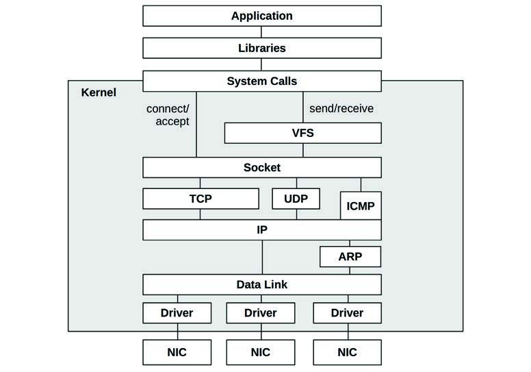
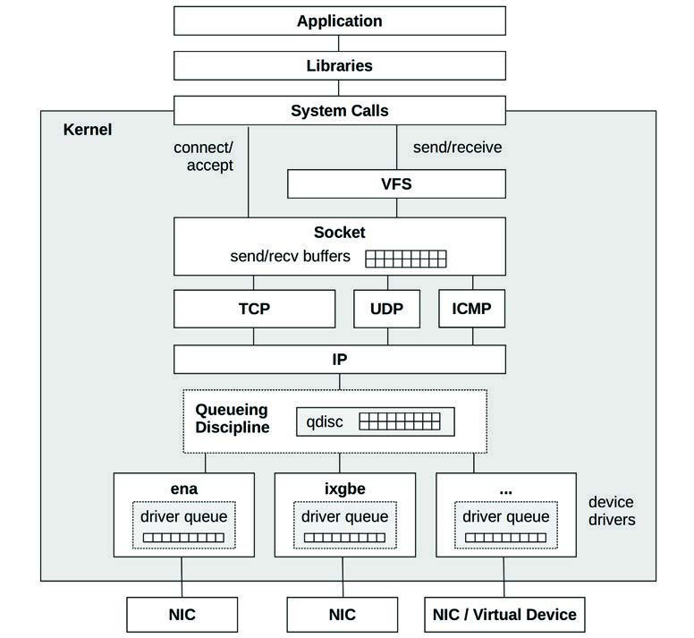
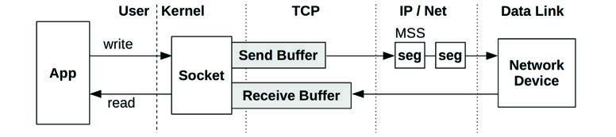
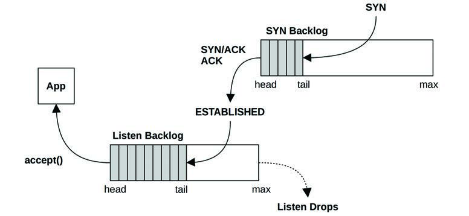
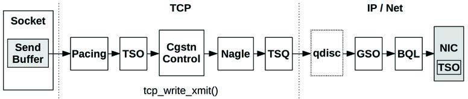
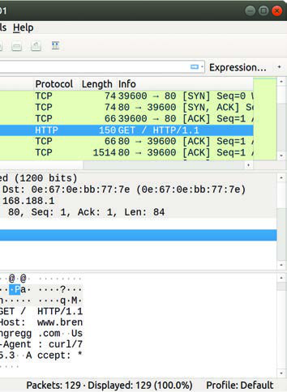

# 10 网络

随着系统变得更加分布式，特别是在云计算环境中，网络在性能中扮演着越来越重要的角色。网络性能中的常见任务包括提高网络延迟和吞吐量，以及消除可能由数据包丢失或延迟引起的延迟离群值。

网络分析跨越硬件和软件。硬件是物理网络，包括网络接口卡（NIC）、交换机、路由器和网关（这些通常也包含软件）。软件是内核网络栈，包括网络设备驱动程序、数据包队列和数据包调度器，以及网络协议的实现。低级协议通常是内核软件（IP、TCP、UDP 等），而高级协议通常是库或应用软件（如 HTTP）。

由于存在拥塞的可能性及其固有的复杂性，网络常常成为性能不佳的替罪羊（归咎于未知）。本章将展示如何弄清楚实际发生了什么，这可能会为网络“平反”，以便分析可以继续进行。

本章的学习目标是：
*   理解网络模型和概念。
*   理解网络延迟的不同衡量方法。
*   掌握常见网络协议的基础知识。
*   熟悉网络硬件内部结构。
*   熟悉从套接字（socket）到设备的内核路径。
*   遵循不同的网络分析方法论。
*   表征系统级和每个进程的网络 I/O。
*   识别由 TCP 重传引起的问题。
*   使用追踪工具调查网络内部情况。
*   了解网络可调参数。

本章由六部分组成，前三部分为网络分析提供基础，后三部分展示其在基于 Linux 的系统中的实际应用：
*   **背景**：介绍网络相关的术语、模型和关键网络性能概念。
*   **架构**：提供物理网络组件和网络栈的通用描述。
*   **方法论**：描述性能分析方法论，包括观测和实验。
*   **可观测性工具**：展示基于 Linux 的系统的网络性能可观测性工具。
*   **实验**：总结网络基准测试和实验工具。
*   **调优**：描述示例可调参数。

本章假定读者已具备网络基础知识，如 TCP 和 IP 的作用。

## 10.1 术语 (Terminology)

供参考，本章使用的网络相关术语包括：
*   **接口 (Interface)**：术语“接口端口”指物理网络连接器。术语“接口”或“链路 (link)”指操作系统所看到和配置的网络接口端口的逻辑实例。（并非所有操作系统接口都由硬件支持：有些是虚拟的。）
*   **数据包 (Packet)**：术语“数据包”指分组交换网络中的消息，如 IP 数据包。
*   **帧 (Frame)**：物理网络层级的消息，例如以太网帧。
*   **套接字 (Socket)**：源自 BSD 的网络端点 API。
*   **带宽 (Bandwidth)**：该网络类型的最大数据传输速率，通常以比特每秒（bits per second）衡量。“100 GbE”是带宽为 100 Gbits/s 的以太网。每个方向可能都有带宽限制，因此 100 GbE 可能能够并行进行 100 Gbits/s 的发送和 100 Gbits/s 的接收（总吞吐量为 200 Gbit/s）。
*   **吞吐量 (Throughput)**：网络端点之间当前的实际数据传输速率，以比特每秒或字节每秒衡量。
*   **延迟 (Latency)**：网络延迟可以指消息在端点之间进行一次往返所需的时间，或者建立连接所需的时间（例如 TCP 握手），不包括随后的数据传输时间。

## 10.2 模型 (Models)

以下简单模型说明了网络和网络性能的一些基本原理。10.4 节“架构”将深入探讨，包括特定实现的细节。

### 10.2.1 网络接口 (Network Interface)

网络接口是网络连接的操作系统端点；它是系统管理员配置和管理的抽象。


**图 10.1 网络接口**

图 10.1 展示了一个网络接口。作为配置的一部分，网络接口被映射到物理网络端口。端口连接到网络，通常具有独立的发送和接收通道。

### 10.2.2 控制器 (Controller)

网络接口卡（NIC）为系统提供一个或多个网络端口，并容纳一个网络控制器：一个用于在端口和系统 I/O 传输之间传输数据包的微处理器。图 10.2 展示了一个具有四个端口的示例控制器，显示了涉及的物理组件。


**图 10.2 网络控制器**

控制器通常作为独立的扩展卡提供，或内置在系统板上。（其他选项包括通过 USB 接口。）

### 10.2.3 协议栈 (Protocol Stack)

网络是通过协议栈完成的，协议栈的每一层都有特定的用途。图 10.3 展示了两种协议栈模型及其示例协议。


**图 10.3 网络协议栈**

底层绘制得较宽，以指示协议封装。发送的消息从应用程序向下移动到物理网络。接收的消息则向上移动。

请注意，以太网标准还描述了物理层，以及如何使用铜线或光纤。

可能还会有其他层，例如，如果使用了网际协议安全（IPsec）或 Linux WireGuard，它们位于网际层之上，以为 IP 端点之间提供安全性。此外，如果使用了隧道（例如虚拟可扩展局域网 (VXLAN)），则一个协议栈可能被封装在另一个协议栈中。

虽然 TCP/IP 栈已成为标准，但我认为简要考虑 OSI 模型也是有用的，因为它展示了应用程序内部的协议层。[^1] “层 (layer)”术语源自 OSI，其中第 3 层 (Layer 3) 指网络协议。

不同层的消息也使用不同的术语。使用 OSI 模型：在传输层，消息是段 (segment) 或数据报 (datagram)；在网络层，消息是数据包 (packet)；在数据链路层，消息是帧 (frame)。

## 10.3 概念 (Concepts)

以下是网络和网络性能中一些重要概念的选择。

### 10.3.1 网络与路由 (Networks and Routing)

网络是一组连接的主机，通过网络协议地址相关联。拥有多个网络——而不是一个巨大的全球性网络——是出于多种原因的考虑，特别是可扩展性。一些网络消息会广播给所有相邻的主机。通过创建较小的子网络，这类广播消息可以被隔离在局部，从而在规模扩大时不会产生洪泛问题。这也是将常规消息的传输隔离在源和目标之间的网络的基础，从而更有效地使用网络基础设施。

路由管理这些跨越网络的消息（称为数据包）的交付。路由的作用如图 10.4 所示。


**图 10.4 通过路由器连接的网络**

从主机 A 的角度来看，localhost（本地主机）就是主机 A 本身。图中所示的所有其他主机都是远程主机。

主机 A 可以通过本地网络（通常由网络交换机驱动，见 10.4 节“架构”）连接到主机 B。主机 A 可以通过路由器 1 连接到主机 C，并通过路由器 1、2 和 3 连接到主机 D。由于路由器等网络组件是共享的，来自其他流量的争用（例如主机 C 到主机 E）会损害性能。

主机对之间的连接涉及单播（unicast）传输。多播（multicast）传输允许发送者同时向多个目的地传输，这可能跨越多个网络。这必须得到路由器配置的支持以允许交付。在公有云环境中，它可能会被阻断。

除了路由器外，典型的网络还会使用防火墙来提高安全性，阻断主机之间不需要的连接。

路由数据包所需的地址信息包含在 IP 报头中。

### 10.3.2 协议 (Protocols)

网络协议标准（如 IP、TCP 和 UDP）是系统和设备之间通信的必要条件。通信通过传输称为数据包的可路由消息来执行，通常是通过对有效载荷数据进行封装。

网络协议具有不同的性能特征，这些特征源于原始协议设计、扩展或软件/硬件的特殊处理。例如，IP 协议的不同版本 IPv4 和 IPv6 可能由不同的内核代码路径处理，并表现出不同的性能特征。其他协议通过设计表现出不同的性能，并在适合工作负载时被选用：示例包括流控制传输协议（SCTP）、多路径 TCP（MPTCP）和 QUIC。

通常，还有系统可调参数可以影响协议性能，通过更改缓冲区大小、算法和各种定时器等设置。具体协议的这些差异在后面的章节中描述。

协议通常通过使用封装来传输数据。

### 10.3.3 封装 (Encapsulation)

封装在有效载荷的开头（报头 header）、结尾（报尾 footer）或两者都添加元数据。这不会改变有效载荷数据，尽管它确实会略微增加消息的总大小，这会产生一些传输开销。

图 10.5 显示了带有以太网的 TCP/IP 栈的封装示例。


**图 10.5 网络协议封装**

E.H. 是以太网报头，E.F. 是可选的以太网报尾。

### 10.3.4 数据包大小 (Packet Size)

数据包及其有效载荷的大小会影响性能，较大的尺寸可以提高吞吐量并减少数据包开销。对于 TCP/IP 和以太网，数据包的大小可以在 54 到 9,054 字节之间，包括 54 字节（或更多，取决于选项或版本）的协议报头。

数据包大小通常受网络接口最大传输单元（MTU）大小的限制，对于许多以太网，MTU 配置为 1,500 字节。1500 MTU 大小源于早期版本的以太网，以及平衡诸如 NIC 缓冲区内存成本和传输延迟等因素的需要 [Nosachev 20]。主机竞争使用共享介质（同轴电缆或以太网集线器），较大的尺寸增加了主机等待轮到自己的延迟。

以太网现在支持高达约 9,000 字节的更大数据包（帧），称为巨型帧（jumbo frames）。这些可以通过减少所需的数据包数量来提高网络吞吐量性能以及数据传输的延迟。

有两个组件的汇合干扰了巨型帧的普及：旧的网络硬件和配置错误的防火墙。不支持巨型帧的旧硬件要么使用 IP 协议对数据包进行分片（导致数据包重组的性能成本），要么响应 ICMP“无法分片”错误，让发送者知道减小数据包大小。现在配置错误的防火墙开始发挥作用：过去曾发生过基于 ICMP 的攻击（包括“死亡之之 ping”），一些防火墙管理员对此的反应是阻止所有 ICMP。这阻止了有用的“无法分片”消息到达发送者，并导致网络数据包在大小超过 1,500 后被静默丢弃。如果接收到 ICMP 消息并发生了分片，还存在分片数据包被不支持它们的设备丢弃的风险。为了避免这些问题，许多系统坚持使用 1,500 MTU 默认值。

通过网络接口卡功能，包括 TCP 卸载（TCP offload）和大型段卸载（large segment offload），1,500 MTU 帧的性能得到了提高。这些功能将较大的缓冲区发送到网卡，网卡随后可以使用专用且优化的硬件将其拆分为较小的帧。这在某种程度上缩小了 1,500 和 9,000 MTU 网络性能之间的差距。

### 10.3.5 延迟 (Latency)

延迟是网络性能的一个重要指标，可以通过不同的方式衡量，包括名称解析延迟、ping 延迟、连接延迟、首字节延迟、往返时间以及连接寿命。这些衡量方式是以客户端连接到服务器为例进行描述的。

#### 名称解析延迟 (Name Resolution Latency)

在建立与远程主机的连接时，主机名通常被解析为 IP 地址，例如通过 DNS 解析。此操作所需的时间可以单独衡量为名称解析延迟。这种延迟的最坏情况涉及名称解析超时，可能需要几十秒。

操作系统通常提供名称解析服务，该服务提供缓存，以便随后的 DNS 查找可以快速从缓存中解析。有时应用程序只使用 IP 地址而不使用名称，因此完全避免了 DNS 延迟。

#### Ping 延迟 (Ping Latency)

这是 ICMP 回显请求到回显响应的时间，由 `ping(1)` 命令衡量。该时间用于衡量主机之间的网络延迟，包括中间的跳数（hops），并被衡量为网络请求进行一次往返所需的时间。它被普遍使用是因为它简单且通常随时可用：许多操作系统默认会响应 ping。它可能无法准确反映应用程序请求的往返时间，因为 ICMP 可能会被路由器以不同的优先级处理。

示例 ping 延迟见表 10.1。

**表 10.1 示例 ping 延迟**

| 发起地 | 目的地 | 路径 | 延迟 | 等效比例 |
| :--- | :--- | :--- | :--- | :--- |
| 本地主机 | 本地主机 | 内核 | 0.05 ms | 1 秒 |
| 主机 | 主机（同子网） | 10 GbE | 0.2 ms | 4 秒 |
| 主机 | 主机（同子网） | 1 GbE | 0.6 ms | 12 秒 |
| 主机 | 主机（同子网） | Wi-Fi | 3 ms | 1 分钟 |
| 旧金山 | 纽约 | 互联网 | 40 ms | 13 分钟 |
| 旧金山 | 英国 | 互联网 | 81 ms | 27 分钟 |
| 旧金山 | 澳大利亚 | 互联网 | 183 ms | 1 小时 |

为了更好地说明涉及的数量级，“等效比例”列显示了基于假设的本地主机 ping 延迟为一秒的比较。

#### 连接延迟 (Connection Latency)

连接延迟是建立网络连接所需的时间，发生在任何数据传输之前。对于 TCP 连接延迟，这就是 TCP 握手时间。从客户端衡量，它是从发送 SYN 到接收到相应 SYN-ACK 的时间。连接延迟可能更准确地称为“连接建立延迟”，以清楚地将其与连接寿命区分开。

连接延迟类似于 ping 延迟，尽管它行使了更多的内核代码来建立连接，并包括重传任何丢失数据包的时间。特别是 TCP SYN 数据包，如果服务器的积压队列（backlog）已满，它可能会被服务器丢弃，导致客户端发送基于定时器的 SYN 重传。这发生在 TCP 握手期间，因此连接延迟可能包括重传延迟，增加一秒或更长时间。

连接延迟之后是首字节延迟。

#### 首字节延迟 (First-Byte Latency)

也称为首字节时间（TTFB），首字节延迟是从连接建立到接收到第一个字节数据的时间。这包括远程主机接受连接、调度服务连接的线程以及该线程执行并发送第一个字节的时间。

虽然 ping 和连接延迟衡量的是网络产生的延迟，但首字节延迟包含了目标服务器的思考时间（think time）。如果服务器过载并需要时间处理请求（例如 TCP 积压队列）和调度服务器（CPU 调度器延迟），则这可能包含延迟。

#### 往返时间 (Round-Trip Time)

往返时间（RTT）描述了网络请求在端点之间进行一次往返所需的时间。这包括信号传播时间和每个网络跳数的处理时间。其目的是确定网络的延迟，因此理想情况下 RTT 由请求和回复数据包在网络上花费的时间主导（而不是远程主机服务请求所花费的时间）。通常研究 ICMP 回显请求的 RTT，因为远程主机的处理时间极短。

#### 连接寿命 (Connection Life Span)

连接寿命是从网络连接建立到关闭的时间。一些协议使用保持活跃（keep-alive）策略，延长连接的持续时间，以便未来的操作可以使用现有的连接，并避免连接建立（以及 TLS 建立）的开销和延迟。

有关更多网络延迟测量，请参见 10.5.4 节“延迟分析”，该节描述了如何使用它们来诊断网络性能。

### 10.3.6 缓冲 (Buffering)

尽管可能会遇到各种网络延迟，但通过在发送端和接收端使用缓冲，网络吞吐量可以维持在高水平。较大的缓冲区可以通过在阻塞并等待确认之前继续发送数据，来减轻较高往返时间的影响。

TCP 使用缓冲以及滑动发送窗口来提高吞吐量。网络套接字也有缓冲区，应用程序也可能采用自己的缓冲区，以便在发送前聚合数据。

外部网络组件（如交换机和路由器）也可以执行缓冲，以努力提高其自身的吞吐量。不幸的是，在这些组件上使用大缓冲区可能会导致缓冲膨胀（bufferbloat），即数据包在队列中停留很长时间。这会导致主机上的 TCP 拥塞避免，从而抑制性能。Linux 3.x 内核中增加了解决此问题的特性（包括字节队列限制、CoDel 队列规则 [Nichols 12] 和 TCP 小队列）。还有一个专门讨论该问题的网站 [Bufferbloat 20]。

缓冲（或大缓冲）功能可能最好由端点——主机——而不是中间网络节点提供，这遵循了一个称为端到端论证（end-to-end arguments）的原则 [Saltzer 84]。

### 10.3.7 连接积压 (Connection Backlog)

另一种类型的缓冲是针对初始连接请求的。TCP 实现了积压队列（backlog），SYN 请求在被用户态进程接受之前可以在内核中排队。当 TCP 连接请求过多，进程无法及时接受时，积压队列达到极限，SYN 数据包将被丢弃，随后由客户端重传。这些数据包的重传会导致客户端连接时间产生延迟。该限制是可调的：它是 `listen(2)` 系统调用的一个参数，内核也可能提供系统级的限制。

积压队列丢弃和 SYN 重传是主机过载的指标。

### 10.3.8 接口协商 (Interface Negotiation)

网络接口可能以不同的模式运行，这些模式由连接的收发器之间自动协商。一些示例包括：
*   **带宽 (Bandwidth)**：例如，10, 100, 1,000, 10,000, 40,000, 100,000 Mbits/s
*   **双工 (Duplex)**：半双工或全双工

这些示例来自以太网，以太网倾向于为带宽限制使用圆整的以十为基数的数字。其他物理层协议（如 SONET）具有一组不同的可能带宽。

网络接口通常根据其最高带宽和协议来描述，例如 1 Gbit/s 以太网 (1 GbE)。然而，如果有需要，该接口可能会自动协商到较低的速度。如果另一个端点无法运行得更快，或者为了适应连接介质的物理问题（接线不良），就会发生这种情况。

全双工模式允许双向同时传输，具有独立的发送和接收路径，每个路径都可以以全带宽运行。半双工模式一次只允许一个方向。

### 10.3.9 拥塞避免 (Congestion Avoidance)

网络是共享资源，当流量负载很高时可能会变得拥塞。这会导致性能问题：例如，路由器或交换机可能会丢弃数据包，导致引起延迟的 TCP 重传。主机在接收高数据包速率时也可能不堪重负，并且它们自己也可能会丢弃数据包。

有许多机制可以避免这些问题；应该研究这些机制，并在必要时进行调优，以提高负载下的可扩展性。不同协议的示例包括：
*   **以太网**：不堪重负的主机可能会向传输者发送暂停帧（pause frames），请求其暂停传输（IEEE 802.3x）。还有针对每个类别的优先级类别和优先级暂停帧。
*   **IP**：包含一个显式拥塞通知（ECN）字段。
*   **TCP**：包含一个拥塞窗口，并且可能会使用各种拥塞控制算法。

后面的章节将更详细地描述 IP ECN 和 TCP 拥塞控制算法。

### 10.3.10 利用率 (Utilization)

网络接口利用率可以计算为当前吞吐量除以最大带宽。鉴于由于自动协商导致的带宽和双工模式多变，计算利用率并不像听起来那么简单。

对于全双工，利用率适用于每个方向，并衡量为该方向的当前吞吐量除以当前协商的带宽。通常只有一个方向最重要，因为主机通常是不对称的：服务器是发送密集型的，客户端是接收密集型的。

一旦一个网络接口方向达到 100% 利用率，它就变成了瓶颈，限制了性能。

一些性能工具仅以数据包为单位报告活动，而不是字节。由于数据包大小差异很大（如前所述），无法将数据包计数与字节计数联系起来，以计算吞吐量或（基于吞吐量的）利用率。

### 10.3.11 本地连接 (Local Connections)

网络连接可能发生在同一系统上的两个应用程序之间。这些是 localhost 连接，并使用虚拟网络接口：回环（loopback）。

分布式应用程序环境通常被拆分为通过网络通信的逻辑部分。这些可以包括 Web 服务器、数据库服务器、缓存服务器、代理服务器和应用服务器。如果它们在同一台主机上运行，它们的连接是发往 localhost 的。

通过 IP 连接到 localhost 是进程间通信（IPC）的 IP 套接字技术。另一种技术是 Unix 域套接字（UDS），它在文件系统上创建一个文件用于通信。使用 UDS 性能可能会更好，因为可以绕过内核 TCP/IP 栈，跳过内核代码和协议包封装的开销。

对于 TCP/IP 套接字，内核可能会在握手后检测到 localhost 连接，然后为数据传输采用 TCP/IP 栈捷径，从而提高性能。这被开发为一项 Linux 内核特性，称为 TCP friends，但未被合并 [Corbet 12]。目前在 Linux 上可以使用 BPF 达到此目的，正如 Cilium 软件为了容器网络性能和安全所做的那样 [Cilium 20a]。

## 10.4 架构 (Architecture)

本节介绍网络架构：协议、硬件和软件。这些内容作为性能分析和调优的背景进行了总结，重点关注性能特征。有关更多详情，包括通用网络主题，请参阅网络相关书籍 [Stevens 93][Hassan 03]、RFC 和网络硬件厂商手册。其中一些列在本章末尾。

### 10.4.1 协议 (Protocols)

本节总结了 IP、TCP、UDP 和 QUIC 的性能特性。这些协议在硬件和软件中的实现方式（包括分段卸载、连接队列和缓冲等特性）将在后面的硬件和软件节中描述。

#### IP

互联网协议（IP）版本 4 和 6 包含一个用于设置连接所需性能的字段：IPv4 中的服务类型（Type of Service）字段，以及 IPv6 中的流量类别（Traffic Class）字段。这些字段后来被重新定义为包含差异化服务代码点（DSCP）（RFC 2474）[Nichols 98] 和显式拥塞通知（ECN）字段（RFC 3168）[Ramakrishnan 01]。

DSCP 旨在支持不同的服务级别，每个级别都有不同的特征，包括数据包丢弃概率。示例服务级别包括：电话、广播视频、低延迟数据、高吞吐量数据和低优先级数据。

ECN 是一种机制，允许路径上的服务器、路由器或交换机通过在 IP 报头中设置一位来显式发出拥塞信号，而不是丢弃数据包。接收者会将此信号回显给发送者，发送者随后可以限制传输。这提供了拥塞避免的好处，而不会产生数据包丢失的代价（前提是 ECN 位在整个网络中被正确使用）。

#### TCP

传输控制协议（TCP）是用于创建可靠网络连接的常用互联网标准。TCP 由 RFC 793 [Postel 81] 及其后续补充定义。

在性能方面，即使在延迟较高的网络上，TCP 也可以通过使用缓冲和滑动窗口提供很高的吞吐量。TCP 还采用拥塞控制和由发送者设置的拥塞窗口，以便在不同且多变的网络中保持高速且可靠的传输。拥塞控制避免了发送过多数据包，以免导致拥塞和性能崩溃。

以下是 TCP 性能特性的总结，包括自原始规范以来的补充：
*   **滑动窗口 (Sliding window)**：允许在收到确认之前向网络发送多个数据包（最高达到窗口大小），即使在延迟较高的网络上也能提供高吞吐量。窗口大小由接收者通告，以指示其当时愿意接收多少数据包。
*   **拥塞避免 (Congestion avoidance)**：防止发送过多数据导致饱和，饱和会导致丢包和性能下降。
*   **慢启动 (Slow-start)**：TCP 拥塞控制的一部分，它以一个较小的拥塞窗口开始，然后在一定时间内收到确认（ACK）后增加窗口大小。如果没有收到确认，拥塞窗口会减小。
*   **选择性确认 (SACKs)**：允许 TCP 确认不连续的数据包，减少所需的重传次数。
*   **快速重传 (Fast retransmit)**：TCP 无需等待定时器，可以根据重复确认的到来立即重传丢失的数据包。这些是往返时间的函数，而不是通常慢得多的定时器。
*   **快速恢复 (Fast recovery)**：这通过检测重复确认后的连接重置来执行慢启动，从而恢复 TCP 性能。
*   **TCP 快速打开 (TCP fast open)**：允许客户端在 SYN 数据包中包含数据，以便服务器可以更早开始请求处理，而无需等待 SYN 握手完成 (RFC7413)。这可以使用加密 cookie 来验证客户端。
*   **TCP 时间戳 (TCP timestamps)**：在发送的数据包中包含时间戳，并在 ACK 中返回，以便衡量往返时间 (RFC 1323) [Jacobson 92]。
*   **TCP SYN cookies**：在可能的 SYN 洪泛攻击（积压队列已满）期间向客户端提供加密 cookie，以便合法客户端可以继续连接，而服务器无需为这些连接尝试存储额外数据。

在某些情况下，这些特性是通过添加到协议报头的扩展 TCP 选项实现的。

TCP 性能的重要主题包括三次握手、重复 ACK 检测、拥塞控制算法、Nagle、延迟 ACK、SACK 和 FACK。

##### 三次握手 (Three-Way Handshake)

连接是使用主机之间的三次握手建立的。一个主机被动监听连接；另一个主机主动发起连接。为了澄清术语：被动和主动源自 RFC 793 [Postel 81]；然而，在套接字 API 之后，它们通常分别被称为监听（listen）和连接（connect）。对于客户端/服务器模型，服务器执行 listen，客户端执行 connect。

三次握手如图 10.6 所示。


**图 10.6 TCP 三次握手**

图中指出了客户端的连接延迟，该延迟在发送最终的 ACK 时结束。在那之后，数据传输可以开始。

该图展示了握手的最佳延迟情况。如果数据包丢失，则会由于超时和重传而增加延迟。

三次握手完成后，TCP 会话进入 ESTABLISHED 状态。

##### 状态与定时器 (States and Timers)

TCP 会话根据数据包和套接字事件在 TCP 状态之间切换。状态包括 LISTEN, SYN-SENT, SYN-RECEIVED, ESTABLISHED, FIN-WAIT-1, FIN-WAIT-2, CLOSE-WAIT, CLOSING, LAST-ACK, TIME-WAIT, 和 CLOSED [Postal 80]。性能分析通常关注处于 ESTABLISHED 状态的会话，这些是活跃的连接。这些连接可能正在传输数据，或者处于空闲状态等待下一个事件：数据传输或关闭事件。

已完全关闭的会话进入 TIME_WAIT[^2] 状态，以便延迟的数据包不会与同一端口上的新连接产生误关联。这可能会导致端口耗尽的性能问题，在 10.5.7 节“TCP 分析”中会有解释。

某些状态具有相关的定时器。TIME_WAIT 通常为两分钟（某些内核，如 Windows 内核，允许对其进行调优）。ESTABLISHED 状态也可能有一个“保持活跃 (keep alive)”定时器，设置为较长的持续时间（例如两小时），以触发探测数据包来检查远程主机是否仍然在线。

##### 重复 ACK 检测 (Duplicate ACK Detection)

重复 ACK 检测用于快速重传和快速恢复算法，以快速检测发送的数据包（或其 ACK）是否丢失。其工作原理如下：
1. 发送者发送序列号为 10 的数据包。
2. 接收者回复序列号为 11 的 ACK。
3. 发送者发送 11, 12, 和 13。
4. 数据包 11 丢失。
5. 接收者通过发送针对 11 的 ACK 来回复 12 和 13，因为它仍在等待 11。
6. 发送者收到针对 11 的重复 ACK。

重复 ACK 检测也用于各种拥塞避免算法。

##### 重传 (Retransmits)

TCP 检测并重传丢失数据包的两种常用机制是：
*   **基于定时器的重传 (Timer-based retransmits)**：当经过一段时间而尚未收到数据包确认时发生。这段时间是 TCP 重传超时（RTO），是根据连接往返时间（RTT）动态计算的。在 Linux 上，第一次重传至少为 200 毫秒（TCP_RTO_MIN）[^3]，后续重传会慢得多，遵循倍增超时的指数退避算法。
*   **快速重传 (Fast retransmits)**：当重复 ACK 到来时，TCP 可以假设数据包已丢失并立即重传。

为了进一步提高性能，还开发了其他机制来避免基于定时器的重传。一个问题发生在最后发送的数据包丢失且没有后续数据包触发重复 ACK 检测时（考虑前面的例子中数据包 13 丢失的情况）。这通过尾部丢失探测（Tail Loss Probe, TLP）解决，它在最后一次传输后的短超时后发送一个额外数据包（探测包），以帮助检测丢包 [Dukkipati 13]。

在存在重传的情况下，拥塞控制算法也可能会限制吞吐量。

##### 拥塞控制 (Congestion Controls)

为了在拥塞的网络上维持性能，开发了拥塞控制算法。一些操作系统（包括基于 Linux 的系统）允许将该算法的选择作为系统调优的一部分。这些算法包括：
*   **Reno**：三重重复 ACK 触发：拥塞窗口减半、慢启动阈值减半、快速重传和快速恢复。
*   **Tahoe**：三重重复 ACK 触发：快速重传、慢启动阈值减半、拥塞窗口设置为一个最大段大小（MSS）以及慢启动状态。（与 Reno 一样，Tahoe 最初也是为 4.3BSD 开发的。）
*   **CUBIC**：使用三次方程（因此得名）来缩放窗口，并使用“混合启动”函数退出慢启动。CUBIC 往往比 Reno 更激进，是 Linux 中的默认算法。
*   **BBR**：BBR 不是基于窗口的，而是使用探测阶段建立网络路径特征（RTT 和带宽）的显式模型。BBR 在某些网络路径上可以提供显著更好的性能，但在其他路径上可能会损害性能。BBRv2 目前正在开发中，有望修复 v1 的一些缺陷。
*   **DCTCP**：数据中心 TCP（DataCenter TCP）依赖于配置为在极浅队列占用时发出显式拥塞通知（ECN）标记的交换机，以快速提升到可用带宽（RFC 8257）[Bensley 17]。这使得 DCTCP 不适合在互联网上部署，但在适当配置的可控环境中，它可以显著提高性能。

其他未列出的算法还包括 Vegas, New Reno, 和 Hybla。

拥塞控制算法对网络性能有很大影响。例如，Netflix 云服务使用 BBR，发现它在严重丢包期间可以将吞吐量提高三倍 [Ather 17]。了解这些算法在不同网络条件下的反应是分析 TCP 性能的一项重要活动。

2020 年发布的 Linux 5.6 增加了对在 BPF 中开发新拥塞控制算法的支持 [Corbet 20]。这允许它们由最终用户定义并按需加载。

##### Nagle

该算法 (RFC 896) [Nagle 84] 通过延迟传输以允许更多数据到达并合并，从而减少网络上的小包数量。只有在管道中有数据且已经遇到延迟时，该算法才会延迟数据包。

系统可能会提供一个可调参数或套接字选项来禁用 Nagle，如果它的操作与延迟 ACK 冲突，这可能是必要的（见 10.8.2 节“套接字选项”）。

##### 延迟 ACK (Delayed ACKs)

该算法 (RFC 1122) [Braden 89] 将 ACK 的发送延迟长达 500 毫秒，以便合并多个 ACK。其他 TCP 控制消息也可以合并，从而减少网络上的数据包数量。

与 Nagle 一样，系统可能会提供一个可调参数来禁用此行为。

##### SACK, FACK, 和 RACK

TCP 选择性确认（SACK）算法允许接收者通知发送者它收到了不连续的数据块。如果没有这个算法，丢包最终会导致整个发送窗口被重传，以维持顺序确认方案。这会损害 TCP 性能，大多数支持 SACK 的现代操作系统都会避免这种情况。

SACK 已被转发确认（FACK）扩展，Linux 默认支持 FACK。FACK 追踪额外的状态，并能更好地调节网络中的未完成数据量，从而提高整体性能 [Mathis 96]。

SACK 和 FACK 都被用于改进丢包恢复。一种更新的算法，最近确认（Recent ACKnowledgment, RACK；现在由于集成了 TLP 而被称为 RACK-TLP）使用来自 ACK 的时间信息进行更佳的丢失检测和恢复，而不仅仅依靠 ACK 序列 [Cheng 20]。对于 FreeBSD，Netflix 基于 RACK、TLP 等特性开发了一个新的重构 TCP 栈，名为 RACK [Stewart 18]。

##### 初始窗口 (Initial Window)

初始窗口（IW）是 TCP 发送者在等待来自接收者的确认之前，在连接开始时将传输的数据包数量。对于典型 HTTP 连接等短流，一个足以覆盖所传输数据的 IW 可以极大地减少完成时间，提高性能。然而，较大的 IW 可能会带来拥塞和丢包的风险。当多个流同时启动时，这种情况尤为复杂。

Linux 的默认设置（10 个数据包，即 IW10）在慢速链路上或当大量连接启动时可能过高；其他操作系统默认使用 2 或 4 个数据包（IW2 或 IW4）。

#### UDP

用户数据报协议（UDP）是用于跨网络发送名为数据报的消息的常用互联网标准 (RFC 768) [Postel 80]。在性能方面，UDP 提供：
*   **简单性**：简单且微小的协议报头减少了计算和尺寸方面的开销。
*   **无状态性**：连接和传输的开销较低。
*   **无重传**：重传会为 TCP 连接增加显著延迟。

虽然 UDP 简单且通常性能很高，但它并不旨在提供可靠性，数据可能会丢失或接收顺序错乱。这使得它不适合许多类型的连接。UDP 也没有拥塞避免机制，因此可能会导致网络拥塞。

某些服务（包括 NFS 的某些版本）可以根据需要配置为在 TCP 或 UDP 上运行。其他执行广播或多播数据的服务可能只能使用 UDP。

UDP 的一个主要用途一直是 DNS。由于 UDP 的简单性、缺乏拥塞控制以及互联网支持（通常不会被防火墙阻拦），现在出现了基于 UDP 构建的新协议，它们实现了自己的拥塞控制和其他特性。一个例子是 QUIC。

#### QUIC 和 HTTP/3

QUIC 是由 Google 的 Jim Roskind 设计的一种网络协议，作为 TCP 的更高性能、更低延迟的替代方案，针对 HTTP 和 TLS 进行了优化 [Roskind 12]。QUIC 构建在 UDP 之上，并在其基础上提供了多项特性，包括：
*   在同一“连接”之上多路复用多个由应用程序定义的流的能力。
*   一种类似 TCP 的可靠顺序流传输，可以选择性地为各个子流关闭该功能。
*   当客户端更改其网络地址时（基于连接 ID 的加密身份验证），可以恢复连接。
*   对有效载荷数据（包括 QUIC 报头）进行全加密。
*   0-RTT 连接握手，包括加密（针对之前通信过的对等体）。

QUIC 正被 Chrome 浏览器大量使用。

虽然 QUIC 最初由 Google 开发，但互联网工程任务组（IETF）正在对 QUIC 传输协议本身以及在 QUIC 上使用 HTTP 的特定配置（后者被命名为 HTTP/3）进行标准化。

### 10.4.2 硬件 (Hardware)

网络硬件包括接口、控制器、交换机、路由器和防火墙。了解它们的操作是有用的，即使它们是由其他员工（网络管理员）管理的。

#### 接口 (Interfaces)

物理网络接口在连接的网络上发送和接收消息（称为帧）。它们管理涉及的电气、光学或无线信号，包括传输错误的处理。

接口类型基于第 2 层标准，每种标准提供最大带宽。高带宽接口提供较低的数据传输延迟，但成本更高。在设计新服务器时，关键决定通常是如何平衡服务器的价格与所需的网络性能。

对于以太网，选择包括铜线或光纤，最高速度包括 1 Gbit/s (1 GbE), 10 GbE, 40 GbE, 100 GbE, 200 GbE, 和 400 GbE。许多厂商制造以太网接口控制器，尽管你的操作系统可能不支持其中一些控制器的驱动程序。

接口利用率可以检查为当前吞吐量除以当前协商的带宽。大多数接口具有独立的发送和接收通道，当运行在全双工模式时，必须分别研究每个通道的利用率。

无线接口可能由于信号强度差和干扰而遭受性能问题。[^4]

#### 控制器 (Controllers)

物理网络接口通过控制器提供给系统，控制器要么内置在系统板上，要么通过扩展卡提供。

控制器由微处理器驱动，并通过系统 I/O 传输（例如 PCI）连接到系统。其中任何一个都可能成为网络吞吐量或 IOPS 的限制因素。

例如，一个双端口 10 GbE 网络接口卡连接到一个四通道 PCI Express (PCIe) Gen 2 插槽。该卡的最大发送或接收带宽为 2 × 10 GbE = 20 Gbits/s，双向为 40 Gbit/s。而插槽的最大带宽为 4 × 4 Gbits/s = 16 Gbits/s。因此，两个端口上的网络吞吐量都将受到 PCIe Gen 2 带宽的限制，并且不可能同时以线速驱动它们（我从实践中了解这一点！）。

#### 交换机与路由器 (Switches and Routers)

交换机在任何两个连接的主机之间提供专用通信路径，允许在主机对之间进行多次传输而互不干扰。该技术取代了集线器（在此之前是共享物理总线：常用的粗以太网同轴电缆），后者将所有数据包共享给所有主机。这种共享在主机同时传输时会导致争用，接口通过“载波监听多路访问/冲突检测”（CSMA/CD）算法将其识别为冲突。该算法会指数级回退并重传直到成功，在负载下会产生性能问题。随着交换机的使用，这已成为过去，但一些可观测性工具仍有冲突计数器——尽管这些通常只因错误（协商或接线不良）而发生。

路由器在网络之间传递数据包，并使用网络协议和路由表来确定高效的交付路径。在两个城市之间交付一个数据包可能涉及十个或更多路由器以及其他网络硬件。路由器和路由通常配置为动态更新，以便网络能够自动响应网络和路由器故障，并平衡负载。这意味着在任何给定时间，没有人能确定数据包实际走的是哪条路径。由于存在多条可能路径，数据包也有可能按乱序交付，这会导致 TCP 性能问题。

网络这种神秘感常常被指责为性能不佳的原因：也许来自其他无关主机的沉重网络流量正在使源和目的地之间的某个路由器饱和？因此，网络管理团队经常被要求为他们的基础设施“平反”。他们可以使用先进的实时监控工具来检查涉及的所有路由器和其他网络组件。

路由器和交换机都包含缓冲区和微处理器，它们本身在负载下也可能成为性能瓶颈。举个极端的例子，我曾发现一个早期的 10 GbE 交换机由于其 CPU 能力有限，所有端口的总驱动能力不超过 11 Gbits/s。

请注意，交换机和路由器也通常是发生速率转换的地方（从一种带宽转换到另一种带宽，例如 10 Gbps 链路转换为 1 Gbps 链路）。当发生这种情况时，需要一些缓冲来避免过度丢包，但许多交换机和路由器过度缓冲（见 10.3.6 节“缓冲”中的缓冲膨胀问题），导致高延迟。更好的队列管理算法可以帮助消除这个问题，但并非所有网络设备厂商都支持它们。在源端进行步调控制（pacing）也可以通过使流量不那么突发来缓解速率转换带来的问题。

#### 防火墙 (Firewalls)

防火墙通常用于根据配置的规则集仅允许授权通信，从而提高网络的安全性。它们可能以物理网络设备和内核软件的形式存在。

防火墙可能成为性能瓶颈，尤其是在配置为有状态（stateful）时。有状态规则会为每个看到的连接存储元数据，防火墙在处理大量连接时可能会经历过度的内存负载。这可能由于试图用连接淹没目标的拒绝服务（DoS）攻击引起。它也可能发生在高频率的出站连接中，因为它们可能需要类似的连接跟踪。

由于防火墙是定制的硬件或软件，分析它们可用的工具取决于具体的防火墙产品。请参阅它们各自的文档。

由于其性能、可编程性、易用性和最终成本，使用扩展 BPF 在通用硬件上实现防火墙的做法正在增长。采用 BPF 防火墙和 DDoS 解决方案的公司包括 Facebook [Deepak 18], Cloudflare [Majkowski 18], 和 Cilium [Cilium 20a]。

防火墙在性能测试期间也可能是一个麻烦：在调试问题时执行带宽实验可能涉及修改防火墙规则以允许连接（并需要与安全团队协调）。

#### 其他 (Others)

你的环境可能包括其他物理网络设备，如集线器、网桥、中继器和调制解调器。其中任何一个都可能成为性能瓶颈和丢包的来源。

### 10.4.3 软件 (Software)

网络软件包括网络栈、TCP 和设备驱动程序。本节讨论与性能相关的主题。

#### 网络栈 (Network Stack)

涉及的组件和层级取决于操作系统类型、版本、协议和使用的接口。图 10.7 描绘了一个通用模型，显示了软件组件。


**图 10.7 通用网络栈**

在现代内核上，栈是多线程的，入站数据包可以由多个 CPU 处理。

#### Linux

Linux 网络栈如图 10.8 所示，包括套接字发送/接收缓冲区和数据包队列的位置。


**图 10.8 Linux 网络栈**

在 Linux 系统上，网络栈是一个核心内核组件，设备驱动程序是额外的模块。数据包作为 `struct sk_buff`（套接字缓冲区）数据类型通过这些内核组件传递。请注意，在 IP 层也可能存在用于数据包重组的队列（图中未画出）。

以下各节讨论与性能相关的 Linux 实现细节：TCP 连接队列、TCP 缓冲、队列规则、网络设备驱动程序、CPU 扩展和内核绕过。TCP 协议在上一节中已有描述。

##### TCP 连接队列 (TCP Connection Queues)

入站连接的突发通过使用积压队列（backlog queues）来处理。存在两个这样的队列：一个是为在 TCP 握手完成期间的不完全连接准备的（也称为 SYN 积压队列），另一个是为等待被应用程序接受（accept）的已建立会话准备的（也称为 listen 积压队列）。这些如图 10.9 所示。

在早期的内核中只使用一个队列，这容易受到 SYN 洪泛攻击。SYN 洪泛是一种 DoS 攻击，涉及从伪造的 IP 地址向监听的 TCP 端口发送大量的 SYN。这会在 TCP 等待完成握手时填满积压队列，从而阻止真实客户端进行连接。

有了两个队列，第一个可以作为潜在伪造连接的暂存区，只有当连接建立后，它们才会被提升到第二个队列。第一个队列可以设置得很长以吸收 SYN 洪泛，并进行优化以仅存储必要的最小元数据。


**图 10.9 TCP 积压队列**

使用 SYN cookies 可以绕过第一个队列，因为它们证明客户端已经过授权。

这两个队列的长度可以独立调优（见 10.8 节“调优”）。第二个队列也可以由应用程序设置为 `listen(2)` 的 `backlog` 参数。

##### TCP 缓冲 (TCP Buffering)

通过使用与套接字关联的发送和接收缓冲区，可以提高数据吞吐量。这些如图 10.10 所示。


**图 10.10 TCP 发送和接收缓冲区**

发送和接收缓冲区的大小都是可调的。较大的尺寸可以提高吞吐量性能，但代价是每个连接会花费更多的物理内存。如果预期服务器执行更多的发送或接收，一个缓冲区可以设置为比另一个更大。Linux 内核还会根据连接活动动态增加这些缓冲区的大小，并允许对其最小、默认和最大大小进行调优。

##### 分段卸载：GSO 和 TSO (Segmentation Offload: GSO and TSO)

网络设备和网络接受的数据包大小上限为最大段大小（MSS），可能只有 1500 字节。为了避免发送许多小数据包带来的网络栈开销，Linux 使用通用分段卸载（GSO）发送大小高达 64 KB 的数据包（“超级数据包”），这些数据包在交付给网络设备之前会被拆分为 MSS 大小的段。如果 NIC 和驱动程序支持 TCP 分段卸载（TSO），GSO 就会将拆分工作交给设备，从而提高网络栈的吞吐量。[^5] 此外还有通用接收卸载（GRO），它是 GSO 的补充 [Linux 20i]。[^6] GRO 和 GSO 是在内核软件中实现的，而 TSO 是由 NIC 硬件实现的。

##### 队列规则 (Queueing Discipline)

这是一个可选层，用于管理流量分类（tc）、调度、操作、过滤和网络数据包的整形。Linux 提供了许多队列规则算法（qdiscs），可以使用 `tc(8)` 命令进行配置。由于每个算法都有一个手册页，可以使用 `man(1)` 命令列出它们：

```bash
# man -k tc-
tc-actions (8)       - independently defined actions in tc
tc-basic (8)         - basic traffic control filter
tc-bfifo (8)         - Packet limited First In, First Out queue
tc-bpf (8)           - BPF programmable classifier and actions for ingress/egress queueing disciplines
tc-cbq (8)           - Class Based Queueing
tc-cbq-details (8)   - Class Based Queueing
tc-cbs (8)           - Credit Based Shaper (CBS) Qdisc
tc-cgroup (8)        - control group based traffic control filter
tc-choke (8)         - choose and keep scheduler
tc-codel (8)         - Controlled-Delay Active Queue Management algorithm
tc-connmark (8)      - netfilter connmark retriever action
tc-csum (8)          - checksum update action
tc-drr (8)           - deficit round robin scheduler
tc-ematch (8)        - extended matches for use with "basic" or "flow" filters
tc-flow (8)          - flow based traffic control filter
tc-flower (8)        - flow based traffic control filter
tc-fq (8)            - Fair Queue traffic policing
tc-fq_codel (8)      - Fair Queuing (FQ) with Controlled Delay (CoDel)
[...]
```

Linux 内核将 `pfifo_fast` 设置为默认 qdisc，而 systemd 则不那么保守，将其设置为 `fq_codel` 以减少潜在的缓冲膨胀，代价是 qdisc 层稍微增加了复杂性。

BPF 可以通过 `BPF_PROG_TYPE_SCHED_CLS` 和 `BPF_PROG_TYPE_SCHED_ACT` 类型的程序增强此层的功能。这些 BPF 程序可以附加到内核入口（ingress）和出口（egress）点，用于数据包过滤、篡改和转发，如负载均衡器和防火墙所使用的那样。

##### 网络设备驱动程序 (Network Device Drivers)

网络设备驱动程序通常有一个额外的缓冲区——环形缓冲区（ring buffer），用于在内核内存和 NIC 之间发送和接收数据包。这在图 10.8 中被描绘为驱动程序队列（driver queue）。

随着高速网络的普及，一种变得更加普遍的性能特性是使用中断合并（interrupt coalescing）模式。不是为每个到达的数据包都中断内核，而是仅在定时器（轮询）或达到一定数量的数据包时才发送中断。这降低了内核与 NIC 通信的频率，允许缓冲更大的传输，从而产生更高的吞吐量，尽管在延迟方面会有一些代价。

Linux 内核使用了一种新的 API (NAPI) 框架，该框架采用了一种中断缓解技术：对于低数据包速率，使用中断（通过 softirq 调度处理）；对于高数据包速率，禁用中断，并使用轮询允许合并 [Corbet 03][Corbet 06b]。这根据工作负载提供了低延迟或高吞吐量。NAPI 的其他特性包括：
*   **数据包限制 (Packet throttling)**：允许在网络适配器中早期丢弃数据包，以防止系统被数据包风暴淹没。
*   **接口调度 (Interface scheduling)**：使用配额（quota）限制在一个轮询周期内处理的缓冲区，以确保繁忙网络接口之间的公平性。
*   **支持 SO_BUSY_POLL 套接字选项**：用户级应用程序可以通过请求在套接字上进行忙等待（busy wait，在 CPU 上旋转直到事件发生）来减少网络接收延迟 [Dumazet 17a]。

合并对于提高虚拟机网络性能尤为重要，AWS EC2 使用的 `ena` 网络驱动程序就使用了该技术。

##### NIC 发送与接收 (NIC Send and Receive)

对于发送的数据包，NIC 会收到通知，并通常使用直接内存访问（DMA）从内核内存读取数据包（帧）以提高效率。NIC 提供传输描述符（transmit descriptors）用于管理 DMA 数据包；如果 NIC 没有空闲描述符，网络栈将暂停传输以让 NIC 赶上。[^7]

对于接收的数据包，NIC 可以使用 DMA 将数据包放入内核环形缓冲区内存中，然后使用中断通知内核（该中断可能会被忽略以允许合并）。中断触发 softirq 将数据包交付给网络栈进行进一步处理。

##### CPU 扩展 (CPU Scaling)

通过让多个 CPU 处理数据包和 TCP/IP 栈，可以实现高数据包速率。Linux 支持各种多 CPU 数据包处理方法（见 `Documentation/networking/scaling.txt`）：
*   **RSS: 接收侧扩展 (Receive Side Scaling)**：针对支持多个队列的现代 NIC，可以将数据包哈希到不同的队列，这些队列反过来由不同的 CPU 直接中断处理。这种哈希可能基于 IP 地址和 TCP 端口号，以便来自同一连接的数据包最终由同一个 CPU 处理。[^8]
*   **RPS: 接收数据包引导 (Receive Packet Steering)**：RSS 的软件实现，针对不支持多个队列的 NIC。这涉及一个简短的中断服务程序，将入站数据包映射到一个 CPU 进行处理。可以使用类似的哈希将数据包映射到 CPU，基于数据包报头中的字段。
*   **RFS: 接收流引导 (Receive Flow Steering)**：这类似于 RPS，但具有亲和性，会考虑套接字上次是在哪个 CPU 上处理的，以提高 CPU 缓存命中率和内存局部性。
*   **加速接收流引导 (Accelerated Receive Flow Steering)**：在硬件中实现 RFS，针对支持此功能的 NIC。它涉及使用流信息更新 NIC，以便 NIC 可以确定要中断哪个 CPU。
*   **XPS: 传输数据包引导 (Transmit Packet Steering)**：针对具有多个传输队列的 NIC，这支持多个 CPU 向队列进行传输。

如果没有针对网络数据包的 CPU 负载均衡策略，NIC 可能会只中断一个 CPU，该 CPU 可能达到 100% 的利用率并成为瓶颈。这可能表现为单个 CPU 上的高 softirq CPU 时间（例如使用 Linux `mpstat(1)`：见第 6 章“CPU” 6.6.3 节 “mpstat”）。这在负载均衡器或代理服务器（如 nginx）上尤为常见，因为它们预期的工作负载是高频率的入站数据包。

根据缓存一致性等因素将中断映射到 CPU（如 RFS 所做的那样）可以显著提高网络性能。这也可以由 `irqbalance` 进程完成，该进程将中断请求（IRQ）线路分配给 CPU。

##### 内核绕过 (Kernel Bypass)

图 10.8 显示了通常经过 TCP/IP 栈的路径。应用程序可以使用数据平面开发工具包（DPDK）等技术绕过内核网络栈，以获得更高的数据包速率和性能。这涉及应用程序在用户空间实现自己的网络协议，并通过 DPDK 库和内核用户空间 I/O (UIO) 或虚拟功能 I/O (VFIO) 驱动程序向网络驱动程序进行写入。通过直接访问 NIC 上的内存，可以避免复制数据包数据的开销。

快速数据路径（XDP）技术提供了另一条网络数据包路径：一种使用扩展 BPF 且集成到现有内核栈中而非绕过它的可编程快速路径 [Høiland-Jørgensen 18]。（DPDK 现在也支持 XDP 接收数据包，将部分功能移回了内核 [DPDK 20]。）

采用内核网络栈绕过技术后，传统的工具和指标将无法进行检测，因为它们使用的计数器和追踪事件也被绕过了。这使得性能分析变得更加困难。

除了全栈绕过外，还有一些能力可以避免复制数据的开销：`MSG_ZEROCOPY` `send(2)` 标志，以及通过 `mmap(2)` 进行零拷贝接收 [Linux 20c][Corbet 18b]。

##### 其他优化 (Other Optimizations)

Linux 网络栈中还使用了其他算法来提高性能。图 10.11 展示了 TCP 发送路径中的这些算法（其中许多是从 `tcp_write_xmit()` 内核函数调用的）。


**图 10.11 TCP 发送路径**

其中一些组件和算法在前面已经描述过（套接字发送缓冲区、TSO [^9]、拥塞控制、Nagle 和 qdiscs）；其他的还包括：
*   **步调控制 (Pacing)**：这控制何时发送数据包，分散传输（步调控制）以避免可能损害性能的突发（这可能有助于避免可能导致队列延迟、甚至导致网络交换机丢包的 TCP 微突发。它还可能有助于解决 incast 问题，即许多端点同时向一个端点传输 [Fritchie 12]）。
*   **TCP 小队列 (TCP Small Queues, TSQ)**：这控制（减少）网络栈排队的数量，以避免包括缓冲膨胀在内的问题 [Bufferbloat 20]。
*   **字节队列限制 (Byte Queue Limits, BQL)**：这些算法自动调整驱动程序队列的大小，使其足够大以避免饥饿，但也足够小以减少排队数据包的最大延迟，并避免耗尽 NIC 传输描述符 [Hrubý 12]。它的工作原理是在必要时暂停向驱动程序队列添加数据包，并于 Linux 3.3 中加入 [Siemon 13]。
*   **最早离去时间 (Earliest Departure Time, EDT)**：这使用时间轮（timing wheel）而不是队列来对发送到 NIC 的数据包进行排序。根据策略和速率配置在每个数据包上设置时间戳。这是在 Linux 4.20 中加入的，具有类似 BQL 和 TSQ 的能力 [Jacobson 18]。

这些算法通常结合工作以提高性能。一个 TCP 发送的数据包在到达 NIC 之前，可能会经过拥塞控制、TSO、TSQ、步调控制和队列规则中任何一种的处理 [Cheng 16]。

## 10.5 方法 (Methodology)

本节介绍用于网络分析和调优的方法和练习。表 10.2 总结了这些主题。

**表 10.2 网络性能方法**

| 章节 | 方法 | 类型 |
| :--- | :--- | :--- |
| 10.5.1 | 工具法 | 观测分析 |
| 10.5.2 | USE 方法 | 观测分析 |
| 10.5.3 | 工作负载表征 | 观测分析、容量规划 |
| 10.5.4 | 延迟分析 | 观测分析 |
| 10.5.5 | 性能监控 | 观测分析、容量规划 |
| 10.5.6 | 数据包嗅探 | 观测分析 |
| 10.5.7 | TCP 分析 | 观测分析 |
| 10.5.8 | 静态性能调优 | 观测分析、容量规划 |
| 10.5.9 | 资源控制 | 调优 |
| 10.5.10 | 微基准测试 | 实验分析 |

有关更多策略以及其中许多策略的介绍，请参阅第 2 章“方法”。

这些方法可以单独遵循，也可以结合使用。我的建议是按以下顺序开始使用这些策略：性能监控、USE 方法、静态性能调优和工作负载表征。

10.6 节“可观测性工具”展示了应用这些方法的操作系统工具。

### 10.5.1 工具法 (Tools Method)

工具法是一个迭代现有工具并检查它们提供的关键指标的过程。它可能会忽略工具可见性较差或没有可见性的问题，并且执行起来可能很耗时。

对于网络，工具法可以涉及检查：
*   **nstat/netstat -s**：寻找高频率的重传和乱序数据包。什么构成了“高”重传率取决于客户端：一个面向互联网、拥有不可靠远程客户端的系统，其重传率应高于同一个数据中心内的内部系统。
*   **ip -s link/netstat -i**：检查接口错误计数器，包括 “errors”、“dropped”、“overruns”。
*   **ss -tiepm**：检查重要套接字的限制器标志，看看它们的瓶颈是什么，以及显示套接字健康状况的其他统计信息。
*   **nicstat/ip -s link**：检查发送和接收的字节速率。高吞吐量可能会受到协商的数据链路速度或外部网络节流阀的限制。它还可能导致系统网络用户之间的争用和延迟。
*   **tcplife**：记录 TCP 会话，包括进程详情、持续时间（寿命）和吞吐量统计。
*   **tcptop**：实时观察排名靠前的 TCP 会话。
*   **tcpdump**：虽然这在 CPU 和存储成本方面可能很昂贵，但短时间使用 `tcpdump(8)` 可能有助于你识别异常的网络流量或协议报头。
*   **perf(1)/BCC/bpftrace**：检查应用程序和线路之间选定的数据包，包括检查内核状态。

如果发现问题，请检查可用工具的所有字段以了解更多上下文。有关每个工具的更多信息，请参见 10.6 节“可观测性工具”。其他方法可以识别更多类型的问题。

### 10.5.2 USE 方法 (USE Method)

USE 方法用于快速识别所有组件中的瓶颈和错误。对于每个网络接口，在每个方向上——发送（TX）和接收（RX）——检查：
*   **利用率 (Utilization)**：接口忙于发送或接收帧的时间。
*   **饱和度 (Saturation)**：由于接口被完全利用而导致的额外排队、缓冲或阻塞程度。
*   **错误 (Errors)**：对于接收：校验和错误、帧太短（小于数据链路报头）或太长、冲突（在交换网络中不太可能发生）；对于发送：晚期冲突（接线不良）。

可以先检查错误，因为它们通常检查起来很快且最容易解释。

利用率通常不会由操作系统或监控工具直接提供（`nicstat(1)` 是一个例外）。它可以计算为每个方向（RX, TX）的当前吞吐量除以当前协商的速度。当前吞吐量应测量为网络上的每秒字节数，包括所有协议报头。

对于实施网络带宽限制（资源控制）的环境（如在某些云计环境算中发生的那样），网络利用率可能需要根据施加的限制以及物理限制来测量。

网络接口的饱和度很难测量。一些网络缓冲是正常的，因为应用程序发送数据的速度可以比接口传输数据的速度快得多。它可能被测量为应用程序线程在网络发送上阻塞的时间，该时间应随着饱和度的增加而增加。还要检查是否有其他与接口饱和度更密切相关的内核统计信息，例如 Linux 的 “overruns”。请注意，Linux 使用 BQL 来调节 NIC 队列大小，这有助于避免 NIC 饱和。

TCP 层的重传通常可以作为统计信息随时获得，并且可以是网络饱和的一个指标。然而，它们是在服务器及其客户端之间的整个网络范围内测量的，可能是由任何一跳的问题引起的。

USE 方法也可以应用于网络控制器以及它们与处理器之间的传输。由于这些组件的可观测性工具很少，可能更容易根据网络接口统计信息和拓扑结构来推断指标。例如，如果网络控制器 A 包含端口 A0 和 A1，则网络控制器的吞吐量可以计算为接口吞吐量 A0 + A1 之和。有了已知的最大吞吐量，就可以计算网络控制器的利用率。

### 10.5.3 工作负载表征 (Workload Characterization)

表征施加的负载是在进行容量规划、基准测试和模拟工作负载时的一项重要练习。它还可以通过识别可以消除的不必要工作来带来一些最大的性能收益。

以下是要衡量的最基本特征：
*   **网络接口吞吐量**：RX 和 TX，每秒字节数
*   **网络接口 IOPS**：RX 和 TX，每秒帧数
*   **TCP 连接速率**：主动和被动，每秒连接数

术语“主动（active）”和“被动（passive）”在 10.4.1 节“协议”的“三次握手”标题下有描述。

这些特征会随着时间而变化，因为使用模式在一天中会有所不同。随时间监控在 10.5.5 节“性能监控”中有描述。

这是一个工作负载描述示例，展示了如何将这些属性表达在一起：

> 网络吞吐量随用户而异，执行的写操作 (TX) 多于读操作 (RX)。写操作的峰值速率为 200 Mbytes/s 和 210,000 packets/s，读操作的峰值速率为 10 Mbytes/s 和 70,000 packets/s。入站（被动）TCP 连接速率达到 3,000 connections/s。

除了描述这些系统级的特征外，它们还可以按接口来表达。如果可以观察到吞吐量已达到线速，这允许确定接口瓶颈。如果存在网络带宽限制（资源控制），它们可能会在线速达到之前就限制网络吞吐量。

#### 高级工作负载表征/清单

可以包含额外的细节来表征工作负载。这里列出了一些供考虑的问题，它们也可以作为彻底研究 CPU [^10] 问题时的清单：
*   平均数据包大小是多少？RX, TX?
*   每一层的协议细分是什么？对于传输协议：TCP, UDP (可以包括 QUIC)。
*   哪些 TCP/UDP 端口是活跃的？每秒字节数，每秒连接数？
*   广播和多播的数据包速率是多少？
*   哪些进程正在活跃地使用网络？

接下来的几节将回答其中一些问题。有关此方法的更高层次总结以及要衡量的特征（谁、为什么、什么、如何），请参阅第 2 章“方法”。

### 10.5.4 延迟分析 (Latency Analysis)

可以研究各种时间（延迟）来帮助理解和表达网络性能。一些已在 10.3.5 节“延迟”中介绍过，表 10.3 提供了一个更长的列表。衡量尽可能多的这些延迟，以缩小延迟的真实来源。

**表 10.3 网络延迟**

| 延迟名称 | 描述 |
| :--- | :--- |
| **名称解析延迟** | 主机被解析为 IP 地址的时间，通常通过 DNS 解析——性能问题的常见来源。 |
| **Ping 延迟** | 从 ICMP 回显请求到响应的时间。这衡量了每台主机上网络和内核栈对数据包的处理。 |
| **TCP 连接初始化延迟** | 从发送 SYN 到接收 SYN,ACK 的时间。由于不涉及应用程序，这衡量了每台主机上的网络和内核栈延迟，类似于 ping 延迟，但会有一些额外的 TCP 会话内核处理。TCP 快速打开 (TFO) 可用于减少此延迟。 |
| **TCP 首字节延迟** | 也称为首字节时间 (TTFB) 延迟，这衡量了从建立连接到客户端接收到第一个数据字节的时间。这包括主机的 CPU 调度和应用程序思考时间，使其更多地衡量应用程序性能和当前负载，而不是 TCP 连接延迟。 |
| **TCP 重传** | 如果存在，可能会为网络 I/O 增加数千毫秒的延迟。 |
| **TCP TIME_WAIT 延迟** | 本地关闭的 TCP 会话等待延迟数据包的时间。 |
| **连接/会话寿命** | 网络连接从初始化到关闭的持续时间。像 HTTP 这样的协议可以使用 keep-alive 策略，让连接保持打开且处于空闲状态以处理未来的请求，从而避免重复建立连接的开销和延迟。 |
| **系统调用发送/接收延迟** | 套接字读/写调用的时间（任何读/写套接字的系统调用，包括 `read(2)`, `write(2)`, `recv(2)`, `send(2)` 及其变体）。 |
| **系统调用 connect 延迟** | 用于建立连接；注意一些应用程序将此执行为非阻塞系统调用。 |
| **网络往返时间 (RTT)** | 网络请求在端点之间进行往返的时间。内核可能在拥塞控制算法中使用此类测量结果。 |
| **中断延迟** | 从网络控制器发生针对已接收数据包的中断到它被内核服务的时间。 |
| **栈间延迟** | 数据包在内核 TCP/IP 栈中移动的时间。 |

延迟可以表示为：
*   **按间隔计算的平均值**：最好按客户端/服务器对执行，以隔离中间网络中的差异。
*   **完整分布**：作为直方图或热图。
*   **按操作计算的延迟**：列出每个事件的详细信息，包括源和目的地 IP 地址。

问题的常见来源是由 TCP 重传引起的延迟异常值。这些可以使用完整分布或按操作计算的延迟追踪来识别，包括通过过滤最小延迟阈值进行识别。

可以使用追踪工具以及（对于某些延迟）套接字选项来衡量延迟。在 Linux 上，套接字选项包括用于入站数据包时间的 `SO_TIMESTAMP`（以及用于纳秒分辨率的 `SO_TIMESTAMPNS`）和用于按事件时间戳的 `SO_TIMESTAMPING` [Linux 20j]。`SO_TIMESTAMPING` 可以识别传输延迟、网络往返时间和栈间延迟；在分析涉及隧道的复杂数据包延迟时，这可能特别有帮助 [Hassas Yeganeh 19]。

请注意，一些额外延迟的来源是瞬态的，仅在系统负载期间发生。为了对网络延迟进行更真实的衡量，重要的是不仅要测量空闲系统，还要测量负载下的系统。

### 10.5.5 性能监控 (Performance Monitoring)

性能监控可以识别活跃的问题以及随时间变化的运行模式，包括最终用户的每日运行模式，以及包括网络备份在内的计划活动。

网络监控的关键指标是：
*   **吞吐量**：网络接口接收和发送的每秒字节数，理想情况下针对每个接口。
*   **连接数**：每秒 TCP 连接数，作为网络负载的另一种指示。
*   **错误**：包括丢包计数器。
*   **TCP 重传**：记录这些信息对于关联网络问题也很有用。
*   **TCP 乱序数据包**：也可能导致性能问题。

对于实施网络带宽限制（资源控制）的环境（如某些云环境），还可以收集与施加的限制相关的统计信息。

### 10.5.6 数据包嗅探 (Packet Sniffing)

数据包嗅探（又名数据包捕获）涉及从网络中捕获数据包，以便可以按数据包检查其协议报头和数据。对于观测分析，这可能是最后的手段，因为在 CPU 和存储开销方面执行起来可能很昂贵。网络内核代码路径通常经过周期优化，因为它们需要每秒处理多达数百万个数据包，并且对任何额外开销都很敏感。为了减少这种开销，内核可以使用环形缓冲区通过共享内存映射将数据包数据传递给用户级追踪工具——例如，结合使用 BPF 与 `perf(1)` 的输出环形缓冲区，以及使用 `AF_XDP` [Linux 20k]。另一种解决开销的方法是使用带外数据包嗅探器：连接到交换机的“分路（tap）”或“镜像（mirror）”端口的独立服务器。Amazon 和 Google 等公共云提供商将其作为一项服务提供 [Amazon 19][Google 20b]。

数据包嗅探通常涉及将数据包捕获到文件中，然后以不同的方式分析该文件。一种方法是生成日志，其中每个数据包可以包含以下内容：
*   时间戳
*   整个数据包，包括：
    *   所有协议报头（例如，以太网、IP、TCP）
    *   部分或全部有效载荷数据
*   元数据：数据包数量、丢包数量
*   接口名称

作为数据包捕获的一个例子，下面显示了 Linux `tcpdump(8)` 工具的默认输出：

```bash
# tcpdump -ni eth4
tcpdump: verbose output suppressed, use -v or -vv for full protocol decode
listening on eth4, link-type EN10MB (Ethernet), capture size 65535 bytes
01:20:46.769073 IP 10.2.203.2.22 > 10.2.0.2.33771: Flags [P.], seq 4235343542:4235343734, ack 4053030377, win 132, options [nop,nop,TS val 328647671 ecr 2313764364], length 192
01:20:46.769470 IP 10.2.0.2.33771 > 10.2.203.2.22: Flags [.], ack 192, win 501, options [nop,nop,TS val 2313764392 ecr 328647671], length 0
01:20:46.787673 IP 10.2.203.2.22 > 10.2.0.2.33771: Flags [P.], seq 192:560, ack 1, win 132, options [nop,nop,TS val 328647672 ecr 2313764392], length 368
01:20:46.788050 IP 10.2.0.2.33771 > 10.2.203.2.22: Flags [.], ack 560, win 501, options [nop,nop,TS val 2313764394 ecr 328647672], length 0
01:20:46.808491 IP 10.2.203.2.22 > 10.2.0.2.33771: Flags [P.], seq 560:896, ack 1, win 132, options [nop,nop,TS val 328647674 ecr 2313764394], length 336
[...]
```

此输出中有一行总结了每个数据包，包括 IP 地址、TCP 端口和其他 TCP 报头详细信息。这可以用于调试各种问题，包括消息延迟和丢包。

因为数据包捕获可能是一项耗费 CPU 的活动，大多数实现在过载时都包含了丢弃事件而不是捕获事件的能力。日志中可能会包含丢弃数据包的数量。

除了使用环形缓冲区来减少开销外，数据包捕获实现通常允许用户提供过滤表达式并在内核中执行此过滤。这通过不将不需要的数据包传输到用户级来减少开销。过滤表达式通常使用伯克利包过滤器（BPF）进行优化，它将表达式编译为 BPF 字节码，内核可以将其 JIT 编译为机器代码。近年来，BPF 在 Linux 中已扩展为通用执行环境，为许多可观测性工具提供支持：见第 3 章“操作系统” 3.4.4 节 “扩展 BPF” 以及第 15 章 “BPF”。

### 10.5.7 TCP 分析 (TCP Analysis)

除了 10.5.4 节“延迟分析”中涵盖的内容外，还可以调查其他特定的 TCP 行为，包括：
*   TCP（套接字）发送/接收缓冲区的使用情况
*   TCP 积压队列的使用情况
*   由于积压队列已满导致的内核丢包
*   拥塞窗口大小，包括零窗口大小通告
*   在 TCP TIME_WAIT 间隔期间收到的 SYN

最后一种行为在服务器频繁连接到同一目标端口上的另一台服务器，且使用相同的源和目标 IP 地址时，可能会成为一个可扩展性问题。每个连接唯一的区分因素是客户端源端口——临时端口（ephemeral port）——对于 TCP 来说是一个 16 位的值，并且可能进一步受到操作系统参数（最小值和最大值）的约束。结合可能长达 60 秒的 TCP TIME_WAIT 间隔，高频率的连接（60 秒内超过 65,536 个）可能会在建立新连接时遇到冲突。在这种场景下，当该临时端口仍与之前处于 TIME_WAIT 状态的 TCP 会话关联时发送了 SYN，如果新 SYN 被错误地标识为旧连接的一部分（冲突），则可能会被拒绝。为了避免此问题，Linux 内核尝试快速重用或回收连接（这通常效果很好）。服务器使用多个 IP 地址是另一种可能的解决方案，使用带有低 Linger 时间的 `SO_LINGER` 套接字选项也是如此。

### 10.5.8 静态性能调优 (Static Performance Tuning)

静态性能调优侧重于已配置环境的问题。对于网络性能，检查静态配置的以下方面：
*   有多少网络接口可供使用？目前正在使用多少？
*   网络接口的最大速度是多少？
*   网络接口当前协商的速度是多少？
*   网络接口协商为半双工还是全双工？
*   网络接口配置了什么 MTU？
*   网络接口是否进行了中继（trunked）？
*   设备驱动层存在哪些可调参数？IP 层？TCP 层？
*   是否有任何可调参数已从默认值更改？
*   路由是如何配置的？默认网关是什么？
*   数据路径中网络组件的最大吞吐量是多少（所有组件，包括交换机和路由器背板）？
*   数据路径的最大 MTU 是多少，是否发生分段？
*   数据路径中是否有无线连接？它们是否遭受干扰？
*   是否启用了转发？系统是否充当路由器？
*   DNS 是如何配置的？服务器有多远？
*   网络接口固件版本或任何其他网络硬件是否存在已知的性能问题（bug）？
*   网络设备驱动程序是否存在已知的性能问题（bug）？内核 TCP/IP 栈呢？
*   存在哪些防火墙？
*   是否存在软件施加的网络吞吐量限制（资源控制）？它们是什么？

这些问题的答案可能会揭示被忽视的配置选择。

最后一个问题对于云计算环境尤为相关，因为在那里可能会对网络吞吐量施加限制。

### 10.5.9 资源控制 (Resource Controls)

操作系统可以提供控制措施来限制针对不同连接类型、进程或进程组的网络资源。这些可以包括以下类型的控制：
*   **网络带宽限制**：由内核应用的针对不同协议或应用程序的许可带宽（最大吞吐量）。
*   **IP 服务质量 (QoS)**：由网络组件（如路由器）执行的网络流量优先级排序。这可以通过不同的方式实现：IP 报头包含服务类型（ToS）位，包括优先级；这些位后来被重新定义为更新的 QoS 方案，包括分层服务（见 10.4.1 节“协议”的“IP”标题）。为了同样的目的，其他协议层也可能实现了其他优先级。
*   **数据包延迟**：额外的数据包延迟（例如使用 Linux `tc-netem(8)`），可用于在测试性能时模拟其他网络。

你的网络可能混合了可被分类为低优先级或高优先级的流量。低优先级可能包括备份传输和性能监控流量。高优先级可能是生产服务器和客户端之间的流量。任何一种资源控制方案都可以用来限制低优先级流量，从而为高优先级流量产生更有利的性能。

这些如何工作是与具体实现相关的：见 10.8 节“调优”。

### 10.5.10 微基准测试 (Micro-Benchmarking)

有许多网络基准测试工具。在调查分布式应用程序环境的吞吐量问题时，它们特别有用，可以确认网络至少可以达到预期的网络吞吐量。如果不能，可以通过网络微基准测试工具调查网络性能，这类工具通常比应用程序简单得多，调试起来也更快。在将网络调优到所需速度后，注意力可以回到应用程序。

典型的测试因素包括：
*   方向：发送或接收
*   协议：TCP 或 UDP，以及端口
*   线程数
*   缓冲区大小
*   接口 MTU 大小

更快的网络接口（如 100 Gbits/s）可能需要多个客户端线程才能驱动到最大带宽。

Section 10.7.4 “iperf” 介绍了一个网络微基准测试工具示例 `iperf(1)`，Section 10.7 “实验” 中列出了其他工具。

## 10.6 可观测性工具 (Observability Tools)

本节介绍用于基于 Linux 的操作系统的网络性能可观测性工具。有关使用这些工具时要遵循的策略，请参阅上一节。

本节中的工具列于表 10.4 中。

**表 10.4 网络可观测性工具**

| 章节 | 工具 | 描述 |
| :--- | :--- | :--- |
| 10.6.1 | ss | 套接字统计信息 |
| 10.6.2 | ip | 网络接口和路由统计信息 |
| 10.6.3 | ifconfig | 网络接口统计信息 |
| 10.6.4 | nstat | 网络栈统计信息 |
| 10.6.5 | netstat | 各种网络栈和接口统计信息 |
| 10.6.6 | sar | 历史统计信息 |
| 10.6.7 | nicstat | 网络接口吞吐量和利用率 |
| 10.6.8 | ethtool | 网络接口驱动程序统计信息 |
| 10.6.9 | tcplife | 追踪 TCP 会话寿命及连接详情 |
| 10.6.10 | tcptop | 显示按主机和进程划分的 TCP 吞吐量 |
| 10.6.11 | tcpretrans | 追踪 TCP 重传及其地址和 TCP 状态 |
| 10.6.12 | bpftrace | TCP/IP 栈追踪：连接、数据包、丢弃、延迟 |
| 10.6.13 | tcpdump | 网络数据包嗅探器 |
| 10.6.14 | Wireshark | 图形化网络数据包检查 |

这是为支持 10.5 节“方法”而挑选的一系列工具和功能，从传统工具和统计信息开始，然后是追踪工具，最后是数据包捕获工具。一些传统工具可能在它们起源的其他类 Unix 操作系统上可用，包括：`ifconfig(8)`, `netstat(8)`, 和 `sar(1)`。追踪工具是基于 BPF 的，使用 BCC 和 bpftrace 前端（第 15 章）；它们包括：`socketio(8)`, `tcplife(8)`, `tcptop(8)`, 和 `tcpretrans(8)`。

首先介绍的统计工具是 `ss(8)`, `ip(8)`, 和 `nstat(8)`，因为它们来自 `iproute2` 软件包，该软件包由网络内核工程师维护。来自该软件包的工具最有可能支持最新的 Linux 内核特性。来自 `net-tools` 软件包的类似工具，即 `ifconfig(8)` 和 `netstat(8)` 也有涉及，因为它们被广泛使用，尽管 Linux 内核网络工程师认为这些工具已经过时。

### 10.6.1 ss

`ss(8)` 是一个套接字统计工具，用于总结打开的套接字。默认输出提供了套接字的高级信息，例如：

```bash
# ss
Netid State     Recv-Q  Send-Q    Local Address:Port      Peer Address:Port
[...]
tcp   ESTAB     0       0         100.85.142.69:65264    100.82.166.11:6001
tcp   ESTAB     0       0         100.85.142.69:6028     100.82.16.200:6101
[...]
```

此输出是当前状态的快照。第一列显示套接字使用的协议：这些是 TCP。由于此输出列出了所有带有 IP 地址信息的已建立连接，它可以用于表征当前工作负载，并回答包括有多少客户端连接已打开、有多少并发连接到依赖服务等问题。

使用旧的 `netstat(8)` 工具也可以获得类似的每套接字信息。然而，`ss(8)` 在使用选项时可以显示更多信息。例如，仅显示 TCP 套接字 (-t)，并带有 TCP 内部信息 (-i)、扩展套接字信息 (-e)、进程信息 (-p) 和内存使用情况 (-m)：

```bash
# ss -tiepm
State     Recv-Q  Send-Q    Local Address:Port      Peer Address:Port

ESTAB     0       0         100.85.142.69:65264     100.82.166.11:6001
 users:(("java",pid=4195,fd=10865)) uid:33 ino:2009918 sk:78 <->
         skmem:(r0,rb12582912,t0,tb12582912,f266240,w0,o0,bl0,d0) ts sack bbr wscale:9,9 rto:204 rtt:0.159/0.009 ato:40 mss:1448 pmtu:1500 rcvmss:1448 advmss:1448 cwnd:152 bytes_acked:347681 bytes_received:1798733 segs_out:582 segs_in:1397 data_segs_out:294 data_segs_in:1318 bbr:(bw:328.6Mbps,mrtt:0.149,pacing_gain:2.88672,cwnd_gain:2.88672) send 11074.0Mbps lastsnd:1696 lastrcv:1660 lastack:1660 pacing_rate 2422.4Mbps delivery_rate 328.6Mbps app_limited busy:16ms rcv_rtt:39.822 rcv_space:84867 rcv_ssthresh:3609062 minrtt:0.139
[...]
```

加粗突出显示的是端点地址和以下详情：
*   **"java",pid=4195**：进程名为 “java”，PID 为 4195。
*   **fd=10865**：文件描述符为 10865（针对 PID 4195）。
*   **rto:204**：TCP 重传超时：204 毫秒。
*   **rtt:0.159/0.009**：平均往返时间为 0.159 毫秒，平均偏差为 0.009 毫秒。
*   **mss:1448**：最大段大小：1448 字节。
*   **cwnd:152**：拥塞窗口大小：152 × MSS。
*   **bytes_acked:347681**：成功传输了 340 KB。
*   **bytes_received:1798733**：接收了 1.72 MB。
*   **bbr:...**：BBR 拥塞控制统计信息。
*   **pacing_rate 2422.4Mbps**：步调控制速率为 2422.4 Mbps。
*   **app_limited**：显示拥塞窗口未被完全利用，表明连接受应用程序限制。
*   **minrtt:0.139**：以毫秒为单位的最小往返时间。将其与之前列出的平均值和平均偏差进行比较，以了解网络的变化和拥塞情况。

这个特定的连接被标记为应用程序受限（app_limited），到远程端点的 RTT 较低，且传输的总字节数也较低。`ss(1)` 可以打印的可能的 “limited” 标志有：
*   **app_limited**：应用程序受限。
*   **rwnd_limited:Xms**：受接收窗口限制。包含受限的时间（以毫秒为单位）。
*   **sndbuf_limited:Xms**：受发送缓冲区限制。包含受限的时间（以毫秒为单位）。

输出中缺少的一个细节是连接的年龄，这是计算平均吞吐量所必需的。我发现的一个解决方法是使用 `/proc` 中文件描述符文件的更改时间戳：对于此连接，我会在 `/proc/4195/fd/10865` 上运行 `stat(1)`。

#### netlink

`ss(8)` 从 `netlink(7)` 接口读取这些扩展细节，该接口通过 `AF_NETLINK` 系列的套接字运行，从内核获取信息。你可以使用 `strace(1)` 看到这一点（关于 `strace(1)` 开销的警告，见第 5 章“应用程序” 5.5.4 节）：

```bash
# strace -e sendmsg,recvmsg ss -t
sendmsg(3, {msg_name={sa_family=AF_NETLINK, nl_pid=0, nl_groups=00000000}, msg_namelen=12, msg_iov=[{iov_base={{len=72, type=SOCK_DIAG_BY_FAMILY, flags=NLM_F_REQUEST|NLM_F_DUMP, seq=123456, pid=0}, {sdiag_family=AF_INET, sdiag_protocol=IPPROTO_TCP, idiag_ext=1<<(INET_DIAG_MEMINFO-1)|...
recvmsg(3, {msg_name={sa_family=AF_NETLINK, nl_pid=0, nl_groups=00000000},...
[...]
```

`netstat(8)` 则通过 `/proc/net` 文件获取信息：

```bash
# strace -e openat netstat -an
[...]
openat(AT_FDCWD, "/proc/net/tcp", O_RDONLY) = 3
openat(AT_FDCWD, "/proc/net/tcp6", O_RDONLY) = 3
[...]
```

因为 `/proc/net` 文件是文本格式，我发现它们作为临时报告的来源很方便，只需要 `awk(1)` 进行处理。正式的监控工具应该使用 `netlink(7)` 接口，它以二进制格式传递信息，避免了文本解析的开销。

### 10.6.2 ip

`ip(8)` 是一个用于管理路由、网络设备、接口和隧道的工具。对于可观测性，它可以用来打印关于链路、地址、路由等的统计信息。例如，打印接口（link）的额外统计信息 (-s)：

```bash
# ip -s link
1: lo: <LOOPBACK,UP,LOWER_UP> mtu 65536 qdisc noqueue state UNKNOWN mode DEFAULT group default qlen 1000
    link/loopback 00:00:00:00:00:00 brd 00:00:00:00:00:00
    RX: bytes  packets  errors  dropped overrun mcast
    26550075   273178   0       0       0       0
    TX: bytes  packets  errors  dropped carrier collsns
    26550075   273178   0       0       0       0
2: eth0: <BROADCAST,MULTICAST,UP,LOWER_UP> mtu 1500 qdisc mq state UP mode DEFAULT group default qlen 1000
    link/ether 12:c0:0a:b0:21:b8 brd ff:ff:ff:ff:ff:ff
    RX: bytes  packets  errors  dropped overrun mcast
    512473039143 568704184 0       0       0       0
    TX: bytes  packets  errors  dropped carrier collsns
    573510263433 668110321 0       0       0       0
```

在静态性能调优期间，检查所有接口的配置以发现错误配置可能非常有用。输出中还包含了错误指标：对于接收（RX）：接收错误、丢弃和超限（overruns）；对于发送（TX）：发送错误、丢弃、载波错误和冲突。此类错误可能是性能问题的来源，并且根据错误的不同，可能是由故障的网络硬件引起的。这些是全局计数器，显示自接口激活（在网络术语中，它被置为 “UP”）以来的所有错误。

指定两次 -s 选项 (-s -s) 可以提供更多关于错误类型的统计信息。

虽然 `ip(8)` 提供了 RX 和 TX 字节计数器，但它没有提供在一段时间内打印当前吞吐量的选项。为此，请使用 `sar(1)`（见 10.6.6 节）。

#### 路由表

`ip(1)` 对其他网络组件也有可观测性。例如，`route` 对象显示路由表：

```bash
# ip route
default via 100.85.128.1 dev eth0
default via 100.85.128.1 dev eth0 proto dhcp src 100.85.142.69 metric 100
100.85.128.0/18 dev eth0 proto kernel scope link src 100.85.142.69
100.85.128.1 dev eth0 proto dhcp scope link src 100.85.142.69 metric 100
```

错误的路由配置也可能是性能问题的来源（例如，当管理员添加了特定的路由条目但不再需要，而现在的性能比默认路由更差时）。

#### 监控
使用 `ip monitor` 子命令来观察 netlink 消息。

### 10.6.3 ifconfig

`ifconfig(8)` 命令是传统的接口管理工具，也可以列出所有接口的配置。Linux 版本在输出中包含了统计信息 [^11]：

```bash
$ ifconfig
eth0      Link encap:Ethernet  HWaddr 00:21:9b:97:a9:bf
          inet addr:10.2.0.2  Bcast:10.2.0.255  Mask:255.255.255.0
          inet6 addr: fe80::221:9bff:fe97:a9bf/64 Scope:Link
          UP BROADCAST RUNNING MULTICAST  MTU:1500  Metric:1
          RX packets:933874764 errors:0 dropped:0 overruns:0 frame:0
          TX packets:1090431029 errors:0 dropped:0 overruns:0 carrier:0
          collisions:0 txqueuelen:1000
          RX bytes:584622361619 (584.6 GB)  TX bytes:537745836640 (537.7 GB)
          Interrupt:36 Memory:d6000000-d6012800

eth3      Link encap:Ethernet  HWaddr 00:21:9b:97:a9:c5
[...]
```

这些计数器与 `ip(8)` 命令描述的计数器相同。

在 Linux 上，`ifconfig(8)` 被认为已过时，被 `ip(8)` 取代。

### 10.6.4 nstat

`nstat(8)` 打印内核维护的各种网络指标及其 SNMP 名称。例如，使用 -s 以避免重置计数器：

```bash
# nstat -s
#kernel
IpInReceives                    462657733          0.0
IpInDelivers                    462657733          0.0
IpOutRequests                   497050986          0.0
IpOutDiscards                   42                 0.0
IpFragOKs                       2298               0.0
IpFragCreates                   13788              0.0
IcmpInMsgs                      91                 0.0
[...]
TcpActiveOpens                  362997             0.0
TcpPassiveOpens                 9663983            0.0
TcpAttemptFails                 12718              0.0
TcpEstabResets                  14591              0.0
TcpInSegs                       462181482          0.0
TcpOutSegs                      938958577          0.0
TcpRetransSegs                  129212             0.0
TcpOutRsts                      52362              0.0
UdpInDatagrams                  476072             0.0
UdpNoPorts                      88                 0.0
UdpOutDatagrams                 476197             0.0
UdpIgnoredMulti                 2                  0.0
Ip6OutRequests                  29                 0.0
[...]
```

关键指标包括：
*   **IpInReceives**：入站 IP 数据包。
*   **IpOutRequests**：出站 IP 数据包。
*   **TcpActiveOpens**：TCP 主动连接（`connect(2)` 套接字系统调用）。
*   **TcpPassiveOpens**：TCP 被动连接（`accept(2)` 套接字系统调用）。
*   **TcpInSegs**：TCP 入站分段。
*   **TcpOutSegs**：TCP 出站分段。
*   **TcpRetransSegs**：TCP 重传分段。将其与 `TcpOutSegs` 进行比较以获得重传比例。

如果不使用 -s 选项，`nstat(8)` 的默认行为是重置内核计数器。这很有用，因为你可以第二次运行 `nstat(8)` 并查看跨越该间隔的计数，而不是自启动以来的总数。如果你有一个可以用命令重现的网络问题，那么可以在命令前后运行 `nstat(8)` 以显示哪些计数器发生了变化。

如果你忘记使用 -s 并误重置了计数器，可以使用 -rs 将它们设回自启动以来的汇总值。

`nstat(8)` 还有一个守护进程模式 (-d) 来收集间隔统计信息，使用时显示在最后一列。

### 10.6.5 netstat

`netstat(8)` 命令根据使用的选项报告各种类型的网络统计信息。它就像一个具有几种不同功能的多功能工具。这些功能包括：
*   **(默认)**：列出已连接的套接字
*   **-a**：列出所有套接字的信息
*   **-s**：网络栈统计信息
*   **-i**：网络接口统计信息
*   **-r**：列出路由表

其他选项可以修改输出，包括 -n（不将 IP 地址解析为主机名）和 -v（显示详细细节）。

以下是 `netstat(8)` 接口统计信息的示例：

```bash
$ netstat -i
Kernel Interface table
Iface    MTU     RX-OK RX-ERR RX-DRP RX-OVR      TX-OK TX-ERR TX-DRP TX-OVR Flg
eth0    1500 933760207      0      0 0      1090211545      0      0      0 BMRU
eth3    1500 718900017      0      0 0       587534567      0      0      0 BMRU
lo     16436 21126497       0      0 0        21126497      0      0      0 LRU
ppp5    1496     4225       0      0 0            3736      0      0      0 MOPRU
ppp6    1496     1183       0      0 0            1143      0      0      0 MOPRU
tun0    1500   695581       0      0 0          692378      0      0      0 MOPRU
tun1    1462        0       0      0 0               4      0      0      0 PRU
```

列包括网络接口（Iface）、MTU 以及一系列接收（RX-）和发送（TX-）指标：
*   **-OK**：成功传输的数据包
*   **-ERR**：数据包错误
*   **-DRP**：丢弃的数据包
*   **-OVR**：超限的数据包

数据包丢弃和超限是网络接口饱和的迹象，可以作为 USE 方法的一部分与错误一起检查。

-c 连续模式可以与 -i 结合使用，它每秒打印一次这些累积计数器。这为计算数据包速率提供了数据。

以下是 `netstat(8)` 网络栈统计信息的示例（已截断）：

```bash
$ netstat -s
Ip:
    Forwarding: 2
    454143446 total packets received
    0 forwarded
    0 incoming packets discarded
    454143446 incoming packets delivered
    487760885 requests sent out
    42 outgoing packets dropped
    2260 fragments received ok
    13560 fragments created
Icmp:
    91 ICMP messages received
[...]
Tcp:
    359286 active connection openings
    9463980 passive connection openings
    12527 failed connection attempts
    14323 connection resets received
    13545 connections established
    453673963 segments received
    922299281 segments sent out
    127247 segments retransmitted
    0 bad segments received
    51660 resets sent
Udp:
    469302 packets received
    88 packets to unknown port received
    0 packet receive errors
    469427 packets sent
    0 receive buffer errors
    0 send buffer errors
    IgnoredMulti: 2
TcpExt:
    21 resets received for embryonic SYN_RECV sockets
    12252 packets pruned from receive queue because of socket buffer overrun
    201219 TCP sockets finished time wait in fast timer
    11727438 delayed acks sent
    1445 delayed acks further delayed because of locked socket
    Quick ack mode was activated 17624 times
    169257582 packet headers predicted
    76058392 acknowledgments not containing data payload received
    111925821 predicted acknowledgments
    TCPSackRecovery: 1703
    Detected reordering 876 times using SACK
    Detected reordering 19 times using time stamp
    2 congestion windows fully recovered without slow start
    19 congestion windows partially recovered using Hoe heuristic
    TCPDSACKUndo: 164
    88 congestion windows recovered without slow start after partial ack
    TCPLostRetransmit: 901
    TCPSackFailures: 31
    28248 fast retransmits
    709 retransmits in slow start
    TCPTimeouts: 12684
    TCPLossProbes: 73383
    TCPLossProbeRecovery: 132
    TCPSackRecoveryFail: 24
    805315 packets collapsed in receive queue due to low socket buffer
[...]
    TCPAutoCorking: 13520259
    TCPFromZeroWindowAdv: 257
    TCPToZeroWindowAdv: 257
    TCPWantZeroWindowAdv: 18941
    TCPSynRetrans: 24816
[...]
```

输出列出了各种网络统计信息，主要来自 TCP，按协议分组。幸运的是，其中许多都有较长的描述性名称，因此它们的含义可能显而易见。其中一些统计信息已加粗，以显示可用的性能相关信息类型。其中许多需要对 TCP 行为有深入的理解，包括近年来引入的新特性和算法。

一些要寻找的统计信息示例：
*   **转发数据包与接收总包数之比过高**：检查服务器是否应该转发（路由）数据包。
*   **被动连接开启（Passive connection openings）**：这可以被监控以显示客户端连接方面的负载。
*   **重传分段与发送分段之比过高**：可以显示不稳定的网络。这可能是预期的（互联网客户端）。
*   **TCPSynRetrans**：显示重传的 SYN，这可能是由于负载原因导致远程端点从监听积压队列中丢弃 SYN 引起的。
*   **从接收队列修剪的数据包（Packets pruned from the receive queue because of socket buffer overrun）**：这是网络饱和的迹象，如果系统有足够的资源供应用程序跟上，可以通过增加套接字缓冲区来解决。

一些统计名称包含拼写错误（例如 packetes rejected）。如果其他监控工具是基于相同的输出构建的，那么简单地修复这些错误可能会产生问题。这类工具应该更好地处理 `nstat(8)` 输出，它使用标准的 SNMP 名称，或者更好的是直接读取这些统计信息的 `/proc` 源，即 `/proc/net/snmp` 和 `/proc/net/netstat`。例如：

```bash
$ grep ^Tcp /proc/net/snmp
Tcp: RtoAlgorithm RtoMin RtoMax MaxConn ActiveOpens PassiveOpens AttemptFails EstabResets CurrEstab InSegs OutSegs RetransSegs InErrs OutRsts InCsumErrors
Tcp: 1 200 120000 -1 102378 126946 11940 19495 24 627115849 325815063 346455 5 24183 0
```

这些 `/proc/net/snmp` 统计信息还包括 SNMP 管理信息库（MIB）。MIB 文档描述了每个统计信息应该是什么（如果内核已正确实现它）。扩展统计信息在 `/proc/net/netstat` 中。

`netstat(8)` 可以使用以秒为单位的间隔，以便它持续打印累积计数器。然后可以对该输出进行后期处理，以计算每个计数器的速率。

### 10.6.6 sar

系统活动报告器 `sar(1)` 可用于观察当前活动，并可配置为归档和报告历史统计信息。它在第 4 章“可观测性工具”中介绍，并在其他章节视情况提及。

Linux 版本通过以下选项提供网络统计信息：
*   **-n DEV**：网络接口统计信息
*   **-n EDEV**：网络接口错误
*   **-n IP**：IP 数据报统计信息
*   **-n EIP**：IP 错误统计信息
*   **-n TCP**：TCP 统计信息
*   **-n ETCP**：TCP 错误统计信息
*   **-n SOCK**：套接字使用情况

提供的统计信息包括表 10.5 中所示的那些。

**表 10.5 Linux sar 网络统计信息**

| 选项 | 统计指标 | 描述 | 单位 |
| :--- | :--- | :--- | :--- |
| **-n DEV** | rxpkt/s | 接收的数据包 | Packets/s |
| **-n DEV** | txpkt/s | 发送的数据包 | Packets/s |
| **-n DEV** | rxkB/s | 接收的千字节 | Kilobytes/s |
| **-n DEV** | txkB/s | 发送的千字节 | Kilobytes/s |
| **-n DEV** | rxcmp/s | 接收的压缩数据包 | Packets/s |
| **-n DEV** | txcmp/s | 发送的压缩数据包 | Packets/s |
| **-n DEV** | rxmcst/s | 接收的多播数据包 | Packets/s |
| **-n DEV** | %ifutil | 接口利用率：对于全双工，取 rx 或 tx 中的较大者 | Percent |
| **-n EDEV** | rxerr/s | 接收的数据包错误 | Packets/s |
| **-n EDEV** | txerr/s | 发送的数据包错误 | Packets/s |
| **-n EDEV** | coll/s | 冲突 | Packets/s |
| **-n EDEV** | rxdrop/s | 丢弃的接收数据包（缓冲区已满） | Packets/s |
| **-n EDEV** | txdrop/s | 丢弃的发送数据包（缓冲区已满） | Packets/s |
| **-n EDEV** | txcarr/s | 发送载波错误 | Errors/s |
| **-n EDEV** | rxfram/s | 接收对齐错误 | Errors/s |
| **-n EDEV** | rxfifo/s | 接收数据包 FIFO 超限错误 | Packets/s |
| **-n EDEV** | txfifo/s | 发送数据包 FIFO 超限错误 | Packets/s |
| **-n IP** | irec/s | 输入数据报（已接收） | Datagrams/s |
| **-n IP** | fwddgm/s | 转发的数据报 | Datagrams/s |
| **-n IP** | idel/s | 输入 IP 数据报（包括 ICMP） | Datagrams/s |
| **-n IP** | orq/s | 输出数据报请求（发送） | Datagrams/s |
| **-n IP** | asmrq/s | 接收的 IP 分片 | Fragments/s |
| **-n IP** | asmok/s | 已重组的 IP 数据报 | Datagrams/s |
| **-n IP** | fragok/s | 已分片的 IP 数据报 | Datagrams/s |
| **-n IP** | fragcrt/s | 创建的 IP 数据报分片 | Fragments/s |
| **-n EIP** | ihdrerr/s | IP 报头错误 | Datagrams/s |
| **-n EIP** | iadrerr/s | 无效 IP 目的地地址错误 | Datagrams/s |
| **-n EIP** | iukwnpr/s | 未知协议错误 | Datagrams/s |
| **-n EIP** | idisc/s | 输入丢弃（例如，缓冲区已满） | Datagrams/s |
| **-n EIP** | odisc/s | 输出丢弃（例如，缓冲区已满） | Datagram/s |
| **-n EIP** | onort/s | 输出数据报无路由错误 | Datagrams/s |
| **-n EIP** | asmf/s | IP 重组失败 | Failures/s |
| **-n EIP** | fragf/s | IP “不分片”丢弃 | Datagrams/s |
| **-n TCP** | active/s | 新的主动 TCP 连接 (`connect(2)`) | Connections/s |
| **-n TCP** | passive/s | 新的被动 TCP 连接 (`accept(2)`) | Connections/s |
| **-n TCP** | iseg/s | 输入分段（已接收） | Segments/s |
| **-n TCP** | oseg/s | 输出分段（已接收） | Segments/s |
| **-n ETCP** | atmptf/s | 主动 TCP 连接失败 | Connections/s |
| **-n ETCP** | estres/s | 已建立连接的重置 | Resets/s |
| **-n ETCP** | retrans/s | 重传的 TCP 分段 | Segments/s |
| **-n ETCP** | isegerr/s | 分段错误 | Segments/s |
| **-n ETCP** | orsts/s | 发送的重置 | Segments/s |
| **-n SOCK** | totsck | 正在使用的套接字总数 | Sockets |
| **-n SOCK** | tcpsck/s | 正在使用的 TCP 套接字总数 | Sockets |
| **-n SOCK** | udpsck/s | 正在使用的 UDP 套接字总数 | Sockets |
| **-n SOCK** | rawsck/s | 正在使用的 RAW 套接字总数 | Sockets |
| **-n SOCK** | ip-frag | 当前排队的 IP 分片 | Fragments |
| **-n SOCK** | tcp-tw | 处于 TIME_WAIT 状态的 TCP 套接字 | Sockets |

未列出的是 ICMP、NFS 和 SOFT（软件网络处理）组，以及 IPv6 变体：IP6、EIP6、SOCK6 和 UDP6。有关完整的统计列表，请参见 man 页面，其中还记录了一些等效的 SNMP 名称（例如，irec/s 对应 ipInReceives）。在实践中，许多 `sar(1)` 统计名称都很容易记住，因为它们包含了测量的方向和单位：rx 代表 “received”（接收），i 代表 “input”（输入），seg 代表 “segments”（分段），等等。

这个例子每秒打印一次 TCP 统计信息：

```bash
$ sar -n TCP 1
Linux 5.3.0-1010-aws (ip-10-1-239-218)    02/27/20        _x86_64_  (2 CPU)

07:32:45     active/s passive/s    iseg/s    oseg/s
07:32:46         0.00     12.00    186.00  28837.00
07:32:47         0.00     13.00    203.00  33584.00
07:32:48         0.00     11.00   1999.00  24441.00
07:32:49         0.00      7.00     92.00   8908.00
07:32:50         0.00     10.00    114.00  13795.00
 [...]
```

输出显示被动连接速率（入站）约为每秒 10 个。

在检查网络设备 (DEV) 时，网络接口统计列 (IFACE) 会列出所有接口；然而，通常只有一个接口是感兴趣的。以下示例使用一小段 `awk(1)` 来过滤输出：

```bash
$ sar -n DEV 1 | awk 'NR == 3 || $2 == "ens5"'
07:35:41 IFACE  rxpck/s   txpck/s  rxkB/s   txkB/s rxcmp/s txcmp/s rxmcst/s %ifutil
07:35:42  ens5   134.00  11483.00   10.22  6328.72    0.00    0.00     0.00    0.00
07:35:43  ens5   170.00  20354.00   13.62  6925.27    0.00    0.00     0.00    0.00
07:35:44  ens5   185.00  28228.00   14.33  8586.79    0.00    0.00     0.00    0.00
07:35:45  ens5   180.00  23093.00   14.59  7452.49    0.00    0.00     0.00    0.00
07:35:46  ens5  1525.00  19594.00  137.48  7044.81    0.00    0.00     0.00    0.00
07:35:47  ens5   146.00  10282.00   12.05  6876.80    0.00    0.00     0.00    0.00
[...]
```

这显示了发送和接收的网络吞吐量以及其他统计信息。

`atop(1)` 工具也能够归档统计信息。

### 10.6.7 nicstat

`nicstat(1)` [^12] 打印网络接口统计信息，包括吞吐量和利用率。它遵循传统的资源统计工具 `iostat(1)` 和 `mpstat(1)` 的风格。

这里是 Linux 上 1.92 版的输出：

```bash
# nicstat -z 1
    Time      Int   rKB/s   wKB/s   rPk/s   wPk/s    rAvs    wAvs %Util    Sat
01:20:58     eth0    0.07    0.00    0.95    0.02   79.43   64.81  0.00   0.00
01:20:58     eth4    0.28    0.01    0.20    0.10  1451.3   80.11  0.00   0.00
01:20:58  vlan123    0.00    0.00    0.00    0.02   42.00   64.81  0.00   0.00
01:20:58      br0    0.00    0.00    0.00    0.00   42.00   42.07  0.00   0.00
    Time      Int   rKB/s   wKB/s   rPk/s   wPk/s    rAvs    wAvs %Util    Sat
01:20:59     eth4 42376.0   974.5 28589.4 14002.1  1517.8   71.27  35.5   0.00
    Time      Int   rKB/s   wKB/s   rPk/s   wPk/s    rAvs    wAvs %Util    Sat
01:21:00     eth0    0.05    0.00    1.00    0.00   56.00    0.00  0.00   0.00
01:21:00     eth4 41834.7   977.9 28221.5 14058.3  1517.9   71.23  35.1   0.00
    Time      Int   rKB/s   wKB/s   rPk/s   wPk/s    rAvs    wAvs %Util    Sat
01:21:01     eth4 42017.9   979.0 28345.0 14073.0  1517.9   71.24  35.2   0.00
```

第一组输出是自启动以来的摘要，随后是间隔摘要。间隔摘要显示 eth4 接口正以 35% 的利用率运行（这是报告的当前来自 RX 或 TX 方向的最高利用率），读取速度为 42 Mbytes/s。

字段包括接口名称 (Int)、最大利用率 (%Util)、反映接口饱和统计信息的数值 (Sat)，以及一系列以 r（代表 “read”，即接收）和 w（代表 “write”，即发送）为前缀的统计指标：
*   **KB/s**：每秒千字节数
*   **Pk/s**：每秒数据包数
*   **Avs/s**：平均数据包大小，单位为字节

此版本支持的选项包括用于跳过全零行（空闲接口）的 -z 和用于 TCP 统计信息的 -t。

`nicstat(1)` 对于 USE 方法特别有用，因为它提供了利用率和饱和度数值。

### 10.6.8 ethtool

`ethtool(8)` 可用于通过 -i 和 -k 选项检查网络接口的静态配置，并使用 -S 打印驱动程序统计信息。例如：

```bash
# ethtool -S eth0
NIC statistics:
     tx_timeout: 0
     suspend: 0
     resume: 0
     wd_expired: 0
     interface_up: 1
     interface_down: 0
     admin_q_pause: 0
     queue_0_tx_cnt: 100219217
     queue_0_tx_bytes: 84830086234
     queue_0_tx_queue_stop: 0
     queue_0_tx_queue_wakeup: 0
     queue_0_tx_dma_mapping_err: 0
     queue_0_tx_linearize: 0
     queue_0_tx_linearize_failed: 0
     queue_0_tx_napi_comp: 112514572
     queue_0_tx_tx_poll: 112514649
     queue_0_tx_doorbells: 52759561
[...]
```

这会从内核 ethtool 框架中获取统计信息，许多网络设备驱动程序都支持该框架。设备驱动程序可以定义自己的 ethtool 统计信息。

-i 选项显示驱动程序详情，-k 显示接口可调参数。例如：

```bash
# ethtool -i eth0
driver: ena
version: 2.0.3K
[...]
# ethtool -k eth0
Features for eth0:
rx-checksumming: on
[...]
tcp-segmentation-offload: off
        tx-tcp-segmentation: off [fixed]
        tx-tcp-ecn-segmentation: off [fixed]
        tx-tcp-mangleid-segmentation: off [fixed]
        tx-tcp6-segmentation: off [fixed]
udp-fragmentation-offload: off
generic-segmentation-offload: on
generic-receive-offload: on
large-receive-offload: off [fixed]
rx-vlan-offload: off [fixed]
tx-vlan-offload: off [fixed]
ntuple-filters: off [fixed]
receive-hashing: on
highdma: on
[...]
```

此示例是一个带有 ena 驱动程序的云实例，其中 tcp-segmentation-offload 为 off。-K 选项可用于更改这些可调参数。

### 10.6.9 tcplife

`tcplife(8)` [^13] 是一个 BCC 和 bpftrace 工具，用于追踪 TCP 会话的寿命，显示其持续时间、地址详情、吞吐量，以及在可能的情况下显示负责的进程 ID 和名称。

以下是在一台拥有 48 个 CPU 的生产实例上显示的来自 BCC 的 `tcplife(8)`：

```bash
# tcplife
PID   COMM       LADDR           LPORT RADDR           RPORT TX_KB RX_KB MS
4169  java       100.1.111.231   32648 100.2.0.48      6001      0     0 3.99
4169  java       100.1.111.231   32650 100.2.0.48      6001      0     0 4.10
4169  java       100.1.111.231   32644 100.2.0.48      6001      0     0 8.41
4169  java       100.1.111.231   40158 100.2.116.192   6001      7    33 3590.91
4169  java       100.1.111.231   56940 100.5.177.31    6101      0     0 2.48
4169  java       100.1.111.231   6001  100.2.176.45    49482     0     0 17.94
4169  java       100.1.111.231   18926 100.5.102.250   6101      0     0 0.90
4169  java       100.1.111.231   44530 100.2.31.140    6001      0     0 2.64
4169  java       100.1.111.231   44406 100.2.8.109     6001     11    28 3982.11
34781 sshd       100.1.111.231   22    100.2.17.121    41566     5     7 2317.30
4169  java       100.1.111.231   49726 100.2.9.217     6001     11    28 3938.47
4169  java       100.1.111.231   58858 100.2.173.248   6001      9    30 2820.51
[...]
```

此输出显示了一系列短寿命（小于 20 毫秒）或长寿命（超过 3 秒）的连接，如持续时间列 (MS) 所示。这是一个监听 6001 端口的应用程序服务器池。此屏幕截图中的大多数会话显示了连接到远程应用程序服务器上的 6001 端口，只有一次连接到本地 6001 端口。还看到了一个 ssh 会话，由 sshd 拥有，本地端口为 22——这是一个入站会话。

BCC 版本的 `tcplife(8)` 支持的选项包括：
*   **-t**：包含时间列 (HH:MM:SS)
*   **-w**：更宽的列（为了更好地适应 IPv6 地址）
*   **-p PID**：仅追踪此进程
*   **-L PORT[,PORT[,...]]**：仅追踪带有这些本地端口的会话
*   **-D PORT[,PORT[,...]]**：仅追踪带有这些远程端口的会话

此工具通过追踪 TCP 套接字状态更改事件来工作，并在状态更改为 `TCP_CLOSE` 时打印摘要详情。这些状态更改事件发生的频率远低于数据包，这使得这种方法在开销方面远低于每数据包嗅探器。这使得 `tcplife(8)` 作为 TCP 流记录器在 Netflix 生产服务器上连续运行是可以接受的。[^14]

在《BPF Performance Tools》一书中 [Gregg 19]，创建一个用于追踪 UDP 会话的 `udplife(8)` 是第 10 章的一个练习；我已经发布了一个初始解决方案 [Gregg 19d]。

### 10.6.10 tcptop

`tcptop(8)` [^15] 是一个 BCC 工具，显示使用 TCP 的前几名进程。例如，来自一个拥有 36 个 CPU 的生产 Hadoop 实例：

```bash
# tcptop
09:01:13 loadavg: 33.32 36.11 38.63 26/4021 123015

PID    COMM       LADDR                RADDR                 RX_KB  TX_KB
118119 java       100.1.58.46:36246    100.2.52.79:50010     16840      0
122833 java       100.1.58.46:52426    100.2.6.98:50010          0   3112
122833 java       100.1.58.46:50010    100.2.50.176:55396     3112      0
120711 java       100.1.58.46:50010    100.2.7.75:23358       2922      0
121635 java       100.1.58.46:50010    100.2.5.101:56426      2922      0
121219 java       100.1.58.46:50010    100.2.62.83:40570      2858      0
121219 java       100.1.58.46:42324    100.2.4.58:50010          0   2858
122927 java       100.1.58.46:50010    100.2.2.191:29338      2351      0
[...]
```

此输出显示在间隔期间顶部有一个接收了超过 16 Mbytes 的连接。默认情况下，屏幕每秒更新一次。

这通过追踪 TCP 发送和接收代码路径并在 BPF 映射中高效总结数据来工作。即便如此，这些事件也可能很频繁，在网络高吞吐量的系统上，开销可能会变得明显可测。

选项包括：
*   **-C**：不清除屏幕。
*   **-p PID**：仅衡量此进程。

`tcptop(8)` 还接受可选的间隔和计数。

### 10.6.11 tcpretrans

`tcpretrans(8)` [^16] 是一个 BCC 和 bpftrace 工具，用于追踪 TCP 重传，显示 IP 地址和端口详情以及 TCP 状态。以下是在生产实例上显示的来自 BCC 的 `tcpretrans(8)`：

```bash
# tcpretrans
Tracing retransmits ... Hit Ctrl-C to end
TIME     PID    IP LADDR:LPORT         T> RADDR:RPORT         STATE
00:20:11 72475  4  100.1.58.46:35908   R> 100.2.0.167:50010   ESTABLISHED
00:20:11 72475  4  100.1.58.46:35908   R> 100.2.0.167:50010   ESTABLISHED
00:20:11 72475  4  100.1.58.46:35908   R> 100.2.0.167:50010   ESTABLISHED
00:20:12 60695  4  100.1.58.46:52346   R> 100.2.6.189:50010   ESTABLISHED
00:20:12 60695  4  100.1.58.46:52346   R> 100.2.6.189:50010   ESTABLISHED
00:20:12 60695  4  100.1.58.46:52346   R> 100.2.6.189:50010   ESTABLISHED
00:20:12 60695  4  100.1.58.46:52346   R> 100.2.6.189:50010   ESTABLISHED
00:20:13 60695  6  ::ffff:100.1.58.46:13562 R> ::ffff:100.2.51.209:47356 FIN_WAIT1
00:20:13 60695  6  ::ffff:100.1.58.46:13562 R> ::ffff:100.2.51.209:47356 FIN_WAIT1
[...]
```

此输出显示了较低的重传率，每秒几次（TIME 列），这些重传大多针对处于 `ESTABLISHED` 状态的会话。`ESTABLISHED` 状态下的高重传率可能指向外部网络问题。`SYN_SENT` 状态下的高重传率可能指向一个负载过重的服务器应用程序，它消耗其 SYN 积压队列的速度不够快。

这通过追踪内核中的 TCP 重传事件来工作。由于这些事件发生的频率应该较低，因此开销应该可以忽略不计。将其与历史上如何分析重传进行比较：使用数据包嗅探器捕获所有数据包，然后进行后期处理以查找重传——这两个步骤都会消耗大量的 CPU 开销。数据包捕获只能看到线路上存在的细节，而 `tcpretrans(8)` 直接从内核打印 TCP 状态，并且如果需要，可以增强为打印更多内核状态。

BCC 版本的选项包括：
*   **-l**：包含尾部丢失探测（tail loss probe）尝试（为 `tcp_send_loss_probe()` 添加一个 kprobe）
*   **-c**：统计每个流的重传次数

-c 选项改变了 `tcpretrans(8)` 的行为，使其打印计数的摘要而不是逐个事件的详情。

### 10.6.12 bpftrace

bpftrace 是一个基于 BPF 的追踪器，它提供了一种高级编程语言，允许创建强大的单行命令和短脚本。它非常适合基于来自其他工具的线索进行自定义网络分析。它可以检查来自内核和应用程序内部的网络事件，包括套接字连接、套接字 I/O、TCP 事件、数据包传输、积压队列丢弃、TCP 重传以及其他细节。这些能力支持工作负载表征和延迟分析。

bpftrace 在第 15 章中进行了阐述。本节展示了一些用于网络分析的示例：单行命令、套接字追踪和 TCP 追踪。

#### 单行命令 (One-Liners)

以下单行命令非常有用，并展示了不同的 bpftrace 功能。

按 PID 和进程名称统计套接字 `accept(2)`：
```bash
bpftrace -e 't:syscalls:sys_enter_accept* { @[pid, comm] = count(); }'
```

按 PID 和进程名称统计套接字 `connect(2)`：
```bash
bpftrace -e 't:syscalls:sys_enter_connect { @[pid, comm] = count(); }'
```

按用户栈追踪统计套接字 `connect(2)`：
```bash
bpftrace -e 't:syscalls:sys_enter_connect { @[ustack, comm] = count(); }'
```

按方向、在 CPU 上的 PID 和进程名称统计套接字发送/接收 [^17]：
```bash
bpftrace -e 'k:sock_sendmsg,k:sock_recvmsg { @[func, pid, comm] = count(); }'
```

按在 CPU 上的 PID 和进程名称统计套接字发送/接收字节数：
```bash
bpftrace -e 'kr:sock_sendmsg,kr:sock_recvmsg /(int32)retval > 0/ { @[pid, comm] = sum((int32)retval); }'
```

按在 CPU 上的 PID 和进程名称统计 TCP 连接（connect）：
```bash
bpftrace -e 'k:tcp_v*_connect { @[pid, comm] = count(); }'
```

按在 CPU 上的 PID 和进程名称统计 TCP 接收（accept）：
```bash
bpftrace -e 'k:inet_csk_accept { @[pid, comm] = count(); }'
```

按在 CPU 上的 PID 和进程名称统计 TCP 发送/接收：
```bash
bpftrace -e 'k:tcp_sendmsg,k:tcp_recvmsg { @[func, pid, comm] = count(); }'
```

以直方图形式显示 TCP 发送字节数：
```bash
bpftrace -e 'k:tcp_sendmsg { @send_bytes = hist(arg2); }'
```

以直方图形式显示 TCP 接收字节数：
```bash
bpftrace -e 'kr:tcp_recvmsg /retval >= 0/ { @recv_bytes = hist(retval); }'
```

按类型和远程主机统计 TCP 重传（假设为 IPv4）：
```bash
bpftrace -e 't:tcp:tcp_retransmit_* { @[probe, ntop(2, args->saddr)] = count(); }'
```

统计所有 TCP 函数（会对 TCP 增加高开销）：
```bash
bpftrace -e 'k:tcp_* { @[func] = count(); }'
```

按在 CPU 上的 PID 和进程名称统计 UDP 发送/接收：
```bash
bpftrace -e 'k:udp*_sendmsg,k:udp*_recvmsg { @[func, pid, comm] = count(); }'
```

以直方图形式显示 UDP 发送字节数：
```bash
bpftrace -e 'k:udp_sendmsg { @send_bytes = hist(arg2); }'
```

以直方图形式显示 UDP 接收字节数：
```bash
bpftrace -e 'kr:udp_recvmsg /retval >= 0/ { @recv_bytes = hist(retval); }'
```

统计传输内核栈追踪：
```bash
bpftrace -e 't:net:net_dev_xmit { @[kstack] = count(); }'
```

显示每个设备的接收 CPU 直方图：
```bash
bpftrace -e 't:net:netif_receive_skb { @[str(args->name)] = lhist(cpu, 0, 128, 1); }'
```

统计 ieee80211 层函数（会对数据包增加高开销）：
```bash
bpftrace -e 'k:ieee80211_* { @[func] = count(); }'
```

统计所有 ixgbevf 设备驱动程序函数（会对 ixgbevf 增加高开销）：
```bash
bpftrace -e 'k:ixgbevf_* { @[func] = count(); }'
```

统计所有 iwl 设备驱动程序追踪点（会对 iwl 增加高开销）：
```bash
bpftrace -e 't:iwlwifi:*,t:iwlwifi_io:* { @[probe] = count(); }'
```

#### 套接字追踪 (Socket Tracing)

在套接字层追踪网络事件的优势在于，负责的进程仍处于 CPU 上，这使得识别负责的应用程序和代码路径变得简单直接。例如，统计调用 `accept(2)` 系统调用的应用程序：

```bash
# bpftrace -e 't:syscalls:sys_enter_accept { @[pid, comm] = count(); }'
Attaching 1 probe...
^C

@[573, sshd]: 2
@[1948, mysqld]: 41
```

输出显示在追踪期间 mysqld 调用了 `accept(2)` 41 次，sshd 调用了 `accept(2)` 2 次。

可以包含栈追踪以显示导致 `accept(2)` 的代码路径。例如，按用户级栈追踪和进程名称进行统计：

```bash
# bpftrace -e 't:syscalls:sys_enter_accept { @[ustack, comm] = count(); }'
Attaching 1 probe...
^C

@[
    accept+79
    Mysqld_socket_listener::listen_for_connection_event()+283
    mysqld_main(int, char**)+15577
    __libc_start_main+243
    0x49564100fe8c4b3d
, mysqld]: 22
```

此输出显示 mysqld 正通过一条包含 `Mysqld_socket_listener::listen_for_connection_event()` 的代码路径接受连接。通过将 “accept” 更改为 “connect”，此单行命令将识别导致 `connect(2)` 的代码路径。我曾使用此类单行命令来解释神秘的网络连接，显示调用它们的代码路径。

#### sock 追踪点 (sock Tracepoints)

除了套接字系统调用外，还有套接字追踪点。来自 5.3 内核：

```bash
# bpftrace -l 't:sock:*'
tracepoint:sock:sock_rcvqueue_full
tracepoint:sock:sock_exceed_buf_limit
tracepoint:sock:inet_sock_set_state
```

`sock:inet_sock_set_state` 追踪点被之前的 `tcplife(8)` 工具使用。这里有一个使用它的单行命令示例，用于统计新连接的源和目的地 IPv4 地址：

```bash
# bpftrace -e 't:sock:inet_sock_set_state
    /args->newstate == 1 && args->family == 2/ {
    @[ntop(args->saddr), ntop(args->daddr)] = count() }'
Attaching 1 probe...
^C
@[127.0.0.1, 127.0.0.1]: 2
@[10.1.239.218, 10.29.225.81]: 18
```

这个单行命令开始变长了，将其保存到 bpftrace 程序文件 (.bt) 中进行编辑和执行会更容易。作为一个文件，它还可以包含适当的内核头文件，以便可以将过滤行重写为使用常量名称而不是硬编码数字（这些数字不可靠），如下所示：

```c
/args->newstate == TCP_ESTABLISHED && args->family == AF_INET/ {
```

下一个例子是一个程序文件：`socketio.bt`。

#### socketio.bt

作为一个更复杂的例子，`socketio(8)` 工具显示带有进程详情、方向、协议和端口的套接字 I/O。示例输出：

```bash
# ./socketio.bt
Attaching 2 probes...
^C
[...]
@io[sshd, 21925, read, UNIX, 0]: 40
@io[sshd, 21925, read, TCP, 37408]: 41
@io[systemd, 1, write, UNIX, 0]: 51
@io[systemd, 1, read, UNIX, 0]: 57
@io[systemd-udevd, 241, write, NETLINK, 0]: 65
@io[systemd-udevd, 241, read, NETLINK, 0]: 75
@io[dbus-daemon, 525, write, UNIX, 0]: 98
@io[systemd-logind, 526, read, UNIX, 0]: 105
@io[systemd-udevd, 241, read, UNIX, 0]: 127
@io[snapd, 31927, read, NETLINK, 0]: 150
@io[dbus-daemon, 525, read, UNIX, 0]: 160
@io[mysqld, 1948, write, TCP, 55010]: 8147
@io[mysqld, 1948, read, TCP, 55010]: 24466
```

这显示了最多的套接字 I/O 是由 mysqld 产生的，它在 TCP 55010 端口上进行读写，这是客户端正在使用的临时端口。

`socketio(8)` 的源码是：

```c
#!/usr/local/bin/bpftrace

#include <net/sock.h>

kprobe:sock_recvmsg
{
        $sock = (struct socket *)arg0;
        $dport = $sock->sk->__sk_common.skc_dport;
        $dport = ($dport >> 8) | (($dport << 8) & 0xff00);
        @io[comm, pid, "read", $sock->sk->__sk_common.skc_prot->name, $dport] =
            count();
}

kprobe:sock_sendmsg
{
        $sock = (struct socket *)arg0;
        $dport = $sock->sk->__sk_common.skc_dport;
        $dport = ($dport >> 8) | (($dport << 8) & 0xff00);
        @io[comm, pid, "write", $sock->sk->__sk_common.skc_prot->name, $dport] =
            count();
}
```

这是一个从内核结构体获取详情的例子，在这个例子中是 `struct socket`，它提供了协议名称和目的地端口。目的地端口是大端序的，在包含在 `@io` 映射中之前，被工具转换成了小端序（针对此 x86 处理器）。[^18] 此脚本可以被修改为显示传输的字节数而不是 I/O 计数。

#### TCP 追踪 (TCP Tracing)

在 TCP 级别进行追踪可以深入了解 TCP 协议事件和内部情况，以及与套接字无关的事件（例如 TCP 端口扫描）。

**TCP 追踪点 (TCP Tracepoints)**

对 TCP 内部进行插桩通常需要使用 kprobes，但也有一些 TCP 追踪点可用。来自 5.3 内核：

```bash
# bpftrace -l 't:tcp:*'
tracepoint:tcp:tcp_retransmit_skb
tracepoint:tcp:tcp_send_reset
tracepoint:tcp:tcp_receive_reset
tracepoint:tcp:tcp_destroy_sock
tracepoint:tcp:tcp_rcv_space_adjust
tracepoint:tcp:tcp_retransmit_synack
tracepoint:tcp:tcp_probe
```

`tcp:tcp_retransmit_skb` 追踪点被之前的 `tcpretrans(8)` 工具使用。追踪点因其稳定性而更可取，但当它们无法解决你的问题时，你可以对内核 TCP 函数使用 kprobes。统计它们：

```bash
# bpftrace -e 'k:tcp_* { @[func] = count(); }'
Attaching 336 probes...
^C
@[tcp_try_keep_open]: 1
@[tcp_ooo_try_coalesce]: 1
@[tcp_reset]: 1
[...]
@[tcp_push]: 3191
@[tcp_established_options]: 3584
@[tcp_wfree]: 4408
@[tcp_small_queue_check.isra.0]: 4617
@[tcp_rate_check_app_limited]: 7022
@[tcp_poll]: 8898
@[tcp_release_cb]: 18330
@[tcp_send_mss]: 28168
@[tcp_sendmsg]: 31450
@[tcp_sendmsg_locked]: 31949
@[tcp_write_xmit]: 33276
@[tcp_tx_timestamp]: 33485
```

这显示了被调用最频繁的函数是 `tcp_tx_timestamp()`，在追踪期间被调用了 33,485 次。统计函数可以更详细地识别追踪目标。请注意，由于被追踪函数的数量和频率，统计所有 TCP 调用可能会增加明显的开销。对于这项特定任务，我会通过我的 `funccount(8)` perf-tools 工具使用 Ftrace 函数分析，因为其开销和初始化时间要低得多。见第 14 章“Ftrace”。

**tcpsynbl.bt**

`tcpsynbl(8)` [^19] 工具是一个使用 kprobes 对 TCP 进行插桩的例子。它显示了按队列长度细分的 `listen(2)` 积压队列的长度，以便你可以了解队列距离溢出有多近（溢出会导致 TCP SYN 数据包被丢弃）。示例输出：

```bash
# tcpsynbl.bt
Attaching 4 probes...
Tracing SYN backlog size. Ctrl-C to end.
04:44:31 dropping a SYN.
04:44:31 dropping a SYN.
04:44:31 dropping a SYN.
04:44:31 dropping a SYN.
04:44:31 dropping a SYN.
[...]
^C
@backlog[backlog limit]: histogram of backlog size

@backlog[128]:
[0]                  473 |@                                                   |
[1]                  502 |@                                                   |
[2, 4)              1001 |@@@                                                 |
[4, 8)              1996 |@@@@@@                                              |
[8, 16)             3943 |@@@@@@@@@@@                                         |
[16, 32)            7718 |@@@@@@@@@@@@@@@@@@@@@@@                             |
[32, 64)           14460 |@@@@@@@@@@@@@@@@@@@@@@@@@@@@@@@@@@@@@@@@@@@         |
[64, 128)          17246 |@@@@@@@@@@@@@@@@@@@@@@@@@@@@@@@@@@@@@@@@@@@@@@@@@@@@|
[128, 256)          1844 |@@@@@                                               |
```

在运行时，如果追踪期间发生 SYN 丢弃，`tcpsynbl.bt` 会打印时间戳和 SYN 丢弃信息。终止时（通过输入 Ctrl-C），会为正在使用的每个积压队列限制打印一个积压队列大小的直方图。此输出显示在 4:44:31 发生了几次 SYN 丢弃，直方图摘要显示限制为 128，且分布情况显示该限制被达到了 1844 次（128 到 256 的桶）。此分布显示了 SYN 到达时的积压队列长度。

通过监控积压队列长度，你可以检查它是否随时间增长，从而为你提供 SYN 丢弃迫在眉睫的早期预警。这是你可以作为容量规划的一部分所做的事情。

`tcpsynbl(8)` 的源码是：

```c
#!/usr/local/bin/bpftrace

#include <net/sock.h>

BEGIN
{
        printf("Tracing SYN backlog size. Ctrl-C to end.\n");
}

kprobe:tcp_v4_syn_recv_sock,
kprobe:tcp_v6_syn_recv_sock
{
        $sock = (struct sock *)arg0;
        @backlog[$sock->sk_max_ack_backlog & 0xffffffff] =
            hist($sock->sk_ack_backlog);
        if ($sock->sk_ack_backlog > $sock->sk_max_ack_backlog) {
                time("%H:%M:%S dropping a SYN.\n");
        }
}

END
{
        printf("\n@backlog[backlog limit]: histogram of backlog size\n");
}
```

前面打印的分布形状与 `hist()` 使用的 log2 刻度有很大关系，其中后面的桶跨度更大。你可以使用以下代码将 `hist()` 更改为 `lhist()`：

```c
lhist($sock->sk_ack_backlog, 0, 1000, 10);
```

这将打印一个线性直方图，每个桶的范围相等：在这种情况下，范围为 0 到 1000，桶大小为 10。有关更多 bpftrace 编程，请参见第 15 章“BPF”。

**事件源 (Event Sources)**

bpftrace 可以对更多内容进行插桩；表 10.6 显示了用于对不同网络事件进行插桩的事件源。

**表 10.6 网络事件和来源**

| 网络事件 | 事件源 |
| :--- | :--- |
| 应用程序协议 | uprobes |
| 套接字 | syscalls 追踪点 |
| TCP | tcp 追踪点, kprobes |
| UDP | kprobes |
| IP 和 ICMP | kprobes |
| 数据包 | skb 追踪点, kprobes |
| QDiscs 和驱动队列 | qdisc 和 net 追踪点, kprobes |
| XDP | xdp 追踪点 |
| 网络设备驱动程序 | kprobes, 一些有追踪点 |

尽可能使用追踪点，因为它们是稳定的接口。

### 10.6.13 tcpdump

在 Linux 上，可以使用 `tcpdump(8)` 工具捕获和检查网络数据包。这既可以在 STDOUT 上打印数据包摘要，也可以将数据包数据写入文件供以后分析。后者通常更实用：数据包速率可能太高，无法实时跟踪它们的摘要。

将数据包从 eth4 接口转储到 `/tmp` 中的一个文件：

```bash
# tcpdump -i eth4 -w /tmp/out.tcpdump
tcpdump: listening on eth4, link-type EN10MB (Ethernet), capture size 65535 bytes
^C273893 packets captured
275752 packets received by filter
1859 packets dropped by kernel
```

输出指出了有多少数据包被内核丢弃，而不是被传递给 `tcpdump(8)`，这发生在数据包速率太高时。注意你可以使用 `-i any` 来捕获来自所有接口的数据包。

检查转储文件中的数据包：

```bash
# tcpdump -nr /tmp/out.tcpdump
reading from file /tmp/out.tcpdump, link-type EN10MB (Ethernet)
02:24:46.160754 IP 10.2.124.2.32863 > 10.2.203.2.5001: Flags [.], seq 3612664461:3612667357, ack 180214943, win 64436, options [nop,nop,TS val 692339741 ecr 346311608], length 2896
02:24:46.160765 IP 10.2.203.2.5001 > 10.2.124.2.32863: Flags [.], ack 2896, win 18184, options [nop,nop,TS val 346311610 ecr 692339740], length 0
02:24:46.160778 IP 10.2.124.2.32863 > 10.2.203.2.5001: Flags [.], seq 2896:4344, ack 1, win 64436, options [nop,nop,TS val 692339741 ecr 346311608], length 1448
02:24:46.160807 IP 10.2.124.2.32863 > 10.2.203.2.5001: Flags [.], seq 4344:5792, ack 1, win 64436, options [nop,nop,TS val 692339741 ecr 346311608], length 1448
02:24:46.160817 IP 10.2.203.2.5001 > 10.2.124.2.32863: Flags [.], ack 5792, win 18184, options [nop,nop,TS val 346311610 ecr 692339741], length 0
[...]
```

每一行输出显示了数据包的时间（具有微秒分辨率）、其源和目的地 IP 地址以及 TCP 报头值。通过研究这些，可以详细了解 TCP 的运行情况，包括高级特性对你的工作负载的效果。

使用了 -n 选项以不将 IP 地址解析为主机名。其他选项包括在可用时打印详细详情 (-v)、链路层报头 (-e) 和十六进制地址转储 (-x 或 -X)。例如：

```bash
# tcpdump -enr /tmp/out.tcpdump -vvv -X
reading from file /tmp/out.tcpdump, link-type EN10MB (Ethernet)
02:24:46.160754 80:71:1f:ad:50:48 > 84:2b:2b:61:b6:ed, ethertype IPv4 (0x0800), length 2962: (tos 0x0, ttl 63, id 46508, offset 0, flags [DF], proto TCP (6), length 2948)
    10.2.124.2.32863 > 10.2.203.2.5001: Flags [.], cksum 0x667f (incorrect -> 0xc4da), seq 3612664461:3612667357, ack 180214943, win 64436, options [nop,nop,TS val 692339741 ecr 346311608], length 2896
        0x0000:  4500 0b84 b5ac 4000 3f06 1fbf 0a02 7c02  E.....@.?.....|.
        0x0010:  0a02 cb02 805f 1389 d754 e28d 0abd dc9f  ....._...T......
        0x0020:  8010 fbb4 667f 0000 0101 080a 2944 441d  ....f.......)DD.
        0x0030:  14a4 4bb8 3233 3435 3637 3839 3031 3233  ..K.234567890123
        0x0040:  3435 3637 3839 3031 3233 3435 3637 3839  4567890123456789
[...]
```

在性能分析期间，将时间戳列更改为显示数据包之间的增量时间 (-ttt) 或自第一个数据包以来的经过时间 (-ttttt) 可能很有用。

还可以提供一个表达式来描述如何过滤数据包（见 `pcap-filter(7)`），以专注于感兴趣的数据包。为了提高效率（Linux 2.0 及更早版本除外），这在内核中使用 BPF 执行。

就 CPU 成本和存储而言，执行数据包捕获是很昂贵的。如果可能，仅在短时间内使用 `tcpdump(8)` 以限制性能开销，并寻找使用高效的基于 BPF 的工具（如 bpftrace）的方法。

`tshark(1)` 是一个类似的命令行数据包捕获工具，它提供了更好的过滤和输出选项。它是 Wireshark 的命令行版本。

### 10.6.14 Wireshark

虽然 `tcpdump(8)` 适合临时调查，但对于更深入的分析，在命令行使用它可能会很耗时。Wireshark 工具（前身为 Ethereal）为数据包捕获和检查提供了一个图形界面，并且还可以从 `tcpdump(8)` 导入数据包转储文件 [Wireshark 20]。有用的特性包括识别网络连接及其相关数据包（以便可以单独研究它们），以及数百种协议报头的翻译。


**图 10.12 Wireshark 屏幕截图**

图 10.12 显示了一个 Wireshark 的示例屏幕截图。窗口水平分为三个部分。顶部是一个将数据包显示为行、将详细信息显示为列的表格。中间部分显示协议详情：在此示例中，TCP 协议被展开，目的地端口被选中。底部部分左侧显示十六进制格式的原始数据包，右侧显示文本：TCP 目的地端口的位置被突出显示。

### 10.6.15 其他工具 (Other Tools)

本书其他章节以及《BPF Performance Tools》[Gregg 19] 中包含的网络分析工具列于表 10.7 中。

**表 10.7 其他网络分析工具**

| 章节 | 工具 | 描述 |
| :--- | :--- | :--- |
| 5.5.3 | offcputime | Off-CPU 分析可以显示网络 I/O |
| [Gregg 19] | sockstat | 高级套接字统计信息 |
| [Gregg 19] | sofamily | 按进程统计新套接字的地址族 |
| [Gregg 19] | soprotocol | 按进程统计新套接字的传输协议 |
| [Gregg 19] | soconnect | 追踪带有详情的套接字 IP 协议连接 |
| [Gregg 19] | soaccept | 追踪带有详情的套接字 IP 协议接受 |
| [Gregg 19] | socketio | 总结带有 I/O 计数的套接字详情 |
| [Gregg 19] | socksize | 以按进程直方图的形式显示套接字 I/O 大小 |
| [Gregg 19] | sormem | 显示套接字接收缓冲区使用情况和溢出 |
| [Gregg 19] | soconnlat | 总结带有栈信息的 IP 套接字连接延迟 |
| [Gregg 19] | so1stbyte | 总结 IP 套接字首字节延迟 |
| [Gregg 19] | tcpconnect | 追踪 TCP 主动连接 (`connect()`) |
| [Gregg 19] | tcpaccept | 追踪 TCP 被动连接 (`accept()`) |
| [Gregg 19] | tcpwin | 追踪 TCP 发送拥塞窗口参数 |
| [Gregg 19] | tcpnagle | 追踪 TCP Nagle 使用情况和传输延迟 |
| [Gregg 19] | udpconnect | 追踪来自 localhost 的新 UDP 连接 |
| [Gregg 19] | gethostlatency | 通过库调用追踪 DNS 查询延迟 |
| [Gregg 19] | ipecn | 追踪 IP 入站显式拥塞通知 |
| [Gregg 19] | superping | 衡量来自网络栈的 ICMP 回显时间 |
| [Gregg 19] | qdisc-fq (...) | 显示 FQ qdisc 队列延迟 |
| [Gregg 19] | netsize | 显示网络设备 I/O 大小 |
| [Gregg 19] | nettxlat | 显示网络设备传输延迟 |
| [Gregg 19] | skbdrop | 追踪带有内核栈追踪的 `sk_buff` 丢弃 |
| [Gregg 19] | skblife | `sk_buff` 寿命，作为栈间延迟 |
| [Gregg 19] | ieee80211scan | 追踪 IEEE 802.11 WiFi 扫描 |

其他 Linux 网络可观测性工具和源包括：
*   **strace(1)**：追踪与套接字相关的系统调用并检查所使用的选项（注意 `strace(1)` 开销很高）
*   **lsof(8)**：按进程 ID 列出打开的文件，包括套接字详情
*   **nfsstat(8)**：NFS 服务器和客户端统计信息
*   **ifpps(8)**：类似 top 的网络和系统统计信息
*   **iftop(8)**：按主机总结网络接口吞吐量（嗅探器）
*   **perf(1)**：统计和记录网络追踪点及内核函数。
*   **/proc/net**：包含许多网络统计文件
*   **BPF 迭代器**：允许 BPF 程序在 `/sys/fs/bpf` 中导出自定义统计信息

还有许多网络监控解决方案，要么基于 SNMP，要么运行它们自己的自定义代理。

## 10.7 实验 (Experimentation)

网络性能通常使用执行实验而不是仅观察系统状态的工具来测试。此类实验工具包括 `ping(8)`, `traceroute(8)`，以及诸如 `iperf(8)` 之类的网络微基准测试。这些可以用来确定主机之间的网络健康状况，这有助于在调试应用程序性能问题时确定端到端网络吞吐量是否是一个问题。

### 10.7.1 ping

`ping(8)` 命令通过发送 ICMP 回显请求数据包来测试网络连通性。例如：

```bash
# ping www.netflix.com
PING www.netflix.com(2620:108:700f::3423:46a1 (2620:108:700f::3423:46a1)) 56 data bytes
64 bytes from 2620:108:700f::3423:46a1 (2620:108:700f::3423:46a1): icmp_seq=1 ttl=43 time=32.3 ms
64 bytes from 2620:108:700f::3423:46a1 (2620:108:700f::3423:46a1): icmp_seq=2 ttl=43 time=34.3 ms
64 bytes from 2620:108:700f::3423:46a1 (2620:108:700f::3423:46a1): icmp_seq=3 ttl=43 time=34.0 ms
^C
--- www.netflix.com ping statistics ---
3 packets transmitted, 3 received, 0% packet loss, time 2003ms
rtt min/avg/max/mdev = 32.341/33.579/34.389/0.889 ms
```

输出包括每个数据包的往返时间 (time)，并有一个显示各种统计信息的摘要。

旧版本的 `ping(8)` 从用户空间衡量往返时间，由于内核执行和调度延迟，时间会略微虚高。较新的内核和 `ping(8)` 版本使用内核时间戳支持（`SIOCGSTAMP` 或 `SO_TIMESTAMP`）来提高报告的 ping 时间的准确性。

所使用的 ICMP 数据包在路由器中可能被处理为比应用程序协议更低的优先级，且延迟可能显示出比平时更高的方差。[^20]

### 10.7.2 traceroute

`traceroute(8)` 命令发送一系列测试数据包，通过实验来确定到达主机的当前路由。这是通过为每个数据包将 IP 协议生存时间 (TTL) 增加 1 来执行的，导致到达主机的网关序列通过发送 ICMP 时间超时（time exceeded）响应消息来揭示它们自己（前提是防火墙没有阻塞它们）。

例如，测试从加利福尼亚主机到我的网站的当前路由：

```bash
# traceroute www.brendangregg.com
traceroute to www.brendangregg.com (184.168.188.1), 30 hops max, 60 byte packets
 1  _gateway (10.0.0.1)  3.453 ms  3.379 ms  4.769 ms
 2  196.120.89.153 (196.120.89.153)  19.239 ms  19.217 ms  13.507 ms
 3  be-10006-rur01.sanjose.ca.sfba.comcast.net (162.151.1.145)  19.141 ms  19.102 ms 19.050 ms
 4  be-231-rar01.santaclara.ca.sfba.comcast.net (162.151.78.249)  19.018 ms  18.987 ms  18.941 ms
 5  be-299-ar01.santaclara.ca.sfba.comcast.net (68.86.143.93)  21.184 ms  18.849 ms 21.053 ms
 6  lag-14.ear3.SanJose1.Level3.net (4.68.72.105)  18.717 ms  11.950 ms  16.471 ms
 7  4.69.216.162 (4.69.216.162)  24.905 ms 4.69.216.158 (4.69.216.158)  21.705 ms 28.043 ms
 8  4.53.228.238 (4.53.228.238)  35.802 ms  37.202 ms  37.137 ms
 9  ae0.ibrsa0107-01.lax1.bb.godaddy.com (148.72.34.5)  24.640 ms  24.610 ms  24.579 ms
10  148.72.32.16 (148.72.32.16)  33.747 ms  35.537 ms  33.598 ms
11  be38.trmc0215-01.ars.mgmt.phx3.gdg (184.168.0.69)  33.646 ms  33.590 ms  35.220 ms
12  * * *
13  * * *
[...]
```

每一跳都显示一系列三次 RTT，这可以用作网络延迟统计的一个粗略来源。与 `ping(8)` 一样，所使用的数据包优先级较低，可能显示出比其他应用程序协议更高的延迟。一些测试显示 “*”：未返回 ICMP 时间超时消息。三次测试都显示 “*” 可能是由于某跳完全不返回 ICMP，或者是 ICMP 被防火墙阻塞。一种解决方法是使用 -T 选项切换到 TCP 而不是 ICMP（该命令也作为 `tcptraceroute(1)` 提供；更高级的版本是 `astraceroute(8)`，它可以自定义标志）。

所采取的路径也可以作为静态性能调优的一部分进行研究。网络被设计为动态的且对中断有响应，性能可能随着路径的改变而下降。注意路径在 `traceroute(8)` 运行期间也可能改变：前面输出中的第 7 步首先从 4.69.216.162 返回，然后从 4.69.216.158 返回。如果地址发生改变，它会被打印出来；否则仅打印随后测试的 RTT 时间。

有关解释 `traceroute(8)` 的高级详情，请参见 [Steenbergen 09]。

`traceroute(8)` 最初由 Van Jacobson 编写。他后来创建了一个名为 `pathchar` 的神奇工具。

### 10.7.3 pathchar

`pathchar` 与 `traceroute(8)` 类似，但包含了跳数之间的带宽。这是通过多次发送各种大小的一系列网络数据包并进行统计分析来确定的。这里是示例输出：

```bash
# pathchar 192.168.1.10
pathchar to 192.168.1.1 (192.168.1.1)
 doing 32 probes at each of 64 to 1500 by 32
 0 localhost
 |    30 Mb/s,   79 us (562 us)
 1 neptune.test.com (192.168.2.1)
 |    44 Mb/s,   195 us (1.23 ms)
 2 mars.test.com (192.168.1.1)
2 hops, rtt 547 us (1.23 ms), bottleneck  30 Mb/s, pipe 7555 bytes
```

不幸的是，`pathchar` 以某种方式错过了流行（也许是因为源代码没有发布，据我所知），并且很难运行原始版本（pathchar 网站上最新的 Linux 二进制文件是针对 1997 年发布的 Linux 2.0.30 [Jacobson 97]）。Bruce A. Mah 编写的一个新版本，名为 `pchar(8)`，更容易获得。`pathchar` 运行起来也非常耗时，取决于跳数，可能需要几十分钟，尽管已经提出了减少此时间的方法 [Downey 99]。

### 10.7.4 iperf

`iperf(1)` 是一个用于测试最大 TCP 和 UDP 吞吐量的开源工具。它支持多种选项，包括并行模式，即使用多个客户端线程，这对于将网络驱动到其极限可能是必要的。`iperf(1)` 必须在服务器和客户端上都执行。

例如，在服务器上执行 `iperf(1)`：

```bash
$ iperf -s -l 128k
------------------------------------------------------------
Server listening on TCP port 5001
TCP window size: 85.3 KByte (default)
------------------------------------------------------------
```

这通过 -l 128k 将套接字缓冲区大小从默认的 8 Kbytes 增加到了 128 Kbytes。

在客户端执行了以下操作：

```bash
# iperf -c 10.2.203.2 -l 128k -P 2 -i 1 -t 60
------------------------------------------------------------
Client connecting to 10.2.203.2, TCP port 5001
TCP window size: 48.0 KByte (default)
------------------------------------------------------------
[  4] local 10.2.124.2 port 41407 connected with 10.2.203.2 port 5001
[  3] local 10.2.124.2 port 35830 connected with 10.2.203.2 port 5001
[ ID] Interval       Transfer     Bandwidth
[  4]  0.0- 1.0 sec  6.00 MBytes  50.3 Mbits/sec
[  3]  0.0- 1.0 sec  22.5 MBytes   189 Mbits/sec
[SUM]  0.0- 1.0 sec  28.5 MBytes   239 Mbits/sec
[  3]  1.0- 2.0 sec  16.1 MBytes   135 Mbits/sec
[  4]  1.0- 2.0 sec  12.6 MBytes   106 Mbits/sec
[SUM]  1.0- 2.0 sec  28.8 MBytes   241 Mbits/sec
[...]
[  4]  0.0-60.0 sec   748 MBytes   105 Mbits/sec
[  3]  0.0-60.0 sec   996 MBytes   139 Mbits/sec
[SUM]  0.0-60.0 sec  1.70 GBytes   244 Mbits/sec
```

这使用了以下选项：
*   **-c host**：连接到主机名或 IP 地址
*   **-l 128k**：使用 128 Kbyte 套接字缓冲区
*   **-P 2**：以带有两个客户端线程的并行模式运行
*   **-i 1**：每秒打印一次间隔摘要
*   **-t 60**：测试总时长：60 秒

最后一行显示了测试期间的平均吞吐量，是在所有并行线程中汇总的：244 Mbits/s。

可以检查每个间隔的摘要以查看随时间的变化情况。`--reportstyle C` 选项可用于输出 CSV，以便随后可以由其他工具（如绘图软件）导入。

### 10.7.5 netperf

`netperf(1)` 是一个高级微基准测试工具，可以测试请求/响应性能 [HP 18]。我使用 `netperf(1)` 来衡量 TCP 往返延迟；这里有一些示例输出：

```bash
server$ netserver -D -p 7001
Starting netserver with host 'IN(6)ADDR_ANY' port '7001' and family AF_UNSPEC
[...]

client$ netperf -v 100 -H 100.66.63.99 -t TCP_RR -p 7001
MIGRATED TCP REQUEST/RESPONSE TEST from 0.0.0.0 (0.0.0.0) port 0 AF_INET to 100.66.63.99 () port 0 AF_INET : demo : first burst 0
Alignment      Offset         RoundTrip  Trans    Throughput
Local  Remote  Local  Remote  Latency    Rate     10^6bits/s
Send   Recv    Send   Recv    usec/Tran  per sec  Outbound   Inbound
    8      0       0      0   98699.102   10.132 0.000     0.000
```

这显示了 98.7 ms 的 TCP 往返延迟。

### 10.7.6 tc

流量控制工具 `tc(8)` 允许选择各种队列规则 (qdiscs) 以改进或管理性能。为了进行实验，也有可以节流或扰动性能的 qdiscs，这对于测试和模拟很有用。本节演示了网络模拟器 (netem) qdisc。

首先，以下命令列出了 eth0 接口当前的 qdisc 配置：

```bash
# tc qdisc show dev eth0
qdisc noqueue 0: root refcnt 2
```

现在将添加 netem qdisc。每个 qdisc 支持不同的可调参数。在此示例中，我将使用 netem 的数据包丢失参数，并将数据包丢失设置为 1%：

```bash
# tc qdisc add dev eth0 root netem loss 1%
# tc qdisc show dev eth0
qdisc netem 8001: root refcnt 2 limit 1000 loss 1%
```

随后在 eth0 上的网络 I/O 现在将遭受 1% 的数据包丢失。

`tc(8)` 的 -s 选项显示统计信息：

```bash
# tc -s qdisc show dev eth0
qdisc netem 8001: root refcnt 2 limit 1000 loss 1%
 Sent 75926119 bytes 89538 pkt (dropped 917, overlimits 0 requeues 0)
 backlog 0b 0p requeues 0
```

此输出显示了丢弃数据包数量的计数。

移除 qdisc：

```bash
# tc qdisc del dev eth0 root
# tc qdisc show dev eth0
qdisc noqueue 0: root refcnt 2
```

有关选项的完整列表，请参见每个 qdisc 的 man 页面（对于 netem，man 页面是 `tc-netem(8)`）。

### 10.7.7 其他工具 (Other Tools)

其他值得一提的实验工具：
*   **pktgen**：包含在 Linux 内核中的数据包生成器 [Linux 20l]。
*   **Flent**：灵活网络测试器（FLExible Network Tester），启动多个微基准测试并绘制结果图表 [Høiland-Jørgensen 20]。
*   **mtr(8)**：包含 ping 统计信息的类似 traceroute 的工具。
*   **tcpreplay(1)**：一个回放先前捕获的网络流量（来自 `tcpdump(8)`）的工具，包括模拟数据包时序。虽然它对于通用调试比性能测试更有用，但可能存在仅在特定数据包序列或位模式下才会发生的性能问题，而此工具可能能够重现它们。

## 10.8 调优 (Tuning)

网络可调参数通常已经过调优以提供高性能。网络栈通常也设计为对不同工作负载做出动态响应，从而提供最佳性能。

在尝试可调参数之前，首先了解网络使用情况是值得的。这还可以识别出可以消除的不必要工作，从而带来更大的性能提升。尝试使用上一节中的工具进行工作负载表征和静态性能调优方法。

可用参数随操作系统的版本而异。请参阅其文档。接下来的章节提供了关于可用参数以及如何调优的想法；它们应被视为根据你的工作负载和环境进行修订的起点。

### 10.8.1 系统范围 (System-Wide)

在 Linux 上，系统范围的可调参数可以使用 `sysctl(8)` 命令查看和设置，并写入 `/etc/sysctl.conf`。也可以从 `/proc` 文件系统的 `/proc/sys/net` 下读取和写入。

例如，要查看 TCP 当前可用的参数，可以从 `sysctl(8)` 中搜索包含 “tcp” 的文本：

```bash
# sysctl -a | grep tcp
net.ipv4.tcp_abort_on_overflow = 0
net.ipv4.tcp_adv_win_scale = 1
net.ipv4.tcp_allowed_congestion_control = reno cubic
net.ipv4.tcp_app_win = 31
net.ipv4.tcp_autocorking = 1
net.ipv4.tcp_available_congestion_control = reno cubic
net.ipv4.tcp_available_ulp =
net.ipv4.tcp_base_mss = 1024
net.ipv4.tcp_challenge_ack_limit = 1000
net.ipv4.tcp_comp_sack_delay_ns = 1000000
net.ipv4.tcp_comp_sack_nr = 44
net.ipv4.tcp_congestion_control = cubic
net.ipv4.tcp_dsack = 1
[...]
```

在此内核 (5.3) 上，共有 70 个包含 “tcp” 的参数，而 “net.” 下还有更多参数，包括 IP、以太网、路由和网络接口的参数。

其中一些设置可以在每个套接字的基础上进行调优。例如，`net.ipv4.tcp_congestion_control` 是系统范围的默认拥塞控制算法，可以使用 `TCP_CONGESTION` 套接字选项针对每个套接字进行设置（见第 10.8.2 节“套接字选项”）。

#### 生产示例 (Production Example)

以下显示了 Netflix 如何调优其云实例 [Gregg 19c]；它在引导期间的启动脚本中应用：

```bash
net.core.default_qdisc = fq
net.core.netdev_max_backlog = 5000
net.core.rmem_max = 16777216
net.core.somaxconn = 1024
net.core.wmem_max = 16777216
net.ipv4.ip_local_port_range = 10240 65535
net.ipv4.tcp_abort_on_overflow = 1
net.ipv4.tcp_congestion_control = bbr
net.ipv4.tcp_max_syn_backlog = 8192
net.ipv4.tcp_rmem = 4096 12582912 16777216
net.ipv4.tcp_slow_start_after_idle = 0
net.ipv4.tcp_syn_retries = 2
net.ipv4.tcp_tw_reuse = 1
net.ipv4.tcp_wmem = 4096 12582912 16777216
```

这仅设置了可能参数中的 14 个，并且作为特定时间点的示例提供，而不是菜谱。Netflix 正在考虑在 2020 年期间更新其中的两个（将 `net.core.netdev_max_backlog` 设置为 1000，将 `net.core.somaxconn` 设置为 4096）[^21]，待非回归测试完成。

以下章节讨论各个可调参数。

#### 套接字和 TCP 缓冲区 (Socket and TCP Buffers)

可以使用以下设置针对所有协议类型设置读取 (`rmem_max`) 和写入 (`wmem_max`) 的最大套接字缓冲区大小：

```bash
net.core.rmem_max = 16777216
net.core.wmem_max = 16777216
```

该值以字节为单位。可能需要将其设置为 16 Mbytes 或更高以支持全速 10 GbE 连接。

启用 TCP 接收缓冲区的自动调优：

```bash
net.ipv4.tcp_moderate_rcvbuf = 1
```

设置 TCP 读取和写入缓冲区的自动调优参数：

```bash
net.ipv4.tcp_rmem = 4096 87380 16777216
net.ipv4.tcp_wmem = 4096 65536 16777216
```

每个参数都有三个值：要使用的最小字节数、默认字节数和最大字节数。所使用的尺寸是根据默认值自动调优的。要提高 TCP 吞吐量，请尝试增加最大值。增加最小值和默认值将消耗每个连接更多的内存，这可能是不必要的。

#### TCP 积压队列 (TCP Backlog)

第一个积压队列，用于半开连接：

```bash
net.ipv4.tcp_max_syn_backlog = 4096
```

第二个积压队列，即监听积压队列，用于将连接传递给 `accept(2)`：

```bash
net.core.somaxconn = 1024
```

这两者可能都需要从其默认值增加，例如增加到 4,096 和 1,024 或更高，以更好地处理爆发负载。

#### 设备积压队列 (Device Backlog)

增加每个 CPU 的网络设备积压队列长度：

```bash
net.core.netdev_max_backlog = 10000
```

对于 10 GbE 网卡，这可能需要增加，例如增加到 10,000。

#### TCP 拥塞控制 (TCP Congestion Control)

Linux 支持可插拔的拥塞控制算法。列出当前可用的算法：

```bash
# sysctl net.ipv4.tcp_available_congestion_control
net.ipv4.tcp_available_congestion_control = reno cubic
```

有些可能可用但当前尚未加载。例如，添加 htcp：

```bash
# modprobe tcp_htcp
# sysctl net.ipv4.tcp_available_congestion_control
net.ipv4.tcp_available_congestion_control = reno cubic htcp
```

可以使用以下方式选择当前算法：

```bash
net.ipv4.tcp_congestion_control = cubic
```

#### TCP 选项 (TCP Options)

可以设置的其他 TCP 参数包括：

```bash
net.ipv4.tcp_sack = 1
net.ipv4.tcp_fack = 1
net.ipv4.tcp_tw_reuse = 1
net.ipv4.tcp_tw_recycle = 0
```

SACK 和 FACK 扩展可以提高高延迟网络上的吞吐量性能，但会消耗一定的 CPU 负载。

`tcp_tw_reuse` 可调参数允许在看起来安全的情况下重用 `TIME_WAIT` 会话。这可以允许两个主机之间（例如 Web 服务器和数据库之间）具有更高的连接速率，而不会因为会话处于 `TIME_WAIT` 状态而达到 16 位临时端口限制。

`tcp_tw_recycle` 是重用 `TIME_WAIT` 会话的另一种方式，尽管不如 `tcp_tw_reuse` 安全。

#### ECN

显式拥塞通知可以使用以下方式控制：

```bash
net.ipv4.tcp_ecn = 1
```

值为 0 表示禁用 ECN，1 表示允许入站连接并在出站连接上请求 ECN，2 表示允许入站连接但不请求出站 ECN。默认值为 2。

还有 `net.ipv4.tcp_ecn_fallback`，默认设置为 1 (true)，如果内核检测到连接行为异常，它将为该连接禁用 ECN。

#### 字节队列限制 (Byte Queue Limits)

这可以通过 `/sys` 进行调优。显示这些限制的控制文件的内容（在此输出中被截断的路径在你的系统和接口上会有所不同）：

```bash
# grep . /sys/devices/pci.../net/ens5/queues/tx-0/byte_queue_limits/limit*
/sys/devices/pci.../net/ens5/queues/tx-0/byte_queue_limits/limit:16654
/sys/devices/pci.../net/ens5/queues/tx-0/byte_queue_limits/limit_max:1879048192
/sys/devices/pci.../net/ens5/queues/tx-0/byte_queue_limits/limit_min:0
```

此接口的限制是由自动调优设置的 16654 字节。要控制此值，请设置 `limit_min` 和 `limit_max` 以夹紧接受范围。

#### 资源控制 (Resource Controls)

容器组 (cgroups) 网络优先级 (`net_prio`) 子系统可用于为进程或进程组的出站网络流量应用优先级。这可用于让高优先级网络流量（如生产负载）优于低优先级流量（如备份或监控）。还有网络分类器 (`net_cls`) cgroup，用于为属于某个 cgroup 的数据包标记类 ID：这些 ID 随后可以由队列规则用于应用数据包或带宽限制，也可以由 BPF 程序使用。BPF 程序还可以使用其他信息，如容器感知的 cgroup v2 ID，并可以通过将分类、测量和标记移动到 tc 出口钩子来提高可扩展性，从而减轻根 qdisc 锁的压力 [Fomichev 20]。

有关资源控制的更多信息，请参见第 11 章“云计算”第 11.3.3 节“资源控制”下的“网络 I/O”标题。

#### 队列规则 (Queueing Disciplines)

在第 10.4.3 节“软件”中描述过并如图 10.8 所示，队列规则 (qdiscs) 是用于调度、操纵、过滤和整形网络数据包的算法。第 10.7.6 节“tc”展示了使用 netem qdisc 创建数据包丢失。还有各种 qdiscs 可能提高不同工作负载的性能。你可以使用以下命令列出系统上的 qdiscs：

```bash
# man -k tc-
```

每个 qdisc 都有其自己的 man 页面。Qdiscs 可用于设置数据包速率或带宽策略、设置 IP ECN 标志等。

可以使用以下方式查看和设置默认 qdisc：

```bash
# sysctl net.core.default_qdisc
net.core.default_qdisc = fq_codel
```

许多 Linux 发行版已经切换到 `fq_codel` 作为默认值，因为它在大多数情况下提供良好的性能。

#### Tuned 项目 (The Tuned Project)

有如此多的可调参数可用，逐一处理可能会很费力。Tuned 项目基于可选配置文件为其中一些参数提供自动调优，并支持包括 RHEL, Fedora, Ubuntu 和 CentOS 在内的 Linux 发行版 [Tuned Project 20]。安装 `tuned` 后，可以使用以下命令列出可用的配置文件：

```bash
# tuned-adm list
Available profiles:
[...]
- balanced                    - General non-specialized tuned profile
[...]
- network-latency             - Optimize for deterministic performance at the cost of
increased power consumption, focused on low latency network performance
- network-throughput          - Optimize for streaming network throughput, generally
only necessary on older CPUs or 40G+ networks
[...]
```

此输出被截断：完整列表显示了 28 个配置文件。要激活 `network-latency` 配置文件：

```bash
# tuned-adm profile network-latency
```

要查看此配置文件设置了哪些参数，可以从 tuned 源码中读取其配置文件 [Škarvada 20]：

```bash
$ more tuned/profiles/network-latency/tuned.conf
[...]
[main]
summary=Optimize for deterministic performance at the cost of increased power
consumption, focused on low latency network performance
include=latency-performance


[vm]
transparent_hugepages=never


[sysctl]
net.core.busy_read=50
net.core.busy_poll=50
net.ipv4.tcp_fastopen=3
kernel.numa_balancing=0


[bootloader]
cmdline_network_latency=skew_tick=1
```

注意这有一个 `include` 指令，它也包含了 `latency-performance` 配置文件中的参数。

### 10.8.2 套接字选项 (Socket Options)

套接字可以由应用程序通过 `setsockopt(2)` 系统调用进行单独调优。这可能仅在你开发或重新编译软件并可以修改源代码时才有可能。[^22]

`setsockopt(2)` 允许对不同层进行调优（例如套接字、TCP）。表 10.8 显示了 Linux 上的一些调优可能性。

**表 10.8 示例套接字选项**

| 选项名称 | 描述 |
| :--- | :--- |
| **SO_SNDBUF, SO_RCVBUF** | 发送和接收缓冲区大小（这些可以调优到前面描述的系统限制；也有 `SO_SNDBUFFORCE` 来覆盖发送限制）。 |
| **SO_REUSEPORT** | 允许多个进程或线程绑定到同一端口，允许内核在它们之间分配负载以实现可扩展性（自 Linux 3.9 起）。 |
| **SO_MAX_PACING_RATE** | 设置最大步调率，单位为字节每秒（见 `tc-fq(8)`）。 |
| **SO_LINGER** | 可用于降低 `TIME_WAIT` 延迟。 |
| **SO_TXTIME** | 请求基于时间的包传输，可以提供截止时间（自 Linux 4.19 起）[Corbet 18c]（用于 UDP 步调 [Bruijn 18]）。 |
| **TCP_NODELAY** | 禁用 Nagle 算法，尽快发送分段。这可能会以更高的网络利用率（更多数据包）为代价改进延迟。 |
| **TCP_CORK** | 暂停传输直到可以发送完整的数据包，从而提高吞吐量。（也有一个系统范围的设置供内核自动尝试 corking：`net.ipv4.tcp_autocorking`。） |
| **TCP_QUICKACK** | 立即发送 ACK（可以增加发送带宽）。 |
| **TCP_CONGESTION** | 套接字的拥塞控制算法。 |

有关可用的套接字选项，请参见 `socket(7)`, `tcp(7)`, `udp(7)` 等的 man 页面。

还有一些套接字 I/O 系统调用标志会影响性能。例如，Linux 4.14 为 `send(2)` 系统调用添加了 `MSG_ZEROCOPY` 标志：它允许在传输期间使用用户空间缓冲区，以避免将其复制到内核空间的开销[^23] [Linux 20c]。

### 10.8.3 配置 (Configuration)

以下配置选项也可用于调优网络性能：
*   **以太网巨型帧 (Ethernet jumbo frames)**：如果网络基础设施支持巨型帧，将默认 MTU 从 1,500 增加到 ~9,000 可以提高网络吞吐量性能。
*   **链路聚合 (Link aggregation)**：可以将多个网络接口分组在一起，使其作为一个整体工作，并具有组合带宽。这需要交换机支持和配置才能正常工作。
*   **防火墙配置 (Firewall configuration)**：例如，可以使用出口钩子上的 `iptables` 或 BPF 程序，根据防火墙规则在 IP 报头中设置 IP ToS (DSCP) 级别。这可用于根据端口以及其他用例对流量进行优先级排序。

## 10.9 习题 (Exercises)

1. 回答以下关于网络术语的问题：
    *   带宽 (bandwidth) 和吞吐量 (throughput) 之间有什么区别？
    *   什么是 TCP 连接延迟？
    *   什么是首字节延迟 (first-byte latency)？
    *   什么是往返时间 (round-trip time)？
2. 回答以下概念性问题：
    *   描述网络接口利用率和饱和度。
    *   什么是 TCP 监听积压队列，它是如何使用的？
    *   描述中断合并 (interrupt coalescing) 的优缺点。
3. 回答以下更深层次的问题：
    *   对于 TCP 连接，解释网络帧（或包）错误如何损害性能。
    *   描述当网络接口工作负载过重时会发生什么，包括对应用程序性能的影响。
4. 为你的操作系统制定以下程序：
    *   网络资源（网络接口和控制器）的 USE 方法清单。包括如何获取每个指标（例如，执行哪个命令）以及如何解释结果。在安装或使用额外的软件产品之前，尝试使用现有的操作系统可观测性工具。
5. 网络资源的工作负载表征清单。包括如何执行这些任务（可能需要使用动态追踪）：
    *   衡量出站（主动）TCP 连接的首字节延迟。
    *   衡量 TCP 连接延迟。脚本应处理非阻塞 `connect(2)` 调用。
6. （可选，高级）衡量 RX 和 TX 的 TCP/IP 栈间延迟。对于 RX，这衡量从中断到套接字读取的时间；对于 TX，衡量从套接字写入到设备传输的时间。在负载下进行测试。是否可以包含额外信息来解释任何延迟离群值的原因？

## 10.10 参考文献 (References)

[Postel 80] Postel, J., “RFC 768: User Datagram Protocol,” Information Sciences Institute, https://tools.ietf.org/html/rfc768, 1980.
[Postel 81] Postel, J., “RFC 793: Transmission Control Protocol,” Information Sciences Institute, https://tools.ietf.org/html/rfc768, 1981.
[Nagle 84] Nagle, J., “RFC 896: Congestion Control in IP/TCP Internetworks,” https://tools.ietf.org/html/rfc896, 1984.
[Saltzer 84] Saltzer, J., Reed, D., and Clark, D., “End-to-End Arguments in System Design,” ACM TOCS, November 1984.
[Braden 89] Braden, R., “RFC 1122: Requirements for Internet Hosts—Communication Layers,” https://tools.ietf.org/html/rfc1122, 1989.
[Jacobson 92] Jacobson, V., et al., “TCP Extensions for High Performance,” Network Working Group, https://tools.ietf.org/html/rfc1323, 1992.
[Stevens 93] Stevens, W. R., TCP/IP Illustrated, Volume 1, Addison-Wesley, 1993.
[Mathis 96] Mathis, M., and Mahdavi, J., “Forward Acknowledgement: Refining TCP Congestion Control,” ACM SIGCOMM, 1996.
[Jacobson 97] Jacobson, V., “pathchar-a1-linux-2.0.30.tar.gz,” ftp://ftp.ee.lbl.gov/pathchar, 1997.
[Nichols 98] Nichols, K., Blake, S., Baker, F., and Black, D., “Definition of the Differentiated Services Field (DS Field) in the IPv4 and IPv6 Headers,” Network Working Group, https://tools.ietf.org/html/rfc2474, 1998.
[Downey 99] Downey, A., “Using pathchar to Estimate Internet Link Characteristics,” ACM SIGCOMM, October 1999.
[Ramakrishnan 01] Ramakrishnan, K., Floyd, S., and Black, D., “The Addition of Explicit Congestion Notification (ECN) to IP,” Network Working Group, https://tools.ietf.org/html/rfc3168, 2001.
[Corbet 03] Corbet, J., “Driver porting: Network drivers,” LWN.net, https://lwn.net/Articles/30107, 2003.
[Hassan 03] Hassan, M., and R. Jain., High Performance TCP/IP Networking, Prentice Hall, 2003.
[Deri 04] Deri, L., “Improving Passive Packet Capture: Beyond Device Polling,” Proceedings of SANE, 2004.
[Corbet 06b] Corbet, J., “Reworking NAPI,” LWN.net, https://lwn.net/Articles/214457, 2006.
[Cook 09] Cook, T., “nicstat - the Solaris and Linux Network Monitoring Tool You Did Not Know You Needed,” https://blogs.oracle.com/timc/entry/nicstat_the_solaris_and_linux, 2009.
[Steenbergen 09] Steenbergen, R., “A Practical Guide to (Correctly) Troubleshooting with Traceroute,” https://archive.nanog.org/meetings/nanog47/presentations/Sunday/RAS_Traceroute_N47_Sun.pdf, 2009.
[Paxson 11] Paxson, V., Allman, M., Chu, J., and Sargent, M., “RFC 6298: Computing TCP's Retransmission Timer,” Internet Engineering Task Force (IETF), https://tools.ietf.org/html/rfc6298, 2011.
[Corbet 12] “TCP friends,” LWN.net, https://lwn.net/Articles/511254, 2012.
[Fritchie 12] Fritchie, S. L., “quoted,” https://web.archive.org/web/20120119110658/http://www.snookles.com/slf-blog/2012/01/05/tcp-incast-what-is-it, 2012.
[Hrubý 12] Hrubý, T., “Byte Queue Limits,” Linux Plumber’s Conference, https://blog.linuxplumbersconf.org/2012/wp-content/uploads/2012/08/bql_slide.pdf, 2012.
[Nichols 12] Nichols, K., and Jacobson, V., “Controlling Queue Delay,” Communications of the ACM, July 2012.
[Roskind 12] Roskind, J., “QUIC: Quick UDP Internet Connections,” https://docs.google.com/document/d/1RNHkx_VvKWyWg6Lr8SZ-saqsQx7rFV-ev2jRFUoVD34/edit#, 2012.
[Dukkipati 13] Dukkipati, N., Cardwell, N., Cheng, Y., and Mathis, M., “Tail Loss Probe (TLP): An Algorithm for Fast Recovery of Tail Losses,” TCP Maintenance Working Group, https://tools.ietf.org/html/draft-dukkipati-tcpm-tcp-loss-probe-01, 2013.
[Siemon 13] Siemon, D., “Queueing in the Linux Network Stack,” https://www.coverfire.com/articles/queueing-in-the-linux-network-stack, 2013.
[Cheng 16] Cheng, Y., and Cardwell, N., “Making Linux TCP Fast,” netdev 1.2, https://netdevconf.org/1.2/papers/bbr-netdev-1.2.new.new.pdf, 2016.
[Linux 16] “TCP Offload Engine (TOE),” https://wiki.linuxfoundation.org/networking/toe, 2016.
[Ather 17] Ather, A., “BBR TCP congestion control offers higher network utilization and throughput during network congestion (packet loss, latencies),” https://twitter.com/amernetflix/status/892787364598132736, 2017.
[Bensley 17] Bensley, S., et al., “Data Center TCP (DCTCP): TCP Congestion Control for Data Centers,” Internet Engineering Task Force (IETF), https://tools.ietf.org/html/rfc8257, 2017.
[Dumazet 17a] Dumazet, E., “Busy Polling: Past, Present, Future,” netdev 2.1, https://netdevconf.info/2.1/slides/apr6/dumazet-BUSY-POLLING-Netdev-2.1.pdf, 2017.
[Dumazet 17b] Dumazet, E., “Re: Something hitting my total number of connections to the server,” netdev mailing list, https://lore.kernel.org/netdev/1503423863.2499.39.camel@edumazet-glaptop3.roam.corp.google.com, 2017.
[Gallatin 17] Gallatin, D., “Serving 100 Gbps from an Open Connect Appliance,” Netflix Technology Blog, https://netflixtechblog.com/serving-100-gbps-from-an-open-connect-appliance-cdb51dda3b99, 2017.
[Bruijn 18] Bruijn, W., and Dumazet, E., “Optimizing UDP for Content Delivery: GSO, Pacing and Zerocopy,” Linux Plumber’s Conference, http://vger.kernel.org/lpc_net2018_talks/willemdebruijn-lpc2018-udpgso-paper-DRAFT-1.pdf, 2018.
[Corbet 18b] Corbet, J., “Zero-copy TCP receive,” LWN.net, https://lwn.net/Articles/752188, 2018.
[Corbet 18c] Corbet, J., “Time-based packet transmission,” LWN.net, https://lwn.net/Articles/748879, 2018.
[Deepak 18] Deepak, A., “eBPF / XDP firewall and packet filtering,” Linux Plumber’s Conference, http://vger.kernel.org/lpc_net2018_talks/ebpf-firewall-LPC.pdf, 2018.
[Jacobson 18] Jacobson, V., “Evolving from AFAP: Teaching NICs about Time,” netdev 0x12, July 2018, https://www.files.netdevconf.org/d/4ee0a09788fe49709855/files/?p=/Evolving%20from%20AFAP%20%E2%80%93%20Teaching%20NICs%20about%20time.pdf, 2018.
[Høiland-Jørgensen 18] Høiland-Jørgensen, T., et al., “The eXpress Data Path: Fast Programmable Packet Processing in the Operating System Kernel,” Proceedings of the 14th International Conference on emerging Networking EXperiments and Technologies, 2018.
[HP 18] “Netperf,” https://github.com/HewlettPackard/netperf, 2018.
[Majkowski 18] Majkowski, M., “How to Drop 10 Million Packets per Second,” https://blog.cloudflare.com/how-to-drop-10-million-packets, 2018.
[Stewart 18] Stewart, R., “This commit brings in a new refactored TCP stack called Rack,” https://reviews.freebsd.org/rS334804, 2018.
[Amazon 19] “Announcing Amazon VPC Traffic Mirroring for Amazon EC2 Instances,” https://aws.amazon.com/about-aws/whats-new/2019/06/announcing-amazon-vpc-traffic-mirroring-for-amazon-ec2-instances, 2019.
[Dumazet 19] Dumazet, E., “Re: [LKP] [net] 19f92a030c: apachebench.requests_per_second -37.9% regression,” netdev mailing list, https://lore.kernel.org/lkml/20191113172102.GA23306@1wt.eu, 2019.
[Gregg 19] Gregg, B., BPF Performance Tools: Linux System and Application Observability, Addison-Wesley, 2019.
[Gregg 19b] Gregg, B., “BPF Theremin, Tetris, and Typewriters,” http://www.brendangregg.com/blog/2019-12-22/bpf-theremin.html, 2019.
[Gregg 19c] Gregg, B., “LISA2019 Linux Systems Performance,” USENIX LISA, http://www.brendangregg.com/blog/2020-03-08/lisa2019-linux-systems-performance.html, 2019.
[Gregg 19d] Gregg, B., “udplife.bt,” https://github.com/brendangregg/bpf-perf-tools-book/blob/master/exercises/Ch10_Networking/udplife.bt, 2019.
[Hassas Yeganeh 19] Hassas Yeganeh, S., and Cheng, Y., “TCP SO_TIMESTAMPING with OPT_STATS for Performance Analytics,” netdev 0x13, https://netdevconf.info/0x13/session.html?talk-tcp-timestamping, 2019.
[Bufferbloat 20] “Bufferbloat,” https://www.bufferbloat.net, 2020.
[Cheng 20] Cheng, Y., Cardwell, N., Dukkipati, N., and Jha, P., “RACK-TLP: A Time-Based Efficient Loss Detection for TCP,” TCP Maintenance Working Group, https://tools.ietf.org/html/draft-ietf-tcpm-rack-09, 2020.
[Cilium 20a] “API-aware Networking and Security,” https://cilium.io, accessed 2020.
[Corbet 20] Corbet, J., “Kernel operations structures in BPF,” LWN.net, https://lwn.net/Articles/811631, 2020.
[DPDK 20] “AF_XDP Poll Mode Driver,” DPDK documentation, http://doc.dpdk.org/guides/index.html, accessed 2020.
[Fomichev 20] Fomichev, S., et al., “Replacing HTB with EDT and BPF,” netdev 0x14, https://netdevconf.info/0x14/session.html?talk-replacing-HTB-with-EDT-and-BPF, 2020.
[Google 20b] “Packet Mirroring Overview,” https://cloud.google.com/vpc/docs/packet-mirroring, accessed 2020.
[Høiland-Jørgensen 20] Høiland-Jørgensen, T., “The FLExible Network Tester,” https://flent.org, accessed 2020.
[Linux 20i] “Segmentation Offloads,” Linux documentation, https://www.kernel.org/doc/Documentation/networking/segmentation-offloads.rst, accessed 2020.
[Linux 20c] “MSG_ZEROCOPY,” Linux documentation, https://www.kernel.org/doc/html/latest/networking/msg_zerocopy.html, accessed 2020.
[Linux 20j] “timestamping.txt,” Linux documentation, https://www.kernel.org/doc/Documentation/networking/timestamping.txt, accessed 2020.
[Linux 20k] “AF_XDP,” Linux documentation, https://www.kernel.org/doc/html/latest/networking/af_xdp.html, accessed 2020.
[Linux 20l] “HOWTO for the Linux Packet Generator,” Linux documentation, https://www.kernel.org/doc/html/latest/networking/pktgen.html, accessed 2020.
[Nosachev 20] Nosachev, D., “How 1500 Bytes Became the MTU of the Internet,” https://blog.benjojo.co.uk/post/why-is-ethernet-mtu-1500, 2020.
[Škarvada 20] Škarvada, J., “network-latency/tuned.conf,” https://github.com/redhat-performance/tuned/blob/master/profiles/network-latency/tuned.conf, last updated 2020.
[Tuned Project 20] “The Tuned Project,” https://tuned-project.org, accessed 2020.
[Wireshark 20] “Wireshark,” https://www.wireshark.org, accessed 2020.

[^1]: 我认为值得简要考虑它；但我不会将其包含在网络知识测试中。
[^2]: 尽管它通常被写为（并编程为）TIME_WAIT，但 RFC 793 使用的是 TIME-WAIT。
[^3]: 这似乎违反了 RFC6298，该规范规定 RTO 最小值应为一秒 [Paxson 11]。
[^4]: 我开发了 BPF 软件，将 Linux Wi-Fi 信号强度转换为可听音调，并在 AWS re:Invent 2019 演讲中进行了展示 [Gregg 19b]。我本想将其包含在本章中，但我尚未在企业或云环境中使用过它，到目前为止这些环境都是有线的。
[^5]: 一些网卡提供 TCP 卸载引擎（TOE）来卸载部分或全部 TCP/IP 协议处理。Linux 出于各种原因（包括安全、复杂性甚至性能）不支持 TOE [Linux 16]。
[^6]: 2018 年 Linux 增加了对 UDP 的 GSO 和 GRO 支持，QUIC 是其中的一个关键用例 [Bruijn 18]。
[^7]: 字节队列限制（BQL，在“其他优化”标题下总结）通常会防止 TX 描述符耗尽。
[^8]: Netflix FreeBSD CDN 使用 RSS 来协助 TCP 大型接收卸载（LRO），允许将同一连接的数据包聚合在一起，即使它们被其他数据包分隔开 [Gallatin 17]。
[^9]: 注意 TSO 在图中出现了两次：第一次是在步调控制（Pacing）之后用于构建超级数据包，然后在 NIC 中进行最终分段。
[^10]: 这里原书可能是笔误，应为“网络（network）”，但我会保持 verbatim。
[^11]: 在 Linux 上，`ifconfig(8)` 在 2011 年左右由于其网络维护者之间的分歧而停止了统计更新，尽管它在各种发行版中仍被广泛使用。
[^12]: 我为 Solaris 开发了原始版本；Tim Cook 开发了 Linux 版本 [Cook 09]。
[^13]: 起源：我于 2016 年 10 月 18 日基于 Julia Evans 的想法创建了 `tcplife(8)`，并于 2019 年 4 月 17 日创建了 bpftrace 版本。
[^14]: 它与所有打开会话的快照结合使用。
[^15]: 起源：我于 2016 年 9 月 2 日创建了 BCC 版本，基于我于 2005 年创建的更早的 `tcptop` 工具，该工具本身受到 William LeFebvre 原始 `top(1)` 的启发。
[^16]: 起源：我于 2011 年创建了类似工具，2014 年创建了 Ftrace `tcpretrans(8)`，并于 2016 年 2 月 14 日创建了此 BCC 版本。Dale Hamel 于 2018 年 11 月 23 日创建了 bpftrace 版本。
[^17]: 早期的套接字系统调用处于进程上下文中，其中 PID 和 comm 是可靠的。这些 kprobes 位于内核更深处，这些连接的进程端点当前可能不在 CPU 上，这意味着 bpftrace 显示的 pid 和 comm 可能无关。它们通常有效，但情况并非总是如此。
[^18]: 为了使其在大大端序处理器上工作，该工具应测试处理器字节序，并仅在必要时使用转换；例如，通过使用 `#ifdef LITTLE_ENDIAN`。
[^19]: 起源：我于 2019 年 4 月 19 日为 [Gregg 19] 创建了 `tcpsynbl.bt`。
[^20]: 尽管一些网络可能会以更高的优先级对待 ICMP，以便在基于 ping 的基准测试中表现更好。
[^21]: 感谢 Daniel Borkmann 的建议，这些建议是在审阅本书期间提出的。这些新值已经在 Google 中使用 [Dumazet 17b][Dumazet 19]。
[^22]: 有一些危险的方法可以将其黑进正在运行的二进制文件中，但在这种场合展示它们是不负责任的。
[^23]: 使用 `MSG_ZEROCOPY` 并不像仅仅设置标志那么简单：`send(2)` 系统调用可能会在数据发送之前返回，因此发送应用程序必须等待内核通知，以了解何时允许释放或重用缓冲区内存。
