# 11 云计算

云计算的兴起解决了一些性能领域的老问题，同时也创造了新问题。云环境可以瞬间创建并按需扩展，而没有构建 and 管理本地数据中心的典型开销。云还允许更好的部署粒度——根据需要，不同客户可以使用服务器的一小部分。然而，这带来了挑战：虚拟化技术的性能开销，以及与邻近租户的资源争用。

本章的学习目标是：
*   理解云计算架构及其性能含义。
*   理解虚拟化类型：硬件、操作系统和轻量级硬件。
*   熟悉虚拟化内部结构，包括 I/O 代理的使用和调优技术。
*   掌握每种虚拟化类型下不同工作负载的预期开销。
*   从宿主机（host）和客户机（guest）诊断性能问题，理解工具的使用如何根据所使用的虚拟化而变化。

虽然整本书都适用于云性能分析，但本章重点讨论云特有的性能主题：管理程序（hypervisor）和虚拟化如何工作、如何对客户机应用资源控制，以及如何从宿主机和客户机进行可观测。云供应商通常提供自己的自定义服务和 API，这里不予涵盖：请参阅每个云供应商为其自身服务集提供的文档。

本章由四个主要部分组成：
*   **背景**：介绍通用的云计算架构及其性能含义。
*   **硬件虚拟化**：管理程序将多个客户操作系统实例作为虚拟机进行管理，每个虚拟机运行自己的内核并带有虚拟化设备。本节以 Xen、KVM 和 Amazon Nitro 管理程序为例。
*   **操作系统虚拟化**：单个内核管理系统，创建彼此隔离的虚拟操作系统实例。本节以 Linux 容器为例。
*   **轻量级硬件虚拟化**：提供了一种两全不美的解决方案，其中轻量级硬件虚拟化实例运行专用内核，具有类似于容器的启动时间和密度优势。本节以 AWS Firecracker 为例。

这些虚拟化部分按它们在云中广泛使用的时间排序。例如，Amazon Elastic Compute Cloud (EC2) 在 2006 年提供硬件虚拟化实例，2017 年提供操作系统虚拟化容器 (Amazon Fargate)，2019 年提供轻量级虚拟化机器 (Amazon Firecracker)。

## 11.1 背景 (Background)

云计算允许将计算资源作为服务交付，规模从服务器的一小部分到多服务器系统。云的构建块取决于安装和配置了多少软件栈。本章重点讨论以下云产品，两者都提供服务器实例，可能是：
*   **硬件实例**：也称为基础设施即服务 (IaaS)，使用硬件虚拟化提供。每个服务器实例都是一个虚拟机。
*   **操作系统实例**：用于提供轻量级实例，通常通过操作系统虚拟化。

统称为服务器实例、云实例或仅简称为实例。支持这些产品的云提供商示例包括 Amazon Web Services (AWS)、Microsoft Azure 和 Google Cloud Platform (GCP)。还有其他类型的云原语，包括函数即服务 (FaaS)（见第 11.5 节“其他类型”）。

总结关键的云术语：云计算描述了一个用于实例动态配置的框架。一个或多个实例作为物理宿主系统的客户机 (guests) 运行。客户机也被称为租户 (tenants)，术语多租户 (multitenancy) 用于描述它们运行在同一个宿主机上。宿主机可能由运营公有云的云提供商管理，也可能由你的公司管理用于内部使用，作为私有云的一部分。一些公司构建了横跨公有云和私有云的混合云。[^1] 云客户机（租户）由其最终用户管理。

对于硬件虚拟化，一种称为管理程序 (hypervisor)（或虚拟机监控器，VMM）的技术创建并管理虚拟机实例，这些实例表现为专用计算机，允许安装整个操作系统和内核。

实例通常可以在几分钟或几秒钟内创建（和销毁）并立即投入生产使用。通常提供云 API，以便该配置可以由另一个程序自动执行。

云计算可以通过讨论各种性能相关的主题进一步理解：实例类型、架构、容量规划、存储和多租户。这些在以下章节中总结。

### 11.1.1 实例类型 (Instance Types)

云提供商通常提供不同的实例类型和尺寸。

一些实例类型是通用的，并在资源之间保持平衡。其他的可能针对某种资源进行优化：内存、CPU、磁盘等。作为示例，AWS 将类型分组为“系列 (families)”（由字母缩写）和代 (generation)（数字），目前提供：
*   **m5**：通用型（平衡）
*   **c5**：计算优化型
*   **i3, d2**：存储优化型
*   **r4, x1**：内存优化型
*   **p1, g3, f1**：加速计算型（GPU、FPGA 等）

每个系列中都有各种尺寸。例如，AWS m5 系列范围从 m5.large（2 个 vCPU 和 8 GB 主内存）到 m5.24xlarge（24 倍特大：96 个 vCPU 和 384 GB 主内存）。

在不同尺寸之间通常有相当一致的价格/性能比，允许客户选择最适合其工作负载的尺寸。

一些提供商，如 Google Cloud Platform，也提供自定义机器类型，可以从中选择资源量。

有了这么多选项和重新部署实例的便利性，实例类型本身已成为一个可以根据需要修改的可调参数。这相对于传统的企业模型是一项巨大的改进，传统模型需要选择和订购物理硬件，而公司可能在数年内都无法更改。

### 11.1.2 可扩展架构 (Scalable Architecture)

企业环境历史上使用纵向扩展 (vertical scalability) 方法来处理负载：构建更大的单系统（大型机）。这种方法有其局限性。计算机物理尺寸的构建存在实际限制（可能受电梯门或集装箱尺寸的限制），并且随着 CPU 数量的增加，CPU 缓存一致性以及电源和冷却方面的困难也日益增加。解决这些限制的方法是将负载分散到许多（可能是小型的）系统上；这被称为横向扩展 (horizontal scalability)。在企业中，它被用于计算机房和集群，特别是在高性能计算 (HPC) 中（其使用早于云）。

云计算也基于横向扩展。一个示例环境如图 11.1 所示，其中包括负载均衡器、Web 服务器、应用服务器和数据库。

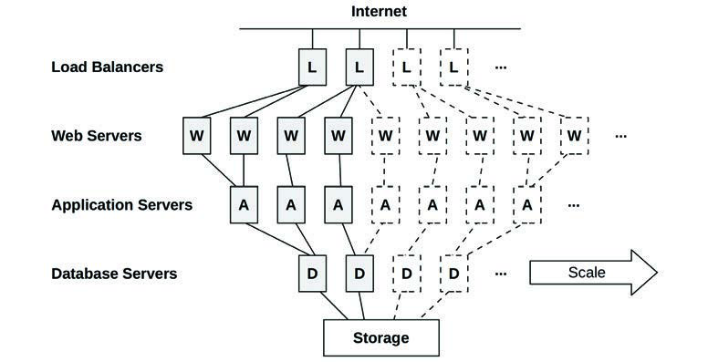
**图 11.1 云架构：横向扩展**

每个环境层由一个或多个并行运行的服务器实例组成，并添加更多实例以处理负载。实例可以单独添加，或者架构可以划分为纵向分区，其中由数据库服务器、应用服务器和 Web 服务器组成的组作为单个单元添加。[^2]

这种模型的一个挑战是传统数据库的部署，其中一个数据库实例必须是主库。这些数据库（如 MySQL）的数据可以逻辑地划分为称为分片 (shards) 的组，每个组由其自己的数据库（或主/从对）管理。分布式数据库架构（如 Riak）动态处理并行执行，将负载分散到可用实例上。现在有了云原生数据库，专为在云上使用而设计，包括 Cassandra、CockroachDB、Amazon Aurora 和 Amazon DynamoDB。

由于每台服务器实例尺寸通常较小，例如 8 GB（在具有 512 GB 及更多 DRAM 的物理宿主机上），可以使用细粒度扩展来实现最佳价格/性能，而不是预先投资于大部分时间可能保持闲置的大型系统。

### 11.1.3 容量规划 (Capacity Planning)

本地服务器可能是一项显著的基础设施成本，无论是硬件还是可能持续多年的服务合同费用。新服务器投入生产也可能需要数月时间：花费在审批、等待零件可用性、运输、上架、安装和测试上。容量规划至关重要，以便购买适当尺寸的系统：太小意味着失败，太大则代价高昂（而且由于服务合同，可能在未来几年都代价高昂）。还需要容量规划来提前预测需求增加，以便及时完成漫长的采购程序。

本地服务器和数据中心曾是企业环境的规范。云计算则非常不同。服务器实例价格低廉，且几乎可以瞬间创建和销毁。公司无需花费时间规划可能需要的东西，而是可以根据实际负载的反应，根据需要增加使用的服务器实例数量。这可以通过云 API 自动完成，基于来自性能监控软件的指标。一家小企业或初创公司可以从单个小实例发展到数千个，而无需像企业环境预期的那样进行详细的容量规划研究。[^3]

对于不断发展的初创公司，另一个要考虑的因素是代码更改的速度。站点通常每周、每天甚至每天多次更新其生产代码。容量规划研究可能需要数周时间，并且由于它是基于性能指标的快照，因此在完成时可能已经过时。这不同于运行商业软件的企业环境，后者一年内的变化可能不超过几次。

云中进行的容量规划活动包括：
*   **动态调整大小**：自动添加和删除服务器实例。
*   **可扩展性测试**：短时间内购买大型云环境，以便针对合成负载测试可扩展性（这是一项基准测试活动）。

考虑到时间限制，还存在对可扩展性进行建模的潜力（类似于企业研究），以估计实际可扩展性与理论上应达到的水平之间的差距。

#### 动态调整大小 (自动扩展) (Dynamic Sizing (Auto Scaling))

云供应商通常支持部署可以随着负载增加而自动扩展的服务器实例组（例如 AWS 自动扩展组 (ASG)）。这也支持微服务架构，其中应用程序被拆分为较小的联网部分，这些部分可以根据需要单独扩展。

自动扩展可以解决快速响应负载变化的需求，但也存在过度配置 (over-provisioning) 的风险，如图 11.2 所示。例如，DoS 攻击可能表现为负载增加，从而触发服务器实例的昂贵增加。性能下降的应用程序更改也存在类似的风险，需要更多实例来处理相同的负载。监控对于验证这些增加是否合理很重要。

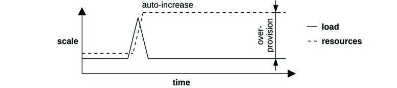
**图 11.2 动态调整大小**

云提供商按小时、分钟甚至秒计费，允许用户快速扩展和缩减。当他们缩减规模时，可以立即实现成本节约。这可以自动化，使实例计数与日常模式相匹配，仅根据需要为一天的每一分钟配置足够的容量。[^4] Netflix 为其云执行此操作，每天添加和删除数万个实例以匹配其每日每秒流媒体模式，图 11.3 显示了一个示例 [Gregg 14b]。

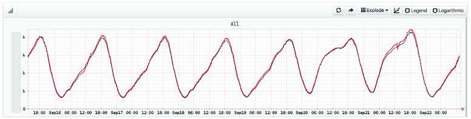
**图 11.3 Netflix 每秒流媒体数**

作为其他示例，2012 年 12 月，Pinterest 报告称通过响应流量负载在非工作时间自动关闭其云系统，将成本从 54 美元/小时削减至 20 美元/小时 [Hoff 12]；2018 年 Shopify 迁移到云端并看到了巨大的基础设施节省：从平均闲置时间为 61% 的服务器迁移到平均闲置时间为 19% 的云实例 [Kwiatkowski 19]。性能调优也可以带来即时节省，从而减少处理负载所需的实例数量。

一些云架构（见第 11.3 节“操作系统虚拟化”）如果可用，可以使用称为突发 (bursting) 的策略立即动态分配更多 CPU 资源。这可以免费提供，旨在通过提供一个缓冲区来帮助防止过度配置，在此期间可以检查增加的负载，以确定它是真实的还是可能持续的。如果是这样，可以配置更多实例，以便将来资源得到保证。

所有这些技术都应该比企业环境高效得多——特别是那些具有固定尺寸以处理服务器生命周期内预期峰值负载的环境：此类服务器大部分时间可能处于闲置状态。

### 11.1.4 存储 (Storage)

云实例需要存储操作系统、应用程序软件和临时文件。在 Linux 系统上，这是根卷和其他卷。这可以由本地物理存储或网络存储提供。这种实例存储是易失性的，当实例销毁时也会被销毁（被称为临时驱动器，ephemeral drives）。对于持久存储，通常使用独立的服务，它向实例提供存储，形式可以是：
*   **文件存储**：例如，通过 NFS 提供的文件。
*   **块存储**：例如，通过 iSCSI 提供的块。
*   **对象存储**：通过 API 提供，通常基于 HTTP。

这些存储在网络上运行，并且网络基础设施和存储设备都与其他租户共享。由于这些原因，性能可能比本地磁盘更难预测，尽管云提供商可以通过使用资源控制来提高性能一致性。

云提供商通常为此提供自己的服务。例如，Amazon 提供 Amazon Elastic File System (EFS) 作为文件存储，Amazon Elastic Block Store (EBS) 作为块存储，以及 Amazon Simple Storage Service (S3) 作为对象存储。

本地存储和网络存储如图 11.4 所示。

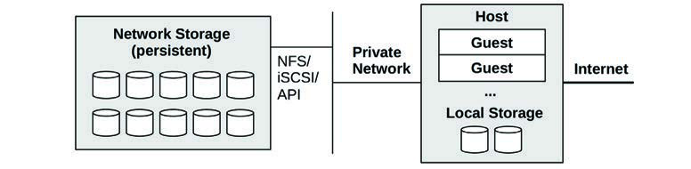
**图 11.4 云存储**

访问网络存储增加的延迟通常通过对频繁访问的数据使用内存缓存来缓解。

一些存储服务允许在需要可靠性能时购买 IOPS 速率（例如，Amazon EBS 预置 IOPS 卷）。

### 11.1.5 多租户 (Multitenancy)

Unix 是一个多任务操作系统，旨在处理访问相同资源的多个用户和进程。Linux 后来增加了资源限制和控制，以更公平地共享这些资源，并通过可观测性来识别和量化涉及资源争用的性能问题。

云计算的不同之处在于，整个操作系统实例可以共存于同一个物理系统上。每个客户机都是一个隔离的操作系统：客户机（通常情况下 [^5]）无法观察同一宿主机上其他客户机的用户和进程——这将被视为信息泄露——即使它们共享相同的物理资源。

由于资源是在租户之间共享的，性能问题可能会由“嘈杂的邻居 (noisy neighbors)”引起。例如，同一宿主机上的另一个客户机可能会在你的峰值负载期间执行完整的数据库转储，从而干扰你的磁盘和网络 I/O。更糟糕的是，邻居可能正在通过执行故意使资源饱和的微基准测试来评估云提供商，以找到它们的极限。

这个问题有一些解决方案。多租户效应可以通过资源管理来控制：设置提供性能隔离（也称为资源隔离）的操作系统资源控制。这是对 CPU、内存、磁盘或文件系统 I/O 以及网络吞吐量的资源使用强加每租户限制或优先级。

除了限制资源使用外，能够观察多租户争用可以帮助云运营商调整限制，并更好地平衡可用宿主机上的租户。可观测性的程度取决于虚拟化类型。

### 11.1.6 编排 (Kubernetes) (Orchestration)

许多公司在自己的裸机或云系统上运行编排软件来构建私有云。最受欢迎的此类软件是 Kubernetes（简称 k8s），最初由 Google 创建。Kubernetes（希腊语意为“舵手”）是一个开源系统，使用容器（通常是 Docker 容器，尽管任何实现开放容器接口的运行时都可以工作，如 containerd）管理应用程序部署 [Kubernetes 20b]。公有云提供商也创建了 Kubernetes 服务以简化到这些提供商的部署，包括 Google Kubernetes Engine (GKE)、Amazon Elastic Kubernetes Service (Amazon EKS) 和 Microsoft Azure Kubernetes Service (AKS)。

Kubernetes 将容器作为称为 Pod 的共存组进行部署，容器可以在其中共享资源并进行本地通信 (localhost)。每个 Pod 都有自己的 IP 地址，可用于与其他 Pod 通信（通过网络）。Kubernetes 服务 (Service) 是对由一组具有元数据（包括 IP 地址）的 Pod 提供的端点的抽象，并且是这些端点的持久且稳定的接口，而 Pod 本身可能会被添加和移除，允许将它们视为可丢弃的。Kubernetes 服务支持微服务架构。Kubernetes 包括自动扩展策略，例如“水平 Pod 自动扩展器 (Horizontal Pod Autoscaler)”，它可以基于目标资源利用率或其他指标扩展 Pod 的副本。在 Kubernetes 中，物理机器被称为节点 (Nodes)，一组节点如果连接到同一个 Kubernetes API 服务器，则属于一个 Kubernetes 集群 (Cluster)。

Kubernetes 中的性能挑战包括调度（在集群中的何处运行容器以最大化性能）和网络性能，因为使用了额外的组件来实现容器网络和负载均衡。

对于调度，Kubernetes 考虑了 CPU 和内存的请求 (requests) 和限制 (limits)，以及诸如节点污点 (node taints，节点被标记为排除在调度之外) 和标签选择器 (label selectors，自定义元数据) 等元数据。Kubernetes 目前不限制块 I/O（未来可能会添加使用 blkio cgroup 对此的支持 [Xu 20]），这使得磁盘争用成为性能问题的可能来源。

对于网络，Kubernetes 允许使用不同的网络组件，确定使用哪种组件是确保最大性能的重要活动。容器网络可以通过插件容器网络接口 (CNI) 软件来实现；示例 CNI 软件包括基于 netfilter 或 iptables 的 Calico，以及基于 BPF 的 Cilium。两者都是开源的 [Calico 20][Cilium 20b]。对于负载均衡，Cilium 还为 kube-proxy 提供了 BPF 替代方案 [Borkmann 19]。

[^1]: 例如 Google Anthos 是一个应用程序管理平台，支持将本地 Google Kubernetes Engine (GKE) 与 GCP 实例以及其他云结合使用。
[^2]: 例如 Shopify 将这些单元称为“pods” [Denis 18]。
[^3]: 当公司规模扩大到数十万个实例时，情况可能会变得复杂，因为由于需求，云提供商可能会暂时耗尽给定类型的可用实例。如果你达到这种规模，请与你的客户代表讨论缓解此问题的方法（例如购买预留容量）。
[^4]: 请注意，无论是扩容还是缩容，自动化都可能很复杂。缩容可能不仅涉及等待请求完成，还涉及等待长期运行的批处理作业完成以及数据库传输本地数据。
[^5]: Linux 容器可以通过命名空间和 cgroup 以不同的方式组装。应该可以创建彼此共享进程命名空间的容器，这可以用于可以调试其他容器进程的自省（“sidecar”）容器。在 Kubernetes 中，主要的抽象是 Pod，它共享一个网络命名空间。
## 11.2 硬件虚拟化 (Hardware Virtualization)

硬件虚拟化创建了一个可以运行整个操作系统（包括其自身内核）的虚拟机 (VM)。虚拟机由管理程序 (hypervisor) 创建，管理程序也被称为虚拟机管理器 (VMM)。管理程序的常见分类将其识别为类型 1 或类型 2 [Goldberg 73]，具体如下：
*   **类型 1**：直接在处理器上执行。管理程序管理可以由有权的客户机执行，该客户机可以创建和启动新的客户机。类型 1 也称为原生管理程序 (native hypervisor) 或裸机管理程序 (bare-metal hypervisor)。此管理程序包含其自身的用于客户虚拟机的 CPU 调度程序。一个流行的示例是 Xen 管理程序。
*   **类型 2**：在宿主操作系统中执行，宿主操作系统有权管理该管理程序并启动新的客户机。对于此类，系统启动一个传统的操作系统，然后运行管理程序。此管理程序由宿主内核 CPU 调度程序调度，客户机表现为宿主机上的进程。

虽然你可能仍会遇到术语类型 1 和类型 2，但随着管理程序技术的发展，这种分类不再严格适用 [Liguori 07]——类型 2 通过使用内核模块已变得“类类型 1 (Type 1-ish)”，以便管理程序的部分内容可以直接访问硬件。图 11.5 显示了一个更实用的分类，说明了我将其命名为配置 A 和 B 的两种常见配置 [Gregg 19]。

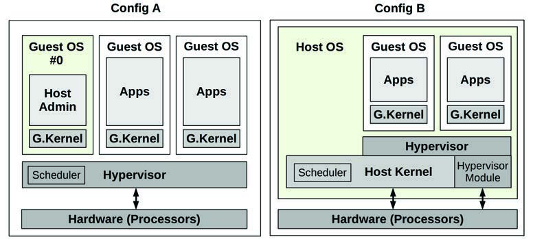
**图 11.5 常见的管理程序配置**

这些配置是：
*   **配置 A**：也称为原生管理程序或裸机管理程序。管理程序软件直接在处理器上运行，创建用于运行客户虚拟机的域，并将虚拟客户机 CPU 调度到实际 CPU 上。一个特权域（图 11.5 中的 0 号域）可以管理其他域。一个流行的示例是 Xen 管理程序。
*   **配置 B**：管理程序软件由宿主 OS 内核执行，可能由内核级模块和用户级进程组成。宿主 OS 有权管理管理程序，其内核将虚拟机 CPU 与宿主机上的其他进程一起调度。通过使用内核模块，此配置也提供了对硬件的直接访问。一个流行的示例是 KVM 管理程序。

两种配置都可能涉及运行 I/O 代理（例如，使用 QEMU 软件）在 domain 0 (Xen) 或宿主 OS (KVM) 中，用于服务客户机 I/O。这增加了 I/O 开销，多年来通过添加共享内存传输和其他技术进行了优化。

最初的硬件管理程序由 VMware 在 1998 年开创，使用二进制翻译来执行完全硬件虚拟化 [VMware 07]。这涉及在执行前重写特权指令，如系统调用和页表操作。非特权指令可以直接在处理器上运行。这提供了一个由虚拟化硬件组件组成的完整虚拟系统，在其上可以安装未修改的操作系统。由此产生的高性能开销通常对于服务器整合所提供的节省来说是可以接受的。

此后通过以下方式进行了改进：
*   **处理器虚拟化支持**：AMD-V 和 Intel VT-x 扩展在 2005-2006 年引入，用于为处理器的虚拟机操作提供更快的硬件支持。这些扩展提高了虚拟化特权指令和 MMU 的速度。
*   **半虚拟化 (Paravirtualization, paravirt 或 PV)**：提供了一个虚拟系统，其中包括一个接口，供客户操作系统高效使用宿主资源（通过超调，hypercalls），而无需对所有组件进行完全虚拟化。例如，启动定时器通常涉及多个必须由管理程序模拟的特权指令。这可以简化为供半虚拟化客户机使用的单个 hypercall，以便管理程序更高效地处理。为了进一步提高效率，Xen 管理程序将这些 hypercall 批量处理为 multicall。半虚拟化可能包括客户机使用半虚拟化网络设备驱动程序，以便将数据包更高效地传递给宿主机中的物理网络接口。虽然性能得到了提高，但这依赖于客户机操作系统对半虚拟化的支持（Windows 历史上并不提供这种支持）。
*   **设备硬件支持**：为了进一步优化虚拟机性能，除处理器之外的硬件设备也一直在增加虚拟机支持。这包括用于网络和存储设备的单根 I/O 虚拟化 (SR-IOV)，它允许客户虚拟机直接访问硬件。这需要驱动程序支持（示例驱动程序包括 ixgbe、ena、hv_netvsc 和 nvme）。

多年来，Xen 已经演进并改进了其性能。现代 Xen 虚拟机通常在硬件 VM 模式 (HVM) 下启动，然后使用带 HVM 支持的 PV 驱动程序来提高性能：这种配置称为 PVHVM。这可以通过完全依赖硬件虚拟化来实现某些驱动程序来进一步改进，例如用于网络和存储设备的 SR-IOV。

### 11.2.1 实现 (Implementation)

硬件虚拟化有许多不同的实现，其中一些已经提到过（Xen 和 KVM）。示例包括：
*   **VMware ESX**：2001 年首次发布，VMware ESX 是用于服务器整合的企业产品，是 VMware vSphere 云计算产品的关键组件。其管理程序是一个运行在裸机上的微内核，第一个虚拟机称为服务控制台，它可以管理管理程序和新的虚拟机。
*   **Xen**：2003 年首次发布，Xen 起初是剑桥大学的一个研究项目，后来被 Citrix 收购。Xen 是一种类型 1 管理程序，运行半虚拟化客户机以获得高性能；后来增加了对硬件辅助客户机的支持，以支持未修改的操作系统（Windows）。虚拟机被称为域 (domains)，特权最高的是 dom0，管理程序从这里进行管理并启动新域。Xen 是开源的，可以从 Linux 启动。Amazon Elastic Compute Cloud (EC2) 之前基于 Xen。
*   **Hyper-V**：随 Windows Server 2008 发布，Hyper-V 是一种类型 1 管理程序，它创建用于执行客户操作系统的分区。Microsoft Azure 公有云可能运行 Hyper-V 的定制版本（确切细节尚未公开）。
*   **KVM**：由 Qumranet 开发，这是一家在 2008 年被 Red Hat 收购的初创公司。KVM 是一种类型 2 管理程序，作为内核模块执行。它支持硬件辅助扩展，并且为了获得高性能，在客户操作系统支持的情况下对某些设备使用半虚拟化。为了创建一个完整的硬件辅助虚拟机实例，它与一个名为 QEMU (Quick Emulator) 的用户进程配对，QEMU 是一个可以创建和管理虚拟机的 VMM（管理程序）。QEMU 最初是由 Fabrice Bellard 编写的高质量、开源、使用二进制翻译的类型 2 管理程序。KVM 是开源的，被 Google 用于 Google Compute Engine [Google 20c]。
*   **Nitro**：由 AWS 在 2017 年推出，该管理程序使用基于 KVM 的部分，并具有对所有主要资源的硬件支持：处理器、网络、存储、中断和定时器 [Gregg 17e]。不使用 QEMU 代理。Nitro 为客户虚拟机提供接近裸机的性能。

以下章节描述了与硬件虚拟化相关的性能主题：开销、资源控制和可观测性。这些根据实现及其配置而有所不同。

### 11.2.2 开销 (Overhead)

在调查云性能问题时，了解何时以及何时不应该预期虚拟化带来的性能开销非常重要。

硬件虚拟化通过各种方式实现。资源访问可能需要管理程序的代理和翻译，从而增加开销，或者它可能使用基于硬件的技术来避免这些开销。以下各节总结了 CPU 执行、内存映射、内存大小、执行 I/O 以及来自其他租户的争用的性能开销。

#### CPU

通常，客户机应用程序直接在处理器上执行，计算密集型应用程序可能会经历与裸机系统几乎相同的性能。在发出特权处理器调用、访问硬件和映射主内存时可能会遇到 CPU 开销，具体取决于管理程序如何处理它们。以下描述了不同硬件虚拟化类型如何处理 CPU 指令：
*   **二进制翻译 (Binary translation)**：识别并翻译对物理资源操作的客户机内核指令。在硬件辅助虚拟化可用之前使用二进制翻译。在没有硬件支持虚拟化的情况下，VMware 使用的方案涉及在处理器 ring 0 运行虚拟机监控器 (VMM)，并将客户机内核移至 ring 1（该 ring 以前未使用过；应用程序运行在 ring 3，大多数处理器提供四个 ring；保护环在第 3 章“操作系统”第 3.2.2 节“内核态和用户态”中介绍）。因为一些客户机内核指令假设它们运行在 ring 0，为了从 ring 1 执行，它们需要进行翻译，调用 VMM 以便应用虚拟化。这种翻译在运行时执行，耗费显著的 CPU 开销。
*   **半虚拟化 (Paravirtualization)**：客户 OS 中必须虚拟化的指令被替换为对管理程序的超调 (hypercalls)。如果客户 OS 经过修改以优化 hypercall，使其意识到自己运行在虚拟化硬件上，性能可以得到提高。
*   **硬件辅助 (Hardware-assisted)**：对硬件操作的未修改客户机内核指令由管理程序处理，管理程序在低于 0 的 ring 级别运行 VMM。不翻译二进制指令，而是强制客户机内核特权指令捕获 (trap) 到具有更高特权的 VMM，然后 VMM 可以模拟特权以支持虚拟化 [Adams 06]。

硬件辅助虚拟化通常是首选，具体取决于实现和工作负载，而半虚拟化则用于在客户 OS 支持的情况下提高某些工作负载（特别是 I/O）的性能。

作为实现差异的一个例子，VMware 的二进制翻译模型多年来经过了大量优化，正如他们在 2007 年写道 [VMware 07]：
> 由于高管理程序到客户机的转换开销和僵化的编程模型，VMware 的二进制翻译方法目前在大多数情况下优于第一代硬件辅助实现。第一代实现中的僵化编程模型在管理管理程序到客户机转换的频率或成本方面几乎没有软件灵活性空间。

客户机和管理程序之间的转换率，以及在管理程序中花费的时间，可以作为 CPU 开销的指标进行研究。这些事件通常被称为 **客户机退出 (guest exits)**，因为当这种情况发生时，虚拟 CPU 必须停止在客户机内部执行。图 11.6 显示了 KVM 内部与客户机退出相关的 CPU 开销。

该图显示了用户进程、宿主内核和客户机之间客户机退出的流程。在处理退出的客户机外部花费的时间是硬件虚拟化的 CPU 开销；处理退出的时间越多，开销就越大。当客户机退出时，事件的一个子集可以直接在内核中处理。那些不能直接处理的事件必须离开内核并返回到用户进程；与内核可以处理的退出相比，这会引起更大的开销。

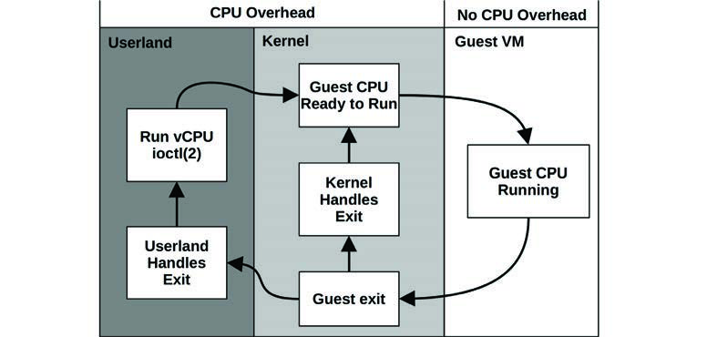
**图 11.6 硬件虚拟化 CPU 开销**

例如，对于 Linux KVM 实现，可以通过其客户机退出函数研究这些开销，这些函数在源代码中映射如下（摘自 Linux 5.2 中的 `arch/x86/kvm/vmx/vmx.c`，已截断）：

```c
/*
 * exit 处理程序如果退出已被完全处理且客户机执行可以恢复，则返回 1。
 * 否则它们设置 kvm_run 参数以指示需要对用户空间执行的操作并返回 0。
 */
static int (*kvm_vmx_exit_handlers[])(struct kvm_vcpu *vcpu) = {
        [EXIT_REASON_EXCEPTION_NMI]           = handle_exception,
        [EXIT_REASON_EXTERNAL_INTERRUPT]      = handle_external_interrupt,
        [EXIT_REASON_TRIPLE_FAULT]            = handle_triple_fault,
        [EXIT_REASON_NMI_WINDOW]              = handle_nmi_window,
        [EXIT_REASON_IO_INSTRUCTION]          = handle_io,
        [EXIT_REASON_CR_ACCESS]               = handle_cr,
        [EXIT_REASON_DR_ACCESS]               = handle_dr,
        [EXIT_REASON_CPUID]                   = handle_cpuid,
        [EXIT_REASON_MSR_READ]                = handle_rdmsr,
        [EXIT_REASON_MSR_WRITE]               = handle_wrmsr,
        [EXIT_REASON_PENDING_INTERRUPT]       = handle_interrupt_window,
        [EXIT_REASON_HLT]                     = handle_halt,
        [EXIT_REASON_INVD]                    = handle_invd,
        [EXIT_REASON_INVLPG]                  = handle_invlpg,
        [EXIT_REASON_RDPMC]                   = handle_rdpmc,
        [EXIT_REASON_VMCALL]                  = handle_vmcall,
          [...]
        [EXIT_REASON_XSAVES]                  = handle_xsaves,
        [EXIT_REASON_XRSTORS]                 = handle_xrstors,
        [EXIT_REASON_PML_FULL]                = handle_pml_full,
        [EXIT_REASON_INVPCID]                 = handle_invpcid,
        [EXIT_REASON_VMFUNC]                  = handle_vmx_instruction,
        [EXIT_REASON_PREEMPTION_TIMER]        = handle_preemption_timer,
        [EXIT_REASON_ENCLS]                   = handle_encls,
};
```

虽然名称简练，但它们可以让你了解客户机调用管理程序的原因，从而产生 CPU 开销。

一种常见的客户机退出是 `halt` 指令，通常由空闲线程在内核找不到更多工作可执行时调用（这允许处理器在被中断前以低功耗模式运行）。它由 `handle_halt()` 函数处理（见前面列表中的 `EXIT_REASON_HLT`），该函数最终调用 `kvm_vcpu_halt()` (`arch/x86/kvm/x86.c`)：

```c
int kvm_vcpu_halt(struct kvm_vcpu *vcpu)
{
        ++vcpu->stat.halt_exits;
        if (lapic_in_kernel(vcpu)) {
                vcpu->arch.mp_state = KVM_MP_STATE_HALTED;
                return 1;
        } else {
                vcpu->run->exit_reason = KVM_EXIT_HLT;
                return 0;
        }
}
```

与许多客户机退出类型一样，代码保持精简以最小化 CPU 开销。此示例以 vcpu 统计计数增加开始，该计数跟踪发生了多少次 halt。剩余代码执行此特权指令所需的硬件模拟。这些函数可以使用管理程序宿主机上的 kprobes 在 Linux 上进行仪表化，以跟踪其类型和退出的持续时间。退出也可以使用 `kvm:kvm_exit` 跟踪点在全局范围内进行跟踪，这在第 11.2.4 节“可观测性”中使用。

虚拟化中断控制器和高分辨率定时器等硬件设备也会产生一些 CPU（和少量内存）开销。

#### 内存映射 (Memory Mapping)

如第 7 章“内存”所述，操作系统与 MMU 合作创建从虚拟内存到物理内存的页面映射，并将其缓存在 TLB 中以提高性能。

对于虚拟化，从客户机到硬件映射一个新内存页（缺页异常）涉及两个步骤：
1.  **虚拟到客户机物理 (virtual-to-guest physical)** 转换，由客户机内核执行。
2.  **客户机物理到宿主机物理 (guest-physical-to-host-physical)**（实际）转换，由管理程序 VMM 执行。

从客户机虚拟到宿主机物理的映射随后可以缓存在 TLB 中，以便后续访问可以以正常速度运行——不需要额外的转换。现代处理器支持 MMU 虚拟化，因此离开 TLB 的映射可以仅在硬件中更快地召回（page walk），而无需调用管理程序。支持此功能的特性在 Intel 上称为扩展页表 (EPT)，在 AMD 上称为嵌套页表 (NPT) [Milewski 11]。

如果没有 EPT/NPT，提高性能的另一种方法是维护客户机虚拟到宿主机物理映射的 **影子页表 (shadow page tables)**，这些页表由管理程序管理，然后在客户机执行期间通过覆盖客户机的 CR3 寄存器进行访问。使用这种策略，客户机内核像往常一样维护自己的页表，这些页表从客户机虚拟映射到客户机物理。管理程序拦截对这些页表的更改，并在影子页面中创建到宿主机物理页面的等效映射。然后，在客户机执行期间，管理程序覆盖 CR3 寄存器以指向影子页面。

#### 内存大小 (Memory Size)

与操作系统虚拟化不同，使用硬件虚拟化时会有一些额外的内存消耗。每个客户机运行自己的内核，这消耗少量内存。存储架构也可能导致双重缓存，即客户机和宿主机都缓存相同的数据。KVM 类管理程序还为每个虚拟机运行一个 VMM 进程（如 QEMU），该进程本身消耗一些主内存。

#### I/O

历史上，I/O 是硬件虚拟化最大的开销来源。这是因为每个设备 I/O 都必须由管理程序翻译。对于高频 I/O，如 10 Gbit/s 网络，每个 I/O（数据包）的一小部分开销都可能导致整体性能大幅下降。已经创建了一些技术来减轻这些 I/O 开销，最终通过硬件支持完全消除这些开销。此类硬件支持包括 I/O MMU 虚拟化（AMD-Vi 和 Intel VT-d）。

提高 I/O 性能的一种方法是使用 **半虚拟化驱动程序 (paravirtualized drivers)**，它可以合并 I/O 并执行更少的设备中断以减少管理程序开销。

另一种技术是 **PCI 直通 (PCI pass-through)**，它将 PCI 设备直接分配给客户机，因此它可以像在裸机系统上一样使用。PCI 直通可以提供可用选项中的最佳性能，但它在配置具有多个租户的系统时降低了灵活性，因为某些设备现在由客户机拥有且无法共享。这也可能使热迁移 (live migration) 变得复杂 [Xen 19]。

有一些技术可以提高将 PCI 设备与虚拟化结合使用的灵活性，包括单根 I/O 虚拟化 (SR-IOV，前面提到过) 和多根 I/O 虚拟化 (MR-IOV)。这些术语指的是暴露的根复合 PCI 拓扑的数量，以不同方式提供硬件虚拟化。Amazon EC2 云一直在采用这些技术来先后加速网络和存储 I/O，Nitro 管理程序默认使用这些技术 [Gregg 17e]。

Xen、KVM 和 Nitro 管理程序的常见配置如图 11.7 所示。

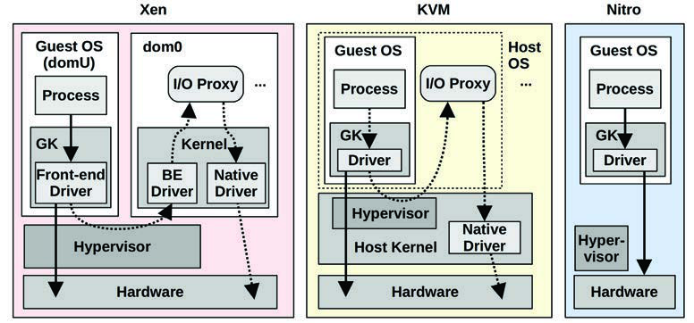
**图 11.7 Xen、KVM 和 Nitro I/O 路径**

GK 是“客户机内核 (guest kernel)”，BE 是“后端 (back end)”。虚线箭头指示控制路径，组件在此路径中相互通知（同步或异步）有更多数据准备好传输。数据路径（实线箭头）在某些情况下可能通过共享内存和环形缓冲区实现。Nitro 未显示控制路径，因为它使用相同的数据路径直接访问硬件。

图 11.7 中未显示 Xen 和 KVM 的不同配置方式。此图显示它们使用 I/O 代理进程（通常是 QEMU 软件），这些进程是按每个客户虚拟机创建的。但它们也可以配置为使用 SR-IOV，允许客户虚拟机直接访问硬件（图 11.7 中未为 Xen 或 KVM 绘制）。Nitro 需要此类硬件支持，从而消除了对 I/O 代理的需求。

Xen 通过使用设备通道 (device channel) 来改进其 I/O 性能——这是 dom0 和客户域 (domU) 之间的异步共享内存传输。这避免了在域之间传递 I/O 数据时创建额外副本的 CPU 和总线开销。它还可能使用单独的域来执行 I/O，如第 11.2.3 节“资源控制”所述。

I/O 路径中的步骤数量（包括控制和数据）对性能至关重要：步骤越少越好。在 2006 年，KVM 开发人员将 Xen 等特权客户机系统与 KVM 进行了比较，发现 KVM 可以使用一半的步骤执行 I/O（5 个对 10 个，尽管该测试是在没有半虚拟化的情况下执行的，因此不反映大多数现代配置） [Qumranet 06]。

由于 Nitro 管理程序消除了额外的 I/O 步骤，我预期所有追求最高性能的大型云提供商都会效仿，使用硬件支持来消除 I/O 代理。

#### 多租户争用 (Multi-Tenant Contention)

根据管理程序配置以及租户之间共享 CPU 和 CPU 缓存的程度，可能会出现由其他租户引起的 CPU 窃取时间 (stolen time) 和 CPU 缓存污染，从而降低性能。对于容器来说，这通常是一个比虚拟机更大的问题，因为容器促进此类共享以支持 CPU 突发。

执行 I/O 的其他租户可能会产生中断，从而中断执行，具体取决于管理程序的配置。

资源争用可以通过资源控制来管理。

### 11.2.3 资源控制 (Resource Controls)

作为客户机配置的一部分，CPU 和主内存通常配置有限额。管理程序软件也可能提供网络和磁盘 I/O 的资源控制。

对于类 KVM 的管理程序，宿主 OS 最终控制物理资源，宿主 OS 提供的资源控制也可以应用于客户机，除了管理程序提供的控制之外。对于 Linux，这意味着 cgroups、tasksets 和其他资源控制。有关宿主 OS 可能提供的资源控制的更多信息，请参见第 11.3 节“操作系统虚拟化”。以下各节描述了 Xen 和 KVM 管理程序的资源控制示例。

#### CPUs

CPU 资源通常作为虚拟 CPU (vCPU) 分配给客户机。然后这些 vCPU 由管理程序调度。分配的 vCPU 数量粗略地限制了 CPU 资源的使用。

对于 Xen，管理程序 CPU 调度程序可以应用针对客户机的细粒度 CPU 配额。调度程序包括 [Cherkasova 07][Matthews 08]：
*   **借用虚拟时间 (Borrowed virtual time, BVT)**：一种基于虚拟时间分配的公平份额调度程序，可以提前借用虚拟时间，为实时和交互式应用程序提供低延迟执行。
*   **简单最早截止时间优先 (Simple earliest deadline first, SEDF)**：一种实时调度程序，允许配置运行时保证，调度程序优先考虑最早的截止时间。
*   **基于信用的调度 (Credit-based)**：支持 CPU 使用的优先级（权重）和上限 (caps)，以及跨多个 CPU 的负载均衡。

对于 KVM，细粒度 CPU 配额可以由宿主 OS 应用，例如使用前面描述的宿主内核公平份额调度程序。在 Linux 上，这可以使用 cgroup CPU 带宽控制来应用。

两种技术在尊重客户机优先级方面都存在局限性。客户机的 CPU 使用情况对管理程序通常是不透明的，并且通常无法看到或尊重客户机内核线程的优先级。例如，一个客户机中的低优先级日志轮转守护进程可能与另一个客户机中的关键应用服务器具有相同的管理程序优先级。

对于 Xen，高 I/O 工作负载在 dom0 中消耗额外的 CPU 资源，会使 CPU 资源使用情况进一步复杂化。仅客户域中的后端驱动程序和 I/O 代理消耗的 CPU 资源可能超过其分配的 CPU，但却未被计入 [Cherkasova 05]。一种解决方案是创建 **隔离驱动程序域 (isolated driver domains, IDD)**，它将 I/O 服务分离出来，以实现安全性、性能隔离和记账。如图 11.8 所示。

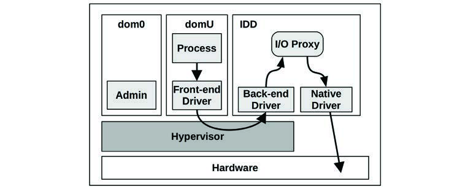
**图 11.8 具有隔离驱动程序域的 Xen**

可以监控 IDD 的 CPU 使用情况，并据此向客户机收费。摘自 [Gupta 06]：
> 我们的修改后的调度程序 SEDF-DC（SEDF-Debt Collector，债务收集器）定期从 XenMon 接收有关 IDD 代表客户域进行 I/O 处理所消耗的 CPU 信息。利用这些信息，SEDF-DC 限制客户域的 CPU 分配，以满足指定的组合 CPU 使用限制。

Xen 中使用的一种更新技术是运行 mini-OS 的存根域 (stub domains)。

#### CPU 缓存 (CPU Caches)

除了分配 vCPU 外，还可以使用 Intel 缓存分配技术 (CAT) 控制 CPU 缓存的使用。它允许在客户机之间对 LLC 进行分区，并允许共享分区。虽然这可以防止一个客户机污染另一个客户机的缓存，但它也可能通过限制缓存使用而损害性能。

#### 内存容量 (Memory Capacity)

内存限制作为客户机配置的一部分施加，客户机只能看到设定的内存量。然后，客户机内核执行自己的操作（分页、交换）以保持在其限制范围内。

为了增加静态配置的灵活性，VMware 开发了 **气球驱动程序 (balloon driver)** [Waldspurger 02]，它能够通过在运行的客户机内部“膨胀”一个气球模块来减少客户机消耗的内存，该模块消耗客户机内存。然后，这些内存被管理程序回收供其他客户机使用。气球也可以“收缩”，将内存返回给客户机内核使用。在此过程中，客户机内核执行其正常的内存管理例程以释放内存（例如分页）。VMware、Xen 和 KVM 都支持气球驱动程序。

当气球驱动程序在使用时（要从客户机检查，请在 `dmesg(1)` 输出中搜索 "balloon"），我会留意它们可能引起的性能问题。

#### 文件系统容量 (File System Capacity)

客户机从宿主机获得虚拟磁盘卷。对于类 KVM 的管理程序，这些可能是由操作系统创建并按需调整大小的软件卷。例如，ZFS 文件系统可以创建所需大小的虚拟卷。

#### 设备 I/O (Device I/O)

硬件虚拟化软件的资源控制历史上一直侧重于控制 CPU 使用率，这可以间接控制 I/O 使用率。

网络吞吐量可能由外部专用设备限制，或者在类 KVM 管理程序的情况下，由宿主内核特性限制。例如，Linux 具有来自 cgroups 的网络带宽控制以及不同的 qdiscs，这些可以应用于客户机网络接口。

已经对 Xen 的网络性能隔离进行了研究，得出以下结论 [Adamczyk 12]：
> ...当考虑网络虚拟化时，Xen 的弱点在于缺乏适当的性能隔离。

[Adamczyk 12] 的作者还为 Xen 网络 I/O 调度提出了一个解决方案，该方案增加了网络 I/O 优先级和速率的可调参数。如果你正在使用 Xen，请检查此技术或类似技术是否可用。

对于具有完全硬件支持的管理程序（例如 Nitro），硬件或外部设备可能支持 I/O 限制。在 Amazon EC2 云中，到网络连接设备的网络 I/O 和磁盘 I/O 使用外部系统被限制在配额内。

### 11.2.4 可观测性 (Observability)

在虚拟化系统上可以观察到什么取决于管理程序以及启动可观测工具的位置。通常：
*   **从特权客户机 (Xen) 或宿主机 (KVM)**：应使用前面章节介绍的标准操作系统工具观察所有物理资源。如果正在使用 I/O 代理，可以通过分析 I/O 代理来观察客户机 I/O。应从管理程序获得每客户机的资源使用统计信息。客户机内部情况（包括其进程）无法直接观察。如果设备使用直通或 SR-IOV，则某些 I/O 可能无法观察。
*   **从硬件支持的宿主机 (Nitro)**：使用 SR-IOV 可能会使从管理程序观察设备 I/O 变得更加困难，因为客户机直接访问硬件，而不通过代理或宿主内核。（Amazon 实际上如何在 Nitro 上进行管理程序可观测性尚未公开。）
*   **从客户机**：可以看到虚拟化资源及其被客户机的使用情况，并可以推断物理问题。由于虚拟机有自己专用的内核，因此可以分析内核内部情况，并且内核跟踪工具（包括基于 BPF 的工具）都可以工作。

从特权客户机或宿主机（Xen 或 KVM 管理程序），通常可以观察到高水平的物理资源使用情况：利用率、饱和度、错误、IOPS、吞吐量、I/O 类型。这些因素通常可以按客户机表示，以便快速识别重度用户。无法直接观察哪些客户机进程正在执行 I/O 及其应用程序调用栈。可以通过登录客户机（前提是已授权并配置了登录手段，例如 SSH）并使用客户操作系统提供的可观测性工具来观察它们。

当使用直通或 SR-IOV 时，客户机可能直接向硬件发出 I/O 调用。这可能会绕过管理程序中的 I/O 路径以及它们通常收集的统计信息。结果是 I/O 对管理程序变得不可见，并且不会出现在 `iostat(1)` 或其他工具中。一个可能的权宜之计是使用 PMC 来检查与 I/O 相关的计数器，并以此推断 I/O。

为了确定客户机性能问题的根本原因，云操作员可能需要登录管理程序和客户机，并从两者执行可观测性工具。由于涉及的步骤，跟踪 I/O 路径变得复杂，还可能包括对管理程序内部和 I/O 代理（如果使用）的分析。

从客户机内部，物理资源使用情况可能根本无法观察。这可能会诱使客户将神秘的性能问题归咎于由嘈杂邻居引起的资源争用。为了让云客户安心（并减少支持工单），有关物理资源使用情况的信息（经过脱敏）可能会通过其他方式提供，包括 SNMP 或云 API。

为了使容器性能更容易观察和理解，有各种监控解决方案可以展示图表、仪表板和有向图来显示你的容器环境。此类软件包括 Google cAdvisor [Google 20d] 和 Cilium Hubble [Cilium 19]（两者都是开源的）。

以下各节演示了可以从不同位置使用的原始可观测性工具，并描述了分析性能的策略。Xen 和 KVM 用于演示虚拟化软件可能提供的信息类型（不包括 Nitro，因为它是 Amazon 私有的）。

#### 11.2.4.1 特权客户机/宿主机 (Privileged Guest/Host)

应使用前面章节介绍的工具（直通/SR-IOV 的 I/O 除外）观察所有系统资源（CPU、内存、文件系统、磁盘、网络）。

##### Xen

对于类 Xen 的管理程序，客户 vCPU 存在于管理程序中，使用标准操作系统工具无法从特权客户机 (dom0) 看到。对于 Xen，可以使用 `xentop(1)` 工具替代：

```text
# xentop
xentop - 02:01:05   Xen 3.3.2-rc1-xvm
2 domains: 1 running, 1 blocked, 0 paused, 0 crashed, 0 dying, 0 shutdown
Mem: 50321636k total, 12498976k used, 37822660k free    CPUs: 16 @ 2394MHz
      NAME  STATE   CPU(sec) CPU(%)     MEM(k) MEM(%)  MAXMEM(k) MAXMEM(%) VCPUS NETS
NETTX(k) NETRX(k) VBDS   VBD_OO   VBD_RD   VBD_WR SSID
  Domain-0 -----r    6087972    2.6    9692160   19.3   no limit       n/a    16    0
0        0    0        0        0        0    0
Doogle_Win --b---     172137    2.0    2105212    4.2    2105344       4.2     1    2
0        0    2        0        0        0    0
[...]
```

字段包括：
*   **CPU(%)**：CPU 使用百分比（多个 CPU 的总和）
*   **MEM(k)**：主内存使用量（Kbytes）
*   **MEM(%)**：主内存占系统内存的百分比
*   **MAXMEM(k)**：主内存限制大小（Kbytes）
*   **MAXMEM(%)**：主内存限制占系统内存的百分比
*   **VCPUS**：分配的 VCPU 数量
*   **NETS**：虚拟化网络接口的数量
*   **NETTX(k)**：网络发送（Kbytes）
*   **NETRX(k)**：网络接收（Kbytes）
*   **VBDS**：虚拟块设备数量
*   **VBD_OO**：虚拟块设备请求阻塞并排队（饱和度）
*   **VBD_RD**：虚拟块设备读取请求
*   **VBD_WR**：虚拟块设备写入请求

`xentop(1)` 输出默认每 3 秒更新一次，可以使用 `-d delay_secs` 进行设置。

对于高级 Xen 分析，还有 `xentrace(8)` 工具，它可以从管理程序检索固定事件类型的日志。然后可以使用 `xenanalyze` 查看该日志，以研究管理程序和所使用的 CPU 调度程序的调度问题。在 Xen 源代码中还有 `xenoprof`，它是用于 Xen 的全系统剖析器（MMU 和客户机）。

##### KVM

对于类 KVM 的管理程序，客户机实例在宿主 OS 中是可见的。例如：

```text
host$ top
top - 15:27:55 up 26 days, 22:04,  1 user,  load average: 0.26, 0.24, 0.28
Tasks: 499 total,   1 running, 408 sleeping,   2 stopped,   0 zombie
%Cpu(s): 19.9 us,  4.8 sy,  0.0 ni, 74.2 id,  1.1 wa,  0.0 hi,  0.1 si,  0.0 st
KiB Mem : 24422712 total,  6018936 free, 12767036 used,  5636740 buff/cache
KiB Swap: 32460792 total, 31868716 free,   592076 used.  8715220 avail Mem


  PID USER      PR  NI    VIRT    RES    SHR S  %CPU %MEM     TIME+ COMMAND
24881 libvirt+  20   0 6161864 1.051g  19448 S 171.9  4.5   0:25.88 qemu-system-x86

21897 root       0 -20       0      0      0 I   2.3  0.0   0:00.47 kworker/u17:8
23445 root       0 -20       0      0      0 I   2.3  0.0   0:00.24 kworker/u17:7
15476 root       0 -20       0      0      0 I   2.0  0.0   0:01.23 kworker/u17:2
23038 root       0 -20       0      0      0 I   2.0  0.0   0:00.28 kworker/u17:0

22784 root       0 -20       0      0      0 I   1.7  0.0   0:00.36 kworker/u17:1
[...]
```

`qemu-system-x86` 进程是一个 KVM 客户机，其中包括每个 vCPU 的线程和 I/O 代理线程。客户机的总 CPU 使用情况可以在之前的 `top(1)` 输出中看到，每个 vCPU 的使用情况可以使用其他工具检查。例如，使用 `pidstat(1)`：

```text
host$ pidstat -tp 24881 1
03:40:44 PM   UID  TGID   TID  %usr %system %guest %wait   %CPU CPU Command
03:40:45 PM 64055 24881     - 17.00   17.00 147.00  0.00 181.00   0 qemu-system-x86
03:40:45 PM 64055     - 24881  9.00    5.00   0.00  0.00  14.00   0 |__qemu-system-x86
03:40:45 PM 64055     - 24889  0.00    0.00   0.00  0.00   0.00   6 |__qemu-system-x86
03:40:45 PM 64055     - 24897  1.00    3.00  69.00  1.00  73.00   4 |__CPU 0/KVM
03:40:45 PM 64055     - 24899  1.00    4.00  79.00  0.00  84.00   5 |__CPU 1/KVM
03:40:45 PM 64055     - 24901  0.00    0.00   0.00  0.00   0.00   2 |__vnc_worker
03:40:45 PM 64055     - 25811  0.00    0.00   0.00  0.00   0.00   7 |__worker
03:40:45 PM 64055     - 25812  0.00    0.00   0.00  0.00   0.00   6 |__worker
[...]
```

此输出显示了名为 `CPU 0/KVM` 和 `CPU 1/KVM` 的 CPU 线程分别消耗了 73% 和 84% 的 CPU。

将 QEMU 进程映射到其客户机实例名称通常是检查其进程参数（`ps -wwfp PID`）以读取 `-name` 选项的问题。

另一个重要的分析领域是客户 vCPU 退出。退出的类型可以显示客户机正在做什么：给定的 vCPU 是空闲、执行 I/O 还是执行计算。在 Linux 上，`perf(1)` 的 `kvm` 子命令提供 KVM 退出的高层统计信息。例如：

```text
host# perf kvm stat live
11:12:07.687968

Analyze events for all VMs, all VCPUs:

           VM-EXIT Samples Samples%   Time%  Min Time    Max Time       Avg time

         MSR_WRITE    1668   68.90%   0.28%    0.67us     31.74us    3.25us ( +-  2.20% )
               HLT     466   19.25%  99.63%    2.61us 100512.98us 4160.68us ( +- 14.77% )
   PREEMPTION_TIMER     112    4.63%   0.03%    2.53us     10.42us    4.71us ( +-  2.68% )
  PENDING_INTERRUPT      82    3.39%   0.01%    0.92us     18.95us    3.44us ( +-  6.23% )
 EXTERNAL_INTERRUPT      53    2.19%   0.01%    0.82us      7.46us    3.22us ( +-  6.57% )
     IO_INSTRUCTION      37    1.53%   0.04%    5.36us     84.88us   19.97us ( +- 11.87% )
           MSR_READ       2    0.08%   0.00%    3.33us      4.80us    4.07us ( +- 18.05% )
      EPT_MISCONFIG       1    0.04%   0.00%   19.94us     19.94us   19.94us ( +-  0.00% )

Total Samples:2421, Total events handled time:1946040.48us.
[...]
```

这显示了虚拟机退出的原因，以及每个原因的统计信息。在此示例输出中，持续时间最长的退出是 `HLT` (halt)，因为虚拟 CPU 进入空闲状态。列包括：
*   **VM-EXIT**：退出类型
*   **Samples**：跟踪期间的退出次数
*   **Samples%**：退出次数占总体的百分比
*   **Time%**：在退出中花费的时间占总体的百分比
*   **Min Time**：最短退出时间
*   **Max Time**：最长退出时间
*   **Avg time**：平均退出时间

虽然操作员可能不容易直接看到虚拟机内部，但检查退出可以让你表征硬件虚拟化的开销是否正在影响租户。如果你看到少量的退出，且其中很大一部分是 `HLT`，你就知道客户机 CPU 相当空闲。另一方面，如果你有大量的 I/O 操作，且产生了中断并注入到客户机中，那么客户机很可能正在通过其虚拟 NIC 和磁盘执行 I/O。

对于高级 KVM 分析，有许多跟踪点：

```text
host# perf list | grep kvm
  kvm:kvm_ack_irq                                    [Tracepoint event]
  kvm:kvm_age_page                                   [Tracepoint event]
  kvm:kvm_apic                                       [Tracepoint event]
  kvm:kvm_apic_accept_irq                            [Tracepoint event]
  kvm:kvm_apic_ipi                                   [Tracepoint event]
  kvm:kvm_async_pf_completed                         [Tracepoint event]
```

## 11.3 操作系统虚拟化 (OS Virtualization)

操作系统虚拟化将操作系统划分为 Linux 称之为 **容器 (containers)** 的实例，这些实例表现得像独立的客户机服务器，并且可以独立于宿主机进行管理和重启。它们为云客户提供小型、高效、快速启动的实例，并为云运营商提供高密度服务器。操作系统虚拟化客户机如图 11.9 所示。

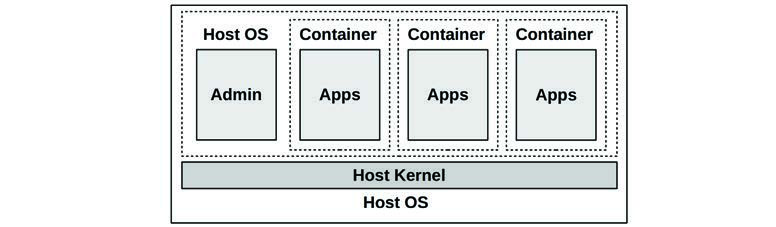
**图 11.9 操作系统虚拟化**

这种方法起源于 Unix 的 `chroot(8)` 命令，它将进程隔离在 Unix 全局文件系统的子树中（它将进程看到的顶级目录“/”更改为指向其他地方）。1998 年，FreeBSD 进一步将其开发为 FreeBSD jails，提供了作为其自身服务器运行的安全隔间。2005 年，Solaris 10 包含了一个名为 Solaris Zones 的版本，具有各种资源控制。与此同时，Linux 一直在分步添加进程隔离功能，2002 年为 Linux 2.4.19 首次添加了命名空间 (namespaces)，2008 年为 Linux 2.6.24 首次添加了控制组 (cgroups) [Corbet 07a][Corbet 07b][Linux 20m]。命名空间和 cgroup 结合在一起创建了容器，通常还使用 seccomp-bpf 来控制系统调用访问。

与硬件虚拟化技术的一个关键区别是只运行一个内核。以下是容器相对于硬件虚拟机（第 11.2 节“硬件虚拟化”）的性能优势：
*   **初始化时间快**：通常以毫秒计。
*   **客户机可以将内存完全用于应用程序**（没有额外的内核）。
*   **具有统一的文件系统缓存**——这可以避免宿主机和客户机之间的双重缓存情况。
*   **更细粒度的资源共享控制** (cgroups)。
*   **对于宿主机操作员**：改进了性能可观测性，因为客户机进程及其交互直接可见。
*   **容器可能能够共享常见文件的内存页**，从而释放页缓存空间并提高 CPU 缓存命中率。
*   **CPU 是真实的 CPU**；自适应互斥锁 (adaptive mutex locks) 的假设保持有效。

但也存在缺点：
*   **内核资源（锁、缓存、缓冲区、队列）的竞争增加**。
*   **对于客户机**：性能可观测性降低，因为内核通常无法分析。
*   **任何内核恐慌 (kernel panic) 都会影响所有客户机**。
*   **客户机无法运行自定义内核模块**。
*   **客户机无法运行较长运行时间的 PGO 内核**（见第 3.5.1 节“PGO 内核”）。
*   **客户机无法运行不同的内核版本或内核**。[^7]

同时考虑前两个缺点：从虚拟机迁移到容器的客户机更有可能遇到内核争用问题，同时也会失去分析它们的能力。他们将更加依赖宿主机操作员进行此类分析。

容器的一个非性能缺点是它们被认为安全性较低，因为它们共享一个内核。

轻量级虚拟化解决了所有这些缺点（见第 11.4 节“轻量级虚拟化”），尽管代价是失去了一些优势。

以下各节描述了 Linux 操作系统虚拟化的细节：实现、开销、资源控制和可观测性。这些根据具体的容器实现及其配置而有所不同。

### 11.3.1 实现 (Implementation)

在 Linux 内核中没有“容器”的概念。但是有命名空间和 cgroup，用户空间软件（例如 Docker）使用它们来创建所谓的容器。[^8] 典型的容器配置如图 11.10 所示。

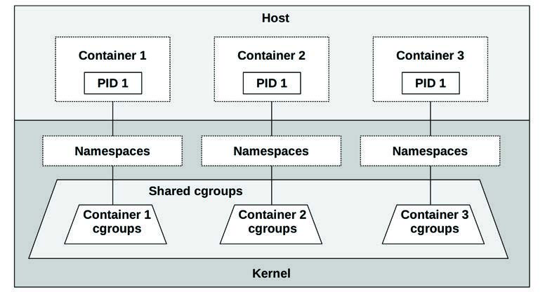
**图 11.10 Linux 容器**

尽管每个容器在容器内部都有一个 ID 为 1 的进程，但由于它们属于不同的命名空间，因此它们是不同的进程。

因为许多容器部署使用 Kubernetes，其 architecture 如图 11.11 所示。Kubernetes 已在第 11.1.6 节“编排 (Kubernetes)”中介绍。

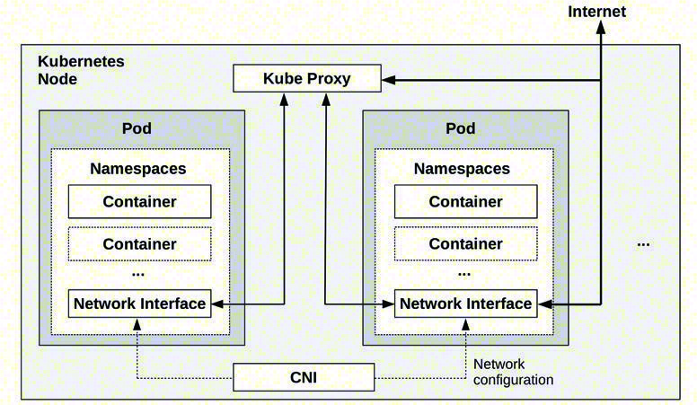
**图 11.11 Kubernetes 节点**

图 11.11 还显示了 Pod 之间通过 Kube Proxy 的网络路径，以及由 CNI 配置的容器网络。

Kubernetes 的一个优势是可以轻松创建多个容器来共享相同的命名空间，作为 Pod 的一部分。这允许容器之间更快的通信方法。

#### 命名空间 (Namespaces)

命名空间过滤系统视图，以便容器只能看到和管理自己的进程、挂载点和其他资源。这是提供容器与系统上其他容器隔离的主要机制。选定的命名空间列于表 11.1 中。

**表 11.1 选定的 Linux 命名空间**

| 命名空间 | 描述 |
| :--- | :--- |
| cgroup | 用于 cgroup 可见性 |
| ipc | 用于进程间通信可见性 |
| mnt | 用于文件系统挂载 |
| net | 用于网络栈隔离；过滤看到的接口、套接字、路由等 |
| pid | 用于进程可见性；过滤 /proc |
| time | 每个容器具有独立的系统时钟 |
| user | 用于用户 ID |
| uts | 用于主机信息；uname(2) 系统调用 |

系统上当前的命名空间可以使用 `lsns(8)` 列出：

```text
# lsns
        NS TYPE   NPROCS   PID USER             COMMAND
4026531835 cgroup    105     1 root             /sbin/init
4026531836 pid       105     1 root             /sbin/init
4026531837 user      105     1 root             /sbin/init
4026531838 uts       102     1 root             /sbin/init
4026531839 ipc       105     1 root             /sbin/init
4026531840 mnt        98     1 root             /sbin/init
4026531860 mnt         1    19 root             kdevtmpfs
4026531992 net       105     1 root             /sbin/init
4026532166 mnt         1   241 root             /lib/systemd/systemd-udevd
4026532167 uts         1   241 root             /lib/systemd/systemd-udevd
[...]
```

此 `lsns(8)` 输出显示 init 进程有六个不同的命名空间，供 100 多个进程使用。

Linux 源代码以及手册页中有一些关于命名空间的文档，从 `namespaces(7)` 开始。

#### 控制组 (Control Groups)

控制组 (cgroups) 限制资源的使用。Linux 内核中有两个版本的 cgroup，v1 和 v2 [^9]；许多项目如 Kubernetes 仍在使用 v1（v2 正在开发中）。v1 cgroup 包括表 11.2 中列出的内容。

**表 11.2 选定的 Linux cgroup**

| cgroup | 描述 |
| :--- | :--- |
| blkio | 限制块 I/O（磁盘 I/O）：字节和 IOPS |
| cpu | 基于份额 (shares) 限制 CPU 使用 |
| cpuacct | 进程组的 CPU 使用情况统计 |
| cpuset | 将 CPU 和内存节点分配给容器 |
| devices | 控制设备管理 |
| hugetlb | 限制大页使用 |
| memory | 限制进程内存、内核内存和交换分区使用 |
| net_cls | 为数据包设置 classid 以供 qdiscs 和防火墙使用 |
| net_prio | 设置网络接口优先级 |
| perf_event | 允许 perf 监控 cgroup 中的进程 |
| pids | 限制可以创建的进程数量 |
| rdma | 限制 RDMA 和 InfiniBand 资源使用 |

这些 cgroup 可以配置为限制容器之间的资源争用，例如通过对 CPU 和内存使用设置硬限制，或者对 CPU 和磁盘使用设置较软的限制（基于份额）。还可以有 cgroup 层级结构，包括容器之间共享的系统 cgroup，如图 11.10 所示。

cgroups v2 是基于层级结构的，解决了 v1 的各种缺点。预计容器技术将在未来几年迁移到 v2，v1 最终将被弃用。2019 年发布的 Fedora 31 OS 已经切换到了 cgroups v2。

Linux 源代码中的 `Documentation/cgroup-v1` 和 `Documentation/admin-guide/cgroup-v2.rst` 下有一些关于命名空间的文档，以及 `cgroups(7)` 手册页。

以下章节描述了容器虚拟化主题：开销、资源控制和可观测性。这些根据具体的容器实现及其配置而有所不同。

### 11.3.2 开销 (Overhead)

容器执行的开销应该是轻量级的：应用程序的 CPU 和内存使用应该经历裸机性能，尽管由于文件系统和网络路径中的层级，内核内部可能会有一些额外的 I/O 调用。最大的性能问题是由多租户争用引起的，因为容器促进了对内核和物理资源的更重度共享。以下各节总结了 CPU 执行、内存使用、执行 I/O 以及来自其他租户的争用的性能开销。

#### CPU

当容器线程在用户模式下运行时，没有直接的 CPU 开销：线程直接在 CPU 上运行，直到它们让出或被抢占。在 Linux 上，运行命名空间和 cgroup 中的进程也没有额外的 CPU 开销：无论是否使用容器，所有进程都已经运行在默认的命名空间和 cgroup 集中。

CPU 性能最有可能由于与其他租户的争用而下降（见后文“多租户争用”）。

对于 Kubernetes 等编排器，额外的网络组件可能会增加一些处理网络数据包的 CPU 开销（例如，使用成千上万个服务时；由于使用了大量的 Kubernetes 服务，`kube-proxy` 在处理大型 iptables 规则集时会遇到首包开销。这种开销可以通过使用 BPF 替换 `kube-proxy` 来克服 [Borkmann 20]）。

#### 内存映射 (Memory Mapping)

内存映射、加载和存储应无开销地执行。

#### 内存大小 (Memory Size)

应用程序可以利用为容器分配的全部内存量。相比之下，硬件虚拟机每个租户运行一个内核，每个内核都会耗费少量主内存。

常见的容器配置（使用 OverlayFS）允许在访问相同文件的容器之间共享页缓存。与在内存中重复常见文件（例如系统库）的虚拟机相比，这可以释放一些内存。

#### I/O

I/O 开销取决于容器配置，因为它可能包括额外的隔离层，用于：
*   **文件系统 I/O**：例如 overlayfs
*   **网络 I/O**：例如桥接网络 (bridge networking)

以下是一个内核堆栈跟踪，显示了一个由 overlayfs 处理（并由 XFS 文件系统支持）的容器文件系统写入：

```text
    blk_mq_make_request+1
    generic_make_request+420
    submit_bio+108
    _xfs_buf_ioapply+798
    __xfs_buf_submit+226
    xlog_bdstrat+48
    xlog_sync+703
    __xfs_log_force_lsn+469
    xfs_log_force_lsn+143
    xfs_file_fsync+244
    xfs_file_buffered_aio_write+629
    do_iter_readv_writev+316
    do_iter_write+128
    ovl_write_iter+376
    __vfs_write+274
    vfs_write+173
    ksys_write+90
    do_syscall_64+85
    entry_SYSCALL_64_after_hwframe+68
```

堆栈中可以看到 overlayfs 函数 `ovl_write_iter()`。

这有多大影响取决于工作负载及其 IOPS 速率。对于低 IOPS 服务器（例如 <1000 IOPS），它产生的开销应该是可以忽略不计的。

#### 多租户争用 (Multi-Tenant Contention)

其他正在运行的租户的存在可能会引起资源争用和中断，从而损害性能，包括：
*   **CPU 缓存可能具有较低的命中率**，因为其他租户正在消耗并驱逐条目。对于某些处理器和内核配置，上下文切换到其他容器线程甚至可能冲刷 L1 缓存。[^10]
*   **TLB 缓存也可能由于其他租户的使用而具有较低的命中率**，以及在上下文切换时的冲刷（如果使用 PCID 可能会避免）。
*   **CPU 执行可能会因执行中断服务例程的其他租户设备（例如网络 I/O）而短时间中断**。
*   **内核执行可能会遇到缓冲区、缓存、队列和锁的额外争用**，因为多租户容器系统可能会将其负载增加一个数量级或更多。这种争用可能会稍微降低应用程序性能，具体取决于内核资源及其扩展特性。
*   **由于使用 iptables 实现容器网络，网络 I/O 可能会遇到 CPU 开销**。
*   **可能存在来自正在使用这些资源的物理资源（CPU、磁盘、网络接口）的争用**。

Gianluca Borello 的一篇帖子描述了当系统上存在某些其他容器时，一个容器的性能被发现随着时间的推移缓慢而稳定地下降 [Borello 17]。他追溯后发现 `lstat(2)` 延迟更高，这是由其他容器的工作负载及其对 dcache 的影响引起的。

Maxim Leonovich 报告的另一个问题显示，从单租户虚拟机迁移到多租户容器增加了内核的 `posix_fadvise()` 调用率，从而形成了瓶颈 [Leonovich 18]。

列表中的最后一项由资源控制管理。虽然其中一些因素存在于传统的多用户环境中，但它们在多租户容器系统中更为普遍。

### 11.3.3 资源控制 (Resource Controls)

资源控制限制对资源的访问，以便更公平地共享资源。在 Linux 上，这些主要通过 cgroups 提供。

单个资源控制可以分为优先级或限制。优先级引导资源消耗，以根据重要性值平衡邻居之间的使用。限制是资源消耗的上限值。两者都根据需要使用——对于某些资源，这意味着两者都使用。示例列于表 11.3 中。

**表 11.3 Linux 容器资源控制**

| 资源 | 优先级 | 限制 |
| :--- | :--- | :--- |
| CPU | CFS 份额 (shares) | cpusets (完整 CPU), CFS 带宽 (小数 CPU) |
| 内存容量 | 内存软限制 | 内存限制 |
| 交换容量 | - | 交换限制 |
| 文件系统容量 | - | 文件系统配额/限制 |
| 文件系统缓存 | - | 内核内存限制 |
| 磁盘 I/O | blkio 权重 | blkio IOPS 限制, blkio 吞吐量限制 |
| 网络 I/O | net_prio 优先级, qdiscs (fq 等), 自定义 BPF | qdiscs (fq 等), 自定义 BPF |

这些在以下章节中根据 cgroup v1 进行一般性描述。配置这些内容的步骤取决于你正在使用的容器平台（Docker、Kubernetes 等）；请参阅它们的相关文档。

#### CPUs

可以使用 cpusets cgroup 以及来自 CFS 调度程序的份额 (shares) 和带宽 (bandwidth) 在容器之间分配 CPU。

##### cpusets

cpusets cgroup 允许将完整的 CPU 分配给特定容器。好处是这些容器可以在 CPU 上运行而不会被其他容器中断，并且它们可用的 CPU 容量是一致的。缺点是空闲的 CPU 容量对其他容器不可用。

##### 份额 (Shares) 和带宽 (Bandwidth)

CPU 份额由 CFS 调度程序提供，是另一种 CPU 分配方法，它允许容器共享其空闲的 CPU 容量。份额支持 **突发 (bursting)** 的概念，即一个容器通过使用来自其他容器的空闲 CPU 可以有效地运行得更快。当没有空闲容量时（包括当主机超配时），份额在需要 CPU 资源的容器之间提供最佳分配。

CPU 份额通过向容器分配称为份额的分配单元来工作，这些单元用于计算忙碌容器在给定时间将获得的 CPU 量。计算公式为：
`容器 CPU = (所有 CPU × 容器份额) / 系统上总忙碌份额`

考虑一个在几个容器之间分配了 100 份额的系统。此时，只有容器 A 和 B 想要 CPU 资源。容器 A 有 10 份额，容器 B 有 30 份额。因此，容器 A 可以使用系统总 CPU 资源的 25%：`所有 CPU × 10 / (10 + 30)`。

现在考虑一个所有容器同时忙碌的系统。给定容器的 CPU 分配将是：
`容器 CPU = 所有 CPU × 容器份额 / 系统总份额`

对于所述场景，容器 A 将获得 10% 的 CPU 容量 (`CPU × 10 / 100`)。份额分配提供了 CPU 使用的最小保证。突发可能允许容器使用更多。容器 A 可以使用 CPU 容量的 10% 到 100%，这取决于有多少其他容器忙碌。

份额的一个问题是突发可能会混淆容量规划，特别是因为许多监控系统不显示突发统计信息（它们应该显示）。测试容器的最终用户可能会对其性能感到满意，而不知道这种性能只有通过突发才成为可能。稍后，当其他租户迁入时，他们的容器将无法再突发，并将遭受性能下降。想象一下，容器 A 最初在空闲系统上测试并获得 100% CPU，但后来由于添加了其他容器而只获得 10%。我在现实生活中多次看到这种情况发生，最终用户认为肯定存在系统性能问题并要求我帮助调试。然后他们失望地得知系统正按预期工作，由于其他容器已迁入，慢 10 倍是新的常态。对于客户来说，这感觉就像是“挂羊头卖狗肉”。

通过限制突发使其性能下降不那么严重（即使这也限制了性能），可以减轻过度突发的问题。在 Linux 上，这是使用 CFS 带宽控制完成的，它可以设置 CPU 使用的上限。例如，容器 A 可以将带宽设置为全系统 CPU 容量的 20%，这样加上份额，它现在在 10% 到 20% 的范围内运行，取决于空闲可用性。这种从基于份额的最小 CPU 到带宽最大值的范围如图 11.12 所示。它假设每个容器中都有足够的忙碌线程来使用可用的 CPU（否则容器在达到系统强加的限制之前，会因其自身的工作负载而变得受 CPU 限制）。

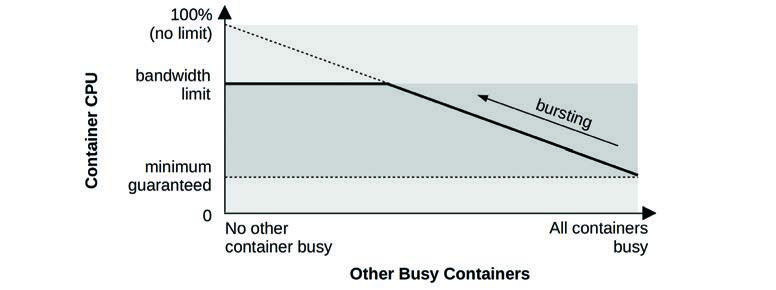
**图 11.12 CPU 份额和带宽**

带宽控制通常公开为完整 CPU 的百分比：2.5 意味着两个半 CPU。这映射到内核设置，实际上是微秒级的周期 (periods) 和配额 (quotas)：容器在每个周期内获得一定的 CPU 微秒配额。

管理突发的另一种方法是，容器操作员在最终用户突发一段时间（例如几天）时通知他们，以便他们不会对性能产生错误的期望。然后可以鼓励最终用户升级其容器大小，以便获得更多份额和更高的 CPU 分配最小保证。

#### CPU 缓存 (CPU Caches)

CPU 缓存使用可以使用 Intel 缓存分配技术 (CAT) 来控制，以避免容器污染 CPU 缓存。这在第 11.2.3 节“资源控制”中已描述，并且具有相同的警告：限制缓存访问也会损害性能。

#### 内存容量 (Memory Capacity)

内存 cgroup 提供了四种机制来管理内存使用。表 11.4 通过其内存 cgroup 设置名称描述了它们。

**表 11.4 Linux 内存 cgroup 设置**

| 名称 | 描述 |
| :--- | :--- |
| memory.limit_in_bytes | 字节大小限制。如果容器尝试使用超过分配的大小，它会遇到交换（如果配置了）或 OOM 杀手。 |
| memory.soft_limit_in_bytes | 字节大小限制。一种尽力而为的方法，涉及回收内存以引导容器达到其软限制。 |
| memory.kmem.limit_in_bytes | 内核内存的字节大小限制。 |
| memory.kmem.tcp.limit_in_bytes | TCP 缓冲区内存的字节大小限制。 |

还有通知机制，以便应用程序可以在内存不足时采取行动：`memory.pressure_level` 和 `memory.oom_control`。这些需要通过 `eventfd(2)` 系统调用配置通知。

请注意，容器未使用的内存可以由内核页缓存中的其他容器使用，从而提高它们的性能（内存形式的突发）。

#### 交换容量 (Swap Capacity)

内存 cgroup 还允许配置交换限制。实际设置是 `memory.memsw.limit_in_bytes`，即内存加交换。

#### 文件系统容量 (File System Capacity)

文件系统容量通常可以通过文件系统进行限制。例如，XFS 文件系统支持用户、组和项目的软配额和硬配额，其中软限制允许在硬限制下临时过量使用。ZFS 和 btrfs 也有配额。

#### 文件系统缓存 (File System Cache)

在 Linux 中，容器用于文件系统页缓存的内存会记入内存 cgroup 中的容器：不需要额外的设置。

[^6]: 一位审阅者指出了另一种可能的技术（请注意这并非建议）：可以分析客户机存储的快照（前提是它没有加密）。例如，给定之前的磁盘 I/O 地址日志，可以使用文件系统状态的快照来确定可能访问了哪些文件。
[^7]: 有些技术模拟了不同的系统调用接口，以便不同的 OS 可以在一个内核下运行，但这在实践中具有性能影响。例如，此类模拟通常只提供一组基础的系统调用功能，而高级性能功能则返回 ENOTSUP（不支持的错误）。
[^8]: 内核确实使用 `struct nsproxy` 来链接到进程的命名空间。由于此结构定义了进程如何被包含，它可以被认为是内核对容器的最恰当理解。
[^9]: 还有并行使用 v1 和 v2 部分的混合模式配置。
[^10]: 例如，在 2020 年 6 月，Linus Torvalds 拒绝了一个允许进程选择加入 L1 数据缓存冲刷的内核补丁 [Torvalds 20b]。该补丁是云环境的安全预防措施，但由于担心在不必要的情况下产生性能开销而被拒绝。虽然没有包含在 Linux 主线中，但我不会对该补丁在云中的某些 Linux 发行版上运行感到惊讶。

#### 磁盘 I/O (Disk I/O)

`blkio` cgroup 提供了管理磁盘 I/O 的机制。表 11.5 通过其 `blkio` cgroup 设置名称描述了它们。

**表 11.5 Linux blkio cgroup 设置**

| 名称 | 描述 |
| :--- | :--- |
| blkio.weight | 控制负载期间磁盘资源份额的 cgroup 权重，类似于 CPU 份额。它与 BFQ I/O 调度程序一起使用。 |
| blkio.weight_device | 特定设备的权重设置。 |
| blkio.throttle.read_bps_device | 读取字节/秒的限制。 |
| blkio.throttle.write_bps_device | 写入字节/秒的限制。 |
| blkio.throttle.read_iops_device | 读取 IOPS 的限制。 |
| blkio.throttle.write_iops_device | 写入 IOPS 的限制。 |

与 CPU 份额和带宽一样，`blkio` 权重和限制设置允许基于优先级和限制策略共享磁盘 I/O 资源。

#### 网络 I/O (Network I/O)

`net_prio` cgroup 允许为出站网络流量设置优先级。这些与 `SO_PRIORITY` 套接字选项相同（见 `socket(7)`），并控制网络栈中数据包处理的优先级。`net_cls` cgroup 可以为数据包标记类 ID (class ID)，以便稍后由 qdiscs 管理。（这也适用于 Kubernetes Pod，它可以为每个 Pod 使用一个 `net_cls`。）

排队规则 (qdiscs，见第 10 章“网络”第 10.4.3 节“软件”) 可以对类 ID 进行操作，或分配给容器虚拟网络接口，以确定网络流量的优先级并对其进行限制。有 50 多种不同的 qdisc 类型，每种都有自己的策略、功能 and 可调参数。例如，Kubernetes 的 `kubernetes.io/ingress-bandwidth` 和 `kubernetes.io/egress-bandwidth` 设置是通过创建一个令牌桶过滤器 (tbf) qdisc 实现的 [CNI 18]。第 10.7.6 节“tc”提供了一个在网络接口上添加和删除 qdisc 的示例。

BPF 程序可以附加 to cgroups 用于自定义程序化资源控制和防火墙。一个示例是 Cilium 软件，它在 XDP、cgroup 和 tc (qdiscs) 等各个层级结合使用 BPF 程序，以支持容器之间的安全性、负载均衡和防火墙功能 [Cilium 20a]。

### 11.3.4 可观测性 (Observability)

可以观测到什么是取决于启动可观测工具的位置以及宿主机的安全设置。因为容器可以以许多不同的方式配置，我将描述典型情况。通常：
*   **从宿主机（最高权限命名空间）**：可以观测到一切，包括硬件资源、文件系统、客户机进程、客户机 TCP 会话等等。无需登录客户机即可查看和分析客户机进程。也可以从宿主机（云提供商）轻松浏览客户机文件系统。
*   **从客户机**：容器通常只能看到自己的进程、文件系统、网络接口和 TCP 会话。一个主要的例外是全系统统计信息，例如 CPU 和磁盘：这些通常显示宿主机而非仅显示容器。这些统计信息的状态通常没有文档记录（我在下一节“传统工具”中编写了自己的文档）。内核内部通常无法检查，因此使用内核跟踪框架（第 13 至 15 章）的性能工具通常无法工作。

最后一点在前面已经描述过：容器在更有可能遇到内核争用问题的同时，也剥夺了最终用户诊断这些问题的能力。

容器性能分析的一个常见担忧是可能存在“嘈杂邻居 (noisy neighbors)”，即其他积极消耗资源并引起他人访问争用的容器租户。由于这些容器进程都在一个内核下，并且可以从宿主机同时分析，这与在一个分时系统上运行的多个进程的传统性能分析并无二致。主要区别在于 cgroup 可能会施加在遇到硬件限制之前就会遇到的额外软件限制（资源控制）。

许多为单机系统编写的监控工具尚未开发对操作系统虚拟化（容器）的支持，并且对 cgroup and 其他软件限制是盲目的。尝试在容器中使用这些工具的客户可能会发现它们似乎在工作，但实际上只显示了物理系统资源。由于不支持观察云资源控制，这些工具可能会错误地报告系统仍有余力，而实际上已经达到了软件限制。它们还可能显示由于其他租户引起的高资源使用率。

在 Linux 上，由于内核中目前没有容器 ID[^11]，传统性能工具也不提供太多容器支持，从宿主机和客户机进行的容器可观测性变得更加复杂且耗时。

以下各节总结了传统性能工具的状态，探索了从宿主机和容器进行的可观测性，并描述了分析性能的策略。

#### 11.3.4.1 传统工具 (Traditional Tools)

作为对传统性能工具的总结，表 11.6 描述了在 Linux 5.2 内核上从宿主机和典型容器（使用进程和挂载命名空间的容器）运行时各种工具显示的内容。意外情况（例如容器可以观察宿主机统计信息时）用 **加粗** 表示。

**表 11.6 Linux 传统工具**

| 工具 | 从宿主机 | 从容器 |
| :--- | :--- | :--- |
| top | 摘要标题显示宿主机；进程表显示所有宿主机和容器进程 | **摘要标题显示混合统计信息；一些来自宿主机，一些来自容器**。进程表显示容器进程 |
| ps | 显示所有进程 | 显示容器进程 |
| uptime | 显示宿主机（全系统）平均负载 | **显示宿主机平均负载** |
| mpstat | 显示宿主机 CPU 和宿主机使用情况 | **显示宿主机 CPU 和宿主机 CPU 使用情况** |
| vmstat | 显示宿主机 CPU、内存和其他统计信息 | **显示宿主机 CPU、内存和其他统计信息** |
| pidstat | 显示所有进程 | 显示容器进程 |
| free | 显示宿主机内存 | **显示宿主机内存** |
| iostat | 显示宿主机磁盘 | **显示宿主机磁盘** |
| pidstat -d | 显示所有进程磁盘 I/O | 显示容器进程磁盘 I/O |
| sar -n DEV, TCP 1 | 显示宿主机网络接口和 TCP 统计信息 | 显示容器网络接口和 TCP 统计信息 |
| perf | 可以剖析一切 | 要么运行失败，要么可以启用并随后剖析其他租户 |
| tcpdump | 可以嗅探所有接口 | 仅嗅探容器接口 |
| dmesg | 显示内核日志 | 运行失败 |

随着时间的推移，工具对容器的支持可能会得到改进，以便从容器运行时仅显示容器特定的统计信息，或者更好的是，显示容器与宿主机统计信息的细分。宿主机工具可以显示一切，它们也可以通过增加按容器或 cgroup 的细分和过滤支持来得到改进。这些主题在接下来的宿主机和客户机可观测性部分中会有更多解释。

#### 11.3.4.2 宿主机 (Host)

登录到宿主机时，可以使用前面章节介绍的工具检查所有系统资源（CPU、内存、文件系统、磁盘、网络）。使用容器时还有两个额外的检查因素：
*   **每个容器的统计信息**
*   **资源控制的效果**

如第 11.3.1 节“实现”所述，内核中没有容器的概念：容器只是命名空间和 cgroup 的集合。你看到的容器 ID 是由用户空间软件创建和管理的。以下是来自 Kubernetes（本例中为具有单个容器的 Pod）和 Docker 的容器 ID 示例：

```text
# kubectl get pod
NAME                         READY   STATUS              RESTARTS   AGE
kubernetes-b94cb9bff-kqvml   0/1     ContainerCreating   0          3m
[...]
# docker ps
CONTAINER ID  IMAGE   COMMAND   CREATED      STATUS      PORTS  NAMES
6280172ea7b9  ubuntu  "bash"    4 weeks ago  Up 4 weeks         eager_bhaskara
[...]
```

这给 `ps(1)`、`top(1)` 等传统性能工具带来了问题。为了显示容器 ID，它们需要支持 Kubernetes、Docker 以及所有其他容器平台。相反，如果内核支持容器 ID，它将成为所有性能工具支持的标准。Solaris 内核就是这种情况，其中的容器称为 zone，并具有可以被 `ps(1)` 等观察到的基于内核的 zone ID。（接下来的“BPF 跟踪”部分展示了一个使用 UTS 命名空间中的 nodename 作为容器 ID 的 Linux 解决方案。）

在实践中，可以使用以下方式检查 Linux 上按容器 ID 划分的性能统计信息：
*   **容器平台提供的容器工具**；例如，Docker 有一个用于显示按容器划分的资源使用情况的工具。
*   **性能监控软件**，通常具有针对各种容器平台的插件。
*   **Cgroup 统计信息及其使用的工具**。这需要额外的步骤来弄清楚哪些 cgroup 映射到哪个容器。
*   **宿主机的命名空间映射**，例如通过使用 `nsenter(1)`，允许宿主机性能工具在容器中运行。通过使用 `-p`（PID 命名空间）选项，这可以将可见进程减少到仅来自容器的进程。尽管性能工具统计信息可能并非仅针对容器：见表 11.6。`-n`（网络命名空间）选项对于在同一网络命名空间中运行网络工具（`ping(8)`、`tcpdump(8)`）也很有用。
*   **BPF 跟踪**，可以从内核读取 cgroup 和命名空间信息。

以下各节提供了容器工具、cgroup 统计信息、命名空间进入和 BPF 跟踪以及资源控制可观测性的示例。

##### 容器工具 (Container Tools)

Kubernetes 容器编排系统提供了一种使用 `kubectl top` 检查基本资源使用情况的方法。

检查主机（“节点”）：

```text
# kubectl top nodes
NAME                         CPU(cores)   CPU%   MEMORY(bytes)   MEMORY%
bgregg-i-03cb3a7e46298b38e   1781m        10%    2880Mi          9%
```

`CPU(cores)` 时间显示累积的 CPU 毫秒时间，`CPU%` 显示节点的当前使用率。

检查容器（“Pod”）：

```text
# kubectl top pods
NAME                         CPU(cores)   MEMORY(bytes)
kubernetes-b94cb9bff-p7jsp   73m          9Mi
```

这显示了累积的 CPU 时间和当前的内存大小。

这些命令需要运行 metrics server，它可能根据你初始化 Kubernetes 的方式默认添加。其他监控工具也可以在 GUI 中显示这些指标，包括 cAdvisor、Sysdig 和 Google Cloud Monitoring [Kubernetes 20c]。

Docker 容器技术提供了一些 `docker(1)` 分析子命令，包括 `stats`。例如，从生产宿主机：

```text
# docker stats
CONTAINER     CPU %    MEM USAGE / LIMIT     MEM %   NET I/O    BLOCK I/O       PIDS
353426a09db1  526.81%  4.061 GiB / 8.5 GiB   47.78%  0 B / 0 B  2.818 MB / 0 B  247
6bf166a66e08  303.82%  3.448 GiB / 8.5 GiB   40.57%  0 B / 0 B  2.032 MB / 0 B  267
58dcf8aed0a7  41.01%   1.322 GiB / 2.5 GiB   52.89%  0 B / 0 B  0 B / 0 B       229
61061566ffe5  85.92%   220.9 MiB / 3.023 GiB 7.14%   0 B / 0 B  43.4 MB / 0 B   61
bdc721460293  2.69%    1.204 GiB / 3.906 GiB 30.82%  0 B / 0 B  4.35 MB / 0 B   66
[...]
```

这显示 UUID 为 `353426a09db1` 的容器在此更新间隔内总共消耗了 527% 的 CPU，并使用了 4 GB 主内存（相对于 8.5 GB 的限制）。在此间隔内没有网络 I/O，只有少量（MB 级）磁盘 I/O。

##### Cgroup 统计信息 (Cgroup Statistics)

可以从 `/sys/fs/cgroups` 获得按 cgroup 划分的各种统计信息。这些信息由各种容器监控产品和工具读取并绘图，也可以在命令行直接检查：

```text
# cd /sys/fs/cgroup/cpu,cpuacct/docker/02a7cf65f82e3f3e75283944caa4462e82f...
# cat cpuacct.usage
1615816262506
# cat cpu.stat
nr_periods 507
nr_throttled 74
throttled_time 3816445175
```

`cpuacct.usage` 文件以总纳秒显示此 cgroup 的 CPU 使用情况。`cpu.stat` 文件显示此 cgroup 被 CPU 限制的次数 (`nr_throttled`)，以及总限制时间（以纳秒计，`throttled_time`）。此示例显示此 cgroup 在 507 个时间段内被 CPU 限制了 74 次，总共限制了 3.8 秒。

还有 `cpuacct.usage_percpu`，这次显示的是 Kubernetes cgroup：

```text
# cd /sys/fs/cgroup/cpu,cpuacct/kubepods/burstable/pod82e745...
# cat cpuacct.usage_percpu
37944772821 35729154566 35996200949 36443793055 36517861942 36156377488 36176348313
35874604278 37378190414 35464528409 35291309575 35829280628 36105557113 36538524246
36077297144 35976388595
```

输出包括这个 16 CPU 系统的 16 个字段，以纳秒为单位的总 CPU 时间。这些 cgroupv1 指标在内核源代码的 `Documentation/cgroup-v1/cpuacct.txt` 中有文档。

读取这些统计信息的命令行工具包括 `htop(1)` and `systemd-cgtop(1)`。例如，在生产容器宿主机上运行 `systemd-cgtop(1)`：

```text
# systemd-cgtop
Control Group                              Tasks   %CPU   Memory  Input/s Output/s
/                                              -  798.2    45.9G        -        -
/docker                                     1082  790.1    42.1G        -        -
/docker/dcf3a...9d28fc4a1c72bbaff4a24834     200  610.5    24.0G        -        -
/docker/370a3...e64ca01198f1e843ade7ce21     170  174.0     3.0G        -        -
/system.slice                                748    5.3     4.1G        -        -
/system.slice/daemontools.service            422    4.0     2.8G        -        -
/docker/dc277...42ab0603bbda2ac8af67996b     160    2.5     2.3G        -        -
/user.slice                                    5    2.0    34.5M        -        -
/user.slice/user-0.slice                       5    2.0    15.7M        -        -
/user.slice/u....slice/session-c26.scope       3    2.0    13.3M        -        -
/docker/ab452...c946f8447f2a4184f3ccff2a     174    1.0     6.3G        -        -
/docker/e18bd...26ffdd7368b870aa3d1deb7a     156    0.8     2.9G        -        -
[...]
```

此输出显示名为 `/docker/dcf3a...` 的 cgroup 在此更新间隔内消耗了 610.5% 的总 CPU（跨多个 CPU）和 24 GB 主内存，具有 200 个运行任务。输出还显示了 systemd 为系统服务 (`/system.slice`) and 用户会话 (`/user.slice`) 创建的一些 cgroup。

##### 命名空间映射 (Namespace Mapping)

容器通常为进程 ID and 挂载使用不同的命名空间。

对于进程命名空间，这意味着客户机中的 PID 不太可能与宿主机中的 PID 匹配。

在诊断性能问题时，我首先登录容器，以便从最终用户的角度看待问题。稍后，我可能会登录宿主机以使用全系统工具继续调查，但 PID 可能不相同。映射显示在 `/proc/PID/status` 文件中。例如，从宿主机：

```text
host# grep NSpid /proc/4915/status
NSpid:   4915    753
```

这显示宿主机上的 PID 4915 是客户机中的 PID 753。不幸的是，我通常需要进行反向映射：给定容器 PID，我需要找到宿主机 PID。一种（某种程度上低效的）方法是扫描所有状态文件：

```text
host# awk '$1 == "NSpid:" && $3 == 753 { print $2 }' /proc/*/status
4915
```

在本例中，它显示客户机 PID 753 是宿主机 PID 4915。请注意，输出可能会显示多个宿主机 PID，因为“753”可能出现在多个进程命名空间中。在这种情况下，你需要弄清楚哪个 753 来自匹配的命名空间。`/proc/PID/ns` 文件是包含命名空间 ID 的符号链接，可用于此目的。分别从客户机 and 宿主机检查它们：

```text
guest# ls -lh /proc/753/ns/pid
lrwxrwxrwx 1 root root 0 Mar 15 20:47 /proc/753/ns/pid -> 'pid:[4026532216]'

host# ls -lh /proc/4915/ns/pid
lrwxrwxrwx 1 root root 0 Mar 15 20:46 /proc/4915/ns/pid -> 'pid:[4026532216]'
```

请注意匹配的命名空间 ID (4026532216)：这确认了宿主机 PID 4915 与客户机 PID 753 相同。

挂载命名空间也会带来类似的挑战。例如，从宿主机运行 `perf(1)` 命令会在 `/tmp/perf-PID.map` 中搜索补充符号文件，但容器应用程序会将它们发射到容器中的 `/tmp`，这与宿主机中的 `/tmp` 不同。此外，由于进程命名空间，PID 很可能不同。Alice Goldfuss 首先发布了针对此问题的解决方法，涉及移动并重命名这些符号文件，以便在宿主机中可用 [Goldfuss 17]。`perf(1)` 此后获得了命名空间支持以避免此问题，并且内核提供了 `/proc/PID/root` 挂载命名空间映射，用于直接访问容器的根 (“/”)。例如：

```text
host# ls -lh /proc/4915/root/tmp
total 0
-rw-r--r-- 1 root root 0 Mar 15 20:54 I_am_in_the_container.txt
```

这是列出容器的 `/tmp` 中的文件。

除了 `/proc` 文件外，`nsenter(1)` 命令可以在选定的命名空间中执行其他命令。以下从宿主机运行 `top(1)` 命令，使用来自 PID 4915 (`-t 4915`) 的挂载 (`-m`) 和进程 (`-p`) 命名空间：

```text
# nsenter -t 4915 -m -p top
top - 21:14:24 up 32 days, 23:23,  0 users,  load average: 0.32, 0.09, 0.02
Tasks:   3 total,   2 running,   1 sleeping,   0 stopped,   0 zombie
%Cpu(s):  0.2 us,  0.1 sy,  0.0 ni, 99.4 id,  0.0 wa,  0.0 hi,  0.0 si,  0.2 st
KiB Mem :  1996844 total,    98400 free,   858060 used,  1040384 buff/cache
KiB Swap:        0 total,        0 free,        0 used.   961564 avail Mem


  PID USER      PR  NI    VIRT    RES    SHR S  %CPU %MEM     TIME+ COMMAND
  753 root      20   0  818504  93428  11996 R 100.0  0.2   0:27.88 java
    1 root      20   0   18504   3212   2796 S   0.0  0.2   0:17.57 bash
  766 root      20   0   38364   3420   2968 R   0.0  0.2   0:00.00 top
```

这显示 top 进程是 PID 为 753 的 java。

##### BPF 跟踪 (BPF Tracing)

一些 BPF 跟踪工具已经具有容器支持，但许多还没有。幸运的是，在需要时向 bpftrace 工具添加支持通常并不困难；以下是一个示例。有关 bpftrace 编程的解释，请参见第 15 章。

`forks.bt` 工具通过仪表化 `clone(2)`、`fork(2)` and `vfork(2)` 系统调用来计算跟踪期间创建的新进程数量。其源码如下：

```text
#!/usr/local/bin/bpftrace

tracepoint:syscalls:sys_enter_clone,
tracepoint:syscalls:sys_enter_fork,
tracepoint:syscalls:sys_enter_vfork
{
        @new_processes = count();
}
```

示例输出：

```text
# ./forks.bt
Attaching 3 probes...
^C

@new_processes: 590
```

这显示在跟踪期间全系统范围内创建了 590 个新进程。

要按容器分解，一种方法是打印 UTS 命名空间中的 nodename（主机名）。这依赖于容器软件配置此命名空间，通常情况确实如此。代码变为（加粗部分为新增）：

```text
#!/usr/local/bin/bpftrace

#include <linux/sched.h>
#include <linux/nsproxy.h>
#include <linux/utsname.h>

tracepoint:syscalls:sys_enter_clone,
tracepoint:syscalls:sys_enter_fork,
tracepoint:syscalls:sys_enter_vfork
{
        $task = (struct task_struct *)curtask;
        $nodename = $task->nsproxy->uts_ns->name.nodename;
        @new_processes[$nodename] = count();
}
```

这段额外的代码从当前内核 `task_struct` 遍历到 UTS 命名空间的 nodename，并将其作为键包含在 `@new_processes` 输出映射中。

示例输出：

```text
# ./forks.bt
Attaching 3 probes...
^C

@new_processes[ip-10-1-239-218]: 171
@new_processes[efe9f9be6185]: 743
```

输出现在按容器细分，显示 nodename `efe9f9be6185`（一个容器）在跟踪期间创建了 743 个进程。另一个 nodename `ip-10-1-239-218` 是宿主机系统。

这之所以奏效是因为系统调用在任务（进程）上下文中操作，因此 `curtask` 返回负责的 `task_struct`，我们从中获取 nodename。如果跟踪进程异步事件（例如来自磁盘 I/O 的完成中断），那么原始进程可能不在 CPU 上，`curtask` 将无法识别正确的 nodename。

由于获取 UTS nodename 可能会变得常用，我猜我们将添加一个内置变量 `nodename`，以便唯一的增加部分是：

`@new_processes[nodename] = count();`

检查 bpftrace 更新以查看是否已经添加。

##### 资源控制 (Resource Controls)

必须观察第 11.3.3 节“资源控制”中列出的资源控制，以确定容器是否受到它们的限制。传统性能工具 and 文档侧重于物理资源，对这些软件施加的限制是盲目的。

检查资源控制在 USE 方法（第 2 章“方法论”第 2.5.9 节“USE 方法”）中已有描述，该方法遍历资源 and 检查利用率、饱和度 and 错误。存在资源控制时，也必须为每个资源检查它们。

前面的“Cgroup 统计信息”部分显示了 `/sys/fs/cgroup/.../cpu.stat` 文件，它提供了关于 CPU 限制的统计信息 (`nr_throttled`) and 以纳秒计的限制时间 (`throttled_time`)。这种限制是指 CPU 带宽限制，识别容器是否受到带宽限制很简单：`throttled_time` 会在增加。如果使用 cpuset，则可以从按 CPU 的工具 and 指标（包括 `mpstat(1)`）检查其 CPU 利用率。

CPU 也可以通过份额 (shares) 进行管理，如前面的“份额 and 带宽”部分所述。受份额限制的容器更难识别，因为没有统计信息。我开发了图 11.13 中的流程图，用于确定容器 CPU 是否受限以及如何受限的过程 [Gregg 17g]：

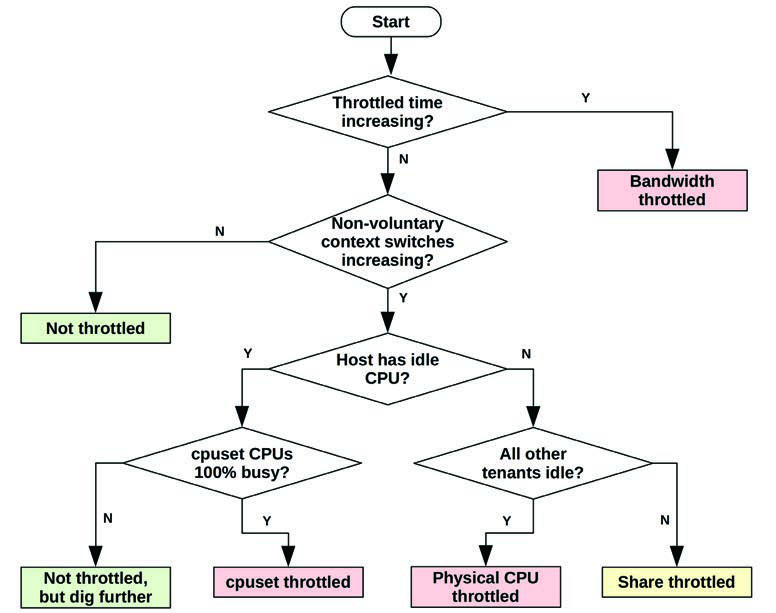
**图 11.13 容器 CPU 限制分析**

图 11.13 中的过程使用五个统计信息来确定容器 CPU 是否受限以及如何受限：
*   **限制时间 (Throttled time)**：`cpu` cgroup `throttled_time`
*   **非自愿上下文切换**：可以从 `/proc/PID/status` 中作为 `nonvoluntary_ctxt_switches` 的增加读取
*   **宿主机有空闲 CPU**：可以从 `mpstat(1)` `%idle`、`/proc/stat` and 其他工具读取
*   **cpuset CPU 100% 忙碌**：如果使用 cpuset，可以从 `mpstat(1)`、`/proc/stat` 等读取其利用率
*   **所有其他租户空闲**：可以从容器特定工具 (`docker stats`) 或显示缺乏 CPU 资源竞争的系统工具（例如，如果 `top(1)` 仅显示该容器消耗 `%CPU`）确定

可以为其他资源开发类似的过程，并且应在监控软件 and 工具中提供支持性统计信息（包括 cgroup 统计信息）。理想的监控产品或工具会为你做出判断，并报告每个容器是否受限以及如何受限。

#### 11.3.4.3 客户机（容器） (Guest (Container))

你可能期望从容器运行的性能工具仅显示容器统计信息，但情况通常并非如此。例如，在空闲容器上运行 `iostat(1)`：

```text
container# iostat -sxz 1
[...]
avg-cpu:  %user   %nice %system %iowait  %steal   %idle
          57.29    0.00    8.54   33.17    0.00    1.01

Device             tps      kB/s    rqm/s   await aqu-sz  areq-sz  %util
nvme0n1        2578.00  12436.00   331.00    0.33   0.00     4.82 100.00

avg-cpu:  %user   %nice %system %iowait  %steal   %idle
          51.78    0.00    7.61   40.61    0.00    0.00

Device             tps      kB/s    rqm/s   await aqu-sz  areq-sz  %util
nvme0n1        2664.00  11020.00    88.00    0.32   0.00     4.14  98.80
[...]
```

此输出同时显示了 CPU and 磁盘工作负载，但该容器完全空闲。对于刚接触操作系统虚拟化的人来说，这可能会让人困惑——为什么我的容器这么忙？这是因为工具显示的是包含其他租户活动的宿主机统计信息。

传统性能工具的状态已在第 11.3.4 节“可观测性”小节“传统工具”中总结。随着时间的推移，这些工具变得更加“容器感知”，支持 cgroup 统计信息并在容器中提供仅限容器的统计信息。

块 I/O 有 cgroup 统计信息。从同一容器：

```text
container# cat /sys/fs/cgroup/blkio/blkio.throttle.io_serviced
259:0 Read 452
259:0 Write 352
259:0 Sync 692
259:0 Async 112
259:0 Discard 0
259:0 Total 804
Total 804
container# sleep 10
container# cat /sys/fs/cgroup/blkio/blkio.throttle.io_serviced
259:0 Read 452
259:0 Write 352
259:0 Sync 692
259:0 Async 112
259:0 Discard 0
259:0 Total 804
Total 804
```

这些统计操作类型。我打印了两次，中间 `sleep 10` 以设置间隔：你可以看到在那个间隔内计数没有增加；因此，该容器没有发出磁盘 I/O。还有一个字节文件：`blkio.throttle.io_service_bytes`。

不幸的是，这些计数器没有提供 `iostat(1)` 所需的所有统计信息。cgroup 需要公开更多计数器，以便 `iostat(1)` 可以变得容器感知。

##### 容器感知 (Container Awareness)

使工具具备容器感知能力并不一定意味着将其视图限制在自己的容器内：容器看到物理资源的状态也有好处。这取决于使用容器的目标，目标可能是：
*   **A) 容器是一个隔离的服务器**：如果这是目标（通常云供应商是这种情况），那么使工具具备容器感知能力意味着它们仅显示当前容器的活动。例如，`iostat(1)` 应仅显示容器调用的磁盘 I/O，而不显示其他内容。这可以通过隔离所有统计源以仅显示当前容器（`/proc`、`/sys`、netlink 等）来实现。这种隔离既会帮助也会阻碍客户机的分析：诊断来自其他租户的资源争用问题将更加耗时，并将依赖于对设备延迟无法解释的增加的推断。
*   **B) 容器是一种打包方案**：对于运营自己容器云的公司，隔离容器的统计信息可能并非必须。允许容器查看宿主机统计信息（如前所述，目前情况通常如此，例如 `iostat(1)`）意味着最终用户可以更好地了解硬件设备的状态以及由“嘈杂邻居”引起的问题。在这种情况下，使 `iostat(1)` 具备容器感知能力可能意味着提供当前容器与宿主机或其他容器使用情况的对比细分，而不是隐藏这些统计信息。

对于这两种情况，工具都应在适当的地方支持显示资源控制，作为容器感知的一部分。继续以 `iostat(1)` 为例，除了设备 `%util`（在场景 A 中不可见）外，它还可以根据 `blkio` 吞吐量 and IOPS 限制提供一个 `%cap`，这样容器就知道磁盘 I/O 是否受到资源控制的限制。[^12]

如果允许物理资源的可观测性，客户机将能够排除某些类型的问题，包括嘈杂邻居。这可以减轻容器操作员的支持负担：人们往往会责怪他们观察不到的东西。这也是与硬件虚拟化的一个重要区别，硬件虚拟化对客户机隐藏物理资源，并且没有共享这些统计信息的方法（除非使用外部手段）。理想情况下，Linux 未来将有一个设置来控制宿主机统计信息的共享，以便每个容器环境可以根据需要选择 A 或 B。

##### 跟踪工具 (Tracing Tools)

高级的基于内核的跟踪工具（如 `perf(1)`、Ftrace 和 BPF）也有类似的问题，并且需要做工作以具备容器感知能力。由于各种系统调用（`perf_event_open(2)`、`bpf(2)` 等）所需的权限以及对各种 `/proc` 和 `/sys` 文件的访问权限，它们目前无法从容器内部工作。描述它们在前面场景 A 和 B 中的未来：
*   **A) 需要隔离**：允许容器使用跟踪工具可能通过以下方式实现：
    *   **内核过滤**：事件及其参数可以由内核过滤，例如，跟踪 `block:block_rq_issue` 跟踪点仅显示当前容器的磁盘 I/O。
    *   **宿主机 API**：宿主机通过安全 API 或 GUI 公开对某些跟踪工具的访问。例如，容器可以请求执行通用的 BCC 工具（如 `execsnoop(8)` 和 `biolatency(8)`），宿主机会验证请求，执行工具的过滤版本，并返回输出。
*   **B) 不需要隔离**：资源（系统调用、`/proc` 和 `/sys`）在容器中可用，以便跟踪工具可以工作. 跟踪工具本身可以具备容器感知能力，以方便将事件过滤为仅限当前容器.

在 Linux and 其他内核中，使工具 and 统计信息具备容器感知能力一直是一个缓慢的过程，可能需要很多年才能全部完成。这对在命令行使用性能工具的登录系统的高级用户伤害最大；许多用户使用监控产品，其中的代理已经（在某种程度上）具备了容器感知能力。

#### 11.3.4.4 策略 (Strategy)

前面的章节涵盖了物理系统资源的分析技术并包含了各种方法论。这些技术可供宿主机操作员遵循，并在一定程度上可供客户机租户遵循，同时要记住前面提到的局限性. 对于客户机租户，高级资源使用情况通常是可观测的，但通常无法深入到内核内部.

除了物理资源外，宿主机操作员 and 客户机租户也应检查由资源控制施加的云限制. 由于这些限制（如果存在）在达到物理限制之前很久就会遇到，它们更有可能正在生效，因此应首先检查.

因为许多传统的观测工具是在容器 和 资源控制存在之前创建的（例如 `top(1)`、`iostat(1)`），它们默认不包含资源控制信息，用户可能会忘记检查它们.

以下是检查每种资源控制的一些评论 和 策略：
*   **CPU**：见图 11.13 流程图. 需要检查 `cpusets`、带宽 和 份额的使用情况.
*   **内存**：对于主内存，对照任何内存 cgroup 限制检查当前使用情况.
*   **文件系统容量**：这应该像任何其他文件系统一样可观测（包括使用 `df(1)`）.
*   **磁盘 I/O**：检查 `blkio` cgroup 限制 (`/sys/fs/cgroup/blkio`) 的配置 and 来自 `blkio.throttle.io_serviced` and `blkio.throttle.io_service_bytes` 文件的统计信息：如果它们以与限制相同的速率递增，则证明磁盘 I/O 受到限制. 如果 BPF 跟踪可用，也可以使用 `blkthrot(8)` 工具来确认 `blkio` 限制 [Gregg 19].
*   **网络 I/O**：对照任何已知的带宽限制检查当前网络吞吐量，这可能仅从宿主机可观测. 遇到限制会导致网络 I/O 延迟增加，因为租户被限制.

最后一点：本节大部分内容描述了 cgroup v1 and Linux 容器的当前状态. 内核功能正在迅速变化，导致其他领域（如供应商文档 and 工具的容器感知能力）一直在追赶. 为了保持与 Linux 容器的同步，你需要检查新内核版本中的新增功能，并阅读 Linux 源码中的 `Documentation` 目录. 我还建议阅读 cgroups v2 的首席开发人员 Tejun Heo 编写的任何文档，包括 Linux 源码中的 `Documentation/admin-guide/cgroup-v2.rst` [Heo 15].

[^11]: 容器管理软件可能会以容器 ID 命名 cgroup，在这种情况下，内核内的 cgroup 名称确实显示了用户级容器名称. 默认的 cgroup v2 ID 是内核内 ID 的另一个候选者，BPF and bpftrace 为此目的使用了它. 第 11.3.4 节“可观测性”中的“BPF 跟踪”部分展示了另一个可能的解决方案：来自 UTS 命名空间的 nodename，它通常被设置为容器名称.
[^12]: `iostat(1) -x` 目前字段太多，即使是在我最宽的终端上也显示不全，我犹豫是否鼓励添加更多字段. 我宁愿增加另一个开关，如 `-l`，来显示软件限制列.

## 11.4 轻量级虚拟化 (Lightweight Virtualization)

轻量级硬件虚拟化旨在结合两者的优点：硬件虚拟化的安全性与容器的高效和快速启动时间。图 11.14 展示了基于 Firecracker 的轻量级虚拟化，并与容器进行了对比。

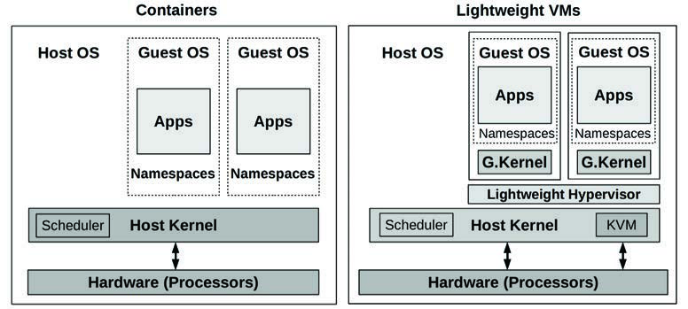
**图 11.14 轻量级虚拟化**

轻量级硬件虚拟化使用基于处理器虚拟化的轻量级虚拟机监控器 (hypervisor)，以及最少数量的模拟设备。这不同于全机硬件虚拟机监控器（第 11.2 节“硬件虚拟化”），后者起源于桌面虚拟机，包括对视频、音频、BIOS、PCI 总线和其他设备的支持，以及不同级别的处理器支持。仅用于服务器计算的虚拟机监控器不需要支持这些设备，而且现今编写的监控器可以假设现代处理器虚拟化功能是可用的。

为了说明这种差异：用于 KVM 的全机硬件虚拟机监控器 QEMU 拥有超过 140 万行代码（QEMU 4.2 版本）。Amazon Firecracker 是一个轻量级虚拟机监控器，仅有 5 万行代码 [Agache 20]。

轻量级虚拟机 (MicroVM) 的行为类似于第 11.2 节中描述的配置 B 硬件虚拟机。与硬件虚拟机相比，轻量级虚拟机具有更快的启动时间、更低的内存开销和更高的安全性。轻量级虚拟机监控器可以通过将命名空间配置为另一层安全保障来进一步提高安全性，如图 11.14 所示。

一些实现将轻量级虚拟机描述为容器，而另一些则使用术语 MicroVM。我更喜欢术语 MicroVM，因为术语容器通常与操作系统虚拟化相关联。

### 11.4.1 实现 (Implementation)

有几个轻量级硬件虚拟化项目，包括：
*   **Intel Clear Containers**：2015 年启动，使用 Intel VT 功能提供轻量级虚拟机。该项目证明了轻量级容器的潜力，实现了不到 45 毫秒的启动时间 [Kadera 16]。2017 年，Intel Clear Containers 加入了 Kata Containers 项目，并继续开发。
*   **Kata Containers**：2017 年启动，该项目基于 Intel Clear Containers 和 Hyper.sh RunV，隶属于 OpenStack 基金会。其网站口号是：“容器的速度，虚拟机的安全” [Kata Containers 20]。
*   **Google gVisor**：2018 年作为开源发布，gVisor 使用专门的用 Go 编写的用户态内核作为客户机，提高了容器的安全性。
*   **Amazon Firecracker**：2019 年作为开源发布 [Firecracker 20]，它使用 KVM 结合新的轻量级 VMM 代替 QEMU，并实现了约 100 毫秒的系统启动时间 [Agache 20]。

以下各节描述了常用的实现：轻量级硬件虚拟机监控器（Intel Clear Containers、Kata Containers 和 Firecracker）。gVisor 是一种不同的方法，它实现自己的轻量级内核，其特性更接近于容器（第 11.3 节“操作系统虚拟化”）。

### 11.4.2 开销 (Overhead)

其开销与第 11.2.2 节“开销”中描述的 KVM 虚拟化类似，但由于 VMM 小得多，内存占用更低。Intel Clear Containers 2.0 报告每个容器的内存开销为 48-50 MB [Kadera 16]；Amazon Firecracker 报告的开销小于 5 MB [Agache 20]。

### 11.4.3 资源控制 (Resource Controls)

由于 VMM 进程运行在宿主机上，它们可以由操作系统级的资源控制（cgroups、qdiscs 等）进行管理，类似于第 11.2.3 节“资源控制”中描述的 KVM 虚拟化。这些操作系统级的资源控制在第 11.3.3 节中针对容器进行了更详细的讨论。

### 11.4.4 可观测性 (Observability)

可观测性与第 11.2.4 节“可观测性”中描述的 KVM 虚拟化类似。总结如下：
*   **从宿主机**：可以使用标准操作系统工具观察所有物理资源，如前几章所述。客户机虚拟机以进程形式可见。客户机内部情况（包括虚拟机内的进程及其文件系统）无法直接观察。对于虚拟机监控器操作员，如果需要分析客户机内部情况，必须获得授权（例如 SSH）。
*   **从客户机**：可以看到虚拟化资源及其在客户机中的使用情况，并推断出物理问题。由于虚拟机拥有专用的内核，内核跟踪工具（包括基于 BPF 的工具）都可以正常工作。

作为一个可观测性的例子，下面显示了从宿主机观察到的 Firecracker 虚拟机，使用的是 `top(1)` [^13]：

```text
host# top
top - 15:26:22 up 25 days, 22:03,  2 users,  load average: 4.48, 2.10, 1.18
Tasks: 495 total,   1 running, 398 sleeping,   2 stopped,   0 zombie
%Cpu(s): 25.4 us,  0.1 sy,  0.0 ni, 74.4 id,  0.0 wa,  0.0 hi,  0.0 si,  0.0 st
KiB Mem : 24422712 total,  8268972 free, 10321548 used,  5832192 buff/cache
KiB Swap: 32460792 total, 31906152 free,   554640 used. 11185060 avail Mem


  PID USER      PR  NI    VIRT    RES    SHR S  %CPU %MEM     TIME+ COMMAND
30785 root      20   0 1057360 297292 296772 S 200.0  1.2   0:22.03 firecracker
31568 bgregg    20   0  110076   3336   2316 R  45.7  0.0   0:01.93 sshd
31437 bgregg    20   0   57028   8052   5436 R  22.8  0.0   0:01.09 ssh
30719 root      20   0  120320  16348  10756 S   0.3  0.1   0:00.83 ignite-spawn
    1 root      20   0  227044   7140   3540 S   0.0  0.0  15:32.13 systemd
[..]
```

整个虚拟机表现为名为 `firecracker` 的单个进程。此输出显示它正在消耗 200% 的 CPU（2 个 CPU）。从宿主机无法分辨哪些客户机进程正在消耗这些 CPU。

下面显示了从客户机运行的 `top(1)`：

```text
guest# top
top - 22:26:30 up 16 min,  1 user,  load average: 1.89, 0.89, 0.38
Tasks:  67 total,   3 running,  35 sleeping,   0 stopped,   0 zombie
%Cpu(s): 81.0 us, 19.0 sy,  0.0 ni,  0.0 id,  0.0 wa,  0.0 hi,  0.0 si,  0.0 st
KiB Mem :  1014468 total,   793660 free,    51424 used,   169384 buff/cache
KiB Swap:        0 total,        0 free,        0 used.   831400 avail Mem


  PID USER      PR  NI    VIRT    RES    SHR S  %CPU %MEM     TIME+ COMMAND
 1104 root      20   0   18592   1232    700 R 100.0  0.1   0:05.77 bash
 1105 root      20   0   18592   1232    700 R 100.0  0.1   0:05.59 bash
 1106 root      20   0   38916   3468   2944 R   4.8  0.3   0:00.01 top
    1 root      20   0   77224   8352   6648 S   0.0  0.8   0:00.38 systemd
    3 root       0 -20       0      0      0 I   0.0  0.0   0:00.00 rcu_gp
[...]
```

输出现在显示 CPU 被两个 bash 程序消耗。

还请对比标题摘要的不同：宿主机的一分钟平均负载为 4.48，而客户机为 1.89。其他细节也不同，因为客户机有自己的内核，用于维护仅限客户机的统计信息。如第 11.3.4 节“可观测性”所述，这与容器不同，容器中从客户机看到的统计信息可能会意外地显示来自宿主机的全系统统计信息。

再举一个例子，下面显示了从客户机执行的 `mpstat(1)`：

```text
guest# mpstat -P ALL 1
Linux 4.19.47 (cd41e0d846509816)    03/21/20        _x86_64_  (2 CPU)


22:11:07  CPU   %usr %nice  %sys %iowait  %irq %soft %steal %guest %gnice  %idle
22:11:08  all  81.50  0.00 18.50    0.00  0.00  0.00   0.00   0.00   0.00   0.00
22:11:08    0  82.83  0.00 17.17    0.00  0.00  0.00   0.00   0.00   0.00   0.00
22:11:08    1  80.20  0.00 19.80    0.00  0.00  0.00   0.00   0.00   0.00   0.00
[...]
```

由于客户机分配了两个 CPU，此输出仅显示两个 CPU。

## 11.5 其他类型 (Other Types)

其他云计算原语和技术包括：
*   **函数即服务 (FaaS)**：开发者向云提交一个应用程序函数，该函数按需运行。虽然这简化了软件开发体验（因为没有服务器需要管理，“无服务器”），但也存在性能后果。函数的启动时间可能很长，而且由于没有服务器，最终用户无法运行传统的命令行可观测性工具。性能分析通常仅限于应用程序提供的间戳。
*   **软件即服务 (SaaS)**：提供高级软件，最终用户无需自行配置服务器或应用程序。性能分析仅限于运营商：由于无法访问服务器，最终用户除了进行基于客户端的计时外，几乎无能为力。
*   **单内核 (Unikernels)**：这项技术将应用程序与最少的内核部分编译成单个软件二进制文件，可由硬件虚拟机监控器直接执行，不需要操作系统。虽然这可能带来性能提升（例如最小化指令正文，从而减少 CPU 缓存污染）以及安全性提升（由于剔除了未使用代码），但单内核也带来了可观测性挑战，因为没有操作系统可以运行可观测性工具。内核统计信息（如 `/proc` 中的统计信息）可能也不存在。幸运的是，实现通常允许单内核作为普通进程运行，为分析提供了一条路径（尽管环境与虚拟机监控器不同）。虚拟机监控器也可以开发检查它们的方法，例如堆栈剖析：我开发了一个原型，可以生成正在运行的 MirageOS 单内核的火焰图 [Gregg 16a]。

对于所有这些技术，最终用户都没有操作系统可以登录（或进入容器）来进行传统的性能分析。FaaS 和 SaaS 必须由运营商进行分析。单内核需要定制的工具和统计信息，最好还有虚拟机监控器的剖析支持。

## 11.6 比较 (Comparisons)

比较各项技术可以帮助你更好地理解它们，即使你无法改变公司所使用的技术。表 11.7 比较了本章讨论的三种技术的性能属性。[^14]

**表 11.7 虚拟化技术性能属性比较**

| 属性 | 硬件虚拟化 | 操作系统虚拟化 (容器) | 轻量级虚拟化 |
| :--- | :--- | :--- | :--- |
| 示例 | KVM | 容器 | FireCracker |
| CPU 性能 | 高 (CPU 支持) | 高 | 高 (CPU 支持) |
| CPU 分配 | 固定到 vCPU | 灵活 (份额 + 带宽) | 固定到 vCPU |
| I/O 吞吐量 | 高 (使用 SR-IOV) | 高 (无内在开销) | 高 (使用 SR-IOV) |
| I/O 延迟 | 低 (使用 SR-IOV 且无 QEMU) | 低 (无内在开销) | 低 (使用 SR-IOV) |
| 内存访问开销 | 有一些 (EPT/NPT 或影子页表) | 无 | 有一些 (EPT/NPT 或影子页表) |
| 内存损失 | 有一些 (额外的内核、页表) | 无 | 有一些 (额外的内核、页表) |
| 内存分配 | 固定 (且可能出现双重缓存) | 灵活 (未使用的客户机内存用于文件系统缓存) | 固定 (且可能出现双重缓存) |
| 资源控制 | 最多 (内核加上虚拟机监控器控制) | 许多 (取决于内核) | 最多 (内核加上虚拟机监控器控制) |
| 可观测性：从宿主机 | 中等 (资源使用情况、监控器统计信息、针对类似 KVM 的监控器的操作系统检查，但无法查看客户机内部) | 高 (看到一切) | 中等 (资源使用情况、监控器统计信息、针对类似 KVM 的监控器的操作系统检查，但无法查看客户机内部) |
| 可观测性：从客户机 | 高 (完整的内核和虚拟设备检查) | 中等 (仅限用户态，内核计数器，完整的内核可见性受限)，并带有额外的全系统指标 (如 `iostat(1)`) | 高 (完整的内核和虚拟设备检查) |
| 可观测性偏向 | 最终用户 | 宿主机操作员 | 最终用户 |
| 虚拟机监控器复杂性 | 最高 (增加了复杂的监控器) | 中等 (操作系统) | 高 (增加了轻量级监控器) |
| 不同的操作系统客户机 | 是 | 通常不是（有时通过系统调用翻译可能实现，但这会增加开销） | 是 |

虽然随着这些虚拟化技术开发出更多功能，此表将会过时，但它仍然可以向你展示在开发出不属于这些类别的全新虚拟化技术时，应该寻找哪些特性。

虚拟化技术通常通过微基准测试来比较哪种性能最好。不幸的是，这忽略了能够观察系统的重要性，而这恰恰能带来最大的性能提升。可观测性通常使识别并消除不必要的工作成为可能，从而可能获得远大于微小的监控器差异带来的性能收益。

对于云操作员来说，最高的可观测性选项是容器，因为从宿主机上可以看到所有的进程及其交互。对于最终用户来说，则是虚拟机，因为它们允许用户拥有内核访问权限，以运行所有的基于内核的性能工具，包括第 13、14 和 15 章中的工具。另一种选择是具有内核访问权限的容器，这让操作员和用户都能完全看到一切；然而，只有在客户同时运行容器宿主机时，这才是可选方案，因为它缺乏容器间的安全隔离。

虚拟化仍然是一个不断发展的领域，轻量级硬件虚拟机监控器仅在最近几年才出现。鉴于它们的优点，特别是在终端用户可观测性方面，我预计它们的使用将会增长。

## 11.7 习题 (Exercises)

1. 回答以下关于虚拟化术语的问题：
    *   宿主机 (host) 和客户机 (guest) 有什么区别？
    *   什么是租户 (tenant)？
    *   什么是虚拟机监控器 (hypervisor)？
    *   什么是硬件虚拟化？
    *   什么是操作系统虚拟化？
2. 回答以下概念性问题：
    *   描述性能隔离的作用。
    *   描述现代硬件虚拟化（如 Nitro）的性能开销。
    *   描述操作系统虚拟化（如 Linux 容器）的性能开销。
    *   描述从硬件虚拟化客户机（Xen 或 KVM）进行的物理系统可观测性。
    *   描述从操作系统虚拟化客户机进行的物理系统可观测性。
    *   解释硬件虚拟化（如 Xen 或 KVM）与轻量级硬件虚拟化（如 Firecracker）之间的区别。
3. 选择一种虚拟化技术，并为客户机回答以下问题：
    *   描述如何应用内存限制，以及从客户机如何看到该限制。（当客户机内存耗尽时，系统管理员会看到什么？）
    *   如果有强制的 CPU 限制，描述它是如何应用的，以及从客户机如何看到该限制。
    *   如果有强制的磁盘 I/O 限制，描述它是如何应用的，以及从客户机如何看到该限制。
    *   如果有强制的网络 I/O 限制，描述它是如何应用的，以及从客户机如何看到该限制。
4. 为资源控制开发一个 USE 方法检查表。包括如何获取每个指标（例如，执行哪个命令）以及如何解释结果。在安装或使用额外的软件产品之前，尝试使用现有的操作系统可观测性工具。

## 11.8 参考文献 (References)

*   [Goldberg 73] Goldberg, R. P., Architectural Principles for Virtual Computer Systems, Harvard University (Thesis), 1972.
*   [Waldspurger 02] Waldspurger, C., “Memory Resource Management in VMware ESX Server,” Proceedings of the 5th Symposium on Operating Systems Design and Implementation, 2002.
*   [Cherkasova 05] Cherkasova, L., and Gardner, R., “Measuring CPU Overhead for I/O Processing in the Xen Virtual Machine Monitor,” USENIX ATEC, 2005.
*   [Adams 06] Adams, K., and Agesen, O., “A Comparison of Software and Hardware Techniques for x86 Virtualization,” ASPLOS, 2006.
*   [Gupta 06] Gupta, D., Cherkasova, L., Gardner, R., and Vahdat, A., “Enforcing Performance Isolation across Virtual Machines in Xen,” ACM/IFIP/USENIX Middleware, 2006.
*   [Qumranet 06] “KVM: Kernel-based Virtualization Driver,” Qumranet Whitepaper, 2006.
*   [Cherkasova 07] Cherkasova, L., Gupta, D., and Vahdat, A., “Comparison of the Three CPU Schedulers in Xen,” ACM SIGMETRICS, 2007.
*   [Corbet 07a] Corbet, J., “Process containers,” LWN.net, https://lwn.net/Articles/236038, 2007.
*   [Corbet 07b] Corbet, J., “Notes from a container,” LWN.net, https://lwn.net/Articles/256389, 2007.
*   [Liguori, 07] Liguori, A., “The Myth of Type I and Type II Hypervisors,” http://blog.codemonkey.ws/2007/10/myth-of-type-i-and-type-ii-hypervisors.html, 2007.
*   [VMware 07] “Understanding Full Virtualization, Paravirtualization, and Hardware Assist,” https://www.vmware.com/techpapers/2007/understanding-full-virtualization-paravirtualizat-1008.html, 2007.

[^13]: 虚拟机是使用 microVM 容器管理器 Weave Ignite 创建的 [Weaveworks 20]。
[^14]: 请注意，此表仅侧重于性能。还有其他区别，例如，容器被描述为具有较弱的安全性 [Agache 20]。
