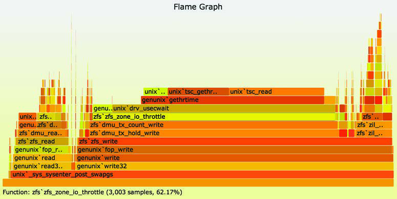
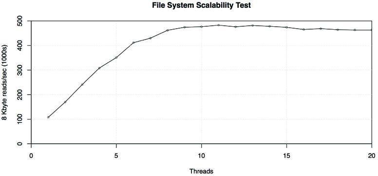

基准测试（Benchmarking）以一种受控的方式测试性能，以便在生产环境遇到性能极限之前，对不同的选择进行比较、识别性能退化并理解性能极限。这些极限可能是系统资源、虚拟化环境（云计算）中的软件限制，或者是目标应用程序中的限制。前面的章节已经探讨了这些组件，描述了存在的限制类型以及用于分析它们的工具。

前面的章节还介绍了微基准测试（micro-benchmarking）工具，它们使用简单的压力测试工作负载（如文件系统 I/O）来测试组件。此外还有宏基准测试（macro-benchmarking），它通过模拟客户端工作负载来测试整个系统。宏基准测试可能涉及客户端工作负载模拟或跟踪重放（trace replay）。无论使用哪种类型，分析基准测试以确认正在测量的内容都非常重要。基准测试仅能告诉你系统运行该基准测试的速度；理解结果并确定其如何应用于你的环境则取决于你自己。

本章的学习目标包括：
- 理解微基准测试和宏基准测试。
- 意识到需要避免的众多基准测试失败。
- 遵循主动基准测试方法论。
- 使用基准测试清单来核对结果。
- 提高执行和解读基准测试的准确性。

本章将概括性地讨论基准测试，提供建议和方法论来帮助你避免常见错误并准确测试你的系统。当你需要解读他人的结果（包括供应商和行业基准测试）时，这些背景知识也非常有用。

## 12.1 背景 (Background)

本节描述了基准测试活动和有效的基准测试，并总结了常见错误。

### 12.1.1 原因 (Reasons)

执行基准测试可能出于以下原因：
- **系统设计**：比较不同的系统、系统组件或应用程序。对于商业产品，基准测试可以提供数据辅助购买决策，特别是可用选项的性价比（price/performance ratio）。[^1] 在某些情况下，可以使用已发布的行业基准测试结果，从而避免客户自行执行基准测试。
- **概念验证 (PoC)**：在购买或投入生产部署之前，测试软件或硬件在负载下的性能。
- **调优 (Tuning)**：测试可调参数和配置选项，以识别值得配合生产工作负载进一步研究的选项。
- **开发**：在产品开发过程中进行非回归测试（non-regression testing）和极限调查。非回归测试可以是一套定期运行的自动化性能测试，以便尽早发现任何性能退化并快速对应到产品变更。对于极限调查，基准测试可用于在开发期间将产品推向极限，以确定工程力量应重点投入在何处以提升产品性能。
- **容量规划 (Capacity Planning)**：为容量规划确定系统和应用程序的限制，既可以为性能建模提供数据，也可以直接发现容量限制。
- **故障排除 (Troubleshooting)**：验证组件是否仍能以最大性能运行。例如：测试主机间的最大网络吞吐量，以检查是否存在网络问题。
- **营销 (Marketing)**：确定产品的最大性能以供市场营销使用（也称为“基准营销” benchmarketing）。

在企业内部环境（on-premises），在概念验证期间对硬件进行基准测试可能是提交大规模硬件采购前的一项重要练习，这个过程可能会持续数周或数月。这包括运输、上架、布线系统，以及在测试前安装操作系统的过程。随着新硬件的发布，这样的过程可能每一两年发生一次。

然而，在云计算环境中，资源可以按需获取，无需对硬件进行昂贵的初始投资，并且可以根据需要快速修改（重新部署到不同的实例类型上）。在选择要使用的应用程序编程语言，以及运行哪个操作系统、数据库、Web 服务器和负载均衡器时，这些环境仍涉及长期投资。其中一些选择在以后可能很难更改。执行基准测试可以调查各种选项在需要时扩展的能力。云计算模型使基准测试变得容易：可以在几分钟内创建一个大规模环境，用于基准测试运行，然后将其销毁，成本非常低。

请注意，容错且分布式的云环境也使实验变得容易：当有新的实例类型可用时，该环境可能允许立即使用生产工作负载进行测试，从而跳过传统的基准测试评估。在这种情况下，基准测试仍可用于通过比较组件性能来更详细地解释性能差异。例如，Netflix 性能工程团队拥有自动化软件，可以使用各种微基准测试分析新的实例类型。这包括自动收集系统统计数据和 CPU 剖析，以便分析和解释发现的任何差异。

### 12.1.2 有效的基准测试 (Effective Benchmarking)

基准测试做得好得出奇地难，有很多出错和疏忽的机会。正如论文《对文件系统和存储基准测试的九年研究》[Traeger 08] 中所总结的：

> 在本文中，我们调查了近期 106 篇论文中的 415 个文件系统和存储基准测试。我们发现大多数流行的基准测试都存在缺陷，许多研究论文没有提供真实性能的清晰指示。

该论文还对应该做些什么提出了建议；特别是，基准测试评估应说明测试了什么以及原因，并且应执行一些对系统预期行为的分析。

良好基准测试的本质也被总结为 [Smaalders 06]：
- **可重复性 (Repeatable)**：方便比较。
- **可观测性 (Observable)**：以便对性能进行分析和理解。
- **可移植性 (Portable)**：允许在竞争对手之间以及不同的产品发布版本之间进行基准测试。
- **易于呈现 (Easily presented)**：让每个人都能理解结果。
- **现实性 (Realistic)**：测量结果应反映客户体验的现实情况。
- **可运行性 (Runnable)**：以便开发人员可以快速测试变更。

在为了采购而比较不同系统时，必须增加另一个特征：性价比。价格可以量化为设备的五年资本成本 [Anon 85]。

有效的基准测试也关系到你如何应用基准测试：分析和得出的结论。

#### 基准测试分析 (Benchmark Analysis)

在使用基准测试时，你需要了解：
- 测试的是什么
- 限制因素是什么
- 可能影响结果的任何扰动
- 从结果中可以得出什么结论

这些需求需要对基准测试软件在做什么、系统如何响应以及结果与目标环境的关系有深刻的理解。

由于有基准测试工具和运行它的系统访问权限，这些需求最好在基准测试运行时通过系统的性能分析来满足。一个常见的错误是让初级员工执行基准测试，然后在基准测试完成后请性能专家来解释结果。最好在基准测试期间就邀请性能专家，以便他们在系统仍在运行时对其进行分析。这可能包括下钻分析（drill-down analysis）以解释并量化限制因素。

以下是一个有趣的分析例子：

> 作为调查所得 TCP/IP 实现性能的实验，我们在两台不同机器上的两个用户进程之间传输了 4 MB 的数据。传输被划分为 1024 字节的记录，并封装在 1068 字节的以太网数据包中。通过 TCP/IP 将数据从我们的 11/750 发送到 11/780 需要 28 秒。这包括建立和断开连接所需的所有时间，用户对用户吞吐量为 1.2 Megabaud。在此期间，11/750 的 CPU 饱和，但 11/780 约有 30% 的空闲时间。在系统中处理数据所花费的时间分布在以太网处理（20%）、IP 数据包处理（10%）、TCP 处理（30%）、校验和计算（25%）以及用户系统调用处理（15%）之间，没有任何一个部分在系统处理时间中占据主导地位。

这段话描述了检查限制因素（“11/750 的 CPU 饱和”[^2]），然后解释了导致这些限制的内核组件细节。顺便提一下，能够执行这种分析并在高层级总结内核 CPU 时间花在何处，直到最近使用火焰图才变得容易。这段话远早于火焰图：它来自 1981 年 Bill Joy 对原始 BSD TCP/IP 栈的描述 [Joy 81]！

与其使用现成的基准测试工具，你可能会发现开发自己的定制基准测试软件（或者至少是定制的负载生成器）更有效。这些软件可以保持精简，只专注于测试所需的内容，使它们易于分析和调试。

在某些情况下，你无法访问基准测试工具或系统，例如阅读他人的基准测试结果时。根据可用资料考虑上述要点，此外还要问：系统环境是什么？它是如何配置的？有关更多问题，请参见第 12.4 节“基准测试问题”。

### 12.1.3 基准测试失败案例 (Benchmarking Failures)

以下各节提供了一份各种基准测试失败——错误、谬误和不当行为——的清单，以及如何避免它们。第 12.3 节“方法论”描述了如何执行基准测试。

#### 1. 随意基准测试 (Casual Benchmarking)

做好基准测试并不是一项“一劳永异”的活动。基准测试工具提供数字，但这些数字可能并不反映你认为的内容，因此你关于它们的结论可能是虚假的。我将其总结为：

> 随意基准测试：你对 A 进行基准测试，但实际上测量的是 B，并得出你测量了 C 的结论。

良好的基准测试需要严谨地核查实际测量的内容，并理解测试的内容，以便形成有效的结论。

例如，许多工具声称或暗示它们测量磁盘性能，但实际上测试的是文件系统性能。两者的差异可能是几个数量级，因为文件系统采用缓存和缓冲来用内存 I/O 代替磁盘 I/O。尽管基准测试工具可能运行正常并在测试文件系统，但你关于磁盘的结论将是极其错误的。

对于初学者来说，理解基准测试尤其困难，因为他们没有判断数字是否可疑的直觉。如果你买了一个温度计，显示你所在的房间温度是 1,000 华氏度（或摄氏度），你会立即知道出了问题。基准测试则不同，它产生的数字对你来说可能是完全陌生的。

#### 2. 盲目崇拜 (Blind Faith)

相信一个流行的基准测试工具是值得信赖的可能很有诱惑力，尤其是如果它是开源的并且已经存在了很长时间。这种认为流行等于有效的错觉被称为“诉诸大众”（argumentum ad populum）。

分析你正在使用的基准测试耗时且需要专业知识。而且，对于一个流行的基准测试，分析那些肯定有效的内容似乎是浪费时间。

如果一个流行的基准测试是由顶尖科技公司之一推广的，你会信任它吗？这在过去曾发生过，资深性能工程师都知道所推广的微基准测试存在缺陷，根本不应该被使用。没有什么简单的方法可以阻止这种情况发生（我尝试过）。

问题甚至不一定出在基准测试软件本身——尽管确实会发生 Bug——而是在于对基准测试结果的解读。

#### 3. 缺乏分析的数字 (Numbers Without Analysis)

如果只提供纯粹的基准测试结果而没有分析细节，可能表明作者缺乏经验，并假设基准测试结果是值得信赖且最终的。通常，这只是调查的开始——最终调查会发现结果是错误或令人困惑的。

每一个基准测试数字都应附带对遇到的限制的描述以及所执行的分析。我这样总结其中的风险：

> 如果你研究一个基准测试结果的时间少于一周，它很可能是错的。

本书的大部分内容侧重于分析性能，这应在基准测试期间进行。在没有时间进行仔细分析的情况下，列出你没有时间核对的假设并将其随结果一起提供是个好主意，例如：
- 假设基准测试工具没有 Bug。
- 假设磁盘 I/O 测试确实测量的是磁盘 I/O。
- 假设基准测试工具如预期般将磁盘 I/O 推向了极限。
- 假设这种类型的磁盘 I/O 与该应用程序相关。

如果以后认为基准测试结果足够重要，值得投入更多精力，这可以成为进一步验证的任务列表。

#### 4. 复杂的基准测试工具 (Complex Benchmark Tools)

重要的是，基准测试工具不要因为自身的复杂性而阻碍基准测试分析。理想情况下，该程序应是开源的以便研究，且足够精简以便快速阅读和理解。

对于微基准测试，建议选择用 C 语言编写的。对于客户端模拟基准测试，建议使用与客户端相同的编程语言，以尽量减少差异。

一个常见的问题是“对基准测试进行基准测试”——即报告的结果受限于基准测试软件本身。造成这种情况的一个常见原因是单线程的基准测试软件。复杂的基准测试套件可能由于需要理解和分析的代码量庞大而使分析变得困难。

#### 5. 测试了错误的东西 (Testing the Wrong Thing)

虽然有众多的基准测试工具可用于测试各种工作负载，但其中许多可能与目标应用程序无关。

例如，一个常见的错误是测试磁盘性能——基于磁盘基准测试工具的可用性——即使预期目标环境的工作负载完全在文件系统缓存中运行，且不受磁盘 I/O 的影响。

类似地，一个正在开发产品的工程团队可能会标准化一个特定的基准测试，并投入所有性能精力来改善该基准测试所测量的性能。然而，如果它实际上并不类似于客户的工作负载，那么工程努力将针对错误的行为进行优化 [Smaalders 06]。

对于现有的生产环境，工作负载特征分析方法论（在前面的章节中涵盖）可以测量从设备 I/O 到应用程序请求的真实工作负载构成。这些测量可以指导你选择最相关的基准测试。如果没有可供分析的生产环境，你可以设置模拟环境进行分析，或对预期的工作负载建模。还要向基准测试数据的预期受众核对，看他们是否同意这些测试。

一个基准测试在很久以前可能测试过合适的工作负载，但现在多年没有更新，测试的内容已经不对了。

#### 6. 忽略环境 (Ignoring the Environment)

生产环境与测试环境匹配吗？假设你的任务是评估一个新数据库。你配置了一台测试服务器并运行数据库基准测试，结果后来才得知你错过了一个重要步骤：你的测试服务器是采用默认可调参数、默认文件系统等的默认设置。生产数据库服务器针对高磁盘 IOPS 进行了调优，因此在未调优的系统上测试是不现实的：你错过了首先了解生产环境这一步。

#### 7. 忽略错误 (Ignoring Errors)

仅仅因为基准测试工具产生了结果，并不意味着该结果反映了一次成功的测试。一些——甚至所有——请求可能都导致了错误。虽然这个问题已被前面的错误涵盖，但这一个特别常见，值得单独指出。

在一次 Web 服务器性能基准测试中，我被提醒了这一点。执行测试的人员报告说，Web 服务器的平均延迟对于他们的需求来说太高了：平均超过一秒。一秒？一秒？一些快速分析确定了问题所在：Web 服务器在测试期间根本没有做任何工作，因为所有请求都被防火墙拦截了。所有请求。显示的延迟是基准测试客户端超时并报错所需的时间！

#### 8. 忽略方差 (Ignoring Variance)

基准测试工具（尤其是微基准测试）通常应用稳定且一致的工作负载，该负载基于对现实世界特征（如在一天中不同时间或在一个间隔期间）的一系列测量平均值。例如，可能发现磁盘工作负载的平均速率为 500 次读/秒和 50 次写/秒。基准测试工具随后可能会模拟这个速率，或者模拟 10:1 的读写比，以便测试更高的速率。

这种方法忽略了方差：操作的速率可能是多变的。操作的类型也可能变化，且某些类型可能正交发生。例如，写入可能是每 10 秒以突发方式应用（异步回写数据刷新），而同步读取则是稳定的。写入突发可能会在生产中引起真实问题，例如通过对读取进行排队，但如果基准测试应用的是稳定的平均速率，则不会模拟这种情况。

模拟方差的一种可能解决方案是基准测试使用马尔可夫模型（Markov model）：这可以反映一次写入之后紧接着另一次写入的概率。

#### 9. 忽略扰动 (Ignoring Perturbations)

考虑可能影响结果的外部扰动。定时系统活动（如系统备份）是否会在基准测试期间执行？监控代理是否每分钟收集一次统计数据？对于云环境，扰动可能是由同一宿主机上不可见的租户引起的。

消除扰动的一个常见策略是延长基准测试运行时间——几分钟而不是几秒钟。通常，基准测试的持续时间不应短于一秒。短时间测试可能会受到设备中断（在执行中断服务例程时固定线程）、内核 CPU 调度决策（在迁移排队线程以保持 CPU 亲和性之前等待）以及 CPU 缓存热度效应的异常干扰。尝试多次运行基准测试并检查标准差——这应该尽可能小。

还要收集数据，以便研究扰动（如果存在）。这可能包括收集操作延迟的分布——而不仅仅是基准测试的总运行时间——以便观察离群值并记录其细节。

#### 10. 同时改变多个因素 (Changing Multiple Factors)

在比较两次测试的基准测试结果时，要仔细理解两者之间所有不同的因素。

例如，如果通过网络对两台主机进行基准测试，它们之间的网络是否完全相同？如果其中一台主机跳数更多、网络更慢或更拥堵怎么办？任何这类额外因素都可能使基准测试结果失效。

在云中，有时通过创建实例、测试实例然后销毁实例来执行基准测试。这可能产生许多不可见的因素：实例可能创建在更快或更慢的系统上，或者创建在其他租户负载和竞争更重的系统上。我建议测试多个实例并取中位数（或者更好的是记录分布情况），以避免由于测试了一个异常快或慢的系统而产生的离群值。

#### 11. 基准测试悖论 (Benchmark Paradox)

潜在客户经常使用基准测试来评估你的产品，而这些测试往往非常不准确，你甚至不如掷硬币。一位销售人员曾告诉我，他很乐意接受这种概率：赢得一半的产品评估就能达到他的销售目标。但忽视基准测试是基准测试的一个陷阱，而现实中的概率要糟糕得多。我将其总结为：

> “如果你的产品赢得基准测试的机会是 50/50，你通常会输。” [Gregg 14c]

这个看似矛盾的现象可以用简单的概率来解释。

当基于性能购买产品时，客户往往希望非常确定产品的表现。这可能意味着不只运行一个基准测试，而是多个，并希望产品在所有测试中都获胜。如果一个基准测试获胜的概率是 50%，那么：

赢得三个基准测试的概率 = 0.5 × 0.5 × 0.5 = 0.125 = 12.5%

基准测试越多——且要求全部获胜——机会就越渺茫。

#### 12. 对竞争对手进行基准测试 (Benchmarking the Competition)

你的市场部门可能想要显示你的产品如何击败竞争对手的基准测试结果。这比听起来要困难得多。

当客户选择一个产品时，他们不会只用五分钟，而是会用几个月。在此期间，他们会对产品进行性能分析和调优，可能会在最初几周内解决最严重的问题。

你没有几周的时间来分析和调优你的竞争对手。在可用时间内，你只能收集未调优的——因此是不现实的——结果。竞争对手的客户（也就是这项营销活动的目标受众）很可能会看到你发布了未调优的结果，因此你的公司在你想打动的人群中失去了公信力。

如果你必须对竞争对手进行基准测试，你需要投入大量时间来调优他们的产品。使用前几章描述的技术分析性能。此外，还要搜索最佳实践、客户论坛和错误数据库。你甚至可能想聘请外部专家来调优系统。在最终执行正面对抗的基准测试之前，也要对你自家的公司做出同样的努力。

#### 13. “友军火力” (Friendly Fire)

在对自己产品进行基准测试时，要尽一切努力确保测试了性能最好的系统和配置，并确保系统已被推向了真正的极限。在发布前与工程团队分享结果；他们可能会发现你遗漏的配置项。如果你在工程团队中，要留意基准测试工作——无论是来自你的公司还是签约的第三方——并给予帮助。

在一种情况下，我看到一个工程团队努力开发了一个高性能产品。其性能的关键是一项尚未记录在案的新技术。在产品发布时，一个基准测试团队被要求提供数据。他们不理解这项新技术（因为它没有记录），配置错误，然后发布了低估产品性能的数据。

有时系统可能配置正确，但只是没有推向极限。问这样一个问题：这个基准测试的瓶颈是什么？这可能是一个物理资源（如 CPU、磁盘或互连），通过分析可以识别出它已达到 100% 的利用率。参见第 12.3.2 节“主动基准测试”。

另一个“友军火力”问题是，对带有性能问题的旧版本软件进行基准测试（这些问题在后续版本中已修复），或者在手头仅有的有限设备上进行测试，产生的结果并不是最优的。你的潜在客户可能会认为任何发布的官方公司基准测试都显示了最佳性能——如果不提供最佳性能，就是在低估产品。

#### 14. 误导性基准测试 (Misleading Benchmarks)

误导性的基准测试结果在行业中很常见。它们可能是由于关于基准测试实际测量内容的非故意限制信息，或者是由于故意省略的信息。通常，基准测试结果在技术上是正确的，但随后会向客户进行歪曲陈述。

考虑这种假设情况：一家供应商通过构建一个极其昂贵、永远不会卖给实际客户的定制产品，取得了一个惊人的结果。价格没有随基准测试结果一起披露，结果侧重于非性价比指标。市场部门肆意传播关于结果的模棱两可的摘要（“我们快 2 倍！”），让客户在脑海中将其与公司概况或产品线关联起来。这属于为了在竞争中歪曲产品而省略细节的情况。虽然这可能不是作弊——数字不是伪造的——但它属于隐瞒真相的谎言。

这类供应商基准测试对于你来说作为性能上限仍然是有用的。它们是你（除了发生“友军火力”的情况外）不应预期能超过的值。

考虑另一种不同的假设情况：一个市场部门有一笔活动预算，想要一个好的基准测试结果来使用。他们聘请了几个第三方来对他们的产品进行基准测试，并从中挑选最好的结果。这些第三方被选中不是因为他们的专业知识，而是因为他们能交付快速且廉价的结果。事实上，缺乏专业知识甚至可能被认为是有利的：结果偏离现实越远越好——理想情况下，其中一个结果在正面方向上偏离巨大！

在使用供应商结果时，要仔细查看说明，了解测试了什么系统、使用了什么类型的磁盘及数量、使用了什么网络接口及其配置以及其他因素。有关需要警惕的具体细节，请参见第 12.4 节“基准测试问题”。

#### 15. 基准测试特供 (Benchmark Specials)

“基准测试特供”是指供应商研究一个流行的或行业基准测试，然后对产品进行工程设计，使其在该基准测试中得分很高，而不考虑实际客户的性能。这也被称为“针对基准测试进行优化”。

“基准测试特供”一词出现在 1993 年的 TPC-A 基准测试中，正如事务处理性能委员会 (TPC) 历史页面 [Shanley 98] 所述：

> 马萨诸塞州的一家咨询公司 Standish Group 指责 Oracle 在其数据库软件中增加了一个特殊选项（离散事务），其唯一目的是夸大 Oracle 的 TPC-A 结果。Standish Group 声称 Oracle“违反了 TPC 的精神”，因为离散事务选项是典型客户不会使用的，因此是一个基准测试特供。Oracle 极力否认这一指控，并称（有一定的道理）他们完全遵守了基准测试规范。Oracle 辩称，由于基准测试规范中没有提到基准测试特供，更不用说 TPC 的精神，因此指责他们违反任何规定是不公平的。

TPC 增加了一个反基准测试特供条款：

> 禁止所有能提高基准测试结果但不能提高真实性能或定价的“基准测试特供”实现。

由于 TPC 侧重于性价比，另一种夸大数字的策略是基于特殊定价——任何客户实际上都得不到的极深度折扣。就像特殊的软件更改一样，当真实客户购买系统时，结果并不符合现实。TPC 在其价格要求 [TPC 19a] 中解决了这个问题：

> TPC 规范要求总价格必须在客户购买该配置所支付价格的 2% 以内。

虽然这些例子有助于解释基准测试特供的概念，但 TPC 多年前就在其规范中解决了这些问题，你现在不一定能见到它们。

#### 16. 作弊 (Cheating)

基准测试的最后一个失败是作弊：分享虚假结果。幸运的是，这要么很罕见，要么根本不存在；我还没见过纯粹编造数字并分享的案例，即使是在最血腥的基准测试大战中。

## 12.2 基准测试类型 (Benchmarking Types)

图 12.1 展示了基准测试类型的图谱，基于它们测试的工作负载。生产工作负载也包含在该图谱中。


**图 12.1 基准测试类型**

以下各节描述了三种基准测试类型：微基准测试、模拟和跟踪/重放。还讨论了行业标准基准测试。

### 12.2.1 微基准测试 (Micro-Benchmarking)

微基准测试使用人工工作负载测试特定类型的操作，例如，执行单一类型的文件系统 I/O、数据库查询、CPU 指令或系统调用。优点是简单：缩小涉及的组件和代码路径范围，可以产生更容易研究的目标，并允许快速找到性能差异的根本原因。测试通常也是可重复的，因为其他组件的干扰已被尽可能地排除。微基准测试在不同系统上的测试通常也很快。并且由于它们是刻意人工化的，微基准测试不容易与真实工作负载模拟混淆。

为了使微基准测试结果具有参考价值，需要将其映射到目标工作负载。一个微基准测试可能测试多个维度，但可能只有一两个维度是相关的。对目标系统的性能分析或建模可以帮助确定哪些微基准测试结果是合适的，以及在多大程度上合适。

前面章节提到的微基准测试工具示例（按资源类型分类）包括：
- **CPU**：SysBench
- **内存 I/O**：lmbench（在第 6 章 CPU 中）
- **文件系统**：fio
- **磁盘**：hdparm, dd 或带有 direct I/O 的 fio
- **网络**：iperf

还有非常多的基准测试工具可用。然而，请记住 [Traeger 08] 的警告：“大多数流行的基准测试都存在缺陷。”

你也可以开发自己的工具。目标是使它们尽可能简单，识别出可以单独测试的工作负载属性。（有关这方面的更多信息，请参见第 12.3.6 节“自定义基准测试”。）使用外部工具验证它们是否执行了其声称的操作。

#### 设计示例 (Design Example)

考虑设计一个文件系统微基准测试来测试以下属性：顺序或随机 I/O、I/O 大小和方向（读或写）。表 12.1 显示了用于调查这些维度的五个示例测试，以及每个测试的原因。

**表 12.1 示例文件系统微基准测试测试**

| # | 测试 | 目的 |
| :--- | :--- | :--- |
| 1 | 顺序 512 字节读取 [^3] | 测试最大（现实的）IOPS |
| 2 | 顺序 1 MB 读取 [^4] | 测试最大读取吞吐量 |
| 3 | 顺序 1 MB 写入 | 测试最大写入吞吐量 |
| 4 | 随机 512 字节读取 | 测试随机 I/O 的影响 |
| 5 | 随机 512 字节写入 | 测试重写（rewrites）的影响 |

可以根据需要增加更多测试。所有这些测试都要乘以两个额外因素：
- **工作集大小 (Working set size)**：被访问数据的大小（例如，总文件大小）：
    - **远小于主内存**：以便数据完全缓存在文件系统缓存中，从而可以研究文件系统软件的性能。
    - **远大于主内存**：以尽量减少文件系统缓存的影响，并将基准测试引向测试磁盘 I/O。
- **线程数 (Thread count)**：假设工作集大小较小：
    - **单线程**：基于当前 CPU 时钟频率测试文件系统性能。
    - **足以使所有 CPU 饱和的多线程**：测试系统、文件系统和 CPU 的最大性能。

这些因素可以快速相乘以形成一个庞大的测试矩阵。可以使用统计分析技术来减少所需的测试集。

创建侧重于最高速度的基准测试被称为“晴天性能测试”（sunny day performance testing）。为了不忽略问题，你还需要考虑“阴天”或“雨天”性能测试，这涉及测试非理想情况，包括竞争、扰动和工作负载方差。

### 12.2.2 模拟 (Simulation)

许多基准测试模拟客户应用程序工作负载；这些有时被称为宏基准测试。它们可能基于生产环境的工作负载特征分析（参见第 2 章方法论）来确定要模拟的特征。例如，你可能会发现生产 NFS 工作负载由以下操作类型和概率组成：读取 40%；写入 7%；getattr 19%；readdir 1%；等等。其他特征也可以测量和模拟。

模拟可以产生类似于客户端在真实工作负载下表现的结果，即使不完全相同，也足够接近从而有用。它们可以涵盖使用微基准测试调查起来很耗时的许多因素。模拟还可以包括微基准测试可能会完全忽略的复杂系统交互效应。

第 6 章 CPU 中介绍的 CPU 基准测试 Whetstone 和 Dhrystone 就是模拟的例子。Whetstone 开发于 1972 年，用于模拟当时的科学工作负载。1984 年的 Dhrystone 模拟当时基于整数的工作负载。

许多公司使用内部或外部负载生成软件（例如 wrk [Glozer 19]、siege [Fulmer 12] 和 hey [Dogan 20]）来模拟客户端 HTTP 负载。这些可用于评估软件或硬件变更，也可用于模拟峰值负载（例如在线购物平台上的“秒杀”活动）以暴露可以分析和解决的瓶颈。

工作负载模拟可以是无状态的（stateless），其中每个服务器请求与之前的请求无关。例如，前面描述的 NFS 服务器工作负载可以通过请求一系列操作来模拟，每个操作类型根据测得的概率随机选择。

模拟也可以是有状态的（stateful），其中每个请求都依赖于客户端状态，至少是之前的请求。你可能会发现 NFS 读写往往成组到达，因此写入之后紧接着写入的概率远高于读取之后紧接着写入。这种工作负载可以使用马尔可夫模型更好地模拟，通过将请求表示为状态并测量状态转移概率 [Jain 91]。

模拟的一个问题是它们可能忽略方差，如第 12.1.3 节“基准测试失败案例”所述。客户的使用模式也会随时间变化，需要更新和调整这些模拟以保持相关性。然而，如果已经有了基于旧版本基准测试的发布结果，人们可能会抵触这种调整，因为旧结果将无法再与新版本进行比较。

### 12.2.3 重放 (Replay)

第三种基准测试涉及尝试将跟踪日志重放到目标，使用实际捕获的客户端操作来测试其性能。这听起来很理想——和在生产中测试一样好，对吧？然而，这存在问题：当服务器上的特性和交付延迟发生变化时，捕获的客户端工作负载不太可能对这些差异做出自然反应，这可能被证明并不比模拟的客户工作负载更好。当对其过度迷信时，情况可能会变得更糟。

考虑这种假设情况：一个客户正在考虑升级存储基础设施。当前的生产工作负载被跟踪并在新硬件上重放。不幸的是，性能变变差了，销售告吹。问题在于：跟踪/重放操作在磁盘 I/O 层面。旧系统使用的是 10 K rpm 磁盘，新系统使用的是更慢的 7200 rpm 磁盘。然而，新系统提供了 16 倍的文件系统缓存和更快的处理器。真实的生产工作负载本来会显示性能提升，因为它大部分会从缓存返回——这在重放磁盘事件时没有被模拟出来。

虽然这是一个测试了错误东西的案例，但其他细微的时间效应也可能搞砸事情，即使是在正确层级的跟踪/重放中。与所有基准测试一样，分析和理解正在发生的事情至关重要。

### 12.2.4 行业标准 (Industry Standards)

行业标准基准测试可从独立组织获得，这些组织旨在创建公平且相关的基准测试。这些通常是必须在特定准则下执行且定义明确、记录详尽的各种微基准测试和工作负载模拟的集合，以便结果如预期般呈现。供应商可以参与（通常需要付费），这为供应商提供了执行基准测试的软件。其结果通常需要完全披露配置环境，并可能接受审计。

对于客户来说，这些基准测试可以节省大量时间，因为各种供应商和产品的基准测试结果可能已经可用。那么你的任务就是找到与你未来或当前生产工作负载最接近的基准测试。对于当前工作负载，可以通过工作负载特征分析来确定。

1985 年一篇题为《事务处理能力的衡量》的论文 [Anon 85] 阐明了对行业标准基准测试的需求。它描述了衡量性价比的需求，并详细介绍了供应商可以执行的三个基准测试，分别称为 Sort、Scan 和 DebitCredit。它还建议了一个基于 DebitCredit 的每秒事务数（TPS）的行业标准衡量指标，可以像汽车的每加仑英里数一样使用。Jim Gray 及其工作后来促成了 TPC 的创建 [DeWitt 08]。

除了 TPS 衡量指标外，用于相同角色的其他指标还包括：
- **MIPS**：每秒百万条指令。虽然这是一种性能衡量指标，但所执行的工作取决于指令类型，这在不同的处理器架构之间可能难以比较。
- **FLOPS**：每秒浮点运算次数——与 MIPS 角色类似，但针对大量使用浮点计算的工作负载。

行业基准测试通常基于基准测试测量一个自定义指标，该指标仅用于与自身进行比较。

#### TPC

事务处理性能委员会 (TPC) 创建并管理侧重于数据库性能的行业基准测试。这些包括：
- **TPC-C**：模拟一个完整的计算环境，其中大量用户对数据库执行事务。
- **TPC-DS**：模拟决策支持系统，包括查询和数据维护。
- **TPC-E**：在线事务处理（OLTP）工作负载，模拟一个经纪公司数据库，其客户生成与交易、账户查询和市场研究相关的事务。
- **TPC-H**：决策支持基准测试，模拟即席查询（ad hoc queries）和并发数据修改。
- **TPC-VMS**：TPC 虚拟测量单系统，允许为虚拟化数据库收集其他基准测试。
- **TPCx-HS**：使用 Hadoop 的大数据基准测试。
- **TPCx-V**：测试虚拟机中的数据库工作负载。

TPC 结果在线共享 [TPC 19b]，并包含性价比。

#### SPEC

标准性能评估公司 (SPEC) 开发并发布了一套标准化的行业基准测试，包括：
- **SPEC Cloud IaaS 2018**：测试配置、计算、存储和网络资源，使用多个多实例工作负载。
- **SPEC CPU 2017**：衡量计算密集型工作负载，包括整数和浮点性能，以及一个可选的能耗指标。
- **SPECjEnterprise 2018 Web Profile**：衡量 Java 企业版（Java EE）Web Profile 版本 7 或更高版本的应用程序服务器、数据库和支撑基础设施的全系统性能。
- **SPECsfs2014**：为 NFS 服务器、通用互联网文件系统（CIFS）服务器和类似文件系统模拟客户端文件访问工作负载。
- **SPECvirt_sc2013**：针对虚拟化环境，衡量虚拟化硬件、平台、访客操作系统和应用程序软件的端到端性能。

SPEC 的结果在线共享 [SPEC 20]，包含系统调优细节和组件列表，但通常不包含价格。

## 12.3 方法论 (Methodology)

本节描述了执行基准测试的方法论和练习，无论是微基准测试、模拟还是重放。这些主题总结在表 12.2 中。

**表 12.2 基准测试分析方法论**

| 章节 | 方法论 | 类型 |
| :--- | :--- | :--- |
| 12.3.1 | 被动基准测试 (Passive benchmarking) | 实验分析 |
| 12.3.2 | 主动基准测试 (Active benchmarking) | 观测分析 |
| 12.3.3 | CPU 剖析 (CPU profiling) | 观测分析 |
| 12.3.4 | USE 方法 (USE method) | 观测分析 |
| 12.3.5 | 工作负载特征分析 (Workload characterization) | 观测分析 |
| 12.3.6 | 自定义基准测试 (Custom benchmarks) | 软件开发 |
| 12.3.7 | 阶梯负载 (Ramping load) | 实验分析 |
| 12.3.8 | 完备性检查 (Sanity check) | 观测分析 |
| 12.3.9 | 统计分析 (Statistical analysis) | 统计分析 |

### 12.3.1 被动基准测试 (Passive Benchmarking)

这是一种“一劳永逸”的基准测试策略——执行基准测试后就不管它，直到完成。主要目标是收集基准测试数据。这是基准测试通常的执行方式，在这里将其描述为一种“反方法论”，以便与主动基准测试进行对比。

以下是一些被动基准测试的示例步骤：
1. 挑选一个基准测试工具。
2. 使用各种选项运行它。
3. 将结果做成幻灯片。
4. 将幻灯片交给管理层。

这种方法的问题前面已经讨论过。总而言之，结果可能是：
- 由于基准测试软件的 Bug 而无效。
- 受限于基准测试软件（例如单线程）。
- 受限于与基准测试目标无关的组件（例如拥堵的网络）。
- 受限于配置（未启用性能特性，不是最大化配置）。
- 受到干扰（且不可重复）。
- 完全在对错误的东西进行基准测试。

被动基准测试虽然容易执行，但容易出错。如果由供应商执行，它可能会产生虚假警报，浪费工程资源或导致销售损失。如果由客户执行，它可能导致错误的产品选择，从而影响公司的后续发展。

### 12.3.2 主动基准测试 (Active Benchmarking)

使用主动基准测试时，你在基准测试运行期间——而不仅仅是在完成后——使用可观测性工具分析性能 [Gregg 14d]。你可以确认基准测试是否测试了其声称的内容，并确保你理解该内容。主动基准测试还可以识别被测系统或基准测试本身的真实限制因素。在分享基准测试结果时，包含遇到的限制因素的具体细节会非常有帮助。

作为奖励，这也是提升你使用性能可观测性工具技能的好时机。理论上，你正在检查一个已知的负载，并可以看到它在这些工具中呈现的样子。

理想情况下，基准测试可以配置并留在稳态下运行，以便在数小时或数天的时间内进行分析。

#### 分析案例研究 (Analysis Case Study)

作为一个例子，让我们看看微基准测试工具 bonnie++ 的第一个测试。其帮助页（man page）描述如下（重点由我标注）：

> NAME
> bonnie++ - 测试**硬盘性能**的程序。

在其主页 [Coker 01] 上：

> Bonnie++ 是一个基准测试套件，旨在执行一些简单的**硬盘和文件系统性能**测试。

在 Ubuntu Linux 上运行 bonnie++：

```text
# bonnie++
[...]
Version  1.97       ------Sequential Output------ --Sequential Input- --Random-
Concurrency   1     -Per Chr- --Block-- -Rewrite- -Per Chr- --Block-- --Seeks--
Machine        Size K/sec %CP K/sec %CP K/sec %CP K/sec %CP K/sec %CP  /sec %CP
ip-10-1-239-21   4G   739  99 549247  46 308024  37  1845  99 1156838  38 +++++ +++
Latency             18699us     983ms     280ms   11065us    4505us    7762us
[...]
```

第一个测试是“Sequential Output”和“Per Chr”，根据 bonnie++ 的结果，得分为 739 KB/s。

完备性检查：如果这真的是“每个字符”的 I/O，那意味着系统实现了每秒 739,000 次 I/O。该基准测试被描述为测试硬盘性能，但我怀疑这台系统能达到这么高的磁盘 IOPS。

在运行第一个测试时，我使用 `iostat(1)` 检查磁盘 IOPS：

```text
$ iostat -sxz 1
[...]
avg-cpu:  %user   %nice %system %iowait  %steal   %idle
          11.44    0.00   38.81    0.00    0.00    49.75


Device             tps      kB/s    rqm/s   await aqu-sz  areq-sz  %util
[...]
```

没有报告任何磁盘 I/O。

现在使用 `bpftrace` 统计块 I/O 事件（参见第 9 章磁盘，第 9.6.11 节 bpftrace）：

```text
# bpftrace -e 'tracepoint:block:* { @[probe] = count(); }'
Attaching 18 probes...
^C


@[tracepoint:block:block_dirty_buffer]: 808225
@[tracepoint:block:block_touch_buffer]: 1025678
```

这同样显示没有发出块 I/O（没有 `block:block_rq_issue`）或完成（`block:block_rq_complete`）；然而，缓冲区被标记为“脏”了。使用 `cachestat(8)`（参见第 8 章文件系统，第 8.6.12 节 cachestat）查看文件系统缓存的状态：

```text
# cachestat 1
    HITS   MISSES  DIRTIES HITRATIO   BUFFERS_MB  CACHED_MB
       0        0        0    0.00%           49        361
     293        0    54299  100.00%           49        361
     250        0   298748  100.00%           49        361
     658        0   602499  100.00%           49        362
[...]
```

bonnie++ 从输出的第二行开始执行，这确认了“DIRTIES”负载：写入文件系统缓存。

检查 I/O 栈更高层（VFS 层）的 I/O（参见第 8 章文件系统，第 8.6.15 节 bpftrace）：

```text
# bpftrace -e 'kprobe:vfs_* /comm == "bonnie++"/ { @[probe] = count(); }'
Attaching 65 probes...
^C


@[kprobe:vfs_fsync_range]: 2
@[kprobe:vfs_statx_fd]: 6
@[kprobe:vfs_open]: 7
@[kprobe:vfs_read]: 13
@[kprobe:vfs_write]: 1176936
```

这显示确实存在繁重的 `vfs_write()` 负载。进一步使用 `bpftrace` 验证其大小：

```text
# bpftrace -e 'k:vfs_write /comm == "bonnie++"/ { @bytes = hist(arg2); }'
Attaching 1 probe...
^C


@bytes:
[1]               668839 |@@@@@@@@@@@@@@@@@@@@@@@@@@@@@@@@@@@@@@@@@@@@@@@@@@@@|
[2, 4)                 0 |                                                    |
[4, 8)                 0 |                                                    |
[8, 16)                0 |                                                    |
[16, 32)               1 |                                                    |
```

`vfs_write()` 的第三个参数是字节数，它通常是 1 字节（16 到 31 字节范围内的那一次写入很可能是 bonnie++ 关于开始基准测试的消息）。

通过在基准测试运行时进行分析（主动基准测试），我们了解到第一个 bonnie++ 测试是 1 字节的文件系统写入，且缓存在文件系统缓存中。它并不像 bonnie++ 描述所暗示的那样测试磁盘 I/O。

根据帮助页，bonnie++ 有一个 `-b` 选项表示“不使用写缓冲”，在每次写入后调用 `fsync(2)`。我将使用 `strace(1)` 来分析此行为，因为 `strace(1)` 以人类可读的方式打印所有系统调用。`strace(1)` 的开销很高，因此在使用 `strace(1)` 时产生的基准测试结果应予以作废。

```text
$ strace bonnie++ -b
[...]
write(3, "6", 1)                        = 1
write(3, "7", 1)                        = 1
write(3, "8", 1)                        = 1
write(3, "9", 1)                        = 1
write(3, ":", 1)                        = 1
[...]
```

输出显示 bonnie++ 并没有在每次写入后调用 `fsync(2)`。它还有一个 `-D` 选项用于 direct IO，但在我的系统上失败了。没有办法真正进行每字符的磁盘写入测试。

有些人可能会争辩说 bonnie++ 并没有坏，它确实做了一个“Sequential Output”和“Per Chr”测试：这两个术语都没有承诺磁盘 I/O。但对于一个声称测试“硬盘”性能的基准测试来说，这至少是具有误导性的。

Bonnie++ 并不是一个异常糟糕的基准测试工具；它在很多场合都为人们提供了很好的服务。我选择它作为例子（并选择了其最可疑的测试来研究），是因为它很有名，我以前研究过它，而且这种发现并不少见。但这只是一个例子。

旧版本的 bonnie++ 在这个测试中还有一个额外的问题：它允许 libc 在将写入发送到文件系统之前对其进行缓冲，因此 VFS 写入大小为 4 KB 或更高，具体取决于 libc 和操作系统版本。[^5] 这使得在使用了不同 libc 缓冲大小的不同操作系统之间比较 bonnie++ 结果变得具有误导性。这个问题在 bonnie++ 的近期版本中得到了修复，但这创造了另一个问题：bonnie++ 的新结果无法与旧结果进行比较。

有关 Bonnie++ 性能分析的更多信息，请参阅 Roch Bourbonnais 的文章《解码 Bonnie++》 [Bourbonnais 08]。

### 12.3.3 CPU 剖析 (CPU Profiling)

对基准测试目标和基准测试软件本身进行 CPU 剖析值得作为一种方法论单独列出，因为它可以带来一些快速发现。它通常作为主动基准测试调查的一部分执行。

其意图是快速检查所有软件正在做什么，看看是否有任何有趣的事情显现出来。这也可以将你的研究范围缩小到最重要的软件组件上：那些在基准测试中发挥作用的组件。

用户层和内核层的堆栈都可以进行剖析。用户层 CPU 剖析在第 5 章应用程序中介绍。两者都在第 6 章 CPU 中涵盖，示例见第 6.6 节“可观测性工具”，包括火焰图。

#### 示例 (Example)

在一个拟议的新系统上执行了磁盘微基准测试，结果令人失望：磁盘吞吐量比旧系统更差。我被要求找出出了什么问题，人们预期要么是磁盘要么是磁盘控制器质量较差，需要升级。

我从 USE 方法（第 2 章方法论）开始，发现磁盘并不太忙。有一些 CPU 使用，主要在系统时间（内核）。

对于磁盘基准测试，你可能不认为 CPU 会是一个有趣的分析目标。鉴于内核中存在一定的 CPU 使用量，我认为值得快速检查一下是否有任何有趣的事情显现出来，尽管我并没有预期会发现什么。我进行了剖析并生成了图 12.2 所示的火焰图。


**图 12.2 内核时间剖析火焰图**

浏览堆栈帧显示，62.17% 的 CPU 样本包含一个名为 `zfs_zone_io_throttle()` 的函数。我不需要阅读该函数的代码，因为它的名字就是一个足够清晰的线索：一种资源控制——ZFS I/O 节流（throttling）——正在起作用，并人为地限制了基准测试！这是新系统上的一个默认设置（但在旧系统上不是），在执行基准测试时被忽略了。

### 12.3.4 USE 方法 (USE Method)

USE 方法在第 2 章方法论中介绍，并在各章针对其研究的资源进行了讨论。在基准测试期间应用 USE 方法可以确保找到限制因素。要么是某个组件（硬件或软件）达到了 100% 的利用率，要么是你没有将系统推向极限。

### 12.3.5 工作负载特征分析 (Workload Characterization)

工作负载特征分析也在第 2 章方法论中介绍，并在后续章节中讨论。这种方法论可通过特征化生产工作负载以进行对比，从而确定给定基准测试与当前生产环境的相关性。

### 12.3.6 自定义基准测试 (Custom Benchmarks)

对于简单的基准测试，自行编写软件可能是可取的。尽量使程序保持精简，以避免因复杂性而妨碍分析。

C 语言通常是微基准测试的好选择，因为它与执行内容映射紧密——尽管你应该仔细考虑编译器优化将如何影响你的代码：如果编译器认为输出未被使用且因此无需计算，它可能会省掉简单的基准测试例程。务必在基准测试运行时使用其他工具确认其运行情况。反汇编编译后的二进制文件以查看实际执行的内容也是值得的。

涉及虚拟机、异步垃圾回收和动态运行时编译的语言，在可靠精度方面的调试和控制要困难得多。如果需要模拟用这些语言编写的客户端软件（宏基准测试），你可能仍需使用它们。

编写自定义基准测试还可以揭示关于目标的细微细节，这些细节以后可能会证明有用。例如，在开发数据库基准测试时，你可能会发现 API 支持各种提升性能的选项，但生产环境中目前并未使用这些选项（生产环境是在这些选项出现之前开发的）。

你的软件可能只是生成负载（负载生成器），而将测量留给其他工具。执行此操作的一种方法是阶梯式增加负载。

### 12.3.7 阶梯负载 (Ramping Load)

这是一种确定系统所能处理的最大吞吐量的简单方法。它涉及以小增量添加负载，并测量交付的吞吐量，直到达到极限。结果可以绘制成图表，显示可扩展性概况（scalability profile）。可以直观地研究该概况，或者使用可扩展性模型进行研究（参见第 2 章方法论）。

作为一个例子，图 12.3 显示了文件系统和服务器如何随线程数扩展。每个线程对缓存文件执行 8 KB 随机读取，这些线程被一个接一个地添加。


**图 12.3 阶梯式增加文件系统负载**

该测试的负载生成器是用 Perl 编写的，非常精简，足以作为示例完整列出：

```perl
#!/usr/bin/perl -w
#
# randread.pl - 随机读取指定文件。

use strict;

my $IOSIZE = 8192;                      # I/O 大小，字节
my $QUANTA = $IOSIZE;                   # 寻址粒度，字节

die "用法: randread.pl 文件名\n" if @ARGV != 1 or not -e $ARGV[0];

my $file = $ARGV[0];
my $span = -s $file;                    # 随机读取的范围，字节
my $junk;

open FILE, "$file" or die "错误: 读取 $file 时发生错误: $!\n";

while (1) {
        seek(FILE, int(rand($span / $QUANTA)) * $QUANTA, 0);
        sysread(FILE, $junk, $IOSIZE);
}

close FILE;
```

为了避免缓冲，这里使用 `sysread()` 直接调用 `read(2)` 系统调用。

这是为了对 NFS 服务器进行微基准测试而编写的，并从一组客户端集群中并行执行，每个客户端对 NFS 挂载的文件执行随机读取。微基准测试的结果（每秒读取次数）在 NFS 服务器上使用 `nfsstat(8)` 和其他工具进行测量。

使用的文件数量及其总大小是受控的（这构成了工作集大小），因此一些测试可以完全从服务器上的缓存返回，而另一些则从磁盘返回。（参见第 12.2.1 节“微基准测试”中的设计示例。）

在客户端集群中执行的实例数量被一个接一个地增加，以阶梯式增加负载直到达到极限。这也绘制成图表以研究可扩展性概况，同时还配合了资源利用率（USE 方法），确认了资源已耗尽。在这种情况下，是服务器上的 CPU 资源，这促使了另一项旨在进一步优化性能的研究。

我曾使用这个程序和这种方法找到了 Sun ZFS 存储阵列的极限 [Gregg 09b]。这些极限被用作官方结果——据我们所知，这创造了世界纪录。我当时还有一套类似的用 C 编写的软件，通常我会使用 C，但在这个案例中并不需要：我有充足的客户端 CPU，虽然切换到 C 降低了它们的利用率，但对结果没有影响，因为在目标机上达到了相同的瓶颈。还尝试了其他更复杂的基准测试以及其他语言，但它们都没能比这些基于 Perl 的结果有所提升。

遵循这种方法时，除了吞吐量，还要测量延迟，特别是延迟分布。一旦系统接近其极限，排队延迟可能会变得显著，导致延迟增加。如果你推高负载太猛，延迟可能会变得非常高，以至于不再合理地认为该结果是有效的。问问你自己，所交付的延迟对客户来说是否可接受。

例如：你使用大量客户端将目标系统推向 990,000 IOPS，该系统以平均 5 ms 的 I/O 延迟响应。你真的很想突破 100 万 IOPS，但系统已经接近饱和。通过不断添加更多客户端，你设法突破了 100 万 IOPS；然而，所有操作现在都在严重排队，平均延迟超过 50 ms，这是不可接受的！你把哪个结果交给市场部？（答案：990,000 IOPS。）

### 12.3.8 完备性检查 (Sanity Check)

这是一项通过调查任何不合理的特性来检查基准测试结果的练习。它包括检查结果是否要求某些组件超过其已知限制，例如网络带宽、控制器带宽、互连带宽或磁盘 IOPS。如果超过了任何限制，就值得详细调查。在大多数情况下，这项练习最终会发现基准测试结果是虚假的。

这里有一个例子：对一个 NFS 服务器进行 8 KB 读取基准测试，据报告其交付了 50,000 IOPS。它通过一个单 1 Gbps 以太网端口连接到网络。驱动 50,000 IOPS × 8 KB = 400,000 KB/s 所需的网络吞吐量，加上协议头。这超过了 3.2 Gbps——远超 1 Gbps 的已知限制。出问题了！

像这样的结果通常意味着基准测试测试的是客户端缓存，而没有将全部工作负载推向 NFS 服务器。

我曾利用这种计算识别出众多虚假的基准测试，其中包括通过单 1 Gbps 接口实现的以下吞吐量 [Gregg 09c]：
- 120 MB/s (0.96 Gbps)
- 200 MB/s (1.6 Gbps)
- 350 MB/s (2.8 Gbps)
- 800 MB/s (6.4 Gbps)
- 1.15 GB/s (9.2 Gbps)

这些都是单一方向的吞吐量。120 MB/s 的结果可能没问题——一个 1 Gbps 接口在实践中应能达到约 119 MB/s。200 MB/s 的结果只有在两个方向上都有繁重流量且被累加时才可能实现；然而，这些是单向结果。350 MB/s 及其以上的结果显然是虚假的。

当你被给到一个基准测试结果进行检查时，寻找你可以对提供的数字进行的任何简单加和，以发现此类限制。

如果你有权限访问系统，通过构建新的观测或实验来进一步测试结果可能是可行的。这可以遵循科学方法：你现在正在测试的问题是基准测试结果是否有效。由此可以得出假设和预测，然后进行验证。

### 12.3.9 统计分析 (Statistical Analysis)

统计分析可以用来研究基准测试数据。它遵循三个阶段：
1. 选择基准测试工具、其配置以及要捕获的系统性能指标。
2. 执行基准测试，收集大量的结果和指标数据集。
3. 通过统计分析解读数据，生成报告。

与侧重于在基准测试运行时分析系统的主动基准测试不同，统计分析侧重于分析结果。它也不同于被动基准测试，后者完全不进行任何分析。

这种方法被用于那些由于时间限制且成本高昂而无法长时间访问大规模系统的环境。例如，可能只有一个“最大配置”系统可用，但许多团队都想同时访问它运行测试，包括：
- **销售**：在概念验证期间，运行模拟的客户负载以展示最大配置系统能交付什么。
- **营销**：为营销活动获取最好的数字。
- **支持**：调查仅在最大配置系统处于重载下才出现的病态情况（pathologies）。
- **工程**：测试新特性和代码变更的性能。
- **质量**：执行非回归测试和认证。

每个团队可能只有有限的时间在系统上运行其基准测试，但在那之后有更多时间分析结果。

由于指标收集成本很高，要额外努力确保它们可靠且值得信赖，以免在以后发现问题时不得不重做。除了在技术上检查它们是如何生成的，你还可以收集更多的统计属性，以便更早发现问题。这些可能包括变异统计、完整分布、误差幅度等（参见第 2 章方法论，第 2.8 节统计学）。在针对代码变更或非回归测试进行基准测试时，理解变异和误差幅度对于解读一对结果至关重要。

还要从运行中的系统尽可能多地收集性能数据（在不因采集开销损害结果的前提下），以便在那之后对这些数据进行鉴权分析（forensic analysis）。数据收集可能包括使用诸如 `sar(1)`、监控产品以及转储所有可用统计数据的自定义工具。

例如，在 Linux 上，一个自定义 shell 脚本可以在运行前后复制 `/proc` 计数器文件的内容。[^6] 任何可能的内容都可以包含进去，以备不时之需。如果性能开销可接受，这样的脚本也可以在基准测试期间定期执行。也可以使用其他统计工具来创建日志。

对结果和指标的统计分析可以包括可扩展性分析和排队论，以将系统建模为队列网络。这些主题在第 2 章方法论中介绍，并且是独立著作的主题 [Jain 91][Gunther 97][Gunther 07]。

### 12.3.10 基准测试清单 (Benchmarking Checklist)

受性能准则清单（第 2 章方法论，第 2.5.20 节性能准则）的启发，我创建了一份基准测试清单，你可以通过回答这些问题来验证基准测试的准确性 [Gregg 18d]：
- **为什么不翻倍？** (Why not double?)
- **是否突破了限制？** (Did it break limits?)
- **是否出错了？** (Did it error?)
- **是否可复现？** (Does it reproduce?)
- **是否重要？** (Does it matter?)
- **真的发生了吗？** (Did it even happen?)

更详细地说：
- **为什么不翻倍？**：为什么操作速率没有达到基准测试结果的两倍？这实际上是在问限制因素是什么。回答这个问题可以解决很多基准测试问题，当你发现限制因素并非测试的预期目标时。
- **是否突破了限制？**：这是一项完备性检查（第 12.3.8 节“完备性检查”）。
- **是否出错了？**：错误的操作与正常操作表现不同，高错误率会歪曲基准测试结果。
- **是否可复现？**：结果的一致性如何？
- **是否重要？**：特定基准测试测试的工作负载可能与你的生产需求无关。一些微基准测试测试单个系统调用和库调用，但你的应用程序可能根本没有使用它们。
- **真的发生了吗？**：第 12.1.3 节“基准测试失败案例”中较早的“忽略错误”标题描述了一个案例，其中防火墙阻止了基准测试到达目标，并报告了基于超时的延迟作为结果。

下一节包含了一个长得多的问题清单，它也适用于你可能无法亲自访问目标系统来分析基准测试的情况。

[^5]: 万一你想知道，libc 缓冲区大小可以使用 `setbuffer(3)` 进行调优，并且是由于 bonnie++ 使用了 libc 的 `putc(3)` 而在起作用。
[^6]: 不要使用 `tar(1)` 来达到此目的，因为它会被大小为零的 `/proc` 文件（根据 `stat(2)`）搞糊涂，而不会读取它们的内容。

## 12.4 基准测试问题 (Benchmark Questions)

如果供应商给了你一个基准测试结果，即便你无法亲自访问正在运行的基准测试进行分析，你也可以提出一系列问题来更好地理解并将其应用到你的环境中。目标是确定真正测量的是什么，以及结果的现实性或可复现性。

- **概括性问题**：
    - 该基准测试是否与我的生产工作负载相关？
    - 受测系统的配置是什么？
    - 测试的是单台系统，还是集群系统的结果？
    - 受测系统的成本是多少？
    - 基准测试客户端的配置是什么？
    - 测试持续了多久？收集了多少个结果？
    - 结果是平均值还是峰值？平均值是多少？
    - 其他分布细节（标准差、百分位数或完整的分布细节）是什么？
    - 基准测试的限制因素是什么？
    - 操作的成功/失败比例是多少？
    - 操作的属性是什么？
    - 操作属性的选择是为了模拟某种工作负载吗？是如何选择的？
    - 基准测试是模拟方差，还是平均工作负载？
    - 是否使用了其他分析工具确认基准测试结果？（提供截图。）
    - 结果是否能表达误差幅度？
    - 基准测试结果是否可复现？

- **CPU/内存相关基准测试**：
    - 使用了什么处理器？
    - 处理器是否超频？是否使用了自定义冷却（如水冷）？
    - 使用了多少个内存模块（如 DIMM）？它们是如何连接到插槽的？
    - 是否禁用了某些 CPU？
    - 全系统的 CPU 利用率是多少？（轻载系统由于更高水平的睿频加速可能表现得更快。）
    - 测试的 CPU 是物理核心还是超线程？
    - 安装了多少主内存？什么类型？
    - 是否使用了任何自定义 BIOS 设置？

- **存储相关基准测试**：
    - 存储设备配置是什么（使用了多少个、类型、存储协议、RAID 配置、缓存大小、回写或透写等）？
    - 文件系统配置是什么（什么类型、使用了多少个、诸如日志的使用等配置以及调优情况）？
    - 工作集大小是多少？
    - 工作集缓存到了什么程度？缓存在哪里？
    - 访问了多少个文件？

- **网络相关基准测试**：
    - 网络配置是什么（使用了多少个接口、类型和配置）？
    - 网络拓扑结构是什么？
    - 使用了什么协议？套接字选项？
    - 调优了哪些网络栈设置？TCP/UDP 可调参数？

在研究行业基准测试时，这些问题中的许多可能从披露详情中得到解答。

## 12.5 习题 (Exercises)

1. 回答以下概念性问题：
    - 什么是微基准测试？
    - 什么是工作集大小，它如何影响存储基准测试的结果？
    - 研究性价比的原因是什么？
2. 选择一个微基准测试并执行以下任务：
    - 扩展一个维度（线程数、I/O 大小……）并测量性能。
    - 绘制结果图表（可扩展性）。
    - 使用微基准测试将目标推向峰值性能，并分析限制因素。

## 12.6 参考文献 (References)

* [Joy 81] Joy, W., “tcp-ip digest contribution,” http://www.rfc-editor.org/rfc/museum/tcp-ip-digest/tcp-ip-digest.v1n6.1, 1981.
* [Anon 85] Anon et al., “A Measure of Transaction Processing Power,” Datamation, April 1, 1985.
* [Jain 91] Jain, R., The Art of Computer Systems Performance Analysis: Techniques for Experimental Design, Measurement, Simulation, and Modeling, Wiley, 1991.
* [Gunther 97] Gunther, N., The Practical Performance Analyst, McGraw-Hill, 1997.
* [Shanley 98] Shanley, K., “History and Overview of the TPC,” http://www.tpc.org/information/about/history.asp, 1998.
* [Coker 01] Coker, R., “bonnie++,” https://www.coker.com.au/bonnie++, 2001.
* [Smaalders 06] Smaalders, B., “Performance Anti-Patterns,” ACM Queue 4, no. 1, February 2006.
* [Gunther 07] Gunther, N., Guerrilla Capacity Planning, Springer, 2007.
* [Bourbonnais 08] Bourbonnais, R., “Decoding Bonnie++,” https://blogs.oracle.com/roch/entry/decoding_bonnie, 2008.
* [DeWitt 08] DeWitt, D., and Levine, C., “Not Just Correct, but Correct and Fast,” SIGMOD Record, 2008.
* [Traeger 08] Traeger, A., Zadok, E., Joukov, N., and Wright, C., “A Nine Year Study of File System and Storage Benchmarking,” ACM Transactions on Storage, 2008.
* [Gregg 09b] Gregg, B., “Performance Testing the 7000 series, Part 3 of 3,” http://www.brendangregg.com/blog/2009-05-26/performance-testing-the-7000-series3.html, 2009.
* [Gregg 09c] Gregg, B., and Straughan, D., “Brendan Gregg at FROSUG, Oct 2009,” http://www.beginningwithi.com/2009/11/11/brendan-gregg-at-frosug-oct-2009, 2009.
* [Fulmer 12] Fulmer, J., “Siege Home,” https://www.joedog.org/siege-home, 2012.
* [Gregg 14c] Gregg, B., “The Benchmark Paradox,” http://www.brendangregg.com/blog/2014-05-03/the-benchmark-paradox.html, 2014.
* [Gregg 14d] Gregg, B., “Active Benchmarking,” http://www.brendangregg.com/activebenchmarking.html, 2014.
* [Gregg 18d] Gregg, B., “Evaluating the Evaluation: A Benchmarking Checklist,” http://www.brendangregg.com/blog/2018-06-30/benchmarking-checklist.html, 2018.
* [Glozer 19] Glozer, W., “Modern HTTP Benchmarking Tool,” https://github.com/wg/wrk, 2019.
* [TPC 19a] “Third Party Pricing Guideline,” http://www.tpc.org/information/other/pricing_guidelines.asp, 2019.
* [TPC 19b] “TPC,” http://www.tpc.org, 2019.
* [Dogan 20] Dogan, J., “HTTP load generator, ApacheBench (ab) replacement, formerly known as rakyll/boom,” https://github.com/rakyll/hey, last updated 2020.
* [SPEC 20] “Standard Performance Evaluation Corporation,” https://www.spec.org, accessed 2020.

[^1]: 虽然性价比（price/performance ratio）常被引用，但我认为在实践中性能价格比（performance/price ratio）可能更容易理解，因为作为一个数学比例（而不仅仅是一句格言），它具有“越大越好”的属性，这符合人们对性能数值的倾向性假设。
[^2]: 11/750 是 VAX-11/750 的简称，是由 DEC 在 1980 年制造的一种小型机。
