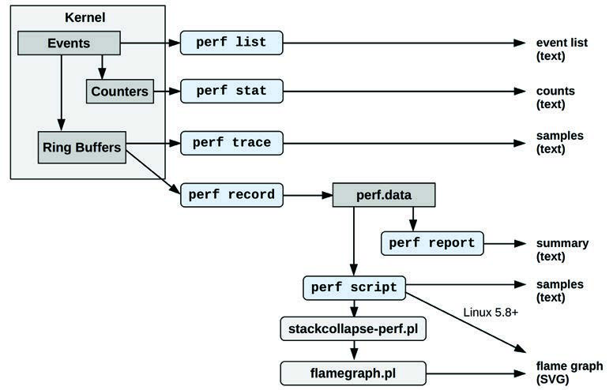

`perf(1)` 是 Linux 的官方分析器（profiler），位于 Linux 内核源代码的 `tools/perf` 目录下。[^1] 它是一个具有剖析（profiling）、追踪（tracing）和脚本编写（scripting）能力的多功能工具，是内核 `perf_events` 可观测性子系统的前端。`perf_events` 也被称为 Linux 性能计数器（Performance Counters for Linux, PCL）或 Linux 性能事件（Linux Performance Events, LPE）。`perf_events` 和 `perf(1)` 前端最初具备性能监控计数器（Performance Monitoring Counter, PMC）的能力，但后来已扩展到支持基于事件的追踪源：追踪点（tracepoints）、kprobes、uprobes 和 USDT。

本章以及第 14 章 Ftrace 和 第 15 章 BPF，是为那些希望更详细地学习一种或多种系统追踪器的人准备的可选阅读内容。

与其他追踪器相比，`perf(1)` 尤其适用于 CPU 分析：剖析（采样）CPU 堆栈轨迹、追踪 CPU 调度器行为，以及检查 PMC 以理解微架构层级的 CPU 性能（包括时钟周期行为）。它的追踪能力也允许它分析其他目标，包括磁盘 I/O 和软件函数。

`perf(1)` 可用于回答以下问题：
- 哪些代码路径正在消耗 CPU 资源？
- CPU 是否停滞在内存加载/存储上？
- 线程离开 CPU 的原因是什么？
- 磁盘 I/O 的模式是什么？

接下来的章节旨在介绍 `perf(1)`，展示事件源，然后展示使用它们的子命令。各节内容包括：
- **13.1 子命令概览 (Subcommands Overview)**
- **13.2 一行命令示例 (Example One-Liners)**
- **事件相关 (Events)**：
    - **13.3 事件概览 (Events Overview)**
    - **13.4 硬件事件 (Hardware Events)**
    - **13.5 软件事件 (Software Events)**
    - **13.6 追踪点 (Tracepoints)**
    - **13.7 探针事件 (Probe Events)**
- **命令相关 (Commands)**：
    - **13.8 perf stat**
    - **13.9 perf record**
    - **13.10 perf report**
    - **13.11 perf script**
    - **13.12 perf trace**
    - **13.13 其他命令 (Other Commands)**
- **13.14 文档 (Documentation)**
- **13.15 参考文献 (References)**

前面的章节已经展示了如何使用 `perf(1)` 进行特定目标的分析。本章将重点关注 `perf(1)` 本身。

## 13.1 子命令概览 (Subcommands Overview)

`perf(1)` 的功能通过子命令调用。作为一个常见的用法示例，以下使用了两个子命令：`record` 用于插桩事件并将其保存到文件中，然后是 `report` 用于总结文件内容。这些子命令在第 13.9 节 `perf record` 和第 13.10 节 `perf report` 中有详细解释。

```bash
# perf record -F 99 -a -- sleep 30
[ perf record: Woken up 193 times to write data ]
[ perf record: Captured and wrote 48.916 MB perf.data (11880 samples) ]
# perf report --stdio
[...]
# Overhead  Command          Shared Object              Symbol
# ........  ...............  .........................  ............................
#
    21.10%  swapper          [kernel.vmlinux]           [k] native_safe_halt
     6.39%  mysqld           [kernel.vmlinux]           [k] _raw_spin_unlock_irqrest
     4.66%  mysqld           mysqld                     [.] _Z8ut_delaym
     2.64%  mysqld           [kernel.vmlinux]           [k] finish_task_switch
[...]
```

这个特定的示例以 99 赫兹（Hertz）的频率对任何 CPU 上运行的任何程序进行了为期 30 秒的采样，然后显示了被采样频率最高的函数。

表 13.1 列出了近期 `perf(1)` 版本（来自 Linux 5.6）中的精选子命令。

**表 13.1 精选 perf 子命令**

| 章节 | 命令 | 描述 |
| :--- | :--- | :--- |
| - | annotate | 读取 perf.data（由 perf record 创建）并显示带有注释的代码。 |
| - | archive | 创建包含调试和符号信息的便携式 perf.data 文件。 |
| - | bench | 系统微基准测试。 |
| - | buildid-cache | 管理 build-id 缓存（由 USDT 探针使用）。 |
| - | c2c | 缓存行分析工具。 |
| - | diff | 读取两个 perf.data 文件并显示差异剖析。 |
| - | evlist | 列出 perf.data 文件中的事件名称。 |
| 14.12 | ftrace | `perf(1)` 对 Ftrace 追踪器的接口。 |
| - | inject | 过滤以使用额外信息扩充事件流。 |
| - | kmem | 追踪/测量内核内存（slab）属性。 |
| 11.3.3 | kvm | 追踪/测量 KVM 客体实例。 |
| 13.3 | list | 列出事件类型。 |
| - | lock | 分析锁事件。 |
| - | mem | 剖析内存访问。 |
| 13.7 | probe | 定义新的动态追踪点。 |
| 13.9 | record | 运行命令并将其剖析记录到 perf.data 中。 |
| 13.10 | report | 读取 perf.data（由 perf record 创建）并显示剖析。 |
| 6.6.13 | sched | 追踪/测量调度器属性（延迟）。 |
| 5.5.1 | script | 读取 perf.data（由 perf record 创建）并显示追踪输出。 |
| 13.8 | stat | 运行命令并收集性能计数器统计信息。 |
| - | timechart | 可视化工作负载期间的总体系统行为。 |
| - | top | 具有实时屏幕更新的系统剖析工具。 |
| 13.12 | trace | 实时追踪器（默认追踪系统调用）。 |

图 13.1 展示了常用的 `perf` 子命令及其数据源 and 输出类型。


**图 13.1 常用的 perf 子命令**

其中许多子命令及其他命令将在接下来的章节中解释。如表 13.1 所示，部分子命令已在前面的章节中涵盖。

未来版本的 `perf(1)` 可能会增加更多功能：在你的系统上运行不带参数的 `perf` 即可查看完整的子命令列表。

## 13.2 一行命令示例 (One-Liners)

以下一行命令示例展示了 `perf(1)` 的各种能力。这些示例选自我在网上发布的更完整列表 [Gregg 20h]，该列表已被证明是解释 `perf(1)` 能力的有效方式。这些命令的语法在后面的章节以及 `perf(1)` 的手册页（man pages）中有详细说明。

请注意，许多此类一行命令使用 `-a` 来指定所有 CPU，但这在 Linux 4.11 中已成为默认设置，在 4.11 及更高版本的内核中可以省略。

### 列出事件 (Listing Events)

列出所有当前已知的事件：
```bash
perf list
```

列出调度（sched）追踪点：
```bash
perf list 'sched:*'
```

列出名称中包含字符串 “block” 的事件：
```bash
perf list block
```

列出当前可用的动态探针：
```bash
perf probe -l
```

### 计数事件 (Counting Events)

显示指定命令的 PMC 统计信息：
```bash
perf stat command
```

显示指定 PID 的 PMC 统计信息，直到按下 Ctrl-C：
```bash
perf stat -p PID
```

显示整个系统的 PMC 统计信息，持续 5 秒：
```bash
perf stat -a sleep 5
```

显示该命令的 CPU 末级缓存（LLC）统计信息：
```bash
perf stat -e LLC-loads,LLC-load-misses,LLC-stores,LLC-prefetches command
```

使用原始 PMC 规范计算未停滞的核心周期数（Intel）：
```bash
perf stat -e r003c -a sleep 5
```

使用详细的 PMC 原始规范计算前端停滞（Intel）：
```bash
perf stat -e cpu/event=0x0e,umask=0x01,inv,cmask=0x01/ -a sleep 5
```

计算系统范围每秒的系统调用次数：
```bash
perf stat -e raw_syscalls:sys_enter -I 1000 -a
```

按类型计算指定 PID 的系统调用：
```bash
perf stat -e 'syscalls:sys_enter_*' -p PID
```

计算整个系统的块设备 I/O 事件，持续 10 秒：
```bash
perf stat -e 'block:*' -a sleep 10
```

### 剖析 (Profiling)

以 99 赫兹对指定命令的在 CPU 函数进行采样：
```bash
perf record -F 99 command
```

对整个系统的 CPU 堆栈轨迹（通过帧指针）进行采样，持续 10 秒：
```bash
perf record -F 99 -a -g sleep 10
```

对指定 PID 的 CPU 堆栈轨迹进行采样，使用 dwarf（调试信息）展开堆栈：
```bash
perf record -F 99 -p PID --call-graph dwarf sleep 10
```

通过其 `/sys/fs/cgroup/perf_event` cgroup 对容器的 CPU 堆栈轨迹进行采样：
```bash
perf record -F 99 -e cpu-clock --cgroup=docker/1d567f439319...etc... -a sleep 10
```

使用最后分支记录（LBR; Intel）对整个系统的 CPU 堆栈轨迹进行采样：
```bash
perf record -F 99 -a --call-graph lbr sleep 10
```

对 CPU 堆栈轨迹进行采样，每 100 次末级缓存未命中采样一次，持续 5 秒：
```bash
perf record -e LLC-load-misses -c 100 -ag sleep 5
```

精确采样在 CPU 的用户指令（例如，使用 Intel PEBS），持续 5 秒：
```bash
perf record -e cycles:up -a sleep 5
```

以 49 赫兹对 CPU 进行采样，并实时显示顶层进程名称和段：
```bash
perf top -F 49 -ns comm,dso
```

### 静态追踪 (Static Tracing)

追踪新进程，直到按下 Ctrl-C：
```bash
perf record -e sched:sched_process_exec -a
```

对上下文切换的一个子集进行采样，并带有持续 1 秒的堆栈轨迹：
```bash
perf record -e context-switches -a -g sleep 1
```

追踪所有带堆栈轨迹的上下文切换，持续 1 秒：
```bash
perf record -e sched:sched_switch -a -g sleep 1
```

追踪所有带 5 层深度堆栈轨迹的上下文切换，持续 1 秒：
```bash
perf record -e sched:sched_switch/max-stack=5/ -a sleep 1
```

追踪带堆栈轨迹的 `connect(2)` 调用（出站连接），直到按下 Ctrl-C：
```bash
perf record -e syscalls:sys_enter_connect -a -g
```

每秒采样最多 100 个块设备请求，直到按下 Ctrl-C：
```bash
perf record -F 100 -e block:block_rq_issue -a
```

追踪所有块设备发布和完成（带有时间戳），直到按下 Ctrl-C：
```bash
perf record -e block:block_rq_issue,block:block_rq_complete -a
```

追踪所有大小至少为 64 KB 的块请求，直到按下 Ctrl-C：
```bash
perf record -e block:block_rq_issue --filter 'bytes >= 65536'
```

追踪所有 `ext4` 调用，并写入非 `ext4` 位置，直到按下 Ctrl-C：
```bash
perf record -e 'ext4:*' -o /tmp/perf.data -a
```

追踪 `http__server__request` USDT 事件（来自 Node.js；Linux 4.10+）：
```bash
perf record -e sdt_node:http__server__request -a
```

以实时输出追踪块设备请求（无 perf.data），直到按下 Ctrl-C：
```bash
perf trace -e block:block_rq_issue
```

以实时输出追踪块设备请求和完成：
```bash
perf trace -e block:block_rq_issue,block:block_rq_complete
```

以实时输出系统范围追踪系统调用（详细）：
```bash
perf trace
```

### 动态追踪 (Dynamic Tracing)

为内核 `tcp_sendmsg()` 函数入口添加探针（`--add` 是可选的）：
```bash
perf probe --add tcp_sendmsg
```

移除 `tcp_sendmsg()` 追踪点（或使用 `-d`）：
```bash
perf probe --del tcp_sendmsg
```

列出 `tcp_sendmsg()` 的可用变量，加上外部变量（需要内核调试信息）：
```bash
perf probe -V tcp_sendmsg --externs
```

列出 `tcp_sendmsg()` 的可用行探针（需要调试信息）：
```bash
perf probe -L tcp_sendmsg
```

列出第 81 行 `tcp_sendmsg()` 的可用变量（需要调试信息）：
```bash
perf probe -V tcp_sendmsg:81
```

为带有入口参数寄存器的 `tcp_sendmsg()` 添加探针（处理器特定）：
```bash
perf probe 'tcp_sendmsg %ax %dx %cx'
```

为 `tcp_sendmsg()` 添加探针，并为 `%cx` 寄存器设置别名（“bytes”）：
```bash
perf probe 'tcp_sendmsg bytes=%cx'
```

当别名 `bytes` 大于 100 时，追踪之前创建的探针：
```bash
perf record -e probe:tcp_sendmsg --filter 'bytes > 100'
```

为 `tcp_sendmsg()` 返回添加追踪点，并捕获返回值：
```bash
perf probe 'tcp_sendmsg%return $retval'
```

为 `tcp_sendmsg()` 添加追踪点，带大小和套接字状态（需要调试信息）：
```bash
perf probe 'tcp_sendmsg size sk->__sk_common.skc_state'
```

为 `do_sys_open()` 添加带有文件名为字符串的追踪点（需要调试信息）：
```bash
perf probe 'do_sys_open filename:string'
```

为来自 `libc` 的用户级 `fopen(3)` 函数添加追踪点：
```bash
perf probe -x /lib/x86_64-linux-gnu/libc.so.6 --add fopen
```

### 报告 (Reporting)

如果可能，在 ncurses 浏览器（TUI）中显示 perf.data：
```bash
perf report
```

以文本报告形式显示 perf.data，数据合并并带有计数和百分比：
```bash
perf report -n --stdio
```

列出所有 perf.data 事件，带有数据头（推荐）：
```bash
perf script --header
```

列出所有 perf.data 事件，带有我推荐的字段（需要 `record -a`；Linux < 4.1 使用 `-f` 而非 `-F`）：
```bash
perf script --header -F comm,pid,tid,cpu,time,event,ip,sym,dso
```

生成火焰图可视化（Linux 5.8+）：
```bash
perf script report flamegraph
```

反汇编并注释带有百分比的指令（需要一些调试信息）：
```bash
perf annotate --stdio
```

这是我精选的一行命令示例；还有更多未涵盖的能力。有关更多 `perf(1)` 命令，请参阅前一节中的子命令，以及本章和其他章节中的后续小节。

## 13.3 perf 事件 (perf Events)

可以使用 `perf list` 列出事件。我在这里包含了一些来自 Linux 5.8 的精选事件，以展示不同的事件类型（已加粗）：

```text
# perf list


List of pre-defined events (to be used in -e):

  branch-instructions OR branches                    [Hardware event]
  branch-misses                                      [Hardware event]
  bus-cycles                                         [Hardware event]
  cache-misses                                       [Hardware event]
[...]
  context-switches OR cs                             [Software event]
  cpu-clock                                          [Software event]
[...]
  L1-dcache-load-misses                              [Hardware cache event]
  L1-dcache-loads                                    [Hardware cache event]
[...]
  branch-instructions OR cpu/branch-instructions/    [Kernel PMU event]
  branch-misses OR cpu/branch-misses/                [Kernel PMU event]
[...]
cache:
  l1d.replacement
       [L1D data line replacements] [...]
floating point:
  fp_arith_inst_retired.128b_packed_double
       [Number of SSE/AVX computational 128-bit packed double precision [...]
frontend:
  dsb2mite_switches.penalty_cycles
       [Decode Stream Buffer (DSB)-to-MITE switch true penalty cycles] [...]
memory:
  cycle_activity.cycles_l3_miss
       [Cycles while L3 cache miss demand load is outstanding] [...]
  offcore_response.demand_code_rd.l3_miss.any_snoop
       [DEMAND_CODE_RD & L3_MISS & ANY_SNOOP] [...]

other:
  hw_interrupts.received
       [Number of hardware interrupts received by the processor]
pipeline:
  arith.divider_active
       [Cycles when divide unit is busy executing divide or square root [...]
uncore:
  unc_arb_coh_trk_requests.all
       [Unit: uncore_arb Number of entries allocated. Account for Any type:
        e.g. Snoop, Core aperture, etc]
[...]
  rNNN                                               [Raw hardware event descriptor]
  cpu/t1=v1[,t2=v2,t3 ...]/modifier                  [Raw hardware event descriptor]
   (see 'man perf-list' on how to encode it)
  mem:<addr>[/len][:access]                          [Hardware breakpoint]
  alarmtimer:alarmtimer_cancel                       [Tracepoint event]
  alarmtimer:alarmtimer_fired                        [Tracepoint event]
[...]
  probe:do_nanosleep                                 [Tracepoint event]
[...]
  sdt_hotspot:class__initialization__clinit          [SDT event]
  sdt_hotspot:class__initialization__concurrent      [SDT event]
[...]
List of pre-defined events (to be used in --pfm-events):


ix86arch:
  UNHALTED_CORE_CYCLES
    [count core clock cycles whenever the clock signal on the specific core is
running (not halted)]
  INSTRUCTION_RETIRED
[...]
```

由于这台测试系统的完整输出共有 4,402 行，上述输出在许多地方都被大量删减了。事件类型包括：

- **Hardware event**：主要是处理器事件（使用 PMC 实现）。
- **Software event**：内核计数器事件。
- **Hardware cache event**：处理器缓存事件（PMC）。
- **Kernel PMU event**：性能监控单元（PMU）事件（PMC）。
- **cache, floating point...**：处理器厂商特定的事件（PMC）及其简短描述。
- **Raw hardware event descriptor**：使用原始代码指定的 PMC。
- **Hardware breakpoint**：处理器断点事件。
- **Tracepoint event**：内核静态插桩事件。
- **SDT event**：用户级静态插桩事件（USDT）。
- **pfm-events**：libpfm 事件（Linux 5.8 中新增）。

追踪点（tracepoint）和 SDT 事件大多列出了静态插桩点，但如果你已经创建了一些动态插桩探针（probes），它们也会 be 列出。我在输出中包含了一个示例：`probe:do_nanosleep` 被描述为基于 `kprobe` 的 “Tracepoint event”。

`perf list` 命令接受搜索子字符串作为参数。例如，列出包含 “mem_load_l3” 的事件（事件名称已加粗）：

```text
# perf list mem_load_l3


List of pre-defined events (to be used in -e):


cache:
  mem_load_l3_hit_retired.xsnp_hit
       [Retired load instructions which data sources were L3 and cross-core snoop
hits in on-pkg core cache Supports address when precise (Precise event)]
  mem_load_l3_hit_retired.xsnp_hitm
       [Retired load instructions which data sources were HitM responses from shared
L3 Supports address when precise (Precise event)]
  mem_load_l3_hit_retired.xsnp_miss
       [Retired load instructions which data sources were L3 hit and cross-core snoop
missed in on-pkg core cache Supports address when precise (Precise event)]
  mem_load_l3_hit_retired.xsnp_none
       [Retired load instructions which data sources were hits in L3 without snoops
required Supports address when precise (Precise event)]
[...]
```

这些是硬件事件（基于 PMC），输出包括简短的描述。`(Precise event)` 指的是具备精确事件采样（precise event-based sampling, PEBS）能力的事件。

## 13.4 硬件事件 (Hardware Events)

硬件事件在第 4 章《可观测性工具》的第 4.3.9 节“硬件计数器 (PMCs)”中已经介绍过。它们通常使用 PMC 实现，这些 PMC 使用特定于处理器的代码进行配置；例如，在 Intel 处理器上，通常可以使用原始硬件事件描述符 “r00c4”（寄存器代码 umask 0x0 和事件选择 0xc4 的简写）通过 `perf(1)` 对分支指令进行插桩。这些代码发布在处理器手册中 [Intel 16][AMD 18][ARM 19]；Intel 还通过 JSON 文件提供这些代码 [Intel 20c]。

你不需要记住这些代码，只在需要时参考处理器手册即可。为了便于使用，`perf(1)` 提供了可以替代使用的易于理解的映射（human-readable mappings）。例如，事件 “branch-instructions” 将有望映射到你系统上的分支指令 PMC。[^2] 前面的列表中可以看到其中的一些易于理解的名称（hardware 和 PMU 事件）。

处理器类型繁多，且新版本定期发布。你所使用的处理器的易于理解的映射可能尚未在 `perf(1)` 中提供，或者处于较新的内核版本中。某些 PMC 可能永远不会通过易于理解的名称公开。当我深入研究缺乏映射的 PMC 时，经常不得不从易于理解的名称切换到原始事件描述符。映射中也可能存在 Bug，如果你遇到可疑的 PMC 结果，你可能希望尝试原始事件描述符进行复核。

### 13.4.1 频率采样 (Frequency Sampling)

当将 `perf record` 与 PMC 结合使用时，会使用默认采样频率，因此不会记录每一个事件。例如，记录 `cycles` 事件：

```text
# perf record -vve cycles -a sleep 1
Using CPUID GenuineIntel-6-8E
intel_pt default config: tsc,mtc,mtc_period=3,psb_period=3,pt,branch
------------------------------------------------------------
perf_event_attr:
  size                             112
  { sample_period, sample_freq }   4000
  sample_type                      IP|TID|TIME|CPU|PERIOD
  disabled                         1
  inherit                          1
  mmap                             1
  comm                             1
  freq                             1
[...]
[ perf record: Captured and wrote 3.360 MB perf.data (3538 samples) ]
```

输出显示启用了频率采样（freq 1），采样频率为 4000。这告诉内核调整采样率，以便每秒每个 CPU 大约捕获 4,000 个事件。这是可取的，因为某些 PMC 插桩的事件每秒可能发生数十亿次（例如 CPU 周期），记录每个事件的开销将是难以承受的。[^3] 但这也是一个陷阱：`perf(1)` 的默认输出（不带非常详细的选项 `-vv`）并不会说明正在使用频率采样，而你可能期望记录所有事件。这种事件频率仅影响 `record` 子命令；`stat` 会计算所有事件。

事件频率可以使用 `-F` 选项进行修改，或者使用 `-c` 更改为周期（period），这会每隔一个周期捕获一个事件（也称为溢出采样，overflow sampling）。使用 `-F` 的示例如下：

```bash
perf record -F 99 -e cycles -a sleep 1
```

这以 99 赫兹（每秒事件数）的目标速率进行采样。这与第 13.2 节“一行命令示例”中的剖析一行命令类似：它们没有指定事件（没有 `-e cycles`），这会导致 `perf(1)` 在 PMC 可用时默认使用 `cycles`，或者默认使用 `cpu-clock` 软件事件。有关更多详细信息，请参见第 13.9.2 节“CPU 剖析”。

请注意，频率速率存在限制，`perf(1)` 也有 CPU 利用率百分比限制，可以使用 `sysctl(8)` 查看和设置：

```text
# sysctl kernel.perf_event_max_sample_rate
kernel.perf_event_max_sample_rate = 15500
# sysctl kernel.perf_cpu_time_max_percent
kernel.perf_cpu_time_max_percent = 25
```

这显示该系统的最大采样率为 15,500 赫兹，并且 `perf(1)`（特别是 PMU 中断）允许的最大 CPU 利用率为 25%。

## 13.5 软件事件 (Software Events)

这些是通常映射到硬件事件、但在软件中插桩的事件。与硬件事件类似，它们可能具有默认采样频率（通常为 4000），因此在使用 `record` 子命令时仅捕获其中一个子集。

请注意 `context-switches` 软件事件与等效追踪点（tracepoint）之间的以下区别。首先是软件事件：

```text
# perf record -vve context-switches -a -- sleep 1
[...]
------------------------------------------------------------
perf_event_attr:
  type                             1
  size                             112
  config                           0x3
  { sample_period, sample_freq }   4000
  sample_type                      IP|TID|TIME|CPU|PERIOD
[...]
  freq                             1
[...]
[ perf record: Captured and wrote 3.227 MB perf.data (660 samples) ]
```

输出显示软件事件已默认使用频率采样，采样率为 4000 赫兹。现在是等效的追踪点：

```text
# perf record -vve sched:sched_switch -a sleep 1
[...]
------------------------------------------------------------
perf_event_attr:
  type                             2
  size                             112
  config                           0x131
  { sample_period, sample_freq }   1
  sample_type                      IP|TID|TIME|CPU|PERIOD|RAW
[...]
[ perf record: Captured and wrote 3.360 MB perf.data (3538 samples) ]
```

这一次使用的是周期采样（没有 freq 1），采样周期为 1（等同于 `-c 1`）。这会捕获每一个事件。你也可以通过指定 `-c 1` 对软件事件执行同样的操作，例如：

```bash
perf record -vve context-switches -a -c 1 -- sleep 1
```

要小心记录每一个事件所产生的容量和相关的开销，特别是对于可能频繁发生的上下文切换。你可以使用 `perf stat` 来检查它们的频率：参见第 13.8 节 `perf stat`。

## 13.6 追踪点事件 (Tracepoint Events)

追踪点在第 4 章《可观测性工具》的第 4.3.5 节“追踪点 (Tracepoints)”中已经介绍过，该节包含了使用 `perf(1)` 对其进行插桩的示例。回顾一下，我使用了 `block:block_rq_issue` 追踪点以及以下示例。

在全系统范围内追踪 10 秒并打印事件：

```bash
perf record -e block:block_rq_issue -a sleep 10; perf script
```

打印此追踪点的参数及其格式字符串（元数据摘要）：

```bash
cat /sys/kernel/debug/tracing/events/block/block_rq_issue/format
```

过滤块 I/O，仅保留大于 65536 字节的：

```bash
perf record -e block:block_rq_issue --filter 'bytes > 65536' -a sleep 10
```

第 13.2 节“一行命令示例”以及本书其他章节中还有更多关于 `perf(1)` 和追踪点的示例。

请注意，`perf list` 会将已初始化的探针事件（probe events），包括 kprobes（动态内核插桩），显示为 “Tracepoint event”；参见第 13.7 节“探针事件”。

## 13.7 探针事件 (Probe Events)

`perf(1)` 使用 “探针事件” (probe events) 一词来指代 kprobes、uprobes 和 USDT 探针。这些是“动态”的，必须先进行初始化才能被追踪：默认情况下它们不会出现在 `perf list` 的输出中（某些 USDT 探针可能存在，因为它们已被自动初始化）。一旦初始化，它们将被列为 “Tracepoint event”。

### 13.7.1 kprobes

kprobes 在第 4 章《可观测性工具》的第 4.3.6 节“kprobes”中已经介绍过。以下是创建和使用 kprobe 的典型工作流程，在本示例中用于对 `do_nanosleep()` 内核函数进行插桩：

```bash
perf probe --add do_nanosleep
perf record -e probe:do_nanosleep -a sleep 5
perf script
perf probe --del do_nanosleep
```

kprobe 是使用 `probe` 子命令和 `--add`（`--add` 是可选的）创建的，当不再需要时，使用 `probe` 和 `--del` 删除。以下是该序列的输出，包括列出探针事件：

```text
# perf probe --add do_nanosleep
Added new event:
  probe:do_nanosleep   (on do_nanosleep)


You can now use it in all perf tools, such as:


        perf record -e probe:do_nanosleep -aR sleep 1

# perf list probe:do_nanosleep


List of pre-defined events (to be used in -e):


  probe:do_nanosleep                                 [Tracepoint event]

# perf record -e probe:do_nanosleep -aR sleep 1
[ perf record: Woken up 1 times to write data ]
[ perf record: Captured and wrote 3.368 MB perf.data (604 samples) ]
# perf script
           sleep 11898 [002] 922215.458572: probe:do_nanosleep: (ffffffff83dbb6b0)
 SendControllerT 15713 [002] 922215.459871: probe:do_nanosleep: (ffffffff83dbb6b0)
 SendControllerT  5460 [001] 922215.459942: probe:do_nanosleep: (ffffffff83dbb6b0)
[...]
```

`perf script` 的输出显示了在追踪期间发生的 `do_nanosleep()` 调用，首先来自一个 `sleep(1)` 命令（很可能是 `perf(1)` 运行的那个 `sleep(1)` 命令），随后是由 `SendControllerT` 发起的调用（已删减）。

可以通过添加 `%return` 来对函数的返回进行插桩：

```bash
perf probe --add do_nanosleep%return
```

这使用了 kretprobe。

#### kprobe 参数

至少有四种不同的方法可以对内核函数的参数进行插桩。

第一，如果内核调试信息（debuginfo）可用，那么关于函数变量（包括参数）的信息对 `perf(1)` 就是可用的。使用 `--vars` 选项列出 `do_nanosleep()` kprobe 的变量：

```text
# perf probe --vars do_nanosleep
Available variables at do_nanosleep
        @<do_nanosleep+0>
                enum hrtimer_mode       mode
                struct hrtimer_sleeper* t
```

此输出显示了名为 `mode` 和 `t` 的变量，它们是 `do_nanosleep()` 的入口参数。这些可以在创建探针时添加，以便在记录时包含它们。例如，添加 `mode`：

```text
# perf probe 'do_nanosleep mode'
[...]
# perf record -e probe:do_nanosleep -a
[...]
# perf script
          svscan  1470 [012] 4731125.216396: probe:do_nanosleep: (ffffffffa8e4e440)
mode=0x1
```

此输出显示 `mode=0x1`。

第二，如果内核调试信息不可用（我经常在生产环境中发现这种情况），那么可以通过它们的寄存器位置读取参数。一个技巧是使用一个完全相同的系统（相同的硬件和内核），并在其上安装内核调试信息作为参考。然后可以通过对 `perf probe` 使用 `-n`（干跑/dry run）和 `-v`（详细）选项来查询此参考系统，以找到寄存器位置：

```text
# perf probe -nv 'do_nanosleep mode'
[...]
Writing event: p:probe/do_nanosleep _text+10806336 mode=%si:x32
[...]
```

由于这是干跑，它不会创建事件。但输出显示了 `mode` 变量的位置（已加粗）：它在 `%si` 寄存器中，并打印为 32 位十六进制数 (`x32`)。（此语法在下一节关于 uprobes 中有解释。）现在可以通过复制并粘贴 `mode` 声明字符串 (`mode=%si:x32`) 在没有调试信息的系统上使用：

```text
# perf probe 'do_nanosleep mode=%si:x32'
[...]
# perf record -e probe:do_nanosleep -a
[...]
# perf script
          svscan  1470 [000] 4732120.231245: probe:do_nanosleep: (ffffffffa8e4e440)
mode=0x1
```

这仅在系统具有相同的处理器 ABI 和内核版本时才有效，否则可能会对错误的寄存器位置进行插桩。

第三，如果你了解处理器 ABI，可以自行确定寄存器位置。下一节中给出了一个针对 uprobes 的此类示例。

第四，有一种新的内核调试信息来源：BPF 类型格式 (BTF)。这更有可能默认可用，未来版本的 `perf(1)` 应该会支持它作为备选的调试信息源。

对于使用 kretprobe 插桩的 `do_nanosleep` 返回，可以使用特殊的 `$retval` 变量读取返回值：

```bash
perf probe 'do_nanosleep%return $retval'
```

请参阅内核源代码以确定返回值包含的内容。

### 13.7.2 uprobes

uprobes 在第 4 章《可观测性工具》的第 4.3.7 节“uprobes”中已经介绍过。在使用 `perf(1)` 时，uprobes 的创建方式与 kprobes 类似。例如，要为 `libc` 文件打开函数 `fopen(3)` 创建一个 uprobe：

```text
# perf probe -x /lib/x86_64-linux-gnu/libc.so.6 --add fopen
Added new event:
  probe_libc:fopen     (on fopen in /lib/x86_64-linux-gnu/libc-2.27.so)


You can now use it in all perf tools, such as:


        perf record -e probe_libc:fopen -aR sleep 1
```

使用 `-x` 指定二进制路径。名为 `probe_libc:fopen` 的 uprobe 现在可以与 `perf record` 配合使用来记录事件。

当你使用完 uprobe 后，可以使用 `--del` 将其移除：

```text
# perf probe --del probe_libc:fopen
Removed event: probe_libc:fopen
```

可以通过添加 `%return` 对函数的返回进行插桩：

```bash
perf probe -x /lib/x86_64-linux-gnu/libc.so.6 --add fopen%return
```

这使用了 uretprobe。

#### uprobe 参数

如果你的系统上有目标二进制文件的调试信息，那么变量信息（包括参数）可能是可用的。可以使用 `--vars` 列出：

```text
# perf probe -x /lib/x86_64-linux-gnu/libc.so.6 --vars fopen
Available variables at fopen
        @<_IO_vfscanf+15344>
                char*   filename
                char*   mode
```

输出显示 `fopen(3)` 具有 `filename` 和 `mode` 变量。这些可以在创建探针时添加：

```bash
perf probe -x /lib/x86_64-linux-gnu/libc.so.6 --add 'fopen filename mode'
```

调试信息可能通过 `-dbg` 或 `-dbgsym` 包提供。如果目标系统上不可用但在另一个系统上可用，则可以将另一个系统用作参考系统，如前一节关于 kprobes 所演示的那样。

即使任何地方都没有调试信息，你仍有选择。一种是重新编译带有调试信息的软件（如果该软件是开源的）。另一种选择是根据处理器 ABI 自行弄清楚寄存器位置。以下示例针对 x86_64：

```text
# perf probe -x /lib/x86_64-linux-gnu/libc.so.6 --add 'fopen filename=+0(%di):string mode=%si:u8'
[...]
# perf record -e probe_libc:fopen -a
[...]
# perf script
             run 28882 [013] 4503285.383830: probe_libc:fopen: (7fbe130e6e30)
filename="/etc/nsswitch.conf" mode=147
             run 28882 [013] 4503285.383997: probe_libc:fopen: (7fbe130e6e30)
filename="/etc/passwd" mode=17
       setuidgid 28882 [013] 4503285.384447: probe_libc:fopen: (7fed1ad56e30)
filename="/etc/nsswitch.conf" mode=147
       setuidgid 28882 [013] 4503285.384589: probe_libc:fopen: (7fed1ad56e30)
filename="/etc/passwd" mode=17
[...]
```

输出包含许多 `fopen(3)` 调用，显示了 `/etc/nsswitch.conf`、`/etc/passwd` 等文件名。

分解我使用的语法：
- `filename=`：这是一个用于注释输出的别名 (“filename”)。
- `%di`, `%si`：在 x86_64 上，根据 AMD64 ABI [Matz 13]，这些寄存器包含前两个函数参数。
- `+0(...)`：对偏移量为零的内容进行解引用。如果不加这个，我们会意外地将地址打印为字符串，而不是将地址的内容打印为字符串。
- `:string`：将其打印为字符串。
- `:u8`：将其打印为 8 位无符号整数。

语法记录在 `perf-probe(1)` 手册页中。

对于 uretprobe，可以使用 `$retval` 读取返回值：

```bash
perf probe -x /lib/x86_64-linux-gnu/libc.so.6 --add 'fopen%return $retval'
```

请参阅应用程序源代码以确定返回值包含的内容。

虽然 uprobes 可以提供对应用程序内部情况的可见性，但由于它们直接插桩二进制文件，它们是不稳定的接口，而二进制文件在软件版本之间可能会发生变化。只要可用，USDT 探针是首选。

### 13.7.3 USDT

USDT 探针在第 4 章《可观测性工具》的第 4.3.8 节“USDT”中已经介绍过。它们为追踪事件提供了稳定的接口。

给定一个带有 USDT 探针的二进制文件，[^4] 可以使用 `buildid-cache` 子命令让 `perf(1)` 知晓它们。例如，对于编译时带有 USDT 探针的 Node.js 二进制文件（使用 `./configure --with-dtrace` 构建）：

```bash
# perf buildid-cache --add $(which node)
```

然后可以在 `perf list` 的输出中看到 USDT 探针：

```text
# perf list | grep sdt_node
  sdt_node:gc__done                                  [SDT event]
  sdt_node:gc__start                                 [SDT event]
  sdt_node:http__client__request                     [SDT event]
  sdt_node:http__client__response                    [SDT event]
  sdt_node:http__server__request                     [SDT event]
  sdt_node:http__server__response                    [SDT event]
  sdt_node:net__server__connection                   [SDT event]
  sdt_node:net__stream__end                          [SDT event]
```

此时它们是 SDT 事件（静态定义的追踪事件）：描述事件在程序指令文本中位置的元数据。为了实际对它们进行插桩，必须按照与前一节中 uprobes 相同的方式创建事件（USDT 探针也使用 uprobes 来插桩 USDT 位置）。[^5] 例如，针对 `sdt_node:http__server_request`：

```text
# perf probe sdt_node:http__server__request
Added new event:
  sdt_node:http__server__request (on %http__server__request in
/home/bgregg/Build/node-v12.4.0/out/Release/node)


You can now use it in all perf tools, such as:


        perf record -e sdt_node:http__server__request -aR sleep 1

# perf list | grep http__server__request
  sdt_node:http__server__request                     [Tracepoint event]
  sdt_node:http__server__request                     [SDT event]
```

请注意，该事件现在同时显示为 SDT 事件（USDT 元数据）和追踪点事件（可以使用 `perf(1)` 和其他工具插桩的追踪事件）。看到同一事物有两个条目可能会觉得奇怪，但这与其它事件的工作方式是一致的。追踪点（tracepoints）也有一个元组（tuple），只不过 `perf(1)` 从不列出追踪点，它只列出相应的追踪点事件（如果它们存在的话 [^6]）。

记录 USDT 事件：

```text
# perf record -e sdt_node:http__server__request -a
^C[ perf record: Woken up 1 times to write data ]
[ perf record: Captured and wrote 3.924 MB perf.data (2 samples) ]
# perf script
            node 16282 [006] 510375.595203: sdt_node:http__server__request:
(55c3d8b03530) arg1=140725176825920 arg2=140725176825888 arg3=140725176829208
arg4=39090 arg5=140725176827096 arg6=140725176826040 arg7=20
            node 16282 [006] 510375.844040: sdt_node:http__server__request:
(55c3d8b03530) arg1=140725176825920 arg2=140725176825888 arg3=140725176829208
arg4=39092 arg5=140725176827096 arg6=140725176826040 arg7=20
```

输出显示在记录期间触发了两个 `sdt_node:http__server__request` 探针。它还打印了 USDT 探针的参数，但由于其中一些是结构体和字符串，`perf(1)` 已将它们打印为指针地址。在创建探针时，应该可以将参数转换为正确的类型；例如，将第三个参数转换为名为 “address” 的字符串：

```bash
perf probe --add 'sdt_node:http__server__request address=+0(arg3):string'
```

在撰写本文时，这尚不可行。

一个常见的问题（自 Linux 4.20 起已修复）是，某些 USDT 探针需要增加进程地址空间中的信号量（semaphore）才能正确激活它们。`sdt_node:http__server__request` 就是这样一个探针，如果不增加信号量，它将不会记录任何事件。

## 13.8 perf stat

`perf stat` 子命令用于计数事件。这可以用来测量事件的速率，或者检查某个事件是否真的发生了。`perf stat` 非常高效：它在内核上下文中计数软件事件，并使用 PMC 寄存器计数硬件事件。这使得它非常适合通过先使用 `perf stat` 检查事件速率，来评估更昂贵的 `perf record` 子命令的开销。

例如，在全系统范围 (`-a`) 内计算 `sched:sched_switch` 追踪点（使用 `-e` 指定事件）并持续一秒（`sleep 1`：一个哑命令）：

```text
# perf stat -e sched:sched_switch -a -- sleep 1
 Performance counter stats for 'system wide':


            5,705      sched:sched_switch


      1.001892925 seconds time elapsed
```

这显示 `sched:sched_switch` 追踪点在一秒内触发了 5,705 次。

我经常在 `perf(1)` 命令选项与它运行的哑命令之间使用 “--” Shell 分隔符，尽管在这种情况下它并不是严格必须的。

接下来的部分将解释选项和用法示例。

### 13.8.1 选项

`stat` 子命令支持许多选项，包括：
- **-a**：在所有 CPU 上记录（这在 Linux 4.11 中成为默认设置）。
- **-e event**：记录此事件（或多个事件）。
- **--filter filter**：为事件设置布尔过滤表达式。
- **-p PID**：仅记录此 PID。
- **-t TID**：仅记录此线程 ID。
- **-G cgroup**：仅记录此 cgroup（用于容器）。
- **-A**：显示每个 CPU 的计数。
- **-I interval_ms**：每隔一定间隔（毫秒）打印一次输出。
- **-v**：显示详细消息；使用 `-vv` 显示更多消息。

事件可以是追踪点、软件事件、硬件事件、kprobes、uprobes 和 USDT 探针（参见第 13.3 至 13.7 节）。可以使用通配符以文件通配符风格匹配多个事件（“*” 匹配任何内容，“?” 匹配任何单个字符）。例如，以下命令匹配所有 `sched` 类型的追踪点：

```bash
# perf stat -e 'sched:*' -a
```

可以使用多个 `-e` 选项来匹配多个事件描述。例如，要同时计算 `sched` 和 `block` 追踪点，可以使用以下任一命令：

```bash
# perf stat -e 'sched:*' -e 'block:*' -a
# perf stat -e 'sched:*,block:*' -a
```

如果没有指定事件，`perf stat` 将默认使用架构 PMC：你可以在第 4 章《可观测性工具》的第 4.3.9 节“硬件计数器 (PMCs)”中看到相关示例。

### 13.8.2 间隔统计 (Interval Statistics)

可以使用 `-I` 选项打印每间隔统计信息。例如，每 1000 毫秒打印一次 `sched:sched_switch` 计数：

```text
# perf stat -e sched:sched_switch -a -I 1000
#           time             counts unit events
     1.000791768              5,308      sched:sched_switch
     2.001650037              4,879      sched:sched_switch
     3.002348559              5,112      sched:sched_switch
     4.003017555              5,335      sched:sched_switch
     5.003760359              5,300      sched:sched_switch
^C     5.217339333              1,256      sched:sched_switch
```

`counts` 列显示了自上一个间隔以来的事件数量。浏览此列可以查看基于时间的变化。最后一行显示了上一行与我输入 Ctrl-C 结束 `perf(1)` 之间的时间段内的计数。该时间为 0.214 秒，从 `time` 列的差值可以看出。

### 13.8.3 每 CPU 平衡 (Per-CPU Balance)

可以使用 `-A` 选项检查各个 CPU 之间的平衡情况：

```text
# perf stat -e sched:sched_switch -a -A -I 1000
#           time CPU                counts unit events
     1.000351429 CPU0                 1,154      sched:sched_switch
     1.000351429 CPU1                   555      sched:sched_switch
     1.000351429 CPU2                   492      sched:sched_switch
     1.000351429 CPU3                   925      sched:sched_switch
[...]
```

这会分别打印每个逻辑 CPU 的每个间隔的事件增量。

此外，还有用于 CPU 插槽和核心聚合的 `--per-socket` 和 `--per-core` 选项。

### 13.8.4 事件过滤器 (Event Filters)

可以为某些事件类型（追踪点事件）提供过滤器，以使用布尔表达式测试事件参数。只有当表达式为真时，事件才会被计数。例如，当上一个 PID 为 25467 时，计算 `sched:sched_switch` 事件：

```text
# perf stat -e sched:sched_switch --filter 'prev_pid == 25467' -a -I 1000
#           time             counts unit events
     1.000346518                131      sched:sched_switch
     2.000937838                145      sched:sched_switch
     3.001370500                 11      sched:sched_switch
     4.001905444                217      sched:sched_switch
[...]
```

有关这些参数的解释，请参阅第 4 章《可观测性工具》第 4.3.5 节“追踪点 (Tracepoints)”中的“追踪点参数”部分。它们针对每个事件都是定制的，可以从 `/sys/kernel/debug/tracing/events` 中的格式文件列出。

### 13.8.5 影子统计 (Shadow Statistics)

`perf(1)` 拥有多种“影子统计” (shadow statistics)，当插桩某些事件组合时，这些统计信息将被打印出来。例如，当插桩周期 (cycles) 和指令 (instructions) 的 PMC 时，会打印每周期指令数 (IPC) 统计信息：

```text
# perf stat -e cycles,instructions -a
^C
 Performance counter stats for 'system wide':


            2,895,806,892      cycles
            6,452,798,206      instructions              #    2.23  insn per cycle


              1.040093176 seconds time elapsed
```

在此输出中，IPC 为 2.23。这些影子统计信息打印在右侧的井号（#）之后。不带事件运行 `perf stat` 的输出中包含几个此类影子统计信息（示例见第 4 章《可观测性工具》第 4.3.9 节“硬件计数器 (PMCs)”）。

为了更详细地检查事件，可以使用 `perf record` 来捕获它们。

## 13.9 perf record

`perf record` 子命令将事件记录到文件中以供以后分析。事件在 `-e` 之后指定，可以同时记录多个事件（使用多个 `-e` 或以逗号分隔）。

默认情况下，输出文件名为 `perf.data`。例如：

```text
# perf record -e sched:sched_switch -a
^C[ perf record: Woken up 9 times to write data ]
[ perf record: Captured and wrote 6.060 MB perf.data (23526 samples) ]
```

请注意，输出包括 `perf.data` 文件的大小（6.060 MB）、它包含的样本数量（23,526），以及 `perf(1)` 为了记录数据而被唤醒的次数（9 次）。数据通过每 CPU 环形缓冲区（ring buffers）从内核传递到用户空间，为了将上下文切换开销降至最低，`perf(1)` 会以不频繁且动态的次数被唤醒以读取它们。

之前的命令一直记录到输入 Ctrl-C 为止。可以使用哑命令 `sleep(1)`（或任何命令）来设置持续时间（就像之前使用 `perf stat` 一样）。例如：

```bash
perf record -e tracepoint -a -- sleep 1
```

此命令在全系统范围 (`-a`) 内记录追踪点，持续 1 秒。

### 13.9.1 选项

`record` 子命令支持许多选项，包括：
- **-a**：在所有 CPU 上记录（这在 Linux 4.11 中成为默认设置）。
- **-e event**：记录此事件（或多个事件）。
- **--filter filter**：为事件设置布尔过滤表达式。
- **-p PID**：仅记录此 PID。
- **-t TID**：仅记录此线程 ID。
- **-G cgroup**：仅记录此 cgroup（用于容器）。
- **-g**：记录堆栈轨迹（stack traces）。
- **--call-graph mode**：使用给定的方法（fp, dwarf 或 lbr）记录堆栈轨迹。
- **-o file**：设置输出文件。
- **-v**：显示详细消息；使用 `-vv` 显示更多消息。

可以记录与 `perf stat` 相同的事件，并使用 `perf trace` 实时打印（在事件发生时）。

### 13.9.2 CPU 剖析 (CPU Profiling)

`perf(1)` 的一个常见用途是作为 CPU 剖析器。以下剖析示例以 99 赫兹在全系统范围内对堆栈轨迹采样 30 秒：

```bash
perf record -F 99 -a -g -- sleep 30
```

没有指定事件（没有 `-e`），因此 `perf(1)` 将默认使用以下第一个可用的事件（许多使用精确事件，见第 4 章《可观测性工具》第 4.3.9 节“硬件计数器 (PMCs)”）：
1. **cycles:ppp**：基于 CPU 周期的频率采样，精确度设置为零偏差（zero skid）。
2. **cycles:pp**：基于 CPU 周期的频率采样，精确度设置为请求零偏差（实际上可能不是零）。
3. **cycles:p**：基于 CPU 周期的频率采样，精确度设置为请求恒定偏差（constant skid）。
4. **cycles**：基于 CPU 周期的频率采样（无精确度设置）。
5. **cpu-clock**：基于软件的 CPU 频率采样。

排序规则选择了可用的最准确的 CPU 剖析机制。`:ppp`、`:pp` 和 `:p` 语法激活了精确事件采样模式，并且可以应用于支持它们的其他事件（除了 `cycles`）。事件可能还支持不同级别的精确度。在 Intel 上，精确事件使用 PEBS；在 AMD 上，它们使用 IBS。这些在第 4.3.9 节的 “PMC 挑战” 标题下有所定义。

### 13.9.3 堆栈行走 (Stack Walking)

除了使用 `-g` 指定记录堆栈轨迹外，还可以使用 `max-stack` 配置选项。它有两个好处：可以指定堆栈的最大深度，并且可以为不同的事件使用不同的设置。例如：

```bash
# perf record -e sched:sched_switch/max-stack=5/,sched:sched_wakeup/max-stack=1/ \
    -a -- sleep 1
```

这记录了带有 5 帧堆栈的 `sched_switch` 事件，以及仅带有 1 帧堆栈的 `sched_wakeup` 事件。

请注意，如果堆栈轨迹看起来是断裂的，可能是由于软件未遵循帧指针（frame pointer）寄存器。这在第 5 章《应用程序》第 5.6.2 节“缺失堆栈”中讨论过。除了使用帧指针重新编译软件（例如 `gcc(1) -fno-omit-frame-pointer`）外，不同的堆栈行走方法也可能奏效，可通过 `--call-graph` 选择。选项包括：
- **--call-graph dwarf**：选择基于调试信息的堆栈行走，这要求可执行文件的调试信息可用（对于某些软件，通过安装名称以 “-dbgsym” 或 “-dbg” 结尾的包来提供）。
- **--call-graph lbr**：选择 Intel 最后分支记录 (LBR) 堆栈行走，这是一种处理器提供的方法（尽管它通常受限于仅 16 帧的堆栈深度 [^7]，因此其用途也受限）。
- **--call-graph fp**：选择基于帧指针的堆栈行走（默认值）。

基于帧指针的堆栈行走在第 3 章《操作系统》第 3.2.7 节“堆栈”中描述。其他类型（dwarf, LBR 和 ORC）在《BPF Performance Tools》 [Gregg 19] 第 2 章“技术”第 2.4 节“堆栈轨迹行走”中描述。

记录事件后，可以使用 `perf report` 或 `perf script` 检查事件。

## 13.10 perf report

`perf report` 子命令汇总 `perf.data` 文件的内容。选项包括：
- **--tui**：使用 TUI 界面（默认）。
- **--stdio**：发出文本报告。
- **-i file**：输入文件。
- **-n**：包含一列样本计数。
- **-g options**：修改调用图（堆栈轨迹）显示选项。

也可以使用外部工具汇总 `perf.data`。这些工具可能处理 `perf script` 的输出，这将在第 13.11 节 `perf script` 中讨论。你会发现 `perf report` 在许多情况下已经足够，仅在必要时使用外部工具。`perf report` 使用交互式文本用户界面 (TUI) 或文本报告 (STDIO) 进行汇总。

### 13.10.1 TUI

例如，以 99 赫兹对指令指针进行 10 秒的 CPU 剖析（无堆栈轨迹）并启动 TUI：

```text
# perf record -F 99 -a -- sleep 30
[ perf record: Woken up 193 times to write data ]
[ perf record: Captured and wrote 48.916 MB perf.data (11880 samples) ]
# perf report
Samples: 11K of event 'cpu-clock:pppH', Event count (approx.): 119999998800
Overhead  Command          Shared Object              Symbol
  21.10%  swapper          [kernel.vmlinux]           [k] native_safe_halt
   6.39%  mysqld           [kernel.vmlinux]           [k] _raw_spin_unlock_irqrestor
   4.66%  mysqld           mysqld                     [.] _Z8ut_delaym
   2.64%  mysqld           [kernel.vmlinux]           [k] finish_task_switch
   2.59%  oltp_read_write  [kernel.vmlinux]           [k] finish_task_switch
   2.03%  mysqld           [kernel.vmlinux]           [k] exit_to_usermode_loop
   1.68%  mysqld           mysqld                     [.] _Z15row_search_mvccPh15pag
   1.40%  oltp_read_write  [kernel.vmlinux]           [k] _raw_spin_unlock_irqrestor
[...]
```

`perf report` 是一个交互式界面，你可以导航数据，选择函数和线程以获取更多详细信息。

### 13.10.2 STDIO

第 13.1 节“子命令概览”中展示了使用基于文本的报告 (`--stdio`) 的相同 CPU 剖析。它不是交互式的，但适合重定向到文件，以便将完整的摘要另存为文本。此类独立的文本报告对于通过聊天系统、电子邮件和支持工单系统与他人共享非常有用。我通常使用 `-n` 来包含一列样本计数。

作为另一个 STDIO 示例，以下显示了带有堆栈轨迹 (`-g`) 的 CPU 剖析：

```text
# perf record -F 99 -a -g -- sleep 30
[ perf record: Woken up 8 times to write data ]
[ perf record: Captured and wrote 2.282 MB perf.data (11880 samples) ]
# perf report --stdio
[...]
# Children      Self  Command          Shared Object               Symbol
# ........  ........  ...............  ..........................  .................
#
    50.45%     0.00%  mysqld           libpthread-2.27.so          [.] start_thread
            |
            ---start_thread
               |
               |--44.75%--pfs_spawn_thread
               |          |
               |           --44.70%--handle_connection
               |                     |
               |                      --44.55%--_Z10do_commandP3THD
               |                                |
               |                                |--42.93%--_Z16dispatch_commandP3THD
               |                                |          |
               |                                |           --40.92%--_Z19mysqld_stm
               |                                |                     |
[...]
```

堆栈轨迹样本合并为层次结构，从左侧的根函数开始，向下并向右移动到子函数。最右侧的函数是事件发生时的函数（在本例中是在 CPU 上的函数），其左侧是其祖先。此路径显示 `mysqld` 进程（守护进程）运行了 `start_thread()`，后者调用了 `pfs_spawn_thread()`，后者又调用了 `handle_connection()`，依此类推。在此输出中，最右侧的函数已被截断。

这种从左到右的顺序在 `perf(1)` 中被称为 `caller`。你可以使用 `-g callee` 将其翻转为 `callee` 顺序，即事件函数在左侧，其祖先向下并向右移动（这曾经是默认设置；`perf(1)` 在 Linux 4.4 中切换到了 `caller` 顺序）。

## 13.11 perf script

`perf script` 子命令汇总 `perf.data` 文件的内容，默认情况下逐行打印每个事件。这最适合由其他工具进行后处理。

例如，以 99 赫兹对 CPU 指令指针采样 1 秒并打印事件：

```text
# perf record -F 99 -a -- sleep 1
[ perf record: Woken up 1 times to write data ]
[ perf record: Captured and wrote 0.160 MB perf.data (114 samples) ]
# perf script
          mysqld 22432 [002] 4142044.582713:   10101010 cpu-clock:pppH:
 ffffffff95530302 get_futex_key_refs.isra.12+0x32 (/lib/modules/5.4.0-rc8-virtua...
[...]
```

输出字段如下，以及第一行输出的字段内容：
- **进程名称**：mysqld
- **线程 ID**：8631
- **CPU ID**：[000]
- **时间戳**：4142044.582702（秒）
- **周期 (Period)**：10101010（源自 `-F 99`）；包含在某些采样模式中。
- **事件名称**：cpu-clock:pppH
- **事件参数**：此字段及随后的字段是事件参数，特定于该事件。对于 `cpu-clock` 事件，它们是指令指针、函数名称及偏移量，以及段名称。有关这些内容的来源，请参见第 4 章《可观测性工具》第 4.3.5 节“追踪点 (Tracepoints)”中的“追踪点参数”部分。

这些输出字段恰好是该事件当前的默认设置，但在 `perf(1)` 的后续版本中可能会发生变化。其他事件可能不包含周期（period）字段。

由于生成一致的输出非常重要（特别是对于后处理），你可以使用 `-F` 选项指定字段。我经常使用它来包含进程 ID，因为它在默认字段集中是缺失的。我还建议添加 `--header` 以包含 `perf.data` 元数据。例如，这一次显示带有堆栈轨迹的 CPU 剖析：

```text
# perf script --header -F comm,pid,tid,cpu,time,event,ip,sym,dso,trace
# ========
# captured on    : Sun Jan  5 23:43:56 2020
# header version : 1
# data offset    : 264
# data size      : 2393000
# feat offset    : 2393264
# hostname : bgregg-mysql
# os release : 5.4.0
# perf version : 5.4.0
# arch : x86_64
# nrcpus online : 4
# nrcpus avail : 4
# cpudesc : Intel(R) Xeon(R) Platinum 8175M CPU @ 2.50GHz
# cpuid : GenuineIntel,6,85,4
# total memory : 15923672 kB
# cmdline : /usr/bin/perf record -F 99 -a -g -- sleep 30
# event : name = cpu-clock:pppH, , id = { 5997, 5998, 5999, 6000 }, type = 1, size = 112, { sample_period, sample_freq } = 99
[...]
# ========
#
mysqld 21616/8583  [000] 4142769.671581: cpu-clock:pppH:
                  c36299 [unknown] (/usr/sbin/mysqld)
                  c3bad4 _ZN13QEP_tmp_table8end_sendEv (/usr/sbin/mysqld)
                  c3c1a5 _Z13sub_select_opP4JOINP7QEP_TABb (/usr/sbin/mysqld)
                  c346a8 _ZN4JOIN4execEv (/usr/sbin/mysqld)
                  ca735a _Z12handle_queryP3THDP3LEXP12Query_resultyy
[...]
```

输出包含了以 “#” 开头的头部信息（header），描述了系统以及用于创建 `perf.data` 文件的 `perf(1)` 命令。如果你将此输出保存到文件中供以后使用，你会庆幸包含了头部信息，因为它提供了你以后可能需要的大量信息。这些文件可以被其他可视化工具读取，包括火焰图。

### 13.11.1 火焰图 (Flame Graphs)

火焰图用于可视化堆栈轨迹。虽然通常用于 CPU 剖析，但它们也可以可视化由 `perf(1)` 收集的任何堆栈轨迹集合，包括：
- **上下文切换事件**：查看线程离开 CPU 的原因。
- **块 I/O 创建**：查看哪些代码路径正在产生磁盘 I/O。

两种常用的火焰图实现（我自己的实现和一个 D3 版本）可以可视化 `perf script` 的输出。`perf(1)` 在 Linux 5.8 中增加了对火焰图的支持。使用 `perf(1)` 创建火焰图的步骤包含在第 6 章《CPU》第 6.6.13 节 “perf” 的 “CPU 火焰图” 标题下。可视化本身在第 6.7.3 节 “火焰图” 中有详细解释。

**FlameScope** 是另一个用于可视化 `perf script` 输出的工具，它结合了亚秒级偏移量热图（研究基于时间的变化）与火焰图。它也包含在第 6 章《CPU》的第 6.7.4 节 “FlameScope” 中。

### 13.11.2 追踪脚本 (Trace Scripts)

可以使用 `-l` 列出可用的 `perf(1)` 追踪脚本：

```text
# perf script -l
List of available trace scripts:
[...]
  event_analyzing_sample               analyze all perf samples
  mem-phys-addr                        resolve physical address samples
  intel-pt-events                      print Intel PT Power Events and PTWRITE
  sched-migration                      sched migration overview
  net_dropmonitor                      display a table of dropped frames
  syscall-counts-by-pid [comm]         system-wide syscall counts, by pid
  failed-syscalls-by-pid [comm]        system-wide failed syscalls, by pid
  export-to-sqlite [database name] [columns] [calls] export perf data to a sqlite3 database
  stackcollapse                        produce callgraphs in short form for scripting use
```

这些可以作为 `perf script` 的参数执行。你还可以使用 Perl 或 Python 开发额外的追踪脚本。

## 13.12 perf trace

`perf trace` 子命令默认追踪系统调用并实时打印输出（无 `perf.data` 文件）。它在第 5 章《应用程序》第 5.5.1 节 “perf” 中被介绍过，作为 `strace(1)` 的低开销版本，可以进行全系统追踪。`perf trace` 也可以使用类似于 `perf record` 的语法检查任何事件。

例如，追踪磁盘 I/O 发布与完成：

```text
# perf trace -e block:block_rq_issue,block:block_rq_complete
     0.000 auditd/391 block:block_rq_issue:259,0 WS 8192 () 16046032 + 16 [auditd]
     0.566 systemd-journa/28651 block:block_rq_complete:259,0 WS () 16046032 + 16 [0]
     0.748 jbd2/nvme0n1p1/174 block:block_rq_issue:259,0 WS 61440 () 2100744 + 120 [jbd2/nvme0n1p1-]
     1.436 systemd-journa/28651 block:block_rq_complete:259,0 WS () 2100744 + 120 [0]
     1.515 kworker/0:1H-k/365 block:block_rq_issue:259,0 FF 0 () 0 + 0 [kworker/0:1H]
     1.543 kworker/0:1H-k/365 block:block_rq_issue:259,0 WFS 4096 () 2100864 + 8 [kworker/0:1H]
     2.074 sshd/6463 block:block_rq_complete:259,0 WFS () 2100864 + 8 [0]
     2.077 sshd/6463 block:block_rq_complete:259,0 WFS () 2100864 + 0 [0]
  1087.562 kworker/0:1H-k/365 block:block_rq_issue:259,0 W 4096 () 16046040 + 8 [kworker/0:1H]
[...]
```

与 `perf record` 一样，也可以对事件使用过滤器。这些过滤器可以包含一些由内核头文件生成的字符串常量。例如，使用字符串 “SHARED” 追踪标志为 `MAP_SHARED` 的 `mmap(2)` 系统调用：

```text
# perf trace -e syscalls:*enter_mmap --filter='flags==SHARED'
     0.000 env/14780 syscalls:sys_enter_mmap(len: 27002, prot: READ, flags: SHARED, fd: 3)
    16.145 grep/14787 syscalls:sys_enter_mmap(len: 27002, prot: READ, flags: SHARED, fd: 3)
    18.704 cut/14791 syscalls:sys_enter_mmap(len: 27002, prot: READ, flags: SHARED, fd: 3)
[...]
```

请注意，`perf(1)` 还使用字符串来提高格式字符串的可读性：它打印的是 “prot: READ” 而不是 “prot: 1”。`perf(1)` 将此功能称为 “美化” (beautification)。

### 13.12.1 内核版本 (Kernel Versions)

在 Linux 4.19 之前，`perf trace` 默认会插桩所有系统调用（`--syscalls` 选项），此外还会追踪指定的事件 (`-e`)。要禁用对其他系统调用的追踪，需指定 `--no-syscalls`（这在现在是默认设置）。例如：

```bash
perf trace -e block:block_rq_issue,block:block_rq_complete --no-syscalls
```

请注意，自 Linux 3.8 起，全 CPU 追踪 (`-a`) 已成为默认设置。过滤器 (`--filter`) 在 Linux 5.5 中被引入。

## 13.13 其他命令 (Other Commands)

还有更多 `perf(1)` 子命令和功能，其中一些已在其他章节中使用。回顾一下额外的子命令（完整列表见表 13.1）：
- **perf c2c** (Linux 4.10+)：缓存到缓存（cache-to-cache）和缓存行虚假共享分析。
- **perf kmem**：内核内存分配分析。
- **perf kvm**：KVM 客体实例分析。
- **perf lock**：锁分析。
- **perf mem**：内存访问分析。
- **perf sched**：内核调度器统计。
- **perf script**：自定义 `perf` 工具开发。

进阶的其他能力包括在事件上启动 BPF 程序，以及使用硬件追踪（如 Intel 处理器追踪 (PT) 或 ARM CoreSight）进行逐条指令分析 [Hunter 20]。

以下是 **Intel 处理器追踪 (PT)** 的基本示例。这记录了 `date(1)` 命令的用户态周期：

```text
# perf record -e intel_pt/cyc/u date
Sat Jul 11 05:52:40 PDT 2020
[ perf record: Woken up 1 times to write data ]
[ perf record: Captured and wrote 0.049 MB perf.data ]
```

这可以打印为指令追踪（指令部分已加粗）：

```text
# perf script --insn-trace
        date 31979 [003] 653971.670163672:      7f3bfbf4d090 _start+0x0 (/lib/x86_64-linux-gnu/ld-2.27.so) insn: 48 89 e7
        date 31979 [003] 653971.670163672:      7f3bfbf4d093 _start+0x3 (/lib/x86_64-linux-gnu/ld-2.27.so) insn: e8 08 0e 00 00
[...]
```

此输出包含了作为机器码的指令。安装并使用 **Intel X86 编码解码器 (XED)** 会将指令打印为汇编代码 [Intelxed 19]：

```text
# perf script --insn-trace --xed
date 31979 [003] 653971.670163672: ... (/lib/x86_64-linux-gnu/ld-2.27.so) mov %rsp, %rdi
date 31979 [003] 653971.670163672: ... (/lib/x86_64-linux-gnu/ld-2.27.so) callq 0x7f3bfbf4dea0
date 31979 [003] 653971.670163672: ... (/lib/x86_64-linux-gnu/ld-2.27.so) pushq %rbp
[...]
date 31979 [003] 653971.670439432: ... (/bin/date) xor %ebp, %ebp
date 31979 [003] 653971.670439432: ... (/bin/date) mov %rdx, %r9
date 31979 [003] 653971.670439432: ... (/bin/date) popq %rsi
date 31979 [003] 653971.670439432: ... (/bin/date) mov %rsp, %rdx
date 31979 [003] 653971.670439432: ... (/bin/date) and $0xfffffffffffffff0, %rsp
[...]
```

虽然这提供了惊人的细节，但也非常冗长。仅 `date(1)` 命令的完整输出就有 266,105 行。有关其他示例，请参阅 `perf(1)` 维基 [Hunter 20]。

## 13.14 perf 文档 (Documentation)

每个子命令都应该有一个以 “perf-” 开头的参考手册页，例如 `record` 子命令的手册页为 `perf-record(1)`。这些位于 Linux 源代码树的 `tools/perf/Documentation` 目录下。

在 wiki.kernel.org 上有一个 `perf(1)` 教程 [Perf 15]，还有一个由 Vince Weaver 维护的非官方 `perf(1)` 页面 [Weaver 11]，以及由我维护的另一个非官方 `perf(1)` 示例页面 [Gregg 20f]。

我自己的页面包含了完整的 `perf(1)` 一行命令列表，以及更多示例。

由于 `perf(1)` 经常获得新功能，请检查后续内核版本中的更新。一个很好的来源是 KernelNewbies 上发布的每个内核变更日志中的 `perf` 部分 [KernelNewbies 20]。

## 13.15 参考文献 (References)

- [Weaver 11] Weaver, V., “The Unofficial Linux Perf Events Web-Page,” http://web.eece.maine.edu/~vweaver/projects/perf_events, 2011.
- [Matz 13] Matz, M., Hubička, J., Jaeger, A., and Mitchell, M., “System V Application Binary Interface, AMD64 Architecture Processor Supplement, Draft Version 0.99.6,” http://x86-64.org/documentation/abi.pdf, 2013.
- [Perf 15] “Tutorial: Linux kernel profiling with perf,” perf wiki, https://perf.wiki.kernel.org/index.php/Tutorial, last updated 2015.
- [Intel 16] Intel 64 and IA-32 Architectures Software Developer’s Manual Volume 3B: System Programming Guide, Part 2, September 2016, https://www.intel.com/content/www/us/en/architecture-and-technology/64-ia-32-architectures-software-developer-vol-3b-part-2-manual.html, 2016.
- [AMD 18] Open-Source Register Reference for AMD Family 17h Processors Models 00h-2Fh, https://developer.amd.com/resources/developer-guides-manuals, 2018.
- [ARM 19] Arm® Architecture Reference Manual Armv8, for Armv8-A architecture profile, https://developer.arm.com/architectures/cpu-architecture/a-profile/docs?_ga=2.78191124.1893781712.1575908489-930650904.1559325573, 2019.
- [Intelxed 19] “Intel XED,” https://intelxed.github.io, 2019.
- [Gregg 20h] Gregg, B., “One-Liners,” http://www.brendangregg.com/perf.html#OneLiners, last updated 2020.
- [Gregg 20f] Gregg, B., “perf Examples,” http://www.brendangregg.com/perf.html, last updated 2020.
- [Hunter 20] Hunter, A., “Perf tools support for Intel® Processor Trace,” https://perf.wiki.kernel.org/index.php/Perf_tools_support_for_Intel%C2%AE_Processor_Trace, last updated 2020.
- [Intel 20c] “/perfmon/,” https://download.01.org/perfmon, accessed 2020.
- [KernelNewbies 20] “KernelNewbies: LinuxVersions,” https://kernelnewbies.org/LinuxVersions, accessed 2020.

[^1]: `perf(1)` 的不同之处在于它是一个位于 Linux 内核源代码树中的大型、复杂的用户级程序。维护者 Arnaldo Carvalho de Melo 向我描述这种情况是一项“实验”。虽然这对于 `perf(1)` 和 Linux 步调一致地开发是有益的，但有些人对它的加入感到不安，它可能是 Linux 源代码中包含的唯一复杂用户软件。
[^2]: 我过去曾遇到过映射问题，其中易于理解的名称并未映射到正确的 PMC。这仅凭 `perf(1)` 的输出很难识别：你需要具备 PMC 的相关经验并对正常情况有预期，以便发现异常。要意识到这种可能性。随着处理器更新的速度，我预计未来的映射也会出现 Bug。
[^3]: 尽管内核会限制采样率并丢弃事件以保护自身。务必检查是否存在丢弃事件的情况（例如，检查来自 `perf report -D | tail -20` 的总结计数器）。
[^4]: 你可以在二进制文件上运行 `readelf -n` 来检查是否存在 USDT 探针：它们列在 ELF notes 节中。
[^5]: 将来此步骤可能变得不再必要：接下来的 `perf record` 命令可能会在需要时自动将 SDT 事件提升为追踪点。
[^6]: 内核文档确实指出某些追踪点可能没有相应的追踪点事件，尽管我尚未遇到过这种情况。
[^7]: 自 Haswell 以来堆栈深度为 16，自 Skylake 以来为 32。
