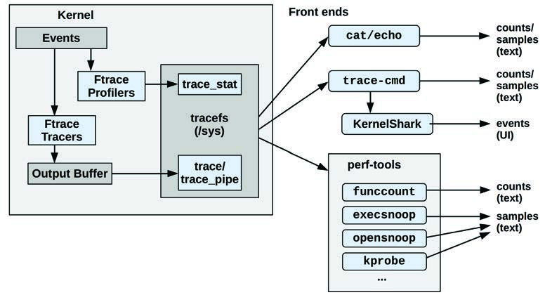
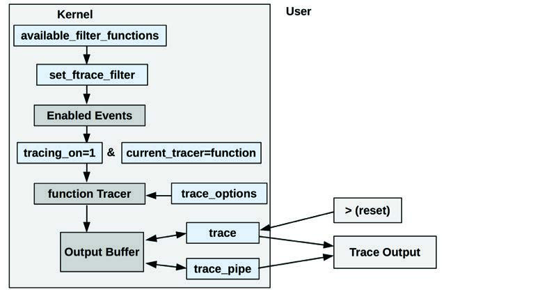
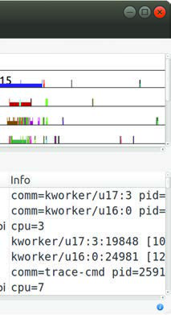
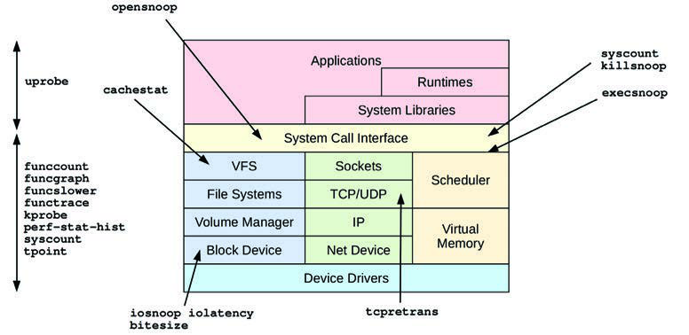

Ftrace 是官方的 Linux 追踪器，是一个由不同追踪工具组成的多功能工具集。Ftrace 由 Steven Rostedt 创建，并于 2008 年首次加入 Linux 2.6.27。它可以在不需要任何额外用户级前端的情况下使用，这使其特别适用于存储空间宝贵的嵌入式 Linux 环境。它对于服务器环境同样非常有用。

本章，连同第 13 章 [[13 perf|perf]] 和第 15 章 BPF，是为那些希望更详细地学习一种或多种系统追踪器的人准备的可选阅读内容。

Ftrace 可用于回答以下问题：
- 某些内核函数被调用的频率是多少？
- 是什么代码路径导致调用了该函数？
- 该内核函数调用了哪些子函数？
- 由禁用抢占的代码路径引起的最大延迟是多少？

接下来的章节旨在介绍 Ftrace，展示其部分剖析器（profilers）和追踪器（tracers），然后展示使用它们的前端工具。各节内容包括：

- **14.1 能力概览 (Capabilities Overview)**
- **14.2 tracefs (/sys)**
- **剖析器 (Profilers)**：
    - **14.3 Ftrace 函数剖析器 (Function Profiler)**
    - **14.10 Ftrace 直方图触发器 (Hist Triggers)**
- **追踪器 (Tracers)**：
    - **14.4 Ftrace 函数追踪 (Function Tracing)**
    - **14.5 追踪点 (Tracepoints)**
    - **14.6 kprobes**
    - **14.7 uprobes**
    - **14.8 Ftrace function_graph**
    - **14.9 Ftrace hwlat**
- **前端工具 (Front ends)**：
    - **14.11 trace-cmd**
    - **14.12 perf ftrace**
    - **14.13 perf-tools**
- **14.14 文档 (Documentation)**
- **14.15 参考文献 (References)**

Ftrace 直方图触发器是一个高级话题，需要先涵盖剖析器和追踪器，因此它被安排在本章较后的位置。kprobes 和 uprobes 章节也包含基础的剖析能力。

图 14.1 是 Ftrace 及其前端的概览，箭头显示了从事件到输出类型的路径。


**图 14.1 Ftrace 剖析器、追踪器和前端工具**

这些内容将在接下来的章节中解释。

## 14.1 能力概览 (Capabilities Overview)

与 `perf(1)` 使用子命令来实现不同功能不同，Ftrace 拥有剖析器（profilers）和追踪器（tracers）。剖析器提供统计摘要（如计数和直方图），而追踪器提供每个事件的详细信息。

作为 Ftrace 的一个示例，以下 `funcgraph(8)` 工具使用 Ftrace 追踪器来显示 `vfs_read()` 内核函数的子调用：

```text
# funcgraph vfs_read
Tracing "vfs_read"... Ctrl-C to end.
 1)               |  vfs_read() {
 1)               |    rw_verify_area() {
 1)               |      security_file_permission() {
 1)               |        apparmor_file_permission() {
 1)               |          common_file_perm() {
 1)   0.763 us    |            aa_file_perm();
 1)   2.209 us    |          }
 1)   3.329 us    |        }
 1)   0.571 us    |        __fsnotify_parent();
 1)   0.612 us    |        fsnotify();
 1)   7.019 us    |      }
 1)   8.416 us    |    }
 1)               |    __vfs_read() {
 1)               |      new_sync_read() {
 1)               |        ext4_file_read_iter() {
[...]
```

输出显示 `vfs_read()` 调用了 `rw_verify_area()`，后者又调用了 `security_file_permission()`，依此类推。第二列显示了每个函数的持续时间（“us” 是微秒），以便你可以进行性能分析，识别导致父函数变慢的子函数。这种特定的 Ftrace 能力被称为**函数图追踪** (function graph tracing)，在第 14.8 节 [[#14.8 Ftrace function_graph|Ftrace function_graph]] 中涵盖。

表 14.1 和 14.2 列出了近期 Linux 版本（5.2）中的 Ftrace 剖析器和追踪器，以及 Linux 事件追踪器：追踪点（tracepoints）、kprobes 和 uprobes。这些事件追踪器与 Ftrace 类似，共享相似的配置和输出接口，因此也包含在本章中。表 14.2 中显示的等宽字体追踪器名称是 Ftrace 追踪器，也是用于配置它们的命令行关键字。

**表 14.1 Ftrace 剖析器**

| 剖析器 | 描述 | 章节 |
| :--- | :--- | :--- |
| function | 内核函数统计 | 14.3 |
| kprobe profiler | 已启用的 kprobe 计数 | 14.6.5 |
| uprobe profiler | 已启用的 uprobe 计数 | 14.7.4 |
| hist triggers | 事件上的自定义直方图 | 14.10 |

**表 14.2 Ftrace 及事件追踪器**

| 追踪器 | 描述 | 章节 |
| :--- | :--- | :--- |
| function | 内核函数调用追踪器 | 14.4 |
| tracepoints | 内核静态插桩（事件追踪器） | 14.5 |
| kprobes | 内核动态插桩（事件追踪器） | 14.6 |
| uprobes | 用户级动态插桩（事件追踪器） | 14.7 |
| function_graph | 带有子调用层次图的内核函数调用追踪 | 14.8 |
| wakeup | 测量最大 CPU 调度延迟 | - |
| wakeup_rt | 测量实时 (RT) 任务的最大 CPU 调度延迟 | - |
| irqsoff | 追踪中断关闭（irqs off）事件及其代码位置和延迟（中断禁用延迟）[^1] | - |
| preemptoff | 追踪抢占禁用事件及其代码位置和延迟 | - |
| preemptirqsoff | 结合了 irqsoff 和 preemptoff 的追踪器 | - |
| blk | 块 I/O 追踪器（由 blktrace(8) 使用） | - |
| hwlat | 硬件延迟追踪器：可检测引起延迟的外部干扰 | 14.9 |
| mmiotrace | 追踪模块对硬件进行的调用 | - |
| nop | 用于禁用其他追踪器的特殊追踪器 | - |

你可以使用以下命令列出你内核版本上可用的 Ftrace 追踪器：

```bash
# cat /sys/kernel/debug/tracing/available_tracers
hwlat blk mmiotrace function_graph wakeup_dl wakeup_rt wakeup function nop
```

这是使用挂载在 `/sys` 下的 `tracefs` 接口，下一节将对其进行介绍。后续小节将涵盖剖析器、追踪器以及使用它们的工具。

如果你希望直接跳转到基于 Ftrace 的工具，请查看第 14.13 节 [[#14.13 perf-tools|perf-tools]]，其中包括前面展示的 `funcgraph(8)`。

未来版本的内核可能会向 Ftrace 添加更多剖析器和追踪器：请检查 Linux 源代码中 `Documentation/trace/ftrace.rst` 下的 Ftrace 文档 [Rostedt 08]。

[^1]: 此追踪器（以及 preemptoff, preemptirqsoff）需要启用 `CONFIG_PREEMPTIRQ_EVENTS`。

## 14.2 tracefs (/sys)

使用 Ftrace 能力的接口是 `tracefs` 文件系统。它应该挂载在 `/sys/kernel/tracing`；例如，通过使用：

```bash
mount -t tracefs tracefs /sys/kernel/tracing
```

Ftrace 最初是 `debugfs` 文件系统的一部分，直到它被拆分为独立的 `tracefs`。当挂载 `debugfs` 时，它仍通过将 `tracefs` 挂载为 `tracing` 子目录来保留原始目录结构。你可以使用以下命令列出 `debugfs` 和 `tracefs` 的挂载点：

```text
# mount -t debugfs,tracefs
debugfs on /sys/kernel/debug type debugfs (rw,relatime)
tracefs on /sys/kernel/debug/tracing type tracefs (rw,relatime)
```

此输出来自 Ubuntu 19.10，显示 `tracefs` 挂载在 `/sys/kernel/debug/tracing`。接下来的章节中的示例使用此位置，因为它目前仍被广泛使用，但在未来它应该会更改为 `/sys/kernel/tracing`。

请注意，如果 `tracefs` 挂载失败，一个可能的原因是你的内核在构建时未开启 Ftrace 配置选项（`CONFIG_FTRACE` 等）。

### 14.2.1 tracefs 内容 (tracefs Contents)

一旦挂载了 `tracefs`，你应该能够在 `tracing` 目录中看到控制和输出文件：

```text
# ls -F /sys/kernel/debug/tracing
available_events            max_graph_depth      stack_trace_filter
available_filter_functions  options/             synthetic_events
available_tracers           per_cpu/             timestamp_mode
buffer_percent              printk_formats       trace
buffer_size_kb              README               trace_clock
buffer_total_size_kb        saved_cmdlines       trace_marker
current_tracer              saved_cmdlines_size  trace_marker_raw
dynamic_events              saved_tgids          trace_options
dyn_ftrace_total_info       set_event            trace_pipe
enabled_functions           set_event_pid        trace_stat/
error_log                   set_ftrace_filter    tracing_cpumask
events/                     set_ftrace_notrace   tracing_max_latency
free_buffer                 set_ftrace_pid       tracing_on
function_profile_enabled    set_graph_function   tracing_thresh
hwlat_detector/             set_graph_notrace    uprobe_events
instances/                  snapshot             uprobe_profile
kprobe_events               stack_max_size
kprobe_profile              stack_trace
```

其中许多文件的名称都是直观的。关键文件和目录包括表 14.3 中列出的那些。

**表 14.3 tracefs 关键文件**

| 文件 | 访问权限 | 描述 |
| :--- | :--- | :--- |
| available_tracers | 只读 | 列出可用的追踪器（见表 14.2） |
| current_tracer | 读/写 | 显示当前启用的追踪器 |
| function_profile_enabled | 读/写 | 启用函数剖析器 |
| available_filter_functions | 只读 | 列出可供追踪的函数 |
| set_ftrace_filter | 读/写 | 选择要追踪的函数 |
| tracing_on | 读/写 | 用于启用/禁用输出环形缓冲区（ring buffer）的开关 |
| trace | 读/写 | 追踪器的输出（环形缓冲区） |
| trace_pipe | 只读 | 追踪器的输出；此版本会消耗追踪数据并阻塞等待输入 |
| trace_options | 读/写 | 自定义追踪缓冲区输出的选项 |
| trace_stat (目录) | 读/写 | 函数剖析器的输出 |
| kprobe_events | 读/写 | 已启用的 kprobe 配置 |
| uprobe_events | 读/写 | 已启用的 uprobe 配置 |
| events (目录) | 读/写 | 事件追踪器控制文件：追踪点、kprobes、uprobes |
| instances (目录) | 读/写 | 用于并发用户的 Ftrace 实例 |

这个 `/sys` 接口在 Linux 源代码的 `Documentation/trace/ftrace.rst` [Rostedt 08] 中有详细记录。它可以直接从 Shell 使用，也可以由前端工具和库使用。作为一个示例，要查看当前是否有任何 Ftrace 追踪器正在使用，你可以对 `current_tracer` 文件运行 `cat(1)`：

```bash
# cat /sys/kernel/debug/tracing/current_tracer
nop
```

输出显示 `nop`（无操作），这意味着当前没有追踪器在使用。要启用一个追踪器，将其名称写入此文件。例如，启用 `blk` 追踪器：

```bash
# echo blk > /sys/kernel/debug/tracing/current_tracer
```

其他 Ftrace 控制和输出文件也可以通过 `echo(1)` 和 `cat(1)` 使用。这意味着 Ftrace 在使用上几乎零依赖（只需要一个 Shell [^2]）。

Steven Rostedt 在开发实时补丁集（realtime patch set）时为了自用构建了 Ftrace，最初它不支持并发用户。例如，`current_tracer` 文件一次只能设置为一个追踪器。并发用户支持后来以**实例** (instances) 的形式添加，可以在 `instances` 目录中创建。每个实例都有自己的 `current_tracer` 和输出文件，因此它可以独立执行追踪。

接下来的章节（14.3 至 14.10）展示了更多 `/sys` 接口示例；随后的章节（14.11 至 14.13）展示了基于其构建的前端工具：`trace-cmd`、`perf(1)` 的 `ftrace` 子命令以及 `perf-tools`。

## 14.3 Ftrace 函数剖析器 (Function Profiler)

函数剖析器提供关于内核函数调用的统计信息，适用于探索正在使用哪些内核函数以及识别哪些函数最慢。我经常将函数剖析器作为理解给定工作负载的内核代码执行情况的起点，特别是因为它非常高效且开销相对较低。通过使用它，我可以识别出那些需要使用更昂贵的逐事件追踪（per-event tracing）来进一步分析的函数。它需要开启 `CONFIG_FUNCTION_PROFILER=y` 内核选项。

函数剖析器的工作原理是在每个内核函数的起始位置使用编译进去的剖析调用。这种方法基于编译器剖析器（compiler profilers）的工作方式，例如 `gcc(1)` 的 `-pg` 选项，它会插入 `mcount()` 调用以供 `gprof(1)` 使用。自 `gcc(1)` 4.6 版本起，此 `mcount()` 调用现已变为 `__fentry__()`。在每个内核函数中添加调用听起来会产生显著的开销，这对于某些极少使用的功能来说是个顾虑，但开销问题已经得到解决：当不使用时，这些调用通常会被替换为快速的 `nop` 指令，仅在需要时才切换回 `__fentry__()` 调用 [Gregg 19f]。

以下演示了在 `/sys` 中使用 `tracefs` 接口的函数剖析器。作为参考，以下显示了函数剖析器最初的未启用状态：

```text
# cd /sys/kernel/debug/tracing
# cat set_ftrace_filter
#### all functions enabled ####
# cat function_profile_enabled
0
```

现在（在同一目录下）这些命令使用函数剖析器对所有以 “tcp” 开头的内核调用进行计数，持续约 10 秒：

```bash
# echo 'tcp*' > set_ftrace_filter
# echo 1 > function_profile_enabled
# sleep 10
# echo 0 > function_profile_enabled
# echo > set_ftrace_filter
```

`sleep(1)` 命令用于设置剖析的（粗略）持续时间。随后的命令禁用了函数剖析并重置了过滤器。提示：务必使用 `0 >` 而不是 `0>` —— 它们并不相同；后者是文件描述符 0 的重定向。同样要避免使用 `1>`，因为它是文件描述符 1 的重定向。

现在可以从 `trace_stat` 目录读取剖析统计信息，该目录为每个 CPU 保留了 “function” 文件。这是一个双 CPU 系统。使用 `head(1)` 仅显示每个文件的前十行：

```text
# head trace_stat/function*
==> trace_stat/function0 <==
  Function                       Hit    Time            Avg             s^2
  --------                       ---    ----            ---             ---
  tcp_sendmsg                 955912    2788479 us      2.917 us        3734541 us
  tcp_sendmsg_locked          955912    2248025 us      2.351 us        2600545 us
  tcp_push                    955912    852421.5 us     0.891 us        1057342 us
  tcp_write_xmit              926777    674611.1 us     0.727 us        1386620 us
  tcp_send_mss                955912    504021.1 us     0.527 us        95650.41 us
  tcp_current_mss             964399    317931.5 us     0.329 us        136101.4 us
  tcp_poll                    966848    216701.2 us     0.224 us        201483.9 us
  tcp_release_cb              956155    102312.4 us     0.107 us        188001.9 us


==> trace_stat/function1 <==
  Function                       Hit    Time            Avg             s^2
  --------                       ---    ----            ---             ---
  tcp_sendmsg                 317935    936055.4 us     2.944 us        13488147 us
  tcp_sendmsg_locked          317935    770290.2 us     2.422 us        8886817 us
  tcp_write_xmit              348064    423766.6 us     1.217 us        226639782 us
  tcp_push                    317935    310040.7 us     0.975 us        4150989 us
  tcp_tasklet_func             38109    189797.2 us     4.980 us        2239985 us
  tcp_tsq_handler              38109    180516.6 us     4.736 us        2239552 us
  tcp_tsq_write.part.0         29977    173955.7 us     5.802 us        1037352 us
  tcp_send_mss                317935    165881.9 us     0.521 us        352309.0 us
```

各列显示了函数名称 (Function)、调用次数 (Hit)、函数内总时间 (Time)、平均函数时间 (Avg) 以及标准差 (s^2)。输出显示 `tcp_sendmsg()` 函数在两个 CPU 上都是最频繁的；它在 CPU0 上被调用了超过 95.5 万次，在 CPU1 上超过了 31.7 万次。其平均持续时间为 2.9 微秒。

剖析期间会给被剖析的函数增加少量的开销。如果 `set_ftrace_filter` 留空，则会剖析所有内核函数（正如我们之前在初始状态中看到的警告：“all functions enabled”）。在使用剖析器时请记住这一点，并尝试使用函数过滤器来限制开销。

稍后涵盖的 Ftrace 前端工具会自动执行这些步骤，并可以将每 CPU 的输出合并为全系统范围的摘要。

## 14.4 Ftrace 函数追踪 (Function Tracing)

函数追踪器打印内核函数调用的逐事件详情，并使用前一节中描述的函数剖析插桩技术。这可以显示各种函数的序列、基于时间戳的模式，以及可能对此负责的在 CPU 运行的进程名称和 PID。函数追踪的开销高于函数剖析，因此追踪最适合相对低频的函数（每秒调用少于 1,000 次）。你可以使用前一节的函数剖析来在追踪之前找出函数的速率。

图 14.2 展示了函数追踪涉及的关键 `tracefs` 文件。


**图 14.2 Ftrace 函数追踪 tracefs 文件**

最终的追踪输出从 `trace` 或 `trace_pipe` 文件中读取，这将在接下来的章节中描述。这两个接口也都有清除输出缓冲区的方法（因此图中也有指向缓冲区的返回箭头）。

### 14.4.1 使用 trace (Using trace)

以下演示了使用 `trace` 输出文件的函数追踪。作为参考，以下显示了函数追踪器最初的未启用状态：

```text
# cd /sys/kernel/debug/tracing
# cat set_ftrace_filter
#### all functions enabled ####
# cat current_tracer
nop
```

当前没有其他追踪器在使用。

对于本示例，将追踪所有以 “sleep” 结尾的内核函数，事件最终保存到 `/tmp/out.trace01.txt` 文件中。使用一个哑命令 `sleep(1)` 来收集至少 10 秒的追踪。此命令序列以禁用函数追踪器并将系统恢复正常而结束：

```bash
# cd /sys/kernel/debug/tracing
# echo 1 > tracing_on
# echo '*sleep' > set_ftrace_filter
# echo function > current_tracer
# sleep 10
# cat trace > /tmp/out.trace01.txt
# echo nop > current_tracer
# echo > set_ftrace_filter
```

设置 `tracing_on` 可能是一个不必要的步骤（在我的 Ubuntu 系统上，它默认设置为 1）。我包含它是为了防止你的系统上未设置。

在我们追踪 “sleep” 函数调用时，捕获到了哑命令 `sleep(1)` 在追踪输出中的信息：

```text
# more /tmp/out.trace01.txt
# tracer: function
#
# entries-in-buffer/entries-written: 57/57   #P:2
#
#                              _-----=> irqs-off
#                             / _----=> need-resched
#                            | / _---=> hardirq/softirq
#                            || / _--=> preempt-depth
#                            ||| /     delay
#           TASK-PID   CPU#  ||||    TIMESTAMP  FUNCTION
#              | |       |   ||||       |         |
      multipathd-348   [001] .... 332762.532877: __x64_sys_nanosleep <-do_syscall_64
      multipathd-348   [001] .... 332762.532879: hrtimer_nanosleep <-__x64_sys_nanosleep
      multipathd-348   [001] .... 332762.532880: do_nanosleep <-hrtimer_nanosleep
           sleep-4203  [001] .... 332762.722497: __x64_sys_nanosleep <-do_syscall_64
           sleep-4203  [001] .... 332762.722498: hrtimer_nanosleep <-__x64_sys_nanosleep
           sleep-4203  [001] .... 332762.722498: do_nanosleep <-hrtimer_nanosleep
      multipathd-348   [001] .... 332763.532966: __x64_sys_nanosleep <-do_syscall_64
[...]
```

输出包含了字段头和追踪元数据。此示例显示了一个名为 `multipathd`、进程 ID 为 348 的进程正在调用 sleep 函数，以及 `sleep(1)` 命令的信息。最后的字段显示了当前函数以及调用它的父函数。例如，对于第一行，函数是 `__x64_sys_nanosleep()`，由 `do_syscall_64()` 调用。

`trace` 文件是追踪事件缓冲区的接口。读取它会显示缓冲区内容；你可以通过向其写入换行符来清除内容：

```bash
# > trace
```

当 `current_tracer` 被设回 `nop`（正如我在示例步骤中禁用追踪所做的那样）时，追踪缓冲区也会被清除。当使用 `trace_pipe` 时，它也会被清除。

### 14.4.2 使用 trace_pipe (Using trace_pipe)

`trace_pipe` 文件是读取追踪缓冲区的另一种接口。从此文件读取会返回无尽的事件流。它还会消耗事件，因此读取一次后，它们就不再存在于追踪缓冲区中了。

例如，使用 `trace_pipe` 实时观察 sleep 事件：

```text
# echo '*sleep' > set_ftrace_filter
# echo function > current_tracer
# cat trace_pipe
      multipathd-348   [001] .... 332624.519190: __x64_sys_nanosleep <-do_syscall_64
      multipathd-348   [001] .... 332624.519192: hrtimer_nanosleep <-__x64_sys_nanosleep
      multipathd-348   [001] .... 332624.519192: do_nanosleep <-hrtimer_nanosleep
      multipathd-348   [001] .... 332625.519272: __x64_sys_nanosleep <-do_syscall_64
      multipathd-348   [001] .... 332625.519274: hrtimer_nanosleep <-__x64_sys_nanosleep
      multipathd-348   [001] .... 332625.519275: do_nanosleep <-hrtimer_nanosleep
            cron-504   [001] .... 332625.560150: __x64_sys_nanosleep <-do_syscall_64
            cron-504   [001] .... 332625.560152: hrtimer_nanosleep <-__x64_sys_nanosleep
            cron-504   [001] .... 332625.560152: do_nanosleep <-hrtimer_nanosleep
^C
# echo nop > current_tracer
# echo > set_ftrace_filter
```

输出显示了来自 `multipathd` 和 `cron` 进程的多次 sleep 调用。字段与前面展示的 `trace` 文件输出相同，但这一次没有列标题。

`trace_pipe` 文件非常适合观察低频事件，但对于高频事件，你会希望使用前面展示的 `trace` 文件将其捕获到文件中以供后续分析。

### 14.4.3 选项 (Options)

Ftrace 提供了用于自定义追踪输出的选项，可以通过 `trace_options` 文件或 `options` 目录进行控制。例如（在同一目录下）禁用 `flags` 列（在之前的输出中，这一列是 “....”）：

```text
# echo 0 > options/irq-info
# cat trace
# tracer: function
#
# entries-in-buffer/entries-written: 3300/3300   #P:2
#
#           TASK-PID     CPU#   TIMESTAMP  FUNCTION
#              | |         |       |         |
      multipathd-348   [001]  332762.532877: __x64_sys_nanosleep <-do_syscall_64
      multipathd-348   [001]  332762.532879: hrtimer_nanosleep <-__x64_sys_nanosleep
      multipathd-348   [001]  332762.532880: do_nanosleep <-hrtimer_nanosleep
[...]
```

现在输出中不再出现 flags 字段。你可以使用以下命令将其恢复：

```bash
# echo 1 > options/irq-info
```

还有更多选项，你可以从 `options` 目录列出；它们的名称相当直观。

```text
# ls options/
annotate          funcgraph-abstime   hex              stacktrace
bin               funcgraph-cpu       irq-info         sym-addr
blk_cgname        funcgraph-duration  latency-format   sym-offset
blk_cgroup        funcgraph-irqs      markers          sym-userobj
blk_classic       funcgraph-overhead  overwrite        test_nop_accept
block             funcgraph-overrun   print-parent     test_nop_refuse
context-info      funcgraph-proc      printk-msg-only  trace_printk
disable_on_free   funcgraph-tail      raw              userstacktrace
display-graph     function-fork       record-cmd       verbose
event-fork        function-trace      record-tgid
func_stack_trace  graph-time          sleep-time
```

这些选项包括 `stacktrace` 和 `userstacktrace` 会在输出中追加内核和用户堆栈轨迹：这对于理解函数为何被调用非常有用。所有这些选项都在 Linux 源代码中的 Ftrace 文档 [Rostedt 08] 中有记录。

## 14.5 追踪点 (Tracepoints)

追踪点是内核静态插桩，在第 4 章《可观测性工具》第 4.3.5 节“追踪点”中进行了介绍。从技术上讲，追踪点只是放置在内核源代码中的追踪函数；它们通过定义和格式化其参数的追踪事件（trace event）接口来使用。追踪事件在 `tracefs` 中可见，并与 Ftrace 共享输出和控制文件。

作为一个示例，以下命令启用了 `block:block_rq_issue` 追踪点并实时观察事件。此示例最后禁用了该追踪点：

```text
# cd /sys/kernel/debug/tracing
# echo 1 > events/block/block_rq_issue/enable
# cat trace_pipe
            sync-4844  [001] .... 343996.918805: block_rq_issue: 259,0 WS 4096 () 2048 + 8 [sync]
            sync-4844  [001] .... 343996.918808: block_rq_issue: 259,0 WSM 4096 () 10560 + 8 [sync]
            sync-4844  [001] .... 343996.918809: block_rq_issue: 259,0 WSM 4096 () 38424 + 8 [sync]
            sync-4844  [001] .... 343996.918809: block_rq_issue: 259,0 WSM 4096 () 4196384 + 8 [sync]
            sync-4844  [001] .... 343996.918810: block_rq_issue: 259,0 WSM 4096 () 4462592 + 8 [sync]
^C
# echo 0 > events/block/block_rq_issue/enable
```

前五列与 4.6.4 节中显示的一致，分别是：进程名称 “-” PID、CPU ID、标志、时间戳（秒）和事件名称。其余部分是追踪点的格式字符串，详见第 4.3.5 节。

正如在本示例中看到的，追踪点在 `events` 下的目录结构中拥有控制文件。每个追踪系统（如 “block”）都有一个目录，其中包含每个事件（如 “block_rq_issue”）的子目录。列出该目录：

```bash
# ls events/block/block_rq_issue/
enable  filter  format  hist  id  trigger
```

这些控制文件在 Linux 源代码的 `Documentation/trace/events.rst` [Ts’o 20] 中有详细记录。在本示例中，使用了 `enable` 文件来开启和关闭追踪点。其他文件提供过滤和触发能力。

### 14.5.1 过滤器 (Filter)

可以添加过滤器，以便仅在满足布尔表达式时记录事件。它具有受限的语法：

`field operator value`

字段来自第 4.3.5 节“追踪点参数与格式字符串”标题下描述的 `format` 文件（这些字段也会在前面描述的格式字符串中打印）。数字运算符为以下之一：`==`, `!=`, `<`, `<=`, `>`, `>=`, `&`；字符串运算符为：`==`, `!=`, `~`。`~` 运算符执行 Shell 通配符风格的匹配，支持通配符：`*`, `?`, `[]`。这些布尔表达式可以使用括号进行分组，并使用 `&&`, `||` 进行组合。

作为一个示例，以下命令在已启用的 `block:block_rq_insert` 追踪点上设置了一个过滤器，以仅追踪 `bytes` 字段大于 64 KB 的事件：

```bash
# echo 'bytes > 65536' > events/block/block_rq_insert/filter
# cat trace_pipe
    kworker/u4:1-7173  [000] .... 378115.779394: block_rq_insert: 259,0 W 262144 () 5920256 + 512 [kworker/u4:1]
    kworker/u4:1-7173  [000] .... 378115.784654: block_rq_insert: 259,0 W 262144 () 5924336 + 512 [kworker/u4:1]
    kworker/u4:1-7173  [000] .... 378115.789136: block_rq_insert: 259,0 W 262144 () 5928432 + 512 [kworker/u4:1]
^C
```

输出现在仅包含较大的 I/O。

```bash
# echo 0 > events/block/block_rq_insert/filter
```

此 `echo 0` 会重置过滤器。

### 14.5.2 触发器 (Trigger)

当事件触发时，触发器会运行一个额外的追踪命令。该命令可以是启用或禁用其他追踪、打印堆栈轨迹，或对追踪缓冲区进行快照。在未设置任何触发器时，可以从 `trigger` 文件列出可用的触发器命令。例如：

```bash
# cat events/block/block_rq_issue/trigger
# Available triggers:
# traceon traceoff snapshot stacktrace enable_event disable_event enable_hist disable_hist hist
```

触发器的一个用例是当你希望查看导致错误条件的事件时：可以在错误条件上设置触发器，通过禁用追踪（`traceoff`）使追踪缓冲区仅包含先前的事件，或执行快照（`snapshot`）以保留它。

触发器可以与前一节显示的过滤器结合使用，通过使用 `if` 关键字来实现。这对于匹配错误条件或感兴趣的事件可能是必要的。例如，要在排队大于 64 KB 的块 I/O 时停止记录事件：

```bash
# echo 'traceoff if bytes > 65536' > events/block/block_rq_issue/trigger
```

可以使用直方图触发器（见第 14.10 节 [[#14.10 Ftrace Hist Triggers|Ftrace Hist Triggers]]）执行更复杂的动作。

## 14.6 kprobes

kprobes 是内核动态插桩，在第 4 章《可观测性工具》第 4.3.6 节“kprobes”中进行了介绍。kprobes 创建供追踪器使用的 kprobe 事件，这些事件与 Ftrace 共享 `tracefs` 输出和控制文件。kprobes 与第 14.4 节介绍的 Ftrace 函数追踪器类似，因为它们也追踪内核函数。然而，kprobes 可以进一步定制，可以放置在函数偏移量（单条指令）上，并且可以报告函数参数和返回值。

本节涵盖 kprobe 事件追踪和 Ftrace kprobe 剖析器。

### 14.6.1 事件追踪 (Event Tracing)

作为一个示例，以下命令使用 kprobes 对 `do_nanosleep()` 内核函数进行插桩：

```bash
# echo 'p:brendan do_nanosleep' >> kprobe_events
# echo 1 > events/kprobes/brendan/enable
# cat trace_pipe
      multipathd-348   [001] .... 345995.823380: brendan: (do_nanosleep+0x0/0x170)
      multipathd-348   [001] .... 345996.823473: brendan: (do_nanosleep+0x0/0x170)
      multipathd-348   [001] .... 345997.823558: brendan: (do_nanosleep+0x0/0x170)
^C
# echo 0 > events/kprobes/brendan/enable
# echo '-:brendan' >> kprobe_events
```

通过向 `kprobe_events` 追加特殊语法来创建和删除 kprobe。创建后，它会出现在 `events` 目录中，与追踪点并列，并且可以以类似的方式使用。

kprobe 语法在内核源代码的 `Documentation/trace/kprobetrace.rst` [Hiramatsu 20] 中有完整解释。kprobes 能够追踪内核函数的入口和返回，以及函数偏移量。大纲如下：

- `p[:[GRP/]EVENT] [MOD:]SYM[+offs]|MEMADDR [FETCHARGS]`：设置一个探针（probe）
- `r[MAXACTIVE][:[GRP/]EVENT] [MOD:]SYM[+0] [FETCHARGS]`：设置一个返回探针（return probe）
- `-:[GRP/]EVENT`：清除一个探针

在我的示例中，字符串 `p:brendan do_nanosleep` 为内核符号 `do_nanosleep()` 创建了一个名为 “brendan” 的探针（`p:`）。字符串 `-:brendan` 删除了名为 “brendan” 的探针。

自定义名称已被证明对于区分不同的 kprobes 用户非常有用。BCC 追踪器（见第 15 章 BPF 第 15.1 节 “BCC”）使用的名称包含被追踪的函数、字符串 “bcc” 以及 BCC 的 PID。例如：

```text
# cat /sys/kernel/debug/tracing/kprobe_events
p:kprobes/p_blk_account_io_start_bcc_19454 blk_account_io_start
p:kprobes/p_blk_mq_start_request_bcc_19454 blk_mq_start_request
```

请注意，在较新的内核上，BCC 已切换到使用基于 `perf_event_open(2)` 的接口来使用 kprobes，而不是 `kprobe_events` 文件（使用 `perf_event_open(2)` 启用的事件不会出现在 `kprobe_events` 中）。

### 14.6.2 参数 (Arguments)

与函数追踪（第 14.4 节）不同，kprobes 可以检查函数参数和返回值。作为一个示例，以下是之前追踪的 `do_nanosleep()` 函数的声明，来自 `kernel/time/hrtimer.c`：

```c
static int __sched do_nanosleep(struct hrtimer_sleeper *t, enum hrtimer_mode mode)
```

在 Intel x86_64 系统上追踪前两个参数并以十六进制（默认）打印它们：

```bash
# echo 'p:brendan do_nanosleep hrtimer_sleeper=$arg1 hrtimer_mode=$arg2' >> kprobe_events
# echo 1 > events/kprobes/brendan/enable
# cat trace_pipe
      multipathd-348   [001] .... 349138.128610: brendan: (do_nanosleep+0x0/0x170) hrtimer_sleeper=0xffffaa6a4030be80 hrtimer_mode=0x1
      multipathd-348   [001] .... 349139.128695: brendan: (do_nanosleep+0x0/0x170) hrtimer_sleeper=0xffffaa6a4030be80 hrtimer_mode=0x1
      multipathd-348   [001] .... 349140.128785: brendan: (do_nanosleep+0x0/0x170) hrtimer_sleeper=0xffffaa6a4030be80 hrtimer_mode=0x1
^C
# echo 0 > events/kprobes/brendan/enable
# echo '-:brendan' >> kprobe_events
```

在第一行的事件描述中添加了额外的语法：例如字符串 “hrtimer_sleeper=$arg1” 追踪函数的第一个参数并使用自定义名称 “hrtimer_sleeper”。这已在输出中突出显示。

在 Linux 4.20 中增加了将函数参数作为 `$arg1`、`$arg2` 等进行访问的功能。之前的 Linux 版本需要使用寄存器名称 [^3]。以下是使用寄存器名称的等效 kprobe 定义：

```bash
# echo 'p:brendan do_nanosleep hrtimer_sleeper=%di hrtimer_mode=%si' >> kprobe_events
```

要使用寄存器名称，你需要了解处理器类型和正在使用的函数调用约定。x86_64 使用 AMD64 ABI [Matz 13]，因此前两个参数可在寄存器 `rdi` 和 `rsi` 中获得 [^4]。此语法也由 `perf(1)` 使用，我在第 13 章 [[13 perf|perf]] 第 13.7.2 节 “uprobes” 中提供了一个更复杂的示例，其中对字符串指针进行了解引用。

### 14.6.3 返回值 (Return Values)

特殊别名 `$retval` 用于获取返回值，可与 kretprobes 配合使用。以下示例使用它来显示 `do_nanosleep()` 的返回值：

```bash
# echo 'r:brendan do_nanosleep ret=$retval' >> kprobe_events
# echo 1 > events/kprobes/brendan/enable
# cat trace_pipe
      multipathd-348   [001] d... 349782.180370: brendan: (hrtimer_nanosleep+0xce/0x1e0 <- do_nanosleep) ret=0x0
      multipathd-348   [001] d... 349783.180443: brendan: (hrtimer_nanosleep+0xce/0x1e0 <- do_nanosleep) ret=0x0
      multipathd-348   [001] d... 349784.180530: brendan: (hrtimer_nanosleep+0xce/0x1e0 <- do_nanosleep) ret=0x0
^C
# echo 0 > events/kprobes/brendan/enable
# echo '-:brendan' >> kprobe_events
```

此输出显示在追踪期间，`do_nanosleep()` 的返回值始终为 “0”（成功）。

### 14.6.4 过滤器与触发器 (Filters and Triggers)

过滤器和触发器可以从 `events/kprobes/...` 目录中使用，就像处理追踪点一样（见第 14.5 节）。以下是之前带有参数的 `do_nanosleep()` 的 kprobe 的格式文件：

```text
# cat events/kprobes/brendan/format
name: brendan
ID: 2024
format:
        field:unsigned short common_type;  offset:0;  size:2;    signed:0;
        field:unsigned char common_flags;  offset:2;  size:1;    signed:0;
        field:unsigned char common_preempt_count;   offset:3;  size:1;  signed:0;
        field:int common_pid;    offset:4; size:4;    signed:1;

        field:unsigned long __probe_ip;    offset:8;   size:8;   signed:0;
        field:u64 hrtimer_sleeper;     offset:16;  size:8;    signed:0;
        field:u64 hrtimer_mode;  offset:24;     size:8;     signed:0;

print fmt: "(%lx) hrtimer_sleeper=0x%Lx hrtimer_mode=0x%Lx", REC->__probe_ip, REC->hrtimer_sleeper, REC->hrtimer_mode
```

请注意，我自定义的 `hrtimer_sleeper` 和 `hrtimer_mode` 变量名作为字段可见，可以与过滤器配合使用。例如：

```bash
# echo 'hrtimer_mode != 1' > events/kprobes/brendan/filter
```

这将仅追踪 `hrtimer_mode` 不等于 1 的 `do_nanosleep()` 调用。

### 14.6.5 kprobe 剖析 (kprobe Profiling)

启用 kprobes 时，Ftrace 会对它们的事件进行计数。这些计数可以在 `kprobe_profile` 文件中打印。例如：

```text
# cat /sys/kernel/debug/tracing/kprobe_profile
  p_blk_account_io_start_bcc_19454                        1808               0
  p_blk_mq_start_request_bcc_19454                         677               0
  p_blk_account_io_completion_bcc_19454                    521              11
  p_kbd_event_1_bcc_1119                                   632               0
```

各列分别是：探针名称（其定义可以通过打印 `kprobe_events` 文件查看）、命中次数（hit count）以及未命中次数（miss-hits count，即探针被命中但随后遇到错误未被记录的情况）。

虽然你已经可以通过函数剖析器（第 14.3 节）获取函数计数，但我发现 kprobe 剖析器对于检查监控软件使用的常驻 kprobes 非常有用，以防某些探针触发过于频繁而应该被禁用（如果可能的话）。

## 14.7 uprobes

uprobes 是用户级动态插桩，在第 4 章《可观测性工具》第 4.3.7 节“uprobes”中进行了介绍。uprobes 创建供追踪器使用的 uprobe 事件，这些事件与 Ftrace 共享 `tracefs` 输出和控制文件。

本节涵盖 uprobe 事件追踪和 Ftrace uprobe 剖析器。

### 14.7.1 事件追踪 (Event Tracing)

对于 uprobes，控制文件是 `uprobe_events`，其语法在内核源代码的 `Documentation/trace/uprobetracer.rst` [Dronamraju 20] 中有详细说明。大纲如下：

- `p[:[GRP/]EVENT] PATH:OFFSET [FETCHARGS]`：设置一个 uprobe
- `r[:[GRP/]EVENT] PATH:OFFSET [FETCHARGS]`：设置一个返回 uprobe (uretprobe)
- `-:[GRP/]EVENT`：清除 uprobe 或 uretprobe 事件

现在的语法需要 uprobe 的路径和偏移量。内核没有用户空间软件的符号信息，因此必须使用用户空间工具确定此偏移量并提供给内核。

以下示例使用 uprobes 对 `bash(1)` shell 的 `readline()` 函数进行插桩，首先查找符号偏移量：

```bash
# readelf -s /bin/bash | grep -w readline
   882: 00000000000b61e0   153 FUNC    GLOBAL DEFAULT   14 readline
# echo 'p:brendan /bin/bash:0xb61e0' >> uprobe_events
# echo 1 > events/uprobes/brendan/enable
# cat trace_pipe
            bash-3970  [000] d... 347549.225818: brendan: (0x55d0857b71e0)
            bash-4802  [000] d... 347552.666943: brendan: (0x560bcc1821e0)
            bash-4802  [000] d... 347552.799480: brendan: (0x560bcc1821e0)
^C
# echo 0 > events/uprobes/brendan/enable
# echo '-:brendan' >> uprobe_events
```

> [!WARNING]
> 如果你错误地使用了位于指令中间的符号偏移量，你将损坏目标进程（对于共享的指令文本，所有共享它的进程都会受损！）。如果目标二进制文件已被编译为位置无关可执行文件（PIE）并开启了地址空间布局随机化（ASLR），那么使用 `readelf(1)` 查找符号偏移量的示例技术可能无法工作。我不建议直接使用此接口：请切换到能为你处理符号映射的高级追踪器（例如 BCC 或 bpftrace）。

### 14.7.2 参数与返回值 (Arguments and Return Values)

这些内容与第 14.6 节中演示的 kprobes 类似。uprobe 的参数和返回值可以通过在创建 uprobe 时指定它们来进行检查。语法见 `uprobetracer.rst` [Dronamraju 20]。

### 14.7.3 过滤器与触发器 (Filters and Triggers)

过滤器和触发器可以从 `events/uprobes/...` 目录中使用，就像处理 kprobes 一样（见第 14.6 节）。

### 14.7.4 uprobe 剖析 (uprobe Profiling)

启用 uprobes 时，Ftrace 会对它们的事件进行计数。这些计数可以在 `uprobe_profile` 文件中打印。例如：

```text
# cat /sys/kernel/debug/tracing/uprobe_profile
  /bin/bash brendan                                                   11
```

各列分别是：路径、探针名称（其定义可以通过打印 `uprobe_events` 文件查看）以及命中次数。

## 14.8 Ftrace function_graph

`function_graph` 追踪器打印函数的调用图，揭示代码的执行流。本章开头通过 `perf-tools` 中的 `funcgraph(8)` 展示了一个示例。以下显示了 Ftrace `tracefs` 接口的用法。

作为参考，以下是函数图追踪器最初的未启用状态：

```bash
# cd /sys/kernel/debug/tracing
# cat set_graph_function
#### all functions enabled ####
# cat current_tracer
nop
```

当前没有其他追踪器在使用。

### 14.8.1 图追踪 (Graph Tracing)

以下命令在 `do_nanosleep()` 函数上使用 `function_graph` 追踪器，以显示其子函数调用：

```text
# echo do_nanosleep > set_graph_function
# echo function_graph > current_tracer
# cat trace_pipe
 1)   2.731 us    |  get_xsave_addr();
 1)               |  do_nanosleep() {
 1)               |    hrtimer_start_range_ns() {
 1)               |      lock_hrtimer_base.isra.0() {
 1)   0.297 us    |        _raw_spin_lock_irqsave();
 1)   0.843 us    |      }
 1)   0.276 us    |      ktime_get();
 1)   0.340 us    |      get_nohz_timer_target();
 1)   0.474 us    |      enqueue_hrtimer();
 1)   0.339 us    |      _raw_spin_unlock_irqrestore();
 1)   4.438 us    |    }
 1)               |    schedule() {
 1)               |      rcu_note_context_switch() {
[...]
 5) $ 1000383 us  |  } /* do_nanosleep */
^C
# echo nop > current_tracer
# echo > set_graph_function
```

输出显示了子调用和代码流：`do_nanosleep()` 调用了 `hrtimer_start_range_ns()`，后者又调用了 `lock_hrtimer_base.isra.0()`，依此类推。左侧列显示了 CPU（在此输出中主要是 CPU 1）以及函数内的持续时间，以便识别延迟。高延迟会带有一个字符符号以引起注意，在此输出中，1000383 微秒（1.0 秒）的延迟旁边有一个 “$”。这些字符及其含义如下 [Rostedt 08]：

- **$**：大于 1 秒
- **@**：大于 100 毫秒
- *****：大于 10 毫秒
- **#**：大于 1 毫秒
- **!**：大于 100 微秒
- **+**：大于 10 微秒

此示例刻意没有设置函数过滤器（`set_ftrace_filter`），以便可以看到所有子调用。然而，这确实会产生一些开销，使报告的持续时间虚高。它通常仍适用于定位高延迟的起源，因为高延迟远超增加的开销。当你想要特定函数更准确的时间时，可以使用函数过滤器来减少被追踪的函数。例如，仅追踪 `do_nanosleep()`：

```bash
# echo do_nanosleep > set_ftrace_filter
# cat trace_pipe
[...]
 7) $ 1000130 us  |  } /* do_nanosleep */
^C
```

我追踪的是相同的工作负载（`sleep 1`）。应用过滤器后，`do_nanosleep()` 报告的持续时间从 1000383 μs 降至 1000130 μs（对于这些示例输出），因为它不再包含追踪所有子函数的开销。

这些示例也使用了 `trace_pipe` 来实时观察输出，但这种方式非常冗长，更实际的做法是将 `trace` 文件重定向到输出文件中，正如我在第 14.4 节演示的那样。

### 14.8.2 选项 (Options)

可以使用选项来更改输出，这些选项可以在 `options` 目录中列出：

```bash
# ls options/funcgraph-*
options/funcgraph-abstime   options/funcgraph-irqs      options/funcgraph-proc
options/funcgraph-cpu       options/funcgraph-overhead  options/funcgraph-tail
options/funcgraph-duration  options/funcgraph-overrun
```

这些选项可以调整输出格式，包括或排除细节，例如 CPU ID (`funcgraph-cpu`)、进程名称 (`funcgraph-proc`)、函数持续时间 (`funcgraph-duration`) 和延迟标记 (`funcgraph-overhead`)。

## 14.9 Ftrace hwlat

硬件延迟检测器 (`hwlat`) 是专用追踪器的一个例子。它可以检测外部硬件事件何时扰动 CPU 性能：这些事件对内核和其他工具来说通常是不可见的。例如，系统管理中断 (SMI) 事件和超管理器（hypervisor）扰动（包括由“吵闹的邻居”引起的扰动）。

它的工作原理是将一段代码循环作为实验运行，并禁用中断，测量循环每次迭代运行所需的时间。该循环一次在一个 CPU 上执行并轮换。如果超过阈值（10 微秒，可通过 `tracing_thresh` 文件配置），则会打印每个 CPU 最慢的循环迭代。

示例如下：

```text
# cd /sys/kernel/debug/tracing
# echo hwlat > current_tracer
# cat trace_pipe
           <...>-5820  [001] d... 354016.973699: #1     inner/outer(us): 2152/1933 ts:1578801212.559595228
           <...>-5820  [000] d... 354017.985568: #2     inner/outer(us):   19/26 ts:1578801213.571460991
           <...>-5820  [001] dn.. 354019.009489: #3     inner/outer(us): 1699/5894 ts:1578801214.595380588
           <...>-5820  [000] d... 354020.033575: #4     inner/outer(us):   43/49 ts:1578801215.619463259
           <...>-5820  [001] d... 354021.057566: #5     inner/outer(us):   18/45 ts:1578801216.643451721
           <...>-5820  [000] d... 354022.081503: #6     inner/outer(us):   18/38 ts:1578801217.667385514
^C
# echo nop > current_tracer
```

前面的许多字段已经在前面的章节中描述过（见第 14.4 节）。有趣的是时间戳之后的内容：有一个序列号（#1, ...），然后是 “inner/outer(us)” 数字，以及最后的时间戳。inner/outer 数字显示了循环内部的时间（inner）以及包装到下一个循环迭代的代码逻辑时间（outer）。第一行显示了一次耗时 2,152 微秒 (inner) 和 1,933 微秒 (outer) 的迭代。这远远超过了 10 微秒的阈值，归因于外部扰动。

`hwlat` 有可以配置的参数：循环运行的一段时间称为 `width`（宽度），并在称为 `window`（窗口）的一段时间内运行一次 `width` 实验。在每个 `width` 期间，超过阈值（10 微秒）的最慢迭代会被记录。这些参数可以通过 `/sys/kernel/debug/tracing/hwlat_detector` 中的文件进行修改：`width` 和 `window` 文件，使用微秒为单位。

> [!WARNING]
> 我会将 `hwlat` 归类为微基准测试（microbenchmark）工具而非可观测性工具，因为它执行的实验本身会扰动系统：它会使一个 CPU 在 `width` 持续时间内处于繁忙状态，且禁用中断。

## 14.10 Ftrace 直方图触发器 (Hist Triggers)

直方图触发器是 Tom Zanussi 在 Linux 4.7 中添加的一项高级 Ftrace 能力，它允许在事件上创建自定义直方图。它是另一种形式的统计摘要，允许按一个或多个组件对计数进行分解。

单个直方图的总体用法如下：

1. `echo 'hist:expression' > events/.../trigger`：创建一个直方图触发器。
2. `sleep duration`：等待直方图填充数据。
3. `cat events/.../hist`：打印直方图。
4. `echo '!hist:expression' > events/.../trigger`：移除它。

`hist` 表达式的格式如下：

```text
hist:keys=<field1[,field2,...]>[:values=<field1[,field2,...]>]
  [:sort=<field1[,field2,...]>][:size=#entries][:pause][:continue]
  [:clear][:name=histname1][:<handler>.<action>] [if <filter>]
```

语法在 Linux 源代码的 `Documentation/trace/histogram.rst` 中有完整记录，以下是一些示例 [Zanussi 20]。

### 14.10.1 单键 (Single Keys)

以下示例使用直方图触发器通过 `raw_syscalls:sys_enter` 追踪点对系统调用进行计数，并按进程 ID 提供直方图分解：

```bash
# cd /sys/kernel/debug/tracing
# echo 'hist:key=common_pid' > events/raw_syscalls/sys_enter/trigger
# sleep 10
# cat events/raw_syscalls/sys_enter/hist
# event histogram
#
# trigger info: hist:keys=common_pid.execname:vals=hitcount:sort=hitcount:size=2048 [active]
#

{ common_pid:        347 } hitcount:          1
{ common_pid:        345 } hitcount:          3
{ common_pid:        504 } hitcount:          8
{ common_pid:        494 } hitcount:         20
{ common_pid:        502 } hitcount:         30
{ common_pid:        344 } hitcount:         32
{ common_pid:        348 } hitcount:         36
{ common_pid:      32399 } hitcount:        136
{ common_pid:      32400 } hitcount:        138
{ common_pid:      32379 } hitcount:        177
{ common_pid:      32296 } hitcount:        187
{ common_pid:      32396 } hitcount:     882604

Totals:
    Hits: 883372
    Entries: 12
    Dropped: 0
# echo '!hist:key=common_pid' > events/raw_syscalls/sys_enter/trigger
```

输出显示 PID 32396 在追踪期间执行了 882,604 次系统调用，并列出了其他 PID 的计数。最后几行显示了统计数据：写入哈希表的次数 (Hits)、哈希表中的项数 (Entries)，以及如果项数超过哈希表大小时丢弃的写入次数 (Dropped)。如果发生丢弃，你可以在声明哈希表时通过 `size` 参数增加其大小；默认值为 2048。

### 14.10.2 字段 (Fields)

哈希字段来自事件的 `format` 文件。在本示例中，使用了 `common_pid` 字段：

```text
# cat events/raw_syscalls/sys_enter/format
[...]
        field:int common_pid;       offset:4;  size:4;    signed:1;

        field:long id;   offset:8;  size:8;    signed:1;
        field:unsigned long args[6];    offset:16;   size:48;  signed:0;
```

你也可以使用其他字段。对于此事件，`id` 字段是系统调用 ID。将其用作哈希键：

```bash
# echo 'hist:key=id' > events/raw_syscalls/sys_enter/trigger
# cat events/raw_syscalls/sys_enter/hist
[...]
{ id:         14 } hitcount:         48
{ id:          1 } hitcount:      80362
{ id:          0 } hitcount:      80396
[...]
```

直方图显示最频繁的系统调用 ID 是 0 和 1。在我的系统上，系统调用 ID 在此头文件中定义：

```c
# more /usr/include/x86_64-linux-gnu/asm/unistd_64.h
[...]
#define __NR_read 0
#define __NR_write 1
[...]
```

这显示 0 和 1 分别对应 `read(2)` 和 `write(2)` 系统调用。

### 14.10.3 修饰符 (Modifiers)

由于按 PID 和系统调用 ID 分解非常常见，直方图触发器支持标注输出的修饰符：`.execname` 用于 PID，`.syscall` 用于系统调用 ID。例如，在之前的示例中添加 `.execname` 修饰符：

```bash
# echo 'hist:key=common_pid.execname' > events/raw_syscalls/sys_enter/trigger
[...]
{ common_pid: bash            [     32379] } hitcount:        166
{ common_pid: sshd            [     32296] } hitcount:        259
{ common_pid: dd              [     32396] } hitcount:     869024
[...]
```

输出现在包含进程名称，后跟方括号内的 PID，而不仅仅是 PID。

### 14.10.4 PID 过滤器 (PID Filters)

基于之前的按 PID 和系统调用 ID 的输出，你可能会假设两者相关，即 `dd(1)` 命令正在执行 `read(2)` 和 `write(2)` 系统调用。要直接测量这一点，你可以为系统调用 ID 创建一个直方图，然后使用过滤器匹配该 PID：

```bash
# echo 'hist:key=id.syscall if common_pid==32396' > events/raw_syscalls/sys_enter/trigger
# cat events/raw_syscalls/sys_enter/hist
# event histogram
#
# trigger info: hist:keys=id.syscall:vals=hitcount:sort=hitcount:size=2048 if common_pid==32396 [active]
#

{ id: sys_write                     [  1] } hitcount:     106425
{ id: sys_read                      [  0] } hitcount:     106425

Totals:
    Hits: 212850
    Entries: 2
    Dropped: 0
```

直方图现在显示了该 PID 的系统调用，且 `.syscall` 修饰符包含了系统调用名称。这证实了 `dd(1)` 正在调用 `read(2)` 和 `write(2)`。另一种解决方法是使用多键（multiple keys），如小节所示。

### 14.10.5 多键 (Multiple Keys)

以下示例包含系统调用 ID 作为第二个键：

```bash
# echo 'hist:key=common_pid.execname,id' > events/raw_syscalls/sys_enter/trigger
# sleep 10
# cat events/raw_syscalls/sys_enter/hist
# event histogram
#
# trigger info: hist:keys=common_pid.execname,id:vals=hitcount:sort=hitcount:size=2048 [active]
#
[...]
{ common_pid: sshd            [   14250], id:         23 } hitcount:         36
{ common_pid: bash            [   14261], id:         13 } hitcount:         42
{ common_pid: sshd            [   14250], id:         14 } hitcount:         72
{ common_pid: dd              [   14325], id:          0 } hitcount:    9195176
{ common_pid: dd              [   14325], id:          1 } hitcount:    9195176

Totals:
    Hits: 18391064
    Entries: 75
    Dropped: 0
```

输出现在显示进程名称和 PID，并进一步按系统调用 ID 分解。输出显示 `dd` PID 142325 正在执行 ID 为 0 和 1 的两个系统调用。你可以为第二个键添加 `.syscall` 修饰符以包含系统调用名称。

### 14.10.6 堆栈轨迹键 (Stack Trace Keys)

我经常希望了解导致事件的代码路径，我曾建议 Tom Zanussi 为 Ftrace 添加将整个内核堆栈轨迹用作键的功能。

例如，对导致 `block:block_rq_issue` 追踪点的代码路径进行计数：

```bash
# echo 'hist:key=stacktrace' > events/block/block_rq_issue/trigger
# sleep 10
# cat events/block/block_rq_issue/hist
[...]
{ stacktrace:
         nvme_queue_rq+0x16c/0x1d0
         __blk_mq_try_issue_directly+0x116/0x1c0
         blk_mq_request_issue_directly+0x4b/0xe0
         blk_mq_try_issue_list_directly+0x46/0xb0
         blk_mq_sched_insert_requests+0xae/0x100
         blk_mq_flush_plug_list+0x1e8/0x290
         blk_flush_plug_list+0xe3/0x110
         blk_finish_plug+0x26/0x34
         read_pages+0x86/0x1a0
         __do_page_cache_readahead+0x180/0x1a0
         ondemand_readahead+0x192/0x2d0
         page_cache_sync_readahead+0x78/0xc0
         generic_file_buffered_read+0x571/0xc00
         generic_file_read_iter+0xdc/0x140
         ext4_file_read_iter+0x4f/0x100
         new_sync_read+0x122/0x1b0
} hitcount:        266

Totals:
    Hits: 522
    Entries: 10
    Dropped: 0
```

我截断了输出，仅显示最后也是最频繁的一个堆栈轨迹。它显示磁盘 I/O 是通过 `new_sync_read()` 发起的，该函数调用了 `ext4_file_read_iter()`，依此类推。

### 14.10.7 合成事件 (Synthetic Events)

这里事情开始变得非常奇妙（如果之前还不算的话）。可以创建一个由其他事件触发的**合成事件**，并可以以自定义方式组合它们的事件参数。为了访问来自先前事件的事件参数，可以将它们保存到直方图中，并由后来的合成事件获取。

这在关键用例中非常有意义：自定义延迟直方图。使用合成事件，可以在一个事件上保存时间戳，然后在另一个事件上检索它，从而计算出增量时间。

例如，以下使用一个名为 `syscall_latency` 的合成事件来计算所有系统调用的延迟，并按系统调用 ID 和名称以直方图形式呈现：

```bash
# cd /sys/kernel/debug/tracing
# echo 'syscall_latency u64 lat_us; long id' >> synthetic_events
# echo 'hist:keys=common_pid:ts0=common_timestamp.usecs' >> \
    events/raw_syscalls/sys_enter/trigger
# echo 'hist:keys=common_pid:lat_us=common_timestamp.usecs-$ts0:'\
    'onmatch(raw_syscalls.sys_enter).trace(syscall_latency,$lat_us,id)' >>\
    events/raw_syscalls/sys_exit/trigger
# echo 'hist:keys=lat_us,id.syscall:sort=lat_us' >> \
    events/synthetic/syscall_latency/trigger
# sleep 10
# cat events/synthetic/syscall_latency/hist
[...]
{ lat_us:    5779085, id: sys_epoll_wait                [232] } hitcount:          1
{ lat_us:    6232897, id: sys_poll                      [  7] } hitcount:          1
{ lat_us:    6233840, id: sys_poll                      [  7] } hitcount:          1
{ lat_us:    6233884, id: sys_futex                     [202] } hitcount:          1
{ lat_us:    7028672, id: sys_epoll_wait                [232] } hitcount:          1
{ lat_us:    9999049, id: sys_poll                      [  7] } hitcount:          1
{ lat_us:   10000097, id: sys_nanosleep                 [ 35] } hitcount:          1
{ lat_us:   10001535, id: sys_wait4                     [ 61] } hitcount:          1
{ lat_us:   10002176, id: sys_select                    [ 23] } hitcount:          1
[...]
```

输出已截断，仅显示最高延迟。直方图正在对延迟（微秒）和系统调用 ID 对进行计数：此输出显示 `sys_nanosleep` 有一次 10000097 微秒的延迟。这很可能显示的是用于设置记录持续时间的 `sleep 10` 命令。

输出也非常长，因为它正在为每个微秒和系统调用 ID 组合记录一个键，而在实践中，我已经超过了默认的直方图大小 2048。你可以通过在直方图声明中添加 `:size=...` 运算符来增加大小，或者可以使用 `.log2` 修饰符将延迟记录为以 2 为底的对数。这极大地减少了直方图项数，且仍有足够的分辨率来分析延迟。

要禁用并清理此事件，请以相反顺序回显所有字符串，并带上 “!” 前缀。

在表 14.4 中，我通过代码片段解释了此合成事件的工作原理。

**表 14.4 合成事件示例解释**

| 描述 | 语法 |
| :--- | :--- |
| 我想创建一个名为 `syscall_latency` 的合成事件，带有两个参数：`lat_us` 和 `id`。 | `echo 'syscall_latency u64 lat_us; long id' >> synthetic_events` |
| 当 `sys_enter` 事件发生时，以 `common_pid`（当前 PID）作为键记录一个直方图， | `echo 'hist:keys=common_pid: ... >> events/raw_syscalls/sys_enter/trigger` |
| 并将当前时间（以微秒为单位）保存到名为 `ts0` 的直方图变量中，该变量与直方图键 (`common_pid`) 相关联。 | `ts0=common_timestamp.usecs` |
| 在 `sys_exit` 事件上，使用 `common_pid` 作为直方图键，并且： | `echo 'hist:keys=common_pid: ... >> events/raw_syscalls/sys_exit/trigger` |
| 计算延迟为当前时间减去先前事件保存在 `ts0` 中的开始时间，并将其保存为名为 `lat_us` 的直方图变量， | `lat_us=common_timestamp.usecs-$ts0` |
| 比较此事件和 `sys_enter` 事件的直方图键。如果它们匹配（相同的 `common_pid`），则 `lat_us` 拥有正确的延迟计算（相同 PID 的 `sys_enter` 到 `sys_exit`），因此： | `onmatch(raw_syscalls.sys_enter)` |
| 最后，触发我们的合成事件 `syscall_latency`，将 `lat_us` 和 `id` 作为参数。 | `.trace(syscall_latency,$lat_us,id)` |
| 将此合成事件显示为直方图，使用其 `lat_us` 和 `id` 作为字段。 | `echo 'hist:keys=lat_us,id.syscall:sort=lat_us' >> events/synthetic/syscall_latency/trigger` |

Ftrace 直方图被实现为一个哈希对象（键/值存储），之前的示例仅将这些哈希用于输出：显示按 PID 和 ID 分解的系统调用计数。通过合成事件，我们利用这些哈希执行了两项额外操作：A) 存储不属于输出的值（时间戳）以及 B) 在一个事件中获取由另一个事件设置的键/值对。我们还执行了算术运算：减法。从某种意义上说，我们开始编写“微型程序”了。

合成事件还有更多内容，在文档 [Zanussi 20] 中有涵盖。多年来，我直接或间接地向 Ftrace 和 BPF 工程师提供了反馈，从我的角度来看，Ftrace 的演进是有意义的，因为它正在解决我之前提出的问题。我会将这种演进总结为：

> “Ftrace 很好，但我需要使用 BPF 来实现按 PID 计数和堆栈轨迹。”
> —— “给你，直方图触发器。”
>
> “那太棒了，但我仍然需要使用 BPF 来执行自定义延迟计算。”
> —— “给你，合成事件。”
>
> “那太棒了，等我写完《BPF Performance Tools》后再去研究它。”
> —— “认真的吗？”

是的，我现在确实需要探索在某些用例中采用合成事件。它功能极其强大，内置于内核中，且仅通过 Shell 脚本即可使用。（我确实完成了 BPF 那本书，但随后就忙于这一本了。）

## 14.11 trace-cmd

`trace-cmd` 是由 Steven Rostedt 等人开发的开源 Ftrace 前端工具 [trace-cmd 20]。它支持用于配置追踪系统的子命令和选项、二进制输出格式以及其他特性。对于事件源，它可以利用 Ftrace 函数和 `function_graph` 追踪器，以及追踪点和已配置的 kprobes 和 uprobes。

作为一个示例，使用 `trace-cmd` 通过函数追踪器记录内核函数 `do_nanosleep()` 十秒钟（使用哑命令 `sleep 10`）：

```bash
# trace-cmd record -p function -l do_nanosleep sleep 10
  plugin 'function'
CPU0 data recorded at offset=0x4fe000
    0 bytes in size
CPU1 data recorded at offset=0x4fe000
    4096 bytes in size
# trace-cmd report
CPU 0 is empty
cpus=2
           sleep-21145 [001] 573259.213076: function:             do_nanosleep
      multipathd-348   [001] 573259.523759: function:             do_nanosleep
      multipathd-348   [001] 573260.523923: function:             do_nanosleep
      multipathd-348   [001] 573261.524022: function:             do_nanosleep
      multipathd-348   [001] 573262.524119: function:             do_nanosleep
[...]
```

输出以 `trace-cmd` 调用的 `sleep(1)` 开始（它先配置追踪，然后启动提供的命令），接着是来自 `multipathd` PID 348 的各种调用。此示例还展示了 `trace-cmd` 比 `/sys` 中等效的 `tracefs` 命令更简洁。它也更安全：许多子命令在完成后会处理清理追踪状态。

`trace-cmd` 通常可以通过 `trace-cmd` 软件包安装，如果没有，可以从其官网获取源码 [trace-cmd 20]。

本节展示了 `trace-cmd` 子命令和追踪能力的精选内容。有关其全部能力以及以下示例中使用的语法，请参阅随附的 `trace-cmd` 文档。

### 14.11.1 子命令概览 (Subcommands Overview)

通过先指定子命令来使用 `trace-cmd` 的功能，例如 `trace-cmd record` 用于记录。表 14.5 列出了最近版本 (2.8.3) 的精选子命令。

**表 14.5 trace-cmd 精选子命令**

| 命令 | 描述 |
| :--- | :--- |
| `record` | 追踪并记录到 `trace.dat` 文件 |
| `report` | 从 `trace.dat` 文件中读取追踪记录 |
| `stream` | 追踪并将结果实时打印到 stdout |
| `list` | 列出可用的追踪事件 |
| `stat` | 显示内核追踪子系统的状态 |
| `profile` | 追踪并生成显示内核时间和延迟的自定义报告 |
| `listen` | 接受针对追踪的网络请求 |

其他子命令包括 `start`, `stop`, `restart` 和 `clear`，用于在单次 `record` 调用之外控制追踪。未来版本的 `trace-cmd` 可能会增加更多子命令；运行不带参数的 `trace-cmd` 可查看完整列表。

每个子命令都支持各种选项。可以使用 `-h` 列出这些选项，例如针对 `record` 子命令：

```bash
# trace-cmd record -h
trace-cmd version 2.8.3
usage:
 trace-cmd record [-v][-e event [-f filter]][-p plugin][-F][-d][-D][-o file] \
           [-q][-s usecs][-O option ][-l func][-g func][-n func] \
           [-P pid][-N host:port][-t][-r prio][-b size][-B buf][command ...]
           [-m max][-C clock]
          -e run command with event enabled
          -f filter for previous -e event
          -R trigger for previous -e event
          -p run command with plugin enabled
          -F filter only on the given process
          -P trace the given pid like -F for the command
          -c also trace the children of -F (or -P if kernel supports it)
          -C set the trace clock
          -T do a stacktrace on all events
          -l filter function name
          -g set graph function
          -n do not trace function
[...]
```

此输出中的选项已被截断，仅显示 35 个选项中的前 12 个。这前 12 个包括最常用的选项。请注意，术语 **plugin** (`-p`) 指的是 Ftrace 追踪器，包括 `function`, `function_graph` 和 `hwlat`。

### 14.11.2 trace-cmd 一行命令 (trace-cmd One-Liners)

以下一行命令通过示例展示了不同的 `trace-cmd` 能力。它们的语法在其 man 手册页中有涵盖。

#### 列出事件 (Listing Events)

列出所有追踪事件源和选项：
```bash
trace-cmd list
```

列出 Ftrace 追踪器：
```bash
trace-cmd list -t
```

列出事件源（追踪点、kprobe 事件和 uprobe 事件）：
```bash
trace-cmd list -e
```

列出系统调用追踪点：
```bash
trace-cmd list -e syscalls:
```

显示给定追踪点的格式文件：
```bash
trace-cmd list -e syscalls:sys_enter_nanosleep -F
```

#### 函数追踪 (Function Tracing)

在系统范围内追踪一个内核函数：
```bash
trace-cmd record -p function -l function_name
```

在系统范围内追踪所有以 “tcp_” 开头的内核函数，直到 Ctrl-C：
```bash
trace-cmd record -p function -l 'tcp_*'
```

在系统范围内追踪所有以 “tcp_” 开头的内核函数，持续 10 秒：
```bash
trace-cmd record -p function -l 'tcp_*' sleep 10
```

为 `ls(1)` 命令追踪所有以 “vfs_” 开头的内核函数：
```bash
trace-cmd record -p function -l 'vfs_*' -F ls
```

为 `bash(1)` 及其子进程追踪所有以 “vfs_” 开头的内核函数：
```bash
trace-cmd record -p function -l 'vfs_*' -F -c bash
```

为 PID 21124 追踪所有以 “vfs_” 开头的内核函数：
```bash
trace-cmd record -p function -l 'vfs_*' -P 21124
```

#### 函数图追踪 (Function Graph Tracing)

在系统范围内追踪一个内核函数及其子函数调用：
```bash
trace-cmd record -p function_graph -g function_name
```

在系统范围内追踪内核函数 `do_nanosleep()` 及其子函数，持续 10 秒：
```bash
trace-cmd record -p function_graph -g do_nanosleep sleep 10
```

#### 事件追踪 (Event Tracing)

通过 `sched:sched_process_exec` 追踪点追踪新进程，直到 Ctrl-C：
```bash
trace-cmd record -e sched:sched_process_exec
```

通过 `sched:sched_process_exec` 追踪点追踪新进程（简写版）：
```bash
trace-cmd record -e sched_process_exec
```

追踪带有内核堆栈轨迹的块 I/O 请求：
```bash
trace-cmd record -e block_rq_issue -T
```

追踪所有块追踪点直到 Ctrl-C：
```bash
trace-cmd record -e block
```

追踪之前创建的名为 “brendan” 的 kprobe 十秒钟：
```bash
trace-cmd record -e probe:brendan sleep 10
```

追踪 `ls(1)` 命令的所有系统调用：
```bash
trace-cmd record -e syscalls -F ls
```

#### 报告 (Reporting)

打印 `trace.dat` 输出文件的内容：
```bash
trace-cmd report
```

打印 `trace.dat` 输出文件的内容，仅限 CPU 0：
```bash
trace-cmd report --cpu 0
```

#### 其他能力 (Other Capabilities)

追踪来自 `sched_switch` 插件的事件：
```bash
trace-cmd record -p sched_switch
```

在 TCP 端口 8081 上监听追踪请求：
```bash
trace-cmd listen -p 8081
```

连接到远程主机运行 record 子命令：
```bash
trace-cmd record ... -N addr:port
```

### 14.11.3 trace-cmd 与 perf(1) (trace-cmd vs. perf(1))

`trace-cmd` 子命令的风格可能会让你想起第 13 章 [[13 perf|perf]] 中涵盖的 `perf(1)`，这两个工具确实具有相似的能力。表 14.6 对比了 `trace-cmd` 和 `perf(1)`。

**表 14.6 perf(1) 与 trace-cmd 对比**

| 特性 | `perf(1)` | `trace-cmd` |
| :--- | :--- | :--- |
| 二进制输出文件 | `perf.data` | `trace.dat` |
| 追踪点 (Tracepoints) | 是 | 是 |
| kprobes | 是 | 部分 [^5] |
| uprobes | 是 | 部分 [^5] |
| USDT | 是 | 部分 [^5] |
| PMCs | 是 | 否 |
| 定时采样 (Timed sampling) | 是 | 否 |
| 函数追踪 | 部分 [^6] | 是 |
| function_graph 追踪 | 部分 [^6] | 是 |
| 网络客户端/服务器 | 否 | 是 |
| 输出文件开销 | 低 | 非常低 |
| 前端工具 | 各种 | KernelShark |
| 源码位置 | Linux `tools/perf` | `git.kernel.org` |

作为相似性的一个例子，以下命令系统范围内追踪 `syscalls:sys_enter_read` 追踪点十秒钟，然后使用 `perf(1)` 列出追踪记录：

```bash
# perf record -e syscalls:sys_enter_nanosleep -a sleep 10
# perf script
```

...以及使用 `trace-cmd`：

```bash
# trace-cmd record -e syscalls:sys_enter_nanosleep sleep 10
# trace-cmd report
```

`trace-cmd` 的一个优势是它对 `function` 和 `function_graph` 追踪器有更好的支持。

### 14.11.4 trace-cmd function_graph

本节开头演示了使用 `trace-cmd` 的函数追踪器。以下演示了针对同一内核函数 `do_nanosleep()` 的 `function_graph` 追踪器：

```bash
# trace-cmd record -p function_graph -g do_nanosleep sleep 10
  plugin 'function_graph'
CPU0 data recorded at offset=0x4fe000
    12288 bytes in size
CPU1 data recorded at offset=0x501000
    45056 bytes in size
# trace-cmd report | cut -c 66-

              |  do_nanosleep() {
              |    hrtimer_start_range_ns() {
              |      lock_hrtimer_base.isra.0() {
   0.250 us   |        _raw_spin_lock_irqsave();
   0.688 us   |      }
   0.190 us   |      ktime_get();
   0.153 us   |      get_nohz_timer_target();
   [...]
```

为了本示例的清晰起见，我使用了 `cut(1)` 来隔离函数图和时间列。这截断了之前函数追踪示例中显示的典型追踪字段。

### 14.11.5 KernelShark

KernelShark 是 `trace-cmd` 输出文件的可视化用户界面，由 Ftrace 的创作者 Steven Rostedt 创建。KernelShark 最初使用 GTK，后来由 Yordan Karadzhov（目前维护该项目）用 Qt 重写。如果可用，可以通过 `kernelshark` 软件包安装，或者通过其网站上的源码链接 [KernelShark 20] 安装。1.0 版本是 Qt 版本，0.99 及更旧版本是 GTK 版本。

作为一个使用 KernelShark 的例子，以下记录所有调度器追踪点然后进行可视化：

```bash
# trace-cmd record -e 'sched:*'
# kernelshark
```

KernelShark 读取默认的 `trace-cmd` 输出文件 `trace.dat`（你可以使用 `-i` 指定不同的文件）。图 14.3 显示了 KernelShark 可视化此文件。


**图 14.3 KernelShark**

屏幕顶部显示了按 CPU 划分的时间线，任务以不同颜色区分。底部是事件表格。KernelShark 是交互式的：向右点击并拖动将缩放到选定的时间范围，向左点击并拖动将缩小。右键点击事件提供额外操作，例如设置过滤器。

KernelShark 可用于识别由不同线程之间的交互引起的性能问题。

### 14.11.6 trace-cmd 文档 (trace-cmd Documentation)

对于软件包安装，`trace-cmd` 文档应以 `trace-cmd(1)` 和其他 man 手册页（例如 `trace-cmd-record(1)`）的形式提供，这些手册页也位于 `trace-cmd` 源码的 `Documentation` 目录下。我还建议观看维护者 Steven Rostedt 关于 Ftrace 和 `trace-cmd` 的演讲，例如 “Understanding the Linux Kernel (via ftrace)”：

- **Video**: [https://www.youtube.com/watch?v=2ff-7UTg5rE](https://www.youtube.com/watch?v=2ff-7UTg5rE)

## 14.12 perf ftrace

第 13 章 [[13 perf|perf]] 中涵盖的 `perf(1)` 实用程序拥有一个 `ftrace` 子命令，以便它可以访问函数和 `function_graph` 追踪器。

例如，在内核 `do_nanosleep()` 函数上使用函数追踪器：

```bash
# perf ftrace -T do_nanosleep -a sleep 10
 0)  sleep-22821   |               |  do_nanosleep() {
 1)  multipa-348   |               |  do_nanosleep() {
 1)  multipa-348   | $ 1000068 us  |  }
 1)  multipa-348   |               |  do_nanosleep() {
 1)  multipa-348   | $ 1000068 us  |  }
[...]
```

以及使用 `function_graph` 追踪器：

```bash
# perf ftrace -G do_nanosleep -a sleep 10
 1)  sleep-22828   |               |  do_nanosleep() {
 1)  sleep-22828   |   ==========> |
 1)  sleep-22828   |               |    smp_irq_work_interrupt() {
 1)  sleep-22828   |               |      irq_enter() {
 1)  sleep-22828   |   0.258 us    |        rcu_irq_enter();
 1)  sleep-22828   |   0.800 us    |      }
 1)  sleep-22828   |               |      __wake_up() {
 1)  sleep-22828   |               |        __wake_up_common_lock() {
 1)  sleep-22828   |   0.491 us    |          _raw_spin_lock_irqsave();
[...]
```

`ftrace` 子命令支持一些选项，包括用于匹配 PID 的 `-p`。这是一个简单的包装器，没有与 `perf(1)` 的其他能力整合：例如，它将追踪输出打印到 stdout，且不使用 `perf.data` 文件。

## 14.13 perf-tools

`perf-tools` 是由我开发的一套基于 Ftrace 和 `perf(1)` 的高级性能分析开源工具集，并默认安装在 Netflix 的服务器上 [Gregg 20i]。我设计这些工具的初衷是易于安装（依赖极少）且使用简单：每个工具都应该只做一件事并做好。`perf-tools` 本身大多被实现为自动化设置 `tracefs` /sys 文件的 Shell 脚本。

例如，使用 `execsnoop(8)` 追踪新进程：

```bash
# execsnoop
Tracing exec()s. Ctrl-C to end.
   PID   PPID ARGS
  6684   6682 cat -v trace_pipe
  6683   6679 gawk -v o=1 -v opt_name=0 -v name= -v opt_duration=0 [...]
  6685  20997 man ls
  6695   6685 pager
  6691   6685 preconv -e UTF-8
  6692   6685 tbl
  6693   6685 nroff -mandoc -rLL=148n -rLT=148n -Tutf8
  6698   6693 locale charmap
  6699   6693 groff -mtty-char -Tutf8 -mandoc -rLL=148n -rLT=148n
  6700   6699 troff -mtty-char -mandoc -rLL=148n -rLT=148n -Tutf8
  6701   6699 grotty
[...]
```

此输出开头显示了 `execsnoop(8)` 本身使用的 `cat(1)` 和 `gawk(1)` 命令，随后是执行 `man ls` 所触发的命令。它可用于调试那些对其他工具来说可能不可见的短寿命进程问题。

`execsnoop(8)` 支持包括用于时间戳的 `-t` 和用于总结命令行用法的 `-h` 等选项。`execsnoop(8)` 及所有其他工具还拥有 man 手册页和示例文件。

### 14.13.1 工具覆盖范围 (Tool Coverage)

图 14.4 展示了不同的 `perf-tools` 及其可以观测的系统区域。


**图 14.4 perf-tools**

许多是单用途工具，用单箭头表示；有些是多用途工具，列在左侧并带双箭头以显示其覆盖范围。

### 14.13.2 单用途工具 (Single-Purpose Tools)

单用途工具在图 14.4 中用单箭头表示。其中一些在之前的章节中已经介绍过。

单用途工具（如 `execsnoop(8)`）践行了 Unix 哲学：只做一件事并做好。这种设计包括使其默认输出简洁且通常足够，这有助于学习。你可以“直接运行 `execsnoop`”而无需学习任何命令行选项，并获得足以解决问题的输出，而没有不必要的杂乱。通常也存在用于定制的选项。

表 14.7 描述了这些单用途工具。

**表 14.7 单用途 perf-tools**

| 工具 | 使用技术 | 描述 |
| :--- | :--- | :--- |
| `bitesize(8)` | perf | 以直方图形式总结磁盘 I/O 大小 |
| `cachestat(8)` | Ftrace | 显示页缓存命中/未命中统计信息 |
| `execsnoop(8)` | Ftrace | 追踪带有参数的新进程（通过 `execve(2)`） |
| `iolatency(8)` | Ftrace | 以直方图形式总结磁盘 I/O 延迟 |
| `iosnoop(8)` | Ftrace | 追踪带有延迟等详情的磁盘 I/O |
| `killsnoop(8)` | Ftrace | 追踪 `kill(2)` 信号，显示进程和信号详情 |
| `opensnoop(8)` | Ftrace | 追踪显示文件名的 `open(2)` 系列系统调用 |
| `tcpretrans(8)` | Ftrace | 追踪 TCP 重传，显示地址和内核状态 |

`execsnoop(8)` 之前已经演示过。作为另一个例子，`iolatency(8)` 显示磁盘 I/O 延迟的直方图：

```bash
# iolatency
Tracing block I/O. Output every 1 seconds. Ctrl-C to end.

  >=(ms) .. <(ms)   : I/O      |Distribution                          |
       0 -> 1       : 731      |######################################|
       1 -> 2       : 318      |#################                     |
       2 -> 4       : 160      |#########                             |

  >=(ms) .. <(ms)   : I/O      |Distribution                          |
       0 -> 1       : 2973     |######################################|
       1 -> 2       : 497      |#######                               |
       2 -> 4       : 26       |#                                     |
       4 -> 8       : 3        |#                                     |

  >=(ms) .. <(ms)   : I/O      |Distribution                          |
       0 -> 1       : 3130     |######################################|
       1 -> 2       : 177      |###                                   |
       2 -> 4       : 1        |#                                     |
^C
```

输出显示 I/O 延迟通常很低，在 0 到 1 毫秒之间。

我实现此工具的方式有助于解释对扩展 BPF 的需求。`iolatency(8)` 追踪块 I/O 发起和完成的追踪点，在用户空间读取所有事件，解析它们，并使用 `awk(1)` 将它们后处理成这些直方图。由于在大多数服务器上磁盘 I/O 的频率相对较低，因此这种方法是可行的，且不会产生繁重的开销。但对于更频繁的事件（如网络 I/O 或调度），其开销将是令人望而却步的。扩展 BPF 通过允许在内核空间计算直方图摘要并仅将摘要传递给用户空间解决了这个问题，从而极大地降低了开销。Ftrace 现在通过直方图触发器和合成事件（在第 14.10 节 [[#14.10 Ftrace Hist Triggers|Ftrace Hist Triggers]] 中描述）支持一些类似的能力（我需要更新 `iolatency(8)` 以利用它们）。

我确实开发了一种针对自定义直方图的 pre-BPF 解决方案，并将其作为 `perf-stat-hist(8)` 多用途工具发布。

### 14.13.3 多用途工具 (Multi-Purpose Tools)

多用途工具在图 14.4 中列出并进行了描述。这些工具支持多个事件源，可以扮演多种角色，类似于 `perf(1)` 和 `trace-cmd`，尽管这也使得它们使用起来比较复杂。

**表 14.8 多用途 perf-tools**

| 工具 | 使用技术 | 描述 |
| :--- | :--- | :--- |
| `funccount(8)` | Ftrace | 统计内核函数调用次数 |
| `funcgraph(8)` | Ftrace | 追踪内核函数并显示子函数代码流 |
| `functrace(8)` | Ftrace | 追踪内核函数 |
| `funcslower(8)` | Ftrace | 追踪执行时间超过阈值的内核函数 |
| `kprobe(8)` | Ftrace | 对内核函数进行动态追踪 |
| `perf-stat-hist(8)` | `perf(1)` | 对追踪点参数进行自定义的 2 的幂次聚合 |
| `syscount(8)` | `perf(1)` | 总结系统调用 |
| `tpoint(8)` | Ftrace | 追踪追踪点 |
| `uprobe(8)` | Ftrace | 对用户级函数进行动态追踪 |

为了帮助使用这些工具，你可以收集并分享一行命令。我在下一节中提供了这些命令，类似于我为 `perf(1)` 和 `trace-cmd` 准备的一行命令小节。

### 14.13.4 perf-tools 一行命令 (perf-tools One-Liners)

以下一行命令在系统范围内追踪，直到输入 Ctrl-C（除非另有说明）。它们被分为使用 Ftrace 剖析、Ftrace 追踪器以及事件追踪（追踪点、kprobes、uprobes）的类别。

#### Ftrace 剖析器 (Ftrace Profilers)

统计所有内核 TCP 函数：
```bash
funccount 'tcp_*'
```

统计所有内核 VFS 函数，每 1 秒打印前 10 名：
```bash
funccount -t 10 -i 1 'vfs*'
```

#### Ftrace 追踪器 (Ftrace Tracers)

追踪内核函数 `do_nanosleep()` 并显示所有子调用：
```bash
funcgraph do_nanosleep
```

追踪内核函数 `do_nanosleep()` 并显示深达 3 层的子调用：
```bash
funcgraph -m 3 do_nanosleep
```

统计 PID 198 的所有以 “sleep” 结尾的内核函数：
```bash
functrace -p 198 '*sleep'
```

追踪慢于 10 毫秒的 `vfs_read()` 调用：
```bash
funcslower vfs_read 10000
```

#### 事件追踪 (Event Tracing)

使用 kprobe 追踪 `do_sys_open()` 内核函数：
```bash
kprobe p:do_sys_open
```

使用 kretprobe 追踪 `do_sys_open()` 的返回，并打印返回值：
```bash
kprobe 'r:do_sys_open $retval'
```

追踪 `do_sys_open()` 的文件模式（mode）参数：
```bash
kprobe 'p:do_sys_open mode=$arg3:u16'
```

追踪 `do_sys_open()` 的文件模式参数（x86_64 特定）：
```bash
kprobe 'p:do_sys_open mode=%dx:u16'
```

将 `do_sys_open()` 的文件名参数作为字符串追踪：
```bash
kprobe 'p:do_sys_open filename=+0($arg2):string'
```

将 `do_sys_open()` 的文件名参数（x86_64 特定）作为字符串追踪：
```bash
kprobe 'p:do_sys_open filename=+0(%si):string'
```

当文件名匹配 “*stat” 时追踪 `do_sys_open()`：
```bash
kprobe 'p:do_sys_open file=+0($arg2):string' 'file ~ "*stat"'
```

追踪带有内核堆栈轨迹的 `tcp_retransmit_skb()`：
```bash
kprobe -s p:tcp_retransmit_skb
```

列出追踪点：
```bash
tpoint -l
```

追踪带有内核堆栈轨迹的磁盘 I/O：
```bash
tpoint -s block:block_rq_issue
```

追踪所有 “bash” 可执行文件中的用户级 `readline()` 调用：
```bash
uprobe p:bash:readline
```

从 “bash” 追踪 `readline()` 的返回，并将其返回值作为字符串打印：
```bash
uprobe 'r:bash:readline +0($retval):string'
```

追踪来自 `/bin/bash` 的 `readline()` 入口，并将其入口参数 (x86_64) 作为字符串打印：
```bash
uprobe 'p:/bin/bash:readline prompt=+0(%di):string'
```

仅针对 PID 1234 追踪 libc 的 `gettimeofday()` 调用：
```bash
uprobe -p 1234 p:libc:gettimeofday
```

仅当 `fopen()` 返回 NULL 时追踪其返回（并使用 “file” 别名）：
```bash
uprobe 'r:libc:fopen file=$retval' 'file == 0'
```

#### CPU 寄存器 (CPU Registers)

函数参数别名 (`$arg1`, ..., `$argN`) 是一项较新的 Ftrace 能力 (Linux 4.20+)。对于旧内核（或缺少这些别名的处理器架构），你将需要改用 CPU 寄存器名称，如第 14.6.2 节“参数”中所述。这些一行命令包含了一些 x86_64 寄存器 (`%di`, `%si`, `%dx`) 作为示例。调用约定在 `syscall(2)` 手册页中有记录：

```bash
$ man 2 syscall
[...]
       Arch/ABI      arg1  arg2  arg3  arg4  arg5  arg6  arg7  Notes
       ──────────────────────────────────────────────────────────────
[...]
       sparc/32      o0    o1    o2    o3    o4    o5    -
       sparc/64      o0    o1    o2    o3    o4    o5    -
       tile          R00   R01   R02   R03   R04   R05   -
       x86-64        rdi   rsi   rdx   r10   r8    r9    -
       x32           rdi   rsi   rdx   r10   r8    r9    -
[...]
```

### 14.13.5 示例 (Example)

作为一个使用工具的例子，以下使用 `funccount(8)` 统计 VFS 调用（匹配 “vfs_*” 的函数名）：

```bash
# funccount 'vfs_*'
Tracing "vfs_*"... Ctrl-C to end.
^C
FUNC                              COUNT
vfs_fsync_range                      10
vfs_statfs                           10
vfs_readlink                         35
vfs_statx                           673
vfs_write                           782
vfs_statx_fd                        922
vfs_open                           1003
vfs_getattr                        1390
vfs_getattr_nosec                  1390
vfs_read                           2604
```

输出显示在追踪期间，`vfs_read()` 被调用了 2,604 次。我经常使用 `funccount(8)` 来确定哪些内核函数被频繁调用，以及哪些函数根本没有被调用。由于其开销相对较低，我可以用它来检查函数调用率是否足够低，以便进行开销更高的追踪。

### 14.13.6 perf-tools 与 BCC/BPF 对比 (perf-tools vs. BCC/BPF)

我最初是为 Netflix 云环境开发的 `perf-tools`，当时它运行的是 Linux 3.2，缺乏扩展 BPF。自那以后，Netflix 已经迁移到了更新的内核，我也重写了许多这类工具以使用 BPF。例如，`perf-tools` 和 BCC 都有各自版本的 `funccount(8)`, `execsnoop(8)`, `opensnoop(8)` 等等。

BPF 提供了可编程性和更强大的能力，第 15 章涵盖了 BCC 和 `bpftrace` BPF 前端。然而，`perf-tools` 仍有一些优势：

- **funccount(8)**: `perf-tools` 版本使用 Ftrace 函数剖析，比目前 BCC 中基于 kprobe 的 BPF 版本效率更高且限制更少。
- **funcgraph(8)**: BCC 中不存在此工具，因为它使用了 Ftrace `function_graph` 追踪。
- **直方图触发器**: 这将驱动未来的 `perf-tools` 工具，它们应该比基于 kprobe 的 BPF 版本更高效。
- **依赖性**: `perf-tools` 对于资源受限的环境（例如嵌入式 Linux）仍然有用，因为它们通常只需要 shell 和 `awk(1)`。

我也偶尔使用 `perf-tools` 工具来交叉检查和调试 BPF 工具的问题。

### 14.13.7 文档 (Documentation)

工具通常带有一条用法消息来总结其语法。例如：

```text
# funccount -h
USAGE: funccount [-hT] [-i secs] [-d secs] [-t top] funcstring
                 -d seconds      # total duration of trace
                 -h              # this usage message
                 -i seconds      # interval summary
                 -t top          # show top num entries only
                 -T              # include timestamp (for -i)
  eg,
       funccount 'vfs*'          # trace all funcs that match "vfs*"
       funccount -d 5 'tcp*'     # trace "tcp*" funcs for 5 seconds
       funccount -t 10 'ext3*'   # show top 10 "ext3*" funcs
       funccount -i 1 'ext3*'    # summary every 1 second
       funccount -i 1 -d 5 'ext3*' # 5 x 1 second summaries
```

每个工具在 `perf-tools` 存储库中也都有一个 man 手册页和一个示例文件（如 `funccount_example.txt`），其中包含带有注释的输出示例。

## 14.14 Ftrace 文档 (Ftrace Documentation)

Ftrace（以及追踪事件）在 Linux 源码的 `Documentation/trace` 目录下有完善的记录。这些文档也可以在线查阅：

- [https://www.kernel.org/doc/html/latest/trace/ftrace.html](https://www.kernel.org/doc/html/latest/trace/ftrace.html)
- [https://www.kernel.org/doc/html/latest/trace/kprobetrace.html](https://www.kernel.org/doc/html/latest/trace/kprobetrace.html)
- [https://www.kernel.org/doc/html/latest/trace/uprobetracer.html](https://www.kernel.org/doc/html/latest/trace/uprobetracer.html)
- [https://www.kernel.org/doc/html/latest/trace/events.html](https://www.kernel.org/doc/html/latest/trace/events.html)
- [https://www.kernel.org/doc/html/latest/trace/histogram.html](https://www.kernel.org/doc/html/latest/trace/histogram.html)

前端工具的资源如下：

- **trace-cmd**: [https://trace-cmd.org](https://trace-cmd.org)
- **perf ftrace**: 在 Linux 源码中：`tools/perf/Documentation/perf-ftrace.txt`
- **perf-tools**: [https://github.com/brendangregg/perf-tools](https://github.com/brendangregg/perf-tools)

## 14.15 参考文献 (References)

- [Rostedt 08] Rostedt, S., “ftrace - Function Tracer,” Linux documentation, https://www.kernel.org/doc/html/latest/trace/ftrace.html, 2008+.
- [Matz 13] Matz, M., Hubička, J., Jaeger, A., and Mitchell, M., “System V Application Binary Interface, AMD64 Architecture Processor Supplement, Draft Version 0.99.6,” http://x86-64.org/documentation/abi.pdf, 2013.
- [Gregg 19f] Gregg, B., “Two Kernel Mysteries and the Most Technical Talk I’ve Ever Seen,” http://www.brendangregg.com/blog/2019-10-15/kernelrecipes-kernel-ftrace-internals.html, 2019.
- [Dronamraju 20] Dronamraju, S., “Uprobe-tracer: Uprobe-based Event Tracing,” Linux documentation, https://www.kernel.org/doc/html/latest/trace/uprobetracer.html, accessed 2020.
- [Gregg 20i] Gregg, B., “Performance analysis tools based on Linux perf_events (aka perf) and ftrace,” https://github.com/brendangregg/perf-tools, last updated 2020.
- [Hiramatsu 20] Hiramatsu, M., “Kprobe-based Event Tracing,” Linux documentation, https://www.kernel.org/doc/html/latest/trace/kprobetrace.html, accessed 2020.
- [KernelShark 20] “KernelShark,” https://www.kernelshark.org, accessed 2020.
- [trace-cmd 20] “TRACE-CMD,” https://trace-cmd.org, accessed 2020.
- [Ts’o 20] Ts’o, T., Zefan, L., and Zanussi, T., “Event Tracing,” Linux documentation, https://www.kernel.org/doc/html/latest/trace/events.html, accessed 2020.
- [Zanussi 20] Zanussi, T., “Event Histograms,” Linux documentation, https://www.kernel.org/doc/html/latest/trace/histogram.html, accessed 2020.

[^1]: 此追踪器（以及 preemptoff, preemptirqsoff）需要启用 `CONFIG_PREEMPTIRQ_EVENTS`。
[^2]: `echo(1)` 是 Shell 内置命令，`cat(1)` 可以通过模拟实现：`function shellcat { (while read line; do echo "$line"; done) < $1; }`。或者可以使用 busybox 来包含 Shell、`cat(1)` 和其他基础工具。
[^3]: 对于尚未添加别名的处理器架构，这可能也是必要的。
[^4]: `syscall(2)` 手册页总结了不同处理器的调用约定。摘要见第 14.13.4 节。
[^5]: **Partial(1)**: `trace-cmd` 仅在这些事件已经通过其他方式创建并出现在 `/sys/kernel/debug/tracing/events` 中时才支持。
[^6]: **Partial(2)**: `perf(1)` 通过 `ftrace` 子命令支持这些功能，尽管它并未完全整合到 `perf(1)` 中（例如它不支持 `perf.data`）。
[^7]: 我最初认为在完成 BPF 追踪后会淘汰 `perf-tools`，但出于这些原因我保留了它。
[^8]: 我可以改写一句名言：一个拥有一个追踪器的人知道发生了什么事件；一个拥有两个追踪器的人知道其中一个是坏的，并搜遍 LKML 希望能找到补丁。
