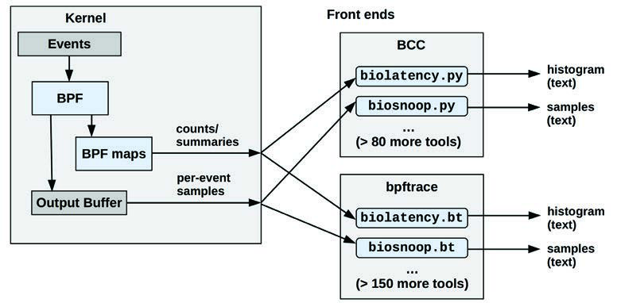
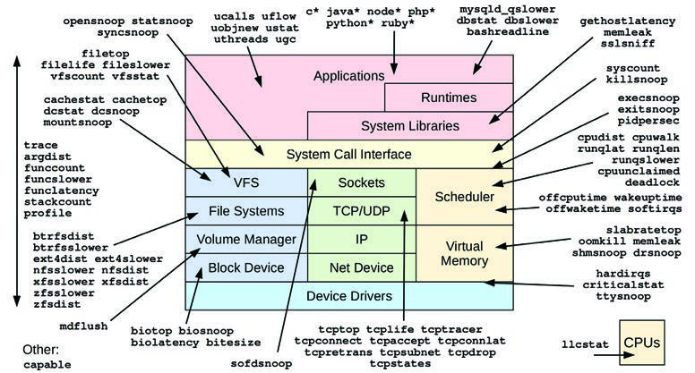
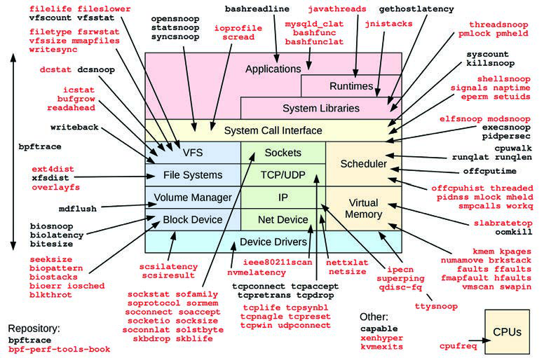

本章介绍了用于扩展 BPF 的 BCC 和 bpftrace 追踪前端。这些前端提供了一系列性能分析工具，这些工具已在前面的章节中使用过。BPF 技术已在第 3 章《操作系统》第 3.4.4 节 [[03 操作系统#3.4.4 扩展 BPF|扩展 BPF]] 中进行了介绍。总之，扩展 BPF 是一个内核执行环境，可以为追踪器提供编程能力。

本章，连同第 13 章 [[13 perf|perf]] 和第 14 章 [[14 Ftrace|Ftrace]]，是为那些希望更详细地学习一种或多种系统追踪器的人准备的可选阅读内容。

扩展 BPF 工具可用于回答诸如以下的问题：

- 磁盘 I/O 的延迟是多少（以直方图形式显示）？
- CPU 调度器延迟是否高到足以引起问题？
- 应用程序是否正遭受文件系统延迟的影响？
- 正在发生哪些 TCP 会话，持续时间是多少？
- 哪些 code paths 正在阻塞，阻塞了多久？

BPF 与其他追踪器的不同之处在于它是**可编程的**。它允许在事件发生时执行用户定义的程序，这些程序可以执行过滤、保存和检索信息、计算延迟、执行内核级聚合和自定义摘要等。虽然其他追踪器可能需要将所有事件转储到用户空间并进行后处理，但 BPF 允许这种处理在内核上下文中高效地进行。这使得创建性能工具变得切合实际，否则这些工具对于生产环境来说开销太高。

本章为每个推荐的前端都设置了一个主要小节。关键小节包括：

- **15.1: BCC**
    - 15.1.1: 安装
    - 15.1.2: 工具覆盖范围
    - 15.1.3: 单用途工具
    - 15.1.4: 多用途工具
    - 15.1.5: 一行命令
- **15.2: bpftrace**
    - 15.2.1: 安装
    - 15.2.2: 工具
    - 15.2.3: 一行命令
    - 15.2.4: 编程
    - 15.2.5: 参考

BCC 和 bpftrace 之间的区别在之前的章节中可能已经很明显：BCC 适用于复杂工具，而 bpftrace 适用于即时（ad hoc）自定义程序。如图 15.1 所示，某些工具在两者中都有实现。


**图 15.1 BPF 追踪前端**

BCC 和 bpftrace 之间的具体区别总结在表 15.1 中。

**表 15.1 BCC 与 bpftrace 对比**

| 特性 | BCC | bpftrace |
| :--- | :--- | :--- |
| 仓库中的工具数量 | > 80 (bcc) | > 30 (bpftrace)<br>> 120 (bpf-perf-tools-book) |
| 工具使用 | 通常支持复杂选项（`-h`, `-P PID` 等）和参数 | 通常简单：无选项，且有零个或一个参数 |
| 工具文档 | Man 手册页、示例文件 | Man 手册页、示例文件 |
| 编程语言 | 用户空间：Python, Lua, C, 或 C++<br>内核空间：C | bpftrace |
| 编程难度 | 困难 | 容易 |
| 每事件输出类型 | 任何 | 文本, JSON |
| 摘要类型 | 任何 | 计数, 最小值, 最大值, 总和, 平均值, log2 直方图, 线性直方图；支持零个或多个键 |
| 库支持 | 是（例如 Python import） | 否 |
| 平均程序长度 [^1] | 228 行 | 28 行 |

[^1]: 基于官方仓库和我 BPF 书籍仓库中提供的工具（不计注释）。

BCC 和 bpftrace 都在包括 Facebook 和 Netflix 在内的许多公司中使用。Netflix 默认在所有云实例上安装它们，并在全云范围的监控和仪表板之后使用它们进行更深层的分析，具体包括 [Gregg 18e]：

- **BCC**: 在需要时，在命令行使用预设工具来分析存储 I/O、网络 I/O 和进程执行。一些 BCC 工具由图形化性能仪表板系统自动执行，以提供调度器和磁盘 I/O 延迟热图、非 CPU 火焰图（off-CPU flame graphs）等数据。此外，一个自定义 BCC 工具始终作为守护进程运行（基于 `tcplife(8)`），将网络事件记录到云存储中以进行流量分析。
- **bpftrace**: 当需要了解内核和应用程序的病理特征（pathologies）时，会开发自定义的 bpftrace 工具。

接下来的章节将解释 BCC 工具、bpftrace 工具以及 bpftrace 编程。

## 15.1 BCC

BPF 编译器集合（BPF Compiler Collection，或简称为 “bcc”，源于项目和软件包名称）是一个开源项目，包含大量高级性能分析工具，以及一个用于构建这些工具的框架。BCC 由 Brenden Blanco 创建；我协助了它的开发并创建了许多追踪工具。

作为一个 BCC 工具的示例，`biolatency(8)` 以 2 的幂次直方图形式显示磁盘 I/O 延迟的分布，并可以按 I/O 标志进行分解：

```bash
# biolatency.py -mF
Tracing block device I/O... Hit Ctrl-C to end.
^C

flags = Priority-Metadata-Read
     msecs               : count     distribution
         0 -> 1          : 90       |****************************************|

flags = Write
     msecs               : count     distribution
         0 -> 1          : 24       |****************************************|
         2 -> 3          : 0        |                                        |
         4 -> 7          : 8        |*************                           |

flags = ReadAhead-Read
     msecs               : count     distribution
         0 -> 1          : 3031     |****************************************|
         2 -> 3          : 10       |                                        |
         4 -> 7          : 5        |                                        |
         8 -> 15         : 3        |                                        |
```

此输出显示了双峰（bi-model）写入分布，以及许多带有 “ReadAhead-Read” 标志的 I/O。此工具使用 BPF 在内核空间汇总直方图以提高效率，因此用户空间组件只需要读取已经汇总好的直方图（计数列）并打印它们。

这些 BCC 工具通常在 BCC 仓库中拥有用法消息 (`-h`)、man 手册页和示例文件：

[https://github.com/iovisor/bcc](https://github.com/iovisor/bcc)

本节总结了 BCC 及其单用途和多用途性能分析工具。

### 15.1.1 安装 (Installation)

许多 Linux 发行版（包括 Ubuntu, Debian, RHEL, Fedora 和 Amazon Linux）都提供 BCC 软件包，使安装变得非常简单。搜索 “bcc-tools”、“bpfcc-tools” 或 “bcc”（由于包维护者的命名习惯不同）。

你也可以从源码构建 BCC。有关最新的安装和构建说明，请查看 BCC 仓库中的 `INSTALL.md` [Iovisor 20b]。`INSTALL.md` 还列出了内核配置要求（包括 `CONFIG_BPF=y`, `CONFIG_BPF_SYSCALL=y`, `CONFIG_BPF_EVENTS=y`）。BCC 要求至少 Linux 4.4 才能使部分工具运行；对于大多数工具，需要 4.9 或更高版本。

### 15.1.2 工具覆盖范围 (Tool Coverage)

BCC 追踪工具如图 15.2 所示（某些工具使用通配符分组：例如 `java*` 代表所有以 “java” 开头的工具）。

许多是单用途工具，用单箭头表示；有些是多用途工具，列在左侧并带双箭头以显示其覆盖范围。


**图 15.2 BCC 工具**

### 15.1.3 单用途工具 (Single-Purpose Tools)

我根据第 14 章 [[14 Ftrace|Ftrace]] 中 `perf-tools` 的相同“只做一件事并做好”的哲学开发了许多这类工具。这种设计包括使其默认输出简洁且通常恰到好处。你可以“直接运行 `biolatency`”而无需学习任何命令行选项，通常就能获得足以解决问题的输出，而没有杂乱干扰。通常也存在用于定制的选项，例如前面展示的 `biolatency(8) -F` 按 I/O 标志分解。

表 15.2 描述了一些精选的单用途工具，如果本书中出现了这些工具，还包括了它们所在的章节。完整列表请参阅 BCC 仓库 [Iovisor 20a]。

**表 15.2 精选单用途 BCC 工具**

| 工具 | 描述 | 章节 |
| :--- | :--- | :--- |
| `biolatency(8)` | 以直方图形式总结块 I/O（磁盘 I/O）延迟 | [[09 磁盘#9.6.6 biolatency|9.6.6]] |
| `biotop(8)` | 按进程总结块 I/O | [[09 磁盘#9.6.8 biotop|9.6.8]] |
| `biosnoop(8)` | 追踪带有延迟和其他详情的块 I/O | [[09 磁盘#9.6.7 biosnoop|9.6.7]] |
| `bitesize(8)` | 将块 I/O 大小总结为进程直方图 | - |
| `btrfsdist(8)` | 将 btrfs 操作延迟总结为直方图 | [[08 文件系统#8.6.13 xfsdist btrfsdist ext4dist zfsdist|8.6.13]] |
| `btrfsslower(8)` | 追踪缓慢的 btrfs 操作 | [[08 文件系统#8.6.14 xfsslower btrfsslower ext4slower zfsslower|8.6.14]] |
| `cpudist(8)` | 以直方图形式总结每个进程的在 CPU 和非 CPU 时间 | [[06 CPU#6.6.15 cpudist|6.6.15]], [[16 案例研究#16.1.7 cpudist|16.1.7]] |
| `cpuunclaimed(8)` | 显示尽管有需求但仍处于闲置且空闲状态的 CPU | - |
| `criticalstat(8)` | 追踪长时间的原子临界内核段 | - |
| `dbslower(8)` | 追踪数据库慢查询 | - |
| `dbstat(8)` | 以直方图形式总结数据库查询延迟 | - |
| `drsnoop(8)` | 追踪带有 PID 和延迟的直接内存回收事件 | [[07 内存#7.5.11 drsnoop|7.5.11]] |
| `execsnoop(8)` | 通过 `execve(2)` 系统调用追踪新进程 | [[01 绪论#1.7.3 execsnoop|1.7.3]], [[05 应用程序#5.5.5 execsnoop|5.5.5]] |
| `ext4dist(8)` | 将 ext4 操作延迟总结为直方图 | [[08 文件系统#8.6.13 xfsdist btrfsdist ext4dist zfsdist|8.6.13]] |
| `ext4slower(8)` | 追踪缓慢的 ext4 操作 | [[08 文件系统#8.6.14 xfsslower btrfsslower ext4slower zfsslower|8.6.14]] |
| `filelife(8)` | 追踪短寿命文件的寿命 | - |
| `gethostlatency(8)` | 通过解析器函数追踪 DNS 延迟 | - |
| `hardirqs(8)` | 总结硬中断事件时间 | [[06 CPU#6.6.19 hardirqs|6.6.19]] |
| `killsnoop(8)` | 追踪由 `kill(2)` 系统调用发出的信号 | - |
| `klockstat(8)` | 总结内核互斥锁统计信息 | - |
| `llcstat(8)` | 按进程总结 CPU 缓存引用和未命中 | - |
| `memleak(8)` | 显示未释放的内存分配 | - |
| `mysqld_qslower(8)` | 追踪 MySQL 慢查询 | - |
| `nfsdist(8)` | 将 NFS 操作延迟总结为直方图 | [[08 文件系统#8.6.13 xfsdist btrfsdist ext4dist zfsdist|8.6.13]] |
| `nfsslower(8)` | 追踪缓慢的 NFS 操作 | [[08 文件系统#8.6.14 xfsslower btrfsslower ext4slower zfsslower|8.6.14]] |
| `offcputime(8)` | 按堆栈轨迹总结非 CPU 时间 | [[05 应用程序#5.5.3 offcputime|5.5.3]] |
| `offwaketime(8)` | 按非 CPU 堆栈和唤醒者堆栈总结阻塞时间 | - |
| `oomkill(8)` | 追踪内存不足（OOM）杀手 | - |
| `opensnoop(8)` | 追踪 `open(2)` 系列系统调用 | [[08 文件系统#8.6.10 opensnoop|8.6.10]] |
| `profile(8)` | 使用定时采样堆栈轨迹剖析 CPU 使用情况 | [[05 应用程序#5.5.2 profile|5.5.2]] |
| `runqlat(8)` | 以直方图形式总结运行队列（调度器）延迟 | [[06 CPU#6.6.16 runqlat|6.6.16]] |
| `runqlen(8)` | 使用定时采样总结运行队列长度 | [[06 CPU#6.6.17 runqlen|6.6.17]] |
| `runqslower(8)` | 追踪较长的运行队列延迟 | - |
| `syncsnoop(8)` | 追踪 `sync(2)` 系列系统调用 | - |
| `syscount(8)` | 总结系统调用计数和延迟 | [[05 应用程序#5.5.6 syscount|5.5.6]] |
| `tcplife(8)` | 追踪 TCP 会话并总结其寿命 | [[10 网络#10.6.9 tcplife|10.6.9]] |
| `tcpretrans(8)` | 追踪带有内核状态等详情的 TCP 重传 | [[10 网络#10.6.11 tcpretrans|10.6.11]] |
| `tcptop(8)` | 按主机和 PID 总结 TCP 发送/接收吞吐量 | [[10 网络#10.6.10 tcptop|10.6.10]] |
| `wakeuptime(8)` | 按唤醒者堆栈总结睡眠到唤醒的时间 | - |
| `xfsdist(8)` | 将 xfs 操作延迟总结为直方图 | [[08 文件系统#8.6.13 xfsdist btrfsdist ext4dist zfsdist|8.6.13]] |
| `xfsslower(8)` | 追踪缓慢的 xfs 操作 | [[08 文件系统#8.6.14 xfsslower btrfsslower ext4slower zfsslower|8.6.14]] |
| `zfsdist(8)` | 将 zfs 操作延迟总结为直方图 | [[08 文件系统#8.6.13 xfsdist btrfsdist ext4dist zfsdist|8.6.13]] |
| `zfsslower(8)` | 追踪缓慢的 zfs 操作 | [[08 文件系统#8.6.14 xfsslower btrfsslower ext4slower zfsslower|8.6.14]] |

有关这些工具的示例，请参阅之前的章节以及 BCC 仓库中的 `*_example.txt` 文件（其中许多也是我编写的）。对于本书未涵盖的工具，还请参阅 [Gregg 19]。

### 15.1.4 多用途工具 (Multi-Purpose Tools)

多用途工具列在图 15.2 的左侧。这些工具支持多个事件源，可以扮演多种角色，类似于 `perf(1)`，尽管这也使得它们使用起来比较复杂。表 15.3 描述了这些工具。

**表 15.3 多用途 BCC 工具**

| 工具 | 描述 | 章节 |
| :--- | :--- | :--- |
| `argdist(8)` | 将函数参数值显示为直方图或计数 | [[#15.1.5 一行命令|15.1.5]] |
| `funccount(8)` | 统计内核或用户级函数调用次数 | [[#15.1.5 一行命令|15.1.5]] |
| `funcslower(8)` | 追踪缓慢的内核或用户级函数调用 | - |
| `funclatency(8)` | 将函数延迟总结为直方图 | - |
| `stackcount(8)` | 统计导致事件的堆栈轨迹次数 | [[#15.1.5 一行命令|15.1.5]] |
| `trace(8)` | 带有过滤器的任意函数追踪 | [[#15.1.5 一行命令|15.1.5]] |

为了帮助你记住有用的用法，你可以收集一行命令。我在下一节中提供了一些，类似于我为 `perf(1)` 和 `trace-cmd` 准备的一行命令小节。

### 15.1.5 一行命令 (One-Liners)

以下一行命令在系统范围内追踪，直到输入 Ctrl-C（除非另有说明）。它们按工具进行分组。

#### funccount(8)

统计 VFS 内核调用次数：
```bash
funccount 'vfs_*'
```

统计 TCP 内核调用次数：
```bash
funccount 'tcp_*'
```

每秒统计一次 TCP 发送调用次数：
```bash
funccount -i 1 'tcp_send*'
```

显示每秒块 I/O 事件的速率：
```bash
funccount -i 1 't:block:*'
```

显示每秒 libc `getaddrinfo()`（名称解析）的速率：
```bash
funccount -i 1 c:getaddrinfo
```

#### stackcount(8)

统计导致块 I/O 的堆栈轨迹次数：
```bash
stackcount t:block:block_rq_insert
```

统计导致发送 IP 数据包的堆栈轨迹次数，并显示责任 PID：
```bash
stackcount -P ip_output
```

统计导致线程阻塞并移出 CPU 的堆栈轨迹次数：
```bash
stackcount t:sched:sched_switch
```

#### trace(8)

追踪带有文件名的内核 `do_sys_open()` 函数：
```bash
trace 'do_sys_open "%s", arg2'
```

追踪内核函数 `do_sys_open()` 的返回并打印返回值：
```bash
trace 'r::do_sys_open "ret: %d", retval'
```

追踪带有模式（mode）和用户级堆栈的内核函数 `do_nanosleep()`：
```bash
trace -U 'do_nanosleep "mode: %d", arg2'
```

通过 pam 库追踪身份验证请求：
```bash
trace 'pam:pam_start "%s: %s", arg1, arg2'
```

#### argdist(8)

按返回值（大小或错误）汇总 VFS 读取情况：
```bash
argdist -H 'r::vfs_read()'
```

按返回值（大小或错误）汇总 PID 1005 的 libc `read()` 情况：
```bash
argdist -p 1005 -H 'r:c:read()'
```

按系统调用 ID 统计系统调用次数：
```bash
argdist.py -C 't:raw_syscalls:sys_enter():int:args->id'
```

使用计数汇总内核函数 `tcp_sendmsg()` 的大小（size）参数：
```bash
argdist -C 'p::tcp_sendmsg(struct sock *sk, struct msghdr *msg, size_t size):u32:size'
```

以 2 的幂次直方图形式汇总 `tcp_sendmsg()` 的大小：
```bash
argdist -H 'p::tcp_sendmsg(struct sock *sk, struct msghdr *msg, size_t size):u32:size'
```

按文件描述符统计 PID 181 的 libc `write()` 调用次数：
```bash
argdist -p 181 -C 'p:c:write(int fd):int:fd'
```

汇总延迟大于 100 μs 的进程读取情况：
```bash
argdist -C 'r::__vfs_read():u32:$PID:$latency > 100000'
```

### 15.1.6 多用途工具示例 (Multi-Tool Example)

作为一个使用多用途工具的例子，以下显示了 `trace(8)` 工具追踪内核函数 `do_sys_open()`，并将其第二个参数作为字符串打印：

```bash
# trace 'do_sys_open "%s", arg2'
PID     TID     COMM        FUNC             -
28887   28887   ls          do_sys_open      /etc/ld.so.cache
28887   28887   ls          do_sys_open      /lib/x86_64-linux-gnu/libselinux.so.1
28887   28887   ls          do_sys_open      /lib/x86_64-linux-gnu/libc.so.6
28887   28887   ls          do_sys_open      /lib/x86_64-linux-gnu/libpcre2-8.so.0
28887   28887   ls          do_sys_open      /lib/x86_64-linux-gnu/libdl.so.2
28887   28887   ls          do_sys_open      /lib/x86_64-linux-gnu/libpthread.so.0
28887   28887   ls          do_sys_open      /proc/filesystems
28887   28887   ls          do_sys_open      /usr/lib/locale/locale-archive
[...]
```

`trace` 的语法灵感来自 `printf(3)`，支持格式化字符串和参数。在本例中，`arg2`（第二个参数）被打印为字符串，因为它包含文件名。

`trace(8)` 和 `argdist(8)` 都支持允许创建许多自定义一行命令的语法。接下来的章节中涵盖的 **bpftrace** 进一步推进了这一点，提供了一门完整的语言来编写单行或多行程序。

### 15.1.7 BCC vs. bpftrace

差异已在本章开头进行了总结。BCC 适用于自定义且复杂的工具，这些工具支持多种参数，或者使用各种库。bpftrace 非常适合一行命令或不接受参数（或仅接受单个整数参数）的小型工具。BCC 允许追踪工具核心的 BPF 程序使用 C 语言开发，从而实现完全控制。这是以复杂性为代价的：BCC 工具的开发时间可能是 bpftrace 工具的十倍，代码行数也可能是其十倍。由于开发工具通常需要多次迭代，我发现先用 bpftrace 开发工具（速度更快），然后在需要时将其移植到 BCC 往往能节省时间。

BCC 和 bpftrace 之间的区别就像 C 语言编程和 Shell 脚本编写之间的区别，其中 BCC 类似于 C 语言编程（其中一部分确实是 C 语言编程），而 bpftrace 类似于 Shell 脚本。在我的日常工作中，我会使用许多预构建的 C 程序（`top(1)`, `vmstat(1)` 等）并开发自定义的一次性 Shell 脚本。同样地，我也使用许多预构建的 BCC 工具，并开发自定义的一次性 bpftrace 工具。

我在本书中提供的内容正是为了支持这种用法：许多章节展示了你可以使用的 BCC 工具，而本章后面的小节则展示了你如何开发自定义的 bpftrace 工具。

### 15.1.8 文档 (Documentation)

工具通常带有一条用法消息来总结其语法。例如：

```bash
# funccount -h
usage: funccount [-h] [-p PID] [-i INTERVAL] [-d DURATION] [-T] [-r] [-D]
                pattern

Count functions, tracepoints, and USDT probes

positional arguments:
  pattern               search expression for events

optional arguments:
  -h, --help            show this help message and exit
  -p PID, --pid PID     trace this PID only
  -i INTERVAL, --interval INTERVAL
                        summary interval, seconds
  -d DURATION, --duration DURATION
                        total duration of trace, seconds
  -T, --timestamp       include timestamp on output
  -r, --regexp          use regular expressions. Default is "*" wildcards
                        only.
  -D, --debug           print BPF program before starting (for debugging
                        purposes)

examples:
    ./funccount 'vfs_*'             # count kernel fns starting with "vfs"
    ./funccount -r '^vfs.*'         # same as above, using regular expressions
    ./funccount -Ti 5 'vfs_*'       # output every 5 seconds, with timestamps
    ./funccount -d 10 'vfs_*'       # trace for 10 seconds only
    ./funccount -p 185 'vfs_*'      # count vfs calls for PID 181 only
    ./funccount t:sched:sched_fork  # count calls to the sched_fork tracepoint
    ./funccount -p 185 u:node:gc*   # count all GC USDT probes in node, PID 185
    ./funccount c:malloc            # count all malloc() calls in libc
    ./funccount go:os.*             # count all "os.*" calls in libgo
    ./funccount -p 185 go:os.*      # count all "os.*" calls in libgo, PID 185
    ./funccount ./test:read*        # count "read*" calls in the ./test binary
```

每个工具在 BCC 仓库中也都拥有一个 man 手册页（`man/man8/funccount.8`）和一个示例文件（`examples/funccount_example.txt`）。示例文件包含带有注释的输出示例。

我还在 BCC 仓库中创建了以下文档 [Iovisor 20b]：

- **最终用户教程**: `docs/tutorial.md`
- **BCC 开发者教程**: `docs/tutorial_bcc_python_developer.md`
- **参考指南**: `docs/reference_guide.md`

我之前的著作《BPF Performance Tools》中的第 4 章专门介绍了 BCC [Gregg 19]。

## 15.2 bpftrace

bpftrace 是一个构建在 BPF 和 BCC 之上的开源追踪器，它不仅提供了一套性能分析工具，还提供了一种高级语言来帮助你开发新工具。该语言被设计得简单易学。它是追踪领域的 `awk(1)`，并且是基于 `awk(1)` 构建的。在 `awk(1)` 中，你编写一个程序段来处理输入行，而使用 bpftrace，你编写一个程序段来处理输入事件。bpftrace 由 Alastair Robertson 创建，我已成为主要贡献者。

作为 bpftrace 的一个示例，以下一行命令按进程名称显示 TCP 接收消息大小的分布：

```bash
# bpftrace -e 'kr:tcp_recvmsg /retval >= 0/ { @recv_bytes[comm] = hist(retval); }'
Attaching 1 probe...
^C

@recv_bytes[sshd]:
[32, 64)               7 |@@@@@@@@@@@@@@@@@@@@@@@@@@@@@@@@@@@@@@@@@@@@@@@@@@@@|
[64, 128)              2 |@@@@@@@@@@@@@@                                      |

@recv_bytes[nodejs]:
[0]                   82 |@@@@@@@@@@@@@@@@@@@@@@@@@@                          |
[1]                  135 |@@@@@@@@@@@@@@@@@@@@@@@@@@@@@@@@@@@@@@@@@@@@        |
[2, 4)               153 |@@@@@@@@@@@@@@@@@@@@@@@@@@@@@@@@@@@@@@@@@@@@@@@@@@  |
[4, 8)                12 |@@@                                                 |
[8, 16)                6 |@                                                   |
[16, 32)              32 |@@@@@@@@@@                                          |
[32, 64)             158 |@@@@@@@@@@@@@@@@@@@@@@@@@@@@@@@@@@@@@@@@@@@@@@@@@@@@|
[64, 128)            155 |@@@@@@@@@@@@@@@@@@@@@@@@@@@@@@@@@@@@@@@@@@@@@@@@@@@ |
[128, 256)            14 |@@@@                                                |
```

此输出显示 nodejs 进程具有双峰接收大小，其中一个峰值大约在 0 到 4 字节之间，另一个在 32 到 128 字节之间。

通过简洁的语法，这个 bpftrace 一行命令使用了一个 kretprobe 来对 `tcp_recvmsg()` 进行插桩，过滤出返回值大于等于 0 的情况（以排除负的错误代码），并填充了一个名为 `@recv_bytes` 的 BPF 映射表对象，其中包含返回值的直方图，使用进程名称 (`comm`) 作为键保存。当输入 Ctrl-C 且 bpftrace 接收到信号 (SIGINT) 时，它结束运行并自动打印出 BPF 映射表。这种语法在接下来的小节中会进行更详细的解释。

除了能让你编写自己的一行命令，bpftrace 在其仓库中还附带了许多即开即用的工具：

[https://github.com/iovisor/bpftrace](https://github.com/iovisor/bpftrace)

本节总结了 bpftrace 工具和 bpftrace 编程语言。这基于我在 [Gregg 19] 中对 bpftrace 的素材，该书对 bpftrace 进行了更深入的探讨。

### 15.2.1 安装 (Installation)

许多 Linux 发行版（包括 Ubuntu）都提供 bpftrace 软件包，使安装变得非常简单。搜索名为 “bpftrace” 的软件包；它们存在于 Ubuntu, Fedora, Gentoo, Debian, OpenSUSE 和 CentOS 中。RHEL 8.2 将 bpftrace 作为技术预览版。

除了软件包，还有 bpftrace 的 Docker 镜像、除了 glibc 之外不依赖任何其他库的 bpftrace 二进制文件，以及从源码构建 bpftrace 的说明。有关这些选项的文档，请参阅 bpftrace 仓库中的 `INSTALL.md` [Iovisor 20a]，其中还列出了内核要求（包括 `CONFIG_BPF=y`, `CONFIG_BPF_SYSCALL=y`, `CONFIG_BPF_EVENTS=y`）。bpftrace 要求 Linux 4.9 或更高版本。

### 15.2.2 工具 (Tools)

bpftrace 追踪工具如图 15.3 所示。

bpftrace 仓库中的工具以黑色显示。为了我之前的著作，我开发了更多的 bpftrace 工具，并将它们作为开源软件发布在 `bpf-perf-tools-book` 仓库中：它们以红色/灰色显示 [Gregg 19g]。


**图 15.3 bpftrace 工具**

### 15.2.3 一行命令 (One-Liners)

以下一行命令在系统范围内追踪，直到输入 Ctrl-C（除非另有说明）。除了它们本身的实用性外，它们还可以作为 bpftrace 编程语言的微型示例。这些命令按目标进行分组。在每个资源章节中都可以找到更长的 bpftrace 一行命令列表。

#### CPU

追踪带有参数的新进程：
```bash
bpftrace -e 'tracepoint:syscalls:sys_enter_execve { join(args->argv); }'
```

按进程统计系统调用次数：
```bash
bpftrace -e 'tracepoint:raw_syscalls:sys_enter { @[pid, comm] = count(); }'
```

以 49 赫兹采样 PID 189 的用户级堆栈：
```bash
bpftrace -e 'profile:hz:49 /pid == 189/ { @[ustack] = count(); }'
```

#### 内存 (Memory)

按代码路径统计进程堆扩展 (`brk()`) 次数：
```bash
bpftrace -e 'tracepoint:syscalls:sys_enter_brk { @[ustack, comm] = count(); }'
```

按用户级堆栈轨迹统计用户页面错误次数：
```bash
bpftrace -e 'tracepoint:exceptions:page_fault_user { @[ustack, comm] = count(); }'
```

按追踪点统计 vmscan 操作次数：
```bash
bpftrace -e 'tracepoint:vmscan:* { @[probe]++; }'
```

#### 文件系统 (File Systems)

追踪通过 `openat(2)` 打开的文件及进程名称：
```bash
bpftrace -e 't:syscalls:sys_enter_openat { printf("%s %s\n", comm, str(args->filename)); }'
```

显示 `read(2)` 系统调用读取字节数（及错误）的分布：
```bash
bpftrace -e 'tracepoint:syscalls:sys_exit_read { @ = hist(args->ret); }'
```

统计 VFS 调用次数：
```bash
bpftrace -e 'kprobe:vfs_* { @[probe] = count(); }'
```

统计 ext4 追踪点调用次数：
```bash
bpftrace -e 'tracepoint:ext4:* { @[probe] = count(); }'
```

#### 磁盘 (Disk)

以直方图形式汇总块 I/O 大小：
```bash
bpftrace -e 't:block:block_rq_issue { @bytes = hist(args->bytes); }'
```

统计块 I/O 请求的用户堆栈轨迹次数：
```bash
bpftrace -e 't:block:block_rq_issue { @[ustack] = count(); }'
```

统计块 I/O 类型标志次数：
```bash
bpftrace -e 't:block:block_rq_issue { @[args->rwbs] = count(); }'
```

#### 网络 (Networking)

按 PID 和进程名称统计套接字 `accept(2)` 次数：
```bash
bpftrace -e 't:syscalls:sys_enter_accept* { @[pid, comm] = count(); }'
```

按在 CPU 上的 PID 和进程名称统计套接字发送/接收字节数：
```bash
bpftrace -e 'kr:sock_sendmsg,kr:sock_recvmsg /retval > 0/ { @[pid, comm] = sum(retval); }'
```

以直方图形式显示 TCP 发送字节数：
```bash
bpftrace -e 'k:tcp_sendmsg { @send_bytes = hist(arg2); }'
```

#### 其他子系统

以直方图形式显示 TCP 接收字节数：
```bash
bpftrace -e 'kr:tcp_recvmsg /retval >= 0/ { @recv_bytes = hist(retval); }'
```

以直方图形式显示 UDP 发送字节数：
```bash
bpftrace -e 'k:udp_sendmsg { @send_bytes = hist(arg2); }'
```

按用户堆栈轨迹汇总 `malloc()` 请求字节数（高开销）：
```bash
bpftrace -e 'u:/lib/x86_64-linux-gnu/libc-2.27.so:malloc { @[ustack(5)] = sum(arg0); }'
```

追踪 `kill()` 信号，显示发送者进程名、目标 PID 和信号编号：
```bash
bpftrace -e 't:syscalls:sys_enter_kill { printf("%s -> PID %d SIG %d\n", comm, args->pid, args->sig); }'
```

按系统调用函数统计系统调用次数：
```bash
bpftrace -e 'tracepoint:raw_syscalls:sys_enter { @[ksym(*(kaddr("sys_call_table") + args->id * 8))] = count(); }'
```

统计以 “attach” 开头的内核函数调用次数：
```bash
bpftrace -e 'kprobe:attach* { @[probe] = count(); }'
```

对 `vfs_write()` 的第三个参数（大小）进行频率统计：
```bash
bpftrace -e 'kprobe:vfs_write { @[arg2] = count(); }'
```

对内核函数 `vfs_read()` 进行计时并以直方图汇总：
```bash
bpftrace -e 'k:vfs_read { @ts[tid] = nsecs; } kr:vfs_read /@ts[tid]/ { @ = hist(nsecs - @ts[tid]); delete(@ts[tid]); }'
```

统计上下文切换堆栈轨迹：
```bash
bpftrace -e 't:sched:sched_switch { @[kstack, ustack, comm] = count(); }'
```

以 99 赫兹采样内核堆栈，排除空闲进程：
```bash
bpftrace -e 'profile:hz:99 /pid/ { @[kstack] = count(); }'
```

### 15.2.4 编程 (Programming)

本节提供了使用 bpftrace 及编写 bpftrace 语言程序的简明指南。本节的格式灵感来自 awk 的原始论文 [Aho 78][Aho 88]，该论文用六页篇幅介绍了那门语言。bpftrace 语言本身受到 awk 和 C 语言，以及包括 DTrace 和 SystemTap 在内的追踪器的启发。

以下是一个 bpftrace 编程示例：它测量 `vfs_read()` 内核函数的执行时间，并以微秒为单位打印直方图。

```cpp
#!/usr/local/bin/bpftrace

// 此程序对 vfs_read() 进行计时

kprobe:vfs_read
{
    @start[tid] = nsecs;
}

kretprobe:vfs_read
/@start[tid]/
{
    $duration_us = (nsecs - @start[tid]) / 1000;
    @us = hist($duration_us);
    delete(@start[tid]);
}
```

接下来的内容将解释该工具的组成部分，可以将其视为教程。第 15.2.5 节《参考》是一个参考指南摘要，包括探针类型、测试、运算符、变量、函数和映射表类型。

#### 1. 用法 (Usage)

命令：
```bash
bpftrace -e program
```
将执行该程序，并对程序中定义的任何事件进行插桩。程序将一直运行，直到输入 Ctrl-C，或者直到它显式调用 `exit()`。作为 `-e` 参数运行的 bpftrace 程序被称为**一行命令**。或者，可以将程序保存到文件中并执行：
```bash
bpftrace file.bt
```
`.bt` 扩展名不是必须的，但有助于后续识别。通过在文件顶部放置解释器行 [^2]：
```bash
#!/usr/local/bin/bpftrace
```
可以使文件变为可执行文件（`chmod a+x file.bt`）并像其他程序一样运行：
```bash
./file.bt
```
bpftrace 必须由 root 用户（超级用户）执行 [^3]。在某些环境中，可以使用 root shell 直接执行程序，而在其他环境中，可能更倾向于通过 `sudo(1)` 运行特权命令：
```bash
sudo ./file.bt
```

#### 2. 程序结构 (Program Structure)

bpftrace 程序是一系列探针及相关的动作：
```text
probes { actions }
probes { actions }
...
```
当探针触发时，关联的动作就会执行。在动作之前可以包含一个可选的过滤器表达式：
```text
probes /filter/ { actions }
```
只有当过滤器表达式为真时，动作才会触发。这类似于 `awk(1)` 的程序结构：
```text
/pattern/ { actions }
```
`awk(1)` 编程也与 bpftrace 编程类似：可以定义多个动作块，它们可以按任何顺序执行，当它们的模式或“探针+过滤器”表达式为真时触发。

#### 3. 注释 (Comments)

对于 bpftrace 程序文件，可以使用 “//” 前缀添加单行注释：
```cpp
// 这是一个注释
```
这些注释不会被执行。多行注释使用与 C 语言相同的格式：
```cpp
/*
 * 这是一个
 * 多行注释。
 */
```
这种语法也可用于行内部分注释（例如 `/* 注释 */`）。

#### 4. 探针格式 (Probe Format)

探针以探针类型名称开始，然后是以冒号分隔的标识符层级：
```text
type:identifier1[:identifier2[...]]
```
层级由探针类型定义。考虑这两个例子：
```text
kprobe:vfs_read
uprobe:/bin/bash:readline
```
`kprobe` 探针类型对内核函数调用进行插桩，仅需一个标识符：内核函数名称。`uprobe` 探针类型对用户级函数调用进行插桩，需要二进制文件的路径和函数名称。

可以使用逗号分隔符指定多个探针来执行相同的动作。例如：
```text
probe1,probe2,... { actions }
```
有两个特殊的探针类型不需要额外的标识符：`BEGIN` 和 `END` 分别在 bpftrace 程序开始和结束时触发（就像 `awk(1)` 一样）。例如，在追踪开始时打印一条信息性消息：
```cpp
BEGIN { printf("Tracing. Hit Ctrl-C to end.\n"); }
```

#### 5. 探针通配符 (Probe Wildcards)

某些探针类型接受通配符。探针：
```text
kprobe:vfs_*
```
将对所有以 “vfs_” 开头的 kprobes（内核函数）进行插桩。

对过多的探针进行插桩可能会产生不必要的性能开销。为了防止意外触发此情况，bpftrace 具有可调的最大使能探针数量，通过 `BPFTRACE_MAX_PROBES` 环境变量设置（目前默认为 512 [^4]）。

在使用通配符之前，可以通过运行 `bpftrace -l` 列出匹配的探针来测试它们：
```bash
# bpftrace -l 'kprobe:vfs_*'
kprobe:vfs_fallocate
kprobe:vfs_truncate
kprobe:vfs_open
kprobe:vfs_setpos
kprobe:vfs_llseek
[...]
# bpftrace -l 'kprobe:vfs_*' | wc -l
56
```
这匹配了 56 个探针。探针名称用引号括起来，以防止意外的 Shell 扩展。

#### 6. 过滤器 (Filters)

过滤器是布尔表达式，用于控制动作是否执行。过滤器：
```text
/pid == 123/
```
仅当 `pid` 内置变量（进程 ID）等于 123 时才执行动作。

如果未指定测试：
```text
/pid/
```
过滤器将检查内容是否为非零（`/pid/` 与 `/pid != 0/` 相同）。过滤器可以使用布尔运算符组合，例如逻辑与 (`&&`)。例如：
```text
/pid > 100 && pid < 1000/
```
这要求两个表达式都计算为“真”。

#### 7. 动作 (Actions)

动作可以是一个单条语句，也可以是多条由分号分隔的语句：
```text
{ action one; action two; action three }
```
最后一条语句也可以追加分号。语句使用 bpftrace 语言编写，该语言类似于 C 语言，可以操作变量并执行 bpftrace 函数调用。例如，动作：
```text
{ $x = 42; printf("$x is %d", $x); }
```
将变量 `$x` 设置为 42，然后使用 `printf()` 打印它。

#### 8. Hello, World!

你现在应该能理解下面这个基础程序了，它在 bpftrace 开始运行时打印 “Hello, World!”：
```bash
# bpftrace -e 'BEGIN { printf("Hello, World!\n"); }'
Attaching 1 probe...
Hello, World!
^C
```
作为文件，它可以格式化为：
```cpp
#!/usr/local/bin/bpftrace

BEGIN
{
    printf("Hello, World!\n");
}
```
使用缩进的动作块跨越多行并不是必须的，但它提高了可读性。

#### 9. 函数 (Functions)

除了用于打印格式化输出的 `printf()` 外，其他内置函数包括：

- `exit()`: 退出 bpftrace
- `str(char *)`: 从指针返回字符串
- `system(format[, arguments ...])`: 在 Shell 中运行命令

动作：
```text
printf("got: %llx %s\n", $x, str($x)); exit();
```
将变量 `$x` 打印为十六进制整数，然后将其视为以 NULL 结尾的字符数组指针 (`char *`) 并打印为字符串，最后退出。

#### 10. 变量 (Variables)

共有三种变量类型：内置变量（built-ins）、临时变量（scratch）和映射表（maps）。

**内置变量**是预定义的并由 bpftrace 提供，通常是只读的信息源。它们包括 `pid`（进程 ID）、`comm`（进程名称）、`nsecs`（以纳秒计的时间戳）以及 `curtask`（当前线程 `task_struct` 的地址）。

**临时变量**可用于临时计算，前缀为 “$”。它们的名称和类型在第一次赋值时确定。语句：
```cpp
$x = 1;
$y = "hello";
$z = (struct task_struct *)curtask;
```
将 `$x` 声明为整数，`$y` 声明为字符串，`$z` 声明为指向 `struct task_struct` 的指针。这些变量只能在分配它们的动作块中使用。如果引用了未赋值的变量，bpftrace 会打印错误（这可以帮助你发现拼写错误）。

**映射表变量**使用 BPF 映射表存储对象，前缀为 “@”。它们可以用于全局存储，在动作之间传递数据。程序：
```text
probe1 { @a = 1; }
probe2 { $x = @a; }
```
在 `probe1` 触发时将 1 赋值给 `@a`，然后在 `probe2` 触发时将 `@a` 赋值给 `$x`。如果 `probe1` 先触发，接着 `probe2` 触发，则 `$x` 将被设置为 1；否则为 0（未初始化）。

可以提供一个或多个元素的键，将映射表用作哈希表（关联数组）。语句：
```text
@start[tid] = nsecs;
```
被频繁使用：`nsecs` 内置变量被赋值给名为 `@start`、以 `tid`（当前线程 ID）为键的映射表。这允许线程存储自定义时间戳，而不会被其他线程覆盖。
```text
@path[pid, $fd] = str(arg0);
```
是一个多键映射表的例子，它同时使用 `pid` 内置变量和 `$fd` 变量作为键。

#### 11. 映射表函数 (Map Functions)

映射表可以分配给特殊函数。这些函数以自定义方式存储和打印数据。赋值：
```text
@x = count();
```
统计事件次数，打印时会显示计数。这使用了一个 per-CPU 映射表，`@x` 变成了一个 `count` 类型的特殊对象。以下语句也统计事件次数：
```text
@x++;
```
然而，这使用的是全局 CPU 映射表，而不是 per-CPU 映射表，从而将 `@x` 提供为一个整数。这种全局整数类型对于某些需要整数而非计数的程序来说有时是必要的，但请记住，由于并发更新，可能会有很小的误差范围。

赋值：
```text
@y = sum($x);
```
对 `$x` 变量求和，打印时会显示总和。赋值：
```text
@z = hist($x);
```
将 `$x` 存储在 2 的幂次直方图中，打印时会显示存储桶计数和 ASCII 直方图。

某些映射表函数直接作用于映射表。例如：
```text
print(@x);
```
将打印 `@x` 映射表。这可以用于在间隔事件中打印映射表内容。这并不常用，因为为了方便，所有的映射表都会在 bpftrace 终止时自动打印 [^5]。

某些映射表函数作用于映射表键。例如：
```text
delete(@start[tid]);
```
从 `@start` 映射表中删除键为 `tid` 的键值对。

#### 12. `vfs_read()` 计时

你现在已经学习了理解一个更复杂且实用的示例所需的语法。这个程序 `vfsread.bt` 对 `vfs_read` 内核函数进行计时，并打印其持续时间（以微秒 us 为单位）的直方图：

```cpp
#!/usr/local/bin/bpftrace

// 此程序对 vfs_read() 进行计时

kprobe:vfs_read
{
    @start[tid] = nsecs;
}

kretprobe:vfs_read
/@start[tid]/
{
    $duration_us = (nsecs - @start[tid]) / 1000;
    @us = hist($duration_us);
    delete(@start[tid]);
}
```

这通过以下方式测量 `vfs_read()` 内核函数的持续时间：使用 `kprobe` 对其开始进行插桩，并在以线程 ID 为键的 `@start` 哈希中存储时间戳；然后使用 `kretprobe` 对其结束进行插桩，并计算增量为：`now - start`。过滤器被用来确保开始时间已被记录；否则，对于在追踪开始时正在进行的 `vfs_read()` 调用，由于只看到了结束而没看到开始（增量会变成 `now - 0`），增量计算就会变得错误。

样本输出：
```text
# bpftrace vfsread.bt
Attaching 2 probes...
^C

@us:
[0]                   23 |@                                                   |
[1]                  138 |@@@@@@@@@                                           |
[2, 4)               538 |@@@@@@@@@@@@@@@@@@@@@@@@@@@@@@@@@@@@@               |
[4, 8)               744 |@@@@@@@@@@@@@@@@@@@@@@@@@@@@@@@@@@@@@@@@@@@@@@@@@@@@|
[8, 16)              641 |@@@@@@@@@@@@@@@@@@@@@@@@@@@@@@@@@@@@@@@@@@@@        |
[16, 32)             122 |@@@@@@@@                                            |
[32, 64)              13 |                                                    |
[64, 128)             17 |@                                                   |
[128, 256)             2 |                                                    |
[256, 512)             0 |                                                    |
[512, 1K)              1 |                                                    |
```

程序运行直到输入 Ctrl-C；然后它打印此输出并终止。这个直方图映射表被命名为 “us”，作为在输出中包含单位的一种方式，因为映射表名称会被打印出来。通过给映射表起有意义的名字，如 “bytes” 和 “latency_ns”，你可以标注输出并使其不言自明。

这个脚本可以根据需要进行定制。考虑将 `hist()` 赋值行更改为：
```text
@us[pid, comm] = hist($duration_us);
```
这为每个“进程 ID 和进程名称对”存储一个直方图。使用传统的系统工具（如 `iostat(1)` 和 `vmstat(1)`），输出是固定的，无法轻易定制。但通过 bpftrace，你看到的指标可以进一步拆分，并利用来自其他探针的指标进行增强，直到获得所需的答案。

有关将 `vfs_read()` 延迟按类型（文件系统、套接字等）拆分的扩展示例，请参阅第 8 章《文件系统》第 8.6.15 节 [[08 文件系统#8.6.15 bpftrace|bpftrace]] 下的“VFS 延迟追踪”标题。

[^2]: 有些人更喜欢使用 `#!/usr/bin/env bpftrace`，以便可以从 `$PATH` 中找到 bpftrace。然而，`env(1)` 会带来各种问题，它在其他项目中的用法已被撤销。
[^3]: bpftrace 检查 UID 0；未来的更新可能会检查特定的权限。
[^4]: 目前超过 512 个探针会使 bpftrace 的启动和关闭变慢，因为它是一一插桩的。计划在未来进行内核工作以批量处理探针插桩。届时，此限制可以大幅增加，甚至取消。
[^5]: 在 bpftrace 终止时打印映射表的开销也较小，因为在运行时映射表正在经历更新，这会减慢映射表遍历例程。

### 15.2.5 参考 (Reference)

以下是对 bpftrace 编程主要组成部分的总结：探针类型、流程控制、变量、函数和映射表函数。

#### 1. 探针类型 (Probe Types)

表 15.4 列出了可用的探针类型。其中许多探针类型都有缩写别名，有助于创建更短的一行命令。

**表 15.4 bpftrace 探针类型**

| 类型 | 缩写 | 描述 |
| :--- | :--- | :--- |
| `tracepoint` | `t` | 内核静态插桩点 |
| `usdt` | `U` | 用户级静态定义追踪 |
| `kprobe` | `k` | 内核动态函数插桩 |
| `kretprobe` | `kr` | 内核动态函数返回插桩 |
| `kfunc` | `f` | 内核动态函数插桩（基于 BPF） |
| `kretfunc` | `fr` | 内核动态函数返回插桩（基于 BPF） |
| `uprobe` | `u` | 用户级动态函数插桩 |
| `uretprobe` | `ur` | 用户级动态函数返回插桩 |
| `software` | `s` | 内核基于软件的事件 |
| `hardware` | `h` | 基于硬件计数器的插桩 |
| `watchpoint` | `w` | 内存观察点（watchpoint）插桩 |
| `profile` | `p` | 跨所有 CPU 的定时采样 |
| `interval` | `i` | 定时报告（来自一个 CPU） |
| `BEGIN` | - | bpftrace 开始 |
| `END` | - | bpftrace 结束 |

这些探针类型大多是现有内核技术的接口。第 4 章介绍了这些技术的工作原理：`kprobes`, `uprobes`, `tracepoints`, `USDT` 和 `PMCs`（由硬件探针类型使用）。`kfunc`/`kretfunc` 探针类型是一种新的低开销接口，基于 eBPF trampolines 和 BTF。

某些探针可能会频繁触发，例如调度器事件、内存分配和网络数据包。为了减少开销，请尽可能尝试通过使用频率较低的事件来解决问题。如果你不确定探针触发的频率，可以使用 bpftrace 进行测量。例如，仅统计 `vfs_read()` kprobe 调用一秒钟：
```bash
# bpftrace -e 'k:vfs_read { @ = count(); } interval:s:1 { exit(); }'
```
我选择了一个较短的持续时间来尽量降低开销成本，以防开销很大。高频或低频的界定取决于你的 CPU 速度、核心数、剩余性能以及探针插桩的成本。作为当今计算机的一个粗略指南，我认为每秒少于 10 万次 `kprobe` 或 `tracepoint` 事件属于低频。

**探针参数**
每种探针类型都提供不同类型的参数，以获取事件的进一步上下文。例如，`tracepoints` 在 `args` 数据结构中通过字段名提供来自 `format` 文件的字段。例如，以下对 `syscalls:sys_enter_read` 追踪点进行插桩，并使用 `args->count` 参数来记录 `count` 参数（请求大小）的直方图：
```bash
bpftrace -e 'tracepoint:syscalls:sys_enter_read { @req_bytes = hist(args->count); }'
```
这些字段可以从 `/sys` 中的 `format` 文件列出，也可以通过 `bpftrace -lv` 列出：
```bash
# bpftrace -lv 'tracepoint:syscalls:sys_enter_read'
tracepoint:syscalls:sys_enter_read
    int __syscall_nr;
    unsigned int fd;
    char * buf;
    size_t count;
```
有关各探针类型及其参数的描述，请参阅在线的 “bpftrace Reference Guide” [Iovisor 20c]。

#### 2. 流程控制 (Flow Control)

bpftrace 中有三种类型的测试：过滤器（filters）、三元运算符（ternary operators）和 `if` 语句。这些测试根据布尔表达式有条件地改变程序的流程，布尔表达式支持表 15.5 中所示的符号。

**表 15.5 bpftrace 布尔表达式**

| 表达式 | 描述 |
| :--- | :--- |
| `==` | 等于 |
| `!=` | 不等于 |
| `>` | 大于 |
| `<` | 小于 |
| `>=` | 大于等于 |
| `<=` | 小于等于 |
| `&&` | 逻辑与 |
| `\|\|` | 逻辑或 |

表达式可以使用圆括号进行分组。

**过滤器 (Filter)**
前面介绍过，它们控制动作是否执行。格式：
```text
probe /filter/ { action }
```
可以使用布尔运算符。过滤器 `/pid == 123/` 仅在 `pid` 内置变量等于 123 时执行动作。

**三元运算符 (Ternary Operators)**
三元运算符是一个由测试和两个结果组成的三元素运算符。格式：
```text
test ? true_statement : false_statement
```
例如，你可以使用三元运算符求 `$x` 的绝对值：
```text
$abs = $x >= 0 ? $x : - $x;
```

**`if` 语句**
`if` 语句具有以下语法：
```cpp
if (test) { true_statements }
if (test) { true_statements } else { false_statements }
```
一个用例是在对 IPv4 和 IPv6 执行不同动作的程序中。例如（为了简单起见，这里忽略了 IPv4 和 IPv6 之外的其他协议族）：
```cpp
if ($inet_family == $AF_INET) {
    // IPv4
    ...
} else {
    // 假设为 IPv6
    ...
}
```
自 bpftrace v0.10.0 起支持 `else if` 语句 [^6]。

**循环 (Loops)**
bpftrace 支持使用 `unroll()` 的展开循环。对于 Linux 5.3 及更高版本的内核，也支持 `while()` 循环 [^7]：
```cpp
while (test) {
    statements
}
```
这使用了 Linux 5.3 中添加的内核 BPF 循环支持。

**运算符 (Operators)**
前面小节列出了用于测试的布尔运算符。bpftrace 还支持表 15.6 中所示的运算符。

**表 15.6 bpftrace 运算符**

| 运算符 | 描述 |
| :--- | :--- |
| `=` | 赋值 |
| `+`, `-`, `*`, `/` | 加、减、乘、除（仅限整数） |
| `++`, `--` | 自增、自减 |
| `&`, `\|`, `^` | 按位与、按位或、按位异或 |
| `!` | 逻辑非 |
| `<<`, `>>` | 逻辑左移、逻辑右移 |
| `+=`, `-=`, `*=`, `/=`, `%=`, `&=`, `^=`, `<<=`, `>>=` | 复合运算符 |

这些运算符模仿了 C 编程语言中的类似运算符。

#### 3. 变量 (Variables)

bpftrace 提供的内置变量通常用于只读访问信息。重要的内置变量列在表 15.7 中。

**表 15.7 bpftrace 精选内置变量**

| 内置变量 | 类型 | 描述 |
| :--- | :--- | :--- |
| `pid` | 整数 | 进程 ID（内核 tgid） |
| `tid` | 整数 | 线程 ID（内核 pid） |
| `uid` | 整数 | 用户 ID |
| `username` | 字符串 | 用户名 |
| `nsecs` | 整数 | 时间戳，纳秒计 |
| `elapsed` | 整数 | 自 bpftrace 初始化以来的纳秒时间戳 |
| `cpu` | 整数 | 处理器 ID |
| `comm` | 字符串 | 进程名称 |
| `kstack` | 字符串 | 内核堆栈轨迹 |
| `ustack` | 字符串 | 用户级堆栈轨迹 |
| `arg0, ..., argN` | 整数 | 某些探针类型的参数 |
| `args` | 结构体 | 某些探针类型的参数 |
| `sarg0, ..., sargN` | 整数 | 某些探针类型的基于堆栈的参数 |
| `retval` | 整数 | 某些探针类型的返回值 |
| `func` | 字符串 | 被追踪函数的名称 |
| `probe` | 字符串 | 当前探针的全名 |
| `curtask` | 结构体/整数 | 内核 `task_struct`（取决于类型信息的可用性，为 `task_struct` 或无符号 64 位整数） |
| `cgroup` | 整数 | 当前进程的默认 cgroup v2 ID（用于与 `cgroupid()` 进行比较） |
| `$1, ..., $N` | 整数, 字符 * | bpftrace 程序的各种位置参数 |

目前所有整数均为 uint64 类型。当探针触发时，这些变量都引用当前正在运行的线程、探针、函数和 CPU。本章前面已演示过各种内置变量：`retval`, `comm`, `tid` 和 `nsecs`。完整且更新的内置变量列表请参阅在线的 “bpftrace Reference Guide” [Iovisor 20c]。

#### 4. 函数 (Functions)

表 15.8 列出了用于各种任务的精选内置函数。其中一些已在前面的示例中使用过，如 `printf()`。

**表 15.8 bpftrace 精选内置函数**

| 函数 | 描述 |
| :--- | :--- |
| `printf(char *fmt [, ...])` | 格式化打印 |
| `time(char *fmt)` | 打印格式化时间 |
| `join(char *arr[])` | 打印字符串数组，由空格分隔 |
| `str(char *s [, int len])` | 从指针 s 返回字符串，带可选长度限制 |
| `buf(void *d [, int length])` | 返回数据指针的十六进制字符串版本 |
| `strncmp(char *s1, char *s2, int length)` | 比较两个字符串，最多比较 length 个字符 |
| `sizeof(expression)` | 返回表达式或数据类型的长度 |
| `kstack([int limit])` | 返回最深达 limit 层的内核堆栈 |
| `ustack([int limit])` | 返回最深达 limit 层的用户堆栈 |
| `ksym(void *p)` | 解析内核地址并返回符号字符串 |
| `usym(void *p)` | 解析用户空间地址并返回符号字符串 |
| `kaddr(char *name)` | 将内核符号名解析为地址 |
| `uaddr(char *name)` | 将用户空间符号名解析为地址 |
| `reg(char *name)` | 返回命名寄存器中存储的值 |
| `ntop([int af,] int addr)` | 返回 IPv4/IPv6 地址的字符串表示 |
| `cgroupid(char *path)` | 返回给定路径的 cgroup ID (`/sys/fs/cgroup/...`) |
| `system(char *fmt [, ...])` | 执行 Shell 命令 |
| `cat(char *filename)` | 打印文件内容 |
| `signal(char[] sig \| u32 sig)` | 向当前任务发送信号（如 `SIGTERM`） |
| `override(u64 rc)` | 覆盖 kprobe 的返回值 [^8] |
| `exit()` | 退出 bpftrace |

其中一些函数是**异步**的：内核将事件排队，稍后在用户空间进行处理。异步函数包括 `printf()`, `time()`, `cat()`, `join()` 和 `system()`。`kstack()`, `ustack()`, `ksym()` 和 `usym()` 函数同步记录地址，但异步进行符号转换。

作为一个例子，以下同时使用 `printf()` 和 `str()` 函数来显示 `openat(2)` 系统调用的文件名：
```bash
# bpftrace -e 't:syscalls:sys_enter_open { printf("%s %s\n", comm, str(args->filename)); }'
Attaching 1 probe...
top /etc/ld.so.cache
top /lib/x86_64-linux-gnu/libprocps.so.7
top /lib/x86_64-linux-gnu/libtinfo.so.6
top /lib/x86_64-linux-gnu/libc.so.6
[...]
```
完整且更新的函数列表请参阅在线的 “bpftrace Reference Guide” [Iovisor 20c]。

#### 5. 映射表函数 (Map Functions)

映射表是来自 BPF 的特殊哈希表存储对象，可用于不同目的——例如，作为存储键值对的哈希表，或用于统计摘要。bpftrace 提供了用于映射表赋值和操作的内置函数，主要用于支持统计摘要映射表。最重要的映射表函数列在表 15.9 中。

**表 15.9 bpftrace 精选映射表函数**

| 函数 | 描述 |
| :--- | :--- |
| `count()` | 统计出现次数 |
| `sum(int n)` | 对值求和 |
| `avg(int n)` | 对值求平均 |
| `min(int n)` | 记录最小值 |
| `max(int n)` | 记录最大值 |
| `stats(int n)` | 返回计数、平均值和总和 |
| `hist(int n)` | 打印值的 2 的幂次直方图 |
| `lhist(int n, const int min, const int max, int step)` | 打印值的线性直方图 |
| `delete(@m[key])` | 删除映射表的键值对 |
| `print(@m [, top [, div]])` | 打印映射表，带有可选的限制和除数 |
| `clear(@m)` | 删除映射表中的所有键 |
| `zero(@m)` | 将所有映射表值设为零 |

其中一些函数是异步的：内核将事件排队，稍后在用户空间处理。异步动作包括 `print()`, `clear()` 和 `zero()`。编写程序时请记住这种延迟。

作为使用映射表函数的另一个例子，以下使用 `lhist()` 按进程名称创建系统调用 `read(2)` 大小的线性直方图，步长为 1，以便可以独立看到每个文件描述符编号：
```bash
# bpftrace -e 'tracepoint:syscalls:sys_enter_read { @fd[comm] = lhist(args->fd, 0, 100, 1); }'
Attaching 1 probe...
^C
[...]
@fd[sshd]:
[4, 5)                22 |                                                    |
[5, 6)                 0 |                                                    |
[6, 7)                 0 |                                                    |
[7, 8)                 0 |                                                    |
[8, 9)                 0 |                                                    |
[9, 10)                0 |                                                    |
[10, 11)               0 |                                                    |
[11, 12)               0 |                                                    |
[12, 13)            7760 |@@@@@@@@@@@@@@@@@@@@@@@@@@@@@@@@@@@@@@@@@@@@@@@@@@@@|
```
输出显示，在此系统上，`sshd` 进程通常从文件描述符 12 进行读取。输出使用了集合符号，其中 “[” 表示 `>=`，而 “)” 表示 `<`（即左闭右开区间）。

完整且更新的映射表函数列表请参阅在线的 “bpftrace Reference Guide” [Iovisor 20c]。

### 15.2.6 文档 (Documentation)

本书之前的章节中有更多关于 bpftrace 的内容，具体见以下小节：
- 第 5 章《应用程序》第 [[05 应用程序#5.5.7 bpftrace|5.5.7]] 节
- 第 6 章《CPU》第 [[06 CPU#6.6.20 bpftrace|6.6.20]] 节
- 第 7 章《内存》第 [[07 内存#7.5.13 bpftrace|7.5.13]] 节
- 第 8 章《文件系统》第 [[08 文件系统#8.6.15 bpftrace|8.6.15]] 节
- 第 9 章《磁盘》第 [[09 磁盘#9.6.11 bpftrace|9.6.11]] 节
- 第 10 章《网络》第 [[10 网络#10.6.12 bpftrace|10.6.12]] 节

在第 4 章《观测工具》和第 11 章《云计算》中也有 bpftrace 示例。

我还在 bpftrace 仓库中创建了以下文档：
- **参考指南**: `docs/reference_guide.md` [Iovisor 20c]
- **教程**: `docs/tutorial_one_liners.md` [Iovisor 20d]

关于 bpftrace 的更多信息，请参考我之前的著作《BPF Performance Tools》[Gregg 19]，该书的第 5 章专门探讨了该编程语言并附有大量示例，后续章节提供了针对不同目标的更多 bpftrace 程序。

请注意，在 [Gregg 19] 中描述为“计划中”的一些 bpftrace 功能此后已添加到 bpftrace 中，并包含在本章中。它们是：`while()` 循环、`else-if` 语句、`signal()`、`override()` 和 `watchpoint` 事件。其他已添加的功能包括 `kfunc` 探针类型、`buf()` 和 `sizeof()`。有关未来的更新，请查看 bpftrace 仓库中的发布说明，尽管计划中的内容已经不多：bpftrace 已经具备了处理 120 多个已发布工具的足够能力。

## 15.3 参考文献 (References)

- [Aho 78] Aho, A. V., Kernighan, B. W., and Weinberger, P. J., “Awk: A Pattern Scanning and Processing Language (Second Edition),” Unix 7th Edition man pages, 1978. Online at http://plan9.bell-labs.com/7thEdMan/index.html.
- [Aho 88] Aho, A. V., Kernighan, B. W., and Weinberger, P. J., The AWK Programming Language, Addison Wesley, 1988.
- [Gregg 18e] Gregg, B., “YOW! 2018 Cloud Performance Root Cause Analysis at Netflix,” http://www.brendangregg.com/blog/2019-04-26/yow2018-cloud-performance-netflix.html, 2018.
- [Gregg 19] Gregg, B., BPF Performance Tools: Linux System and Application Observability, Addison-Wesley, 2019.
- [Gregg 19g] Gregg, B., “BPF Performance Tools (book): Tools,” http://www.brendangregg.com/bpf-performance-tools-book.html#tools, 2019.
- [Iovisor 20a] “bpftrace: High-level Tracing Language for Linux eBPF,” https://github.com/iovisor/bpftrace, last updated 2020.
- [Iovisor 20b] “BCC - Tools for BPF-based Linux IO Analysis, Networking, Monitoring, and More,” https://github.com/iovisor/bcc, last updated 2020.
- [Iovisor 20c] “bpftrace Reference Guide,” https://github.com/iovisor/bpftrace/blob/master/docs/reference_guide.md, last updated 2020.
- [Iovisor 20d] Gregg, B., et al., “The bpftrace One-Liner Tutorial,” https://github.com/iovisor/bpftrace/blob/master/docs/tutorial_one_liners.md, last updated 2020.

[^6]: 感谢 Daniel Xu (PR#1211)。
[^7]: 感谢 Bas Smit 添加了 bpftrace 逻辑 (PR#1066)。
[^8]: **警告**: 仅当你确切知道自己在做什么时才使用此功能：一个小错误就可能导致内核恐慌或损坏。
