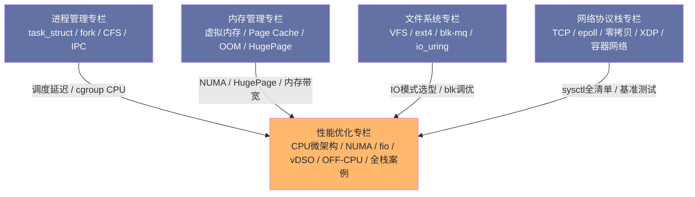

# Linux 系统性能调优专栏导览

## 专栏定位

本专栏是「Linux 知识体系」的**横向整合层**。进程管理、内存管理、文件系统、网络协议栈四个专栏各自从纵向深度解析了内核子系统的原理；而本专栏的目标是：**当你面对一个真实的性能问题时，如何系统地定位根因、选择正确的工具、做出有效的优化决策**。

这不是一本命令速查手册，也不是对现有专栏的重复。本专栏聚焦于现有专栏的**真正空白**：

- **CPU 微架构层**：Cache Miss、分支预测失效、TLB 压力——这些比调度器更底层的 CPU 性能问题，是现有专栏从未触及的盲区
- **系统调用边界**：vDSO 如何避免进入内核，seccomp 的性能代价，何时该将系统调用频率当成优化目标
- **OFF-CPU 时间分析**：进程阻塞在哪里（锁、IO、调度）——比 on-CPU profiling 更难发现但同样重要的性能杀手
- **横向对比与选型**：Direct IO vs buffered IO vs mmap vs io_uring 的真实性能边界
- **全栈实战案例**：从症状到根因的完整诊断推导过程

## 与现有专栏的协同关系

## 专栏目录

| 篇号 | 标题 | 核心问题 | 补充的空白 |
|-----|------|---------|----------|
| [[01 CPU 性能分析——perf、火焰图与热点定位]] | perf 与火焰图 | 如何从 CPU 占用高定位到具体的热点函数？on-CPU profiling 的完整方法论 | 整合 perf 全链路 |
| [[02 CPU 微架构优化——Cache Miss、分支预测与 SIMD]] | CPU 微架构 | LLC miss 率高到底意味着什么？如何用 `perf stat -e` 硬件计数器诊断 pipeline stall | **全新：现有专栏最大空白** |
| [[03 CPU 调度延迟——实时性、亲和性与 cgroup CPU]] | 调度延迟 | 进程 P99 延迟毛刺如何用调度延迟追踪定位？cgroup CPU 隔离的 bandwidth 机制 | 深化进程管理专栏调度内容 |
| [[04 内存性能调优——NUMA 拓扑、大页与内存带宽]] | 内存性能 | numastat 显示 NUMA 不均衡如何处理？内存带宽饱和如何量化？ | 深化内存管理专栏 |
| [[05 磁盘 IO 性能调优——fio 方法论、调度器与 IO 模式]] | 磁盘 IO 调优 | fio 的 iodepth/bs/numjobs 三个核心参数如何联合调优？blktrace 如何定位 IO 延迟来源 | 深化文件系统专栏 |
| [[06 应用级 IO 优化——Direct IO、mmap 与 io_uring 选型]] | IO 模式选型 | 四种 IO 模式（buffered/direct/mmap/io_uring）的性能边界和适用场景矩阵 | **全新：横向对比** |
| [[07 网络性能调优——全栈参数配置与基准测试]] | 网络调优 | 从 sysctl 到 ethtool 的完整调优参数清单，iperf3/netperf 如何科学地做网络基准测试 | 整合网络专栏调优内容 |
| [[08 系统调用开销与用户态优化——vDSO、seccomp 与零系统调用]] | 系统调用边界 | vDSO 如何让 `gettimeofday()` 不进入内核？seccomp 过滤的性能代价是多少？ | **全新：现有专栏未覆盖** |
| [[09 全栈性能诊断——BPF 工具链与 OFF-CPU 分析]] | OFF-CPU 分析 | 进程在等锁/等 IO/等调度——如何用 `offcputime` 定位隐藏的阻塞时间？ | **全新：OFF-CPU 是重要盲区** |
| [[10 性能调优实战案例——从症状到根因的完整诊断链路]] | 综合实战 | 5 个真实场景：CPU 热点、内存带宽饱和、随机 IO 高延迟、网络抖动、混合型瓶颈 | 综合实战 |

## 性能分析方法论：USE 与 RED

在深入每个子系统之前，需要建立两个通用的分析框架：

**USE 方法（Utilization-Saturation-Errors）**，Brendan Gregg 提出，适合资源导向的诊断：

- **Utilization（利用率）**：资源被使用的时间百分比（CPU 利用率 85%）
- **Saturation（饱和度）**：资源排队等待的程度（运行队列长度 > CPU 核数）
- **Errors（错误）**：资源的错误计数（rx_missed_errors、page_fault_errors）

对每个资源（CPU、内存、磁盘、网络）依次检查 USE 三个维度，能快速缩小问题范围。

**RED 方法**，Tom Wilkie 提出，适合请求导向的诊断（配合 APM 使用）：

- **Rate（请求速率）**：每秒处理的请求数
- **Errors（错误率）**：失败请求的比例
- **Duration（延迟）**：请求响应时间分布（P50/P95/P99）

USE + RED 配合使用：USE 诊断系统资源层面的问题，RED 诊断应用服务层面的问题，两者共同覆盖从硬件到用户的完整性能视角。

## 阅读建议

**CPU 性能路线**：01 → 02 → 03 → 09

**IO 性能路线**：05 → 06 → 04（内存IO）→ 07

**全栈诊断路线**：01 → 09 → 10

**工程师快查**：直接看 10（案例），遇到不懂的概念再回头读对应的原理篇

---

> [!info] 前置知识
> 本专栏假设读者已具备基础的 Linux 子系统原理知识（即已阅读或了解 [[Linux/进程管理/00 专栏导览|进程管理]]、[[Linux/内存管理/00 专栏导览|内存管理]]、[[Linux/文件系统/00 专栏导览|文件系统]]、[[Linux/网络协议栈与IO/00 专栏导览|网络协议栈]] 四个专栏的核心内容）。对于工具的使用，每篇文章均从“为什么用这个工具”出发，而不是纯粹的命令罗列。

---

## 关联专栏

- [[可观测/Profiler/00 专栏导览|Profiler 专栏]]：持续性能剖析、火焰图、eBPF Profiling
- [[可观测/指标/00 专栏导览|指标体系专栏]]：Prometheus 系统指标采集与 SLO 体系
- [[Java/JVM/00 专栏导览|JVM 专栏]]：JVM GC 调优需要 Linux 内存与 CPU 性能分析配合
