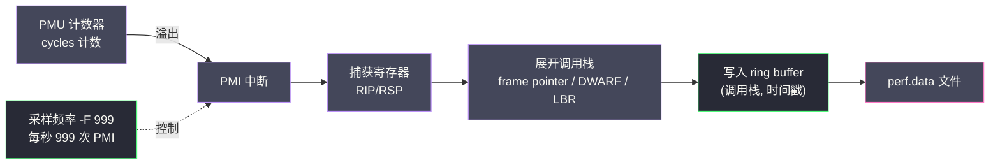
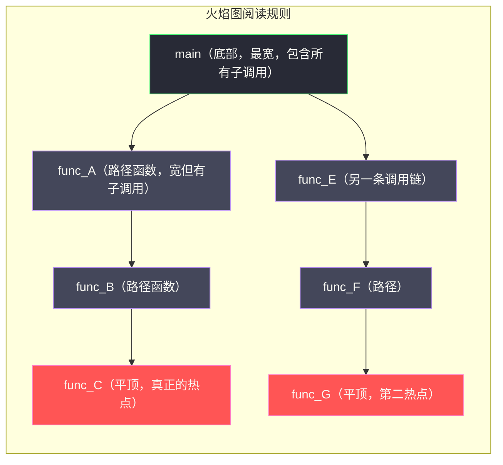

# 01 CPU 性能分析——perf、火焰图与热点定位

**摘要：**
CPU 利用率高是最常见的性能问题症状，但"CPU 高"只是结论，不是根因。真正有价值的问题是：CPU 时间花在哪里？是用户代码、库函数、系统调用，还是内核路径？是某个热点函数、锁争用、还是频繁的上下文切换？`perf` 是 Linux 内核原生的性能分析工具，它通过硬件性能计数器（PMU）和采样机制，能以极低的开销（通常 < 1% CPU 额外消耗）回答这个问题。但 `perf report` 的树状输出对于复杂调用栈难以阅读——火焰图（Flame Graph）将调用栈可视化为宽度与 CPU 时间成正比的矩形堆叠，让热点函数一眼可见。本文从 perf 的采样原理出发，深入理解为什么基于中断的采样能代表 CPU 时间分布，然后系统讲解 on-CPU profiling 的完整工作流，以及如何针对不同场景选择正确的 perf 参数组合。

---

## 第 1 章 从 OProfile 到 perf——CPU 性能分析的演进

### 1.1 性能分析的"黑暗时代"

在 perf 出现之前，Linux 上的 CPU 性能分析主要依赖两种手段：代码插桩（instrumentation）和 OProfile。代码插桩是在源码中手动插入计时点——譬如在函数入口记录开始时间、出口记录结束时间，最后统计每个函数的累计耗时。这种方法精度高，但侵入性强，需要修改源码、重新编译，且只覆盖插了桩的函数，无法发现"意料之外"的热点。OProfile 是 2002 年起 Linux 上的系统级 profiler，它也基于 PMU 硬件计数器采样，但有几个致命限制：全系统采样无法按进程过滤、不支持调用栈展开（只记录当前指令地址而非完整调用链）、输出是 flat 的符号表而非调用树。这意味着 OProfile 能告诉你"`malloc` 占了 15% CPU"，但无法告诉你"是谁调用了 `malloc`"——而后者才是优化的关键线索。

2009 年，Linux 2.6.31 合入了 **perf_events** 子系统，由 Ingo Molnar 和 Thomas Gleixner 领导的内核团队开发。perf_events 的设计目标很明确：提供一个统一的、内核原生的性能监控框架，支持 per-thread 采样、调用栈展开、丰富的硬件与软件事件，且开销足够低以至于可以在生产环境使用。perf 命令行工具（`perf stat`、`perf record`、`perf report`）是这个子系统的用户态前端，随内核源码一起发布——不需要单独安装，任何 Linux 系统都有。

### 1.2 perf 解决了什么问题

perf 相比 OProfile 的核心进步有三点。第一，**per-thread 采样**——可以只 profile 特定进程（`-p <PID>`），不干扰其他进程，这让生产环境的在线分析成为可能。第二，**调用栈展开**——每次采样不仅记录当前指令地址，还通过栈指针回溯完整的调用链，从当前函数一直追溯到 `main()`，这让"谁调用了热点函数"的问题有了答案。第三，**统一的事件模型**——perf 既能采硬件事件（cycles、cache-misses、branch-misses），也能采软件事件（context-switches、page-faults）和 tracepoint（系统调用入口、调度器事件），一个工具覆盖了从前端流水线到内核调度的全栈性能视角。

但 perf 也有它没解决的问题——**on-CPU 偏差**。perf 的采样只发生在 CPU 上执行时，进程在等锁、等 IO、等调度时不在 CPU 上，perf 看不到。这个"off-CPU 盲区"是第 09 篇 BPF OFF-CPU 分析要解决的主题，此处先埋下伏笔。理解 perf 的边界与理解它的能力同样重要——没有哪个工具是万能的，perf 擅长"CPU 时间花在哪里"，不擅长"进程阻塞在哪里"。

### 1.3 硬件性能计数器（PMU）是什么

现代 CPU 内部有一组专用寄存器，叫做**硬件性能计数器（PMU，Performance Monitoring Unit）**，可以对特定的 CPU 微架构事件进行计数：

- 已执行的指令数（instructions retired）
- CPU 时钟周期数（CPU cycles）
- 缓存缺失次数（LLC-load-misses、L1-dcache-misses）
- 分支预测失误次数（branch-misses）
- TLB 未命中次数（iTLB-load-misses、dTLB-load-misses）
- 内存总线访问次数（mem-loads、mem-stores）

PMU 的特点是**硬件直接计数，开销几乎为零**——CPU 在执行每条指令的同时，自动累加这些计数器，不需要软件干预。这就像电表一样，你用电的同时电表在转，不需要额外操作来"统计用电量"。PMU 是 CPU 设计时就内置的硬件设施，perf 只是读取这些计数器的值——这是 perf 开销极低的根本原因，它没有"测量干扰被测系统"的物理学家困境。

**`perf stat` 直接读取 PMU 计数器**，给出程序执行期间的硬件事件统计摘要：

```bash
perf stat -e cycles,instructions,cache-misses,branch-misses \
    -p 1234 sleep 10

# Performance counter stats for process '1234':
#
#  12,345,678,901  cycles             #   3.21 GHz
#   9,876,543,210  instructions       #   0.80  insn per cycle  ← IPC < 1 说明 CPU 有等待
#      45,678,901  cache-misses       #   3.2% of all cache refs
#       1,234,567  branch-misses      #   0.8% of all branches
#
#      10.001234543 seconds time elapsed

# IPC（Instructions Per Cycle）= 0.80 < 1.0：
# 表明每个时钟周期 CPU 平均只执行 0.8 条指令
# 理想值接近 2-4（多发射 CPU）
# IPC 低说明 CPU pipeline 经常空转（等待内存数据、分支预测失误等）
```

`perf stat` 的输出里最有价值的一个指标是 **IPC（Instructions Per Cycle）**——每周期执行指令数。IPC 接近 1 说明 CPU 在"满负荷运转"，但"满负荷"不等于"高效"——现代 CPU 的多发射机制理论上能做到 2-4 的 IPC，实际 IPC 只有 0.8 说明 CPU 的流水线经常空转，在等内存数据或分支预测失误。IPC 是一个"快速定性"指标——30 秒的 `perf stat` 就能判断"CPU 是在计算还是在等待"，这比看 `top` 的 CPU 利用率有用得多。CPU 利用率 90% 但 IPC 0.3，说明 CPU 虽然忙但效率低，瓶颈在内存或分支；CPU 利用率 50% 但 IPC 2.0，说明 CPU 虽然利用率不高但每次上 CPU 都高效执行，瓶颈可能在别处（IO、锁、调度）。**IPC 把"CPU 利用率"这个粗粒度指标细化成了"CPU 在计算还是在等待"**——这是性能分析的第一步定性。

IPC 的判读值得多讲几句。IPC < 1 说明 CPU 流水线经常空转，但"为什么空转"还要看其他硬件计数器——如果 `LLC-load-misses` 同时高，说明在等内存（cache miss 导致 pipeline stall）；如果 `branch-misses` 高，说明分支预测失误（错误路径的指令被冲刷，pipeline 重新填充）；如果 `iTLB-load-misses` 高，说明代码 footprint 太大（指令缓存 miss）。IPC 低 + cache-miss 高，瓶颈在内存子系统；IPC 低 + branch-miss 高，瓶颈在分支密集的代码（譬如循环次数不确定的 while 循环）；IPC 低 + TLB-miss 高，瓶颈在代码或数据的地址空间跨度太大。**IPC 是"体温计"，其他硬件计数器是"血常规"——体温高只说明有问题，血常规才能定位是什么问题**。第 02 篇会系统讲这些硬件计数器的微架构含义。

`perf stat` 还有一个进阶用法——**按进程或按 CPU 采集**。`perf stat -p <PID>` 只看特定进程的硬件计数器，适合"某个服务 IPC 低"的场景；`perf stat -a` 看全系统的硬件计数器，适合"整机 CPU 效率低"的场景。两者配合能区分"是我的进程效率低"还是"整机都效率低"——如果是后者，可能是硬件问题（譬如 NUMA 远端内存访问导致整机 IPC 下降）或内核问题（譬如大量中断处理拖累整机效率）。

`perf stat` 的输出还有一个容易忽略的字段——**`task-clock`**。它表示进程在采集期间消耗的 CPU 时间（毫秒），与墙钟时间的比值反映了"CPU 利用率"。譬如 `task-clock: 8000 msec` + 采集时长 10 秒 = 80% CPU 利用率。但这个"80%"是所有线程的累加——8 线程各 10% 也是 80%，1 线程 80% 也是 80%。要区分这两种情况，需要看 `perf stat -p <PID> -t <TID>` 的 per-thread 输出。**`task-clock` 是 CPU 利用率的精确度量，但要看 per-thread 才能区分"多线程低利用率"和"单线程高利用率"**——两者的优化方向完全不同。

---

## 第 2 章 perf 采样的统计学原理

### 2.1 从计数到采样

`perf stat` 只给出总体统计——"12 亿次 cache-misses"，但无法告诉你"哪段代码导致了这 12 亿次 cache-misses"。这需要**采样（Sampling）**——`perf record` 的核心机制。

采样的原理并不复杂。内核设置 PMU 计数器，在计数溢出时（默认每隔 N 个周期）触发一个 **PMI（Performance Monitoring Interrupt，性能监控中断）**。PMI 中断处理程序捕获此刻的 CPU 寄存器状态（特别是 `RIP`——当前指令指针，以及 `RSP`——栈指针），通过栈指针展开调用栈（stack unwinding），记录从当前函数到 `main()` 的完整调用链，最后将 `(调用栈, 时间戳)` 对写入 perf ring buffer。这个过程就像一个摄影师在赛跑中每隔固定时间拍一张照片——单张照片只记录了某一瞬间的位置，但足够多的照片合在一起，就能还原出每个选手在赛道各段花费的时间比例。

### 2.2 为什么采样能代表 CPU 时间分布

这是 profiling 的统计学基础，值得展开讲。如果以固定频率（如 999 Hz）对 CPU 当前执行位置进行采样，每个采样点出现在某个函数的概率，**正比于该函数占用 CPU 时间的比例**。采样 3 万次后，如果函数 A 被采样到 6000 次，函数 B 被采样到 300 次，我们可以合理推断函数 A 占用了约 20% 的 CPU 时间，函数 B 约占 1%。

这个推断的统计学依据是**大数定律**——当样本数足够大时，样本分布趋近于真实分布。但"足够大"是多少？对于占 20% CPU 的函数，6000 次采样的标准误差约 `sqrt(0.2 × 0.8 / 30000) ≈ 0.2%`——精度足够。对于占 0.1% CPU 的函数，30000 次采样只期望采到 30 次，标准误差 `sqrt(0.001 × 0.999 / 30000) ≈ 0.006%`——绝对误差小但相对误差大（30 次的标准差约 5.5 次，相对误差 18%）。这意味着**采样对"大头"精确，对"小头"模糊**——占 10% 以上的热点能精确定位，占 0.1% 以下的冷路径可能被噪音淹没。这也是为什么 profiling 的首要目标是找"大头"——优化占 30% 的热点收益远大于优化占 0.5% 的冷路径。

### 2.3 采样频率与开销的权衡

```bash
# 默认采样频率：4000 Hz（Linux 内核限制最大约 100000 Hz）
perf record -F 4000 -p 1234 -- sleep 30

# 高精度模式：999 Hz（Brendan Gregg 推荐的"安全高频率"）
# 为什么用 999 而不是 1000？避免与系统时钟（1000 Hz）产生谐振
perf record -F 999 -a -g -- sleep 30

# 低频率（用于生产环境，减少干扰）：99 Hz
perf record -F 99 -a -g -- sleep 30
```

每次 PMI 中断约消耗 2-5µs 的 CPU 时间。在 999 Hz 频率下，每秒 999 次中断，每核消耗约 0.2-0.5% CPU——这是可接受的生产环境开销（但要在低峰期使用）。频率越高，样本越多，精度越高，但开销也越大——这是 profiling 的基本权衡。

为什么 Brendan Gregg 推荐 999 而非 1000？这是一个避免**谐振（resonance）**的工程细节。如果采样频率与系统时钟频率（默认 1000 Hz）成整数倍关系，采样点会系统性地落在时钟中断的固定相位上，导致采样偏差——你采到的都是"时钟中断附近"的代码，而非均匀分布的 CPU 时间。用 999 这种"接近但不等于"的频率，让采样点在时间轴上缓慢漂移，避免与任何固定频率的内核活动谐振。这种细节看似琐碎，但在长期采样中能避免系统性偏差——profiling 的可信度建立在"采样无偏"之上，任何系统性偏差都会让结论失真。



### 2.4 调用栈展开：frame pointer vs DWARF vs LBR

`perf` 支持三种调用栈展开方式，选择错误会导致火焰图中出现大量"broken stacks"（断裂的调用链）——这是 perf 使用中最常见的坑。

**方式 1：Frame Pointer（帧指针）**

传统的调用栈展开方式——通过 `RBP` 寄存器（帧指针）链式追踪调用链。前提是程序编译时保留了帧指针（`-fno-omit-frame-pointer`）。GCC 默认的优化级别（`-O2`）会省略帧指针——`RBP` 被当作通用寄存器使用，栈帧之间没有链式指针，perf 无法回溯调用链。这就像一本书的页码被撕掉了——你翻到某一页，却不知道上一页是哪一页。

```bash
# 检查二进制是否保留帧指针
objdump -d /usr/bin/nginx | head -50
# 若 push %rbp / mov %rsp,%rbp 出现在每个函数开头 → 保留了帧指针

# 重新编译时保留帧指针
g++ -O2 -fno-omit-frame-pointer my_program.cpp -o my_program

# JVM 需要特殊处理：-XX:+PreserveFramePointer（Java 8u60+）
java -XX:+PreserveFramePointer -jar app.jar
```

帧指针方式的开销最低（每次展开只需读几个内存地址），准确度最高，但要求所有代码都保留帧指针——包括动态库和运行时（glibc、JVM、Go runtime）。任何一个环节缺失帧指针，调用链就在那里断裂。

**方式 2：DWARF 调试信息**

读取 ELF 二进制中的 `.debug_frame` 或 `.eh_frame` 段来展开调用栈，不需要帧指针，但开销更大（每次展开需要解析 DWARF 信息），且需要调试符号：

```bash
# 使用 DWARF 展开调用栈（需要 --call-graph dwarf）
perf record -F 999 --call-graph dwarf -p 1234 -- sleep 30
```

DWARF 方式的优势是"不依赖编译选项"——即使 `-O2` 省略了帧指针，只要二进制包含 `.eh_frame` 段（GCC 默认生成），就能展开调用栈。劣势是开销大——每次 PMI 中断要多花几微秒解析 DWARF 表，在高频采样下开销累积可观。生产环境用 DWARF 通常把频率降到 99 Hz 以控制总开销。

**方式 3：LBR（Last Branch Record）**

Intel CPU 专有功能，硬件直接记录最近 16/32 次函数调用（不需要软件展开），开销极低，但调用栈深度有限（只能看到最近 16 层）：

```bash
# LBR 模式（Intel CPU only，深度约 16 层）
perf record -F 999 --call-graph lbr -p 1234 -- sleep 30
```

LBR 是"硬件辅助的调用栈记录"——CPU 内部有一个环形缓冲区，每次分支指令（包括函数调用）都自动记录源地址和目标地址。perf 直接读这个硬件缓冲区，零软件开销。但 LBR 缓冲区只有 16-32 项，超过这个深度的调用链会被截断——对深层调用的 Java/Go 程序，LBR 可能只看到调用链的顶部 16 层，下面的全丢了。

**生产推荐**：对大多数服务（Java/Go/Rust），用 `--call-graph dwarf`；对 C/C++ 服务（重新编译时加 `-fno-omit-frame-pointer`），用默认帧指针模式；对延迟极敏感的场景，用 LBR。三种方式的选择本质上是"准确度 vs 开销 vs 深度"的三角权衡——帧指针准确且低开销但要求编译选项配合，DWARF 准确且不依赖编译选项但开销大，LBR 低开销且不依赖编译选项但深度有限。没有完美方案，只有场景匹配。

这三种方式的选型还可以从"语言生态"角度考虑。Go 和 Rust 的编译器默认支持帧指针（Go runtime 强制保留，Rust 可配置），用 frame pointer 方式最省心。Java 的 JIT 编译动态生成机器码，帧指针和 DWARF 都不适用，只能用 LBR 或 async-profiler。C/C++ 的生态最复杂——你的代码可能保留帧指针，但链接的第三方库（glibc、OpenSSL）可能没保留，导致调用链在库边界断裂。对于 C/C++ 大项目，DWARF 是更稳妥的选择——虽然开销大，但不依赖编译选项，能展开所有代码的调用栈。

| 展开方式 | 开销 | 准确度 | 深度 | 前提条件 |
|---------|------|-------|------|---------|
| Frame Pointer | 极低 | 高（不断裂） | 无限 | 所有代码保留 `-fno-omit-frame-pointer` |
| DWARF | 中（每次多几 µs） | 高 | 无限 | 二进制含 `.eh_frame` 段 |
| LBR | 极低 | 中（深层截断） | 16-32 层 | Intel CPU |

---

## 第 3 章 perf record 的核心参数

### 3.1 采集目标的四种模式

```bash
# 模式 1：针对特定进程（最常用）
perf record -F 999 -g -p <PID> -- sleep 30
#                  ↑ -g 表示记录调用栈（call graph）

# 模式 2：针对整个系统（-a，需要 root）
perf record -F 999 -ag -- sleep 30
# 捕获所有 CPU 上的所有进程，适合定位"CPU 忙在哪里"的全局问题

# 模式 3：针对特定命令（直接启动并 profile）
perf record -F 999 -g -- ./my_program arg1 arg2
# 从程序启动开始 profile，直到程序结束

# 模式 4：针对特定 CPU 核（-C）
perf record -F 999 -g -C 0,1,2,3 -- sleep 30
# 只采集 CPU 0-3 上的活动，用于多核分析
```

这四种模式覆盖了"按进程 / 全系统 / 按命令 / 按 CPU 核"四个维度。生产环境最常用的是模式 1（`-p <PID>`）——只采样目标进程，不干扰其他服务。模式 2（`-a`）适合"整机 CPU 都高但不知道是谁"的场景——譬如某个内核线程吃 CPU，或多个进程互相干扰。模式 4（`-C`）适合 NUMA 或绑核场景——譬如只看 NUMA node 0 上的 CPU 活动。

这四种模式的选择有一个与"干扰"相关的考量——**采样本身的干扰**。`perf record -a` 采集全系统，所有进程的 PMI 中断都计入开销——在 64 核服务器上，999 Hz × 64 核 = 每秒 63000 次 PMI 中断，总开销约 0.3 × 64 = 19% CPU（分布在所有核上）。而 `perf record -p <PID>` 只采集目标进程，开销只在该进程的 CPU 时间上——999 Hz × 4 线程 = 每秒 4000 次 PMI，总开销约 0.3 × 4 = 1.2% CPU。**`-p` 模式的开销与目标进程的线程数成正比，`-a` 模式的开销与 CPU 核数成正比**——生产环境优先用 `-p`，既减少干扰又减少开销。

### 3.2 事件类型的选择

`perf record` 默认采集 CPU 时钟（`cycles`）事件——即"CPU 在哪里花时间"。但也可以针对特定硬件事件采集，以找到特定类型的瓶颈：

```bash
# 默认：CPU cycles（找 CPU 时间热点）
perf record -F 999 -g -p 1234 -- sleep 30

# L3 Cache Miss 采样（找内存访问热点）
perf record -e LLC-load-misses -g -p 1234 -- sleep 30
# 每次 LLC miss 记录一次调用栈 → 告诉你"哪段代码导致了 LLC miss"

# 分支预测失误采样（找分支密集的热点）
perf record -e branch-misses -g -p 1234 -- sleep 30

# 页错误采样（找内存分配热点）
perf record -e page-faults -g -p 1234 -- sleep 30

# 系统调用采样（找系统调用密集的热点）
perf record -e 'syscalls:sys_enter_*' -g -p 1234 -- sleep 30

# 软件事件：上下文切换（找调度频繁的代码路径）
perf record -e context-switches -g -p 1234 -- sleep 30
```

不同事件回答不同问题——`cycles` 回答"CPU 时间花在哪"，`LLC-load-misses` 回答"谁导致了缓存缺失"，`branch-misses` 回答"哪里分支预测失误"，`context-switches` 回答"哪里频繁切换线程"。选择哪个事件取决于"症状"——如果 CPU 利用率高但 IPC 低，先采 `cycles` 找热点函数，再采 `LLC-load-misses` 看是不是缓存问题；如果 CPU 利用率不高但延迟高，采 `context-switches` 看是不是频繁切换。**事件选择是"从症状到病因"的诊断路径**——不是上来就采 `cycles`，而是先想清楚"我要回答什么问题"。

事件选择有一个进阶技巧——**多事件组合分析**。单看 `cycles` 只知道"哪里热"，单看 `LLC-load-misses` 只知道"哪里缓存缺失"，但把两者组合起来——"哪里既热又缓存缺失"——能更精确定位"因缓存缺失而慢的热点"。`perf record -e cycles,LLC-load-misses -g` 同时采集两个事件，`perf report` 可以按事件分组查看。这种组合分析在第 02 篇 CPU 微架构优化中会大量使用——IPC 低的原因要靠"cycles + 各种 miss 事件"的组合来诊断，单看一个事件往往不够。

### 3.3 perf record 的输出文件

`perf record` 默认将采样数据写入 `perf.data` 文件（当前目录）：

```bash
# 自定义输出文件
perf record -F 999 -g -p 1234 -o /tmp/my_profile.data -- sleep 30

# 查看文件大小（高频采样 + 深调用栈会快速增大）
ls -lh perf.data
# -rw------- 1 root root 245M perf.data

# 采样时设置 ring buffer 大小（防止内存占用过大）
perf record -F 999 -g -m 512 -p 1234 -- sleep 30
#                          ↑ 512 页（2MB）的 ring buffer
```

`perf.data` 文件的大小与采样频率、调用栈深度、采样时长成正比。999 Hz + DWARF 展开 + 60 秒采样，一个进程的 perf.data 可能到几百 MB——这在生产环境要注意磁盘空间。如果 ring buffer 满了（采样速度 > 写盘速度），perf 会丢样本——`perf report` 开头会显示 `Aggregated samples` 数量，如果远小于 `频率 × 时长`，说明有丢样本，结论可能不准。

---

## 第 4 章 perf report：理解树状输出

### 4.1 perf report 的基本用法

```bash
# 交互式查看（最常用）
perf report

# 非交互式（适合脚本/CI）
perf report --stdio | head -50

# 按函数符号排序（默认）：找 CPU 时间最多的函数
perf report --sort=sym

# 按调用者排序（找谁调用了热点函数）
perf report --sort=caller

# 只看用户态代码（过滤内核函数）
perf report --kallsyms=/dev/null
```

### 4.2 理解 perf report 的输出格式

```
# perf report --stdio 输出示例：

# Overhead  Command  Shared Object      Symbol
# --------  -------  -----------------  -----------------------
#   23.45%  java     [JIT] tid 1234     L io.netty.channel.AbstractChannel::flush
#   15.32%  java     libc-2.31.so       [.] malloc
#   12.18%  java     [kernel.kallsyms]  [k] tcp_sendmsg
#    8.91%  java     [JIT] tid 1234     L java.util.HashMap::get
#    6.45%  nginx    nginx              [.] ngx_http_process_request
#    5.23%  nginx    [kernel.kallsyms]  [k] __memcpy
#
# Overhead：该函数及其被调用的函数占用的 CPU 时间百分比
# Command：进程名
# Shared Object：函数所在的库/模块
#   [JIT]：JIT 编译的代码（Java/JS）
#   [kernel.kallsyms]：内核函数
#   libXXX.so：动态库函数
#   程序名：程序自身的函数
# Symbol 中的标记：
#   [k]：内核态函数
#   [.]：用户态函数
#   [j]：JIT 编译函数
```

`perf report` 的 `Overhead` 列是"该函数及其所有子调用"的累计 CPU 时间百分比——这意味着顶层函数（如 `main`）的 Overhead 接近 100%，因为它包含了所有子调用的时间。要看"函数自身"的 CPU 时间（不含子调用），需要在交互模式下展开节点看 `Self` 列。这个区别很重要——`main` 占 100% 不代表 `main` 本身是热点，它的 100% 是所有子函数累加的结果；真正的热点是那些 `Self` 高但 `Children` 低的叶节点函数。

**问题**：`perf report` 的调用树在函数调用链复杂时难以阅读——需要展开每个节点才能看到调用关系，而一个真实的 Java 应用可能有数百个函数各占 1-5%，无法快速找到"哪条调用链导致了大部分的 CPU 消耗"。这就是火焰图的价值所在。

---

## 第 5 章 火焰图：让热点一眼可见

### 5.1 火焰图的起源与原理

**火焰图（Flame Graph）** 由 Netflix 的 Brendan Gregg 于 2011 年发明，首次发表于他的博客《Flame Graphs》。在此之前，perf 的输出是文本形式的调用树，对于有数百个函数的复杂应用几乎无法阅读。Gregg 的核心洞察是：调用栈是一个树结构，而树结构可以用"宽度正比于权重"的矩形堆叠来可视化——这就是火焰图。

火焰图的核心思想是：将所有采样的调用栈堆叠显示，每个函数以矩形表示，**矩形的宽度正比于该函数（包括其子调用）出现在调用栈中的次数**（即 CPU 时间比例）。



**火焰图的阅读技巧**：
- **关注"平顶"宽矩形**——顶部没有子调用的宽矩形，是真正消耗 CPU 时间的代码（譬如 `func_C` 和 `func_G`）
- **从底部追溯根源**——找到热点函数后，向下追溯调用链，找到应用代码在哪里触发了这条路径
- **忽略窄矩形**——宽度 < 1% 的矩形通常不是优化目标
- **注意颜色**（标准 flamegraph.pl 配色）：红/橙色 = 用户态代码，蓝色 = 内核态代码，绿色 = JIT 代码

火焰图最关键的视觉特征是"平顶"——一个矩形顶部没有更窄的子矩形堆在上面，说明 CPU 直接在这个函数里执行（没有再调用其他函数），这是真正的热点。反之，一个宽矩形上面堆满了子矩形，说明这个函数本身没做什么，CPU 时间都在它的子调用里——它是"路径"而非"热点"。**区分"路径"和"热点"是火焰图阅读的核心技能**——优化路径函数没有用，要优化热点（平顶）函数。

火焰图还有一个容易被忽略的阅读维度——**调用链的"深度"**。如果一个热点的调用链很深（从 `main` 到热点有 20 层），说明经过了多层抽象——每层抽象可能都有优化空间（譬如减少中间层调用）。反之，如果热点在浅层（从 `main` 到热点只有 3 层），说明抽象少，优化空间集中在热点函数本身。调用链深度还影响"改代码的影响面"——深层热点的优化要改调用链上的某一层，可能影响其他调用同一层的路径；浅层热点的优化更局部化。**调用链深度是"优化影响面"的预判指标**——深热点要谨慎评估改动影响，浅热点可以更放心地改。

### 5.2 生成火焰图的完整工作流

```bash
# 步骤 1：采集数据（-g 必须，-F 999 足够精确，-a 全系统）
perf record -F 999 -ag -- sleep 30
# → 生成 perf.data

# 步骤 2：导出为文本格式
perf script > out.perf
# out.perf 包含每个采样点的调用栈（纯文本）

# 步骤 3：下载 FlameGraph 工具集（Brendan Gregg GitHub）
git clone https://github.com/brendangregg/FlameGraph
cd FlameGraph

# 步骤 4：折叠调用栈（将相同路径的采样计数聚合）
./stackcollapse-perf.pl ../out.perf > out.folded

# 步骤 5：生成 SVG 火焰图
./flamegraph.pl out.folded > flame.svg

# 步骤 6：用浏览器打开（支持交互：点击放大、搜索、鼠标悬停显示百分比）
open flame.svg  # macOS
# 或传到本地：scp user@server:/path/flame.svg .
```

这个工作流有五步，但可以压缩成一行：

```bash
perf record -F 999 -ag -- sleep 30 && \
perf script | /path/to/FlameGraph/stackcollapse-perf.pl | \
/path/to/FlameGraph/flamegraph.pl > flame.svg
```

五步中每一步的作用值得理解。`perf record` 采集样本到 `perf.data`（二进制格式）。`perf script` 把二进制转成文本（每个采样点的调用栈）。`stackcollapse-perf.pl` 把文本"折叠"——把相同的调用栈路径聚合到一起，输出 `函数A;函数B;函数C 123` 这种格式（分号分隔调用链，数字是采样次数）。`flamegraph.pl` 把折叠后的数据渲染成 SVG。理解了每一步的作用，遇到问题就能定位是哪一步出了错——譬如火焰图里大量 `[unknown]`，可能是 `perf script` 没解析出符号（需要调试符号），或 `stackcollapse` 没正确折叠。

`stackcollapse-perf.pl` 这一步有一个与"调用栈合并"相关的细节——它把"相同调用链"的采样聚合到一起。譬如 1000 个采样点的调用链都是 `main → handle_request → parse_json → malloc`，stackcollapse 把它们合并成一行 `main;handle_request;parse_json;malloc 1000`。这个"折叠"操作是火焰图能保持紧凑的关键——没有折叠，30000 个采样点就是 30000 行，无法可视化。但折叠也丢失了"时间顺序"信息——你不知道这 1000 个 `malloc` 是连续发生还是分散在 30 秒里。如果需要时间维度，用 `FlameGraph/flamegraph.pl --flamechart` 生成"时间轴火焰图"（Time-Series Flame Graph），保留采样的时间顺序。**标准火焰图看"哪里热"，时间轴火焰图看"什么时候热"**——前者找热点，后者找热点的时间规律（譬如每秒尖峰、每分钟周期性）。

### 5.3 针对不同语言的火焰图生成

**Java 应用的挑战**：JVM 的 JIT 编译器默认不保留帧指针，且 JIT 编译的符号不出现在标准 perf 符号表中，导致火焰图中大量显示 `[unknown]`。这是 Java profiling 最常见的坑——perf 看到的 JIT 代码是一段没有符号的机器码，无法关联到 Java 方法名。

```bash
# Java 火焰图正确姿势（async-profiler 是最佳选择）
# async-profiler 不依赖 perf，直接用 JVM 内部 API 采样
wget https://github.com/async-profiler/async-profiler/releases/download/v3.0/async-profiler-3.0-linux-x64.tar.gz
tar -xzf async-profiler*.tar.gz

# CPU 采样 30 秒，生成 HTML 火焰图
./asprof -d 30 -f /tmp/flame.html <java_pid>
# → 生成交互式 HTML 火焰图（Flamegraph.js，比 SVG 更好）

# 如果坚持用 perf（需要以下 JVM 参数）：
java -XX:+PreserveFramePointer \
     -XX:+UnlockDiagnosticVMOptions \
     -XX:+DebugNonSafepoints \
     -jar app.jar
# 同时在 JVM 启动后创建符号映射文件
perf-map-agent/bin/create-java-perf-map.sh <pid>
# → 生成 /tmp/perf-<pid>.map，perf 用它解析 JIT 符号
```

Java profiling 有两条路线。第一条是 **async-profiler**——它不依赖 perf，直接通过 JVM TI（JVM Tool Interface）和 AsyncGetCallTrace API 采样 Java 调用栈，符号解析完美（能看到 Java 方法名、JIT 编译的机器码、甚至内联的方法），开销低（< 1% CPU），是 Java CPU profiling 的事实标准。第二条是 **perf + perf-map-agent**——用 perf 采样，额外运行 perf-map-agent 把 JIT 编译的方法地址映射到方法名，输出 `/tmp/perf-<pid>.map` 文件供 perf 解析。这条路线能同时看到 Java 方法和 native/JNI 代码（async-profiler 对 JNI 的支持较弱），但配置复杂、符号映射有延迟（JIT 编译新方法时映射文件可能没及时更新）。**生产环境 Java 优先用 async-profiler，需要分析 JNI 混合栈时才用 perf**。

async-profiler 相比 perf 还有一个优势——**它采样的是 Java 栈而非 native 栈**。Java 应用的调用栈通常有两层：Java 方法栈（JVM 管理）和 native 栈（C/C++ 代码）。perf 只能看到 native 栈（它采样的是机器指令地址），Java 方法需要通过符号映射间接还原。async-profiler 直接调 JVM 的 `AsyncGetCallTrace` API 拿到 Java 方法栈，不需要符号映射，准确度和完整度都更高。但 async-profiler 的局限是——如果热点在 JNI 代码（Java 调用的 C/C++ 库）里，async-profiler 看不到（它只看 Java 栈），这时候 perf 的 native 栈视角更全面。**Java 栈用 async-profiler，JNI 栈用 perf，两者互补**——这是 Java profiling 的工具选型原则。

**Go 应用**：

```bash
# Go 原生支持 pprof，最方便
import _ "net/http/pprof"
go func() { http.ListenAndServe(":6060", nil) }()

# 远程采集 30 秒 CPU 样本
curl -o cpu.prof http://localhost:6060/debug/pprof/profile?seconds=30

# 生成火焰图
go tool pprof -http :8080 cpu.prof
# → 在浏览器中打开 http://localhost:8080/ui/flamegraph
```

Go 的 pprof 是语言原生集成的——`net/http/pprof` 包导入即可启用，不需要额外工具。Go runtime 自己管理调用栈采样（通过 SIGPROF 信号触发），不依赖 PMU 硬件计数器，符号解析完美（Go 的符号信息编译进二进制）。这使得 Go 的 profiling 体验是所有语言里最好的——零配置、零依赖、开箱即用。

**Rust/C++ 应用**：

```bash
# 标准 perf 工作流即可，但编译时需保留帧指针
cargo build --release  # 默认省略帧指针！
# 在 Cargo.toml 中设置：
# [profile.release]
# debug = true           # 保留调试符号（函数名）
# [profile.release.build-override]
# opt-level = 3
# 或通过环境变量：
RUSTFLAGS="-C force-frame-pointers=yes" cargo build --release
```

Rust/C++ 的 profiling 体验介于 Go 和 Java 之间——只要编译时保留帧指针和调试符号，perf 就能完美工作。问题是 release 构建默认省略帧指针（为了多一个通用寄存器），需要在构建配置中显式开启。对于使用 `cargo build --release` 的 Rust 项目，`Cargo.toml` 里加 `debug = true` 和 `force-frame-pointers=yes` 是 profiling 的前置条件。

---

## 第 6 章 典型场景的 perf 使用策略

### 6.1 场景 1：定位用户态 CPU 热点

**症状**：服务 CPU 利用率 80%+，但系统调用比例低，主要是用户态计算。

```bash
# 1. 采集目标进程的 CPU 样本（只看用户态）
perf record -F 999 -g --user-regs=all -p <pid> -- sleep 60

# 2. 生成火焰图，重点看用户态函数
perf script | FlameGraph/stackcollapse-perf.pl | \
    grep -v "kernel\." | \
    FlameGraph/flamegraph.pl --title "User CPU Profile" > user_flame.svg

# 3. 确认用户态 vs 内核态的 CPU 时间比例
perf report --stdio | grep -E "^\s+[0-9]+\.[0-9]+%.*\[k\]" | head -10
# 若内核态函数（[k]）占比 < 5%，说明瓶颈主要在应用代码
```

**典型热点及优化方向**：

| 热点函数 | 可能原因 | 优化方向 |
|---------|---------|---------|
| `malloc`/`free` | 频繁小对象分配/释放 | 对象池、内存池、`jemalloc`/`tcmalloc` |
| `memcpy`/`memset` | 大量数据复制 | 零拷贝、减少不必要的数据复制 |
| `std::map::find` | 红黑树查找（O(log n)）| 改用 `unordered_map`（O(1)）|
| `pthread_mutex_lock` | 锁竞争 | 减少临界区、无锁数据结构、分片锁 |
| JSON 解析函数 | 高频 JSON 序列化/反序列化 | 换更快的 JSON 库（simdjson、rapidjson）|

这个场景的典型特征是"CPU 满载但 IPC 可能不低"——CPU 真的在计算，只是计算花在了不该花的地方（譬如频繁 malloc/free、低效的数据结构）。优化的方向是"减少无用功"——对象池减少 malloc、`unordered_map` 替代 `std::map`、simdjson 替代慢速 JSON 库。每个优化的收益可以从差分火焰图（见第 8 章）量化。

用户态热点还有一个"隐藏维度"——**编译器优化未到位**。有时候热点函数本身算法没问题，但编译器没优化好——譬如没有内联（`-fno-inline`）、没有向量化（`-fno-tree-vectorize`）、没有循环展开。检查方法是用 `perf stat` 看热点函数的 IPC——如果 IPC 很低（< 0.5）但代码逻辑简单（譬如简单的数组遍历），可能是编译器没生成 SIMD 指令。解法是调整编译选项（`-O3` 而非 `-O2`、`-march=native` 启用 CPU 特有指令集）或手动改写代码帮助编译器向量化。第 02 篇会深入讲 SIMD 和编译器向量化的细节。

### 6.2 场景 2：定位内核态 CPU 热点

**症状**：`top` 中 `%sy`（系统态）占比高（> 20%），说明 CPU 大量时间花在内核代码。

```bash
# 全系统采集（包含内核符号）
perf record -F 999 -ag -- sleep 30

# 只看内核函数
perf report --stdio | grep "\[k\]" | head -20
#   12.3%  nginx  [kernel.kallsyms]  [k] nf_hook_slow     ← iptables 规则遍历
#    8.5%  nginx  [kernel.kallsyms]  [k] tcp_sendmsg
#    6.2%  java   [kernel.kallsyms]  [k] sys_futex         ← 锁系统调用
#    5.8%  nginx  [kernel.kallsyms]  [k] __copy_to_user

# 分析 nf_hook_slow 热点（iptables 遍历）
perf report --stdio --symbol-filter=nf_hook_slow
```

**常见内核热点及含义**：

| 内核函数 | 含义 | 解决方向 |
|---------|------|---------|
| `nf_hook_slow` | Netfilter 钩子（iptables 规则遍历）| 减少规则、迁移 Cilium/eBPF |
| `__copy_to_user`/`__copy_from_user` | 内核-用户数据拷贝 | 零拷贝技术（sendfile/mmap）|
| `tcp_sendmsg`/`tcp_rcv_established` | TCP 收发处理 | 网络调优、批量发送 |
| `ksoftirqd` | 软中断处理（NAPI）| 增大 netdev_budget，多队列网卡 |
| `sys_futex` | 用户态锁的内核路径 | 减少锁竞争，改用无锁算法 |
| `page_fault` | 页错误（内存分配）| 预分配、HugePage |
| `schedule` | 上下文切换 | 减少系统调用，减少锁争用 |

内核态热点与用户态热点的优化方向不同——用户态热点靠"改应用代码"（换数据结构、换算法），内核态热点靠"改系统配置"（调 sysctl、改 iptables 规则、换网卡驱动）。一个常见的误区是"看到内核态热点就去调内核参数"——实际上很多内核态热点是应用行为触发的，譬如 `sys_futex` 高是因为应用锁竞争激烈，解法是减少锁竞争而非调 futex 的内核参数。**内核态热点是"症状"，根因往往在应用层**——perf 告诉你"哪个内核函数热"，但"为什么热"要结合调用链回溯到应用代码。

内核态热点还有一个与"系统配置"相关的维度——有些热点是默认配置不优导致的。譬如 `nf_hook_slow` 热可能是 iptables 规则太多（几百条），精简规则或迁移到 eBPF（Cilium）能大幅降低；`__copy_to_user` 热可能是没有用零拷贝（sendfile/mmap），改用零拷贝能消除内核-用户数据拷贝；`page_fault` 热可能是没有预分配内存或没用 HugePage，预分配和 HugePage 能减少页错误。这些"系统配置优化"通常不需要改应用代码，只改配置或系统调用方式——投入产出比高。**内核态热点的优化分两条路**：改应用行为（减少触发内核路径的操作）和改系统配置（让内核路径更高效），前者治本但改动大，后者治标但改动小。

### 6.3 场景 3：多线程锁竞争分析

**症状**：程序有多个线程，CPU 利用率低于核心数量（例如 8 核但只用了 200%），怀疑锁竞争。

```bash
# 1. 先看 mutex/futex 的 perf 计数
perf stat -e 'syscalls:sys_enter_futex' -p <pid> sleep 10
# 若每秒 futex 调用 > 1 万次，可能有激烈的锁竞争

# 2. 采集上下文切换事件（锁竞争会导致频繁上下文切换）
perf record -e context-switches -ag -- sleep 10
perf report | head -20
# 频繁切换的线程 → 可能在等锁

# 3. 用 bpftrace 直接追踪锁等待时间（更精确）
bpftrace -e '
tracepoint:syscalls:sys_enter_futex / args->op == 128 / {
    @start[tid] = nsecs;
}
tracepoint:syscalls:sys_exit_futex
/@start[tid]/ {
    $lat = nsecs - @start[tid];
    if ($lat > 1000000) {  /* > 1ms */
        printf("LOCK WAIT %dms: pid=%d tid=%d\n",
               $lat/1000000, pid, tid);
    }
    delete(@start[tid]);
}'
```

锁竞争的诊断是 perf 的半弱项——perf 能看到 `sys_futex` 热点（说明有锁竞争），能看 `context-switches` 频繁（说明锁等待导致切换），但无法直接告诉你"哪个锁等待最久"。这时候 bpftrace 更合适——它能追踪 `futex` 系统调用的入参（锁地址）和返回时间，直接给出"哪个锁等待了多久"。perf 和 BPF 的分工在这里很清晰——perf 擅长"统计性概览"（哪里热），BPF 擅长"精确追踪"（具体哪个锁、哪次调用、多久）。第 09 篇会系统讲 BPF 工具链。

锁竞争的诊断还有一个与"锁粒度"相关的观察维度——**`sys_futex` 的调用频率**。`perf stat -e 'syscalls:sys_enter_futex'` 给出 futex 调用总数，除以时间得到调用频率。每秒 1 万次 futex 说明锁竞争激烈，每秒 100 次说明锁竞争不严重。但"频率高"不等于"问题大"——如果每次 futex 很快返回（无竞争的 fast path，不进内核），高频 futex 的开销也不大。真正的问题在于"慢速 futex"——进内核等待的 futex，这要靠 bpftrace 追踪 `futex` 的等待时间分布。**futex 频率看"锁竞争激烈程度"，futex 等待时间看"锁竞争影响程度"**——前者是计数，后者是延迟，两者结合才能完整评估锁问题。

### 6.4 场景 4：短命进程的性能分析

**症状**：批处理任务（如 `grep`、`sort`、编译任务）每次运行时间只有几秒甚至几百毫秒，常规 `perf record` 采样时间不够。

```bash
# 方法 1：直接 perf record 跟随进程
perf record -F 9999 -g -- /path/to/short_process arg1 arg2
# -F 9999：更高采样频率，在短时间内获得更多样本

# 方法 2：用 perf stat 获取硬件计数器总量（比采样更精确）
perf stat -e cycles,instructions,cache-misses,branch-misses \
    -- /path/to/short_process arg1 arg2
# 即使只运行 100ms，perf stat 也能给出精确的硬件事件总量

# 方法 3：循环执行多次，合并数据
for i in {1..10}; do
    perf record -F 999 -g -o /tmp/perf_$i.data -- ./short_process
done
# 合并所有采集数据
perf script -i /tmp/perf_1.data > combined.perf
for i in {2..10}; do
    perf script -i /tmp/perf_$i.data >> combined.perf
done
# 生成合并后的火焰图
cat combined.perf | FlameGraph/stackcollapse-perf.pl | \
    FlameGraph/flamegraph.pl > merged_flame.svg
```

短命进程的 profiling 有一个"样本数不足"的困境——100ms 的进程在 999 Hz 下只有 100 个样本，统计误差太大。解法有三种：提高频率（`-F 9999`，10 倍样本）、用 `perf stat` 代替采样（计数器总量精确，不依赖样本数）、循环执行合并（10 次运行合并后样本数 × 10）。`perf stat` 对短命进程特别有价值——它不依赖采样，直接读 PMU 计数器总量，即使进程只运行 1ms 也能给出精确的 IPC 和 cache-miss 数。**短命进程用 `perf stat`，长跑进程用 `perf record`**——这是事件类型选择的经验法则。

短命进程的 profiling 还有一个与"启动开销"相关的陷阱——如果用 `perf record -- ./my_program` 直接启动进程，perf 会从进程的第一条指令开始采样，包括动态链接器（ld.so）、共享库加载、全局构造函数等启动阶段。这些启动代码在长跑进程里占比可忽略，但在短命进程里可能占 50%+ 的 CPU 时间——火焰图里全是 `ld.so`、`_dl_relocate_object` 之类的动态链接函数，真正的业务逻辑反而看不清。解法是——如果只关心业务逻辑，在程序里加一个"启动完成"的信号（譬如写一个文件或发一个信号），perf 从信号后开始采样。**短命进程要区分"启动开销"和"业务开销"**——混在一起看会误判优化方向。

---

## 第 7 章 perf 的边界与盲区

### 7.1 on-CPU 偏差

perf 的采样只发生在进程于 CPU 上执行时——进程在等锁、等 IO、等调度时不在 CPU 上，perf 看不到。这导致一个系统性偏差：**perf 高估 CPU 密集型代码的占比，低估 IO/锁密集型代码的占比**。譬如一个请求处理流程中，50% 时间在 CPU 计算，50% 时间在等数据库返回——perf 的火焰图会显示"100% 的时间在 CPU 计算"（因为只有 CPU 计算阶段才被采样到），等数据库的时间完全不可见。

这个偏差的后果是——你可能优化了火焰图里最宽的"平顶"函数，但请求延迟没降，因为真正的瓶颈在等数据库（off-CPU 时间），而非 CPU 计算。识别这种场景的方法是对比"CPU 时间"和"墙钟时间"——如果 `perf record` 采集了 30 秒，但火焰图里所有函数的累计 CPU 时间只有 10 秒，说明有 20 秒的 off-CPU 时间被 perf 漏掉了。**off-CPU 分析需要 BPF 工具（`offcputime`、`profile` off-CPU 模式），这是第 09 篇的主题**。

on-CPU 偏差还有一个与"多线程"相关的表现——如果程序有 8 个线程但只有 2 个在 CPU 上跑（其他 6 个在等锁或 IO），perf 的火焰图只反映那 2 个线程的 CPU 时间，6 个等待线程的时间不可见。这会导致"火焰图看起来不忙，但请求延迟高"的困惑——CPU 不忙（只有 2 个线程在跑），但请求延迟高（因为 6 个线程在等）。识别这种场景的方法是看 `top -H`（线程级 CPU 利用率）——如果只有少数线程活跃，而请求延迟高，瓶颈在 off-CPU（锁/IO/调度），需要 BPF 而非 perf。**"CPU 不忙但延迟高"是 off-CPU 瓶颈的典型信号**——这时候继续用 perf 是南辕北辙。

### 7.2 采样偏差

perf 的采样基于 PMI 中断，而中断有"采样盲区"——中断处理期间不会触发新的中断（中断屏蔽）。如果热点函数恰好在中断密集的路径上（譬如自身就是中断处理函数），它的 CPU 时间可能被低估。此外，PMI 中断的触发有微秒级延迟（从计数器溢出到中断处理程序执行），这段时间 CPU 又执行了几百条指令，采样到的 `RIP` 可能不是"真正溢出时"的指令——这叫 **skid（滑移）**。LBR 模式能缓解 skid（硬件记录精确的分支地址），但 frame pointer 和 DWARF 模式都有几条指令的 skid。

对大多数场景，这些偏差不影响"找大头"的结论——占 30% 的热点不会因为 skid 变成 10%。但对"精确量化"的场景（譬如对比两个函数谁更热，差距只有 1%），采样偏差可能让结论不可靠。**perf 适合"定性定位"，不适合"精确定量"**——找热点可靠，精确比较小差异要谨慎。

### 7.3 JIT 符号问题

Java、JavaScript V8、Julia 等使用 JIT 编译的语言，perf 面临"符号缺失"的挑战——JIT 编译的机器码不在 ELF 文件里，perf 无法从二进制读取符号。解决方案是 perf-map-agent（Java）或 `-XX:+PreserveFramePointer` + JIT 符号映射，但都有局限性——JIT 编译是动态的，新编译的方法可能没及时出现在符号映射里，导致火焰图里间歇性出现 `[unknown]`。async-profiler 通过直接调用 JVM 内部 API 绕过了这个问题，是 Java profiling 的更优选择。

### 7.4 容器与权限

在容器环境中，`perf` 需要 `CAP_SYS_ADMIN` 或 `CAP_PERFMON` 权限才能访问 PMU 硬件计数器。很多容器的默认 seccomp profile 禁止 `perf_event_open` 系统调用，导致 perf 直接报错。解法是调整容器的 security context——添加 `CAP_PERFMON` 或放宽 seccomp profile。但这也带来了安全考量——perf 能读取所有进程的调用栈，在多租户环境中可能泄露信息。**容器中用 perf 需要权衡"诊断能力"与"安全隔离"**——生产环境通常只在专门的诊断容器中放权 perf，而非所有业务容器都开放。

容器中的 perf 还有一个与"host 内核"相关的限制——容器的 perf 看到的是 host 内核的符号和事件，而非容器内部的。譬如 `perf report` 里看到的内核函数（`[k]` 标记）是 host 内核的函数，不是容器自己的（容器没有自己的内核）。这意味着容器内 perf 的内核分析能力与 host 上 perf 相同——只要权限放开了，容器内能看到完整的内核调用栈。但这也带来了安全风险——容器内的 perf 能看到其他容器的进程信息（如果权限足够），在多租户环境要注意隔离。**容器内 perf 的"视野"取决于权限，而非容器边界**——这是容器化环境中 profiling 的特殊考量。

---

## 第 8 章 差分火焰图：量化优化效果

### 8.1 差分火焰图的价值

单张火焰图只能告诉你"现在哪里慢"，无法回答"优化之后变快了多少"。**差分火焰图（Differential Flame Graph）** 比较两次 profiling 结果，用颜色深浅表示变化幅度：

- **红色越深**：该函数/路径在优化后 CPU 时间增加（变慢了）
- **蓝色越深**：该函数/路径在优化后 CPU 时间减少（变快了）
- **白色**：无变化

```bash
# 采集优化前的样本
perf record -F 999 -ag -o before.data -- sleep 30
perf script -i before.data | FlameGraph/stackcollapse-perf.pl > before.folded

# 做优化（修改代码/配置/参数）

# 采集优化后的样本
perf record -F 999 -ag -o after.data -- sleep 30
perf script -i after.data | FlameGraph/stackcollapse-perf.pl > after.folded

# 生成差分火焰图
FlameGraph/difffolded.pl before.folded after.folded | \
    FlameGraph/flamegraph.pl --negate > diff_flame.svg
# --negate：用蓝色标记减少（更直观：蓝=变好，红=变坏）
```

差分火焰图的价值在于"验证优化效果"——优化后重新 profile，对比差分图，确认热点函数确实变窄了（蓝色），且没有引入新的热点（没有新的红色宽矩形）。没有差分验证的优化是"盲改"——你以为优化了，但可能只是把热点从 A 函数移到了 B 函数（譬如换了更快的 JSON 库，但内存分配变多了），总 CPU 时间没降。**差分火焰图是"优化闭环"的最后一步**——改 → 测 → 对比 → 确认收益，而非"改完就完事"。

差分火焰图还有一个与"回归测试"相关的用法——**持续 profiling（Continuous Profiling）**。每次发版后自动 profile 一次，与前一个版本的火焰图做差分，自动发现"新版本引入的 CPU 热点"。这种"性能回归门禁"能防止"功能正常但性能退化"的版本发布——代码 review 通常只看功能正确性，性能退化要靠差分火焰图发现。一些大型互联网公司已经在 CI 流水线里集成了持续 profiling——每次 PR 合并前自动跑 profile，差分图有红色宽矩形（新引入热点）就阻断合并。**持续 profiling 是"性能左移"的实践**——把性能问题拦截在开发阶段，而非生产环境爆发后再救火。

持续 profiling 的落地有一个工程挑战——**profiling 的数据存储和检索**。每次 profile 产生一个 perf.data（几十 MB），每天几百次 CI 构建就是几个 GB 的 profiling 数据。如何存储、如何检索、如何对比"任意两个版本"的火焰图，需要专门的平台支持。开源方案有 Pyroscope（现并入 Grafana Phlare）和 Parca，它们提供 profiling 数据的持续采集、存储和差分分析。商业方案有 Datadog Continuous Profiler、Polar Signals。这些平台的本质是"把 profiling 从一次性诊断变成持续可观测"——随时能看到任何时间点的火焰图，随时能对比任意两个版本的差分。**持续 profiling 平台是"perf + 火焰图"的工程化升级**——从"手动 profile"到"自动持续 profile"，从"单次差分"到"任意版本对比"。

### 8.2 差分火焰图的陷阱

差分火焰图有一个容易忽略的陷阱——**两次采样的总样本数可能不同**，导致绝对宽度不可比。譬如同是 30 秒采样，优化前 CPU 利用率 80% 采到 24000 个样本，优化后 CPU 利用率 60% 采到 18000 个样本——即使热点函数的"占比"没变，它的绝对宽度也变窄了（因为总样本少了）。`difffolded.pl` 会做归一化（把两次的样本数对齐），但理解这个机制很重要——差分图看的是"占比变化"而非"绝对时间变化"。要精确比较绝对 CPU 时间，需要结合 `perf stat` 的总 cycles 数。

差分火焰图的另一个陷阱是**采样时间窗口不一致**。如果优化前在"高峰期"采样（CPU 忙，热点函数占比高），优化后在"低峰期"采样（CPU 闲，热点函数占比可能因噪音变化），差分图会误判——看似热点变窄了，实际只是负载降低了。正确的做法是**在相同的负载条件下采样**——譬如用同样的压测工具、同样的并发数、同样的数据量，确保两次 profile 的唯一变量是"优化前后的代码差异"。**差分火焰图的可信度建立在"控制变量"之上**——负载、数据、并发三者一致，差分图才能反映代码优化的真实效果。

---

## 第 9 章 小结

perf 的核心价值是以**极低的运行时开销（< 1% CPU）将 CPU 时间与具体函数调用栈精确关联**——这在过去只能通过侵入式的代码插桩实现，而 perf 通过 PMU 硬件采样完全做到了无侵入。

**工作流总结**：
1. `perf stat`：快速获取 CPU 级别的硬件计数器总量（IPC、cache miss 率）——30 秒定性判断
2. `perf record -F 999 -ag`：采集全系统调用栈样本——30-60 秒的数据足够定位大部分热点
3. `perf script | stackcollapse | flamegraph.pl`：生成火焰图——找"平顶宽矩形"
4. 差分火焰图：量化优化效果，验证改动的影响范围

**火焰图中"平顶宽矩形"就是真正的 CPU 热点**——没有子调用的宽函数，说明 CPU 在此直接执行，是优化的首要目标。调用链上的宽函数（有子调用的）只是路径，需要继续向上追踪到真正的执行叶节点。

但 perf 也有它的边界——on-CPU 偏差让它看不到锁/IO/调度的等待时间，采样偏差让它不适合精确的小差异比较，JIT 符号问题让 Java/JS 的 profiling 需要额外工具。理解这些边界，才能避免"拿着锤子找钉子"的误用——perf 是 on-CPU 分析的利器，但不是性能分析的万能工具。

perf 的工具链生态也值得一提。除了核心的 `perf stat/record/report`，perf 还有一组面向特定场景的子命令——`perf top`（实时热点，类似 top 但按函数排序）、`perf mem`（内存访问模式分析）、`perf c2c`（NUMA cache-to-cache 传输分析）、`perf sched`（调度器行为分析）。这些子命令面向深度诊断场景，日常 profiling 用不到，但遇到特定问题时能提供 perf record 看不到的视角。譬如 `perf c2c` 能发现"两个核频繁交换同一 cache line"的 false sharing 问题——这种问题在普通火焰图里只表现为"某个函数 IPC 低"，`perf c2c` 能直接定位到具体的 cache line 和访问它的两个线程。**perf 的子命令是"专科医生"——日常用 record/report 这个"全科医生"够用，疑难杂症才需要专科**。

回顾 perf 的历史定位——它不是第一个 profiler，也不是最后一个（BPF 正在接管很多 perf 的场景），但它是 Linux 上"最通用、最低开销、最易获取"的 CPU profiler。任何 Linux 系统都有 perf（随内核发布），不需要安装额外软件，不需要重启系统，不需要特殊硬件——这是它相比商业 profiler（VTune、DTrace）的最大优势。BPF 虽然在某些场景更强（off-CPU、精确追踪），但 BPF 需要 5.0+ 内核和 root 权限，且 BPF 程序的编写门槛比 perf 命令高。**perf 是 Linux 性能分析的"入门工具"也是"主力工具"——入门因为简单，主力因为覆盖面广**。掌握 perf 是 Linux 性能工程师的基本功，后续的 BPF、eBPF、持续 profiling 都建立在这个基础之上。换言之，perf 教给你的不只是"怎么用工具"，更是"CPU 性能分析的思维方式"——从症状到病因、从定性到定量、从单次到持续，这套思维方式超越了具体工具，即使未来 perf 被 BPF 完全取代，它建立的诊断框架依然有效。这正是本专栏从 perf 而非 BPF 开篇的原因——先建立"采样、调用栈、火焰图"的思维框架，再进入更强大的 BPF 工具链，认知路径才平滑。这也是本专栏整体编排的逻辑——从最通用的 perf 开始，逐步深入到微架构、调度、内存、IO、网络，最后用 BPF 和实战案例收束。行文至此，perf 的原理、用法、边界已经讲透，下一篇进入 CPU 微架构的更深层。

下一篇 [[02 CPU 微架构优化——Cache Miss、分支预测与 SIMD]] 将深入到比函数调用更底次的层次：即使你的函数代码正确，CPU 仍然可能因为 cache line 对齐、分支预测失效、NUMA 远端内存访问等微架构问题而大幅低于理论性能——这些问题在 perf 的函数级火焰图中通常显示为"某函数 IPC 很低，但找不到原因"，需要硬件计数器层面的分析。

---

## 参考资料

1. Brendan Gregg, "Flame Graphs", 2011. https://www.brendangregg.com/flamegraphs.html
2. Linux kernel perf_events documentation. https://www.kernel.org/doc/html/latest/perf/
3. Brendan Gregg, "perf Examples". https://www.brendangregg.com/perf.html
4. Ingo Molnar, "perf: core tools infrastructure", Linux kernel mailing list, 2009.
5. async-profiler documentation. https://github.com/async-profiler/async-profiler
6. Go pprof documentation. https://pkg.go.dev/net/http/pprof
7. Intel 64 and IA-32 Architectures Software Developer's Manual, Volume 3B: System Programming Guide (PMU 章节).
8. Brendan Gregg, "Differential Flame Graphs". https://www.brendangregg.com/blog/2014-11-09/differential-flame-graphs.html

---

> [!note] 思考题
> 1. `perf record -g` 默认使用 Frame Pointer 回溯调用栈，但 GCC 的 `-fomit-frame-pointer` 会破坏调用链导致 `[unknown]`。DWARF 和 LBR 两种替代方案的性能开销和准确度有什么差异？在 Java 应用中，`-XX:+PreserveFramePointer` 会带来多大的运行时开销？
> 2. 火焰图中函数占 30% 宽度，但可能是 on-CPU 时间或 off-CPU 时间。标准 CPU 火焰图只显示 on-CPU。如果看到 `read()` 系统调用占大比例，真正瓶颈是 IO 而非 CPU。你需要 off-CPU 火焰图来定位——`bcc` 的 `offcputime` 和 `perf` 的 `sched:sched_switch` 跟踪点各有什么优势？
> 3. 在生产环境中 `perf record` 的采样开销通常在 1%-3%。高采样频率（999Hz）会增加开销但提高精度。在什么场景下需要高采样频率？能否用 `perf record -p <pid>` 只采样特定进程来降低全局开销？`-F 99` vs `-F 999` 在短期采样（10秒）中的数据量差异有多大？
