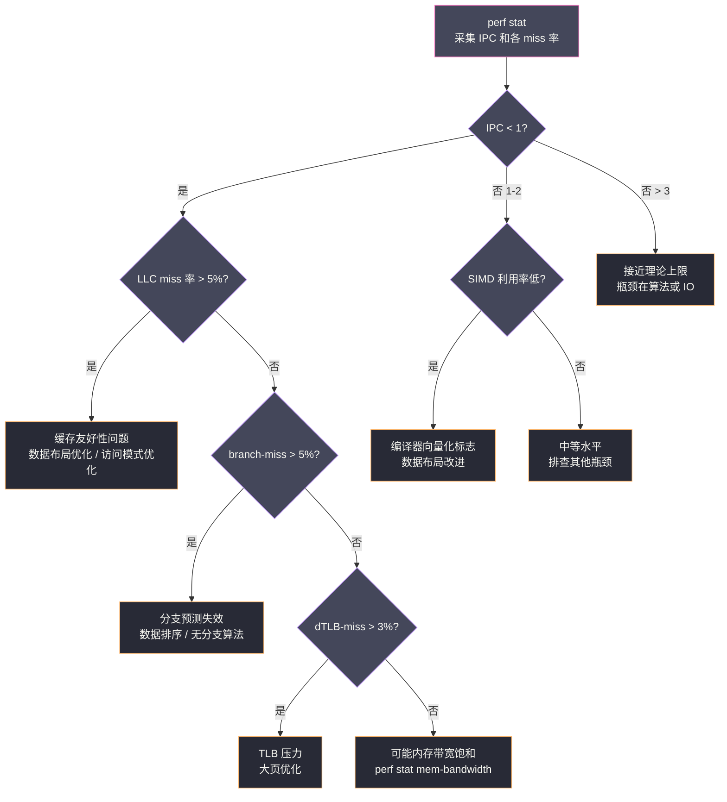

# 02 CPU 微架构优化——Cache Miss、分支预测与 SIMD

**摘要：**
上一篇用 `perf` 定位到了热点函数，但有时你会发现：某个函数在火焰图中占据很大面积，代码逻辑也很简单（譬如一个循环遍历数组），却莫名地慢。这类问题的根因不在算法复杂度，而在 CPU 微架构层——现代 CPU 为了掩盖内存访问延迟（DRAM ~70ns vs L1 Cache ~4 cycles）设计了极为复杂的流水线、多级缓存、分支预测、乱序执行等机制，当代码的访问模式与这些机制"对齐"时性能极高，一旦"对抗"这些机制，性能可以下降 10-100 倍。本文从 CPU 缓存层次结构出发，深入分析三类最常见的微架构性能问题：Cache Miss（数据不在缓存中，CPU 必须等待内存）、分支预测失效（CPU 执行了错误的指令路径，必须回滚 pipeline）、SIMD 向量化未充分利用（同样的循环，向量化版本可以快 4-16 倍）。每个问题都给出 `perf stat` 的硬件计数器诊断方法和具体的代码级优化手段。

---

## 第 1 章 从 MHz 到 IPC——CPU 微架构的演进逻辑

### 1.1 为什么"频率提升"走到了尽头

理解微架构优化之前，不妨先回顾一段硬件历史。20 世纪 90 年代到 21 世纪初，CPU 性能提升的主要驱动力是频率——从 1995 年 Pentium 的 100MHz 到 2005 年 Pentium 4 的 3.8GHz，十年间频率提升了 38 倍。但 2005 年前后，频率提升撞上了"功耗墙"——CPU 功耗与频率的立方成正比（P ∝ f³），3.8GHz 的 Pentium 4 功耗已达 130W，继续提升频率需要更夸张的散热。Intel 放弃了 NetBurst 架构（高频长流水线路线），转向 Core 架构（多核低频短流水线路线），从此 CPU 性能提升的驱动力从"提频率"转向"提 IPC"——每个时钟周期执行更多指令。

提升 IPC 的手段正是本文要讨论的微架构机制：多级缓存（减少等待内存的时间）、分支预测（减少流水线冲刷）、乱序执行（让独立的指令并行执行）、SIMD（一条指令处理多个数据）。这些机制的核心目标都是同一个——**让 CPU 流水线不要空转**。现代 CPU 的流水线深度通常 14-20 级，理想情况下每个时钟周期完成一条指令的"退休"（retire），但任何一次"等待"（等内存、等分支结果、等数据依赖）都会让流水线空转，浪费算力。微架构优化的本质，就是让代码的执行模式与 CPU 的并行机制"对齐"，减少流水线空转。

### 1.2 现代 CPU 的存储层次

理解缓存优化之前，必须对各级存储的延迟有直观感受。以 Intel Ice Lake（10nm）为例：

| 存储层级 | 容量（典型）| 访问延迟 | 带宽 |
|---------|-----------|---------|-----|
| L1 指令缓存 | 32 KB/核 | **~4 cycles（~1.2 ns）** | ~1 TB/s |
| L1 数据缓存 | 48 KB/核 | **~5 cycles（~1.5 ns）** | ~1 TB/s |
| L2 缓存 | 512 KB/核 | **~12 cycles（~4 ns）** | ~400 GB/s |
| L3 缓存（LLC）| 2-4 MB/核（共享）| **~40 cycles（~12 ns）** | ~200 GB/s |
| DRAM（本地 NUMA）| 64-512 GB | **~80 ns（~270 cycles）** | ~50 GB/s |
| DRAM（远端 NUMA）| — | **~150 ns（~500 cycles）** | ~25 GB/s |
| NVMe SSD | — | ~100 µs | ~7 GB/s |

**延迟差距的直观感受**：如果 L1 缓存访问是"从书桌上拿书"（1 秒），L3 缓存就是"从房间里的书架拿书"（10 秒），而 DRAM 就是"开车去图书馆借书"（4.5 分钟）。当你的代码每次循环都触发一次 DRAM 访问（cache miss），相当于每次循环都要开车去图书馆——无论逻辑多简单，都会极其缓慢。

这个延迟层级是 CPU 设计的核心矛盾——寄存器极快但极少（几十个），DRAM 很大但极慢（100 倍于 L1）。多级缓存是"用容量换延迟"的折中——L1 小而快（优先放最热的数据），L2 中等（L1 miss 的后备），L3 大而慢（所有核共享，放不太热但偶尔访问的数据）。缓存层级的设计哲学是"金字塔"——越顶层越快越小，越底层越慢越大，命中率决定了平均延迟。一个程序的 cache miss 率高，意味着大量访问"掉到"了 DRAM 层级，平均延迟从 ~1ns 飙到 ~80ns——这就是微架构性能问题的根源。

缓存层次的延迟差距还有一个与"程序设计"相关的深层含义——**程序员写的代码在"隐式地选择"缓存层级**。顺序访问数组时，数据在 L1/L2 命中（~1-4ns）；随机访问链表时，每个节点都可能 cache miss（~80ns）。两种访问方式的"代码复杂度"可能相同（都是 O(n) 遍历），但"实际延迟"差 20-80 倍。这意味着**数据结构的选择隐含了缓存延迟的选择**——数组是"缓存友好"的数据结构，链表是"缓存不友好"的数据结构。很多程序员习惯用链表（因为插入删除方便），但在遍历密集的场景，链表的 cache miss 开销远超插入删除的便利。现代高性能代码倾向于"用数组模拟链表"（数组 + 索引），既保留了插入删除的灵活性，又获得了数组的缓存友好性。

### 1.3 Cache Line：缓存的基本操作单位

CPU 缓存不以字节为单位工作，而是以 **Cache Line**（通常 64 字节）为单位传输数据。当访问某个内存地址时，即使只需要读取 4 字节的 `int`，CPU 也会将包含这 4 字节的整个 64 字节 Cache Line 从 DRAM 或上级缓存加载到下级缓存。

这个设计有两个重要含义。**含义 1：空间局部性（Spatial Locality）会被自动利用**。访问数组元素 `a[0]` 时，CPU 会将 `a[0]` 到 `a[15]`（共 16 个 `int`，恰好 64 字节）全部加载到缓存。因此顺序访问数组（`for i: a[i]`）只需要每 16 个元素触发一次 cache miss，随机访问则每次都触发 cache miss——这就是"顺序访问比随机访问快 10-100 倍"的根本原因。Cache Line 的设计基于一个经验观察：程序的内存访问有强烈的空间局部性——访问了 `a[0]`，大概率接下来会访问 `a[1]`、`a[2]`。预取整个 Cache Line 是"赌"局部性成立的赌注，大多数时候赌赢了。

**含义 2：False Sharing（伪共享）陷阱**。如果两个线程分别修改位于同一 Cache Line 内的不同变量，即使它们操作的是不同变量，也会导致缓存一致性协议（MESI）反复使对方的缓存行失效（Invalidate），形成"cache line 乒乓"，产生大量 L1/L2 写失效：

```c
/* 伪共享的典型案例 */
struct Counter {
    int64_t count_a;  /* 线程 A 的计数器 */
    int64_t count_b;  /* 线程 B 的计数器 */
    /* count_a 和 count_b 在同一个 64 字节 Cache Line 中！*/
};

/* 线程 A 不断递增 count_a，线程 B 不断递增 count_b
   每次写操作都导致对方的 Cache Line 失效 → 性能严重下降 */
```

False Sharing 的原理是——缓存一致性协议（MESI）以 Cache Line 为粒度维护一致性。线程 A 修改 `count_a` 时，A 的 L1 cache line 变成 Modified 状态，B 的同一 cache line 被 Invalidate。B 要修改 `count_b` 时，发现 cache line 被 Invalidate 了，必须从 A 拉取最新数据（跨核传输），然后 A 的 cache line 变成 Shared，B 变成 Modified。这个过程反复发生，每次写操作都触发跨核的 cache line 传输——虽然两个线程操作的是不同变量，但因为在同一 Cache Line 里，被迫"共享"了一致性开销。

```c
/* 修复：填充到不同 Cache Line */
struct Counter {
    int64_t count_a;
    char pad_a[56];  /* 填充到 64 字节边界 */
    int64_t count_b;
    char pad_b[56];
};

/* 或用 C++17 的 hardware_destructive_interference_size */
struct alignas(std::hardware_destructive_interference_size) Counter {
    int64_t count_a;
};
```

False Sharing 的检测可以用 `perf c2c`（Cache-to-Cache）——它专门分析跨核的 cache line 传输，能直接定位"哪些 cache line 在哪些核之间乒乓"。这是 perf 的一个专科子命令，日常 profiling 用不到，但排查多线程性能问题时非常有效。

---

## 第 2 章 Cache Miss 的诊断与优化

### 2.1 用 perf stat 量化 Cache Miss 程度

```bash
# 采集 LLC（最后一级缓存）miss 相关计数器
perf stat -e cycles,instructions,LLC-loads,LLC-load-misses,LLC-stores,LLC-store-misses \
    -p <pid> sleep 10

# 典型输出：
# Performance counter stats for process '<pid>':
#
#  85,234,567,890  cycles
#  42,617,283,945  instructions          #   0.50  insn per cycle  ← IPC 很低！
#   3,456,789,012  LLC-loads
#     987,654,321  LLC-load-misses       #  28.5% of all LLC loads ← ！！高 miss 率
#     456,789,012  LLC-stores
#      45,678,901  LLC-store-misses      #  10.0% of all LLC stores
#
# 解读：
# IPC = 0.50（理想值 2-4）：CPU 流水线经常空转
# LLC miss 率 = 28.5%：接近三成的内存读取需要去 DRAM 拿数据
# 这说明程序的内存访问模式很差，数据局部性不足

# 更细粒度：分 L1/L2/LLC 三层分析
perf stat -e \
    L1-dcache-loads,L1-dcache-load-misses,\
    L2-loads,L2-load-misses,\
    LLC-loads,LLC-load-misses \
    -p <pid> sleep 5

# 找出哪段代码导致 LLC miss（采样模式）
perf record -e LLC-load-misses -g -p <pid> -- sleep 30
perf report | head -20
# 直接告诉你"哪个函数/调用链导致了 LLC miss"
```

Cache Miss 的诊断分三层——L1 miss 率高说明"工作集超过 L1 容量"（48KB），L2 miss 率高说明"工作集超过 L2 容量"（512KB），LLC miss 率高说明"工作集超过 L3 容量"（几 MB 到几十 MB）。不同层级的 miss 指向不同的优化方向——L1 miss 高可能是循环内有随机访问，L2 miss 高可能是数据结构太大，LLC miss 高可能是工作集远超缓存容量，需要分块（Tiling）或改数据布局。**分层诊断能精确定位"哪一级缓存是瓶颈"**，而非笼统地说"缓存不好"。

分层诊断还有一个与"优化策略"相关的指导价值——L1 miss 高但 L2/L3 命中率高，说明"数据在 L2/L3 但不在 L1"，解法是"减少工作集"或"提高 L1 利用率"（譬如循环分块让内层循环的数据在 L1 里）；L1/L2 miss 都高但 LLC 命中率高，说明"数据在 L3 但不在 L1/L2"，解法是"让数据更紧凑"（譬如 SoA 布局减少无用字段的加载）；L1/L2/LLC miss 都高，说明"数据全在 DRAM"，解法是"根本性改变访问模式"（譬如分块让工作集适应缓存，或用 HugePage 减少 TLB miss）。**不同层级的 miss 指向不同的优化粒度**——L1 miss 是"微调"，LLC miss 是"重构"。

### 2.2 数据布局优化：AoS vs SoA

**AoS（Array of Structures，结构体数组）** vs **SoA（Structure of Arrays，数组的结构体）** 是缓存友好性中最经典的数据布局问题：

```c
/* AoS 布局（常见但缓存不友好）*/
struct Particle {
    float x, y, z;     /* 位置：12 字节 */
    float vx, vy, vz;  /* 速度：12 字节 */
    float mass;         /* 质量：4 字节 */
    float charge;       /* 电荷：4 字节 */
    /* 每个 Particle 32 字节，2 个粒子恰好一个 Cache Line */
};

struct Particle particles[1000000];

/* 场景：只更新位置（只需要 x, y, z, vx, vy, vz）*/
for (int i = 0; i < N; i++) {
    particles[i].x += particles[i].vx * dt;
    particles[i].y += particles[i].vy * dt;
    particles[i].z += particles[i].vz * dt;
}
/* 每个 Cache Line 加载 32 字节，但只使用 24 字节（x,y,z,vx,vy,vz）
   mass 和 charge 被白白加载，浪费了 25% 的缓存带宽
   100 万粒子 × 32 字节 = 32 MB，远超 L3 缓存 → 大量 LLC miss */
```

```c
/* SoA 布局（缓存友好）*/
struct Particles {
    float *x, *y, *z;     /* 各自独立的数组 */
    float *vx, *vy, *vz;
    float *mass;
    float *charge;
    int count;
};

Particles p;
p.x = new float[1000000]; /* 只有 x, y, z, vx, vy, vz 的数据 */
/* ...分配其他数组... */

/* 只更新位置时，只访问 x, y, z, vx, vy, vz 数组
   这 6 个数组各自顺序访问，Cache Line 内全是有效数据
   内存访问量从 32 MB 降到 24 MB，且顺序访问 prefetch 效率极高 */
for (int i = 0; i < N; i++) {
    p.x[i] += p.vx[i] * dt;
    p.y[i] += p.vy[i] * dt;
    p.z[i] += p.vz[i] * dt;
}
```

**SoA 相对 AoS 的性能提升**：在上述粒子模拟场景中，典型提升 **2-4 倍**（取决于结构体中被忽略字段的比例和数组大小）。编译器也更容易对 SoA 布局的循环进行**自动向量化（Auto-Vectorization）**——因为数据紧密排列，SIMD 指令可以一次处理多个元素。

AoS vs SoA 的本质是"按对象组织"还是"按字段组织"。AoS 符合面向对象的思维——一个对象的所有字段放在一起，访问 `particles[i].x` 时 `particles[i].y` 也在附近。但问题在于，如果一次遍历只访问部分字段（譬如只更新位置，不碰 mass 和 charge），AoS 会把不用的字段也加载进缓存，浪费带宽。SoA 把同字段的数据连续排列，遍历时只加载用到的字段，缓存利用率 100%。**SoA 的代价是"破坏了对象的局部性"**——访问 `particles[i]` 的所有字段需要从多个数组分别取，跨字段操作变慢。所以 AoS 和 SoA 的选择取决于"访问模式"——按字段遍历多用 SoA，按对象遍历多用 AoS。游戏引擎和科学计算多用 SoA（按字段更新），业务系统多用 AoS（按对象操作）。

AoS vs SoA 的选择还有一个与"SIMD"相关的考量——SoA 更容易被编译器自动向量化。SoA 的数据是连续的同类型数组（`float x[1000000]`），编译器能直接用 SIMD 指令一次处理 8 个 float；AoS 的数据是交错的结构体数组（`{x, y, z, vx, vy, vz, mass, charge}` × 1000000），编译器要向量化需要先"解交错"（从结构体里抽出 x 字段到连续寄存器），这增加了向量化难度。很多编译器对 AoS 的自动向量化失败，但对 SoA 的自动向量化成功——这是 SoA 在计算密集场景的额外优势。**SoA 是"缓存友好 + SIMD 友好"的双重优化**，而 AoS 是"缓存不友好 + SIMD 不友好"的双重劣势——在计算密集场景，SoA 的收益是叠加的。

### 2.3 访问模式优化：矩阵乘法的经典案例

矩阵乘法是"缓存访问模式"教科书级的案例。朴素实现（ijk 顺序）对矩阵 B 的访问是列访问（步长 = 矩阵宽度），每次跳跃一整行，对缓存极不友好：

```c
/* 朴素 ijk 顺序：B 矩阵按列访问，缓存命中率极差 */
void matmul_naive(float A[][N], float B[][N], float C[][N]) {
    for (int i = 0; i < N; i++)
        for (int j = 0; j < N; j++)
            for (int k = 0; k < N; k++)
                C[i][j] += A[i][k] * B[k][j];
                /* B[k][j] 是按列访问：B[0][j], B[1][j], B[2][j]... */
                /* 相邻两次访问相差 N*4 字节（N 行），必然 cache miss */
}
/* N=1024 时：大约 10^9 次浮点运算，但缓存命中率极低，实测约 0.5 GFLOPS */

/* ikj 顺序：调换内两层循环，B 矩阵变为行访问 */
void matmul_ikj(float A[][N], float B[][N], float C[][N]) {
    for (int i = 0; i < N; i++)
        for (int k = 0; k < N; k++) {
            float a_ik = A[i][k];  /* 提升 A[i][k] 到寄存器 */
            for (int j = 0; j < N; j++)
                C[i][j] += a_ik * B[k][j];
                /* B[k][j] 按行访问：B[k][0], B[k][1], B[k][2]... */
                /* 顺序访问！Cache Line 利用率接近 100% */
        }
}
/* N=1024 时：同样 10^9 次运算，缓存命中率极高，实测约 4-8 GFLOPS，提升 8-16 倍 */
```

这个案例的震撼之处在于——**算法复杂度完全相同**（都是 O(N³)），运算次数完全相同，只是循环顺序换了，性能差 8-16 倍。这打破了"算法复杂度决定性能"的直觉——在微架构层面，"访问模式"比"算法复杂度"更影响实际性能。ijk 顺序的 B 矩阵按列访问，每次跳跃 N×4 字节（N=1024 时 4KB），一个 Cache Line 只用到一个元素（4 字节），利用率 6.25%；ikj 顺序的 B 矩阵按行访问，一个 Cache Line 用到 16 个元素，利用率 100%。**循环顺序是"缓存友好性"的零成本优化**——不改算法、不改数据，只换循环顺序，性能差一个数量级。

**更进一步：分块（Tiling/Blocking）**——将矩阵分成适合 L2 缓存大小的小块，确保子矩阵始终在缓存中：

```c
#define BLOCK_SIZE 64  /* 根据 L2 缓存大小选择，使 3 个 BLOCK×BLOCK 的矩阵块装入 L2 */

void matmul_blocked(float A[][N], float B[][N], float C[][N]) {
    for (int ii = 0; ii < N; ii += BLOCK_SIZE)
      for (int kk = 0; kk < N; kk += BLOCK_SIZE)
        for (int jj = 0; jj < N; jj += BLOCK_SIZE)
          /* 对每个块做朴素乘法——此时块尺寸适合缓存 */
          for (int i = ii; i < min(ii+BLOCK_SIZE, N); i++)
            for (int k = kk; k < min(kk+BLOCK_SIZE, N); k++) {
              float a_ik = A[i][k];
              for (int j = jj; j < min(jj+BLOCK_SIZE, N); j++)
                C[i][j] += a_ik * B[k][j];
            }
}
/* 实测约 20-40 GFLOPS（配合 SIMD），接近 BLAS 库的性能 */
```

分块的核心思想是"让工作集适应缓存容量"——L2 缓存 512KB，三个 64×64 的 float 矩阵块刚好 3×64×64×4 = 48KB，远小于 L2 容量，能完全驻留在缓存中。分块把"大矩阵的随机访问"转化为"小块的顺序访问"，让每个小块都在缓存里完成所有运算。这个技巧在科学计算（线性代数、有限元分析）和机器学习（矩阵乘法是深度学习的核心算子）中广泛使用——BLAS、MKL、OpenBLAS 等数学库的矩阵乘法实现都用了分块 + SIMD + 寄存器分块的多层优化。**分块是"用算法结构适配硬件结构"的典范**——不是让硬件迁就算法，而是让算法迁就硬件。

### 2.4 预取（Prefetch）：主动告知 CPU 未来的访问

当访问模式有规律但编译器无法自动预取时，可以手动插入预取指令（`__builtin_prefetch`），让 CPU 提前加载即将访问的数据，在等待 DRAM 的同时继续执行其他计算：

```c
void process_linked_list(Node *head) {
    Node *curr = head;
    while (curr != nullptr) {
        /* 预取下下个节点（2 步之后要访问的地址）*/
        /* 目的：在处理 curr 的同时，让 CPU 提前加载 curr->next->next */
        if (curr->next && curr->next->next)
            __builtin_prefetch(curr->next->next, 0, 1);
            /* 参数：(地址, rw=0读/1写, locality=0-3=时间局部性) */

        /* 处理当前节点（此时 curr->next 已在缓存中）*/
        process(curr->data);
        curr = curr->next;
    }
}
/* 链表的随机访问本质上无法避免 cache miss，但预取可以将"串行等待"变为"并行预加载"
   典型提升：20-40%（取决于 DRAM 延迟和处理逻辑的复杂度）*/
```

预取的原理是"用计算时间掩盖内存延迟"——正常访问链表时，CPU 处理 `curr` 节点后，访问 `curr->next` 触发 cache miss，等 80ns，然后处理 `next` 节点——等待和处理是串行的。预取把"等待"提前——处理 `curr` 的同时，CPU 已经在后台加载 `curr->next->next`（两步之后的数据），等处理完 `curr` 和 `next` 后，`next->next` 已经在缓存里了——等待被计算掩盖了。这就像你在排队时提前看好了下一个窗口的材料——等轮到你时直接递上去，不用临时翻找。

> [!warning] 生产避坑：过度预取适得其反
> 预取指令会占用内存总线带宽和 L1/L2 缓存空间。如果预取的数据实际上没有被访问（预测错误），或者预取距离设置不当（太近=没用，太远=被驱逐出缓存），预取不仅没有帮助，反而会驱逐其他有用的缓存行。原则：**先用 `perf stat -e cache-misses` 确认 miss 率高，再考虑预取**，不要在不必要的地方添加预取指令。

预取还有一个与"硬件预取器"的协作关系——现代 CPU 内置了硬件预取器（Hardware Prefetcher），它能自动检测顺序访问模式并预取后续 Cache Line。对于顺序访问数组的场景，硬件预取器已经做得很好，手动 `__builtin_prefetch` 反而是多余的。手动预取的真正价值在于"硬件预取器检测不到的模式"——譬如链表遍历（地址不连续）、间接寻址（`array[index[i]]`，`index` 数组的值不连续）。这些场景硬件预取器无法预测下一步访问哪里，手动预取能提前告知 CPU。**手动预取是"硬件预取器的补充"，而非替代**——顺序访问靠硬件，不规则访问靠手动。

预取还有一个与"多线程"相关的注意点——预取指令会占用内存总线带宽，如果多个线程同时预取，总线带宽可能饱和，反而拖慢所有线程。多线程场景的预取要更保守——预取距离要短一些（譬如 1 步而非 2 步），预取的 locality 级别要低一些（`locality=0` 而非 `locality=3`，表示"用完就丢，不长期缓存"）。**多线程预取要"克制"**——单线程可以激进预取，多线程要考虑总线带宽的共享。

---

## 第 3 章 分支预测：流水线的隐形杀手

### 3.1 为什么分支预测如此重要

现代 CPU 流水线深度通常为 14-20 级（Intel Golden Cove：19 级）。当流水线遇到条件跳转指令（`if/else`、`switch`、循环退出条件）时，必须做出预测：**跳转还是不跳转？** 如果预测正确，流水线继续满速执行；如果预测错误，**已经进入流水线的错误路径指令必须被清除（Pipeline Flush）**，损失约 **15-25 个时钟周期**（相当于一次 L2 缓存 miss）。

要理解分支预测的代价，需要理解流水线的工作方式。CPU 流水线像一条工厂装配线——取指、译码、执行、访存、写回，每个阶段一个时钟周期。当流水线遇到分支指令时，"取指"阶段不知道该取下一条指令还是跳转目标指令——要等到"执行"阶段算出条件结果才知道。但流水线不能等——等了就空转。所以 CPU 猜一个方向，继续往流水线里塞指令。猜对了，流水线满速；猜错了，塞进去的指令全是错的，要全部清空重来——清空的这十几条指令的取指、译码全白做了，损失约 20 个周期。

**分支预测失效的代价计算**：

```
假设程序每 10 条指令有 1 次分支，分支预测失误率 10%：
每 100 条指令 = 10 次分支 × 10% 失误 × 20 cycles 惩罚
             = 20 cycles 因分支预测白白消耗

若程序平均 IPC = 2，100 条指令本来只需 50 cycles
分支预测失效让有效 CPI（Cycles Per Instruction）从 0.5 增加到 0.7，降低 28% 性能
```

### 3.2 诊断分支预测失效

```bash
# 量化分支预测失误率
perf stat -e branches,branch-misses -p <pid> sleep 10

# 典型输出：
#  12,345,678,901  branches
#     987,654,321  branch-misses          #   8.0% of all branches ← ！！高失误率

# 分支失误率的基准判断：
# < 1%：正常，分支预测工作良好
# 1-5%：可接受，但有优化空间
# > 5%：显著的预测失效，值得深入分析
# > 10%：严重问题，分支行为高度不可预测

# 定位哪段代码有高分支失误率
perf record -e branch-misses -g -p <pid> -- sleep 30
perf report | head -20
# 告诉你"哪个函数在分支失误上花了最多 CPU 时间"
```

分支预测失误率的判读有一个经验阈值——< 1% 是"健康"，> 5% 是"值得关注"，> 10% 是"严重问题"。但这个阈值要看分支密度——如果程序几乎没分支（譬如纯数组遍历），即使失误率 50% 影响也不大（因为分支总数少）；如果程序分支密集（譬如大量 if/else 的数据处理），5% 的失误率已经能显著拖慢性能。**分支预测问题 = 失误率 × 分支密度**——两者都高才是真问题。

分支预测失效的诊断还有一个与"间接分支"相关的维度——虚函数、函数指针、switch-case 的间接分支比直接条件分支更难预测。直接分支（`if/else`）只有"跳/不跳"两种选择，预测器有 50% 的基线准确率；间接分支（`call *%rax`）的目标地址有无数种可能，预测器要猜"跳到哪个地址"，难度高得多。现代 CPU 的间接分支预测器用了专门硬件（BTB，Branch Target Buffer），但面对"每次目标都不同"的间接分支（譬如虚函数调用多态对象），预测率仍然很低。这就是为什么高性能 C++ 代码倾向于"去虚化"（devirtualization）——把虚函数调用改为模板或 `if-else` 分发，把间接分支转为直接分支。**间接分支是分支预测的"重灾区"**——虚函数、函数指针、switch-case 的密集使用是 C++ 程序分支预测失效的常见原因。

### 3.3 数据相关的分支消除

最有效的分支优化是**彻底消除分支**，将条件判断转化为算术运算（无分支计算）：

```c
/* 有分支版本：绝对值函数 */
int abs_branch(int x) {
    if (x < 0) return -x;  /* 分支 */
    return x;
}

/* 无分支版本：利用算术运算 */
int abs_branchless(int x) {
    int mask = x >> 31;  /* 负数：全 1（0xFFFFFFFF），正数：全 0 */
    return (x + mask) ^ mask;
    /* 负数：(x + (-1)) XOR (-1) = (-x - 1) XOR (-1) = -x  ✓
       正数：(x + 0) XOR 0 = x                             ✓ */
}

/* 无分支版本 2：利用三元运算符（编译器通常能优化为无分支）*/
int abs_cmov(int x) {
    return x < 0 ? -x : x;  /* 编译器通常生成 cmov（条件移动）指令 */
}
```

无分支编程的核心是**用条件移动（CMOV）指令替代条件跳转（JMP）**。CMOV 指令的语义是"如果条件成立，把源操作数移到目标寄存器"——它不跳转，流水线不中断，只是有条件地执行一个移动操作。现代 CPU 的 CMOV 指令只需要 1-2 个周期，而分支预测失误的代价是 20 个周期——只要预测失误率 > 10%，CMOV 就比分支快。但 CMOV 也有代价——它总是要计算两个分支的结果（`-x` 和 `x` 都算），如果其中一个分支有副作用或计算很重，CMOV 反而慢。**无分支编程适合"两个分支都很轻"的场景**（譬如绝对值、clamp、min/max），不适合"一个分支重一个分支轻"的场景（譬如 if (rare_error) { heavy_handling }）。

**无分支的 clamp（截断到范围）**：

```c
/* 有分支版本 */
int clamp_branch(int x, int lo, int hi) {
    if (x < lo) return lo;
    if (x > hi) return hi;
    return x;  /* 2 次分支 */
}

/* 无分支版本（利用 min/max，编译器生成 cmov 指令）*/
int clamp_branchless(int x, int lo, int hi) {
    return std::max(lo, std::min(x, hi));
    /* 完全无跳转指令，只有比较和条件移动 */
}
```

### 3.4 让不可预测的分支变为可预测

有些分支无法消除，但可以通过**数据重排**让分支结果更规律，提升预测率：

```c
/* 场景：对数组中满足条件的元素做处理 */

/* 版本 1：随机数组，分支结果不可预测（预测失误率约 50%）*/
int data[100000];
// 随机填充 data，约一半大于阈值
for (int i = 0; i < N; i++) {
    if (data[i] > THRESHOLD) {  /* 随机跳转：预测器几乎不可能预测 */
        sum += data[i];
    }
}

/* 版本 2：排序后遍历（分支结果完全可预测）*/
std::sort(data, data + N);  /* 一次排序的代价 */
for (int i = 0; i < N; i++) {
    if (data[i] > THRESHOLD) {  /* 先全 false，后全 true，预测器完美预测 */
        sum += data[i];
    }
}
/* 排序后，分支预测失误率从 ~50% 降到 <1%
   即使排序本身有 O(N log N) 开销，对于多次遍历的场景仍然值得 */
```

**实测数据（Agner Fog 的经典测试）**：N=100000 随机 int 数组求和条件过滤：
- 未排序：约 6.5ns/元素（大量分支预测失效）
- 已排序：约 1.5ns/元素（分支预测完美）
- 提升：**4.3 倍**

这个案例的洞察是——**分支预测器擅长"规律"，不擅长"随机"**。现代 CPU 的分支预测器用了复杂的算法（感知机预测、TAGE 预测器），能识别很长的分支模式（譬如"跳、不跳、跳、跳、不跳"的循环模式），但对纯随机的分支（50% 概率跳转）无能为力——猜什么都是 50% 对。排序把"随机跳转"变成"先全不跳后全跳"的规律模式，预测器能完美预测。**数据重排是"用排序换预测率"的权衡**——排序有 O(N log N) 开销，但如果排序后的数据要被多次遍历（譬如多次过滤不同阈值），排序的开销被摊薄，预测率提升的收益占主导。

### 3.5 likely/unlikely 宏：给编译器提示

当无法消除分支，但知道某个分支的概率时，可以用 `__builtin_expect` 提示编译器将"常见路径"的代码放在顺序执行路径上（避免跳转指令的 pipeline bubble）：

```c
#define likely(x)   __builtin_expect(!!(x), 1)  /* x 大概率为 true */
#define unlikely(x) __builtin_expect(!!(x), 0)  /* x 大概率为 false */

/* 使用场景：错误处理路径（极少触发，用 unlikely 标记）*/
int fd = open(path, O_RDONLY);
if (unlikely(fd < 0)) {          /* 正常情况不会失败 */
    perror("open failed");
    return -1;
}

/* 使用场景：热路径上的条件检查 */
for (size_t i = 0; i < size; i++) {
    if (likely(data[i] != 0)) {  /* 大多数元素非零 */
        sum += data[i];
    } else {
        handle_zero(i);          /* 极少调用，放在 unlikely 路径 */
    }
}
```

**原理**：编译器会将 `unlikely` 路径的代码放到函数末尾或跳转目标，使顺序执行路径（不跳转）始终是"常见路径"，减少 pipeline 的预测压力，并提高指令缓存（i-cache）的局部性。

`likely`/`unlikely` 的效果在现代 CPU 上比想象中弱——因为现代分支预测器很强，即使编译器不提示，预测器也能通过历史学习到"这个分支通常不跳"。`likely`/`unlikely` 的主要价值在于"指令布局"——把常见路径的代码放在一起，提高 i-cache 命中率；把错误处理路径扔到函数末尾，不污染热路径的 i-cache。**`likely`/`unlikely` 是"指令缓存优化"而非"分支预测优化"**——对预测率影响小，对 i-cache 局部性影响大。

`likely`/`unlikely` 的使用有一个经验法则——**只对"概率极端"的分支使用**（譬如 99% vs 1%），对"概率适中"的分支（譬如 60% vs 40%）不要用——因为编译器的布局调整对 60/40 的分支帮助不大，反而可能让 40% 的路径变慢（被扔到函数末尾，跳转开销增加）。典型的 `unlikely` 场景是错误处理（`if (unlikely(error))`）、边界检查（`if (unlikely(i >= size))`）、调试断言（`if (unlikely(debug_flag))`）——这些分支正常情况下不跳，用 `unlikely` 标记后编译器把它们扔到函数末尾，不污染热路径的 i-cache。**`likely`/`unlikely` 是"为 1% 的冷路径牺牲布局"的优化**——只对极端概率的分支有意义。

---

## 第 4 章 SIMD 向量化：一次指令处理多个数据

### 4.1 SIMD 是什么，为什么重要

**SIMD（Single Instruction, Multiple Data，单指令多数据）** 是 CPU 提供的一组特殊指令，允许一条指令同时对多个数据元素执行相同的操作：

```
标量（普通）计算：
  指令 ADD   a[0] += b[0]    ← 1 次操作，1 条指令
  指令 ADD   a[1] += b[1]
  指令 ADD   a[2] += b[2]
  指令 ADD   a[3] += b[3]
  共 4 条指令，4 个时钟周期

AVX2 SIMD 计算（256 位寄存器，8 × float）：
  指令 VADDPS ymm0, ymm1, ymm2  ← 1 条指令，8 次操作！
  共 1 条指令，1 个时钟周期

理论加速比：8 倍（实际 4-7 倍，取决于内存带宽和其他因素）
```

SIMD 的设计动机是"数据并行"——很多程序（图像处理、科学计算、机器学习）对大量数据执行相同操作，譬如"给图像每个像素加 10"、"把两个数组相加"。标量指令一次处理一个元素，SIMD 指令一次处理多个——用一条指令的开销完成多个元素的操作。这就像流水线工人从"一次组装一个零件"变成"一次组装八个零件"——虽然每个零件的组装时间没变，但吞吐量提升了八倍。

**现代 CPU 的 SIMD 能力**：

| 指令集 | 寄存器宽度 | float 并行度 | double 并行度 | 代表 CPU |
|--------|----------|------------|-------------|---------|
| SSE2 | 128 位 | 4 个 | 2 个 | Pentium 4+ |
| AVX2 | 256 位 | 8 个 | 4 个 | Haswell（2013）+ |
| AVX-512 | 512 位 | 16 个 | 8 个 | Skylake-SP+、Ice Lake |

SIMD 指令集的演进是"寄存器宽度翻倍"——SSE2 的 128 位到 AVX2 的 256 位再到 AVX-512 的 512 位，每次翻倍让理论并行度翻倍。但实际加速比通常达不到理论值——瓶颈往往在内存带宽（数据供不上 SIMD 的吞吐）或分支（SIMD 要求所有元素走同一条路径）。**SIMD 的收益取决于"计算密度"**——计算密集（每个元素做很多运算）的场景收益大，内存密集（每个元素只做一次运算）的场景收益小，因为瓶颈在内存而非 CPU。

SIMD 的收益还受"数据对齐"影响——SIMD 指令对数据对齐有要求，AVX2 的 256 位指令要求数据对齐到 32 字节，AVX-512 的 512 位指令要求对齐到 64 字节。未对齐的数据可以用 `_mm256_loadu_ps`（unaligned load）加载，但在某些 CPU 上比对齐的 `_mm256_load_ps`（aligned load）慢。编译器自动向量化时会尽量生成对齐的加载，但如果数组的起始地址不保证对齐（譬如 `float *a` 可能是任意地址），编译器只能用 unaligned load。用 `alignas(32)` 或 `posix_memalign` 分配对齐内存，能让编译器生成更快的 aligned load。**数据对齐是 SIMD 性能的"隐形因子"**——不对齐不会出错（unaligned load 能工作），但会慢几个百分点。

### 4.2 编译器自动向量化

现代编译器（GCC/Clang）在 `-O2` 或 `-O3` 时会尝试**自动向量化**简单的循环。但自动向量化有严格前提——必须能证明循环中不存在**数据依赖**（后一次迭代不依赖前一次迭代的结果）、**指针别名**（两个指针不能指向同一内存）：

```c
/* 可以自动向量化（无依赖，无别名）*/
void add_arrays(float *a, float *b, float *c, int n) {
    for (int i = 0; i < n; i++)
        c[i] = a[i] + b[i];  /* 每次迭代完全独立 */
}
/* 编译器生成 VADDPS 指令，每次处理 8 个 float */

/* 不能自动向量化（有循环携带依赖）*/
void prefix_sum(float *a, int n) {
    for (int i = 1; i < n; i++)
        a[i] += a[i-1];  /* a[i] 依赖 a[i-1] ← 无法并行 */
}

/* 不能自动向量化（指针别名，编译器无法证明 a 和 b 不重叠）*/
void copy_shift(float *a, float *b, int n) {
    for (int i = 0; i < n; i++)
        a[i] = b[i+1];  /* 若 a == b，a[0] 的写操作影响 b[0] 的读 */
}

/* 修复：用 __restrict__ 告知编译器指针不重叠 */
void copy_shift_restricted(float * __restrict__ a,
                            float * __restrict__ b, int n) {
    for (int i = 0; i < n; i++)
        a[i] = b[i+1];  /* 现在编译器可以安全地向量化 */
}
```

自动向量化的两个障碍——数据依赖和指针别名——都源于"编译器不敢假设"。数据依赖是"编译器不敢假设迭代间独立"——`a[i] += a[i-1]` 的前缀和，后一次依赖前一次，SIMD 无法并行。指针别名是"编译器不敢假设两个指针不指向同一地址"——C/C++ 标准允许两个指针指向同一内存（aliasing），编译器必须保守假设 `a` 和 `b` 可能重叠，不敢向量化。`__restrict__` 关键字是程序员给编译器的"承诺"——"我保证这两个指针不重叠，你可以放心向量化"。如果程序员撒谎（指针实际重叠），向量化会产生错误结果——这是"性能换正确性"的契约，程序员负责保证承诺成立。

**确认编译器是否进行了自动向量化**：

```bash
# GCC：-fopt-info-vec 打印向量化报告
g++ -O3 -fopt-info-vec my_program.cpp -o my_program 2>&1 | grep "vectorized"
# my_program.cpp:15:5: optimized: loop vectorized using 32-byte vectors  ← 成功向量化
# my_program.cpp:30:5: missed: couldn't vectorize loop                    ← 失败原因

# Clang：-Rpass=loop-vectorize
clang++ -O3 -Rpass=loop-vectorize my_program.cpp 2>&1 | grep "vectorized"

# 汇编层面验证（看是否有 ymm/zmm 寄存器的指令）
objdump -d my_program | grep -E "vmovups|vaddps|vmulps|vfmadd" | head -10
```

### 4.3 手动 SIMD 内联函数

当编译器无法自动向量化，或需要更精细的控制时，可以使用 SIMD **内联函数（Intrinsics）** 手动编写向量化代码：

```c
#include <immintrin.h>  /* AVX2 内联函数头文件 */

/* 手动 AVX2 向量化：计算两个 float 数组的点积 */
float dot_product_avx2(float *a, float *b, int n) {
    __m256 sum_vec = _mm256_setzero_ps();  /* 初始化 8 个 float 的和为 0 */

    int i;
    for (i = 0; i <= n - 8; i += 8) {
        __m256 va = _mm256_loadu_ps(a + i);    /* 加载 8 个 float（未对齐）*/
        __m256 vb = _mm256_loadu_ps(b + i);    /* 加载 8 个 float */
        sum_vec = _mm256_fmadd_ps(va, vb, sum_vec);
        /* FMA：Fused Multiply-Add，sum_vec += va * vb（1 条指令完成乘加！）*/
    }

    /* 将 8 个 float 的和归约为 1 个 */
    float result[8];
    _mm256_storeu_ps(result, sum_vec);
    float sum = 0;
    for (int j = 0; j < 8; j++) sum += result[j];

    /* 处理尾部不足 8 个的元素 */
    for (; i < n; i++) sum += a[i] * b[i];

    return sum;
}
```

手动 Intrinsics 的使用场景是"编译器向量化失败但确实可以向量化"——譬如复杂的条件逻辑、非标准的访问模式、需要特定指令（譬如 FMA 乘加融合）的场景。手动 Intrinsics 的代价是"可移植性差"——AVX2 的 Intrinsics 只能在支持 AVX2 的 CPU 上运行，SSE2 的 Intrinsics 只能在支持 SSE2 的 CPU 上运行。如果要支持多种 CPU，需要写多个版本的代码 + 运行时 CPUID 分发——这是数学库（BLAS、OpenBLAS）的常见做法。**手动 Intrinsics 是"用可移植性换性能"的终极手段**——优先用编译器自动向量化，失败时才手动写。

**编译时指定目标架构**：

```bash
# 启用 AVX2 支持
g++ -O3 -mavx2 -mfma my_program.cpp -o my_program

# 在当前机器上启用所有可用指令集（最大化 SIMD 利用）
g++ -O3 -march=native my_program.cpp -o my_program
# 注意：-march=native 生成的二进制不可移植（只能在当前 CPU 上运行）
```

`-march=native` 是开发机器上最方便的选项——它自动检测当前 CPU 支持的所有指令集并全部启用。但生产部署时要注意——如果在支持 AVX-512 的开发机上用 `-march=native` 编译，部署到不支持 AVX-512 的生产机上会直接崩溃（Illegal Instruction）。生产部署应该用 `-mavx2`（AVX2 是 2013 年后 CPU 的标配，覆盖率高）或显式指定目标 CPU 架构。**`-march=native` 适合开发，`-mavx2` 适合生产**——这是编译选项的可移植性考量。

### 4.4 检测 SIMD 是否充分利用

```bash
# 统计 SIMD 指令利用率（通过 FP 操作计数器）
perf stat -e \
    fp_arith_inst_retired.128b_packed_single,\
    fp_arith_inst_retired.256b_packed_single,\
    fp_arith_inst_retired.scalar_single \
    -p <pid> sleep 10

# 理想状态（充分使用 AVX2）：
# 256b_packed_single 远大于 scalar_single

# 若 scalar_single 占主导：编译器未向量化，需要优化
# 若 128b_packed 为主而没有 256b：只用了 SSE，没有 AVX2
```

这个检测的价值在于"量化向量化程度"——如果程序做了大量浮点运算但 `scalar_single` 占主导，说明编译器没向量化，可能是因为编译选项没开（`-O2` 而非 `-O3`）、循环有依赖、指针有别名。逐一排查这些原因，把 `scalar` 转成 `packed`，性能就能提升几倍。**SIMD 利用率是"编译器优化效果"的可量化指标**——不是凭感觉"我觉得向量化了"，而是用硬件计数器精确测量。

### 4.5 AVX-512 的降频陷阱

AVX-512 虽然理论并行度最高（16 个 float），但在某些 Intel CPU 上有一个副作用——**触发降频**。AVX-512 单元的功耗极高，CPU 为了不超过 TDP（热设计功耗）限制，在执行 AVX-512 指令时降低核心频率。譬如 Skylake-SP 在运行 AVX-512 时频率从 3.7GHz 降到 3.0GHz——虽然每条指令处理 16 个 float，但频率降了 19%，实际加速比从理论的 16 倍降到约 13 倍。

更麻烦的是"升降频切换"——从标量代码切换到 AVX-512 代码时，CPU 需要几百个周期来"启动"AVX-512 单元（升频到降频的过渡期），从 AVX-512 切回标量时又需要过渡期（降频到升频）。如果程序频繁在 AVX-512 和标量之间切换（譬如 AVX-512 计算一段，标量处理条件逻辑一段，再 AVX-512 计算一段），过渡期的开销可能抵消 AVX-512 的收益。**AVX-512 适合"持续大量浮点运算"的场景**（譬如矩阵乘法、卷积），不适合"AVX-512 和标量混合"的场景。这也是为什么很多数学库提供"AVX2 版本"和"AVX-512 版本"两个实现——AVX2 虽然并行度低但无降频，AVX-512 并行度高但有降频，根据计算密度选择。

AVX-512 的降频问题在 Ice Lake 及之后的 CPU 上有所缓解——Intel 优化了 AVX-512 单元的功耗，降频幅度从 Skylake-SP 的 19% 降到 Ice Lake 的约 5%。但降频风险仍然存在——使用 AVX-512 前最好在实际 CPU 上 benchmark，确认"降频后的 AVX-512"比"不降频的 AVX2"快。如果降频后反而更慢，就用 AVX2。**AVX-512 不是"总是更快"——要 benchmark 确认**。这种"先测再选"的态度，正是微架构优化的核心方法论——不臆测，只信数据。行文至此，微架构优化的原理、手段、边界已讲透，下一篇进入调度延迟的维度。

---

## 第 5 章 TLB Miss：地址翻译的开销

### 5.1 TLB 是什么

[[内存管理/01 虚拟内存：为什么每个进程都以为自己独占内存]] 中介绍了虚拟内存和页表，但有一个关键的性能细节需要在此深入：**TLB（Translation Lookaside Buffer，转换后备缓冲区）** 是 CPU 内部的一个小型哈希缓存，专门缓存虚拟地址到物理地址的映射（页表项）。

**为什么 TLB 对性能至关重要**：

每次内存访问，CPU 都需要将虚拟地址翻译为物理地址。如果没有 TLB，每次翻译需要 4 次内存访问（4 级页表 PGD→PUD→PMD→PTE），延迟会增加 4 倍。TLB 命中时，地址翻译只需 1 个周期；TLB miss 时，需要走页表（约 4 × 内存访问延迟 = 320ns）：

| TLB 状态 | 地址翻译延迟 |
|---------|------------|
| TLB 命中（L1 TLB）| ~1 cycle |
| TLB 命中（L2 TLB）| ~7 cycles |
| TLB Miss（Page Table Walk）| ~200-400 cycles（4 次内存访问）|

TLB 是"地址翻译的缓存"——没有它，每次内存访问都要走 4 级页表，延迟翻 4 倍。TLB 的容量很小（L1 dTLB 约 64 条目，L2 TLB 约 2048 条目），因为它是全相联的哈希结构，硬件上做大很贵。以 4KB 页面大小为例，L2 TLB 覆盖 2048 × 4KB = 8MB 的地址空间。如果程序的**工作集**（Working Set，即频繁访问的内存范围）超过 8MB，TLB miss 将频繁发生。

**TLB 的容量限制**：典型 CPU 的 L1 dTLB 只有 64 个条目，L2 TLB 约 1024-2048 个条目。以 4KB 页面大小为例，L2 TLB 覆盖 2048 × 4KB = 8MB 的地址空间。如果程序的**工作集**（Working Set，即频繁访问的内存范围）超过 8MB，TLB miss 将频繁发生。

### 5.2 诊断 TLB Miss

```bash
# 量化 TLB miss 程度
perf stat -e \
    dTLB-load-misses,dTLB-loads,\
    iTLB-load-misses,iTLB-loads \
    -p <pid> sleep 10

# 典型输出：
#   456,789,012  dTLB-load-misses      #   5.3% of all dTLB loads ← 较高
#  8,641,975,308  dTLB-loads
#       123,456  iTLB-load-misses      #   0.02% of all iTLB loads ← 正常

# dTLB miss 率 > 1% 时开始影响性能，> 5% 需要优化
# 解决方案：减少工作集（降低 TLB 覆盖范围），或使用大页（HugePage）
```

dTLB miss 和 iTLB miss 的诊断方向不同——dTLB miss 高说明"数据访问的地址空间跨度大"（譬如大数组随机访问），解法是 HugePage 或减少工作集；iTLB miss 高说明"代码的 footprint 大"（譬如大量小函数、模板膨胀），解法是减少代码体积（譬如关闭过度内联、合并小函数）。**dTLB 看数据，iTLB 看代码**——两者高分别指向不同的优化方向。

**大页（HugePage）是 TLB miss 的根本解法**：

2MB 大页比 4KB 普通页大 512 倍，同样 2048 个 TLB 条目可以覆盖 2048 × 2MB = 4GB 的地址空间——覆盖范围扩大 512 倍，TLB miss 率相应降低。详细内容见 [[04 内存性能调优——NUMA 拓扑、大页与内存带宽]]。

HugePage 的原理是"用更大的页减少页表条目"——4KB 页需要 100 万个条目覆盖 4GB，2MB 页只需 2000 个条目覆盖 4GB。TLB 条目有限，覆盖大页时能管更大的地址范围。HugePage 的代价是"内部碎片"——2MB 页即使只用了 4KB 也占 2MB 内存，对小对象浪费大。所以 HugePage 适合"大工作集"场景（数据库、大数组），不适合"小对象"场景（譬如大量小字符串）。**HugePage 是"用内存浪费换 TLB 命中"的权衡**——大工作集值得，小工作集不值得。

HugePage 的使用还有一个与"透明大页（THP，Transparent HugePage）"相关的实践维度——Linux 内核的 THP 机制能自动把 4KB 页合并为 2MB 大页，不需要应用显式申请。THP 对应用透明（不用改代码），但有一些副作用——THP 的合并发生在后台（khugepaged 线程），合并时需要扫描内存，有 CPU 开销；THP 的合并可能导致内存碎片（2MB 页需要连续的 512 个 4KB 页，碎片化后分配失败）。对延迟敏感的应用（譬如交易系统），THP 的后台合并可能引入延迟抖动——更可控的方式是显式用 `mmap(MAP_HUGETLB)` 分配大页，而非依赖 THP 的自动合并。**THP 是"方便但有抖动风险"，显式 HugePage 是"可控但需要改代码"**——延迟敏感场景用显式，普通场景用 THP。

---

## 第 6 章 微架构诊断的综合工作流

### 6.1 从 IPC 开始的诊断树

**IPC（Instructions Per Cycle）** 是微架构健康度的综合指标：



这个诊断树的价值在于"系统性"——不是上来就猜"可能是缓存问题"，而是从 IPC 出发，逐项排查 cache miss、branch miss、TLB miss、SIMD 利用率，用硬件计数器精确定位瓶颈。每一步都有明确的阈值（LLC miss > 5%、branch-miss > 5%、dTLB-miss > 3%），不是凭感觉判断。**微架构诊断是"数据驱动"的，不是"经验猜谜"**——perf stat 的硬件计数器是客观证据，优化方向由数据指明。

### 6.2 使用 perf stat 的推荐命令组合

```bash
# 一次性采集所有关键微架构计数器
perf stat -e \
    cycles,instructions,\
    L1-dcache-load-misses,LLC-load-misses,\
    branch-misses,\
    dTLB-load-misses,\
    fp_arith_inst_retired.256b_packed_single,\
    fp_arith_inst_retired.scalar_single \
    -p <pid> -- sleep 30

# 计算并解读各比率：
# IPC = instructions / cycles
# L1 miss 率 = L1-dcache-load-misses / instructions
# LLC miss 率 = LLC-load-misses / LLC-loads（需单独添加 LLC-loads）
# 分支失误率 = branch-misses / branches
# SIMD 效率 = 256b_packed / (256b_packed + scalar)
```

这个"一站式"命令把所有关键微架构指标一次性采集——30 秒的 `perf stat` 就能给出"IPC、cache miss、branch miss、TLB miss、SIMD 利用率"的完整画像。这是微架构诊断的标准起手式——先跑这个命令看全局，再针对异常指标深入分析（譬如 LLC miss 高就用 `perf record -e LLC-load-misses` 定位到具体函数）。

---

## 第 7 章 微架构优化的边界与局限

### 7.1 不是所有代码都需要微架构优化

微架构优化的收益很大（2-16 倍），但适用范围有限——它只对"计算密集型"代码有效。如果程序是 IO 密集型（譬如网络服务、数据库查询），瓶颈在 IO 而非 CPU，微架构优化收益为零——你把一个占 5% CPU 的函数优化到快 10 倍，总 CPU 只降了 4.5%，用户感知不到。**微架构优化的前提是"瓶颈在 CPU"**——先用 perf 确认热点函数的 CPU 占比高，再考虑微架构优化。对 IO 密集型程序，应该先优化 IO（第 05、06 篇），而非微架构。

### 7.2 可读性与性能的权衡

微架构优化往往牺牲代码可读性——SoA 布局比 AoS 难读（`p.x[i]` vs `particles[i].x`），无分支代码比有分支代码难懂（`(x + mask) ^ mask` vs `if (x < 0) return -x`），SIMD Intrinsics 比标量代码复杂（`_mm256_fmadd_ps` vs `a[i] * b[i] + c[i]`）。这些优化让代码更"机器友好"但更"人类不友好"——维护成本上升。**微架构优化是"用可读性换性能"的权衡**——对热路径（占 CPU 大头的代码）值得，对冷路径不值得。一个经验法则是"先写正确的代码，再优化热点"——先用可读性好的方式实现，profile 后发现热点，再对热点做微架构优化。不要一开始就写 SoA + SIMD + 无分支的"过度优化"代码——可能大部分代码根本不是热点，优化了白费且难维护。

### 7.3 编译器的进化与手动优化的退潮

随着编译器的进步，很多手动微架构优化正在被编译器自动完成——`-O3` 的自动向量化已经能处理大部分简单循环，`__builtin_expect` 的效果被现代分支预测器削弱，`__builtin_prefetch` 被硬件预取器替代。手动优化的"护城河"在收窄——十年前需要手写 SIMD 的场景，现在编译器能自动向量化；十年前需要手动预取的场景，现在硬件预取器能自动处理。但手动优化不会完全消失——编译器对"复杂数据流"（譬如稀疏矩阵、图算法）的向量化能力仍然有限，这些场景还是需要手动 Intrinsics。**手动微架构优化是"编译器能力边界外的补充"**——编译器能做的交给编译器，编译器做不到的才手动。

编译器的进化还有一个与"Profile-Guided Optimization（PGO）"相关的方向——PGO 让编译器基于实际运行的 profile 数据做优化决策，譬如根据分支历史调整代码布局、根据热点分布决定内联深度。PGO 的思路是"编译器不知道运行时哪些路径热，但 profile 知道"——先用 profile 采集运行数据，再编译时用这些数据指导优化。GCC 和 Clang 都支持 PGO（`-fprofile-generate` / `-fprofile-use`），主流项目（Chrome、Firefox、LLVM 自身）都用 PGO 获得额外 5-15% 的性能提升。PGO 是"编译器优化 + 运行时数据"的结合——弥补了编译器"不知道运行时行为"的盲区。**PGO 是微架构优化的"半自动化"方向**——编译器自动做，但需要 profile 数据输入，介于"完全自动"和"完全手动"之间。

### 7.4 微架构差异与可移植性

微架构优化往往依赖具体 CPU 的特性——AVX-512 只在 Intel Skylake-SP+ 和 Ice Lake+ 上有，ARM NEON 是 ARM 特有的， prefetch 的行为在不同 CPU 上不同。这让微架构优化的代码可移植性差——在 Intel 上优化的 AVX-512 代码在 AMD 上可能不支持（早期 AMD 不支持 AVX-512），在 x86 上优化的代码在 ARM 上完全不可用。跨平台项目要为不同架构维护不同的优化代码——这是数学库（OpenBLAS、FFTW）的常见做法，但对业务项目来说维护成本太高。**微架构优化是"用可移植性换性能"的权衡**——对跨平台项目谨慎使用，对单平台项目（譬如只部署在特定 CPU 的服务）可以大胆使用。

微架构差异还有一个与"云环境"相关的现代挑战——云上实例的 CPU 型号不固定，同一份代码可能跑在 Skylake、Ice Lake、AMD Milan 等不同 CPU 上。如果编译时用 `-march=native` 优化了特定 CPU 的指令集，迁移到不支持该指令集的实例会崩溃。云原生环境下的解法是"运行时分发"——编译多个版本（SSE2、AVX2、AVX-512），运行时用 CPUID 检测当前 CPU 支持哪个指令集，选择对应的版本执行。这种"运行时分发"是数学库（OpenBLAS、MKL）的标准做法，但业务项目实现起来复杂。更简单的方案是"用最低通用指令集编译"（譬如统一用 AVX2，因为 2013 年后的 CPU 都支持），牺牲部分性能换可移植性。**云环境下"微架构优化的可移植性"比"极致性能"更重要**——除非你的业务对性能极度敏感（譬如高频交易），否则用通用指令集够用。

---

## 第 8 章 小结

CPU 微架构优化的核心是**让 CPU 流水线不要等待**——不等待内存数据（缓存友好访问），不等待分支结果（减少不可预测分支），充分利用 SIMD 并行度（数据紧密排列 + 无循环依赖）：

**Cache Miss 优化三板斧**：
1. SoA 数据布局（只访问需要的字段）
2. 顺序访问取代随机访问（空间局部性）
3. Cache Line 对齐 + 避免 False Sharing（多线程场景）

**分支预测失效的三种解决思路**：
1. 消除分支（无分支算法：`cmov`、位运算）
2. 让分支可预测（数据排序、`likely`/`unlikely` 提示）
3. 间接分支替换为直接分支（虚函数去虚化、函数指针内联）

**SIMD 向量化的充分条件**：
1. 循环内无数据依赖（各迭代独立）
2. 指针无别名（`__restrict__`）
3. 内存对齐（至少 16 字节，最好 32 字节）
4. 编译器标志：`-O3 -mavx2 -march=native`

这些优化手段的本质都是"让代码的执行模式与 CPU 的硬件机制对齐"——缓存友好是"与缓存层次对齐"，分支可预测是"与分支预测器对齐"，SIMD 是"与向量单元对齐"。理解了硬件机制，优化方向自然浮现；不理解硬件机制，只能靠试错。这也是为什么本专栏花大量篇幅讲硬件原理——微架构优化的"为什么"比"怎么做"更重要。

微架构优化的认知框架可以总结为一个核心命题——**性能不是算法复杂度的单变量函数，而是"算法 × 硬件"的二元函数**。一个 O(n) 的算法如果 cache miss 率高，可能比 O(n log n) 但缓存友好的算法还慢——因为后者的"常数因子"小（每次操作的延迟低）。算法分析通常忽略常数因子（大 O 记号只看增长趋势），但在实际工程中，常数因子决定了"n 不太大时的实际性能"——而大多数程序的实际数据规模就在"不太大"的范围内。**微架构优化本质上是"优化常数因子"**——算法不变，但每次操作的延迟从 80ns（DRAM）降到 1ns（L1），性能提升 80 倍。这种提升不改变大 O 记号，但改变了"实际能处理的数据规模"——原来 1 秒只能处理 100 万条，优化后能处理 8000 万条。

但微架构优化也有边界——它只对计算密集型代码有效，牺牲可读性，依赖具体 CPU，且随着编译器进化部分手动优化在退潮。**微架构优化是"性能调优的最后一公里"**——先优化算法复杂度（O(n²) 改 O(n log n)），再优化 IO（减少磁盘访问），最后才优化微架构（提高 IPC）。顺序反了——微架构优化一个 O(n²) 的算法，不如直接换成 O(n log n) 的算法收益大。

这个优化顺序的合理性可以从"收益天花板"来理解。算法优化的收益是"数量级"的——O(n²) 改 O(n log n) 在 n=100 万时快 50000 倍（10^12 vs 2×10^7）；IO 优化的收益是"百倍"的——从磁盘读（100µs）改到从缓存读（1µs）快 100 倍；微架构优化的收益是"十倍"的——cache miss 改 cache hit 快 80 倍，但通常只对部分代码生效，整体收益 2-10 倍。**收益天花板从高到低是"算法 > IO > 微架构"**——优先做天花板高的优化，天花板低的优化留到最后。这也是为什么"过早优化是万恶之源"——在算法还是 O(n²) 时就去调 cache line 对齐，是"捡了芝麻丢了西瓜"。

下一篇 [[03 CPU 调度延迟——实时性、亲和性与 cgroup CPU]] 将视角从单线程的执行效率转移到多线程/多进程的调度维度：P99 延迟毛刺有时不是因为代码慢，而是因为进程在等待 CPU 调度——OS 调度器的唤醒延迟、CPU 核心的竞争、cgroup CPU bandwidth throttling 都会引入毫秒级的调度延迟抖动，这是低延迟系统（交易系统、实时流处理）最难排查的性能问题之一。

---

## 参考资料

1. Agner Fog, "Optimizing software in C++". https://www.agner.org/optimize/
2. Intel 64 and IA-32 Architectures Optimization Reference Manual.
3. Brendan Gregg, "perf Examples". https://www.brendangregg.com/perf.html
4. Ulrich Drepper, "What Every Programmer Should Know About Memory", 2007.
5. Intel Intrinsics Guide. https://www.intel.com/content/www/us/en/docs/intrinsics-guide/
6. GCC Auto-Vectorization documentation. https://gcc.gnu.org/projects/tree-ssa/vectorization.html
7. Chandler Carruth, "Efficiency with Algorithms, Performance with Data Structures", CppCon 2014.
8. Mike Acton, "Data-Oriented Design and C++", CppCon 2014.

---

> [!note] 思考题
> 1. L1 Cache 与主存的延迟差距是 100 倍。按行遍历和按列遍历 100MB 数组的性能差异可达 10 倍以上。Cache Line（64字节）预取机制是根因——`__builtin_prefetch` 的三个参数（地址、读写意图、时间局部性级别）分别如何影响预取行为？软件预取在什么场景下反而降低性能？
> 2. 分支预测失败的代价是 15-20 个时钟周期的流水线冲刷。随机数据上 `if (array[i] > 128)` 的预测准确率约 50%。无分支编程（branchless）使用 `CMOV` 或位运算消除分支——在什么场景下编译器会自动生成 `CMOV`？`-O2` 和 `-O3` 优化级别在分支消除方面的差异是什么？
> 3. AVX-512 一次处理 64 字节但在某些 Intel CPU 上导致核心降频。降频的原因是 AVX-512 单元的功耗极高——CPU 为了不超过 TDP 限制而降低频率。在混合了 AVX-512 和标量代码的应用中，频繁的升降频切换会导致什么额外开销？JVM 的 C2 编译器能自动向量化为 AVX-512 吗？
