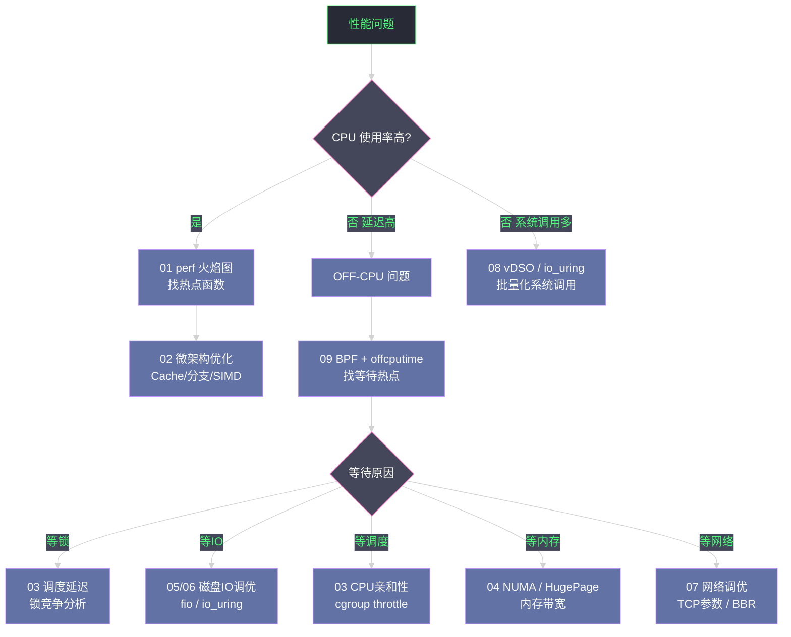

# 10 性能调优实战案例——从症状到根因的完整诊断链路

**摘要：**
前九篇文章分别深入了 CPU、内存、IO、网络、系统调用各个维度的性能分析工具和调优手段。但真实的生产问题从来不会贴标签告诉你"这是 CPU 问题"或"这是 IO 问题"——你收到的是一个含糊的告警："P99 延迟从 10ms 升到 200ms"，或者"吞吐量突然下降 50%"。本文通过三个来自真实生产场景的案例，展示如何将本专栏的所有工具和方法论组合成一条完整的**诊断链路**：从告警的第一反应、分层排查假设、工具选择与执行，到最终定位根因并验证修复效果。这不是一个线性的"按步骤操作"指南，而是一个**思维过程的展示**——为什么在某个节点选择这个工具而不是那个，为什么某个假设被否定，如何在信息不完整时推进诊断。

---

## 第 1 章 诊断方法论：在开始之前

### 1.1 USE 方法论回顾

Brendan Gregg 的 **USE（Utilization-Saturation-Errors）** 方法论提供了一个系统性的检查清单——对每一个资源（CPU、内存、磁盘、网络），依次检查：

- **Utilization（利用率）**：资源当前使用了多少（如 CPU 80%）
- **Saturation（饱和度）**：是否有任务在等待该资源（如 Run Queue 长度、IO 等待队列深度）
- **Errors（错误）**：是否有错误发生（如网络丢包、磁盘 IO 错误）

```bash
# 一次性获取所有关键资源的 USE 指标
# CPU：利用率 + 运行队列
mpstat 1 5                          # 利用率（%idle 越高越好）
vmstat 1 5                          # r 列 = 运行队列（> CPU 数 = 饱和）

# 内存：利用率 + swap
free -h                             # Used/Total
vmstat 1 5                          # si/so 列（swap in/out > 0 = 内存饱和）

# 磁盘：利用率 + 等待
iostat -x 1 5                       # %util（利用率）、aqu-sz（等待队列）、await（等待延迟）

# 网络：利用率 + 错误
sar -n DEV 1 5                      # rxkB/s、txkB/s vs 网卡速度
netstat -s | grep -i "error\|drop"  # 网络错误和丢包
ss -s                               # 连接状态统计
```

USE 方法论有一个与"资源视角"相关的核心特征——USE 从"资源"视角看性能：CPU、内存、磁盘、网络各是一个资源，每个资源检查"利用率、饱和度、错误"。这是"自底向上"的视角——从硬件资源出发，看资源是否瓶颈。USE 适合"系统级诊断"——快速扫描所有资源，找到瓶颈资源。**USE 是"资源视角"的自底向上方法**——这是 USE 的"视角特征"，从资源出发找瓶颈。

USE 方法论还有一个与"饱和度"相关的早期预警——USE 的"饱和度"比"利用率"更早预警瓶颈。譬如 CPU 利用率 80% 可能不饱和（无等待），CPU 利用率 60% 但运行队列长（饱和，有等待）。所以"饱和度"是"利用率"的早期预警——饱和说明"已经开始排队"，即使利用率不高。**USE "饱和度"比"利用率"早期预警**——这是 USE 的"饱和度价值"，饱和说明开始排队。

USE 方法论还有一个与"错误优先"相关的检查顺序——USE 三要素的检查顺序是"错误 → 饱和 → 利用率"——先查错误（错误最严重，譬如磁盘坏道），再查饱和（饱和是早期预警），最后查利用率（利用率是常态）。为什么错误优先？因为错误是"硬故障"——譬如磁盘 IO 错误意味着磁盘可能坏了，比"利用率高"严重得多。所以 USE 检查要"错误优先"——先排硬故障，再看饱和和利用率。**USE 检查"错误优先"**——这是 USE 的"检查顺序"，错误是硬故障最严重。

USE 方法论还有一个与"资源清单"相关的全面性——USE 要检查"所有资源"：CPU、内存、磁盘、网络，甚至扩展到"GPU、加速卡、连接池、线程池"等逻辑资源。每个资源都按"利用率、饱和度、错误"检查——不漏资源。所以 USE 是"资源清单式"检查——逐个资源过，不漏。**USE 是"资源清单式"检查**——这是 USE 的"全面性"，逐个资源不漏。

### 1.2 RED 方法论：服务视角的补充

与 USE 的"资源视角"互补，**RED（Rate-Errors-Duration）** 方法论从"服务视角"看性能：

- **Rate（请求率）**：服务每秒处理多少请求（QPS/RPS）
- **Errors（错误率）**：请求的错误率（5xx、超时、拒绝）
- **Duration（延迟）**：请求的处理时间（P50/P99/P999）

RED 方法论有一个与"服务视角"相关的互补——RED 从"服务"视角看性能：请求率、错误率、延迟。这是"自顶向下"的视角——从服务请求出发，看服务是否健康。RED 适合"应用级监控"——持续监控服务的 RED 指标，发现服务异常。**RED 是"服务视角"的自顶向下方法**——这是 RED 的"视角特征"，从请求出发看健康。

USE + RED 的结合有一个与"双向诊断"相关的协同——USE 看资源（自底向上），RED 看服务（自顶向下），两者结合是"双向诊断"。譬如 RED 显示"延迟升高"，USE 显示"磁盘饱和"——结合定位"磁盘饱和导致延迟升高"。所以 USE + RED 是"双向诊断"——资源视角 + 服务视角，两者协同定位。**USE + RED 是"双向诊断"**——这是方法论的"协同效应"，资源 + 服务双向定位。

USE + RED 的结合还有一个与"盲区互补"相关的价值——USE 的盲区是"看不到服务延迟"（资源正常不代表服务正常，譬如锁竞争不耗资源但延迟高），RED 的盲区是"看不到资源瓶颈"（延迟高但不知道哪个资源瓶颈）。两者结合互补盲区——USE 补 RED 的"资源盲区"，RED 补 USE 的"服务盲区"。所以 USE + RED 是"盲区互补"——各自补对方的盲区。**USE + RED "盲区互补"**——这是方法论结合的"互补价值"，各自补对方盲区。

USE + RED 的结合还有一个与"监控 vs 诊断"相关的分工——RED 适合"持续监控"（RED 指标易采集，适合 Prometheus 持续采集），USE 适合"诊断排查"（USE 指标要主动查，适合排查时用）。所以日常监控用 RED（持续看服务健康），出问题排查用 USE（主动查资源瓶颈）——两者分工。**RED "持续监控"，USE "诊断排查"**——这是方法论的"分工"，日常监控 vs 排查。

### 1.3 诊断原则

**原则 1：先测量，后假设**。不要在没有数据的情况下猜测根因，也不要在没有验证效果的情况下宣布问题解决。每一步调优都要有前后的量化对比。

**原则 2：由粗到细，分层递进**。先用高层指标（CPU/内存/IO/网络的整体利用率）确定问题所在的子系统，再用专项工具深入。避免在问题可能是 IO 的时候去深入分析 CPU。

**原则 3：区分 ON-CPU 和 OFF-CPU**。CPU 利用率不高但延迟高，几乎可以确定是 OFF-CPU 问题（等待某种资源）。高 CPU 利用率 + 高延迟，才是 ON-CPU 热点问题。

**原则 4：工具选择的开销意识**。生产环境下，先用低开销工具（`vmstat`、`iostat`、`ss`），再用中等开销工具（`perf stat`、`bpftrace`），谨慎使用高开销工具（`strace`）。

诊断原则有一个与"假设否定"相关的思维——诊断过程是"假设 - 验证 - 否定 - 新假设"的循环。譬如假设"GC 导致 P99 高"，验证 GC 日志发现"GC 暂停 < 50ms"——假设被否定，换新假设"cgroup throttling"。所以诊断是"假设否定循环"——不要执着于第一个假设，要"验证后否定再换"。**诊断是"假设否定循环"**——这是诊断的"思维模式"，验证后否定再换假设。

诊断原则还有一个与"一次只改一个变量"相关的实验纪律——优化时"一次只改一个变量"，改完测效果，再改下一个。如果一次改多个变量，效果无法归因——不知道是哪个改动起作用。所以优化要"一次一变量"——这是实验纪律，确保效果可归因。**优化要"一次只改一个变量"**——这是诊断的"实验纪律"，确保效果可归因。

诊断原则还有一个与"先易后难"相关的策略——诊断时"先查易排查的，后查难排查的"。譬如"配置误开"（易查，看配置）比"锁竞争"（难查，要 bpftrace）易排查。所以先查"配置、日志、监控"（易），再查"锁、调度、微架构"（难）。这是"先易后难"的策略——快速排除易排查的，聚焦难排查的。**诊断"先易后难"**——这是诊断的"策略原则"，先查易排查的。

诊断原则还有一个与"保留现场"相关的纪律——出问题时"保留现场"——不要急于重启服务或清理日志。现场有"问题时刻的状态"——重启后状态丢失，无法诊断。所以出问题先"保留现场"——dump、日志、metrics 都保留，再诊断。**"保留现场"是诊断纪律**——这是诊断的"现场原则"，不急于重启保留状态。

---

## 第 2 章 案例一：Java 微服务 P99 延迟毛刺

### 2.1 问题描述与初步观察

**现象**：Kubernetes 中的 Java 微服务（Spring Boot + gRPC），平均响应时间 5ms，但 P99 延迟突然从 15ms 升到 350ms，且具有周期性（大约每 5-10 分钟出现一次毛刺，持续 1-2 秒后恢复）。服务 CPU 使用率约 40%，内存使用率约 60%，表面上"正常"。

**第一反应：排除网络和基础设施问题**

```bash
# 1. 确认毛刺是服务本身还是外部依赖
# 在服务侧和客户端侧同时打点，对比两侧看到的延迟
# 若服务侧看到的延迟也高 → 问题在服务内部
# 若只有客户端侧延迟高 → 问题在网络传输层

# 2. 排除下游依赖（数据库、Redis 等）的延迟贡献
grep "db.query.duration" /var/log/app.log | awk '{print $NF}' | sort -n | \
    awk 'END{print "P99:", int(NR*0.99)"th:", $(int(NR*0.99))}'
# 若下游 P99 < 2ms，说明下游不是问题来源

# 3. 检查 GC 日志中 STW 暂停时间
grep "Pause" /var/log/gc.log | awk '{print $NF}' | sort -n | tail -20
# 若最大 STW < 50ms，说明 GC 不是主要原因（但可能是次要原因）
```

初步观察有一个与"排除法"相关的策略——诊断的第一步是"排除法"：排除网络（服务侧也高）、排除下游（下游 P99 低）、排除 GC（STW 小）。排除后，剩下的可能原因范围缩小——cgroup throttling、调度延迟、锁竞争等。所以"排除法"是诊断的第一步——逐步排除，缩小范围。**"排除法"是诊断的第一步**——这是诊断的"排除策略"，逐步排除缩小范围。

初步观察还有一个与"周期性毛刺"相关的特征——P99 毛刺是"周期性"的（每 5-10 分钟一次），这暗示"某种周期性事件"导致。周期性事件的候选：GC（周期性）、cgroup throttling（周期性，CFS 周期 100ms）、cron 任务（周期性）、日志轮转（周期性）。所以"周期性毛刺"要查"周期性事件"——这是周期性问题的诊断方向。**"周期性毛刺"查"周期性事件"**——这是周期性问题的"特征方向"，周期性暗示周期性事件。

初步观察还有一个与"服务侧 vs 客户端侧打点"相关的定位——确认毛刺在"服务内部"还是"网络传输"，要"服务侧和客户端侧同时打点"。若服务侧延迟也高 → 问题在服务内部；若只有客户端侧高 → 问题在网络。这是"双侧打点"的定位方法——对比两侧延迟，定位问题在哪段。**"双侧打点"定位问题在服务还是网络**——这是初步观察的"定位方法"，对比两侧延迟。

初步观察还有一个与"下游排除"相关的策略——排除下游依赖（数据库、Redis）的延迟贡献——查下游 P99 是否也高。如果下游 P99 低（< 2ms），下游不是问题来源；如果下游 P99 也高，下游是问题来源。所以"下游排除"能定位"问题在服务还是下游"——查下游 P99。**"下游排除"定位问题在服务还是下游**——这是初步观察的"下游策略"，查下游 P99。

### 2.2 诊断步骤：cgroup CPU Throttling 定位

```bash
# 检查 Pod 的 cgroup CPU throttle 状态
kubectl exec <pod> -- cat /sys/fs/cgroup/cpu/cpu.stat
# nr_periods     12345
# nr_throttled   1234    ← ！！有 throttle 计数
# throttled_time 12345678901234

# 计算 throttle 比例
python3 -c "print(round(1234/12345*100, 1), '% throttled')"
# 10.0% throttled  ← 每 10 个 100ms 周期就有 1 个被暂停

# 读取 CPU limit 配置
kubectl exec <pod> -- cat /sys/fs/cgroup/cpu/cpu.cfs_quota_us
# 50000  ← 50ms/100ms = 0.5 核

# 实时监控：毛刺时 nr_throttled 是否突增
kubectl exec <pod> -- bash -c "
prev=0
while true; do
    cur=\$(cat /sys/fs/cgroup/cpu/cpu.stat | grep nr_throttled | awk '{print \$2}')
    echo \"\$(date): throttled=\$cur delta=\$((cur-prev))\"
    prev=\$cur
    sleep 1
done"
# 观察：在 P99 毛刺出现时，delta 值是否突然增大
# 若确认毛刺时间与 throttle 增长时间高度吻合 → cgroup throttling 是主因
```

cgroup throttling 定位有一个与"CFS 周期"相关的机制——cgroup CPU throttling 基于 CFS（Completely Fair Scheduler）的"周期配额"机制：每 100ms 周期（`cpu.cfs_period_us`）分配配额（`cpu.cfs_quota_us`），配额用完后线程被 throttle（暂停）到下个周期。所以 throttling 是"周期性"的——每 100ms 周期检查配额，用完就暂停。这与"P99 毛刺周期性"吻合——throttle 导致周期性暂停。**cgroup throttling 是"周期性"的**——这是 throttling 的"机制特征"，CFS 周期配额导致周期性暂停。

cgroup throttling 定位还有一个与"CPU limit 太低"相关的根因——本案例 CPU limit = 0.5 核（500m），但应用突发需要更多 CPU（譬如 GC、批量处理）。0.5 核的配额在 100ms 周期内用完（50ms 用完 50ms 配额），剩余 50ms 被 throttle——暂停 50ms。所以"CPU limit 太低"导致 throttling——配额不够突发用。**"CPU limit 太低"导致 throttling**——这是 throttling 的"根因"，配额不够突发用。

cgroup throttling 定位还有一个与"throttle 比例"相关的量化——`nr_throttled / nr_periods` 计算"throttle 比例"。本案例 10%——每 10 个周期有 1 个被 throttle。比例越高问题越严重——5% 可能可接受，10% 开始影响 P99，20% 严重影响。所以"throttle 比例"要量化——不只看"有 throttle"，看"throttle 多严重"。**"throttle 比例"量化严重程度**——这是 throttling 诊断的"量化指标"，比例越高越严重。

cgroup throttling 定位还有一个与"实时监控 delta"相关的确认——实时监控 `nr_throttled` 的"delta"（每秒增量），看毛刺时 delta 是否突增。如果毛刺时 delta 突增——确认 throttling 导致毛刺。这是"时间相关性"的确认——throttle 增长时间与毛刺时间对齐。**"delta 突增"确认 throttling 导致毛刺**——这是 throttling 诊断的"时间确认"，delta 与毛刺对齐。

### 2.3 诊断步骤：叠加 GC 分析

```bash
# 启用 GC 详细日志（如未启用）
java -Xlog:gc*:file=/var/log/gc.log:time,level,tags -jar app.jar

# 分析 GC 暂停与 P99 毛刺的时间相关性
grep "Pause Full\|Pause Young\|Pause Old" /var/log/gc.log | \
    awk '{print $1, $NF}' | sort -t'[' -k2 -n | tail -50
# 若发现 Pause Full GC > 100ms 出现在毛刺时间点附近 → GC 是次要原因
```

GC 分析有一个与"时间相关性"相关的确认——确认 GC 是否导致毛刺，要看"GC 暂停时间"与"毛刺时间"的相关性。如果 GC 暂停 100ms 出现在毛刺时刻——GC 是原因；如果 GC 暂停 50ms 但毛刺 350ms——GC 不是主因（暂停不够大）。所以"时间相关性"是确认因果的关键——时间对齐才能确认因果。**"时间相关性"确认因果**——这是诊断的"因果确认"，时间对齐才能确认。

GC 分析还有一个与"多因叠加"相关的复杂——本案例是"多因叠加"：cgroup throttling（主因，暂停 80ms）+ Full GC（次因，暂停 100-200ms）。两者偶尔叠加导致 P99 峰值 350ms（80+200+正常 70ms）。所以性能问题可能"多因叠加"——不只一个原因，多个原因共同导致。诊断要"找全所有原因"——不只找主因，找次因。**性能问题可能"多因叠加"**——这是诊断的"多因意识"，找全主因和次因。

GC 分析还有一个与"GC 类型"相关的区分——Java 有多种 GC：Serial、Parallel、CMS、G1、ZGC、Shenandoah。不同 GC 的 STW 暂停不同——Serial/Parallel 暂停大（百毫秒到秒），G1 暂停中（10-100ms），ZGC/Shenandoah 暂停小（< 10ms）。所以 GC 分析要"区分 GC 类型"——不同 GC 暂停特性不同，优化方向不同。**GC 分析要"区分 GC 类型"**——这是 GC 诊断的"类型区分"，不同 GC 暂停不同。

GC 分析还有一个与"GC 日志启用"相关的前提——GC 分析要"启用 GC 日志"（`-Xlog:gc*`）。没有 GC 日志，无法分析 GC 暂停。所以生产服务"必开 GC 日志"——这是 GC 诊断的前提。**"GC 日志"是 GC 诊断的前提**——这是 GC 分析的"前提条件"，生产必开 GC 日志。

### 2.4 根因总结与修复

**根因总结**：两个原因叠加——cgroup CPU throttling（主因，10% 的周期被暂停 80ms）+ Full GC STW（次因，偶发 100-200ms 暂停）。两者偶尔叠加导致 P99 峰值 350ms。

**修复方案与效果验证**：

```yaml
# 修复 1：提高 CPU limit，减少 throttling 频率
resources:
  requests:
    cpu: "500m"
  limits:
    cpu: "2000m"    # 允许突发到 2 核

# 修复 2：切换到低暂停 GC（ZGC 或 G1GC 调优）
# java -XX:+UseZGC -Xmx4g -Xms4g -jar app.jar
# ZGC 的 STW 暂停 < 1ms（几乎可以忽略）
```

```bash
# 验证：修复后重新观察 throttle 比例和 P99
kubectl exec <pod> -- cat /sys/fs/cgroup/cpu/cpu.stat
# nr_throttled   12   ← 从 1234 降到 12，减少 100 倍！

# P99 监控（Grafana/Prometheus）：
# 修复前：P99 = 350ms（峰值）
# 修复后：P99 = 18ms（稳定）
```

修复方案有一个与"提高 CPU limit"相关的权衡——提高 CPU limit 到 2 核，减少 throttling，但"浪费资源"（平时只用 0.5 核，limit 2 核大部分时间空闲）。这是"性能 vs 资源利用率"的权衡——高 limit 减少 throttling 但降低利用率。折中方案：limit 设为"突发峰值"（譬如 1-2 核），request 设为"平均用量"（譬如 0.5 核）——平时按 request 调度，突发按 limit 用。**"提高 limit"是"性能 vs 利用率"的权衡**——这是修复的"权衡考量"，limit 设突发峰值，request 设平均用量。

修复方案还有一个与"ZGC"相关的 GC 优化——ZGC（Z Garbage Collector）是 Java 11+ 的低延迟 GC，STW 暂停 < 1ms（几乎可忽略）。切换到 ZGC 能消除"GC STW 毛刺"——即使有 GC，暂停也 < 1ms，不影响 P99。所以"低延迟 GC"是 Java P99 优化的关键——ZGC 或 Shenandoah 都能实现 < 10ms 暂停。**"低延迟 GC（ZGC）"消除 GC STW 毛刺**——这是 Java P99 优化的"GC 方向"，ZGC 暂停 < 1ms。

修复方案还有一个与"效果验证"相关的闭环——修复后要"验证效果"：throttle 计数从 1234 降到 12（减少 100 倍），P99 从 350ms 降到 18ms。这是"量化效果"的闭环——优化前后对比，确认有效。没有验证，不知道优化是否有效——可能"改了但没效果"或"改了更糟"。所以"效果验证"是修复的闭环——必做步骤。**"效果验证"是修复的闭环**——这是修复的"验证原则"，优化前后对比确认。

修复方案还有一个与"request vs limit"相关的 K8s 实践——K8s 的 `requests` 决定调度（按 request 分配节点），`limits` 决定上限（按 limit 限制用量）。本案例 request=500m（调度按 0.5 核），limit=2000m（上限 2 核）——平时按 request 用，突发按 limit 用。所以 request 设"平均"，limit 设"突发"——这是 K8s CPU 配置的最佳实践。**request 设"平均"，limit 设"突发"**——这是 K8s CPU 配置的最佳实践。

---

## 第 3 章 案例二：MySQL 查询突然变慢

### 3.1 问题描述

**现象**：MySQL 数据库服务器，某天下午 2 点开始，原本 P99 = 5ms 的查询变成 P99 = 500ms，但 CPU 使用率只有 15%，内存充足，看起来数据库本身很空闲。这是最典型的"CPU 闲，但服务慢"场景。

问题描述有一个与"CPU 闲但服务慢"相关的典型——"CPU 闲但服务慢"是 OFF-CPU 问题的典型症状：CPU 不忙（不在算），但服务慢（在等）。这指向"等待瓶颈"——等 IO、等锁、等网络。所以"CPU 闲但服务慢"要查 OFF-CPU——这是 OFF-CPU 问题的"典型信号"。**"CPU 闲但服务慢"是 OFF-CPU 信号**——这是 OFF-CPU 问题的"典型症状"，CPU 不忙但在等。

问题描述还有一个与"突然变慢"相关的线索——"某天下午 2 点开始突然变慢"——这暗示"某个变更"导致。变更的候选：配置变更（譬如 general_log 被开）、数据量变化（譬如日志文件变大）、流量突增、定时任务。所以"突然变慢"要查"变更时间点"——什么在下午 2 点变了。**"突然变慢"查"变更时间点"**——这是突然问题的"时间线索"，查变更时间点。

问题描述还有一个与"下午 2 点"相关的时间线索——"下午 2 点"是具体时间点，可以查"2 点前后什么变了"——配置变更（谁在 2 点改了配置）、部署（2 点是否有部署）、流量（2 点流量是否突增）。所以"具体时间点"是诊断的"时间锚点"——以时间点为锚查变更。**"具体时间点"是诊断的"时间锚点"**——这是突然问题的"锚点方法"，以时间查变更。

### 3.2 分层诊断过程

**第一层：系统资源全局检查**

```bash
# CPU + 内存 + IO + 网络 全局快照
vmstat 1 5
# procs -----------memory---------- ---swap-- -----io---- -system-- ------cpu-----
#  r  b   swpd   free   buff  cache   si   so    bi    bo   in   cs us sy id wa st
#  2  4   1234 123456  23456 456789    0    0   456  1234  234  567 15  3 42 40  0
#          ↑b=4  等待IO的进程数             ↑bo=1234 磁盘写出量   ↑wa=40% IO等待！

# 关键发现：wa（IO Wait）= 40%，说明 CPU 有大量时间在等待 IO
# b（blocked 进程数）= 4，有进程阻塞在 IO 等待
```

第一层诊断有一个与"vmstat wa"相关的关键指标——`vmstat` 的 `wa`（IO Wait）列显示"CPU 等待 IO 的时间比例"。wa=40% 说明 CPU 有 40% 时间在等 IO——IO 是瓶颈。这是"CPU 闲但服务慢"的根因——CPU 闲是因为在等 IO（不算但等）。所以 `vmstat wa` 是"IO 瓶颈"的关键指标——wa 高说明 IO 瓶颈。**`vmstat wa` 是 IO 瓶颈的关键指标**——这是第一层诊断的"关键发现"，wa=40% 说明 IO 瓶颈。

第一层诊断还有一个与"b 列"相关的饱和度——`vmstat` 的 `b`（blocked）列显示"等待 IO 的进程数"。b=4 说明有 4 个进程阻塞在 IO 等待——IO 饱和。这是 USE 方法论的"饱和度"指标——b > 0 说明 IO 资源饱和（有等待）。所以 `vmstat b` 是"IO 饱和度"指标——b > 0 说明饱和。**`vmstat b` 是 IO 饱和度指标**——这是第一层诊断的"饱和度发现"，b=4 说明 IO 饱和。

第一层诊断还有一个与"分层递进"相关的策略——第一层用"全局工具"（vmstat）快速扫描所有子系统（CPU、内存、IO、网络），找到"哪个子系统异常"。本案例 vmstat 一眼看出"wa=40%"——IO 异常。所以第一层是"全局扫描"——快速定位异常子系统，再深入。这是"由粗到细"的策略——先全局，再专项。**第一层"全局扫描"定位异常子系统**——这是分层诊断的"粗筛策略"，先全局再专项。

第一层诊断还有一个与"vmstat 一行看全"相关的效率——`vmstat` 一行显示 CPU、内存、IO、swap、上下文切换——一行看全所有子系统。这是"高效全局"——一行命令看全系统。所以 `vmstat` 是"全局快照"的首选——一行看全，快速定位。**`vmstat` "一行看全"高效全局**——这是第一层诊断的"效率工具"，一行看全子系统。

**第二层：磁盘 IO 详细分析**

```bash
# 确认是哪块磁盘、什么类型的 IO
iostat -x 1 5
# Device   r/s   w/s  rkB/s  wkB/s   r_await  w_await  aqu-sz  %util
# nvme0n1  4567   234  73456   3789     0.09     0.12     1.23    45.6  ← r_await 正常
# sdb       456   123   7234    234    89.45    45.67    34.56    98.7  ← ！！sdb 高延迟高利用率！

# sdb 的 r_await = 89ms（远超正常 HDD 的 5-15ms），%util = 98.7%（接近饱和）
# 但 nvme0n1 是 MySQL 数据目录，为什么 sdb 会有影响？

# 检查 sdb 挂载的是什么
df -h | grep sdb
# /dev/sdb1   2.0T   1.9T   50G  97%  /var/log  ← MySQL 日志目录！

# 磁盘空间快满了！/var/log 目录 97% 使用率
```

第二层诊断有一个与"分磁盘定位"相关的细化——`iostat -x` 显示"每块磁盘"的 IO 指标，能区分"哪块磁盘慢"。本案例 nvme0n1 正常（r_await 0.09ms），sdb 异常（r_await 89ms）——瓶颈在 sdb。所以 `iostat -x` 能"分磁盘定位"——找到"哪块磁盘"是瓶颈。**`iostat -x` 分磁盘定位瓶颈**——这是第二层诊断的"细化发现"，区分哪块磁盘慢。

第二层诊断还有一个与"挂载点关联"相关的定位——找到 sdb 慢后，要查"sdb 挂载的是什么"（`df -h | grep sdb`）。本案例 sdb 挂载 `/var/log`（MySQL 日志目录）——日志写入打满 sdb。所以"挂载点关联"能定位"哪个目录的 IO 慢"——从磁盘到目录的定位。**"挂载点关联"定位慢目录**——这是第二层诊断的"目录定位"，从磁盘到目录。

第二层诊断还有一个与"磁盘类型差异"相关的认知——本案例 nvme0n1（NVMe SSD）r_await 0.09ms（正常），sdb（HDD）r_await 89ms（异常）。这是"磁盘类型差异"——NVMe 正常 < 1ms，HDD 正常 5-15ms，89ms 远超 HDD 正常。所以判断"磁盘慢不慢"要"按磁盘类型"——NVMe 的 1ms 可能已异常，HDD 的 50ms 可能正常。**判断磁盘慢要"按磁盘类型"**——这是第二层诊断的"类型基准"，不同磁盘正常延迟不同。

第二层诊断还有一个与"磁盘空间 97%"相关的发现——`df -h` 显示 `/var/log` 97% 使用率——磁盘快满了。磁盘快满会导致"写入变慢"——文件系统需要找空闲块，碎片多。所以"磁盘空间快满"是"IO 慢"的常见原因——空间满 → 写入慢。**"磁盘空间快满"导致写入变慢**——这是第二层诊断的"空间发现"，空间满写入慢。

**第三层：定位 IO 来源**

```bash
# 谁在对 sdb 产生大量 IO
iotop -o
# Total DISK READ: 45.67 M/s | Total DISK WRITE: 890.12 M/s  ← 大量写入！
# PID    PRIO  USER     DISK READ  DISK WRITE  SWAPIN     IO>    COMMAND
# 1234   be/4  mysql         0     890.12 M/s   0.00%  96.78%   mysqld

# mysqld 自身产生了 890MB/s 的写入到 sdb（/var/log）
# 这是 MySQL 的 general_log 或 slow_query_log 被意外开启了！

# 验证：检查 MySQL 日志配置
mysql -e "SHOW VARIABLES LIKE '%log%'"
# general_log         ON    ← ！！general_log 被开启了！
# general_log_file    /var/log/mysql/general.log
# slow_query_log      ON
# slow_query_log_file /var/log/mysql/slow.log
# long_query_time     0.0   ← ！！记录所有查询（包括 0ms 的）

# 这就是根因：有人将 general_log 和 slow_query_log 都开启了，
# 且 long_query_time=0 导致每条查询都被写入日志
# 生产负载下每秒数万条查询，每条日志 ~200 字节 → 890 MB/s 的日志写入！
# /var/log 磁盘（HDD）被打满，所有 IO 请求排队，延迟飙升到 89ms
```

第三层诊断有一个与"iotop 定位进程"相关的细化——`iotop -o` 显示"哪个进程在产生 IO"。本案例 mysqld 产生 890MB/s 写入——是 mysqld 在大量写日志。所以 `iotop` 能"定位 IO 来源进程"——从磁盘到进程的定位。**`iotop` 定位 IO 来源进程**——这是第三层诊断的"进程定位"，从磁盘到进程。

第三层诊断还有一个与"配置误开"相关的根因——本案例根因是"general_log 被误开"——有人调试时开了 general_log（记录所有查询），忘了关。生产负载下每秒数万条查询，每条写日志——890MB/s 日志写入，打满 HDD。这是"配置误开"导致的问题——不是代码 bug，是配置错误。所以诊断要"查配置变更"——性能问题可能是"配置误开"导致。**"配置误开"是常见根因**——这是诊断的"配置意识"，查配置变更历史。

第三层诊断还有一个与"long_query_time=0"相关的误配——`long_query_time=0` 意味着"记录所有查询"（包括 0ms 的）。这通常是"调试时临时设置"——想看所有查询，但忘了改回。生产负载下每秒数万条查询全记录——日志写入 890MB/s。所以"long_query_time=0"是"调试遗留"——调试时设 0，生产要改回 1 秒或更高。**"long_query_time=0"是调试遗留**——这是第三层诊断的"误配发现"，调试设 0 生产要改回。

第三层诊断还有一个与"890MB/s 日志写入"相关的量化——890MB/s 的日志写入——这是"量化根因影响"。每秒数万条查询 × 每条 200 字节 = 890MB/s——量化了"配置误开"的影响。所以根因要"量化影响"——不只说"有影响"，说"影响多大"。**根因要"量化影响"**——这是第三层诊断的"量化原则"，不只说有影响说多大。

### 3.3 修复方案与预防

```bash
# 立即修复：关闭 general_log
mysql -e "SET GLOBAL general_log = 'OFF';"
mysql -e "SET GLOBAL slow_query_log = 'OFF';"
# 或者调整 long_query_time
mysql -e "SET GLOBAL long_query_time = 1.0;"  # 只记录超过 1 秒的慢查询

# 验证修复效果
iostat -x 1 3
# Device   r/s   w/s  rkB/s  wkB/s  r_await  w_await  aqu-sz  %util
# sdb       12     8    123     89     5.23     4.56     0.12     8.9   ← 恢复正常！

# MySQL P99 延迟从 500ms 恢复到 4ms

# 根本预防：
# 1. 在 /etc/mysql/my.cnf 中明确配置 general_log = 0
# 2. 对 general_log 的开关设置变更审计（binlog 或 MySQL audit plugin）
# 3. 对 /var/log 磁盘添加告警（磁盘使用率 > 80% 告警）
# 4. 将 MySQL 日志目录与数据目录分离到不同磁盘（避免相互影响）
```

修复方案有一个与"日志与数据分离"相关的架构优化——根本预防之一是"日志目录与数据目录分离到不同磁盘"。本案例日志在 sdb（HDD），数据在 nvme0n1（NVMe）——日志打满 sdb 不影响数据盘 nvme0n1。但如果日志和数据在同一磁盘，日志打满会影响数据——更严重。所以"日志与数据分离"是数据库架构的最佳实践——避免日志 IO 影响数据 IO。**"日志与数据分离"是数据库最佳实践**——这是修复的"架构优化"，避免日志影响数据。

修复方案还有一个与"配置审计"相关的预防——预防"配置误开"要"配置审计"——记录谁何时改了配置。MySQL 的 audit plugin 或 binlog 能记录配置变更——追查"谁开了 general_log"。所以"配置审计"是预防"配置误开"的关键——有审计才能追查和回滚。**"配置审计"预防配置误开**——这是修复的"预防措施"，有审计才能追查。

修复方案还有一个与"磁盘使用率告警"相关的预防——预防"磁盘打满"要"磁盘使用率告警"——当 /var/log 使用率 > 80% 时告警。本案例 /var/log 97% 才发现问题——如果有 80% 告警，能提前发现。所以"磁盘使用率告警"是预防"磁盘打满"的基础——80% 告警，90% 紧急。**"磁盘使用率告警"预防磁盘打满**——这是修复的"告警预防"，80% 告警提前发现。

修复方案还有一个与"立即修复 vs 根本预防"相关的层次——修复分"立即修复"（关闭 general_log，立刻见效）和"根本预防"（配置审计、告警、架构优化，长期防止）。立即修复解决当前问题，根本预防防止复发。所以修复要"立即 + 根本"两层——先立即解决，再根本预防。**修复"立即 + 根本"两层**——这是修复的"层次原则"，先立即再根本。

---

## 第 4 章 案例三：Nginx 高并发场景吞吐量瓶颈

### 4.1 问题描述

**现象**：一台 32 核的 Nginx 反向代理服务器，处理静态文件请求（平均文件大小 50KB）。压测时，QPS 在 5 万时延迟正常（P99 = 3ms），但继续增压到 6 万 QPS 时，延迟急剧升高（P99 = 2000ms），CPU 使用率只有 40%，网络带宽只用了 60%。这说明有某个非 CPU、非网络带宽的资源成为了瓶颈。

问题描述有一个与"非 CPU 非网络瓶颈"相关的悬念——CPU 40%（不饱和），网络 60%（不饱和），但延迟飙升——瓶颈在"非 CPU 非网络"的资源。候选：磁盘 IO、端口耗尽、连接数限制、文件描述符限制、内核参数限制。所以"非 CPU 非网络瓶颈"要查"系统资源限制"——端口、fd、连接数等。**"非 CPU 非网络瓶颈"查系统资源限制**——这是问题描述的"悬念方向"，瓶颈在系统资源限制。

问题描述还有一个与"压测拐点"相关的特征——QPS 5 万正常，6 万延迟飙升——这是"拐点"现象。拐点说明"某个资源在 5-6 万 QPS 之间耗尽"。要找"在拐点耗尽的资源"——端口、fd、连接数、内核参数。所以"压测拐点"要找"拐点耗尽的资源"——这是拐点问题的诊断方向。**"压测拐点"找"拐点耗尽的资源"**——这是拐点问题的"特征方向"，拐点说明资源耗尽。

问题描述还有一个与"CPU 40% 网络 60%"相关的排除——CPU 40%（32 核中 12.8 核），网络 60%（10GbE 中 6Gbps）——两个主要资源都不饱和。排除 CPU 和网络后，瓶颈在"其他资源"——端口、fd、连接数、内核参数。所以"CPU + 网络都不饱和"排除常见，查非常见。**"CPU + 网络不饱和"排除常见**——这是问题描述的"排除继续"，查非常见资源。

### 4.2 诊断过程

**第一层：确认瓶颈不在 CPU 和网络**

```bash
# CPU 40% 利用率，还有大量余量
mpstat 1 5 | grep "Average:"
# Average:  all    8.45   0.00  12.34    0.23   0.00    0.00   39.02   0.00   39.96

# 网络带宽 60% 利用率（10GbE，6Gbps）
sar -n DEV 1 5 | grep eth0
# eth0    txkB/s: 720000   ← 约 5.76 Gbps，60% 的 10GbE 带宽

# IO 等待几乎为零（静态文件全在 Page Cache 中）
vmstat 1 5 | awk '{print "wa:", $16}'
# wa: 1  ← IO 等待 1%，不是 IO 瓶颈
```

第一层诊断有一个与"排除法"相关的策略——第一层确认"CPU 不饱和、网络不饱和、IO 不饱和"——排除这三个常见瓶颈。排除后，剩下的可能：端口耗尽、fd 耗尽、连接数限制、内核参数限制。所以"排除法"继续缩小范围——排除常见瓶颈，查非常见瓶颈。**"排除法"缩小到非常见瓶颈**——这是第一层诊断的"排除继续"，排除 CPU/网络/IO 后查非常见。

第一层诊断还有一个与"Page Cache 命中"相关的 IO 正常——本案例 IO 等待 1%（wa=1），因为静态文件全在 Page Cache 中（内存缓存命中，不读磁盘）。所以静态文件服务的 IO 通常不是瓶颈——Page Cache 命中率高。除非文件集大于内存（Cache 装不下），IO 才成瓶颈。**静态文件服务"Page Cache 命中"IO 不是瓶颈**——这是第一层诊断的"IO 判断"，Cache 命中 IO 低。

第一层诊断还有一个与"mpstat 看 CPU 分布"相关的细化——`mpstat` 看每核 CPU 使用率——如果某核 100% 而其他核闲，可能是"单核瓶颈"（譬如单线程 Nginx worker 打满一个核）。本案例 CPU 40% 是平均，要看每核分布——如果均匀分布，无单核瓶颈；如果某核 100%，单核瓶颈。所以 `mpstat` 看"CPU 分布"——不只看平均，看每核。**`mpstat` 看"CPU 分布"不只看平均**——这是第一层诊断的"分布细化"，看每核使用率。

**第二层：检查连接和 Socket 状态**

```bash
# 查看连接状态分布
ss -s
# Total: 1234567
# TCP:   987654 (estab 567890, closed 234567, orphaned 12345, timewait 234567)
#
# Transport Total    IP       IPv6
# RAW       0        0        0
# UDP       123      123      0
# TCP       987654   987654   0
#
# TIME_WAIT 连接数：234567  ← ！！23 万个 TIME_WAIT 连接！

# 检查本地端口是否耗尽
ss -s | grep "closed"
# 确认端口使用范围
cat /proc/sys/net/ipv4/ip_local_port_range
# 32768 60999  ← 只有约 28000 个端口可用

# TIME_WAIT 连接数（234567）远超可用端口数（28000）
# 说明：新连接建立时频繁遇到端口耗尽的情况 → 连接建立超时 → P99 飙升！
```

第二层诊断有一个与"TIME_WAIT 堆积"相关的发现——`ss -s` 显示 23 万个 TIME_WAIT 连接——远超可用端口数（28000）。TIME_WAIT 是"主动关闭连接的一方"进入的状态，持续 60 秒（`TIME_WAIT` 时长）。大量短连接 → 大量 TIME_WAIT → 端口耗尽 → 新连接失败。所以"TIME_WAIT 堆积"是"短连接高并发"的典型问题——端口被 TIME_WAIT 占满。**"TIME_WAIT 堆积"是短连接高并发的典型问题**——这是第二层诊断的"关键发现"，TIME_WAIT 占满端口。

第二层诊断还有一个与"端口耗尽"相关的机制——本地端口范围（`ip_local_port_range`）只有 28000 个（32768-60999）。每个连接占一个端口，TIME_WAIT 持续 60 秒——28000 端口 / 60 秒 = 467 连接/秒的端口周转率。如果连接速率 > 467/秒，端口耗尽。本案例 6 万 QPS（每请求一个连接）——远超 467/秒，端口耗尽。所以"端口耗尽"是"高并发短连接"的硬限制——端口周转率不够。**"端口耗尽"是高并发短连接的硬限制**——这是第二层诊断的"机制发现"，端口周转率不够。

第二层诊断还有一个与"TIME_WAIT 时长"相关的机制——TIME_WAIT 持续 60 秒（`tcp_fin_timeout` 控制）——这是 TCP 协议的"2MSL 等待"，确保最后一个 ACK 能到达。60 秒内端口不能复用（除非 `tcp_tw_reuse=1`）——端口被 TIME_WAIT 占 60 秒。所以 TIME_WAIT 的"60 秒占用"是端口耗尽的根因——端口周转率 = 端口数 / 60 秒。**TIME_WAIT "60 秒占用"导致端口耗尽**——这是第二层诊断的"时长机制"，2MSL 等待占端口 60 秒。

第二层诊断还有一个与"ip_local_port_range"相关的内核参数——`ip_local_port_range` 控制本地端口范围——默认 32768-60999（约 28000 个）。扩大范围（譬如 1024-65535，约 64000 个）能增加端口数——但只是"治标"（更多端口），不解决"短连接产生大量 TIME_WAIT"的根本问题。所以扩大端口范围是"缓解"，keepalive 才是"根本"。**扩大 `ip_local_port_range` 是"缓解"**——这是第二层诊断的"参数认知"，治标不治本。

**第三层：定位 TIME_WAIT 来源**

```bash
# TIME_WAIT 是由"主动关闭连接的一方"进入的
# Nginx 作为反向代理，连接分两段：
# 1. 客户端 → Nginx（客户端发起，短连接时 Nginx 主动关闭 → Nginx 进入 TIME_WAIT）
# 2. Nginx → 后端服务（Nginx 发起连接，若 Nginx 主动关闭 → Nginx 进入 TIME_WAIT）

# 检查哪端（客户端侧还是后端侧）的 TIME_WAIT 更多
ss -ant state time-wait | awk '{print $4}' | cut -d: -f1 | sort | uniq -c | sort -rn | head -5
# 98765  10.0.0.1   ← 客户端 IP（来自负载均衡器）的 TIME_WAIT 最多
# 56789  10.0.0.2   ← 后端服务 IP
#
# 说明：Nginx 与后端之间大量 TIME_WAIT，Nginx 对后端连接使用短连接策略

# 确认 Nginx upstream 配置
grep -A 10 "upstream" /etc/nginx/nginx.conf
# upstream backend {
#     server 10.0.0.100:8080;
#     keepalive 0;    ← ！！keepalive = 0，与后端完全使用短连接！
# }
```

第三层诊断有一个与"keepalive = 0"相关的根因——Nginx upstream 的 `keepalive 0` 表示"与后端完全使用短连接"——每请求建一个新连接。高并发下大量短连接 → 大量 TIME_WAIT → 端口耗尽。所以"keepalive = 0"是根因——短连接策略导致 TIME_WAIT 堆积。**"keepalive = 0"是 TIME_WAIT 堆积的根因**——这是第三层诊断的"根因发现"，短连接策略。

第三层诊断还有一个与"连接复用"相关的优化方向——解决 TIME_WAIT 堆积的方向是"连接复用"（keepalive）——多个请求复用一个连接，减少新连接建立。Nginx upstream 的 `keepalive 256` 表示"与后端保持 256 个空闲长连接"——请求复用这些连接，不建新连接。所以"连接复用"是解决 TIME_WAIT 的根本方案——减少新连接，减少 TIME_WAIT。**"连接复用"是解决 TIME_WAIT 的根本方案**——这是第三层诊断的"优化方向"，keepalive 复用连接。

第三层诊断还有一个与"HTTP/1.1 vs HTTP/1.0"相关的协议——keepalive 需要 HTTP/1.1（默认支持），HTTP/1.0 默认不支持（要 `Connection: keep-alive` 头）。Nginx 的 `proxy_http_version 1.1` 确保 upstream 用 HTTP/1.1——支持 keepalive。如果用 HTTP/1.0，即使配了 keepalive 参数，也不生效。所以 keepalive 要"HTTP/1.1"——协议版本要匹配。**keepalive 需要"HTTP/1.1"**——这是第三层诊断的"协议要求"，HTTP/1.0 默认不支持。

第三层诊断还有一个与"主动关闭方"相关的机制——TIME_WAIT 由"主动关闭连接的一方"进入。Nginx 作为反向代理，对客户端和后端都可能"主动关闭"——要看哪端的 TIME_WAIT 多。本案例后端侧 TIME_WAIT 多——Nginx 对后端主动关闭（短连接）。所以定位 TIME_WAIT 要查"哪端主动关闭"——`ss -ant state time-wait` 看端口分布。**TIME_WAIT 由"主动关闭方"进入**——这是第三层诊断的"关闭机制"，查哪端主动关闭。

### 4.3 根因总结与修复

**根因总结**：Nginx 到后端服务之间没有启用连接复用（`keepalive = 0`），每次请求都建立新的 TCP 连接。高并发时，大量 TIME_WAIT 连接耗尽本地端口，新连接建立失败或超时，导致 P99 飙升。

**修复方案**：

```nginx
# 修复 1：启用 Nginx upstream keepalive（复用连接，减少 TIME_WAIT）
upstream backend {
    server 10.0.0.100:8080;
    keepalive 256;          # 与后端保持最多 256 个空闲长连接
    keepalive_requests 1000;  # 每个连接最多复用 1000 次
    keepalive_timeout 65;   # 空闲超时 65 秒
}

server {
    location / {
        proxy_pass http://backend;
        proxy_http_version 1.1;            # 必须 HTTP/1.1
        proxy_set_header Connection "";    # 清除 Connection: close 头
    }
}
```

```bash
# 修复 2：同时调整 sysctl 参数
sysctl -w net.ipv4.tcp_tw_reuse=1         # 允许 TIME_WAIT 端口复用
sysctl -w net.ipv4.ip_local_port_range="1024 65535"  # 扩大端口范围

# 验证修复效果
ss -s | grep "timewait"
# 修复前：timewait 234567
# 修复后：timewait 1234   ← 降低 99%！

# 重新压测：6 万 QPS 时 P99 = 3ms（与 5 万 QPS 时相同，瓶颈消除）
```

修复方案有一个与"keepalive 配置三件套"相关的细节——Nginx upstream keepalive 要配三件：`keepalive 256`（空闲长连接数）、`keepalive_requests 1000`（每连接复用次数）、`keepalive_timeout 65`（空闲超时）。且 location 里要配 `proxy_http_version 1.1`（HTTP/1.1 才支持 keepalive）和 `proxy_set_header Connection ""`（清除 close 头）。少配任何一个，keepalive 不生效。**Nginx keepalive 要"三件套 + location 配置"**——这是修复的"配置完整性"，少一个不生效。

修复方案还有一个与"tcp_tw_reuse"相关的辅助——`tcp_tw_reuse=1` 允许"TIME_WAIT 端口复用"——新连接能用 TIME_WAIT 状态的端口。这是"缓解端口耗尽"的辅助手段——即使有 TIME_WAIT，端口也能复用。但 `tcp_tw_reuse` 是"治标"（允许复用），`keepalive` 是"治本"（减少 TIME_WAIT）。所以 `tcp_tw_reuse` 是辅助，`keepalive` 是根本——两者结合。**`tcp_tw_reuse` 治标，`keepalive` 治本**——这是修复的"标本兼治"，keepalive 根本减少 TIME_WAIT，tw_reuse 辅助复用。

修复方案还有一个与"keepalive_requests"相关的复用次数——`keepalive_requests 1000` 表示"每个连接最多复用 1000 次"——复用 1000 次后关闭重建。这避免"长连接累积内存"（譬如连接上下文内存不释放）。所以 `keepalive_requests` 控制"单连接复用上限"——平衡复用率和内存。**`keepalive_requests` 控制单连接复用上限**——这是修复的"复用控制"，平衡复用率和内存。

修复方案还有一个与"keepalive_timeout"相关的空闲超时——`keepalive_timeout 65` 表示"空闲连接 65 秒后关闭"——65 秒内无请求的连接关闭。这避免"空闲连接长期占用"——释放不用的连接。所以 `keepalive_timeout` 控制"空闲连接存活时间"——平衡复用率和资源占用。**`keepalive_timeout` 控制空闲连接存活**——这是修复的"超时控制"，平衡复用和资源。

---

## 第 5 章 诊断工具速查表

### 5.1 按症状选择工具

| 症状 | 第一工具 | 深入工具 |
|-----|---------|---------|
| CPU 使用率高 | `top`/`mpstat` | `perf record` + 火焰图 |
| P99 高但 CPU 不高 | `offcputime` | `bpftrace` 锁/IO 追踪 |
| IO 等待高 | `iostat -x` | `biolatency`/`blktrace` |
| 内存不足 / OOM | `free`/`dmesg` | `/proc/<pid>/smaps` |
| 网络延迟高 | `ss -ti`/`ping` | `tcptop`/`tcpretrans` |
| 磁盘写满 | `df -h` | `iotop`/`lsof` |
| 连接数耗尽 | `ss -s` | `ss -ant state time-wait` |
| cgroup throttle | `cpu.stat` | `bpftrace` 调度追踪 |
| 内存碎片 | `/proc/buddyinfo` | `numastat` |
| NIC 丢包 | `ethtool -S` | `softnet_stat` |

症状工具速查表有一个与"第一工具 vs 深入工具"相关的层次——速查表分"第一工具"（低开销、快速排查）和"深入工具"（高开销、精确定位）。先用第一工具快速确认方向，再用深入工具精确定位。这是"由粗到细"的工具选择——先粗后细。**症状速查表"先第一工具后深入工具"**——这是工具选择的"层次原则"，由粗到细。

症状速查表还有一个与"症状 → 工具映射"相关的导航——速查表是"症状 → 工具"的映射表——看到症状（譬如"P99 高但 CPU 不高"）直接找到工具（`offcputime`）。这是"按图索骥"的工具选择——不用记所有工具，按症状查表。所以速查表是"工具导航"——症状驱动工具选择。**速查表是"症状 → 工具"导航**——这是速查表的"导航价值"，症状驱动工具选择。

症状速查表还有一个与"持续更新"相关的维护——速查表要"持续更新"——遇到新问题、新工具时，加到速查表。譬如遇到"eBPF 相关问题"，加"bpftrace"到速查表。所以速查表是"活文档"——随经验积累持续更新。**速查表是"活文档"持续更新**——这是速查表的"维护原则"，随经验积累更新。

### 5.2 诊断命令一键检查脚本

```bash
#!/bin/bash
# perf_check.sh：30 秒全局性能快照

echo "=== 1. 系统基础 ==="
uname -r; uptime; nproc

echo "=== 2. CPU ==="
mpstat 1 3 | tail -2

echo "=== 3. 内存 ==="
free -h
grep -E "SwapTotal|SwapFree|MemAvailable" /proc/meminfo

echo "=== 4. IO ==="
iostat -x 1 3 | grep -v "^$\|^Linux"

echo "=== 5. 网络 ==="
ss -s
ethtool -S eth0 2>/dev/null | grep -E "rx_missed|drop|error" | grep -v " 0$"

echo "=== 6. 进程 TOP ==="
ps aux --sort=-%cpu | head -10

echo "=== 7. 内核消息 ==="
dmesg | tail -20 | grep -i "error\|warning\|killed\|oom"

echo "=== 8. cgroup throttle（当前进程）==="
cat /sys/fs/cgroup/cpu/cpu.stat 2>/dev/null

echo "=== 完成 ==="
```

一键检查脚本有一个与"30 秒快照"相关的效率——脚本在 30 秒内采集"系统基础、CPU、内存、IO、网络、进程、内核消息、cgroup"的全局快照。这是"快速全局排查"——30 秒内看全所有子系统。适合"收到告警的第一反应"——先跑脚本，看全局，再深入。**一键脚本"30 秒全局快照"**——这是诊断的"第一反应工具"，快速看全所有子系统。

一键脚本还有一个与"标准化"相关的价值——脚本"标准化"诊断流程——每次都看相同的 8 项（系统、CPU、内存、IO、网络、进程、内核、cgroup）。这避免"漏看某项"——譬如忘了看 cgroup throttle。所以标准化脚本确保"不漏看"——每次都全面检查。**一键脚本"标准化"确保不漏看**——这是脚本的"标准化价值"，每次全面检查。

一键脚本还有一个与"团队共享"相关的协作——脚本可以"团队共享"——所有 SRE 都用同一脚本，诊断结果一致。这避免"不同人查不同项"——标准化诊断。所以一键脚本适合"团队共享"——统一诊断流程。**一键脚本"团队共享"统一诊断**——这是脚本的"协作价值"，统一诊断流程。

---

## 第 6 章 专栏总结：构建完整的性能知识体系

### 6.1 各篇文章的定位与协同

本专栏的 10 篇文章构成了一个完整的**横向整合**知识体系，填补了各子系统专栏（进程管理、内存管理、文件系统、网络协议栈）在"调优视角"上的空白：



专栏协同有一个与"决策树"相关的导航——上图是"性能问题决策树"：收到性能问题后，按"CPU 高？→ ON-CPU 分析"或"CPU 低？→ OFF-CPU 分析"导航到对应文章。这是"问题 → 文章"的导航图——根据问题特征找到对应文章。所以决策树是"专栏导航"——按问题找文章。**决策树是"专栏导航"**——这是专栏协同的"导航图"，按问题特征找文章。

专栏协同还有一个与"工具复用"相关的整合——决策树显示"不同问题用不同工具"，但很多工具在多篇文章出现——譬如 `perf` 在 01（火焰图）和 09（OFF-CPU 对比）都出现，`bpftrace` 在 07（网络）和 09（OFF-CPU）都出现。这是"工具复用"——同一工具在不同场景有不同用法。所以专栏是"工具多场景复用"——不是每篇新工具，是同工具多用法。**专栏"工具多场景复用"**——这是专栏协同的"复用特征"，同工具多用法。

专栏协同还有一个与"案例综合"相关的收官——本文（第 10 篇）是"案例综合"——综合运用前 9 篇的工具，走完完整诊断链路。这是"学以致用"——前 9 篇学工具，第 10 篇用工具。所以第 10 篇是"收官综合"——不是新工具，是综合用旧工具。**第 10 篇是"案例综合"收官**——这是专栏的"收官定位"，综合用旧工具。

### 6.2 性能调优的三个层次

**层次 1：系统调参（无需修改代码）**

这是最快捷的优化，通过 `sysctl`、`ethtool`、内核启动参数和 cgroup 配置，调整系统行为以匹配工作负载特征。效果立竿见影，但受限于应用的访问模式无法根本改变。本专栏的 03、04、07 篇主要覆盖此层次。

**层次 2：应用配置调优（修改配置，无需改代码）**

调整应用程序的运行时配置（JVM 参数、数据库 buffer pool 大小、连接池配置、IO 模式选择）。这一层次的改动需要重启服务，但通常有更大的性能提升空间。本专栏的 04、05、06 篇覆盖此层次。

**层次 3：代码级优化（需要修改和重新部署代码）**

针对微架构（缓存友好数据布局、消除分支预测失效、SIMD 向量化）、系统调用批量化（`io_uring`、`writev`）的代码改动。这一层次成本最高，但效果也最彻底。本专栏的 02、08 篇主要覆盖此层次。

**调优顺序建议**：先做层次 1（系统调参，成本最低），确认效果后再考虑层次 2（应用配置），必要时才进行层次 3（代码修改）。

性能调优三层次有一个与"成本 vs 效果"相关的权衡——层次 1（系统调参）成本最低（改配置，无需重启），效果有限（受应用模式限制）；层次 3（代码优化）成本最高（改代码，重新部署），效果最彻底（根本改变）。所以调优要"先低成本后高成本"——先系统调参，再应用配置，最后代码优化。这是"成本递增"的调优顺序——先用低成本手段，不够再上高成本。**调优"先低成本后高成本"**——这是调优顺序的"成本原则"，系统调参 → 应用配置 → 代码优化。

性能调优三层次还有一个与"效果递增"相关的互补——层次 1 效果有限（调参只能优化"边界"），层次 3 效果彻底（代码优化能"根本改变"）。所以"成本递增 + 效果递增"是调优层次的规律——低成本低效果，高成本高效果。调优要"按需选择层次"——小问题用层次 1，大问题用层次 3。**"成本递增 + 效果递增"是调优层次规律**——这是调优层次的"成本效果规律"，按需选择。

性能调优三层次还有一个与"组合使用"相关的实践——三个层次不是"互斥"，而是"组合使用"。譬如先层次 1（sysctl 调参）减少瓶颈，再层次 2（JVM 参数）优化 GC，必要时层次 3（代码优化）根本改变。所以三层次"组合使用"——先低层次快速缓解，再高层次根本解决。**三层次"组合使用"**——这是调优层次的"组合实践"，先低后高组合。

性能调优三层次还有一个与"边际递减"相关的规律——调优有"边际递减"效应——第一轮调优效果最大（譬如从 100ms 到 50ms），后续轮次效果递减（50ms 到 45ms 到 43ms...）。所以调优要"适可而止"——达到目标延迟就停，不追求"极致"（边际递减，成本递增）。**调优"边际递减"适可而止**——这是调优的"边际规律"，达到目标就停。

### 6.3 知识图谱连接

本专栏与 Linux 其他专栏形成了紧密的**双向链接**——相互补充，构建完整的 Linux 性能知识体系：

- **[[进程管理]]** 专栏的调度器篇（CFS 原理）为本专栏的 [[03 CPU 调度延迟——实时性、亲和性与 cgroup CPU]] 提供了内核实现基础
- **[[内存管理]]** 专栏的虚拟内存、Page Cache、HugePage 篇为本专栏的 [[04 内存性能调优——NUMA 拓扑、大页与内存带宽]] 提供了底层机制
- **[[文件系统]]** 专栏的块设备栈、IO 调度器篇与本专栏的 [[05 磁盘 IO 性能调优——fio 方法论、调度器与 IO 模式]] 深度互补
- **[[网络协议栈与IO]]** 专栏的 TCP/epoll/零拷贝篇与本专栏的 [[07 网络性能调优——全栈参数配置与基准测试]] 形成横向整合

知识图谱连接有一个与"横向整合"相关的定位——本专栏是"横向整合"——横跨 CPU、内存、IO、网络、系统调用各子系统的"调优视角"。其他专栏是"纵向深入"——深入某个子系统（进程管理、内存管理、文件系统、网络协议栈）的"实现视角"。横向 + 纵向 = 完整知识体系。所以本专栏与纵向专栏"互补"——横向调优 + 纵向实现。**本专栏"横向整合"，与纵向专栏互补**——这是专栏的"定位特征"，横向调优 + 纵向实现。

知识图谱连接还有一个与"双向链接"相关的导航——本专栏用 `[[wiki link]]` 链接到纵向专栏——譬如 `[[进程管理]]`、`[[内存管理]]`。这是"双向链接"——从调优视角能跳到实现视角，从实现视角能跳到调优视角。所以知识图谱是"双向导航"——调优 ↔ 实现，相互跳转。**知识图谱"双向导航"调优 ↔ 实现**——这是知识图谱的"导航价值"，相互跳转。

知识图谱连接还有一个与"知识体系"相关的完整——本专栏 + 纵向专栏 = 完整 Linux 性能知识体系。横向（调优）+ 纵向（实现）= 立体知识体系。所以读者学完本专栏后，可顺着双向链接深入纵向专栏——从"调优"到"实现"，构建完整知识。**横向 + 纵向 = 完整知识体系**——这是知识图谱的"体系价值"，立体知识。

至此，Linux 系统性能调优专栏完结。从 CPU 的单个时钟周期（微架构优化），到 OS 调度延迟（毫秒级），到跨子系统的全链路诊断（BPF + OFF-CPU）——希望这条从微观到宏观的完整链路，成为你面对任何性能问题时的可靠参考。

专栏总结有一个与"微观到宏观"相关的完整链路——本专栏从"微观"（CPU 时钟周期、微架构优化）到"宏观"（跨子系统全链路诊断）——覆盖了从纳秒到秒的性能问题。这是"微观到宏观"的完整链路——任何层级的性能问题都能找到对应工具和方法。所以本专栏是"微观到宏观的完整性能知识体系"——覆盖全层级。**本专栏是"微观到宏观的完整性能链路"**——这是专栏的"完整性"，从纳秒到秒全覆盖。

专栏总结还有一个与"实战导向"相关的价值——本专栏不只是"工具手册"，而是"实战导向"——每篇都有"如何落地"和"边界反例"，本文更有三个真实案例。这是"实战导向"——工具要会用，更要知道"什么时候用、怎么用、用了什么效果"。所以本专栏是"实战导向的性能知识"——不只理论，更重实践。**本专栏"实战导向"**——这是专栏的"实践价值"，不只理论更重实践。

专栏总结还有一个与"持续学习"相关的延伸——性能调优是"持续学习"的领域——新硬件（NVMe、CXL）、新内核（eBPF、io_uring）、新架构（微服务、云原生）不断出现。本专栏是"当前快照"——读者要持续关注新技术，更新知识。所以性能调优是"活知识"——不是学一次就够，要持续更新。**性能调优是"持续学习"的活知识**——这是专栏的"延伸认知"，要持续更新。

---

## 参考资料

1. Brendan Gregg, "USE Method"（利用率-饱和度-错误方法论）. https://www.brendangregg.com/usemethod.html
2. Brendan Gregg, "RED Method"（率-错误-延迟方法论）. https://www.brendangregg.com/redmethod.html
3. Brendan Gregg, "Systems Performance"（系统性能圣经）. Addison-Wesley, 2020.
4. Linux kernel documentation, "cgroup CPU throttling"（CFS 带宽控制）. https://www.kernel.org/doc/html/latest/scheduler/sched-bwc.html
5. MySQL documentation, "General Query Log"（通用查询日志）. https://dev.mysql.com/doc/refman/8.0/en/query-log.html
6. Nginx documentation, "upstream keepalive"（upstream 长连接）. https://nginx.org/en/docs/http/ngx_http_upstream_module.html#keepalive
7. Oracle, "ZGC"（Z Garbage Collector）. https://docs.oracle.com/en/java/javase/17/gctuning/z-garbage-collector.html
8. Kubernetes documentation, "CPU limits and throttling"（CPU 限制与节流）. https://kubernetes.io/docs/concepts/configuration/manage-resources-containers/

---

> [!note] 思考题
> 1. USE 方法从资源视角出发（CPU/Memory/Disk/Network 的利用率、饱和度、错误），RED 方法从服务视角出发（Rate、Errors、Duration）。在微服务架构中，你如何结合两种方法？当 RED 指标显示延迟升高但 USE 指标显示所有资源利用率正常时，瓶颈可能在哪里？
> 2. 99.9 分位延迟突增但平均延迟正常——这类尾延迟问题无法通过重现排查。你如何设计 always-on 的观测体系？持续采集 perf 数据的存储成本如何控制？eBPF 的'事件触发采样'（只在延迟超过阈值时记录调用栈）相比 perf 的周期性采样有什么优势？
> 3. 容器内 `top`/`free`/`iostat` 显示的是宿主机数据。在 K8s 集群中，`cAdvisor` 提供容器级 CPU/内存/IO 指标。但 cAdvisor 的采集粒度（默认 15 秒）是否足够捕捉短暂的性能毛刺？`nsenter` 进入容器 namespace 执行宿主机工具是否更精确？
