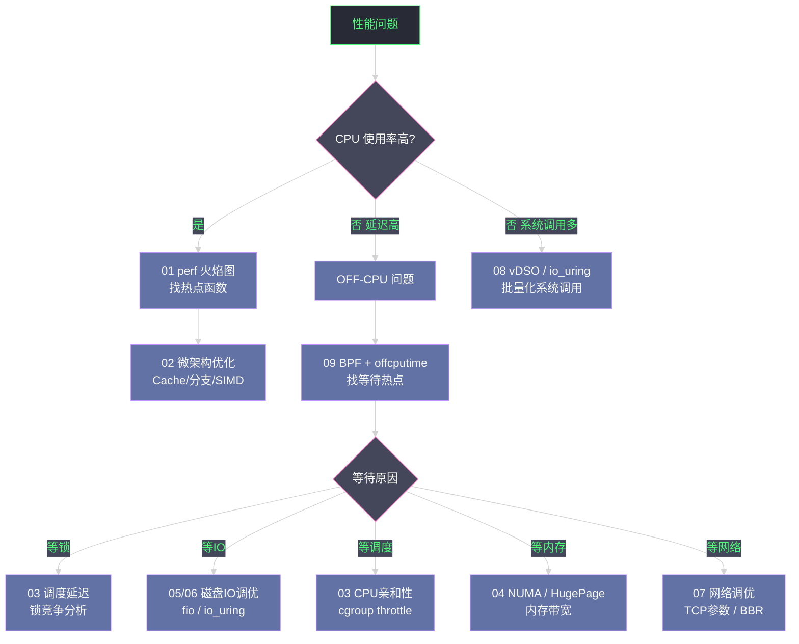

**摘要：**

前九篇文章分别深入了 CPU、内存、IO、网络、系统调用各个维度的性能分析工具和调优手段。但真实的生产问题从来不会贴标签告诉你"这是 CPU 问题"或"这是 IO 问题"——你收到的是一个含糊的告警："P99 延迟从 10ms 升到 200ms"，或者"吞吐量突然下降 50%"。本文通过三个来自真实生产场景的案例，展示如何将本专栏的所有工具和方法论组合成一条完整的**诊断链路**：从告警的第一反应、分层排查假设、工具选择与执行，到最终定位根因并验证修复效果。这不是一个线性的"按步骤操作"指南，而是一个**思维过程的展示**——为什么在某个节点选择这个工具而不是那个，为什么某个假设被否定，如何在信息不完整时推进诊断。

---

## 第 1 章 诊断方法论：在开始之前

### 1.1 USE 方法论回顾

Brendan Gregg 的 **USE（Utilization-Saturation-Errors）** 方法论提供了一个系统性的检查清单——对每一个资源（CPU、内存、磁盘、网络），依次检查：

- **Utilization（利用率）**：资源当前使用了多少（如 CPU 80%）
- **Saturation（饱和度）**：是否有任务在等待该资源（如 Run Queue 长度、IO 等待队列深度）
- **Errors（错误）**：是否有错误发生（如网络丢包、磁盘 IO 错误）

```bash
# 一次性获取所有关键资源的 USE 指标
# CPU：利用率 + 运行队列
mpstat 1 5                          # 利用率（%idle 越高越好）
vmstat 1 5                          # r 列 = 运行队列（> CPU 数 = 饱和）

# 内存：利用率 + swap
free -h                             # Used/Total
vmstat 1 5                          # si/so 列（swap in/out > 0 = 内存饱和）

# 磁盘：利用率 + 等待
iostat -x 1 5                       # %util（利用率）、aqu-sz（等待队列）、await（等待延迟）

# 网络：利用率 + 错误
sar -n DEV 1 5                      # rxkB/s、txkB/s vs 网卡速度
netstat -s | grep -i "error\|drop"  # 网络错误和丢包
ss -s                               # 连接状态统计
```

### 1.2 诊断原则

**原则 1：先测量，后假设**。不要在没有数据的情况下猜测根因，也不要在没有验证效果的情况下宣布问题解决。每一步调优都要有前后的量化对比。

**原则 2：由粗到细，分层递进**。先用高层指标（CPU/内存/IO/网络的整体利用率）确定问题所在的子系统，再用专项工具深入。避免在问题可能是 IO 的时候去深入分析 CPU。

**原则 3：区分 ON-CPU 和 OFF-CPU**。CPU 利用率不高但延迟高，几乎可以确定是 OFF-CPU 问题（等待某种资源）。高 CPU 利用率 + 高延迟，才是 ON-CPU 热点问题。

**原则 4：工具选择的开销意识**。生产环境下，先用低开销工具（`vmstat`、`iostat`、`ss`），再用中等开销工具（`perf stat`、`bpftrace`），谨慎使用高开销工具（`strace`）。

---

## 第 2 章 案例一：Java 微服务 P99 延迟毛刺

### 2.1 问题描述与初步观察

**现象**：Kubernetes 中的 Java 微服务（Spring Boot + gRPC），平均响应时间 5ms，但 P99 延迟突然从 15ms 升到 350ms，且具有周期性（大约每 5-10 分钟出现一次毛刺，持续 1-2 秒后恢复）。服务 CPU 使用率约 40%，内存使用率约 60%，表面上"正常"。

**第一反应：排除网络和基础设施问题**

```bash
# 1. 确认毛刺是服务本身还是外部依赖
# 在服务侧和客户端侧同时打点，对比两侧看到的延迟
# 若服务侧看到的延迟也高 → 问题在服务内部
# 若只有客户端侧延迟高 → 问题在网络传输层

# 2. 排除下游依赖（数据库、Redis 等）的延迟贡献
grep "db.query.duration" /var/log/app.log | awk '{print $NF}' | sort -n | \
    awk 'END{print "P99:", int(NR*0.99)"th:", $(int(NR*0.99))}'
# 若下游 P99 < 2ms，说明下游不是问题来源

# 3. 检查 GC 日志中 STW 暂停时间
grep "Pause" /var/log/gc.log | awk '{print $NF}' | sort -n | tail -20
# 若最大 STW < 50ms，说明 GC 不是主要原因（但可能是次要原因）
```

**诊断步骤：cgroup CPU Throttling 定位**

```bash
# 检查 Pod 的 cgroup CPU throttle 状态
kubectl exec <pod> -- cat /sys/fs/cgroup/cpu/cpu.stat
# nr_periods     12345
# nr_throttled   1234    ← ！！有 throttle 计数
# throttled_time 12345678901234

# 计算 throttle 比例
python3 -c "print(round(1234/12345*100, 1), '% throttled')"
# 10.0% throttled  ← 每 10 个 100ms 周期就有 1 个被暂停

# 读取 CPU limit 配置
kubectl exec <pod> -- cat /sys/fs/cgroup/cpu/cpu.cfs_quota_us
# 50000  ← 50ms/100ms = 0.5 核

# 实时监控：毛刺时 nr_throttled 是否突增
kubectl exec <pod> -- bash -c "
prev=0
while true; do
    cur=\$(cat /sys/fs/cgroup/cpu/cpu.stat | grep nr_throttled | awk '{print \$2}')
    echo \"\$(date): throttled=\$cur delta=\$((cur-prev))\"
    prev=\$cur
    sleep 1
done"
# 观察：在 P99 毛刺出现时，delta 值是否突然增大
# 若确认毛刺时间与 throttle 增长时间高度吻合 → cgroup throttling 是主因
```

**诊断步骤：叠加 GC 分析**

```bash
# 启用 GC 详细日志（如未启用）
java -Xlog:gc*:file=/var/log/gc.log:time,level,tags -jar app.jar

# 分析 GC 暂停与 P99 毛刺的时间相关性
grep "Pause Full\|Pause Young\|Pause Old" /var/log/gc.log | \
    awk '{print $1, $NF}' | sort -t'[' -k2 -n | tail -50
# 若发现 Pause Full GC > 100ms 出现在毛刺时间点附近 → GC 是次要原因
```

**根因总结**：两个原因叠加——cgroup CPU throttling（主因，10% 的周期被暂停 80ms）+ Full GC STW（次因，偶发 100-200ms 暂停）。两者偶尔叠加导致 P99 峰值 350ms。

**修复方案与效果验证**：

```yaml
# 修复 1：提高 CPU limit，减少 throttling 频率
resources:
  requests:
    cpu: "500m"
  limits:
    cpu: "2000m"    # 允许突发到 2 核

# 修复 2：切换到低暂停 GC（ZGC 或 G1GC 调优）
# java -XX:+UseZGC -Xmx4g -Xms4g -jar app.jar
# ZGC 的 STW 暂停 < 1ms（几乎可以忽略）
```

```bash
# 验证：修复后重新观察 throttle 比例和 P99
kubectl exec <pod> -- cat /sys/fs/cgroup/cpu/cpu.stat
# nr_throttled   12   ← 从 1234 降到 12，减少 100 倍！

# P99 监控（Grafana/Prometheus）：
# 修复前：P99 = 350ms（峰值）
# 修复后：P99 = 18ms（稳定）
```

---

## 第 3 章 案例二：MySQL 查询突然变慢

### 3.1 问题描述

**现象**：MySQL 数据库服务器，某天下午 2 点开始，原本 P99 = 5ms 的查询变成 P99 = 500ms，但 CPU 使用率只有 15%，内存充足，看起来数据库本身很空闲。这是最典型的"CPU 闲，但服务慢"场景。

### 3.2 分层诊断过程

**第一层：系统资源全局检查**

```bash
# CPU + 内存 + IO + 网络 全局快照
vmstat 1 5
# procs -----------memory---------- ---swap-- -----io---- -system-- ------cpu-----
#  r  b   swpd   free   buff  cache   si   so    bi    bo   in   cs us sy id wa st
#  2  4   1234 123456  23456 456789    0    0   456  1234  234  567 15  3 42 40  0
#          ↑b=4  等待IO的进程数             ↑bo=1234 磁盘写出量   ↑wa=40% IO等待！

# 关键发现：wa（IO Wait）= 40%，说明 CPU 有大量时间在等待 IO
# b（blocked 进程数）= 4，有进程阻塞在 IO 等待
```

**第二层：磁盘 IO 详细分析**

```bash
# 确认是哪块磁盘、什么类型的 IO
iostat -x 1 5
# Device   r/s   w/s  rkB/s  wkB/s   r_await  w_await  aqu-sz  %util
# nvme0n1  4567   234  73456   3789     0.09     0.12     1.23    45.6  ← r_await 正常
# sdb       456   123   7234    234    89.45    45.67    34.56    98.7  ← ！！sdb 高延迟高利用率！

# sdb 的 r_await = 89ms（远超正常 HDD 的 5-15ms），%util = 98.7%（接近饱和）
# 但 nvme0n1 是 MySQL 数据目录，为什么 sdb 会有影响？

# 检查 sdb 挂载的是什么
df -h | grep sdb
# /dev/sdb1   2.0T   1.9T   50G  97%  /var/log  ← MySQL 日志目录！

# 磁盘空间快满了！/var/log 目录 97% 使用率
```

**第三层：定位 IO 来源**

```bash
# 谁在对 sdb 产生大量 IO
iotop -o
# Total DISK READ: 45.67 M/s | Total DISK WRITE: 890.12 M/s  ← 大量写入！
# PID    PRIO  USER     DISK READ  DISK WRITE  SWAPIN     IO>    COMMAND
# 1234   be/4  mysql         0     890.12 M/s   0.00%  96.78%   mysqld

# mysqld 自身产生了 890MB/s 的写入到 sdb（/var/log）
# 这是 MySQL 的 general_log 或 slow_query_log 被意外开启了！

# 验证：检查 MySQL 日志配置
mysql -e "SHOW VARIABLES LIKE '%log%'"
# general_log         ON    ← ！！general_log 被开启了！
# general_log_file    /var/log/mysql/general.log
# slow_query_log      ON
# slow_query_log_file /var/log/mysql/slow.log
# long_query_time     0.0   ← ！！记录所有查询（包括 0ms 的）

# 这就是根因：有人将 general_log 和 slow_query_log 都开启了，
# 且 long_query_time=0 导致每条查询都被写入日志
# 生产负载下每秒数万条查询，每条日志 ~200 字节 → 890 MB/s 的日志写入！
# /var/log 磁盘（HDD）被打满，所有 IO 请求排队，延迟飙升到 89ms
```

**修复方案与预防**：

```bash
# 立即修复：关闭 general_log
mysql -e "SET GLOBAL general_log = 'OFF';"
mysql -e "SET GLOBAL slow_query_log = 'OFF';"
# 或者调整 long_query_time
mysql -e "SET GLOBAL long_query_time = 1.0;"  # 只记录超过 1 秒的慢查询

# 验证修复效果
iostat -x 1 3
# Device   r/s   w/s  rkB/s  wkB/s  r_await  w_await  aqu-sz  %util
# sdb       12     8    123     89     5.23     4.56     0.12     8.9   ← 恢复正常！

# MySQL P99 延迟从 500ms 恢复到 4ms

# 根本预防：
# 1. 在 /etc/mysql/my.cnf 中明确配置 general_log = 0
# 2. 对 general_log 的开关设置变更审计（binlog 或 MySQL audit plugin）
# 3. 对 /var/log 磁盘添加告警（磁盘使用率 > 80% 告警）
# 4. 将 MySQL 日志目录与数据目录分离到不同磁盘（避免相互影响）
```

---

## 第 4 章 案例三：Nginx 高并发场景吞吐量瓶颈

### 4.1 问题描述

**现象**：一台 32 核的 Nginx 反向代理服务器，处理静态文件请求（平均文件大小 50KB）。压测时，QPS 在 5 万时延迟正常（P99 = 3ms），但继续增压到 6 万 QPS 时，延迟急剧升高（P99 = 2000ms），CPU 使用率只有 40%，网络带宽只用了 60%。这说明有某个非 CPU、非网络带宽的资源成为了瓶颈。

### 4.2 诊断过程

**第一层：确认瓶颈不在 CPU 和网络**

```bash
# CPU 40% 利用率，还有大量余量
mpstat 1 5 | grep "Average:"
# Average:  all    8.45   0.00  12.34    0.23   0.00    0.00   39.02   0.00   39.96

# 网络带宽 60% 利用率（10GbE，6Gbps）
sar -n DEV 1 5 | grep eth0
# eth0    txkB/s: 720000   ← 约 5.76 Gbps，60% 的 10GbE 带宽

# IO 等待几乎为零（静态文件全在 Page Cache 中）
vmstat 1 5 | awk '{print "wa:", $16}'
# wa: 1  ← IO 等待 1%，不是 IO 瓶颈
```

**第二层：检查连接和 Socket 状态**

```bash
# 查看连接状态分布
ss -s
# Total: 1234567
# TCP:   987654 (estab 567890, closed 234567, orphaned 12345, timewait 234567)
#
# Transport Total    IP       IPv6
# RAW       0        0        0
# UDP       123      123      0
# TCP       987654   987654   0
#
# TIME_WAIT 连接数：234567  ← ！！23 万个 TIME_WAIT 连接！

# 检查本地端口是否耗尽
ss -s | grep "closed"
# 确认端口使用范围
cat /proc/sys/net/ipv4/ip_local_port_range
# 32768 60999  ← 只有约 28000 个端口可用

# TIME_WAIT 连接数（234567）远超可用端口数（28000）
# 说明：新连接建立时频繁遇到端口耗尽的情况 → 连接建立超时 → P99 飙升！
```

**第三层：定位 TIME_WAIT 来源**

```bash
# TIME_WAIT 是由"主动关闭连接的一方"进入的
# Nginx 作为反向代理，连接分两段：
# 1. 客户端 → Nginx（客户端发起，短连接时 Nginx 主动关闭 → Nginx 进入 TIME_WAIT）
# 2. Nginx → 后端服务（Nginx 发起连接，若 Nginx 主动关闭 → Nginx 进入 TIME_WAIT）

# 检查哪端（客户端侧还是后端侧）的 TIME_WAIT 更多
ss -ant state time-wait | awk '{print $4}' | cut -d: -f1 | sort | uniq -c | sort -rn | head -5
# 98765  10.0.0.1   ← 客户端 IP（来自负载均衡器）的 TIME_WAIT 最多
# 56789  10.0.0.2   ← 后端服务 IP
#
# 说明：Nginx 与后端之间大量 TIME_WAIT，Nginx 对后端连接使用短连接策略

# 确认 Nginx upstream 配置
grep -A 10 "upstream" /etc/nginx/nginx.conf
# upstream backend {
#     server 10.0.0.100:8080;
#     keepalive 0;    ← ！！keepalive = 0，与后端完全使用短连接！
# }
```

**根因总结**：Nginx 到后端服务之间没有启用连接复用（`keepalive = 0`），每次请求都建立新的 TCP 连接。高并发时，大量 TIME_WAIT 连接耗尽本地端口，新连接建立失败或超时，导致 P99 飙升。

**修复方案**：

```nginx
# 修复 1：启用 Nginx upstream keepalive（复用连接，减少 TIME_WAIT）
upstream backend {
    server 10.0.0.100:8080;
    keepalive 256;          # 与后端保持最多 256 个空闲长连接
    keepalive_requests 1000;  # 每个连接最多复用 1000 次
    keepalive_timeout 65;   # 空闲超时 65 秒
}

server {
    location / {
        proxy_pass http://backend;
        proxy_http_version 1.1;            # 必须 HTTP/1.1
        proxy_set_header Connection "";    # 清除 Connection: close 头
    }
}
```

```bash
# 修复 2：同时调整 sysctl 参数
sysctl -w net.ipv4.tcp_tw_reuse=1         # 允许 TIME_WAIT 端口复用
sysctl -w net.ipv4.ip_local_port_range="1024 65535"  # 扩大端口范围

# 验证修复效果
ss -s | grep "timewait"
# 修复前：timewait 234567
# 修复后：timewait 1234   ← 降低 99%！

# 重新压测：6 万 QPS 时 P99 = 3ms（与 5 万 QPS 时相同，瓶颈消除）
```

---

## 第 5 章 诊断工具速查表

### 5.1 按症状选择工具

| 症状 | 第一工具 | 深入工具 |
|-----|---------|---------|
| CPU 使用率高 | `top`/`mpstat` | `perf record` + 火焰图 |
| P99 高但 CPU 不高 | `offcputime` | `bpftrace` 锁/IO 追踪 |
| IO 等待高 | `iostat -x` | `biolatency`/`blktrace` |
| 内存不足 / OOM | `free`/`dmesg` | `/proc/<pid>/smaps` |
| 网络延迟高 | `ss -ti`/`ping` | `tcptop`/`tcpretrans` |
| 磁盘写满 | `df -h` | `iotop`/`lsof` |
| 连接数耗尽 | `ss -s` | `ss -ant state time-wait` |
| cgroup throttle | `cpu.stat` | `bpftrace` 调度追踪 |
| 内存碎片 | `/proc/buddyinfo` | `numastat` |
| NIC 丢包 | `ethtool -S` | `softnet_stat` |

### 5.2 诊断命令一键检查脚本

```bash
#!/bin/bash
# perf_check.sh：30 秒全局性能快照

echo "=== 1. 系统基础 ==="
uname -r; uptime; nproc

echo "=== 2. CPU ==="
mpstat 1 3 | tail -2

echo "=== 3. 内存 ==="
free -h
grep -E "SwapTotal|SwapFree|MemAvailable" /proc/meminfo

echo "=== 4. IO ==="
iostat -x 1 3 | grep -v "^$\|^Linux"

echo "=== 5. 网络 ==="
ss -s
ethtool -S eth0 2>/dev/null | grep -E "rx_missed|drop|error" | grep -v " 0$"

echo "=== 6. 进程 TOP ==="
ps aux --sort=-%cpu | head -10

echo "=== 7. 内核消息 ==="
dmesg | tail -20 | grep -i "error\|warning\|killed\|oom"

echo "=== 8. cgroup throttle（当前进程）==="
cat /sys/fs/cgroup/cpu/cpu.stat 2>/dev/null

echo "=== 完成 ==="
```

---

## 第 6 章 专栏总结：构建完整的性能知识体系

### 6.1 各篇文章的定位与协同

本专栏的 10 篇文章构成了一个完整的**横向整合**知识体系，填补了各子系统专栏（进程管理、内存管理、文件系统、网络协议栈）在"调优视角"上的空白：



### 6.2 性能调优的三个层次

**层次 1：系统调参（无需修改代码）**

这是最快捷的优化，通过 `sysctl`、`ethtool`、内核启动参数和 cgroup 配置，调整系统行为以匹配工作负载特征。效果立竿见影，但受限于应用的访问模式无法根本改变。本专栏的 03、04、07 篇主要覆盖此层次。

**层次 2：应用配置调优（修改配置，无需改代码）**

调整应用程序的运行时配置（JVM 参数、数据库 buffer pool 大小、连接池配置、IO 模式选择）。这一层次的改动需要重启服务，但通常有更大的性能提升空间。本专栏的 04、05、06 篇覆盖此层次。

**层次 3：代码级优化（需要修改和重新部署代码）**

针对微架构（缓存友好数据布局、消除分支预测失效、SIMD 向量化）、系统调用批量化（`io_uring`、`writev`）的代码改动。这一层次成本最高，但效果也最彻底。本专栏的 02、08 篇主要覆盖此层次。

**调优顺序建议**：先做层次 1（系统调参，成本最低），确认效果后再考虑层次 2（应用配置），必要时才进行层次 3（代码修改）。

### 6.3 知识图谱连接

本专栏与 Linux 其他专栏形成了紧密的**双向链接**——相互补充，构建完整的 Linux 性能知识体系：

- **[[进程管理]]** 专栏的调度器篇（CFS 原理）为本专栏的 [[03 CPU 调度延迟]] 提供了内核实现基础
- **[[内存管理]]** 专栏的虚拟内存、Page Cache、HugePage 篇为本专栏的 [[04 内存性能调优]] 提供了底层机制
- **[[文件系统]]** 专栏的块设备栈、IO 调度器篇与本专栏的 [[05 磁盘 IO 性能调优]] 深度互补
- **[[网络协议栈与IO]]** 专栏的 TCP/epoll/零拷贝篇与本专栏的 [[07 网络性能调优]] 形成横向整合
- **[[网络协议栈与IO/10 网络性能诊断]]** 与本专栏的 [[09 全栈性能诊断]] 共同构成完整的诊断工具链

至此，Linux 系统性能调优专栏完结。从 CPU 的单个时钟周期（微架构优化），到 OS 调度延迟（毫秒级），到跨子系统的全链路诊断（BPF + OFF-CPU）——希望这条从微观到宏观的完整链路，成为你面对任何性能问题时的可靠参考。

---

> [!note] 思考题
> 1. USE 方法从资源视角出发（CPU/Memory/Disk/Network 的利用率、饱和度、错误），RED 方法从服务视角出发（Rate、Errors、Duration）。在微服务架构中，你如何结合两种方法？当 RED 指标显示延迟升高但 USE 指标显示所有资源利用率正常时，瓶颈可能在哪里？
> 2. 99.9 分位延迟突增但平均延迟正常——这类尾延迟问题无法通过重现排查。你如何设计 always-on 的观测体系？持续采集 perf 数据的存储成本如何控制？eBPF 的'事件触发采样'（只在延迟超过阈值时记录调用栈）相比 perf 的周期性采样有什么优势？
> 3. 容器内 `top`/`free`/`iostat` 显示的是宿主机数据。在 K8s 集群中，`cAdvisor` 提供容器级 CPU/内存/IO 指标。但 cAdvisor 的采集粒度（默认 15 秒）是否足够捕捉短暂的性能毛刺？`nsenter` 进入容器 namespace 执行宿主机工具是否更精确？
