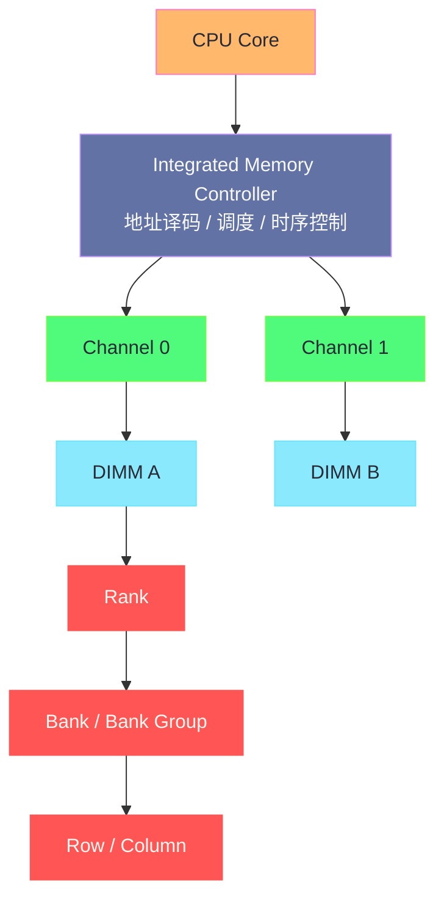
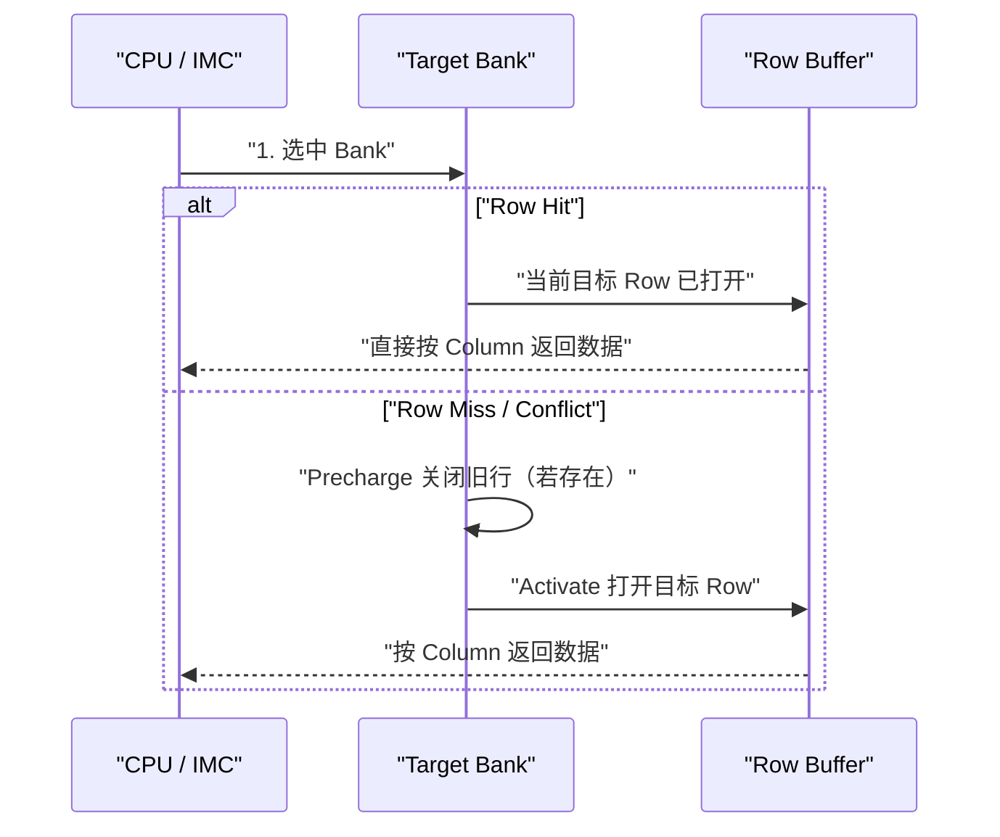

**摘要：**

很多工程师第一次接触内存性能问题时，注意力会本能地落在 `numactl`、[[HugePage]]、[[TLB]]、[[Page Cache]] 或者 `perf stat` 上。这当然没有错，但如果你不知道一条内存访问在硬件里究竟会穿过哪些层级，那么很多现象只能“会调不会解释”。为什么同样是 256GB 内存，有的机器吞吐明显更高？为什么插满内存条以后容量上去了，延迟反而变差？为什么某些负载几乎不吃 CPU，却依然跑不满？答案往往不在页表和系统调用，而在更下面的硬件组织：**CPU 内存控制器如何把地址分配到 Channel、DIMM、Rank、Bank、Row 与 Column 上，DRAM 又如何用行缓冲区完成一次真正的读取**。本文的目标不是把你训练成 DRAM 芯片设计工程师，而是帮你建立一套足够精确的工程心智模型：看懂内存条不再只看容量和频率，而是能把 **DIMM 数量、通道数、Rank 数、Bank 并发能力、Row Buffer 命中率** 与 Linux 世界里的延迟、带宽、NUMA 和调优动作连接起来。

---

## 第 1 章 为什么 Linux 性能工程师必须补这一课

### 1.1 “内存很多”不等于“内存很快”

在不少团队里，内存经常被当作一种“只要够大就行”的资源。

磁盘慢，大家会想到 SSD、NVMe、队列深度。

网络慢，大家会想到 RTT、拥塞控制、队列和软中断。

CPU 慢，大家会想到 [[02 CPU 微架构优化——Cache Miss、分支预测与 SIMD|Cache Miss、分支预测、SIMD]]。

但一说到内存，最常见的话术往往只有三句：

1. 机器内存够不够。
2. 有没有跨 [[NUMA]]。
3. 要不要开大页。

这三句都重要，但它们都默认了一件事：你已经知道“内存”这个词背后究竟是什么。

可惜很多时候，这个前提并不成立。

在硬件层，所谓“内存”根本不是一块均匀、单一、可以常数时间访问的大平面。

它是一个层层展开的结构：

1. CPU 上有 **Integrated Memory Controller（IMC，集成内存控制器）**。
2. IMC 下挂着若干 **Channel（通道）**。
3. 每个通道上插着一条或多条 **DIMM**。
4. 每条 DIMM 内部又被组织成一个或多个 **Rank**。
5. 每颗 DRAM 芯片内部还有多个 **Bank / Bank Group**。
6. 每个 Bank 里真正被激活的是某一整行，也就是 **Row**。

你在代码里写下的一次普通 load 指令，最终会被翻译成对某个 Channel、某个 DIMM、某个 Rank、某个 Bank、某一行列位置的访问。

如果把这些层级全都抹掉，只说“访问了一次内存”，那和只说“发了一次网络请求”没有本质区别。

### 1.2 为什么这件事在 Linux 下格外重要

有人会说，应用开发又不直接操作 Bank，知道这些是不是过度学习。

不是。

因为 Linux 世界里很多“看起来像软件问题”的性能现象，本质上都和硬件组织方式直接相关。

例如：

- 你看到 `perf stat` 里 `LLC-load-misses` 很高，但 CPU 占用并不高。
- 你看到两台规格接近的服务器，单核逻辑完全相同，吞吐差出 20%。
- 你看到某个 OLAP 查询在扩 CPU 核数后收益很差，最后发现瓶颈根本不是算力，而是内存通道。
- 你看到一台机器插满了内存条以后，频率从 DDR5-5600 自动降到了 DDR5-4400。
- 你看到业务明明没有跨 [[NUMA]]，却仍然出现了明显的内存延迟抖动。

这些问题都说明了一点：

> [!info] 核心概念
> 对 Linux 性能工程师来说，内存不是“一个容量指标”，而是“一个受拓扑、并发、时序共同约束的硬件子系统”。

### 1.3 本文的边界

本文只做一件事：建立“**从 DIMM 到 Row 的硬件寻址心智模型**”。

它不会重复 [[Linux/内存管理/01 虚拟内存：为什么每个进程都以为自己独占内存|虚拟内存]] 和 [[Linux/内存管理/02 物理内存管理：Buddy System 与 Slab 分配器的设计哲学|物理内存管理]] 里关于页表、伙伴系统、Slab 的内核实现。

也不会把重点放到 [[Linux/性能优化/04 内存性能调优——NUMA 拓扑、大页与内存带宽|NUMA、大页和内存带宽调优]] 的工具实践上。

本文解决的是更早一步的问题：

1. 一根内存条到底是什么。
2. 一个“通道”到底意味着什么。
3. Rank 和 Bank 为什么都能带来并发，但它们不是一回事。
4. 为什么 **Row Buffer** 才是理解 DRAM 延迟的钥匙。
5. 为什么 Linux 工程师即使不写驱动，也必须理解这些硬件层级。

### 1.4 本文阅读方式

如果你对这些概念完全陌生，建议按顺序读。

如果你已经知道 Channel 和 DIMM 的字面意思，但总分不清 Rank、Bank、Row 的关系，可以重点看第 3、4、5 章。

如果你最终目的是排查线上问题，第 6、7、8 章最贴近实战。

---

## 第 2 章 从主板和 CPU 的视角看“内存”到底挂在哪里

### 2.1 先忘掉内存条，先看 CPU

很多人理解内存系统时，第一反应是去看主板上插了几根条子。

这个顺序其实不够好。

因为从系统性能的角度，真正决定访问路径起点的不是内存条，而是 **CPU 的内存控制器**。

在现代服务器上，内存控制器已经不在北桥里了，而是直接集成在 CPU 封装内部。

这意味着：

1. CPU 发起访存请求时，不再先穿过一个外置芯片组。
2. CPU 内部就已经知道地址该发往哪个内存通道。
3. 每个 CPU Socket 都拥有自己的本地内存控制器和本地通道。

这也是 [[NUMA]] 架构成立的前提。

以前的 UMA 时代，多颗 CPU 通过共享总线访问同一片内存，所有核到内存的距离大致一致。

现在的服务器则是：

- Socket 0 管理自己的 Channel 0~N。
- Socket 1 管理自己的 Channel 0~N。
- 当 Socket 0 访问挂在 Socket 1 上的内存时，需要通过 UPI / Infinity Fabric 等互联链路转发。

所以你看到的“远端内存慢”，本质上并不神秘。

它只是说明：**那次地址请求并没有命中当前 CPU 直接负责的通道，而是被转发到了另一个内存控制器。**

### 2.2 一个直观但不精确的全景图



这个图有两个关键含义。

第一，Channel 不是“软件抽象”，而是真实存在的硬件数据通路。

第二，DIMM 只是物理模块，真正决定一次访存落点的还要继续往下拆。

### 2.3 Channel：为什么通道数几乎等于理论带宽的天花板

**Channel（内存通道）** 可以理解成内存控制器和外部 DRAM 模块之间的一条独立数据通路。

在 DDR 系统里，单个通道典型的数据总线宽度是 64 bit。

如果带 ECC，则物理上可能是 72 bit，其中 64 bit 传输数据，额外 8 bit 用于校验。

这里最容易误解的一点是：

**通道不是容量单位，而是并发带宽单位。**

举例来说：

- 双通道不意味着容量一定翻倍。
- 双通道意味着内存控制器每个时钟周期可以并行地在两条独立链路上搬运更多数据。

这也是为什么装机领域常说“单条 32GB 和两条 16GB 容量一样，但后者通常更快”。

因为两条 16GB 更有机会占满两个 Channel。

### 2.4 Channel 为什么不直接等于真实吞吐

通道数决定了理论上限，但不保证你一定能跑满。

原因至少有四个：

1. 你的访问模式可能不够并行。
2. 请求可能集中命中同一条通道。
3. 上层缓存命中率可能已经很高，根本没有那么多 DRAM 流量。
4. 处理器本身的发射、乱序窗口、预取器能力也会成为限制。

所以正确表述不是“多通道一定更快”，而是：

> [!note] 设计哲学
> 通道数决定了 DRAM 子系统的**供给能力上限**，而应用的访问模式决定了你能否把这部分供给真正消费掉。

### 2.5 一条通道可以插几根条子：DPC 的工程含义

在服务器 BIOS 或厂商规格表里，你经常会看到一个词：**DPC（DIMMs Per Channel）**。

它表示一条通道上挂了几根 DIMM。

常见情况有：

- 1DPC：每通道 1 根条子。
- 2DPC：每通道 2 根条子。

这件事为什么重要。

因为更多 DIMM 挂在同一通道上，会增加电气负载和信号完整性压力。

结果通常是：

1. 内存控制器需要更保守的训练参数。
2. 支持的最高频率下降。
3. 延迟可能上升。

也就是说，**容量扩展** 和 **频率保持** 往往不能同时拿满。

你把机器内存从 8 条扩到 16 条，容量翻倍了，但频率从 5600 MT/s 降到了 4400 MT/s，这在服务器上是非常常见的事情。

如果你不理解 DPC，只会觉得“怎么加了内存条反而变慢了”。

### 2.6 Linux 工程师在这里应该记住什么

到这一节为止，你至少应该记住三句话：

1. 内存访问首先受 CPU 内存控制器管理，而不是先从“内存条”开始。
2. Channel 是真实的并发数据通路，它更接近带宽天花板，而不是容量单位。
3. 每通道挂更多 DIMM 往往能扩容量，但可能牺牲频率和时延。

---

## 第 3 章 DIMM 不只是“内存条”，它是一种封装和组织方式

### 3.1 DIMM 的字面意思和真正含义

DIMM 全称是 **Dual Inline Memory Module**。

直译是“双列直插式内存模块”。

这个定义当然正确，但对性能分析几乎没有帮助。

对 Linux 工程师更有用的理解是：

**DIMM 是把多颗 DRAM 芯片按照特定位宽、容量和电气规则组织起来，再通过标准接口暴露给内存控制器的一个物理模块。**

它不是一颗芯片。

它是很多颗芯片的组合体。

这件事非常关键。

因为后面我们会看到，**Rank 的边界不是由“这根条子”决定的，而是由“这一组芯片能不能一起提供 64 bit 数据”决定的。**

### 3.2 一根 DIMM 上到底有什么

从物理上看，一根服务器内存条通常会有：

1. 若干 DRAM 芯片。
2. SPD EEPROM，用来保存型号、频率、时序、电压等信息。
3. 对于 RDIMM / LRDIMM，还会有寄存 / 缓冲相关器件。
4. 金手指接口，与主板插槽连接。

`dmidecode --type memory` 里看到的容量、速度、厂商信息，很多就来自 SPD 和固件枚举。

但 SPD 只能告诉你“这根条子的外部属性”，它不能自动帮你建立内部组织模型。

### 3.3 为什么服务器里常见 RDIMM、LRDIMM，而桌面机更常见 UDIMM

这个问题如果只从“兼容性”回答，会过于表面。

真正的根因在于**电气负载和可扩展性**。

| 类型 | 核心特征 | 优点 | 代价 | 常见场景 |
|------|----------|------|------|----------|
| UDIMM | 控制器直接驱动 DRAM 芯片 | 延迟较低，结构简单 | 可挂载容量有限 | 台式机、轻载工作站 |
| RDIMM | 地址/命令信号通过寄存器缓冲 | 更适合大容量、多条插满 | 增加少量延迟 | 主流服务器 |
| LRDIMM | 进一步缓冲数据相关负载 | 支持更高容量密度 | 成本更高、时延略增 | 超大内存服务器 |

为什么要有这些中间层。

因为随着 DIMM 上芯片数增加、每通道 DIMM 数增加，控制器直接驱动所有信号会越来越难。

寄存和缓冲的本质，不是“厂商为了多卖钱加了个芯片”，而是为了让高容量系统在电气上还能稳定工作。

### 3.4 DIMM 的容量是怎么来的

一根 DIMM 的容量，本质上由三个因素决定：

1. 每颗 DRAM 芯片的容量。
2. 芯片颗数。
3. 模块被组织成几个 Rank。

例如，一根 32GB RDIMM 可能由若干颗 x4 或 x8 颗粒构成。

其中的 x4 / x8 说的是**单颗 DRAM 芯片一次能输出多少位数据**。

这就引出了下一个经常被混淆的问题：

**颗粒位宽** 和 **Rank** 不是一回事。

### 3.5 x4 / x8 / x16 和 Rank 的关系

假设内存控制器想一次读出标准通道宽度所需的数据。

如果单颗芯片只能提供 x8，也就是 8 bit，那么需要 8 颗芯片同时工作，才能凑成 64 bit 数据通路。

如果单颗芯片是 x4，那么就需要 16 颗芯片一起工作。

这些“一起响应、一起组成一个完整 64 bit 宽度”的芯片集合，才更接近 Rank 的本质。

所以：

- x4 / x8 描述的是**单颗 DRAM 芯片的 I/O 位宽**。
- Rank 描述的是**作为一个整体同时响应的芯片集合**。

这一层如果没搞清楚，后面看 Rank 就会很别扭。

### 3.6 为什么“内存条正反两面都有颗粒”不等于双 Rank

这是最常见的误区之一。

很多人会用肉眼看内存条：

- 两面都有芯片，觉得一定是双 Rank。
- 只有一面有芯片，觉得一定是单 Rank。

这并不可靠。

因为：

1. 一面还是两面只是物理摆放方式。
2. Rank 是控制器可见的逻辑组织。
3. 某些高密度芯片完全可能让单面条做成双 Rank。
4. 某些封装方式也可能让双面外观不对应逻辑 Rank 数。

工程上，应该相信 `dmidecode`、厂商规格表、SPD 解码结果，而不是靠肉眼判断。

> [!warning] 生产避坑
> 不要把“单面 / 双面内存”当成 Rank 的判断标准。外观是机械排布，Rank 是逻辑分组。两者经常相关，但不是同义词。

---

## 第 4 章 Rank：为什么它是介于 DIMM 和 Bank 之间的关键层

### 4.1 Rank 到底是什么

**Rank** 可以理解为：在某个时刻，由内存控制器同时选通、共同提供一整条数据总线宽度的一组 DRAM 芯片。

这一定义里有三个关键词：

1. **同时选通**。
2. **共同工作**。
3. **组成完整数据宽度**。

如果把 DIMM 想象成一栋楼，那么 Rank 不是一间房，而是“这一层里会一起开门的一组房间”。

控制器不会同时让同一 DIMM 上所有芯片都在一个访问周期里无差别响应。

它会先选中某个 Rank，再在这个 Rank 内继续选择 Bank、Row、Column。

### 4.2 为什么要有多个 Rank

一个很自然的问题是：既然有 DIMM 了，为什么不直接在 DIMM 内继续选 Bank。

原因在于两个维度：

1. **容量扩展**。
2. **并发隐藏**。

容量扩展比较好理解。

如果一组芯片已经凑够 64 bit 数据宽度，但容量还不够，那再加一组芯片，做成第二个 Rank，就能在不增加通道数的前提下提升单条 DIMM 容量。

更重要的是第二点：并发隐藏。

DRAM 不是一个可以零代价随机访问的介质。

一次访问可能涉及：

1. 预充电（Precharge）。
2. 行激活（Activate）。
3. 列访问（Read / Write）。

当一个 Rank 内的某些 Bank 正在忙时，控制器可以在调度层面穿插到另一个 Rank 上工作。

这就是所谓 **Rank Interleaving（Rank 交错）** 的价值所在。

它不是把延迟消灭了，而是通过交错调度**隐藏了一部分等待时间**。

### 4.3 单 Rank、双 Rank、四 Rank 的工程含义

常见 DIMM 可能是：

- 1R：单 Rank。
- 2R：双 Rank。
- 4R：四 Rank。

这里最容易产生的误解是：

“Rank 越多越好。”

这不对。

更准确的说法是：

1. Rank 增加通常有助于提升并发和容量。
2. 但 Rank 增加也会带来更高的电气复杂度。
3. 当每通道 DIMM 很多、每 DIMM Rank 又很多时，控制器可能需要降低支持频率。

所以 Rank 数的价值是**在一定范围内增加调度弹性**，不是无限制堆叠的纯收益。

### 4.4 Rank 和 Channel 的区别到底在哪里

这两个词经常被一起提到，因为它们都和并发相关。

但它们解决的问题完全不同。

| 维度 | Channel | Rank |
|------|---------|------|
| 位置 | IMC 到 DIMM 的外部链路 | DIMM 内部的逻辑分组 |
| 主要作用 | 增加独立数据通路 | 增加调度与交错空间 |
| 对带宽影响 | 更直接、更接近理论线性扩展 | 间接，通过更好隐藏等待提升有效利用率 |
| 对容量影响 | 取决于是否插满对应通道 | 同一 DIMM 内可提升容量密度 |
| 代价 | 增加平台布线和 IMC 能力要求 | 可能增加加载，影响频率 |

一句话概括：

**Channel 更像“高速公路条数”，Rank 更像“同一入口下可以轮换调度的车道组”。**

### 4.5 为什么数据库和分析型负载会从双 Rank 中受益

很多内存密集型应用的访问模式并不是完美顺序的。

它们可能存在：

- 多线程并发读。
- 多个流同时扫不同数组。
- 哈希表和索引结构交错访问。

这类场景下，控制器如果只有很少的可交错对象，很容易在等待某个 Bank / Row 切换时空转。

更多 Rank 可以增加调度器的“候选池”。

但这里要注意一个边界：

如果你的瓶颈已经是 Channel 数不足，那么增加 Rank 不会像增加 Channel 那样明显。

Rank 更像是“把已有带宽用得更满”，不是“凭空创造新带宽”。

---

## 第 5 章 从 Rank 继续往下：Bank、Bank Group、Row、Column 才是真正决定延迟的核心

### 5.1 为什么说“理解 DRAM 的关键不在容量，而在它不是平面存储”

如果把 DRAM 想成一个巨大的二维数组，虽然勉强没错，但很容易忽略最重要的事实：

DRAM 内部不是任意两个单元都能等价访问。

它是分层组织的。

至少可以粗略理解为：

1. 一个 Rank 内有多个 Bank。
2. 每个 Bank 内有很多 Row 和 Column。
3. 一次真正被“打开”的，是某个 Bank 里的一整行。

这就是 Row Buffer 存在的根本原因。

### 5.2 Bank：为什么 DRAM 不是一次只能干一件事

**Bank** 可以理解为 DRAM 芯片内部相对独立的存储子阵列。

每个 Bank 都有自己的行状态和与之相关的控制逻辑。

这带来一个非常重要的性能收益：

**不同 Bank 之间可以在一定程度上并行推进不同访问阶段。**

如果没有 Bank 的存在，那么 DRAM 每次就只能围绕一个全局阵列做串行切换，吞吐会差很多。

所以 Bank 的设计，本质上是为了提升并发度。

### 5.3 为什么又要引入 Bank Group

在 DDR4 / DDR5 时代，还进一步引入了 **Bank Group** 的概念。

它的细节比较偏芯片实现，但你至少要知道一件事：

**并不是所有 Bank 之间的时序关系都完全等价。**

某些操作跨 Bank Group 和在同一 Bank Group 内的间隔约束可能不同。

这意味着：

1. “Bank 很多”不代表完全自由并行。
2. 控制器的调度能力很重要。
3. 某些微基准在理论上看能并发，实际受 Bank Group 约束后并不理想。

对于 Linux 工程师来说，不需要死记每一项 JEDEC 时序。

但要建立一个印象：

**DRAM 的并发不是无限的，它是被 Channel、Rank、Bank、Bank Group 多层次共同约束的。**

### 5.4 Row 和 Column：为什么一次读 8 字节，却常常激活一整行

DRAM 的底层访问并不是直接对单个字节开门取数。

通常过程更接近这样：

1. 先选中某个 Bank。
2. 再激活这个 Bank 里的某一整行 Row。
3. 这一整行数据被感应并放入 **Row Buffer**。
4. 然后再从 Row Buffer 里根据 Column 选择你真正要的那一小段数据。

这带来一个极其关键的结果：

**一次 Row 激活的成本很高，但只要后续还在访问同一行，后续列访问就会便宜很多。**

这就是 Row Buffer 命中能显著降低延迟的根本原因。

### 5.5 Row Buffer 是什么

每个 Bank 通常可以理解为配有一个“当前打开的行缓冲”。

当某个 Row 被激活后，这一整行内容会进入这个缓冲。

后续若访问还落在这同一行：

- 不需要重新预充电。
- 不需要重新激活另一行。
- 只要做列访问即可。

于是延迟更低。

这类情况叫 **Row Hit**。

如果访问落到同一 Bank 的另一行：

1. 需要先关闭当前行。
2. 再打开新行。
3. 然后才能做列访问。

这类情况一般叫 **Row Conflict**。

如果该 Bank 当前没有打开任何行，则是 **Row Miss**。

### 5.6 三种典型访问状态

| 状态 | 当前 Bank 行状态 | 需要的额外动作 | 延迟特征 |
|------|------------------|----------------|----------|
| Row Hit | 目标行已在 Row Buffer 中 | 直接列读写 | 最低 |
| Row Miss | 当前没有打开目标行 | 激活目标行 | 中等 |
| Row Conflict | 当前打开的是别的行 | 预充电 + 激活新行 | 最高 |

这张表非常重要。

因为它解释了一个很多人第一次接触 DRAM 性能时会惊讶的事实：

**主存延迟并不是一个固定常数。**

你在书里看到“内存访问大约 70ns”，那只是统计意义上的粗略值。

真实情况是，延迟分布强烈依赖于访问模式和行缓冲命中率。

### 5.7 一个更接近真实的访问过程



### 5.8 为什么顺序访问通常更容易受益

如果你的数据布局和访问顺序比较友好，那么连续访问有更高概率落在同一行或相邻可预取区域里。

这会带来三层收益：

1. 更高的 [[Cache Line]] 空间局部性。
2. 更好的硬件预取命中。
3. 更高的 Row Buffer 命中率。

很多“顺序扫描为什么明显比随机访问快”的讨论，常常只停留在缓存层。

其实如果工作集足够大、已经越过 LLC，DRAM 层的 Row Buffer 命中差异同样是重要原因。

> [!info] 核心概念
> 从 L1 到 LLC 讲的是缓存局部性；从 Bank 到 Row Buffer 讲的是 DRAM 层的局部性。这两者不是同一个问题，但会叠加影响最终延迟。

---

## 第 6 章 时序参数到底在描述什么：频率之外，为什么还要看 CL、tRCD、tRP

### 6.1 为什么“DDR5-5600 一定比 DDR4-3200 快”这句话只能算半对

这句话在带宽语境下通常是对的。

在绝对访问延迟语境下，就未必。

原因是内存性能至少有两个维度：

1. **带宽**：单位时间能搬多少数据。
2. **延迟**：拿到第一口数据要等多久。

频率提升通常意味着传输能力增强。

但如果时序周期数也变大，那么换算成纳秒后的真实首字节延迟不一定同步改善。

### 6.2 先理解一个常见但容易被误读的单位：MT/s

内存标称里的 4800、5600、6400，很多时候说的是 **MT/s（Mega Transfers per second）**，不是裸时钟频率本身。

DDR 的关键就在于 **Double Data Rate**。

也就是每个时钟周期的上升沿和下降沿都进行数据传输。

所以数据传输速率和内部时钟并不是同一个数字。

这也是为什么很多“内存频率对照表”看起来会有一层换算关系。

### 6.3 单通道理论带宽怎么估算

一个常见估算公式是：

```text
理论带宽 ≈ 传输速率（MT/s） × 8 Bytes
```

为什么乘 8 Bytes。

因为标准通道数据宽度通常是 64 bit，也就是 8 Bytes。

例如：

- DDR4-3200 单通道理论带宽约为 3200 × 8 = 25.6 GB/s。
- DDR5-5600 单通道理论带宽约为 5600 × 8 = 44.8 GB/s。

如果是双通道，理论上再乘 2。

如果是八通道服务器，再乘 8。

这也是为什么服务器平台的总内存带宽差距可能非常夸张。

不是因为“服务器内存更神奇”，而是因为：

1. 通道更多。
2. DPC / Rank / 控制器能力更强。
3. 平台目标就是服务高并发内存流量。

### 6.4 CL、tRCD、tRP 分别是什么

虽然本文不打算把所有 JEDEC 时序背一遍，但这三个参数必须认识。

| 参数 | 大意 | 对应阶段 |
|------|------|----------|
| CL / tCAS | 列地址发出到数据可用的等待周期 | Column Access |
| tRCD | 行激活到列访问之间的等待周期 | Activate → Read |
| tRP | 预充电关闭当前行所需周期 | Precharge |

如果你访问的是 Row Hit，那么更直接相关的是列访问延迟。

如果是 Row Miss / Conflict，那么 tRCD、tRP 这些行切换相关开销就会进入总路径。

### 6.5 为什么必须把“周期数”换算成“纳秒”

很多硬件参数讨论只说 CL40、CL46、CL52。

但如果不结合频率看，这些数字本身意义有限。

例如：

- 一组配置频率更高，但 CL 也更高。
- 另一组配置频率较低，但 CL 较小。

到底谁延迟更低，不能只看“40 小于 46”。

必须把周期数换成真实时间。

粗略估算 CAS 延迟时，一个常见思路是：

```text
绝对延迟（ns） ≈ 时序周期数 ÷ 实际时钟频率（GHz）
```

或者用更工程化的近似：

```text
CAS Latency(ns) ≈ CL × 2000 ÷ 传输速率（MT/s）
```

例如：

- DDR4-3200 CL22：约 13.75ns。
- DDR5-5600 CL46：约 16.43ns。

这说明什么。

说明**更高代际、更高传输速率的内存，在带宽上显著更强，但纯 CAS 延迟不一定立刻更漂亮**。

当然，真实业务不会只看 CAS 一个参数。

但这个例子足够打破一个误区：

**频率高，不等于所有维度都更快。**

### 6.6 Linux 工程师为什么要关心这些时序

因为它会影响你如何解释测试结果。

例如：

- 某个延迟敏感服务，更在意首字节响应时间。
- 某个批处理扫描任务，更在意总体流量吞吐。

这两类业务对“高频率”和“低绝对延迟”的偏好并不完全一样。

很多平台采购、BIOS 默认配置、插条方式带来的性能差异，最终都落到了这个权衡上。

---

## 第 7 章 把这些硬件层级串起来：一次内存访问是怎样被分发下去的

### 7.1 从物理地址开始，而不是从虚拟地址开始

应用程序看到的是虚拟地址。

但进入 DRAM 硬件寻址时，相关的是**物理地址位模式**。

CPU 完成页表翻译后，内存控制器拿到的是物理地址。

然后它会根据平台定义好的地址映射规则，把地址中的不同 bit 段分配给不同层级：

1. 哪个 Socket / NUMA Node。
2. 哪个 Channel。
3. 哪个 DIMM。
4. 哪个 Rank。
5. 哪个 Bank / Bank Group。
6. 哪个 Row。
7. 哪个 Column。

这里最重要的不是记住每一位怎么切。

而是理解：

**所谓“地址分布是否均匀”，本质上是这些 bit 映射规则是否让请求自然摊到足够多的并发单元上。**

### 7.2 为什么物理地址映射会影响性能

假设你有一段大数组。

如果它的物理页分布和控制器映射规则恰好让访问较均匀地落到多个 Channel / Bank 上，那么并发度就高。

如果某种模式导致访问集中落在少数 Bank 或少数 Rank 上，那么即使总容量充足，也会形成热点。

这也是为什么真实内存性能测试里，数据布局、页着色、交错策略、HugePage 选择都可能影响结果。

不是因为软件“玄学”，而是因为它们最终改变了地址位模式，从而改变了底层映射结果。

### 7.3 为什么 HugePage 有时不只是 TLB 问题

很多人提到 [[HugePage]]，第一反应是：

“为了减少 [[TLB]] miss。”

这是对的，但不完整。

因为页大小改变后：

1. 虚拟地址到物理地址的映射粒度变了。
2. 连续物理地址的概率更高。
3. 访问模式对 IMC 地址分发的表现也可能变化。

这不意味着“大页一定让通道更均匀”。

而是说：页大小会通过地址连续性影响底层行为。

工程上，必须用测试说话。

### 7.4 为什么 NUMA 问题和 Channel 问题不是一回事

这两者经常被混在一起。

它们当然都属于“内存拓扑问题”，但层级不同。

| 问题 | 发生层级 | 常见表现 |
|------|----------|----------|
| NUMA 远端访问 | Socket / Node 之间 | 延迟翻倍，远端带宽受限 |
| Channel 不均衡 | 同一 IMC 内部 | 理论带宽跑不满 |
| Rank / Bank 冲突 | 同一通道更深层 | 延迟抖动、有效并发下降 |

如果你只会说“是不是 NUMA 问题”，很多时候会误判。

因为同一个 Socket 内部，也完全可能出现带宽利用率不佳。

---

## 第 8 章 Linux 工程师如何把硬件概念映射到可观测对象

### 8.1 先从最容易拿到的信息开始：lscpu

`lscpu` 的价值不在于显示“CPU 有多少核”，而在于它会顺手暴露一部分拓扑信息。

```bash
lscpu
```

你应该重点关注的是：

1. Socket 数。
2. NUMA node 数。
3. 每个 NUMA node 下的 CPU 列表。
4. 缓存层级。

这一步通常拿不到 DIMM、Rank、Bank 的细节。

但它能先帮你确认更高层的拓扑边界。

### 8.2 再看 `numactl --hardware`

```bash
numactl --hardware
```

它能告诉你：

1. 有几个 NUMA Node。
2. 每个 Node 挂了多少内存。
3. Node 之间的距离矩阵。

这一步仍然看不到 Rank 和 Bank。

但它已经足以回答“内存是不是分布在多个 Socket 下”这个问题。

### 8.3 DIMM 级别信息通常来自 `dmidecode`

```bash
sudo dmidecode --type memory
```

工程上你通常能拿到这些字段：

- Locator / Bank Locator
- Size
- Speed / Configured Memory Speed
- Manufacturer
- Part Number
- Rank
- Data Width / Total Width

其中最有价值的往往是：

1. **Configured Memory Speed**：告诉你当前实际跑在多少速率，而不是这根条子理论最高支持多少。
2. **Rank**：让你知道是 1R、2R 还是更多。
3. **Locator**：让你知道插槽分布是否均衡。

### 8.4 为什么要特别关注 “Configured Memory Speed”

因为采购单或物料单常写的是“5600 MT/s”。

但机器真正上线后，不一定就按这个速度跑。

影响原因包括：

1. CPU 型号限制。
2. BIOS 配置。
3. 1DPC 还是 2DPC。
4. DIMM 混插。
5. RDIMM / LRDIMM 组合限制。

很多线上性能不达预期，根因甚至不是软件，而是平台插条方式让内存降频了。

### 8.5 ECC 和 EDAC 为什么也值得一起看

如果一台机器频繁出现可纠正错误（CE）或不可纠正错误（UE），那就不仅是“会不会宕机”的问题。

它还意味着：

1. 某条 DIMM 可能正在老化。
2. 某个通道的信号完整性可能有问题。
3. 平台稳定性存在隐患。

Linux 下这类信息通常可以从 EDAC 相关接口观察。

```bash
lsmod | grep edac
sudo edac-util -v
sudo dmesg | grep -i -E 'edac|ecc'
find /sys/devices/system/edac/mc -maxdepth 2 -type f | sort
```

这不直接告诉你 Bank 级别冲突。

但它能帮助你识别“这台机器是不是本来就带病运行”。

### 8.6 哪些信息 Linux 通常拿不到

这是非常重要的边界。

很多文章讲完 DIMM、Rank、Bank，就让人误以为 Linux 上都能直接看到这些细节。

实际上：

1. DIMM 级别信息通常较容易拿到。
2. Rank 数常常能通过 SMBIOS / SPD 间接拿到。
3. Bank、Row、Column 的实时命中情况，普通 Linux 工具通常拿不到直接视图。
4. Row Buffer 命中率更多依赖硬件厂商 PMU 事件、专用性能分析工具，或者通过间接现象推断。

这意味着你不能期待“有一条命令直接告诉我 row conflict 率”。

你需要建立的是**解释框架**，而不是迷信单一指标。

> [!warning] 生产避坑
> 线上性能排查里，最危险的做法之一就是“看不到就当不存在”。Bank 和 Row Buffer 往往不可直接观测，但这不代表它们不在影响你。很多内存延迟抖动，本质上正是这些底层现象在上层暴露出来的投影。

---

## 第 9 章 把硬件认知翻译成性能语言：延迟、带宽、并发、抖动

### 9.1 容量视角和性能视角有什么不同

从容量视角看，一条 64GB DIMM 和两条 32GB DIMM 可能只是数字相同。

从性能视角看，它们可能是完全不同的系统：

1. 两条 32GB 更可能占用两个通道。
2. Channel 增加意味着总理论带宽更高。
3. Rank 组织不同，控制器调度空间也不同。

所以“总内存都是 64GB”并不足以比较性能。

### 9.2 带宽瓶颈最常见的根因是什么

对现代服务器而言，内存带宽瓶颈最常见的几类根因是：

1. 通道没有插满。
2. 访问模式导致有效并发度不够。
3. 远端 NUMA 访问吞噬了本地带宽收益。
4. 频率因插条方式被降档。
5. 上层算法本身产生了大量无效流量。

这里第一类最容易被忽视。

因为它根本不是“程序写得不好”，而是硬件资源没有配置到位。

### 9.3 延迟抖动为什么往往比平均延迟更难解释

平均延迟高，大家通常会想到：

- 是否跨 NUMA。
- 是否发生缺页。
- 是否有锁竞争。

但延迟抖动更难。

因为它往往来自**访问模式不稳定**：

1. 某些阶段 Row Hit 多。
2. 某些阶段 Bank 冲突明显。
3. 某些线程访问恰好落到更坏的地址映射组合上。
4. 预取器对不同访问模式的效果差异很大。

你看到的结果是“同一段代码，有时 80ns，有时 140ns，有时更高”。

从软件层看像是随机。

从硬件层看，通常并不随机。

### 9.4 为什么流式扫描和随机访问差异巨大

这个问题表面上像缓存问题。

但只要工作集超过 LLC，DRAM 层的组织就会重新成为主角。

流式扫描更有利于：

1. 硬件预取。
2. 顺序地址映射。
3. Row Buffer 命中。
4. 多通道分布均衡。

随机访问则更容易：

1. 打碎空间局部性。
2. 频繁触发行切换。
3. 增加 Bank 冲突概率。
4. 让预取器失效。

所以“内存随机读慢”，不是一句抽象结论。

它背后的硬件理由非常具体。

### 9.5 为什么 OLTP、缓存系统和 OLAP 对内存子系统的偏好不同

| 负载类型 | 典型特征 | 更敏感的维度 |
|----------|----------|--------------|
| OLTP | 小对象、指针追踪、随机访问多 | 延迟、局部性、TLB |
| 缓存系统 | 哈希表、热点访问、并发读写 | 延迟、带宽、NUMA |
| OLAP / 向量扫描 | 大块顺序读取、批处理 | 带宽、通道数、预取效果 |

这张表的意义在于：

**不同负载不是都在追求“更高频率”这一件事。**

有的负载更怕延迟。

有的负载更怕带宽天花板。

有的负载两者都要，但受益方式不同。

---

## 第 10 章 三个最容易踩的硬件误区

### 10.1 误区一：容量相同，性能也差不多

不对。

同样 256GB，可以有很多种组法：

- 8 × 32GB
- 4 × 64GB
- 16 × 16GB

它们对 Channel 占用、DPC、频率、Rank 组织都可能不同。

结果就是：

容量一样，性能不一定接近。

### 10.2 误区二：频率越高，延迟一定越低

不对。

频率主要提升传输能力。

真实首访问延迟还要结合时序周期数折算成纳秒来看。

而且业务看到的最终延迟，不只取决于 CL。

还取决于：

1. 有没有 Row Hit。
2. 是否跨 NUMA。
3. 预取器是否帮上忙。
4. 上层缓存是否兜住了大部分访问。

### 10.3 误区三：只要不跨 NUMA，内存就不是瓶颈

也不对。

同一 Socket 内部同样可能出现：

1. 通道数不够。
2. 带宽打满。
3. Rank / Bank 并发不足。
4. 行冲突导致的延迟抖动。

NUMA 只是更高一层的拓扑问题。

它不是所有内存性能问题的总代名词。

### 10.4 误区四：Bank 和 Rank 都是“并发单元”，可以随便混着讲

不能。

Rank 是 DIMM 级逻辑分组。

Bank 是 DRAM 芯片内部子阵列。

它们都帮助提升并发，但层级、作用方式、成本完全不同。

混着讲会直接导致错误推理。

### 10.5 误区五：看不到 Row Buffer 指标，所以它对我没意义

这是典型的“可观测性中心主义”。

工程上，很多关键机制本来就只能间接观察。

例如你也不会直接看到“CPU 乱序窗口利用率”这个简单指标，但这不妨碍它真实影响性能。

Row Buffer 也是一样。

你看不到它，不等于它不在支配延迟。

---

## 第 11 章 Linux 下的最小实践集：不做实验室研究，也能快速判断机器的内存硬件轮廓

### 11.1 第一步：确认 Socket 与 NUMA 边界

```bash
lscpu
numactl --hardware
```

你想回答的是：

1. 有几个 Socket。
2. 每个 Socket 对应几个 NUMA Node。
3. 每个 Node 下有多少内存。

### 11.2 第二步：确认 DIMM 插槽和实际频率

```bash
sudo dmidecode --type memory
```

优先看：

1. 哪些槽位插了条子。
2. 每根条子的容量。
3. `Configured Memory Speed` 是多少。
4. `Rank` 是几。

如果你发现：

- 物料单是 5600。
- 实际配置速度只有 4400。

那你就已经找到一个非常重要的解释变量。

### 11.3 第三步：确认是否存在 EDAC / ECC 告警

```bash
lsmod | grep edac
sudo edac-util -v
sudo dmesg | grep -i -E 'edac|ecc'
```

如果出现持续 CE 增长，至少要意识到：

这台机器的内存子系统可能正在边缘运行。

### 11.4 第四步：结合性能工具看结果，不要只停在拓扑

```bash
perf stat -e cycles,instructions,LLC-load-misses -p <pid> sleep 10
numastat -p <pid>
```

如果出现：

1. `LLC-load-misses` 很高。
2. IPC 很低。
3. `numastat` 没明显跨节点。

那就不能只会说“不是 NUMA”。

你应该进一步怀疑：

- 带宽是否已经接近上限。
- 访问模式是否高度随机。
- 硬件层并发单元是否没有被充分利用。

### 11.5 第五步：把硬件问题从“猜测”变成“实验”

最简单的方法不是上来就改内核参数。

而是设计实验：

1. 单线程顺序扫大数组。
2. 多线程顺序扫大数组。
3. 多线程随机访问大数组。
4. 改变绑核和绑内存策略。
5. 对比不同机器、不同插条配置。

如果吞吐差异和硬件拓扑强相关，那说明你的判断方向就对了。

---

## 第 12 章 把本文和 Linux 其他专栏连起来

### 12.1 和 [[TLB]] 的关系

[[TLB]] 解决的是地址翻译缓存问题。

它决定 CPU 找到物理地址要不要多走几层页表。

本文讲的 Channel / Rank / Bank / Row，发生在**物理地址已经确定之后**。

所以：

1. TLB 影响“找到物理地址之前”的开销。
2. DRAM 组织影响“物理地址发到内存以后”的开销。

两者串起来，才是一条完整的访存路径。

### 12.2 和 [[HugePage]] 的关系

[[HugePage]] 不仅减少 TLB miss，也可能改变物理页连续性和地址分布方式。

它不能直接改变 DIMM 或 Rank 的物理存在。

但会改变访问这些单元时的模式。

### 12.3 和 [[NUMA]] 的关系

[[NUMA]] 解决的是“访问哪个 Socket 的内存”。

本文解决的是“在同一个内存控制器下，这次访问最终如何落到更细的硬件组织上”。

如果把 NUMA 看成城市之间的距离，那么 Channel / Rank / Bank / Row 更像一个城市内部的道路和路口设计。

### 12.4 和 [[02 CPU 微架构优化——Cache Miss、分支预测与 SIMD|CPU 微架构优化]] 的关系

当访问命中 L1 / L2 / L3 时，DRAM 组织通常暂时退场。

一旦 LLC miss，大量流量落到主存，本文这套硬件组织模型就开始真正决定你的等待时间和可用带宽。

所以：

**CPU 微架构篇解释的是“为什么会掉到主存”**。

**本文解释的是“掉到主存以后，主存内部究竟怎么接这批请求”。**

---

## 第 13 章 小结：你应该真正带走的认知框架

到这里，我们把“内存”这个词拆成了几层真实存在的硬件结构：

1. **IMC**：控制器是起点，负责地址分发和时序调度。
2. **Channel**：决定独立数据通路数量，更接近理论带宽上限。
3. **DIMM**：物理模块，是很多 DRAM 芯片的封装集合。
4. **Rank**：DIMM 内可被独立选通的一组芯片，提升容量和交错空间。
5. **Bank / Bank Group**：芯片内部并发子阵列，决定更细粒度并行能力。
6. **Row / Column**：真正的存储组织单位，Row Buffer 命中与否直接改写延迟。

基于这个框架，你以后再看到“内存慢”时，思路就不应该停在“是不是内存不够”。

你至少应该多问几层：

1. 是容量问题，还是带宽问题。
2. 是 NUMA 远端问题，还是本地通道没有占满。
3. 是频率下降，还是访问模式让 Row Buffer 命中率太差。
4. 是硬件没有配好，还是软件把硬件优势浪费掉了。

如果你建立了这套层次感，那么很多以前模糊的现象都会突然变得可解释。

这正是本文的目标。

---

> [!note] 阅读衔接
> 本文先把“内存硬件到底由哪些层级构成”讲清楚。下一篇 [[12 Row Buffer 命中与 Bank 冲突——内存延迟抖动的硬件根因]] 会继续往下，把最容易被忽略、但又最决定主存延迟分布的那部分内容讲透：为什么同样一次 DRAM 访问，有时像命中缓存一样顺滑，有时却像踩到了隐藏的刹车片。

---

> [!warning] 思考题
> 1. 如果两台机器总内存容量相同，但一台是 8 通道各插 1 根 DIMM，另一台是 4 通道插满 2DPC，你会优先怀疑哪台的理论带宽更高、哪台更可能因频率下降受损？为什么？
> 2. 为什么说 [[HugePage]] 对性能的作用不应只理解成“减少 [[TLB]] miss”？页大小改变后，物理地址布局和访问模式可能如何进一步影响底层 Channel / Bank / Row 的利用方式？
> 3. 某个服务 `numastat -p` 看起来几乎没有远端访问，但 `perf stat` 显示 `LLC-load-misses` 很高、IPC 很低，延迟还有明显抖动。除了 NUMA，你还会从本文哪些硬件层级出发继续推理？
