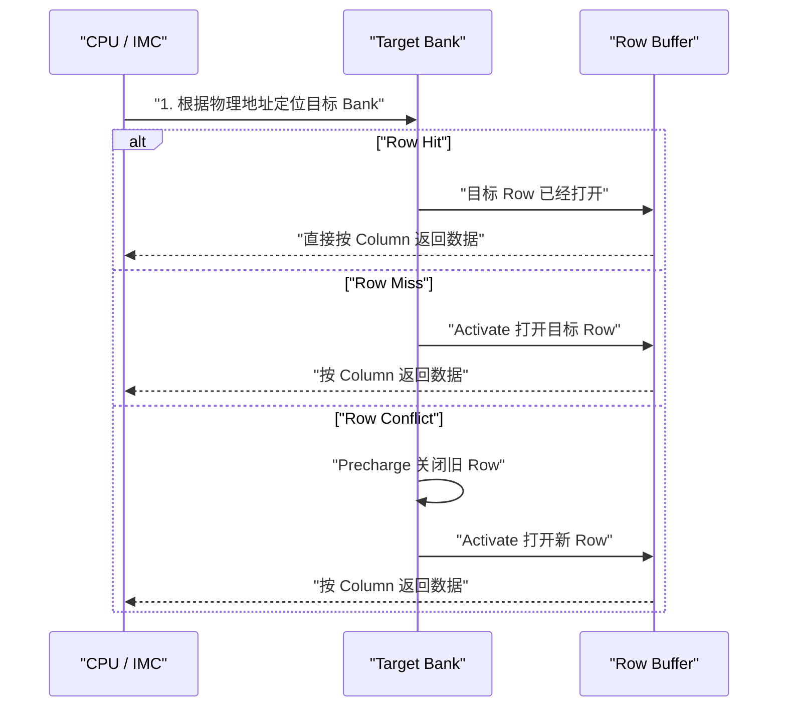
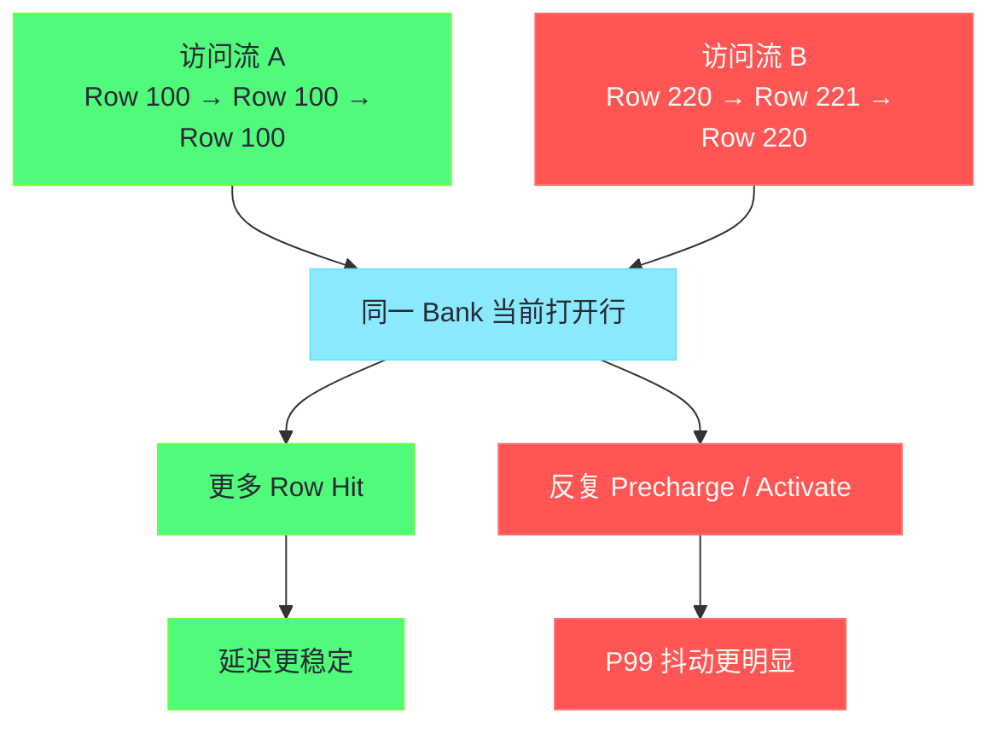

**摘要：**

很多工程师理解主存延迟时，会把它想成一个固定常数：L3 Miss 以后，反正就是“去内存拿一次数据”，几十到一百多纳秒，差不多就这样了。

这个理解在做粗粒度估算时可以接受，但一旦进入真实性能分析，它就太粗了。

同样是一次落到 [[DRAM]] 的访问，为什么有时像“顺手一拿”，有时却像“先关一扇门、再开另一扇门、最后才能把东西拿出来”。

关键差异不在 Linux 系统调用，也不只在 [[Cache Line]]。

真正的根因在 [[11 内存硬件全景——DIMM、Channel、Rank、Bank 与寻址层级|DRAM 的 Bank / Row 组织]] 和 **Row Buffer** 的工作方式。

一次访问若命中当前已经打开的行，就是 **Row Hit**。

若目标行未打开，就是 **Row Miss**。

若当前 Bank 已经打开了别的行，而你又要访问新行，就会触发 **Row Conflict**，还会伴随我们日常常说的 **Bank 冲突** 或更准确地说“同一 Bank 内的行冲突竞争”。

它决定了为什么相同代码、相同数据量、相同 CPU，P50 看起来平稳，P99 却会突然冒刺。

本文只聚焦这一件事：**把 Row Buffer 命中、Miss、Conflict 与 Bank 冲突讲透，并解释它们为什么会成为 Linux 场景中内存延迟抖动的硬件根因。**

本文不会展开 DDR 频率与时序参数计算，那是 [[13 DDR 频率、时序与带宽——CAS、tRCD、tRP 到真实性能]] 的边界。

本文也不会展开 `numactl`、HugePage、压测矩阵等调优动作，那是 [[15 从内存硬件到调优策略——交错、绑定、页大小与压测方法]] 的主题。

---

## 第 1 章 为什么“主存延迟”不能被当成一个常数

### 1.1 从缓存视角看问题，为什么总会差一层

很多性能分析文章会告诉你：

1. L1 很快。
2. L2 次之。
3. L3 更慢。
4. 出了 LLC 就到内存。

这条链没有错。

但它只告诉了你“有没有命中缓存”，没有告诉你“真的到了内存以后，具体慢在哪里”。

从 [[CPU 微架构]] 的角度，L3 Miss 之后通常会被归入一个更笼统的类别：

- backend bound；
- memory bound；
- long latency load。

这些词对定位方向有帮助。

但它们仍然没有回答一个更尖锐的问题：

**为什么两次都属于 memory bound，等待时间还能差出明显层次。**

如果我们把内存看成一个统一的黑盒，就只能把差异归咎于“总线忙”“系统抖动”“偶发噪声”。

而一旦把目光拉到 DRAM 内部，你会发现这里并不是平面存储。

它有 Bank。

Bank 里有 Row。

每个 Bank 通常只会维持一行处于激活状态。

这就意味着：

> [!info] 核心概念
> 主存访问不是“直接到某个字节拿数据”，而是“先看目标数据所在 Bank 当前打开的是哪一行，再决定是直接列访问，还是先关旧行、再开新行”。

### 1.2 为什么固定延迟模型会误导性能判断

如果你把 DRAM 延迟固定写成 90ns，那么很多推导会出现偏差。

例如：

- 你无法解释为什么顺序扫大数组和随机指针追逐都同样越过 LLC，但延迟分布差别很大。
- 你无法解释为什么同一个服务在低并发时平均延迟不错，高并发时长尾突然恶化。
- 你无法解释为什么某些访问模式几乎不改变带宽，却明显改变单次 load 的等待时间。

这些现象共同说明：

**主存延迟是分布，不是常数。**

更进一步说，它还是一种和访问历史相关的分布。

因为“当前 Bank 打开的那一行是什么”本身就取决于前面的访问。

这和磁盘随机 IO 有一点类似。

你不能只看“访问了一次盘”，还得看磁头之前在哪里。

Row Buffer 的价值，正是把这种“历史依赖”显式呈现出来。

### 1.3 为什么延迟抖动在尾延迟系统里格外致命

如果你的系统是离线批处理，Row Conflict 造成的额外几十纳秒，看起来似乎不值一提。

但在下面这些场景里，它的放大效应非常明显：

1. 高频低时延 RPC。
2. 键值存储的随机读。
3. 数据库索引访问。
4. Java / Go 运行时在大堆上做 pointer chasing。
5. 分析引擎中的哈希 Join、聚合和 Probe。

原因不只是单次延迟增加。

更关键的是，这些负载往往会：

- 多次串行依赖访存；
- 在一个请求路径上叠加多个 LLC Miss；
- 让 CPU 难以用乱序执行完全隐藏等待；
- 在高并发下制造更多银行级竞争。

于是原本“额外的几十纳秒”，会被放大成：

- IPC 下跌；
- 单核吞吐恶化；
- P99、P999 毛刺；
- 核数扩展收益下降。

### 1.4 本文要解决的五个问题

为了把边界收紧，本文集中回答五个问题：

1. Row Buffer 到底是什么。
2. Row Hit、Row Miss、Row Conflict 的严格区别是什么。
3. 所谓 Bank 冲突，为什么会让延迟出现抖动而不是稳定变慢。
4. 这些硬件现象在 Linux / `perf` 世界里会留下什么痕迹。
5. 什么情况下 Row Buffer 影响被放大，什么情况下又会被掩盖。

---

## 第 2 章 先把舞台搭好：Bank、Row 与 Row Buffer 到底在做什么

### 2.1 为什么一个 Bank 通常只能“开着一行”

DRAM 不是 SRAM。

它靠电容存储信息。

真正从阵列里读取数据时，不是对单个 bit 直接取值，而是通过感应放大器把一整行读到外围的缓冲区。

这个缓冲区，就是我们说的 **Row Buffer**。

因此，对于同一个 Bank，可以把它理解成：

1. 有很多行。
2. 某一时刻只能有一行处于“当前激活”状态。
3. 之后的列访问，都是在这行已经被打开的前提下进行。

为什么不是多行同时打开。

因为这会显著增加阵列和外围电路复杂度，也会破坏 DRAM 当前这种以面积密度为中心的设计权衡。

所以 DRAM 给出的答案是：

**把大代价放在“打开一整行”这一步，然后尽量复用已经打开的行。**

### 2.2 Row Buffer 不是 CPU Cache

很多人第一次听到 Row Buffer，会把它类比成一种“很底层的小缓存”。

这个类比只能用一半。

它和 [[Cache]] 的相似点在于：

- 都会因为命中而更快；
- 都让局部性变得有价值；
- 都让“访问历史”影响下一次访问成本。

但它和 Cache 的本质区别也很关键：

1. Row Buffer 通常按 **行激活** 工作，不是按通用替换策略维护。
2. 一个 Bank 往往只有“当前打开的一行”，不是多路组相联缓存。
3. Row Buffer 更像一次 DRAM 访问流程中不可绕过的工作状态，而不是附加的旁路优化。

换句话说：

Cache 是“尽量不去内存”。

Row Buffer 是“既然已经到了这个 Bank，就尽量别重复做昂贵的行切换”。

### 2.3 一个更接近真实的访问流程

下面这个过程比“去内存取数”更接近真实硬件行为。

这里最重要的不是命令名字。

而是你要意识到：

**访问成本取决于目标行和当前打开行之间的关系。**

### 2.4 为什么“当前打开哪一行”是一个历史问题

如果你问“某个地址的 DRAM 延迟是多少”，这句话本身就不完整。

因为同一个地址：

- 在它所属 Bank 当前正好打开该行时，是 Row Hit；
- 在该 Bank 当前没有打开任何行时，是 Row Miss；
- 在该 Bank 当前打开了别的行时，是 Row Conflict。

也就是说，地址本身不决定全部延迟。

**地址 + 历史访问轨迹** 才决定。

这正是延迟抖动出现的根源。

你对同一份数据做两次逻辑相同的访问，若访问前序不同，尾延迟就可能不同。

### 2.5 开页策略与闭页策略：为什么控制器也在猜测未来

现代内存控制器还会做一个重要决策：

这次访问完成后，要不要继续把当前行保持打开。

如果保持打开，后续命中同一行就会受益。

这类思路常被称为 **open-page policy**。

但如果控制器判断后续很可能访问别的行，那么继续保留旧行，反而可能让下一次访问先做一次 precharge。

于是又有偏向尽快收尾的策略，常被归入 **close-page policy** 或其变体。

对 Linux 工程师来说，不需要去背每家 IMC 的全部策略细节。

但要知道一个边界：

> [!note] 设计哲学
> Row Buffer 命中率不仅由应用访问模式决定，也受内存控制器行保持策略影响。也就是说，硬件并不只是被动执行，它还在根据统计行为做调度猜测。

---

## 第 3 章 三种访问状态：Row Hit、Row Miss、Row Conflict 到底差在哪里

### 3.1 Row Hit：为什么同一行内连续访问会便宜很多

当目标地址所在的 Row 已经处于该 Bank 的 Row Buffer 中时，控制器无需重新激活整行。

它只需要执行列访问相关动作。

因此，Row Hit 的核心特征不是“零成本”。

而是：

**避免了行切换。**

这会带来两个直接好处：

1. 少掉 activate 的等待。
2. 避免 precharge + activate 的组合成本。

对于顺序扫描、列式存储连续读取、预取器命中的流式访问，这类收益经常叠加出现。

所以很多时候，顺序访问快，并不只是因为缓存和预取。

当工作集已经溢出 LLC 时，DRAM 层的 Row Hit 也在继续帮忙。

### 3.2 Row Miss：为什么它不一定是坏事

如果某个 Bank 当前没有打开任何行，而目标行也不在 Row Buffer 中，这就是 **Row Miss**。

它需要先 activate 目标行。

但它和 Row Conflict 不一样。

因为这里没有“先把别的行关掉”的额外步骤。

所以 Row Miss 往往是：

- 比 Row Hit 慢；
- 但通常比 Row Conflict 轻。

为什么说它不一定是坏事。

因为在很多 close-page 倾向较强的控制器上，Row Miss 反而是一种“干净的起点”。

它意味着这个 Bank 没有被前一个无关访问拖累。

因此，如果你只说“没命中 Row Buffer”，信息还不够。

你还要继续区分：

- 是空状态下的新激活；
- 还是被别的行占着导致的切换。

### 3.3 Row Conflict：为什么它才是真正的抖动制造者

Row Conflict 的典型情况是：

1. 当前 Bank 已经打开了某一行。
2. 新请求落在同一 Bank 的另一行。
3. 控制器必须先 precharge 当前行。
4. 再 activate 新行。
5. 然后才能做列访问。

你可以把它理解成：

原本门已经为 A 房间开着。

但你现在要去 B 房间。

由于同一 Bank 不能把两行同时作为“当前打开行”保留，于是必须先收 A，再开 B。

这就是延迟毛刺最直接的硬件来源之一。

它不仅比 Row Hit 慢。

更重要的是，它对访问顺序高度敏感。

于是延迟不再稳定，而是开始抖动。

### 3.4 一张表讲清三者差异

| 状态 | 当前 Bank 状态 | 额外动作 | 延迟层级 | 常见场景 |
|------|----------------|----------|----------|----------|
| Row Hit | 目标 Row 已打开 | 直接列访问 | 最低 | 顺序扫描、局部性较好的流式读取 |
| Row Miss | 当前无打开行 | Activate | 中等 | close-page 后的新访问、空闲 Bank 首次访问 |
| Row Conflict | 打开的是别的 Row | Precharge + Activate | 最高 | 随机访问、同 Bank 不同行来回切换 |

这张表的重点不是背定义。

而是建立一个判断框架：

**真正拉大尾延迟的，往往不是“没命中”，而是“命中了错误的那一行”。**

### 3.5 为什么 Bank 冲突常被用来指代 Row Conflict

工程语境里很多人会说“发生了 Bank 冲突”。

严格说，这个词可能包含两层意思：

1. 多个请求都落到同一 Bank，导致并发度下降。
2. 同一 Bank 内不同 Row 轮流争夺当前打开行，形成行冲突。

在讨论延迟抖动时，第二层更关键。

因为如果只是同一 Bank 上排队，但访问都落在同一 Row，未必是最坏情况。

真正昂贵的是：

**排队 + 行切换** 一起发生。

所以本文里提“Bank 冲突”，主要指与 Row Buffer 行切换强相关的那种冲突，而不是任何广义上的资源争用。

### 3.6 一个容易混淆的边界：Bank Group 不是本文重点，但不能完全忽略

在 DDR4 / DDR5 中，还存在 [[Bank Group]] 的概念。

这意味着不同 Bank 之间也并非完全等价并行。

但本文要强调的是：

就“为什么一次访问会突然慢很多”这个问题而言，最具解释力的第一性原理仍然是：

1. 它落在哪个 Bank。
2. 该 Bank 当前打开什么 Row。
3. 是否需要发生行切换。

Bank Group 会进一步修饰时序细节。

但它不改变 Row Hit / Conflict 作为主因的解释框架。

---

## 第 4 章 为什么 Row Buffer 命中率会被访问模式直接改写

### 4.1 顺序访问为什么天然占便宜

当程序按连续地址读取大块数据时，会同时受益于三层局部性：

1. [[Cache Line]] 空间局部性。
2. 硬件预取器的流式预测。
3. DRAM Row Buffer 的行内连续访问。

这三层并不等价。

但它们常常一起出现。

于是顺序扫描会呈现出一种“层层都友好”的特征。

即便数据大到无法留在 LLC，DRAM 这一层仍然可能保持较高的 Row Hit 概率。

### 4.2 随机访问为什么往往同时破坏三层局部性

相反，哈希表、跳表、B 树随机 probe、图遍历、对象指针追逐等模式，会让访问位置在物理地址空间中跳跃。

当跳跃足够大时：

- Cache 很难保留热点；
- 预取器难以预测；
- Row Buffer 也更难重复命中同一行。

更糟的是，这种跳跃不是“均匀地慢”。

它会在某些时刻落到：

- 另一个 Bank；
- 同一个 Bank 的同一行；
- 同一个 Bank 的另一行。

于是延迟自然呈现离散分层。

### 4.3 为什么“随机”不等于“完全平均”

有人会说，随机访问不是应该把请求均匀打散到所有 Bank 吗。

理论上地址映射足够好时，确实有这种趋势。

但真实系统并不满足“完美均匀”这几个字。

原因包括：

1. 物理地址映射到 Channel / Rank / Bank / Row 的 bit 组合是平台相关的。
2. 应用分配器、页大小、页着色、伙伴系统状态，会影响物理页分布。
3. 某些数据结构的步长和对齐方式，会让地址模式和 Bank 选择位产生别名。
4. 多线程共享同一数据结构时，线程间访问序列会互相扰动。

因此，所谓随机访问，很多时候只是“对程序员来说随机”。

对硬件来说，它依然可能形成某些偏置。

这些偏置一旦集中打到少数 Bank 或少数 Row 切换上，延迟抖动就会出现。

### 4.4 物理地址映射为什么是理解反常现象的关键

逻辑上相邻的对象，不一定物理相邻。

逻辑上不相关的两个对象，也可能在物理地址位上共享同一个 Bank 选择模式。

这件事很容易导致一种错觉：

“我改了数据结构，算法复杂度没变，为什么尾延迟却变了。”

从硬件角度看，可能只是因为：

- 新布局让更多访问落入同一 Row，于是 Row Hit 变多；
- 或者新布局让原本分散的访问别名到同一 Bank 不同行，于是 Row Conflict 变多。

也就是说，程序里的“内存布局”最终会投影成 DRAM 的“行缓冲行为”。

### 4.5 为什么多线程会把问题放大

单线程时，访问序列只有一个来源。

即便它是随机的，Row Buffer 状态至少只被一个访问流改写。

多线程则不同。

多个核心发出的 miss 会同时进入内存控制器队列。

如果这些请求：

- 碰巧落在同一 Channel；
- 进一步落在同一 Rank；
- 再进一步集中在同一 Bank；

那调度器就要在这些请求之间排队、重排、插空。

只要它们访问的 Row 还不同，冲突就会继续放大。

所以很多高并发场景下出现的延迟抖动，并不是单个线程突然“变笨”。

而是不同线程共同把某些 Bank 的行局部性打碎了。

### 4.6 写入流量为什么也会搅乱 Row Buffer

有些工程师会误以为只有读才和 Row Hit 相关。

其实写也一样会占用 DRAM 资源。

虽然现代控制器会用写缓冲、读优先、写回批处理等手段减少影响，但只要写请求进入相关 Bank，它就可能：

1. 改变当前打开行。
2. 占用命令窗口。
3. 让读请求的理想行命中序列被打断。

这也是为什么“同样的读负载，加一点后台写入，P99 就开始毛刺”的现象经常出现。

不一定是锁竞争。

也可能是读写混合把 DRAM 行局部性破坏了。

### 4.7 一个直观的冲突示意图

这个图故意没有画复杂的总线和时序。

因为对性能分析来说，最关键的洞察就两句：

1. 同一 Bank 内反复命中同一行，延迟更平稳。
2. 同一 Bank 内来回切不同的行，延迟最容易毛刺。

---

## 第 5 章 Row Buffer 命中与 Bank 冲突，为什么会表现成 Linux 里的“内存延迟抖动”

### 5.1 CPU 看到的不是 Row Conflict，而是 stall

Linux 和应用程序不会直接收到一个信号说：

“你好，你刚刚发生了第 17 次 Row Conflict。”

CPU 看到的只是：

- 这次 load 更晚返回；
- 乱序窗口被占住更久；
- 后续依赖指令发不出去；
- `cycles` 在走，`instructions` 不动；
- `stalled-cycles-backend`、`memory bound` 之类指标变差。

也就是说，Row Conflict 在软件世界里总是以“更长的等待”出现。

它不会直接暴露自己的名字。

### 5.2 为什么 P50 往往看不出问题，P99 却会明显受伤

如果工作负载里同时存在：

- 一部分 Row Hit；
- 一部分 Row Miss；
- 一部分 Row Conflict；

那么平均值会把差异抹平。

P50 通常更多反映主流路径。

而 P99、P999 更容易把那些“同 Bank 不同行切换”的长尾成本放大出来。

所以很多服务的表面症状是：

1. 平均延迟没那么差。
2. CPU 利用率也不算特别高。
3. 可是一到高并发，尾延迟就崩。

如果此时只盯着锁和 GC，很容易漏掉内存硬件这一层。

### 5.3 在 `perf stat` 里通常会看到什么

Row Buffer 命中差、Bank 冲突多的场景，常见伴生现象包括：

- `IPC` 下降；
- `cycles` 增长但 `instructions` 增幅有限；
- `LLC-load-misses` 较高；
- `cache-misses` 明显；
- Topdown 里 `backend bound` 占比上升；
- 某些平台上 `mem-loads-retired` 相关长延迟采样偏多。

但要注意：

这些都只是代理现象。

它们能说明“你在等内存”，却未必能单独证明“你在等 Row Conflict”。

### 5.4 为什么单靠 core PMU 很难直接锤死根因

core PMU 更擅长从 CPU 核心侧观察：

- cache miss；
- 分支预测；
- 指令退休；
- pipeline stall。

而 Row Buffer / Bank 这些现象，更接近内存控制器和 uncore 侧。

因此，在很多平台上，你需要把两类信号拼起来：

1. core 侧告诉你“CPU 正在大量等内存”；
2. uncore IMC 侧告诉你“带宽、事务模式或时序行为确实在异常”；
3. 负载形态告诉你“访问模式高度随机或强竞争”。

三者结合，才能把解释收敛到 Row Buffer / Bank 冲突这一层。

### 5.5 为什么 `perf` 有时能看见，有时几乎看不见

原因主要有四类：

1. 事件名平台相关，不同 Intel / AMD 机型暴露方式不同。
2. 有些系统只开放通用事件，不开放详细 uncore 计数器。
3. 容器和云主机环境下，底层 PMU 权限可能被限制。
4. 某些厂商文档对事件含义解释较模糊，容易误读。

因此，性能工程里一个很重要的现实主义原则是：

**Row Conflict 往往是通过“现象链条”归因，而不是靠某一个万能计数器直接宣布。**

### 5.6 一个常见的误判：把 Row Conflict 当成 NUMA 问题

远端 [[NUMA]] 访问当然也会增加延迟。

但两者不是一回事。

NUMA 解决的是“访问哪个内存控制器、哪个节点”的问题。

Row Conflict 解决的是“到了目标节点以后，在目标 Bank 内部有没有发生行切换”的问题。

你完全可能：

- 没有跨 NUMA；
- 所有线程和内存都绑定在本地节点；
- 却依然因为随机访问和 Bank 冲突而出现延迟抖动。

这就是为什么只做 `numactl --membind` 不一定能根治尾延迟。

### 5.7 另一个常见误判：把所有抖动都归咎于缓存

[[Cache Miss]] 很重要。

但如果你已经确认：

1. 工作集远大于 LLC；
2. 缓存优化空间有限；
3. 访问模式就是要落到 DRAM；

那么下一层必须继续看 DRAM 内部局部性。

否则你会卡在一个错误的结论里：

“反正都是内存慢，优化不了。”

其实不是优化不了。

而是你还没看清慢是以哪种方式发生的。

---

## 第 6 章 哪些负载最容易触发行冲突，哪些负载反而天然友好

### 6.1 流式扫描：最典型的友好型负载

典型例子包括：

- 列式数据库顺序扫描；
- `memcpy` / `stream triad` 一类线性遍历；
- 连续数组的单方向处理。

这类负载的特点是：

1. 地址连续。
2. 预取器容易工作。
3. 同一 Row 内的后续列访问概率高。
4. 控制器更容易做行命中友好的调度。

所以它们更像“带宽型”负载。

延迟当然仍存在。

但延迟分布往往更窄、更稳定。

### 6.2 哈希表和随机 Key 访问：最典型的敌对型负载

当哈希桶、对象头、指针节点分散在大量页面和物理地址上时，单次查询路径会包含多个非连续访问。

这类负载的问题不是总数据量大。

而是：

**每一步都可能把当前打开行切走。**

于是它很容易出现：

- Row Hit 低；
- Row Conflict 高；
- 单次请求包含多个串行长延迟 miss；
- CPU 难以靠并行乱序完全隐藏。

这就是很多 KV、索引查找、图数据库遍历在内存明明够用时，仍然表现出高尾延迟的原因之一。

### 6.3 混合型 OLTP：为什么看起来“不是纯随机”，却同样会抖

OLTP 类业务往往既有：

- 热索引；
- 热页；
- 日志顺写；
- 随机读；
- 偶发更新。

表面上看，它不像图遍历那样完全随机。

但实际请求路径经常在“局部热”与“局部随机”之间来回跳。

这会制造一种很麻烦的现象：

P50 还不错，因为热数据不少。

P99 很差，因为长尾请求总会落到那些不友好的随机路径上。

这正是 Row Buffer 相关分析特别适合用来解释“平均可接受、长尾难看”的地方。

### 6.4 JVM / Go 堆对象访问为什么容易受害

托管运行时经常会：

1. 分配大量对象。
2. 维护指针关系。
3. 在 GC、扫描、Map、缓存命中路径中进行 pointer chasing。

如果对象布局分散、晋升后碎片化、访问又跨越多个区域，那么最终在物理地址上映射出来的模式往往对 Row Buffer 不友好。

这也是为什么某些应用层看似“逻辑简单”的对象访问，会出现非常明显的 backend memory bound。

### 6.5 多租户干扰：你的 Row Buffer 可能被别人打碎

在共享机器上，你的进程不是唯一在访问内存控制器的主体。

即便你自己的访问模式还算规整，另一个高随机度负载也可能：

- 占满某些 Channel；
- 扰乱调度顺序；
- 提高同一 Bank 的冲突概率；
- 让你的长尾开始恶化。

所以某些“同代码、不同宿主机表现差异明显”的问题，未必是软件版本差异。

也可能是宿主机上的共租干扰，在 DRAM 这一层被放大了。

### 6.6 一个反例：不是所有随机访问都会同样糟

需要收敛边界的是：

随机访问通常不利于 Row Hit。

但不代表所有随机访问都一样差。

如果一个负载虽然随机，但：

1. 请求数不高；
2. 并发线程少；
3. 地址打散后恰好分散到较多 Bank；
4. CPU 还有足够乱序能力隐藏等待；

那它的体感性能未必会很差。

这也是为什么“随机访问 = 一定灾难”是错误表述。

真正决定问题严重程度的，是随机性、并发度、Bank 分布、依赖链长度这几个因素的叠加。

---

## 第 7 章 边界、反例与分析时必须保持的克制

### 7.1 Row Buffer 不是所有内存问题的总解释

如果进程大部分时间卡在：

- major page fault；
- swap in；
- 远端 NUMA；
- 锁等待；
- I/O 阻塞；

那你强行拿 Row Conflict 解释一切，就是跑偏。

本文的适用前提是：

1. 问题确实已经落在 DRAM 访问层；
2. 不是页错误或磁盘换页；
3. 不是单纯 NUMA 远端开销主导；
4. 不是锁竞争或调度延迟主导。

### 7.2 CPU 预取器有时会替你掩盖问题

如果访问模式虽然跨度较大，但仍有某种可预测步长，预取器可能提前把数据拉近。

这时你在表面上看到的 load latency 可能没那么难看。

但这不等于 Row Buffer 不重要。

而是 CPU 在更上层帮你掩盖了一部分伤害。

一旦步长被打乱，或者并发度上升，隐藏效果就可能消失。

### 7.3 HugePage 不能直接“修复 Row Conflict”

大页改善的是：

- 页表层级；
- TLB 覆盖率；
- 部分物理连续性。

它可能间接改变物理布局，从而影响 Bank / Row 映射。

但它的设计目标并不是“提高 Row Buffer 命中率”。

所以如果有人说：

“把 4KB 改成 2MB，大页一开，Row Conflict 就解决了。”

这说法是过度简化。

更准确的表述应该是：

大页可能改变地址分布和 TLB 行为，进而间接影响整体访存表现，但它不是专为 Row Buffer 问题设计的手段。

### 7.4 更高 DDR 频率，也不能消除行冲突的结构性问题

频率更高，可以缩短部分时序对应的绝对时间。

但如果访问模式本身一直在触发 Row Conflict，那么“需要 precharge + activate”这条路径仍然存在。

换句话说：

更高频率可能让每次冲突没那么贵。

但它不会让冲突凭空消失。

这是 [[13 DDR 频率、时序与带宽——CAS、tRCD、tRP 到真实性能]] 要进一步展开的主题。

### 7.5 为什么本文刻意不直接给“调优清单”

因为如果你还没建立清晰的硬件因果链，就很容易把调优做成迷信。

比如：

- 一看到内存慢就上大页；
- 一看到尾延迟高就先绑 NUMA；
- 一看到 `LLC-load-misses` 高就盲目重写缓存层；

这些动作可能有效，也可能无效。

在进入策略前，必须先回答：

**问题究竟是远端访问、TLB 压力、带宽饱和，还是 Row Buffer / Bank 冲突。**

只有因果链清楚，策略才不会互相混淆。

---

## 第 8 章 小结：为什么 Row Buffer 是理解“内存延迟抖动”的钥匙

### 8.1 一次性收束全文

本文最核心的结论只有六条：

1. 主存延迟不是固定常数，而是受访问历史影响的分布。
2. DRAM 每个 Bank 通常围绕“当前打开的一行”工作，这一行就体现在 Row Buffer 中。
3. 访问同一行是 Row Hit，只需列访问，延迟最低。
4. 没有打开行时访问新行是 Row Miss，需要 activate，延迟居中。
5. 同一 Bank 中切到另一行是 Row Conflict，需要 precharge + activate，延迟最高，也是抖动的核心来源。
6. Linux 世界里我们通常看不到“Row Conflict”这个名字，只能从 `perf`、延迟分布、负载访问模式和平台计数器侧面拼出它。

### 8.2 这篇文章在整组专栏中的位置

如果说 [[11 内存硬件全景——DIMM、Channel、Rank、Bank 与寻址层级]] 建立了“内存到底分成几层”的总地图，那么本文补上的，是地图里最关键的一段动态机制：

**为什么同一层级结构在不同访问模式下，会表现成完全不同的延迟分布。**

接下来阅读 [[13 DDR 频率、时序与带宽——CAS、tRCD、tRP 到真实性能]] 时，你会更容易理解：

为什么 tCAS、tRCD、tRP 这些时序参数，恰好会落到 Row Hit、Miss、Conflict 的不同路径上。

而到了 [[14 Linux 如何感知内存硬件——SMBIOS、EDAC、numactl 与 perf 观测链路]]，我们会进一步回答：

Linux 到底怎样把这些底层硬件现象部分地感知出来。

最后在 [[15 从内存硬件到调优策略——交错、绑定、页大小与压测方法]] 中，再把认知真正转换成工程动作。
