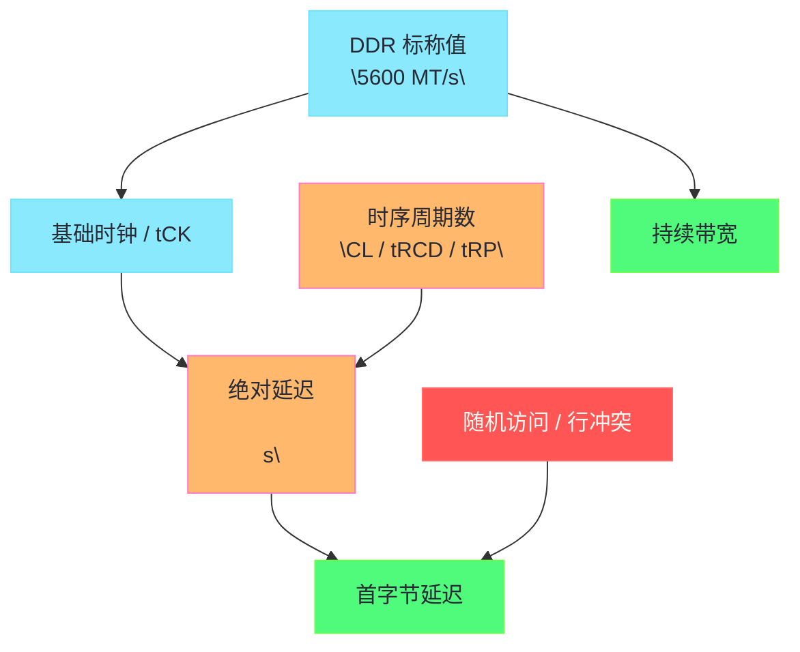

**摘要：**

很多关于内存参数的讨论，一上来就会落到几个醒目的数字上：`DDR5-5600`、`CL46`、`tRCD 45`、`tRP 45`。

但如果不先区分“传输速率”“实际时钟”“首字节延迟”“持续带宽”“行切换成本”这几个概念，这些数字很容易被误读。

有人看到频率更高，就断言一定更快。

有人看到 CL 更小，就断言延迟一定更低。

这两种结论都只对了一半。

真正决定性能的不是一个参数，而是 **访问模式 × 通道宽度 × 传输速率 × 时序参数 × 是否命中当前行 × 平台拓扑** 的联合作用。

本文只聚焦 DDR 参数与真实性能之间的映射关系。

我们会把 `MT/s`、时钟周期、Burst、理论带宽、CAS 延迟、tRCD、tRP、tRAS、行命中与行冲突路径串起来，解释为什么“频率更高”常常意味着带宽更强，但并不自动意味着首字节延迟更低。

同时也会收敛边界：本文不讨论 Linux 如何发现这些硬件信息，那是 [[14 Linux 如何感知内存硬件——SMBIOS、EDAC、numactl 与 perf 观测链路]] 的主题；也不展开具体的绑核绑内存调优动作，那是 [[15 从内存硬件到调优策略——交错、绑定、页大小与压测方法]] 的边界。

---

## 第 1 章 为什么 DDR 参数最容易被“看数字猜性能”

### 1.1 频率、时序、带宽、延迟，本来就不是一个维度

工程实践里最常见的误区，是把下面四个词当成同义词：

1. 频率。
2. 速度。
3. 带宽。
4. 延迟。

实际上它们彼此相关，但从来不等价。

更高的数据传输速率，通常意味着单位时间能搬运更多数据。

这更接近 **带宽**。

但一次随机 load 取回第一个字节之前要等多久，更接近 **延迟**。

带宽像高速公路每小时能过多少车。

延迟像你现在上车后，到第一个收费站要多久。

高速公路加宽以后，吞吐可以上去。

但如果入口拥堵、收费站变复杂、车流还要切道，第一辆车的等待不一定同步下降。

DDR 参数也是同理。

频率时序带宽延迟不是一个维度还有一个与"采购选型"相关的实践——采购内存时，要"按 workload 选维度"：带宽型 workload（流式扫描）选高 MT/s，延迟型 workload（KV 查询）选低绝对时序（CL × 2000 / MT/s 小）。所以采购不能只看"频率高"，要看"workload 重视哪个维度"。**采购"按 workload 选维度"**——这是频率时序差异的"采购实践"，带宽型选 MT/s 延迟型选绝对时序。

频率时序带宽延迟不是一个维度还有一个与"基准测试"相关的实践——基准测试要"分维度测"：用 STREAM 测带宽，用 pointer chasing 测延迟——不能混。混了会得到"带宽高但延迟也高"的矛盾结论——其实不矛盾，是两个维度。所以基准测试要"分维度"——带宽和延迟分开测。**基准测试"分维度"测带宽和延迟**——这是频率时序差异的"基准实践"，分开测不混。

### 1.2 为什么“DDR5-5600 一定比 DDR4-3200 更快”只能算半对

这句话在下面语境里通常成立：

- 大流量顺序传输；
- 多线程流式读取；
- 带宽敏感型 workload；
- Channel 数也足够。

因为更高 MT/s 往往带来更高理论带宽。

但在下面语境里，它就需要打问号：

- 指针追逐；
- 单次随机访问；
- 严重受首字节响应约束的负载；
- 强 Row Conflict 场景。

原因并不神秘。

因为一次 DRAM 访问不只包含 CAS。

若还需要行激活、预充电，绝对时间取决于多个时序项换算后的和。

DDR5-5600 比 DDR4-3200 更快只能算半对还有一个与"代际提升方向"相关的认知——DDR 每代提升主要在"带宽"（MT/s 翻倍），不在"延迟"（绝对 CAS 延迟几乎不降）。譬如 DDR4-3200 CL22 ≈ 13.75ns，DDR5-5600 CL46 ≈ 16.43ns——DDR5 延迟反而略高。所以 DDR 代际提升是"带宽方向"——不是"延迟方向"。**DDR 代际提升是"带宽方向"非"延迟方向"**——这是半对的"代际认知"，带宽升延迟不降。

DDR5-5600 比 DDR4-3200 更快只能算半对还有一个与"DDR5 双 32-bit 通道"相关的架构——DDR5 把单 64-bit 通道改成"双 32-bit 子通道"——提高并发度（两个独立 32-bit 通道）。这是 DDR5 的架构改进——不只提 MT/s，还提并发。所以 DDR5 的优势不只是"带宽高"，还有"并发高"（双子通道）。**DDR5"双 32-bit 子通道"提并发**——这是半对的"架构认知"，DDR5 提并发非只带宽。

### 1.3 为什么“CL 小就一定低延迟”也不对

如果只给你两个数字：

- A：CL40；
- B：CL46；

你无法判断哪一组绝对 CAS 延迟更低。

因为 CL 是 **时钟周期数**，不是纳秒。

如果 A 跑在更低的数据速率上，B 跑在更高的数据速率上，那么换算成真实时间之后，B 不一定更差。

更进一步说，CAS 还只是列访问的一段延迟。

若访问模式经常触发 Row Miss / Conflict，那么决定真实延迟的还包括 tRCD、tRP 等参数。

这就是为什么只看“一个大数字或一个小数字”几乎注定会误判。

CL 小就一定低延迟不对还有一个与"营销话术"相关的避坑——消费级内存营销爱强调"低 CL"（譬如 CL40），但不说"跑在什么频率"。CL40 跑在 4800 MT/s vs CL46 跑在 5600 MT/s——后者绝对延迟可能更低（46×2000/5600=16.4ns vs 40×2000/4800=16.7ns）。所以"低 CL"营销要看"绝对延迟"——不被周期数迷惑。**"低 CL"营销要看"绝对延迟"**——这是 CL 误判的"营销避坑"，不被周期数迷惑。

CL 小就一定低延迟不对还有一个与"XMP 超频"相关的陷阱——XMP 超频内存标"CL40 @ 6400 MT/s"——看起来低 CL 高频率。但 XMP 是"超频"——需要主板支持且稳定跑。如果主板不支持，自动降频到 4800 CL40——绝对延迟反而高。所以 XMP 参数要"确认能稳定跑"——否则标称值无意义。**XMP 参数要"确认能稳定跑"**——这是 CL 误判的"XMP 陷阱"，标称需稳定兑现。

### 1.4 本文的分析主线

为了避免概念糊成一团，本文按下面这条链来展开：

1. DDR 的传输速率到底是什么。
2. 单通道理论带宽如何计算。
3. CL、tRCD、tRP、tRAS 分别描述哪一段等待。
4. 为什么必须把时序周期换算成纳秒。
5. 为什么不同访问路径对应不同的“真实延迟公式”。
6. Linux 工程师应该如何解释基准测试与线上现象。

---

## 第 2 章 先把最常见的术语说清：频率、MT/s、时钟、Burst 到底是什么关系

### 2.1 DDR 里的“频率”为什么常常不是真正的时钟频率

日常讨论里说“内存频率 5600”，很多时候其实是在偷懒。

严格说，`DDR5-5600` 中的 `5600` 通常表示 **5600 MT/s**，即每秒 56 亿次数据传输。

它不是裸时钟频率本身。

DDR 的全称是 **Double Data Rate**。

意思是每个时钟周期的上升沿和下降沿都传输数据。

于是：

> [!info] 核心概念
> DDR 标称值通常是“每秒传输次数”，不是“内部时钟震荡次数”。

如果传输速率是 5600 MT/s，那么对应的基础时钟大约是它的一半，即 2800 MHz 左右。

这就是为什么很多公式里会同时出现：

- 传输速率；
- 时钟周期；
- `tCK`；
- MT/s 和 MHz 两套数字。

DDR 里的频率为什么常常不是真正的时钟频率还有一个与"DDR4 vs DDR5 预取"相关的内部——DDR 内部用"预取"（prefetch）提高数据率：DDR4 用 8n 预取（内部时钟 1 次取 8 个数据），DDR5 用 16n 预取（内部时钟 1 次取 16 个数据）。所以 DDR5 的"内部时钟"比 DDR4 更低（同等 MT/s 下），但"预取更宽"——靠预取提数据率。**DDR5 用"16n 预取"提数据率**——这是 DDR 频率的"预取机制"，内部时钟低预取宽。

DDR 里的频率为什么常常不是真正的时钟频率还有一个与"tCK 缩短"相关的代际——每代 DDR 的 tCK（时钟周期）更短——DDR4-3200 tCK ≈ 0.625ns，DDR5-5600 tCK ≈ 0.357ns。tCK 短意味着"同样周期数对应更短时间"——但 CL 周期数也增加（DDR4 CL22 vs DDR5 CL46）——抵消部分 tCK 缩短的收益。**tCK 缩短但 CL 周期增加部分抵消**——这是 DDR 频率的"代际抵消"，tCK 短 CL 多。

### 2.2 `tCK` 为什么是所有时序换算的原点

很多时序参数写成：

- CL = 46；
- tRCD = 45；
- tRP = 45。

这些值本身都是“多少个时钟周期”。

它们真正要转成时间，需要乘上每个周期的长度，也就是 **tCK**。

如果基础时钟越高，单个周期越短。

同样的 46 个周期，就会对应更短的绝对时间。

所以你只看周期数不够。

必须把周期数与周期长度一起看。

tCK 为什么是所有时序换算的原点还有一个与"周期数 vs 纳秒"相关的换算——所有时序参数（CL、tRCD、tRP）都是"周期数"——要换算成"纳秒"才有物理意义。换算公式：`纳秒 = 周期数 × tCK`。tCK 是"原点"——所有时序都通过 tCK 换算。所以 tCK 是"时序换算的原点"——不换算成纳秒，周期数无意义。**tCK 是"时序换算原点"**——这是 tCK 的"换算价值"，所有时序通过 tCK 换算。

tCK 为什么是所有时序换算的原点还有一个与"频率提升 tCK 缩短"相关的连带——频率提升 → tCK 缩短 → 同周期数对应更短时间。譬如 DDR4-3200 tCK=0.625ns，DDR5-5600 tCK=0.357ns——同样 CL=40，DDR5 的 40 周期 = 14.3ns，DDR4 的 40 周期 = 25ns。所以"频率提升 tCK 缩短"让"同周期数更短"——这是频率提升降延迟的机制。**"频率提升 tCK 缩短"让同周期数更短**——这是 tCK 的"频率连带"，频率升 tCK 短。

### 2.3 Burst Length 为什么与带宽关系更直接

DDR 访问不是每次只吐出 1 Byte。

真正的数据传输通常按突发方式进行。

JEDEC 体系下常会围绕 **Burst Length** 或内部预取组织来工作。

对 Linux 工程师而言，不需要深挖每一代 DDR 的内部 8n / 16n 预取细节。

但至少要知道一件事：

内存子系统的设计目标之一，是在行已经打开、列访问已经开始之后，以尽量高的连续传输效率把一段数据送出来。

这就是为什么：

- 首字节延迟和持续带宽不等价；
- 行命中后顺序流量更容易接近理论带宽；
- 随机小访问即使频率很高，也未必好看。

Burst Length 与带宽关系更直接还有一个与"BL8 / BL16"相关的代际——DDR4 典型 Burst Length = 8（BL8），DDR5 = 16（BL16）。BL16 一次突发传 16 个数据——比 BL8 多一倍。所以 DDR5 的"单次突发数据量"比 DDR4 多——带宽更高。**DDR5 BL16 比 DDR4 BL8 多一倍**——这是 Burst Length 的"代际差异"，DDR5 突发数据多。

Burst Length 与带宽关系更直接还有一个与"首字节 vs 持续"相关的区分——Burst Length 影响的是"持续带宽"（一次突发传多少），不影响"首字节延迟"（第一个字节多久到）。所以 BL 长 → 持续带宽高，但首字节延迟不变——两者独立。**Burst Length 影响"持续带宽"不影响"首字节"**——这是 Burst Length 的"维度区分"，带宽和延迟独立。

### 2.4 一个图把“参数层”和“性能层”串起来



这个图的核心含义是：

1. MT/s 更直接影响带宽上限。
2. 时钟周期与时序周期数共同决定绝对延迟。
3. 访问模式会进一步改变最终观察到的性能。

一个图把参数层和性能层串起来还有一个与"因果链"相关的导航——图的因果链是"MT/s → 带宽"和"tCK + 时序周期 → 绝对延迟 → 首字节"——两条独立链。访问模式（随机/行冲突）影响"首字节"——叠加到延迟链。所以图是"因果导航"——从参数到性能的两条链。**图是"因果导航"两条链**——这是参数性能图的"导航价值"，带宽链和延迟链。

一个图把参数层和性能层串起来还有一个与"参数可调 vs 不可调"相关的边界——MT/s 和时序是"硬件决定"（BIOS 配置），Linux 工程师通常不可调。但"访问模式"是"软件决定"——可通过数据布局、预取等优化。所以图的"参数层"不可调，"访问模式层"可调——优化重点在可调层。**"参数层不可调，访问模式可调"**——这是参数性能图的"可调边界"，优化重点在访问模式。

---

## 第 3 章 理论带宽怎么估算，为什么它只代表“上限”

### 3.1 单通道理论带宽的最常用公式

对标准 64 bit 数据通道，最常用的近似公式是：

```text
理论带宽 ≈ 传输速率（MT/s） × 8 Bytes
```

这里乘以 8 Bytes，是因为 64 bit = 8 Bytes。

例如：

- DDR4-3200：3200 × 8 = 25.6 GB/s；
- DDR5-5600：5600 × 8 = 44.8 GB/s。

如果是双通道，再乘 2。

如果是八通道服务器，再乘 8。

所以硬件规格表上常出现的巨大总带宽差异，本质上来自两个变量：

1. 单通道传输速率；
2. 通道数量。

单通道理论带宽的最常用公式还有一个与"GB/s vs GiB/s"相关的单位——公式算的是"GB/s"（十进制，1G=10^9），不是"GiB/s"（二进制，1Gi=2^30）。两者差 7.4%（1G/1Gi=0.931）。所以带宽测试要看清单位——GB/s 和 GiB/s 差 7%。**带宽公式算"GB/s"非"GiB/s"差 7%**——这是带宽公式的"单位注意"，看清 GB vs GiB。

单通道理论带宽的最常用公式还有一个与"双通道翻倍"相关的条件——双通道"理论翻倍"但"实测未必翻倍"——如果访问模式不能占满两通道（譬如单线程顺序读，只走一通道），实测只 1 倍。所以"双通道翻倍"是"理论上限"——实测取决于访问模式能否占满。**"双通道翻倍"是理论上限实测未必**——这是带宽公式的"翻倍条件"，访问模式要占满。

### 3.2 为什么 ECC 不意味着你能拿到 72 bit 数据吞吐

很多服务器 DIMM 带 ECC，物理位宽可能是 72 bit。

但其中通常 64 bit 用于数据，额外 8 bit 用于校验。

所以对应用有效载荷来说，估算带宽时还是以 64 bit 数据宽度为核心。

这个点看似简单，却能避免一个常见误读：

“72 bit 比 64 bit 多了 12.5%，是不是应用带宽也多 12.5%。”

不是。

ECC 的价值在可靠性，不在用户数据吞吐。

ECC 不意味着 72 bit 数据吞吐还有一个与"可靠性 vs 性能"相关的权衡——ECC 用 8 bit 校验，能"纠正 1 bit 错误，检测 2 bit 错误"——提高可靠性。但 ECC 有"性能代价"——校验计算增加延迟（约 1-2 周期）。所以 ECC 是"可靠性 + 小性能代价"的权衡——服务器选可靠性，桌面选性能。**ECC 是"可靠性 + 小性能代价"权衡**——这是 ECC 的"权衡认知"，服务器选可靠桌面选性能。

ECC 不意味着 72 bit 数据吞吐还有一个与"Chipkill"相关的服务器增强——服务器 ECC 用"Chipkill"技术——能纠正"整颗芯片故障"（x4 芯片坏 4 bit）——比普通 ECC 强。Chipkill 用更多校验位（譬如 16 bit）——但数据吞吐仍是 64 bit。所以 Chipkill 是"更强 ECC"——纠错更强，吞吐不变。**Chipkill 是"更强 ECC"纠整芯片故障**——这是 ECC 的"服务器增强"，Chipkill 纠整芯片。

### 3.3 为什么理论带宽不是实测带宽

理论带宽是假设数据通路被理想利用时的上限。

但真实系统里，还会受到下面这些因素限制：

1. 行激活与预充电开销。
2. 命令调度窗口。
3. Bank Group 约束。
4. Rank / Channel 利用不均。
5. core 侧发射能力与并发 miss 数。
6. 读写切换开销。
7. 访问模式是否足够流式。

因此，实测带宽更像“理论带宽 × 利用率”。

而这个利用率，恰恰高度依赖 workload 本身。

理论带宽不是实测带宽还有一个与"利用率典型值"相关的量化——实测带宽通常是"理论带宽 × 利用率"，利用率典型 60-80%。譬如 DDR5-5600 单通道理论 44.8 GB/s，实测 STREAM 约 35-40 GB/s（利用率 78-89%）。随机访问利用率更低（< 30%）。所以"实测 = 理论 × 60-80%"是典型——不要期待实测跑满理论。**"实测 = 理论 × 60-80%"是典型**——这是理论 vs 实测的"利用率量化"，不要期待跑满。

理论带宽不是实测带宽还有一个与"利用率优化方向"相关的实践——提高利用率的优化方向：更多 Channel（并行）、更多 Rank（交错）、顺序访问（Row Hit）、预取（减少 miss）。所以"利用率优化"靠"硬件并行 + 软件顺序"——两方面结合。**"利用率优化"靠"硬件并行 + 软件顺序"**——这是理论 vs 实测的"优化方向"，两方面结合。

### 3.4 为什么顺序带宽测试更接近规格书

像 `STREAM` 这种连续数组操作，往往更容易逼近理论带宽。

因为它们具备：

- 连续地址；
- 高并行度；
- 良好的 Row Hit 概率；
- 对预取器极其友好。

所以如果你用 `STREAM` 测到 DDR5 平台远高于 DDR4，完全正常。

这说明更高 MT/s 带来的传输能力确实兑现了。

顺序带宽测试更接近规格书还有一个与"STREAM 四项"相关的细节——STREAM 有四项：Copy、Scale、Add、Triad。Triad（A[i] = B[i] + s*C[i]）最重——三个读一个写，最能跑满带宽。所以 STREAM 测带宽要看"Triad"——它最接近理论峰值。**STREAM Triad 最接近理论峰值**——这是顺序带宽测试的"细节认知"，Triad 最重。

顺序带宽测试更接近规格书还有一个与"多线程 STREAM"相关的并发——单线程 STREAM 跑不满多通道——需要多线程 STREAM（每线程绑不同核，并发访问不同通道）。所以 STREAM 测带宽要"多线程"——单线程跑不满，多线程才能逼近理论。**STREAM 测带宽要"多线程"**——这是顺序带宽测试的"并发要求"，多线程跑满通道。

### 3.5 为什么随机指针追逐几乎不关心你的理论带宽有多漂亮

如果 workload 是典型的单链表或哈希指针追逐，那么 CPU 往往一次只能等待下一个依赖地址返回。

此时瓶颈更偏向：

- 单次 load 延迟；
- Row Hit / Conflict；
- core 侧能否隐藏等待。

理论峰值 300 GB/s 对这种负载意义有限。

因为它根本没有能力把高速公路的车道跑满。

所以：

> [!warning] 生产避坑
> 带宽规格高，不代表所有业务都受益。若业务受首字节延迟和串行依赖主导，那么它更像在买“更多车道”，而不是“更快到站”。

随机指针追逐不关心理论带宽还有一个与"串行依赖"相关的本质——指针追逐是"读指针 → 读指向对象 → 读对象内指针"——每步依赖前一步（必须等前一步返回才知道下一步地址）。串行依赖让"多通道"无用——一次只发一个请求，只用一个通道。所以串行依赖让"带宽无用"——瓶颈在单次延迟，不在总带宽。**串行依赖让"带宽无用"瓶颈在单次延迟**——这是随机追逐的"依赖本质"，串行只用单通道。

随机指针追逐不关心理论带宽还有一个与"乱序隐藏有限"相关的边界——CPU 乱序能"隐藏"部分延迟——但指针追逐的"依赖链"让乱序无用（下一步依赖前一步，无法提前发）。所以乱序对指针追逐"隐藏有限"——依赖链限制乱序。**乱序对指针追逐"隐藏有限"**——这是随机追逐的"乱序边界"，依赖链限制乱序。

### 3.6 DPC、Rank 与带宽利用率的关系为什么不能忽略

同样的 CPU 平台，如果每通道挂更多 DIMM，或者 Rank 组织不同，平台可能会为信号完整性下调支持速率。

于是你会看到一种很常见的情况：

1. 容量扩上去了。
2. 可支持 MT/s 降下来了。
3. 理论带宽随之下降。

这说明内存参数不是可独立选择的购物车。

它们是一组受平台电气和训练条件共同约束的组合。

DPC Rank 与带宽利用率的关系不能忽略还有一个与"2DPC 降频幅度"相关的量化——1DPC 到 2DPC，频率通常降 10-20%（譬如 5600 降到 4400-4800）。这是因为 2DPC 电气负载重——控制器需要降频保稳定。所以"2DPC 降频 10-20%"是典型——扩容要接受降频代价。**"2DPC 降频 10-20%"是典型**——这是 DPC 关系的"量化认知"，扩容接受降频。

DPC Rank 与带宽利用率的关系不能忽略还有一个与"容量 vs 带宽"相关的权衡——2DPC 扩容（更多 DIMM）但降频（更低 MT/s）——容量升带宽降。这是"容量 vs 带宽"的权衡——要容量还是要带宽。所以 DPC 选择是"容量 vs 带宽"权衡——按 workload 选（大工作集选容量，带宽型选 1DPC 高频）。**DPC 是"容量 vs 带宽"权衡**——这是 DPC 关系的"权衡认知"，按 workload 选。

---

## 第 4 章 CL、tRCD、tRP、tRAS 到底分别描述哪一段等待

### 4.1 为什么时序参数本质上都是“等待约束”

DRAM 不是一个可以毫无顺序随意读写的阵列。

从关闭一行、打开一行、到列访问、再到恢复下一次访问，它需要满足一系列时间条件。

这些条件在规格上往往被表达成：

- 多少个时钟周期后才能进行下一步；
- 最小等待窗口是多少；
- 某个操作完成前不能抢跑。

所以理解时序参数，最好的方法不是背定义，而是把它们放回访问流程。

时序参数本质上都是等待约束还有一个与"JEDEC 标准"相关的来源——时序参数由 JEDEC 标准定义——每代 DDR 有标准时序表。厂商按标准生产，BIOS 按标准配置。所以时序参数不是"随便定的"——是 JEDEC 标准约束的。**时序参数由 JEDEC 标准定义**——这是时序参数的"标准来源"，JEDEC 约束。

时序参数本质上都是等待约束还有一个与"最小 vs 典型"相关的值——JEDEC 时序有"最小值"和"典型值"——BIOS 通常配"典型值"（稳定）。超频者调到"最小值"（性能）但风险高。所以时序有"最小/典型"两档——典型稳定，最小激进。**时序有"最小/典型"两档**——这是时序参数的"值档认知"，典型稳最小激。

### 4.2 CL / tCAS：列访问发出后，要多久才看到数据

**CAS Latency** 关注的是：

当目标行已经处于可访问状态后，从列命令发出到数据开始返回，需要等待多少个周期。

它最贴近人们直觉中的“内存访问延迟”。

但这个直觉只在 **Row Hit** 场景下更接近真实。

因为若目标行还没打开，列访问根本还没资格开始。

CL tCAS 还有一个与"Row Hit 才相关"相关的边界——CL 只在"Row Hit"（行已打开）时直接相关。Row Miss/Conflict 时，总延迟 = tRCD (+ tRP) + CL——CL 只是其中一段。所以 CL 是"Row Hit 的延迟"，不是"所有访问的延迟"——不要用 CL 估所有访问。**CL 是"Row Hit 延迟"非"所有访问"**——这是 CL 的"边界认知"，只 Row Hit 直接相关。

CL tCAS 还有一个与"CL 与频率反相关"相关的趋势——高频率内存通常 CL 周期数更大（DDR4-3200 CL22 vs DDR5-5600 CL46）——因为高频率 tCK 短，需要更多周期稳定列访问。所以"频率高 CL 大"是趋势——不是"频率高 CL 小"。**"频率高 CL 大"是趋势**——这是 CL 的"频率趋势"，高频率需更多周期。

### 4.3 tRCD：为什么打开一行后还不能立刻读

**tRCD（RAS to CAS Delay）** 描述的是：

从激活一行，到可以对这一行发起列读写命令，中间要等待多少周期。

也就是说，Row Miss 不只是“开一行”。

开完以后，你还得等阵列状态稳定，才能进入真正的列访问阶段。

因此，Row Miss 的成本通常至少包含：

- activate；
- tRCD；
- 之后再进入 CL 对应的列访问延迟。

tRCD 打开一行后还不能立刻读还有一个与"感应放大稳定"相关的物理——tRCD 等待的是"感应放大器稳定"——激活行后，感应放大器需要时间把整行电容电荷读到 Row Buffer，稳定后才能列访问。这是"物理稳定时间"——不能跳过。所以 tRCD 是"感应放大稳定的物理等待"——不可压缩。**tRCD 是"感应放大稳定"的物理等待**——这是 tRCD 的"物理根因"，不可压缩。

tRCD 打开一行后还不能立刻读还有一个与"Row Miss 路径"相关的成本——Row Miss 延迟 = tRCD + CL——tRCD 是"开行成本"。如果访问模式 Row Miss 多（譬如冷启动、首次访问），tRCD 占总延迟比例大。所以 Row Miss 多时"tRCD 重要"——优化 tRCD（降时序或提频率）能降 Row Miss 延迟。**Row Miss 多时"tRCD 重要"**——这是 tRCD 的"成本场景"，Miss 多 tRCD 关键。

### 4.4 tRP：为什么切换到另一行前，必须先把旧行收掉

**tRP（Row Precharge Time）** 描述的是：

关闭当前已打开行、让 Bank 回到可再次激活状态所需的时间。

这就是 [[12 Row Buffer 命中与 Bank 冲突——内存延迟抖动的硬件根因|Row Conflict]] 为什么更贵的关键。

因为它比 Row Miss 多了“先收旧行”的这一步。

因此，Row Conflict 的典型成本路径会比 Row Miss 多出一段 tRP。

tRP 切换到另一行前必须先收旧行还有一个与"预充电物理"相关的根因——tRP 是"预充电"时间——关闭旧行时，要把感应放大器的数据写回电容（恢复电荷），并预充电位线为下次激活准备。这是"物理恢复时间"——不能跳过。所以 tRP 是"预充电恢复的物理等待"——不可压缩。**tRP 是"预充电恢复"的物理等待**——这是 tRP 的"物理根因"，不可压缩。

tRP 切换到另一行前必须先收旧行还有一个与"Row Conflict 路径"相关的成本——Row Conflict 延迟 = tRP + tRCD + CL——tRP 是"收旧行成本"。如果访问模式 Row Conflict 多（譬如随机访问），tRP 占总延迟比例大。所以 Row Conflict 多时"tRP 重要"——优化 tRP 能降 Conflict 延迟。**Row Conflict 多时"tRP 重要"**——这是 tRP 的"成本场景"，Conflict 多 tRP 关键。

### 4.5 tRAS：为什么行打开后也不能立刻随便关

**tRAS（Row Active Time）** 约束的是：

一行被激活后，至少要保持活动多久，才能安全地进入 precharge。

这个参数提醒我们，DRAM 不是“命令一发就瞬间完成”的系统。

行打开、感应放大、恢复电荷都需要满足最小活动窗口。

因此，控制器调度并不是简单的 if/else。

它要在多条时序约束间做合法排布。

tRAS 行打开后也不能立刻随便关还有一个与"电荷恢复"相关的物理——tRAS 等待的是"行数据完全恢复"——激活行时，感应放大器读出数据，但电容电荷被破坏（读破坏性），需要时间写回恢复。tRAS 是"恢复时间"——没恢复就关行，数据丢失。所以 tRAS 是"电荷恢复的物理等待"——保证数据不丢。**tRAS 是"电荷恢复"的物理等待**——这是 tRAS 的"物理根因"，保证数据不丢。

tRAS 行打开后也不能立刻随便关还有一个与"控制器调度"相关的约束——控制器调度要满足 tRAS 约束——激活后至少等 tRAS 才能 precharge。这限制调度灵活性——譬如想快速切行，但 tRAS 没到不能切。所以 tRAS 是"调度约束"——限制切行速度。**tRAS 是"调度约束"限制切行速度**——这是 tRAS 的"调度影响"，限制灵活性。

### 4.6 tRC：为什么有时工程上更愿意看整轮行周期

**tRC** 可以粗略理解为一轮“从打开一行到再次能打开新行”的总周期约束。

在很多工程讨论里，它有助于帮助你形成一个整体印象：

单个 Bank 在行级访问上的节奏，不是无限快的。

所以当同一 Bank 内不断轮换不同的 Row 时，你看到的不是纯粹的 CAS，而是完整的行周期负担。

### 4.7 一张表把参数和访问路径绑住

| 参数 | 关注阶段 | 更影响哪类访问 | 工程直觉 |
|------|----------|----------------|----------|
| CL / tCAS | 列命令到数据返回 | Row Hit、已打开行上的读取 | 决定列访问等待 |
| tRCD | Activate 到可列访问 | Row Miss、Row Conflict | 决定打开新行后多久能读 |
| tRP | Precharge 完成时间 | Row Conflict | 决定切换旧行到新行的额外代价 |
| tRAS | Row 保持活动的最小窗口 | 所有涉及行激活的访问 | 约束行关闭时机 |
| tRC | 行周期整体约束 | 高频不同行切换 | 反映单 Bank 行级节奏 |

这张表最重要的启发是：

不同 workload 的“真实内存延迟”其实对应不同参数组合。

所以你不能拿 CL 一把尺子量天下。

一张表把参数和访问路径绑住还有一个与"延迟公式"相关的总结——三种访问路径的延迟公式：Row Hit = CL；Row Miss = tRCD + CL；Row Conflict = tRP + tRCD + CL。所以"路径越复杂，参数越多"——Hit 只 CL，Conflict 三参数。**"路径越复杂参数越多"Hit 只 CL Conflict 三参数**——这是参数路径表的"公式总结"，路径决定参数。

一张表把参数和访问路径绑住还有一个与"优化方向"相关的指引——知道"哪段延迟占大头"后，优化方向明确：Hit 多 → 优化 CL；Miss 多 → 优化 tRCD；Conflict 多 → 优化 tRP。所以参数表指引"优化方向"——按访问路径占比优化对应参数。**参数表指引"优化方向"按路径占比**——这是参数路径表的"优化指引"，按路径选参数。

---

## 第 5 章 为什么必须把“周期数”换成“纳秒”，否则讨论全都站不住

### 5.1 周期数是相对量，纳秒才是物理时间

如果 A 配置的 CL 比 B 小，但 A 的时钟更低，那么 A 的绝对 CAS 延迟未必更低。

所以真正需要比较的是：

```text
绝对延迟（ns） ≈ 周期数 × tCK
```

如果用 DDR 标称传输速率近似换算，则一个常见经验公式是：

```text
CAS 延迟（ns） ≈ CL × 2000 ÷ 传输速率（MT/s）
```

这里的 `2000` 来自 DDR 双倍传输与 MHz / ns 换算关系。

周期数是相对量纳秒才是物理时间还有一个与"2000 系数"相关的推导——`CL × 2000 / MT/s` 的 2000 来自：`1 / (MT/s / 2) × 1000` = `2000 / MT/s`（ns/周期）。MT/s / 2 = MHz（DDR 双倍），1/MHz × 1000 = ns/周期。所以 2000 = `1000 × 2`（双倍传输的 2）。**2000 系数来自"DDR 双倍 × 1000 ns/μs"**——这是换算公式的"系数推导"，双倍传输。

周期数是相对量纳秒才是物理时间还有一个与"快速心算"相关的技巧——心算 CAS 延迟：`CL × 2000 / MT/s`。譬如 CL46 @ 5600：`46 × 2000 / 5600 = 92000 / 5600 ≈ 16.4ns`。心算技巧：`CL × 2 / (MT/s / 1000)` = `46 × 2 / 5.6 ≈ 16.4`。所以心算用"CL × 2 / 频率(G)"——快速估延迟。**心算"CL × 2 / 频率(G)"快速估延迟**——这是换算公式的"心算技巧"，快速估算。

### 5.2 一个最常见的对比例子

假设两组配置如下：

- DDR4-3200 CL22；
- DDR5-5600 CL46。

代入近似公式：

- DDR4-3200 CL22：`22 × 2000 / 3200 ≈ 13.75ns`；
- DDR5-5600 CL46：`46 × 2000 / 5600 ≈ 16.43ns`。

这说明什么。

说明更高代际、更高数据率，并不保证 CAS 绝对时间更小。

但如果换到带宽维度：

- 3200 的单通道理论带宽是 25.6 GB/s；
- 5600 的单通道理论带宽是 44.8 GB/s。

带宽又明显提升。

所以“更快”必须补全语境。

是带宽更快，还是首字节更快。

一个最常见的对比例子还有一个与"DDR5 延迟反升"相关的反直觉——DDR5-5600 CL46 ≈ 16.4ns vs DDR4-3200 CL22 ≈ 13.75ns——DDR5 的 CAS 延迟"反升"（更高）。这是反直觉的——"更新一代延迟更高？"是的，因为 DDR5 的 CL 周期数增加（46 vs 22）抵消了 tCK 缩短的收益。所以"DDR5 延迟反升"是事实——代际提升不在延迟。**"DDR5 延迟反升"是事实代际提升不在延迟**——这是对比的"反直觉认知"，DDR5 CAS 更高。

一个最常见的对比例子还有一个与"带宽大幅提升"相关的对比——DDR5-5600 带宽 44.8 GB/s vs DDR4-3200 带宽 25.6 GB/s——DDR5 带宽提升 75%。所以 DDR5 的收益在"带宽大幅提升"（75%），不在"延迟降低"（反升）。所以"DDR5 买带宽不买延迟"——代际提升方向明确。**"DDR5 买带宽不买延迟"代际提升方向明确**——这是对比的"带宽对比"，DDR5 带宽升 75%。

### 5.3 为什么只比较 CAS 仍然不够

再强调一次：

CAS 只描述列访问阶段。

如果访问路径是 Row Miss，那么更接近的近似思路会是：

```text
Row Miss 延迟 ≈ tRCD + CL
```

如果是 Row Conflict，则更接近：

```text
Row Conflict 延迟 ≈ tRP + tRCD + CL
```

当然真实控制器里还会受更多时序与调度影响。

但这个近似已经足够帮助你建立一条正确直觉：

**不同访问状态，对应的是不同的延迟公式。**

只比较 CAS 仍然不够还有一个与"三公式量化"相关的对比——三种路径的典型延迟（DDR5-5600，CL46 tRCD45 tRP45）：Row Hit = 46×0.357 = 16.4ns；Row Miss = (45+46)×0.357 = 32.5ns；Row Conflict = (45+45+46)×0.357 = 48.6ns。所以 Conflict 是 Hit 的 3 倍——差异巨大。**Conflict 是 Hit 的 3 倍差异巨大**——这是只比 CAS 的"三公式量化"，Conflict 3 倍 Hit。

只比较 CAS 仍然不够还有一个与"路径占比决定平均"相关的统计——平均延迟 = Hit% × 16.4 + Miss% × 32.5 + Conflict% × 48.6。如果 Hit 50% Miss 30% Conflict 20%：平均 = 8.2 + 9.75 + 9.72 = 27.7ns。所以"路径占比决定平均延迟"——不能只看 CAS。**"路径占比决定平均延迟"不能只看 CAS**——这是只比 CAS 的"占比统计"，路径决定平均。

### 5.4 为什么行冲突场景里，tRP 的存在会让“低 CL”的意义被稀释

如果 workload 大量命中 Row Conflict，那么即使你把 CL 从 46 降到 40，收益也可能没想象中大。

因为总路径里还躺着：

- tRP；
- tRCD；
- 可能的队列等待；
- 读写切换和 Bank 级资源约束。

这也是为什么某些低时序内存套条，在顺序带宽基准里优势不大，在随机 pointer chasing 场景里也未必线性改善。

真正关键的是访问路径占比。

行冲突场景里 tRP 让低 CL 意义被稀释还有一个与"CL 降幅 vs tRP 占比"相关的量化——CL 从 46 降到 40（降 6 周期 ≈ 2.1ns），但 Conflict 路径总延迟 48.6ns，tRP 占 16ns——CL 降的 2.1ns 只占 Conflict 总延迟的 4.3%。所以"低 CL 在 Conflict 场景收益被稀释"——降 CL 的收益占比小。**"低 CL 在 Conflict 收益被稀释"降 4.3%**——这是 tRP 稀释 CL 的"量化认知"，降 CL 收益小。

行冲突场景里 tRP 让低 CL 意义被稀释还有一个与"优化 tRP 更有效"相关的方向——Conflict 多时，优化 tRP（降 tRP 周期数或提频率）比优化 CL 更有效——因为 tRP 占 Conflict 延迟比例大（33%）。所以 Conflict 多时"优化 tRP > 优化 CL"——按占比选优化参数。**Conflict 多时"优化 tRP > 优化 CL"**——这是 tRP 稀释 CL 的"优化方向"，按占比选参数。

### 5.5 为什么纳秒换算能帮助你看穿营销话术

消费级市场很爱强调：

- 更高 XMP 频率；
- 更低 CL；
- 更强超频颗粒。

这些参数当然有意义。

但如果你不做纳秒换算，就很容易被“一个数字变大、另一个数字变小”的表象带偏。

工程分析里最稳妥的做法永远是：

1. 先把参数统一到同一量纲。
2. 再问 workload 更在乎带宽还是延迟。
3. 最后再看平台是否真的能稳定跑到该配置。

纳秒换算能帮助看穿营销话术还有一个与"XMP vs JEDEC"相关的真相——XMP 标称"CL40 @ 6400"是"超频值"——需要主板支持且手动开启。默认 JEDEC 是"CL48 @ 4800"——绝对延迟 20ns（比 XMP 的 12.5ns 高 60%）。所以"XMP 标称 vs 默认 JEDEC"差距大——不开启 XMP 就跑不到标称。**"XMP 标称 vs 默认 JEDEC"差距大**——这是营销话术的"XMP 真相"，默认跑不到标称。

纳秒换算能帮助看穿营销话术还有一个与"服务器不用 XMP"相关的边界——服务器内存不用 XMP（超频不稳定），只用 JEDEC 标准时序——稳定优先。所以服务器看到的时序是"JEDEC 标准"——不是 XMP 极限。**服务器只用 JEDEC 标准时序稳定优先**——这是营销话术的"服务器边界"，不用 XMP。

### 5.6 一个更完整但仍然工程化的直觉模型

把整件事压缩成一句话：

> [!note] 设计哲学
> MT/s 决定你能搬得多快，时序参数决定每一步至少要等多久，而真实业务性能还要再乘上“它到底是顺序流量，还是不断切行的随机访问”这个条件。

---

## 第 6 章 从参数到真实性能：不同 workload 为什么会对同一组内存给出完全不同评价

### 6.1 顺序流式 workload：更吃带宽兑现率

典型例子包括：

- `STREAM Copy / Scale / Add / Triad`；
- 列式扫描；
- 大向量计算；
- 内存复制与批量序列化。

这类 workload 通常受益于：

1. 更高 MT/s；
2. 更多 Channel；
3. 更好的 Rank / Bank 交错；
4. 更高的内存控制器利用率。

在这类场景里，频率更高几乎总是更占优。

因为瓶颈靠近持续输送能力。

顺序流式 workload 更吃带宽兑现率还有一个与"STREAM 兑现率"相关的量化——STREAM 实测通常能兑现理论带宽的 70-90%——譬如 DDR5-5600 八通道理论 358 GB/s，STREAM 多线程实测约 250-320 GB/s（兑现率 70-89%）。所以"顺序流式兑现率高"是事实——STREAM 能跑满 70-90%。**"顺序流式兑现率高"STREAM 跑满 70-90%**——这是流式 workload 的"兑现率量化"，高兑现。

顺序流式 workload 更吃带宽兑现率还有一个与"频率升级直接受益"相关的因果——顺序流式瓶颈在带宽——频率升级直接提带宽——直接受益。所以"顺序流式频率升级直接受益"——瓶颈对准升级方向。**"顺序流式频率升级直接受益"**——这是流式 workload 的"升级因果"，瓶颈对准升级。

### 6.2 随机读取 workload：更吃首字节等待与行局部性

典型例子包括：

- 链表遍历；
- 哈希索引查询；
- 图遍历；
- 细粒度 KV 查找。

这类 workload 常常无法把总线跑满。

瓶颈更偏向：

- 单次 miss 返回慢不慢；
- Row Buffer 命中率高不高；
- 是否频繁触发 tRP + tRCD 路径。

所以这里就会出现一种现象：

更高 MT/s 的平台，带宽很好看。

但随机访问延迟并没有按想象那样大幅下降。

随机读取 workload 更吃首字节等待与行局部性还有一个与"频率升级延迟不降"相关的反直觉——DDR5-5600 vs DDR4-3200，随机访问延迟几乎不降（甚至略升，因为 DDR5 CL 周期数大）。所以"频率升级对随机延迟收益小"——这是反直觉但事实。**"频率升级对随机延迟收益小"反直觉但事实**——这是随机 workload 的"升级反直觉"，延迟不降。

随机读取 workload 更吃首字节等待与行局部性还有一个与"优化 Row Hit 更有效"相关的方向——随机 workload 优化方向不是"提频率"而是"提 Row Hit"——譬如数据布局优化（让相关数据落同行）、预取（提前开行）。所以随机 workload"优化 Row Hit > 提频率"——方向不同。**随机 workload"优化 Row Hit > 提频率"**——这是随机 workload 的"优化方向"，提 Hit 比提频率有效。

### 6.3 混合型负载：最容易出现“某些指标变好，业务体感没变”

很多真实服务既不是纯流式，也不是纯随机。

它们可能同时有：

- 热缓存命中；
- 冷页访问；
- 索引查询；
- 后台写回；
- GC / compaction；
- 批量处理线程。

于是升级内存参数后，你可能看到：

1. `STREAM` 分数明显提高。
2. 某些顺序扫描任务确实更快。
3. 但线上请求 P99 几乎没改善，甚至还被别的瓶颈掩盖。

这时不能简单下结论说“内存升级没用”。

更合理的说法是：

**它改善了带宽路径，但你的核心瓶颈未必在那里。**

混合型负载最容易出现某些指标变好业务体感没变还有一个与"分路径测量"相关的诊断——要诊断"频率升级对混合负载的收益"，需"分路径测量"：用 STREAM 测顺序路径（看带宽是否升），用 pointer chasing 测随机路径（看延迟是否降），再看业务 P99（看体感是否改善）。所以"分路径测量"才能看清混合负载收益——不能只看一个指标。**"分路径测量"才能看清混合负载收益**——这是混合负载的"诊断方法"，分路径测。

混合型负载最容易出现某些指标变好业务体感没变还有一个与"瓶颈识别"相关的决策——如果 STREAM 升但 P99 没改善——说明瓶颈在随机路径（不在带宽）。下一步优化方向是"随机路径"（Row Hit、数据布局），不是"继续提频率"。所以"瓶颈识别"决定下一步——STREAM 升 P99 没动 → 优化随机路径。**"STREAM 升 P99 没动 → 优化随机路径"**——这是混合负载的"瓶颈识别"，按指标选方向。

### 6.4 为什么更多通道往往比单纯更低 CL 更稳定

对于很多服务器 workload，尤其是并发扫描、分析型查询、对象池批量处理，增加通道数往往是最稳定的收益来源。

因为它直接扩展了独立数据通路。

而单纯追求更低 CL，更多是在首字节延迟和特定访问模式上体现优势。

所以当你看到服务器平台比桌面平台“频率未必夸张，但通道数多很多”时，不要奇怪。

它服务的是另一类目标：

- 更高总吞吐；
- 更好的并发供给能力；
- 在多核压力下维持更高的内存系统利用率。

更多通道往往比单纯更低 CL 更稳定还有一个与"通道并行度"相关的本质——更多通道 = 更多独立数据通路——并行度更高。多核并发访问时，每核可走不同通道——无通道争抢。所以"通道并行度"让多核并发更稳定——不争抢。**"通道并行度"让多核并发更稳定**——这是更多通道的"并行本质"，不争抢。

更多通道往往比单纯更低 CL 更稳定还有一个与"通道扩容 vs 频率提升"相关的对比——通道扩容（8 通道 vs 4 通道）线性提带宽（2 倍），且不降频率。频率提升（5600 vs 3200）也提带宽（1.75 倍），但可能升 CL 周期（延迟不降）。所以"通道扩容比频率提升更稳"——线性提带宽不降延迟。**"通道扩容比频率提升更稳"线性提带宽不降延迟**——这是更多通道的"扩容对比"，更稳。

### 6.5 为什么远端 NUMA 有时比 CAS 差几个纳秒更值得关心

如果你在双路服务器上发生了远端 [[NUMA]] 访问，那么跨节点互联链路带来的额外延迟，往往比 CL 差几拍更显著。

这再次提醒我们：

内存参数必须放在完整拓扑里解释。

否则很容易出现一种“捡芝麻丢西瓜”的分析方式：

一边纠结 CL 细微差异；

一边忽略了应用线程根本跑在错误节点上。

远端 NUMA 比 CAS 差几纳秒更值得关心还有一个与"UPI 延迟"相关的量化——Intel UPI 跨节点延迟约 100-200ns（单跳）——比 CAS 差几纳秒（16ns）大一个数量级。所以"远端 NUMA 延迟 >> CAS 差异"——NUMA 优化优先级更高。**"远端 NUMA 延迟 >> CAS 差异"NUMA 优先级更高**——这是 NUMA 关心的"量化对比"，UPI 100-200ns vs CAS 16ns。

远端 NUMA 比 CAS 差几纳秒更值得关心还有一个与"优化顺序"相关的纪律——优化顺序应该是"先 NUMA（绑核绑内存）→ 再 Row Buffer（数据布局）→ 最后 CL（BIOS 时序）"。先解决大延迟（NUMA），再解决小延迟（CL）。所以"优化顺序 NUMA → Row Buffer → CL"——先大后小。**"优化顺序 NUMA → Row Buffer → CL"先大后小**——这是 NUMA 关心的"优化纪律"，先大后小。

### 6.6 为什么一些 BIOS 自动降频会立刻体现在带宽测试上

服务器扩容后常出现：

- 原先 1DPC 时支持 5600 MT/s；
- 换成 2DPC 后只跑 4400 MT/s。

这不是“主板抽风”。

而是内存控制器在更高负载下需要用更保守的速率保证稳定。

于是带宽测试会直接反映出来。

但延迟变化则可能没那么简单：

- 顺序带宽会明显下降；
- 某些随机负载受影响有限；
- 某些负载则因绝对时序变化与行冲突叠加而变差。

BIOS 自动降频立刻体现在带宽测试还有一个与"dmidecode 验证"相关的诊断——要验证 BIOS 是否降频，用 `dmidecode --type memory` 看 `Configured Memory Speed`——如果标称 5600 但 Configured 是 4400——确认降频。所以"dmidecode 验证降频"是第一步——看实际配置频率。**"dmidecode 验证降频"看 Configured Speed**——这是 BIOS 降频的"诊断第一步"，看实际配置。

BIOS 自动降频立刻体现在带宽测试还有一个与"降频原因排查"相关的方向——降频原因可能是：2DPC 电气负载、内存训练失败、温度过高、混插不同频率 DIMM。排查这些原因后，可能恢复标称频率。所以"降频原因排查"后可能恢复——不是无解。**"降频原因排查"后可能恢复标称**——这是 BIOS 降频的"排查方向"，排查后可恢复。

---

## 第 7 章 Linux 工程师应该怎样解释基准测试和线上现象

### 7.1 用 `STREAM` 看带宽，用 pointer chasing 看延迟，不要混用结论

如果你想回答：

“这台机器的持续内存带宽有多高。”

那 `STREAM` 一类工具很合适。

如果你想回答：

“一次随机依赖访存究竟要等多久。”

那就需要更偏延迟导向的基准，如 pointer chasing、`lmbench lat_mem_rd`、厂商 `mlc` 一类工具。

把两类结论混在一起，是非常常见的误区。

用 STREAM 看带宽用 pointer chasing 看延迟不要混用结论还有一个与"工具选型"相关的清单——带宽测：STREAM（多线程）、`mbw`、`sysbench memory`。延迟测：`lmbench lat_mem_rd`、Intel `mlc --loaded_latency`、pointer chasing 自写脚本。所以"带宽工具 vs 延迟工具"要分开选——不同工具测不同维度。**"带宽工具 vs 延迟工具"分开选**——这是工具选型的"清单认知"，不同维度不同工具。

用 STREAM 看带宽用 pointer chasing 看延迟不要混用结论还有一个与"mlc 工具"相关的推荐——Intel `mlc`（Memory Latency Checker）能同时测带宽和延迟——且能测"不同访问模式"（顺序、随机、跨 NUMA）。所以 `mlc` 是"一站式"内存基准工具——带宽延迟都能测。**`mlc` 是"一站式"内存基准工具**——这是工具选型的"mlc 推荐"，带宽延迟都能测。

### 7.2 `perf stat` 应该怎么配合理解

在 Linux 上，`perf stat` 常用于辅助解释：

- `cycles`；
- `instructions`；
- `cache-misses`；
- `LLC-load-misses`；
- Topdown memory bound；
- 某些平台的 uncore IMC 读写计数。

它可以帮助你回答：

1. 你究竟是在吃带宽，还是在等单次内存访问；
2. 提升 MT/s 后，带宽事件有没有显著变化；
3. 若带宽没打满却依然慢，是不是延迟路径占主导。

perf stat 应该怎么配合理解还有一个与"Topdown 分析"相关的深入——`perf stat` 的 Topdown 分析能区分"bandwidth bound"（带宽瓶颈）vs "latency bound"（延迟瓶颈）。如果 bandwidth bound → 优化方向提频率/通道。如果 latency bound → 优化方向降时序/提 Row Hit。所以 Topdown 区分"带宽 vs 延迟"瓶颈——指引优化方向。**Topdown 区分"带宽 vs 延迟"瓶颈指引方向**——这是 perf 配合的"Topdown 深入"，区分瓶颈类型。

perf stat 应该怎么配合理解还有一个与"uncore IMC 计数器"相关的补充——某些平台有 uncore IMC 计数器（譬如 `cas_count.read`、`cas_count.write`）——能看 IMC 实际读写量。如果 IMC 读写量接近理论带宽 → bandwidth bound。如果 IMC 读写量低但 IPC 低 → latency bound。所以 uncore IMC 计数器补充"带宽利用率"信息——辅助判断瓶颈。**uncore IMC 计数器补充"带宽利用率"信息**——这是 perf 配合的"uncore 补充"，看实际读写量。

### 7.3 为什么“CPU 不满”不代表“内存没问题”

内存延迟主导型 workload 的经典特征就是：

- CPU 利用率看起来不夸张；
- 但 `IPC` 很低；
- 核心大部分时间在等数据。

所以如果你只盯着 `top` 里的 CPU 百分比，很容易误判。

更高 MT/s 的收益，也可能主要表现为：

- 更少 stall；
- 更高 IPC；
- 单核吞吐上升；

而不是 CPU 使用率“看起来更忙”。

CPU 不满不代表内存没问题还有一个与"IPC 比 CPU% 更准"相关的指标——内存延迟主导时，CPU% 低但 IPC 也低——IPC 比 CPU% 更能反映"内存问题"。所以看"IPC"比看"CPU%"更准——IPC 低 = 内存等待。**"IPC 比 CPU% 更准"反映内存问题**——这是 CPU 不满的"指标认知"，看 IPC 不看 CPU%。

CPU 不满不代表内存没问题还有一个与"stalled-cycles"相关的细分——`perf stat` 的 `stalled-cycles-backend` 反映"后端等待"（主要是内存等待）。如果 stalled-cycles-backend 占比高（> 50%）——说明 CPU 在等内存——内存是瓶颈。所以"stalled-cycles-backend"是"内存等待"的代理指标——比 CPU% 更准。**"stalled-cycles-backend"是内存等待代理指标**——这是 CPU 不满的"stall 细分"，看 stall 不看 CPU%。

### 7.4 为什么线上业务经常“感知不到”频率升级

如果业务大部分热点在：

- L3 以内；
- 锁竞争；
- I/O；
- 网络 RTT；
- GC stop-the-world；

那么内存频率升级的收益自然不明显。

这不说明 DDR 参数没价值。

只说明当前主要矛盾不在 DRAM。

线上业务经常感知不到频率升级还有一个与"热点在 LLC 内"相关的常见——如果业务热点数据在 LLC（L3）内——访问不落 DRAM——频率升级对 LLC 内访问无影响。所以"热点在 LLC 内"是感知不到频率升级的常见原因——不落 DRAM。**"热点在 LLC 内"是感知不到频率升级的常见原因**——这是感知不到的"LLC 原因"，不落 DRAM。

线上业务经常感知不到频率升级还有一个与"瓶颈在 IO/网络/GC"相关的其他——如果瓶颈在 IO（磁盘）、网络（RTT）、GC（暂停）——这些延迟 >> DRAM 延迟——DRAM 频率升级被掩盖。所以"瓶颈在 IO/网络/GC"也感知不到频率升级——DRAM 不是主要矛盾。**"瓶颈在 IO/网络/GC"也感知不到频率升级**——这是感知不到的"其他瓶颈"，DRAM 被掩盖。

### 7.5 一条可执行的解释链

遇到“换了更高频内存，业务没明显变快”的问题时，更好的分析顺序是：

1. 先确认 BIOS / 固件是否真的以目标 MT/s 运行。
2. 用 `STREAM` 看持续带宽有没有提升。
3. 用延迟基准看随机 load 延迟有没有变化。
4. 用 `perf stat` 看 workload 是更偏 bandwidth bound 还是 latency bound。
5. 再结合 [[12 Row Buffer 命中与 Bank 冲突——内存延迟抖动的硬件根因|Row Buffer 行为]] 和 [[NUMA]] 判断根因。

这条链比单看一个 CL 数字要可靠得多。

一条可执行的解释链还有一个与"逐步排除"相关的纪律——解释链是"逐步排除"：先确认频率兑现（dmidecode），再确认带宽兑现（STREAM），再确认延迟兑现（pointer chasing），再确认瓶颈类型（perf），最后定位根因（Row Buffer/NUMA）。每步排除一个可能——逐步收敛。所以"逐步排除"是解释链的纪律——不跳步。**"逐步排除"是解释链的纪律不跳步**——这是解释链的"排除纪律"，逐步收敛。

一条可执行的解释链还有一个与"避免跳结论"相关的克制——常见错误是"跳结论"——譬如看到频率升级没效果，直接结论"内存升级无用"。但可能只是"频率没兑现"（BIOS 降频）或"瓶颈不在带宽"（latency bound）。所以"避免跳结论"——走完解释链再下结论。**"避免跳结论"走完解释链再下结论**——这是解释链的"克制纪律"，走完再结论。

---

## 第 8 章 边界、反例与几个必须记住的现实主义结论

### 8.1 内存参数不是越激进越好

如果更激进的参数导致训练不稳定、降容、ECC 错误风险上升，或者根本跑不到标称值，那么纸面参数就没有意义。

服务器场景尤其如此。

稳定性和可重复性常常比极限低时序更重要。

内存参数不是越激进越好还有一个与"ECC 错误风险"相关的后果——激进时序（低于 JEDEC 标准）可能导致"训练不稳定"——产生 ECC 可纠正错误（CE）或不可纠正错误（UE）。CE 频繁 → 性能降（纠错开销）。UE → 系统崩溃。所以"激进时序有 ECC 错误风险"——稳定性比激进重要。**"激进时序有 ECC 错误风险"稳定性比激进重要**——这是激进参数的"ECC 风险"，CE 降性能 UE 崩溃。

内存参数不是越激进越好还有一个与"服务器 vs 桌面"相关的差异——桌面可以激进（超频，崩溃重启可接受），服务器必须保守（稳定 7×24 运行，崩溃不可接受）。所以"服务器保守，桌面激进"——场景不同标准不同。**"服务器保守桌面激进"场景不同标准不同**——这是激进参数的"场景差异"，服务器求稳。

### 8.2 CL 低一些，不等于所有路径都等比例变快

因为真实访问路径可能是：

- Row Hit；
- Row Miss；
- Row Conflict；
- 远端 NUMA；
- 多 Bank 排队。

不同路径受不同参数组合影响。

所以没有哪一个单独时序能决定全部表现。

CL 低一些不等于所有路径等比例变快还有一个与"路径占比决定 CL 收益"相关的量化——如果 workload 是 80% Hit + 20% Conflict，CL 降 6ns（从 16.4 到 10.4）→ 平均延迟降 80%×6 + 20%×6 = 6ns（Hit 和 Conflict 都含 CL）。但如果 20% Hit + 80% Conflict，CL 降 6ns → 平均延迟降 20%×6 + 80%×6 = 6ns（同样）。等等——CL 在所有路径都出现，所以 CL 降对所有路径都有效——但"占比"决定的是"总延迟降幅比例"。所以"CL 在所有路径都有效"但"总延迟降幅看路径占比"——CL 不是只对 Hit 有效。**"CL 在所有路径都有效"但"总延迟降幅看路径占比"**——这是 CL 路径的"量化认知"，CL 全路径有效。

CL 低一些不等于所有路径等比例变快还有一个与"tRP tRCD 不受 CL 影响"相关的边界——CL 降只影响"CL 段"——tRP 和 tRCD 段不受影响。Conflict 路径 = tRP + tRCD + CL——CL 降 6ns，但 tRP + tRCD 不变（32ns）——Conflict 总延迟从 48.6 降到 42.6（降 12%）。所以 CL 降对 Conflict "不是等比例"——只降 CL 段，tRP+tRCD 不变。**CL 降对 Conflict"不是等比例"只降 CL 段**——这是 CL 路径的"边界认知"，tRP+tRCD 不变。

### 8.3 更高 MT/s，也不自动消除硬件层竞争

如果 workload 本质上在：

- 争抢同一 Channel；
- 集中命中少数 Bank；
- 频繁行切换；

那么更高频率只能降低单位等待的绝对时间，不能把结构性冲突抹掉。

更高 MT/s 不自动消除硬件层竞争还有一个与"频率降绝对时间不降冲突次数"相关的本质——提频率 → tCK 短 → 每次等待的绝对时间短——但"冲突次数"不变（访问模式不变）。所以提频率"降每次冲突成本"但"不降冲突次数"——总冲突成本 = 次数 × 每次成本，频率只降每次成本。**提频率"降每次冲突成本不降次数"**——这是 MT/s 的"本质认知"，只降单位成本。

更高 MT/s 不自动消除硬件层竞争还有一个与"结构性冲突需软件优化"相关的方向——结构性冲突（集中同 Bank）需"软件优化"——譬如数据布局分散、页着色、分配器优化。提频率不能解决——必须软件层改。所以"结构性冲突需软件优化"——频率不是万能。**"结构性冲突需软件优化"频率不是万能**——这是 MT/s 的"优化方向"，结构性靠软件。

### 8.4 小工作集应用常常几乎无感

若热点数据一直待在 LLC 甚至 L2 中，那么 DDR 参数的变化当然难以显著影响业务。

所以在做基准前，一定要确认工作集规模与访问模式。

否则你会得到很多“理论正确但实验无感”的结果。

小工作集应用常常几乎无感还有一个与"工作集 vs LLC"相关的判断——判断"DDR 参数是否有感"的关键是"工作集 vs LLC 大小"：工作集 < LLC → 无感（不落 DRAM）；工作集 > LLC → 有感（落 DRAM）。所以"工作集 vs LLC"决定 DDR 参数有感与否——先判断工作集大小。**"工作集 vs LLC"决定 DDR 参数有感与否**——这是小工作集的"判断关键"，先判断工作集。

小工作集应用常常几乎无感还有一个与"基准设计"相关的实践——基准测试要"设计工作集 > LLC"——否则测不到 DDR 参数差异。譬如测 DDR5 vs DDR4，工作集要 > LLC（譬如 > 100MB）——让访问落 DRAM。所以基准设计要"工作集 > LLC"——否则"理论正确实验无感"。**基准设计要"工作集 > LLC"否则无感**——这是小工作集的"基准实践"，工作集超 LLC。

### 8.5 服务器采购与调优时最该带走的结论

把本文压缩成五条可执行结论：

1. `MT/s` 更直接决定持续带宽上限。
2. CL、tRCD、tRP 等决定不同访问阶段的最小等待。
3. 比较不同配置时，一定先把周期数换算成纳秒。
4. Row Hit、Miss、Conflict 让同一组时序在不同 workload 中呈现不同真实效果。
5. Linux 性能分析必须把 DDR 参数放在完整拓扑和访问模式中理解，不能脱离 [[NUMA]]、Channel、Row Buffer 单独谈。

服务器采购与调优时最该带走的结论还有一个与"采购清单"相关的实践——采购服务器内存时的检查清单：① MT/s（带宽需求）；② CL × 2000 / MT/s（绝对延迟需求）；③ 通道数（并发需求）；④ DPC（容量 vs 带宽权衡）；⑤ ECC（可靠性需求）；⑥ JEDEC 标准非 XMP（稳定需求）。所以"采购清单六项"——按需求逐项检查。**"采购清单六项"按需求逐项检查**——这是采购结论的"实践清单"，六项检查。

服务器采购与调优时最该带走的结论还有一个与"调优顺序"相关的纪律——调优顺序：① 确认 BIOS 配置（dmidecode）；② NUMA 绑定（numactl）；③ Row Buffer 优化（数据布局）；④ 最后才考虑 BIOS 时序微调。所以"调优顺序 BIOS → NUMA → Row Buffer → 时序"——先大后小。**"调优顺序 BIOS → NUMA → Row Buffer → 时序"先大后小**——这是采购结论的"调优纪律"，先大后小。

---

## 第 9 章 小结：从“看参数”走向“解释性能”

### 9.1 本文到底补上了哪一块认知

如果说 [[11 内存硬件全景——DIMM、Channel、Rank、Bank 与寻址层级]] 解决的是“内存硬件长什么样”，[[12 Row Buffer 命中与 Bank 冲突——内存延迟抖动的硬件根因]] 解决的是“为什么同样去内存，延迟能差很多”。

那么本文补上的，就是：

**这些差异在参数表里分别落到哪些数字上，以及这些数字为什么不能被孤立解读。**

本文到底补上了哪一块认知还有一个与"参数 → 性能映射"相关的核心——本文的核心是"参数 → 性能映射"——把参数表数字（MT/s、CL、tRCD、tRP）映射到性能指标（带宽、延迟、抖动）。建立映射后，看参数表能"预测"性能——不再"看数字猜性能"。所以本文是"参数 → 性能映射"——建立可预测的映射关系。**本文核心是"参数 → 性能映射"**——这是认知补全的"核心价值"，建立可预测映射。

本文到底补上了哪一块认知还有一个与"三篇协同"相关的定位——三篇协同：11 内存硬件全景（结构）+ 12 Row Buffer（动态）+ 13 DDR 参数（数字）。结构 + 动态 + 数字 = 完整内存硬件认知。所以本文是"三篇协同"的"数字篇"——补全参数维度。**本文是"三篇协同"的"数字篇"补全参数**——这是认知补全的"协同定位"，结构+动态+数字。

### 9.2 一句话总结

DDR 参数的第一性原理不是“谁的数字更大更好”，而是：

**更高的 MT/s 提高搬运能力，更低的绝对时序降低某些等待，但真实业务表现最终取决于它是在跑顺序带宽，还是在承受随机延迟与行冲突。**

一句话总结还有一个与"第一性原理"相关的提炼——DDR 参数的第一性原理是"带宽 vs 延迟"分治：MT/s 管带宽，时序管延迟，访问模式决定哪个更重要。所以"带宽 vs 延迟分治"是第一性原理——不混为一谈。**"带宽 vs 延迟分治"是 DDR 第一性原理**——这是一句话总结的"第一性提炼"，分治不混。

一句话总结还有一个与"工程心态"相关的带走——本文要带走的是"工程心态"——看参数表不再"看数字猜性能"，而是"换算纳秒 + 看 workload 类型 + 看访问路径"——系统分析。所以"工程心态"是本文要带走的——系统分析非猜。**"工程心态"是本文要带走的系统分析非猜**——这是一句话总结的"心态带走"，系统分析。

### 9.3 下一篇该看什么

理解了参数和真实性能的关系以后，下一步自然是问：

Linux 自己究竟能不能看见这些硬件事实。

能看到多少。

又有哪些只能间接推断。

这正是 [[14 Linux 如何感知内存硬件——SMBIOS、EDAC、numactl 与 perf 观测链路]] 要展开的主题。
