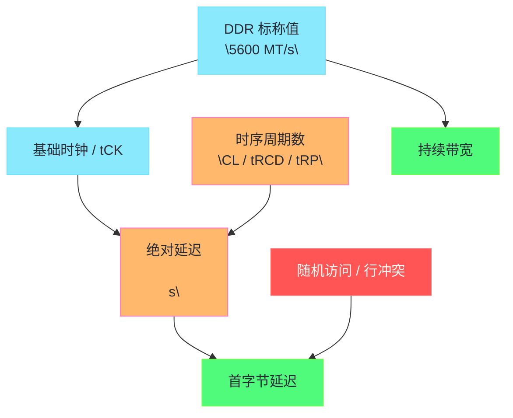

**摘要：**

很多关于内存参数的讨论，一上来就会落到几个醒目的数字上：`DDR5-5600`、`CL46`、`tRCD 45`、`tRP 45`。

但如果不先区分“传输速率”“实际时钟”“首字节延迟”“持续带宽”“行切换成本”这几个概念，这些数字很容易被误读。

有人看到频率更高，就断言一定更快。

有人看到 CL 更小，就断言延迟一定更低。

这两种结论都只对了一半。

真正决定性能的不是一个参数，而是 **访问模式 × 通道宽度 × 传输速率 × 时序参数 × 是否命中当前行 × 平台拓扑** 的联合作用。

本文只聚焦 DDR 参数与真实性能之间的映射关系。

我们会把 `MT/s`、时钟周期、Burst、理论带宽、CAS 延迟、tRCD、tRP、tRAS、行命中与行冲突路径串起来，解释为什么“频率更高”常常意味着带宽更强，但并不自动意味着首字节延迟更低。

同时也会收敛边界：本文不讨论 Linux 如何发现这些硬件信息，那是 [[14 Linux 如何感知内存硬件——SMBIOS、EDAC、numactl 与 perf 观测链路]] 的主题；也不展开具体的绑核绑内存调优动作，那是 [[15 从内存硬件到调优策略——交错、绑定、页大小与压测方法]] 的边界。

---

## 第 1 章 为什么 DDR 参数最容易被“看数字猜性能”

### 1.1 频率、时序、带宽、延迟，本来就不是一个维度

工程实践里最常见的误区，是把下面四个词当成同义词：

1. 频率。
2. 速度。
3. 带宽。
4. 延迟。

实际上它们彼此相关，但从来不等价。

更高的数据传输速率，通常意味着单位时间能搬运更多数据。

这更接近 **带宽**。

但一次随机 load 取回第一个字节之前要等多久，更接近 **延迟**。

带宽像高速公路每小时能过多少车。

延迟像你现在上车后，到第一个收费站要多久。

高速公路加宽以后，吞吐可以上去。

但如果入口拥堵、收费站变复杂、车流还要切道，第一辆车的等待不一定同步下降。

DDR 参数也是同理。

### 1.2 为什么“DDR5-5600 一定比 DDR4-3200 更快”只能算半对

这句话在下面语境里通常成立：

- 大流量顺序传输；
- 多线程流式读取；
- 带宽敏感型 workload；
- Channel 数也足够。

因为更高 MT/s 往往带来更高理论带宽。

但在下面语境里，它就需要打问号：

- 指针追逐；
- 单次随机访问；
- 严重受首字节响应约束的负载；
- 强 Row Conflict 场景。

原因并不神秘。

因为一次 DRAM 访问不只包含 CAS。

若还需要行激活、预充电，绝对时间取决于多个时序项换算后的和。

### 1.3 为什么“CL 小就一定低延迟”也不对

如果只给你两个数字：

- A：CL40；
- B：CL46；

你无法判断哪一组绝对 CAS 延迟更低。

因为 CL 是 **时钟周期数**，不是纳秒。

如果 A 跑在更低的数据速率上，B 跑在更高的数据速率上，那么换算成真实时间之后，B 不一定更差。

更进一步说，CAS 还只是列访问的一段延迟。

若访问模式经常触发 Row Miss / Conflict，那么决定真实延迟的还包括 tRCD、tRP 等参数。

这就是为什么只看“一个大数字或一个小数字”几乎注定会误判。

### 1.4 本文的分析主线

为了避免概念糊成一团，本文按下面这条链来展开：

1. DDR 的传输速率到底是什么。
2. 单通道理论带宽如何计算。
3. CL、tRCD、tRP、tRAS 分别描述哪一段等待。
4. 为什么必须把时序周期换算成纳秒。
5. 为什么不同访问路径对应不同的“真实延迟公式”。
6. Linux 工程师应该如何解释基准测试与线上现象。

---

## 第 2 章 先把最常见的术语说清：频率、MT/s、时钟、Burst 到底是什么关系

### 2.1 DDR 里的“频率”为什么常常不是真正的时钟频率

日常讨论里说“内存频率 5600”，很多时候其实是在偷懒。

严格说，`DDR5-5600` 中的 `5600` 通常表示 **5600 MT/s**，即每秒 56 亿次数据传输。

它不是裸时钟频率本身。

DDR 的全称是 **Double Data Rate**。

意思是每个时钟周期的上升沿和下降沿都传输数据。

于是：

> [!info] 核心概念
> DDR 标称值通常是“每秒传输次数”，不是“内部时钟震荡次数”。

如果传输速率是 5600 MT/s，那么对应的基础时钟大约是它的一半，即 2800 MHz 左右。

这就是为什么很多公式里会同时出现：

- 传输速率；
- 时钟周期；
- `tCK`；
- MT/s 和 MHz 两套数字。

### 2.2 `tCK` 为什么是所有时序换算的原点

很多时序参数写成：

- CL = 46；
- tRCD = 45；
- tRP = 45。

这些值本身都是“多少个时钟周期”。

它们真正要转成时间，需要乘上每个周期的长度，也就是 **tCK**。

如果基础时钟越高，单个周期越短。

同样的 46 个周期，就会对应更短的绝对时间。

所以你只看周期数不够。

必须把周期数与周期长度一起看。

### 2.3 Burst Length 为什么与带宽关系更直接

DDR 访问不是每次只吐出 1 Byte。

真正的数据传输通常按突发方式进行。

JEDEC 体系下常会围绕 **Burst Length** 或内部预取组织来工作。

对 Linux 工程师而言，不需要深挖每一代 DDR 的内部 8n / 16n 预取细节。

但至少要知道一件事：

内存子系统的设计目标之一，是在行已经打开、列访问已经开始之后，以尽量高的连续传输效率把一段数据送出来。

这就是为什么：

- 首字节延迟和持续带宽不等价；
- 行命中后顺序流量更容易接近理论带宽；
- 随机小访问即使频率很高，也未必好看。

### 2.4 一个图把“参数层”和“性能层”串起来



这个图的核心含义是：

1. MT/s 更直接影响带宽上限。
2. 时钟周期与时序周期数共同决定绝对延迟。
3. 访问模式会进一步改变最终观察到的性能。

---

## 第 3 章 理论带宽怎么估算，为什么它只代表“上限”

### 3.1 单通道理论带宽的最常用公式

对标准 64 bit 数据通道，最常用的近似公式是：

```text
理论带宽 ≈ 传输速率（MT/s） × 8 Bytes
```

这里乘以 8 Bytes，是因为 64 bit = 8 Bytes。

例如：

- DDR4-3200：3200 × 8 = 25.6 GB/s；
- DDR5-5600：5600 × 8 = 44.8 GB/s。

如果是双通道，再乘 2。

如果是八通道服务器，再乘 8。

所以硬件规格表上常出现的巨大总带宽差异，本质上来自两个变量：

1. 单通道传输速率；
2. 通道数量。

### 3.2 为什么 ECC 不意味着你能拿到 72 bit 数据吞吐

很多服务器 DIMM 带 ECC，物理位宽可能是 72 bit。

但其中通常 64 bit 用于数据，额外 8 bit 用于校验。

所以对应用有效载荷来说，估算带宽时还是以 64 bit 数据宽度为核心。

这个点看似简单，却能避免一个常见误读：

“72 bit 比 64 bit 多了 12.5%，是不是应用带宽也多 12.5%。”

不是。

ECC 的价值在可靠性，不在用户数据吞吐。

### 3.3 为什么理论带宽不是实测带宽

理论带宽是假设数据通路被理想利用时的上限。

但真实系统里，还会受到下面这些因素限制：

1. 行激活与预充电开销。
2. 命令调度窗口。
3. Bank Group 约束。
4. Rank / Channel 利用不均。
5. core 侧发射能力与并发 miss 数。
6. 读写切换开销。
7. 访问模式是否足够流式。

因此，实测带宽更像“理论带宽 × 利用率”。

而这个利用率，恰恰高度依赖 workload 本身。

### 3.4 为什么顺序带宽测试更接近规格书

像 `STREAM` 这种连续数组操作，往往更容易逼近理论带宽。

因为它们具备：

- 连续地址；
- 高并行度；
- 良好的 Row Hit 概率；
- 对预取器极其友好。

所以如果你用 `STREAM` 测到 DDR5 平台远高于 DDR4，完全正常。

这说明更高 MT/s 带来的传输能力确实兑现了。

### 3.5 为什么随机指针追逐几乎不关心你的理论带宽有多漂亮

如果 workload 是典型的单链表或哈希指针追逐，那么 CPU 往往一次只能等待下一个依赖地址返回。

此时瓶颈更偏向：

- 单次 load 延迟；
- Row Hit / Conflict；
- core 侧能否隐藏等待。

理论峰值 300 GB/s 对这种负载意义有限。

因为它根本没有能力把高速公路的车道跑满。

所以：

> [!warning] 生产避坑
> 带宽规格高，不代表所有业务都受益。若业务受首字节延迟和串行依赖主导，那么它更像在买“更多车道”，而不是“更快到站”。

### 3.6 DPC、Rank 与带宽利用率的关系为什么不能忽略

同样的 CPU 平台，如果每通道挂更多 DIMM，或者 Rank 组织不同，平台可能会为信号完整性下调支持速率。

于是你会看到一种很常见的情况：

1. 容量扩上去了。
2. 可支持 MT/s 降下来了。
3. 理论带宽随之下降。

这说明内存参数不是可独立选择的购物车。

它们是一组受平台电气和训练条件共同约束的组合。

---

## 第 4 章 CL、tRCD、tRP、tRAS 到底分别描述哪一段等待

### 4.1 为什么时序参数本质上都是“等待约束”

DRAM 不是一个可以毫无顺序随意读写的阵列。

从关闭一行、打开一行、到列访问、再到恢复下一次访问，它需要满足一系列时间条件。

这些条件在规格上往往被表达成：

- 多少个时钟周期后才能进行下一步；
- 最小等待窗口是多少；
- 某个操作完成前不能抢跑。

所以理解时序参数，最好的方法不是背定义，而是把它们放回访问流程。

### 4.2 CL / tCAS：列访问发出后，要多久才看到数据

**CAS Latency** 关注的是：

当目标行已经处于可访问状态后，从列命令发出到数据开始返回，需要等待多少个周期。

它最贴近人们直觉中的“内存访问延迟”。

但这个直觉只在 **Row Hit** 场景下更接近真实。

因为若目标行还没打开，列访问根本还没资格开始。

### 4.3 tRCD：为什么打开一行后还不能立刻读

**tRCD（RAS to CAS Delay）** 描述的是：

从激活一行，到可以对这一行发起列读写命令，中间要等待多少周期。

也就是说，Row Miss 不只是“开一行”。

开完以后，你还得等阵列状态稳定，才能进入真正的列访问阶段。

因此，Row Miss 的成本通常至少包含：

- activate；
- tRCD；
- 之后再进入 CL 对应的列访问延迟。

### 4.4 tRP：为什么切换到另一行前，必须先把旧行收掉

**tRP（Row Precharge Time）** 描述的是：

关闭当前已打开行、让 Bank 回到可再次激活状态所需的时间。

这就是 [[12 Row Buffer 命中与 Bank 冲突——内存延迟抖动的硬件根因|Row Conflict]] 为什么更贵的关键。

因为它比 Row Miss 多了“先收旧行”的这一步。

因此，Row Conflict 的典型成本路径会比 Row Miss 多出一段 tRP。

### 4.5 tRAS：为什么行打开后也不能立刻随便关

**tRAS（Row Active Time）** 约束的是：

一行被激活后，至少要保持活动多久，才能安全地进入 precharge。

这个参数提醒我们，DRAM 不是“命令一发就瞬间完成”的系统。

行打开、感应放大、恢复电荷都需要满足最小活动窗口。

因此，控制器调度并不是简单的 if/else。

它要在多条时序约束间做合法排布。

### 4.6 tRC：为什么有时工程上更愿意看整轮行周期

**tRC** 可以粗略理解为一轮“从打开一行到再次能打开新行”的总周期约束。

在很多工程讨论里，它有助于帮助你形成一个整体印象：

单个 Bank 在行级访问上的节奏，不是无限快的。

所以当同一 Bank 内不断轮换不同的 Row 时，你看到的不是纯粹的 CAS，而是完整的行周期负担。

### 4.7 一张表把参数和访问路径绑住

| 参数 | 关注阶段 | 更影响哪类访问 | 工程直觉 |
|------|----------|----------------|----------|
| CL / tCAS | 列命令到数据返回 | Row Hit、已打开行上的读取 | 决定列访问等待 |
| tRCD | Activate 到可列访问 | Row Miss、Row Conflict | 决定打开新行后多久能读 |
| tRP | Precharge 完成时间 | Row Conflict | 决定切换旧行到新行的额外代价 |
| tRAS | Row 保持活动的最小窗口 | 所有涉及行激活的访问 | 约束行关闭时机 |
| tRC | 行周期整体约束 | 高频不同行切换 | 反映单 Bank 行级节奏 |

这张表最重要的启发是：

不同 workload 的“真实内存延迟”其实对应不同参数组合。

所以你不能拿 CL 一把尺子量天下。

---

## 第 5 章 为什么必须把“周期数”换成“纳秒”，否则讨论全都站不住

### 5.1 周期数是相对量，纳秒才是物理时间

如果 A 配置的 CL 比 B 小，但 A 的时钟更低，那么 A 的绝对 CAS 延迟未必更低。

所以真正需要比较的是：

```text
绝对延迟（ns） ≈ 周期数 × tCK
```

如果用 DDR 标称传输速率近似换算，则一个常见经验公式是：

```text
CAS 延迟（ns） ≈ CL × 2000 ÷ 传输速率（MT/s）
```

这里的 `2000` 来自 DDR 双倍传输与 MHz / ns 换算关系。

### 5.2 一个最常见的对比例子

假设两组配置如下：

- DDR4-3200 CL22；
- DDR5-5600 CL46。

代入近似公式：

- DDR4-3200 CL22：`22 × 2000 / 3200 ≈ 13.75ns`；
- DDR5-5600 CL46：`46 × 2000 / 5600 ≈ 16.43ns`。

这说明什么。

说明更高代际、更高数据率，并不保证 CAS 绝对时间更小。

但如果换到带宽维度：

- 3200 的单通道理论带宽是 25.6 GB/s；
- 5600 的单通道理论带宽是 44.8 GB/s。

带宽又明显提升。

所以“更快”必须补全语境。

是带宽更快，还是首字节更快。

### 5.3 为什么只比较 CAS 仍然不够

再强调一次：

CAS 只描述列访问阶段。

如果访问路径是 Row Miss，那么更接近的近似思路会是：

```text
Row Miss 延迟 ≈ tRCD + CL
```

如果是 Row Conflict，则更接近：

```text
Row Conflict 延迟 ≈ tRP + tRCD + CL
```

当然真实控制器里还会受更多时序与调度影响。

但这个近似已经足够帮助你建立一条正确直觉：

**不同访问状态，对应的是不同的延迟公式。**

### 5.4 为什么行冲突场景里，tRP 的存在会让“低 CL”的意义被稀释

如果 workload 大量命中 Row Conflict，那么即使你把 CL 从 46 降到 40，收益也可能没想象中大。

因为总路径里还躺着：

- tRP；
- tRCD；
- 可能的队列等待；
- 读写切换和 Bank 级资源约束。

这也是为什么某些低时序内存套条，在顺序带宽基准里优势不大，在随机 pointer chasing 场景里也未必线性改善。

真正关键的是访问路径占比。

### 5.5 为什么纳秒换算能帮助你看穿营销话术

消费级市场很爱强调：

- 更高 XMP 频率；
- 更低 CL；
- 更强超频颗粒。

这些参数当然有意义。

但如果你不做纳秒换算，就很容易被“一个数字变大、另一个数字变小”的表象带偏。

工程分析里最稳妥的做法永远是：

1. 先把参数统一到同一量纲。
2. 再问 workload 更在乎带宽还是延迟。
3. 最后再看平台是否真的能稳定跑到该配置。

### 5.6 一个更完整但仍然工程化的直觉模型

把整件事压缩成一句话：

> [!note] 设计哲学
> MT/s 决定你能搬得多快，时序参数决定每一步至少要等多久，而真实业务性能还要再乘上“它到底是顺序流量，还是不断切行的随机访问”这个条件。

---

## 第 6 章 从参数到真实性能：不同 workload 为什么会对同一组内存给出完全不同评价

### 6.1 顺序流式 workload：更吃带宽兑现率

典型例子包括：

- `STREAM Copy / Scale / Add / Triad`；
- 列式扫描；
- 大向量计算；
- 内存复制与批量序列化。

这类 workload 通常受益于：

1. 更高 MT/s；
2. 更多 Channel；
3. 更好的 Rank / Bank 交错；
4. 更高的内存控制器利用率。

在这类场景里，频率更高几乎总是更占优。

因为瓶颈靠近持续输送能力。

### 6.2 随机读取 workload：更吃首字节等待与行局部性

典型例子包括：

- 链表遍历；
- 哈希索引查询；
- 图遍历；
- 细粒度 KV 查找。

这类 workload 常常无法把总线跑满。

瓶颈更偏向：

- 单次 miss 返回慢不慢；
- Row Buffer 命中率高不高；
- 是否频繁触发 tRP + tRCD 路径。

所以这里就会出现一种现象：

更高 MT/s 的平台，带宽很好看。

但随机访问延迟并没有按想象那样大幅下降。

### 6.3 混合型负载：最容易出现“某些指标变好，业务体感没变”

很多真实服务既不是纯流式，也不是纯随机。

它们可能同时有：

- 热缓存命中；
- 冷页访问；
- 索引查询；
- 后台写回；
- GC / compaction；
- 批量处理线程。

于是升级内存参数后，你可能看到：

1. `STREAM` 分数明显提高。
2. 某些顺序扫描任务确实更快。
3. 但线上请求 P99 几乎没改善，甚至还被别的瓶颈掩盖。

这时不能简单下结论说“内存升级没用”。

更合理的说法是：

**它改善了带宽路径，但你的核心瓶颈未必在那里。**

### 6.4 为什么更多通道往往比单纯更低 CL 更稳定

对于很多服务器 workload，尤其是并发扫描、分析型查询、对象池批量处理，增加通道数往往是最稳定的收益来源。

因为它直接扩展了独立数据通路。

而单纯追求更低 CL，更多是在首字节延迟和特定访问模式上体现优势。

所以当你看到服务器平台比桌面平台“频率未必夸张，但通道数多很多”时，不要奇怪。

它服务的是另一类目标：

- 更高总吞吐；
- 更好的并发供给能力；
- 在多核压力下维持更高的内存系统利用率。

### 6.5 为什么远端 NUMA 有时比 CAS 差几个纳秒更值得关心

如果你在双路服务器上发生了远端 [[NUMA]] 访问，那么跨节点互联链路带来的额外延迟，往往比 CL 差几拍更显著。

这再次提醒我们：

内存参数必须放在完整拓扑里解释。

否则很容易出现一种“捡芝麻丢西瓜”的分析方式：

一边纠结 CL 细微差异；

一边忽略了应用线程根本跑在错误节点上。

### 6.6 为什么一些 BIOS 自动降频会立刻体现在带宽测试上

服务器扩容后常出现：

- 原先 1DPC 时支持 5600 MT/s；
- 换成 2DPC 后只跑 4400 MT/s。

这不是“主板抽风”。

而是内存控制器在更高负载下需要用更保守的速率保证稳定。

于是带宽测试会直接反映出来。

但延迟变化则可能没那么简单：

- 顺序带宽会明显下降；
- 某些随机负载受影响有限；
- 某些负载则因绝对时序变化与行冲突叠加而变差。

---

## 第 7 章 Linux 工程师应该怎样解释基准测试和线上现象

### 7.1 用 `STREAM` 看带宽，用 pointer chasing 看延迟，不要混用结论

如果你想回答：

“这台机器的持续内存带宽有多高。”

那 `STREAM` 一类工具很合适。

如果你想回答：

“一次随机依赖访存究竟要等多久。”

那就需要更偏延迟导向的基准，如 pointer chasing、`lmbench lat_mem_rd`、厂商 `mlc` 一类工具。

把两类结论混在一起，是非常常见的误区。

### 7.2 `perf stat` 应该怎么配合理解

在 Linux 上，`perf stat` 常用于辅助解释：

- `cycles`；
- `instructions`；
- `cache-misses`；
- `LLC-load-misses`；
- Topdown memory bound；
- 某些平台的 uncore IMC 读写计数。

它可以帮助你回答：

1. 你究竟是在吃带宽，还是在等单次内存访问；
2. 提升 MT/s 后，带宽事件有没有显著变化；
3. 若带宽没打满却依然慢，是不是延迟路径占主导。

### 7.3 为什么“CPU 不满”不代表“内存没问题”

内存延迟主导型 workload 的经典特征就是：

- CPU 利用率看起来不夸张；
- 但 `IPC` 很低；
- 核心大部分时间在等数据。

所以如果你只盯着 `top` 里的 CPU 百分比，很容易误判。

更高 MT/s 的收益，也可能主要表现为：

- 更少 stall；
- 更高 IPC；
- 单核吞吐上升；

而不是 CPU 使用率“看起来更忙”。

### 7.4 为什么线上业务经常“感知不到”频率升级

如果业务大部分热点在：

- L3 以内；
- 锁竞争；
- I/O；
- 网络 RTT；
- GC stop-the-world；

那么内存频率升级的收益自然不明显。

这不说明 DDR 参数没价值。

只说明当前主要矛盾不在 DRAM。

### 7.5 一条可执行的解释链

遇到“换了更高频内存，业务没明显变快”的问题时，更好的分析顺序是：

1. 先确认 BIOS / 固件是否真的以目标 MT/s 运行。
2. 用 `STREAM` 看持续带宽有没有提升。
3. 用延迟基准看随机 load 延迟有没有变化。
4. 用 `perf stat` 看 workload 是更偏 bandwidth bound 还是 latency bound。
5. 再结合 [[12 Row Buffer 命中与 Bank 冲突——内存延迟抖动的硬件根因|Row Buffer 行为]] 和 [[NUMA]] 判断根因。

这条链比单看一个 CL 数字要可靠得多。

---

## 第 8 章 边界、反例与几个必须记住的现实主义结论

### 8.1 内存参数不是越激进越好

如果更激进的参数导致训练不稳定、降容、ECC 错误风险上升，或者根本跑不到标称值，那么纸面参数就没有意义。

服务器场景尤其如此。

稳定性和可重复性常常比极限低时序更重要。

### 8.2 CL 低一些，不等于所有路径都等比例变快

因为真实访问路径可能是：

- Row Hit；
- Row Miss；
- Row Conflict；
- 远端 NUMA；
- 多 Bank 排队。

不同路径受不同参数组合影响。

所以没有哪一个单独时序能决定全部表现。

### 8.3 更高 MT/s，也不自动消除硬件层竞争

如果 workload 本质上在：

- 争抢同一 Channel；
- 集中命中少数 Bank；
- 频繁行切换；

那么更高频率只能降低单位等待的绝对时间，不能把结构性冲突抹掉。

### 8.4 小工作集应用常常几乎无感

若热点数据一直待在 LLC 甚至 L2 中，那么 DDR 参数的变化当然难以显著影响业务。

所以在做基准前，一定要确认工作集规模与访问模式。

否则你会得到很多“理论正确但实验无感”的结果。

### 8.5 服务器采购与调优时最该带走的结论

把本文压缩成五条可执行结论：

1. `MT/s` 更直接决定持续带宽上限。
2. CL、tRCD、tRP 等决定不同访问阶段的最小等待。
3. 比较不同配置时，一定先把周期数换算成纳秒。
4. Row Hit、Miss、Conflict 让同一组时序在不同 workload 中呈现不同真实效果。
5. Linux 性能分析必须把 DDR 参数放在完整拓扑和访问模式中理解，不能脱离 [[NUMA]]、Channel、Row Buffer 单独谈。

---

## 第 9 章 小结：从“看参数”走向“解释性能”

### 9.1 本文到底补上了哪一块认知

如果说 [[11 内存硬件全景——DIMM、Channel、Rank、Bank 与寻址层级]] 解决的是“内存硬件长什么样”，[[12 Row Buffer 命中与 Bank 冲突——内存延迟抖动的硬件根因]] 解决的是“为什么同样去内存，延迟能差很多”。

那么本文补上的，就是：

**这些差异在参数表里分别落到哪些数字上，以及这些数字为什么不能被孤立解读。**

### 9.2 一句话总结

DDR 参数的第一性原理不是“谁的数字更大更好”，而是：

**更高的 MT/s 提高搬运能力，更低的绝对时序降低某些等待，但真实业务表现最终取决于它是在跑顺序带宽，还是在承受随机延迟与行冲突。**

### 9.3 下一篇该看什么

理解了参数和真实性能的关系以后，下一步自然是问：

Linux 自己究竟能不能看见这些硬件事实。

能看到多少。

又有哪些只能间接推断。

这正是 [[14 Linux 如何感知内存硬件——SMBIOS、EDAC、numactl 与 perf 观测链路]] 要展开的主题。
