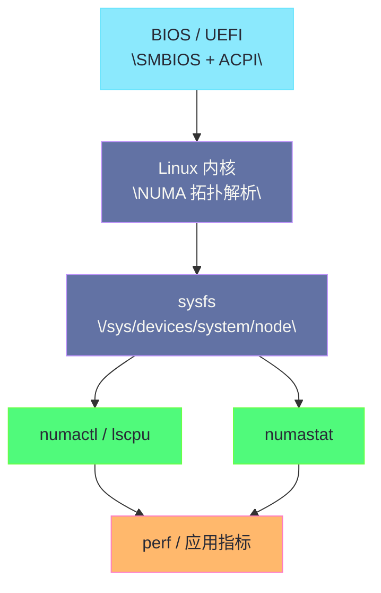

**摘要：**

理解了 [[11 内存硬件全景——DIMM、Channel、Rank、Bank 与寻址层级|DIMM、Channel、Rank、Bank]] 的组织方式，以及 [[12 Row Buffer 命中与 Bank 冲突——内存延迟抖动的硬件根因|Row Buffer 命中与 Bank 冲突]]、[[13 DDR 频率、时序与带宽——CAS、tRCD、tRP 到真实性能|DDR 频率与时序参数]] 之后，下一个现实问题一定会冒出来：**Linux 自己到底能看到什么。**

它能不能告诉你机器插了几根内存条、每根条子的槽位、速率、厂商、Rank 数。

它能不能告诉你 NUMA 节点和 CPU / 内存的对应关系。

它能不能告诉你 ECC 有没有报错，哪个 DIMM 在涨 Corrected Error。

它又能不能直接告诉你 Row Conflict 和内存带宽瓶颈。

答案不是简单的“能”或“不能”。

因为 Linux 对内存硬件的感知，本来就是一条分层链路：**固件枚举提供静态拓扑，内核子系统把这些信息组织成 sysfs / proc / log，用户态工具如 `dmidecode`、`numactl`、`edac-util`、`rasdaemon`、`perf` 再分别从拓扑、可靠性和性能三个角度去读取。**

本文就聚焦这条链路本身。

我们不再讲 DDR 原理，也不直接进入调优动作，而是要讲清：

1. SMBIOS / DMI 能看见什么，不能看见什么。
2. ACPI 的 SRAT / SLIT / HMAT 之类表项如何影响 Linux 的 NUMA 视图。
3. EDAC / RAS 子系统如何暴露内存错误与控制器信息。
4. `numactl`、`lscpu`、sysfs 如何把硬件拓扑变成可读输出。
5. `perf` 为什么只能看到“性能后果”，而不是直接读出“这根 DIMM 的 Row Buffer 命中率”。

---

## 第 1 章 为什么“能理解硬件”不等于“能在 Linux 里看见硬件”

### 1.1 从物理事实到软件视图，中间本来就隔着一层枚举与抽象

内存条插在主板上，是一个物理事实。

但 Linux 并不是直接去“看见”电路板。

它拿到的是：

- 固件提供的描述表；
- 内核驱动识别到的控制器能力；
- 平台 PMU 暴露的计数器；
- 硬件错误上报接口。

这意味着 Linux 世界中的“内存硬件信息”，从来都不是一块完整原石。

它更像不同来源拼起来的地图。

有些部分很静态。

例如槽位、容量、标称速率。

有些部分很动态。

例如纠错错误、当前带宽、远端访问、uncore 事件。

也有些部分根本看不见。

例如精确到每一条业务请求的 Row Hit / Conflict 明细。

### 1.2 为什么排障时总会出现“一个工具说得很清楚，另一个工具完全没有”

这是因为不同工具面对的问题完全不同。

`dmidecode` 关心的是：

- 这台机器有哪些内存设备；
- 槽位叫什么；
- 厂商和标称参数是什么。

`numactl --hardware` 关心的是：

- 内核把这些内存划成了哪些 NUMA 节点；
- 每个节点有哪些 CPU；
- 节点间距离矩阵如何。

EDAC 关心的是：

- 内存控制器是否报告了纠错错误；
- 错误属于 corrected 还是 uncorrected；
- 能不能进一步映射到具体通道或 DIMM。

`perf` 关心的是：

- CPU / uncore 计数器是否显示出带宽压力、cache miss、stall；
- 当前 workload 是否在“等内存”。

如果你用 `dmidecode` 去看实时带宽，自然什么都看不到。

如果你用 `perf` 去问某个槽位是不是空的，也注定答非所问。

### 1.3 为什么要把“发现”“定位”“解释”拆成三件事

遇到内存问题时，很多人会本能地问：

“有没有一个工具能一步给出答案。”

现实里很少有。

更可靠的做法是把问题拆成三件事：

1. **发现拓扑**：这台机器长什么样。
2. **定位异常**：哪一层在报错或不均衡。
3. **解释性能**：这些现象会不会真成为当前业务瓶颈。

静态拓扑更多依赖 SMBIOS / ACPI / sysfs。

异常定位更多依赖 EDAC / RAS / 日志。

性能解释更多依赖 `numactl`、`numastat`、`perf`、应用指标。

这条分工链，就是本文的主线。

---

## 第 2 章 从固件开始：SMBIOS、DMI、SPD 与 Linux 为什么要先信这些表

### 2.1 SMBIOS 是什么，它和 DMI 的关系是什么

很多人会把 SMBIOS 和 DMI 混着说。

工程上问题不大，但最好知道：

- **SMBIOS** 是规范；
- **DMI** 常被当成相关实现与历史称呼；
- `dmidecode` 读取的就是固件暴露出来的这些桌面管理接口表项。

对内存来说，最重要的价值在于：

它为操作系统提供了一份“这台机器装了什么硬件”的结构化清单。

### 2.2 SPD、SMBIOS、内核视图三者别混

SPD 是 DIMM 上 EEPROM 里的参数信息。

SMBIOS 是固件整理后暴露给操作系统的系统级描述。

内核视图则是 Linux 根据固件表、ACPI、驱动初始化再加工出来的运行态认知。

三者关系可以理解为：

1. DIMM 自己先带一份原始身份证。
2. BIOS / UEFI 开机时读取、训练、整合。
3. 再把结果通过 SMBIOS / ACPI 等方式告诉操作系统。

所以 Linux 通常不会直接拿到“裸 SPD 所有字节”。

它更多是在读取固件加工后的结果。

### 2.3 `dmidecode --type memory` 能看见什么

在大多数物理机上，`dmidecode --type memory` 会给出相当直观的信息：

- `Locator` / `Bank Locator`；
- `Size`；
- `Type`；
- `Speed` / `Configured Memory Speed`；
- `Manufacturer`；
- `Part Number`；
- `Serial Number`；
- `Rank`；
- `Configured Voltage`。

这正是为什么它经常被当成“第一眼看机器内存”的工具。

你要确认某个槽位是不是空着、是不是插满、标称速率是什么，它通常很好用。

### 2.4 但 `dmidecode` 看到的是“固件报告”，不是“电气实时真相”

这句话非常重要。

因为很多人看到 `dmidecode` 输出，就会误以为那是内核实时探测的铁事实。

其实不然。

它读取的是固件暴露的表。

所以它有几个天然边界：

1. 如果固件填得不完整，输出就不完整。
2. 如果是虚拟机，很多字段可能是虚拟化层伪造的。
3. 它不会告诉你此刻带宽是否打满。
4. 它不会告诉你有没有 Row Conflict。
5. 它甚至不保证 `Rank`、`Configured Speed` 在所有平台上都绝对精准。

也就是说，`dmidecode` 很适合做**静态清点**，不适合做**动态性能判断**。

### 2.5 一个典型的理解方式

更稳妥的使用姿势不是把 `dmidecode` 当成万能工具。

而是把它看成：

> [!info] 核心概念
> Linux 观测内存硬件的第一站，是“固件告诉我这台机器本来应该长什么样”；这解决的是拓扑与配置识别，不是动态性能与错误定位。

### 2.6 为什么云主机环境里经常看到“看起来很奇怪的内存条信息”

因为云平台常常不会把宿主机真实 DIMM 信息完整透传给客体系统。

这会带来几种常见现象：

- `Manufacturer` 看起来很泛；
- 槽位名字非常抽象；
- `Rank`、`Part Number` 缺失；
- 所有内存都像挂在一个统一设备上。

这不是 Linux 能力不足。

而是虚拟化层本就不打算把物理主机硬件细节完整暴露给来宾。

所以在云环境里，SMBIOS 视角常常只能作为“有限参考”。

---

## 第 3 章 Linux 如何建立 NUMA 视图：ACPI 表、sysfs、`lscpu` 与 `numactl`

### 3.1 NUMA 不是 `numactl` 发明的，它先来自固件拓扑描述

很多人第一次接触 NUMA 是从 `numactl --hardware` 开始的。

但 `numactl` 只是读者。

真正定义系统 NUMA 拓扑的，往往是固件通过 ACPI 提供的拓扑表，再由内核解析。

对 Linux 工程师来说，不要求你天天去看原始 ACPI 二进制表。

但需要知道：

系统里的“node0 / node1 / node distances”不是凭空生成的。

它背后有平台拓扑描述来源。

### 3.2 SRAT、SLIT、HMAT 分别大致解决什么问题

在 NUMA 相关 ACPI 表项中，可以建立如下粗粒度理解：

- **SRAT**：告诉操作系统 CPU、内存区域属于哪个 NUMA 节点。
- **SLIT**：给出节点之间的相对距离矩阵。
- **HMAT**：在更现代的平台里补充不同内存目标的带宽 / 延迟等性能属性描述。

你不必死记字段定义。

但至少要建立一个常识：

Linux 所看到的 NUMA 结构，不只是“有哪些节点”，还包括“节点间远近关系”。

### 3.3 `/sys/devices/system/node/` 是内核 NUMA 视图的核心出口

Linux 把 NUMA 相关信息组织在 sysfs 中。

常见入口包括：

- `/sys/devices/system/node/node*/cpulist`
- `/sys/devices/system/node/node*/meminfo`
- `/sys/devices/system/node/node*/distance`

这些文件的价值在于：

它们比人类友好的命令输出更接近内核原始视图。

当你怀疑 `numactl`、`lscpu` 某个输出有歧义时，回到 sysfs 往往更可靠。

### 3.4 `numactl --hardware` 真正在做什么

`numactl --hardware` 主要是把内核 NUMA 视图翻译成工程师易读的摘要：

- 可用节点数；
- 每个节点的 CPU；
- 每个节点的大小与空闲量；
- 距离矩阵。

它适合用来快速回答下面这类问题：

1. 这是不是一台多 NUMA 节点机器。
2. 哪些 CPU 属于同一节点。
3. 节点之间本地 / 远端的距离是多少。
4. 目前每个节点剩余多少内存。

### 3.5 `lscpu` 为什么也必须一起看

`lscpu` 的价值在于，它会从 CPU 拓扑角度补充：

- Socket；
- Core；
- NUMA node；
- 线程数；
- 某些缓存共享关系。

内存问题很多时候不是单纯看“内存属于哪个节点”。

而是要看：

**当前线程跑在哪些 CPU 上，而这些 CPU 对应哪个内存节点。**

因此，把 `lscpu` 和 `numactl --hardware` 对起来看，往往比单看其一更稳妥。

### 3.6 `numastat` 为什么属于“运行时现象”，不是“静态拓扑”

虽然它名字和 NUMA 拓扑紧密相关，但 `numastat` 更偏运行时观察。

它关心的是：

- `numa_hit`；
- `numa_miss`；
- `other_node`；
- `local_node`；
- 进程级跨节点分布。

因此它处在链路中一个更靠后的位置：

先有拓扑，再有访问，再有统计。

这点非常重要。

因为它说明 `numastat` 看到的是“你有没有用错拓扑”，而不是“机器拓扑本身长什么样”。

### 3.7 一个从固件到用户态的 NUMA 观测流程图



这个图要表达的重点是：

拓扑识别和性能解释是两段不同流程。

没有前面的拓扑地图，后面的性能观测就很容易误读。

---

## 第 4 章 EDAC 与 RAS：Linux 如何知道“内存正在出错”

### 4.1 为什么需要单独一条“可靠性链路”

前面讲的 SMBIOS / NUMA 视图，本质上都在回答：

- 机器怎么组织；
- 节点怎么划分；
- 槽位怎么命名。

但生产中还有另一类更紧急的问题：

1. 某根 DIMM 是否正在累积 corrected error。
2. 某个内存通道是否反复出现 ECC 报警。
3. 是否已经出现 uncorrected / fatal error。
4. 这些错误能不能映射到具体 FRU，便于更换。

这就进入了 **EDAC / RAS** 的世界。

### 4.2 EDAC 的核心职责是什么

EDAC 可以粗略理解为 Linux 里围绕 **Error Detection And Correction** 建立的一套内存控制器错误上报框架。

它的核心意义不是做性能优化。

而是把硬件控制器报告的错误，组织成统一的内核接口和日志。

对于内存来说，它常常围绕：

- memory controller；
- channel；
- csrow / DIMM；
- corrected error；
- uncorrected error。

等对象和事件来表达。

### 4.3 corrected error 与 uncorrected error 的工程意义差别极大

这两个词不能只理解成“一个轻，一个重”。

更准确的说法是：

- **Corrected Error**：硬件 ECC 已经纠正，但它提示这条链路或颗粒可能在恶化。
- **Uncorrected Error**：硬件无法自行纠正，数据可靠性已经受到真实威胁，可能引发 MCE、panic、page offlining、进程杀死等后果。

所以正确的排障姿势不是看到 corrected error 就无视。

它往往是更严重问题的前兆。

### 4.4 `/sys/devices/system/edac/` 与内核日志是最常见入口

在支持的物理机平台上，EDAC 通常会在 sysfs 中暴露控制器相关信息。

同时，错误事件也可能出现在：

- `dmesg`；
- `journalctl -k`；
- `rasdaemon` 收集的数据中。

sysfs 提供的是结构化状态。

日志提供的是时间序列事件。

二者最好结合使用。

### 4.5 为什么 `rasdaemon` 经常比肉眼翻日志更靠谱

内存错误如果是偶发的、低频的、跨数周累积的，单纯靠手工 grep 日志很容易漏。

`rasdaemon` 的价值就在于：

它把 EDAC、MCE 等 RAS 事件持续收集并结构化保存下来。

这样你可以更容易回答：

1. 哪个 DIMM 的 CE 在持续上涨。
2. 某种错误是集中在特定节点，还是全局随机分布。
3. 错误是否与某次扩容、温度变化、固件升级同时出现。

### 4.6 EDAC 能告诉你“坏了”，但不一定能告诉你“为什么慢了”

这一点必须明确。

EDAC 擅长的是可靠性视角：

- 哪个控制器报错；
- 哪类 ECC 问题在发生；
- 是否已经需要换条子。

但如果你的问题是：

“为什么这个业务 P99 变差了。”

EDAC 往往不是第一现场。

除非慢的原因真是硬件错误重试、poisoned memory、page offlining 等可靠性事件。

大多数情况下，性能变慢还是要回到 `numactl`、`perf`、带宽、延迟这条链去解释。

### 4.7 一个常见误区：没有 EDAC 输出，不代表没有内存硬件问题

有几种情况会导致你看不到理想中的 EDAC 信息：

1. 平台驱动不支持。
2. 固件没有完整暴露。
3. 云主机做了抽象与屏蔽。
4. 某些错误只通过别的 RAS / MCE 路径暴露。
5. 问题本来就不是 ECC 错误，而是带宽、NUMA、行冲突。

所以“EDAC 很安静”只能说明“没看到被这套链路定义的错误”。

它不能推导成“内存相关根因全部排除”。

---

## 第 5 章 `perf` 在这条链里扮演什么角色：它看到的是结果，不是 DIMM 名册

### 5.1 为什么 `perf` 和 `dmidecode` 根本不在一个层次上

`dmidecode` 看的是平台配置。

`perf` 看的是运行时计数器。

前者回答“你装了什么”。

后者回答“它跑成什么样”。

因此，`perf` 不会告诉你：

- 第 3 号槽位是否空着；
- 这根条子的序列号是什么；
- `Part Number` 如何。

它回答的是：

- 核心是否在大量等内存；
- uncore IMC 读写事务有多高；
- cache miss、stall、bandwidth 是否异常。

### 5.2 core PMU 与 uncore PMU 的差别是什么

从工程上可以这样理解：

- **core PMU** 更靠近 CPU 核心，擅长看 `cycles`、`instructions`、cache miss、branch、topdown。
- **uncore PMU** 更靠近核心外部共享资源，如 LLC slice、IMC、互联、某些内存控制器计数器。

对于内存性能分析，两者往往要一起看。

因为：

1. core PMU 告诉你 CPU 是否被内存拖住。
2. uncore PMU 告诉你内存子系统是否在高负荷、读写分布如何、控制器活动如何。

### 5.3 `perf list` 为什么是必须先看的命令

不同平台暴露的事件集并不完全相同。

尤其是 uncore IMC 相关事件，命名常常高度平台相关。

所以任何关于内存控制器事件的分析，第一步都应该先看：

```bash
perf list | grep -i uncore
```

你需要确认：

1. 平台是否真的暴露了 IMC / HA / CHA / UPI 等 uncore PMU。
2. 事件名字是什么。
3. 这些事件到底支持计数什么。

否则你很容易在网上复制一条命令，结果在自己的机器上根本不可用。

### 5.4 `perf stat` 在内存问题上最常用于回答什么

它通常帮助回答四类问题：

1. 当前 workload 是不是明显 memory bound。
2. 带宽有没有接近控制器供给上限。
3. 修改 NUMA 策略后，core stall 与 uncore 流量有没有变化。
4. 某个场景里的改善是来自减少远端访问，还是只是减少了 CPU 空转。

这说明 `perf` 在整条链里更靠近“解释性能后果”。

它不是最前面的拓扑工具，也不是最中间的错误告警工具。

### 5.5 为什么 `perf` 不能直接回答“是不是 Row Conflict”

首先，很多平台根本不会给出一个名叫 `row_conflict_total` 的通用事件。

其次，即便厂商提供了某些更细的控制器事件，也往往：

- 需要特定型号；
- 语义复杂；
- 难以跨代际直接类比。

因此，Row Buffer / Bank 冲突的归因常常还是要靠组合判断：

1. 访问模式与数据布局不友好。
2. `perf` 显示显著 memory bound。
3. 带宽未必满，但延迟与长尾明显恶化。
4. NUMA 绑定正确，页错误不高，锁竞争也不是主因。

于是你才会把根因收敛到更底层的 DRAM 访问路径。

### 5.6 一个更现实的结论

> [!note] 设计哲学
> `perf` 的价值不是“替你直接看见内存条内部”，而是把硬件问题投影到 CPU stall、uncore 事务和带宽/延迟症状上，让你能把前面静态拓扑和后面的业务表现接起来。

---

## 第 6 章 一条完整的 Linux 观测链路：从“机器长什么样”到“业务为什么慢”

### 6.1 第一步：先确认平台配置与插条事实

先用静态工具回答：

1. 插了几根条。
2. 每个槽位大小是什么。
3. 额定 / 配置速度是什么。
4. 是否有空槽、混插、降频风险。

这一阶段最常见的是：

- `dmidecode --type memory`
- `lshw -class memory`
- 服务器带外管理界面

这里的目标不是性能诊断。

而是先把硬件事实校正好。

### 6.2 第二步：确认内核眼中的 NUMA 结构

接下来用：

- `numactl --hardware`
- `lscpu`
- `/sys/devices/system/node/`

确认：

1. 节点数是否符合预期。
2. CPU 和内存的归属是否合理。
3. 距离矩阵是否存在异常。

如果这一步都没确认，后面的 `membind`、本地访问、跨节点解释都会失去基础。

### 6.3 第三步：看运行时分配有没有偏离拓扑预期

这时再上：

- `numastat`
- `numastat -p <pid>`
- `/proc/<pid>/numa_maps`

去判断：

1. 进程内存是不是主要落在预期节点。
2. 是否存在大量 `other_node` 或 `numa_miss`。
3. 自动 NUMA 平衡是否在迁移页面。

到这里，链路已经从“机器怎么装的”走到了“进程怎么用的”。

### 6.4 第四步：再看 RAS / EDAC 是否有可靠性噪声

如果线上出现：

- 难以解释的异常重试；
- MCE；
- dmesg 中的内存错误；
- 某台机器长期不稳定；

那么就应当进一步看：

- `/sys/devices/system/edac/`
- `journalctl -k`
- `rasdaemon`

你要回答的是：

问题是不是已经从“性能不佳”升级为“硬件不健康”。

### 6.5 第五步：最后才用 `perf` 解释性能后果

这一步的逻辑应当是：

1. 拓扑已经清楚。
2. 绑定策略和运行时分布大致有数。
3. 可靠性事件也排查过。
4. 现在才问：业务为什么慢。

此时 `perf stat`、Topdown、uncore IMC 事件就能更有针对性地解释：

- 是不是 memory bound。
- 是不是 bandwidth saturation。
- 是否更像 latency path 问题。

### 6.6 一个非常实用的排障顺序

把整条链压缩成一句操作顺序：

**先 `dmidecode` 看装配，再 `numactl` / `lscpu` 看拓扑，再 `numastat` 看使用，再 `EDAC` / `rasdaemon` 看错误，最后 `perf` 看性能后果。**

这条顺序的好处是：

不会一上来就在错误层次里打转。

### 6.7 一个典型案例式思路

假设你遇到某台双路机器：

- 同型号业务只在这台机器上 P99 明显更差；
- CPU 并不满；
- GC 与网络都无明显异常。

合理的调查顺序应该是：

1. `dmidecode` 看是否存在混插、缺条、降频。
2. `numactl --hardware` 看 NUMA 节点是否完整、距离是否正常。
3. `numastat -p` 看进程是否跨节点分配严重。
4. `journalctl -k` / `rasdaemon` 看该机是否有 CE / UE 异常。
5. `perf stat` 看它是否更 memory bound，带宽是否打满。

做完这五步，你才有资格进一步推断：

这究竟是远端 NUMA、硬件错误、带宽不足，还是更底层的 Row Buffer / Bank 冲突问题。

---

## 第 7 章 边界、反例与使用这些工具时必须保持的警惕

### 7.1 虚拟机与容器环境会严重削弱“硬件可见度”

容器本身共享宿主机内核。

虚拟机则共享宿主机硬件。

因此在这两种环境里，你看到的信息都可能不完整：

- 容器里读不到完整 DMI；
- 虚拟机里看到的是虚拟 NUMA；
- uncore PMU 可能被屏蔽；
- EDAC / RAS 事件可能只在宿主机可见。

所以“在容器里看不到”，并不意味着“物理机上不存在”。

### 7.2 没有 `Rank` 字段，不代表机器没有 Rank

有的平台在 SMBIOS 里会给出 `Rank`。

有的平台不会。

但物理 DIMM 当然仍然有 Rank 组织。

这再次说明：

工具输出的是“平台愿意告诉你的可见面”，不是硬件全部真相。

### 7.3 `numactl` 的节点视图也不是 DRAM 全部层级

`numactl` 能让你看见：

- node；
- cpu；
- size；
- distance。

但它不会告诉你：

- Channel 级映射；
- Rank 分布；
- Bank 使用情况；
- Row Buffer 命中率。

因此，不要把 NUMA 工具误当成“内存硬件显微镜”。

### 7.4 `perf` 能看到性能现象，却不自动带因果解释

你看到：

- `LLC-load-misses` 高；
- `backend bound` 高；
- IMC 流量高；

这些都只是症状。

它们需要和：

- 数据布局；
- 线程亲和性；
- NUMA 分布；
- 硬件配置；

一起解释。

离开上下文，计数器只是数字。

### 7.5 EDAC 安静，不等于机器一定健康

如果平台没有正确驱动、日志没收集、虚拟化层屏蔽，EDAC 当然可能一片安静。

所以一定要把“没有看到错误”和“确认没有错误”区分开来。

这是生产系统里非常现实的认知边界。

---

## 第 8 章 小结：Linux 对内存硬件的感知，本质上是一条分层观测链

### 8.1 全文收束

本文最核心的结论可以浓缩成七条：

1. Linux 不是直接“看见”内存条，而是通过固件表、驱动和计数器来间接感知硬件。
2. `dmidecode` 适合看静态装配与槽位信息，本质上读取的是 SMBIOS / DMI。
3. ACPI 的 SRAT / SLIT / HMAT 等拓扑信息，经内核解析后形成 NUMA 视图，再由 `numactl`、`lscpu`、sysfs 暴露出来。
4. `numastat` 反映的是运行时访问与分配现象，不是静态拓扑本身。
5. EDAC / RAS 负责把 ECC、控制器错误和可靠性事件组织出来，它解决的是“内存有没有在出错”。
6. `perf` 看的是性能后果：stall、bandwidth、uncore 事务、memory bound，而不是硬件装配清单。
7. 任何严谨的内存排障，都应沿着“装配 → 拓扑 → 使用 → 错误 → 性能后果”这条链逐层收敛。

### 8.2 这一篇在专栏里的位置

到这里，“内存硬件认知篇”的认知链已经接近闭环：

- [[11 内存硬件全景——DIMM、Channel、Rank、Bank 与寻址层级]] 讲结构；
- [[12 Row Buffer 命中与 Bank 冲突——内存延迟抖动的硬件根因]] 讲延迟抖动根因；
- [[13 DDR 频率、时序与带宽——CAS、tRCD、tRP 到真实性能]] 讲参数与性能；
- 本文讲 Linux 如何感知这些硬件事实与性能后果。

还差最后一步：

**如何把这些认知转成调优策略与压测方法。**

这正是 [[15 从内存硬件到调优策略——交错、绑定、页大小与压测方法]] 的主题。
