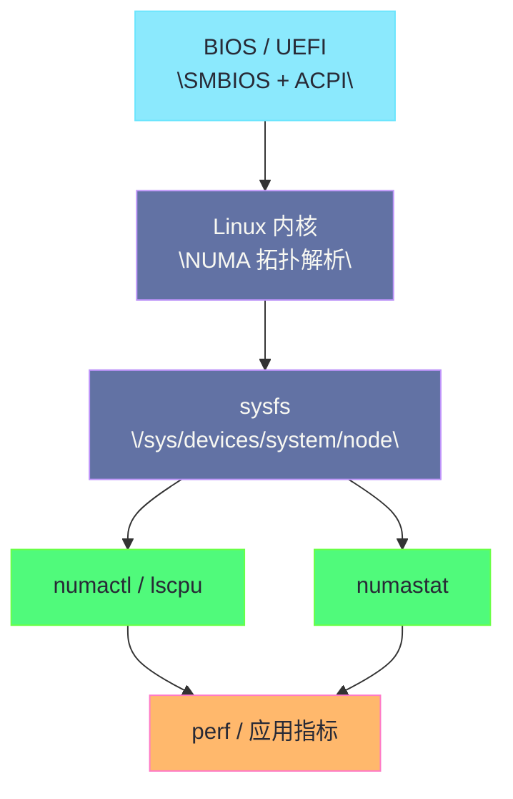

**摘要：**

理解了 [[11 内存硬件全景——DIMM、Channel、Rank、Bank 与寻址层级|DIMM、Channel、Rank、Bank]] 的组织方式，以及 [[12 Row Buffer 命中与 Bank 冲突——内存延迟抖动的硬件根因|Row Buffer 命中与 Bank 冲突]]、[[13 DDR 频率、时序与带宽——CAS、tRCD、tRP 到真实性能|DDR 频率与时序参数]] 之后，下一个现实问题一定会冒出来：**Linux 自己到底能看到什么。**

它能不能告诉你机器插了几根内存条、每根条子的槽位、速率、厂商、Rank 数。

它能不能告诉你 NUMA 节点和 CPU / 内存的对应关系。

它能不能告诉你 ECC 有没有报错，哪个 DIMM 在涨 Corrected Error。

它又能不能直接告诉你 Row Conflict 和内存带宽瓶颈。

答案不是简单的“能”或“不能”。

因为 Linux 对内存硬件的感知，本来就是一条分层链路：**固件枚举提供静态拓扑，内核子系统把这些信息组织成 sysfs / proc / log，用户态工具如 `dmidecode`、`numactl`、`edac-util`、`rasdaemon`、`perf` 再分别从拓扑、可靠性和性能三个角度去读取。**

本文就聚焦这条链路本身。

我们不再讲 DDR 原理，也不直接进入调优动作，而是要讲清：

1. SMBIOS / DMI 能看见什么，不能看见什么。
2. ACPI 的 SRAT / SLIT / HMAT 之类表项如何影响 Linux 的 NUMA 视图。
3. EDAC / RAS 子系统如何暴露内存错误与控制器信息。
4. `numactl`、`lscpu`、sysfs 如何把硬件拓扑变成可读输出。
5. `perf` 为什么只能看到“性能后果”，而不是直接读出“这根 DIMM 的 Row Buffer 命中率”。

---

## 第 1 章 为什么“能理解硬件”不等于“能在 Linux 里看见硬件”

### 1.1 从物理事实到软件视图，中间本来就隔着一层枚举与抽象

内存条插在主板上，是一个物理事实。

但 Linux 并不是直接去“看见”电路板。

它拿到的是：

- 固件提供的描述表；
- 内核驱动识别到的控制器能力；
- 平台 PMU 暴露的计数器；
- 硬件错误上报接口。

这意味着 Linux 世界中的“内存硬件信息”，从来都不是一块完整原石。

它更像不同来源拼起来的地图。

有些部分很静态。

例如槽位、容量、标称速率。

有些部分很动态。

例如纠错错误、当前带宽、远端访问、uncore 事件。

也有些部分根本看不见。

例如精确到每一条业务请求的 Row Hit / Conflict 明细。

### 1.2 为什么排障时总会出现“一个工具说得很清楚，另一个工具完全没有”

这是因为不同工具面对的问题完全不同。

`dmidecode` 关心的是：

- 这台机器有哪些内存设备；
- 槽位叫什么；
- 厂商和标称参数是什么。

`numactl --hardware` 关心的是：

- 内核把这些内存划成了哪些 NUMA 节点；
- 每个节点有哪些 CPU；
- 节点间距离矩阵如何。

EDAC 关心的是：

- 内存控制器是否报告了纠错错误；
- 错误属于 corrected 还是 uncorrected；
- 能不能进一步映射到具体通道或 DIMM。

`perf` 关心的是：

- CPU / uncore 计数器是否显示出带宽压力、cache miss、stall；
- 当前 workload 是否在“等内存”。

如果你用 `dmidecode` 去看实时带宽，自然什么都看不到。

如果你用 `perf` 去问某个槽位是不是空的，也注定答非所问。

### 1.3 为什么要把“发现”“定位”“解释”拆成三件事

遇到内存问题时，很多人会本能地问：

“有没有一个工具能一步给出答案。”

现实里很少有。

更可靠的做法是把问题拆成三件事：

1. **发现拓扑**：这台机器长什么样。
2. **定位异常**：哪一层在报错或不均衡。
3. **解释性能**：这些现象会不会真成为当前业务瓶颈。

静态拓扑更多依赖 SMBIOS / ACPI / sysfs。

异常定位更多依赖 EDAC / RAS / 日志。

性能解释更多依赖 `numactl`、`numastat`、`perf`、应用指标。

这条分工链，就是本文的主线。

为什么能理解硬件不等于能在 Linux 里看见硬件还有一个与"认知 vs 观测"相关的区分——"理解硬件"是"你知道 DRAM 有 Bank/Row"（认知），"在 Linux 看见硬件"是"你能用工具看到 Bank/Row 状态"（观测）。认知可以靠读书建立，观测要靠工具链。所以"认知 ≠ 观测"——理解了不等于能看见。**"认知 ≠ 观测"理解了不等于能看见**——这是能理解 vs 能看见的"区分认知"，认知靠读书观测靠工具。

为什么能理解硬件不等于能在 Linux 里看见硬件还有一个与"工具边界"相关的现实——Linux 工具能看到"NUMA 节点、DIMM 槽位、ECC 错误、带宽流量"，但看不到"Bank 状态、Row Buffer 命中率、Row Conflict 次数"——这些被 IMC 隐藏。所以"工具边界"是现实——能看到上层，看不到 DRAM 内部。**"工具边界"能看到上层看不到 DRAM 内部**——这是能理解 vs 能看见的"边界现实"，IMC 隐藏内部。

---

## 第 2 章 从固件开始：SMBIOS、DMI、SPD 与 Linux 为什么要先信这些表

### 2.1 SMBIOS 是什么，它和 DMI 的关系是什么

很多人会把 SMBIOS 和 DMI 混着说。

工程上问题不大，但最好知道：

- **SMBIOS** 是规范；
- **DMI** 常被当成相关实现与历史称呼；
- `dmidecode` 读取的就是固件暴露出来的这些桌面管理接口表项。

对内存来说，最重要的价值在于：

它为操作系统提供了一份“这台机器装了什么硬件”的结构化清单。

SMBIOS 是什么和 DMI 的关系是什么还有一个与"SMBIOS 版本"相关的演进——SMBIOS 有版本演进（2.x、3.x），新版本加更多字段（譬如 HMAT、PMEM 信息）。旧版本 SMBIOS 可能缺字段——譬如 SMBIOS 2.7 才加 Type 17 的 Rank 字段。所以"SMBIOS 版本"影响"可见字段"——旧版本信息少。**"SMBIOS 版本"影响"可见字段"**——这是 SMBIOS 的"版本演进"，旧版本信息少。

SMBIOS 是什么和 DMI 的关系是什么还有一个与"Type 17"相关的重点——SMBIOS 有多种 Type（Type 0 BIOS、Type 1 系统、Type 4 CPU、Type 17 内存设备）。对内存来说，Type 17（Memory Device）最重要——包含 Locator、Size、Speed、Rank 等。所以 `dmidecode --type memory` 读的就是 Type 17——内存设备表。**Type 17 是内存设备表最重要**——这是 SMBIOS 的"Type 重点"，Type 17 内存设备。

### 2.2 SPD、SMBIOS、内核视图三者别混

SPD 是 DIMM 上 EEPROM 里的参数信息。

SMBIOS 是固件整理后暴露给操作系统的系统级描述。

内核视图则是 Linux 根据固件表、ACPI、驱动初始化再加工出来的运行态认知。

三者关系可以理解为：

1. DIMM 自己先带一份原始身份证。
2. BIOS / UEFI 开机时读取、训练、整合。
3. 再把结果通过 SMBIOS / ACPI 等方式告诉操作系统。

所以 Linux 通常不会直接拿到“裸 SPD 所有字节”。

它更多是在读取固件加工后的结果。

SPD SMBIOS 内核视图三者别混还有一个与"SPD 读取工具"相关的命令——Linux 可以用 `decode-dimms`（来自 `i2c-tools` 包）直接读 SPD——但需要 root 且 i2c 总线可访问。`decode-dimms` 比 `dmidecode` 更原始——直接读 DIMM 的 EEPROM。所以 `decode-dimms` 是"SPD 直读工具"——比 dmidecode 更底层。**`decode-dimms` 是"SPD 直读工具"比 dmidecode 底层**——这是三者别混的"SPD 工具"，直读 EEPROM。

SPD SMBIOS 内核视图三者别混还有一个与"虚拟机无 SPD"相关的边界——虚拟机没有真实 DIMM——SPD 不存在，SMBIOS 是虚拟化层伪造。所以虚拟机里 `decode-dimms` 读不到 SPD——因为没真实 DIMM。**虚拟机无 SPD 读不到**——这是三者别混的"虚拟机边界"，无真实 DIMM。

### 2.3 `dmidecode --type memory` 能看见什么

在大多数物理机上，`dmidecode --type memory` 会给出相当直观的信息：

- `Locator` / `Bank Locator`；
- `Size`；
- `Type`；
- `Speed` / `Configured Memory Speed`；
- `Manufacturer`；
- `Part Number`；
- `Serial Number`；
- `Rank`；
- `Configured Voltage`。

这正是为什么它经常被当成“第一眼看机器内存”的工具。

你要确认某个槽位是不是空着、是不是插满、标称速率是什么，它通常很好用。

dmidecode --type memory 能看见什么还有一个与"Speed vs Configured Speed"相关的关键——`Speed` 是"标称最大速率"（DIMM 支持的最高），`Configured Memory Speed` 是"实际配置速率"（BIOS 训练后的实际）。譬如 Speed=5600 MT/s 但 Configured=4400 MT/s——说明降频了。所以"Speed vs Configured Speed"要分清——Configured 才是实际。**"Speed vs Configured Speed"要分清 Configured 才是实际**——这是 dmidecode 的"速率分清"，Configured 是实际。

dmidecode --type memory 能看见什么还有一个与"Rank 字段"相关的注意——`Rank` 字段告诉你这根 DIMM 有几个 Rank（1/2/4）。但注意：有的平台 SMBIOS 不填 Rank——字段缺失不代表无 Rank。所以"Rank 字段缺失"不等于"无 Rank"——可能只是没填。**"Rank 字段缺失"不等于"无 Rank"可能没填**——这是 dmidecode 的"Rank 注意"，缺失非无。

### 2.4 但 `dmidecode` 看到的是“固件报告”，不是“电气实时真相”

这句话非常重要。

因为很多人看到 `dmidecode` 输出，就会误以为那是内核实时探测的铁事实。

其实不然。

它读取的是固件暴露的表。

所以它有几个天然边界：

1. 如果固件填得不完整，输出就不完整。
2. 如果是虚拟机，很多字段可能是虚拟化层伪造的。
3. 它不会告诉你此刻带宽是否打满。
4. 它不会告诉你有没有 Row Conflict。
5. 它甚至不保证 `Rank`、`Configured Speed` 在所有平台上都绝对精准。

也就是说，`dmidecode` 很适合做**静态清点**，不适合做**动态性能判断**。

dmidecode 看到的是固件报告不是电气实时真相还有一个与"固件 bug"相关的风险——有时固件 SMBIOS 表有 bug——填错字段（譬如 Rank 填错、Speed 填错）。`dmidecode` 忠实显示错误信息——你以为是真相，其实是固件 bug。所以"固件 bug"让 dmidecode 输出可能错——不能盲信。**"固件 bug"让 dmidecode 输出可能错不能盲信**——这是固件报告的"bug 风险"，不能盲信。

dmidecode 看到的是固件报告不是电气实时真相还有一个与"交叉验证"相关的实践——重要决策（譬如采购、扩容）要"交叉验证"：`dmidecode` + `lshw -class memory` + 带外管理（IPMI/Redfish）+ 物理检查。多源交叉验证——避免单一工具错误。所以"交叉验证"是重要决策的纪律——不靠单一工具。**"交叉验证"是重要决策的纪律不靠单一工具**——这是固件报告的"验证实践"，多源交叉。

### 2.5 一个典型的理解方式

更稳妥的使用姿势不是把 `dmidecode` 当成万能工具。

而是把它看成：

> [!info] 核心概念
> Linux 观测内存硬件的第一站，是“固件告诉我这台机器本来应该长什么样”；这解决的是拓扑与配置识别，不是动态性能与错误定位。

### 2.6 为什么云主机环境里经常看到“看起来很奇怪的内存条信息”

因为云平台常常不会把宿主机真实 DIMM 信息完整透传给客体系统。

这会带来几种常见现象：

- `Manufacturer` 看起来很泛；
- 槽位名字非常抽象；
- `Rank`、`Part Number` 缺失；
- 所有内存都像挂在一个统一设备上。

这不是 Linux 能力不足。

而是虚拟化层本就不打算把物理主机硬件细节完整暴露给来宾。

所以在云环境里，SMBIOS 视角常常只能作为“有限参考”。

云主机环境里经常看到看起来很奇怪的内存条信息还有一个与"vNUMA"相关的虚拟——云平台可能给虚拟机配"虚拟 NUMA"（vNUMA）——虚拟机的 NUMA 节点是虚拟化层映射的，不对应宿主机真实 NUMA。所以云主机 `numactl --hardware` 看到的是"vNUMA"——不是宿主机真实 NUMA。**云主机 `numactl` 看到"vNUMA"非真实 NUMA**——这是云主机奇怪的"vNUMA 虚拟"，不对应宿主机。

云主机环境里经常看到看起来很奇怪的内存条信息还有一个与"性能影响"相关的复杂——vNUMA 不对应宿主机真实 NUMA——虚拟机的"本地访问"可能实际跨宿主机 NUMA——性能不可预测。所以云主机 NUMA 性能"不可预测"——vNUMA 映射隐藏真实拓扑。**云主机 NUMA 性能"不可预测"vNUMA 隐藏真实拓扑**——这是云主机奇怪的"性能影响"，不可预测。

---

## 第 3 章 Linux 如何建立 NUMA 视图：ACPI 表、sysfs、`lscpu` 与 `numactl`

### 3.1 NUMA 不是 `numactl` 发明的，它先来自固件拓扑描述

很多人第一次接触 NUMA 是从 `numactl --hardware` 开始的。

但 `numactl` 只是读者。

真正定义系统 NUMA 拓扑的，往往是固件通过 ACPI 提供的拓扑表，再由内核解析。

对 Linux 工程师来说，不要求你天天去看原始 ACPI 二进制表。

但需要知道：

系统里的“node0 / node1 / node distances”不是凭空生成的。

它背后有平台拓扑描述来源。

NUMA 不是 numactl 发明的它先来自固件拓扑描述还有一个与"ACPI 表二进制"相关的格式——ACPI 表是二进制格式——Linux 用 `acpidump` + `iasl` 反编译可读。工程师通常不直接读 ACPI 二进制——但知道"ACPI 表可反编译"有助于深入排查。所以"ACPI 表可反编译"是深入排查的能力——`acpidump` + `iasl`。**"ACPI 表可反编译"用 acpidump + iasl**——这是 NUMA 固件的"格式认知"，可反编译深入。

NUMA 不是 numactl 发明的它先来自固件拓扑描述还有一个与"固件 bug 影响 NUMA"相关的风险——如果固件 SRAT/SLIT 填错——Linux NUMA 视图就错——譬如把远端填成本地（distance=10），Linux 以为本地实际远端——性能差。所以"固件 bug 影响 NUMA"——SRAT/SLIT 错则 NUMA 视图错。**"固件 bug 影响 NUMA"SRAT/SLIT 错则视图错**——这是 NUMA 固件的"bug 风险"，填错视图错。

### 3.2 SRAT、SLIT、HMAT 分别大致解决什么问题

在 NUMA 相关 ACPI 表项中，可以建立如下粗粒度理解：

- **SRAT**：告诉操作系统 CPU、内存区域属于哪个 NUMA 节点。
- **SLIT**：给出节点之间的相对距离矩阵。
- **HMAT**：在更现代的平台里补充不同内存目标的带宽 / 延迟等性能属性描述。

你不必死记字段定义。

但至少要建立一个常识：

Linux 所看到的 NUMA 结构，不只是“有哪些节点”，还包括“节点间远近关系”。

SRAT SLIT HMAT 分别大致解决什么问题还有一个与"HMAT 新增"相关的现代——HMAT（Heterogeneous Memory Attribute Table）是较新的 ACPI 表——补充"内存性能属性"（带宽、延迟）。传统 SRAT/SLIT 只给"拓扑 + 距离"——HMAT 给"性能数字"。所以 HMAT 是"NUMA 性能补充"——从拓扑到性能数字。**HMAT 是"NUMA 性能补充"从拓扑到性能数字**——这是 SRAT/SLIT/HMAT 的"现代新增"，HMAT 补性能。

SRAT SLIT HMAT 分别大致解决什么问题还有一个与"PMEM / CXL"相关的扩展——HMAT 也用于描述 PMEM（Intel Optane）和 CXL 内存——这些是"异构内存"（不同带宽延迟）。HMAT 让 Linux 知道"哪种内存快哪种慢"——支持异构内存调度。所以 HMAT 支持"异构内存"——PMEM/CXL 的性能描述。**HMAT 支持"异构内存"PMEM/CXL 性能描述**——这是 SRAT/SLIT/HMAT 的"异构扩展"，PMEM/CXL。

### 3.3 `/sys/devices/system/node/` 是内核 NUMA 视图的核心出口

Linux 把 NUMA 相关信息组织在 sysfs 中。

常见入口包括：

- `/sys/devices/system/node/node*/cpulist`
- `/sys/devices/system/node/node*/meminfo`
- `/sys/devices/system/node/node*/distance`

这些文件的价值在于：

它们比人类友好的命令输出更接近内核原始视图。

当你怀疑 `numactl`、`lscpu` 某个输出有歧义时，回到 sysfs 往往更可靠。

sysfs 是内核 NUMA 视图核心出口还有一个与"numastat vs sysfs"相关的区分——`numastat` 命令读的是 `/sys/devices/system/node/node*/numastat`——是 sysfs 的"用户态封装"。所以 `numastat` 本质是"sysfs 的封装"——底层是 sysfs。**`numastat` 本质是"sysfs 封装"**——这是 sysfs 核心的"封装认知"，numastat 读 sysfs。

sysfs 是内核 NUMA 视图核心出口还有一个与"distance 矩阵"相关的解读——`/sys/devices/system/node/node0/distance` 给出"node0 到各节点的距离"——譬如"10 20"表示 node0 到 node0=10（本地），node0 到 node1=20（远端）。distance 是"相对值"——10=本地，20=远端（2 倍延迟）。所以"distance 矩阵"解读"10 本地 20 远端"——相对值非绝对。**"distance 矩阵"10 本地 20 远端相对值**——这是 sysfs 核心的"distance 解读"，相对值非绝对。

### 3.4 `numactl --hardware` 真正在做什么

`numactl --hardware` 主要是把内核 NUMA 视图翻译成工程师易读的摘要：

- 可用节点数；
- 每个节点的 CPU；
- 每个节点的大小与空闲量；
- 距离矩阵。

它适合用来快速回答下面这类问题：

1. 这是不是一台多 NUMA 节点机器。
2. 哪些 CPU 属于同一节点。
3. 节点之间本地 / 远端的距离是多少。
4. 目前每个节点剩余多少内存。

numactl --hardware 真正在做什么还有一个与"memory policy"相关的扩展——`numactl` 不只是看拓扑——还能"设置内存策略"：`numactl --membind`、`numactl --cpunodebind`、`numactl --interleave`。所以 `numactl` 是"看 + 设置"双重工具——看拓扑 + 设置策略。**`numactl` 是"看 + 设置"双重工具**——这是 numactl 的"扩展认知"，看拓扑 + 设置策略。

numactl --hardware 真正在做什么还有一个与"numactl 运行程序"相关的用法——`numactl --cpunodebind=0 --membind=0 ./program`——用 numactl 运行程序并绑核绑内存。所以 `numactl` 能"运行时绑定"——不只是看，还能绑。**`numactl` 能"运行时绑定"不只是看还能绑**——这是 numactl 的"用法认知"，运行时绑定。

### 3.5 `lscpu` 为什么也必须一起看

`lscpu` 的价值在于，它会从 CPU 拓扑角度补充：

- Socket；
- Core；
- NUMA node；
- 线程数；
- 某些缓存共享关系。

内存问题很多时候不是单纯看“内存属于哪个节点”。

而是要看：

**当前线程跑在哪些 CPU 上，而这些 CPU 对应哪个内存节点。**

因此，把 `lscpu` 和 `numactl --hardware` 对起来看，往往比单看其一更稳妥。

lscpu 为什么也必须一起看还有一个与"CPU cache 共享"相关的补充——`lscpu` 还显示"CPU cache 共享关系"——譬如 L1/L2 私有，L3 共享于哪些核。这有助于理解"哪些核共享 LLC"——对 LLC miss 分析有用。所以 `lscpu` 补充"cache 共享"——不只是 NUMA。**`lscpu` 补充"cache 共享"不只是 NUMA**——这是 lscpu 的"cache 补充"，看 LLC 共享。

lscpu 为什么也必须一起看还有一个与"NUMA + CPU 对应"相关的核心——`lscpu` 的 NUMA node 字段告诉你"哪些 CPU 属于哪个 NUMA node"——和 `numactl --hardware` 的 CPU 列表对应。两者对起来看——确认"CPU 核 → NUMA 节点"映射一致。所以"NUMA + CPU 对应"是 lscpu + numactl 的核心——交叉确认映射。**"NUMA + CPU 对应"是 lscpu + numactl 核心交叉确认**——这是 lscpu 的"对应核心"，交叉确认。

### 3.6 `numastat` 为什么属于“运行时现象”，不是“静态拓扑”

虽然它名字和 NUMA 拓扑紧密相关，但 `numastat` 更偏运行时观察。

它关心的是：

- `numa_hit`；
- `numa_miss`；
- `other_node`；
- `local_node`；
- 进程级跨节点分布。

因此它处在链路中一个更靠后的位置：

先有拓扑，再有访问，再有统计。

这点非常重要。

因为它说明 `numastat` 看到的是“你有没有用错拓扑”，而不是“机器拓扑本身长什么样”。

numastat 属于运行时现象不是静态拓扑还有一个与"numa_hit vs numa_miss"相关的解读——`numa_hit` = "访问命中本节点"（好），`numa_miss` = "访问命中其他节点"（坏，远端）。理想状态 numa_hit 高 numa_miss 低。如果 numa_miss 高——说明跨节点访问多——要绑核绑内存。所以"numa_hit 高 numa_miss 低"是理想——miss 高要绑。**"numa_hit 高 numa_miss 低"是理想 miss 高要绑**——这是 numastat 的"指标解读"，hit 好miss 坏。

numastat 属于运行时现象不是静态拓扑还有一个与"numastat -p pid"相关的进程级——`numastat -p <pid>` 看具体进程的跨节点分布——比全局 numastat 更精准。定位"哪个进程跨节点多"——用 `-p`。所以 `numastat -p` 是"进程级 NUMA 观测"——比全局精准。**`numastat -p` 是"进程级 NUMA 观测"比全局精准**——这是 numastat 的"进程级"，定位具体进程。

### 3.7 一个从固件到用户态的 NUMA 观测流程图



这个图要表达的重点是：

拓扑识别和性能解释是两段不同流程。

没有前面的拓扑地图，后面的性能观测就很容易误读。

从固件到用户态的 NUMA 观测流程图还有一个与"分层排查"相关的方法——图的分层是"固件 → 内核 → sysfs → 工具 → 性能"——排查时按层从下往上：先看固件（SMBIOS/ACPI），再看内核（sysfs），再看工具（numactl/lscpu），最后看性能（numastat/perf）。所以"分层排查从下往上"是流程图的方法——不跳层。**"分层排查从下往上"是流程图方法不跳层**——这是流程图的"排查方法"，从下往上。

从固件到用户态的 NUMA 观测流程图还有一个与"拓扑先于性能"相关的纪律——图的核心纪律是"拓扑先于性能"——先搞清拓扑（numactl/lscpu），再看性能（numastat/perf）。没有拓扑基础，性能数据无法解释（譬如不知道节点距离，就无法判断"远端访问"是否异常）。所以"拓扑先于性能"是流程图的纪律——先拓扑后性能。**"拓扑先于性能"是流程图纪律先拓扑后性能**——这是流程图的"排查纪律"，先拓扑。

---

## 第 4 章 EDAC 与 RAS：Linux 如何知道“内存正在出错”

### 4.1 为什么需要单独一条“可靠性链路”

前面讲的 SMBIOS / NUMA 视图，本质上都在回答：

- 机器怎么组织；
- 节点怎么划分；
- 槽位怎么命名。

但生产中还有另一类更紧急的问题：

1. 某根 DIMM 是否正在累积 corrected error。
2. 某个内存通道是否反复出现 ECC 报警。
3. 是否已经出现 uncorrected / fatal error。
4. 这些错误能不能映射到具体 FRU，便于更换。

这就进入了 **EDAC / RAS** 的世界。

为什么需要单独一条可靠性链路还有一个与"性能 vs 可靠"相关的分治——性能链路（numactl/perf）看"快不快"，可靠链路（EDAC/RAS）看"对不对"（数据有没有错）。两者分治——性能工具看不到 ECC 错误，EDAC 工具看不到带宽。所以"性能 vs 可靠"分治——不同工具看不同维度。**"性能 vs 可靠"分治不同工具看不同维度**——这是可靠性链路的"分治认知"，性能看快慢可靠看对错。

为什么需要单独一条可靠性链路还有一个与"CE 累积 vs UE 致命"相关的紧急度——CE（可纠正）累积是"慢性病"——慢慢恶化，不紧急但要跟踪。UE（不可纠正）是"急症"——可能 MCE/panic，紧急。所以 EDAC 区分"CE 慢性 vs UE 急症"——不同紧急度不同响应。**EDAC 区分"CE 慢性 vs UE 急症"不同紧急度**——这是可靠性链路的"紧急度认知"，CE 慢 UE 急。

### 4.2 EDAC 的核心职责是什么

EDAC 可以粗略理解为 Linux 里围绕 **Error Detection And Correction** 建立的一套内存控制器错误上报框架。

它的核心意义不是做性能优化。

而是把硬件控制器报告的错误，组织成统一的内核接口和日志。

对于内存来说，它常常围绕：

- memory controller；
- channel；
- csrow / DIMM；
- corrected error；
- uncorrected error。

等对象和事件来表达。

EDAC 的核心职责是什么还有一个与"EDAC 驱动平台相关"相关的注意——EDAC 驱动是"平台相关"的——Intel/AMD/ARM 不同平台有不同 EDAC 驱动（譬如 Intel 的 `intel_edac`、AMD 的 `amd64_edac`）。如果平台无 EDAC 驱动——看不到 ECC 错误。所以"EDAC 驱动平台相关"——无驱动则无 EDAC。**"EDAC 驱动平台相关"无驱动则无 EDAC**——这是 EDAC 职责的"平台注意"，驱动相关。

EDAC 的核心职责是什么还有一个与"edac-util"相关的工具——`edac-util` 是 EDAC 的用户态工具——从 `/sys/devices/system/edac/mc/` 读取 CE/UE 计数，按 mc/csrow/dimm 分组显示。所以 `edac-util` 是"EDAC 的用户态接口"——把 sysfs 的 EDAC 信息人类可读化。**`edac-util` 是"EDAC 用户态接口"人类可读化**——这是 EDAC 职责的"工具认知"，edac-util 读 sysfs。

### 4.3 corrected error 与 uncorrected error 的工程意义差别极大

这两个词不能只理解成“一个轻，一个重”。

更准确的说法是：

- **Corrected Error**：硬件 ECC 已经纠正，但它提示这条链路或颗粒可能在恶化。
- **Uncorrected Error**：硬件无法自行纠正，数据可靠性已经受到真实威胁，可能引发 MCE、panic、page offlining、进程杀死等后果。

所以正确的排障姿势不是看到 corrected error 就无视。

它往往是更严重问题的前兆。

corrected error 与 uncorrected error 工程意义差别极大还有一个与"CE 频率趋势"相关的判断——单次 CE 不紧急——但 CE 频率"趋势上升"紧急（譬如从 1 次/天升到 100 次/天）——说明 DIMM 在恶化——要提前换。所以"CE 频率趋势"比"单次 CE"更重要——趋势上升要换。**"CE 频率趋势"比单次 CE 更重要趋势上升要换**——这是 CE/UE 差别的"趋势判断"，趋势上升紧急。

corrected error 与 uncorrected error 工程意义差别极大还有一个与"UE 后果"相关的严重——UE 后果：MCE（Machine Check Exception）→ 内核 panic → 系统崩溃；或 page offlining → 内核隔离坏页 → 进程被杀。所以 UE 后果"严重"——可能崩溃或杀进程。**UE 后果"严重"可能崩溃或杀进程**——这是 CE/UE 差别的"UE 后果"，MCE panic 或 page offlining。

### 4.4 `/sys/devices/system/edac/` 与内核日志是最常见入口

在支持的物理机平台上，EDAC 通常会在 sysfs 中暴露控制器相关信息。

同时，错误事件也可能出现在：

- `dmesg`；
- `journalctl -k`；
- `rasdaemon` 收集的数据中。

sysfs 提供的是结构化状态。

日志提供的是时间序列事件。

二者最好结合使用。

sysfs 与内核日志是最常见入口还有一个与"sysfs 结构"相关的路径——EDAC sysfs 结构：`/sys/devices/system/edac/mc/mc0/`（memory controller 0）、`mc0/csrow0/`（chip-select row 0）、`mc0/dimm0/`（DIMM 0）。`ce_count`、`ue_count` 在对应目录。所以 sysfs 结构是"mc/csrow/dimm 层级"——按层级查 CE/UE。**sysfs 结构"mc/csrow/dimm 层级"按层级查**——这是 sysfs 入口的"结构认知"，按层级查 CE/UE。

sysfs 与内核日志是最常见入口还有一个与"dmesg EDAC 消息"相关的日志——EDAC 错误也会在 `dmesg` 打印——譬如"EDAC MC0: 1 CE memory read error on CPU_SrcID#0_MC#0_Chan#1_DIMM#0"。所以 `dmesg | grep EDAC` 能看 EDAC 错误——时间序列事件。**`dmesg | grep EDAC` 看时间序列错误**——这是 sysfs 入口的"dmesg 日志"，时间序列事件。

### 4.5 为什么 `rasdaemon` 经常比肉眼翻日志更靠谱

内存错误如果是偶发的、低频的、跨数周累积的，单纯靠手工 grep 日志很容易漏。

`rasdaemon` 的价值就在于：

它把 EDAC、MCE 等 RAS 事件持续收集并结构化保存下来。

这样你可以更容易回答：

1. 哪个 DIMM 的 CE 在持续上涨。
2. 某种错误是集中在特定节点，还是全局随机分布。
3. 错误是否与某次扩容、温度变化、固件升级同时出现。

rasdaemon 经常比肉眼翻日志更靠谱还有一个与"rasdaemon 结构化"相关的价值——`rasdaemon` 把 EDAC/MCE 事件存入 SQLite 数据库——可查询、可聚合。譬如"查最近 30 天每 DIMM 的 CE 趋势"——`rasdaemon` 能查，grep 日志不能。所以 `rasdaemon` 是"结构化 RAS 数据库"——可查询可聚合。**`rasdaemon` 是"结构化 RAS 数据库"可查询可聚合**——这是 rasdaemon 的"结构化价值"，SQLite 存储。

rasdaemon 经常比肉眼翻日志更靠谱还有一个与"ras-mc-ctl"相关的工具——`ras-mc-ctl` 是 `rasdaemon` 的查询工具——从 SQLite 查询 RAS 事件。譬如 `ras-mc-ctl --summary` 给出错误摘要。所以 `ras-mc-ctl` 是"rasdaemon 的查询接口"——人类可读查询。**`ras-mc-ctl` 是"rasdaemon 查询接口"人类可读**——这是 rasdaemon 的"查询工具"，人类可读。

### 4.6 EDAC 能告诉你“坏了”，但不一定能告诉你“为什么慢了”

这一点必须明确。

EDAC 擅长的是可靠性视角：

- 哪个控制器报错；
- 哪类 ECC 问题在发生；
- 是否已经需要换条子。

但如果你的问题是：

“为什么这个业务 P99 变差了。”

EDAC 往往不是第一现场。

除非慢的原因真是硬件错误重试、poisoned memory、page offlining 等可靠性事件。

大多数情况下，性能变慢还是要回到 `numactl`、`perf`、带宽、延迟这条链去解释。

EDAC 能告诉你坏了但不一定能告诉你为什么慢了还有一个与"CE 重试开销"相关的例外——虽然 EDAC 不直接看性能——但 CE 频繁时，硬件纠错有"重试开销"——控制器花时间纠错，延迟增加。所以 CE 频繁可能"间接降性能"——纠错重试开销。**CE 频繁可能"间接降性能"纠错重试开销**——这是 EDAC 不看性能的"例外认知"，CE 重试降性能。

EDAC 能告诉你坏了但不一定能告诉你为什么慢了还有一个与"page offlining 性能影响"相关的后果——UE 后内核可能 page offlining——隔离坏页——可用内存减少。如果 offlining 多——可用内存少——可能触发 swap——性能降。所以 UE 后 page offlining 可能"间接降性能"——可用内存减少。**UE 后 page offlining 可能"间接降性能"可用内存减少**——这是 EDAC 不看性能的"offlining 后果"，可用内存减。

### 4.7 一个常见误区：没有 EDAC 输出，不代表没有内存硬件问题

有几种情况会导致你看不到理想中的 EDAC 信息：

1. 平台驱动不支持。
2. 固件没有完整暴露。
3. 云主机做了抽象与屏蔽。
4. 某些错误只通过别的 RAS / MCE 路径暴露。
5. 问题本来就不是 ECC 错误，而是带宽、NUMA、行冲突。

所以“EDAC 很安静”只能说明“没看到被这套链路定义的错误”。

它不能推导成“内存相关根因全部排除”。

没有 EDAC 输出不代表没有内存硬件问题还有一个与"确认 EDAC 驱动加载"相关的检查——要确认 EDAC 驱动是否加载：`lsmod | grep edac`——如果无输出，说明 EDAC 驱动未加载——看不到错误不等于无错误。所以"确认 EDAC 驱动加载"是前提——`lsmod | grep edac`。**"确认 EDAC 驱动加载"是前提 lsmod grep edac**——这是无 EDAC 输出的"驱动检查"，确认加载。

没有 EDAC 输出不代表没有内存硬件问题还有一个与"mcelog"相关的补充——除了 EDAC，还有 `mcelog` 工具——从 `/dev/mcelog` 读 MCE 事件。如果 EDAC 驱动未加载，`mcelog` 可能仍能抓 MCE。所以 `mcelog` 是 EDAC 的"补充路径"——另一条 RAS 事件来源。**`mcelog` 是 EDAC 的"补充路径"另一条 RAS 来源**——这是无 EDAC 输出的"mcelog 补充"，另一条路径。

---

## 第 5 章 `perf` 在这条链里扮演什么角色：它看到的是结果，不是 DIMM 名册

### 5.1 为什么 `perf` 和 `dmidecode` 根本不在一个层次上

`dmidecode` 看的是平台配置。

`perf` 看的是运行时计数器。

前者回答“你装了什么”。

后者回答“它跑成什么样”。

因此，`perf` 不会告诉你：

- 第 3 号槽位是否空着；
- 这根条子的序列号是什么；
- `Part Number` 如何。

它回答的是：

- 核心是否在大量等内存；
- uncore IMC 读写事务有多高；
- cache miss、stall、bandwidth 是否异常。

perf 和 dmidecode 根本不在一个层次上还有一个与"静态 vs 动态"相关的本质——`dmidecode` 是"静态"（开机时固件填好，不变），`perf` 是"动态"（运行时计数器，实时变）。所以两者"静态 vs 动态"——dmidecode 看配置，perf 看运行。**"静态 vs 动态"dmidecode 看配置 perf 看运行**——这是 perf vs dmidecode 的"本质区分"，静 vs 动。

perf 和 dmidecode 根本不在一个层次上还有一个与"配置 vs 后果"相关的视角——`dmidecode` 看"配置"（装了什么），`perf` 看"后果"（跑成什么样）。配置好不代表后果好——譬如装了 DDR5-5600（配置好）但 workload 是 latency bound（后果差）。所以"配置 vs 后果"——dmidecode 看配置，perf 看后果，两者要结合。**"配置 vs 后果"dmidecode 看配置 perf 看后果**——这是 perf vs dmidecode 的"视角区分"，配置非后果。

### 5.2 core PMU 与 uncore PMU 的差别是什么

从工程上可以这样理解：

- **core PMU** 更靠近 CPU 核心，擅长看 `cycles`、`instructions`、cache miss、branch、topdown。
- **uncore PMU** 更靠近核心外部共享资源，如 LLC slice、IMC、互联、某些内存控制器计数器。

对于内存性能分析，两者往往要一起看。

因为：

1. core PMU 告诉你 CPU 是否被内存拖住。
2. uncore PMU 告诉你内存子系统是否在高负荷、读写分布如何、控制器活动如何。

core PMU 与 uncore PMU 的差别是什么还有一个与"uncore 事件名平台相关"相关的注意——uncore PMU 事件名高度平台相关——Intel 用 `uncore_imc/cas_count.read/`，AMD 用不同名字。所以 uncore 事件"不能跨平台复制命令"——要先 `perf list` 确认。**uncore 事件"不能跨平台复制命令"先 perf list 确认**——这是 core/uncore 的"平台注意"，事件名相关。

core PMU 与 uncore PMU 的差别是什么还有一个与"uncore 事件需要 root"相关的权限——uncore PMU 通常需要 root 权限——普通用户看不到。容器/云主机可能限制 uncore PMU——租户用不了。所以 uncore PMU "需要 root"——容器可能限制。**uncore PMU"需要 root"容器可能限制**——这是 core/uncore 的"权限注意"，需 root。

### 5.3 `perf list` 为什么是必须先看的命令

不同平台暴露的事件集并不完全相同。

尤其是 uncore IMC 相关事件，命名常常高度平台相关。

所以任何关于内存控制器事件的分析，第一步都应该先看：

```bash
perf list | grep -i uncore
```

你需要确认：

1. 平台是否真的暴露了 IMC / HA / CHA / UPI 等 uncore PMU。
2. 事件名字是什么。
3. 这些事件到底支持计数什么。

否则你很容易在网上复制一条命令，结果在自己的机器上根本不可用。

perf list 为什么是必须先看的命令还有一个与"perf list 分类"相关的浏览——`perf list` 输出按分类：Hardware event、Software event、Hardware cache event、Raw hardware event descriptor、PMU event。uncore IMC 事件在"PMU event"分类下。所以 `perf list` 浏览要"看 PMU event 分类"——找 uncore 事件。**`perf list` 浏览看"PMU event 分类"找 uncore**——这是 perf list 的"分类浏览"，PMU event 找 uncore。

perf list 为什么是必须先看的命令还有一个与"perf list grep"相关的技巧——`perf list | grep -i imc` 找 IMC 事件，`perf list | grep -i mem` 找内存事件，`perf list | grep -i uncore` 找 uncore 事件。所以 `perf list | grep` 是"快速找事件"的技巧——按关键词过滤。**`perf list | grep` 是"快速找事件"技巧按关键词过滤**——这是 perf list 的"grep 技巧"，按词过滤。

### 5.4 `perf stat` 在内存问题上最常用于回答什么

它通常帮助回答四类问题：

1. 当前 workload 是不是明显 memory bound。
2. 带宽有没有接近控制器供给上限。
3. 修改 NUMA 策略后，core stall 与 uncore 流量有没有变化。
4. 某个场景里的改善是来自减少远端访问，还是只是减少了 CPU 空转。

这说明 `perf` 在整条链里更靠近“解释性能后果”。

它不是最前面的拓扑工具，也不是最中间的错误告警工具。

perf stat 在内存问题上最常用于回答什么还有一个与"perf stat 命令示例"相关的实践——典型命令：`perf stat -e cycles,instructions,cache-misses,LLC-load-misses ./program`——看基本内存指标。或 `perf stat -e uncore_imc/cas_count.read/,uncore_imc/cas_count.write/ ./program`——看 IMC 读写量。所以 `perf stat -e` 是"指定事件"的实践——按需选事件。**`perf stat -e` 是"指定事件"实践按需选**——这是 perf stat 的"命令示例"，指定事件。

perf stat 在内存问题上最常用于回答什么还有一个与"Topdown 一站式"相关的推荐——`perf stat -a --topdown ./program`——一站式看 Topdown 分析（frontend bound、backend bound、retiring、branch mispredict）。backend bound 高 → memory bound → 内存是瓶颈。所以 `--topdown` 是"一站式"内存瓶颈判断——看 backend bound。**`--topdown` 是"一站式"内存瓶颈判断看 backend bound**——这是 perf stat 的"topdown 推荐"，一站式看。

### 5.5 为什么 `perf` 不能直接回答“是不是 Row Conflict”

首先，很多平台根本不会给出一个名叫 `row_conflict_total` 的通用事件。

其次，即便厂商提供了某些更细的控制器事件，也往往：

- 需要特定型号；
- 语义复杂；
- 难以跨代际直接类比。

因此，Row Buffer / Bank 冲突的归因常常还是要靠组合判断：

1. 访问模式与数据布局不友好。
2. `perf` 显示显著 memory bound。
3. 带宽未必满，但延迟与长尾明显恶化。
4. NUMA 绑定正确，页错误不高，锁竞争也不是主因。

于是你才会把根因收敛到更底层的 DRAM 访问路径。

perf 不能直接回答是不是 Row Conflict 还有一个与"组合判断清单"相关的实践——Row Conflict 的组合判断清单：① 访问模式随机（pointer chasing、哈希查询）；② perf 显示 memory bound（backend bound 高）；③ 带宽未满但延迟高（latency bound）；④ NUMA 正确（numastat miss 低）；⑤ 锁竞争不是主因（perf 无锁等待）。五条都满足 → 才收敛到 Row Conflict。所以"组合判断清单"是 Row Conflict 归因的实践——五条都满足。**"组合判断清单"五条都满足才收敛 Row Conflict**——这是 perf 不直接回答的"判断清单"，五条组合。

perf 不能直接回答是不是 Row Conflict 还有一个与"排除法"相关的纪律——Row Conflict 归因用"排除法"——先排除 NUMA（numastat）、再排除锁（perf 锁事件）、再排除带宽（IMC 流量）、最后剩"Row Conflict"。所以"排除法"是 Row Conflict 归因的纪律——逐层排除。**"排除法"是 Row Conflict 归因纪律逐层排除**——这是 perf 不直接回答的"排除纪律"，逐层排除。

### 5.6 一个更现实的结论

> [!note] 设计哲学
> `perf` 的价值不是“替你直接看见内存条内部”，而是把硬件问题投影到 CPU stall、uncore 事务和带宽/延迟症状上，让你能把前面静态拓扑和后面的业务表现接起来。

一个更现实的结论还有一个与"投影"相关的比喻——`perf` 是"投影仪"——把 DRAM 内部行为"投影"到 CPU stall/uncore 事务上。你看不到 DRAM 内部（被 IMC 隐藏），但能看到"投影"——从投影推断内部。所以 `perf` 是"投影仪"——从投影推断内部。**`perf` 是"投影仪"从投影推断内部**——这是现实结论的"投影比喻"，从投影推断。

一个更现实的结论还有一个与"perf 不是万能"相关的克制——`perf` 能看"性能后果"但不能看"硬件内部"——不是万能。要配合 `dmidecode`（拓扑）、EDAC（错误）、`numastat`（NUMA 使用）——多工具协同。所以"perf 不是万能"——多工具协同才完整。**"perf 不是万能"多工具协同才完整**——这是现实结论的"克制认知"，多工具协同。

---

## 第 6 章 一条完整的 Linux 观测链路：从“机器长什么样”到“业务为什么慢”

### 6.1 第一步：先确认平台配置与插条事实

先用静态工具回答：

1. 插了几根条。
2. 每个槽位大小是什么。
3. 额定 / 配置速度是什么。
4. 是否有空槽、混插、降频风险。

这一阶段最常见的是：

- `dmidecode --type memory`
- `lshw -class memory`
- 服务器带外管理界面

这里的目标不是性能诊断。

而是先把硬件事实校正好。

第一步先确认平台配置与插条事实还有一个与"dmidecode 输出重定向"相关的技巧——`dmidecode --type memory` 输出可能很长——重定向到文件再 grep 关键字段：`dmidecode --type memory > /tmp/dmi.log; grep -E "Size|Speed|Rank|Locator" /tmp/dmi.log`。所以"输出重定向 + grep"是 dmidecode 的技巧——避免终端刷屏。**"输出重定向 + grep"是 dmidecode 技巧避免刷屏**——这是第一步的"重定向技巧"，grep 关键字段。

第一步先确认平台配置与插条事实还有一个与"空槽识别"相关的判断——`dmidecode` 中 `Size: No Module Installed` 表示空槽。grep `Size` 后看"No Module Installed"数量——确认空槽数。所以"空槽识别"看 `Size: No Module Installed`——确认插满与否。**"空槽识别"看 `No Module Installed`确认插满**——这是第一步的"空槽判断"，看 Size 字段。

### 6.2 第二步：确认内核眼中的 NUMA 结构

接下来用：

- `numactl --hardware`
- `lscpu`
- `/sys/devices/system/node/`

确认：

1. 节点数是否符合预期。
2. CPU 和内存的归属是否合理。
3. 距离矩阵是否存在异常。

如果这一步都没确认，后面的 `membind`、本地访问、跨节点解释都会失去基础。

第二步确认内核眼中的 NUMA 结构还有一个与"distance 矩阵检查"相关的重点——`numactl --hardware` 的 distance 矩阵要检查：本地=10，远端=20+（典型）。如果远端=10（和本地一样）——可能固件 SLIT 填错——NUMA 优化无效。所以"distance 矩阵检查"是第二步的重点——确认远端 > 本地。**"distance 矩阵检查"确认远端 > 本地**——这是第二步的"distance 重点"，远端应大于本地。

第二步确认内核眼中的 NUMA 结构还有一个与"node 数量"相关的预期——双路服务器典型 2 个 NUMA 节点（node0、node1）。如果只看到 1 个节点——可能 BIOS 关闭了 NUMA（或单路机器）——要确认是否符合预期。所以"node 数量"要符合预期——双路应 2 节点。**"node 数量"要符合预期双路应 2 节点**——这是第二步的"node 检查"，数量符合预期。

### 6.3 第三步：看运行时分配有没有偏离拓扑预期

这时再上：

- `numastat`
- `numastat -p <pid>`
- `/proc/<pid>/numa_maps`

去判断：

1. 进程内存是不是主要落在预期节点。
2. 是否存在大量 `other_node` 或 `numa_miss`。
3. 自动 NUMA 平衡是否在迁移页面。

到这里，链路已经从“机器怎么装的”走到了“进程怎么用的”。

第三步看运行时分配有没有偏离拓扑预期还有一个与"numa_maps 解读"相关的深入——`/proc/<pid>/numa_maps` 显示进程每段虚拟内存的 NUMA 分布——譬如 `heap default=0` 表示堆在 node0。如果堆在 node0 但进程跑在 node1——跨节点访问。所以 `numa_maps` 是"进程级 NUMA 分布"——比 numastat -p 更细（到虚拟内存段）。**`numa_maps` 是"进程级 NUMA 分布"比 numastat -p 更细**——这是第三步的"numa_maps 深入"，到虚拟内存段。

第三步看运行时分配有没有偏离拓扑预期还有一个与"自动 NUMA 平衡"相关的机制——Linux 有"自动 NUMA 平衡"（numad）——自动迁移页面到访问 CPU 所在节点。`/sys/kernel/mm/numa/dynamic_sharing_enabled` 控制开关。如果自动平衡开启——numastat 可能变化——页面在迁移。所以"自动 NUMA 平衡"可能让 numastat 变化——要区分"迁移中"vs"稳定跨节点"。**"自动 NUMA 平衡"可能让 numastat 变化区分迁移 vs 稳定**——这是第三步的"自动平衡机制"，区分迁移稳定。

### 6.4 第四步：再看 RAS / EDAC 是否有可靠性噪声

如果线上出现：

- 难以解释的异常重试；
- MCE；
- dmesg 中的内存错误；
- 某台机器长期不稳定；

那么就应当进一步看：

- `/sys/devices/system/edac/`
- `journalctl -k`
- `rasdaemon`

你要回答的是：

问题是不是已经从“性能不佳”升级为“硬件不健康”。

第四步再看 RAS EDAC 是否有可靠性噪声还有一个与"CE 阈值告警"相关的监控——生产环境应监控 CE 频率——设阈值（譬如 CE > 10/小时告警）。`rasdaemon` + Prometheus + AlertManager 可实现 CE 阈值告警。所以"CE 阈值告警"是生产监控的实践——rasdaemon + Prometheus。**"CE 阈值告警"是生产监控实践 rasdaemon + Prometheus**——这是第四步的"监控实践"，阈值告警。

第四步再看 RAS EDAC 是否有可靠性噪声还有一个与"换 DIMM 决策"相关的行动——如果某 DIMM 的 CE 频率持续上升（譬如 > 100/天）——应"提前换 DIMM"——不要等 UE 崩溃。所以"CE 趋势上升 → 提前换 DIMM"是行动——不等 UE。**"CE 趋势上升 → 提前换 DIMM"不等 UE**——这是第四步的"换条决策"，提前换。

### 6.5 第五步：最后才用 `perf` 解释性能后果

这一步的逻辑应当是：

1. 拓扑已经清楚。
2. 绑定策略和运行时分布大致有数。
3. 可靠性事件也排查过。
4. 现在才问：业务为什么慢。

此时 `perf stat`、Topdown、uncore IMC 事件就能更有针对性地解释：

- 是不是 memory bound。
- 是不是 bandwidth saturation。
- 是否更像 latency path 问题。

第五步最后才用 perf 解释性能后果还有一个与"perf 子步骤"相关的细化——第五步内部有子步骤：① `perf stat --topdown` 看 backend bound；② `perf stat -e LLC-load-misses` 看 cache miss；③ `perf stat -e uncore_imc/cas_count.read/` 看 IMC 流量；④ 综合判断 bandwidth bound vs latency bound。所以第五步有"子步骤"——从 topdown 到 IMC 逐步细化。**第五步有"子步骤"从 topdown 到 IMC 逐步细化**——这是第五步的"子步骤细化"，逐步深入。

第五步最后才用 perf 解释性能后果还有一个与"perf record 热点"相关的深入——如果 `perf stat` 显示 memory bound——用 `perf record -e cache-misses ./program` + `perf report` 找"哪段代码 cache miss 多"——定位到代码行。所以 `perf record` 是"定位到代码"的深入——从"memory bound"到"哪段代码"。**`perf record` 是"定位到代码"的深入从 bound 到代码**——这是第五步的"record 深入"，定位代码行。

### 6.6 一个非常实用的排障顺序

把整条链压缩成一句操作顺序：

**先 `dmidecode` 看装配，再 `numactl` / `lscpu` 看拓扑，再 `numastat` 看使用，再 `EDAC` / `rasdaemon` 看错误，最后 `perf` 看性能后果。**

这条顺序的好处是：

不会一上来就在错误层次里打转。

一个非常实用的排障顺序还有一个与"跳层错误"相关的避免——常见"跳层错误"：跳过 dmidecode 直接 perf（不知道配置，perf 数据无法解释）；跳过 numactl 直接 perf（不知道 NUMA，误判远端为 Row Conflict）。所以"排障顺序"避免"跳层错误"——不跳层。**"排障顺序"避免"跳层错误"不跳层**——这是排障顺序的"跳层避免"，不跳层。

一个非常实用的排障顺序还有一个与"时间成本"相关的效率——按顺序排障看似慢（五步）——实则快（每步排除一类问题，避免在错误层次打转）。跳步看似快——实则慢（在错误层次浪费时间）。所以"按顺序看似慢实则快"——避免错误层次打转。**"按顺序看似慢实则快"避免错误层次打转**——这是排障顺序的"时间效率"，按序实则快。

### 6.7 一个典型案例式思路

假设你遇到某台双路机器：

- 同型号业务只在这台机器上 P99 明显更差；
- CPU 并不满；
- GC 与网络都无明显异常。

合理的调查顺序应该是：

1. `dmidecode` 看是否存在混插、缺条、降频。
2. `numactl --hardware` 看 NUMA 节点是否完整、距离是否正常。
3. `numastat -p` 看进程是否跨节点分配严重。
4. `journalctl -k` / `rasdaemon` 看该机是否有 CE / UE 异常。
5. `perf stat` 看它是否更 memory bound，带宽是否打满。

做完这五步，你才有资格进一步推断：

这究竟是远端 NUMA、硬件错误、带宽不足，还是更底层的 Row Buffer / Bank 冲突问题。

一个典型案例式思路还有一个与"同型号对比"相关的技巧——"同型号业务只在这台机器上 P99 更差"——对比同型号其他机器：① dmidecode 对比配置是否一致；② numactl 对比拓扑是否一致；③ EDAC 对比错误是否一致；④ perf 对比 memory bound 是否一致。对比找出"差异点"——差异点是根因线索。所以"同型号对比"是排查技巧——找差异点。**"同型号对比"找差异点是根因线索**——这是案例思路的"对比技巧"，找差异。

一个典型案例式思路还有一个与"五步收敛"相关的纪律——案例的五步是"五步收敛"：每步排除一类可能，逐步收敛到根因。不要跳步——跳步可能在错误层次打转。所以"五步收敛"是案例思路的纪律——逐步排除。**"五步收敛"是案例思路纪律逐步排除**——这是案例思路的"收敛纪律"，逐步排除不跳。

---

## 第 7 章 边界、反例与使用这些工具时必须保持的警惕

### 7.1 虚拟机与容器环境会严重削弱“硬件可见度”

容器本身共享宿主机内核。

虚拟机则共享宿主机硬件。

因此在这两种环境里，你看到的信息都可能不完整：

- 容器里读不到完整 DMI；
- 虚拟机里看到的是虚拟 NUMA；
- uncore PMU 可能被屏蔽；
- EDAC / RAS 事件可能只在宿主机可见。

所以“在容器里看不到”，并不意味着“物理机上不存在”。

虚拟机与容器环境会严重削弱硬件可见度还有一个与"容器 vs 虚拟机"相关的区分——容器共享宿主机内核——能看到部分 sysfs（譬如 /sys/devices/system/node），但 DMI 可能挂载不全。虚拟机有独立内核——看到的是虚拟化层伪造的硬件——SMBIOS/ACPI 都是伪造。所以"容器看部分，虚拟机看伪造"——可见度削弱方式不同。**"容器看部分虚拟机看伪造"可见度削弱方式不同**——这是虚拟机容器的"削弱区分"，方式不同。

虚拟机与容器环境会严重削弱硬件可见度还有一个与"perf 容器限制"相关的边界——容器里 `perf` 可能被限制——`perf_event_paranoid` 控制权限。paranoid=2（默认）禁止普通用户用 perf；paranoid=3 禁止所有用户（包括 root）用某些事件。所以容器 perf 可能被 paranoid 限制——看不到 uncore 事件。**容器 perf 可能被 paranoid 限制看不到 uncore**——这是虚拟机容器的"perf 限制"，paranoid 控制。

### 7.2 没有 `Rank` 字段，不代表机器没有 Rank

有的平台在 SMBIOS 里会给出 `Rank`。

有的平台不会。

但物理 DIMM 当然仍然有 Rank 组织。

这再次说明：

工具输出的是“平台愿意告诉你的可见面”，不是硬件全部真相。

没有 Rank 字段不代表机器没有 Rank 还有一个与"decode-dimms 补充"相关的手段——如果 dmidecode 无 Rank——用 `decode-dimms`（i2c-tools）直读 SPD——SPD 通常有 Rank 信息（譬如 SPD byte 12 的 Module Organization）。所以 `decode-dimms` 可补充 Rank——比 dmidecode 更底层。**`decode-dimms` 可补充 Rank 比 dmidecode 底层**——这是无 Rank 字段的"补充手段"，直读 SPD。

没有 Rank 字段不代表机器没有 Rank 还有一个与"带外管理补充"相关的另一手——服务器带外管理（IPMI/Redfish）通常有详细 DIMM 信息——包括 Rank。如果 OS 层看不到 Rank——查带外管理。所以"带外管理补充 Rank"是另一手——IPMI/Redfish。**"带外管理补充 Rank"是另一手 IPMI/Redfish**——这是无 Rank 字段的"带外手段"，IPMI 补充。

### 7.3 `numactl` 的节点视图也不是 DRAM 全部层级

`numactl` 能让你看见：

- node；
- cpu；
- size；
- distance。

但它不会告诉你：

- Channel 级映射；
- Rank 分布；
- Bank 使用情况；
- Row Buffer 命中率。

因此，不要把 NUMA 工具误当成“内存硬件显微镜”。

numactl 的节点视图也不是 DRAM 全部层级还有一个与"NUMA 是上层抽象"相关的认知——NUMA 是"上层抽象"——只到"节点"级，不到"Channel/Rank/Bank"级。Linux 把 DRAM 内部细节隐藏在 IMC 里——NUMA 工具看不到内部。所以"NUMA 是上层抽象"——看不到 DRAM 内部。**"NUMA 是上层抽象"看不到 DRAM 内部**——这是 numactl 层级的"抽象认知"，只到节点级。

numactl 的节点视图也不是 DRAM 全部层级还有一个与"推断 DRAM 内部"相关的间接——虽然 numactl 看不到 DRAM 内部——但可以"推断"：譬如节点内存大 → 可能多 Channel/Rank；节点距离远 → 跨 Socket UPI。所以 numactl 能"推断" DRAM 内部——虽然不直接看。**numactl 能"推断"DRAM 内部虽然不直接看**——这是 numactl 层级的"推断能力"，间接推断。

### 7.4 `perf` 能看到性能现象，却不自动带因果解释

你看到：

- `LLC-load-misses` 高；
- `backend bound` 高；
- IMC 流量高；

这些都只是症状。

它们需要和：

- 数据布局；
- 线程亲和性；
- NUMA 分布；
- 硬件配置；

一起解释。

离开上下文，计数器只是数字。

perf 能看到性能现象却不自动带因果解释还有一个与"计数器 + 上下文"相关的纪律——`perf` 计数器要和"上下文"一起解释——上下文包括：workload 类型（带宽型 vs 延迟型）、数据布局（顺序 vs 随机）、线程亲和性（绑核 vs 散跑）、NUMA 分布（本地 vs 远端）。没有上下文，"LLC-load-misses 高"无法解释（可能是工作集大，可能是随机访问）。所以"计数器 + 上下文"是 perf 解释的纪律——不脱离上下文。**"计数器 + 上下文"是 perf 解释纪律不脱离**——这是 perf 现象的"上下文纪律"，一起解释。

perf 能看到性能现象却不自动带因果解释还有一个与"perf 不给根因"相关的边界——`perf` 给"现象"（memory bound），不给"根因"（Row Conflict）。根因要工程师结合上下文推断。所以"perf 不给根因"——只给现象，根因靠推断。**"perf 不给根因"只给现象根因靠推断**——这是 perf 现象的"根因边界"，现象非根因。

### 7.5 EDAC 安静，不等于机器一定健康

如果平台没有正确驱动、日志没收集、虚拟化层屏蔽，EDAC 当然可能一片安静。

所以一定要把“没有看到错误”和“确认没有错误”区分开来。

这是生产系统里非常现实的认知边界。

EDAC 安静不等于机器一定健康还有一个与"主动验证"相关的实践——不能只靠"EDAC 安静"判断健康——要"主动验证"：① `lsmod | grep edac` 确认驱动加载；② `edac-util -v` 确认能看到 mc/csrow；③ `rasdaemon` 确认在收集。三者都满足——"EDAC 安静"才可信。所以"主动验证"是判断健康的前提——不能只靠安静。**"主动验证"是判断健康前提不能只靠安静**——这是 EDAC 安静的"验证实践"，主动验证。

EDAC 安静不等于机器一定健康还有一个与"带外管理补充"相关的另一手——服务器带外管理（IPMI/Redfish）也能看内存错误——譬如 IPMI SEL（System Event Log）记录内存错误事件。如果 OS EDAC 安静——查带外 SEL 补充。所以"带外 SEL 补充"是另一手——IPMI SEL 看内存错误。**"带外 SEL 补充"是另一手 IPMI SEL 看内存错误**——这是 EDAC 安静的"带外补充"，IPMI SEL。

---

## 第 8 章 小结：Linux 对内存硬件的感知，本质上是一条分层观测链

### 8.1 全文收束

本文最核心的结论可以浓缩成七条：

1. Linux 不是直接“看见”内存条，而是通过固件表、驱动和计数器来间接感知硬件。
2. `dmidecode` 适合看静态装配与槽位信息，本质上读取的是 SMBIOS / DMI。
3. ACPI 的 SRAT / SLIT / HMAT 等拓扑信息，经内核解析后形成 NUMA 视图，再由 `numactl`、`lscpu`、sysfs 暴露出来。
4. `numastat` 反映的是运行时访问与分配现象，不是静态拓扑本身。
5. EDAC / RAS 负责把 ECC、控制器错误和可靠性事件组织出来，它解决的是“内存有没有在出错”。
6. `perf` 看的是性能后果：stall、bandwidth、uncore 事务、memory bound，而不是硬件装配清单。
7. 任何严谨的内存排障，都应沿着“装配 → 拓扑 → 使用 → 错误 → 性能后果”这条链逐层收敛。

全文收束还有一个与"分层观测链"相关的核心——本文的核心是"分层观测链"——固件（SMBIOS/ACPI）→ 内核（sysfs）→ 工具（numactl/edac-util）→ 性能（perf）。每层看不同维度——不混层。所以"分层观测链"是本文核心——每层各司其职。**"分层观测链"是本文核心每层各司其职**——这是收束的"核心提炼"，分层不混。

全文收束还有一个与"工具协同"相关的实践——分层观测链要"工具协同"——dmidecode（装配）+ numactl（拓扑）+ numastat（使用）+ EDAC（错误）+ perf（性能）——五工具协同。单一工具不够——要协同。所以"工具协同"是分层链的实践——五工具协同。**"工具协同"是分层链实践五工具协同**——这是收束的"协同实践"，五工具。

### 8.2 这一篇在专栏里的位置

到这里，“内存硬件认知篇”的认知链已经接近闭环：

- [[11 内存硬件全景——DIMM、Channel、Rank、Bank 与寻址层级]] 讲结构；
- [[12 Row Buffer 命中与 Bank 冲突——内存延迟抖动的硬件根因]] 讲延迟抖动根因；
- [[13 DDR 频率、时序与带宽——CAS、tRCD、tRP 到真实性能]] 讲参数与性能；
- 本文讲 Linux 如何感知这些硬件事实与性能后果。

这一篇在专栏里的位置还有一个与"认知闭环"相关的定位——11（结构）+ 12（动态）+ 13（参数）+ 14（观测）= "认知闭环"。结构 + 动态 + 参数 + 观测 = 完整内存硬件认知。所以本文是"认知闭环"的最后一块——观测篇。**本文是"认知闭环"最后一块观测篇**——这是专栏位置的"闭环定位"，结构+动态+参数+观测。

这一篇在专栏里的位置还有一个与"观测是桥梁"相关的价值——本文是"桥梁"——把硬件认知（11-13）和调优策略（15）连接。没有观测，硬件认知无法落地（不知道怎么用工具看）；没有观测，调优策略无法验证（不知道调优有没有效）。所以本文是"观测桥梁"——连接认知和调优。**本文是"观测桥梁"连接认知和调优**——这是专栏位置的"桥梁价值"，连接认知调优。

还差最后一步：

**如何把这些认知转成调优策略与压测方法。**

这正是 [[15 从内存硬件到调优策略——交错、绑定、页大小与压测方法]] 的主题。
