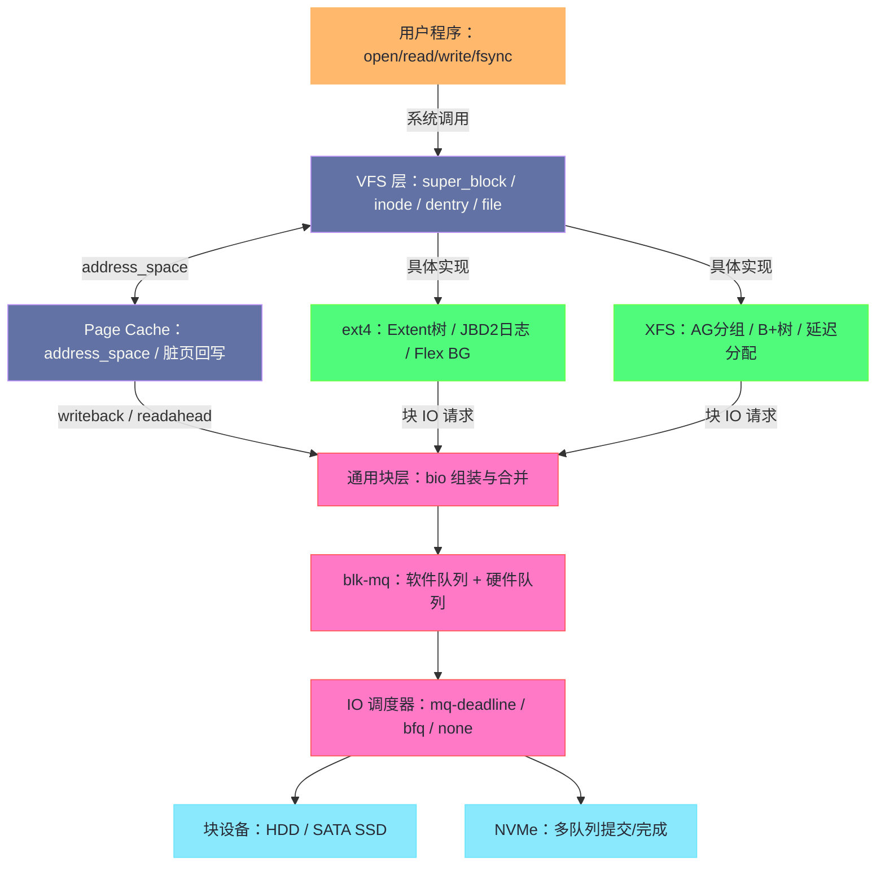

# Linux 文件系统与磁盘设备管理专栏导览

## 专栏定位

存储是计算机系统里最"慢"的一层，也是最"厚"的一层。一次普通的文件读取，从应用程序的一行 `read()` 出发，要穿过虚拟文件系统（VFS）、具体文件系统、Page Cache、通用块层、IO 调度器、块设备驱动，最终抵达磁盘固件，才能把几个扇区的数据搬回用户缓冲区——这条路径上每一层都是为了解决某个具体的历史问题而生长出来的，每一层也都有自己的一套权衡。本专栏的目标，就是把这条路径逐层拆开：既讲清楚每一层的内部机制（VFS 的四大对象、ext4 的日志与 Extent 树、blk-mq 的多队列架构），也讲清楚每一层"为什么长成这样"（为什么需要日志、为什么 SSD 不需要传统的 IO 调度器、为什么 io_uring 要把系统调用从数据面上取消）。

理解存储栈不只是为了用好 `ls` 与 `df`。性能调优需要知道瓶颈藏在哪一层，故障排查需要知道数据在哪一层丢失了"应该写下去"的承诺，存储选型需要知道 ext4 与 XFS 的分野从来不是好与坏，而是适用前提的不同——这些判断都要求对整条路径建立第一性原理级别的认识，而不是背几条调优口诀。

---

## 专栏目录

| 篇号 | 标题 | 核心问题 |
|------|------|---------|
| [[01 文件系统的本质——从 open() 到磁盘扇区]] | 存储栈全景 | 一次 `read()` 要穿过哪些内核层次？文件系统到底在管理什么？|
| [[02 VFS 虚拟文件系统——超级块、inode、dentry 与 file]] | VFS 四大核心对象 | `inode` 与目录项（dentry）是什么关系？路径解析为什么需要缓存？|
| [[03 ext4 深度解析——日志、Extent 树与 Flex BG]] | ext4 内部实现 | 崩溃瞬间数据去了哪里？日志（journal）如何保证崩溃一致性？|
| [[04 Page Cache 与脏页回写——Linux IO 的秘密缓冲层]] | 缓存与回写 | 为什么 Linux 要用全部空闲内存做缓存？脏页何时写回磁盘？|
| [[05 块设备栈——从 bio 到 blk-mq 的 IO 路径]] | IO 请求的内核路径 | `bio` 如何被组装成请求？blk-mq 多队列好在哪里？|
| [[06 IO 调度器——CFQ、Deadline 与 mq-deadline 的演进]] | IO 调度策略 | 为什么机械盘需要调度器而 NVMe 盘要关掉它？|
| [[07 XFS 文件系统深度解析——B+ 树与日志架构]] | XFS 内部实现 | 分配组（AG）为什么让 XFS 适合大文件与高并发？延迟分配的本质是什么？|
| [[08 存储栈性能调优——从 fio 到 iotop 的全套方法论]] | 存储性能调优 | 如何用 `fio` 测出真实性能？"读写放大"的根源在哪里？|
| [[09 文件系统的安全边界——权限、ACL 与 Capabilities]] | 文件权限体系 | 传统 rwx 够不够用？`setuid` 的风险与 Capabilities 的拆解？|
| [[10 现代存储技术——NVMe、io_uring 与用户态存储]] | 现代存储革命 | NVMe 快在哪里？io_uring 如何把系统调用从数据面上取消？|

---

## 阅读建议

**基础路线**（理解存储全貌）：01 → 02 → 03 → 04，这四篇串起"系统调用 → VFS → 具体文件系统 → 缓存回写"的主干路径，读完即可对一次 IO 的完整旅程建立心智模型。

**性能调优路线**（解决 IO 瓶颈）：04 → 05 → 06 → 08，从缓存行为讲到块层队列，最后落到 `fio` 与 `iostat` 的方法论；若在用 NVMe 盘，06 篇"为什么 SSD 不需要传统调度器"的结论尤其值得先读。

**深度原理路线**（内核与存储工程师）：02 → 03 → 05 → 07 → 10，VFS 抽象、两种文件系统（ext4 与 XFS）的磁盘布局对照、块层多队列，最后以 io_uring 与用户态存储收束到当下正在发生的变革。

**安全合规路线**：09 独立成篇，不依赖其他各篇。

各篇之间以 [[01 文件系统的本质——从 open() 到磁盘扇区]] 建立的分层模型为公共语言，后文提到"块层""VFS 层"时不再重复解释层次位置。

---

## 关联专栏

- [[Linux/内存管理/00 专栏导览|内存管理专栏]]：Page Cache 是内存管理与文件系统的核心交叉点，脏页回写与内存回收（kswapd）共享同一批页面
- [[Linux/网络协议栈与IO/00 专栏导览|网络协议栈与 IO 专栏]]：零拷贝（sendfile）与 io_uring 是存储栈与网络栈共享的基础设施
- [[Linux/性能优化/00 专栏导览|性能优化专栏]]：fio 方法论、Direct IO 与 mmap 的选型对照在两专栏中互为呼应
- [[Linux/系统性能工程实战/00 专栏导览|系统性能工程实战]]：存储 IO 一章提供从症状到根因的实战视角
- [[中间件/Ceph/00 专栏导览|Ceph]]、[[中间件/JuiceFS/00 专栏导览|JuiceFS]]：分布式存储系统依赖本地文件系统作为底层存储，本地栈的行为直接决定上层语义
- [[大数据/Hadoop/HDFS/00 专栏导览|HDFS]]：DataNode 的 Block 存储在本地文件系统之上，理解 ext4/XFS 才能理解 DataNode 的数据目录设计

---

## 核心概念地图

这张图同时也是专栏的路线图：01 篇走完从顶到底的一条完整路径，02 篇驻留在 VFS 层，03 与 07 篇分别解剖绿色层里的两个代表实现，04 篇看缓存如何改变读写的主干，05 与 06 篇深入粉色层，08 篇把前七篇的机制转化为观测与调优的手艺，09 篇侧身看权限体系，10 篇则回答"这条路径正在被怎样重写"。
