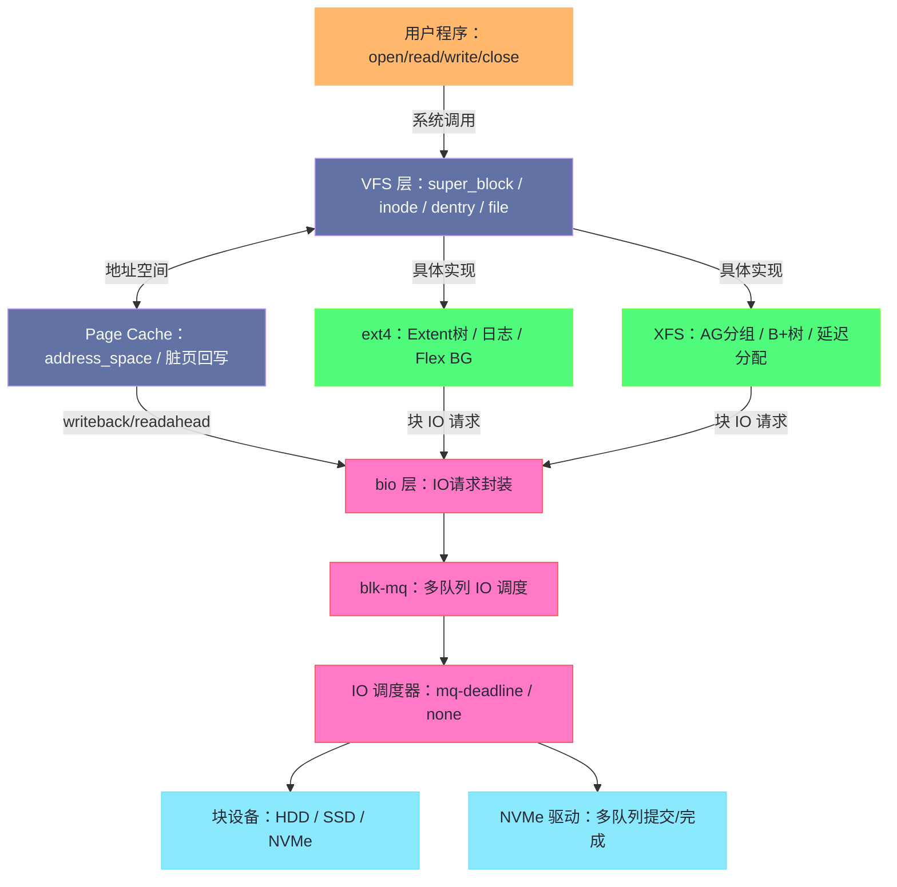

# Linux 文件系统与磁盘设备管理专栏导览

## 专栏定位

本专栏的目标是系统、深入地解析 Linux 存储栈的每一层：从用户程序调用 `open()`/`read()` 的那一刻，到数据最终落在磁盘扇区；从 VFS 抽象接口，到 ext4/XFS 的磁盘布局细节；从内核 Page Cache 的脏页管理，到 blk-mq 多队列架构的 IO 路径；从传统 IO 调度器的设计演进，到 NVMe 与 io_uring 带来的现代存储革命。

理解文件系统不只是为了用好 `ls`、`df`、`mount`——更是为了在性能调优、故障排查、存储架构选型时，能从第一性原理出发做出正确判断。

---

## 专栏目录

| 篇号 | 标题 | 核心问题 |
|------|------|---------|
| [[01 文件系统的本质——从 open() 到磁盘扇区]] | 文件系统的本质 | 一次 `read()` 调用经历了哪些内核层次？VFS 为什么存在？|
| [[02 VFS 虚拟文件系统——超级块、inode、dentry 与 file]] | VFS 四大核心对象 | `inode` 与目录项（dentry）的关系？`struct file` 与 fd 如何对应？|
| [[03 ext4 深度解析——日志、盘区树与 Flex BG]] | ext4 内部实现 | Extent 树如何描述文件数据位置？日志（journal）如何保证崩溃一致性？|
| [[04 Page Cache 与脏页回写——Linux IO 的秘密缓冲层]] | Page Cache 原理 | 为什么 Linux 要用几乎全部可用内存做缓存？脏页何时写回磁盘？|
| [[05 块设备栈——从 bio 到 blk-mq 的 IO 路径]] | IO 请求的内核路径 | `bio` 是什么？blk-mq 多队列架构比单队列好在哪里？|
| [[06 IO 调度器——CFQ、Deadline 与 mq-deadline 的演进]] | IO 调度策略 | 为什么 SSD 不需要 CFQ？noop/deadline/mq-deadline 如何选型？|
| [[07 XFS 文件系统深度解析——B+ 树与日志架构]] | XFS 内部实现 | XFS 的 AG 分组设计为什么适合大文件和高并发？延迟分配的本质是什么？|
| [[08 存储栈性能调优——从 fio 到 iotop 的全套方法论]] | 存储性能调优 | 如何用 `fio` 精确测量存储性能？读写放大的根源与消除方法？|
| [[09 文件系统的安全边界——权限、ACL 与 Capabilities]] | 文件权限体系 | POSIX ACL 与传统 rwx 权限的关系？`setuid` 的安全风险与 Capability 的替代？|
| [[10 现代存储技术——NVMe、io_uring 与用户态存储]] | 现代存储革命 | NVMe 比 SATA SSD 快在哪里？io_uring 如何近乎消除系统调用开销？|

---

## 阅读建议

**基础路线**（理解存储全貌）：01 → 02 → 03 → 04 → 05

**性能调优路线**（解决 IO 瓶颈）：04 → 05 → 06 → 08

**深度原理路线**（内核开发/存储工程师）：02 → 03 → 05 → 07 → 10

**安全合规路线**：09（独立阅读）

---

## 核心概念地图

