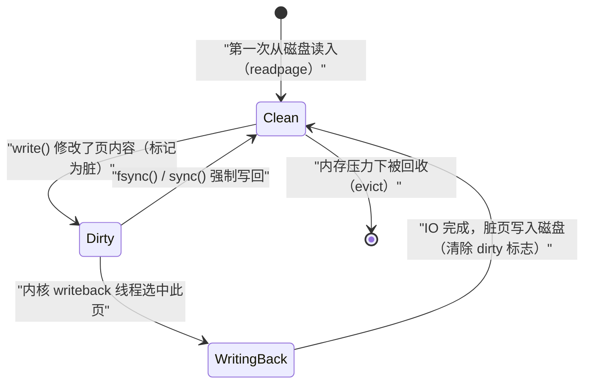

**摘要：**

"文件"是操作系统提供给用户程序最重要的抽象之一——它让程序以统一的方式访问磁盘、内存、网络、设备，而不必关心底层介质的差异。当你在程序中调用 `open("/etc/passwd", O_RDONLY)` 时，这一行代码背后触发了一条跨越五六个内核层次的调用链：系统调用入口 → VFS（虚拟文件系统）→ 具体文件系统（ext4/XFS）→ Page Cache → 块设备层 → IO 调度器 → 驱动程序 → 磁盘控制器。每一层都有其存在的理由，每一层都在解决特定问题。本文从"文件系统要解决什么问题"出发，逐层解剖这条调用链，揭示 VFS 抽象的设计动机、Page Cache 为什么几乎占满所有可用内存、块设备层如何将文件的字节偏移转换为磁盘的物理扇区地址。这是理解 Linux 存储系统全部后续内容的基础篇。

---

## 第 1 章 文件系统要解决的核心问题

### 1.1 没有文件系统的世界是什么样的

想象一块裸磁盘——它只是一个由扇区（Sector，通常 512 字节或 4096 字节）组成的线性数组，每个扇区有唯一的编号（LBA，Logical Block Address）。如果没有文件系统，程序要存取数据，就必须：

1. 自己决定把数据存在第几号扇区
2. 自己记住哪些扇区已经被使用了
3. 自己管理数据的更新（扇区不够了怎么办？数据增大了怎么办？）
4. 如果程序崩溃，磁盘处于什么状态？怎么恢复？

这就像在一座城市里没有门牌号、没有地图、没有房产登记——每个人靠自己记忆知道自己的东西放在哪里，别人无法访问，也无法共享。

**文件系统要解决的核心问题**：

1. **命名（Naming）**：给数据起有意义的名字（文件名），用层级目录（树形结构）组织
2. **存储管理（Space Management）**：追踪哪些磁盘空间已使用、哪些空闲，高效地分配和回收
3. **元数据（Metadata）**：记录每个文件的属性（大小、权限、时间戳、所有者），以及文件数据在磁盘上的具体位置
4. **崩溃一致性（Crash Consistency）**：保证在任意时刻的系统崩溃后，磁盘上的数据结构仍然处于一致的状态（或可以快速恢复到一致状态）
5. **访问控制（Access Control）**：控制哪些用户/进程可以访问哪些文件

### 1.2 文件的两个视角：字节流与磁盘布局

**用户视角**：文件是有名字的、可随机访问的字节序列。用 `open()` 打开，用 `read()`/`write()` 访问任意偏移处的字节，用 `close()` 关闭。权限、大小、时间戳等属性通过 `stat()` 查询。

**内核视角**：文件是一组磁盘块（Block）的集合，加上描述这些块的元数据（inode）。文件的"字节偏移"需要映射为"哪个磁盘块上的哪个字节"，这个映射关系存储在 inode 中（对于 ext4，是 Extent 树；对于老式 ext2/3，是三级间接块指针）。

这两个视角之间的转换，正是文件系统的核心工作。

### 1.3 为什么需要 VFS：多文件系统共存的现实

在一个典型的 Linux 系统上，同时存在十几种不同的文件系统：
- `/`（根文件系统）：ext4 或 XFS
- `/proc`：procfs（伪文件系统，进程信息的内核接口）
- `/sys`：sysfs（内核对象的用户态接口）
- `/dev`：devtmpfs（设备文件）
- `/tmp`：tmpfs（纯内存文件系统）
- `/home`：可能是 btrfs 或 ext4
- 网络共享：NFS、CIFS/SMB

用户程序调用 `read(fd, buf, len)` 时，不需要关心 fd 指向的是 ext4 文件还是 procfs 的虚拟文件，还是网络上的 NFS 文件——系统调用的接口是统一的。**VFS（Virtual File System，虚拟文件系统）** 正是提供这层统一抽象的内核子系统：它定义了一套标准的接口（`file_operations`、`inode_operations`、`super_operations`），所有具体文件系统只需要实现这套接口，就能被内核统一管理。

> [!note] 设计哲学：Unix 的"一切皆文件"
> "一切皆文件"（Everything is a file）是 Unix 最深刻的设计哲学——网络 socket、设备、管道、目录，全都通过文件接口（open/read/write/close）访问。这种统一性的基础正是 VFS：只要实现了 `file_operations`，任何东西都能被当作"文件"来操作。这使得 Unix 工具（`cat`、`echo`、`ls`）可以以出乎意料的方式组合使用，比如 `cat /proc/cpuinfo` 读取 CPU 信息，`echo 1 > /sys/block/sda/queue/rotational` 修改磁盘调度策略。

---

## 第 2 章 Linux 存储栈的层次结构

### 2.1 全景层次图

在深入每一层之前，先建立一个全景认知：

```
用户态：
  程序调用 open("/etc/passwd", O_RDONLY)
  ↓ 系统调用（syscall 指令）
══════════════════════════════════════════════════════
内核态：
  ┌─────────────────────────────────────────────┐
  │  系统调用入口层（sys_open → do_filp_open）    │  ← 权限检查、fd 分配
  └─────────────────────┬───────────────────────┘
                        ↓
  ┌─────────────────────────────────────────────┐
  │  VFS 层（虚拟文件系统）                       │  ← 路径解析（dentry cache）
  │  nameidata / d_lookup / inode_permission    │     统一接口分发
  └─────────────────────┬───────────────────────┘
                        ↓ inode->i_fop->open()
  ┌─────────────────────────────────────────────┐
  │  具体文件系统（ext4 / XFS / tmpfs / procfs）  │  ← 文件 → 磁盘块映射
  │  ext4_file_read_iter / ext4_map_blocks      │     Extent 树查找
  └─────────────────────┬───────────────────────┘
                        ↓ 缓存未命中时
  ┌─────────────────────────────────────────────┐
  │  Page Cache（地址空间 address_space）         │  ← 内存缓存层（核心！）
  │  find_get_page / page_cache_alloc           │     读：缓存命中直接返回
  └─────────────────────┬───────────────────────┘  写：先写缓存，后台回写
                        ↓ Cache miss，需要从磁盘读
  ┌─────────────────────────────────────────────┐
  │  通用块层（Generic Block Layer）             │  ← bio 结构封装 IO 请求
  │  submit_bio / blk_mq_make_request           │     请求合并与排序
  └─────────────────────┬───────────────────────┘
                        ↓
  ┌─────────────────────────────────────────────┐
  │  IO 调度器（mq-deadline / none / bfq）        │  ← 请求排序、优先级、合并
  └─────────────────────┬───────────────────────┘
                        ↓
  ┌─────────────────────────────────────────────┐
  │  块设备驱动（SCSI / NVMe / virtio-blk 等）   │  ← 驱动程序，与硬件交互
  └─────────────────────┬───────────────────────┘
                        ↓
══════════════════════════════════════════════════════
硬件：
  磁盘控制器 → 磁盘介质（HDD 磁头寻道 / SSD NAND Flash）
```

每一层都是一个清晰的抽象边界——上层不需要知道下层的实现细节。这种分层设计使得每一层可以独立演进：SSD 取代 HDD，不需要修改 VFS 层；添加新文件系统（如 btrfs），不需要修改块设备驱动。

### 2.2 为什么分层：每层解决的问题

| 层次 | 解决的问题 | 如果没有这一层会怎样 |
|-----|----------|-----------------|
| VFS | 统一多种文件系统的接口 | 每个文件系统需要独立的系统调用，程序无法透明访问不同文件系统 |
| 具体文件系统 | 文件名 → 磁盘块地址 的映射 | 程序必须自己管理磁盘布局，无法组织文件 |
| Page Cache | 内存缓冲，减少磁盘 IO | 每次 `read()` 都必须访问磁盘，性能差几个数量级 |
| 通用块层 | 统一块设备接口，IO 请求合并 | 每种存储设备需要独立的文件系统驱动 |
| IO 调度器 | 优化磁盘访问顺序（尤其 HDD）| HDD 的随机 IO 性能极差，需要排序为顺序访问 |
| 设备驱动 | 与具体硬件交互 | 内核需要了解每种设备的寄存器和协议细节 |

---

## 第 3 章 open() 系统调用：文件访问的起点

### 3.1 open() 的语义

```c
int open(const char *pathname, int flags, mode_t mode);
/* 返回：成功返回文件描述符（非负整数），失败返回 -1 并设置 errno */
```

`open()` 的参数看似简单，但其背后有丰富的语义：

**`pathname`**：文件路径，可以是绝对路径（`/etc/passwd`）或相对路径（`../config.yaml`）。内核需要解析这个路径，沿目录树逐层查找（path lookup），最终找到目标文件的 inode。

**`flags`**：访问模式和行为控制：
- `O_RDONLY`/`O_WRONLY`/`O_RDWR`：读、写、读写
- `O_CREAT`：文件不存在时创建
- `O_TRUNC`：打开时截断为零长度
- `O_APPEND`：每次写操作都追加到文件末尾（原子操作）
- `O_NONBLOCK`：非阻塞模式（对设备文件和 socket 有意义）
- `O_DIRECT`：绕过 Page Cache，直接 IO（数据库常用）
- `O_CLOEXEC`：exec 时自动关闭这个 fd（防止 fd 泄漏到子进程）
- `O_SYNC`/`O_DSYNC`：同步写（每次 write 都等待数据落盘）

**返回值——文件描述符（File Descriptor，fd）**：

fd 是一个小整数（通常从 3 开始，0/1/2 分别是 stdin/stdout/stderr），是进程对内核中 `struct file` 对象的引用句柄。这个设计隐藏了内核文件对象的地址，只暴露一个整数索引，兼顾了安全性和简洁性。

```bash
# 验证：查看进程当前打开的文件描述符
ls -la /proc/self/fd
# lrwxrwxrwx 1 root root 64 ... 0 -> /dev/pts/0    ← stdin（终端）
# lrwxrwxrwx 1 root root 64 ... 1 -> /dev/pts/0    ← stdout（终端）
# lrwxrwxrwx 1 root root 64 ... 2 -> /dev/pts/0    ← stderr（终端）
# lrwxrwxrwx 1 root root 64 ... 3 -> /etc/passwd   ← 刚 open 的文件

# 查看进程 fd 表的详细信息
cat /proc/self/fdinfo/3
# pos:    0           ← 当前文件偏移（read/write 的位置）
# flags:  0100000     ← open() 的 flags（八进制）
# mnt_id: 22          ← 挂载点 ID
```

### 3.2 内核中 open() 的执行路径

```
open("/etc/passwd", O_RDONLY)
  ↓
sys_open()  →  do_sys_openat2()
  │
  ├─ 1. 在 current->files->fdt 中分配一个空闲的 fd 整数
  │      (find_next_fd，从 0 开始找第一个未使用的槽位)
  │
  ├─ 2. 分配一个新的 struct file 对象（从 filp_cachep Slab 缓存）
  │
  ├─ 3. 路径解析（Path Lookup）：do_filp_open → path_openat
  │      ├─ 从根目录（/）或当前目录（.）开始
  │      ├─ 逐一解析路径组件（"etc" → "passwd"）
  │      ├─ 每一步都在 dentry cache 中查找（hash table）
  │      │    命中：直接从缓存获取 dentry 和 inode
  │      │    未命中：调用父目录的 lookup 操作（ext4_lookup 等）从磁盘读取
  │      └─ 最终得到目标文件的 inode
  │
  ├─ 4. 权限检查：inode_permission(inode, MAY_READ)
  │      检查进程的 UID/GID 是否有权限访问该文件
  │
  ├─ 5. 调用具体文件系统的 open 操作：
  │      inode->i_fop->open(inode, file)
  │      (ext4_file_open / generic_file_open 等)
  │
  └─ 6. 将 struct file 存入 fd 表：fd_install(fd, file)
         返回 fd 给用户程序
```

**关键数据结构的关系**：

```
进程（task_struct）
  └─ files_struct（文件描述符表）
       └─ fdtable.fd[]
            ├─ fd[0] → struct file（stdin）
            ├─ fd[1] → struct file（stdout）
            ├─ fd[2] → struct file（stderr）
            └─ fd[3] → struct file（/etc/passwd）
                          ├─ f_pos（当前读写偏移）
                          ├─ f_flags（open flags）
                          ├─ f_mode（读/写/执行权限）
                          ├─ f_op（file_operations 函数指针表）
                          └─ f_inode → inode（文件的元数据）
                                          ├─ i_ino（inode 编号）
                                          ├─ i_size（文件大小）
                                          ├─ i_blocks（占用块数）
                                          ├─ i_mode（权限位）
                                          ├─ i_uid / i_gid（所有者）
                                          └─ i_mapping → address_space（Page Cache）
```

---

## 第 4 章 read() 的完整路径：从 fd 到数据

### 4.1 read() 系统调用入口

```c
ssize_t read(int fd, void *buf, size_t count);
```

`read()` 进入内核后，执行路径：

```
sys_read(fd, buf, count)
  ↓
ksys_read()
  ↓
vfs_read()  →  __vfs_read()
  ↓
file->f_op->read_iter(file, &kiocb, &iov_iter)
/* 调用具体文件系统的 read 实现（通过函数指针分发）*/
/* 对于普通文件：generic_file_read_iter()             */
/* 对于 procfs：proc_read() 等各自实现               */
```

### 4.2 generic_file_read_iter：Page Cache 的核心读路径

`generic_file_read_iter()` 是普通文件（ext4、XFS、btrfs 等）共享的读路径，它首先尝试从 [[Page Cache]] 中获取数据：

```c
/* generic_file_read_iter 的核心逻辑（大幅简化）*/
ssize_t generic_file_read_iter(struct kiocb *iocb, struct iov_iter *iter) {
    struct file *file = iocb->ki_filp;
    struct address_space *mapping = file->f_mapping;  /* Page Cache 的地址空间 */
    loff_t pos = iocb->ki_pos;   /* 当前读取位置（文件偏移）*/

    /* 如果是 O_DIRECT（直接 IO），绕过 Page Cache */
    if (iocb->ki_flags & IOCB_DIRECT) {
        return file->f_op->direct_IO(iocb, iter);
    }

    /* 普通缓冲 IO：经过 Page Cache */
    return filemap_read(iocb, iter, 0);
}
```

**`filemap_read()` 的工作流程**：

```c
/* filemap_read：从 Page Cache 读取数据（简化版）*/
ssize_t filemap_read(struct kiocb *iocb, struct iov_iter *iter, ...) {
    struct address_space *mapping = iocb->ki_filp->f_mapping;
    pgoff_t index = iocb->ki_pos >> PAGE_SHIFT;   /* 文件偏移转换为页号 */
    ssize_t written = 0;

    do {
        struct page *page;

        /* 1. 在 Page Cache 中查找对应的页（以文件偏移/页号为 key）*/
        page = find_get_page(mapping, index);

        if (!page) {
            /* Page Cache 未命中（Cache Miss）：从磁盘读取这一页 */
            page = page_cache_alloc(mapping);   /* 分配一个新的内存页 */

            /* 将页加入 Page Cache（建立文件偏移→内存页的映射）*/
            add_to_page_cache_lru(page, mapping, index, ...);

            /* 触发实际的磁盘 IO（调用文件系统的 readpage）*/
            mapping->a_ops->readpage(file, page);
            /* ext4_readpage → ext4_mpage_readpages → submit_bio（提交 IO 请求到块设备层）*/

            /* 等待 IO 完成（页从 PageLocked 变为 Unlocked）*/
            wait_on_page_locked(page);
        }

        /* 2. Page Cache 命中（或等 IO 完成后）：将数据从内核页拷贝到用户缓冲区 */
        copy_page_to_iter(page, offset_in_page(iocb->ki_pos), len, iter);
        written += len;
        index++;

        put_page(page);   /* 释放页引用 */
    } while (written < total);

    iocb->ki_pos += written;
    return written;
}
```

### 4.3 文件偏移到磁盘块的映射

当 Page Cache 未命中，需要从磁盘读取数据时，文件系统需要完成一个关键的转换：**文件逻辑偏移（Logical Block Address，相对于文件起点）→ 磁盘物理块号（Physical Block Number，相对于整个磁盘）**。

这个映射由文件系统的 `bmap`/`get_block`/`map_blocks` 操作完成：

```c
/* ext4 的块映射（简化）*/
/* 问题：文件第 N 个块，对应磁盘上第几号块？*/
static int ext4_map_blocks(handle_t *handle, struct inode *inode,
                            struct ext4_map_blocks *map, int flags) {
    /* ext4 使用 Extent 树来记录块映射 */
    /* Extent 是一段连续的物理块区间：(logical_start, physical_start, length) */
    /* 在 inode 的 i_data 字段中存储 Extent 树的根 */

    /* 在 Extent 树中查找包含 map->m_lblk（逻辑块号）的 Extent */
    ext4_ext_find_extent(inode, map->m_lblk, NULL, EXT4_EX_NOCACHE, &path);

    /* 找到了：返回对应的物理块号 */
    map->m_pblk = physical_block_number;
    map->m_len  = extent_length;
}
```

对于 ext4，文件数据块的位置存储在 inode 内嵌的 **Extent 树**中——一个 B 树结构，以文件的逻辑块号为键，以磁盘的物理块号+长度为值（详见 [[03 ext4 深度解析——日志、盘区树与 Flex BG]]）。

---

## 第 5 章 write() 的路径：脏页与延迟写回

### 5.1 write() 的写缓冲语义

```c
ssize_t write(int fd, const void *buf, size_t count);
```

**Linux 的写操作默认是"写缓冲（Buffered Write）"**——`write()` 将数据写入 [[Page Cache]] 中的对应页（将其标记为"脏页"），然后**立即返回**。数据并没有立刻写入磁盘。

这是一个重要的设计决策：

- **优势**：`write()` 非常快（只是内存操作），批量累积后再写磁盘（顺序写，比随机写快几十倍）
- **代价**：系统崩溃（断电、内核 panic）时，脏页中的数据可能丢失

这个权衡是 Unix 系统的传统选择——大多数应用（文本编辑器、日志）可以接受偶尔丢失最近几秒的数据，而数据库等不能接受丢失的应用会使用 `fsync()`、`O_SYNC` 或 `O_DIRECT`。

### 5.2 脏页的生命周期



**触发脏页写回的条件**：

1. **定期写回**（`dirty_writeback_centisecs`，默认 500cs = 5 秒）：内核的 `kworker/flush` 线程每 5 秒扫描一次，将超时的脏页写回
2. **脏页比例超限**（`dirty_ratio`，默认 20%）：进程可用内存的 20% 成为脏页时，进程自身的 `write()` 被阻塞，等待脏页写回
3. **脏页绝对量超限**（`dirty_bytes`）
4. **显式调用 `fsync(fd)`**：强制将该 fd 对应的所有脏页写回磁盘，并等待完成
5. **`sync()` 系统调用**：强制写回所有脏页

```bash
# 查看当前的脏页写回参数
cat /proc/sys/vm/dirty_ratio          # 触发强制阻塞写回的脏页比例（%）
# 20

cat /proc/sys/vm/dirty_background_ratio  # 触发后台异步写回的脏页比例（%）
# 10

cat /proc/sys/vm/dirty_writeback_centisecs  # 写回周期（百分之一秒）
# 500（5 秒）

cat /proc/sys/vm/dirty_expire_centisecs  # 脏页最长"存活"时间（超过则强制写回）
# 3000（30 秒）

# 查看当前系统的脏页情况
cat /proc/meminfo | grep -i dirty
# Dirty:          2048 kB   ← 当前脏页大小
# Writeback:       512 kB   ← 正在写回的页大小
```

### 5.3 fsync、fdatasync 与 O_SYNC 的区别

这三者都是强制持久化的手段，但粒度不同：

| 手段 | 等待数据写盘 | 等待 inode 元数据写盘 | 等待日志提交 |
|-----|-----------|-------------------|-----------|
| `fsync(fd)` | ✅ | ✅ | ✅（完整持久化）|
| `fdatasync(fd)` | ✅ | 仅当文件大小变化时 | ✅ |
| `O_SYNC` 写 | ✅（每次 write）| ✅ | ✅ |
| `O_DSYNC` 写 | ✅（每次 write）| 仅大小变化 | ✅ |

`fdatasync()` 比 `fsync()` 快，因为对于仅更新文件内容（不改变文件大小）的写操作，inode 的元数据（`mtime` 等）不需要同步写盘——这节省了额外的磁盘 IO。数据库通常使用 `fdatasync()` 来减少 fsync 的延迟。

> [!warning] 生产避坑：fsync 不等于数据一定安全
> `fsync()` 保证数据到达磁盘控制器的持久化存储（如 NVMe 的 NAND 或 HDD 的磁盘），但如果磁盘有写缓存（HDD 的磁盘写缓存，或 SATA SSD 的 DRAM 缓存）且未启用写透（Write Through），数据可能仍在磁盘缓存中。对于关键数据（如数据库的 WAL 日志），需要确认磁盘已启用 FUA（Force Unit Access）或关闭写缓存（`hdparm -W 0 /dev/sda`）。NVMe 的 `volatile write cache` 特性可以通过 `nvme set-feature` 查看和控制。

---

## 第 6 章 close() 与文件引用计数

### 6.1 close() 做了什么

```c
int close(int fd);
```

`close()` 的内核路径：

```
sys_close(fd)
  ↓
filp_close(file, current->files)
  ├─ 1. 从 fd 表中移除该 fd（current->files->fdt->fd[fd] = NULL）
  │      此后 fd 整数可以被复用（下次 open() 可能得到同一个 fd 号）
  │
  ├─ 2. 减少 struct file 的引用计数（f_count--）
  │      若 f_count > 0（例如 dup() 或 fork() 产生了多个引用），
  │      则 struct file 仍然存活，只是当前进程不再持有这个 fd
  │
  └─ 3. 若 f_count == 0：
         ├─ 调用 file->f_op->release()（文件系统的清理操作）
         ├─ 减少 inode 的引用计数（i_count--）
         │   若 i_count == 0：inode 可能被从内存缓存中逐出
         └─ 释放 struct file 对象（归还 Slab 缓存）
```

**重要细节：`close(fd)` 不一定立即释放任何内核资源**——它只是释放了进程对 `struct file` 的这一个引用。如果这个文件还被 `dup()`/`fork()` 的其他 fd 引用，`struct file` 和 inode 会继续存在。

这就是为什么：
- `fork()` 后如果父子进程都不关闭管道的某一端，管道永远不会发送 EOF
- 网络服务中，如果父进程 `fork()` 后忘记关闭 socket，连接不会被正确终止

---

## 第 7 章 路径解析：从字符串到 inode

### 7.1 路径解析的挑战

解析一个像 `/usr/lib/x86_64-linux-gnu/libc.so.6` 这样的路径，听起来很简单——按 `/` 分割，逐级查找。但实际上路径解析是内核中最复杂的操作之一：

- **符号链接**：`/usr/lib` 可能是一个符号链接指向 `/usr/lib64`，需要循环展开（但要防止符号链接循环，有跟踪深度限制 `MAXSYMLINKS = 40`）
- **挂载点**：路径中可能经过多个挂载点（从 ext4 根文件系统进入 tmpfs 的 `/tmp`），每次都需要查找对应的 VFS 超级块
- **并发**：多个进程同时修改目录结构（rename、rmdir），路径解析必须是 race-free 的
- **RCU 优化**：Linux 的路径解析（`namei`）使用 RCU 锁来实现无锁的快速路径

### 7.2 dentry cache：路径解析的性能关键

**dentry（Directory Entry，目录项）** 是路径解析的缓存单元：内核为每个已经查找过的路径组件（文件名）维护一个 dentry，缓存"这个名字对应哪个 inode"的映射。

```c
struct dentry {
    unsigned int d_flags;          /* 状态标志 */
    struct dentry *d_parent;       /* 父目录的 dentry */
    struct qstr d_name;            /* 文件名（哈希 + 字符串）*/
    struct inode *d_inode;         /* 对应的 inode（NULL 表示"该文件不存在"的负 dentry）*/
    struct list_head d_child;      /* 兄弟目录项链表（在父目录下的同级文件）*/
    struct list_head d_subdirs;    /* 子目录项链表 */
    struct hlist_bl_node d_hash;   /* 全局 dentry hash 表中的节点 */
    const struct dentry_operations *d_op;  /* 文件系统相关操作 */
    struct super_block *d_sb;      /* 所属文件系统的超级块 */
    /* ... */
};
```

路径解析时，内核首先在 **dentry cache（dcache）** 中查找：

```c
/* 路径解析的核心：walk_component（简化）*/
static int walk_component(struct nameidata *nd, int flags) {
    struct dentry *dentry;
    struct inode *inode;

    /* 1. 在 dcache 中查找（O(1) hash 查找）*/
    dentry = __d_lookup_rcu(nd->path.dentry, &nd->last, &inode);

    if (unlikely(!dentry)) {
        /* dcache 未命中：调用具体文件系统的 lookup 操作（可能需要磁盘 IO）*/
        dentry = lookup_slow(&nd->last, nd->path.dentry, flags);
        /* ext4_lookup：在父目录的 B 树中查找文件名，读取 inode */
    }

    /* 2. 检查是否是挂载点（该目录上挂载了其他文件系统）*/
    if (d_mountpoint(dentry)) {
        /* 切换到挂载在此目录的文件系统 */
        follow_mount(&nd->path);
    }

    nd->path.dentry = dentry;
    nd->inode = inode;
    return 0;
}
```

**dcache 对性能的影响是巨大的**：一个频繁访问的路径（如 `/usr/lib/libc.so`）在 dcache 命中时，路径解析只需要几十纳秒；dcache 未命中时，需要读磁盘上的目录 inode 和目录数据块，延迟可能达到毫秒级。

```bash
# 查看 dcache 的使用情况
cat /proc/sys/fs/dentry-state
# 2345678 2000000 45 0 0 0
# ↑ 已分配 dcache 条目数
#         ↑ 已使用的条目数
#                  ↑ 未使用的条目数（可被回收）

# 内存压力下，内核会通过 shrinker 机制回收 dcache 和 inode cache
# 可以手动触发（生产不建议）：
# echo 2 > /proc/sys/vm/drop_caches  # 清除 dcache 和 inode cache
# echo 3 > /proc/sys/vm/drop_caches  # 清除 dcache、inode cache 和 page cache
```

---

## 第 8 章 挂载（mount）：文件系统的接入机制

### 8.1 mount 的本质

**挂载（mount）** 是将一个文件系统"接入"到全局目录树某个目录（挂载点）的操作。挂载后，访问该目录就等于访问被挂载的文件系统的根目录。

```bash
# 查看当前所有挂载点
cat /proc/mounts
# 或
findmnt --tree

# 输出示例：
# /dev/sda1 / ext4 rw,relatime 0 0
# proc /proc proc rw,nosuid,nodev,noexec,relatime 0 0
# sysfs /sys sysfs rw,nosuid,nodev,noexec,relatime 0 0
# tmpfs /tmp tmpfs rw,nosuid,nodev 0 0
# /dev/sdb1 /data xfs rw,relatime,attr2,inode64 0 0
```

**挂载的内核实现**：

每个挂载点对应一个 `struct mount` 对象（`vfsmount`），将"目录树中的位置（挂载点 dentry）"与"被挂载的文件系统（super_block）"关联起来：

```c
struct mount {
    struct hlist_node mnt_hash;       /* 挂载 hash 表的节点 */
    struct mount *mnt_parent;         /* 父挂载点 */
    struct dentry *mnt_mountpoint;    /* 挂载到哪个目录（挂载点 dentry）*/
    struct vfsmount mnt;              /* 核心字段：包含 mnt_root（文件系统根 dentry）*/
    struct super_block *mnt_sb;       /* 被挂载文件系统的超级块 */
    /* ... */
};
```

路径解析遇到挂载点时，内核通过 `lookup_mnt()` 查找挂载表，将路径"切换"到被挂载文件系统的根目录，透明地跨越文件系统边界。

### 8.2 Namespace 与挂载的隔离

Linux 支持 **Mount Namespace**（通过 `clone(CLONE_NEWNS)`）——不同 Namespace 中的进程可以有完全不同的挂载视图，互不影响。这是容器技术（Docker、Kubernetes）实现文件系统隔离的基础：容器内的进程在自己的 Mount Namespace 中看到一个独立的根文件系统（`/`），宿主机上的文件系统对容器透明不可见。

---

## 小结

理解 Linux 文件系统，从一次 `open()` + `read()` 的全链路开始：

**调用链总结**：
1. `open()` → 路径解析（dcache 查找 + 磁盘 lookup）→ 分配 fd → 返回整数句柄
2. `read()` → VFS 分发 → `generic_file_read_iter` → Page Cache 查找
   - **命中**：直接从内存拷贝到用户缓冲区（纳秒级）
   - **未命中**：调用文件系统的 `readpage` → `submit_bio` → 块设备层 → 磁盘 IO（毫秒级）
3. `write()` → 写入 Page Cache 脏页，异步写回（毫秒→秒级落盘）
4. `close()` → 减少引用计数，最终释放 `struct file` 和 inode

**关键设计思想**：
- **VFS 抽象**：统一接口，使"一切皆文件"成为可能
- **Page Cache**：用内存换 IO 延迟，是 Linux 存储性能的核心保障
- **分层设计**：每层解决一个特定问题，各层独立演进

下一篇 [[02 VFS 虚拟文件系统——超级块、inode、dentry 与 file]] 将深入 VFS 的四大核心数据结构，解析每个字段的含义、对象之间的生命周期关系，以及"负 dentry"这一精妙的缓存优化设计。

---

> [!note] 思考题
> 1. 路径解析从根目录逐级查找 inode。路径深度为 10 时最坏情况需要多少次磁盘 IO？dentry cache 命中率如何影响路径解析性能？在一个有数百万文件的系统上，dentry cache 的内存占用可能达到 GB 级——你如何评估 dentry cache 的命中率和内存效率？
> 2. 文件描述符是进程级资源。`ulimit -n` 默认 1024 在高并发网络服务中远远不够。fd 耗尽时 `accept()` 返回 EMFILE 错误——但此时进程无法打开新文件来记录日志。你如何在应用层预防 fd 耗尽？预留 fd 的技巧是什么？
> 3. `fsync(fd)` 保证文件数据落盘，但不保证目录的 dentry 已更新。在 ext4 的 `data=ordered` 模式下，文件创建后只 fsync 文件而不 fsync 目录——掉电后文件可能丢失。PostgreSQL 曾因此出现数据丢失 bug。你需要对目录 fd 也调用 fsync 吗？ext4 的 `auto_da_alloc` 特性如何缓解这个问题？
