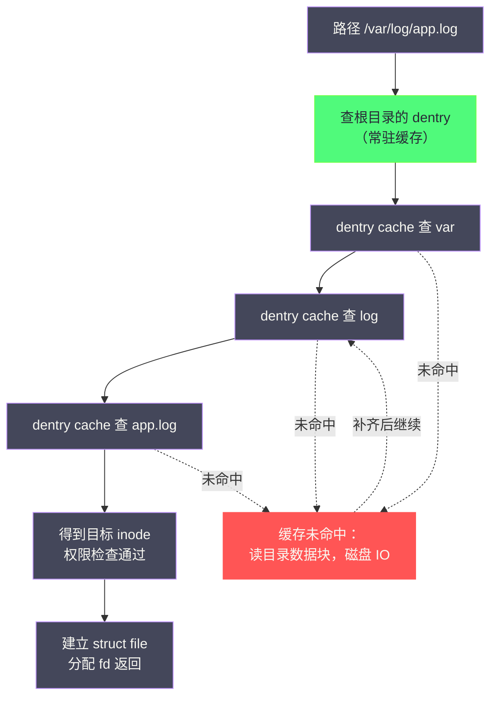
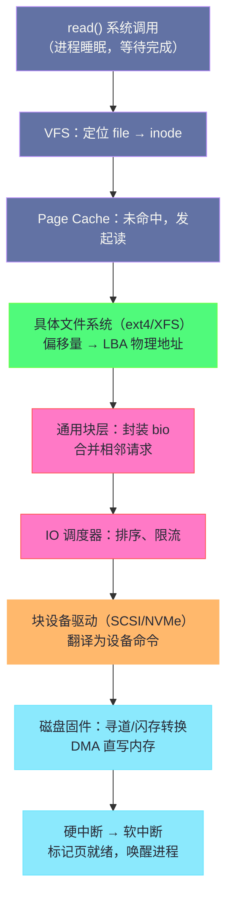
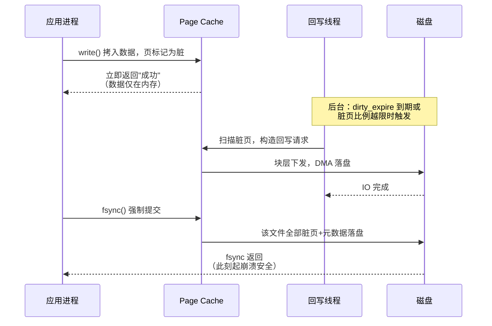

# 文件系统的本质——从 open() 到磁盘扇区

**摘要：**

存储是计算机里最慢的一层，也是最厚的一层。处理器一个时钟周期不到一纳秒，内存访问一百纳秒上下，而一次机械磁盘的随机寻道动辄几毫秒——差出四到五个数量级。为了在这道鸿沟上架桥，几十年间人们在应用与磁盘之间修起了一条六七层高的栈：虚拟文件系统（VFS）、具体文件系统、Page Cache、通用块层、IO 调度器、块设备驱动，最后才抵达磁盘固件。本篇作为专栏的开篇，承担两件事：其一，以一次真实的文件读写为线索，把这条路径从顶到底完整走一遍，让每一层先在地图上有一个坐标，后续各篇再逐层深入；其二，回答一个更根本的问题——文件系统到底在管理什么。笔者给出的答案是两件事：把"名字"映射到"数据"，以及在断电、崩溃随时可能发生的前提下，保证这项映射的承诺不落空。前者是日常工作，后者才是文件系统的灵魂。理解了这两件事，你会发现 ext4 与 XFS 的差异、日志与回写的机制、调度器与 blk-mq 的演进，全都是围绕这两个问题在不同年代给出的不同答案。

---

## 第 1 章 存储的物理事实与两个根本问题

### 1.1 1956 年，磁盘第一次学会"随机访问"

在磁盘出现之前，计算机的外存是磁带。磁带的问题不在于慢，而在于它的访问模型是顺序的：要读第 1000 段的数据，就得先物理卷过前面 999 段，数据在带上排成一条不回头的队列。1956 年 9 月，IBM 推出 RAMAC 350（Random Access Method for Accounting and Control），用五十张直径 24 英寸的磁盘装下了约 5 MB 数据，靠磁头臂在盘面上的机械移动实现了"跳到任意位置去读"的能力——随机访问（Random Access）从此成为存储世界最重要的形容词，月租数千美元的价格则说明这个能力在当时贵得惊人。

随机访问之所以值得花大价钱，是因为它改变的不只是速度，而是软件的组织方式。顺序存储逼着软件把数据排成流水账，随机存储允许软件把数据按"名字"存放、按需取用——数据库、文件系统、乃至今天一切以"文件"为单位组织信息的软件形态，都建立在磁头可以跳这个物理前提上。后文我们会看到，文件系统里绝大多数精巧的设计，本质上都是在磁头"跳"得太慢这个物理约束上做文章。

### 1.2 文件系统到底在管理什么

把磁盘想象成一座巨大的仓库：货架编号连续、格子大小一致，除此之外什么都没有。仓库本身不认识"订单"或"合同"，它只认格子编号。文件系统的工作，是在这座仓库之上建立一套账目体系，让它从"格子仓库"变成"档案馆"——你报出一个名字，它负责把对应的那几格找出来。

这套账目体系要解决两个根本问题。**第一个问题是名字到数据的映射**：用户与程序面对的是"路径 + 偏移量 + 长度"这样的抽象坐标，磁盘面对的是"第几号扇区开始、共几个扇区"的物理坐标，文件系统负责在两者之间做翻译，而且要支持文件随时增长、随时删除、名字随时改，还要让大量文件共享有限的目录层级。第二个问题不那么显眼却致命得多：**崩溃一致性（Crash Consistency）**。文件系统对磁盘的每次结构性修改都要写好几个位置——数据本身、描述数据位置的元数据、记录格子占用的空闲表——这些写操作不可能在物理上一次完成，而机器偏偏会在任意两条写指令之间断电。断电之后磁盘上留下的就是一个"写了一半的账本"，文件系统的职责是保证重启之后账目依然对得上，宁可丢掉崩溃前没提交的那笔，也不能让账本自相矛盾。

这两个问题分别定义了文件系统的日常与灵魂。日常部分（映射）决定了它的静态结构——inode、目录、空闲块管理，第 5 章会展开；灵魂部分（崩溃一致性）决定了它最核心的动态机制——日志，第 6 章会展开，并在 03 篇 [[03 ext4 深度解析——日志、Extent 树与 Flex BG]] 里落到 ext4 的实现细节。整条存储栈的其他成员——Page Cache、块层、调度器——则是在这两个问题之外，围绕"怎么走得快"生长出来的。

值得强调的是，这两个问题的难度完全不对称。映射问题的解空间是有限的：数据结构学得好，翻译表总能做对，顶多是快慢之分。崩溃一致性则是个分布式的阴险问题——磁盘上的多个位置必须在无锁、无事务管理器、且任意时刻可能断电的约束下保持原子一致，这与分布式系统里"多副本状态一致"的难度同级。文件系统界几十年来真正称得上"研究问题"的进展几乎都发生在后一个问题上：日志、回放、检查点、写时复制，每一种都是针对"断电窗口"的不同解法。读这个专栏时不妨带着这条线索：凡是某个机制初看之下显得绕、显得浪费，多半是崩溃一致性在背后做功。

### 1.3 扇区、块与页：三种尺寸的对话

在走进内核之前，必须先把三个尺寸单位的关系说清楚，因为整条存储栈的对话都发生在这三种尺寸之间。

最小的是**扇区（Sector）**，磁盘的物理读写单位，传统上为 512 字节——这是 1980 年代定下的行业惯例，磁盘的每次读取哪怕只要一个字节，也至少要搬一个扇区。2010 年前后，行业推进"高级格式（Advanced Format）"，把物理扇区扩大到 4 KB，以摊薄纠错码开销、提高面密度，但对上层仍普遍模拟出 512 字节的逻辑扇区保持兼容。

往上是**块（Block）**，文件系统的最小分配单元，常见 4 KB。文件系统不按扇区记账，因为管理 512 字节粒度的账本开销太大，就像仓库不会按半根铅笔建立库存条目；它按块记账，一个文件在磁盘上占用的空间永远是块的整数倍，哪怕只写了 1 字节也占满 4 KB——这就是 `du` 与 `ls -l` 看到的数字经常不同的原因。

再往上是**页（Page）**，内核内存管理的单位，x86-64 上同为 4 KB。页与块尺寸对齐不是巧合，而是刻意设计：内存中的缓存以页为单位，磁盘上的数据以块为单位，两者等大，一页缓存才能不多不少地容纳一个块的数据，磁盘与内存之间的搬运才不需要拆分重组。

| 单位 | 归属层 | 典型尺寸 | 谁在用它 |
| :--- | :--- | :--- | :--- |
| 扇区（Sector） | 磁盘硬件 | 512 B（AF 为 4 KB） | 磁盘固件、驱动 |
| 块（Block） | 文件系统 | 4 KB（可配 1 KB-64 KB） | ext4、XFS 等文件系统 |
| 页（Page） | 内核内存管理 | 4 KB（x86-64） | Page Cache、缺页异常 |

三种尺寸叠加出一条不变的纪律：文件偏移量除以块大小得到"第几个块"，块号经由文件系统的映射结构翻译成"第几个扇区"，翻译规则本身持久地记在磁盘上。这行除法是整条存储栈的通用语，后文所有结构都是围绕"让这行除法尽快得到答案"展开的。

### 1.4 两种物理，两种性格：HDD 与 SSD

在继续向上抽象之前，必须先认识存放数据的两种物理介质，因为整条存储栈后期的演化动力，大半来自它们的性格差异。**机械硬盘（Hard Disk Drive，HDD）**是 1956 年血统的直接继承者：数据记在旋转盘片的磁性涂层上，读写靠磁头臂的机械移动。它的延迟由三段构成——磁头寻道（几毫秒）、等待目标扇区转到磁头下（与转速相关，7200 RPM 约半个周期 4 毫秒上下）、以及数据传输本身。前两段是纯粹的机械动作，决定了 HDD 的随机访问能力天花板极低（百级 IOPS）而顺序访问尚可（一两百 MB/s），**随机与顺序在这个介质上是两种性能完全不同的操作**。

**固态硬盘（Solid State Drive，SSD）**把存储单元换成 NAND 闪存芯片，没有可动部件，随机访问延迟降到几十微秒量级——机械约束消失了。但闪存带来了自己的怪脾气：读以页（几 KB）为单位，写却只能以更大的块（几百 KB 量级）为单位整体擦除后写入，且写入会磨损介质。为消化这些约束，SSD 内部运行一个固件层——闪存转换层（Flash Translation Layer，FTL），负责把上层的逻辑地址映射到物理位置、做磨损均衡与垃圾回收。FTL 的存在意味着 **SSD 对上层假装自己是块设备**，而它的真实行为（写放大、垃圾回收引起的延迟尖刺）会周期性穿透这层伪装，08 篇讨论读写放大时会正面遭遇。

| 特性 | HDD | SSD |
| :--- | :--- | :--- |
| 随机读延迟 | 5-10 毫秒（机械） | 50-100 微秒（电气） |
| 随机写 IOPS | 一两百级 | 数万到数十万级 |
| 顺序吞吐 | 100-250 MB/s | 数 GB/s（NVMe 更高） |
| 写前擦除 | 不需要（可直接覆写） | 必须先擦除整块 |
| 内部地址映射 | 无（物理即逻辑） | FTL 固件层 |
| 寿命约束 | 机械故障为主 | 闪存磨损（P/E 周期） |

这张表对后文的意义在于标出一条分水岭：**分层存储栈的前半程（1970s-2000s）的一切设计都以 HDD 的性格为前提**，调度器的排序、块层的合并、文件系统的布局优化，全是为"寻道很贵"服务的；SSD 普及（2010 年前后）之后，这些设计的存在前提陆续塌陷，才有 06 篇调度器的简化浪潮与 05 篇 blk-mq 的多队列重构，以及 10 篇 NVMe 对整条协议栈的重写。存储软件的每一段历史，背后都站着一段硬件史。

---

## 第 2 章 名字的世界：open() 的旅程

### 2.1 逐级分拣：路径解析的真实含义

从本节开始，本篇用同一个贯穿案例走完全程：一个日志收集进程调用 `open("/var/log/app.log", O_RDONLY)`，随后 `read()` 4 KB。这个案例没有任何特殊之处，正因如此才够典型——存储栈的绝大部分流量都是这种平平无奇的请求。

先看 `open()`。内核收到的输入是一个字符串，而文件系统内部从不存字符串，只存编号——这个编号就是 inode 号（第 5 章展开）。所以 `open()` 的全部使命，是把 `/var/log/app.log` 这串字符翻译成一个 inode 号。翻译方式出乎意料地朴素：从根目录 `/` 的 inode 出发，读出根目录的数据，在数据里查找名为 `var` 的条目、得到 `var` 的 inode 号，再读 `var` 的目录数据查找 `log`，如此逐级向下，最后在 `log` 的目录数据里查到 `app.log` 的 inode 号。整个过程像快递分拣：地址是一个层级路径，包裹在每一级分拣中心按下一级关键字流转，走满全程才能定位最终收件人。

这条路若字面执行，每查一个名字就要读一次磁盘，代价显然不可接受——任何一次 `open()` 都要来回四五趟。内核的解法是把每级的"名字 → inode"查询结果缓存起来，这就是目录项缓存（dentry cache），02 篇会专门解剖它；此处只需记住：**热路径上的路径解析几乎不碰磁盘**，冷路径才会。`open()` 的最后一站是权限检查——按目标 inode 的属主、属组、权限位核对进程身份，通过后为这次访问建立一个内核会话对象并返回一个整数句柄。用 `strace` 观察一次冷启动的进程，能把这几趟旅程数出来：



主链是理想路径——四级查找全部命中缓存，成本不过几次哈希与字符串比较；虚线才是冷路径，每一个未命中的名字都要等一次磁盘读把目录数据补进来。这个图的另一个读法是时间维度：进程启动后的头几次 `open()` 走虚线，此后同一批路径基本走实线，**进程冷启动的 IO 慢，有相当一部分慢在给 dentry cache 灌水**。`open()` 的全部使命完成后，内核把这张表交回用户：

```c
$ strace -e trace=openat cat /var/log/app.log > /dev/null
openat(AT_FDCWD, "/var/log/app.log", O_RDONLY) = 3
/* 一次 open 只对应一次系统调用；
   但它是进程启动后第一次触碰该路径，
   路径解析的 3 次目录查找全部落在
   dentry cache 未覆盖的冷区域 */
read(3, "...4KB of log data...", 4096) = 4096
```

### 2.2 fd：进程与文件之间的会话凭证

`open()` 返回的整数是文件描述符（File Descriptor，fd），进程视角下它只是个小整数，内核视角下它是进程描述符里一张数组（文件描述符表）的下标，数组元素指向一个 `struct file`——记录着这次打开的读写模式、当前偏移量，以及对目标 inode 的引用。fd 与 inode 之间隔着一层会话对象，是 Unix 设计里容易被忽略却极有用的一笔：同一个文件被三个进程打开，就有三个独立的 `struct file`、三个互不干扰的当前偏移量，而它们背后是同一个 inode、同一份数据。fork 出来的子进程共享父进程的 `struct file`（所以父子进程写同一个管道时偏移量会互相推进），而两次独立的 `open()` 即使来自同一进程也各建一套会话（所以追加写语义 `O_APPEND` 才有存在的必要——它把"定位到文件尾"与"写入"合成一个原子步骤，绕开偏移量各自的会话状态）。

这套设计的语义可以用一个比喻钉住：fd 是取餐牌，`struct file` 是你与餐厅之间那份"点了什么、吃到第几道"的订单，inode 才是厨房里的那道菜本身。取餐牌丢了可以再取，订单独立于取餐牌存在，菜则与谁在吃毫无关系。02 篇将把 fd、`struct file`、inode、dentry 这四个对象的关系完整摊开。

### 2.3 "一切皆文件"的边界

Unix 的著名口号"一切皆文件"（Everything is a File）说的是：设备、管道、套接字都以文件的形式暴露在统一的命名空间里，都用 `open`/`read`/`write` 操作。这句口号的工程价值在于接口复用——`wc -l` 既能数文件也能数管道，`dd` 既能读普通文件也能读块设备。但要把它当作存储栈的入口描述，就需要立刻划清边界：口号描述的是**接口层的一致**，不是**数据路径的一致**。

一个网络套接字的 `read()` 走的是协议栈，数据来自网卡，全程不经过本篇讨论的任何磁盘机制；`epoll` 实例的 fd 背后是一个内核事件表，根本没有"数据在磁盘上"的概念。真正落到存储栈的对象只有两类：普通文件与块设备文件。前者由文件系统管理，后者绕过文件系统直接把"第 N 个块"暴露给使用者——数据库软件用它实现自己的数据组织，本专栏 08 篇的 fio 基准也常在块设备上直接测速。把这条边界记牢，后面看 VFS 如何用一个统一接口挂接几十种互不相干的实现时，才不会困惑于"为什么有的文件没有大小、有的文件不能 seek"——接口统一了，语义边界并没有消失，只是被推给了各实现自行裁剪。

### 2.4 两个名字的官司：硬链接与符号链接

2.2 节与 5.2 节之间的这段空隙，正好用来澄清一对最容易混淆的概念。硬链接（Hard Link）是目录数据里新增的一条"名字 → 既有 inode 号"的映射，新名字与旧名字地位完全平等，指向同一个 inode、同一份数据，删掉任何一个名字（只要还有一个名字存在）数据都安然无恙。符号链接（Symbolic Link，软链接）则是另一种东西：它是一个独立的小文件，自己的 inode 里存的是**一个路径字符串**，打开符号链接时内核重新走一遍路径解析。前者像同一个房间装了两扇门，后者像门上贴了另一扇门的地址条。

这个差异决定了两者完全不同的行为清单。硬链接不能跨文件系统（inode 编号体系不通用）、不能指向目录（会制造环，让路径解析永无出口，唯一例外是内核自己维护的 `.` 与 `..`）；符号链接两者皆可，因为它本质上只是"再来一次路径解析"，代价是目标被删除后留下悬空链接（dangling link）。下表把行为差异收拢在一起：

| 维度 | 硬链接 | 符号链接 |
| :--- | :--- | :--- |
| 本质 | 同一 inode 的另一个目录映射 | 独立文件，内容是路径字符串 |
| 跨文件系统 | 不可以（inode 号互不相通） | 可以（重新解析路径） |
| 指向目录 | 不可以（防解析成环） | 可以 |
| 目标删除后 | 数据仍然完好（链接计数兜底） | 悬空，访问报 ENOENT |
| `ls -l` 链接计数 | 计数加一 | 计数不变 |

工程实践里还有一条值得记住的推论：符号链接让"路径解析"变成可能递归的操作，`a → b → c → a` 的环内核必须显式检测（Linux 限制单次解析最多 40 层符号链接，超过即报错）。这个细节反过来暴露了路径解析的真实成本模型——它不是一次查找，而是一串可能被符号链接不断重置的查找序列，VFS 为此付出的缓存努力（02 篇的 dentry cache）比朴素想象的要大得多。inode 号与链接计数在用户态随时可见：

```bash
$ ls -li /data/notes.md /data/link.md
123456 -rw-r--r-- 2 user user 1024 ... /data/notes.md
123456 -rw-r--r-- 2 user user 1024 ... /data/link.md
/* 两行第一个字段相同（inode 号），第三列的 2
   是链接计数：一个 inode，两个名字 */
```

---

## 第 3 章 数据的世界：read() 的完整旅程

### 3.1 第一站永远是缓存

`read(fd, buf, 4096)` 进入内核后，第一件事不是碰磁盘，而是查 Page Cache——内核用空闲内存为所有文件内容建的缓存，以页为单位组织（[[Linux/内存管理/04 Page Cache：Linux 为什么要用内存来缓存磁盘|内存管理专栏对它有完整解剖]]）。文件偏移量除以页大小定位到"文件的第几个页"，若该页已在缓存，数据直接从内存拷入用户缓冲区，系统调用就此返回，全程不经过文件系统以下的任何一层。

这个设计解释了一个让无数初学者困惑的现象：第一次读大文件很慢，清理缓存后重读依然很慢，但日常反复读却快得反常——因为**你的工作集几乎总是已经在内存里**。Linux 默认把全部空闲内存都拿来做 Page Cache，`free` 命令里那个巨大的 `buff/cache` 数字不是浪费，而是这套设计的直接体现。缓存命中率高到一定程度，磁盘就从"每次访问的必经之路"退化成"缓存未命中时的补救通道"，这从根本上改变了存储系统的设计重心——04 篇将看到，脏页回写、预读、Direct IO 等一整套机制，全是围绕这条补救通道展开的。

若缓存未命中，内核需要发起一次真正的磁盘读。从这里开始，请求离开文件系统抽象的世界，进入物理设备的世界，中间要穿过五层。先上图，再逐层走：



### 3.2 从文件偏移到磁盘地址

第一层工作发生在具体文件系统内部：把"文件内偏移 8192"翻译成"磁盘第几号扇区"。这行翻译依赖文件系统为每个 inode 维护的映射结构——老一代文件系统用间接块数组，现代文件系统如 ext4 用 Extent 树、XFS 用 B+ 树，把"连续的一大段"记成一个条目而不是逐块记录。翻译是纯计算，但结构本身在磁盘上，热结构会被缓存在内存里（02 篇与 03 篇展开）。翻译的结果是一对数字：起始逻辑块地址（Logical Block Address，LBA）与长度，从此刻起，请求已经与"文件""目录""路径"再无关系，它只是"把磁盘上从 X 开始的 N 个扇区搬进内存页 P"。

翻译完成后还有一步易被忽略的准备工作：确认内存侧已经有了落点。读请求的目的地是 Page Cache 的一个页，若该页尚未分配或没有绑定到文件的 address_space，这一步要先补齐——分配页、挂进文件页树、初始化等待队列，然后读请求才能以"把数据搬进这一页"的形式提交下去。这解释了一个观测现象：大文件冷读的内核路径里，分配页面的开销肉眼可见（`perf` 里 `alloc_pages`、`add_to_page_cache` 会出现在热点上），内存紧张时一次读可能先引发一次内存回收——读磁盘的路上顺便经历了一场微型的内存管理事件（[[Linux/内存管理/05 内存回收：kswapd、LRU与直接回收的博弈|内存回收的完整机制见内存专栏]]）。

这一步是整个分层架构里最有意味的一次抽象跃迁：**文件系统的工作到此结束，它对磁盘的任何后续行为都失去了发言权**。接下来请求进入一个纯粹面向"块设备"的世界，无论这个块后面是机械盘、SSD 还是逻辑卷，文件系统的认知到此为止。分层正是通过这次跃迁实现的——上层的语义（名字、结构、承诺）在下层不可见，下层的物理（扇区、队列、寻道）对上层不感知。这个跃迁同时是块层一切自由的前提：正因为它不知道"文件"为何物，同一个块层才能同时服务于 ext4、XFS、裸设备与各种逻辑卷。

### 3.3 bio：块层的通用语

文件系统把翻译结果提交给通用块层，载体是一个 `bio` 结构体——块层的标准请求封装，记着起始扇区、方向（读/写）、以及一串"内存页 + 页内偏移 + 长度"的片段列表。bio 的设计要点在于它天然支持不连续的内存：一次 128 KB 的读可以落到 32 个不挨着的内存页上，因为片段列表本来就允许跳跃，这是 DMA 分散/聚集（Scatter-Gather）能力在软件侧的对口封装。

块层拿到 bio 后做两件优化。其一是**合并（Merging）**：若新请求与队列里已有的请求在磁盘地址上前后相邻，就拼成一个更大的请求——机械盘每多一次寻道就是几毫秒，把十个 4 KB 读拼成一个 40 KB 读，寻道成本直接降一个数量级。合并的方向有两种，向尾部拼接（back merge）最常见，向头部拼接（front merge）在队列实现允许时也会尝试；合并不成，请求就按调度策略插入队列。下图是合并发生前后队列形状的变化：


其二是**挂入请求队列**，交给 IO 调度器。调度器是块层里唯一"有策略"的部分：机械盘时代它会按磁盘地址对请求排序以减少寻道（电梯算法由此得名），并对写请求饿死读请求的问题做各种公平性补偿；NVMe 时代这些顾虑大多消失，调度器趋向于只做最简单的期限保证甚至直接旁路。05、06 两篇分别解剖 bio 路径与调度器的演进史。

### 3.4 驱动、DMA 与中断：数据回家的路

调度器放行后，请求到达块设备驱动。驱动的工作是把通用的请求翻译成特定设备的私有命令：SATA/SCSI 盘是 SCSI 命令描述块，NVMe 盘是提交队列（Submission Queue）里的一条 64 字节命令。命令写完，驱动敲一下门铃（对 NVMe 来说就是写一次 doorbell 寄存器），把控制权交给设备——从这一刻到数据到达，CPU 对传输过程是旁观的：磁盘固件（机械盘是磁头寻道加盘片旋转，SSD 是闪存转换层的读写）把数据通过**直接内存访问（Direct Memory Access，DMA）**写进此前约定好的内存页，全程不占用处理器。

数据落定，磁盘发出一个硬件中断。内核在中断处理里只做最薄的一层确认（中断上下文不可睡眠、不宜做重活），把繁重的收尾——标记页就绪、解除进程阻塞——推迟到软中断里完成，随后唤醒那个在 `read()` 里睡了大半程的进程。进程醒来，发现自己要的 4 KB 已经躺在 Page Cache 的那一页里，把它拷贝进用户缓冲区，系统调用返回。**一次"读磁盘"，在绝大多数代码里实际发生的是"拷一次内存"**——前三章的所有机制，共同制造了这个错觉。

用一张表把旅程各站钉在一起，作为后续各篇的索引：

| 站点 | 职责 | 代表对象 | 专栏篇幅 |
| :--- | :--- | :--- | :--- |
| VFS | 统一接口、路径解析、会话管理 | inode、dentry、file | 02 篇 |
| Page Cache | 以内存吸收读流量、聚合写流量 | page、address_space | 04 篇 |
| 具体文件系统 | 名字映射、空间分配、崩溃一致性 | super_block、journal | 03、07 篇 |
| 通用块层 | 请求封装、合并、队列 | bio、request | 05 篇 |
| IO 调度器 | 排序、公平、期限控制 | mq-deadline、bfq | 06 篇 |
| 驱动与设备 | 命令翻译、DMA、中断 | NVMe SQ/CQ、DMA 描述符 | 10 篇 |

### 3.5 同步阻塞的真相

回望整条旅程会发现一个值得咀嚼的事实：应用视角里一次"同步"的 `read()`，在内核里是一段睡眠与唤醒的异步协作。进程提交请求后立刻睡眠让出 CPU，内核调度器转去运行别的任务，数据到达后由中断上下文把它唤醒——这与网络 IO 里 epoll 所依赖的等待队列机制（[[Linux/网络协议栈与IO/04 epoll 深度解析——事件驱动 IO 的内核实现|网络专栏 04 篇]]）共享同一批底层原语。同步与异步的区别不在磁盘行为，而在**进程如何面对等待**：同步是把等待封装成函数不返回，异步是把等待的完成点交给应用显式收割。

理解了这一点，就理解了 10 篇 io_uring 革命的对象到底是什么——它取消的不是磁盘的任何一步，而是"每次等待都要搭进一次系统调用与一次上下文切换"的固定开销。也理解了为什么调优实践中 `iostat` 观测到的队列深度往往远小于应用的并发数：大量"并发请求"其实挤在 Page Cache 一层就返回了，真正落到块层的只是缓存漏下来的那部分。存储栈的层次不是装饰，而是每一层都在改变流量的形状。

两种等待形态的对照可以收进一张表，它同时是理解后续异步 IO 篇章的坐标系：

| 维度 | 同步阻塞 read() | 异步提交（AIO/io_uring） |
| :--- | :--- | :--- |
| 等待的载体 | 进程睡眠在页的等待队列 | 上下文常驻用户态，无进程睡眠 |
| 每次提交的固定成本 | 一次系统调用 + 可能的上下文切换 | 一次内存写（环形缓冲区） |
| 完成通知 | 内核唤醒进程后返回 | 完成队列收割，可批量 |
| 线程占用 | 等待期间线程不可复用 | 提交后线程立刻可做别的 |
| 典型适用 | 逻辑简单、并发不高的场景 | 深队列、高并发、批量提交场景 |

### 3.6 把旅程跑一遍：观测点上的证据

以上叙述不需要读者全盘信服，因为每一站都有观测点可以直接验证。清掉缓存后读一个较大的文件，同时打开两个终端分别观测，能够把"缓存决定流量形状"这件事变成肉眼可见的数字：

```bash
# 终端一：清缓存后制造一次真实的冷读
echo 3 > /proc/sys/vm/drop_caches
dd if=/data/bigfile of=/dev/null bs=1M

# 终端二：观察块层，1 秒刷新
iostat -dx 1 /dev/sdb
# r/s    rkB/s   await  aqu-sz  %util
# 412    52480   2.31   0.95    87.2
```

每个数字都对应旅程中的一站：`rkB/s` 是从 Page Cache 漏下、真正落到块层的流量；`await` 是请求在队列加设备上的平均耗时，对应第 3.4 节那段"提交即睡眠"的等待；`aqu-sz` 是平均队列深度，对应调度器面前的排队长度；`%util` 接近 100% 说明设备忙时占比，机械盘上它意味着寻道持续不断。反过来，热缓存下重跑同一条 `dd`，`iostat` 上这些数字全部趋近于零——请求根本没到块层，内存拷贝而已。

这组对照观测建立了一个贯穿全专栏的读写习惯：**在存储问题上，任何"感觉"都不可信，块层的计数器才是事实**。应用说自己很慢、内核说缓存很忙、磁盘说自己在排队——三方证词经常互相矛盾，裁决的依据只能是 `iostat`、`blktrace` 这类分层观测工具的原始数字，08 篇将把这套工具链完整展开。

---

## 第 4 章 write()：两条道路与一个承诺

### 4.1 缓冲写：write() 为什么"总是很快"

读的问题是如何把数据从慢处取回，写的问题则微妙得多：如何对用户承认"写完了"而不撒谎。`write()` 的默认行为是**缓冲写（Buffered Write）**：数据只被拷入 Page Cache，对应的页被标记为脏页（dirty page），系统调用立即返回"成功"。此时数据不在磁盘上，只在那几页内存里，真正把它们推向磁盘的是内核的另一组机制——回写（writeback）线程，在后台按时机批量执行。

这就是日常观察里"写文件飞快"的全部真相：`write()` 的速度上限是内存拷贝的速度，不是磁盘的速度。它是好心，也是必要的工程妥协——机械盘随机写的性能惨不忍睹，若每次 `write()` 都同步落盘，任何应用都无法忍受；把写流量先聚在内存里，后台按磁盘最舒服的顺序批量刷下去，是唯一现实的路径。这个设计还有一个常被忽略的副产物：**写流量在缓存里的驻留窗口给了内核重新排版的机会**。应用以 4 KB 为单位乱序写一个文件，回写线程可以把它们重排成顺序流再下发；十个应用往同一块盘的相邻区域写，回写线程可以合并处理。磁盘看到的写流量形状，完全由回写策略决定，而不是由应用决定——这是 Page Cache 对写路径最深刻的影响，远不止"快"一个字。但这个设计也埋下一份合同细则：**"write 返回"与"数据安全"是两回事**，两者之间的桥梁叫 `fsync()`——应用显式调用它，内核才把该文件的脏页与元数据真正提交到磁盘并在完成后返回。数据库、消息队列这些"承诺敏感"的软件，每一次事务提交里都站着一次 `fsync`；04 篇将详细拆解脏页在内核里的一生。

### 4.2 绕过缓存的路：Direct IO

缓冲写之外还有第二条路：打开文件时带上 `O_DIRECT` 标志，读写请求不再经过 Page Cache，直接在用户缓冲区与磁盘之间搬运。它的适用画像很清楚——数据库这类软件自带一套精心设计的缓存与预取逻辑，再过一道 Page Cache 等于让两个缓存互相打架，还得为双份缓存付内存；用 Direct IO 绕开内核缓存，把缓存的决策权收回到应用自己手里。

但 Direct IO 的代价清单同样要念清楚：失去预读（内核发现你在顺序读时会提前多读几页，Direct IO 没有这层服务）、失去写聚合（每次都按应用给定的粒度原样下发，4 KB 就是 4 KB）、对齐约束陡增（缓冲区地址、长度、文件偏移通常都要求按逻辑块大小对齐），以及最要命的——**绕过了内核缓存的同时也绕开了内核为你做的所有自适应**。对齐约束是实际使用中最先撞上的墙，一段典型的规范写法如下：

```c
/* O_DIRECT 的对齐纪律：地址、长度、偏移三者
   都必须是逻辑扇区大小的整数倍，否则 read/write
   直接返回 EINVAL——这是与 DMA 的硬约定 */
char *buf = aligned_alloc(4096, 4096 * 16);
int fd = open("/data/raw", O_RDONLY | O_DIRECT);
pread(fd, buf, 4096 * 16, 0);
```

性能优化专栏 06 篇（[[Linux/性能优化/06 应用级 IO 优化——Direct IO、mmap 与 io_uring 选型]]）对三种 IO 模式的选型做过完整对照，本篇只需建立坐标：缓冲写与 Direct IO 不是优劣关系，而是"缓存决策权归内核还是归应用"的取舍关系。

三种道路的语义对比如下，其中 `O_SYNC` 可理解为"每次写自动附带 fsync 语义"：

| 模式 | write() 返回时数据在哪 | 谁管缓存 | 典型用户 |
| :--- | :--- | :--- | :--- |
| 缓冲写（默认） | Page Cache（脏页） | 内核 | 绝大多数应用 |
| O_DIRECT | 已提交给磁盘队列 | 应用自己 | 数据库、存储引擎 |
| O_SYNC / fsync | 磁盘（元数据同步落盘） | 内核 + 强制落盘 | 需要崩溃承诺的场景 |

### 4.3 时序视角：一次缓冲写的一生

前两节描述的是语义，这里把缓冲写的时间线摆出来，因为**"谁在什么时刻拥有数据"是存储系统所有争议的源头**。下图把 `write()`、后台回写、`fsync()` 三方放在同一条时间轴上：



三条时间线的分界恰好回答了"数据什么时候才安全"：`write()` 返回时数据属于内存，断电即失；回写线程落盘后数据属于磁盘，但应用并不知情；只有 `fsync()` 返回这一刻，应用才第一次获得"数据已持久"的确定性凭证。把这三条线记牢，再看任何数据库的 WAL 配置、消息队列的刷盘参数、`vm.dirty_ratio` 的调优建议，坐标系都是现成的。

### 4.4 反事实：没有这层缓存会怎样

要体会 Page Cache 这层的分量，不妨做个反事实推演：假如 Linux 沿用最朴素的实现——每次 `read` 必落盘、每次 `write` 必落盘——世界会变成什么样。机械盘上，一个每秒 5000 次随机读的负载需要磁盘每秒完成 5000 次寻道，而 7200 转机械盘的极限不过 150 IOPS 上下，缺口是三十倍；任何数据库厂商都得在自己的产品里重新发明一遍"读缓存 + 写聚合 + 预读"，而且每家发明一遍、互不共享，因为它们站在磁盘上而非站在一个统一的缓存层上。预读的故事同样成立：顺序读大文件的吞吐能接近磁盘带宽极限，靠的是内核检测到顺序模式后主动提前取数——这是任何单个应用都懒得自己写、写也不见得写得更好的通用逻辑。

反事实推演的结论指向分层架构的一条普遍规律：**凡是每个上层实现都需要、且实现方式趋同的逻辑，就值得下沉为公共层**。Page Cache 下沉的是缓存与预读，块层下沉的是请求合并与队列管理，VFS 下沉的是路径解析与权限检查。判断一层该不该存在的标准，从来不是它"炫不炫"，而是它吸收的重复劳动够不够多。

---

## 第 5 章 文件系统如何给磁盘"画格子"

### 5.1 超级块：账本的第一页

前四章讲的是"怎么走"，本章回到 1.2 节的两个根本问题，看文件系统为了回答它们在磁盘上画下了什么。画格子的起点是把整块磁盘划分成若干有固定含义的区域，而描述这份"分区图"的元数据，就是**超级块（Superblock）**——文件系统的第一页账本，记录着块大小、总块数、inode 总数、各类位图与数据区的起始位置。挂载时内核第一件事就是读超级块，读不到就意味着"这不是一个我能认识的文件系统"（譬如误把 ext4 卷挂成 XFS 的报错，源头就在这里）。

一份经典布局大致是：超级块在固定偏移处，之后是描述块占用情况的**块位图**与描述 inode 占用情况的 **inode 位图**，然后是 inode 表，剩下的绝大部分是数据区。ext4 在此之上把整卷切成若干"块组（Block Group）"让每个组自带头部、就近管理自己的一段位图与 inode，XFS 则用更大粒度的"分配组（Allocation Group）"实现多路并行分配——07 篇会看到 AG 是 XFS 并发能力的根基。挂载时内核读超级块并登记信息的过程，在用户态可以直接观察到：

```bash
$ df -T /data
Filesystem     Type 1K-blocks      Used Available Use% Mounted on
/dev/sdb1      ext4  976190944 215380216 760748264  23% /data
/* Type 列即挂载时超级块"自报家门"的结果：
   内核逐个尝试已注册的文件系统类型的
   read_super 回调，谁认领了这块超级块，
   后续所有操作就派给谁 */
```


这张图值得多看一眼的地方在于比例：数据区占绝对大头，元数据只占零头——文件系统的一切设计都在避免让元数据操作触碰数据区，反之亦然。分配一个新文件要在位图里找空闲块、要在 inode 表里占一个 inode、可能还要在目录数据里添一个条目，元数据操作天生是"小而散"的写，与数据区"大而整"的写完全是两种流量形态，第 6 章的崩溃问题会因此加倍严重。

### 5.2 inode：文件的一切，除了名字与数据

每个文件对应一个 **inode**（index node），它集中了文件的全部管理信息：大小、属主、属组、权限位、三个时间戳、链接计数，以及最重要的——这个文件的数据块分布在磁盘哪里。老式的间接块方案在 inode 里放十几个指针，其中三个直接指向数据块，另有一级、二级、三级间接指针逐级放大容量，大文件的定位要连跳多层指针；现代方案（ext4 的 Extent、XFS 的 B+ 树）改为记录"从第 m 块起连续 n 块落在磁盘第 k 块"，一个条目描述一大段，结构与效率都上了一个台阶。

inode 设计里有两条常被误读的规则值得专门说明。**其一，名字不在 inode 里**。目录条目才是"名字 → inode 号"的映射记录，inode 自己不知道自己叫什么——这意味着同一个 inode 可以出现在多个目录里、拥有多个名字，这就是硬链接（Hard Link）：`ln` 不复制数据，只是往目录数据里加一条新映射并把 inode 的链接计数加一；删除一个名字只是减计数，计数归零且没有进程持有它，数据块才真正释放。**其二，删除不是擦除**。`rm` 做的只是把位图清零、把 inode 回收进空闲链，数据区的字节原样留在盘上直到被新数据覆盖——这就是"删除后数据可被恢复"的原理，也是安全擦除必须主动覆写的缘故。

### 5.3 目录：一张可以随意组织的表

目录在 Unix 里也是一种文件，它的"数据"是一张"名字 → inode 号"的表。朴素实现下这张表就是线性数组，查找靠逐条比对——ext2 就是这么干的，目录一大查找就慢；ext3 起引入了哈希索引（htree）把目录项按名字哈希分桶，ext4 沿用，XFS 则直接用 B+ 树组织目录。目录的数据结构与文件数据的 Extent 结构共享同一套块分配机制，但语义上多一层约束：目录项的组织方式是文件系统的私有事务，任何时刻都必须保持自洽，否则查找会走进死胡同。

理解"目录是表、名字是映射"之后，很多日常现象突然变得可解释：重命名大目录为什么是瞬间完成的（只是改一条目录项，数据一个字节没动）；`mv` 跨文件系统为什么慢（本质是复制数据再删除，因为两个文件系统的 inode 编号体系互不相通，映射表无法直接搬家）；目录下几百万个文件为什么会拖垮某些操作（表太长，遍历与维护的成本随之上升）。名字层的成本与数据层的成本是两本账，把它们分开记，诊断时才不会混淆症状。目录数据结构的演进本身就是一部微缩的查找优化史：

| 实现 | 数据组织 | 大目录下的查找 | 代表文件系统 |
| :--- | :--- | :--- | :--- |
| 线性目录 | 逐条比对的记录数组 | O(n) 全表扫描 | ext2、早期 XFS |
| 哈希索引 | 按名字哈希分桶 | O(1) 定位桶 | ext3 htree、ext4 |
| B+ 树 | 有序树结构 | O(log n)，还支持顺序遍历 | XFS、btrfs |

这张表还可以倒过来读：当一个文件系统的目录实现停留在线性扫描，目录操作就会在特定规模（几十万条目）突然变慢，这是历史系统里一类经典故障的根源，也解释了为什么"目录里放多少文件才合适"这个问题没有普适答案——答案完全取决于目录的实现结构。

### 5.4 一个新文件的诞生：三个写操作的联盟

现在把本章与第 4 章的知识拼起来，看"创建一个新文件并写入 1 KB"在磁盘上要动几处地方。第一步，在 inode 位图里标记一个空闲 inode 被占用；第二步，在块位图里标记若干空闲块被占用；第三步，初始化 inode 内容并写入数据块；第四步，在父目录的数据里追加一条"名字 → inode"映射。这些修改散落在磁盘的不同区域，必须全部落盘，账目才算平衡：


漏掉任何一步，重启后系统看到的都是一个说谎的文件系统：位图说块被占用而目录里找不到对应文件，或者目录里有名字而 inode 表里一片空白。

在一切正常的顺序里，这四个写操作按部就班地执行，没有任何问题。问题只有一个：**机器不保证给你"一切正常的顺序"**——它可以在任意两次写之间断电。这不是小概率的杞人忧天，而是文件系统必须当作日常对待的常态：掉电、内核 panic、误拔电源，在几十年服役周期里几乎是必然事件。于是我们被引到 1.2 节预告的那个灵魂问题上：崩溃瞬间的磁盘处于中间态，文件系统拿什么自证清白。

### 5.5 空闲空间与碎片：账本的长尾问题

画格子体系还剩一块没讲：格子用完后如何再分配。空闲块位图给出的是"哪些格子空着"，但分配器还要回答"把新数据放在哪个空格子里"。这个决策的质量决定了**碎片（Fragmentation）**的程度：若新文件的数据块东一块西一块地散在盘面上，后续每次顺序读都会退化成十几次寻道，性能直线坠落。机械盘时代，碎片是文件系统设计的第一约束，ext2/3 时代各种"预留窗口、就近聚簇"的分配策略都为此而生；ext4 引入延迟分配（先把数据攒在内存，等看清大小后再一次性挑个好位置），XFS 更是把分配决策做成了精细的多维权衡——03 与 07 篇都会专门讲。

用 `stat` 命令可以直接看到一块数据的物理身世，这是排查碎片问题最快的入口：

```bash
$ stat /data/bigfile
  File: /data/bigfile
  Size: 1073741824    Blocks: 2097160    IO Block: 4096
Inode: 524291        Links: 1
/* Blocks 是 512B 扇区数，2097160 略大于
   1GB 理论值 2097152——多出的 8 个扇区
   是文件尾不满一块的零头所致 */
```

值得单独一提的还有**预分配（Preallocation）**：应用在写入前先声明"我要这么大"，文件系统据此一次性圈好连续块。数据库与 BT 下载软件重度依赖这个手段——前者用它保证数据文件的布局可控，后者用它提前消灭"边下边长"造成的碎片。它也解释了一个常见困惑：`ls -l` 显示文件已 10 GB 而 `df` 显示磁盘也少了 10 GB，但文件里其实全是零——预分配的块已经记账，数据却还没写。账本世界的很多"异常"，其实都是机制在正常工作。

---

## 第 6 章 崩溃一致性：文件系统的灵魂问题

### 6.1 fsck 时代：用时间换自洽

最早的答案最朴素：崩溃后不指望磁盘自证，重启时人肉对账——**fsck（File System Check）**全盘扫描，把位图、inode 表、目录树三者重新核对一遍，发现矛盾就按预定规则修复。这个方案正确但昂贵：扫描时间与文件系统规模成正比，几 TB 的卷动辄数小时，期间整个卷不可用。

1990 年代的服务器管理员对这种体验有肌肉记忆：一台跑 ext2 的机器异常掉电，重启后是漫长的 fsck，业务停摆的每一分钟都是真金白银。更尴尬的是 fsck 的修复策略本质是"猜"——它知道账目对不上，但不知道崩溃前用户的本意是哪一笔，只能按保守规则取舍（宁可丢数据不能丢结构）。fsck 的成本模型值得多说一句：它必须扫描**全部**元数据——所有 inode、所有位图、所有目录——因为没有任何线索告诉它崩溃发生在哪里，怀疑必须遍及全局。这个"无差别全扫"正是后续所有方案攻击的靶子：若能把"崩溃前最后做了什么"记录在案，恢复就只需要看那一小块记录，扫描范围与磁盘总大小脱钩。fsck 至今仍在（ext4 崩溃后若日志回放不足仍会转 fsck，XFS 有自己的 `xfs_repair`），但它早已从"每崩必跑"退为"最后手段"。取代它的主角，是文件系统史上最重要的一次技术引进。

### 6.2 日志：从数据库借来的答案

1990 年代，文件系统设计者注意到数据库界早已解决过同一个问题。数据库事务也面临"多个修改必须原子生效"的难题，他们的解法是**预写日志（Write-Ahead Logging，WAL）**：在正式修改账本之前，先把"将要做什么"完整地记到一块专门的日志区域并确保日志先落盘；正式修改可以慢慢做，崩溃后重启时只需读日志——已提交的事务重放、未提交的丢弃，账本就能恢复到"所有已提交事务都生效"的一致点。

文件系统照方抓药，把磁盘上划出一小块作为日志（journal）：修改元数据前先把意图写入日志并强制落盘，然后再做实际修改；崩溃重启后先回放日志。日志区很小（几十 MB 量级），回放只扫这一小块，崩溃恢复时间从小时级降到秒级。ext3 在 2001 年把这个能力带进 Linux 主线（Stephen Tweedie 的实现），ext4 与 XFS 延续至今，但各自的取舍细节（元数据与数据各记什么、什么顺序落盘）构成了它们崩溃语义上最深刻的差异——03 篇将完整展开。此处先立住那个贯穿的观念：**日志买来的不是"不崩溃"，而是"崩溃后有一个明确的、可快速抵达的一致点"**。它把"任意中间态都可能是真相"收敛为"只有日志提交点之前与之后两种真相"，不确定性的消除才是它真正的价值。

账本比喻可以在这里收拢全章：没有日志的文件系统像一本直接誊写的正式账簿，写到一半被打断，页面上是半笔说不清的账，只能请审计员（fsck）从头翻一遍逐笔核对；有日志的文件系统多了一个顺序书写的草稿本，每笔账先在草稿本上完整记好并"盖章"（落盘），再誊入正式账簿，打断之后只需翻草稿本——盖章的继续誊，没盖章的整笔作废，正式账簿永远无需从头审计。

### 6.3 层次化的代价：fast path 与慢路径

全篇行至此处，读者应当已经能看出整条存储栈的一个基本结构：它不是一个均匀的管道，而是一条**快慢分道的高速路**。Page Cache 命中的读、纯内存合并的写，走的是无需碰盘的 fast path，成本是微秒级的内存拷贝；缓存未命中、脏页回写、fsync 强制落盘，才跌入层层下探的慢路径，成本是毫秒级的物理 IO。VFS 之下每一层都在做同一件事：让尽可能多的流量留在 fast path，让落到慢路径的流量以设备最舒服的形态排队。

这个结构既是分层架构的收益，也标注了它的代价。收益已经反复出现：各层复用（同一套块层服务所有文件系统，同一套 Page Cache 服务所有上层语义）、各层独立演进（NVMe 驱动重写不影响 ext4 一行代码）、各层专业化（调度器专心对付队列，文件系统专心对付账本）。代价则藏在每个"层间翻译"里：VFS 到具体文件系统的函数指针间接、块层与文件系统两套请求队列之间的语义损耗、以及最隐蔽的——**跨层的性能归因困难**。应用变慢时，责任可能在缓存未命中、在文件系统碎片、在块层队列积压、在盘本身的固件延迟，任何单层观测都容易得出误导性结论，08 篇的方法论正是为此而生。把经验收拢成三条，供读者在后文各篇里反复对照：

- 每一层都在改写流量的形状，观测任何一层时，看到的都是"上下层过滤后的残余"，不是原始负载；
- 判断一个机制属于哪一层，看它吸收的是哪一类重复劳动，而不是它在代码目录的哪个子树；
- 层与层之间的语义边界（3.2 节的 LBA 跃迁、2.3 节的接口与语义之别）是理解故障传播的关键，语义跨不了界，故障的传播路径也会被边界约束。

把话说得更直白些：分层是复杂性管理手段，不是性能手段——性能恰恰是在 fast path 上靠"层与层默契配合把工作消解于无形"挣回来的。这决定了存储栈的学习路径必然是"先全景后分层"：先把本篇这条路线图装进脑子，再去 02 篇深入 VFS 的四大对象，各篇在地图上的坐标才会真正立起来。

### 6.4 日志救不了什么：承诺的精确边界

给日志以应有的敬意之后，必须立刻划清它的承诺边界，否则读者会把日志当成数据安全的万能保险。日志的承诺对象是**文件系统结构的自洽**：崩溃后位图、inode、目录三者对得上，挂载能成功、内核不会读到自相矛盾的元数据。它一般并不承诺"你最近 write 的数据都还在"——在 ext4 默认的 `data=ordered` 模式下，日志保证元数据一致、且数据先于元数据落盘，但若应用没调 `fsync` 就断电，最近几秒的缓冲写数据仍然会丢，这与 4.3 节的时序图完全一致：**那些数据还没走到文件系统的提交环节，日志无从记录**。

由此得出一条实践中极其重要的分层责任表：数据是否在断电后幸存，取决于它走到哪一层。

| 数据所在位置 | 断电后命运 | 谁的责任 |
| :--- | :--- | :--- |
| 应用进程缓冲区 | 必丢 | 应用没调 write，无人能救 |
| Page Cache 脏页 | 大概率丢（除非恰好已被回写） | 应用未 fsync，内核不承诺 |
| 已提交的日志事务 | 不丢，回放可恢复 | 文件系统的承诺 |
| 已完成回写的数据块 | 不丢 | 磁盘的承诺 |

这张表还有一个容易被误读的角落：SSD 的写缓存。文件系统认为"落盘"的瞬间，数据可能才刚进 SSD 的 DRAM 缓存，需要盘内电容保护或 `FLUSH` 命令兜底——这是文件系统与设备固件之间的另一层契约，03 篇讨论 barrier 时会回到这里。把承诺一层层拆开各归其主，是排查"掉电丢数据"类故障时的第一份地图：先确认丢的数据死在哪一层，再谈那一层的机制有没有失职。

---

## 小结

本篇沿着一次 `read()` 与一次 `write()` 走完了存储栈的全程。其一，**文件系统管理的两件事是名字到数据的映射与崩溃一致性**，前者派生了 inode、目录、位图构成的静态结构，后者派生了日志这一核心机制；后续所有篇章都是这两个问题加上"怎么走得快"在具体层次的展开。其二，**存储栈是一条快慢分道的路**：Page Cache 以内存吸收绝大部分流量，块层与调度器把漏下来的流量整形为设备友好的形态，任何时刻观测到的磁盘行为都只是"总流量的残余"，这对性能诊断的方向感至关重要。其三，**"write 返回"与"数据安全"之间隔着整个回写与日志体系**，`fsync` 是应用买断这份承诺的唯一契约，围绕它的语义与代价将在 04 篇正式展开。

下一篇 [[02 VFS 虚拟文件系统——超级块、inode、dentry 与 file]] 停留在本篇反复掠过的那一层：VFS 如何用四个内核对象把几十种互不相干的文件实现统编在同一套接口之下，路径解析、硬链接与挂载在这些对象上又各自意味着什么。

---

## 参考资料

1. IBM Archives, *IBM RAMAC 350 Disk File*, 1956（随机访问磁盘的起点，容量与价格数据出处）
2. Ken Thompson, *UNIX Implementation*, Bell Laboratories, 1978（早期 Unix 文件系统与 inode 设计的第一手描述）
3. Maurice J. Bach, *The Design of the UNIX Operating System*, Prentice-Hall, 1986（VFS 之前的经典 Unix 文件系统内部结构教材）
4. Rémy Card, Theodore Ts'o, Stephen Tweedie, *Design and Implementation of the Second Extended Filesystem*, 1994（ext2 的设计文档，间接块与 fsck 时代的代表）
5. Stephen Tweedie, *ext3, Journaling Filesystem*, Ottawa Linux Symposium, 2000（日志思想进入 Linux 的标志性演讲）
6. Remzi H. Arpaci-Dusseau 与 Andrea C. Arpaci-Dusseau, *Operating Systems: Three Easy Pieces*, Chapter 40-42（崩溃一致性与日志的入门论述，与本文第 6 章互为印证）
7. Linux 内核文档：Documentation/admin-guide/ext4.rst、Documentation/block/（各机制的上游权威描述）
8. Linux man-pages：open(2)、read(2)、fsync(2)、O_DIRECT 相关注记（本文涉及的所有系统调用语义）

---

> [!note] 思考题
> 1. `du` 与 `ls -l` 统计同一个 100 字节的文件，前者显示 4 KB、后者显示 100 B。如果文件系统块大小被格式化为 64 KB（XFS 支持到 64 KB），这 100 字节的文件两种工具各显示多少？这个差距的本质代价是什么？
> 2. 本章说"热路径上的路径解析几乎不碰磁盘"。设想一个进程高频打开 `/proc/<pid>/status` 这类内存文件系统（procfs）路径——它的"路径解析"与 ext4 路径解析共用 dentry cache 吗？由此推论，VFS 缓存的是什么层次的东西？
> 3. 缓冲写模式下，一个进程以 1 MB/s 的速率写日志文件，机器突然断电，重启后发现文件最后 3 MB 内容消失但文件系统完好。请用本篇的机制语言（脏页、回写、日志各自承诺了什么）精确解释：丢的是哪一段机制里的数据，日志为什么没能救它？
