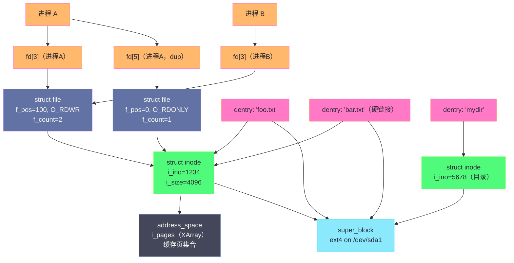

**摘要：**

VFS（Virtual File System，虚拟文件系统）是 Linux 内核中最优雅的抽象之一——它用四个核心对象（`super_block`、`inode`、`dentry`、`file`）覆盖了所有文件系统操作的语义，无论底层是 ext4、XFS、procfs 还是 NFS，用户程序看到的永远是同一张脸。但这四个对象不是简单的数据容器，每个对象的设计都有其深刻的动机：`inode` 为什么不存文件名？`dentry` 为什么要独立于 `inode` 存在？`struct file` 为什么要有 `f_pos`？"负 dentry"是什么，为什么它能大幅提升路径查找性能？本文逐一拆解这四大对象的数据结构、生命周期与关键字段，解析对象之间的关系网络，以及 `address_space`（第五个隐藏的核心对象）如何将 inode 与 [[Page Cache]] 连接起来。理解这四个对象，是读懂所有具体文件系统（ext4、XFS）内部实现的前提。

---

## 第 1 章 VFS 的设计动机：为什么需要一个虚拟层

### 1.1 没有 VFS 的世界会怎样

假设 Linux 没有 VFS，要支持 ext4 和 NFS 两种文件系统，系统调用 `read()` 就需要：

```c
/* 没有 VFS 的假想世界 */
ssize_t sys_read(int fd, void *buf, size_t count) {
    /* 必须知道 fd 对应的是什么文件系统 */
    if (fd_is_ext4(fd)) {
        return ext4_read(fd, buf, count);
    } else if (fd_is_nfs(fd)) {
        return nfs_read(fd, buf, count);
    } else if (fd_is_tmpfs(fd)) {
        return tmpfs_read(fd, buf, count);
    }
    /* ... 每新增一个文件系统就要修改系统调用 */
}
```

这显然不可维护——每新增一个文件系统，所有系统调用都需要修改。更糟的是，文件系统是内核的核心，这种耦合会使内核变成一团难以理解的 spaghetti code。

**VFS 的解法**：定义一套标准的操作接口（函数指针表），系统调用通过接口调用，具体文件系统实现接口——这正是面向对象的多态思想在 C 语言内核中的经典应用。

```c
/* 有了 VFS，sys_read 变成 */
ssize_t sys_read(int fd, void *buf, size_t count) {
    struct file *filp = fget(fd);
    /* 通过函数指针调用，不关心底层文件系统类型 */
    return filp->f_op->read_iter(filp, &kiocb, &iter);
    /* ext4 实现了 ext4_file_read_iter */
    /* nfs 实现了 nfs_file_read         */
    /* procfs 实现了 proc_read           */
    /* 系统调用不需要知道具体是哪一个      */
}
```

### 1.2 四大对象的分工

VFS 用四个对象分工协作，覆盖文件系统操作的所有维度：

| 对象 | 对应内核结构 | 描述的是什么 | 生命周期 |
|-----|------------|------------|---------|
| 超级块 | `struct super_block` | 一个已挂载的文件系统实例 | 挂载时创建，卸载时销毁 |
| 索引节点 | `struct inode` | 一个文件/目录的元数据（不含文件名）| 文件存在期间持久存在（内存中缓存）|
| 目录项 | `struct dentry` | 一个路径组件（文件名 → inode 的映射）| 路径查找后缓存，内存压力下可回收 |
| 文件 | `struct file` | 一个进程打开文件的上下文（包含读写位置）| open() 时创建，close() 时销毁 |

---

## 第 2 章 super_block：文件系统实例的描述符

### 2.1 super_block 是什么

`struct super_block` 是内核对**一个已挂载文件系统实例**的描述——每次 `mount` 命令挂载一个文件系统，内核就会创建一个对应的 `super_block`。

`super_block` 回答的问题是：这个文件系统的全局配置是什么？块大小是多少？最大文件大小？inode 总数？已使用多少？文件系统类型（ext4/XFS）？

```c
struct super_block {
    dev_t           s_dev;          /* 挂载在哪个块设备上（如 /dev/sda1）*/
    unsigned long   s_blocksize;    /* 文件系统的块大小（通常 4096 字节）*/
    loff_t          s_maxbytes;     /* 文件最大大小（ext4 = 16TB）*/
    struct file_system_type *s_type;/* 文件系统类型（ext4_fs_type / xfs_fs_type）*/
    const struct super_operations *s_op; /* 操作函数指针表（alloc_inode、destroy_inode 等）*/
    struct dentry   *s_root;        /* 该文件系统的根目录 dentry */
    struct list_head s_inodes;      /* 该文件系统中所有 inode 的链表 */
    unsigned long   s_magic;        /* 魔数（ext4 = 0xEF53，xfs = 0x58465342）*/
    void            *s_fs_info;     /* 文件系统私有数据（如 ext4_sb_info，存储 ext4 特有配置）*/
    /* 其他字段：挂载标志、统计信息、锁... */
};
```

**关键字段解析**：

- **`s_blocksize`**：文件系统的逻辑块大小，通常是 4096 字节（4KB）。这是文件系统分配磁盘空间的最小单位——即使文件只有 1 字节，也会占用一整个块（4096 字节）。`df -h` 显示的磁盘使用量就是以块为单位计算的。
- **`s_root`**：挂载点的根目录 dentry。路径解析从这里开始（对于绝对路径，从全局根 `/` 的 super_block 开始）。
- **`s_fs_info`**：指向文件系统私有数据的指针——ext4 将其设置为 `ext4_sb_info`，其中包含 ext4 特有的信息（如块组描述符表、日志句柄、特性标志等）。VFS 不关心这个字段的内容，只有具体文件系统代码才解引用它。

### 2.2 super_operations：文件系统级别的操作

`super_block` 通过 `s_op`（`struct super_operations`）向 VFS 暴露文件系统级别的操作：

```c
struct super_operations {
    /* inode 的分配与销毁 */
    struct inode *(*alloc_inode)(struct super_block *sb);
    void (*destroy_inode)(struct inode *);
    void (*free_inode)(struct inode *);

    /* 脏 inode 写回（将 inode 的元数据变更写入磁盘）*/
    int (*write_inode)(struct inode *, struct writeback_control *wbc);

    /* inode 丢弃（引用计数归零时调用）*/
    void (*evict_inode)(struct inode *);

    /* 文件系统统计信息（df 命令使用）*/
    int (*statfs)(struct dentry *, struct kstatfs *);

    /* 重新挂载（mount -o remount，修改挂载选项）*/
    int (*remount_fs)(struct super_block *, int *, char *);

    /* 同步（sync 系统调用触发）*/
    int (*sync_fs)(struct super_block *sb, int wait);
    /* ... */
};
```

```bash
# 验证：查看挂载文件系统的超级块信息
tune2fs -l /dev/sda1  # 读取 ext4 超级块（需要 root）
# Filesystem magic number: 0xEF53     ← s_magic
# Block size:               4096      ← s_blocksize
# Block count:              10485760  ← 总块数
# Free blocks:              5242880   ← 空闲块数
# Inode count:              2621440   ← 总 inode 数
# Free inodes:              2100000   ← 空闲 inode 数
# Journal size:             128m      ← 日志大小

# 通过 /proc/fs/ext4/<dev>/mb_groups 可以查看每个块组的使用情况
ls /proc/fs/ext4/
```

---

## 第 3 章 inode：文件元数据的核心

### 3.1 inode 不存文件名——这是关键设计决策

**inode（Index Node，索引节点）** 存储一个文件或目录的所有元数据，但**不包含文件名**。

这个设计乍看违反直觉，但有深刻的理由：

**文件名是路径中的概念，而 inode 代表文件本身**。同一个 inode 可以有多个文件名——这就是 **硬链接（Hard Link）** 的本质：两个不同的目录项（dentry）指向同一个 inode，通过任何一个名字修改文件，都是在修改同一份数据。

```bash
# 硬链接示例
echo "hello" > original.txt
ln original.txt hardlink.txt   # 创建硬链接（不是拷贝，是同一个 inode 的第二个名字）

stat original.txt
# Inode: 1234567  Links: 2   ← Links: 2 说明有两个目录项指向这个 inode

stat hardlink.txt
# Inode: 1234567  Links: 2   ← 相同的 inode 编号！

# 修改任一文件，另一个同步变化（因为是同一个 inode）
echo "world" >> hardlink.txt
cat original.txt
# hello
# world
```

**文件名存在哪里？**——存在父目录的内容中（目录也是一种特殊的"文件"，其内容是文件名→inode号的映射表）。

### 3.2 VFS inode 的结构

```c
struct inode {
    /* 基本标识 */
    umode_t         i_mode;     /* 文件类型（普通文件/目录/符号链接/设备...）+ 权限位（rwxrwxrwx）*/
    unsigned short  i_opflags;
    kuid_t          i_uid;      /* 文件所有者的 UID */
    kgid_t          i_gid;      /* 文件所有者的 GID */

    /* 时间戳 */
    struct timespec64 i_atime;  /* 最后访问时间（Access time）*/
    struct timespec64 i_mtime;  /* 最后修改时间（Modify time，文件内容改变）*/
    struct timespec64 i_ctime;  /* 最后状态变化时间（Change time，inode 元数据改变）*/

    /* 大小与位置 */
    loff_t          i_size;     /* 文件大小（字节）*/
    blkcnt_t        i_blocks;   /* 占用的磁盘块数（512 字节为单位，注意不是 i_blkbits）*/

    /* 引用计数与状态 */
    atomic_t        i_count;    /* inode 的引用计数（被多少 dentry 引用）*/
    unsigned int    i_nlink;    /* 硬链接数（目录项引用 inode 的数量）*/

    /* 操作函数指针表 */
    const struct inode_operations  *i_op;  /* inode 级操作（create, lookup, link, mkdir...）*/
    const struct file_operations   *i_fop; /* 文件级操作（read, write, mmap...），open() 时赋给 struct file */
    const struct address_space_operations *i_aop; /* 与 Page Cache 的交互（readpage, writepage...）*/

    /* Page Cache 连接 */
    struct address_space    *i_mapping;  /* 指向该文件的 Page Cache 地址空间 */
    struct address_space    i_data;      /* 对于普通文件，i_mapping 指向此字段 */

    /* 文件系统私有数据 */
    union {
        struct ext4_inode_info  ext4_i;  /* ext4 私有 inode 信息（实际上通过 container_of 访问）*/
        /* xfs_inode, proc_inode 等各文件系统各自嵌入 */
    };
    /* ... */
};
```

### 3.3 inode 的两种形态：内存 vs 磁盘

VFS 的 `struct inode` 是**内存中的 inode**——是从磁盘上读取并在内存中缓存的版本，包含了额外的内核运行时信息（如引用计数、锁、Page Cache 指针等）。

磁盘上存储的 inode 格式由具体文件系统定义（`ext4_inode`、`xfs_dinode`）——它只包含需要持久化的字段（权限、大小、时间戳、块指针），不包含内存运行时字段。

内核将两者合并的方式是**结构体嵌入（struct embedding）**：

```c
/* ext4 的内存 inode：将 VFS inode 嵌入到 ext4 私有结构体中 */
struct ext4_inode_info {
    /* ext4 特有字段 */
    __le32  i_data[15];          /* 磁盘上的块指针（Extent 树根）*/
    __u32   i_flags;             /* ext4 特有标志（如 EXT4_EXTENTS_FL 表示使用 Extent 树）*/
    ext4_fsblk_t i_file_acl;    /* 扩展属性块号 */
    /* ... 其他 ext4 私有字段 ... */

    struct inode vfs_inode;      /* 【关键】VFS inode 嵌入在最后！*/
};

/* 通过 container_of 宏在两种类型之间互转（零开销，只是指针偏移）*/
static inline struct ext4_inode_info *EXT4_I(struct inode *inode) {
    return container_of(inode, struct ext4_inode_info, vfs_inode);
}
/* 当 VFS 代码有一个 struct inode *，ext4 代码可以用 EXT4_I() 获取完整的 ext4_inode_info */
```

这个技巧（C 语言中的"继承"）使得 VFS 和具体文件系统的代码都不需要额外的内存分配——两者的数据在同一块内存中，只是视角不同。

### 3.4 inode_operations：目录/文件系统级操作

```c
struct inode_operations {
    /* 目录操作 */
    struct dentry *(*lookup)(struct inode *, struct dentry *, unsigned int);
    /* lookup：在目录中查找某个文件名（ext4_lookup 在 htree 中搜索）*/

    int (*create)(struct user_namespace *, struct inode *, struct dentry *, umode_t, bool);
    /* create：在目录中创建新文件（分配 inode，添加目录项）*/

    int (*mkdir)(struct user_namespace *, struct inode *, struct dentry *, umode_t);
    int (*rmdir)(struct inode *, struct dentry *);
    int (*rename)(struct user_namespace *, struct inode *, struct dentry *,
                  struct inode *, struct dentry *, unsigned int);
    int (*link)(struct dentry *, struct inode *, struct dentry *);    /* 硬链接 */
    int (*unlink)(struct inode *, struct dentry *);                   /* 删除目录项（引用计数-1）*/
    int (*symlink)(struct user_namespace *, struct inode *, struct dentry *, const char *);

    /* 权限与属性 */
    int (*permission)(struct user_namespace *, struct inode *, int);
    int (*getattr)(struct user_namespace *, const struct path *, struct kstat *, ...);
    int (*setattr)(struct user_namespace *, struct dentry *, struct iattr *);
    /* ... */
};
```

---

## 第 4 章 dentry：路径缓存与目录项

### 4.1 dentry 的存在理由

如果已经有了 inode，为什么还需要 dentry？

**inode 描述"文件是什么"，dentry 描述"文件在哪（在目录树中的位置）"。**

两者需要分离的理由：

1. **一个 inode 可以有多个 dentry**（硬链接）：同一个文件可以通过 `/home/user/foo` 和 `/tmp/bar` 两个路径访问，对应两个 dentry，但只有一个 inode。

2. **路径解析需要缓存**：解析路径 `/usr/lib/python3/dist-packages/numpy/__init__.py` 需要经过 6 级目录，每一级都可能触发磁盘 IO。`dentry cache` 缓存了这些路径组件，使重复访问同一路径极快。

3. **负 dentry（Negative dentry）**：记录"这个文件名在这个目录下不存在"的缓存——当你访问一个不存在的文件，内核会缓存这个"不存在"的事实。下次再访问同一路径，不需要再去磁盘查找，直接从 dcache 返回"不存在"。这对于频繁访问不存在路径（如 `/proc/[pid]/exe` 对已退出进程）的场景非常重要。

### 4.2 dentry 的结构

```c
struct dentry {
    unsigned int            d_flags;     /* 状态标志（DCACHE_MISS、DCACHE_MOUNTED 等）*/
    seqcount_spinlock_t     d_seq;       /* 用于 RCU 无锁路径解析的序列计数 */

    /* 核心关联关系 */
    struct dentry          *d_parent;    /* 父目录的 dentry */
    struct qstr             d_name;      /* 文件名（含哈希值，用于 dcache 快速查找）*/
    struct inode           *d_inode;     /* 关联的 inode（NULL = 负 dentry，表示文件不存在）*/

    /* 树形结构 */
    struct list_head        d_child;     /* 在父目录下的兄弟链表节点 */
    struct list_head        d_subdirs;   /* 该目录下所有子项的链表 */
    struct hlist_bl_node    d_hash;      /* dcache hash 表节点（按 parent + name_hash 索引）*/

    /* LRU 与回收 */
    struct list_head        d_lru;       /* dcache LRU 链表（最近最少使用，内存压力时优先回收）*/
    unsigned long           d_time;      /* 最后使用时间（用于 LRU 排序）*/

    /* 文件系统关联 */
    const struct dentry_operations *d_op; /* 文件系统的 dentry 操作（如 ext4_dentry_ops）*/
    struct super_block      *d_sb;       /* 所属文件系统的超级块 */

    /* 私有数据（文件系统可选使用）*/
    void                   *d_fsdata;

    /* 内联文件名存储（短文件名直接存储，避免额外分配）*/
    unsigned char           d_iname[DNAME_INLINE_LEN]; /* 36 字节，足够大多数文件名 */
};
```

### 4.3 dcache 的查找机制

dcache（dentry cache）是一个全局 hash 表，以 `(parent_dentry, filename_hash)` 为键：

```c
/* 路径解析时的 dentry 查找（RCU 无锁快速路径）*/
static struct dentry *__d_lookup_rcu(const struct dentry *parent,
                                      const struct qstr *name,
                                      unsigned *seqp) {
    /* 计算 hash：hash(parent_dentry_pointer + filename_hash_value) */
    unsigned int hash = name->hash;
    struct hlist_bl_head *b = d_hash(hash);

    /* 遍历 hash 桶（链式解决哈希冲突）*/
    hlist_bl_for_each_entry_rcu(dentry, node, b, d_hash) {
        /* 先比较父目录和 hash（快速过滤）*/
        if (dentry->d_parent != parent)
            continue;
        if (dentry->d_name.hash != hash)
            continue;
        /* 再比较文件名字符串（只在 hash 匹配时才做字符串比较）*/
        if (!dentry_cmp(dentry, name->name, name->len))
            continue;
        return dentry;  /* 找到了 */
    }
    return NULL;   /* dcache miss */
}
```

**dcache 对性能的核心贡献**：

```bash
# 冷系统（dcache 为空）vs 热系统（dcache 热）的路径解析速度差异
# 测试：find /usr -name "*.py" -type f | wc -l

# 第一次运行（dcache 冷）：需要大量磁盘 IO 读取目录内容
time find /usr -name "*.py" -type f | wc -l
# real 0m 5.234s

# 第二次运行（dcache 热，目录已缓存）：全部从内存读取
time find /usr -name "*.py" -type f | wc -l
# real 0m 0.312s

# 性能差异：~17 倍，完全来自 dcache 的命中
```

### 4.4 dentry 的生命周期与回收

dentry 有以下几种状态：

**使用中（in-use）**：有 `d_inode`（不是负 dentry），且 `d_count > 0`（被进程引用）。不可回收。

**未使用但缓存（unused）**：`d_count == 0`，但仍在 dcache hash 表和 LRU 链表中。可以在内存压力时被回收。

**负 dentry（negative）**：`d_inode == NULL`，表示该文件名在对应目录下不存在。同样缓存在 dcache 中，内存压力时可回收。

**为什么保留未使用的 dentry？**

磁盘上的文件不会随机消失。如果一个进程刚刚读取了 `/etc/nginx/nginx.conf`，对应的 dentry 和 inode 就留在缓存中——下次另一个进程访问同一文件时，直接命中缓存，不需要磁盘 IO。这是以内存换 IO 延迟的核心策略。

```bash
# 查看 dcache 使用情况
sysctl vm.vfs_cache_pressure
# vm.vfs_cache_pressure = 100
# 控制内核回收 dcache 和 inode cache 的积极程度
# 默认 100：dcache/inode 与 page cache 按相同权重参与内存回收
# 设为 200：内核更积极地回收 dcache（适合内存极度紧张的系统）
# 设为 50：更保守地回收 dcache（适合文件访问模式复杂的系统）

# 查看 dentry/inode cache 的当前大小
cat /proc/meminfo | grep -E "^(Slab|SReclaimable|SUnreclaim)"
# Slab:            512 MB    ← Slab 总大小（包括 dentry/inode/page_cache 等 Slab）
# SReclaimable:    456 MB    ← 可回收的 Slab（包括 dcache、inode cache）
# SUnreclaim:       56 MB    ← 不可回收的 Slab（内核数据结构）
```

---

## 第 5 章 struct file：进程打开文件的上下文

### 5.1 file 为什么要独立于 inode

如果文件的所有信息都在 inode 中，为什么还需要 `struct file`？

**inode 描述文件本身（全局共享），`struct file` 描述一次打开操作的私有上下文。**

关键区别：

- **文件偏移（`f_pos`）**：进程 A 打开同一个文件读到第 100 字节，进程 B 打开同一个文件读到第 200 字节——它们共享同一个 inode，但各自有独立的 `f_pos`。如果偏移存在 inode 中，就无法支持多进程独立读取同一文件。

- **打开标志（`f_flags`）**：一个进程用 `O_RDONLY` 打开，另一个用 `O_RDWR`，这是各自打开操作的属性，不是文件本身的属性。

- **引用计数与生命周期**：`struct file` 在 `open()` 时创建，在所有指向它的 fd 都被 `close()` 后销毁；inode 在文件存在期间持久存在（内存中可能被换出，但磁盘上一直存在）。

### 5.2 struct file 的结构

```c
struct file {
    /* 位置与路径 */
    struct path             f_path;     /* 包含 dentry 和 vfsmount，记录文件在目录树中的位置 */
    struct inode           *f_inode;    /* 直接指向 inode（f_path.dentry->d_inode 的快捷访问）*/

    /* 操作函数表 */
    const struct file_operations *f_op; /* 文件操作函数指针（由具体文件系统实现）*/

    /* 进程私有状态 */
    atomic_long_t           f_count;    /* 引用计数（dup/fork 可能使多个 fd 指向同一 struct file）*/
    unsigned int            f_flags;    /* open() 时传入的 flags（O_RDONLY、O_NONBLOCK 等）*/
    fmode_t                 f_mode;     /* 访问模式（FMODE_READ / FMODE_WRITE）*/
    loff_t                  f_pos;      /* 当前读写位置（文件偏移，read/write 后自动更新）*/
    struct fown_struct      f_owner;    /* 异步 IO 通知的所有者信息（SIGIO）*/

    /* Page Cache 连接 */
    struct address_space   *f_mapping;  /* 指向 inode->i_mapping，连接 Page Cache */

    /* 文件系统私有数据 */
    void                   *private_data; /* 文件系统或驱动的私有数据 */
    /* ... */
};
```

### 5.3 fd 表、struct file 与 inode 的三角关系

这是理解进程文件管理的关键图示：

```
进程 A（fork 前）                    进程 B（fork 后，共享 files_struct 前的状态）
files_struct                        files_struct
  fd[3] ──────────────────────────────────────────┐
                                                  ↓
                                          struct file（f_count=2）
                                            f_pos = 100
                                            f_flags = O_RDWR
                                            f_inode ──────────────────────────────┐
                                                                                   ↓
进程 C（独立 open 同一文件）                                                   struct inode
files_struct                                                                    i_ino = 1234
  fd[5] ──────┐                                                                  i_size = 4096
              ↓                                                                   i_mapping ──→ address_space
          struct file（f_count=1）                                                               (Page Cache)
            f_pos = 0        ← 独立的读写位置！
            f_flags = O_RDONLY
            f_inode ─────────────────────────────────────────────────────────────────↗
```

**`dup(fd)` 和 `fork()` 后的引用关系**：

- `dup(fd)` 或 `dup2(old_fd, new_fd)`：创建新的 fd 号，但指向**同一个 `struct file`**（`f_count++`）。两个 fd 共享 `f_pos`——通过任一 fd 的 `read()`/`write()` 都会移动同一个文件偏移。
- `fork()` 后：子进程继承父进程的 fd 表中所有 fd，这些 fd 也指向**同一个 `struct file`**（`f_count++`）。父子进程共享文件偏移——这是 Shell 管道正确工作的关键（子进程执行命令，父进程的 stdout fd 和子进程的 stdout fd 指向同一个管道写端）。
- `open()` 同一文件：两次 `open()` 创建两个独立的 `struct file`，各自有独立的 `f_pos`。

### 5.4 file_operations：文件级操作

`f_op` 是 VFS 最核心的函数指针表——具体文件系统实现这些函数，VFS 通过函数指针调用：

```c
struct file_operations {
    /* IO 操作 */
    ssize_t (*read_iter)(struct kiocb *, struct iov_iter *);
    ssize_t (*write_iter)(struct kiocb *, struct iov_iter *);

    /* 随机访问 */
    loff_t (*llseek)(struct file *, loff_t, int);

    /* 内存映射（mmap）*/
    int (*mmap)(struct file *, struct vm_area_struct *);

    /* 打开/关闭 */
    int (*open)(struct inode *, struct file *);
    int (*release)(struct inode *, struct file *);
    int (*flush)(struct file *, fl_owner_t id);

    /* 同步 */
    int (*fsync)(struct file *, loff_t, loff_t, int datasync);

    /* 设备/特殊文件控制 */
    long (*unlocked_ioctl)(struct file *, unsigned int, unsigned long);

    /* 目录读取（ls 命令用到）*/
    int (*readdir)(struct file *, struct dir_context *);

    /* 异步 IO */
    int (*fasync)(int, struct file *, int);

    /* splice/sendfile */
    ssize_t (*splice_read)(struct file *, loff_t *, struct pipe_inode_info *, size_t, unsigned int);
    ssize_t (*splice_write)(struct pipe_inode_info *, loff_t *, struct file *, size_t, unsigned int);
    /* ... */
};
```

---

## 第 6 章 address_space：连接 inode 与 Page Cache 的桥梁

### 6.1 address_space 是第五个核心对象

VFS 通常被称为"四大对象"，但实际上还有一个同等重要的对象经常被忽视：`struct address_space`。

**`address_space` 是一个文件（inode）的 Page Cache 管理中心**——它维护了该文件在内存中缓存的所有页（page），并提供了与磁盘 IO 交互的操作接口。

```c
struct address_space {
    struct inode            *host;          /* 所属的 inode */
    struct xarray            i_pages;       /* 文件的所有缓存页（以页号为键的 XArray）*/
    struct rw_semaphore      i_mmap_rwsem;  /* 保护 i_mmap（mmap 映射树）*/
    unsigned long            nrpages;       /* 缓存页数量 */
    unsigned long            nrexceptional; /* 特殊条目数（swap 等）*/
    pgoff_t                  writeback_index; /* 脏页写回的起始位置 */
    const struct address_space_operations *a_ops; /* Page Cache 与磁盘 IO 的桥梁操作 */
    unsigned long            flags;         /* 状态标志 */
    struct maple_tree        i_mmap;        /* 所有 mmap 映射该文件的 VMA 树（用于 mmap 映射管理）*/
    atomic_t                 i_mmap_writable; /* 可写 mmap 数量 */
    /* ... */
};
```

### 6.2 address_space_operations：Page Cache 的 IO 接口

`a_ops`（`struct address_space_operations`）定义了 Page Cache 与具体文件系统之间的接口——当 Page Cache 需要从磁盘读取一页（Cache miss），或将脏页写回磁盘时，通过这里的函数指针调用文件系统的具体实现：

```c
struct address_space_operations {
    /* 读取：将磁盘数据读入内存页（Cache miss 时触发）*/
    int (*readpage)(struct file *, struct page *);
    void (*readahead)(struct readahead_control *);  /* 预读（prefetch）*/

    /* 写回：将脏页写回磁盘 */
    int (*writepage)(struct page *page, struct writeback_control *wbc);
    int (*writepages)(struct address_space *, struct writeback_control *);

    /* 标记脏页 */
    int (*set_page_dirty)(struct page *page);

    /* 预备写（分配磁盘块，确保写入有足够空间）*/
    int (*write_begin)(struct file *, struct address_space *mapping,
                       loff_t pos, unsigned len, unsigned flags,
                       struct page **pagep, void **fsdata);
    int (*write_end)(struct file *, struct address_space *mapping,
                     loff_t pos, unsigned len, unsigned copied,
                     struct page *page, void *fsdata);

    /* 块映射（查询文件偏移对应的磁盘块号）*/
    sector_t (*bmap)(struct address_space *, sector_t);

    /* 直接 IO（绕过 Page Cache）*/
    ssize_t (*direct_IO)(struct kiocb *, struct iov_iter *iter);
    /* ... */
};
```

**以 `readpage` 为例，追踪一次 Page Cache miss 的完整路径**：

```
1. filemap_read() 发现 Page Cache 中没有第 N 页（page == NULL）
2. 分配一个新的 struct page，加入 address_space->i_pages（XArray）
3. 调用 a_ops->readpage(file, page)
   → ext4_readpage()
   → ext4_mpage_readpages()
   → ext4_map_blocks()（查询 Extent 树，得到物理块号）
   → submit_bio()（创建 bio 请求，提交到块设备层）
4. Page 被标记为 PG_locked（锁定中），等待 IO 完成
5. 块设备驱动 DMA 传输完成，调用 bio->bi_end_io
   → unlock_page(page)（解锁页）
   → wake_up_page(page)（唤醒等待这一页的进程）
6. filemap_read() 中的 wait_on_page_locked() 返回
7. 将数据从内核页拷贝到用户缓冲区
```

---

## 第 7 章 VFS 对象关系总图



---

## 小结

VFS 的四大对象（加上 `address_space`）构成了 Linux 文件系统抽象的完整框架：

**对象分工总结**：
- **`super_block`**：文件系统实例（"这个磁盘分区格式化成 ext4，块大小 4KB，共 X 个 inode"）
- **`inode`**：文件/目录本身（"这个文件的大小、权限、时间戳，以及数据在磁盘哪里"）
- **`dentry`**：路径中的一步（"在目录 X 下，名字 'foo.txt' 对应 inode 1234"）——也是路径解析缓存
- **`struct file`**：一次打开操作的私有上下文（"进程 A 打开这个文件，当前读到了第 100 字节，模式是只读"）
- **`address_space`**：文件的 Page Cache 管理中心（"该文件在内存中缓存了哪些页，如何读/写磁盘"）

**三个关键设计决策**：
1. **inode 不存文件名**：支持硬链接，分离"文件内容"与"文件命名"
2. **负 dentry**：缓存"不存在"这一事实，避免重复查找不存在的路径
3. **`struct file` 独立于 inode**：支持多进程/多 fd 独立读写同一文件，各自维护偏移

下一篇 [[03 ext4 深度解析——日志、盘区树与 Flex BG]] 将深入 Linux 最广泛使用的文件系统 ext4 的磁盘布局：Extent 树如何存储文件数据块的位置？日志（journal）如何保证崩溃后的一致性？Flex BG 是什么，为什么能提升大文件的 IO 性能？

---

> [!note] 思考题
> 1. inode 不包含文件名——文件名在 dentry 中。一个 inode 可对应多个 dentry（硬链接）。但目录不能创建硬链接——因为会导致目录树形成环路，`find` 和 `rm -rf` 等递归操作会无限循环。符号链接（symlink）不存在这个问题——为什么？symlink 的 inode 存储了什么？
> 2. dentry cache 是文件系统性能的关键缓存。`slabtop` 中 dentry 占用过高时，`echo 2 > /proc/sys/vm/drop_caches` 可手动清理。但清理后所有路径查找都需要重新从磁盘读取——短期内性能会下降。内核的自动 Slab 回收（shrinker）在什么条件下触发？`vm.vfs_cache_pressure` 如何调节回收力度？
> 3. procfs 和 sysfs 中的'文件'不存储在磁盘上——read 操作调用内核函数动态生成数据。如果你需要向内核暴露运行时参数，procfs（`/proc/sys/`）和 sysfs（`/sys/`）哪种更合适？debugfs（`/sys/kernel/debug/`）的使用场景是什么？它们在安全性和稳定性方面有什么差异？
