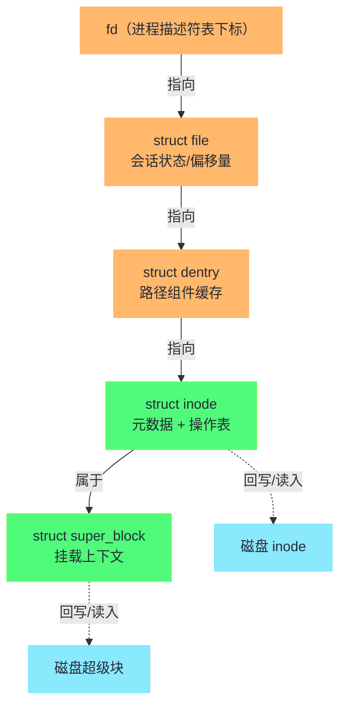
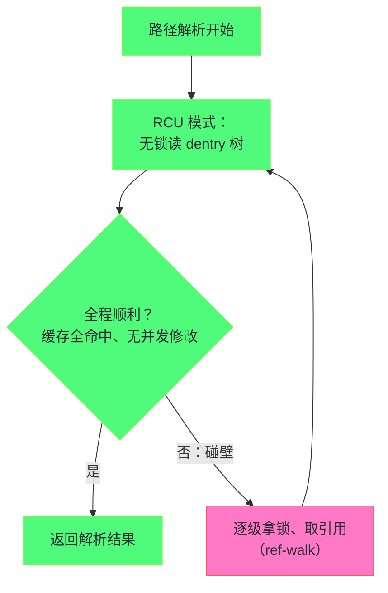

# VFS 虚拟文件系统——超级块、inode、dentry 与 file

**摘要：**

上一篇把整条存储栈走了一遍，途中反复出现一个身份含糊的角色——"VFS 层"，它负责路径解析、权限检查与会话管理，却始终没有正面出场。本篇就是它的正传。虚拟文件系统（Virtual File System，VFS）是 Linux 文件子系统的第一层抽象：同一台机器上，根分区可以跑 ext4，家目录可以挂 NFS，`/proc` 是内存里现编出来的伪文件系统，容器里还叠着一层 overlayfs——而应用程序对这一切毫无察觉，用的始终是同一套 `open/read/write`。这个"无缝共存"不是魔法，而是把文件系统拆解成**四个内核对象的公共合同**：super_block 记录一次挂载的全部上下文，inode 是文件的元数据与管理信息，dentry 是路径解析的缓存单元，struct file 是一次打开的会话状态。本篇依次解剖这四个对象，讲清它们如何协作完成路径解析、如何支撑硬链接与挂载这些 Unix 核心语义、以及 2010 年前后 RCU 化的路径遍历如何让百万级文件目录的解析不再成为锁竞争的重灾区。全文回答两个问题：VFS 用什么结构让"几十种互不相干的实现"讲同一种语言，以及这套抽象在各环节付出的代价由谁补偿。

---

## 第 1 章 为什么需要 VFS：一个抽象层的诞生

### 1.1 1986 年之前：文件系统各自为政

早期 Unix 没有这个问题，因为它只有一个文件系统。PDP-11 时代的 UFS（Unix File System）与内核长在一起，文件系统的结构体直接散布在内核各处，"文件系统"作为可替换组件的概念并不存在。1980 年代中期情况变了：Sun 要在工作站上同时支持本地 UFS 与网络文件系统 NFS，两种实现的数据结构、寻址方式、甚至"文件是否存在"的含义都不相同，把它们塞进同一个内核又不想改写所有系统调用的实现——问题第一次以尖锐的形式摆上台面。

Sun 的工程师 Steve Kleiman 给出的答案是 1985 年在 SunOS 中引入的 **vnode（virtual node）**层，并在 1986 年的 USENIX 会议上发表了那篇奠基论文《Vnodes: An Architecture for Multiple File System Types in Sun Unix》。核心思想一语道破：**把"每个文件在内核中的代表对象"拆成两部分——与具体实现无关的公共外壳（vnode），以及外壳里指向具体实现的私有数据与操作表**。系统调用只跟外壳打交道，外壳通过操作表把请求转派给具体实现。这个今天看来平淡无奇的间接层，在当时是文件系统世界从"单体"走向"生态"的分水岭：此后文件系统不再需要征得内核其他部分的同意才能存在，只要实现合同里的那组操作即可入场。

Linux 从诞生起（1991 年）就站在 vnode 思想的肩膀上——Linus 参考了 Unix 的既有设计，内核很早就有自己的 VFS 层，并在 2.4 时代随着 ext2、NFS、smbfs、procfs 等数十种实现的共存而彻底成熟。今天的 Linux VFS 背后挂着上百种实现：本地盘的 ext4 与 XFS、网络的 NFS 与 CIFS、集群的 CephFS、内存里的 tmpfs 与 procfs、叠加式的 overlayfs、用户态的 FUSE。01 篇说"接口统一了，语义边界被推给各实现自行裁剪"，本篇要看的就是这台机器的内部构造。

### 1.2 抽象的收益与代价：一份合同的两面

VFS 的合同可以用一句话概括：**具体文件系统实现一组操作函数，VFS 持有统一的调用入口**。它的收益清单有三条。第一是**实现自由**：新文件系统（譬如当年刚出现的 ext4，或者某个 Ceph 的移植）只需填好操作表，就能立刻获得全部上层能力——路径解析、缓存、权限检查、fd 管理，一样都不用重写。第二是**共存与嫁接**：不同实现可以同时挂载、任意嵌套（把 NFS 挂在 ext4 的某个子目录上），因为 VFS 的目录树是所有实现拼出来的。第三是**上层复用**：`cp`、`tar`、语言运行时的 IO 库，写在 VFS 之上就自动适用于所有实现，套接字与管道也借着同一套 fd 语义搭上了便车。

代价则集中在一条：**间接调用与缓存维护的固定开销**。VFS 里每一次具体操作都是通过函数指针（操作表）完成的间接跳转，分支预测器吃不消时开销可观；更重的代价是缓存——VFS 为抹平实现差异，自己维护了 inode 缓存与 dentry 缓存两套对象池，这些对象的创建、查找、回收构成了一笔持续支付的管理税，目录树巨大的系统（上千万文件的备份服务器）里，这笔税在内存占用与查找延迟上都能被明确测量到。抽象层的典型处境在这里再次上演：它消灭的是每家实现各自为政的重复劳动，支付的是所有实现都要分摊的统一管理成本。本章余下部分与后续各章，就是围绕"这份合同具体怎么写、由谁履约、成本怎么付"展开。

### 1.3 四大对象总览：一台戏的四个角色

VFS 的世界可以用四个对象完整描述，后续四章按协作顺序逐一登场。先用一张表建立全景，读者可以带着对每个对象的一句话印象进入细节：

| 对象 | 内核结构 | 生命周期 | 一句话职责 |
| :--- | :--- | :--- | :--- |
| 超级块 | `struct super_block` | 随挂载建立，随卸载销毁 | 一次挂载的全局上下文：这是哪类文件系统、有哪些资源 |
| 索引节点 | `struct inode` | 磁盘上长期存在，内存中按需缓存 | 一个文件的全部管理信息与操作入口 |
| 目录项 | `struct dentry` | 纯内存对象，缓存路径组件 | 名字到 inode 的映射缓存，路径解析的台阶 |
| 文件对象 | `struct file` | 随 open 建立，随 close 销毁 | 一次打开的会话状态：模式、偏移、引用 |

四个角色构成两层关系。**纵向**是一一对应的从属：每个 file 指向一个 dentry，每个 dentry 指向一个 inode，每个 inode 背后必有所属的 super_block——这条链就是 `fd → file → dentry → inode → super_block`，01 篇路径解析的终点站在这里找到完整的家。**横向**是缓存与实体之别：dentry 与 file 是纯内存的会话/缓存对象，磁盘上没有对应物，可以随意回收重建；inode 与 super_block 是磁盘结构的内存映像，回收前必须保证脏状态已落盘。分清"哪些是账本、哪些是账本的缓存"是理解 VFS 回收行为（内存紧张时 dentry 大批量蒸发）的关键。



---

## 第 2 章 super_block 与 inode：账本的正本与户口

### 2.1 super_block：一次挂载的全部上下文

`mount -t ext4 /dev/sdb1 /data` 这条命令在内核里做的事情，第一条就是创建一个 `struct super_block` 并调用 ext4 注册的填充函数从磁盘读入超级块。此后这个内存对象就是该文件系统在内核里的"驻外使馆"：记录着块设备是谁、块大小多少、总共有多少 inode、根目录的 dentry 在哪，以及最重要的一张操作表——`super_operations`，里面有 alloc_inode、write_inode、put_super 这类全局操作的具体实现。VFS 要做任何"整个文件系统级别"的动作（同步全部脏数据、统计空闲空间），都通过这张表转派。

使馆比喻可以继续用：super_block 是使馆本部，inode 是使馆发放的证件，dentry 与 file 是业务窗口的办事记录。使馆关门（卸载，umount）的纪律也顺理成章——必须先确认没有任何未结的业务（没有进程还在用这个文件系统上的任何文件），然后通知实现方（`put_super`）把全局状态收尾落盘，最后才注销使馆。`umount` 报 "device is busy" 的全部原因，就是有某个 file 或 inode 的引用还没还清；`fuser -m /data` 能查出是谁赖着不走，查的正是这条引用链。

一次挂载对应一个 super_block，这个对应关系还顺带回答了一个容易含糊的问题：**同一个磁盘分区可以被挂载两次吗**？技术上可以（内核允许），但两个 super_block 是两个独立的内存世界，各自缓存各自的 inode，彼此不知道对方的脏页——这正是"同一分区重复挂载会导致数据损坏"警告的技术根源。上下文独立是 VFS 给实现自由的一部分，但自由的使用者需要自己承担状态分裂的后果。

### 2.2 inode：VFS 视角的索引节点

`struct inode` 是 VFS 对"文件"的统一代表。01 篇讲过磁盘上 inode 的内容（大小、属主、权限、数据块位置），内存里的 VFS inode 是它的超集：除了从磁盘读入的元数据，还挂着几样**只有内存中才存在的状态**——引用计数（多少 dentry、file 正指着我）、脏标记（元数据改了没落盘）、以及两张操作表。两张操作表是理解 VFS 分派机制的钥匙：

```c
struct inode_operations *i_op;   /* 元数据级操作：create/mkdir/unlink/rename */
struct file_operations  *i_fop;  /* 数据级操作：read/write/fsync/mmap */

/* VFS 处理 open() 时的核心动作（示意）：
   从 inode 的 i_fop 拿到具体实现的 open 函数 */
struct file *f = alloc_empty_file(...);
f->f_op = fops_get(inode->i_fop);
f->f_op->open(inode, f);   /* 间接调用：ext4 与 procfs 在此分道扬镳 */
```

`i_op` 管的是"对文件结构本身的动作"（创建、删除、改名、设权限），`i_fop` 管的是"对文件内容的动作"（读写、同步、映射）。ext4 的 `i_fop->read_iter` 走 Page Cache 再走块层，procfs 的同名函数是当场生成一段内存文本，FUSE 的同名函数是把请求打包发给用户态守护进程——**同一个函数指针槽位，装着完全不同的世界**，这就是 1.1 节"外壳 + 操作表"思想在文件粒度的落地。第一篇 2.3 节说"接口统一、语义自裁剪"，其机制载体就是这张表：各实现填什么函数、函数里做什么，完全是它自己的事。

还必须澄清一个概念：**VFS inode 与磁盘 inode 不是同一个东西**。VFS inode 是所有文件系统（包括完全没有磁盘 inode 概念的 procfs、tmpfs）都必须提供的公共外壳；磁盘 inode 是 ext4/XFS 各自的私有存储格式。挂载时 ext4 把磁盘 inode 的字段"翻译"进 VFS inode，procfs 则凭空构造一个 VFS inode。分清这两个层次，才能解释为什么"proc 目录下的文件 stat 出来的 inode 号毫无规律"——因为那里根本没有磁盘账本，编号只是临时编的。

### 2.3 inode cache：亿级文件下的查找问题

路径解析与任何元数据操作都要先拿到 inode 对象，而"从磁盘读 inode"是几十微秒起步的慢活。内核为此维护全局的 **inode 缓存（inode cache）**：每个在用的 inode 以哈希表索引（按 super_block + inode 号定位），辅以两条 LRU 链表管理冷热。查找的流程是先查哈希——命中则引用计数加一直接返回；未命中才走实现的 `iget` 通道从磁盘读入并填充。热文件的元数据操作因此与磁盘解耦，`stat` 一个热文件是纯内存操作，纳秒级完成。

缓存的规模问题值得单独说，因为它是大目录运维里最实感的痛点。inode 与 dentry 都是**不能随意丢弃的有状态对象**（脏的必须先回写），内存紧张时内核只能回收干净且无引用的冷对象；一个装了五千万文件的备份卷，哪怕全部冷置，inode 与 dentry 的缓存也可能吃掉数 GB 内存。`/proc/sys/vm/vfs_cache_pressure` 就是控制"内存回收时偏向挤压 inode/dentry 缓存还是偏向挤压页缓存"的旋钮——值越高，越倾向牺牲元数据缓存换页缓存。这个旋钮的存在本身就是 VFS 抽象税的记账凭证：缓存对象池的规模管理，是一笔无论调多低都无法归零的固定成本。

---

## 第 3 章 dentry 与路径解析：把名字变快的两种手段

### 3.1 dentry：短命但关键的缓存对象

01 篇把路径解析比作逐级分拣，dentry 就是每级分拣的**工作台**。`struct dentry` 对应路径的一个组件（一个名字），记录三样东西：父 dentry（构成树）、名字字符串、以及解析结果（指向的 inode，或"这里没有东西"）。它纯内存、无磁盘对应物，构造它的唯一目的就是**让下一次同路径的解析免做**。`/home/user/work/report.doc` 的解析若全部命中缓存，实际上就是沿着一条已经建好的 dentry 链走了四步哈希查找。

dentry 有三个状态值得认识。**正常状态**指向有效 inode；**负项（negative dentry）**记录"查过了，没有这个名字"——它的价值同样巨大，否则每次 `open` 不存在的配置文件都要白走一遍全路径查找，应用反复探测文件的场景（譬如各类配置热加载）会把它刷得很热；**孤立状态**（unhashed）是被缓存驱逐或父目录变化后脱离查找体系的状态，等待引用归零后释放。负项缓存还能解释一个反直觉现象：`access()` 一个不存在的文件连续跑一万次，第二次起几乎零开销——"没有"这个结论本身被缓存住了。

### 3.2 dcache 的维护纪律：谁先进、谁先出

dcache 的管理有两条容易被忽略的纪律，它们共同决定了"缓存为什么有时会帮倒忙"。第一条是**驱逐纪律**：dentry 按 LRU（最近最少使用）排队，内存压力下从冷端回收；但回收一个 dentry 会连带其引用计数，父 dentry 的引用也被减——因此驱逐有传播效应，整个冷的子树可以被成批清出。这解释了"大目录被遍历一遍后系统变卡"的经典现象：备份或全盘扫描把海量 dentry 挤进缓存，反过来驱逐了业务的热 dentry，**缓存污染（cache pollution）在 VFS 这层同样存在**。

第二条是**失效纪律**：dentry 缓存的是"过去某时刻"的解析结果，而真相在文件系统手里。文件被删除、被重命名时，文件系统有义务让对应 dentry 失效（杀掉或转为负项）；NFS 这类网络文件系统还要应付服务器端的独立变化，因此对缓存得格外保守，甚至配置成短时效。缓存的经典两难——"存得越久越快、错得越久越险"——在这里以"由实现方申报自己的缓存能力"的方式解决：每个 super_block 挂载时声明自己愿意承担多大的缓存风险，VFS 按申报行事。这个设计的可贵之处在于把风险决策交给了最了解自己语义的一方，而不是用一刀切的最保守值拖累所有实现。

### 3.3 RCU 路径遍历：无锁读树

路径解析是全系统最高频的内核操作之一，容器化的现代服务器上每秒百万次不稀奇，而传统的解析流程每一步都要拿住 dentry 的自旋锁再改引用计数——核数一多，锁竞争把解析路径变成了卡点。2010 年前后，内核开发者（以 Nick Piggin 与 Al Viro 的工作为代表）把路径遍历改造成了 **RCU 模式（RCU-walk）**：读路径完全不加锁，靠 RCU（Read-Copy-Update）机制保证"遍历期间对象不会被释放"，引用计数延迟到最后关头才真正获取。

RCU-walk 的纪律可以概括为"乐观快走，碰壁慢走"：解析全程持 RCU 读锁，发现 dentry 要被修改（比如碰上正在进行的重命名）、或者需要做实际 IO 时，就放弃乐观模式，退回传统的逐级持锁模式（ref-walk）重来。热路径（缓存全部命中、无并发修改）享受无锁吞吐，冷路径与竞争路径退化为原有行为——**用双模式消除了"快路径被慢路径的锁拖累"**。效果在数字上很直白：大目录高并发 stat 场景的扩展性从"加核反而变慢"变成"接近线性"。这个案例还有一层方法论的价值：它没有砍掉任何功能，纯粹靠改变同步策略让读多写少的天然场景发挥出来，是内核里"按场景分离快慢路径"的典范之作。


