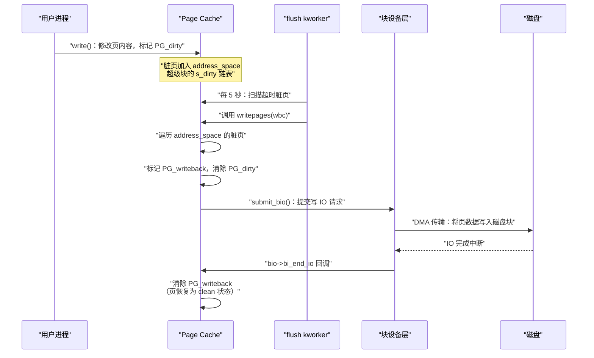

**摘要：**

在 Linux 系统上，`free` 命令显示的"available"内存往往远小于物理内存——大量内存被 Page Cache 占用了。这不是内存泄漏，而是 Linux 精心设计的 IO 加速机制：**将所有可用内存都用作磁盘缓冲区**，当程序需要读文件时先看缓存，当程序写文件时先写缓存，最后由内核统一批量写回磁盘。这个机制使得 Linux 在 IO 密集型负载下的性能远超"每次 IO 都直接访问磁盘"的朴素方案。但 Page Cache 不只是简单的缓冲区——它同时是 `mmap` 文件映射的基础（mmap 将文件页直接映射到进程虚拟地址空间，读写文件等于读写内存）、预读（readahead）机制的载体，以及脏页（dirty page）管理的核心。本文系统解析 Page Cache 的数据结构与工作原理，脏页生命周期的完整管理链（写入→标记脏→后台写回→落盘→清洁），预读算法如何通过探测访问模式来减少 IO 等待，以及 `O_DIRECT`（直接 IO）绕过 Page Cache 的场景与代价。

---

## 第 1 章 Page Cache 的本质：以内存换 IO 延迟

### 1.1 磁盘与内存的速度鸿沟

现代计算机存储系统存在巨大的速度分层：

| 存储介质 | 随机读延迟 | 顺序读带宽 |
|---------|----------|---------|
| CPU L1 Cache | ~1 ns | ~1 TB/s |
| DRAM（内存）| ~60 ns | ~50 GB/s |
| NVMe SSD | ~100 µs | ~7 GB/s |
| SATA SSD | ~100 µs | ~550 MB/s |
| HDD 机械硬盘 | ~5-10 ms | ~150 MB/s |

DRAM 的随机访问延迟比 HDD 快 **10 万倍**。如果每次 `read()` 都直接访问磁盘，哪怕是 SSD，也比内存访问慢 1000-10000 倍。

**Page Cache 的核心思想**：将最近访问过的磁盘数据保留在内存中。下次再访问同一数据时，直接从内存返回，完全不需要磁盘 IO。

### 1.2 Page Cache 占用内存是正确的行为

很多运维新手看到 `free -h` 显示大量内存被"buff/cache"占用，误以为系统内存不足：

```bash
free -h
#               total        used        free      shared  buff/cache   available
# Mem:            16G        4.2G        512M        1.2G         11G        10G

# "free" 只有 512MB，但 "available" 有 10GB
# 这 11GB 的 buff/cache 大部分是 Page Cache
# 当进程需要内存时，内核会自动回收 Page Cache（LRU 淘汰），释放给进程用
# "available" = free + 可以立即回收的 Page Cache
```

Page Cache 占用内存是**完全正确的行为**——空闲内存是浪费的内存。Page Cache 实现了"内存不够用时自动缩小，内存宽裕时尽量扩大"的弹性策略：

- 进程申请内存时，内核优先回收 Page Cache（LRU 淘汰最久未使用的缓存页）
- 当进程释放内存时，空出的内存会被 Page Cache 重新利用

### 1.3 Page Cache 的双重身份

Page Cache 不仅是读缓冲——它同时是**写缓冲**（写缓冲的技术名称是"写回缓存，Write-Back Cache"）：

- **读时**：先查 Page Cache，命中则直接返回，未命中则从磁盘读入一页并缓存
- **写时**：先写入 Page Cache（将页标记为"脏，dirty"），立即返回给用户程序。内核后台再将脏页写回磁盘

写缓冲使得 `write()` 系统调用通常只需要几百纳秒（内存写入速度）——但代价是，脏页在写回磁盘之前如果系统崩溃，数据就丢失了。这个权衡在 [[03 ext4 深度解析——日志、Extent 树与 Flex BG]] 中已经讨论过——ext4 的日志机制保证了元数据的一致性，但文件数据（非 `data=journal` 模式）仍然依赖 `fsync()` 来保证落盘。

---

## 第 2 章 Page Cache 的内核实现

### 2.1 struct page：物理内存页的描述符

内核为系统的每一个物理内存页（4KB）维护一个 `struct page` 描述符：

```c
struct page {
    unsigned long    flags;        /* 页状态标志位集合（PG_locked、PG_dirty、PG_uptodate 等）*/
    union {
        struct {
            struct list_head lru;  /* LRU 链表节点（active_list / inactive_list）*/
            struct address_space *mapping; /* 该页属于哪个文件的 Page Cache（NULL=匿名页）*/
            pgoff_t index;         /* 在文件 address_space 中的偏移（以页为单位，即文件第几页）*/
        };
        /* ... 其他用途的联合体字段（swap、compound page 等）*/
    };
    atomic_t         _refcount;    /* 引用计数（被多少人引用）*/
    atomic_t         _mapcount;    /* 映射计数（被多少个进程的 PTE 映射）*/
    /* ... */
};
```

**关键标志位**（`flags` 字段）：

| 标志位 | 含义 |
|-------|------|
| `PG_uptodate` | 页内容与磁盘同步（内容有效）|
| `PG_dirty` | 页内容比磁盘新（脏页，需要写回）|
| `PG_locked` | 页被锁定（正在 IO 中，其他访问需等待）|
| `PG_writeback` | 页正在被写回磁盘中 |
| `PG_lru` | 页在 LRU 链表中（可以被 kswapd 回收）|
| `PG_referenced` | 页最近被访问过（LRU 活跃状态标记）|
| `PG_active` | 页在 active LRU 链表（比 inactive 更不容易被回收）|

### 2.2 address_space 的 XArray：文件页的索引

每个文件（inode）的 Page Cache 通过 `address_space->i_pages`（一个 XArray，可扩展数组）来索引：

- **键**：页在文件中的偏移（`pgoff_t index = file_offset >> PAGE_SHIFT`）
- **值**：`struct page *`（该偏移对应的内存页）

```c
/* 查找文件偏移 offset 对应的 Page Cache 页 */
struct page *find_get_page(struct address_space *mapping, pgoff_t offset) {
    return xa_load(&mapping->i_pages, offset);
    /* XArray 的 xa_load：O(log n) 查找，n 为文件页数 */
    /* 对于大文件（数百万页），仍然极快（通常 < 200ns）*/
}
```

**为什么从 Radix Tree 改为 XArray？**

Linux 5.1 之前，Page Cache 使用 Radix Tree（基数树）实现，Linux 5.1+ 改用 XArray（可扩展数组）。XArray 相比 Radix Tree 的优势：

- **更简单的并发控制**：XArray 内置了细粒度锁（每个节点独立锁），减少了代码复杂度
- **更少的内存分配**：XArray 用更紧凑的表示方式，减少了树节点的内存开销
- **更好的 CPU Cache 友好性**：连续的小数组比树节点指针跳转有更好的 cache 局部性

### 2.3 LRU 链表：Page Cache 的内存管理

当内存不足时，内核需要回收 Page Cache 页。回收策略基于 **LRU（Least Recently Used，最近最少使用）** 算法，但 Linux 的实现是改进的**双链表 LRU**：

```
内存页的两个 LRU 链表：

active_list（活跃链表）：
  最近被频繁访问的页（"热页"）
  较难被回收（需要先降级到 inactive）

inactive_list（非活跃链表）：
  最近访问频率下降的页（"冷页"）
  优先被 kswapd 回收

页的流转：
  新读入的页 → inactive_list 头部
  再次被访问 → 晋升到 active_list（PG_referenced 标记 + 第二次访问）
  active_list 中久未访问 → 降级回 inactive_list 尾部
  inactive_list 尾部 → 被回收（page_evict）
```

**为什么用双链表而不是单纯的 LRU？**

单纯 LRU 有一个著名的问题：**Cache Pollution（缓存污染）**。一次顺序读取大文件（如 `cp /data/bigfile /dev/null`）会将整个文件的页全部加入 LRU 头部，将真正热的页（如 `/etc/passwd`、常用库文件）挤到尾部并回收。双链表 LRU 通过"新页先进 inactive，两次访问才晋升 active"的策略，使一次性大读取不会污染 active 链表。

---

## 第 3 章 预读（Readahead）：消除 IO 等待的关键

### 3.1 预读的本质问题

当进程按顺序读取一个大文件（如 `cat /data/nginx.log | grep ERROR`），每次读到一个新页时都需要等待磁盘 IO（如果 Page Cache 未命中）。即使是 SSD，一次随机读也需要 ~100µs——连续读 10000 页，纯等 IO 时间就需要 1 秒。

**预读（Readahead）** 的思想：当检测到进程在顺序访问文件时，提前将后续页读入 Page Cache，这样进程访问到那些页时，IO 已经完成，不需要等待。

### 3.2 预读算法

Linux 的预读算法（`ondemand_readahead()`）是一个自适应算法，能根据访问模式动态调整预读量：

```c
/* 预读算法的核心逻辑（简化）*/
void ondemand_readahead(struct address_space *mapping,
                         struct file_ra_state *ra,
                         pgoff_t offset,        /* 当前访问的页号 */
                         unsigned long req_size) /* 请求大小（页数）*/
{
    /* 检测访问模式 */
    if (offset == ra->start + ra->size) {
        /* 顺序访问！当前读的正是预读窗口的末尾 */
        /* 扩大预读窗口（预读量翻倍）*/
        ra->size = min(ra->size * 2, ra->ra_pages); /* ra_pages = max 预读量，默认 128 页 = 512KB */
        ra->async_size = ra->size;  /* 异步预读下一窗口 */
    } else if (/* 检测到随机访问 */) {
        /* 随机访问：缩小或禁用预读 */
        ra->size = req_size;  /* 只读请求的大小，不预读多余的 */
    }

    /* 提交预读 IO（异步，不等待完成）*/
    do_page_cache_readahead(mapping, filp, ra->start, ra->size);
}
```

**预读窗口的动态调整**：

```
访问模式：顺序读（每次读 4KB）

初始：预读窗口 = 32KB（8 页）
  → 读第 0 页：触发预读，异步读入第 1-8 页
  → 读第 1-7 页：Page Cache 命中，零等待
  → 读第 8 页：触发扩大，预读窗口 = 64KB，异步读入第 9-24 页
  → 读第 9-23 页：Page Cache 命中，零等待
  → 读第 24 页：触发扩大，预读窗口 = 128KB（达到上限）
  → 之后稳定在 128KB 预读窗口

效果：进程几乎不需要等待磁盘 IO
```

```bash
# 查看和调整预读大小
blockdev --getra /dev/sda
# 256   ← 预读大小（512 字节扇区数，256 = 128KB）

blockdev --setra 512 /dev/sda   # 设置为 256KB（针对顺序大文件场景）
blockdev --setra 128 /dev/sda   # 设置为 64KB（减小内存占用）

# 查看单个文件的预读统计
cat /sys/block/sda/queue/read_ahead_kb
# 128   ← 当前预读大小（KB）

# 对随机 IO 场景（如数据库 OLTP），可以关闭预读以节省内存
echo 0 > /sys/block/sda/queue/read_ahead_kb
```

### 3.3 madvise：用户程序指导预读

```c
/* 程序可以通过 madvise() 告知内核自己的访问模式 */
madvise(addr, length, MADV_SEQUENTIAL);  /* 顺序访问，激进预读 */
madvise(addr, length, MADV_RANDOM);      /* 随机访问，关闭预读 */
madvise(addr, length, MADV_WILLNEED);    /* 即将访问，立即预读（异步）*/
madvise(addr, length, MADV_DONTNEED);    /* 不再需要，可以回收这些页 */

/* posix_fadvise：对文件描述符的类似操作 */
posix_fadvise(fd, 0, 0, POSIX_FADV_SEQUENTIAL);  /* 顺序访问提示 */
posix_fadvise(fd, 0, 0, POSIX_FADV_RANDOM);       /* 随机访问提示 */
posix_fadvise(fd, offset, len, POSIX_FADV_WILLNEED); /* 提前加载 */
posix_fadvise(fd, offset, len, POSIX_FADV_DONTNEED); /* 释放这段缓存 */
```

`POSIX_FADV_DONTNEED` 是一个非常有用的工具——在处理完大文件后（如日志轮转后），通知内核可以释放这个文件的 Page Cache，避免污染缓存：

```bash
# 常见用途：rsync 大文件时不污染 Page Cache
rsync --no-whole-file /data/bigfile /backup/
# 更好的做法：用支持 POSIX_FADV_DONTNEED 的工具
# (nocache 工具会自动对所有 IO 操作加上 DONTNEED 提示)
nocache rsync /data/bigfile /backup/
```

---

## 第 4 章 脏页回写：内核后台 IO 的完整机制

### 4.1 谁负责脏页回写

Linux 有两种触发脏页回写的机制：

**主动回写（Proactive Writeback）**：内核的后台 `kworker/flush` 线程（每个块设备一个，名如 `kworker/u8:0-flush-8:0`）定期扫描脏页并写回。

**被动回写（Reactive Writeback）**：当脏页占用内存超过阈值（`dirty_ratio`），进程自身的 `write()` 操作会触发回写——进程的写 IO 被阻塞，直到脏页降低到阈值以下。

```bash
# 查看所有 writeback 相关的内核参数
sysctl -a | grep dirty
# vm.dirty_background_bytes = 0
# vm.dirty_background_ratio = 10   ← 脏页达到总内存 10% 时，启动后台异步写回
# vm.dirty_bytes = 0
# vm.dirty_ratio = 20              ← 脏页达到总内存 20% 时，阻塞进程等待写回
# vm.dirty_expire_centisecs = 3000 ← 脏页最长保留时间 30 秒（到期必须写回）
# vm.dirty_writeback_centisecs = 500  ← flush 线程每 5 秒唤醒一次
```

### 4.2 writeback 的控制数据结构

每个文件（`address_space`）的脏页由一套回写控制结构管理：

```c
struct writeback_control {
    long nr_to_write;           /* 本次要写回的页数 */
    long pages_skipped;         /* 跳过的页数（正在被其他人写的）*/
    loff_t range_start;         /* 要写回的文件范围起始偏移 */
    loff_t range_end;           /* 要写回的文件范围结束偏移 */

    enum writeback_sync_modes sync_mode;  /* 同步模式：WB_SYNC_NONE（异步）或 WB_SYNC_ALL（同步）*/

    unsigned for_kupdate:1;     /* 由 kupdate/flush 线程触发 */
    unsigned for_background:1;  /* 后台写回 */
    unsigned tagged_writepages:1; /* 只写回带标记的页（避免写入新的脏页）*/
    /* ... */
};
```

**脏页写回的完整流程**：



### 4.3 fsync 的内核路径

`fsync(fd)` 是用户程序强制将数据持久化到磁盘的手段：

```c
/* sys_fsync 的执行路径（简化）*/
int sys_fsync(unsigned int fd) {
    struct file *file = fget(fd);
    struct inode *inode = file->f_mapping->host;

    /* 1. 刷新所有脏数据页（file->f_mapping 中的脏页）*/
    filemap_write_and_wait_range(file->f_mapping, 0, LLONG_MAX);
    /* 这会：
       a. 将所有脏页提交写 IO（submit_bio）
       b. 等待所有写 IO 完成（wait_on_page_writeback）   */

    /* 2. 刷新 inode 本身（元数据：大小、时间戳等）*/
    write_inode_now(inode, 1);

    /* 3. 对底层块设备发出 FLUSH 命令
       （确保磁盘内部缓存也写入持久存储介质）*/
    blkdev_issue_flush(inode->i_sb->s_bdev);

    return 0;
}
```

**`fsync` 的性能代价**：

每次 `fsync` 都会触发：
1. 将所有相关脏页写入磁盘（等待写 IO 完成）
2. 发出 FLUSH 命令（等待磁盘缓存写入持久介质）

在 HDD 上，一次 `fsync` 可能需要 5-10ms（磁头寻道 + 旋转等待）。如果数据库每条事务都 `fsync`，在 HDD 上最多能达到 ~100-200 TPS（每秒事务数）。这是 SSD 比 HDD 对数据库性能影响如此巨大的根本原因——SSD 的 `fsync` 延迟在 100µs 量级，支持数千 TPS。

---

## 第 5 章 mmap：将文件页映射到进程地址空间

### 5.1 mmap 与 Page Cache 的关系

`mmap()` 将文件的某一段直接映射到进程的虚拟地址空间——之后读写这段地址等同于读写文件，不需要显式的 `read()`/`write()` 调用。

**mmap 的本质**：在进程的页表（Page Table）中创建映射条目，将虚拟地址指向文件对应的 **Page Cache 页**。进程读写这段地址时，访问的就是 Page Cache 中的物理内存页，和普通 `read()`/`write()` 经过 Page Cache 的底层是同一批物理页。

```c
/* mmap 文件示例 */
int fd = open("/data/file.dat", O_RDWR);
ftruncate(fd, 1024 * 1024);  /* 确保文件大小 1MB */

/* 将文件前 1MB 映射到进程地址空间 */
void *ptr = mmap(NULL, 1024 * 1024,
                 PROT_READ | PROT_WRITE,
                 MAP_SHARED,     /* MAP_SHARED：修改立即写回 Page Cache，对其他进程可见 */
                 fd, 0);         /* 从文件偏移 0 开始映射 */

/* 像操作内存一样读写文件 */
int *data = (int *)ptr;
data[0] = 42;           /* 写文件第 0-3 字节（将 Page Cache 页标记为脏）*/
printf("%d\n", data[1]); /* 读文件第 4-7 字节（Page Cache 命中直接返回）*/

/* 同步（将脏页写回磁盘）*/
msync(ptr, 1024 * 1024, MS_SYNC);  /* 类似 fsync，但针对 mmap 区域 */

munmap(ptr, 1024 * 1024);  /* 解除映射 */
close(fd);
```

### 5.2 mmap 的缺页故障机制

当进程第一次访问 mmap 映射的地址时，该地址在页表中还没有对应的物理页映射（PTE 为空）——CPU 触发**缺页异常（Page Fault）**，内核的缺页处理程序介入：

```
进程访问 mmap 地址 0x7f1234000000（映射文件第 0 页）
  ↓
CPU：页表中无映射 → 触发缺页异常（#PF）
  ↓
do_page_fault() → handle_mm_fault() → __do_fault()
  ↓
检查：Page Cache 中是否有文件第 0 页？
  ├─ 是（Cache Hit）：直接在页表中建立虚拟地址 → 物理页的映射
  │                  返回用户态，重新执行触发异常的指令（这次不会再触发异常）
  └─ 否（Cache Miss）：分配新的物理页，从磁盘读入文件内容（submit_bio）
                      等待 IO 完成，建立页表映射，返回用户态
```

**mmap 比 read()/write() 的优势**：

1. **减少一次内存拷贝**：`read()` 需要将数据从 Page Cache 拷贝到用户缓冲区；mmap 直接让进程访问 Page Cache 页，省去了这次拷贝
2. **更灵活的随机访问**：不需要 `lseek()` 调整偏移，直接通过指针运算访问任意位置
3. **进程间共享**：多个进程 mmap 同一文件（`MAP_SHARED`），共享同一批 Page Cache 页，自动实现进程间的数据共享

**mmap 的劣势**：

1. **缺页异常开销**：每个新页的首次访问都触发缺页异常（内核介入），对小随机访问反而有额外开销
2. **文件大小限制**：mmap 映射的大小必须小于虚拟地址空间（32 位系统限制严重，64 位系统通常不是问题）
3. **不适合 streaming 场景**：对于流式处理大文件，`read()` + 显式 `POSIX_FADV_DONTNEED` 可能比 mmap 更好控制内存占用

---

## 第 6 章 Direct IO：绕过 Page Cache

### 6.1 为什么要绕过 Page Cache

Page Cache 对大多数场景都是有益的，但有一类程序**不需要**内核的缓存，甚至需要**禁用**它：

**数据库管理系统（DBMS）**：

MySQL InnoDB、PostgreSQL、Oracle 等数据库都有自己的**缓冲池（Buffer Pool）**，在用户态管理磁盘页的缓存。如果数据库使用普通的 buffered IO，数据会被缓存两次：一次在数据库的 Buffer Pool，一次在操作系统的 Page Cache。这导致：

1. **双重缓存，内存浪费**：同一份数据占用了两倍内存
2. **额外的内存拷贝**：数据库 `read()` 时，数据从磁盘 → Page Cache → 数据库 Buffer Pool，多了一次内存拷贝（数据库通常分配 64-80% 的物理内存作为 Buffer Pool，使用 Page Cache 会显著挤占 Buffer Pool）
3. **数据库自己更了解访问模式**：数据库知道哪些页"热"哪些页"冷"，不需要 OS 的 LRU 策略

**`O_DIRECT`（直接 IO）** 允许程序绕过 Page Cache，将 IO 请求直接提交到块设备：

```c
/* 以 O_DIRECT 模式打开文件 */
int fd = open("/data/db.data", O_RDWR | O_DIRECT);

/* 关键约束：O_DIRECT 要求内存和文件偏移对齐到扇区大小（通常 512 字节或 4096 字节）*/
void *buf;
posix_memalign(&buf, 4096, 4096);   /* 分配 4096 字节对齐的内存 */

/* 读写（直接到磁盘，绕过 Page Cache）*/
pread(fd, buf, 4096, 0);     /* 从文件偏移 0 读取 4096 字节 */
pwrite(fd, buf, 4096, 4096); /* 写入文件偏移 4096 */
```

### 6.2 O_DIRECT 的内核路径

```
O_DIRECT 的 read 路径（与 buffered IO 的区别）：

Buffered IO（read() via Page Cache）：
  vfs_read → generic_file_read_iter → filemap_read
  → find_or_create_page（Page Cache）→ submit_bio（若 miss）
  → 等待 IO，将数据从 Page Cache 拷贝到用户缓冲区

O_DIRECT（跳过 Page Cache）：
  vfs_read → generic_file_read_iter → file->f_op->direct_IO
  → ext4_direct_IO → iomap_dio_rw
  → 直接构造 bio，将用户缓冲区物理地址作为 DMA 目标
  → 提交 bio，等待 DMA 完成
  → 数据直接由磁盘 DMA 到用户缓冲区（零内核拷贝！）
```

> [!warning] 生产避坑：O_DIRECT 的对齐要求
> `O_DIRECT` 要求 IO 的三个参数都必须对齐到磁盘的逻辑扇区大小（通常 512 字节，现代 NVMe 和 SSD 是 4096 字节）：
> - **内存地址**：用户缓冲区的起始地址必须按扇区大小对齐（`posix_memalign()`）
> - **文件偏移**：`pread()`/`pwrite()` 的 offset 必须是扇区大小的整数倍
> - **IO 大小**：读写字节数必须是扇区大小的整数倍
> 违反任何一个条件，`read()`/`write()` 会返回 `EINVAL`。这是数据库使用 O_DIRECT 时最常见的坑。

### 6.3 buffered IO vs O_DIRECT 的选型

| 场景 | 推荐方式 | 理由 |
|-----|---------|------|
| 普通应用（Web 服务器、日志）| Buffered IO | Page Cache 命中率高，read 性能极佳 |
| 数据库（MySQL InnoDB、PostgreSQL）| O_DIRECT | 避免双重缓存，数据库自管缓冲 |
| 大文件顺序处理（ETL、备份）| Buffered IO + `POSIX_FADV_DONTNEED` | 利用预读，处理后释放缓存 |
| 媒体流（视频转码）| O_DIRECT 或 Buffered + DONTNEED | 数据不会重复访问，缓存无价值 |
| 内存数据库（Redis）| Buffered IO（AOF），O_DIRECT（RDB 可选）| AOF 需要 fsync 保证，RDB 大文件不需缓存 |

---

## 第 7 章 Page Cache 与内存压力的协同

### 7.1 kswapd：内存回收的后台守护进程

`kswapd`（每个 NUMA 节点一个，名如 `kswapd0`）是内核的后台内存回收进程。当空闲内存低于 `watermark[low]` 时，kswapd 被唤醒，开始回收内存：

1. **优先回收 Page Cache 中的 clean 页**（clean 页可以直接丢弃，不需要 IO）
2. 如果 clean 页不够，回收 dirty 页（先写回，再丢弃）
3. 如果文件页不够，考虑回收匿名页（swap 到磁盘）

```bash
# 查看内存水位线（触发回收的阈值）
cat /proc/zoneinfo | grep -E "min|low|high|free" | head -20
# min  15625   ← 空闲内存低于此值：进程分配内存会触发同步回收（OOM 前最后防线）
# low  19531   ← 空闲内存低于此值：唤醒 kswapd 开始异步回收
# high 23437   ← 空闲内存高于此值：kswapd 停止回收

# 查看 kswapd 的活动情况
vmstat 1
# procs --------memory---------- ---swap-- -----io---- -system-- ------cpu-----
# r b   swpd   free   buff  cache  si  so  bi   bo    in  cs  us sy id wa st
# 0 0  12345  1024  512  10240   0   0  1234  567  1234  5678  1  2 95  2  0
# si/so > 0 说明在 swap in/out（内存不足，kswapd 在工作）
# bi/bo 是块设备读/写（KB/s）

# 手动调整内存回收压力
sysctl vm.swappiness=10    # 降低 swap 倾向（优先回收 Page Cache，避免 swap）
sysctl vm.swappiness=60    # 默认值：平衡 Page Cache 回收和 swap
sysctl vm.swappiness=0     # 几乎不 swap（内存充足时 OK，内存不足时可能导致 OOM）
```

### 7.2 内存压力下的 IO 性能退化

当系统内存压力大时，Page Cache 的命中率下降，会引发 IO 性能问题：

```bash
# 诊断 Page Cache 压力：观察 cache miss 率
# cachestat 工具（BPF 实现，需要 bcc-tools）
cachestat
# HITS    MISSES    DIRTIES   HITRATIO  BUFFERS_MB  CACHED_MB
# 12345    567      234       95.61%    512         8192

# 如果 HITRATIO < 90%，说明 Page Cache 命中率不足
# 可能原因：
# 1. 内存不足，Page Cache 太小
# 2. 工作集（working set）超过了可用内存
# 3. 大量随机 IO（Page Cache 对随机 IO 帮助有限）

# 用 vmtouch 查看文件在 Page Cache 中的比例
vmtouch /data/mysql/ibdata1
# Files: 1
# Directories: 0
# Resident Pages: 262144/524288  50.0%  (1 GB/2 GB)
# ← 这个文件只有 50% 的页在 Page Cache 中（被部分挤出了）
```

---

## 小结

Page Cache 是 Linux IO 性能的核心基础设施：

**四个核心功能**：
1. **读缓存**：避免重复读磁盘，命中时延迟从毫秒级降到纳秒级
2. **写缓冲**：`write()` 写到内存即返回，后台批量写回磁盘
3. **预读**：探测顺序访问模式，提前加载后续页，消除 IO 等待
4. **mmap 支撑**：文件的 mmap 映射直接映射 Page Cache 页，零拷贝文件访问

**脏页生命周期**：
`write()` 写入 → `PG_dirty` 标记 → 超时或达到阈值 → `flush kworker` 写回 → `PG_writeback` → IO 完成 → `clean`（`PG_dirty` 清除）

**选型建议**：
- **通用场景**：默认 buffered IO，利用 Page Cache 的全部优势
- **数据库**：`O_DIRECT` 避免双重缓存，数据库自己管理缓冲
- **大文件顺序处理**：buffered IO + `POSIX_FADV_DONTNEED` 防止缓存污染

下一篇 [[05 块设备栈——从 bio 到 blk-mq 的 IO 路径]] 将深入 Page Cache 之下的层次：当 Page Cache miss 需要从磁盘读取时，IO 请求如何被封装成 `bio` 结构体，经过通用块层（Generic Block Layer）的请求队列，最终到达设备驱动。以及 Linux 5.x 时代的 blk-mq 多队列架构为什么对 NVMe SSD 如此重要。

---

> [!note] 思考题
> 1. 脏页超过 `vm.dirty_background_ratio`（10%）时 flusher 后台回写；超过 `dirty_ratio`（20%）时阻塞写操作。如果应用以 1GB/s 写入而磁盘只能 200MB/s——达到 dirty_ratio 后写操作被限速到磁盘吞吐量。这种'限速'对应用延迟的影响模式是什么（突然变慢 vs 逐渐变慢）？
> 2. cgroup v1 中 dirty 限制是全局的——一个容器的大量脏页会影响其他容器。cgroup v2 引入了 per-cgroup writeback 控制。cgroup v2 的 `memory.high` 机制如何间接控制脏页？有没有直接针对脏页的 per-cgroup 参数？
> 3. 在使用 RAID 控制器或 SAN 存储时，`fsync` 返回成功是否意味着数据真正持久化？写缓存（Write-Back Cache）会缓存数据——如果控制器掉电且没有 BBU，缓存中的数据会丢失。你如何验证存储栈是否真正支持 `fsync` 的持久化语义？`diskchecker.pl` 等工具如何做断电测试？
