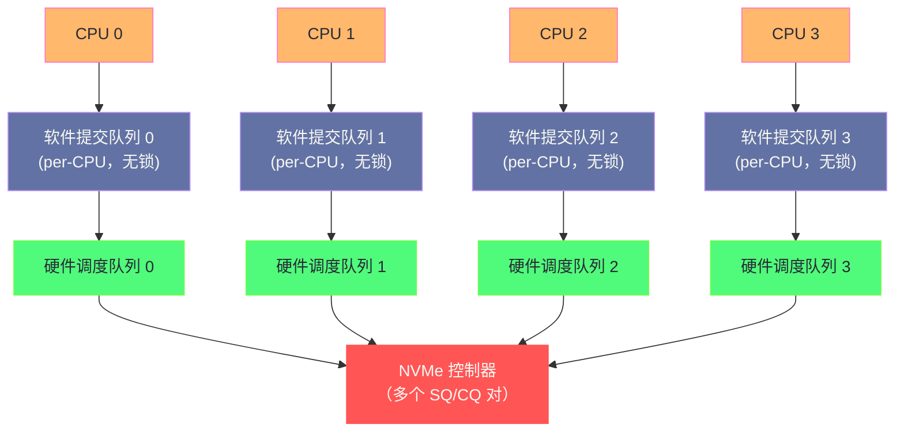

**摘要：**

当 [[Page Cache]] 发生 miss，需要从磁盘读取数据时，文件系统会调用 `submit_bio()` 将 IO 请求提交到块设备栈。这一层是 Linux 存储系统中最贴近硬件的内核子系统，也是近十年变化最大的部分。传统的单队列块层（single-queue block layer）在面对 NVMe SSD（每秒百万级 IOPS）时成为严重瓶颈——**一把大锁保护整个请求队列**，多核 CPU 之间的锁竞争使得高速 SSD 的 IOPS 只能发挥出一小部分。Linux 3.13 引入的 blk-mq（multi-queue block layer）从根本上重新设计了块设备栈：每个 CPU core 有独立的软件提交队列（software staging queue），硬件有多个硬件调度队列（hardware dispatch queue），彻底消除了锁竞争。本文从 `bio` 数据结构出发，解析一个 IO 请求从文件系统到磁盘控制器 DMA 的完整路径，重点剖析单队列时代的瓶颈、blk-mq 的设计思想与数据结构，以及 `io_context`（进程 IO 上下文）如何支持 IO 调度器对进程级 IO 优先级的管理。

---

## 第 1 章 块设备的基本概念

### 1.1 块设备 vs 字符设备

Linux 将设备分为两大类：

**字符设备（Character Device）**：以字节流为单位，顺序访问，不支持随机 seek（如串口、终端、键盘）。

**块设备（Block Device）**：以固定大小的"块"为单位，支持随机访问任意块（如 HDD、SSD、NVMe、USB 存储）。块设备是文件系统的载体，也是本文的主角。

块设备的核心特征：
- **可寻址**：每个逻辑块有唯一的 LBA（Logical Block Address，逻辑块地址），可以随机访问
- **缓冲 IO**：内核的通用块层在设备驱动之上统一管理 IO 请求的排队、合并、调度
- **块大小**：物理扇区（Sector）通常 512 字节或 4096 字节；文件系统的块（Block）通常 4096 字节（= 8 个 512 字节扇区）

```bash
# 查看系统中的块设备
lsblk
# NAME        MAJ:MIN RM   SIZE RO TYPE MOUNTPOINT
# sda           8:0    0   500G  0 disk
# ├─sda1        8:1    0     1G  0 part /boot
# └─sda2        8:2    0   499G  0 part /
# nvme0n1     259:0    0   1.8T  0 disk
# └─nvme0n1p1 259:1    0   1.8T  0 part /data

# 查看块设备的扇区大小
cat /sys/block/sda/queue/physical_block_size    # 物理扇区大小（HDD 通常 512 或 4096）
cat /sys/block/sda/queue/logical_block_size     # 逻辑扇区大小（通常 512）
cat /sys/block/nvme0n1/queue/physical_block_size # NVMe 通常 512
```

### 1.2 通用块层的职责

**通用块层（Generic Block Layer，GBL）** 位于文件系统和具体设备驱动之间，承担三个核心职责：

1. **IO 请求的标准化封装**：用 `bio` 结构体统一描述所有 IO 请求，文件系统不需要了解设备的具体接口（SCSI、NVMe、virtio-blk）
2. **IO 请求的合并与排序**：将多个相邻的小 IO 合并为大 IO（减少磁盘寻道次数和请求处理开销）
3. **IO 调度**：根据调度策略（deadline、mq-deadline、bfq 等）决定 IO 请求的提交顺序，优化总体吞吐量或延迟

---

## 第 2 章 bio：IO 请求的基本单元

### 2.1 bio 是什么

`bio`（Block I/O）是通用块层的核心数据结构，描述**一个或多个不连续内存区域（pages）到磁盘上一段连续区域的 IO 映射**：

```c
struct bio {
    struct bio          *bi_next;       /* 链表：指向下一个 bio（合并时使用）*/
    struct block_device *bi_bdev;       /* 目标块设备（如 /dev/sda1）*/
    blk_opf_t            bi_opf;        /* 操作类型：REQ_OP_READ / REQ_OP_WRITE + 标志位 */
    unsigned short       bi_flags;      /* bio 状态标志 */
    unsigned short       bi_ioprio;     /* IO 优先级（0-7，7 最高）*/
    struct bvec_iter     bi_iter;       /* 当前 IO 位置的迭代器（磁盘扇区地址 + 已处理量）*/
    bio_end_io_t        *bi_end_io;     /* IO 完成回调函数（Page Cache 用此函数解锁页）*/
    void                *bi_private;    /* 回调函数的私有数据 */
    unsigned short       bi_vcnt;       /* bi_io_vec 中有效条目数（内存页数量）*/
    unsigned short       bi_max_vecs;   /* bi_io_vec 的容量 */
    atomic_t             __bi_cnt;      /* 引用计数 */
    struct bio_vec      *bi_io_vec;     /* 内存页向量数组（描述 IO 数据在内存中的位置）*/
    struct bio_set      *bi_pool;       /* bio 来自哪个内存池（用于 bio 的分配与释放）*/
    struct bio_vec       bi_inline_vecs[]; /* 内联 bio_vec（避免小 IO 的额外内存分配）*/
};

/* bio_vec：描述一个内存页片段（page + offset + length）*/
struct bio_vec {
    struct page *bv_page;   /* 内存页（Page Cache 中的物理页）*/
    unsigned int bv_len;    /* 该页参与 IO 的字节数 */
    unsigned int bv_offset; /* 在该页内的起始偏移 */
};
```

**bio 的核心概念——scatter-gather（分散-聚集）IO**：

一个文件的数据在内存中可能分散在多个不连续的物理页（Page Cache 页），但在磁盘上是连续的（或由 Extent 描述的连续段）。`bio` 的 `bi_io_vec` 数组允许将多个不连续的内存页描述为一个单一的 IO 请求——磁盘控制器通过 DMA 的 scatter-gather 模式，将这些不连续的内存区域一次性传输到磁盘，不需要中间的内存拷贝。

```
bio 的内存布局示意：

bi_bdev = /dev/sda
bi_iter.bi_sector = 8192   ← 目标磁盘扇区（LBA）
bi_opf = REQ_OP_WRITE
bi_vcnt = 3                ← 3 个内存页

bi_io_vec[0]: page=0xffff..1234, offset=0,    len=4096  ← Page Cache 第 N 页
bi_io_vec[1]: page=0xffff..5678, offset=0,    len=4096  ← Page Cache 第 N+1 页
bi_io_vec[2]: page=0xffff..9abc, offset=0,    len=2048  ← Page Cache 第 N+2 页（部分）

总 IO 大小：4096 + 4096 + 2048 = 10240 字节（20 个 512 字节扇区）
磁盘目标范围：扇区 8192 ~ 8211
```

### 2.2 bio 的创建与提交

文件系统（ext4）在需要从磁盘读取数据时，创建并提交 `bio`：

```c
/* ext4 提交读 IO 的简化流程 */
static int ext4_mpage_readpages(struct address_space *mapping,
                                 struct list_head *pages,
                                 struct page *page, ...) {
    struct bio *bio = NULL;

    /* 遍历需要读取的页 */
    for (/* 每一页 */) {
        /* 查询 Extent 树，得到物理块号 */
        ext4_map_blocks(NULL, inode, &map, 0);

        if (!bio) {
            /* 分配一个新的 bio */
            bio = bio_alloc(GFP_KERNEL, BIO_MAX_VECS);
            bio->bi_bdev = bdev;
            bio->bi_iter.bi_sector = map.m_pblk << (blkbits - 9);
            bio->bi_opf = REQ_OP_READ;
            bio->bi_end_io = mpage_end_io;  /* IO 完成时解锁 Page Cache 页 */
        }

        /* 将当前页加入 bio_vec */
        if (bio_add_page(bio, page, blocksize, 0) < blocksize) {
            /* 当前 bio 已满（或磁盘扇区不连续）：先提交当前 bio，再创建新的 */
            submit_bio(bio);
            bio = NULL;
            continue;
        }
    }

    /* 提交最后一个 bio */
    if (bio)
        submit_bio(bio);
}
```

**`submit_bio()`** 是文件系统提交 IO 请求的统一入口，之后的处理完全由通用块层接管。

---

## 第 3 章 传统单队列块层的瓶颈

### 3.1 单队列架构

Linux 3.13 之前的传统块层使用**单请求队列（single request queue）**架构：

```
传统单队列架构：

CPU 0  CPU 1  CPU 2  CPU 3
  |      |      |      |
  └──────┴──────┴──────┘
              |
         submit_bio()
              |
         ┌────────────────────────────────────┐
         │  request_queue（单一队列）           │
         │  spin_lock（一把大锁！）             │
         │  elevator（IO 调度器）              │
         └────────────────────────────────────┘
              |
         设备驱动（dispatch）
              |
         硬件（单个 DMA 引擎）
```

**关键问题：一把大锁（`q->queue_lock`）**

所有 CPU 提交 IO 请求时，都必须争抢同一把 `spin_lock`（自旋锁）。在传统 HDD 时代，这不是问题——HDD 的 IOPS 只有 ~150，锁竞争极少发生。

但 NVMe SSD 的 IOPS 可以达到 **100万+**，如果所有 CPU 都在争抢同一把锁，锁竞争本身会消耗大量 CPU 时间，成为严重的性能瓶颈。测试数据表明，在高并发场景下，传统单队列架构只能达到 NVMe 理论 IOPS 的 **10-20%**。

### 3.2 单队列的 CPU 浪费分析

```bash
# 用 perf 观察传统块层的锁竞争（单队列 SATA SSD 上的高并发 fio）
perf top -a
# 高占比函数：
#   _raw_spin_lock_irqsave        ← 争抢 queue_lock 的时间
#   blk_queue_bio                 ← 单队列的 bio 入队函数
#   cfq_dispatch_requests         ← CFQ 调度器的分发（单线程）
#
# 在 NVMe 高并发场景，这些函数加起来可能占 40-60% 的 CPU 时间
# 这意味着一半的 CPU 算力在等锁，而不是在做真正的 IO
```

---

## 第 4 章 blk-mq：多队列块层的革命

### 4.1 blk-mq 的设计思想

**blk-mq（Multi-Queue Block Layer）** 于 Linux 3.13（2014 年）引入，核心设计思想是**彻底消除全局锁争用**，通过两级队列结构实现 CPU 本地化处理：



**两级队列**：

**第一级：软件提交队列（Software Staging Queue，每 CPU 一个）**

- 每个 CPU core 有独立的提交队列，`submit_bio()` 只操作本 CPU 的队列
- 无需跨 CPU 加锁——CPU 0 的 IO 请求只进入 CPU 0 的队列
- 在这一层可以做**请求合并**（将相邻扇区的 IO 合并为一个大请求）和**IO 调度**（mq-deadline 等调度器运行在此层）

**第二级：硬件调度队列（Hardware Dispatch Queue）**

- 对应设备的物理 IO 队列（NVMe 的 Submission Queue）
- 数量由硬件决定（NVMe 可以有 64 个甚至更多）
- 多个软件队列的 IO 请求被分发到多个硬件队列，真正并行提交给设备

### 4.2 blk-mq 的核心数据结构

```c
/* blk_mq_hw_ctx：硬件调度队列的描述符 */
struct blk_mq_hw_ctx {
    struct {
        /* 与硬件队列关联的 CPU 集合 */
        cpumask_var_t   cpumask;    /* 哪些 CPU 的 IO 分发到这个硬件队列 */
        unsigned int    nr_ctx;     /* 关联的软件队列数量 */
        struct blk_mq_ctx **ctxs;  /* 软件队列数组 */
    } ____cacheline_aligned_in_smp;

    unsigned long       state;      /* 硬件队列状态（active、stopped、detached）*/
    struct request     *dispatch_rq; /* 当前正在分发的请求 */
    struct blk_mq_tags *tags;       /* 此硬件队列的 tag 集合（每个 inflight request 一个 tag）*/
    void               *driver_data; /* 驱动私有数据（NVMe 驱动用此存 nvme_queue）*/
    atomic_t            nr_active;  /* 当前 inflight（已提交给硬件但未完成）的请求数 */
    /* ... */
};

/* blk_mq_ctx：软件提交队列（per-CPU）*/
struct blk_mq_ctx {
    struct {
        spinlock_t      lock;       /* 保护本 CPU 的请求列表（竞争极少）*/
        struct list_head rq_lists[HCTX_MAX_TYPES]; /* 请求链表 */
    } ____cacheline_aligned_in_smp;

    unsigned int        cpu;        /* 所属 CPU 编号 */
    unsigned int        index_hw[HCTX_MAX_TYPES]; /* 本 CPU 提交到哪个硬件队列 */
    struct blk_mq_hw_ctx *hctxs[HCTX_MAX_TYPES];  /* 关联的硬件队列 */
    /* ... */
};
```

### 4.3 IO 请求在 blk-mq 中的流转

```
submit_bio(bio)                              ← 文件系统调用入口
  ↓
blk_mq_submit_bio(bio)
  ↓
__blk_mq_alloc_request()                     ← 在当前 CPU 的软件队列分配 request 对象
  ↓
blk_mq_bio_to_request()                      ← 将 bio 转换为 request
  ↓
【尝试合并（Plug 机制）】
blk_plug_add_rq()                            ← 加入当前进程的 plug 列表（延迟分发）
  └─ 等到 blk_finish_plug() 或队列超限时    ← 批量合并多个相邻 IO
     统一 flush 到硬件队列

【直接分发路径（plug 满或不使用 plug）】
blk_mq_run_hw_queue()
  ↓
IO 调度器 dispatch（如 mq-deadline）         ← 调度器决定哪些请求先发送
  ↓
q->mq_ops->queue_rqs() 或 queue_rq()        ← 调用驱动的提交函数
  ↓
【NVMe 驱动】nvme_queue_rq()
  └─ 将请求写入 NVMe Submission Queue（SQ）  ← 通过 MMIO 写 doorbell 寄存器通知控制器
  └─ 控制器处理 IO，完成后写 Completion Queue（CQ）
  └─ MSI-X 中断触发，nvme_irq() 处理完成事件
  └─ bio->bi_end_io() 回调（解锁 Page Cache 页）
```

### 4.4 Plug 机制：IO 批量化的关键优化

**Plug（堵塞）** 是 blk-mq 中减少 IO 碎片化的关键机制，其思想来源于水管堵塞：先把水（IO 请求）积蓄起来，再一次性放开（批量提交）。

```c
/* 使用 Plug 批量提交 IO（文件系统/写回路径中常见）*/
struct blk_plug plug;
blk_start_plug(&plug);   /* 开始 plug：后续的 submit_bio 先缓冲在 plug 列表中 */

for (/* 每个需要写回的脏页 */) {
    submit_bio(bio);     /* 不立即提交，加入 plug 缓冲 */
}

blk_finish_plug(&plug);  /* 结束 plug：将缓冲的 bio 批量合并并提交 */
```

**Plug 的合并效果**：

假设写回 16 个相邻的 4KB 脏页（对应 16 个连续磁盘块）：
- **无 Plug**：16 个独立的 4KB `bio` → 16 次设备驱动调用 → 16 个独立的 IO 请求
- **有 Plug**：16 个 `bio` 在 plug 列表中合并 → 1 个 64KB `bio` → 1 次设备驱动调用

合并后的大 IO 对 HDD 效率提升显著（减少寻道），对 SSD 也有好处（减少命令处理开销）。

---

## 第 5 章 request 与 tag：inflight IO 的追踪

### 5.1 从 bio 到 request

`bio` 描述的是一段 IO 操作的意图（读/写哪些内存页到磁盘哪个位置）。当 `bio` 进入通用块层后，会被转换为 `request`（请求对象），`request` 在等待、合并、调度、执行的过程中一直存在：

```c
struct request {
    struct request_queue *q;    /* 所属的请求队列 */
    struct blk_mq_ctx    *mq_ctx; /* 所属的软件队列（CPU 本地）*/
    struct blk_mq_hw_ctx *mq_hctx; /* 目标硬件队列 */

    blk_opf_t             cmd_flags;  /* 操作类型（READ/WRITE）+ 标志 */
    req_flags_t           rq_flags;   /* 请求状态标志 */

    /* IO 位置信息 */
    sector_t              __sector;   /* 起始磁盘扇区（LBA）*/
    unsigned int          __data_len; /* 总数据量（字节）*/

    /* bio 链表（一个 request 可能合并了多个 bio）*/
    struct bio           *bio;        /* 第一个 bio */
    struct bio           *biotail;    /* 最后一个 bio（用于追加合并）*/

    /* tag：标识这个 inflight 请求的唯一 ID */
    int                   tag;        /* 硬件队列中的 tag（0 ~ queue_depth-1）*/
    int                   internal_tag; /* 内部 tag（调度器使用）*/

    /* 时间统计（用于 IO 延迟统计和 deadline 调度器的超时判断）*/
    u64                   start_time_ns;
    u64                   io_start_time_ns;
    /* ... */
};
```

### 5.2 tag 的作用

NVMe 等现代存储协议支持**命令队列深度（Queue Depth）**——可以同时向设备提交多个未完成的 IO 请求，设备乱序处理并返回完成通知。tag 是标识每个 inflight 请求的整数 ID（0 到 `queue_depth - 1`）：

```
提交 3 个 IO 请求：
  request A → tag=0 → NVMe SQ[0]: (cmd_id=0, opcode=READ, slba=1000, nlb=8)
  request B → tag=1 → NVMe SQ[1]: (cmd_id=1, opcode=WRITE, slba=2000, nlb=16)
  request C → tag=2 → NVMe SQ[2]: (cmd_id=2, opcode=READ, slba=3000, nlb=4)

NVMe 控制器乱序完成（B 最先完成）：
  CQ[0]: (cmd_id=1, status=SUCCESS) → 通过 cmd_id=1=tag=1，找到 request B
         → request B 的 bio->bi_end_io() 回调

NVMe 控制器稍后完成 A 和 C：
  CQ[1]: (cmd_id=0) → request A 完成
  CQ[2]: (cmd_id=2) → request C 完成
```

tag 机制使得**乱序完成**成为可能——这是 NVMe 在深队列（queue depth=32 甚至更高）场景下实现超高 IOPS 的关键。

---

## 第 6 章 IO 路径的完整追踪：以 NVMe read 为例

### 6.1 从 Page Cache miss 到 DMA 完成

将前面所有知识串联，追踪一次完整的 NVMe 读 IO：

```
① 用户程序：read(fd, buf, 4096)
   ↓
② VFS：vfs_read → generic_file_read_iter → filemap_read
   ↓
③ Page Cache miss：find_get_page() 返回 NULL
   → 分配新页，加入 address_space->i_pages（XArray）
   → 调用 a_ops->readahead（或 readpage）
   ↓
④ ext4 文件系统：ext4_mpage_readpages
   → ext4_map_blocks()：在 Extent 树中查找，得到物理块号 P
   → 创建 bio：sector = P * 8（4KB 块 = 8 个 512B 扇区），vcnt=1，op=READ
   → submit_bio(bio)
   ↓
⑤ blk-mq：blk_mq_submit_bio
   → 当前 CPU 的软件队列：检查是否可以合并（merge with existing request）
   → 通过 IO 调度器（mq-deadline）排序
   → blk_mq_run_hw_queue：将 request 分发到硬件队列
   ↓
⑥ NVMe 驱动：nvme_queue_rq
   → 构造 NVMe Read 命令（NVM Command Set，64 字节）
   → 写入 Submission Queue（内存映射 ring buffer）
   → 写 doorbell 寄存器（MMIO write）通知 NVMe 控制器
   ↓
⑦ NVMe 控制器：
   → 从 SQ 读取命令
   → 根据 LBA 定位 NAND Flash 的物理地址
   → 通过 DMA（PCIe DMA）将数据写入 bio 的目标物理内存（Page Cache 页）
   → 写 Completion Queue（CQ），设置 status=SUCCESS
   ↓
⑧ 中断处理：MSI-X 中断触发（NVMe 控制器 → CPU 中断控制器）
   → nvme_irq()：读取 CQ 条目，找到 tag 对应的 request
   → blk_mq_end_request(rq, BLK_STS_OK)
   → bio->bi_end_io() = mpage_end_io：
       - 设置 PageUptodate（页内容有效）
       - 清除 PageLocked（页解锁）
       - wake_up_page()：唤醒等待此页的进程
   ↓
⑨ 回到 filemap_read：
   → wait_on_page_locked() 返回（页已解锁）
   → copy_page_to_iter()：将 Page Cache 页拷贝到用户缓冲区 buf
   ↓
⑩ 用户程序：read() 返回 4096
```

### 6.2 NVMe 的多队列优势

```bash
# 查看 NVMe 设备支持的队列数量
cat /sys/block/nvme0n1/queue/nr_hw_queues
# 32   ← 32 个硬件队列，每个 CPU 对应一个（或按 CPU 数量分配）

# 查看队列深度
cat /sys/block/nvme0n1/queue/nr_requests
# 1023  ← 每个硬件队列最多 1023 个 inflight 请求（NVMe 支持到 65535）

# 与 HDD/SATA 的对比：
cat /sys/block/sda/queue/nr_hw_queues
# 1    ← SATA 只有 1 个硬件队列！
cat /sys/block/sda/queue/nr_requests
# 128  ← 队列深度 128
```

**NVMe 的并发 IO 能力**：

- HDD：1 个硬件队列 × 深度 32 = 32 个并发 IO（通常 IOPS = 150-200）
- SATA SSD：1 个硬件队列 × 深度 32（NCQ）= 32 个并发 IO（IOPS = ~50k）
- NVMe SSD：32 个硬件队列 × 深度 1024 = 32768 个并发 IO（IOPS = 100万+）

blk-mq 的多队列设计使 CPU 可以并行向所有 32 个硬件队列同时提交 IO，充分利用 NVMe 的并发能力。

---

## 第 7 章 IO 上下文与进程级 IO 统计

### 7.1 io_context：进程的 IO 统计中心

`io_context`（进程 IO 上下文）是内核为每个进程维护的 IO 统计和调度信息结构：

```c
struct io_context {
    atomic_long_t   refcount;    /* 引用计数 */
    atomic_t        active_ref;  /* 活跃引用 */
    unsigned short  ioprio;      /* 进程的 IO 优先级（ioprio_set 设置的值）*/
    struct radix_tree_root  icq_tree; /* 与各块设备队列的关联（cfq_io_context 等）*/
    /* ... */
};
```

```bash
# 设置进程的 IO 优先级（ionice）
ionice -c 2 -n 0 -p <pid>   # -c 2: best-effort class（最常用），-n 0: 最高优先级（0-7）
ionice -c 3 -p <pid>         # -c 3: idle class（只在磁盘空闲时运行，适合备份任务）
ionice -c 1 -n 0 -p <pid>   # -c 1: realtime（危险！会饿死其他 IO）

# 查看进程当前的 IO 优先级
ionice -p <pid>
# best-effort: prio 4   ← 默认 best-effort class，优先级 4

# 查看系统 IO 使用情况（按进程）
iotop -aod 1
# Total DISK READ: 125.00 M/s | Total DISK WRITE: 50.00 M/s
#   PID  PRIO  USER     DISK READ  DISK WRITE  SWAPIN     IO>    COMMAND
# 12345  be/4  mysql      80.00 M/s    0.00 B/s  0.00 %  70.12 % mysqld
#  6789  be/7  backup     45.00 M/s    0.00 B/s  0.00 %  35.88 % rsync
```

### 7.2 块设备 IO 统计

```bash
# /proc/diskstats：块设备 IO 统计（sar、iostat 的数据来源）
cat /proc/diskstats | grep "sda " | awk '{
    print "reads: " $4
    print "reads_merged: " $5
    print "sectors_read: " $6
    print "read_ms: " $7
    print "writes: " $8
    print "writes_merged: " $9
    print "sectors_written: " $10
    print "write_ms: " $11
    print "io_in_flight: " $12    ← 当前 inflight 的 IO 数量
    print "io_ms: " $13           ← IO 耗时累计（毫秒）
    print "io_weighted_ms: " $14  ← 加权 IO 等待时间（用于计算 %util）
}'

# 实时 IO 统计
iostat -x 1 sda
# Device  r/s     w/s   rkB/s   wkB/s  await  svctm  %util
# sda    123.4   45.6  1234.5   456.7   8.45   3.21   54.3
#
# await：IO 请求的平均等待时间（ms）= 队列等待 + 设备服务时间
# svctm：设备实际服务时间（已废弃，不可靠）
# %util：设备利用率（IO 时间占总时间的比例）≈ 是否成为瓶颈

# 诊断：如果 %util ≈ 100% 且 await 远大于 svctm，说明 IO 队列积压
# 解决：更换更快设备，或减少 IO 并发（降低队列深度）
```

---

## 第 8 章 虚拟化环境下的块设备

### 8.1 virtio-blk：准虚拟化存储

在 KVM/QEMU 虚拟机中，传统的 SCSI 或 IDE 模拟性能极差（每次 IO 都需要 VM exit + 模拟设备寄存器）。`virtio-blk` 是一种半虚拟化（para-virtualized）存储接口——Guest 和 Host 共享一个 virtqueue（基于共享内存的环形缓冲区），通过 virtqueue 直接传递 IO 描述符，避免了设备寄存器模拟的开销：

```bash
# 查看虚拟机中的 virtio-blk 设备
lsblk -d -o NAME,MODEL
# NAME  MODEL
# vda   Virtual disk   ← virtio-blk 设备

# virtio-blk 的队列数量（多队列 virtio-blk）
cat /sys/block/vda/queue/nr_hw_queues
# 4   ← 4 个虚拟硬件队列（对应 QEMU 的 iothread 线程数）
```

### 8.2 云存储的 IO 路径

在云环境（AWS、阿里云、腾讯云）中，块设备（如 AWS EBS、阿里云云盘）是通过网络连接的远程存储：

```
云主机上的 IO 路径（以 AWS i3 实例 + EBS 为例）：

用户程序 write()
  ↓
ext4 → bio
  ↓
blk-mq → nvme 驱动（EBS 通过 NVMe-oF 协议）
  ↓
NVMe-oF：通过网络（25Gbps VPC 网络）发送到 EBS 存储服务器
  ↓
EBS 存储服务器：SSD 阵列
  ↓
完成通知：通过网络返回，触发云主机的 IRQ

延迟：~200µs - 1ms（受网络往返延迟影响）
吞吐：最高 1 GB/s（EBS gp3 最大）
```

---

## 小结

块设备栈是 Linux 存储系统的"高速公路"——所有实际的磁盘 IO 都经过这里：

**核心数据结构**：
- **`bio`**：IO 请求的最小单元，描述内存页 → 磁盘扇区的映射（scatter-gather）
- **`request`**：`bio` 在通用块层的载体，携带 tag、合并多个 bio、追踪生命周期
- **`blk_mq_hw_ctx`**：硬件调度队列，每个 NVMe 队列对应一个

**单队列 → blk-mq 的演进**：
- 单队列：一把 `queue_lock`，NVMe 高并发下锁竞争成瓶颈
- blk-mq：per-CPU 软件队列（无跨 CPU 锁） + 多个硬件队列，充分利用 NVMe 的并发能力
- Plug 机制：进程级 IO 缓冲，批量合并相邻 IO

**NVMe 的多队列优势**：
- 硬件支持 32+ 队列 × 深度 1024，理论并发 IO = 32768
- blk-mq 为每个 CPU 分配独立的软件队列，并行提交，无锁竞争
- 实测：blk-mq + NVMe 可以达到 100 万+ IOPS（单核单队列架构下只能达到 ~20 万）

下一篇 [[06 IO 调度器——CFQ、Deadline 与 mq-deadline 的演进]] 将聚焦于 IO 调度器的内部机制：为什么 HDD 需要 CFQ 而 SSD 不需要？mq-deadline 如何在保证 IO 延迟上限的同时维持吞吐量？以及不同负载场景下调度器的选型建议。

---

> [!note] 思考题
> 1. blk-mq 为每个 CPU 核心创建软件队列，映射到硬件队列。NVMe SSD 支持 64K 硬件队列——blk-mq 可以充分利用。在 HDD（单队列）上 blk-mq 仍然有价值——减少了软件队列的锁竞争。但 HDD 的 IOPS 只有数百——blk-mq 的多队列优势是否被 HDD 的物理限制淹没？
> 2. IO Scheduler 的 `none` 在 NVMe 上通常最佳。但多应用共享 NVMe 时，`mq-deadline` 的 FIFO 过期保证了公平性。blk-cgroup 的 `io.weight`（比例权重）和 `io.max`（绝对限制）如何与 IO Scheduler 配合？在 cgroup v2 中，IO 限制是在调度器层面还是在提交层面实施的？
> 3. `/sys/block/sda/queue/nr_requests` 控制每个队列的最大排队请求数。增大可提高吞吐但增加延迟。在延迟敏感的数据库场景中，`nr_requests` 与应用层 `iodepth` 的关系是什么？如果 `nr_requests=128` 但应用只提交 `iodepth=4`，增大 `nr_requests` 是否有意义？
