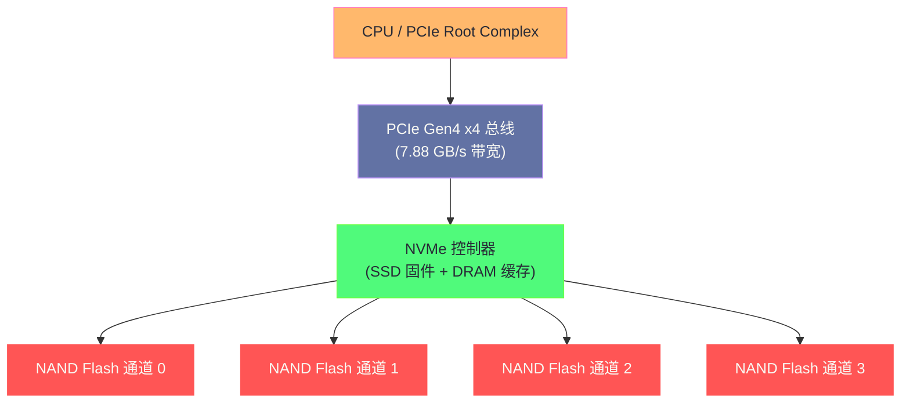
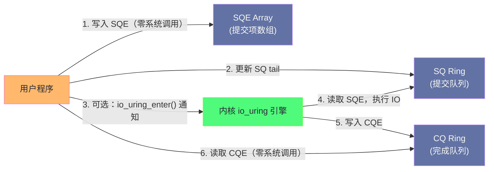
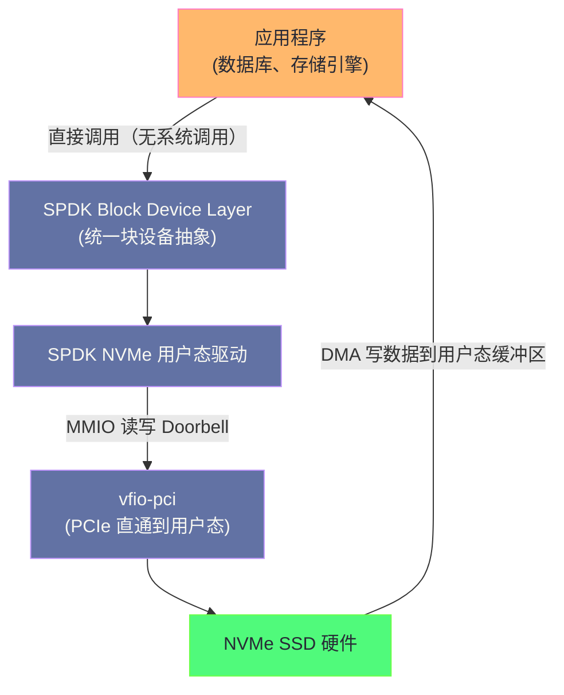
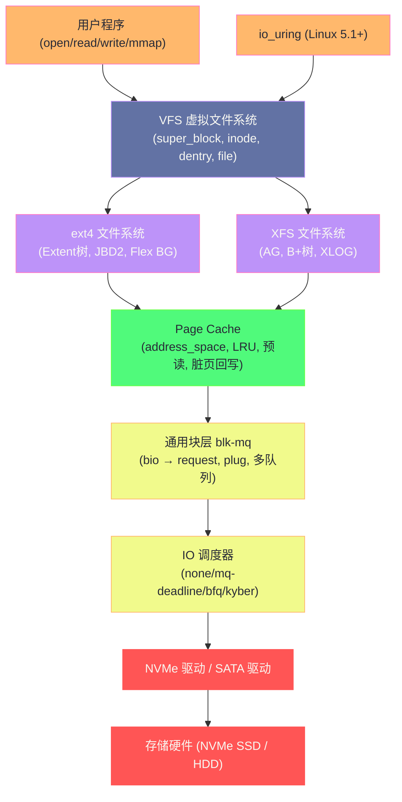

**摘要：**

过去十年，存储硬件的演进速度远超软件栈的适配速度。NVMe SSD 的随机 IOPS 从 HDD 的几百，跳升到了数十万乃至百万级别；PCIe Gen5 NVMe 的顺序读带宽突破了 14 GB/s。然而，Linux 内核的 IO 路径——系统调用 → VFS → 文件系统 → Page Cache → blk-mq → 驱动——每一层都有开销，在极端高 IOPS 场景下，这些开销的累积已经能显著吃掉 NVMe 的性能红利。本文聚焦三项正在重塑 Linux 存储架构的技术：**NVMe 协议**（从 PCIe 总线到 NAND Flash 的硬件设计，理解为什么 NVMe 能达到百万 IOPS）；**io_uring**（Linux 5.1 引入的异步 IO 框架，通过共享内存 ring buffer 几乎消除系统调用开销，在 500K+ IOPS 场景下成为 libaio 的有力替代）；**SPDK/用户态存储**（完全绕过内核，在用户态通过轮询（polling）直接操作 NVMe 硬件，消除中断延迟，将延迟从微秒级压缩到亚微秒级）。这三层技术共同描绘了 Linux 高性能存储的未来走向。

---

## 第 1 章 NVMe 协议：为 Flash 重新设计的存储接口

### 1.1 从 SATA 到 NVMe：接口进化的必然

在理解 NVMe 之前，必须先理解 SATA 的设计出发点及其局限。

**SATA（Serial ATA）** 于 2003 年发布，基于 ATA（AT Attachment）标准，设计目标是替代 PATA（并行 ATA），服务对象是**机械硬盘**。SATA 的命令队列（NCQ，Native Command Queuing）最大支持 **32** 条并发命令，命令集继承自 1980 年代的 ATA——包含"磁头寻道"、"柱面切换"等专为机械磁盘设计的概念。对 NAND Flash 而言，这些命令集完全是历史包袱。

**SATA 的两大瓶颈**：
1. **带宽瓶颈**：SATA III 最大带宽 600 MB/s，而 NAND Flash 的内部读取速度远超此值
2. **队列深度瓶颈**：NCQ 最大 32 条命令，无法发挥 SSD 内部多通道并行的优势

**NVMe（Non-Volatile Memory Express）** 于 2011 年首个版本发布，从零开始为 NAND Flash 和 3D XPoint 等非易失性内存设计：

- **接口**：直连 PCIe 总线（Gen3 × 4 = 3.94 GB/s，Gen4 × 4 = 7.88 GB/s，Gen5 × 4 = 14 GB/s）
- **队列**：最多 **65535** 个队列，每个队列深度最大 **65535**（vs SATA NCQ 的 1 个队列 × 32）
- **命令集**：全新设计，命令简单（Submit Queue Entry 仅 64 字节），没有机械磁盘的历史包袱
- **延迟**：命令从提交到硬件响应仅需 **~2µs**（vs SATA ~50µs）

### 1.2 NVMe 的硬件架构



**NVMe 控制器内部**的关键组件：

- **多通道 Flash 控制器**：现代高端 NVMe SSD 有 8-16 个独立 NAND Flash 通道，每通道多个 Die（芯片），所有通道并行工作——这是 NVMe 能达到百万 IOPS 的物理基础
- **DRAM 缓存**：存储 FTL（Flash Translation Layer）映射表（逻辑地址 → 物理 Flash 地址的映射），DRAM 掉电会丢失，因此企业级 NVMe 通常有电容保护
- **FTL（Flash Translation Layer）**：处理逻辑地址到物理地址的转换、磨损均衡（Wear Leveling）、坏块管理、垃圾回收（GC）

### 1.3 NVMe 的提交/完成队列机制

NVMe 的 IO 提交和完成通过**内存映射的环形缓冲区**实现，无需复杂的中断握手：

```
NVMe SQ/CQ 工作原理（以一次读操作为例）：

系统内存（Host）：
  ┌─────────────────────────────────────────────────┐
  │  Submission Queue (SQ)     [ring buffer, 64B/条]│
  │  [cmd0][cmd1][cmd2][    ]... ← 主机写命令        │
  │        ↑ tail（主机写指针）                      │
  └─────────────────────────────────────────────────┘

  ┌─────────────────────────────────────────────────┐
  │  Completion Queue (CQ)     [ring buffer, 16B/条]│
  │  [cpl0][cpl1][    ][    ]... ← 控制器写完成项    │
  │         ↑ head（主机读指针）                     │
  └─────────────────────────────────────────────────┘

步骤：
  1. 主机构造 64 字节的 NVMe Read 命令（包含 LBA、数量、DMA 目标地址）
     写入 SQ[tail]，tail++
  2. 主机向 NVMe 控制器的 Doorbell 寄存器写入新的 tail 值（MMIO 写，1 次 PCIe TLP）
  3. NVMe 控制器通过 PCIe DMA 读取 SQ[tail] 的命令
  4. 控制器执行 Flash 读取，通过 PCIe DMA 将数据写入主机内存（目标地址由命令指定）
  5. 控制器向 CQ[head] 写入完成条目（16 字节，包含 status 和 cmd_id）
  6. 控制器发出 MSI-X 中断（或主机轮询 CQ）
  7. 主机读取 CQ[head]，通过 cmd_id 找到对应 request，调用完成回调
```

**NVMe 命令的极简性**：整个提交过程只需要：
- 1 次内存写（写 SQ 条目）
- 1 次 MMIO 写（更新 Doorbell 寄存器，通知控制器）
- 等待 DMA 完成 + 1 次中断

这就是 NVMe 比 SATA 延迟低 10 倍以上的根本原因——命令路径极短，无冗余握手。

### 1.4 NVMe-oF：将 NVMe 延伸到网络

**NVMe-oF（NVMe over Fabrics）** 将 NVMe 协议扩展到网络上，让远程存储的访问延迟接近本地 NVMe：

- **NVMe/RDMA**：通过 InfiniBand 或 RoCE（RDMA over Converged Ethernet）传输 NVMe 命令和数据，延迟 ~20-50µs
- **NVMe/TCP**：通过普通以太网 TCP 传输，延迟 ~100-200µs（高于 RDMA，但无需专用网络）
- **NVMe/FC**：通过光纤通道传输（数据中心存储网络的传统技术）

```bash
# 连接 NVMe-oF 目标（以 NVMe/TCP 为例）
# 发现目标
nvme discover -t tcp -a 192.168.1.100 -s 4420

# 连接
nvme connect -t tcp -a 192.168.1.100 -s 4420 -n nqn.2023-01.io.example:nvme0

# 查看已连接的 NVMe 设备
nvme list
# Node             SN                   Model                    Namespace Usage
# /dev/nvme1n1     S1234567890          NVMe-oF Target           1         1.00 TB / 1.00 TB
```

---

## 第 2 章 io_uring：重新发明 Linux 异步 IO

### 2.1 Linux 异步 IO 的历史困境

在 `io_uring` 出现之前，Linux 的异步 IO 选项令人沮丧：

**方案一：POSIX AIO（`aio_read`/`aio_write`）**

POSIX AIO 在 glibc 中是用线程模拟的——每个异步 IO 请求实际上是在一个内部线程中同步执行。这意味着：
- 大量并发 IO → 大量线程 → 线程切换开销显著
- 每次 IO 至少需要 2 次线程切换（提交时、完成时）

**方案二：Linux Native AIO（`io_submit`/`io_getevents`）**

Linux 内核原生 AIO 是真正的异步——IO 请求提交后立即返回，完成时通过 `io_getevents` 收割。但它有严格的限制：
- 只支持 `O_DIRECT` IO（不支持 buffered IO）
- 某些操作（如 `fsync`、`open`、`stat`）不支持异步
- 不支持网络 socket IO
- 每次 `io_submit` 和 `io_getevents` 都是系统调用——在高 IOPS 场景下，系统调用开销本身成为瓶颈

**系统调用开销的量化**：

一次空的系统调用（`syscall(SYS_getpid)`）需要：
- 用户态 → 内核态的上下文切换：~100-200ns
- 保存/恢复寄存器
- 内核态 → 用户态返回

对于 500K IOPS，每秒 1M 次系统调用（`io_submit` + `io_getevents` 各一次），系统调用开销占用 ~100ms CPU 时间（10-20% 的单核 CPU）——这在极端高 IOPS 场景下不可忽视。

### 2.2 io_uring 的核心设计：共享内存 ring buffer

**io_uring**（Jens Axboe 设计，Linux 5.1，2019 年）用一个根本性的思路解决了上述问题：**通过用户态和内核态共享的 ring buffer，使 IO 提交和收割无需系统调用**。



**io_uring 的三个共享内存区域**：

1. **SQ Ring（Submission Queue Ring）**：包含 SQ 的 head/tail 指针和 flags，用户写 tail，内核读 head
2. **SQE Array（Submission Queue Entry Array）**：固定大小的数组，每个 SQE 64 字节，描述一个 IO 操作
3. **CQ Ring（Completion Queue Ring）**：包含 CQ 的 head/tail 指针和 CQE 数组，内核写 tail，用户读 head

**最关键的特性：SQPOLL（提交队列轮询）**

```c
/* 创建 io_uring 实例（启用 SQPOLL）*/
struct io_uring_params params = {
    .flags = IORING_SETUP_SQPOLL,     /* 内核线程轮询 SQ，无需 io_uring_enter() */
    .sq_thread_idle = 2000,           /* 轮询线程空闲 2000ms 后睡眠 */
};
io_uring_queue_init_params(1024, &ring, &params);

/* 提交 IO（无系统调用！）*/
struct io_uring_sqe *sqe = io_uring_get_sqe(&ring);
io_uring_prep_read(sqe, fd, buf, len, offset);
io_uring_sqe_set_data(sqe, user_data);
io_uring_submit(&ring);  /* 内部只更新 SQ tail，不调用系统调用 */

/* 收割完成（无系统调用！）*/
struct io_uring_cqe *cqe;
io_uring_wait_cqe(&ring, &cqe);  /* 如果 CQ 已有条目，直接读取，不睡眠 */
void *result = io_uring_cqe_get_data(cqe);
io_uring_cqe_seen(&ring, cqe);
```

**SQPOLL 的工作原理**：

启用 `IORING_SETUP_SQPOLL` 后，内核会创建一个**内核线程**（`io_uring-sq` 进程），持续轮询 SQ Ring。用户程序只需将 SQE 写入共享内存并更新 SQ tail，内核线程会立即发现新的 SQE 并处理——**整个提交过程完全没有系统调用**。

唯一的系统调用是 `io_uring_setup()`（初始化一次）和 `mmap()`（映射共享内存）——之后在热路径上，提交和收割都是纯内存操作。

### 2.3 io_uring 的 SQE 操作类型

io_uring 支持的操作已经远超原生 AIO，覆盖了几乎所有 IO 场景：

| 操作类型 | 说明 |
|---------|------|
| `IORING_OP_READ` / `IORING_OP_WRITE` | 文件读写（支持 buffered IO！）|
| `IORING_OP_READV` / `IORING_OP_WRITEV` | scatter-gather 读写 |
| `IORING_OP_FSYNC` | 文件同步（异步 fsync）|
| `IORING_OP_RECV` / `IORING_OP_SEND` | 网络 socket 收发 |
| `IORING_OP_ACCEPT` | 接受 TCP 连接 |
| `IORING_OP_OPENAT` | 异步打开文件 |
| `IORING_OP_STATX` | 异步 stat |
| `IORING_OP_SPLICE` | 零拷贝数据传输 |
| `IORING_OP_TIMEOUT` | 超时 |

**io_uring 对 buffered IO 的支持**是相对于 Linux AIO 的重大突破——大量应用使用 buffered IO（不需要 `O_DIRECT` 对齐），而 Linux AIO 完全无法处理这类 IO。

### 2.4 io_uring 的链式请求（Request Chaining）

io_uring 支持将多个 SQE 串联成一个有序的请求链——前一个 SQE 完成后，自动触发下一个：

```c
/* 链式请求示例：读文件 → 处理数据 → 写结果（零系统调用的完整管道）*/
struct io_uring_sqe *sqe;

/* 第一步：读源文件 */
sqe = io_uring_get_sqe(&ring);
io_uring_prep_read(sqe, src_fd, buf, len, 0);
sqe->flags |= IOSQE_IO_LINK;    /* 链式标志：下一个 SQE 在这个完成后才执行 */
io_uring_sqe_set_data(sqe, (void*)1);

/* 第二步：写目标文件（只有第一步成功才执行）*/
sqe = io_uring_get_sqe(&ring);
io_uring_prep_write(sqe, dst_fd, buf, len, 0);
sqe->flags |= IOSQE_IO_LINK;
io_uring_sqe_set_data(sqe, (void*)2);

/* 第三步：fsync 目标文件 */
sqe = io_uring_get_sqe(&ring);
io_uring_prep_fsync(sqe, dst_fd, 0);
io_uring_sqe_set_data(sqe, (void*)3);

/* 一次 io_uring_enter() 提交整个链 */
io_uring_submit(&ring);
```

### 2.5 io_uring 的性能实测

```bash
# 用 fio 对比 libaio 和 io_uring 的性能（4K 随机读，QD=128，NVMe SSD）

# libaio 引擎
fio --name=libaio-test --ioengine=libaio --direct=1 \
    --rw=randread --bs=4k --iodepth=128 \
    --filename=/dev/nvme0n1 --runtime=30 --time_based
# 典型结果：IOPS=450K, lat p99=450µs

# io_uring 引擎（默认，不启用 SQPOLL）
fio --name=iou-test --ioengine=io_uring --direct=1 \
    --rw=randread --bs=4k --iodepth=128 \
    --filename=/dev/nvme0n1 --runtime=30 --time_based
# 典型结果：IOPS=480K, lat p99=420µs（略好于 libaio）

# io_uring 引擎（启用 SQPOLL，消除系统调用）
fio --name=iou-sq-test --ioengine=io_uring --direct=1 \
    --rw=randread --bs=4k --iodepth=128 \
    --ioring_setup_sqpoll=2000 \                  # SQPOLL 空闲 2000ms 后睡眠
    --filename=/dev/nvme0n1 --runtime=30 --time_based
# 典型结果：IOPS=520K, lat p99=380µs（在高 IOPS 场景下优势明显）

# 在极端高 IOPS（1M+）场景，io_uring + SQPOLL 的优势更显著：
# - 消除了每次 io_submit/io_getevents 的系统调用开销
# - 减少了用户态/内核态切换的 CPU 缓存污染
```

> [!info] io_uring 的生产应用
> io_uring 在 2023-2024 年已经在多个重要项目中得到生产使用：
> - **Rust Tokio** 的 `tokio-uring` crate：基于 io_uring 的异步运行时
> - **RocksDB**（Meta/Google 使用的 KV 存储）：实验性 io_uring 后端
> - **QEMU**：使用 io_uring 加速虚拟机磁盘 IO
> - **PostgreSQL 17+**：引入 io_uring 支持（读取路径）
> - **Linux kernel 本身**：btrfs 的部分 IO 路径已使用 io_uring

---

## 第 3 章 SPDK：完全绕过内核的用户态存储

### 3.1 内核 IO 路径的不可避免开销

即使有了 io_uring 的优化，内核的 IO 路径仍然存在一些不可消除的开销：

1. **中断延迟**：NVMe 完成 IO 时通过 MSI-X 中断通知 CPU——中断处理本身需要几微秒（保存/恢复上下文、调用中断服务程序）
2. **调度延迟**：等待内核线程调度来处理 IO 完成事件
3. **内存拷贝**：buffered IO 路径上的 Page Cache 拷贝
4. **内核锁争用**：blk-mq、文件系统、Page Cache 等各层的锁

对于追求**亚微秒级（< 1µs）延迟**的极端场景，这些开销已经无法接受。

### 3.2 SPDK 的核心理念

**SPDK（Storage Performance Development Kit）** 是 Intel 开源的用户态存储框架，采用两个根本性的设计决策彻底规避内核开销：

**决策 1：用户态驱动（User-Space Driver）**

SPDK 将 NVMe 驱动从内核移到用户态——通过 Linux 的 `vfio-pci`（Virtual Function IO）机制，直接将 NVMe 设备的 PCIe MMIO 区域映射到用户进程的地址空间，用户程序可以直接读写 NVMe 控制器的寄存器（包括 Doorbell）：

```bash
# 将 NVMe 设备绑定到 vfio-pci（脱离内核驱动）
modprobe vfio-pci
echo "0000:00:04.0" > /sys/bus/pci/devices/0000:00:04.0/driver/unbind  # 解绑内核驱动
echo "vfio-pci" > /sys/bus/pci/devices/0000:00:04.0/driver_override
echo "0000:00:04.0" > /sys/bus/pci/drivers/vfio-pci/bind              # 绑定 vfio-pci

# 之后，SPDK 应用程序可以通过 vfio 直接访问这个 NVMe 设备
# 内核完全看不到这个设备的 IO 请求！
```

**决策 2：轮询（Polling）替代中断**

SPDK 不使用 MSI-X 中断等待 IO 完成，而是**持续轮询 NVMe 的 Completion Queue**——一个专用 CPU 核（poll core）100% CPU 时间用于检查 CQ 是否有新的完成条目。

```
传统中断模式：
  提交 IO → 进程/线程睡眠等待中断 → 中断触发（~1-5µs 延迟）→ 唤醒处理

SPDK 轮询模式：
  提交 IO → poll 线程持续检查 CQ → 立即发现完成（~200-400ns！）

代价：一个 CPU 核被完全占用（100% CPU 使用率）
收益：延迟从微秒级降至亚微秒级
```

### 3.3 SPDK 的架构



**SPDK 的 IO 路径**：

```
1. 应用程序调用 spdk_bdev_read()（函数调用，非系统调用）
2. SPDK NVMe 驱动构造 64 字节的 NVMe 命令
3. 写入 Submission Queue（用户态内存 → 设备）
4. 写 Doorbell 寄存器（MMIO write，PCIe TLP）
5. Poll 线程持续检查 Completion Queue
6. 发现完成条目（~200-400ns 后）
7. 调用用户注册的回调函数

总延迟：~300-600ns（对比内核路径的 5-20µs）
```

### 3.4 SPDK 的适用场景与局限

**适合 SPDK 的场景**：
- **NVMe-oF 存储目标**：使用 SPDK 构建高性能网络存储后端（Ceph Bluestore 的部分实现）
- **数据库存储引擎**：MySQL InnoDB 的实验性 SPDK 后端，PostgreSQL DirectIO 配合 SPDK
- **分布式存储**：MinIO、Ceph 的 NVMe 加速方案
- **高频交易**：对存储延迟有亚微秒级要求的金融系统

**SPDK 的局限**：

1. **独占 CPU 核**：轮询模式要求至少一个 CPU 核 100% 用于轮询——不适合核数少或负载轻的场景
2. **设备独占**：绑定到 SPDK 的 NVMe 设备对内核不可见，无法同时用 `mount` 挂载
3. **开发复杂度高**：SPDK 是 C 语言的用户态框架，没有内核的内存管理和进程隔离保护
4. **调试困难**：用户态驱动出 bug 可能直接 crash 应用进程

```bash
# SPDK 性能基准（perf 工具，类 fio）
spdk/examples/nvme/perf/perf \
    -q 128 \           # 队列深度 128
    -o 4096 \          # 块大小 4KB
    -t 30 \            # 运行 30 秒
    -r 'trtype:PCIe traddr:0000:00:04.0'  # 目标 NVMe 设备

# 典型结果（NVMe Gen4）：
# Device Information:  ... 3.84 TB
# Transactions per second:  987,321   ← ~100 万 IOPS！
# Average Latency:          127.94 µs
# I/O per second per core:  987,321
```

---

## 第 4 章 存储技术演进的未来方向

### 4.1 CXL：突破 DRAM 与 NVMe 的边界

**CXL（Compute Express Link）** 是 Intel 主导的下一代互连标准（基于 PCIe 5.0 物理层），定义了 CPU 和加速器/内存设备之间的缓存一致性协议。

CXL 对存储的影响：

**CXL.mem**：允许将外部 DRAM 或 3D XPoint 等持久化内存（Persistent Memory）挂接到 CPU 的内存总线，访问延迟比 NVMe 低 10-100 倍（~200-500ns vs 5-100µs）。操作系统可以将这部分内存当作普通 DRAM 使用（通过 NUMA 节点抽象），但数据是持久化的——断电不丢失。

```bash
# 查看 Persistent Memory（Intel Optane DCPMM）设备
ndctl list -u
# {
#   "dimms": [
#     {"dev": "nmem0", "id": "...", "capacity": "500.11 GiB", "mode": "fsdax"},
#   ]
# }

# 在 fsdax 模式下，文件系统（ext4/XFS）可以直接将 pmem 中的数据映射到进程地址空间
# mmap() 访问文件 = 直接访问 pmem 的 DRAM 级别延迟，完全绕过 Page Cache！
mount -o dax /dev/pmem0 /mnt/pmem   # DAX：Direct Access，绕过 Page Cache
```

### 4.2 Zone Namespace（ZNS）：应用层控制数据放置

**ZNS（Zoned Namespace）** 是 NVMe 2.0 引入的新特性，将 SSD 的地址空间划分为**Zone（区域）**，每个 Zone 只能顺序写入（类似 SMR 硬盘）。

ZNS 的意义：传统 SSD 的 FTL 在内部做随机写 → 顺序写的转换，这个转换引起**写放大（Write Amplification）** 和**GC 暂停（GC Pause）**。ZNS 将写入模式的控制权交给应用层——应用程序直接以顺序方式写入 Zone，SSD 不需要做转换，消除了 GC 引起的性能抖动。

RocksDB、InfluxDB 等 LSM 树（Log-Structured Merge Tree）数据库天然适合 ZNS，因为 LSM 的 Compaction 本身就是顺序写操作。

### 4.3 io_uring 的发展方向：网络存储统一

io_uring 在 Linux 6.x 版本中正在将其异步 IO 模型扩展到更多操作类型：

- **io_uring + socket**：异步网络 IO（`IORING_OP_RECV`、`IORING_OP_SEND`）已稳定，使 io_uring 成为同时覆盖磁盘和网络 IO 的统一异步框架
- **io_uring + multishot**：一次注册，自动为重复事件（如 `accept`、`recv`）生成多个 CQE，减少重新注册的开销
- **io_uring + fixed buffers**：预注册用户态缓冲区（`io_uring_register_buffers`），内核直接用 DMA 写入这些缓冲区，消除一次内存拷贝

```c
/* io_uring fixed buffer：预注册缓冲区，消除动态映射开销 */
struct iovec iov[16];
for (int i = 0; i < 16; i++) {
    iov[i].iov_base = aligned_alloc(4096, 1024 * 1024);  /* 1MB 对齐缓冲区 */
    iov[i].iov_len = 1024 * 1024;
}
io_uring_register_buffers(&ring, iov, 16);  /* 预注册：内核锁定这些页到内存 */

/* 使用固定缓冲区发起 IO（比普通 read 少一次内存映射开销）*/
struct io_uring_sqe *sqe = io_uring_get_sqe(&ring);
io_uring_prep_read_fixed(sqe, fd, iov[0].iov_base, iov[0].iov_len, 0, 0);
                                                                         /* ↑ buf_index */
```

---

## 第 5 章 存储技术全景回顾

### 5.1 从本专栏的技术栈视角俯瞰

经过 10 篇文章的探索，我们已经完整拼出了 Linux 存储系统的技术地图：



### 5.2 各层技术的核心价值总结

| 层次 | 核心问题 | 解决方案 |
|-----|---------|---------|
| **VFS** | 如何支持多种文件系统？ | 四大对象（super_block/inode/dentry/file）抽象接口 |
| **ext4** | 如何可靠存储数据？ | 日志（JBD2）+ Extent 树 + Flex BG |
| **XFS** | 如何支持大文件高并发？ | AG 分组并发 + B+ 树统一 + 延迟分配 + 投机预分配 |
| **Page Cache** | 如何弥补磁盘与内存的速度差？ | 以内存换延迟，写缓冲 + 预读 + LRU 管理 |
| **blk-mq** | 如何充分发挥 NVMe 并发能力？ | per-CPU 软件队列 + 多硬件队列 + Plug 批量化 |
| **IO 调度器** | 如何平衡吞吐量、延迟和公平性？ | HDD→mq-deadline；NVMe→none；桌面→BFQ |
| **io_uring** | 如何消除系统调用开销？ | 共享 ring buffer + SQPOLL 内核轮询 |
| **SPDK** | 如何达到亚微秒延迟？ | 用户态驱动 + 持续轮询 CQ，彻底绕过内核 |

---

## 小结：Linux 存储技术的三条演进主线

**主线一：持久化可靠性**（01-03 章）

从 ext2（无日志，崩溃后需要长时间 fsck）→ ext3（元数据日志）→ ext4（全面增强：Extent 树、Flex BG、延迟分配）→ XFS（AG 分组并发、B+ 树统一、XLOG）。核心矛盾始终是：**如何在崩溃后快速恢复到一致状态，同时不牺牲 IO 性能**。日志（WAL）是这一矛盾的核心解法，JBD2 和 XLOG 是具体实现。

**主线二：内核 IO 路径的极致优化**（04-06 章）

Page Cache 解决了磁盘与内存的速度差；blk-mq 解决了单队列在多核 + NVMe 时代的锁竞争问题；IO 调度器在吞吐量、延迟、公平性之间做精细的权衡。这条主线的本质是：**随着硬件（SSD → NVMe）的演进，软件栈必须同步进化，否则硬件性能会被软件瓶颈白白浪费**。

**主线三：突破内核边界**（10 章）

io_uring 用共享内存 ring buffer 几乎消除了系统调用开销；SPDK 直接将 NVMe 驱动下放到用户态，通过轮询达到亚微秒延迟。这条主线预示着 Linux 存储的未来方向：**内核负责安全边界和资源管理，真正的高性能 IO 路径将越来越多地在用户态实现**，就像网络领域的 DPDK 已经做到的那样。

---

**专栏创作完成。**

本专栏从 [[01 文件系统的本质——从 open() 到磁盘扇区]] 出发，经过 [[02 VFS 虚拟文件系统——超级块、inode、dentry 与 file]]、[[03 ext4 深度解析——日志、Extent 树与 Flex BG]]、[[04 Page Cache 与脏页回写——Linux IO 的秘密缓冲层]]、[[05 块设备栈——从 bio 到 blk-mq 的 IO 路径]]、[[06 IO 调度器——CFQ、Deadline 与 mq-deadline 的演进]]、[[07 XFS 文件系统深度解析——B+ 树与日志架构]]、[[08 存储栈性能调优——从 fio 到 iotop 的全套方法论]]、[[09 文件系统的安全边界——权限、ACL 与 Capabilities]]，到本篇的现代存储技术，完整覆盖了 Linux 文件系统与存储栈的核心知识体系。

---

> [!note] 思考题
> 1. NVMe SSD 上 `iostat` 的 `%util` 可能一直 100% 但设备远未饱和——因为 NVMe 支持并行处理。应该用 `avgqu-sz`（平均队列深度）或 `await`（平均等待时间）来判断饱和度。当 `await` 超过 SSD 的标称延迟（如 4KB 随机读 ~100μs）多少倍时，可以认为设备饱和？
> 2. `noatime` 禁止更新访问时间，减少了纯读操作的写 IO。`relatime`（默认）只在 atime 早于 mtime 或超过一天时更新。在 Web 静态资源服务器上，`noatime` vs `relatime` 的性能差异有多大？有没有应用依赖 atime 信息（如 `tmpwatch` 清理临时文件）？
> 3. 在容器化环境中，不同 IO 模式需要差异化存储。K8s StorageClass 定义了不同的存储后端。如何为数据库（低延迟 NVMe）、日志（高吞吐 SATA SSD）和临时文件（廉价 HDD）分别创建 StorageClass？CSI 驱动如何实现存储的动态供给？
