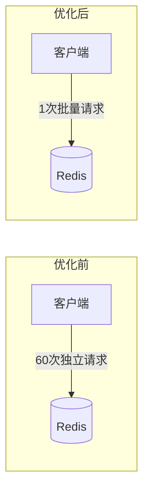
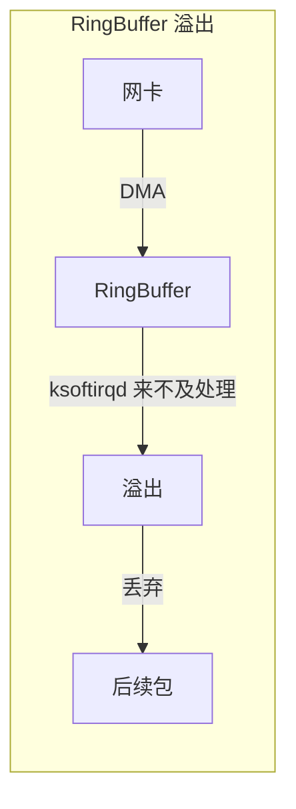
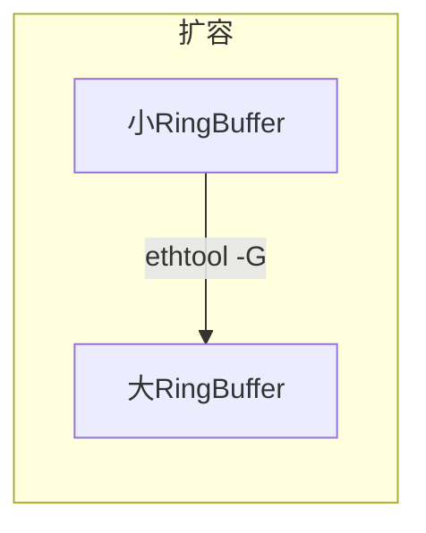
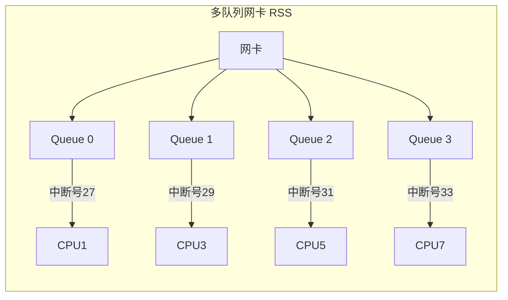
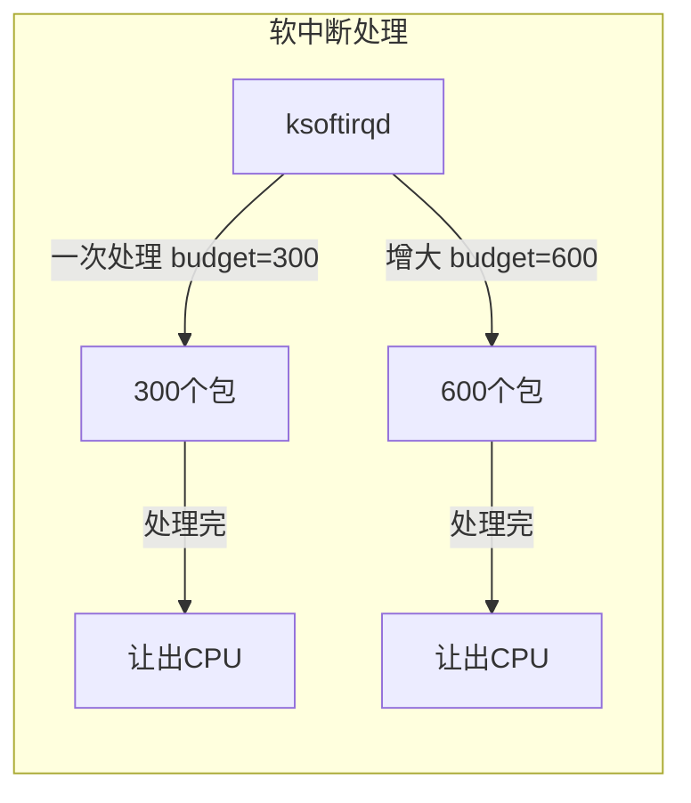
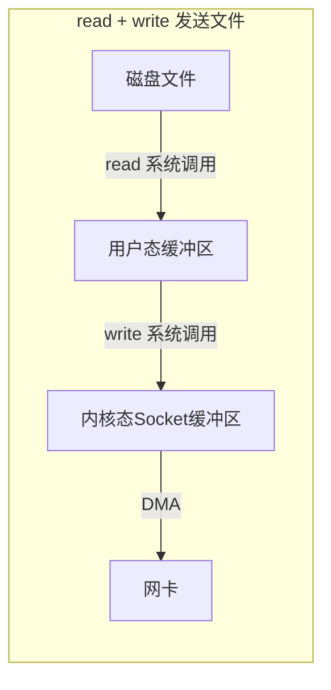
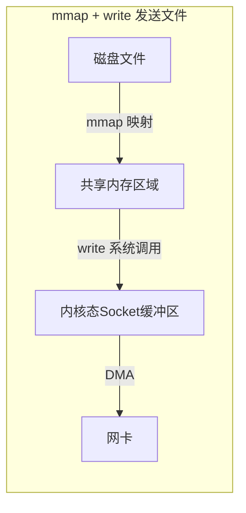
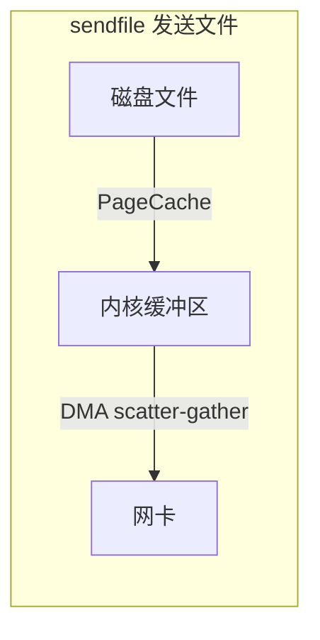
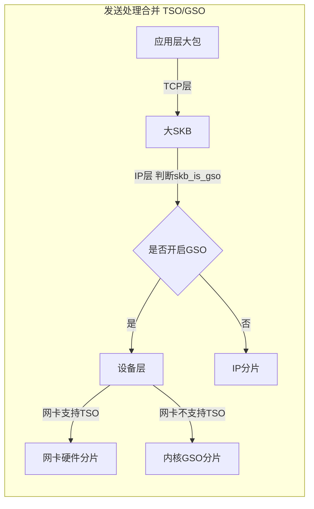

# 第九章 网络性能优化建议

写到这⾥，本书已经快接近尾声了。在本书前⾯⼏章的内容⾥，我们深⼊地讨论了很多内核⽹络模块相关的问题。正和庖丁⼀样，从今⽇往后我们看到的也不再是整个的 Linux （整头⽜）了，⽽是内核的内部各个模块（筋⻣肌理）。我们也理解了内核各个模块是如何有机协作来帮我们完成任务的。

那么具备了这些深刻的理解之后，我们在性能⽅⾯有哪些优化⼿段可⽤呢？我在本章中给出⼀些开发或者运维中的性能优化建议。注意，我⽤的字眼是**建议**，⽽不是原则之类的。每⼀种性能优化⽅法都有它适⽤或者不适⽤的应⽤场景。你应当根据你当前的项⽬现状灵活来选择⽤或者不⽤。

---

## 9.1 ⽹络请求优化

### 建议1：尽量减少不必要的⽹络 IO

我要给出的第⼀个建议就是**不必要⽤⽹络 IO 的尽量不⽤**。

是的，⽹络在现代的互联⽹世界⾥承载了很重要的⻆⾊。⽤户通过⽹络请求线上服务、服务器通过⽹络读取数据库中数据，通过⽹络构建能⼒⽆⽐强⼤分布式系统。⽹络很好，能降低模块的开发难度，也能⽤它搭建出更强⼤的系统。**但是这不是你滥⽤它的理由！**

我曾经⻅过有的同学在⾃⼰开发的接⼝⾥要请求⼏个第三⽅的服务。这些服务提供了⼀个 C 或者 Java 语⾔的 SDK，说是 SDK 其实就是简单的⼀次 UDP 或者 TCP 请求的封装⽽已。这个同学呢，不熟悉 C 和 Java 语⾔的代码，为了省事就直接在本机上把这些 SDK 部署上来，然后⾃⼰再通过本机⽹络 IO 调⽤这些 SDK。我们接⼿这个项⽬以后，分析了⼀下这⼏个 SDK 的实现，其实调⽤和协议解析都很简单。我们在⾃⼰的服务进程⾥实现了实现了⼀遍，⼲掉了这些本机⽹络 IO 。效果是该项⽬ CPU 整体核数削减了 **20%+**。另外除了性能以外，项⽬的部署难度，可维护性也都得到了极⼤的提升。

原因我们在本书第 5 章的内容⾥说过，**即使是本机⽹络 IO 开销仍然是很⼤的**。先说发送⼀个⽹络包，⾸先得从⽤户态切换到内核态，花费⼀次系统调⽤的开销。进⼊到内核以后，⼜得经过冗⻓的协议栈，这会花费不少的 CPU 周期，最后进⼊环回设备的“驱动程序”。接收端呢，软中断花费不少的 CPU 周期⼜得经过接收协议栈的处理，最后唤醒或者通知⽤户进程来处理。当服务端处理完以后，还得把结果再发过来。⼜得来这么⼀遍，最后你的进程才能收到结果。你说麻烦不麻烦。另外还有个问题就是**多个进程协作来完成⼀项⼯作就必然会引⼊更多的进程上下⽂切换开销**，这些开销从开发视⻆来看，做的其实都是⽆⽤功。

上⾯我们还分析的只是本机⽹络 IO，如果是跨机器的还得会有双⽅⽹卡的 DMA 拷⻉过程，以及两端之间的⽹络 RTT 耗时延迟。所以，**⽹络虽好，但也不能随意滥⽤！**

> [!TIP] 核⼼要点
> 本机⽹络 IO 也需要完整的协议栈处理（用户态/内核态切换、软中断、上下文切换），开销不小。能通过进程内实现的功能，尽量别拆成独立进程再通过网络调用。

---

### 建议2：尽量合并⽹络请求

在可能的情况下，**尽可能地把多次的⽹络请求合并到⼀次**，这样既节约了双端的 CPU 开销，也能降低多次 RTT 导致的耗时。

我们举个实践中的例⼦可能更好理解。假如有⼀个 redis，⾥⾯存了每⼀个 App 的信息（应⽤名、包名、版本、截图等等）。你现在需要根据⽤户安装应⽤列表来查询数据库中有哪些应⽤⽐⽤户的版本更新，如果有则提醒⽤户更新。

那么**最好不要写出如下的代码**：

```php
<?php 
for(安装列表 as 包名){
   redis->get(包名)
   ...
}
```

上⾯这段代码功能上实现上没问题，问题在于性能。据我们统计现代⽤户平均安装 App 的数量在 60 个左右。那这段代码在运⾏的时候，每当⽤户来请求⼀次，你的服务器就需要和 redis 进⾏ 60 次⽹络请求。 总耗时最少是 60 个 RTT 起。更好的⽅法是应该使⽤ redis 中提供的批量获取命令，如 `hmget`、`pipeline` 等，经过⼀次⽹络 IO 就获取到所有想要的数据，如图 9.1。



**图9.1 ⽹络请求合并**

---

### 建议3：调⽤者与被调⽤机器尽可能部署的近⼀些

在前⾯的章节中我们看到在握⼿⼀切正常的情况下， TCP 握⼿的时间基本取决于两台机器之间的 RTT 耗时。虽然我们没办法彻底去掉这个耗时，但是我们却有办法把 RTT 降低，**那就是把客户端和服务器放的⾜够地近⼀些**。尽量把每个机房内部的数据请求都在本地机房解决，减少跨地⽹络传输。

举例，假如你的服务是部署在北京机房的，你调⽤的 mysql、redis 最好都位于北京机房内部。尽量不要跨过千⾥万⾥跑到⼴东机房去请求数据，即使你有专线，耗时也会⼤⼤增加！在机房内部的服务器之间的 RTT 延迟⼤概只有零点⼏毫秒，同地区的不同机房之间⼤约是 1 ms 多⼀些。但如果从北京跨到⼴东的话，延迟将是 30 - 40 ms 左右，**⼏⼗倍的上涨**！

---

### 建议4：内⽹调⽤不要⽤外⽹域名

假如说你所在负责的服务需要调⽤兄弟部⻔的⼀个搜索接⼝，假设接⼝是：`http://www.sogou.com/wq?key=开发内功修炼`。

那既然是兄弟部⻔，那很可能这个接⼝和你的服务是部署在⼀个机房的。即使没有部署在⼀个机房，⼀般也是有专线可达的。所以**不要直接请求 `www.sogou.com`**， ⽽是应该使⽤该服务在公司对应的内⽹域名。在我们公司内部，每⼀个外⽹服务都会配置⼀个对应的内⽹域名，我相信你们公司也有。

为什么要这么做，原因有以下⼏点：

1. **外⽹接⼝慢**。本来内⽹可能过个交换机就能达到兄弟部⻔的机器，⾮得上外⽹兜⼀圈再回来，时间上肯定会慢。

2. **带宽成本⾼**。在互联⽹服务⾥，除了机器以外，另外⼀块很⼤的成本就是 IDC 机房的出⼊⼝带宽成本。 两台机器在内⽹不管如何通信都不涉及到带宽的计算。但是⼀旦你去外⽹兜了⼀圈回来，⾏了，⼀进⼀出全部要缴带宽费，你说亏不亏！！

3. **NAT 单点瓶颈**。⼀般的服务器都没有外⽹ IP，所以要想请求外⽹的资源，必须要经过 NAT 服务器。但是⼀个公司的机房⾥⼏千台服务器中，承担 NAT ⻆⾊的可能就那么⼏台。它很容易成为瓶颈。我们的业务就遇到过好⼏次 NAT 故障导致外⽹请求失败的情形。  NAT 机器挂了，你的服务可能也就挂了，故障率⼤⼤增加。

---

## 9.2 接收过程优化

### 建议1：调整⽹卡 RingBuffer ⼤⼩

当⽹线中的数据帧到达⽹卡后，第⼀站就是 [[RingBuffer]]。⽹卡在 RingBuffer 中寻找可⽤的内存位置，找到后 DMA 引擎会把数据 DMA 到 RingBuffer 内存⾥。因此我们第⼀个要监控和调优的就是⽹卡的 RingBuffer，我们使⽤ `ethtool` 来来查看⼀下 RingBuffer 的⼤⼩。

```bash
# ethtool -g eth0
Ring parameters for eth0:
Pre-set maximums:
RX:     4096
RX Mini:    0
RX Jumbo:   0
TX:     4096
Current hardware settings:
RX:     512
RX Mini:    0
RX Jumbo:   0
TX:     512
```

这⾥看到我⼿头的⽹卡设置 RingBuffer 最⼤允许设置到 4096 ，⽬前的实际设置是 512。

> [!NOTE] 技术细节
> `ethtool -g` 查看到的是实际是 Rx bd 的⼤⼩。Rx bd 位于⽹卡中，相当于⼀个指针。RingBuffer 在内存中，Rx bd 指向 RingBuffer。Rx bd 和 RingBuffer 中的元素是⼀⼀对应的关系。在⽹卡启动的时候，内核会为⽹卡的 Rx bd 在内存中分配 RingBuffer，并设置好对应关系。

在 Linux 的整个⽹络栈中，RingBuffer 起到⼀个任务的收发中转站的⻆⾊。对于接收过程来讲，⽹卡负责往 RingBuffer 中写⼊收到的数据帧，`ksoftirqd` 内核线程负责从中取⾛处理。只要 `ksoftirqd` 线程⼯作的⾜够快，RingBuffer 这个中转站就不会出现问题。但是我们设想⼀下，假如某⼀时刻，瞬间来了特别多的包，⽽ `ksoftirqd` 处理不过来了，会发⽣什么？这时 RingBuffer 可能瞬间就被填满了，后⾯再来的包⽹卡直接就会丢弃，不做任何处理！



**图9.2 RingBuffer 溢出**

那我们怎么样能看⼀下，我们的服务器上是否有因为这个原因导致的丢包呢？ 前⾯我们介绍的四个⼯具都可以查看这个丢包统计，拿 `ethtool` 来举例：

```bash
# ethtool -S eth0
......
rx_fifo_errors: 0
tx_fifo_errors: 0
```

`rx_fifo_errors` 如果不为 0 的话（在 `ifconfig` 中体现为 `overruns` 指标增⻓），就表示有包因为 RingBuffer 装不下而被丢弃了。那么怎么解决这个问题呢？很⾃然⾸先我们想到的是，**加⼤ RingBuffer** 这个“中转仓库”的⼤⼩，如图 9.3。通过 `ethtool` 就可以修改。

```bash
# ethtool -G eth1 rx 4096 tx 4096
```



**图9.3 RingBuffer 扩容**

这样⽹卡会被分配更⼤⼀点的”中转站“，可以解决偶发的瞬时的丢包。不过这种⽅法有个⼩副作⽤，那就是排队的包过多会增加处理⽹络包的延时。所以应该让内核处理⽹络包的速度更快⼀些更好，⽽不是让⽹络包傻傻地在 RingBuffer 中排队。我们后⾯会再介绍到 [[RSS]] ，它可以让更多的核来参与⽹络包接收。

---

### 建议2：多队列⽹卡 RSS 调优

硬中断的情况可以通过内核提供的伪⽂件 `/proc/interrupts` 来进⾏查看。拿⻜哥⼿头的⼀台虚机来举例：

```bash
# cat  /proc/interrupts
           CPU0       CPU1       CPU2       CPU3
  0:         34          0          0          0   IO-APIC-edge      timer
 ......
 27:        351          0          0 1109986815   PCI-MSI-edge      virtio1-input.0
 28:       2571          0          0          0   PCI-MSI-edge      virtio1-output.0
 29:          0          0          0          0   PCI-MSI-edge      virtio2-config
 30:    4233459 1986139461     244872     474097   PCI-MSI-edge      virtio2-input.0
 31:          3          0          2          0   PCI-MSI-edge      virtio2-output.0
```

上述结果是我⼿头的⼀台虚机的输出结果。上⾯包含了⾮常丰富的信息。⽹卡的输⼊队列 `virtio1-input.0` 的中断号是 27，总的中断次数是 1109986815，并且 27 号中断都是由 **CPU3** 来处理的。

那么为什么这个输⼊队列的中断都在 CPU3 上呢？  这是因为内核的⼀个中断亲和性配置，在我机器的伪⽂件系统中可以查看到。

```bash
# cat /proc/irq/27/smp_affinity
8
```

`smp_affinity` ⾥是 CPU 的亲和性的绑定，`8` 是⼆进制的 `1000`, 第4位为 1。代表的就是当前的第 27 号中断的都由第 4 个 CPU 核⼼ - **CPU3** 来处理。

现在的主流⽹卡基本上都是⽀持多队列的。通过 `ethtool` ⼯具可以查看⽹卡的队列情况。

```bash
# ethtool -l eth0
Channel parameters for eth0:
Pre-set maximums:
RX:   0
TX:   0
Other:    1
Combined: 63
Current hardware settings:
RX:   0
TX:   0
Other:    1
Combined: 8
```

上述结果表示当前⽹卡⽀持的最⼤队列数是 63 ，当前开启的队列数是 8 。这样当有数据到达的时候，可以将接收进来的包分散到多个队列⾥。另外每⼀个队列都有⾃⼰的中断号。⽐如我⼿头另外⼀台多队列的机器上看到结果（为了⽅便展示我删除了部分不相关内容）：

```bash
# cat  /proc/interrupts
           CPU1       CPU3      CPU5       CPU7
  ...  
 27:        470130696 0          0          0            PCI-MSI-edge      virtio1-input.0
 29:        0          2065657303 0          0            PCI-MSI-edge      virtio1-input.1
 31:        0          0          2510110352 0            PCI-MSI-edge      virtio1-input.2
 33:        0          0          0          2757994424   PCI-MSI-edge      virtio1-input.3
```

这台机器上 `virtio` 这块虚拟⽹卡上有四个输⼊队列，其硬中断号分别是 27、29、31 和 33。有独⽴的中断号就可以独⽴向某个 CPU 核⼼发起硬中断请求，让对应 CPU 来 poll 包。中断和 CPU 的对应关系还是通过 `cat /proc/irq/{中断号}/smp_affinity` 来查看。通过将不同队列的 CPU 亲和性打散到多个 CPU 核上，就可以让多核同时并⾏处理接收到的包了。**这个特性叫做 [[RSS]]（Receive Side Scaling，接收端扩展）** ，如图 9.4。这是加快 Linux 内核处理⽹络包的速度⾮常有⽤的⼀个优化⼿段。



**图9.4 多队列⽹卡**

在⽹卡⽀持多队列的服务器上，想提⾼内核收包的能⼒，直接简单加⼤队列数就可以了，这⽐加⼤ RingBuffer 更为有⽤。因为加⼤ RingBuffer 只是给个更⼤的空间让⽹络帧能继续排队，⽽加⼤队列数则能让包更早地被内核处理。`ethtool` 修改队列数量⽅法如下：

```bash
# ethtool -L eth0 combined 32
```

不过在⼀般情况下，由⼀个叫 `irqbalance的服务来⾃动管理。通过 `ps` 命令可以查看到这个进程。

```bash
# ps -ef | grep irqb
root     29805     1  0 18:57 ?        00:00:00 /usr/sbin/irqbalance --foreground
```

`irqbalance` 会根据系统中断负载的情况，⾃动维护和迁移各个中断的 CPU 亲和性，以保持各个 CPU 之间的中断开销均衡。如果有必要，`irqbalance` 也会⾃动把中断从⼀个 CPU 迁移到另⼀个 CPU 上。如果确实想⾃⼰维护亲和性，那得先关掉 `irqbalance`，然后再修改中断号对应的 `smp_affinity`。

```bash
# service irqbalance stop
# echo 2 > /proc/irq/30/smp_affinity
```

---

### 建议3：硬中断合并

在第 1 章中我们看到，当⽹络包接收到 RingBuffer 后，接下来通过硬中断通知 CPU。那么你觉得从整体效率上来讲，是有包到达就发起中断好呢，还是攒⼀些数据包再通知 CPU 更好。

先允许我来引⽤⼀个实际⼯作中的例⼦，假如你是⼀位开发同学，和你对⼝的产品经理⼀天有 10 个⼩需求需要让你帮忙来处理。她对你有两种中断⽅式：

- **第⼀种**：产品经理想到⼀个需求，就过来找你，和你描述需求细节，然后让你帮你来改。
- **第⼆种**：产品经理想到需求后，不来打扰你，等攒够 5 个来找你⼀次，你集中处理。

我们现在不考虑及时性，只考虑你的⼯作整体效率，你觉得那种⽅案下你的⼯作效率会⾼呢？或者换句话说，你更喜欢哪⼀种⼯作状态呢？只要你真的有过⼯作经验，⼀定都会觉得第⼆种⽅案更好。对⼈脑来讲，频繁的中断会打乱你的计划，你脑脑⼦⾥刚才刚想到⼀半技术⽅案可能也就废了。当产品经理⾛了以后，你再想捡起来刚被中断之的⼯作的时候，很可能得花点时间回忆⼀会⼉才能继续⼯作。

对于 CPU 来讲也是⼀样，CPU 要做⼀件新的事情之前，要加载该进程的地址空间，load 进程代码，读取进程数据，各级别 cache 要慢慢热身。因此如果能适当降低中断的频率，多攒⼏个包⼀起发出中断，对提升 CPU 的整体⼯作效率是有帮助的。所以，**⽹卡允许我们对硬中断进⾏合并**。

现在我们来看⼀下⽹卡的硬中断合并配置。

```bash
# ethtool -c eth0
Coalesce parameters for eth0:
Adaptive RX: off  TX: off
......
rx-usecs: 1
rx-frames: 0
rx-usecs-irq: 0
rx-frames-irq: 0
......
```

我们来说⼀下上述结果的⼤致含义：

- **Adaptive RX**：⾃适应中断合并，⽹卡驱动⾃⼰判断啥时候该合并啥时候不合并。
- **rx-usecs**：当过这么⻓时间过后，⼀个 RX interrupt 就会被产⽣。
- **rx-frames**：当累计接收到这么多个帧后，⼀个 RX interrupt 就会被产⽣。

如果你想好了修改其中的某⼀个参数了的话，直接使⽤ `ethtool -C` 就可以，例如：

```bash
# ethtool -C eth0 adaptive-rx on
```

> [!WARNING] 注意
> 减少中断数量虽然能使得 Linux 整体⽹络包吞吐更⾼，不过⼀些包的延迟也会增⼤，所以⽤的时候得适当注意。

---

### 建议4：软中断 budget 调整

再举个⽇常⼯作相关的例⼦，不知道你有没有听说过**番茄⼯作法**这种⾼效⼯作⽅法。它的⼤致意思就是你在⼯作的时候，要有⼀整段的不被打扰的时间，集中精⼒处理某⼀项⼯作。这⼀整段时间时⻓被建议是 25 分钟。

对于我们的 Linux 的处理软中断的 `ksoftirqd` 来说，它也和番茄⼯作法思路类似。⼀旦它被硬中断触发开始了⼯作，它会集中精⼒处理⼀波⼉⽹络包（绝不只是 1 个），然后再去做别的事情。

我们说的处理⼀波⼉是多少呢，策略略复杂。我们只说其中⼀个⽐较容易理解的，那就是 `net.core.netdev_budget` 内核参数。

```bash
# sysctl -a | grep net.core.netdev_budget
net.core.netdev_budget = 300
```

这个的意思说的是，`ksoftirqd` ⼀次最多处理 300 个包，处理够了就会把 CPU 主动让出来，以便 Linux 上其它的任务可以得到处理。 那么假如说，我们现在就是想提⾼内核处理⽹络包的效率。那就可以让 `ksoftirqd` 进程多⼲⼀会⼉⽹络包的接收，再让出 CPU。⾄于怎么提⾼，直接修改这个参数的值就好了。

```bash
# sysctl -w net.core.netdev_budget=600
```

如果要保证重启仍然⽣效，需要将这个配置写到 `/etc/sysctl.conf`。



**图9.5 接收处理合并**

---

### 建议5：接收处理合并

硬中断合并是指的攒⼀堆数据包后再通知⼀次 CPU，不过数据包仍然是分开的。**LRO（Large Receive Offload）/ GRO（Generic Receive Offload）** 还能把数据包合并起来后再往上层传递。

如果应⽤中是⼤⽂件的传输，⼤部分包都是⼀段数据，不⽤ LRO / GRO 的话，会每次都将⼀个⼩包传送到协议栈（IP 接收函数、TCP 接收）函数中进⾏处理。开启了的话，内核或者⽹卡会进⾏包的合并，之后将⼀个⼤包传给协议处理函数，如图 9.5。这样 CPU 的效率也就提⾼了。

LRO 和 GRO 的区别是合并包的位置不同。**LRO** 是在⽹卡上就把合并的事情给做了，因此要求⽹卡硬件必须⽀持才⾏。⽽ **GRO** 是在内核源码中⽤软件的⽅式实现的，更加通⽤，不依赖硬件。

那么如何查看你的系统内是否打开了 LRO / GRO 呢？

```bash
# ethtool -k eth0 
generic-receive-offload: on
large-receive-offload: on
...
```

如果你的⽹卡驱动没有打开 GRO 的话，可以通过如下⽅式打开：

```bash
# ethtool -K eth0 gro on
# ethtool -K eth0 lro on
```

---

## 9.3 发送过程优化

### 建议1：控制数据包数据包⼤⼩

在第四章中我们看到，在发送协议栈执⾏的过程中到了 IP 层如果要发送的数据⼤于 MTU 的话，会被分⽚。这个分⽚会有哪些影响呢？⾸先就是在分⽚的过程中我们看到多了⼀次的内存拷⻉。其次就是分⽚越多，在⽹络传输的过程中出现丢包的⻛险也越⼤。当丢包重传出现的时候，重传定时器的⼯作时间单位是秒，也就是说最快 1 秒以后才能开始重传。所以，如果在你的应⽤程序⾥可能的话，可以尝试将数据⼤⼩控制在⼀个 MTU 内部来极致地提⾼性能。我所知道的是在早期的 QQ 后台服务中应⽤过这个技巧，不知道现在还有没有在⽤。

---

### 建议2：减少内存拷⻉

假如你要发送⼀个⽂件给另外⼀台机器上，那么⽐较基础的做法是先调⽤ `read` 把⽂件读出来，再调⽤ `send` 把数据把数据发出去。这样数据需要频繁地在内核态内存和⽤户态内存之间拷⻉，如图 9.6。



**图9.6 read + write 发送文件**

⽬前减少内存拷⻉主要有两种⽅法，分别是使⽤ **mmap** 和 **sendfile** 两个系统调⽤。使⽤ `mmap` 系统调⽤的话，映射进来的这段地址空间的内存在⽤户态和内核态都是可以使⽤的。如果你发送数据是发的是 `mmap` 映射进来的数据，则内核直接就可以从地址空间中读取，如图 9.7，这样就节约了⼀次从内核态到⽤户态的拷⻉过程。



**图9.7 mmap + write 发送文件**

不过在 `mmap` 发送⽂件的⽅式⾥，系统调⽤的开销并没有减少，还是发⽣两次内核态和⽤户态的上下⽂切换。 如果你只是想把⼀个⽂件发送出去，⽽不关⼼它的内容，则可以调⽤另外⼀个做的更极致的系统调⽤ - **sendfile**。在这个系统调⽤⾥，彻底把读⽂件和发送⽂件给合并起来了，系统调⽤的开销⼜省了⼀次。再配合绝⼤多数⽹卡都⽀持的"分散-收集"（Scatter-gather）DMA 功能。可以直接从 PageCache 缓存区中 DMA 拷⻉到⽹卡中，如图 9.8。这样绝⼤部分的 CPU 拷⻉操作就都省去了。



**图9.8 sendfile 发送文件**

---

### 建议3：发送处理合并

在建议 1 中我们说到过发送过程在 IP 层如果要发送的数据⼤于 MTU 的话，会被分⽚。但其实是有⼀个例外情况，那就是开启了 **TSO（TCP Segmentation Offload）/ GSO（Generic Segmentation Offload）**。我们来回顾和跟进⼀下发送过程中的相关源码：

```c
// file: net/ipv4/ip_output.c
static int ip_finish_output(struct sk_buff *skb)
{
  ......
 
  // ⼤于 mtu 的话就要进⾏分⽚了
  if (skb->len > ip_skb_dst_mtu(skb) && !skb_is_gso(skb))
    return ip_fragment(skb, ip_finish_output2);
  else
    return ip_finish_output2(skb);
}
```

`ip_finish_output` 是协议层中的函数。`skb_is_gso` 判断是否使⽤ gso，如果使⽤了的话，就可以把分⽚过程推迟到更下⾯的设备层去做。

```c
// file: net/core/dev.c
int dev_hard_start_xmit(struct sk_buff *skb, struct net_device *dev,
      struct netdev_queue *txq)
{
    ......
      
    if (netif_needs_gso(skb, features)) { 
      if (unlikely(dev_gso_segment(skb, features)))
        goto out_kfree_skb;
      if (skb->next)
        goto gso;
    }
}   
```

`dev_hard_start_xmit` 位于设备层，和物理⽹卡离得更近了。`netif_needs_gso` 来判断是否需要进⾏ GSO 切分。在这个函数⾥会判断⽹卡硬件是不是⽀持 TSO，如果⽀持则不进⾏ GSO 切分，将⼤包直接传给⽹卡驱动，切分⼯作推迟到⽹卡硬件中去做。如果硬件不⽀持，则调⽤ `dev_gso_segment` 开始切分。

推迟分⽚的好处是可以省去⼤量包的协议头的计算⼯作量，减轻 CPU 的负担。



**图9.9 发送处理合并**

使⽤ `ethtool` ⼯具可以查看当前 TSO 和 GSO 的开启状况。

```bash
# ethtool -k eth0
tcp-segmentation-offload: on
        tx-tcp-segmentation: on
        tx-tcp-ecn-segmentation: off [fixed]
        tx-tcp6-segmentation: on
udp-fragmentation-offload: off [fixed]
generic-segmentation-offload: off
```

如果没有开启，可以使⽤ `ethtool` 打开。

---

### 建议4：多队列⽹卡 XPS 调优

在第四章的发送过程中 4.4.5 ⼩节，我们看到在 `__netdev_pick_tx` 函数中，要选择⼀个发送队列出来。如果存在 [[XPS]]（Transmit Packet Steering），则以 XPS 配置为准。过程是根据当前 CPU 的 id 号去到 XPS 中查看是要⽤哪个发送队列，来看下源码。

```markdown
# 10. 第九章 网络性能优化建议

## 9.3 多队列网卡与 XPS 配置

### 建议4:配置 XPS(Transmit Packet Steering)

如果配置了 XPS,则以 XPS 配置为准.过程是根据当前 CPU 的 ID 号去 XPS 中查看要使用哪个发送队列.

查看网卡 offload 特性:

```bash
# ethtool -k eth0
tcp-segmentation-offload: on
        tx-tcp-segmentation: on
        tx-tcp-ecn-segmentation: off [fixed]
        tx-tcp6-segmentation: on
udp-fragmentation-offload: off [fixed]
generic-segmentation-offload: off
```

开启 TSO 和 GSO:

```bash
# ethtool -K eth0 tso on
# ethtool -K eth0 gso on
```

来看下源码:

```c
//file: net/core/flow_dissector.c
static inline int get_xps_queue(struct net_device *dev, struct sk_buff *skb)
{
    // 获取 xps 配置
    dev_maps = rcu_dereference(dev->xps_maps);
    if (dev_maps) {
        map = rcu_dereference(
            // raw_smp_processor_id() 是获取当前 cpu id
            dev_maps->cpu_map[raw_smp_processor_id()]);
        if (map) {
            if (map->len == 1)
                queue_index = map->queues[0];
            ...
        }
    }
}
```


源码中 `raw_smp_processor_id` 是在获取当前执行的 CPU ID.用该 CPU 号查看对应的 CPU 核是否有配置.XPS 配置在 `/sys/class/net/<dev>/queues/tx-<n>/xps_cpus` 这个伪文件里.例如对于我手头的一台服务器来说,配置是这样的:

```bash
# cat /sys/class/net/eth0/queues/tx-0/xps_cpus
00000001
# cat /sys/class/net/eth0/queues/tx-1/xps_cpus
00000002
# cat /sys/class/net/eth0/queues/tx-2/xps_cpus
00000004
# cat /sys/class/net/eth0/queues/tx-3/xps_cpus
00000008
......
```

上述结果中 `xps_cpus` 是一个 CPU 掩码,表示当前队列对应的 CPU 号.从上面输出看,对于 eth0 网卡下的 `tx-0` 队列来说,是和 CPU0 绑定的.`00000001` 表示 CPU0,`00000002` 表示 CPU1,...,以此类推.假如当前 CPU 核是 CPU0,那么找到的队列就是 eth0 网卡下的 `tx-0`.

那么通过 XPS 指定了当前 CPU 要使用的发送队列有什么好处呢?好处大致有两个:

- **第一**:因为更少的 CPU 争用同一个队列,所以设备队列锁上的冲突大大减少.如果进一步配置成每个 CPU 都有自己的独立队列使用,则会完全消除队列锁的开销.
- **第二**:CPU 和发送队列一对一绑定以后能提高传输结构的局部性,从而进一步提升效率.

> 关于 RSS、RPS、RFS、aRFS、XPS 等网络包收发过程中的优化手段,可以参考源码中 `Documentation/networking/scaling.txt` 这个文档,里面有关于这些技术的详细官方说明.

### 建议5:使用 eBPF 绕开协议栈的本机 IO

![Image 1116 on Page 269]

如果你的业务中涉及到大量的本机网络 IO,可以考虑这个优化方案.

在第 5 章中我们看到,本机网络 IO 和跨机 IO 比较起来,确实是节约了驱动上的一些开销.发送数据不需要进 `RingBuffer` 的驱动队列,直接把 [[skb]] 传给接收协议栈(经过软中断).但是在内核其它组件上,可是一点都没少,系统调用、协议栈(传输层、网络层等)、设备子系统整个走了一个遍.连"驱动"程序都走了(虽然对于回环设备来说这个驱动只是一个纯软件的虚拟出来的东东).

![Image 1121 on Page 270]

如果想用本机网络 IO,但是又不想频繁地在协议栈中绕来绕去,那么你可以试试 [[eBPF]].使用 eBPF 的 [[sockmap]] 和 [[sk redirect]] 可以绕过 TCP/IP 协议栈,而被直接发送给接收端的 socket,业界已经有公司在这么做了.

## 9.4 内核与进程协作优化

### 建议1:尽量少用 recvfrom 等进程阻塞的方式

![Image 1129 on Page 272]

在 3.3 节我们看到,在使用 `recvfrom` 阻塞方式来接收 socket 上数据的时候.每次一个进程专门为了等一个 socket 上的数据就得被从 CPU 上拿下来,然后再换上另一个进程.等到数据 ready 了,睡眠的进程又会被唤醒.总共两次进程上下文切换开销.

如果我们服务器上需要有大量的用户请求需要处理,那就需要有很多的进程存在,而且不停地切换来切换去.这样的缺点有如下这么几个:

- 因为每个进程只能同时等待一条连接,所以需要大量的进程.
- 进程之间互相切换的时候需要消耗很多 CPU 周期,一次切换大约是 3-5 us 左右.
- 频繁的切换导致 L1、L2、L3 等高速缓存的效果大打折扣.

大家可能以为这种网络 IO 模型很少见了.但其实在很多传统的客户端 SDK 中,比如 mysql、redis 和 kafka 仍然是沿用了这种方式.

### 建议2:使用成熟的网络库

![Image 17 on Page 274]

使用 [[epoll]] 可以高效地管理海量的 socket.在服务器端,我们有各种成熟的网络库进行使用.这些网络库都对 epoll 使用了不同程度的封装.

首先第一个要给大家参考的是 [[Redis]].老版本的 Redis 里单进程高效地使用 epoll 就能支持每秒数万 QPS 的高性能.如果你的服务是单进程的,可以参考 Redis 在网络 IO 这块的源码.

如果是多线程的,线程之间的分工有很多种模式.那么哪个线程负责等待读 IO 事件,那个线程负责处理用户请求,哪个线程又负责给用户写返回.根据分工的不同,又衍生出单 [[Reactor]]、多 [[Reactor]]、以及 [[Proactor]] 等多种模式.大家也不必头疼,只要理解了这些原理之后选择一个性能不错的网络库就可以了.比如 PHP 中的 [[Swoole]]、Golang 的 [[net]] 包、Java 中的 [[Netty]]、C++ 中的 [[Sogou Workflow]] 都封装得非常不错.

### 建议3:使用 Kernel-ByPass 新技术

![Image 1141 on Page 275]

如果你的服务对网络要求确实特别特别的高,而且各种优化措施也都用过了,那么现在还有终极优化大招 -- [[Kernel-ByPass]] 技术.

![Image 1146 on Page 276]

在本书我们看到了内核在接收网络包的时候要经过很长的收发路径.在这期间牵涉到很多内核组件之间的协同、协议栈的处理、以及内核态和用户态的拷贝和切换.[[Kernel-ByPass]] 这类的技术方案就是绕开内核协议栈,自己在用户态来实现网络包的收发.这样不但避开了繁杂的内核协议栈处理,也减少了频繁的内核态用户态之间的拷贝和切换,性能将发挥到极致!

目前我所知道的方案有 [[SOLARFLARE]] 的软硬件方案、[[DPDK]] 等等.如果大家感兴趣,可以多去了解一下!

## 9.5 握手挥手过程优化

### 建议1:配置充足的端口范围

![Image 1151 on Page 277]

客户端在调用 `connect` 系统调用发起连接的时候,需要先选择一个可用的端口.内核在选用端口的时候,是采用从可用端口范围中某一个随机位置开始遍历的方式.如果端口不充足的话,内核可能需要循环撞很多次才能选上一个可用的.这也会导致花费更多的 CPU 周期在内部的哈希表查找以及可能的自旋锁等待上.因此不要等到端口用尽报错了才开始加大端口范围,而应该一开始的时候就保持一个比较充足的值.

![Image 1152 on Page 277]

如果端口加大了仍然不够用,那么可以考虑开启端口 `reuse` 和 `recycle`.这样端口在连接断开的时候就不需要等待 2MSL 的时间了,可以快速回收.开启这个参数之前需要保证 `tcp_timestamps` 是开启的.

### 建议2:客户端最好不要使用 bind

![Image 1161 on Page 279]

如果不是业务有要求,建议客户端不要使用 `bind`.因为我们在 6.3 节看到过,`connect` 系统调用在选择端口的时候,即使一个端口已经被用过了,只要和已经有的连接四元组不完全一致,那这个端口仍然可以被用于建立新连接.但是 `bind` 函数会破坏 `connect` 的这段端口选择逻辑,直接绑定一个端口,而且一个端口只能被绑定一次.如果使用了 `bind`,则一个端口只能用于发起一条连接上.总体上来看,你的机器的最大并发连接数就真的受限于 65535 了.

### 建议3:小心连接队列溢出

![Image 1166 on Page 280]

服务器端使用了两个连接队列来响应来自客户端的握手请求.这两个队列的长度是在服务器 `listen` 的时候就确定好了的.如果发生溢出,很可能会丢包.所以如果你的业务使用的是短连接且流量比较大,那么一定得学会观察这两个队列是否存在溢出的情况.因为一旦出现因为连接队列导致的握手问题,那么 TCP 连接耗时都是秒级以上了.

对于半连接队列,有个简单的办法.那就是只要保证 `tcp_syncookies` 这个内核参数是 1 就能保证不会有因为半连接队列满而发生的丢包.

对于全连接队列来说,可以通过 `netstat -s` 来观察.`netstat -s` 可查看到当前系统全连接队列满导致的丢包统计.但该数字记录的是总丢包数,所以你需要再借助 `watch` 命令动态监控.

```bash
# watch 'netstat -s | grep overflowed'
160 times the listen queue of a socket overflowed // 全连接队列满导致的丢包
```

如果输出的数字在你监控的过程中变了,那说明当前服务器有因为全连接队列满而产生的丢包.你就需要加大你的全连接队列的长度了.全连接队列是应用程序调用 `listen` 时传入的 `backlog` 以及内核参数 `net.core.somaxconn` 二者之中较小的那个.如果需要加大,可能两个参数都需要改.

![Image 49 on Page 281]

如果你手头并没有服务器的权限,只是发现自己的客户端机连接某个 server 出现耗时长,想定位一下是否是因为握手队列的问题.那也有间接的办法,可以 `tcpdump` 抓包查看是否有 SYN 的 TCP Retransmission.如果有偶发的 TCP Retransmission,那就说明对应的服务端连接队列可能有问题了.

### 建议4:减少握手重试

在 6.5 节我们看到如果握手发生异常,客户端或者服务端就会启动超时重传机制.这个超时重试的时间间隔是翻倍地增长的,1 秒、3 秒、7 秒、15 秒、31 秒、63 秒 .......对于我们提供给用户直接访问的接口来说,重试第一次耗时 1 秒多已经是严重影响用户体验了.如果重试到第三次以后,很有可能某一个环节已经报错返回 504 了.所以在这种应用场景下,维护这么多的超时次数其实没有任何意义.倒不如把他们设置的少一些,尽早放弃.其中客户端的 syn 重传次数由 `tcp_syn_retries` 控制,服务器半连接队列中的超时次数是由 `tcp_synack_retries` 来控制.把它们两个调成你想要的值.

### 建议5:打开 TFO(TCP Fast Open)

![Image 49 on Page 281]

我们第 6 章的时候没有介绍一个细节,那就是 `fastopen` 功能.在客户端和服务器端都支持该功能的前提下,客户端的第三次握手 ack 包就可以携带要发送给服务器的数据.这样就会节约一个 RTT 的时间开销.如果支持,可以尝试启用.

### 建议6:保持充足的文件描述符上限

在 Linux 下一切皆是文件,包括我们网络连接中的 socket.如果你的服务进程需要支持海量的并发连接.那么调整和加大文件描述符上限是很关键的.否则你的线上服务将会收到 "Too many open files" 这个错误.

相关的限制机制请参考 8.2 节,这里我们给出一套推荐的修改方法.例如你的服务需要在单进程支持 100W 条并发,那么建议:

```bash
# vi /etc/sysctl.conf
fs.file-max=1100000 // 系统级别设置成 110W，多留点 buffer。
fs.nr_open=1100000 // 进程级别也设置成 110W，因为要比 hard nofile 大
# sysctl -p

# vi /etc/security/limits.conf
// 用户进程级别都设置成 100W
* soft nofile 1000000
* hard nofile 1000000
```

### 建议7:如果请求频繁,请弃用短连接改用长连接

如果你的服务器频繁请求某个 server,比如 redis 缓存.和建议 1 比起来,一个更好一点的方法是使用长连接.这样的好处有:

1. **节约了握手开销**:短连接中每次请求都需要服务和缓存之间进行握手,这样每次都得让用户多等一个握手的时间开销.
2. **规避了队列满的问题**:前面我们看到当全连接或者半连接队列溢出的时候,服务器直接丢包.而客户端呢并不知情,所以傻傻地等 3 秒才会重试.要知道 tcp 本身并不是专门为互联网服务设计的.这个 3 秒的超时对于互联网用户的体验影响是致命的.
3. **端口数不容易出问题**:短连接中,在释放连接的时候,客户端使用的端口需要进入 TIME_WAIT 状态,等待 2 MSL 的时间才能释放.所以如果连接频繁,端口数量很容易不够用.而长连接就固定使用那么几十上百个端口就够了.

### 建议8:TIME_WAIT 的优化

很多线上服务如果使用了短连接的情况下,就会出现大量的 TIME_WAIT.

首先,我想说的是没有必要见到两三万个 TIME_WAIT 就恐慌的不行.从内存的角度来考虑,一条 TIME_WAIT 状态的连接仅仅是 0.5 KB 的内存而已.从端口占用的角度来说,确实是消耗掉了一个端口.但假如你下次再连接的是不同的 Server 的话,该端口仍然可以使用.只有在所有 TIME_WAIT 都聚集在和同一个 Server 的连接上的时候才会有问题.

那怎么解决呢?其实办法有很多:

- **第一个办法**:按上面建议 1 中的开启端口 `reuse` 和 `recycle`.
- **第二个办法**:限制 TIME_WAIT 状态的连接的最大数量.

```bash
# vi /etc/sysctl.conf
net.ipv4.tcp_max_tw_buckets = 32768
# sysctl -p
```

- **如果再彻底一些**:也可以干脆采用建议 7,直接用长连接代替频繁的短连接.连接频率大大降低以后,自然也就没有 TIME_WAIT 的问题了.

---

**推荐配置汇总:**

```bash
# vi /etc/sysctl.conf
net.ipv4.ip_local_port_range = 5000 65000
# sysctl -p  // 使配置生效

# vi /etc/sysctl.conf
net.ipv4.tcp_timestamps = 1
net.ipv4.tcp_tw_reuse = 1
net.ipv4.tcp_tw_recycle = 1  // 注意：较新内核已废弃该参数，使用 net.ipv4.tcp_tw_reuse 和 tcp_timestamps 组合
# sysctl -p

# vi /etc/sysctl.conf
net.ipv4.tcp_fastopen = 3  // 服务器和客户端两种角色都启用
# sysctl -p
```

> 欢迎加入我的知识星球,也欢迎加入我的技术交流群
> Github:[https://github.com/yanfeizhang/coder-kung-fu](https://github.com/yanfeizhang/coder-kung-fu)

在知识星球中我们会进行内核等底层技术的视频讲解,能让你的底层学起来更快,事半功倍.还会进行线上问题排查以及性能优化等方面案例分享和交流.对大家技术深度和广度的积累很有好处.有想继续加入知识星球的同学微信扫描下面的二维码即可加入.另外在公众号后台发送「星球优惠券」可以获取开发内功修炼读者的专属优惠券.

```