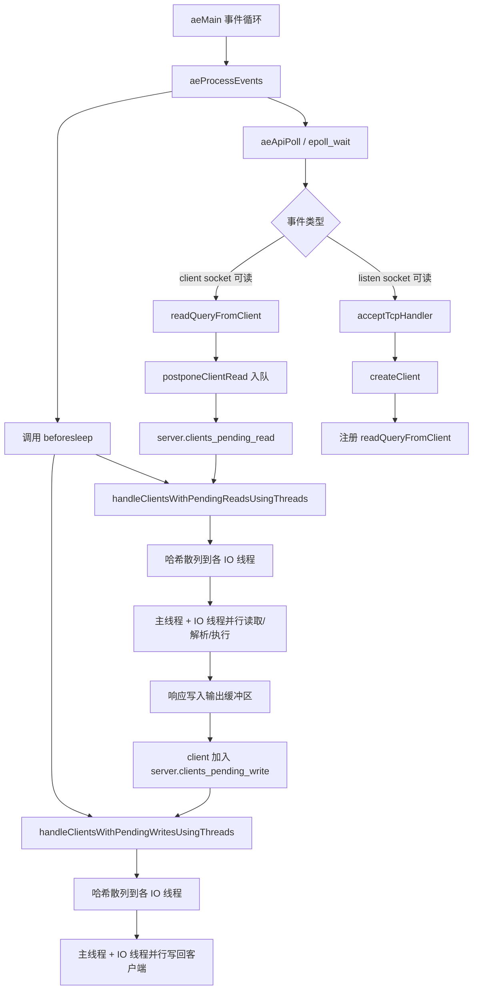
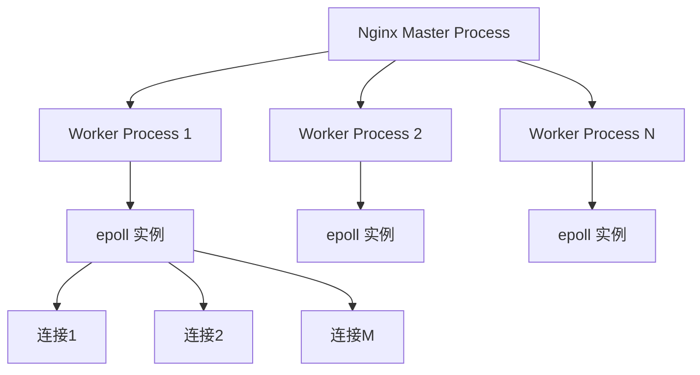
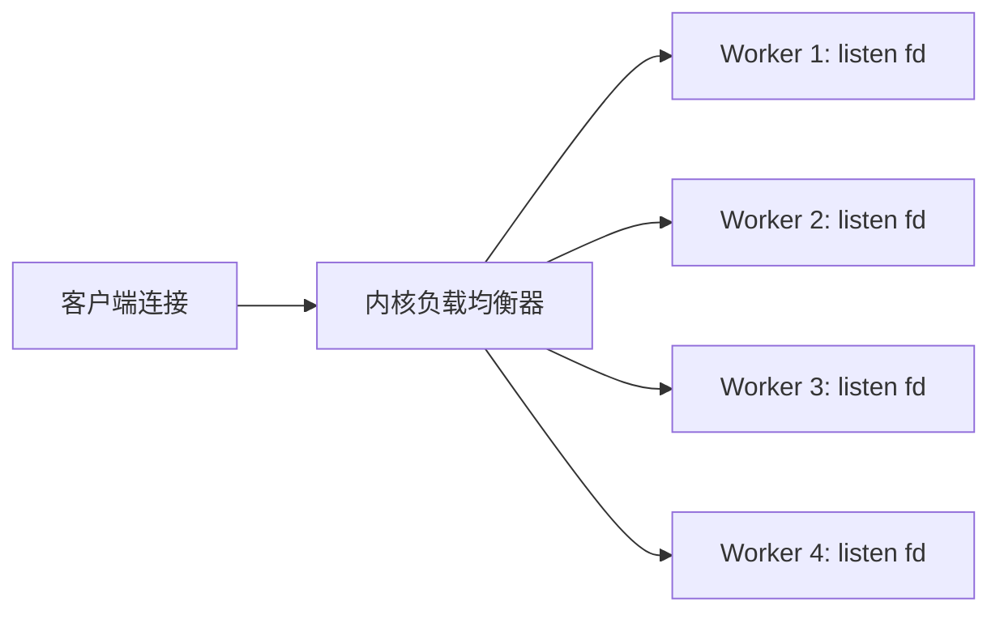
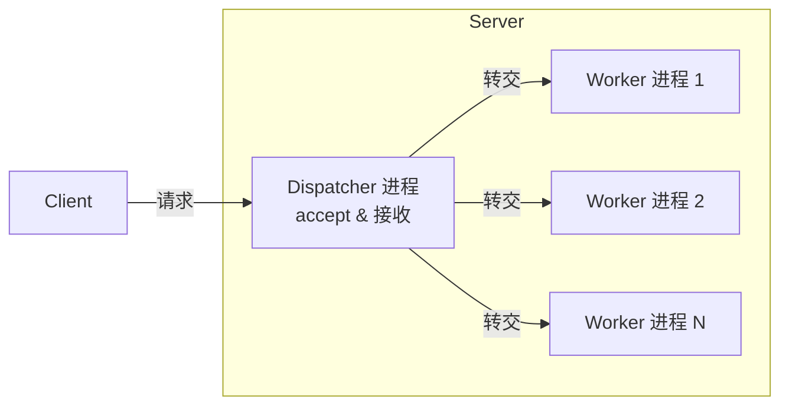
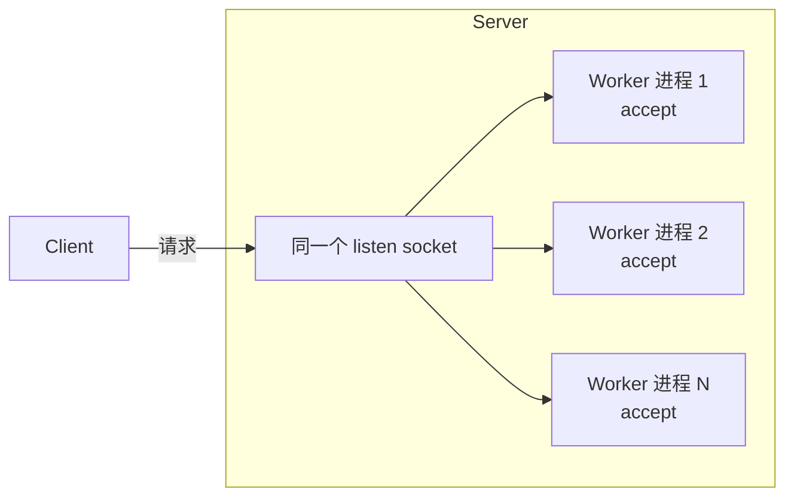

# 第十一章 高性能网络应用

## 11.1 单线程的 Redis 如何做到每秒数万 QPS 的超高处理能力

今天开篇先给大家讲个飞哥自己的小故事。我在学校和刚毕业头一年主要从事的客户端开发，那时候对服务器端编程还不擅长。

有一次去面试服务器端岗位，面试官问我有一个连接过来，你该怎么编程处理它。我答道：“主线程收到请求后，创建一个子线程处理。” 面试官接着问，那有一千个连接同时来呢？ 我说“那就多创建一点线程，搞个线程池”。面试官继续追问如果一万个呢？我答道:“......”。

事实上，服务器端只需要单线程可以达到非常高的处理能力，Redis 就是一个非常好的例子。仅仅靠单线程就可以支撑起每秒数万 QPS 的高处理能力。今天我们就来带大家看看 Redis 核心网络模块的内部实现，学习下 Redis 是如何做到如此的高性能的！

### 11.1.1 理解多路复用原理

在开始介绍 Redis 之前，我想有必要先来简单介绍下 [[epoll]]。

在传统的同步阻塞网络编程模型里（没有协程以前），性能上不来的根本原因在于进程线程都是笨重的家伙。让一个进(线)程只处理一个用户请求确确实实是有点浪费了。

先抛开高内存开销不说，在海量的网络请求到来的时候，光是频繁的进程线程上下文就让 CPU 疲于奔命了。

如果把进程比作牧羊人，一个进(线)程同时只能处理一个用户请求，相当于一个人只能看一只羊，放完这一只才能放下一只。如果同时来了 1000 只羊，那就得 1000 个人去放，这人力成本是非常高的。

性能提升思路很简单，就是让很多的用户连接来复用同一个进(线)程，这就是多路复用。多路指的是许许多多个用户的网络连接。复用指的是对进(线)程的复用。换到牧羊人的例子里，就是一群羊只要一个牧羊人来处理就行了。

不过复用实现起来是需要特殊的 socket 事件管理机制的，最典型和高效的方案就是 epoll。放到牧羊人的例子来，epoll 就相当于一只牧羊犬。

在 epoll 的系列函数里，`epoll_create` 用于创建一个 epoll 对象，`epoll_ctl` 用来给 epoll 对象添加或者删除一个 socket。`epoll_wait` 就是查看它当前管理的这些 socket 上有没有可读可写事件发生。

当网卡上收到数据包后，Linux 内核进行一系列的处理后把数据放到 socket 的接收队列。然后会检查是否有 epoll 在管理它，如果是则在 epoll 的就绪队列中插入一个元素。`epoll_wait` 的操作就非常的简单了，就是到 epoll 的就绪队列上来查询有没有事件发生就行了。关于 epoll 这只“牧羊犬”的工作原理参见[[深入揭秘 epoll 是如何实现 IO 多路复用的]] (Javaer 习惯把基于 epoll 的网络开发模型叫做 NIO)

在基于 epoll 的编程中，和传统的函数调用思路不同的是，我们并不能主动调用某个 API 来处理。因为无法知道我们想要处理的事件啥时候发生。所以只好提前把想要处理的事件的处理函数注册到一个事件分发器上去。当事件发生的时候，由这个事件分发器调用回调函数进行处理。这类基于实现注册事件分发器的开发模式也叫 [[Reactor 模型]]。

### 11.1.2 Redis 服务启动初始化

理解了 epoll 原理后，我们再来实际看 Redis 具体是如何使用 epoll 的。直接在 Github 上就可以非常方便地获取 Redis 的源码。我们切到 5.0.0 版本来看单线程版本的实现（多线程我们改天再讲）。

其中整个 Redis 服务的代码总入口在 `src/server.c` 文件中，我把入口函数的核心部分摘了出来，如下。

```bash
# git clone https://github.com/redis/redis
# cd redis
# git checkout -b 5.0.0 5.0.0
```

其实整个 Redis 的工作过程，就只需要理解清楚 `main` 函数中调用的 `initServer` 和 `aeMain` 这两个函数就足够了。本节中我们重点介绍 `initServer`，在下一节介绍事件处理循环 `aeMain`。在 `initServer` 这个函数内，Redis 做了这么三件重要的事情。

1. 创建一个 epoll 对象
2. 对配置的监听端口进行 listen
3. 把 listen socket 让 epoll 给管理起来

```c
//file:src/server.c
int main(int argc, char **argv) {
  ......
  // 启动初始化
  initServer();
  // 运行事件处理循环,一直到服务器关闭为止
  aeMain(server.el);
}

//file:src/server.c
void initServer() {
  // 1)创建 epoll
  server.el = aeCreateEventLoop(server.maxclients+CONFIG_FDSET_INCR);
  // 2)绑定监听服务端口
  listenToPort(server.port,server.ipfd,&server.ipfd_count);
  // 3)注册 accept 事件处理器
  for (j = 0; j < server.ipfd_count; j++) {
    aeCreateFileEvent(server.el, server.ipfd[j], AE_READABLE,
      acceptTcpHandler,NULL);
  }
  ...
}
```

接下来我们分别来看。

#### 1）创建 epoll 对象

本小节的逻辑看起来貌似不短，但其实只是创建了一个 epoll 对象出来而已。

创建 epoll 对象的逻辑在 `aeCreateEventLoop` 中，在创建完后，Redis 将其保存在 `redisServer` 的 `aeEventLoop` 成员中，以备后续使用。

我们来看 `aeCreateEventLoop` 详细逻辑。Redis 在操作系统提供的 epoll 对象基础上又封装了一个 `eventLoop` 出来，所以创建的时候是先申请和创建 `eventLoop`。

在 `eventLoop` 里，我们稍微注意一下 `eventLoop->events`，将来在各种事件注册的时候都会保存到这个数组里。

具体创建 epoll 的过程在 `ae_epoll.c` 文件下的 `aeApiCreate` 中。在这里，真正调用了 `epoll_create`

```c
//file:src/server.h
struct redisServer {
  ...
  aeEventLoop *el;
}

//file:src/ae.c
aeEventLoop *aeCreateEventLoop(int setsize) {
  aeEventLoop *eventLoop;
  eventLoop = zmalloc(sizeof(*eventLoop);
  //将来的各种回调事件就都会存在这里
  eventLoop->events = zmalloc(sizeof(aeFileEvent)*setsize);
  ......
  aeApiCreate(eventLoop);
  return eventLoop;
}

//file:src/ae.h
typedef struct aeEventLoop {
  ......
  aeFileEvent *events; /* Registered events */
}

//file:src/ae_epoll.c
static int aeApiCreate(aeEventLoop *eventLoop) {
  aeApiState *state = zmalloc(sizeof(aeApiState));
  state->epfd = epoll_create(1024); 
  eventLoop->apidata = state;
  return 0;
}
```

#### 2）绑定监听服务端口

我们再来看 Redis 中的 listen 过程，它在 `listenToPort` 函数中。虽然调用链条很长，但其实主要就是执行了个简单 listen 而已。

Redis 是支持开启多个端口的，所以在 `listenToPort` 中我们看到是启用一个循环来调用 `anetTcpServer`。在 `anetTcpServer` 中，逐步会展开调用，直到执行到 `bind` 和 `listen` 系统调用。

```c
//file:src/redis.c
int listenToPort(int port, int *fds, int *count) {
  for (j = 0; j < server.bindaddr_count || j == 0; j++) {
    fds[*count] = anetTcpServer(server.neterr,port,NULL,
        server.tcp_backlog);
  }
}

//file:src/anet.c
int anetTcpServer(char *err, int port, char *bindaddr, int backlog)
{
  return _anetTcpServer(err, port, bindaddr, AF_INET, backlog);
}

static int _anetTcpServer(......)
{
  // 设置端口重用
  anetSetReuseAddr(err,s)
  // 监听
  anetListen(err,s,p->ai_addr,p->ai_addrlen,backlog)
}

static int anetListen(......) {
  bind(s,sa,len);
  listen(s, backlog);
  ......
}
```

#### 3）注册事件回调函数

我们回头再看一下 `initServer`，它调用 `aeCreateEventLoop` 创建了 epoll，调用 `listenToPort` 进行了服务端口的 bind 和 listen。接着就开始调用 `aeCreateFileEvent` 来注册一个 accept 事件处理器。

```c
//file:src/server.c
void initServer() {
  // 1)创建 epoll
  server.el = aeCreateEventLoop(server.maxclients+CONFIG_FDSET_INCR);
  // 2)监听服务端口
  listenToPort(server.port,server.ipfd,&server.ipfd_count);
  // 3)注册 accept 事件处理器
```

我们来注意看调用 `aeCreateFileEvent` 时传的重要参数是 `acceptTcpHandler`，它表示将来在 listen socket 上有新用户连接到达的时候，该函数将被调用执行。我们来看 `aeCreateFileEvent` 具体代码。

函数 `aeCreateFileEvent` 一开始，从 `eventLoop->events` 获取了一个 `aeFileEvent` 对象。

在「1）创建epoll」这一小节中我们介绍过 `eventLoop->events` 数组，注册的各种事件处理器会保存在这个地方。

接下来调用 `aeApiAddEvent`。这个函数其实就是对 `epoll_ctl` 的一个封装。主要就是实际执行 `epoll_ctl EPOLL_CTL_ADD`。

每一个 `eventLoop->events` 元素都指向一个 `aeFileEvent` 对象。在这个对象上，设置了三个关键东西：

- **rfileProc**：读事件回调
- **wfileProc**：写事件回调
- **clientData**：一些额外的扩展数据

将来当 `epoll_wait` 发现某个 fd 上有事件发生的时候，这样 redis 首先根据 fd 到 `eventLoop->events` 中查找 `aeFileEvent` 对象，然后再看 `rfileProc`、`wfileProc` 就可以找到读、写回调处理函数。

回头看 `initServer` 调用 `aeCreateFileEvent` 时传参来看。

listen fd 对应的读回调函数 `rfileProc` 事实上就被设置成了 `acceptTcpHandler`，写回调没有设置，私有数据 `client_data` 也为 null。

```c
  for (j = 0; j < server.ipfd_count; j++) {
    aeCreateFileEvent(server.el, server.ipfd[j], AE_READABLE,
      acceptTcpHandler,NULL);
  }
  ...
}

//file:src/ae.c
int aeCreateFileEvent(aeEventLoop *eventLoop, int fd, int mask,
    aeFileProc *proc, void *clientData)
{
  // 取出一个文件事件结构
  aeFileEvent *fe = &eventLoop->events[fd];
  // 监听指定 fd 的指定事件
  aeApiAddEvent(eventLoop, fd, mask);
  // 设置文件事件类型,以及事件的处理器
  fe->mask |= mask;
  if (mask & AE_READABLE) fe->rfileProc = proc;
  if (mask & AE_WRITABLE) fe->wfileProc = proc;
  // 私有数据
  fe->clientData = clientData;
}

//file:src/ae_epoll.c
static int aeApiAddEvent(aeEventLoop *eventLoop, int fd, int mask) {
  // add or mod
  int op = eventLoop->events[fd].mask == AE_NONE ?
      EPOLL_CTL_ADD : EPOLL_CTL_MOD;
  ......
  // epoll_ctl 添加事件
  epoll_ctl(state->epfd,op,fd,&ee);
  return 0;
}
```

> [!info] 关键点总结
> Redis 在 `initServer` 中完成了三件核心工作：
> 1. 通过 `aeCreateEventLoop` 创建 epoll 对象
> 2. 通过 `listenToPort` 绑定并监听服务端口
> 3. 通过 `aeCreateFileEvent` 将 accept 事件处理器注册到 epoll 上，其中读事件回调为 `acceptTcpHandler`

## 11.1.3 Redis 事件处理循环

在上⼀节介绍完了 Redis 的启动初始化过程，创建了 epoll，也进⾏了绑定监听，也注册了 accept 事件处理函数为 `acceptTcpHandler`。

接下来，Redis 就会进⼊ `aeMain` 开始进⾏真正的⽤户请求处理了。在 `aeMain` 函数中，是⼀个⽆休⽌的循环。在每⼀次的循环中，要做如下⼏件事情。

```c
//file:src/server.c
void initServer() {
  ......
  // 3)注册 accept 事件处理器
  for (j = 0; j < server.ipfd_count; j++) {
    aeCreateFileEvent(server.el, server.ipfd[j], AE_READABLE,
      acceptTcpHandler,NULL);
  }
}
```

```c
//file:src/server.c
int main(int argc, char **argv) {
  ......
  // 启动初始化
  initServer();
  // 运⾏事件处理循环,⼀直到服务器关闭为⽌
  aeMain(server.el);
}
```

1. 通过 `epoll_wait` 发现 listen socket 以及其它连接上的可读、可写事件
2. 若发现 listen socket 上有新连接到达，则接收新连接，并追加到 epoll 中进⾏管理
3. 若发现其它 socket 上有命令请求到达，则读取和处理命令，把命令结果写到缓存中，加⼊写任务队列
4. 每⼀次进⼊ `epoll_wait` 前都调⽤ `beforesleep` 来将写任务队列中的数据实际进⾏发送
5. 如若有⾸次未发送完毕的，当写事件发⽣时继续发送

```c
//file:src/ae.c
void aeMain(aeEventLoop *eventLoop) {
  eventLoop->stop = 0;
  while (!eventLoop->stop) {
    // 如果有需要在事件处理前执⾏的函数,那么运⾏它
    // 4)beforesleep 处理写任务队列并实际发送之
    if (eventLoop->beforesleep != NULL)
      eventLoop->beforesleep(eventLoop);
    // 开始等待事件并处理
    // 1)epoll_wait 发现事件
    // 2)处理新连接请求
    // 3)处理客户连接上的可读事件
    aeProcessEvents(eventLoop, AE_ALL_EVENTS);
  }
}
```

以上就是 `aeMain` 函数的核⼼逻辑所在，接下来我们分别对如上提到的⼏件事情进⾏详细的阐述。

### 1）epoll_wait 发现事件

Redis 不管有多少个⽤户连接，都是通过 `epoll_wait` 来统⼀发现和管理其上的可读（包括 listen socket 上的 accept 事件）、可写事件的。甚⾄连 timer，也都是交给 `epoll_wait` 来统⼀管理的。

每当 `epoll_wait` 发现特定的事件发⽣的时候，就会调⽤相应的事先注册好的事件处理函数进⾏处理。我们来详细看 `aeProcessEvents` 对 `epoll_wait` 的封装。

```c
//file:src/ae.c
int aeProcessEvents(aeEventLoop *eventLoop, int flags)
{
  // 获取最近的时间事件
  tvp = xxx
  // 处理⽂件事件,阻塞时间由 tvp 决定
  numevents = aeApiPoll(eventLoop, tvp);
  for (j = 0; j < numevents; j++) {
    // 从已就绪数组中获取事件
    aeFileEvent *fe = &eventLoop->events[eventLoop->fired[j].fd];

    //如果是读事件,并且有读回调函数
    fe->rfileProc()
    //如果是写事件,并且有写回调函数
    fe->wfileProc()
  }
}
```

`aeProcessEvents` 就是调⽤ `epoll_wait` 来发现事件。当发现有某个 fd 上事件发⽣以后，则调为其事先注册的事件处理器函数 `rfileProc` 和 `wfileProc`。

```c
//file:src/ae_epoll.c
static int aeApiPoll(aeEventLoop *eventLoop, struct timeval *tvp) {
  // 等待事件
  aeApiState *state = eventLoop->apidata;
  epoll_wait(state->epfd,state->events,eventLoop->setsize,
      tvp ? (tvp->tv_sec*1000 + tvp->tv_usec/1000) : -1);
  ...
}
```

### 2）处理新连接请求

我们假设现在有新⽤户连接到达了。前⾯在我们看到 listen socket 上的 `rfileProc` 注册的是 `acceptTcpHandler`。也就是说，如果有连接到达的时候，会回调到 `acceptTcpHandler`。

在 `acceptTcpHandler` 中，主要做了⼏件事情：

- 调⽤ `accept` 系统调⽤把⽤户连接给接收回来
- 为这个新连接创建⼀个唯⼀ `redisClient` 对象
- 将这个新连接添加到 epoll，并注册⼀个读事件处理函数

接下来让我们看上⾯这三件事情都分别是如何被处理的。

```c
//file:src/networking.c
void acceptTcpHandler(aeEventLoop *el, int fd, ...) {
  cfd = anetTcpAccept(server.neterr, fd, cip, ...);
  acceptCommonHandler(cfd,0);
}
```

```c
//file:src/anet.c
int anetTcpAccept(......) {
  anetGenericAccept(err,s,(struct sockaddr*)&sa,&salen)
}

static int anetGenericAccept(......) {
  fd = accept(s,sa,len)
}
```

在 `anetTcpAccept` 中执⾏⾮常的简单，就是调⽤ `accept` 把连接接收回来。

```c
//file:src/networking.c
static void acceptCommonHandler(int fd, int flags) {
  // 创建 redisClient 对象
  redisClient *c;
  c = createClient(fd);
  ......
}
```

接下来在 `acceptCommonHandler` 为这个新的客户端连接 socket，创建⼀个 `redisClient` 对象。

```c
//file:src/networking.c
redisClient *createClient(int fd) {
  // 为⽤户连接创建 client 对象
  redisClient *c = zmalloc(sizeof(redisClient));
  if (fd != -1) {
    ...
    // 为⽤户连接注册读事件处理器
    aeCreateFileEvent(server.el,fd,AE_READABLE,
      readQueryFromClient, c)
  }
  ...
}
```

在 `createClient` 中，创建 client 对象，并且为该⽤户连接注册了读事件处理器。

关于 `aeCreateFileEvent` 的处理过程这⾥就不赘述了，详情参⻅ 2.3 节。其效果就是将该⽤户连接 socket fd 对应的读处理函数设置为 `readQueryFromClient`，并且设置私有数据为 `redisClient c`。

### 3）处理客户连接上的可读事件

现在假设该⽤户连接有命令到达了，就假设⽤户发送了 `GET XXXXXX_KEY` 命令。那么在 Redis 的时间循环中调⽤ `epoll_wait` 发现该连接上有读事件后，会调⽤在上⼀节中讨论的为其注册的读处理函数 `readQueryFromClient`。

在读处理函数 `readQueryFromClient` 中主要做了这么⼏件事情：

- 解析并查找命令
- 调⽤命令处理
- 添加写任务到队列
- 将输出写到缓存等待发送

我们来详细地看 `readQueryFromClient` 的代码。在 `readQueryFromClient` 中会调⽤ `processInputBuffer`，然后进⼊ `processCommand` 对命令进⾏处理。其调⽤链如下：

```c
//file:src/networking.c
void readQueryFromClient(aeEventLoop *el, int fd, void *privdata, ...) {
  redisClient *c = (redisClient*) privdata;
  processInputBufferAndReplicate(c);
}

void processInputBufferAndReplicate(client *c) {
  ...
  processInputBuffer(c);
}

// 处理客户端输⼊的命令内容
void processInputBuffer(redisClient *c) {
  // 执⾏命令,
  processCommand(c);
}
```

我们再来详细看 `processCommand`：

```c
//file:src/server.c
int processCommand(redisClient *c) {    
  // 查找命令,并进⾏命令合法性检查,以及命令参数个数检查
  c->cmd = c->lastcmd = lookupCommand(c->argv[0]->ptr);
  ......
  // 处理命令
  // 如果是 MULTI 事务,则⼊队,否则调⽤ call 直接处理
  if (c->flags & CLIENT_MULTI && ...)
  {
    queueMultiCommand(c);
  } else {
    call(c,CMD_CALL_FULL);
    ...
  }
  return C_OK;
}
```

我们先忽略 `queueMultiCommand`，直接看核⼼命令处理⽅法 `call`：

```c
//file:src/server.c
void call(client *c, int flags) {
  // 查找处理命令,
  struct redisCommand *real_cmd = c->cmd;
  // 调⽤命令处理函数
  c->cmd->proc(c);
  ......
}
```

在 `server.c` 中定义了每⼀个命令对应的处理函数：

```c
//file:src/server.c
struct redisCommand redisCommandTable[] = {
  {"module",moduleCommand,-2,"as",0,NULL,0,0,0,0,0},
  {"get",getCommand,2,"rF",0,NULL,1,1,1,0,0},
  {"set",setCommand,-3,"wm",0,NULL,1,1,1,0,0},
  {"setnx",setnxCommand,3,"wmF",0,NULL,1,1,1,0,0},
  {"setex",setexCommand,4,"wm",0,NULL,1,1,1,0,0},
  ......
  {"mget",mgetCommand,-2,"rF",0,NULL,1,-1,1,0,0},
  {"rpush",rpushCommand,-3,"wmF",0,NULL,1,1,1,0,0},
  {"lpush",lpushCommand,-3,"wmF",0,NULL,1,1,1,0,0},
  {"rpushx",rpushxCommand,-3,"wmF",0,NULL,1,1,1,0,0},
  ......
}
```

对于 `get` 命令来说，其对应的命令处理函数就是 `getCommand`。也就是说当处理 GET 命令执⾏到 `c->cmd->proc` 的时候会进⼊到 `getCommand` 函数中来：

```c
//file:src/t_string.c
void getCommand(client *c) {
  getGenericCommand(c);
}

int getGenericCommand(client *c) {
  robj *o;
  if ((o = lookupKeyReadOrReply(c,c->argv[1],shared.null[c->resp])) == NULL)
    return C_OK;
  ...
  addReplyBulk(c,o);
  return C_OK;
}
```

`getGenericCommand` ⽅法会调⽤ `lookupKeyReadOrReply` 来从内存中查找对应的 key 值。如果找不到，则直接返回 `C_OK`；如果找到了，调⽤ `addReplyBulk` ⽅法将值添加到输出缓冲区中。

```c
//file:src/networking.c
void addReplyBulk(client *c, robj *obj) {
  addReplyBulkLen(c,obj);
  addReply(c,obj);
  addReply(c,shared.crlf);
}
```

其主题是调⽤ `addReply` 来设置回复数据。在 `addReply` ⽅法中做了两件事情：

1. `prepareClientToWrite` 判断是否需要返回数据，并且将当前 client 添加到等待写返回数据队列中。
2. 调⽤ `_addReplyToBuffer` 和 `_addReplyObjectToList` ⽅法将返回值写⼊到输出缓冲区中，等待写⼊ socket

```c
//file:src/networking.c
void addReply(client *c, robj *obj) {
  if (prepareClientToWrite(c) != C_OK) return;
  if (sdsEncodedObject(obj)) {
    if (_addReplyToBuffer(c,obj->ptr,sdslen(obj->ptr)) != C_OK)
      _addReplyStringToList(c,obj->ptr,sdslen(obj->ptr));
  } else {
    ......        
  }
}
```

先来看 `prepareClientToWrite` 的详细实现：

```c
//file:src/networking.c
int prepareClientToWrite(client *c) {
  ......
  if (!clientHasPendingReplies(c) && !(c->flags & CLIENT_PENDING_READ))
    clientInstallWriteHandler(c);
}

//file:src/networking.c
void clientInstallWriteHandler(client *c) {
  c->flags |= CLIENT_PENDING_WRITE;
  listAddNodeHead(server.clients_pending_write,c);
}
```

其中 `server.clients_pending_write` 就是我们说的任务队列，队列中的每⼀个元素都是有待写返回数据的 client 对象。在 `prepareClientToWrite` 函数中，把 client 添加到任务队列 `server.clients_pending_write` ⾥就算完事。

接下再来 `_addReplyToBuffer`，该⽅法是向固定缓存中写，如果写不下的话就继续调⽤ `_addReplyStringToList` 往链表⾥写。简单起⻅，我们只看 `_addReplyToBuffer` 的代码：

```c
//file:src/networking.c
int _addReplyToBuffer(client *c, const char *s, size_t len) {
  ......
  // 拷⻉到 client 对象的 Response buffer 中
  memcpy(c->buf+c->bufpos,s,len);
  c->bufpos+=len;
  return C_OK;
}
```

### 4）beforesleep 处理写任务队列

回想在 `aeMain` 函数中，每次在进⼊ `aeProcessEvents` 前都需要先进⾏ `beforesleep` 处理。这个函数名字起的怪怪的，但实际上⼤有⽤处。

```c
//file:src/ae.c
void aeMain(aeEventLoop *eventLoop) {
  eventLoop->stop = 0;
  while (!eventLoop->stop) {
    // beforesleep 处理写任务队列并实际发送之
    if (eventLoop->beforesleep != NULL)
      eventLoop->beforesleep(eventLoop);
    aeProcessEvents(eventLoop, AE_ALL_EVENTS);
  }
}
```

该函数处理了许多⼯作，其中⼀项便是遍历发送任务队列，并将 client 发送缓存区中的处理结果通过 write 发送到客户端⼿中。

```c
//file:src/server.c
void beforeSleep(struct aeEventLoop *eventLoop) {
  ......
  handleClientsWithPendingWrites();
}
```

```c
//file:src/networking.c
int handleClientsWithPendingWrites(void) {
  listIter li;
  listNode *ln;
  int processed = listLength(server.clients_pending_write);
  //遍历写任务队列 server.clients_pending_write
  listRewind(server.clients_pending_write,&li);
  while((ln = listNext(&li))) {
    client *c = listNodeValue(ln);
    c->flags &= ~CLIENT_PENDING_WRITE;
    listDelNode(server.clients_pending_write,ln);
    //实际将 client 中的结果数据发送出去
    writeToClient(c->fd,c,0)
    //如果⼀次发送不完则准备下⼀次发送
    if (clientHasPendingReplies(c)) {
      //注册⼀个写事件处理器,等待 epoll_wait 发现可写后再处理 
      aeCreateFileEvent(server.el, c->fd, ae_flags,
        sendReplyToClient, c);
    }
    ......
  }
}
```

在 `handleClientsWithPendingWrites` 中，遍历了发送任务队列 `server.clients_pending_write`，并调⽤ `writeToClient` 进⾏实际的发送处理。

值得注意的是，发送 `write` 并不总是能⼀次性发送完的。假如要发送的结果太⼤，⽽系统为每个 socket 设置的发送缓存区⼜是有限的。

```c
//file:src/networking.c
int writeToClient(int fd, client *c, int handler_installed) {
  while(clientHasPendingReplies(c)) {
    // 先发送固定缓冲区
    if (c->bufpos > 0) {
      nwritten = write(fd,c->buf+c->sentlen,c->bufpos-c->sentlen);
      if (nwritten <= 0) break;
      ......
    // 再发送回复链表中数据
    } else {
      o = listNodeValue(listFirst(c->reply));
      nwritten = write(fd, o->buf + c->sentlen, objlen - c->sentlen);
      ......
    }
  }
}
```

`writeToClient` 中的主要逻辑就是调⽤ `write` 系统调⽤让内核帮其把数据发送出去即可。由于每个命令的处理结果⼤⼩是不固定的。所以 Redis 采⽤的做法⽤固定的 `buf` + 可变链表来储存结果字符串。这⾥⾃然发送的时候就需要分别对固定缓存区和链表来进⾏发送了。

## 11.1.4 ⾼性能 Redis ⽹络原理总结

Redis 服务器端只需要单线程可以达到⾮常⾼的处理能⼒，每秒可以达到数万 QPS 的⾼处理能⼒。如此�高性能的程序其实就是对 Linux 提供的多路复⽤机制 `epoll` 的⼀个较为完美的运⽤⽽已。

在 Redis 源码中，核⼼逻辑其实就是两个，⼀个是 `initServer` 启动服务，另外⼀个就是 `aeMain` 事件循环。把这两个函数弄懂了，Redis 就吃透⼀⼤半了。

在 `initServer` 这个函数内，Redis 做了这么三件重要的事情：
- 创建⼀个 `epoll` 对象
- 对配置的监听端⼝进⾏ `listen`
- 把 `listen socket` 让 `epoll` 给管理起来

在 `aeMain` 函数中，是⼀个⽆休⽌的循环，它是 Redis 中最重要的部分。在每⼀次的循环中，要做的事情可以总结为如下图。

```c
//file:src/server.c
int main(int argc, char **argv) {
  ......
  // 启动初始化
  initServer();
  // 运⾏事件处理循环,⼀直到服务器关闭为⽌
  aeMain(server.el);
}
```

1. 通过 `epoll_wait` 发现 listen socket 以及其它连接上的可读、可写事件
2. 若发现 listen socket 上有新连接到达，则接收新连接，并追加到 epoll 中进⾏管理
3. 若发现其它 socket 上有命令请求到达，则读取和处理命令，把命令结果写到缓存中，加⼊写任务队列
4. 每⼀次进⼊ `epoll_wait` 前都调⽤ `beforesleep` 来将写任务队列中的数据实际进⾏发送

其实事件分发器还处理了⼀个不明显的逻辑，那就是如果 `beforesleep` 在将结果写回给客户端的时候，如果由于内核 socket 发送缓存区过区过⼩⽽导致不能⼀次发送完毕的时候，也会注册⼀个写事件处理器。等到 `epoll_wait` 发现对应的 socket 可写的时候，再执⾏ `write` 写处理。

整个 Redis 的⽹络核⼼模块就在咱们这⼀篇⽂章中都叙述透了（剩下的 Redis 就是对各种数据结构的建⽴和处理了）。相信吃透这⼀篇对于你对⽹络编程的理解会有极⼤的帮助！

> [!INFO] 知识星球
> 在知识星球中我们会进⾏内核等底层技术的视频讲解，能让你的底层学起来更快，事半功倍。还会进⾏线上问题排查以及性能优化等⽅⾯案例分享和交流。对⼤家技术深度和⼴度的积累很有好处。有想继续加⼊知识星球的同学微信扫描下⾯的⼆维码即可加⼊。另外在公众号后台发送「星球优惠券」可以获取开发内功修炼读者的专属优惠券。

## 11.2 Redis 6 中的多线程是如何实现的

Redis 是⼀个⾼性能服务端的典范。它通过多路复⽤ `epoll` 来管理海量的⽤户连接，只使⽤⼀个线程来通过事件循环来处理所有⽤户请求，就可以达到每秒数万 QPS 的处理能⼒。下图是单线程版本 Redis ⼯作的核⼼原理图，详情参⻅。

单线程的 Redis 虽然性能很⾼，但是却有两个问题。⼀个问题是没有办法充分发挥现代 CPU 的多核处理能⼒，⼀个实例只能使⽤⼀个核的能⼒。⼆是如果某个⽤户请求的处理过程卡住⼀段时间，会导致其它所有的请求都会出现超时的情况。所以，在线上的 Redis 使⽤过程时是明确禁⽌使⽤ `keys *` 等⻓耗时的操作的。

那如何改进呢，思路和⽅向其实很明确。那就是和其它的主流程序⼀样引⼊多线程，⽤更多的线程来分担这些可能耗时的操作。事实上 Redis 也确实这么⼲了，在 6.0 以后的版本⾥，开始⽀持了多线程。我们今天就来领略⼀下 Redis 的多线程是如何实现的。

### 11.2.1 多线程 Redis 服务启动

⾸先获取多线程版本 Redis 的源码。默认情况下多线程是默认关闭的。如果想要启动多线程，需要在配置⽂件中做适当的修改。相关的配置项是 `io-threads` 和 `io-threads-do-reads` 两个。

# 12. 第十一章 高性能网络应用

## 11.2 Redis 多线程网络模型

所以，在线上使用 Redis 时是明确禁止使用 `keys *` 等长耗时操作的。

那如何改进呢？思路和方向其实很明确：那就是和其他主流程序一样引入多线程，用更多的线程来分担这些可能耗时的操作。事实上 Redis 也确实这么做了，在 6.0 以后的版本里，开始支持了多线程。我们今天就来领略一下 Redis 的多线程是如何实现的。

### 11.2.1 多线程 Redis 服务启动

首先获取多线程版本 Redis 的源码：

```bash
git clone https://github.com/redis/redis
cd redis
git checkout -b 6.2.0 6.2.0
```

默认情况下多线程是默认关闭的。如果想要启动多线程，需要在配置文件中做适当的修改。相关的配置项是 `io-threads` 和 `io-threads-do-reads` 两个。

```bash
vi /usr/local/soft/redis6/conf/redis.conf 
io-threads 4                     # 启用的 IO 线程数量
io-threads-do-reads yes          # 读请求也使用 IO 线程
```

其中：
- `io-threads`：表示要启动的 IO 线程的数量。
- `io-threads-do-reads`：表示是否在读阶段也使用 IO 线程，默认是只在写阶段使用 IO 线程的。

现在假设我们已经打开了如上两项多线程配置。带着这个假设，让我们进入 Redis 的 `main` 入口函数。

#### 1）主线程初始化

在 `initServer` 这个函数内，Redis 主线程做了这么几件重要的事情：

- 初始化读任务队列、写任务队列
- 创建一个 epoll 对象
- 对配置的监听端口进行 `listen`
- 把 `listen socket` 让 epoll 给管理起来

```c
// file: src/server.c
int main(int argc, char **argv) {
    ......
    // 1)主线程初始化
    initServer();
    // 2)启动 IO 线程
    InitServerLast();
    // 进入事件循环
    aeMain(server.el);
}
```

```c
// file: src/server.c
void initServer() {
    //(1)初始化 server 对象
    server.clients_pending_write = listCreate();
    server.clients_pending_read = listCreate();
```

接下来我们分别来看。

##### （1）初始化 server 对象

在 `initServer` 的一开头，先是对 server 的各种成员变量进行初始化。值得注意的是 `clients_pending_write` 和 `clients_pending_read` 这两个成员，它们分别是写任务队列和读任务队列。将来主线程产生的任务都会放在这两个任务队列里。

主线程会根据这两个任务队列来进行任务哈希散列，以将任务分配到多个线程中进行处理。

##### （2）aeCreateEventLoop 处理

我们来看 `aeCreateEventLoop` 详细逻辑。它会初始化事件回调 `event`，并且创建了一个 epoll 对象出来。

我们注意一下 `eventLoop->events`，将来在各种事件注册的时候都会保存到这个数组里。

```c
    ......
    //(2)初始化回调 events,创建 epoll
    server.el = aeCreateEventLoop(server.maxclients+CONFIG_FDSET_INCR);
    //(3)绑定监听服务端口
    listenToPort(server.port,server.ipfd,&server.ipfd_count);
    //(4)注册 accept 事件处理器
    for (j = 0; j < server.ipfd_count; j++) {
        aeCreateFileEvent(server.el, server.ipfd[j], AE_READABLE,
            acceptTcpHandler,NULL);
    }
    ...
}
```

```c
// file: src/ae.c
aeEventLoop *aeCreateEventLoop(int setsize) {
    aeEventLoop *eventLoop;
    eventLoop = zmalloc(sizeof(*eventLoop);
    // 将来的各种回调事件就都会存在这里
    eventLoop->events = zmalloc(sizeof(aeFileEvent)*setsize);
    ......
    aeApiCreate(eventLoop);
    return eventLoop;
}
```

```c
// file: src/ae.h
typedef struct aeEventLoop {
    ......
    aeFileEvent *events; /* Registered events */
}
```

具体创建 epoll 的过程在 `ae_epoll.c` 文件下的 `aeApiCreate` 中。在这里，真正调用了 `epoll_create`。

```c
// file: src/ae_epoll.c
static int aeApiCreate(aeEventLoop *eventLoop) {
    aeApiState *state = zmalloc(sizeof(aeApiState));
    state->epfd = epoll_create(1024); 
    eventLoop->apidata = state;
    return 0;
}
```

##### （3）绑定监听服务端口

我们再来看 Redis 中的 `listen` 过程，它在 `listenToPort` 函数中。调用链条很长，依次是 `listenToPort` => `anetTcpServer` => `_anetTcpServer` => `anetListen`。在 `anetListen` 中，就是简单的 `bind` 和 `listen` 的调用。

```c
// file: src/anet.c
static int anetListen(......) {
    bind(s,sa,len);
    listen(s, backlog);
    ......
}
```

##### （4）注册 accept 事件回调函数

前面我们调用 `aeCreateEventLoop` 创建了 epoll，调用 `listenToPort` 进行了服务端口的 `bind` 和 `listen`。接着就调用的 `aeCreateFileEvent` 就是来注册一个 `accept` 事件处理器。

我们来看 `aeCreateFileEvent` 具体代码。

函数 `aeCreateFileEvent` 一开始，从 `eventLoop->events` 获取了一个 `aeFileEvent` 对象。

```c
// file: src/ae.c
int aeCreateFileEvent(aeEventLoop *eventLoop, int fd, int mask,
    aeFileProc *proc, void *clientData)
{
    // 取出一个文件事件结构
    aeFileEvent *fe = &eventLoop->events[fd];
    // 监听指定 fd 的指定事件
    aeApiAddEvent(eventLoop, fd, mask);
    // 设置文件事件类型,以及事件的处理器
    fe->mask |= mask;
    if (mask & AE_READABLE) fe->rfileProc = proc;
    if (mask & AE_WRITABLE) fe->wfileProc = proc;
    // 私有数据
    fe->clientData = clientData;
}
```

接下来调用 `aeApiAddEvent`。这个函数其实就是对 `epoll_ctl` 的一个封装。主要就是实际执行 `epoll_ctl EPOLL_CTL_ADD`。

```c
// file: src/ae_epoll.c
static int aeApiAddEvent(aeEventLoop *eventLoop, int fd, int mask) {
    // add or mod
    int op = eventLoop->events[fd].mask == AE_NONE ?
        EPOLL_CTL_ADD : EPOLL_CTL_MOD;
    ......
    // epoll_ctl 添加事件
    epoll_ctl(state->epfd,op,fd,&ee);
    return 0;
}
```

每一个 `eventLoop->events` 元素都指向一个 `aeFileEvent` 对象。在这个对象上，设置了三个关键东西：

- `rfileProc`：读事件回调
- `wfileProc`：写事件回调
- `clientData`：一些额外的扩展数据

将来当 `epoll_wait` 发现某个 fd 上有事件发生的时候，这样 Redis 首先根据 fd 到 `eventLoop->events` 中查找 `aeFileEvent` 对象，然后再看 `rfileProc`、`wfileProc` 就可以找到读、写回调处理函数。

回头看 `initServer` 调用 `aeCreateFileEvent` 时传参来看：

```c
// file: src/server.c
void initServer() {
    ......
    for (j = 0; j < server.ipfd_count; j++) {
        aeCreateFileEvent(server.el, server.ipfd[j], AE_READABLE,
            acceptTcpHandler,NULL);
    }
}
```

`listen fd` 对应的读回调函数 `rfileProc` 事实上就被设置成了 `acceptTcpHandler`，写回调没有设置，私有数据 `client_data` 也为 null。

#### 2）IO 线程启动

在主线程启动以后，会调用 `InitServerLast` => `initThreadedIO` 来创建多个 IO 线程。

```c
// file: src/server.c
void InitServerLast() {
    initThreadedIO();
    ......
}
```

将来这些 IO 线程会配合主线程一起共同来处理所有的 read 和 write 任务。

在 `initThreadedIO` 中调用 `pthread_create` 库函数创建线程，并且注册线程回调函数 `IOThreadMain`。

```c
// file: src/networking.c
void initThreadedIO(void) {
    // 如果没开启多 IO 线程配置就不创建了
    if (server.io_threads_num == 1) return;
    // 开始 IO 线程的创建
    for (int i = 0; i < server.io_threads_num; i++) {
        pthread_t tid;
        pthread_create(&tid,NULL,IOThreadMain,(void*)(long)i)
        io_threads[i] = tid;
    }
}
```

```c
// file: src/networking.c
void *IOThreadMain(void *myid) {
    long id = (unsigned long)myid;
    while(1) {
        // 循环等待任务
        for (int j = 0; j < 1000000; j++) {
            if (getIOPendingCount(id) != 0) break;
        }
        // 允许主线程来关闭自己
        ......
        // 遍历当前线程等待队列里的请求 client
        listIter li;
        listNode *ln;
        listRewind(io_threads_list[id],&li);
        while((ln = listNext(&li))) {
            client *c = listNodeValue(ln);
            if (io_threads_op == IO_THREADS_OP_WRITE) {
                writeToClient(c,0);
            } else if (io_threads_op == IO_THREADS_OP_READ) {
                readQueryFromClient(c->conn);
            } else {
                serverPanic("io_threads_op value is unknown");
            }
        }
        listEmpty(io_threads_list[id]);
    }
}
```

`IOThreadMain` 是将当前线程等待队列 `io_threads_list[id]` 里所有的请求 client，依次取出处理。其中：
- 读操作通过 `readQueryFromClient` 处理
- 写操作通过 `writeToClient` 处理

其中 `io_threads_list[id]` 中的任务是主线程分配过来的，后面我们将会看到。

### 11.2.2 主线程事件循环

接着我们进入 Redis 最重要的 `aeMain`，这个函数就是一个死循环（Redis 不退出的话），不停地执行 `aeProcessEvents` 函数。

```c
void aeMain(aeEventLoop *eventLoop) {
    eventLoop->stop = 0;
    while (!eventLoop->stop) {
        aeProcessEvents(eventLoop, AE_ALL_EVENTS|
                         AE_CALL_BEFORE_SLEEP|
                         AE_CALL_AFTER_SLEEP);
    }
}
```

其中 `aeProcessEvents` 就是所谓的事件分发器。它通过调用 `epoll_wait` 来发现所发生的各种事件，然后调用事先注册好的处理函数进行处理。

接着看 `aeProcessEvents` 函数。

```c
// file: src/ae.c
int aeProcessEvents(aeEventLoop *eventLoop, int flags)
{
    // 3)事件循环处理3:epoll_wait 前进行读写任务队列处理
    if (eventLoop->beforesleep != NULL && flags & AE_CALL_BEFORE_SLEEP)
        eventLoop->beforesleep(eventLoop);
    // epoll_wait 发现事件并进行处理
    numevents = aeApiPoll(eventLoop, tvp);
    // 从已就绪数组中获取事件
    aeFileEvent *fe = &eventLoop->events[eventLoop->fired[j].fd];
    // 如果是读事件,并且有读回调函数
    // 1)如果是 listen socket 读事件,则处理新连接请求
    // 2)如果是客户连接 socket 读事件,处理客户连接上的读请求
    fe->rfileProc()
    // 如果是写事件,并且有写回调函数
    fe->wfileProc()
    ......
}
```

其中 `aeApiPoll` 就是对 `epoll_wait` 的一个封装而已。

```c
// file: src/ae_epoll.c
static int aeApiPoll(aeEventLoop *eventLoop, struct timeval *tvp) {
    // 等待事件
    aeApiState *state = eventLoop->apidata;
    epoll_wait(state->epfd,state->events,eventLoop->setsize,
        tvp ? (tvp->tv_sec*1000 + tvp->tv_usec/1000) : -1);
    ...
}
```

`aeProcessEvents` 就是调用 `epoll_wait` 来发现事件。当发现有某个 fd 上事件发生以后，则调为其事先注册的事件处理器函数 `rfileProc` 和 `wfileProc`。

#### 1）事件循环处理1：新连接到达

在 1.1 节中我们看到，主线程初始化的时候，将 `listen socket` 上的读事件处理函数注册成了 `acceptTcpHandler`。也就是说如果有新连接到达的时候，`acceptTcpHandler` 将会被执行到。

在这个函数内，主要完成如下几件事情：

- 调用 `accept` 接收连接
- 创建一个 `redisClient` 对象
- 添加到 epoll
- 注册读事件处理函数

接下来让我们进入 `acceptTcpHandler` 源码。

```c
// file: src/networking.c
void acceptTcpHandler(aeEventLoop *el, int fd, void *privdata, int mask) {
    ......
    cfd = anetTcpAccept(server.neterr, fd, cip, sizeof(cip), &cport);
    acceptCommonHandler(connCreateAcceptedSocket(cfd),0,cip);
}
```

```c
// file: src/networking.c
static void acceptCommonHandler(int fd, int flags) {
    // 创建客户端
    redisClient *c;
    if ((c = createClient(fd)) == NULL) {
    }
}
```

```c
client *createClient(connection *conn) {
    client *c = zmalloc(sizeof(client));
    // 为用户连接注册读事件处理器
    if (conn) {
        ...
        connSetReadHandler(conn, readQueryFromClient);
        connSetPrivateData(conn, c);
    }
    selectDb(c,0);
    c->id = client_id;
    c->resp = 2;
    c->conn = conn;
    ......
}
```

其中 `netTcpAccept` 调用 `accept` 系统调用获取连接，就不展开了。我们看 `acceptCommonHandler`。

在上面的代码中，我们重点关注 `connSetReadHandler(conn, readQueryFromClient)`，这一行是将这个新连接的读事件处理函数设置成了 `readQueryFromClient`。

#### 2）事件循环处理2：用户命令请求到达

在上面我们看到了，Redis 把用户连接上的读请求处理函数设置成了 `readQueryFromClient`，这意味着当用户连接上有命令发送过来的时候，会进入 `readQueryFromClient` 开始执行。

在多线程版本的 `readQueryFromClient` 中，处理逻辑非常简单，仅仅只是将发生读时间的 client 放到了任务队列里而已。

来详细看 `readQueryFromClient` 代码。

```c
// file: src/networking.c
void readQueryFromClient(connection *conn) {
    client *c = connGetPrivateData(conn);
    // 如果启动 threaded I/O 的话,直接入队
    if (postponeClientRead(c)) return;
    // 处理用户连接读请求
    ......
    c->querybuf = sdsMakeRoomFor(c->querybuf, readlen);
    nread = connRead(c->conn, c->querybuf+qblen, readlen);
    processInputBuffer(c);
}
```

在 `postponeClientRead` 中判断，是不是开启了多 IO 线程，如果开启了的话，那就将有请求数据到达的 client 直接放到读任务队列（`server.clients_pending_read`）中就算是完事。我们看下 `postponeClientRead`。

```c
// file: src/networking.c
int postponeClientRead(client *c) {
    if (server.io_threads_active &&
        server.io_threads_do_reads &&
        !ProcessingEventsWhileBlocked &&
        !(c->flags & (CLIENT_MASTER|CLIENT_SLAVE|CLIENT_PENDING_READ)))
    {
        c->flags |= CLIENT_PENDING_READ;
        listAddNodeHead(server.clients_pending_read,c);
        return 1;
    } else {
        return 0;
    }
}
```

`listAddNodeHead` 就是把这个 client 对象添加到 `server.clients_pending_read` 而已。

#### 3）事件循环处理3：epoll_wait 前进行任务处理

在 `aeProcessEvents` 中假如 `aeApiPoll(epoll_wait)` 中的事件都处理完了以后，则会进入下一次的循环再次进入 `aeProcessEvents`。

而这一次中 `beforesleep` 将会处理前面读事件处理函数添加的读任务队列了。

```c
// file: src/ae.c
int aeProcessEvents(aeEventLoop *eventLoop, int flags)
{
    // 参见 2.4 事件循环处理3:epoll_wait 前进行任务处理
    if (eventLoop->beforesleep != NULL && flags & AE_CALL_BEFORE_SLEEP)
        eventLoop->beforesleep(eventLoop);
    // epoll_wait 发现事件并进行处理
    numevents = aeApiPoll(eventLoop, tvp);
    ......
}
```

在 `beforeSleep` 里会依次处理两个任务队列：

1. 先处理读任务队列，解析其中的请求，并处理之。
2. 然后将处理结果写到缓存中，同时写到写任务队列中。
3. 紧接着 `beforeSleep` 会进入写任务队列处理，会将处理结果写到 socket 里，进行真正的数据发送。

我们来看 `beforeSleep` 的代码，这个函数中最重要的两个调用是 `handleClientsWithPendingReadsUsingThreads`（处理读任务队列）和 `handleClientsWithPendingWritesUsingThreads`（处理写任务队列）。

```c
// file: src/server.c
void beforeSleep(struct aeEventLoop *eventLoop) {
    // 处理读任务队列
    handleClientsWithPendingReadsUsingThreads();
    // 处理写任务队列
    handleClientsWithPendingWritesUsingThreads();
    ......
}
```

值得注意的是，如果开启了多 IO 线程的话，`handleClientsWithPendingReadsUsingThreads` 和 `handleClientsWithPendingWritesUsingThreads` 中将会是主线程、IO 线程一起配合来处理的。所以我们单独分两个小节来阐述。

### 11.2.3 多线程读任务处理

我们先来看 `handleClientsWithPendingReadsUsingThreads` 函数。在这个函数中，主线程会将读任务队列 `server.clients_pending_read` 中的 client 进行哈希散列，分配到不同的 IO 线程以及主线程自己来处理。

```c
// file: src/networking.c
int handleClientsWithPendingReadsUsingThreads(void) {
    // 如果没有开启多 IO 线程,或者没有待处理的读任务,直接返回
    if (!server.io_threads_active || !server.io_threads_do_reads)
        return 0;
    
    int processed = listLength(server.clients_pending_read);
    if (processed == 0) return 0;
    
    // 将待处理的 client 分配到各个线程的队列中
    listIter li;
    listNode *ln;
    listRewind(server.clients_pending_read, &li);
    int item_id = 0;
    while((ln = listNext(&li))) {
        client *c = listNodeValue(ln);
        // 根据 client ID 进行哈希散列,分配到不同的线程
        int target_id = item_id % server.io_threads_num;
        listAddNodeTail(io_threads_list[target_id], c);
        item_id++;
    }
    
    // 设置 IO 线程操作类型为读
    io_threads_op = IO_THREADS_OP_READ;
    
    // 通知 IO 线程开始工作(设置待处理计数)
    for (int j = 1; j < server.io_threads_num; j++) {
        server.io_threads_pending[j] = (int)listLength(io_threads_list[j]);
    }
    
    // 主线程也处理自己那份(线程0的任务)
    listRewind(io_threads_list[0], &li);
    while((ln = listNext(&li))) {
        client *c = listNodeValue(ln);
        readQueryFromClient(c->conn);
    }
    listEmpty(io_threads_list[0]);
    
    // 等待所有 IO 线程完成工作
    while(1) {
        unsigned long pending = 0;
        for (int j = 1; j < server.io_threads_num; j++) {
            pending += server.io_threads_pending[j];
        }
        if (pending == 0) break;
    }
    
    // 清空读任务队列
    listEmpty(server.clients_pending_read);
    return processed;
}
```

上述代码展示了多线程读处理的完整流程：

1. **检查条件**：确认多 IO 线程已启用且读线程功能已开启。
2. **分配任务**：将 `server.clients_pending_read` 队列中的每个 client 通过 `item_id % server.io_threads_num` 哈希散列到对应的 `io_threads_list[target_id]` 队列中。
3. **设置操作类型**：将全局变量 `io_threads_op` 设置为 `IO_THREADS_OP_READ`，指示 IO 线程执行读操作。
4. **通知 IO 线程**：为每个 IO 线程（线程1到N-1）设置待处理计数 `server.io_threads_pending[j]`，这会让 IO 线程从 `IOThreadMain` 的等待循环中退出并开始工作。
5. **主线程处理**：主线程（线程0）直接处理自己队列中的 client，调用 `readQueryFromClient` 进行实际的读操作和数据解析。
6. **等待完成**：主线程忙等待，检查所有 IO 线程的待处理计数是否都变为0，确保所有任务完成。
7. **清理队列**：清空全局读任务队列。

### 11.2.4 多线程写任务处理

接下来看写任务处理函数 `handleClientsWithPendingWritesUsingThreads`。这个函数的处理逻辑与读任务处理类似，但用于将响应数据写回客户端。

```c
// file: src/networking.c
int handleClientsWithPendingWritesUsingThreads(void) {
    // 如果没有开启多 IO 线程,则使用传统的单线程写处理
    if (!server.io_threads_active) {
        return handleClientsWithPendingWrites();
    }
    
    int processed = listLength(server.clients_pending_write);
    if (processed == 0) return 0;
    
    // 将待处理的 client 分配到各个线程的队列中
    listIter li;
    listNode *ln;
    listRewind(server.clients_pending_write, &li);
    int item_id = 0;
    while((ln = listNext(&li))) {
        client *c = listNodeValue(ln);
        // 根据 client ID 进行哈希散列,分配到不同的线程
        int target_id = item_id % server.io_threads_num;
        listAddNodeTail(io_threads_list[target_id], c);
        item_id++;
    }
    
    // 设置 IO 线程操作类型为写
    io_threads_op = IO_THREADS_OP_WRITE;
    
    // 通知 IO 线程开始工作
    for (int j = 1; j < server.io_threads_num; j++) {
        server.io_threads_pending[j] = (int)listLength(io_threads_list[j]);
    }
    
    // 主线程也处理自己那份(线程0的任务)
    listRewind(io_threads_list[0], &li);
    while((ln = listNext(&li))) {
        client *c = listNodeValue(ln);
        writeToClient(c, 0);
    }
    listEmpty(io_threads_list[0]);
    
    // 等待所有 IO 线程完成工作
    while(1) {
        unsigned long pending = 0;
        for (int j = 1; j < server.io_threads_num; j++) {
            pending += server.io_threads_pending[j];
        }
        if (pending == 0) break;
    }
    
    // 清空写任务队列
    listEmpty(server.clients_pending_write);
    return processed;
}
```

写任务处理的流程与读任务处理高度相似：

1. **检查多线程开关**：如果未启用多 IO 线程，回退到传统的单线程写处理函数 `handleClientsWithPendingWrites`。
2. **分配任务**：将 `server.clients_pending_write` 中的 client 通过哈希散列分配到各个 IO 线程队列。
3. **设置操作类型**：将 `io_threads_op` 设置为 `IO_THREADS_OP_WRITE`。
4. **通知并处理**：通知 IO 线程开始工作，主线程也处理自己那份任务。
5. **等待完成并清理**。

### 11.2.5 多线程处理整体流程总结

为了更清晰地展示 Redis 多线程网络模型的完整数据流，我们将上述过程总结为以下步骤：

> [!INFO] **Redis 多线程请求处理流程**
> 
> 1. **主线程事件循环**：`aeMain` 循环调用 `aeProcessEvents`。
> 2. **epoll_wait 检测事件**：调用 `aeApiPoll`（即 `epoll_wait`）等待事件发生。
> 3. **处理新连接**：如果是 `listen socket` 上的可读事件，调用 `acceptTcpHandler` 接收新连接，创建 client 对象并注册 `readQueryFromClient` 为读事件处理器。
> 4. **读事件入队**：如果是已连接 socket 上的可读事件，`readQueryFromClient` 被调用，其中通过 `postponeClientRead` 将 client 放入 `server.clients_pending_read` 队列（仅入队，不实际读取）。
> 5. **进入 `beforesleep` 处理**：`aeProcessEvents` 中的 `beforesleep` 被调用。
> 6. **多线程读处理**：`handleClientsWithPendingReadsUsingThreads` 将读任务队列中的 client 哈希散列到多个 IO 线程，主线程和 IO 线程并行调用 `readQueryFromClient` 实际读取数据、解析命令、执行命令并将响应写入输出缓冲区，同时将 client 添加到 `server.clients_pending_write` 写任务队列。
> 7. **多线程写处理**：`handleClientsWithPendingWritesUsingThreads` 将写任务队列中的 client 哈希散列到多个 IO 线程，主线程和 IO 线程并行调用 `writeToClient` 将输出缓冲区中的数据发送回客户端。
> 8. **返回 epoll_wait**：再次进入 `aeApiPoll` 等待新的事件。

下图展示了该流程：



### 11.2.6 多线程模型的性能优势与注意事项

> [!TIP] **性能优势**
> 
> - **充分利用多核 CPU**：将网络 I/O 操作（读取请求、写回响应）分散到多个线程，减少主线程的负担。
> - **降低延迟**：通过并行处理，单个请求的等待时间减少，尤其是在高并发场景下。
> - **提升吞吐量**：多线程可以同时处理多个客户端的读写操作，整体 QPS（每秒查询数）显著提升。

> [!WARNING] **注意事项**
> 
> - **线程数配置**：`io-threads` 通常设置为 CPU 核心数的 2 倍或 4 倍，但不宜过多，否则线程切换开销会抵消收益。
> - **读线程开关**：`io-threads-do-reads` 默认关闭，因为读操作通常轻量，开启多线程读在某些场景可能增加复杂度而收益有限。
> - **命令执行仍是单线程**：Redis 的核心命令执行（如数据操作、复杂计算）仍然在主线程中串行执行，多线程只负责网络 I/O 和协议解析。这保证了 Redis 的数据一致性。
> - **原子性保证**：由于命令执行是单线程的，Redis 的数据操作仍然具备原子性，无需额外的锁机制。

## 11.3 Nginx 的 epoll 使用与端口重用

### 11.3.1 Nginx 事件驱动架构

Nginx 以其高性能、高并发处理能力而闻名，其核心就是基于 epoll（在 Linux 上）的事件驱动架构。与 Redis 的多线程模型不同，Nginx 采用的是多进程 + 异步非阻塞 I/O 模型。

Nginx 的主进程（master process）负责管理配置、启动和监控工作进程（worker process）。工作进程负责实际处理客户端请求。每个工作进程独立运行，互不干扰，它们都使用 epoll 来同时管理数千个并发连接。



### 11.3.2 Nginx 中的 epoll 使用

Nginx 在 `src/event/modules/ngx_epoll_module.c` 中实现了对 epoll 的封装。关键函数包括：

- `ngx_epoll_init`：初始化 epoll 实例，设置事件处理函数。
- `ngx_epoll_add_event`：向 epoll 添加事件监听。
- `ngx_epoll_del_event`：从 epoll 移除事件监听。
- `ngx_epoll_process_events`：核心事件处理函数，调用 `epoll_wait` 并分发事件。

```c
// 简化的 ngx_epoll_process_events 逻辑
static ngx_int_t ngx_epoll_process_events(ngx_cycle_t *cycle, ngx_msec_t timer,
    ngx_uint_t flags)
{
    int                events;
    uint32_t           revents;
    ngx_event_t       *ev;
    ngx_connection_t  *c;
    struct epoll_event  event_list[NGX_MAX_EVENTS];

    // 调用 epoll_wait 等待事件
    events = epoll_wait(ep, event_list, (int) NGX_MAX_EVENTS, timer);

    if (events == -1) {
        // 错误处理
        return NGX_ERROR;
    }

    // 遍历所有就绪事件
    for (i = 0; i < events; i++) {
        c = event_list[i].data.ptr;
        revents = event_list[i].events;

        // 处理读事件
        if (revents & (EPOLLIN|EPOLLRDHUP|EPOLLHUP|EPOLLERR)) {
            if (c->read->active) {
                c->read->handler(c->read);
            }
        }

        // 处理写事件
        if (revents & (EPOLLOUT|EPOLLHUP|EPOLLERR)) {
            if (c->write->active) {
                c->write->handler(c->write);
            }
        }
    }

    return NGX_OK;
}
```

### 11.3.3 端口重用（SO_REUSEPORT）

Nginx 1.9.1 版本引入了 `SO_REUSEPORT` 支持，这是一个重要的性能优化特性。

#### SO_REUSEPORT 是什么

`SO_REUSEPORT` 是一个 socket 选项，允许多个进程（或线程）绑定到同一个 IP 地址和端口号。在 Linux 内核 3.9 及以上版本中支持。

```c
int reuse = 1;
setsockopt(sockfd, SOL_SOCKET, SO_REUSEPORT, &reuse, sizeof(reuse));
```

#### SO_REUSEPORT 的工作原理

当多个进程都使用 `SO_REUSEPORT` 绑定到同一个端口时，内核会在这些进程之间自动分配传入的连接请求。内核使用哈希算法（基于源 IP、源端口等）来决定将连接分配给哪个进程，从而实现负载均衡。



#### Nginx 中启用 SO_REUSEPORT

在 Nginx 配置中，可以通过 `reuseport` 参数启用：

```nginx
server {
    listen 80 reuseport;
    listen [::]:80 reuseport;
    server_name example.com;
    ...
}
```

#### SO_REUSEPORT 的优势

> [!INFO] **SO_REUSEPORT 带来的好处**
> 
> 1. **消除监听锁竞争**：在传统模型中，多个工作进程共享一个 `listen socket`，当新连接到达时，所有工作进程都会通过 `accept` 竞争，导致锁竞争（惊群效应）。使用 `SO_REUSEPORT` 后，每个工作进程都有自己的 `listen socket`，内核直接分配连接，无需竞争。
> 
> 2. **更均匀的负载分布**：内核的哈希算法可以更均匀地将连接分配到各个工作进程，避免某些进程过载而其他进程空闲。
> 
> 3. **更好的 CPU 亲和性**：可以将工作进程绑定到特定 CPU 核心，结合 `SO_REUSEPORT`，实现更优的缓存局部性和性能。

#### 惊群效应（Thundering Herd）

在没有 `SO_REUSEPORT` 的传统多进程服务器中，当新连接到达时，所有工作进程都会被唤醒尝试 `accept` 连接，但最终只有一个进程成功，其他进程会失败并重新睡眠。这种现象称为惊群效应，会造成不必要的 CPU 开销。

Nginx 在早期版本中通过 `accept_mutex` 机制来缓解惊群效应，即只有一个进程在监听 `listen socket`，其他进程排队。但 `SO_REUSEPORT` 从根本上解决了这个问题，因为它让内核直接完成了负载均衡。

### 11.3.4 Nginx 性能优化实践

> [!TIP] **Nginx 高性能配置建议**
> 
> ```nginx
> worker_processes auto;          # 自动设置为 CPU 核心数
> worker_cpu_affinity auto;       # 自动绑定 CPU 亲和性
> 
> events {
>     use epoll;                  # 使用 epoll 事件模型
>     worker_connections 10240;   # 每个 worker 的最大连接数
>     multi```nginx
    multi_accept on;                # 一次接受多个新连接
    accept_mutex_delay 100ms;       # accept 互斥锁延迟
}

http {
    sendfile on;                    # 启用零拷贝
    tcp_nopush on;                  # 优化数据包发送
    tcp_nodelay on;                 # 禁用 Nagle 算法
    
    keepalive_timeout 65;           # 保持连接超时
    keepalive_requests 100;         # 单个连接最大请求数
    
    # 缓冲区优化
    client_body_buffer_size 128k;
    client_max_body_size 10m;
    client_header_buffer_size 1k;
    large_client_header_buffers 4 8k;
    
    # 输出缓冲区
    output_buffers 32 32k;
    postpone_output 1460;
}
```

## 11.4 高性能网络应用设计要点

### 11.4.1 事件驱动模型选择

在高性能网络应用中,事件驱动模型是核心.常见的选择包括:

| 模型 | 代表 | 特点 |
|------|------|------|
| **单线程事件循环** | Redis(传统模式)、Node.js | 简单、无锁、顺序执行,适合 CPU 密集度不高的场景 |
| **多进程事件循环** | Nginx | 隔离性好、无锁竞争、充分利用多核 |
| **多线程事件循环** | Redis 6.0+、Memcached | 共享内存、减少进程间通信开销 |
| **Reactor 模型** | Netty、libevent | 事件分发 + 处理分离,灵活扩展 |

### 11.4.2 系统调用优化

高性能网络应用需要关注系统调用的开销:

> [!INFO] **关键优化点**
> 
> - **减少系统调用次数**:使用 `recvmmsg` / `sendmmsg` 批量收发数据,使用 `accept4` 减少一次系统调用.
> - **使用零拷贝技术**:`sendfile`、`splice`、`MSG_ZEROCOPY` 等可以避免数据在用户态和内核态之间拷贝.
> - **避免惊群效应**:使用 `SO_REUSEPORT` 或 `EPOLLEXCLUSIVE` 标志.
> - **使用高效的 I/O 多路复用**:epoll(Linux)、kqueue(BSD/macOS)、IOCP(Windows).

### 11.4.3 内存与缓冲区管理

```c
// 典型的高性能缓冲区设计
typedef struct {
    char *data;          // 数据指针
    size_t len;          // 数据长度
    size_t capacity;     // 缓冲区容量
    size_t read_pos;     // 读取位置
    size_t write_pos;    // 写入位置
} buffer_t;

// 预分配大块内存，避免频繁 malloc/free
#define BUFFER_POOL_SIZE 1024
buffer_t buffer_pool[BUFFER_POOL_SIZE];
```

> [!TIP] **内存优化策略**
> 
> 1. **内存池**:预分配大块内存,避免频繁的 malloc/free.
> 2. **零拷贝**:尽量避免数据在用户态和内核态之间拷贝.
> 3. **写时复制**:利用 COW 技术减少不必要的内存复制.
> 4. **对齐访问**:确保内存对齐,避免 CPU 额外的对齐操作.

### 11.4.4 连接管理

高性能网络应用通常需要同时管理大量连接:

```c
// 连接对象池
typedef struct connection {
    int fd;
    void *read_handler;
    void *write_handler;
    buffer_t read_buf;
    buffer_t write_buf;
    struct connection *next;  // 空闲链表指针
} connection_t;

// 连接池初始化
connection_t *conn_pool;
int max_connections = 100000;

void init_connection_pool() {
    conn_pool = calloc(max_connections, sizeof(connection_t));
    for (int i = 0; i < max_connections - 1; i++) {
        conn_pool[i].next = &conn_pool[i + 1];
    }
    conn_pool[max_connections - 1].next = NULL;
}
```

## 11.5 本章总结

本章深入分析了高性能网络应用的关键技术:

1. **Redis 多线程模型**:Redis 6.0 引入的多线程 IO 模型,将网络读写操作并行化,保留核心命令执行的单线程特性,实现了高性能与数据一致性的平衡.

2. **Nginx epoll 使用**:Nginx 通过 epoll 事件驱动架构,配合多进程模型,实现了极高的并发处理能力.

3. **端口重用技术**:`SO_REUSEPORT` 从根本上解决了惊群效应问题,让内核直接进行连接分配的负载均衡.

4. **通用优化原则**:包括事件驱动模型选择、系统调用优化、内存管理、连接池设计等通用高性能设计原则.

> [!NOTE] **关键要点回顾**
> 
> - Redis 多线程只负责 IO 操作,命令执行仍然是单线程的
> - Nginx 使用多进程 + epoll 模型,每个 worker 独立处理事件
> - SO_REUSEPORT 消除了 accept 锁竞争,提升了多进程服务器的性能
> - 高性能网络应用需要在系统调用、内存管理、连接管理等多个维度进行优化

这些技术和原则不仅适用于 Redis 和 Nginx,也可以广泛应用于其他高性能网络应用的设计和开发中.理解这些底层实现原理,有助于我们在实际工作中做出更优的技术选型和性能优化决策.

### 11.2.3 主线程 && io 线程处理读请求

在 `handleClientsWithPendingReadsUsingThreads` 中,主线程会遍历读任务队列 `server.clients_pending_read`,把其中的请求分配到每个 io 线程的处理队列 `io_threads_list[target_id]` 中.然后通知各个 io 线程开始处理.

#### 1)主线程分配任务

我们来看 `handleClientsWithPendingReadsUsingThreads` 详细代码.

```c
//file:src/networking.c
//当开启了 reading + parsing 多线程 I/O
//read handler 仅仅只是把 clients 推到读队列里
//而这个函数开始处理该任务队列
int handleClientsWithPendingReadsUsingThreads(void) {
  //访问读任务队列 server.clients_pending_read
  //在主线程中将任务分别放到了 io_threads_list 的第 0 到第 N 个元素里。并对 1 : N 号线程通过
  //setIOPendingCount 发消息，告诉他们起来处理。这时候 io 线程将会在 IOThreadMain 中收到消息并开始处理读任务。
  listRewind(server.clients_pending_read,&li);
  //把每一个任务取出来
  //添加到指定线程的任务队列里 io_threads_list[target_id]
  while((ln = listNext(&li))) {
    client *c = listNodeValue(ln);
    int target_id = item_id % server.io_threads_num;
    listAddNodeTail(io_threads_list[target_id],c);
    item_id++;
  }
  //启动Worker线程，处理读请求
  io_threads_op = IO_THREADS_OP_READ;
  for (int j = 1; j < server.io_threads_num; j++) {
    int count = listLength(io_threads_list[j]);
    setIOPendingCount(j, count);
  }
  //主线程处理 0 号任务队列
  listRewind(io_threads_list[0],&li);
  while((ln = listNext(&li))) {
    //需要先干掉 CLIENT_PENDING_READ 标志
    //否则 readQueryFromClient 并不处理，而是入队
    client *c = listNodeValue(ln);
    readQueryFromClient(c->conn);
  }
  //主线程等待其它线程处理完毕
  while(1) {
    unsigned long pending = 0;
    for (int j = 1; j < server.io_threads_num; j++)
      pending += getIOPendingCount(j);
    if (pending == 0) break;
  }
  //再跑一遍任务队列，目的是处理输入
  while(listLength(server.clients_pending_read)) {
    ......
    processInputBuffer(c);
    if (!(c->flags & CLIENT_PENDING_WRITE) && clientHasPendingReplies(c))
      clientInstallWriteHandler(c);
  }
}
```

```c
//file:src/networking.c
//在 io 线程中，从自己的 io_threads_list[id] 中遍历获取待处理的 client。如果发现是读请求处理，则进入
//readQueryFromClient 开始处理特定的 client。
//而主线程在分配完 1 ：N 任务队列让其它 io 线程处理后，自己则开始处理第 0 号任务池。同样是会进入到
//readQueryFromClient 中来执行。
//所以无论是主线程还是 io 线程，处理客户端的读事件都是会进入 readQueryFromClient。我们来看其源码。
```

#### 2)读请求处理

```c
//file:src/networking.c
void *IOThreadMain(void *myid) {
  while(1) {
    //遍历当前线程等待队列里的请求 client
    listRewind(io_threads_list[id],&li);
    while((ln = listNext(&li))) {
      client *c = listNodeValue(ln);
      if (io_threads_op == IO_THREADS_OP_WRITE) {
        writeToClient(c,0);
      } else if (io_threads_op == IO_THREADS_OP_READ) {
        readQueryFromClient(c->conn);
      } else {
        serverPanic("io_threads_op value is unknown");
      }
    }
  }
}
```

```c
//file:src/networking.c
int handleClientsWithPendingReadsUsingThreads(void) {
  ......
  //主线程处理 0 号任务队列
  listRewind(io_threads_list[0],&li);
  while((ln = listNext(&li))) {
    //需要先干掉 CLIENT_PENDING_READ 标志
    //否则 readQueryFromClient 并不处理，而是入队
    client *c = listNodeValue(ln);
    readQueryFromClient(c->conn);
  }
  ......
}
```

在 `connRead` 中就是调用 `read` 将 socket 中的命令读取出来,就不展开看了.接着在 `processInputBuffer` 中将输入缓冲区中的数据解析成对应的命令.解析完命令后真正开始处理它.

函数 `processCommandAndResetClient` 会调用 `processCommand`,查询命令并开始执行.执行的核心方法是 `call` 函数,我们直接看它.

在 `server.c` 中定义了每一个命令对应的处理函数

```c
//file:src/networking.c
void readQueryFromClient(connection *conn) {
  //读取请求
  nread = connRead(c->conn, c->querybuf+qblen, readlen);
  //处理请求
  processInputBuffer(c);
}
```

```c
//file:src/networking.c
void processInputBuffer(client *c) {
  while(c->qb_pos < sdslen(c->querybuf)) {
    //解析命令
    ......
    //真正开始处理 command
    processCommandAndResetClient(c);
  }
}
```

```c
//file:src/server.c
void call(client *c, int flags) {
  // 查找处理命令，
  struct redisCommand *real_cmd = c->cmd;
  // 调用命令处理函数
  c->cmd->proc(c);
  ......
}
```

```c
//file:src/server.c
struct redisCommand redisCommandTable[] = {
  {"module",moduleCommand,-2,"as",0,NULL,0,0,0,0,0},
  {"get",getCommand,2,"rF",0,NULL,1,1,1,0,0},
  {"set",setCommand,-3,"wm",0,NULL,1,1,1,0,0},
  {"setnx",setnxCommand,3,"wmF",0,NULL,1,1,1,0,0},
  {"setex",setexCommand,4,"wm",0,NULL,1,1,1,0,0},
  // ... 其他命令定义 ...
  {"mget",mgetCommand,-2,"rF",0,NULL,1,-1,1,0,0},
  {"rpush",rpushCommand,-3,"wmF",0,NULL,1,1,1,0,0},
  {"lpush",lpushCommand,-3,"wmF",0,NULL,1,1,1,0,0},
  {"rpushx",rpushxCommand,-3,"wmF",0,NULL,1,1,1,0,0},
  ......
};
```

对于 `get` 命令来说,其对应的命令处理函数就是 `getCommand`.也就是说当处理 GET 命令执行到 `c->cmd->proc` 的时候会进入到 `getCommand` 函数中来.

`getGenericCommand` 方法会调用 `lookupKeyReadOrReply` 来从内存中查找对应的 key 值.如果找不到,则直接返回 `C_OK`;如果找到了,调用 `addReplyBulk` 方法将值添加到输出缓冲区中.

```c
//file: src/t_string.c
void getCommand(client *c) {
  getGenericCommand(c);
}

int getGenericCommand(client *c) {
  robj *o;
  if ((o = lookupKeyReadOrReply(c,c->argv[1],shared.null[c->resp])) == NULL)
    return C_OK;
  ...
  addReplyBulk(c,o);
  return C_OK;
}
```

```c
//file: src/networking.c
void addReplyBulk(client *c, robj *obj) {
  addReplyBulkLen(c,obj);
  addReply(c,obj);
  addReply(c,shared.crlf);
}
```

#### 3)写处理结果到发送缓存区

其主体是调用 `addReply` 来设置回复数据.在 `addReply` 方法中做了两件事情:

1. `prepareClientToWrite` 判断是否需要返回数据,并且将当前 client 添加到等待写返回数据队列中.
2. 调用 `_addReplyToBuffer` 和 `_addReplyObjectToList` 方法将返回值写入到输出缓冲区中,等待写入 socket.

先来看 `prepareClientToWrite` 的详细实现.

```c
//file:src/networking.c
void addReply(client *c, robj *obj) {
  if (prepareClientToWrite(c) != C_OK) return;
  if (sdsEncodedObject(obj)) {
    if (_addReplyToBuffer(c,obj->ptr,sdslen(obj->ptr)) != C_OK)
      _addReplyStringToList(c,obj->ptr,sdslen(obj->ptr));
  } else {
    ......        
  }
}
```

其中 `server.clients_pending_write` 就是我们说的任务队列,队列中的每一个元素都是有待写返回数据的 client 对象.在 `prepareClientToWrite` 函数中,把 client 添加到任务队列 `server.clients_pending_write` 里就算完事.

```c
//file: src/networking.c
int prepareClientToWrite(client *c) {
  ......
  if (!clientHasPendingReplies(c) && !(c->flags & CLIENT_PENDING_READ))
    clientInstallWriteHandler(c);
}
```

```c
//file:src/networking.c
void clientInstallWriteHandler(client *c) {
  c->flags |= CLIENT_PENDING_WRITE;
  listAddNodeHead(server.clients_pending_write,c);
}
```

接下来再看 `_addReplyToBuffer`,该方法是向固定缓存中写,如果写不下的话就继续调用 `_addReplyStringToList` 往链表里写.简单起见,我们只看 `_addReplyToBuffer` 的代码.

```c
//file:src/networking.c
int _addReplyToBuffer(client *c, const char *s, size_t len) {
  ......
  // 拷贝到 client 对象的 Response buffer 中
  memcpy(c->buf+c->bufpos,s,len);
  c->bufpos+=len;
  return C_OK;
}
```

> [!NOTE] 注意
> 本节的读请求处理过程是主线程和 io 线程在并行执行的.主线程在处理完后会等待其它的 io 线程处理.在所有的读请求都处理完后,主线程 `beforeSleep` 中对 `handleClientsWithPendingReadsUsingThreads` 的调用就结束了.

### 11.2.4 主线程 && io 线程配合处理写请求

当所有的读请求处理完后,`handleClientsWithPendingReadsUsingThreads` 会退出.主线程会紧接着进入 `handleClientsWithPendingWritesUsingThreads` 中来处理.

```c
//file:src/server.c
void beforeSleep(struct aeEventLoop *eventLoop) {
  //处理读任务队列
  handleClientsWithPendingReadsUsingThreads();
  //处理写任务队列
  handleClientsWithPendingWritesUsingThreads();
  ......
}
```

#### 1)主线程分配任务

```c
//file:src/networking.c
int handleClientsWithPendingWritesUsingThreads(void) {
  //没有开启多线程的话，仍然是主线程自己写
  if (server.io_threads_num == 1 || stopThreadedIOIfNeeded()) {
    return handleClientsWithPendingWrites();
  }
  ......
  //获取待写任务
  int processed = listLength(server.clients_pending_write);
  //在N个任务列表中分配该任务
  listIter li;
  listNode *ln;
  listRewind(server.clients_pending_write,&li);
  int item_id = 0;
  while((ln = listNext(&li))) {
    client *c = listNodeValue(ln);
    c->flags &= ~CLIENT_PENDING_WRITE;
    /* Remove clients from the list of pending writes since
     * they are going to be closed ASAP. */
    if (c->flags & CLIENT_CLOSE_ASAP) {
      listDelNode(server.clients_pending_write, ln);
      continue;
    }
    //hash的方式进行分配
    int target_id = item_id % server.io_threads_num;
    listAddNodeTail(io_threads_list[target_id],c);
    item_id++;
  }
  //告诉对应的线程该开始干活了
  io_threads_op = IO_THREADS_OP_WRITE;
  for (int j = 1; j < server.io_threads_num; j++) {
    int count = listLength(io_threads_list[j]);
    setIOPendingCount(j, count);
  }
  //主线程自己也会处理一些
  listRewind(io_threads_list[0],&li);
  while((ln = listNext(&li))) {
    client *c = listNodeValue(ln);
    writeToClient(c,0);
  }
  //在 io 线程中收到消息后，开始遍历自己的任务队列 io_threads_list[id]，并将其中的 client 挨个取出来开始处理。
  //由于这次任务队列里都是写请求，所以 io 线程会进入 writeToClient。而主线程在分配完任务以后，自己开始处理起了 io_threads_list[0]，并也进入到 writeToClient。
  listEmpty(io_threads_list[0]);
  //循环等待其它线程结束处理
  while(1) {
    unsigned long pending = 0;
    for (int j = 1; j < server.io_threads_num; j++)
      pending += getIOPendingCount(j);
    if (pending == 0) break;
  }
  ......
}
```

#### 2)写请求处理

```c
//file:src/networking.c
void *IOThreadMain(void *myid) {
  while(1) {
    //遍历当前线程等待队列里的请求 client
    listRewind(io_threads_list[id],&li);
    while((ln = listNext(&li))) {
      client *c = listNodeValue(ln);
      if (io_threads_op == IO_THREADS_OP_WRITE) {
        writeToClient(c,0);
      } else if (io_threads_op == IO_THREADS_OP_READ) {
        readQueryFromClient(c->conn);
      }
    }
    listEmpty(io_threads_list[id]);
  }
}
```

```c
//file:src/networking.c
int writeToClient(int fd, client *c, int handler_installed) {
  while(clientHasPendingReplies(c)) {
    // 先发送固定缓冲区
    if (c->bufpos > 0) {
      nwritten = write(fd,c->buf+c->sentlen,c->bufpos-c->sentlen);
      if (nwritten <= 0) break;
      ......
    // 再发送回复链表中数据
    } else {
      o = listNodeValue(listFirst(c->reply));
      nwritten = write(fd, o->buf + c->sentlen, objlen - c->sentlen);
      ......
    }
  }
}
```

`writeToClient` 中的主要逻辑就是调用 `write` 系统调用让内核帮其把数据发送出去即可.由于每个命令的处理结果大小是不固定的.所以 Redis 采用的做法用固定的 `buf` + 可变链表来储存结果字符串.这里自然发送的时候就需要分别对固定缓存区和链表来进行发送了.

当所有的写请求也处理完后,`beforeSleep` 就退出了.主线程将会再次调用 `epoll_wait` 来发现请求,进入下一轮的用户请求处理.

### 11.2.5 总结

在 `initServer` 这个函数内,Redis 做了这么三件重要的事情:

- 创建一个 epoll 对象
- 对配置的监听端口进行 listen
- 把 listen socket 让 epoll 给管理起来

在 `initThreadedIO` 中调用 `pthread_create` 库函数创建线程,并且注册线程回调函数 `IOThreadMain`.在 `IOThreadMain` 中等待其队列 `io_threads_list[id]` 产生请求,当有请求到达的时候取出 client,依次处理.其中读操作通过 `readQueryFromClient` 处理,写操作通过 `writeToClient` 处理.

主线程在 `aeMain` 函数中,是一个无休止的循环,它是 Redis 中最重要的部分.它先是调用事件分发器发现事件.如果有新连接请求到达的时候,执行 `accept` 接收新连接,并为其注册事件处理函数.

当用户连接上有命令请求到达的时候,主线程在 `read` 处理函数中将其添加到读发送队列中.然后接着在 `beforeSleep` 中开启对读任务队列和写任务队列的处理.总体工作过程如下图所示.

```c
//file: src/server.c
int main(int argc, char **argv) {
  ......
  // 主线程初始化
  initServer();
  // 启动 io 线程
  InitServerLast();
  // 进入事件循环
  aeMain(server.el);
}
```

> [!NOTE] 注意
> 在这个处理过程中,对读任务队列和写任务队列的处理都是多线程并行进行的(前提是开篇我们开启了多 IO 线程并且也并发处理读).
> 当读任务队列和写任务队列的都处理完的时候,主线程再一次调用 `epoll_wait` 去发现新的待处理事件,如此往复循环进行处理.

至此,多线程版本的 Redis 的工作原理就介绍完了.坦白讲,我觉得这种多线程模型实现的并不足够的好.

原因是主线程是在处理读、写任务队列的时候还要等待其它的 io 线程处理完才能进入下一步.假设这时有 10 个用户请求到达,其中 9 个处理耗时需要 1 ms,而另外一个命令需要 1 s.则这时主线程仍然会等待这个 io 线程处理 1s 结束后才能进入后面的处理.整个 Redis 服务还是被一个耗时的命令给 block 住了.

我倒是希望我的理解哪里有问题.因为这种方式真是没能很好地并发起来.

在知识星球中我们会进行内核等底层技术的视频讲解,能让你的底层学起来更快,事半功倍.还会进行线上问题排查以及性能优化等方面案例分享和交流.对大家技术深度和广度的积累很有好处.有想继续加入知识星球的同学微信扫描下面的二维码即可加入.另外在公众号后台发送「星球优惠券」可以获取开发内功修炼读者的专属优惠券.

### 11.3 高性能的 Nginx 中是如何使用 epoll 的?

在单进程的网络编程模型中,所有的网络相关的动作都是在一个进程里完成的,如监听 socket 的创建,`bind`、`listen`.再比如 epoll 的创建、要监听事件的添加,以及 `epoll_wait` 等待时间发生.这些统统都是在一个进程里搞定.

一个客户端和使用了 epoll 的服务端的交互过程如下图所示.

以下是其大概的代码示例.

```c
int main(){
  //监听
  lfd = socket(AF_INET,SOCK_STREAM,0);
  bind(lfd, ...)
  listen(lfd, ...);
  //创建epoll对象，并把 listen socket的事件管理起来
  efd = epoll_create(...);
  epoll_ctl(efd, EPOLL_CTL_ADD, lfd, ...);
  //事件循环
  for (;;)
  {
    size_t nready = epoll_wait(efd, ep, ...);
    for (int i = 0; i < nready; ++i){
      if(ep[i].data.fd == lfd){
        //lfd上发生事件表示都连接到达，accept接收它
        fd = accept(listenfd, ...);
        epoll_ctl(efd, EPOLL_CTL_ADD, fd, ...);
      }else{
        //...
      }
    }
  }
}
```

在单进程模型中,不管有多少的连接,是几万还是几十万,服务器都是通过 epoll 来监控这些连接 socket 上的可读和可写事件.当某个 socket 上有数据发生的时候,再以非阻塞的方式对 socket 进行读写操作.

相对于同步阻塞的编程模型,这极大地减少了进程因为等待 socket 上的网络 IO 而被阻塞掉的情况,进程可以一直进行数据的计算和收发.因为砍掉了上下文切换的系统开销,所以大幅度地提升了应用程序的性能.

事实上,Redis 5.0 及以前的版本中,它的网络部分去掉对 handler 的封装,去掉时间事件以后,代码基本和上述 demo 非常接近.而且因为 Redis 的业务特点只需要内存 IO,且 CPU 计算少,所以可以达到数万的 QPS.

但是单进程的问题也是显而易见的,没有办法充分发挥多核的优势.所以目前业界绝大部分的后端服务还是需要基于多进程的方式来开发的.到了多进程的时候,更复杂的问题——多进程之间的配合和协作问题就产生了.比如:

- 哪个进程执行监听 `listen`,以及 `accept` 接收新连接?
- 哪个进程负责发现用户连接上的读写事件?
- 当有用户请求到达的时候,如何均匀地将请求分散到不同的进程中?
- 需不需要单独搞一部分进程执行计算工作?
- ...

事实上,以上这些问题并没有标准答案.各大应用或者网络框架都有自己不同的实现方式.为此业界还专门总结出了两类网络设计模式 - [[Reactor]] 和 [[Proactor]].不过今天我不想讨论这种抽象模式,而是想带大家看一个具体的 Case - [[Nginx]] 是如何在多进程下使用 epoll 的.

# 第十一章 高性能网络应用

## 11.3.1 Nginx Master 进程初始化

在 Nginx 中,将进程分成了两类.一类是 **Master 进程**,一类是 **Worker 进程**.

在 Master 进程中,主要的任务是负责启动整个程序、读取配置文件、监听和处理各种信号,并对 Worker 进程进行统筹管理.

不过今天我们要查看的重点问题是看网络.在 Master 进程中,和网络相关的操作非常简单就是创建了 socket 并对其进行 `bind` 和 `listen`.

具体细节我们来看 Main 函数.

```c
//file: src/core/nginx.c
int ngx_cdecl main(int argc, char *const *argv)
{
    ngx_cycle_t      *cycle, init_cycle;
    // 1）ngx_init_cycle 中开启监听
    cycle = ngx_init_cycle(&init_cycle);
    // 2）启动主进程循环
    ngx_master_process_cycle(cycle);
}
```

在 Nginx 中,`ngx_cycle_t` 是非常核心的一个结构体.这个结构体存储了很多东西,也贯穿了好多的函数.其中对端口的 `bind` 和 `listen` 就是在它执行时完成的.

`ngx_master_process_cycle` 是 Master 进程的主事件循环.它先是根据配置启动指定数量的 Worker 进程,然后就开始关注和处理重启、退出等信号.接下来我们分两个小节来更详细地看.

### 1)Nginx 的服务端口监听

我们看下 `ngx_init_cycle` 中是如何执行 `bind` 和 `listen` 的.

```c
//file: src/core/ngx_cycle.c
ngx_cycle_t *ngx_init_cycle(ngx_cycle_t *old_cycle)
{
    ......
    if (ngx_open_listening_sockets(cycle) != NGX_OK) {
        goto failed;
    }
}
```

真正的监听还是在 `ngx_open_listening_sockets` 函数中,继续看它的源码.

```c
//file: src/core/ngx_connection.c
ngx_int_t ngx_open_listening_sockets(ngx_cycle_t *cycle)
{
    ......
    //要监听的 socket 对象
    ls = cycle->listening.elts;
    for (i = 0; i < cycle->listening.nelts; i++) {
        //获取第i个socket
        s = ngx_socket(ls[i].sockaddr->sa_family, ls[i].type, 0);
        //绑定
        bind(s, ls[i].sockaddr, ls[i].socklen)
        //监听
        listen(s, ls[i].backlog)
        ls[i].listen = 1;
        ls[i].fd = s;
    }
}
```

在这个函数中,遍历要监听的 socket.如果是启用了 `REUSEPORT` 配置,那先把 socket 设置上 `SO_REUSEPORT` 选项.然后接下来就是大家都熟悉的 `bind` 和 `listen`.所以,`bind` 和 `listen` 是在 Master 进程中完成的.

### 2)Master 进程的主循环

在 `ngx_master_process_cycle` 中主要完成两件事:

- 启动 Worker 进程
- 将 Master 进程推入事件循环

在创建 Worker 进程的时候,是通过 `fork` 系统调用让 Worker 进程完全复制自己的资源,包括 `listen` 状态的 socket 句柄.

我们接下来看详细的代码.

```c
//file: src/os/unix/ngx_process_cycle.c
void ngx_master_process_cycle(ngx_cycle_t *cycle)
{
    ......
    ngx_start_worker_processes(cycle, ccf->worker_processes,
                    NGX_PROCESS_RESPAWN);
    //进入主循环,等待接收各种信号
    for ( ;; ) {
        //ngx_quit
        //ngx_reconfigure
        //ngx_restart
        ...
    }
}
```

主进程在配置中读取到了 Worker 进程的数量 `ccf->worker_processes`.通过 `ngx_start_worker_processes` 来启动指定数量的 Worker.

```c
//file:src/os/unix/ngx_process_cycle.c
static void ngx_start_worker_processes(...)
{
    for (i = 0; i < n; i++) {
        ngx_spawn_process(cycle, ngx_worker_process_cycle,
                  (void *) (intptr_t) i, "worker process", type);
        ...
    }
}
```

上述代码中值得注意的是,在调用 `ngx_spawn_process` 时的几个参数:

- `cycle`:nginx 的核心数据结构
- `ngx_worker_process_cycle`:worker 进程的入口函数
- `i`:当前 worker 的序号

在 `ngx_spawn_process` 中调用 `fork` 来创建进程,创建成功后 Worker 进程就将进入 `ngx_worker_process_cycle` 来进行处理了.

```c
//file: src/os/unix/ngx_process.c
ngx_pid_t ngx_spawn_process(ngx_cycle_t *cycle, ngx_spawn_proc_pt proc,...)
{
    pid = fork();
    switch (pid) {
        case -1: //出错了
            ... 
        case 0: //子进程创建成功
            ngx_parent = ngx_pid;
            ngx_pid = ngx_getpid();
            proc(cycle, data);
            break;
        default:
            break;
    }
    ...
}
```

> [!SUMMARY]
> 在网络上,master 进程其实只是 `listen` 了一下.`listen` 过后的 socket 存到 `cycle->listening` 这里了.剩下的网络操作都是在 Worker 中完成的.

---

## 11.3.2 Worker 进程处理

在上面小节中看到,Master 进程关于网络其实做的事情不多,只是 `bind` 和 `listen` 了一下.`epoll` 相关的函数调用一个也没见着,更别说 `accept` 接收连接,以及 `read`、`write` 函数处理了.那这些细节一定都是在 Worker 进程中完成的.

事实的确如此,`epoll_create`、`epoll_ctl`、`epoll_wait` 都是在 Worker 进程中执行的.

```c
//file: src/os/unix/ngx_process_cycle.c
static void ngx_worker_process_cycle(ngx_cycle_t *cycle, void *data)
{
    // 2）Worker进程初始化编译进来的各个模块
    ngx_worker_process_init(cycle, worker);
    //进入事件循环
    for ( ;; ) {
        // 3）进入 epollwait
        ngx_process_events_and_timers(cycle);
        ......
    }
}
```

在 Worker 进程中,创建了一个 epoll 内核对象,通过 `epoll_ctl` 将其想监听的事件注册上去,然后调用 `epoll_wait` 进入事件循环.

接下来我们分别来细看.

### 1)Nginx 的网络相关 module

撇开 Worker 的工作流程不提,咱们先来了解一个背景知识 - **Nginx module**.

Nginx 采用的是一种模块化的架构,它的模块包括核心模块、标准HTTP模块、可选HTTP模块、邮件服务模块和第三方模块等几大类.每一个模块都以一个 module 的形式存在,都对应一个 `ngx_module_s` 结构体.通过这种方式来实现软件可拔插,是一种非常优秀的软件架构.

```c
//file: src/core/ngx_module.h
struct ngx_module_s {
    ......
    ngx_uint_t            version;
    void                 *ctx;
    ngx_command_t        *commands;
    ngx_uint_t            type;
    ngx_int_t           (*init_master)(ngx_log_t *log);
    ngx_int_t           (*init_module)(ngx_cycle_t *cycle);
    ngx_int_t           (*init_process)(ngx_cycle_t *cycle);
    ngx_int_t           (*init_thread)(ngx_cycle_t *cycle);
    void                (*exit_thread)(ngx_cycle_t *cycle);
    void                (*exit_process)(ngx_cycle_t *cycle);
    void                (*exit_master)(ngx_cycle_t *cycle);
    ......
};
```

每个 module 根据自己的需求来实现各种 `init_xxx`, `exit_xxx` 方法来供 Nginx 在合适的时机调用.

其中和网络相关的 module 有 `ngx_events_module`、`ngx_event_core_module` 和具体的网络底层模块 `ngx_epoll_module`、`ngx_kqueue_module` 等.

对于 `ngx_epoll_module` 来说,它在其上下文 `ngx_epoll_module_ctx` 中定义了各种 `actions` 方法(添加事件、删除事件、添加连接等).

```c
//file:src/event/ngx_event.h
typedef struct {
    ngx_str_t              *name;
    void                 *(*create_conf)(ngx_cycle_t *cycle);
    char                 *(*init_conf)(ngx_cycle_t *cycle, void *conf);
    ngx_event_actions_t     actions;
} ngx_event_module_t;
```

```c
//file:src/event/modules/ngx_epoll_module.c
static ngx_event_module_t  ngx_epoll_module_ctx = {
    &epoll_name,
    ngx_epoll_create_conf,               /* create configuration */
    ngx_epoll_init_conf,                 /* init configuration */
    {
        ngx_epoll_add_event,             /* add an event */
        ngx_epoll_del_event,             /* delete an event */
        ngx_epoll_add_event,             /* enable an event */
        ngx_epoll_del_event,             /* disable an event */
        ngx_epoll_add_connection,        /* add an connection */
        ngx_epoll_del_connection,        /* delete an connection */
#if (NGX_HAVE_EVENTFD)
        ngx_epoll_notify,                /* trigger a notify */
#else
        NULL,                            /* trigger a notify */
#endif
        ngx_epoll_process_events,        /* process the events */
        ngx_epoll_init,                  /* init the events */
        ngx_epoll_done,                  /* done the events */
    }
};
```

其中有一个 `init` 方法是 `ngx_epoll_init`,在这个 `init` 中会进行 epoll 对象的创建,以及 `ngx_event_actions` 方法的设置.

```c
//file:src/event/modules/ngx_epoll_module.c
static ngx_int_t
ngx_epoll_init(ngx_cycle_t *cycle, ngx_msec_t timer)
{
    //创建一个 epoll 句柄
    ep = epoll_create(cycle->connection_n / 2);
    ...
    ngx_event_actions = ngx_epoll_module_ctx.actions;
}
```

### 2)Worker 进程初始化各个模块

Worker 进程初始化的时候,在 `ngx_worker_process_init` 中读取配置信息进行一些设置,然后调用所有模块的 `init_process` 方法.

来看详细代码.

```c
//file: src/os/unix/ngx_process_cycle.c
static void
ngx_worker_process_init(ngx_cycle_t *cycle, ngx_int_t worker)
{
    ...
    //获取配置
    ccf = (ngx_core_conf_t *) ngx_get_conf(cycle->conf_ctx, ngx_core_module);
    //设置优先级
    setpriority(PRIO_PROCESS, 0, ccf->priority)
    //设置文件描述符限制
    setrlimit(RLIMIT_NOFILE, &rlmt)
    setrlimit(RLIMIT_CORE, &rlmt)
    //group 和 uid 设置
    initgroups(ccf->username, ccf->group)
    setuid(ccf->user)
    //CPU亲和性
    cpu_affinity = ngx_get_cpu_affinity(worker)
    if (cpu_affinity) {
        ngx_setaffinity(cpu_affinity, cycle->log);
    }
    ......
    //调用各个模块的init_process进行模块初始化
    for (i = 0; cycle->modules[i]; i++) {
        if (cycle->modules[i]->init_process) {
            if (cycle->modules[i]->init_process(cycle) == NGX_ERROR) {
                /* fatal */
                exit(2);
            }
        }
    }
    ...
}
```

前面我们说过 `ngx_event_core_module`,它的 `init_process` 方法是 `ngx_event_process_init`.

```c
//file: src/event/ngx_event.c
ngx_module_t  ngx_event_core_module = {
    ...
    ngx_event_process_init,                /* init process */
    ...
};
```

在 `ngx_event_core_module` 的 `ngx_event_process_init` 中,我们将看到 Worker 进程使用 `epoll_create` 来创建 epoll 对象,使用 `epoll_ctl` 来监听 listen socket 上的连接请求.

来详细看 `ngx_event_process_init` 的代码.

```c
//file: src/event/ngx_event.c
static ngx_int_t ngx_event_process_init(ngx_cycle_t *cycle)
{
    //调用模块的init，创建 epoll 对象
    for (m = 0; cycle->modules[m]; m++) {
        if (cycle->modules[m]->type != NGX_EVENT_MODULE) {
            continue;
        }
        ...
        module->actions.init(cycle, ngx_timer_resolution)
        break;
    }
    ...
    //获取自己监听的sokcet，将它们都添加到 epoll 中
    ngx_event_t         *rev
    ls = cycle->listening.elts;
    for (i = 0; i < cycle->listening.nelts; i++) {
        //获取一个 ngx_connection_t
        c = ngx_get_connection(ls[i].fd, cycle->log);
        //设置回调函数为 ngx_event_accept
        rev->handler = ngx_event_accept 
        if (ngx_add_event(rev, NGX_READ_EVENT, 0) == NGX_ERROR) {
            return NGX_ERROR;
        }
    }
    ...
}
```

通过 `ngx_add_event` 注册的 READ 事件的处理函数.`ngx_add_event` 就是一个抽象,对于 epoll 来说就是对 `epoll_ctl` 的封装而已.

```c
//file: src/event/ngx_event.h
#define ngx_add_event        ngx_event_actions.add
```

```c
//file: src/event/modules/ngx_epoll_module.c
static ngx_int_t ngx_epoll_add_event(...)
{
    if (epoll_ctl(ep, op, c->fd, &ee) == -1) {
        ...
    }
}
```

### 3)进入 epoll_wait

在 `ngx_worker_process_init` 中,`epoll_create` 和 `epoll_ctl` 都已经完成了.接下来就是进入事件循环,执行 `epoll_wait` 来处理.

在 `ngx_process_events_and_timers` 开头处,判断是否使用 `accept_mutex` 锁.这是一个防止惊群的解决办法.如果使用的话,先调用 `ngx_trylock_accept_mutex` 获取锁,获取失败则直接返回,过段时间再来尝试.获取成功是则设置 `NGX_POST_EVENTS` 的标志位.

接下来调用 `ngx_process_events` 来处理各种网络和 timer 事件.对于 epoll 来说,这个函数就是对 `epoll_wait` 的封装.

```c
//file: src/event/ngx_event.c
void
ngx_process_events_and_timers(ngx_cycle_t *cycle)
{
    ...
    // 防accept惊群锁
    if (ngx_use_accept_mutex) {
        //尝试获取锁，获取失败直接返回
        if (ngx_trylock_accept_mutex(cycle) == NGX_ERROR) {
            return;
        }
        //获取锁成功，则设置 NGX_POST_EVENTS 标记。
        if (ngx_accept_mutex_held) {
            flags |= NGX_POST_EVENTS;
        } else {
            ...
        }
    }
    //处理各种事件
    (void) ngx_process_events(cycle, timer, flags);
}
```

```c
//file: src/event/ngx_event.h
#define ngx_process_events   ngx_event_actions.process_events
```

```c
//file: src/event/modules/ngx_epoll_module.c
static ngx_int_t ngx_epoll_process_events(ngx_cycle_t *cycle, ...)
{
    events = epoll_wait(ep, event_list, (int) nevents, timer);
    for (i = 0; i < events; i++) {
        if (flags & NGX_POST_EVENTS) {
            ...
            ngx_post_event(rev, queue);
        } else {
            //调用回调函数
            rev->handler(rev);
        }
        ...
    }
}
```

可见,在 `ngx_epoll_process_events` 是调用 `epoll_wait` 等待各种事件的发生.如果没有 `NGX_POST_EVENTS` 标志,则直接回调 `rev->handler` 进行处理.使用了 `accept_mutex` 锁的话,先把这个事件保存起来,等后面合适的时机再去 `accept`.

> [!SUMMARY]
> 简单对本节内容汇总一下.在 Master 进程中只是做了 socket 的 `bind` 和 `listen`.而在 Worker 进程中所做的事情比较多,创建了 epoll,使用 `epoll_ctl` 将 listen 状态的 socket 的事件监控起来.最后调用 `epoll_wait` 进入了事件循环,开始处理各种网络和 timer 事件.

---

## 11.3.3 用户连接来啦!

我们现在假设用户的连接请求已经到了,这时候 `epoll_wait` 返回后会执行其对应的 handler 函数 `ngx_event_accept`.

在该回调函数中被执行到的时候,表示 `listen` 状态的 socket 上面有连接到了.所以这个函数主要做了三件事:

1. 调用 `accept` 获取用户连接
2. 获取 connection 对象,其回调函数为 `ngx_http_init_connection`
3. 将新连接3. 将新连接 socket 通过 `epoll_ctl` 添加到 epoll 中进行管理

我们来看 `ngx_event_accept` 详细代码.

```c
//file: src/event/ngx_event_accept.c
void ngx_event_accept(ngx_event_t *ev)
{
    do {
        //接收建立好的连接
        s = accept(lc->fd, &sa.sockaddr, &socklen);
        if s {
            // 1）获取 connection
            c = ngx_get_connection(s, ev->log);
            // 2）添加新连接
            if (ngx_add_conn(c) == NGX_ERROR) {
                ngx_close_accepted_connection(c);
                return;
            }
        } 
    } while (ev->available);
}
```

listen socket 上的读事件发生的时候,就意味着有用户连接就绪了.所以可以直接通过 `accept` 将其取出来.取出连接以后,再获取一个空闲的 connection 对象,通过 `ngx_add_conn` 将其添加到 epoll 中进行管理.

### 1)获取 connection

我们说下 `ngx_get_connection`,这个函数本身倒是没有啥可说的.就是从 `ngx_cycle` 的 `free_connections` 中获取一个 connection 出来.

```c
//file: src/core/ngx_connection.c
ngx_connection_t *ngx_get_connection(ngx_socket_t s, ngx_log_t *log)
{
    c = ngx_cycle->free_connections;
    c->read = rev;
    c->write = wev;
    c->fd = s;
    c->log = log;
    return c
}
```

值得说的是 `free_connections` 中的连接,对于 HTTP 服务来说,会经过 `ngx_http_init_connection` 的初始化处理.它会设置该连接读写事件的回调函数 `c->read->handler` 和 `c->write->handler`.

### 2)添加新连接

我们再来看 `ngx_add_conn`,对于 epoll module 来说,它就是 `ngx_epoll_add_connection` 这个函数.

```c
//file: src/event/modules/ngx_epoll_module.c
static ngx_int_t
ngx_epoll_add_connection(ngx_connection_t *c)
{
    struct epoll_event ee;
    ee.events = EPOLLIN|EPOLLOUT|EPOLLET;  //边缘触发
    ee.data.ptr = (void *) c;
    if (epoll_ctl(ep, EPOLL_CTL_ADD, c->fd, &ee) == -1) {
        ngx_log_error(NGX_LOG_ALERT, c->log, ngx_errno,
                      "epoll_add_connection(%d) failed", c->fd);
        return NGX_ERROR;
    }
    return NGX_OK;
}
```

可见这只是 `epoll_ctl` 的一个封装而已.这里再补充说一下,如果这个客户端连接 socket 上有数据到达的时候,就会进入到上面 3.1 节中注册的 `ngx_http_wait_request_handler` 函数进行处理.后面就是 HTTP 的处理逻辑了.

---

> [!SUMMARY]
> 本节完整流程总结如图:
>
> ```
> Master进程: bind + listen
>     ↓ (fork)
> Worker进程:
>     epoll_create()
>     epoll_ctl(EPOLL_CTL_ADD, listen_fd)  // 监控监听socket
>     epoll_wait()
>         ↓ (用户连接到达)
>     ngx_event_accept():
>         1. accept() 获取用户连接
>         2. ngx_get_connection() 获取connection对象
>         3. ngx_add_conn() → epoll_ctl() 添加到epoll
>             ↓ (数据到达)
>         ngx_http_wait_request_handler()  // HTTP处理开始
> ```

## 11.3.4 总结

Nginx 的 Master 中做的网络相关动作不多,仅仅只是创建了 socket、然后 bind 并 listen 了一下.接着就是用自己的 fork 出来多个 Worker 进程来.由于每个进程都一样,所以每个 Worker 都有 Master 创建出来的 listen 状态的 socket 句柄.

```c
//file: src/http/ngx_http_request.c
void ngx_http_init_connection(ngx_connection_t *c)
{
  ...
  rev = c->read;
  rev->handler = ngx_http_wait_request_handler;
  c->write->handler = ngx_http_empty_handler;
}
```

```c
//file: src/event/ngx_event.h
#define ngx_add_conn         ngx_event_actions.add_conn

//file: src/event/modules/ngx_epoll_module.c
static ngx_int_t
ngx_epoll_add_connection(ngx_connection_t *c)
{
  struct epoll_event  ee;
  ee.events = EPOLLIN|EPOLLOUT|EPOLLET|EPOLLRDHUP;
  ee.data.ptr = (void *) ((uintptr_t) c | c->read->instance);
  epoll_ctl(ep, EPOLL_CTL_ADD, c->fd, &ee)
  c->read->active = 1;
  c->write->active = 1;
  return NGX_OK;
}
```

Worker 进程处理的网络相关工作就比较多了.epoll_create、epoll_ctl、epoll_wait 都是在 Worker 进程中执行的,也包括用户连接上的数据 read、处理 和 write.

1. 先是使用 epoll_create 创建一个 epoll 对象出来
2. 设置回调为 ngx_event_accept
3. 通过 epoll_ctl 将所有 listen 状态的 socket 的事件都管理起来
4. 执行 epoll_wait 等待 listen socket 上的连接到来
5. 新连接到来时 epoll_wait 返回,进入 ngx_event_accept 回调
6. ngx_event_accept 回调中将新连接也添加到 epoll 中进行管理(其回调为 ngx_http_init_connection)
7. 继续进入 epoll_wait 等待事件
8. 用户数据请求到达时进入 http 回调函数进行处理

讲到这里,你可能觉得咱们已经讨论完了.实际上有一个点我们还没有考虑到.我们上面讨论的流程是一个 Worker 在工作的情况.那么多 Worker 的情况下,Nginx 的全貌咱们还没展开说过.通过上文我们可以看到以下几个细节:

1. 每个 Worker 都会有一个属于自己的 epoll 对象
2. 每个 Worker 会关注所有的 listen 状态上的新连接事件
3. 对于用户连接,只有一个 Worker 会处理,其它 Worker 不会持有该用户连接的 socket.

根据这三条结论,我们再画一个 Nginx 的全貌图.

> [!abstract] 图解:Nginx 多 Worker 全貌图
> 图中展示了 Master 进程创建 listen socket,fork 出多个 Worker 进程.每个 Worker 进程都有自己的 epoll 对象,都监听同一个 listen socket.当新连接到来时,只有一个 Worker 会通过 accept 接受它,然后该 Worker 将新连接加入自己的 epoll 进行管理.

好了,今天关于 Nginx 网络原理的分享就到此结束.希望通过这个优秀的软件能给 your 的工作带去一些启发和思考,助力你的工作提升. 能阅读到这里的同学们都是好样的,晚餐回去都给自己加个鸡腿!

由于最近常用极客时间会员看各门课,被他们的思考题传染了,我也学学他们留一道.

> [!question] 思考题
> “如果一个用户连接到了,有多个 Worker 都被唤起处理它的话,就叫惊群.上面这个图中每个 Worker 里的 epoll 对象会监听同一批 listen 状态的 socket,那么当有用户连接到来的时候,Nginx 和 Linux 是如何保证没有惊群问题的呢(只有一个 Worker 来响应该请求)?欢迎你把你的思考留在评论区.”

**答案**

第一个办法文中提到了 nginx 实现了 accept_mutex 来保证一条连接只有一个 Worker 去 accept 接收任务.

还有一个方法就是 reuseport.在 Linux 3.9 以上的内核版本允许多个进程监听同一个端口,这样每个进程都有自己的独立的 listen socket,内核来实现负载均衡,accept 再也不会冲突.nginx 1.9.1 以后的版本可以开启使用这个 reuseport 特性.

---

## 11.4 端口重用

上节我们介绍到了 nginx 1.9.1 以后的版本可以开启使用这个 reuseport 特性.今天我们就来专门讲讲它.

开篇我先考大家一个小问题,如果你的服务器上已经有个进程在 listen 6000 这个端口号了.那么该服务器上其它进程是否还能 bind 和 listen 该端口呢?

我相信一定会有一部分同学会答说是不能的.因为很多人都遇到过“Address already in use”这个错误.而这个错误产生的原因就是端口已经被占用.

但其实在 Linux 3.9 以上的内核版本里,是允许多个进程绑定到同一个端口号上.这就是我们今天要说的 REUSEPORT 新特性.

本文中我们将阐述 REUSEPORT 是为了解决什么问题而产生的.如果有多个进程复用同一个端口,当用户请求到达时内核是如何选一个进程进行响应的.学习完本文,你将深刻掌握这一提升服务器端性能的利器!

### 11.4.1 REUSEPORT 要解决的问题

我觉得理解一个技术点很重要的前提是要弄明白这个问题产生的背景,弄明白了背景再理解起技术点来就会容易许多.

关于 REUSEPORT 特性产生的背景其实在 linux 的 commit 中提供的足够详细了(参见:[https://github.com/torvalds/linux/commit/da5e36308d9f7151845018369148201a5d28b46d](https://github.com/torvalds/linux/commit/da5e36308d9f7151845018369148201a5d28b46d)).

我就在这个 commit 中的信息的基础上给大家展开说一说.

大家有过服务器端开发经验的同学都知道,一般一个服务是固定监听某一个端口的.比如 Nginx 服务一般固定监听 80 或 8080,Mysql 服务固定监听 3306 等等.

在网民数量还不够多,终端设备也还没有爆炸的年代里,一直是在使用的是端口不可重复被监听的模式.但是到了 2010 年之后,Web 互联网已经发展到了一个高潮,移动端的设备也开始迎来了大发展.这个时候端口不能重用的性能瓶颈就暴露出来了.

应对海量流量的主要措施就是应用多进程模型.在端口不可被重复 bind 和 listen 的年代里,提供海量服务的多进程 Server 提供一般是采用如下两种进程模型来工作.

第一种是专门搞一个或多个进程服务 accept 新连接,接收请求,然后将请求转给其它的 worker 进程来处理.



这种多进程模型有两个问题,首先第一个是 dispatcher 进程并不处理任务,需要转交给 worker 进程来处理和响应.这会导致一次额外的进程上下文切换的开销. 第二个问题是如果流量特别大的时候 dispatcher 进程很容易成为制约整个服务 qps 提升的瓶颈.

还有另一种多进程模型是多个进程复用一个 listen 状态的 socket,多个进程同时从一个 socket 中 accept 请求来处理.Nginx 就采用的是这种模型.



这种进程模型解决了第一个模型的问题.但是又带来了新的问题.当 socket 收到一条连接的时候,不能把所有的 worker 进程都招呼起来.需要用锁来保证唯一性,这样就会有锁竞争的问题.

### 11.4.2 REUSEPORT 的诞生

为了更高效地让多个用户态的进程接收和响应客户端的请求.Linux 在 2013 年的 3.9 版本中提供了 REUSEPORT 新特性.

详细代码参见 [https://github.com/torvalds/linux/commit/da5e36308d9f7151845018369148201a5d28b46d](https://github.com/torvalds/linux/commit/da5e36308d9f7151845018369148201a5d28b46d) 和 [https://github.com/torvalds/linux/commit/055dc21a1d1d219608cd4baac7d0683fb2cbbe8a](https://github.com/torvalds/linux/commit/055dc21a1d1d219608cd4baac7d0683fb2cbbe8a)

该特性允许同一机器上的多个进程同时创建不同的 socket 来 bind 和 listen 在相同的端口上.然后在内核层面实现多个用户进程的负载均衡.

我们来看下内核是如何支持 reuseport 这个特性的.

#### 1) SO_REUSEPORT 设置

想给自己的服务开启 REUSEPORT 很简单,就是给自己 server 里 listen 用的 socket 上加这么一句.(这里以 c 为 demo,其它语言可能会有差异,但基本上差不多)

```c
setsockopt(fd, SOL_SOCKET, SO_REUSEPORT, ...);
```

这行代码在内核中对应的处理步骤就是把内核 socket 的 sk_reuseport 字段设置为相应的值,开启的话是 1.

```c
//file: net/core/sock.c
int sock_setsockopt(struct socket *sock, int level, int optname,
      char __user *optval, unsigned int optlen)
{
  ...
  switch (optname) {
    ...
    case SO_REUSEPORT:
      sk->sk_reuseport = valbool;
    ...
  }
}
```

#### 2) bind 时的处理

内核在 inet_bind 时会调用到 inet_csk_get_port 函数.我们来看看 bind 时对 reuseport 的处理过程.来看源码:

内核通过拉链哈希表的方式来管理所有的 bind 的 socket.其中 inet_bhashfn 是计算哈希值的函数.

当计算找到哈希槽位以后,通过 inet_bind_bucket_for_each 来遍历所有的 bind 状态的 socket,目的是为了判断是否冲突.

`net_eq(ib_net(tb), net)` 这个条件表示网络命名空间匹配,`tb->port == snum` 表示端口号匹配.这两个条件加起来,就是说在同一个命名空间下,该端口已经被绑定过了.我们接着看 tb_found 里会干啥.

```c
//file: net/ipv4/inet_connection_sock.c
int inet_csk_get_port(struct sock *sk, unsigned short snum)
{
  ...
  //在绑定表（bhash）中查找，
  head = &hashinfo->bhash[inet_bhashfn(net, snum,
      hashinfo->bhash_size)];
  inet_bind_bucket_for_each(tb, &head->chain)
    //找到了，在一个命名空间下而且端口号一致，表示该端口已经绑定
    if (net_eq(ib_net(tb), net) && tb->port == snum)
      goto tb_found;
  ...
}
```

```c
//file: net/ipv4/inet_connection_sock.c
int inet_csk_get_port(struct sock *sk, unsigned short snum)
{
  ...
  if (((tb->fastreuse > 0 &&
       sk->sk_reuse && sk->sk_state != TCP_LISTEN) ||
     (tb->fastreuseport > 0 &&
      sk->sk_reuseport && uid_eq(tb->fastuid, uid))) &&
    smallest_size == -1) {
    goto success;
  } else {
    //绑定冲突
    ......
  }
```

我们看 `tb->fastreuseport > 0` 和 `sk->sk_reuseport` 这两个条件.

这两个条件的意思是已经 bind 的 socket 和正在 bind 的 socket 都开启了 SO_REUSEPORT 特性.符合条件的话,将会跳转到 success 进行绑定成功的处理. 也就是说,这个端口**可以重复绑定使用**!

`uid_eq(tb->fastuid, uid)` 这个条件目的是安全性,必须要求相同的用户进程下的 socket 才可以复用端口.避免跨用户启动相同端口来窃取另外用户服务上的流量.

#### 3) accept 响应新连接

当有多个进程都 bind 和 listen 了同一个端口的时候.有客户端连接请求到来时就涉及到选择哪个 socket(进程)进行处理的问题.我们再简单看一下,响应连接时的处理过程.

内核仍然是通过 hash + 拉链的方式来保存所有的 listen 状态的 socket.

查找 listen 状态的 socket 的时候需要查找该哈希表.我们进入响应握手请求的时候进入的一个关键函数 `__inet_lookup_listener` 来看.

```c
//file: net/ipv4/inet_hashtables.c
struct sock *__inet_lookup_listener(struct net *net,
          struct inet_hashinfo *hashinfo,
          const __be32 saddr, __be16 sport,
          const __be32 daddr, const unsigned short hnum,
          const int dif)
{
  //所有 listen socket 都在这个 listening_hash 中
  struct inet_listen_hashbucket *ilb = &hashinfo->listening_hash[hash];
begin:
  result = NULL;
  hiscore = 0;
  sk_nulls_for_each_rcu(sk, node, &ilb->head) {
    score = compute_score(sk, net, hnum, daddr, dif);
    if (score > hiscore) {
      result = sk;
      hiscore = score;
      reuseport = sk->sk_reuseport;
      if (reuseport) {
        phash = inet_ehashfn(net, daddr, hnum,
               saddr, sport);
        matches = 1;
      }
    } else if (score == hiscore && reuseport) {
      matches++;
```

其中 `sk_nulls_for_each_rcu` 是在遍历所有 hash 值相同的 listen 状态的 socket.注意看 `compute_score` 这个函数,这里是计算匹配分.当有多个 socket 都命中的时候,匹配分高的优先命中.我们来看一下这个函数里的一个细节.

```c
//file: net/ipv4/inet_hashtables.c
static inline int compute_score(struct sock *sk, ...)
{
  int score = -1;
  struct inet_sock *inet = inet_sk(sk);
  if (net_eq(sock_net(sk), net) && inet->inet_num == hnum &&
      !ipv6_only_sock(sk)) {
    //如果服务绑定的是 0.0.0.0，那么 rcv_saddr 为假
    __be32 rcv_saddr = inet->inet_rcv_saddr;
    score = sk->sk_family == PF_INET ? 2 : 1;
    if (rcv_saddr) {
      if (rcv_saddr != daddr)
        return -1;
      score += 4;
    }
    ... 
  }
  return score;
}
```

那么匹配分解决的是什么问题呢?为了描述的更清楚,我们假设某台服务器有两个 ip 地址,分别是 10.0.0.2 和 10.0.0.3.我们启动了如下三个服务器进程.

```
A 进程：./test-server 10.0.0.2 6000
B 进程：./test-server 0.0.0.0 6000
C 进程：./test-server 127.0.0.1 6000
```

那么你的客户端如果指定是连接 10.0.0.2:6000,那么 A 进程会优先执行.因为当匹配到 A 进程的 socket 的时候,需要看一下握手包中的目的 ip 和这个地址是否匹配,确实匹配那得分就是 4 分,最高分.

如果你指定连接的是 10.0.0.3,那么 A 进程就无法被匹配到.这个时候 B 进程监听时指定的是 0.0.0.0(rcv_saddr 为 false),则不需要进行目的地址的比对,得分为 2.由于没有更高分,所以这次命中是 B 进程.

C 进程只有你在本机访问,且指定 ip 使用 127.0.0.1 才能命中,得分也是为 4 分.外部服务器或者是在本机使用其它 ip 都无法访问得到.

```c
      if (((u64)phash * matches) >> 32 == 0)
        result = sk;
      phash = next_pseudo_random32(phash);
    }
  }
  ...
  return result;
}
```

如果当多个 socket 的匹配分一致,通过调用 `next_pseudo_random32` 进行随机的选择.在内核态做了负载均衡的事情,选定一个具体的 socket,避免了多个进程在同一个 socket 上的锁竞争.

### 11.4.3 动手实践

动手试试能体会更深刻.为此我动手写了个简单的开启 SO_REUSEPORT 特性的 server 的代码.核心就是给 server 的 socket 设置 `setsockopt(fd, SOL_SOCKET, SO_REUSEPORT, ...);`.

详细源码参见:[https://github.com/yanfeizhang/coder-kung-fu/blob/main/tests/network/test08/server.c](https://github.com/yanfeizhang/coder-kung-fu/blob/main/tests/network/test08/server.c). 当然你也可以自己写一个.

#### 1) 相同 port 多服务启动

编译后,分别在多个控制台下运行一下试试,看是否能够启动起来.

```
$./test-server 0.0.0.0 6000
Start server on 0.0.0.0:6000 successed, pid is 23179
$./test-server 0.0.0.0 6000
Start server on 0.0.0.0:6000 successed, pid is 23177
$./test-server 0.0.0.0 6000
```
Start server on 0.0.0.0:6000 successed, pid is 23185
......
```

没错，全部起来了！ 这个 6000 的端口被多个 server 进程重复使用了。

#### 2) 内核负载均衡验证

由于上述几个监听了相同端口的进程都使用的是 0.0.0.0，那么在计算 score 的时候，他们的得分就都是 2 分。那么久由内核以随机的方式进行负载均衡了。

我们再启动一个客户端，随意发起几个连接请求，统计一下各个server进程收到的连接数。如下图可见，该服务器上收到的连接的确是平均散列在各个进程里了。

```
Server 0.0.0.0 6000 (23179) accept success:15
Server 0.0.0.0 6000 (23177) accept success:25
Server 0.0.0.0 6000 (23185) accept success:20
Server 0.0.0.0 6000 (23181) accept success:19
Server 0.0.0.0 6000 (23183) accept success:21
```

#### 3) 匹配优先级验证

动用一台两个 ip 地址 的服务器，还假设你的 ip 分别是 10.0.0.2 和 10.0.0.3。启动了如下三个服务器进程。

```
A 进程:./test-server 10.0.0.2 6000
B 进程:./test-server 0.0.0.0 6000
C 进程:./test-server 127.0.0.1 6000
```

另外一台客户端通过使用 telnet 命令即可测试。

```
$ telnet 10.0.0.2 6000 发现是命中 A 进程.
$ telnet 10.0.0.3 6000 发现是命中 B 进程.
```

欢迎大家加入我的知识星球，也欢迎加入我的技术交流群
Github：https://github.com/yanfeizhang/coder-kung-fu

#### 4) 跨用户安全性验证

先以 A 用户启动一个服务

```
$./test-server 0.0.0.0 6000
Start server on 0.0.0.0:6000 successed, pid is 30914
```

再切换到另外一个用户下，比如 root。

```
# ./test-server 0.0.0.0 6000
Server 30481 Error : Bind Failed!
```

这时候发现 bind 不会通过，服务启动失败！

### 11.4.4 总结

在 Linux 3.9 以前的版本中，一个端口只能被一个 socket 绑定。在多进程的场景下，无论是使用一个进程来在这个 socket 上 accept，还是说用多个 worker 来 accept 同一个 socket，在高并发的场景下性能都显得有那么一些低下。

在 2013 年发布的 3.9 中添加了 portreuse 的特性。该特性允许多个进程分别用不同的 socket 绑定到同一个端口。当有流量到达的时候，在内核态以随机的方式进行负载均衡。避免了锁的开销。

Linux 的这一特性是非常有用的，可惜还有大量的工程师不理解它的原理，也更是没有把它用起来，实在可惜！

多说一句，如果你使用的是 1.9.1 以上版本的 nginx，只需要一行简单的配置就可以体验这个特性。

```nginx
server {
   listen 80 reuseport;
   ...
}
```

---

## 本章总结

在本书的前十章中，我们学习了Linux网络的底层实现。在这章我们又学习了以高性能著称的 Redis 和 Nginx 的内部实现，了解到了它们为什么能做到如此之高性能的原理。

在知识星球中我们会进行内核等底层技术的视频讲解，能让你的底层学起来更快，事半功倍。还会进行线上问题排查以及性能优化等方面案例分享和交流。对大家技术深度和广度的积累很有好处。有想继续加入知识星球的同学微信扫描下面的二维码即可加入。另外在公众号后台发送「星球优惠券」可以获取开发内功修炼读者的专属优惠券。