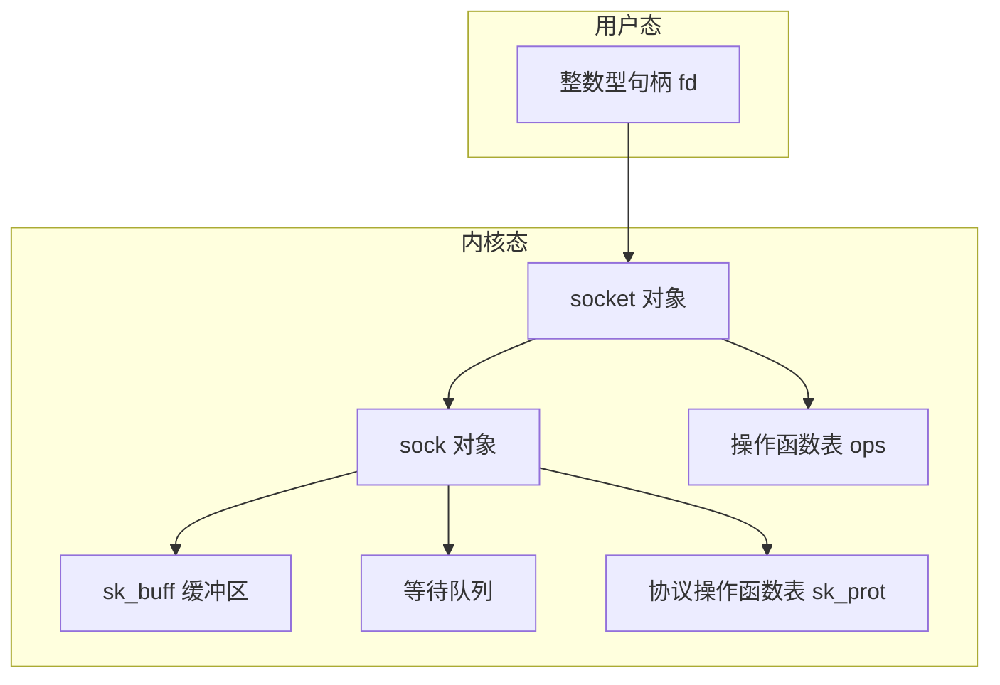
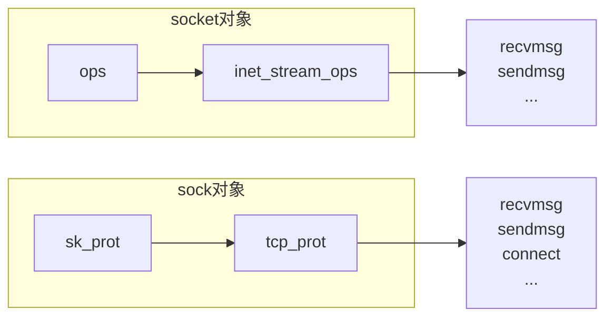
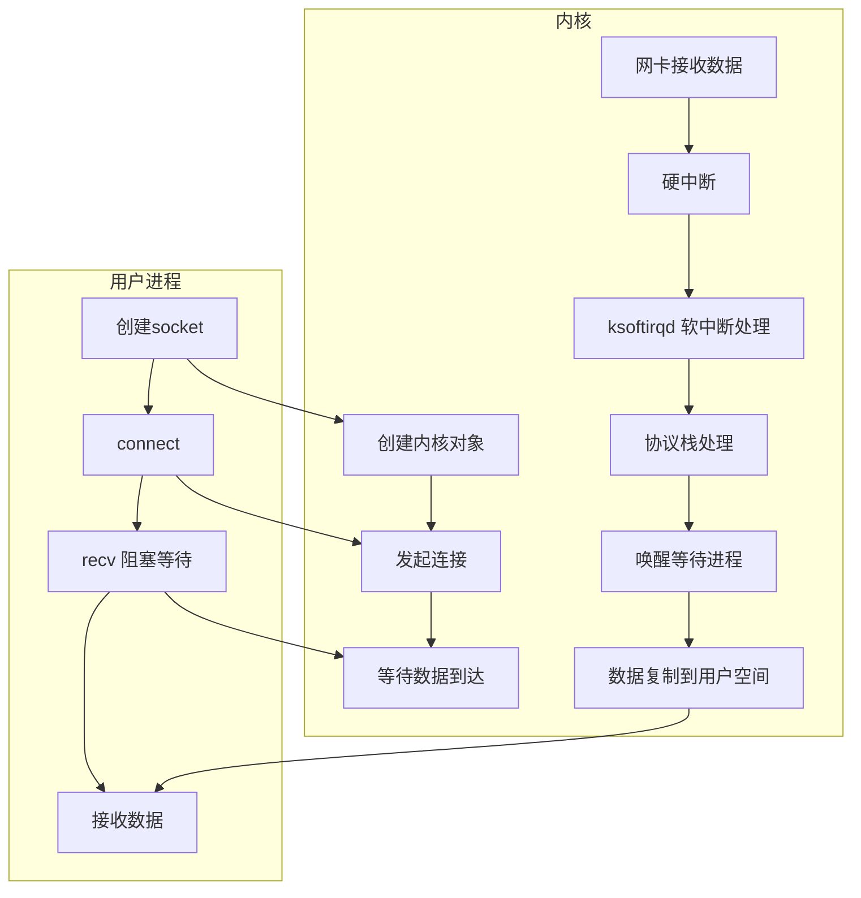
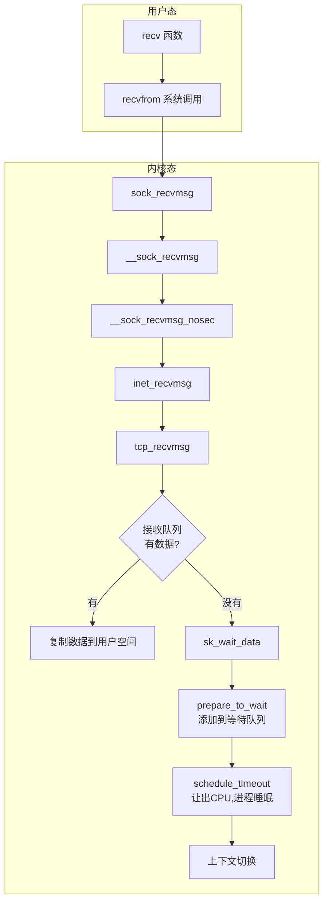
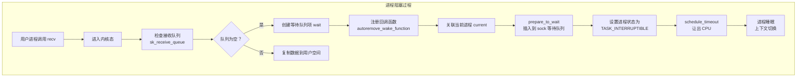

# 第三章 内核是如何与用户进程协作的

## 3.1 相关实际问题

通过前面的内容我们可以看到，对于数据包的接收，内核需要进行非常复杂的工作。而且在数据接收完成之后，后面还需要将数据复制到用户空间的内存中。如果用户进程当前是阻塞的话，还需要唤醒它，又是一次上下文切换的开销。

那么有没有办法让用户进程能绕开内核协议栈，自己直接从网卡接收数据的方法呢？如果这样可行，那繁杂的内核协议栈处理，内核态到用户态内存拷贝开销，唤醒用户进程等开销就可以省掉了。确实有，[[DPDK]] 就是其中的一种。所以很多时候你对新技术不够了解，往往原因是因为你对老技术没有真正理解透彻。

在本章中，我们详细分析了网络包是如何从网卡中一步一步地到达内核协议栈的。通过对源码的详细了解，我们也彻底弄清楚了多任务队列网卡、[[RingBuffer]]、硬中断、软中断等概念。也明白了该如何查看内核在接收网络包时的 CPU 开销。

理解了这些以后，你将能得到一幅"地图"。在这个"地图"上你能找到你之前听说过的各个技术点的正确的位置，例如 `tcpdump`、`netfilter` 等等。有了它，你再看各个技术点的前后依赖关系也理解的更清晰。相当于你以前只看到了单个点，只能见树，这次终于可以看见林了。

不过我们今天的文章数据只到了协议栈，还没有达到用户进程中，下一章我们继续深入分析！

> [!INFO]
> 在知识星球中我们会进行内核等底层技术的视频讲解，能让你的底层学起来更快，事半功倍。还会进行线上问题排查以及性能优化等方面的案例分享和交流。对大家技术深度和广度的积累很有好处。有想继续加入知识星球的同学微信扫描下面的二维码即可加入。另外在公众号后台发送「星球优惠券」可以获取开发内功修炼读者的专属优惠券。

## 3.1 相关实际问题（续）

在上⼀章中，我们讲述了网络包是如何从网卡被送到协议栈的。接下来内核还有一项重要的工作，就是在协议栈接收处理完输入包以后，要能通知到用户进程，让用户进程能够收到并处理这些数据。进程和内核配合有很多种方式，本章中只深入分析两种典型的。

**第一种**是**同步阻塞**的方法（在 Java 中习惯叫 [[BIO]]），一般都是在客户端下使用。它的优点是使用起来非常的方便，非常符合人的思维方式，但缺点就是性能较差。典型的用户进程代码如下。

```c
int main()
{
  int sk = socket(AF_INET, SOCK_STREAM, 0);
  connect(sk, ...)
  recv(sk, ...)
}
```

**第二种**是**多路 IO 复用**的方案，这种方案在服务器端用的比较多。Linux 上多路复用方案有 `select`、`poll`、`epoll`，它们三个中 `epoll` 的性能表现是最优秀的。在本章中我们只分析 `epoll`（Java 中对应 [[NIO]]），一段使用 `epoll` 典型的 C 代码如下。

```c
int main(){
    listen(lfd, ...);
    cfd1 = accept(...);
    cfd2 = accept(...);
    efd = epoll_create(...);
    epoll_ctl(efd, EPOLL_CTL_ADD, cfd1, ...);
    epoll_ctl(efd, EPOLL_CTL_ADD, cfd2, ...);
    epoll_wait(efd, ...)
}
```

无论是这两种方案中的哪一种，内核都能在接收到数据的时候和用户进程协作，通知用户进程进行下一步处理。但是在高并发情况下的性能上，同步阻塞的 IO 方式比较差，`epoll` 的表现较好。具体原因是为什么，在本章中我们将进入深入的分析。学习完本章以后，你将深刻地理解以下几个工作实践中的问题：

1. **阻塞到底是怎么一回事？**
   网络开发模型中，经常会遇到阻塞和非阻塞的概念。更要命的是还有人经常把这两个概念和同步、异步给放到一起。让本来就理解的不是很清楚的概念更是变得一团浆糊。通过本章对源码的分析，你将深刻理解阻塞到底是怎么一回事。

2. **同步阻塞 IO 都需要哪些开销**
   都说同步阻塞 IO 性能差，我觉得这个说法太笼统。我们应该更深入地了解到这种方式下都需要哪些 CPU 开销，而不是只简单地说差。

3. **多路复用为啥就能提高网络性能了？**
   多路复用的概念在网络编程里非常重要，但可惜很多同学对它理解的不够彻底。比如为什么 `epoll` 就比同步阻塞的 IO 模型性能要好？可能有的同学能隐隐约约知道内部的一个红黑树，但其实这仍然也不是 `epoll` 性能优越的根本原因。

4. **epoll 也是阻塞的？**
   很多同学以为只要一提到阻塞，就是性能差。当听说 `epoll` 也是可能会阻塞进程的以后，感觉诧异，阻塞咋还能性能高？这都是对 `epoll` 理解不深造成的，本书将会深度拆解 `epoll` 的工作原理，`epoll` 的阻塞并不影响它高性能。

5. **为什么 Redis 的网络性能很突出**
   大家平时除了写代码，也会用到很多开源组件。在这些开源组件中，[[Redis]] 的性能表现非常的亮眼。那么它性能优异的秘诀究竟在哪儿？我们在开发自己接口的时候是否有可以学习它们的点。

## 3.2 socket 的直接创建

在开始介绍网络 IO 模型之前，我们需要具备一个前提知识，那就是 [[socket]] 是如何在内核中表示的。在后面分析阻塞或者 `epoll` 的时候，我们需要不定时来回顾 `socket` 的内核结构。

从开发者的角度来看，我们调用 `socket` 函数可以创建一个 `socket`。

```c
int main()
{
  int sk = socket(AF_INET, SOCK_STREAM, 0);
  ...
}
```

等这个 `socket` 函数调用执行完以后，用户层面看到返回的是一个整数型的句柄。但其实内核在内部创建了一系列的 `socket` 相关的内核对象（是的，不是只有一个）。它们互相之间的关系如图 3.1。当然了，这个对象比图示的还要更复杂。我只在图中把关键内容展现了出来。



**图3.1 socket 内核结构**

我们来翻翻源码，看下上面的结构是如何被创造出来的。

`sock_create` 是创建 `socket` 的主要位置。其中 `sock_create` 又调用了 `__sock_create`。

```c
//file:net/socket.c
SYSCALL_DEFINE3(socket, int, family, int, type, int, protocol)
{
  ......
  retval = sock_create(family, type, protocol, &sock);
}
```

```c
//file:net/socket.c
int __sock_create(struct net *net, int family, ...)
{
  struct socket *sock;
  const struct net_proto_family *pf;
  ......
  //分配 socket 对象
  sock = sock_alloc();
  
  //获得每个协议族的操作表
  pf = rcu_dereference(net_families[family]);
  
  //调用每个协议族的创建函数,对于 AF_INET 对应的是 inet_create
  err = pf->create(net, sock, protocol, kern);
}
```

在 `__sock_create` 里，首先调用 `sock_alloc` 来分配一个 `struct sock` 内核对象。接着获取协议族的操作函数表，并调用其 `create` 方法。对于 `AF_INET` 协议族来说，执行到的是 `inet_create` 方法。

在 `inet_create` 中，根据类型 `SOCK_STREAM` 查找到对于 tcp 定义的操作方法实现集合 `inet_stream_ops` 和 `tcp_prot`。并把它们分别设置到 `socket->ops` 和 `sock->sk_prot` 上，如图 3.2。

```c
//file:net/ipv4/af_inet.c
static int inet_create(struct net *net, struct socket *sock, int protocol,
           int kern)
{
  struct sock *sk;
  
  //查找对应的协议,对于TCP SOCK_STREAM 就是获取到了
  //static struct inet_protosw inetsw_array[] =
  //{
  //    {
  //      .type =       SOCK_STREAM,
  //      .protocol =   IPPROTO_TCP,
  //      .prot =       &tcp_prot,
  //      .ops =        &inet_stream_ops,
  //      .no_check =   0,
  //      .flags =      INET_PROTOSW_PERMANENT |
  //              INET_PROTOSW_ICSK,
  //    },
  //}
  list_for_each_entry_rcu(answer, &inetsw[sock->type], list) {
  
  //将 inet_stream_ops 赋到 socket->ops 上 
  sock->ops = answer->ops;
  
  //获得 tcp_prot
  answer_prot = answer->prot;
  
  //分配 sock 对象,并把 tcp_prot 赋到 sock->sk_prot 上
  sk = sk_alloc(net, PF_INET, GFP_KERNEL, answer_prot);
  
  //对 sock 对象进行初始化
  sock_init_data(sock, sk);
}
```



**图3.2 socket ops 方法**

我们再往下看到 `sock_init_data`。在这个方法中将 `sock` 中的 `sk_data_ready` 函数指针进行了初始化，设置为默认 `sock_def_readable`，如图 3.3。

```c
//file: net/core/sock.c
void sock_init_data(struct socket *sock, struct sock *sk) 
{
    sk->sk_data_ready   =   sock_def_readable;
    sk->sk_write_space  =   sock_def_write_space;
    sk->sk_error_report =   sock_def_error_report;
}
```

**图3.3 sk_data_ready 初始化**

当软中断上收到数据包时会通过调用 `sk_data_ready` 函数指针（实际被设置成了 `sock_def_readable()`）来唤醒在 `sock` 上等待的进程。这个咱们后面介绍软中断的时候再说，这里记住这个就行了。

至此，一个 tcp 对象，确切地说是 `AF_INET` 协议族下 `SOCK_STREAM` 对象就算是创建完成了。这里花费了一次 `socket` 系统调用的开销。

## 3.3 内核和用户进程协作之阻塞方式

本章开头的时候我们说过同步阻塞的网络 IO（在 Java 中习惯叫 [[BIO]]）的优点是使用起来非常方便，但是缺点就是性能非常的差。俗话说得好，知己知彼方能百战百胜。我们今天来深入分析同步阻塞网络 IO 的内部实现。



**图3.4 同步阻塞工作流程**

在同步阻塞 IO 模型中，虽然用户进程里在最简单的情况下只两三行代码，但实际上用户进程和内核配合做了非常多的工。先是用户进程发起创建 socket 的指令，然后切换到内核态完成了内核对象的初始化。接下来 Linux 在数据包的接收上，是硬中断和 `ksoftirqd` 进程在进行处理。当 `ksoftirqd` 进程处理完以后，再通知到相关的用户进程。

从用户进程创建 socket，到一个网络包抵达网卡到被用户进程接收到，同步阻塞 IO 总体上的流程如图 3.4。

我们今天用图解加源码分析的方式来详细拆解一下上面的每一个步骤，来看一下在内核里是它们是怎么实现的。阅读完本文，你将深刻地理解在同步阻塞的网络 IO 性能低下的原因！

### 3.3.1 等待接收消息

接着我们来看 `recv` 函数依赖的底层实现。首先通过 `strace` 命令跟踪，可以看到 clib 库函数 `recv` 会执行到 `recvfrom` 系统调用。

进入系统调用后，用户进程就进入到了内核态，通过执行一系列的内核协议层函数，然后到 socket 对象的接收队列中查看是否有数据，没有的话就把自己添加到 socket 对应的等待队列里。最后让出 CPU，操作系统会选择下一个就绪状态的进程来执行。整个流程如图 3.5。



**图3.5 recvfrom 系统调用**

看完了整个流程图，接下来让我们根据源码来看更详细的细节。其中我们今天要关注的重点是 `recvfrom` 最后是怎么把自己的进程给阻塞掉的（假如我们没有使用 `O_NONBLOCK` 标记）。

```c
//file: net/socket.c
SYSCALL_DEFINE6(recvfrom, int, fd, void __user *, ubuf, size_t, size,
    unsigned int, flags, struct sockaddr __user *, addr,
    int __user *, addr_len)
{
  struct socket *sock;
  //根据用户传入的 fd 找到 socket 对象
  sock = sockfd_lookup_light(fd, &err, &fput_needed);
  ......
  err = sock_recvmsg(sock, &msg, size, flags);
  ......
}
```

调用链：`sock_recvmsg ==> __sock_recvmsg => __sock_recvmsg_nosec`

调用 socket 对象 `ops` 里的 `recvmsg`，回忆我们上面的 socket 对象图，从图中可以看到 `recvmsg` 指向的是 `inet_recvmsg` 方法。

```c
static inline int __sock_recvmsg_nosec(struct kiocb *iocb, struct socket *sock,
               struct msghdr *msg, size_t size, int flags)
{
  ......
  return sock->ops->recvmsg(iocb, sock, msg, size, flags);
}
```

```c
//file: net/ipv4/af_inet.c
int inet_recvmsg(struct kiocb *iocb, struct socket *sock, struct msghdr *msg,
     size_t size, int flags)
{
  ...
  err = sk->sk_prot->recvmsg(iocb, sk, msg, size, flags & MSG_DONTWAIT,
           flags & ~MSG_DONTWAIT, &addr_len);
```

这里又遇到一个函数指针，这次调用的是 socket 对象里的 `sk_prot` 下面的 `recvmsg` 方法。同上，得出这个 `recvmsg` 方法对应的是 `tcp_recvmsg` 方法。

终于看到了我们想要看的东西，`skb_queue_walk` 是在访问 `sock` 对象下面的接收队列了，如图 3.7。

```c
//file: net/ipv4/tcp.c
int tcp_recvmsg(struct kiocb *iocb, struct sock *sk, struct msghdr *msg,
    size_t len, int nonblock, int flags, int *addr_len)
{
  int copied = 0;
  ...
  do {
    //遍历接收队列接收数据
    skb_queue_walk(&sk->sk_receive_queue, skb) {
      ...
    }
    ...
  }
  if (copied >= target) {
    release_sock(sk);
    lock_sock(sk);
  } else //没有收到足够数据,启用 sk_wait_data 阻塞当前进程
    sk_wait_data(sk, &timeo);
}
```

**图3.7 接收队列读取**

如果没有收到数据，或者收不到足够多，则调用 `sk_wait_data` 把当前进程阻塞掉。

我们再来详细看下 `sk_wait_data` 是怎么把当前进程给阻塞掉的，如图 3.8。

```c
//file: net/core/sock.c
int sk_wait_data(struct sock *sk, long *timeo)
{
  //当前进程(current)关联到所定义的等待队列项上
  DEFINE_WAIT(wait);
  
  // 调用 sk_sleep 获取 sock 对象下的 wait
  // 并准备挂起,将进程状态设置为可打断 INTERRUPTIBLE
  prepare_to_wait(sk_sleep(sk), &wait, T```c
  set_bit(SOCK_ASYNC_WAITDATA, &sk->sk_socket->flags);
  
  // 通过调用 schedule_timeout 让出 CPU，然后进行睡眠
  rc = sk_wait_event(sk, timeo, !skb_queue_empty(&sk->sk_receive_queue));
  ...
}
```

首先在 `DEFINE_WAIT` 宏下,定义了一个等待队列项 `wait`.在这个新的等待队列项上,注册了回调函数 `autoremove_wake_function`,并把当前进程描述符 `current` 关联到其 `.private` 成员上.

```c
//file: include/linux/wait.h
#define DEFINE_WAIT(name) DEFINE_WAIT_FUNC(name, autoremove_wake_function)

#define DEFINE_WAIT_FUNC(name, function)        \
  wait_queue_t name = {           \
    .private  = current,        \
    .func   = function,       \
    .task_list  = LIST_HEAD_INIT((name).task_list), \
  }
```

紧接着在 `sk_wait_data` 中调用 `sk_sleep` 获取 `sock` 对象下的等待队列列表头 `wait_queue_head_t`.`sk_sleep` 源代码如下:

```c
//file: include/net/sock.h
static inline wait_queue_head_t *sk_sleep(struct sock *sk)
{
  BUILD_BUG_ON(offsetof(struct socket_wq, wait) != 0);
  return &rcu_dereference_raw(sk->sk_wq)->wait;
}
```

接着调用 `prepare_to_wait` 来把新定义的等待队列项 `wait` 插入到 `sock` 对象的等待队列下.

```c
//file: kernel/wait.c
void prepare_to_wait(wait_queue_head_t *q, wait_queue_t *wait, int state)
{
  unsigned long flags;
  wait->flags &= ~WQ_FLAG_EXCLUSIVE;
  spin_lock_irqsave(&q->lock, flags);
  if (list_empty(&wait->task_list))
    __add_wait_queue(q, wait);
  set_current_state(state);
  spin_unlock_irqrestore(&q->lock, flags);
}
```

这样后面当内核收完数据产生就绪事件的时候,就可以查找 socket 等待队列上的等待项,进而就可以找到回调函数和在等待该 socket 就绪事件的进程了.

最后再调用 `sk_wait_event` 让出 CPU,进程将进入睡眠状态,这会导致一次进程上下文的开销,而这个开销是昂贵的,大约需要消耗几个微秒的 CPU 时间.

接下来的小节里我们将能看到进程是如何被唤醒的了.



**图3.8 进程阻塞**

### 3.3.2 数据到来时的唤醒

当网络数据包到达网卡后,经过硬中断、软中断(ksoftirqd 进程处理)等步骤,最终将数据放入 socket 的接收队列中.接下来软中断会调用 `sk_data_ready` 函数指针来唤醒在 socket 上等待的进程.

回忆我们之前在 `sock_init_data` 中的设置,`sk_data_ready` 被初始化为 `sock_def_readable`.

```c
//file: net/core/sock.c
void sock_init_data(struct socket *sock, struct sock *sk) 
{
    sk->sk_data_ready   =   sock_def_readable;
    ...
}
```

`sk_data_ready` 的调用链如下:

```c
// 软中断处理完数据后调用
// 实际调用的是 sock_def_readable
sk->sk_data_ready(sk);

//file: net/core/sock.c
static void sock_def_readable(struct sock *sk)
{
    struct socket_wq *wq;
    
    rcu_read_lock();
    wq = rcu_dereference(sk->sk_wq);
    if (wq_has_sleeper(wq))
        wake_up_interruptible_sync_poll(&wq->wait, POLLIN | POLLRDNORM);
    sk_wake_async(sk, SOCK_WAKE_WAITD, POLL_IN);
    rcu_read_unlock();
}
```

`wake_up_interruptible_sync_poll` 会遍历 socket 等待队列上的所有等待项,并调用它们的回调函数 `autoremove_wake_function`.这个函数会将进程状态设置为 `TASK_RUNNING`,并将进程从等待队列中移除.


**图3.9 软中断接收数据过程**

> [!NOTE]
> 同步阻塞 IO 的性能开销主要来自:
> 1. **系统调用开销**:每次 `recv` 都需要从用户态切换到内核态
> 2. **上下文切换开销**:进程阻塞时让出 CPU,数据到达时又被唤醒,每次都需要上下文切换
> 3. **多次系统调用**:每个连接都需要独立的线程/进程来处理,在高并发场景下线程数量巨大

这正是为什么在高并发场景下,我们需要引入多路 IO 复用(如 `epoll`)的原因.下一节我们将深入分析 `epoll` 的实现机制.

# 3. 第三章 内核是如何与用户进程协作的

## 3.3.2 软中断模块

接着我们再转换一下视角,来看负责接收和处理数据包的软中断这边.前文看到了关于网络包到网卡后是怎么被网卡接收,最后在交由软中断处理的.我们今天直接从 tcp 协议的接收函数 `tcp_v4_rcv` 看起,总体接收流程见图 3.9.

软中断(也就是 Linux 里的 **ksoftirqd** 进程)里收到数据包以后,发现是 tcp 的包的话就会执行到 `tcp_v4_rcv` 函数.接着走,如果是 **ESTABLISH** 状态下的数据包,则最终会把数据拆出来放到对应 socket 的接收队列中.然后调用 `sk_data_ready` 来唤醒用户进程.

我们看更详细一点的代码:

```c
// file: net/ipv4/tcp_ipv4.c
int tcp_v4_rcv(struct sk_buff *skb)
{
  ......
  th = tcp_hdr(skb); //获取tcp header
```

在 `tcp_v4_rcv` 中首先根据收到的网络包的 header 里的 source 和 dest 信息来在本机上查询对应的 socket.找到以后,我们直接进入接收的主体函数 `tcp_v4_do_rcv` 来看.

我们假设处理的是 ESTABLISH 状态下的包,这样就又进入 `tcp_rcv_established` 函数中进行处理.

```c
  iph = ip_hdr(skb); //获取ip header
  //根据数据包 header 中的 ip、端口信息查找到对应的socket
  sk = __inet_lookup_skb(&tcp_hashinfo, skb, th->source, th->dest);
  ......
  //socket 未被用户锁定
  if (!sock_owned_by_user(sk)) {
    {
      if (!tcp_prequeue(sk, skb))
        ret = tcp_v4_do_rcv(sk, skb);
    }
  }
}

//file: net/ipv4/tcp_ipv4.c
int tcp_v4_do_rcv(struct sock *sk, struct sk_buff *skb)
{
  if (sk->sk_state == TCP_ESTABLISHED) { 
    //执行连接状态下的数据处理
    if (tcp_rcv_established(sk, skb, tcp_hdr(skb), skb->len)) {
      rsk = sk;
      goto reset;
    }
    return 0;
  }
  //其它非 ESTABLISH 状态的数据包处理
  ......
}
```


在 `tcp_rcv_established` 中通过调用 `tcp_queue_rcv` 函数中完成了将接收数据放到 socket 的接收队列上,如图 3.10.

如下源码所示:

```c
//file: net/ipv4/tcp_input.c
int tcp_rcv_established(struct sock *sk, struct sk_buff *skb,
      const struct tcphdr *th, unsigned int len)
{
  ......
  //接收数据到队列中
  eaten = tcp_queue_rcv(sk, skb, tcp_header_len,
                   &fragstolen);
  //数据 ready，唤醒 socket 上阻塞掉的进程
  sk->sk_data_ready(sk, 0);
}

//file: net/ipv4/tcp_input.c
static int __must_check tcp_queue_rcv(struct sock *sk, struct sk_buff *skb, int hdrlen,
      bool *fragstolen)
{
  //把接收到的数据放到 socket 的接收队列的尾部
  if (!eaten) {
    __skb_queue_tail(&sk->sk_receive_queue, skb);
    skb_set_owner_r(skb, sk);
  }
  return eaten;
}
```


调用 `tcp_queue_rcv` 接收完成之后,接着再调用 `sk_data_ready` 来唤醒在 socket 上等待的用户进程.这又是一个函数指针.回想在 3.2 socket 的直接创建小节中,在创建 socket 流程里执行到的 `sock_init_data` 函数里已经把 `sk_data_ready` 设置成 `sock_def_readable` 函数了.它是默认的数据就绪处理函数.

在 `sock_def_readable` 中再一次访问到了 `sock->sk_wq` 下的 wait.回忆下我们前面调用 `recvfrom` 执行的最后,通过 `DEFINE_WAIT(wait)` 将当前进程关联的等待队列添加到 `sock->sk_wq` 下的 wait 里了.

那接下来就是调用 `wake_up_interruptible_sync_poll` 来唤醒在 socket 上因为等待数据而被阻塞掉的进程了,如图 3.11.

```c
//file: net/core/sock.c
static void sock_def_readable(struct sock *sk, int len)
{
  struct socket_wq *wq;
  rcu_read_lock();
  wq = rcu_dereference(sk->sk_wq);
  //有进程在此 socket 的等待队列
  if (wq_has_sleeper(wq))
    //唤醒等待队列上的进程
    wake_up_interruptible_sync_poll(&wq->wait, POLLIN | POLLPRI |
            POLLRDNORM | POLLRDBAND);
  sk_wake_async(sk, SOCK_WAKE_WAITD, POLL_IN);
  rcu_read_unlock();
}
```

`__wake_up_common` 实现唤醒.这里注意下,该函数调用的参数 `nr_exclusive` 传入的是 1,这里指的是即使是有多个进程都阻塞在同一个 socket 上,也只唤醒 1 个进程.其作用是为了避免**惊群**.

在 `__wake_up_common` 中找出一个等待队列项 `curr`,然后调用其 `curr->func`.回忆我们前面在 recv 函数执行的时候,使用 `DEFINE_WAIT()` 定义等待队列项的细节,内核把 `curr->func` 设置成了 `autoremove_wake_function`.

```c
//file: include/linux/wait.h
#define wake_up_interruptible_sync_poll(x, m)       \
  __wake_up_sync_key((x), TASK_INTERRUPTIBLE, 1, (void *) (m))

//file: kernel/sched/core.c
void __wake_up_sync_key(wait_queue_head_t *q, unsigned int mode,
      int nr_exclusive, void *key)
{
  unsigned long flags;
  int wake_flags = WF_SYNC;
  if (unlikely(!q))
    return;
  if (unlikely(!nr_exclusive))
    wake_flags = 0;
  spin_lock_irqsave(&q->lock, flags);
  __wake_up_common(q, mode, nr_exclusive, wake_flags, key);
  spin_unlock_irqrestore(&q->lock, flags);
}

//file: kernel/sched/core.c
static void __wake_up_common(wait_queue_head_t *q, unsigned int mode,
      int nr_exclusive, int wake_flags, void *key)
{
  wait_queue_t *curr, *next;
  list_for_each_entry_safe(curr, next, &q->task_list, task_list) {
    unsigned flags = curr->flags;
    if (curr->func(curr, mode, wake_flags, key) &&
        (flags & WQ_FLAG_EXCLUSIVE) && !--nr_exclusive)
      break;
  }
}
```

在 `autoremove_wake_function` 中,调用了 `default_wake_function`.

调用 `try_to_wake_up` 时传入的 `task_struct` 是 `curr->private`.这个就是当时因为等待而被阻塞的进程项.当这个函数执行完的时候,在 socket 上等待而被阻塞的进程就被推入到可运行队列里了,这又将是一次进程上下文切换的开销.

## 3.3.3 同步阻塞总结

好了,我们把上面的流程总结一下.内核在通知网络包的运行环境分两部分:

**第一部分**是我们自己代码所在的进程,我们调用的 `socket()` 函数会进入内核态创建必要内核对象.`recv()` 函数在进入内核态以后负责查看接收队列,以及在没有数据可处理的时候把当前进程阻塞掉,让出 CPU.

**第二部分**是硬中断、软中断上下文(系统进程 **ksoftirqd**).在这些组件中,将包处理完后会放到 socket 的接收队列中.然后再根据 socket 内核对象找到其等待队列中正在因为等待而被阻塞掉的进程,然后把它唤醒.

```c
//file: include/linux/wait.h
#define DEFINE_WAIT(name) DEFINE_WAIT_FUNC(name, autoremove_wake_function)
#define DEFINE_WAIT_FUNC(name, function)        \
  wait_queue_t name = {           \
    .private  = current,        \
    .func   = function,       \
    .task_list  = LIST_HEAD_INIT((name).task_list), \
  }

//file: kernel/sched/core.c
int default_wake_function(wait_queue_t *curr, unsigned mode, int wake_flags,
        void *key)
{
  return try_to_wake_up(curr->private, mode, wake_flags);
}
```


同步阻塞总体流程如图 3.12.每次一个进程专门为了等一个 socket 上的数据就得被从 CPU 上拿下来.然后再换上另一个进程.等到数据 ready 了,睡眠的进程又会被唤醒.总共两次进程上下文切换开销,根据业界的测试来看,每一次切换大约是 **3-5 us**(微秒)左右,不同的服务器上会有一点出入,但上下不会浮动太大.


要知道从开发者角度来看,进程上下文切换其实是没有在做有意义的工作的.如果是网络 IO 密集型的应用的话,CPU 就被迫不停地做进程切换这种无用功.

这种模式在客户端角色上,现在还存在于使用的情形.因为你的进程可能确实得等 Mysql 的数据返回成功之后,才能渲染页面返回给用户,否则啥也干不了.

> [!NOTE] 角色 vs 机器
> 注意一下,我说的是**角色**,不是具体的机器.例如对于你的 php/java/golang 接口机,你接收用户请求的时候,你是**服务端**角色.但当你再请求 redis 的时候,就变为**客户端**角色了.

不过现在有一些封装的很好的网络框架例如 **Sogou Workflow**,Golang 的 net 包等在网络客户端角色上也早已摒弃了这种低效的模式!

在服务端角色上,这种模式完全没办法使用.因为这种简单模型里的 socket 和进程是**一对一**的.我们现在要在单台机器上承载成千上万,甚至十几、上百万的用户连接请求.如果用上面的方式,那就得为每个用户请求都创建一个进程.相信你在无论多原始的服务器网络编程里,都没见过有人这么干吧.

如果让我给它起一个名字的话,它就叫**单路不复用**(飞哥自创名词).那么有没有更高效的网络 IO 模型呢?当然有,那就是你所熟知的 **select、poll 和 epoll**了.下节飞哥再开始拆解 epoll 的实现!

---

在知识星球中我们会进行内核等底层技术的视频串讲,还会进行线上问题排查以及性能优化等方面的交流.对大家技术深度和广度的积累很有好处.有想继续加入知识星球的同学微信扫描下面的二维码即可加入.另外在公众号后台发送「星球优惠券」可以获取开发内功修炼读者的专属优惠券.

---

## 3.4 内核和用户进程协作之 epoll

在上一节的 recvfrom 中,我们看到用户进程为了等待一个 socket 就得被阻塞掉.进程在 Linux 上是一个开销不小的家伙,先不说创建,光是上下文切换一次就得几个微秒.所以为了高效地对海量用户提供服务,必须要让一个进程能同时处理很多个 tcp 连接才行.现在假设一个进程保持了 10000 条连接,那么如何发现哪条连接上有数据可读了、哪条连接可写了?

一种方法是我们可以采用**循环遍历**的方式来发现 IO 事件,以非阻塞的方式 for 循环遍历查看所有的 socket.但这种方式太低级了,我们希望有一种更高效的机制,在很多连接中的某条上有 IO 事件发生的时候直接快速把它找出来.其实这个事情 Linux 操作系统已经替我们都做好了,它就是我们所熟知的 **IO 多路复用机制**.这里的复用指的就是对进程的复用.

在 Linux 上多路复用方案有 **select、poll、epoll**.它们三个中 epoll 的性能表现是最优秀的,能支持的并发量也最大.所以我们把 epoll 作为要拆解的对象,深入揭秘内核是如何实现多路的 IO 管理的.

为了方便讨论,还是把 epoll 的简单示例搬出来(只是个例子,实践中不这么写):

```c
int main(){
    listen(lfd, ...);
    cfd1 = accept(...);
    cfd2 = accept(...);
    efd = epoll_create(...);
    epoll_ctl(efd, EPOLL_CTL_ADD, cfd1, ...);
    epoll_ctl(efd, EPOLL_CTL_ADD, cfd2, ...);
    epoll_wait(efd, ...)
}
```


其中和 epoll 相关的函数是如下三个:

- **epoll_create**:创建一个 epoll 对象
- **epoll_ctl**:向 epoll 对象中添加要管理的连接
- **epoll_wait**:等待其管理的连接上的 IO 事件

借助这个 demo,我们来展开对 epoll 原理的深度拆解.相信等你理解了本节内容以后,你对 epoll 的驾驭能力将变得炉火纯青!!

### 3.4.1 epoll 内核对象的创建

在用户进程调用 `epoll_create` 时,内核会创建一个 `struct eventpoll` 的内核对象.并同样把它关联到当前进程的已打开文件列表中,如图 3.14.

对于 `struct eventpoll` 对象,更详细的结构如下图 3.15(同样只列出和今天主题相关的成员).


`epoll_create` 的源代码相对比较简单.在 `fs/eventpoll.c` 下.

`struct eventpoll` 的定义也在这个源文件中:

```c
// file：fs/eventpoll.c
SYSCALL_DEFINE1(epoll_create1, int, flags)
{
    struct eventpoll *ep = NULL;
    //创建一个 eventpoll 对象
    error = ep_alloc(&ep);
}
```

```c
// file：fs/eventpoll.c
struct eventpoll {
    //sys_epoll_wait用到的等待队列
    wait_queue_head_t wq;
    //接收就绪的描述符都会放到这里
    struct list_head rdllist;
    //每个epoll对象中都有一颗红黑树
    struct rb_root rbr;
    ......
}
```

`eventpoll` 这个结构体中的几个成员的含义如下:

- **wq**:等待队列链表.软中断数据就绪的时候会通过 `wq` 来找到阻塞在 epoll 对象上的用户进程.
- **rbr**:一棵**红黑树**.为了支持对海量连接的高效查找、插入和删除,eventpoll 内部使用了一棵红黑树.通过这棵树来管理用户进程下添加进来的所有 socket 连接.
- **rdllist**:就绪的描述符的链表.当有连接就绪的时候,内核会把就绪的连接放到 `rdllist` 链表里.这样应用进程只需要判断链表就能找出就绪进程,而不用去遍历整棵树.

当然这个结构被申请完之后,需要做一点点的初始化工作,这都在 `ep_alloc` 中完成.

说到这儿,这些成员其实只是刚被定义或初始化了,都还没有被使用.它们会在下面被用到.

# 4. 第三章 内核是如何与用户进程协作的

## 3.4.2 为 epoll 添加 socket

理解这一步是理解整个 epoll 的关键.  
为了简单,我们只考虑使用 `EPOLL_CTL_ADD` 添加 socket,先忽略删除和更新.

假设我们现在和客户端们的多个连接的 socket 都创建好了,也创建好了 epoll 内核对象.在使用 `epoll_ctl` 注册每一个 socket 的时候,内核会做如下三件事情:

1. 分配一个红黑树节点对象 epitem
2. 添加等待事件到 socket 的等待队列中,其回调函数是 `ep_poll_callback`
3. 将 epitem 插入到 epoll 对象的红黑树里

通过 `epoll_ctl` 添加两个 socket 以后,这些内核数据结构最终在进程中的关系图大致如下图 3.16.

```c
//file: fs/eventpoll.c
static int ep_alloc(struct eventpoll **pep)
{
    struct eventpoll *ep;
    //申请 eventpoll 内存
    ep = kzalloc(sizeof(*ep), GFP_KERNEL);
    //初始化等待队列头
    init_waitqueue_head(&ep->wq);
    //初始化就绪列表
    INIT_LIST_HEAD(&ep->rdllist);
    //初始化红黑树指针
    ep->rbr = RB_ROOT;
    ......
}
```

**图3.16 为 epoll 添加两个 socket 的进程**

> [!TIP] 核心思想  
> 每个 socket 注册时都会创建一个 epitem 节点,插入到 epoll 的红黑树中,同时为 socket 的等待队列注册回调函数 `ep_poll_callback`.

我们来详细看看 socket 是如何添加到 epoll 对象里的,找到 `epoll_ctl` 的源码.

```c
// file：fs/eventpoll.c
SYSCALL_DEFINE4(epoll_ctl, int, epfd, int, op, int, fd,
        struct epoll_event __user *, event)
{
    struct eventpoll *ep;
    struct file *file, *tfile;
    //根据 epfd 找到 eventpoll 内核对象
    file = fget(epfd);
    ep = file->private_data;
    //根据 socket 句柄号， 找到其 file 内核对象
    tfile = fget(fd);
    switch (op) {
    case EPOLL_CTL_ADD:
        if (!epi) {
            epds.events |= POLLERR | POLLHUP;
            error = ep_insert(ep, &epds, tfile, fd);
        } else
            error = -EEXIST;
        clear_tfile_check_list();
        break;
    }
}
```

在 `epoll_ctl` 中首先根据传入 fd 找到 eventpoll、socket 相关的内核对象.对于 `EPOLL_CTL_ADD` 操作来说,会然后执行到 `ep_insert` 函数.所有的注册都是在这个函数中完成的.

### 分配并初始化 epitem

对于每一个 socket,调用 `epoll_ctl` 的时候,都会为之分配一个 epitem.该结构的主要数据如下:

```c
//file: fs/eventpoll.c
static int ep_insert(struct eventpoll *ep, 
                struct epoll_event *event,
                struct file *tfile, int fd)
{
    //1 分配并初始化 epitem
    //分配一个epi对象
    struct epitem *epi;
    if (!(epi = kmem_cache_alloc(epi_cache, GFP_KERNEL)))
        return -ENOMEM;
    //对分配的epi进行初始化
    //epi->ffd中存了句柄号和struct file对象地址
    INIT_LIST_HEAD(&epi->pwqlist);
    epi->ep = ep;
    ep_set_ffd(&epi->ffd, tfile, fd);
    //2 设置 socket 等待队列
    //定义并初始化 ep_pqueue 对象
    struct ep_pqueue epq;
    epq.epi = epi;
    init_poll_funcptr(&epq.pt, ep_ptable_queue_proc);
    //调用 ep_ptable_queue_proc 注册回调函数 
    //实际注入的函数为 ep_poll_callback
    revents = ep_item_poll(epi, &epq.pt);
    ......
    //3 将epi插入到 eventpoll 对象中的红黑树中
    ep_rbtree_insert(ep, epi);
    ......
}
```

```c
//file: fs/eventpoll.c
struct epitem {
    //红黑树节点
    struct rb_node rbn;
    //socket文件描述符信息
    struct epoll_filefd ffd;
    //所归属的 eventpoll 对象
    struct eventpoll *ep;
    //等待队列
    struct list_head pwqlist;
}
```

**图3.17 epitem 初始化**

对 epitem 进行一些初始化,首先在 `epi->ep = ep` 这行代码中将其 ep 指针指向 eventpoll 对象.另外用要添加的 socket 的 file、fd 来填充 `epitem->ffd`.epitem 初始化后的关联关系如图 3.17.

其中使用到的 `ep_set_ffd` 函数如下:

```c
static inline void ep_set_ffd(struct epoll_filefd *ffd,
                        struct file *file, int fd)
{
    ffd->file = file;
    ffd->fd = fd;
}
```

### 设置 socket 等待队列

在创建 epitem 并初始化之后,`ep_insert` 中第二件事情就是设置 socket 对象上的等待任务队列.并把函数 `fs/eventpoll.c` 文件下的 `ep_poll_callback` 设置为数据就绪时候的回调函数,如图3.18.

**图3.18 设置 socket 等待队列**

这一块的源代码稍微有点绕,没有耐心的话直接跳到下面的**加粗字体**来看.首先来看 `ep_item_poll`.

```c
static inline unsigned int ep_item_poll(struct epitem *epi, poll_table *pt)
{
    pt->_key = epi->event.events;
    return epi->ffd.file->f_op->poll(epi->ffd.file, pt) & epi->event.events;
}
```

看,这里调用到了 socket 下的 `file->f_op->poll`.通过上面第一节的 socket 的结构图,我们知道这个函数实际上是 `sock_poll`.

```c
/* No kernel lock held - perfect */
static unsigned int sock_poll(struct file *file, poll_table *wait)
{
    ...
    return sock->ops->poll(file, sock, wait);
}
```

同样回看第一节里的 socket 的结构图,`sock->ops->poll` 其实指向的是 `tcp_poll`.

```c
//file: net/ipv4/tcp.c
unsigned int tcp_poll(struct file *file, struct socket *sock, poll_table *wait)
{
    struct sock *sk = sock->sk;
    sock_poll_wait(file, sk_sleep(sk), wait);
}
```

在 `sock_poll_wait` 的第二个参数传参前,先调用了 `sk_sleep` 函数.在这个函数里它获取了 sock 对象下的等待队列列表头 `wait_queue_head_t`,待会等待队列项就插入这里.这里稍微注意下,是 **socket 的等待队列**,不是 epoll 对象的.来看 `sk_sleep` 源码:

```c
//file: include/net/sock.h
static inline wait_queue_head_t *sk_sleep(struct sock *sk)
{
    BUILD_BUG_ON(offsetof(struct socket_wq, wait) != 0);
    return &rcu_dereference_raw(sk->sk_wq)->wait;
}
```

接着真正进入 `sock_poll_wait`.

```c
static inline void sock_poll_wait(struct file *filp,
        wait_queue_head_t *wait_address, poll_table *p)
{
    poll_wait(filp, wait_address, p);
}
```

这里的 `qproc` 是个函数指针,它在前面 `init_poll_funcptr` 调用时被设置成了 `ep_ptable_queue_proc` 函数.

```c
static inline void poll_wait(struct file * filp, wait_queue_head_t * wait_address, 
poll_table *p)
{
    if (p && p->_qproc && wait_address)
        p->_qproc(filp, wait_address, p);
}
```

```c
static int ep_insert(...)
{
    ...
    init_poll_funcptr(&epq.pt, ep_ptable_queue_proc);
    ...
}
```

```c
//file: include/linux/poll.h
static inline void init_poll_funcptr(poll_table *pt, 
    poll_queue_proc qproc)
{
    pt->_qproc = qproc;
    pt->_key   = ~0UL; /* all events enabled */
}
```

**敲黑板!!!注意,废了半天的劲,终于到了重点了!** 在 `ep_ptable_queue_proc` 函数中,新建了一个等待队列项,并注册其回调函数为 `ep_poll_callback` 函数.然后再将这个等待项添加到 socket 的等待队列中.

```c
//file: fs/eventpoll.c
static void ep_ptable_queue_proc(struct file *file, wait_queue_head_t *whead,
                 poll_table *pt)
{
    struct eppoll_entry *pwq;
    if (epi->nwait >= 0 && (pwq = kmem_cache_alloc(pwq_cache, GFP_KERNEL))) {
        //初始化回调方法
        init_waitqueue_func_entry(&pwq->wait, ep_poll_callback);
        //将ep_poll_callback放入socket的等待队列whead（注意不是epoll的等待队列）
        add_wait_queue(whead, &pwq->wait);
    }
}
```

> [!NOTE] 关键区别  
> 在第二章介绍阻塞式的系统调用 `recvfrom` 里,由于需要在数据就绪的时候唤醒用户进程,所以等待对象项的 `private`(这个变量名起的也是醉了)会设置成当前用户进程描述符 `current`.而我们的 socket 是交给 epoll 来管理的,不需要在一个 socket 就绪的时候就唤醒进程,所以这里的 `q->private` 没有啥卵用就设置成了 NULL.

```c
//file:include/linux/wait.h
static inline void init_waitqueue_func_entry(
    wait_queue_t *q, wait_queue_func_t func)
{
    q->flags = 0;
    q->private = NULL;
    //ep_poll_callback 注册到 wait_queue_t对象上
    //有数据到达的时候调用 q->func
    q->func = func;   
}
```

如上,等待队列项中仅仅只设置了回调函数 `q->func` 为 `ep_poll_callback`.在后面第 5 节“数据来了”中我们将看到,软中断将数据收到 socket 的接收队列后,会通过注册的这个 `ep_poll_callback` 函数来回调,进而通知到 epoll 对象.

### 插入红黑树

分配完 epitem 对象后,紧接着并把它插入到红黑树中.一个插入了一些 socket 描述符的 epoll 里的红黑树的示意如图 3.19.

**图3.19 插入红黑树**

> [!TIP] 为什么用红黑树?  
> 很多人说是因为效率高.其实我觉得这个解释不够全面,要说查找效率树哪能比得上 HASHTABLE.我个人认为觉得更为合理的一个解释是为了让 epoll 在查找效率、插入效率、内存开销等等多个方面比较均衡,最后发现最适合这个需求的数据结构是红黑树.

## 3.4.3 epoll_wait 之等待接收

`epoll_wait` 做的事情不复杂,当它被调用时它观察 `eventpoll->rdllist` 链表里有没有数据即可.有数据就返回,没有数据就创建一个等待队列项,将其添加到 eventpoll 的等待队列上,然后把自己阻塞掉就完事,如图 3.20.

**图3.20 epoll_wait 原理**

> [!WARNING] 关键区别  
> `epoll_ctl` 添加 socket 时也创建了等待队列项.不同的是这里的等待队列项是挂在 epoll 对象上的,而前者是挂在 socket 对象上的.

其源代码如下:

```c
//file: fs/eventpoll.c
SYSCALL_DEFINE4(epoll_wait, int, epfd, ...)
{
    ...
    error = ep_poll(ep, events, maxevents, timeout);
}

static int ep_poll(struct eventpoll *ep, ...)
{
    wait_queue_t wait;
    ......
fetch_events:
    //1 判断就绪队列上有没有事件就绪
    if (!ep_events_available(ep)) {
        //2 定义等待事件并关联当前进程
        init_waitqueue_entry(&wait, current);
        //3 把新 waitqueue 添加到 epoll->wq 链表里
        __add_wait_queue_exclusive(&ep->wq, &wait);
    
        for (;;) {
            ...
            //4 让出CPU 主动进入睡眠状态
            set_current_state(TASK_INTERRUPTIBLE);
            if (!schedule_hrtimeout_range(to, slack, HRTIMER_MODE_ABS))
                timed_out = 1;
            ... 
        }
    }
}
```

### 判断就绪队列上有没有事件就绪

首先调用 `ep_events_available` 来判断就绪链表中是否有可处理的事件.

```c
//file: fs/eventpoll.c
static inline int ep_events_available(struct eventpoll *ep)
{
    return !list_empty(&ep->rdllist) || ep->ovflist != EP_UNACTIVE_PTR;
}
```

### 定义等待事件并关联当前进程

假设确实没有就绪的连接,那接着会进入 `init_waitqueue_entry` 中定义等待任务,并把 `current`(当前进程)添加到 waitqueue 上.

```c
//file: include/linux/wait.h
static inline void init_waitqueue_entry(wait_queue_t *q, struct task_struct *p)
{
    q->flags = 0;
    q->private = p;
    q->func = default_wake_function;
}
```

> [!NOTE] epoll 本身也是阻塞的  
> 是的,当没有 IO 事件的时候,epoll 也是会阻塞掉当前进程.这个是合理的,因为没有事情可做了占着 CPU 也没啥意义.网上的很多文章有个很不好的习惯,讨论阻塞、非阻塞等概念的时候都不说主语.这会导致你看的云里雾里.拿 epoll 来说,**epoll 本身是阻塞的**,但一般会把 socket 设置成非阻塞.只有说了主语,这些概念才有意义.

注意这里的回调函数名称是 `default_wake_function`.后续在第 3.4.4 "数据来了"这一节将会调用到该函数.

### 添加到等待队列

在这里,把上一小节定义的等待事件添加到了 epoll 对象的等待队列中.

```c
static inline void __add_wait_queue_exclusive(wait_queue_head_t *q,
                                wait_queue_t *wait)
{
    wait->flags |= WQ_FLAG_EXCLUSIVE;
    __add_wait_queue(q, wait);
}
```

### 让出CPU 主动进入睡眠状态

通过 `set_current_state` 把当前进程设置为可打断.调用 `schedule_hrtimeout_range` 让出 CPU,主动进入睡眠状态.

```c
//file: kernel/hrtimer.c
int __sched schedule_hrtimeout_range(ktime_t *expires, 
    unsigned long delta, const enum hrtimer_mode mode)
{
    return schedule_hrtimeout_range_clock(
            expires, delta, mode, CLOCK_MONOTONIC);
}

int __sched schedule_hrtimeout_range_clock(...)
{
    schedule();
    ...
}
```

```c
//file: kernel/sched/core.c
static void __sched __schedule(void)
{
    next = pick_next_task(rq);
    ...
    context_switch(rq, prev, next);
}
```

在 `schedule` 中选择下一个进程调度.

## 3.4.4 数据来了

在前面 `epoll_ctl` 执行的时候,内核为每一个 socket 上都添加了一个等待队列项.在 `epoll_wait` 运行完的时候,又在 event poll 对象上添加了等待队列元素.在讨论数据开始接收之前,我们把这些队列项的内容再稍微总结到图 3.21 中.

**图3.21 epoll 相关各种队列**

> [!SUMMARY] 等待队列总结  
> - **socket 的等待队列项**:其回调函数是 `ep_poll_callback`,另外其 `private` 没有用了,指向的是空指针 null.
> - **eventpoll 的等待队列项**:回调函数是 `default_wake_function`,其 `private` 指向的是等待该事件的用户进程.
> - `socket->sock->sk_data_ready` 设置的就绪处理函数是 `sock_def_readable`

在这一小节里,我们将看到**软中断**是怎么样在数据处理完之后依次进入各个回调函数,最后通知到用户进程的.

### 接收数据到任务队列

关于软中断是怎么处理网络帧的,这里不再过多介绍,回头看前面第二章即可.我们直接从 tcp 协议栈的处理入口函数 `tcp_v4_rcv` 开始说起.

```c
// file: net/ipv4/tcp_ipv4.c
int tcp_v4_rcv(struct sk_buff *skb)
{
    ......
    th = tcp_hdr(skb); //获取tcp header
    iph = ip_hdr(skb); //获取ip header
    //根据数据包 header 中的 ip、端口信息查找到对应的socket
    sk = __inet_lookup_skb(&tcp_hashinfo, skb, th->source, th->dest);
    ......
    //socket 未被用户锁定
    if (!sock_owned_by_user(sk)) {
        {
            if (!tcp_prequeue(sk, skb))
                ret = tcp_v4_do_rcv(sk, skb);
        }
    }
}
```

在 `tcp_v4_rcv` 中首先根据收到的网络包的 header 里的 source 和在 `tcp_v4_rcv` 中首先根据收到的网络包的 header 里的 source 和 dest 信息来在本机上查询对应的 socket.找到以后,我们直接进入接收的主体函数 `tcp_v4_do_rcv` 来看.

```c
// file: net/ipv4/tcp_ipv4.c
int tcp_v4_do_rcv(struct sock *sk, struct sk_buff *skb)
{
    ......
    if (sk->sk_state == TCP_ESTABLISHED) {
        //处理 ESTABLISH 状态下的数据包
        tcp_rcv_established(sk, skb, tcp_hdr(skb), skb->len);
        ......
    }
    ......
}
```

我们假设处理的是 ESTABLISH 状态下的包,这样就又进入 `tcp_rcv_established` 函数中进行处理.

在 `tcp_rcv_established` 中通过调用 `tcp_queue_rcv` 函数中完成了将接收数据放到 socket 的接收队列上.

```c
// file: net/ipv4/tcp_input.c
static void tcp_queue_rcv(struct sock *sk, struct sk_buff *skb)
{
    //将数据包放到 socket 的接收队列尾部
    __skb_queue_tail(&sk->sk_receive_queue, skb);
}
```

数据被放到了 socket 的接收队列后,接下来需要通知等待在这个 socket 上的进程或 epoll.在 `tcp_rcv_established` 函数处理完数据之后,会调用 `sk_data_ready` 函数指针.

```c
// file: net/ipv4/tcp_input.c
void tcp_rcv_established(struct sock *sk, struct sk_buff *skb,
                         const struct tcphdr *th, unsigned int len)
{
    ......
    //数据接收完毕，调用数据就绪回调
    if (sk->sk_data_ready)
        sk->sk_data_ready(sk);
    ......
}
```

`sk->sk_data_ready` 这个函数指针在 socket 初始化的时候被设置为 `sock_def_readable`.当数据包到达 socket 的接收队列后,`sock_def_readable` 会被调用.

```c
// file: net/core/sock.c
static void sock_def_readable(struct sock *sk)
{
    struct socket_wq *wq = rcu_dereference(sk->sk_wq);
    
    //如果等待队列不为空，则唤醒等待队列上的所有进程
    if (wq_has_sleeper(wq))
        wake_up_interruptible_sync_poll(&wq->wait, POLLIN | POLLPRI |
                                        POLLRDNORM | POLLRDBAND);
    //调用 sk_wake_async，用于异步通知（如信号驱动 IO）
    sk_wake_async(sk, SOCK_WAKE_WAITD, POLL_IN);
}
```

在 `sock_def_readable` 中调用了 `wake_up_interruptible_sync_poll`,它会唤醒 socket 等待队列上的所有等待项.如果 socket 上注册了 epoll 的回调函数 `ep_poll_callback`,那么此时就会被调用.

### ep_poll_callback 回调函数

当 `wake_up_interruptible_sync_poll` 被调用时,它会遍历 socket 等待队列中的所有等待项,并依次调用每个等待项的 `func` 回调函数.

对于 epoll 注册的等待项,其回调函数是 `ep_poll_callback`.这个函数定义在 `fs/eventpoll.c` 中.

```c
// file: fs/eventpoll.c
static int ep_poll_callback(wait_queue_t *wait, unsigned mode, int sync, void *key)
{
    struct eppoll_entry *pwq = container_of(wait, struct eppoll_entry, wait);
    struct epitem *epi = pwq->epi;
    struct eventpoll *ep = epi->ep;
    int ewake = 0;
    
    //获取就绪的事件掩码
    unsigned long flags = (unsigned long)key;
    unsigned int revents = epi->event.events & flags;
    
    //如果 epoll 对象已经被销毁，直接返回
    if (unlikely(!ep))
        return 0;
    
    //将 epitem 加入到就绪链表 rdllist 中
    list_add_tail(&epi->rdllink, &ep->rdllist);
    
    //检查是否有进程在 epoll_wait 上等待
    if (waitqueue_active(&ep->wq)) {
        //唤醒在 epoll_wait 上等待的进程
        wake_up_locked(&ep->wq);
        ewake = 1;
    }
    
    //如果有必要，唤醒 epoll 对象上的 poll 等待者
    if (waitqueue_active(&ep->poll_wait))
        pwake++;
    
    return ewake;
}
```

这个回调函数做了两件关键的事情:

1. **将就绪的 epitem 添加到 epoll 对象的 `rdllist` 就绪链表中**
2. **如果 epoll 对象的等待队列上有进程在等待(即调用 `epoll_wait` 被阻塞的进程),则唤醒该进程**

### 唤醒 epoll_wait 中的进程

当 `ep_poll_callback` 中调用 `wake_up_locked(&ep->wq)` 时,它会唤醒 epoll 对象的等待队列上的所有等待项.

回想一下在 `epoll_wait` 中,我们创建了一个等待队列项并添加到了 epoll 对象的 `wq` 队列上,其回调函数是 `default_wake_function`,其 `private` 指向的是当前用户进程.

```c
// file: kernel/sched/core.c
int default_wake_function(wait_queue_t *curr, unsigned mode, int wake_flags,
                          void *key)
{
    return try_to_wake_up(curr->private, mode, wake_flags);
}
```

`default_wake_function` 会调用 `try_to_wake_up` 将等待队列项 `private` 指向的用户进程(即调用 `epoll_wait` 被阻塞的进程)设置为可运行状态,放到运行队列中.

### 进程被调度执行

当进程被唤醒后,它会被调度器选择并执行.进程会从 `epoll_wait` 系统调用中返回,继续执行 `ep_poll` 函数中的后续代码.

```c
// file: fs/eventpoll.c
static int ep_poll(struct eventpoll *ep, ...)
{
    wait_queue_t wait;
    ......
fetch_events:
    if (!ep_events_available(ep)) {
        init_waitqueue_entry(&wait, current);
        __add_wait_queue_exclusive(&ep->wq, &wait);
        
        for (;;) {
            set_current_state(TASK_INTERRUPTIBLE);
            if (!schedule_hrtimeout_range(to, slack, HRTIMER_MODE_ABS))
                timed_out = 1;
            
            //被唤醒后，检查是否有就绪事件
            if (ep_events_available(ep) || timed_out)
                break;
        }
        //从等待队列中移除
        __remove_wait_queue(&ep->wq, &wait);
        set_current_state(TASK_RUNNING);
    }
    
    //收集就绪事件并返回给用户空间
    ep_send_events(ep, events, maxevents);
    return ep_events_available(ep);
}
```

进程被唤醒后,会再次检查 `ep_events_available(ep)` 确认是否有就绪事件.如果有,则调用 `ep_send_events` 将就绪事件复制到用户空间,然后返回.

### ep_send_events 收集事件

`ep_send_events` 负责将 `rdllist` 中的就绪事件复制到用户空间传入的 `events` 数组中.

```c
// file: fs/eventpoll.c
static int ep_send_events(struct eventpoll *ep,
                          struct epoll_event __user *events,
                          int maxevents)
{
    struct epitem *epi, *tmp;
    int eventcnt = 0;
    
    //遍历就绪链表
    list_for_each_entry_safe(epi, tmp, &ep->rdllist, rdllink) {
        //从链表中移除
        list_del_init(&epi->rdllink);
        
        //将事件信息复制到用户空间
        if (__put_user(epi->event.events, &events[eventcnt].events) ||
            __put_user(epi->ffd.fd, &events[eventcnt].data.fd)) {
            //复制失败，将 epi 重新放回就绪链表
            list_add(&epi->rdllink, &ep->rdllist);
            break;
        }
        eventcnt++;
    }
    
    return eventcnt;
}
```

至此,整个 epoll 的工作流程就完成了:

1. **创建 epoll 对象**(`epoll_create`)
2. **注册 socket**(`epoll_ctl`):为每个 socket 创建 epitem,插入红黑树,并在 socket 等待队列上注册回调函数 `ep_poll_callback`
3. **等待事件**(`epoll_wait`):检查就绪链表 `rdllist`,如果没有就绪事件则阻塞当前进程
4. **数据到达**:软中断处理网络数据,将数据放入 socket 接收队列
5. **回调通知**:通过 `sk_data_ready` → `sock_def_readable` → `wake_up` → `ep_poll_callback` 将 epitem 放入就绪链表,并唤醒阻塞的进程
6. **收集事件**:进程被唤醒后,通过 `ep_send_events` 将就绪事件复制到用户空间,然后返回

> [!NOTE] epoll 的高效之处  
> - 只需要在 `epoll_ctl` 时注册一次回调,不需要每次 `epoll_wait` 都重新注册  
> - 数据到达时,只需要将就绪的 epitem 添加到就绪链表,然后唤醒等待进程  
> - 用户进程只需要遍历就绪链表就能找到所有就绪的 socket,不需要遍历所有 socket  
> - 红黑树保证了 socket 的快速查找、插入和删除

# 4. 第三章 内核是如何与用户进程协作的

```c
ret = tcp_v4_do_rcv(sk, skb);
        }
    }
```

在 `tcp_v4_rcv` 中首先根据收到的网络包的 header 里的 source 和 dest 信息来在本机上查询对应的 socket.找到以后,我们直接进入接收的主体函数 `tcp_v4_do_rcv` 来看.

我们假设处理的是 ESTABLISH 状态下的包,这样就又进入 `tcp_rcv_established` 函数中进行处理.

在 `tcp_rcv_established` 中通过调用 `tcp_queue_rcv` 函数中完成了将接收数据放到 socket 的接收队列上,如图 3.22 所示.

```c
//file: net/ipv4/tcp_ipv4.c
int tcp_v4_do_rcv(struct sock *sk, struct sk_buff *skb)
{
    if (sk->sk_state == TCP_ESTABLISHED) { 
        //执行连接状态下的数据处理
        if (tcp_rcv_established(sk, skb, tcp_hdr(skb), skb->len)) {
            rsk = sk;
            goto reset;
        }
        return 0;
    }
    //其它非 ESTABLISH 状态的数据包处理
    ......
}
//file: net/ipv4/tcp_input.c
int tcp_rcv_established(struct sock *sk, struct sk_buff *skb,
            const struct tcphdr *th, unsigned int len)
{
    ......
    //接收数据到队列中
    eaten = tcp_queue_rcv(sk, skb, tcp_header_len,
                                    &fragstolen);
    //数据 ready，唤醒 socket 上阻塞掉的进程
    sk->sk_data_ready(sk, 0);
```

> 图 3.22 保存数据到 socket 接收队列

如下源码所示:

**查找就绪回调函数**

调用 `tcp_queue_rcv` 接收完成之后,接着再调用 `sk_data_ready` 来唤醒在 socket 上等待的用户进程.这又是一个函数指针.回想上面第一节我们在 accept 函数创建 socket 流程里提到的 `sock_init_data` 函数,在这个函数里已经把 `sk_data_ready` 设置成 `sock_def_readable` 函数了.它是默认的数据就绪处理函数.

当 socket 上数据就绪时候,内核将以 `sock_def_readable` 这个函数为入口,找到 `epoll_ctl` 添加 socket 时在其上设置的回调函数 `ep_poll_callback`.

```c
//file: net/ipv4/tcp_input.c
static int __must_check tcp_queue_rcv(struct sock *sk, struct sk_buff *skb, int hdrlen,
            bool *fragstolen)
{
    //把接收到的数据放到 socket 的接收队列的尾部
    if (!eaten) {
        __skb_queue_tail(&sk->sk_receive_queue, skb);
        skb_set_owner_r(skb, sk);
    }
    return eaten;
}
```

> 图 3.23 就绪回调

我们来详细看下细节:

这里的函数名其实都有迷惑人的地方.

- `wq_has_sleeper`:对于简单的 `recvfrom` 系统调用来说,确实是判断是否有进程阻塞.但是对于 epoll 下的 socket 只是判断等待队列不为空,不一定有进程阻塞的.
- `wake_up_interruptible_sync_poll`:只是会进入到 socket 等待队列项上设置的回调函数,不一定有唤醒进程的操作.

那接下来就是我们重点看 `wake_up_interruptible_sync_poll`.我们看一下内核是怎么找到等待队列项里注册的回调函数的.

```c
//file: net/core/sock.c
static void sock_def_readable(struct sock *sk, int len)
{
    struct socket_wq *wq;
    rcu_read_lock();
    wq = rcu_dereference(sk->sk_wq);
    //而是判断等待队列不为空
    if (wq_has_sleeper(wq))
        //执行等待队列项上的回调函数
        wake_up_interruptible_sync_poll(&wq->wait, POLLIN | POLLPRI |
                        POLLRDNORM | POLLRDBAND);
    sk_wake_async(sk, SOCK_WAKE_WAITD, POLL_IN);
    rcu_read_unlock();
}
```

接着进入 `__wake_up_common`:

在 `__wake_up_common` 中,选出等待队列里注册的某个元素 curr,回调其 `curr->func`.回忆我们 `ep_insert` 调用的时候,把这个 func 设置成 `ep_poll_callback` 了.

**执行 socket 就绪回调函数**

在上一个小节找到了 socket 等待队列项里注册的函数 `ep_poll_callback`,软中断接着就会调用它.

```c
//file: include/linux/wait.h
#define wake_up_interruptible_sync_poll(x, m)       \
    __wake_up_sync_key((x), TASK_INTERRUPTIBLE, 1, (void *) (m))
//file: kernel/sched/core.c
void __wake_up_sync_key(wait_queue_head_t *q, unsigned int mode,
            int nr_exclusive, void *key)
{
    ...
    __wake_up_common(q, mode, nr_exclusive, wake_flags, key);
}
static void __wake_up_common(wait_queue_head_t *q, unsigned int mode,
            int nr_exclusive, int wake_flags, void *key)
{
    wait_queue_t *curr, *next;
    list_for_each_entry_safe(curr, next, &q->task_list, task_list) {
        unsigned flags = curr->flags;
        if (curr->func(curr, mode, wake_flags, key) &&
                (flags & WQ_FLAG_EXCLUSIVE) && !--nr_exclusive)
            break;
    }
}
//file: fs/eventpoll.c
static int ep_poll_callback(wait_queue_t *wait, unsigned mode, int sync, void *key)
{
    //获取 wait 对应的 epitem
    struct epitem *epi = ep_item_from_wait(wait);
    //获取 epitem 对应的 eventpoll 结构体
    struct eventpoll *ep = epi->ep;
    //1. 将当前epitem 添加到 eventpoll 的就绪队列中
    list_add_tail(&epi->rdllink, &ep->rdllist);
```

> 图 3.24 回调 eventpoll 等待项

在 `ep_poll_callback` 根据等待任务队列项上额外的 base 指针可以找到 `epitem`,进而也可以找到 `eventpoll` 对象.

首先它做的第一件事就是把自己的 `epitem` 添加到 epoll 的就绪队列中.接着它又会查看 `eventpoll` 对象上的等待队列里是否有等待项(`epoll_wait` 执行的时候会设置).如果没有等待项,软中断的事情就做完了.如果有等待项,那就查找到等待项里设置的回调函数.

调用 `wake_up_locked()` => `__wake_up_locked()` => `__wake_up_common`.

在 `__wake_up_common` 里,调用 `curr->func`.这里的 func 是在 `epoll_wait` 时传入的 `default_wake_function` 函数.

**执行 epoll 就绪通知**

在 `default_wake_function` 中找到等待队列项里的进程描述符,然后唤醒之,如图 3.25.

```c
    //2. 查看 eventpoll 的等待队列上是否有在等待
    if (waitqueue_active(&ep->wq))
        wake_up_locked(&ep->wq);
static void __wake_up_common(wait_queue_head_t *q, unsigned int mode,
            int nr_exclusive, int wake_flags, void *key)
{
    wait_queue_t *curr, *next;
    list_for_each_entry_safe(curr, next, &q->task_list, task_list) {
        unsigned flags = curr->flags;
        if (curr->func(curr, mode, wake_flags, key) &&
                (flags & WQ_FLAG_EXCLUSIVE) && !--nr_exclusive)
            break;
    }
}
```

> 图 3.25 唤醒用户进程

源代码如下:

等待队列项 `curr->private` 指针是在 epoll 对象上等待而被阻塞掉的进程.

将 `epoll_wait` 进程推入可运行队列,等待内核重新调度进程.然后 `epoll_wait` 对应的这个进程重新运行后,就从 `schedule` 恢复.

当进程醒来后,继续从 `epoll_wait` 时暂停的代码继续执行.把 `rdlist` 中就绪的事件返回给用户进程.

从用户角度来看,`epoll_wait` 只是多等了一会儿而已,但执行流程还是顺序的.

```c
//file:kernel/sched/core.c
int default_wake_function(wait_queue_t *curr, unsigned mode, int wake_flags,
                void *key)
{
    return try_to_wake_up(curr->private, mode, wake_flags);
}
//file: fs/eventpoll.c
static int ep_poll(struct eventpoll *ep, struct epoll_event __user *events,
             int maxevents, long timeout)
{
    ......
    __remove_wait_queue(&ep->wq, &wait);
    set_current_state(TASK_RUNNING);
    }
check_events:
    //返回就绪事件给用户进程
    ep_send_events(ep, events, maxevents))
}
```

> 图 3.26 epoll 原理汇总

## 3.4.5 本节总结

我们用图 3.26 总结一下 epoll 的整个工作路程。

其中软中断回调的时候回调函数也整理一下：

- `sock_def_readable`：sock 对象初始化时设置的
    - `=> ep_poll_callback`：`epoll_ctl` 时添加到 socket 上的
        - `=> default_wake_function`：`epoll_wait` 时设置到 epoll 上的

总结下，epoll 相关的函数里内核运行环境分两部分：

1. **用户进程内核态**：进行调用 `epoll_wait` 等函数时会将进程陷入内核态来执行。这部分代码负责查看接收队列，以及负责把当前进程阻塞掉，让出 CPU。
2. **硬软中断上下文**：在这些组件中，将包从网卡接收过来进行处理，然后放到 socket 的接收队列。对于 epoll 来说，再找到 socket 关联的 `epitem`，并把它添加到 epoll 对象的就绪链表中。这个时候再捎带检查一下 epoll 上是否有被阻塞的进程，如果有唤醒之。

为了介绍到每个细节，本文涉及的流程比较多，把阻塞都介绍进来了。

欢迎大家加入我的知识星球，也欢迎加入我的技术交流群。
Github：https://github.com/yanfeizhang/coder-kung-fu

但其实在实践中，只要活儿足够的多，`epoll_wait` 根本都不会让进程阻塞。用户进程会一直干活，一直干活，直到 `epoll_wait` 里实在没活儿可干的时候才主动让出 CPU。这就是 epoll 高效的核心原因所在！

## 3.5 本章总结

好了，同步阻塞的 `recvfrom` 和多路复用的 epoll 我们都深度拆解完了，现在我们回头再来看本章开头提出的问题。

### 1）阻塞到底是怎么一回事？

网络开发模型中，经常会遇到阻塞和非阻塞的概念。通过本章对源码的分析，我们理解了阻塞其实说的是进程因为等待某个事件而主动让出 CPU 挂起的操作。在网络 IO 中，进程当等待 socket 上的数据时，如果数据还没有到来，那就把当前进程状态从 `TASK_RUNNING` 修改为 `TASK_INTERRUPTIBLE`，然后主动让出 CPU。由调度器来调度下一个就绪状态的进程来执行。

所以，以后你在分析某个技术方案是不是阻塞的时候，关键是看进程有没有放弃 CPU。如果放弃了，那就是阻塞的。如果没放弃，那就是非阻塞。事实上，`recvfrom` 也可以设置成非阻塞的。在这种情况下，如果 socket 上没有数据到达，调用直接返回空，而不是挂起等待。

### 2）同步阻塞 IO 都需要哪些开销

通过本文我们看到同步阻塞 IO 的开销主要是以下三点：

1. 进程在 `recv` 等一个 socket 上的数据，如果数据没有达到，进程就得被从 CPU 上拿下来，然后再换上另一个进程。这导致一次进程上下文切换的开销。
2. 当连接上数据就绪的时候等到数据 ready 了，睡眠的进程又会被唤醒，又是一次进程切换的开销。
3. 一个进程同时只能等待一条连接，如果有很多并发，则需要很多进程。每个进程都将占用大约几 M 的内存。

从 CPU 开销角度来看，一次同步阻塞网络 IO 将导致两次进程上下文切换开销。每一次切换大约是 3-5 us（微秒）左右。从开发者角度来看，进程上下文切换其实是没有在做有意义的工作的。如果是网络 IO 密集型的应用的话，CPU 就不停地做进程切换，CPU 吭哧吭哧累的要死，完事还被程序员吐槽性能差。

另外就是一个进程一个时间内只能处理一个 socket，我们现在要在单台机器上承载成千上万，甚至十几、上百万的用户连接请求。如果用上面的方式，那就得为每个用户请求都创建一个进程。内存可能都不够用。

如果用一句话来概括，那就是：**同步阻塞网络 IO 是高性能网络开发路上的绊脚石！** 所以在服务器端的网络 IO 模型里，是没有人这么用的。

### 3）多路复用 epoll 为啥就能提高网络性能了？

其实 epoll 高性能最根本的原因是极大程度地减少了无用的进程上下文切换，让进程更专注地处理网络请求。

- **在内核的硬软中断上下文中**：包从网卡接收过来进行处理，然后放到 socket 的接收队列。再找到 socket 关联的 `epitem`，并把它添加到 epoll 对象的就绪链表中。
- **在用户进程中**：通过调用 `epoll_wait` 来查看就绪链表中是否有事件到达，如果有直接取走进行处理。处理完后再次调用 `epoll_wait`。在高并发的实践中，只要活儿足够的多，`epoll_wait` 根本都不会让进程阻塞。用户进程会一直干活，一直干活，直到 `epoll_wait` 里实在没活儿可干的时候才主动让出 CPU。这就是 epoll 高效的地方所在！

至于说红黑树，仅仅是提高了 epoll 查找、添加、删除 socket 时的效率而已，不算是 epoll 在高并发场景高性能的根本原因。

### 4）epoll 也是阻塞的？

很多同学以为只要一提到阻塞，就是性能差，其实这就冤枉了阻塞。上面我们说过，阻塞说的是进程因为等待某个事件而主动让出 CPU 挂起的操作。

举例，一个 epoll 对象下添加了一万个客户端连接的 socket。假设所有的这些 socket 上都还没有数据达到，这个时候进程在调用 `epoll_wait` 的时候发现没有任何事情可干。这种情况下用户进程就会被阻塞掉，而这种情况是完全正常的，没有工作需要处理，那还占着 CPU 是没有道理的。

阻塞不会导致低性能，过多过频繁的阻塞才会。epoll 的阻塞和它的高性能并不冲突。

### 5）为什么 Redis 的网络性能都很突出

Redis 在网络 IO 性能上做的非常的突出，单进程的 Server 在极限情况下可以达到 10 万的 QPS。

我们来看下它某个版本的源码，其实非常的简洁。