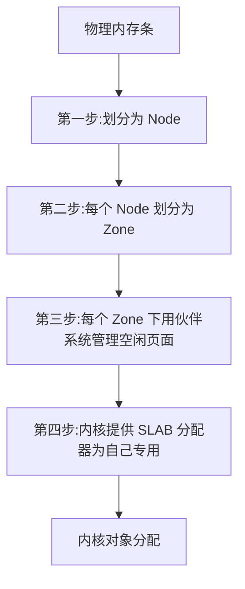
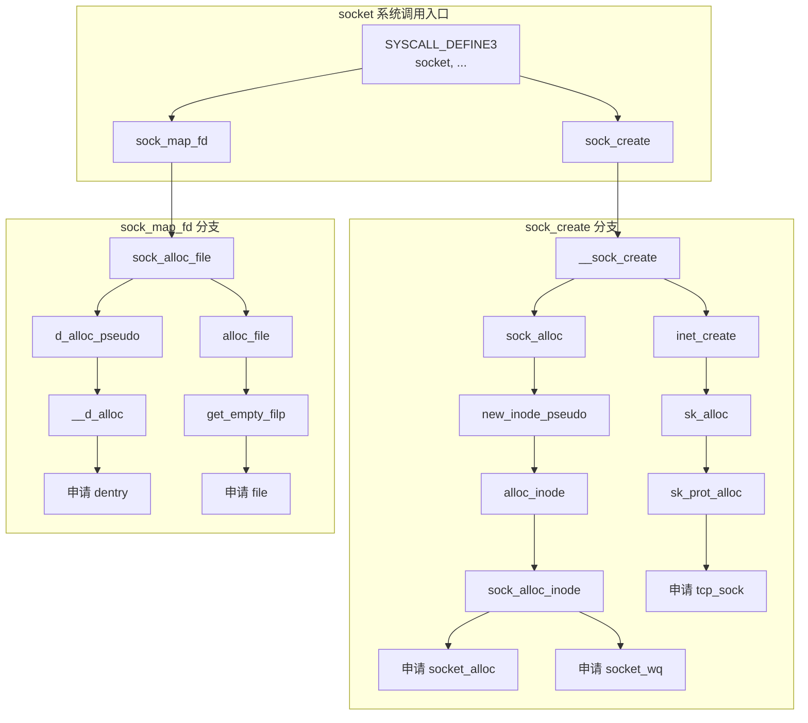

# 第七章 一条 TCP 连接消耗多大内存

## 7.1 相关实际问题

在应用程序里，我们使用多少内存都是自己能掌握和控制的。但是纵观 Linux 整台服务器，除了应用程序以外，内核也会申请和管理大量的内存。那么：

1. **内核是如何管理内存的？**
   内核作为整个 Linux 服务器的基石，它的内存管理方案的优劣将直接影响整台服务器的稳定性。那么内核是如何高效管理和使用内存的呢？

2. **如何查看内核使用的内存信息？**
   对于应用程序我们有很多办法来查看它的内存占用，那么对于内核，我们有没有办法查看它消耗了多少的内存呢。

3. **一条 ESTABLISH 状态的空连接需要消耗多少内存？**
   回顾第一章我提到为了优化性能，我把短连接改成了长连接。为了 FPM 进程和 redis server 建立一次连接然后就长期保持，每台后端机上有 300 个 fpm 进程，总共 20 台后端机，我的一个 redis 实例上就出现了 6000 条的长连接。假设连接上绝大部分时间都是空闲的，那一条空闲的连接会消耗多大的内存呢，会不会把服务器搞坏？

4. **我的机器上出现了 3 万多个 TIME_WAIT，内存开销会不会很大？**
   这是由我在第一章中我提到的另外一个线上问题引发的思考，3 万个 TIME_WAIT 会占用多大的内存呢？会不会因为 TIME_WAIT 过多消耗过多内存而挤占应用程序的可用内存？

带着这些疑问，让我们继续探索~~~

---

## 7.2 Linux 内核如何管理内存

内核针对自己的应用场景，使用了一种叫做 **SLAB/SLUB** 的内存管理机制。这种管理机制通过四个步骤把物理内存条管理了起来，供内核申请和分配内核对象使用，如图 7.1。

> **图 7.1** slab 内存管理
> *（示意图：展示内存从物理内存条到 Node、Zone、伙伴系统、Slab 的分层管理流程）*

```mermaid
graph TD
    A[物理内存条] --> B[Node 节点]
    B --> C[Zone 区域]
    C --> D[伙伴系统<br>(管理空闲页面)]
    D --> E[SLAB 管理器<br>(分配内核对象)]
    E --> F[内核对象]
```

> **图 7.2** NUMA 架构
> *（示意图：展示 CPU 与本地内存直连的 NUMA 拓扑结构）*

现在你可能还觉得 Node、zone、伙伴系统、slab 这些东东还有那么一点点陌生。别怕，接下来我们结合动手观察，把它们逐个来展开细说。

### 7.2.1 NODE 划分

在现代的服务器上，内存和 CPU 都是所谓的 **NUMA** 架构，如图 7.2。CPU 往往不止是一颗。通过 `dmidecode` 命令看到你主板上插着的 CPU 的详细信息；内存也不止是一条。`dmidecode` 同样可以查看到服务器上插着的所有内存条，也可以看到它是和哪个 CPU 直接连接的。

每一颗 CPU 以及和他直连的内存条组成了一个 **node（节点）**，如图 7.3。

```bash
# dmidecode
Processor Information  //第一颗CPU
    SocketDesignation: CPU1   
    Version: Intel(R) Xeon(R) CPU E5-2630 v3 @ 2.40GHz
    Core Count: 8
    Thread Count: 16
Processor Information  //第二颗CPU
    Socket Designation: CPU2
    Version: Intel(R) Xeon(R) CPU E5-2630 v3 @ 2.40GHz
    Core Count: 8
......      
# dmidecode
//CPU1 上总共插着四条内存
Memory Device
    Size: 16384 MB
    Locator: CPU1 DIMM A1
Memory Device
    Size: 16384 MB
    Locator: CPU1 DIMM A2
......  
//CPU2 上也插着四条
Memory Device
    Size: 16384 MB
    Locator: CPU2 DIMM E1
Memory Device
    Size: 16384 MB
    Locator: CPU2 DIMM F1
......
```

> **图 7.3** NUMA 中的 node
> *（示意图：展示 CPU0 和直连内存组成 Node 0，CPU1 和直连内存组成 Node 1）*

在你的机器上，你可以使用 `numactl` 你可以看到每个 node 的情况。

```bash
# numactl --hardware
available: 2 nodes (0-1)
node 0 cpus: 0 1 2 3 4 5 6 7 16 17 18 19 20 21 22 23
node 0 size: 65419 MB
node 1 cpus: 8 9 10 11 12 13 14 15 24 25 26 27 28 29 30 31
node 1 size: 65536 MB
```

### 7.2.2 ZONE 划分

每个 node 又会划分成若干的 **zone（区域）**，如图 7.4。zone 表示内存中的一块范围。

- **ZONE_DMA**：地址段最低的一块内存区域，ISA(Industry Standard Architecture)设备 DMA 访问
- **ZONE_DMA32**：该 Zone 用于支持 32-bits 地址总线的 DMA 设备，只在 64-bits 系统里才有效
- **ZONE_NORMAL**：在 X86-64 架构下，DMA 和 DMA32 之外的内存全部在 NORMAL 的 Zone 里管理

> [!NOTE]
> 为什么没有提 **ZONE_HIGHMEM** 这个 zone？因为这是 32 位机时代的产物。现在还在用这个的不多了。

> **图 7.4** node 中的 zone
> *（示意图：展示一个 Node 内部划分为 ZONE_DMA、ZONE_DMA32、ZONE_NORMAL 三个区域）*

> **图 7.5** zone 下的 pages
> *（示意图：展示每个 zone 下包含许多个 Page，每个 Page 大小 4KB）*

在每个 zone 下，都包含了许许多多个 **Page（页面）**，如图 7.5，在 linux 下一个 Page 的大小一般是 4 KB。

在你的机器上，你可以使用通过 `/proc/zoneinfo` 查看到你机器上 zone 的划分，也可以看到每个 zone 下所管理的页面有多少个。

```bash
# cat /proc/zoneinfo
Node 0, zone      DMA
    pages free     3973
        managed  3973
Node 0, zone    DMA32
    pages free     390390
        managed  427659
Node 0, zone   Normal
    pages free     15021616
        managed  15990165
Node 1, zone   Normal
    pages free     16012823
        managed  16514393                        
```

每个页面大小是 4K，很容易可以计算出每个 zone 的大小。比如对于上面 Node1 的 Normal，`16514393 * 4K = 66 GB`。

### 7.2.3 基于伙伴系统管理空闲页面

每个 zone 下面都有如此之多的页面，Linux 使用 **伙伴系统** 对这些页面进行高效的管理。在内核中，表示 zone 的数据结构是 `struct zone`。其下面的一个数组 `free_area` 管理了绝大部分可用的空闲页面。这个数组就是伙伴系统实现的重要数据结构。

```c
//file: include/linux/mmzone.h
#define MAX_ORDER 11
struct zone {
    free_area   free_area[MAX_ORDER];
    ......
}
```

> **图 7.6** 伙伴系统
> *（示意图：展示 free_area 数组，每个元素指向不同大小的连续空闲内存块链表，从 4K、8K、16K ... 4M）*

```mermaid
graph LR
    subgraph free_area[free_area 数组]
        A0[free_area[0] 4K] --> L0[链表: 4K 块]
        A1[free_area[1] 8K] --> L1[链表: 8K 块]
        A2[free_area[2] 16K] --> L2[链表: 16K 块]
        A3[...] --> L3[...]
        A10[free_area[10] 4M] --> L10[链表: 4M 块]
    end
```

> **图 7.7** 伙伴系统中的 pages 展示
> *（示意图：通过 `cat /proc/pagetypeinfo` 查看各尺寸可用的连续内存块数量）*

`free_area` 是一个 11 个元素的数组，在每一个数组分别代表的是空闲可分配连续 4K、8K、16K、......、4M 内存链表，如图 7.6。

通过 `cat /proc/pagetypeinfo`，你可以看到当前系统里伙伴系统里各个尺寸的可用连续内存块数量，如图 7.7。

内核提供分配器函数 `alloc_pages` 到上面的多个链表中寻找可用连续页面。

```c
struct page * alloc_pages(gfp_t gfp_mask, unsigned int order)
```

`alloc_pages` 是怎么工作的呢？我们举个简单的小例子。假如要申请 8K - 连续两个页框的内存，其工作流程如图 7.8。为了描述方便，我们先暂时忽略 UNMOVEABLE、RECLAIMABLE 等不同类型。

> **图 7.8** 分配页的过程
> *（示意图：展示从 free_area[1] 取一个 8K 块；若 free_area[1] 为空，则从 free_area[2] 取一个 16K 块，拆分为两个 8K 伙伴，一个分配，一个放回 free_area[1]）*

```mermaid
flowchart TD
    A[申请 8K 连续内存] --> B{free_area[1] 有 8K 块吗?}
    B -- 有 --> C[直接分配 8K 块]
    B -- 无 --> D{free_area[2] 有 16K 块吗?}
    D -- 有 --> E[取 16K 块,拆分为两个 8K 伙伴]
    E --> F[分配一个 8K 伙伴]
    E --> G[另一个 8K 伙伴放回 free_area[1]]
    D -- 无 --> H{free_area[3] 有 32K 块吗?}
    H -- 有 --> I[取 32K 块,逐级拆分,直至得到 8K 块]
    I --> F
    H -- 无 --> J[继续向更大尺寸申请...或返回失败]
```

伙伴系统中的“伙伴”指的是两个内存块，大小相同，地址连续，同属于一个大块区域。基于伙伴系统的内存分配中，有可能需要将大块内存拆分成两个小伙伴。在释放中，可能会将两个小伙伴合并再次组成更大块的连续内存。

### 7.2.4 SLAB 管理器

说到现在，不知道你注意到没有。目前我们介绍的内存分配都是以**页面（4KB）**为单位的。

对于各个内核运行中实际使用的对象来说，多大的对象都有。有的对象有 1K 多，但有的对象只有几百、甚至几十个字节。如果都直接分配一个 4K 的页面来存储的话也太败家了，所以伙伴系统并不能直接使用。

在伙伴系统之上，内核又给自己搞了一个专用的内存分配器，叫 **slab** 或 **slub**。这两个词老混用，为了省事，接下来我们就统一叫 **slab** 吧。

这个分配器最大的特点就是，**一个 slab 内只分配特定大小、甚至是特定的对象**，如图 7.9。这样当一个对象释放内存后，另一个同类对象可以直接使用这块内存。通过这种办法极大地降低了碎片发生的几率。

> **图 7.9** slab
> *（示意图：展示一个 slab 内包含多个相同大小的对象）*

> **图 7.10** slab cache
> *（示意图：展示一个 kmem_cache 由 slabs_partial、slabs_full、slabs_free 三个链表组成，每个链表节点对应一个 slab）*

slab 相关的内核对象定义如下：

```c
//file: include/linux/slab_def.h
struct kmem_cache {
    struct kmem_cache_node **node
    ......
}
//file: mm/slab.h
struct kmem_cache_node {
    struct list_head slabs_partial; 
    struct list_head slabs_full;
    struct list_head slabs_free;
    ......
}
```

每个 cache 都有**满、半满、空**三个链表。每个链表节点都对应一个 slab，一个 slab 由 1 个或者多个内存页组成。在每一个 slab 内都保存的是同等大小的对象。一个 cache 的组成如图 7.10。

当 cache 中内存不够的时候，会调用基于伙伴系统的分配器（`__alloc_pages` 函数）请求整页连续内存的分配。

```c
//file: mm/slab.c
static void *kmem_getpages(struct kmem_cache *cachep, 
         gfp_t flags, int nodeid)
{
    ......
    flags |= cachep->allocflags;
    if (cachep->flags & SLAB_RECLAIM_ACCOUNT)
        flags |= __GFP_RECLAIMABLE;
    page = alloc_pages_exact_node(nodeid, ...);
    ......
}
//file: include/linux/gfp.h
static inline struct page *alloc_pages_exact_node(int nid, 
        gfp_t gfp_mask,unsigned int order)
{
    return __alloc_pages(gfp_mask, order, node_zonelist(nid, gfp_mask));
}
```

> **图 7.11** cache chain
> *（示意图：展示内核中存在多个 kmem_cache，如 dentry_cache、buffer_head、socket_alloc、TCP 等专用或通用 cache）*

内核中会有很多个 `kmem_cache` 存在，如图 7.11。它们是在 linux 初始化，或者是运行的过程中分配出来的。它们有的是专用的，有的是通用的。

上图中，我们看到 `socket_alloc` 内核对象都存在 TCP 的专用 `kmem_cache` 中。通过查看 `/proc/slabinfo` 我们可以查看到所有的 kmem cache。

另外 linux 还提供了一个特别方便的命令 `slabtop` 来按照占用内存从大往小进行排列。这个命令用来分析 slab 内存开销非常的方便。

无论是 `/proc/slabinfo`，还是 `slabtop` 命令的输出。里面都包含了每个 cache 中 slab 的如下两个关键信息：

- **objsize**：每个对象的大小
- **objperslab**：一个 slab 里存放的对象的数量

在 `/proc/slabinfo` 还多输出了一个 `pagesperslab`。展示了一个 slab 占用的页面的数量，每个页面 4K，这样也就能算出每个 slab 占用的内存大小。

```bash
# cat /proc/slabinfo
slabinfo - version: 2.1
# name            <active_objs> <num_objs> <objsize> <objperslab> <pagesperslab> : 
tunables .......
xfs_dqtrx            992    992    528   31    4 : tunables    .......
xfs_dquot             68     68    472   34    4 : tunables    .......
xfs_icr              728    728    144   28    1 : tunables    .......
xfs_ili           163209 164035    152   53    2 : tunables    .......
xfs_inode         161404 161910   1088   30    8 : tunables    .......
xfs_efd_item        6520   6960    400   40    4 : tunables    .......
xfs_da_state         646    646    480   34    4 : tunables    .......
xfs_btree_cur       1248   1248    208   39    2 : tunables    .......
xfs_log_ticket      9328   9328    184   44    2 : tunables    .......

# slabtop
 Active / Total Objects (% used)    : 9281266 / 9314784 (99.6%)
 Active / Total Slabs (% used)      : 222396 / 222396 (100.0%)
 Active / Total Caches (% used)     : 81 / 109 (74.3%)
 Active / Total Size (% used)       : 1868697.38K / 1879048.60K (99.4%)
 Minimum / Average / Maximum Object : 0.01K / 0.20K / 15.88K
  OBJS ACTIVE  USE OBJ SIZE  SLABS OBJ/SLAB CACHE SIZE NAME
7341306 7340796  99%    0.19K 174793       42   1398344K dentry
840372 831455  98%    0.10K  21548       39     86192K buffer_head
164035 163209  99%    0.15K   3095       53     24760K xfs_ili
161910 161404  99%    1.06K   5397       30    172704K xfs_inode
 79232  76818  96%    0.06K   1238       64      4952K kmalloc-64
 71100  70850  99%    0.11K   1975       36      7900K sysfs_dir_cache
```

最后，slab 管理器组件提供了若干接口函数，方便自己使用。举三个例子：

- **kmem_cache_create**: 方便地创建一个基于 slab 的内核对象管理器。
- **kmem_cache_alloc**: 快速为某个对象申请内存
- **kmem_cache_free**: 归还对象占用的内存给 slab 管理器

在内核的源码中，可以大量见到 `kmem_cache` 开头函数的使用，在本书后面中我们也将会看到很多对这类函数的调用。

### 7.2.5 小节总结

通过上面描述的几个步骤，内核高效地把内存用了起来。

> **图 7.12** slab 内存管理步骤
> *（示意图：展示从物理内存到最终内核对象分配的四层架构：Node → Zone → 伙伴系统 → SLAB）*



前三步是基础模块，为应用程序分配内存时的请求调页组件也能够用到。但第四步，就算是内核的小灶了。内核根据自己的使用场景，量身打造的一套自用的高效内存分配管理机制。

另外虽然采用 slab 的分配机制极大地减少了内存碎片的发生。但也不能完全避免。举个例子，拿我本机上的 TCP 对象的 slab 信息举例（内核版本是3.10.0）。

```bash
# cat /proc/slabinfo | grep TCP
TCP                  288    384   1984   16    8
```

可以看到 TCP cache下每个 slab 占用 8 个 Page，也就是 `8 * 4096 = 32768` 字节。该对象的单个大小是 1984 字节，每个 slab 内放了 16 个对象。`1984 * 16 = 31744`。这个时候再多放一个 TCP 对象又放不下，剩下的 1K 内存就只好“浪费”掉了。不过 32KB 内存才浪费 1 个 KB，其实碎片率已经非常低了。而且鉴于 slab 机制整体提供的高性能，这一点点的额外开销还是很值得的。

---

## 7.3 TCP 连接相关内核对象

目前我们已经了解了内核是如何使用内存的了。TCP 连接当然也是会使用内存的，每申请一个内核对象就都需要到相应的 SLAB 缓存里申请一块内存。在这一小节中，我们看下 TCP 连接中都使用了哪些内核对象。

在 3.1 节中，我们简单介绍了 socket 函数是如何创建 socket 相关的内核对象的。不过当时主要目的是为了给大家展示清楚 `struct socket` 和 `struct sock` 两个内核对象上协议处理函数指针是怎么初始化的。在本章中，我们要讨论的是 TCP 的内核对象占用多大的内存，视角不一样。因此，从内存申请的角度我们再来看一下 socket 的创建。

### 7.3.1 socket 的直接创建

`socket` 函数会进入到 `__sock_create` 内核函数中。

**sock_inode_cache 申请（struct socket_alloc）**

在 `sock_alloc` 函数中，申请了一个 `struct socket_alloc` 内核对象。`socket_alloc` 内核对象将 socket 和 inode 信息关联了起来。

`sock_inode_cache` 是专门用来存储 `struct socket_alloc` 的 SLAB 缓存，它是在 `init_inodecache` 中初始化的。

```c
//file: net/socket.c
int __sock_create(struct net *net, int family, int type, int protocol,
       struct socket **res, int kern)
{
  //申请 struct socket 内核对象
  sock = sock_alloc();
  //调用协议族的创建函数创建 sock
  err = pf->create(net, sock, protocol, kern);
  ......
}

//file:include/net/sock.h
struct socket_alloc {
  struct socket socket;
  struct inode vfs_inode;
};

//file:net/socket.c
static int init_inodecache(void)
{
  sock_inode_cachep = kmem_cache_create("sock_inode_cache",
                    sizeof(struct socket_alloc),
                    0,
                    (SLAB_HWCACHE_ALIGN |
                     SLAB_RECLAIM_ACCOUNT |
                     SLAB_MEM_SPREAD),
                    init_once);
  ...
}
```

我们来看看 `sock_alloc` 具体是如何完成 `struct sock_alloc` 对象申请的。调用链条比较长，为了简洁，就不展示具体的代码了。我直接把调用链列出来：`sock_alloc` => `new_inode_pseudo` => `alloc_inode` => `sock_alloc_inode`。

我们直接看 `sock_alloc_inode` 函数，在该函数中调用 `kmem_cache_alloc` 从 `sock_inode_cache` SLAB 缓存中申请一个 `struct socket_alloc` 对象出来。

```c
//file: net/socket.c
static struct inode *sock_alloc_inode(struct super_block *sb)
{
  struct socket_alloc *ei;
  struct socket_wq *wq;

  ei = kmem_cache_alloc(sock_inode_cachep, GFP_KERNEL);
  if (!ei)
    return NULL;
  wq = kmalloc(sizeof(*wq), GFP_KERNEL);
  ...
}
```

另外还可以看到，这里还通过 `kmalloc` 申请了一个 `socket_wq`。这个是用来记录在 socket 上等待事件的等待项。我们在 3.3.1 节中介绍阻塞网络 IO 的时候用到过这个数据结构。当进程因为等待这个而被挂起前，会申请一个新的等待队列项，把当前进程描述符和回调函数设置好后挂到这个队列上。不过由于这个内核对象比较小，就不重点提了。

### 7. 第七章 一条TCP连接消耗多大内存

**Pages: 196-227**

#### 7.3.1 TCP 对象申请 (`struct tcp_sock`)

对于 IPv4 来说，inet 协议族对应的 `create` 函数是 `inet_create`，如下所示。因此 `__sock_create` 中对 `pf->create` 的调用会执行到 `inet_create` 中去。在这个函数中，将会到 TCP 这个 SLAB 缓存中申请一个 `struct sock` 内核对象出来。其中 TCP 这个 SLAB 缓存是在 `inet_init` 中初始化好的。

协议栈初始化的时候，会创建一个名为 **TCP**，大小为 `sizeof(struct tcp_sock)` 的 SLAB 缓存，并把它记到 `tcp_prot->slab` 的字段下。

```c
//file: net/ipv4/af_inet.c
static const struct net_proto_family inet_family_ops = {
  .family = PF_INET,
  .create = inet_create,
  .owner  = THIS_MODULE,
};

//file:net/ipv4/af_inet.c
static int __init inet_init(void)
{
  ...
  rc = proto_register(&tcp_prot, 1);
  rc = proto_register(&udp_prot, 1);
  ...
}

//file: net/ipv4/tcp_ipv4.c
struct proto tcp_prot = {
  .name     = "TCP",
  .owner      = THIS_MODULE,
  .close      = tcp_close,
  .connect    = tcp_v4_connect,
  .disconnect   = tcp_disconnect,
  ......
  .obj_size   = sizeof(struct tcp_sock),
}

//file: net/core/sock.c
int proto_register(struct proto *prot, int alloc_slab)
{
  if (alloc_slab) {
    prot->slab = kmem_cache_create(prot->name, prot->obj_size, 0,
          SLAB_HWCACHE_ALIGN | prot->slab_flags,
          NULL);
    ...
  }
}
```

> [!NOTE] `tcp_sock` 结构
> 这里要注意一点，对于 TCP slab 缓存中存放的实际上是 `struct tcp_sock` 对象，是 `struct sock` 的扩展。这个我们在前面的 **6.2.2** 小节也曾介绍过。`tcp_sock`、`inet_connection_sock`、`inet_sock`、`sock` 是逐层嵌套的关系，类似于面向对象编程语言中的继承，所以 `tcp_sock` 是可以当 `sock` 来用的。

我们来具体看下 `inet_create` 是怎么完成 `struct sock`——啊不，是 `struct tcp_sock` 内核对象的申请的。

`inet_create` 调用了 `sk_alloc`，根据函数名也能猜出来它是分配了内存。

```c
//file: net/ipv4/af_inet.c
static int inet_create(struct net *net, struct socket *sock, int protocol,
           int kern)
{
  ...
  //这个 answer_prot 其实就是 tcp_prot
  answer_prot = answer->prot;
  sk = sk_alloc(net, PF_INET, GFP_KERNEL, answer_prot);
  ...
}

//file:net/core/sock.c
struct sock *sk_alloc(struct net *net, int family, gfp_t priority,
          struct proto *prot)
{
  struct sock *sk;
  sk = sk_prot_alloc(prot, priority | __GFP_ZERO, family);
  ...
}

static struct sock *sk_prot_alloc(struct proto *prot, gfp_t priority,
    int family)
{
  ...
  slab = prot->slab;
  if (slab != NULL) {
    sk = kmem_cache_alloc(slab, priority & ~__GFP_ZERO);
  ...
}
```

这里的 `prot->slab`（`tcp_prot->slab`）前面我们说过，是 `tcp_sock` 内核对象的 SLAB 缓存。这里通过 `kmem_cache_alloc` 函数来从该缓存中分配一个 `tcp_sock` 内核对象出来。

#### dentry 申请

回到 `socket` 系统调用的入口处，除了 `sock_create` 以外，还调用了一个 `sock_map_fd`。以此为入口将完成 `struct dentry` 的申请。

内核初始化的时候创建好了一个 dentry SLAB 缓存，所有的 `struct dentry` 对象都将在这里进行分配。

我们来看下 `struct dentry` 内核对象详细的申请过程。来进入到 `sock_map_fd`。

```c
//file: net/socket.c
SYSCALL_DEFINE3(socket, int, family, int, type, int, protocol)
{
  ...
  sock_create(family, type, protocol, &sock);
  sock_map_fd(sock, flags & (O_CLOEXEC | O_NONBLOCK));
}

//file:include/linux/dcache.h
struct dentry {
  ......
  struct dentry *d_parent;  /* parent directory */
  struct qstr d_name;
  struct inode *d_inode;  
  unsigned char d_iname[DNAME_INLINE_LEN];
  ......
};

//file:fs/dcache.c
static void __init dcache_init(void)
{
  dentry_cache = KMEM_CACHE(dentry,
    SLAB_RECLAIM_ACCOUNT|SLAB_PANIC|SLAB_MEM_SPREAD);
}

//file: include/linux/slab.h
#define KMEM_CACHE(__struct, __flags) kmem_cache_create(#__struct,\
    sizeof(struct __struct), __alignof__(struct __struct),\
    (__flags), NULL)

//file:net/socket.c
static int sock_map_fd(struct socket *sock, int flags)
{
  struct file *newfile;
  int fd = get_unused_fd_flags(flags);
  ...
  //1.申请 dentry、file 内核对象
  newfile = sock_alloc_file(sock, flags, NULL);
  if (likely(!IS_ERR(newfile))) {
    //2.关联到 socket,以及进程
    fd_install(fd, newfile);
    return fd;
  }
  ...
}
```

在 `sock_alloc_file` 中完成内核对象的申请。在 `sock_alloc_file` 中其实是完成了 `struct dentry` 和 `struct file` 两个内核对象的申请。不过先只介绍 dentry，它是在 `d_alloc_pseudo` 中完成申请的。

`dentry_cache` 上面我们说过，是一个专门用于分配 `struct dentry` 内核对象的 SLAB 缓存。`kmem_cache_alloc` 执行完后，一个 dentry 对象就申请出来了。

```c
//file:net/socket.c
struct file *sock_alloc_file(struct socket *sock, int flags, const char *dname)
{
  //申请 dentry
  path.dentry = d_alloc_pseudo(sock_mnt->mnt_sb, &name);
  //申请 flip
  file = alloc_file(&path, FMODE_READ | FMODE_WRITE,
      &socket_file_ops);
  ...
}

//file:fs/dcache.c
struct dentry *d_alloc_pseudo(struct super_block *sb, const struct qstr *name)
{
  struct dentry *dentry = __d_alloc(sb, name);
  if (dentry)
    dentry->d_flags |= DCACHE_DISCONNECTED;
  return dentry;
}

//file:fs/dcache.c
struct dentry *__d_alloc(struct super_block *sb, const struct qstr *name)
{
  dentry = kmem_cache_alloc(dentry_cache, GFP_KERNEL);
  ...
}
```

#### filp 对象申请 (`struct file`)

回顾上面的 `sock_alloc_file` 函数，在这个里面其实除了 dentry 外，还通过 `alloc_file` 申请了一个 `struct file` 对象。在 Linux 上，一切皆是文件，正是通过和 `struct file` 对象的关联来让 socket 看起来也是一个文件。`struct file` 是通过 `filp` SLAB 缓存来进行管理的。

让我们进入 `alloc_file` 函数看看申请过程。

```c
//file:fs/file_table.c
void __init files_init(unsigned long mempages)
{ 
  filp_cachep = kmem_cache_create("filp", sizeof(struct file), 0,
      SLAB_HWCACHE_ALIGN | SLAB_PANIC, NULL);
  ...
} 

//file:fs/file_table.c
struct file *alloc_file(struct path *path, fmode_t mode,
    const struct file_operations *fop)
{
  file = get_empty_filp();
  ...
}
```

进入 `get_empty_filp` 函数。

```c
//file:fs/file_table.c
struct file *get_empty_filp(void)
{
  f = kmem_cache_zalloc(filp_cachep, GFP_KERNEL);
  ...
}
```

上面我们说过，`filp_cachep` 是一个专门存储 `struct file` 内核对象的 SLAB 缓存，`kmem_cache_zalloc` 过后，一个该类型的对象就在内存上分配好了。

#### 总结一下

上面的调用链条有点长，这里用一幅相对全面一点的调用链来让大家看看内核对象的申请位置。



在 `socket` 系统调用完毕之后，在内核中就申请了配套的一组内核对象。这些内核对象并不是孤立地存在的，而是互相都保留着和其它内核对象的关联关系，如图 7.14。

> [!NOTE] **图 7.14** socket 内核对象关系图（示意图）
> 所有的网络相关的操作包括数据接收和发送等都是以这些数据结构为基础来进行的。
> *   `struct socket_alloc` 包含 `struct socket` 和 `struct inode`。
> *   `struct socket` 关联 `struct sock` (实际是 `tcp_sock`)。
> *   `struct file` 和 `struct dentry` 通过 VFS 层关联，使得 socket 可以像文件一样操作。

#### 7.3.2 服务端 socket 创建

除了直接创建 socket 以外，服务器端还可以通过 `accept` 函数在接收连接请求时来完成相关内核对象的创建。虽然创建的整体流程不一样，不过内核对象基本上都是非常相似的。我们就来简单过一下 `accept` 过程。

`sock_alloc` 这个函数我们上面讲过，就是从 `sock_inode_cache` SLAB 缓存中申请一个 `struct socket_alloc`，该对象中包含了 `struct inode` 和 `struct socket`。详细参考前文。

`sock_alloc_file` 这个函数同样上面讲过，在它里面完成了两个内核对象的申请。一个是 `struct dentry`，是在同名的 SLAB 缓存中申请的。另外一个是 `struct file`，是在 `filp` SLAB 缓存中分配的。

不过 `tcp_sock` 对象的创建过程有点不太一样，服务器内核在**第三次握手成功的时候**，就已经创建好了 `tcp_sock`，并且一同放入到了全连接队列中。这样在 `accept` 的时候，只需要从全连接队列中取出来直接用就行了，无需再单独申请。

```c
//file: net/socket.c
SYSCALL_DEFINE4(accept4, int, fd, struct sockaddr __user *, upeer_sockaddr,
        int __user *, upeer_addrlen, int, flags)
{
    struct socket *sock, *newsock;
    //根据 fd 查找到监听的 socket
    sock = sockfd_lookup_light(fd, &err, &fput_needed);
    //申请并初始化新的 socket
    newsock = sock_alloc();
    newsock->type = sock->type;
    newsock->ops = sock->ops;
    //申请新的 file 对象,并设置到新 socket 上
    newfile = sock_alloc_file(newsock, flags, sock->sk->sk_prot_creator->name);
    ......
    //接收连接
    err = sock->ops->accept(sock, newsock, sock->file->f_flags);
    //添加新文件到当前进程的打开文件列表
    fd_install(newfd, newfile);
    ...
}

//file: net/ipv4/inet_connection_sock.c
struct sock *inet_csk_accept(struct sock *sk, int flags, int *err)
{
    //从全连接队列中获取
    struct request_sock_queue *queue = &icsk->icsk_accept_queue;
    req = reqsk_queue_remove(queue);
    newsk = req->sk;
    return newsk;
}
```

看，从全连接队列中取出来的 `req` 中是有 `sock` 对象的。

> [!INFO] **服务端 accept 内核对象**
> 所以，服务器端 `accept` 后生成的 socket 内核对象，也是 `struct socket_alloc`、`struct file`、 `struct dentry`、 `struct tcp_sock` 等几个，对应的 SLAB 缓存名是 `sock_inode_cache`、`filp`、`dentry`、**TCP**。

---

### 7.4 实测 TCP 内核对象开销

> [!TIP] 纸上得来终觉浅，绝知此事要躬行。
> 上一节中我们从源码层面我们讨论完了一条 TCP 连接都需要哪些内核对象。但正所谓纸上得来终觉浅，绝知此事要躬行。所以我们通过一个实验的形式再做一下实际测试。这样印象更牢。

由于在测试中不停地需要在客户端和服务器端两个角色之间切换来切换去。为了在做实验的时候，更直观地看到哪个命令是在哪个端上操作的。所以我们引入了一对儿卡通人物，分别代表服务器和客户端。

| **图 7.15** 客户端实验准备 | **图 7.16** 服务器实验准备 |
| :--- | :--- |
| <br/><br/>*（原文中此处为卡通人物图，示意客户端操作）* | <br/><br/>*（原文中此处为卡通人物图，示意服务器端操作）* |

#### 7.4.1 实验准备

需要准备两台服务器。一台作为客户端、另一台作为服务器。在公众号「开发内功修炼」后台回复“配套源码”，来获取本实验要使用的测试源码。源码有三种语言，分别是 C、Java、PHP，总有一种你熟悉的。无论选择哪一种，都需要具备该语言对应的编译或执行环境，例如 `gcc`、`java & javac`、`php` 等命令和工具。

**在客户端上**，需要调整如下内核参数并顺便记录下来 `/proc/meminfo` 中记录的 Slab 内存消耗。

1.  调整 `ip_local_port_range` 来保证可用端口数要大于 5 万。
2.  保证 `tw_reuse` 和 `tw_recycle` 是关闭状态的，否则连接无法进入 `TIME_WAIT`。
3.  调整 `tcp_max_tw_buckets` 保证能有 5 万个 `TIME_WAIT` 状态供观察。
4.  再使用 `slabtop` 命令记录一下实验开始前 slab 缓存的使用情况。由于 Linux 在运行的过程中为了提高性能，会缓存 VFS 相关的很多内核对象。为了方便观察本次实验结果，所以需要先清理一下 `pagecache`、 `dentries` 和 `nodes`。

```bash
# 清理缓存
# echo "3" > /proc/sys/vm/drop_caches
# slabtop
  ......
  OBJS ACTIVE  USE OBJ SIZE  SLABS OBJ/SLAB CACHE SIZE NAME
 62976  43709  69%    0.06K    984       64      3936K kmalloc-64
 17976  11171  62%    0.19K    856       21      3424K dentry
 15028  15028 100%    0.12K    442       34      1768K kernfs_node_cache
 11220  11220 100%    0.04K    110      102       440K selinux_inode_security
  9412   9008  95%    0.58K    724       13      5792K inode_cache
```

**在服务器上**，一般我们测试的时候本地的两台机器的 RTT 都很短，零点几毫秒，很容易把连接队列打满，进而导致握手过慢。为了避免这个问题，源代码中的 `backlog` 都设置的是 1024。但必须在内核参数 `somaxconn` 大于这个数字的时候才能生效。所以需要确认或修改一下系统 `somaxconn` 的大小。

服务器端也一样，清理各种 cache，并记录下 `slabtop` 的输出情况。

```bash
# echo "3" > /proc/sys/vm/drop_caches
# slabtop
 ```bash
  ......
  OBJS ACTIVE  USE OBJ SIZE  SLABS OBJ/SLAB CACHE SIZE NAME
 26368  13080  49%    0.06K    412       64      1648K kmalloc-64
 21399  12225  57%    0.19K   1019       21      4076K dentry
 17820  17742  99%    0.11K    495       36      1980K kernfs_node_cache
 14420   3932  27%    0.57K    515       28      8240K radix_tree_node
 13962   7180  51%    0.10K    358       39      1432K buffer_head
 10914  10914 100%    0.04K    107      102       428K selinux_inode_security
```

#### 7.4.2 实验开始

在服务器机器上下载源码后,进入 `chapter-07/7.4/test-01` 目录,再选择一门你熟悉的语言.无论选择哪门语言,下面的操作过程描述都是通用的.

启动 Server,如果正常将启动一个监听在 8090 端口的简单 Server.当然这个端口号如果和你本地其它 Server 有冲突,你可以在 Makefile 文件中进行修改.

再到另外的客户端机器上下载源码并进入相同的目录,修改一下 Makefile 中的服务器 IP(默认是 192.168.0.1).如果端口修改过的话,也要改一下.然后启动客户端.

```bash
# 在服务器上启动服务端
# make run-srv
```

| **图 7.17** 实验开始 |
| :--- |
| <br/><br/>*(原文中此处为卡通人物图,示意客户端连接服务器)* |

当客户端起来的时候,连接就开始了.

#### 7.4.3 观察 ESTABLISH 状态开销

##### 客户端内存开销查看

我们来查看一下当前客户端机上 `slabtop` 命令的输出情况.

```bash
# 在客户端上启动客户端后，查看 slab 使用情况
# make run-cli
  OBJS ACTIVE  USE OBJ SIZE  SLABS OBJ/SLAB CACHE SIZE NAME
144448 144448 100%    0.06K   2257       64      9028K kmalloc-64
 73353  73353 100%    0.19K   3493       21     13972K dentry
 52208  52192  99%    0.25K   3263       16     13052K kmalloc-256
 50148  50148 100%    0.62K   4179       12     33432K sock_inode_cache
 50032  50032 100%    1.94K   3127       16    100064K TCP
 15028  15028 100%    0.12K    442       34      1768K kernfs_node_cache
```

和实验开始前的数据相比,`kmalloc-64`、`dentry`、`kmalloc-256`、`sock_inode_cache`、`TCP` 这五个内核对象都有了明显的增加.这些其实就是我们在 7.3 节中提到的 socket 内部相关的内核对象.其中的 `kmalloc-256` 是我们前文介绍过的 `filp`.`kmalloc-64` 既包括我们前文提到的 `socket_wq`,也包括记录端口使用关系的哈希表中使用的 `inet_bind_bucket` 元素(该对象我们在 **6.3** 里介绍过,每次使用一个端口的时候,就会申请一个 `inet_bind_bucket` 以记录该端口被使用过,所有的 `inet_bind_bucket` 以哈希表的形式组织了起来.下次再选择端口的时候查找该哈希表来判断一个端口有没有被使用).

至于说为什么不显示 `filp`、`tcp_bind_bucket` 等,而是都显示的是 `kmalloc-xx`,那是因为 Linux 内部的一个叫 **slab merging** 的功能.Slab merge 功能会可能会将同等大小的 slab 缓存放到一起.Linux 源码中提供了工具可以查看都哪些 slab 参与了合并.注意,这个工具需要编译一下才能使用,编译完后我们这样查看.

```bash
# 编译 slabinfo 工具
# cd linux-3.10.1/tools/vm
# make slabinfo
# ./slabinfo -a 
t-0000064   <- dccp_ackvec_record kmalloc-64 anon_vma_chain xfs_ifork secpath_cache io 
dmaengine-unmap-2 ksm_rmap_item fs_cache sctp_bind_bucket tcp_bind_bucket 
dccp_bind_bucket fib6_nodes avc_node ksm_stable_node ftrace_event_file 
fanotify_perm_event_info
:t-0000256   <- biovec-16 pool_workqueue rpc_tasks request_sock_TCPv6 bio-0 
request_sock_TCP kmalloc-256 sgpool-8 skbuff_head_cache ip_dst_cache sctp_chunk filp
...... 
```

通过上述输出中我们可以看到 `tcp_bind_bucket` 和 `kmalloc-64` 是 merge 过的,`filp` 也确确实实和 `kmalloc-256` 合并到了一起.

这样这个实验就和我们之前分析的源码都对上了.我们再来查看一下一条 TCP 连接使用的各个内核对象的大小:

| **图 7.18** 客户端 slab 内存消耗 (对象大小汇总) |
| :--- |
| * `socket_wq`(kmalloc-64)是 **0.06 K**<br/>* `dentry` 是 **0.19 K**<br/>* `kmalloc-256` 是 **0.25 K**(对应 `filp`)<br/>* `sock_inode_cache` 是 **0.62 K**<br/>* `TCP` 是 **1.94 K**<br/><br/>全部加起来以后,1.94 + 0.62 + 0.25 + 0.19 + 0.06 = **3.06 K**.另外在 7.2 节我们说过,SLAB 内存管理还是会适度存在一些浪费,再加上记录端口使用关系的 `tcp_bind_bucket`,所以实际内存占用会比这个大一些. |

另外,我们再查看一下 `meminfo` 中的开销.

> [!INFO] 平均每个 socket 上的内存开销计算
> 平均每个 socket 上内存开销 = (当前 slab 输出 - 开始的 slab 输出) / 50000
> 计算 (206896 - 39848) / 50000 = **3.34 kB**.基本和上面通过累加内核对象大小计算出来的结果差不多.

##### 服务器内存开销查看

再来查看一下服务器上的 `slabtop` 的结果.

大致也是 `kmalloc-64`、`dentry`、`kmalloc-256`、`sock_inode_cache`、`TCP` 这五个对象.不过和客户端相比,`kmalloc-64` 明显要消耗的少一些.这是因为服务器上不需要 `tcp_bind_bucket` 来记录端口占用.根据各个 slab 的大小相加得出服务器端每个 socket 内存大小大约也是 **3 K** 左右.

# 8. 第七章 一条TCP连接消耗多大内存

## 7.4.4 观察非 ESTABLISH 状态开销

我们再来看看非 ESTABLISH 状态下的 TCP 连接的内存开销.但是很多非连接状态都是瞬时出现的,非常不好捕获,更何况我们还得批量捕获以后才能计算.所以本实验中只观察几种容易捕获的状态,只要通过这几种状态理解了原理就可以了.

我们先来回顾一下四次挥手的状态流转,见图 7.20.

> [!NOTE] **图 7.20 四次挥手**
> (此处原图为四次挥手的标准状态流转图)

幸运的是,我们有一个非常简单的方法来让内核发出 CLOSE.那就是在当前拥有连接的进程上执行 CTRL + C 退出.我们就利用这个来进行本次实验.

### FIN_WAIT2

在客户端机上,找到运行测试程序的窗口,执行 CTRL + C.

> [!NOTE] **图 7.21 FIN_WAIT2 实验**
> (此处原图为 FIN_WAIT2 状态实验过程的示意图)

根据客户端机当前 meminfo 中 Slab 的开销可以粗略算出:( 59684 - 39848 ) / 50000 = 0.396 kB.

可见在 FIN_WAIT2 状态下,TCP 连接的开销要比 ESTABLISH 状态下小的多. 我们来看下 slabtop 中的情况.

可见 `dentry`、`filp`、`sock_inode_cache`、`TCP` 这四个对象都被回收了,只剩下 `kmalloc-64`,另外多了个只有 0.25 K 的 `tw_sock_TCP`.

总之,**FIN_WAIT2 状态下的 TCP 连接占用的内存很小**.内核在不需要的时候会尽量回收不再使用的内核对象,以节约内存.

### TIME_WAIT

TIME_WAIT 是服务器上除了 ESTABLISH 以外最常见的状态了,所以我已经迫不及待想要查看一个 TIME_WAIT 大约占用多少内存了.在服务器运行着测试程序的窗口上执行 CTRL + C 后,服务器将也发出 FIN.客户端在收到后,就可以进入到 TIME_WAIT 状态了.

```text
# slabtop
  OBJS ACTIVE  USE OBJ SIZE  SLABS OBJ/SLAB CACHE SIZE NAME
144640  95285  65%    0.06K   2260       64      9040K kmalloc-64
 50032  50032 100%    0.25K   3127       16     12508K tw_sock_TCP
 21210  14414  67%    0.19K   1010       21      4040K dentry
```

> [!NOTE] **图 7.22 TIME_WAIT 实验**
> (此处原图为 TIME_WAIT 状态实验的 slabtop 输出截图)

通过 meminfo 中 Slab 内存开销计算:( 60692 - 39848 ) / 50000 = 0.41,和 FIN_WAIT2 下占用差不多.再看下 slabtop.

确实使用的内核对象和 FIN_WAIT2 时也一样.

> [!SUMMARY] **总结**
> FIN_WAIT2、TIME_WAIT 状态下的 TCP 连接占用的内存很小,大约只有 0.3 K - 0.4 K 左右.
>
> 为啥 slab 计算出来会更多,是因为在服务器上计算难免会有其它程序的干扰.我们通过 50000 条连接来降低这个误差的影响.但即使是 50000 条的 TIME_WAIT 占用总内存也仅仅只有 17 M 而已.其它应用程序稍微波动一下,这个误差就出来了.

## 7.4.5 收发缓存区简单测试

接下来我们再做一次带数据收发的实验.但数据收发对内存的消耗相当的复杂,涉及到 `tcp_rmem`、`tcp_wmem` 等内核参数限制,也涉及到滑动窗口、流量控制等协议层面的影响.测试难度非常大,所以我们只选择一个简单的情况进行测试.

### 服务端不接收

在源码中进入 `chapter-07/7.4/test-02`,这个实验基本上和 `test-01` 源码是一致的.区别就是这个 client 发送了个 "I am client" 的一个短字符串出来.不过在服务器端并没有 read 连接上的数据.

先看客户端,这个时候查看客户端上的 `slabtop`、`meminfo` 中的 `slab` 开销等等,发现没有看到额外的发送缓冲区的内存消耗.这是因为只要发送出去的数据能接收到对方的 ack,而且没有数据要继续发送的话,发送缓冲区用完立即就释放了.

再看服务端,还是使用 `slabtop` 来查看.

```text
# slabtop
  OBJS ACTIVE  USE OBJ SIZE  SLABS OBJ/SLAB CACHE SIZE NAME
144640  93988  64%    0.06K   2260       64      9040K kmalloc-64
 50032  50032 100%    0.25K   3127       16     12508K tw_sock_TCP
 21861  14721  67%    0.19K   1041       21      4164K dentry
 15834  15834 100%    0.10K    406       39      1624K buffer_head
```

> [!NOTE] **图 7.23 客户端发送,服务器不接收**
> (此处原图为客户端发送数据但服务端不接收时服务端的 slabtop 输出截图)

对照上面空的 ESTABLISH 相比,发现多了 50000 个 `kmalloc-256`.这些就是接收缓冲区所使用的内存.因为我们发送的数据很小,所以一个 256 大小的缓冲区就够了.如果待接收的数据更多,一般来说缓冲区也会消耗的更大.不过正如前文所说,影响因素还有很多.

### 服务端接收

我们再来看下,如果服务器端及时接收客户端发送过来的数据的话,服务器端的接收缓冲区有没有变化.在源码中找到 `chapter-07/7.4/test-03`,这个实验和 `test-02` 的区别就是服务器接收了来自客户端的数据.实验后,服务端的 `slabtop` 输出如下:

```text
# slabtop
  OBJS ACTIVE  USE OBJ SIZE  SLABS OBJ/SLAB CACHE SIZE NAME
103408 103310  99%    0.25K   6463       16     25852K kmalloc-256
 63552  63552 100%    0.06K    993       64      3972K kmalloc-64
 61782  61782 100%    0.19K   2942       21     11768K dentry
 50250  50250 100%    0.62K   2010       25     32160K sock_inode_cache
 50224  50224 100%    1.94K   3139       16    100448K TCP
 17820  17742  99%    0.11K    495       36      1980K kernfs_node_cache
```

回头上一个实验中服务端的 `slabtop` 输出对比一下发现多出来的 50000 多个 `kmalloc-256` 又全都没有了.这和空 ESTABLISH 状态下的连接开销基本一致了.这说明,**当接收完数据以后内核消耗的接收缓冲区及时回收了**.

## 7.4.6 实验结果小结

我们把实验中的数据来总结一下.

经过观察和计算.我们大概知道了一条 ESTABLISH 状态的空连接消耗的内存大约是 **3 kB 多一点**.飞哥建议在工作实践中,理解清楚这个**大致的数量级**就可以了.如果硬扣到底是三点几 K,我觉得这个就意义不大了.毕竟我们是工程师,又不是数学家.

另外如果有数据的收发,还需要消耗发送和接收缓冲区.不过发送缓冲区在接收到 ack 之后如果没有新的要发送的数据就会回收.接收缓冲区是在应用进程 `recv` 拷贝到用户进程内存后,内存释放接收缓冲区.

对于非 ESTABLISH 状态下的连接,比如 FIN_WAIT2 和 TIME_WAIT 等状态下,内核会回收不需要的内核对象,以节约内存.一条 TIME_WAIT 状态的连接需要的内存也就是 **0.4 KB 左右**而已.

```text
# slabtop
  OBJS ACTIVE  USE OBJ SIZE  SLABS OBJ/SLAB CACHE SIZE NAME
 62912  62912 100%    0.06K    983       64      3932K kmalloc-64
 62811  62811 100%    0.19K   2991       21     11964K dentry
 52960  52922  99%    0.25K   3310       16     13240K kmalloc-256
 50336  50336 100%    1.94K   3146       16    100672K TCP
 50225  50225 100%    0.62K   2009       25     32144K sock_inode_cache
 17820  17742  99%    0.11K    495       36      1980K kernfs_node_cache
 14140   4424  31%    0.57K    505       28      8080K radix_tree_node
 12948  10818  83%    0.10K    332       39      1328K buffer_head
```

> [!NOTE] **图 7.9 slab**
> （此处原图为系统典型 slab 内存分布截图）

## 7.5 本章总结

在本章中，我们为了介绍 TCP 连接内核内存开销，首先介绍了内核的 SLAB 管理器这个背景知识。它会针对不同大小的内核对象创建出多个 SLAB 缓存区。接着我们分析了 TCP 连接中都使用了哪些内核对象。我们还通过动手实验的方式对 TCP 连接的内存消耗进行了查看。了解完了这些内容，回头我们看一下本章开头我们提到的问题。

### 1) 内核是如何管理内存的？

内核是整个 Linux 服务器的基石，它的内存管理方案必须得足够优秀，否则将直接影响整台服务器的稳定性。

内核采用 SLAB 的方式来管理内存，总共分成了四步：

1. 把所有的内存条和 CPU 进行分组，组成 **node**
2. 把每一个 node 划分成多个 **zone**
3. 每个 zone 下都用**伙伴系统**来管理空闲页面
4. 提供 **slab 分配器**来管理各种内核对象

前三步是基础模块，为应用程序分配内存时的请求调页组件也能够用到。但第四步是内核专用的。每个 SLAB 缓存都是用来存储固定大小，甚至是特定一种的内核对象。这样当一个对象释放内存后，另一个同类对象可以直接使用这块内存，几乎没有任何碎片。极大提高了分配效率，同时降低了碎片率，如图 7.9，这里我们再展示一次。

> [!TIP] **SLAB 机制的核心优势**
> 固定大小、对象复用、几乎零碎片、分配效率极高。

### 2) 如何查看内核使用的内存信息？

- 通过查看 `/proc/slabinfo` 我们可以查看到所有的 kmem cache。
- 更方便的是 `slabtop` 命令，它按照占用内存从大到小进行排列。这个命令用来分析内核内存开销非常的方便。

### 3) 服务器上一条 ESTABLISH 状态的空连接需要消耗多少内存？

我的一个 redis 实例上就出现了 6000 条的长连接。假设连接上绝大部分时间都是空闲的，也就是说可以假设没有发送缓冲区、接收缓冲区的开销。那么一个 socket 大约需要如下几个内核对象：

| 内核对象 | 大小 | SLAB 缓存名 |
|---------|------|------------|
| `struct socket_alloc` | 0.62 K | `sock_inode_cache` |
| `struct tcp_sock` | 1.94 K | `TCP` |
| `struct dentry` | 0.19 K | `dentry` |
| `struct file` | 0.25 K | `filp` |

加上 SLAB 上多少会存在一点碎片无法使用，这组内核对象的大小大约总共是 **3.3K 左右**。

粗算一下 6000 条 ESTABLISH 状态的空长连接在内存上的开销也就是 `6000 * 3.3 K`，大约仅仅 **20M** 而已。在内存方面，这些连接不会对服务器产生任何压力。

> [!TIP] **关于 CPU 开销**
> 其实只要没有数据包的接收和处理，是不需要消耗 CPU 的。长连接上在没有数据传输的情况下，只有极少量的保活包传输，CPU 开销可以忽略不计。

### 4) 我的机器上出现了 3 万多个 TIME_WAIT，内存开销会不会很大？

> [!WARNING] **这种情况只能算是 warning，而不是 error！**

从内存的角度来考虑，一条 TIME_WAIT 状态的连接仅仅是 **0.4 KB 左右**的内存而已。

我们再扩展一下，从端口的角度也来考虑一下。占用的端口只是针对特定的 server 来说是占用了。只要下次连接的 server 不一样（ip 或者端口不一样都算），那么这个端口仍然可以用来发起 TCP 连接。

到今天，我们已经深刻理解了无论是从内存的角度，还是端口的角度一条 TIME_WAIT 的开销都并不那么可怕。**只有在连接同一个 server 的时候，端口占用才能算的上是问题**。如果想解决这个问题可以考虑使用 `tcp_max_tw_buckets` 来限制 TIME_WAIT 连接总数，或者打开 `tcp_tw_recycle`、`tcp_tw_reuse` 来快速回收端口。如果再彻底一些，也可以干脆直接用长连接代替频繁的短连接。

---

> [!INFO] **加入知识星球**
> 在知识星球中我们会进行内核等底层技术的视频讲解，能让你的底层学起来更快，事半功倍。还会进行线上问题排查以及性能优化等方面的案例分享和交流。对大家技术深度和广度的积累很有好处。
>
> 有想继续加入知识星球的同学微信扫描下面的二维码即可加入。另外在公众号后台发送「星球优惠券」可以获取开发内功修炼读者的专属优惠券。
>
> Github：https://github.com/yanfeizhang/coder-kung-fu