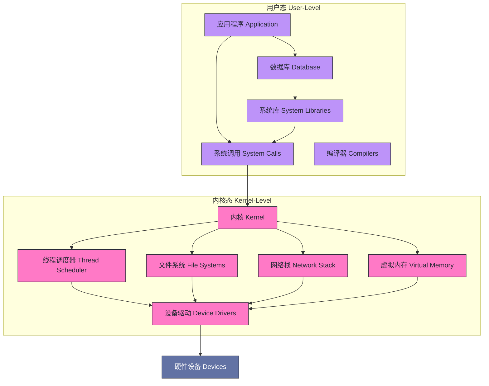
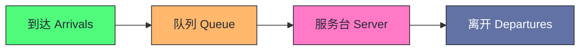
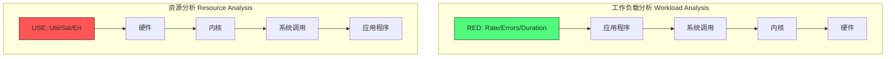
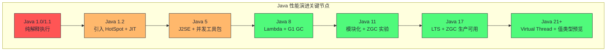

# 01 性能工程的本质：延迟、吞吐与资源饱和的三角

> [!abstract] 摘要
> 本文是《系统性能工程实战》专栏的开篇，旨在建立贯穿全专栏的方法论基石。文章回答四个核心问题：性能工程与性能调优的本质区别是什么；延迟与吞吐这对对偶概念如何通过队列理论连接；Brendan Gregg 的 USE 方法如何为资源分析提供起点；以及为什么 Java/JVM 这样的托管运行时会让性能分析比 C/Rust 等原生语言复杂得多。文中整合 Brendan Gregg《Systems Performance》的方法论体系与 Monica Beckwith《JVM Performance Engineering》对托管运行时性能代价的剖析，构建从硬件金属到应用代码的全栈性能视角。阅读本文后，你将拥有一套可复用的思维框架，而不是一堆零散的命令和指标。

---

## 第 1 章 引言：为什么性能工程是一门前置学科

### 1.1 性能调优与性能工程的本质区别

很多人把"性能"理解为"让系统跑得更快"，把"性能优化"理解为"调几个参数让某个指标变好看"。这是一种危险的理解偏差，它会导致两个典型的工程灾难：

第一，**把症状当根因**。看到 CPU 利用率高就加机器，看到延迟升高就加缓存，看到 GC 频繁就调堆大小。这些动作可能在短期让指标好看，但根本问题没有解决，下一次它会在更不利的时机以更复杂的形态再次出现。

第二，**把工具当方法论**。一个工程师能熟练使用 `top`、`perf`、`jstat`、`async-profiler`，不代表他懂性能分析。Brendan Gregg 在《Systems Performance》第 2 章开头讲过他自己的教训：他年轻时从头到尾读完 man 手册，学会了 page fault、context switch 等指标的定义，但面对真实问题时不知道如何从信号走向解决方案。资深工程师的真正能力是那一套"心理程序"——知道哪些指标重要、何时它们指向问题、如何用它们缩小调查范围。这套心理程序就是方法论，它才是 man 手册里缺失的那部分。

> [!info] 核心概念：性能工程 vs 性能调优
> **性能调优（Performance Tuning）** 是一个动作：针对已观测到的性能问题，调整参数或代码以改善指标。
> **性能工程（Performance Engineering）** 是一门学科：贯穿软件生命周期的全阶段，从架构设计阶段的性能目标设定、性能建模，到开发阶段的性能表征，到生产环境的监控、分析与事件回顾。
> 两者的关系：性能调优是性能工程在生产阶段的一个子活动。把性能工程降格为性能调优，等于把"医学"降格为"开药方"。

性能工程之所以应该被视为前置学科，是因为一个残酷的工程现实：**架构决策对性能的影响远大于后期调优**。一个选择了同步阻塞 I/O + 单线程模型的架构，无论后期怎么调参，都不可能达到异步非阻塞架构的并发性能上限。而架构决策往往发生在项目最早的阶段，此时如果缺乏性能工程的视角，代价会在项目后期以指数级放大。Brendan Gregg 列举了性能工程在软件生命周期中的十一个活动步骤：

图中绿色阶段是"前置"性能工程，橙色是"中置"，红色是"后置"——也就是大多数团队实际投入精力的地方。问题在于，越往后的阶段，修复早期架构决策造成的性能问题的成本越高。一个在阶段 1 就能发现的设计缺陷，拖到阶段 8 可能需要重写整个 I/O 路径。

### 1.2 全栈视角：从硬件金属到应用代码

系统性能研究的是**整个计算机系统**的性能，包括所有主要软件和硬件组件。数据路径上的任何环节——从存储设备到应用程序软件——都可能成为瓶颈。这就是为什么性能工程必须是"全栈"的。

> [!note] 术语澄清：全栈
> "全栈"在应用开发语境里常指"前端 + 后端 + 数据库"。但在系统性能语境下，"全栈"指的是**从应用程序一直到硬件金属**的整个软件栈，包括系统库、内核、设备驱动和硬件本身。这两种定义的混淆会让性能讨论偏离重点。

一个典型的单机系统软件栈结构如下：

这个栈结构是本专栏后续所有文章的地图。专栏第三部分会逐一深挖 CPU、内存、存储、网络四大内核子系统，第四部分会下沉到 JVM 运行时层。但无论深挖哪一层，都不能脱离这个全栈视角——一个 JVM 堆扩容导致的问题，根因可能在内核的虚拟内存子系统；一个网络延迟突增，根因可能在应用层的连接池配置。**性能问题的根因和症状往往不在同一层**，这是全栈视角存在的根本理由。

### 1.3 性能为什么难：主观性、复杂性与多根因

性能工程之所以被认为是一门"难"的学科，不是因为命令难记，而是因为它具备三个让工程师范式的特性。

**第一，主观性。** 性能不是二值的（有 bug / 没 bug），而是连续的、有梯度的，且判断标准因人而异。"慢"是一个主观判断。同样的 200ms 响应时间，对内部管理后台是完全可以接受的，对面向 C 端的交易系统就是事故。这种主观性意味着性能问题的定义本身就是一项需要与用户、与业务方对齐的工作。Monica Beckwith 在《JVM Performance Engineering》第 5 章引入了 SLI/SLO/SLA 的概念来对齐这种主观性——把"快不快"转化为可量化的指标契约。我们会在后续文章中详细展开 SLO 体系，这里只需先建立一个认知：**性能问题的第一步不是排查，而是定义"什么算问题"**。

**第二，复杂性。** 现代系统是多变量、多层、多组件的耦合体。一个生产环境可能由负载均衡器、代理、Web 服务器、缓存、应用服务器、数据库、存储系统组成，每一层都有自己的性能特征和失败模式。在一个组件上观测到的性能信号，可能是上游或下游某个完全不相干组件的级联效应。Brendan Gregg 把这种环境建模为"队列系统网络"——每个组件都是一个有到达率、服务率、队列长度的排队系统，整个环境的性能是这些队列系统耦合后的涌现属性。

**第三，多根因。** 性能问题往往不是单一原因，而是多个因素叠加的结果。CPU 利用率高，可能同时存在无效循环代码、GC 频繁、锁竞争、内存带宽饱和四个因素。消除其中一个，性能可能只改善 10%；消除前两个，可能改善 30%；只有四个都消除，性能才回到正常区间。这种"多根因叠加"特性意味着**单一的修复动作往往看不到显著效果**，容易让工程师误判"这个方向不对"而放弃真正有效的优化。这是性能排查中最常见的思维陷阱之一。

> [!warning] 生产避坑：多根因陷阱
> 如果一个性能问题在你做了"看起来应该有效"的优化后没有显著改善，不要立刻否定这个优化方向。它可能确实是根因之一，只是还有其他根因在叠加。正确做法是逐个消除候选根因，记录每一步的指标变化，最终拼出完整的根因图谱。详见专栏第 14 篇的全栈排查实战。

### 1.4 SLO 体系：把"慢"变成可度量的契约

既然"慢"是主观的，工程上就必须有一套把主观判断转化为客观契约的机制。这套机制就是 SLI/SLO/SLA 三层体系，它是性能工程从"艺术"走向"工程"的分水岭。

**SLI（Service Level Indicator，服务等级指标）** 是对服务性能某个维度的直接测量值。典型的 SLI 包括：请求延迟分布（P50/P99）、错误率、吞吐量、可用性。SLI 的关键是**测量位置和统计口径必须明确定义**——"延迟"必须写清楚是"服务端处理时间"还是"客户端端到端时间"，是平均值还是 P99。一个没有口径定义的 SLI 在争议时刻毫无用处。

**SLO（Service Level Objective，服务等级目标）** 是团队内部对 SLI 设定的目标值，譬如"P99 延迟 < 200ms，覆盖 99.9% 的请求"。注意两个细节：一是 SLO 必须带时间窗口（"过去 30 天滚动窗口内"），否则一次采样就能"达标"；二是 SLO 不是越高越好——把 P99 从 200ms 压到 100ms 的成本可能是压到 250ms 的十倍，SLO 的本质是**用可控的劣化换取成本**。

**SLA（Service Level Agreement，服务等级协议）** 是 SLO 加上违约后果的对外契约——违反了要赔钱。工程上真正指导日常决策的是 SLO，SLA 是法务和商务层面的最后一道防线。

SLO 体系中最重要的衍生概念是**错误预算（Error Budget）**：如果 SLO 是 99.9% 可用性，那么每月允许的"预算"就是 43.2 分钟的不可用时间。错误预算的价值在于它给工程决策提供了客观依据——预算充足时可以大胆发布新版本，预算耗尽时必须冻结变更、优先稳定性。Google SRE 把这个机制称为"用数据代替争论"：要不要发布、要不要减速，不再靠吵，而是看预算还剩多少。

| 概念 | 回答的问题 | 典型形式 | 谁来定 |
|------|-----------|---------|--------|
| SLI | 测什么 | P99 延迟、错误率、吞吐 | 工程团队 |
| SLO | 目标是多少 | P99 < 200ms @ 99.9% | 团队与业务对齐 |
| SLA | 违约后果是什么 | 赔偿条款 | 商务与法务 |
| 错误预算 | 还能"坏"多少 | 30 天内 43 分钟 | SRE 与产品共同持有 |

> [!info] 核心概念：SLO 不是越高越好
> 一个常见的误区是把 SLO 定得越高越好——P99 要 10ms、可用性要 99.99%。但每个 SLO 背后都是真金白银的成本：更低的延迟意味着更多的缓存、更多的机器、更复杂的架构。SLO 的正确制定方式是从业务倒推——用户在这个场景下能容忍多慢？竞品是什么水平？多快才算"感知不到慢"？超过业务需求的 SLO 是过度工程，它消耗的每一分资源本可以投入到业务功能上。**SLO 是性能工程与业务对话的语言，不是工程师的自我挑战赛**。

SLO 体系与本文后续的方法论是配套的：USE 方法回答"资源层有没有异常"，RED 方法回答"工作负载层是否正常"，而 SLO 回答"这些异常是否构成了需要响应的问题"。三者合起来，才是完整的性能问题定义框架。

---

## 第 2 章 延迟与吞吐：性能的对偶概念

### 2.1 延迟是什么：从 DNS 到页面加载的多层定义

延迟（Latency）是性能分析中最核心的指标。在某些环境（如高频交易、实时游戏），延迟是性能的唯一焦点；在更多环境，它是与吞吐量并列的前两位关键指标。

延迟的定义看似简单——"操作等待被服务的时间"——但它的难点在于**测量的位置决定含义**。同一个 HTTP 请求，从不同位置测量会得到完全不同的"延迟"：

| 测量位置 | 延迟含义 | 典型量级 |
|---------|---------|---------|
| DNS 解析 | DNS 查询的完整时间 | 1-50ms |
| TCP 连接 | TCP 三次握手时间 | 0.5-10ms |
| TLS 握手 | 密钥协商时间 | 1-20ms |
| 服务端处理 | 请求到达→响应开始发送 | 1-1000ms |
| 客户端首字节 | 请求发送→收到第一字节 (TTFB) | 上述之和 |
| 页面加载 | 点击链接→页面渲染完成 | 数百ms-数秒 |

因为单个词"延迟"具有歧义，性能分析中必须包含限定术语：请求延迟、TCP 连接延迟、GC 停顿延迟、磁盘 I/O 延迟等。**不限定测量位置的"延迟"是没有工程价值的**。

延迟之所以是性能分析的首选指标，是因为它有一个其他指标不具备的特性：**可加性**。延迟基于时间单位，而时间是可以加减和排序的。一个请求的端到端延迟 = DNS 延迟 + TCP 延迟 + TLS 延迟 + 服务端延迟 + 网络传输延迟。这种可加性让我们能够把一个复杂的性能问题拆解为各段延迟的累加，定位占比最大的一段，然后下钻。IOPS、QPS 这类指标没有这种可加性——你不能把"磁盘 IOPS"和"网络 PPS"加在一起得到一个有意义的总和。

> [!info] 延迟的量级直觉
> 性能工程师需要对时间单位有量级直觉。这张表值得刻进肌肉记忆：
> 
> | 单位 | 缩写 | 1 秒的分数 | 参考物 |
> |---|---|---|---|
> | 秒 | s | 1 | 人类能感知的最短延迟 |
> | 毫秒 | ms | 10⁻³ | 磁盘寻道、网络 RTT |
> | 微秒 | μs | 10⁻⁶ | 内存访问、上下文切换 |
> | 纳秒 | ns | 10⁻⁹ | CPU 指令、缓存命中 |
> 
> 一个常见的认知陷阱：CPU 缓存命中（~1ns）和内存访问（~100ns）之间差了两个数量级，这个差距在 IOPS 层面感受不到，但在延迟敏感型系统里是决定性的。专栏第 5 篇讲 CPU 缓存时会详细展开。

### 2.2 吞吐量是什么：速率的多种表达

吞吐量（Throughput）是"执行工作的速率"。这个词在不同上下文里有不同的具体表达：

- **网络语境**：字节/秒或比特/秒（带宽）
- **数据库语境**：事务/秒或查询/秒（TPS/QPS）
- **存储语境**：IOPS（每秒 I/O 操作数）或字节/秒
- **应用语境**：请求/秒（RPS）

吞吐量和延迟构成性能的对偶概念：延迟衡量"单个操作有多快"，吞吐量衡量"单位时间能做多少操作"。一个系统可以在低延迟下工作（单个请求很快），但吞吐量很低（并发能力差）；也可以在高延迟下工作（单个请求慢），但吞吐量很高（并发能力强，批处理系统常如此）。

> [!note] 设计哲学：延迟与吞吐不可兼得？
> 这是一个常见的误解。延迟和吞吐并非天然对立，它们的真实关系由队列理论描述，而不是"鱼和熊掌"的简单取舍。在系统未饱和时，增加并发度可以同时提升吞吐量而不显著增加延迟；一旦系统接近饱和，继续增加并发度会让延迟呈非线性增长，而吞吐量增长趋于平缓。这个临界点就是性能工程最需要识别的"拐点"。下一节用队列理论解释为什么。

### 2.3 延迟与吞吐的对偶关系：队列理论入门

理解延迟与吞吐的真实关系，需要引入队列理论的最小模型。任何资源（CPU、磁盘、网络接口、线程池）都可以建模为一个**队列系统**：

这个模型有三个关键参数：

- **到达率 λ（Arrival Rate）**：单位时间内到达的请求数，对应系统的输入工作负载
- **服务率 μ（Service Rate）**：单位时间内服务台能处理的请求数，对应资源的处理能力
- **利用率 ρ（Utilization）**：λ / μ，资源繁忙的时间占比

当 ρ < 1（到达率小于服务率），系统是稳定的，队列长度有界；当 ρ → 1（到达率逼近服务率），队列长度趋向无穷，延迟趋向无穷。这就是为什么**性能工程的黄金法则是在利用率达到拐点之前扩容**，而不是等到 100% 利用率才动手。

对于 M/M/1 队列模型（泊松到达、指数服务、单服务台），平均等待时间 W 的公式是：

$$W = \frac{\rho}{\mu - \lambda} = \frac{\rho}{\mu(1 - \rho)}$$

这个公式揭示了延迟与利用率的非线性关系：

| 利用率 ρ | 归一化等待时间 W·μ |
|---------|-----------------|
| 50% | 1.0 |
| 70% | 2.3 |
| 80% | 4.0 |
| 90% | 9.0 |
| 95% | 19.0 |
| 99% | 99.0 |

当利用率从 50% 升到 80%，等待时间增长 4 倍；从 80% 升到 90%，又增长 2.25 倍；从 90% 升到 99%，增长 11 倍。这就是为什么**高利用率是延迟的隐形杀手**——在 90% 利用率时，系统看起来"还撑得住"，但任何一个微小的负载波动都会让延迟飙升一个数量级。

> [!warning] 生产避坑：利用率的拐点
> 不同资源的拐点不同：CPU 的拐点通常在 70-80%（因为 CPU 可以快速切换任务，排队效应相对温和）；磁盘的拐点在 60-70%（磁盘 I/O 是离散的，队列积压效应更明显）；网络接口的拐点更高，可以到 80-90%。但无论哪种资源，**长期运行在 90%+ 利用率都是性能灾难的前兆**，即使当前看起来"还能跑"。这是容量规划的核心原则之一。

### 2.4 利特尔法则：连接延迟与吞吐的数学桥梁

队列理论中有一个极其优雅的结论——利特尔法则（Little's Law）：

$$L = \lambda \times W$$

其中 L 是系统中平均请求数（队列 + 正在服务），λ 是到达率，W 是平均逗留时间（等待 + 服务）。

这个法则的惊人之处在于它**不依赖任何分布假设**——无论到达过程是泊松还是非泊松，服务时间是指数还是确定性，利特尔法则都成立。它提供了一个连接延迟、吞吐和并发度的数学桥梁。

利特尔法则在性能工程中的典型应用是**并发度估算**。假设你有一个服务，平均延迟 100ms（W = 0.1s），目标吞吐量 10000 QPS（λ = 10000/s），那么系统中同时存在的请求数 L = 10000 × 0.1 = 1000。这意味着你的服务必须能够同时处理 1000 个并发请求，否则队列会无限增长。反过来，如果你知道线程池上限是 200，那么在 100ms 延迟下，理论吞吐上限就是 200 / 0.1 = 2000 QPS。

> [!info] 利特尔法则的工程价值
> 利特尔法则让你在没有做任何压测之前，就能用延迟和并发度两个参数估算吞吐上限，或者用吞吐和并发度估算延迟下限。它是容量规划的快速 sanity check 工具。当你看到"延迟 10ms、并发 100、宣称 QPS 20000"的系统，直接用利特尔法则一算：100 / 0.01 = 10000 QPS，远达不到 20000，说明要么延迟测量口径不对，要么并发度被低估了，要么数据造假。

### 2.5 百分位数：延迟分布的正确读法

平均延迟是性能报告中最常见也最具欺骗性的数字。一个平均延迟 50ms 的服务，可能 99% 的请求都在 10ms 内完成，只有 1% 的请求耗时 4 秒——平均值被长尾拉高，但用户的真实体验由长尾决定。这就是为什么现代性能工程几乎全部改用**百分位数（Percentile）**来描述延迟：P50 是中位数，P90 表示 90% 的请求快于这个值，P99 表示 99% 的请求快于这个值。

百分位数的工程含义需要精确理解。P99 = 200ms 的意思是：100 个请求里大约有 1 个比 200ms 慢。对于 QPS 10000 的服务，这意味着**每秒有 100 个请求慢于 200ms**——这不是小概率事件，而是持续发生的用户体验损耗。P99.9 和 P999 则进一步刻画极端长尾，它们往往由 GC 停顿、TCP 重传、页表缺失这类"偶发但致命"的事件主导。

不同百分位数适合回答不同的问题：

| 百分位 | 回答的问题 | 典型用途 |
|--------|-----------|---------|
| P50 | 典型用户体验如何 | 产品体验基线 |
| P90 | 大多数用户的最差体验 | 日常监控 |
| P99 | 最慢的 1% 有多慢 | SLO 定义、容量规划 |
| P99.9/P999 | 极端长尾有多严重 | 交易系统、实时系统 |
| Max | 最坏情况有多坏 | 只做参考（易受单点噪声影响） |

> [!warning] 生产避坑：协调遗漏（Coordinated Omission）
> 即使用了百分位数，还有一个隐蔽的测量陷阱——协调遗漏。假设压测工具以 10ms 间隔发请求，某个请求因服务端卡顿被阻塞了 1 秒，压测工具会"等它返回再发下一个"，于是后续请求的发送被顺延——卡顿期间本应发出的请求根本没有发出，这些"本应被观测到的慢请求"从样本里消失了。结果就是压测报告的 P99 远好于真实生产体验。Gil Tene 把这个问题命名为协调遗漏，并指出它是大多数压测工具（包括早期 JMeter）的系统性偏差。对策：压测工具必须按"预定发送时刻"而非"实际发送时刻"计算延迟（Gil Tene 的 HdrHistogram 库内置了这一修正），并对照生产环境的真实延迟分布交叉验证。

百分位数还有一个数学特性必须知道：**百分位数不可相加**。下游服务 A 的 P99 是 10ms、服务 B 的 P99 是 20ms，整条链路的 P99 不是 30ms——它取决于两次延迟分布的相关性，可能低至 15ms 也可能高达 30ms。这就是为什么端到端延迟必须独立测量，而不能由各段延迟的 P99 拼出来。可加性属于单次请求的延迟分解，不属于分布统计——混淆这两者会得出系统性错误的容量结论。

---

## 第 3 章 资源视角的三大指标：利用率、饱和度、错误

### 3.1 USE 方法：资源分析的起点

前面建立了延迟、吞吐、利用率的数学关系，但落到实际排查时，工程师面对的是一堆具体的资源——CPU、内存、磁盘、网络。如何系统性地检查每一个资源是否是瓶颈？Brendan Gregg 提出的 **USE 方法（Utilization, Saturation, Errors）** 就是答案。

USE 方法的核心是：**对系统中的每一个资源，检查三个指标——利用率、饱和度、错误**。

| 指标 | 定义 | 回答的问题 |
|------|------|----------|
| 利用率 Utilization | 资源在给定时间间隔内执行工作的时间占比 | 资源忙不忙？ |
| 饱和度 Saturation | 资源因无法服务而排队工作的程度 | 资源忙得过来吗？ |
| 错误 Errors | 错误事件计数 | 资源在正常工作吗？ |

USE 方法的设计哲学是"快速开始，不遗漏重要区域"。当你面对一个完全陌生的系统、不知道从哪里下手时，按 USE 方法对所有资源逐一过一遍，能在 10 分钟内定位到大部分资源级瓶颈。

### 3.2 利用率：忙碌不等于饱和

利用率是最容易被误解的指标。一个 CPU 利用率 85% 的系统，可能是健康的（没有排队，只是工作饱满），也可能是病态的（队列已经开始积压，延迟在飙升）。**利用率本身不能判断资源是否是瓶颈，必须结合饱和度**。

利用率有两种计算口径，理解它们的区别对性能分析至关重要：

- **时间间隔利用率（Interval-based Utilization）**：在固定时间窗口内，资源繁忙时间的占比。这是 `top`、`sar` 等工具报告的利用率。它的粒度是窗口级的，无法反映窗口内的瞬时排队。
- **基于饱和度的利用率（Saturation-based Utilization）**：当资源有多个并行服务单元（如多核 CPU、RAID 阵列）时，利用率 = 繁忙服务单元数 / 总服务单元数。这种口径更接近真实排队状态。

> [!note] 设计哲学：为什么 100% CPU 利用率不一定是问题
> 一个跑 Hadoop MapReduce 任务的批处理集群，CPU 长期 100% 是设计目标——批处理追求吞吐最大化，CPU 闲置就是资源浪费。但一个面向用户的 API 服务，CPU 100% 几乎必然意味着延迟飙升。**判断利用率是否健康的标准不是绝对值，而是业务的延迟容忍度**。这是 USE 方法不能脱离业务上下文使用的原因。

### 3.3 饱和度：排队的本质

饱和度是 USE 方法中最有诊断价值的指标。它衡量的是"资源忙不过来时，工作在排队等待的程度"。

不同资源的饱和度有不同的具体指标：

| 资源 | 饱和度指标 | 工具 |
|------|----------|------|
| CPU | 运行队列长度（run queue size）、调度延迟 | `uptime`（load avg）、`perf sched`、`runqlat`（eBPF） |
| 内存 | 换页（swap）、页面扫描（page scan）、OOM 触发 | `vmstat`（si/so、sr）、`sar -B` |
| 文件系统 | 等待 I/O 的进程数、I/O 队列长度 | `iostat`（avgqu-sz）、`pidstat -d` |
| 网络接口 | 队列丢包、TCP 重传 | `netstat -s`、`nicstat`、`ethtool -S` |

饱和度的核心认知是：**饱和度从 0 开始增长的那一刻，就是延迟开始增长的那一刻**。利用率可以到 80% 才开始饱和，也可以到 50% 就开始饱和（取决于资源的服务模型和负载模式）。所以 USE 方法把利用率和饱和度并列检查，而不是只看利用率。

### 3.4 错误：被忽视的性能信号

USE 方法的第三个指标"错误"最容易被忽视。工程师习惯把"错误"等同于"故障"，但在性能语境下，错误是一个更广的概念：

- **硬错误**：磁盘 I/O 错误、ECC 内存纠错、网络 CRC 错误。这些错误会触发重传或重定向，间接拖慢性能。
- **软错误**：网络丢包后的 TCP 重传、NFS 超时重试、DNS 解析失败回退。这些"错误"不直接报错，但会让有效吞吐量远低于理论值。
- **配置错误**：网卡协商到错误的速率（千兆网卡跑在百兆模式）、磁盘队列深度设置不当。这类"错误"不会在任何日志里报错，但会让性能腰斩。

> [!warning] 生产避坑：隐性的性能错误
> 一个经典案例：生产环境网络延迟比基准测试高 10 倍，排查两周找不到原因，最后发现是网卡自动协商到半双工模式。`ethtool eth0` 一看就知道，但前两周没人想到查这个。USE 方法的价值就是强制你把"错误"这一项过一遍，不放过这种隐性信号。

### 3.5 USE 方法实操：Linux 60 秒快速清单

Brendan Gregg 设计了一个 60 秒快速清单，把 USE 方法落地为 10 个命令。这是性能排查的起手式，面对任何陌生的性能问题，先跑一遍这 10 个命令：

| 序号 | 命令 | 检查内容 | USE 维度 |
|------|------|---------|---------|
| 1 | `uptime` | load average（CPU 饱和度粗略指标） | Saturation |
| 2 | `dmesg -T | tail` | 内核错误信息（OOM、硬件错误） | Errors |
| 3 | `vmstat 1` | 内存、CPU、I/O 综合状态 | U+S+E |
| 4 | `mpstat -P ALL 1` | 每 CPU 核利用率（发现单核瓶颈） | Utilization |
| 5 | `pidstat 1` | 进程级 CPU 利用率 | Utilization |
| 6 | `iostat -xz 1` | 磁盘 I/O 利用率、饱和度、错误 | U+S+E |
| 7 | `free -m` | 内存使用与缓存 | Utilization |
| 8 | `sar -n DEV 1` | 网络接口吞吐与错误 | U+E |
| 9 | `sar -n TCP,ETCP 1` | TCP 吞吐、错误、重传 | U+E |
| 10 | `top` | 系统与进程级综合视图 | U+S |

> [!info] 60 秒清单的使用纪律
> 这 10 个命令的价值不在于"能跑出什么结果"，而在于"强迫你按 USE 维度系统过一遍所有资源"。新手常犯的错误是只看 `top` 就开始猜原因，跳过了 I/O、网络、内核错误的检查。60 秒清单的纪律是：**10 个命令全跑完，再开始下钻**，不要在第 2 个命令就跳进兔子洞。专栏第 14 篇会演示一个完整的 60 秒清单实操案例。

---

## 第 4 章 工作负载视角：RED 方法与工作负载表征

### 4.1 RED 方法：服务视角的三大指标

USE 方法是资源视角的——它问的是"每个资源忙不忙、饱和不饱和、有没有错误"。但对于面向用户的服务，还需要一个工作负载视角的检查方法。这就是 **RED 方法（Rate, Errors, Duration）**：

| 指标 | 定义 | 对应概念 |
|------|------|---------|
| Rate | 请求速率（QPS/RPS） | 吞吐量 |
| Errors | 错误率 | 服务质量 |
| Duration | 请求延迟分布 | 延迟 |

RED 方法和 USE 方法是互补的：

RED 从用户请求自顶向下看，USE 从硬件资源自底向上看。对于一个复杂的性能问题，从两个视角同时分析能最快定位根因——如果 RED 显示延迟升高但 USE 显示所有资源都不饱和，说明问题在应用层（锁竞争、低效算法、GC 停顿）；如果 USE 显示某资源饱和且 RED 显示延迟升高，根因大概率在那个资源。

### 4.2 工作负载表征：刻画你的输入

性能分析有一个常被跳过的前置步骤——**工作负载表征（Workload Characterization）**。它的核心是把系统的输入负载量化为一组可描述的参数，让性能问题可以脱离具体环境被讨论和复现。

工作负载表征至少要回答这些问题：

- **请求速率**：QPS/RPS 是多少？有无周期性（早晚高峰、周末效应）？
- **请求分布**：哪些接口占大头？长尾请求是什么类型？
- **数据规模**：处理的平均/最大数据量？是否有大 key、大 value、大文件？
- **I/O 模式**：读多写少还是写多读少？随机还是顺序？
- **并发模型**：同步还是异步？连接池大小？线程数？

不做工作负载表征就开工排查，等于盲人摸象。一个"延迟高"的投诉，如果不知道 QPS 是 100 还是 100000、请求是 1KB 还是 1MB、是读密集还是写密集，根本无法定位。工作负载表征的产出应该是一个可复用的负载画像，它也是基准测试（专栏第 12 篇）的输入。

### 4.3 自顶向下 vs 自底向上：两种视角的协同

性能分析有两条经典路径，对应 RED 和 USE 两种方法：

- **自顶向下（Top-Down Analysis）**：从应用层出发，沿着调用链向下追踪。起点是"用户请求慢了"，然后剖析应用代码 → 系统调用 → 内核 → 硬件。适合定位应用层问题（低效算法、锁竞争、GC 停顿）。
- **自底向上（Bottom-Up Analysis）**：从硬件资源出发，沿着数据路径向上追踪。起点是"某个资源饱和了"，然后分析内核子系统 → 系统调用 → 应用代码。适合定位资源瓶颈（CPU、内存、I/O、网络）。

实战中两条路径往往交替使用：先用 60 秒清单（自底向上）扫一遍资源，发现 CPU 饱和后转用 perf profile（自顶向下）找出哪个函数在烧 CPU，再回到应用层代码定位具体逻辑。这种"之字形"排查是性能工程师的核心技能，专栏第 14 篇会完整演示。

### 4.4 容量规划：从利特尔法则到拐点管理

方法论最终要落到容量规划上——"这个系统还能撑多久，什么时候需要扩容"。容量规划有三层递进的工具，成本从低到高，精度也从粗到细。

**第一层：利特尔法则速算。** 用目标吞吐和实测延迟估算所需并发度，再对照线程池、连接池、数据库连接上限，快速发现结构性缺口。这一层不需要任何压测，五分钟就能完成，适合方案评审时的快速校验。

**第二层：压测找拐点。** 用阶梯加压逐步提升负载，记录每个负载点的吞吐与延迟，画出"吞吐-负载"曲线。曲线的拐点（Knee Point）是吞吐增速开始放缓、延迟开始非线性上升的位置。拐点之前系统处于健康区——排队效应可控；拐点之后进入过载区——每增加一分负载，延迟的恶化速度远超吞吐的收益。

**第三层：按安全比例运营。** 业界通行的经验是把长期运行负载控制在拐点的 70-80% 以内。这个安全余量不是浪费，它吸收三样东西：负载的突发波动（流量尖峰）、多租户环境的噪声（邻居挤占）、故障时的容量再分配（一台机器下线后流量转移到其余机器）。

| 运行区间 | 系统状态 | 风险特征 |
|---------|---------|---------|
| < 拐点 50% | 宽松区 | 利用率低，成本偏高 |
| 拐点 70-80% | 安全运营区 | 有余量吸收突发与故障 |
| 拐点 90%+ | 危险区 | 小波动即延迟飙升 |
| > 拐点 | 过载区 | 队列积压，雪崩风险 |

> [!note] 设计哲学：容量规划的对象是"分布"不是"均值"
> 容量规划最常见的错误是用平均负载做决策——"平均 CPU 50%，还能撑一倍流量"。但系统崩溃从来不是发生在平均值上，而是发生在峰值上：大促零点、整点定时任务、热点事件。正确的容量规划对象是**负载分布的高分位**——P99 时段的负载是多少？峰值时段距拐点还有多少余量？把"平均"换成"分布"，是容量思维从粗放到精细的分水岭，也是第 13 篇云环境容量规划的思想起点。

---

## 第 5 章 JVM 的历史包袱：为什么 Java 性能分析更复杂

### 5.1 从解释执行到 JIT：Java 性能演进的关键拐点

前面四章建立的方法论对任何系统都适用。但从本章开始，我们要引入一个让性能分析复杂度跃升的因素——**托管运行时（Managed Runtime）**，具体到本专栏就是 JVM。

Java 在 1995 年发布时，字节码是纯解释执行的，没有 JIT 编译。这导致 Java 1.0/1.1 的性能比 C/C++ 慢一个数量级，"Java 慢"的刻板印象就是那个时期留下的。Java 1.2 引入了 HotSpot VM 和 JIT 编译器，基于方法调用计数和回边分支计数识别热点代码，动态编译为本地机器码。这个设计决定了 Java 性能的两个根本特征：

**特征一：慢启动快稳态。** Java 应用启动时是解释执行，性能很慢；随着热点方法被 JIT 编译，性能逐步爬升，最终达到甚至超过静态编译语言的水平（因为有运行时 profile 信息可以做静态编译器做不到的优化，如分支预测、虚方法内联）。这意味着 **Java 应用的启动期性能不能代表稳态性能**——一个冷启动后 5 秒内的延迟测试是没有工程价值的，必须经过充分预热。这个特性贯穿了本专栏第 9 篇（JIT 编译）和第 12 篇（JMH 基准测试）的讨论。

**特征二：性能受 GC 影响。** Java 引入 GC 是为了内存安全（禁止直接内存访问），代价是引入了不可预测的停顿。即使是号称"亚毫秒停顿"的现代 GC（ZGC、Shenandoah），在极端情况下仍可能产生可观测的延迟尖峰。GC 是 Java 性能分析绕不开的话题，专栏第 10 篇会深入展开。

### 5.2 托管运行时的性能代价：GC、JIT 预热与内存模型

JVM 作为托管运行时，引入了三个静态编译语言（C、C++、Rust）不存在的性能复杂度来源：

**代价一：GC 停顿。** GC 是 Java 内存安全的代价，但它引入的停顿会让延迟分布出现长尾。一个 P99 延迟 10ms 的服务，GC 停顿可能让 P99.9 飙到 200ms。更麻烦的是，GC 停顿的频率和时长受堆大小、对象分配速率、GC 算法选择等多个因素影响，这些因素又和应用负载耦合——同一个服务在不同 QPS 下，GC 行为可能完全不同。

**代价二：JIT 预热。** JIT 编译需要时间积累 profile。在预热期内，应用性能远低于稳态。这对短任务（CLI 工具、Serverless 函数）是致命的——任务还没预热完就结束了。即使对长跑服务，预热期也可能长达几分钟，这期间的性能数据必须被识别和排除，否则会污染基准测试结果。

**代价三：内存模型与 JIT 优化的交互。** Java Memory Model（JMM）定义了多线程环境下共享变量的可见性规则，而 JIT 编译器会基于这些规则做激进优化（指令重排、锁消除、标量替换）。这些优化在单线程测试下性能优异，但在特定多线程场景下可能产生难以复现的性能反常——比如一个看似无关的代码改动触发了 JIT 的"逃逸分析"判定变化，导致一个对象从栈上分配退化为堆上分配，GC 压力突然增大。

> [!warning] 生产避坑：JIT 优化的不可预测性
> JIT 优化是基于运行时 profile 的，这意味着**同一个 jar 包在不同负载下可能表现出不同的性能特征**。一个在压测环境表现优异的优化，在生产环境的实际负载下可能根本没被 JIT 采纳。更隐蔽的是，deoptimization（逆优化）会在某些条件下把已编译的代码退回解释执行，造成性能突降。排查这类问题需要看 `-XX:+PrintCompilation` 和 JIT 日志，专栏第 9 篇会详细展开。

### 5.3 为什么 JVM 性能分析不能脱离 OS 层

这里要建立一个贯穿本专栏的核心认知：**JVM 不是自包含的性能世界，它运行在 OS 之上，OS 层的信号是 JVM 性能分析的第一手证据**。

一个具体场景：Java 服务 P99 延迟升高，团队第一反应是查 GC 日志。GC 日志显示没有长停顿。于是团队怀疑是锁竞争，开始看 thread dump。看了半天没发现死锁。最后有人跑了 `pidstat -d 1`，发现磁盘 I/O 飙高——原来是一个日志组件突然开始写大量 DEBUG 日志，磁盘成了瓶颈，`fsync` 阻塞了应用线程。这个根因在 JVM 层完全看不到，只在 OS 层可见。

另一个场景：JVM 堆大小从 4G 涨到 32G，GC 停顿反而变长了。团队以为是 GC 算法问题，换了 G1 还是没改善。最后 `numactl --hardware` 一看，机器是 2 NUMA node，32G 堆跨两个 node 分配，跨 node 内存访问的延迟是本地 node 的 2-3 倍。根因是 NUMA，不是 GC。

这两个案例说明，**OS 层的性能信号（I/O、NUMA、CPU 调度、网络）是 JVM 性能分析的必要输入，不是可选项**。这也是为什么本专栏把 OS 层的 CPU、内存、存储、网络四章（05-08）放在 JVM 运行时章节（09-11）之前——先掌握 OS 层的分析能力，再下沉到 JVM 层，才能避免"在 JVM 层瞎找根因"的低效排查。

Monica Beckwith 在《JVM Performance Engineering》第 5 章强调，性能工程需要理解"硬件、软件栈与应用性能之间的复杂关系"。她把 JVM 性能分析定义为"端到端"的工作——从应用代码到 JVM 运行时到操作系统到硬件，每一层都要能看懂信号、能下钻。这与 Brendan Gregg 的全栈视角完全一致，也是本专栏将两本书整合的核心理由。

---

## 第 6 章 性能工程的思维纪律

### 6.0 一个贯穿全专栏的案例：30ms 延迟尖刺的排查思路

在进入方法论之前，先用一个真实场景演示本文建立的方法论如何指导实战。这个场景会在专栏后续每一篇被反复引用，作为知识落地的锚点。

**场景**：一个 Java 支付服务，稳态 P99 延迟 15ms，某天开始每天凌晨 3:00-3:10 出现 P99 飙到 200ms 的尖刺，业务方投诉，SRE 值班排查。

**新手排查路径（反例）**：
1. 看监控，发现 CPU 没飙，内存没飙，初步排除资源问题
2. 查 GC 日志，发现凌晨 3:00 确实有一次 Full GC，停顿 180ms
3. 结论："是 Full GC 导致的，调大堆"
4. 把堆从 8G 调到 16G，Full GC 停顿变成 320ms，问题更严重了
5. 换 G1 GC，停顿降到 150ms，但尖刺依然存在
6. 陷入迷茫，开始猜测是不是"凌晨有定时任务"

这个路径的问题在于：**跳过了工作负载表征和 USE 方法的系统遍历，直接锁定到一个症状（Full GC），然后围绕症状反复尝试修复**。Full GC 是症状不是根因——堆里为什么凌晨 3:00 突然产生大量垃圾对象才是根因。

**方法论驱动的排查路径（正例）**：
1. **工作负载表征**：先确认凌晨 3:00 的请求量和类型。查网关日志，发现 QPS 没有突增，但有一批来自对账系统的批量查询请求。
2. **USE 方法系统遍历**：跑 60 秒清单（在故障窗口内）。CPU 正常、内存正常、磁盘 I/O 飙高——`iostat` 显示 `await` 从 2ms 升到 80ms。
3. **下钻磁盘 I/O**：`pidstat -d` 发现一个日志组件在写大量数据。查日志配置，发现凌晨 3:00 有一个 cron 触发的 DEBUG 日志开启（运维为了排查另一个问题临时开启，忘了关闭）。
4. **关联 JVM 层**：DEBUG 日志产生大量字符串对象 → 堆内存压力增大 → 触发 Full GC。同时 `fsync` 阻塞了写日志的线程，间接拖慢了支付链路上的同步日志调用。
5. **根因**：凌晨的 DEBUG 日志 + 同步日志写入 + 磁盘 I/O 瓶颈 → GC 停顿 + 线程阻塞 → 延迟尖刺。
6. **修复**：关闭 DEBUG 日志（治标）+ 改日志组件为异步写入（治本）。

这个案例的关键启示：**JVM 层的信号（Full GC）往往是表象，根因在 OS 层（磁盘 I/O）或应用层（日志配置）**。如果只在 JVM 层排查，永远找不到根因。这就是为什么本专栏坚持全栈视角、把 OS 层放在 JVM 层之前讲。后续每一篇都会回到这个案例，用当篇的工具和视角重新审视某个环节。

### 6.1 拒绝随机猜测：方法论优先于工具

性能分析最忌讳的工作方式是"随机猜测"——看到一个问题，脑子里冒出一个可能原因，立刻去验证，不行再换下一个。这种方式的问题不是"可能找不到答案"，而是**即使找到答案，你也不知道为什么是答案**——下次遇到类似问题，你又要从头猜一遍。

Brendan Gregg 把性能分析的方法论分为几个层次，从低到高：

| 层次 | 方法 | 特征 |
|------|------|------|
| 1 | 随机猜测 | 凭直觉试，效率最低 |
| 2 | 流程图法 | 按预设的故障树逐步排除 |
| 3 | USE 方法 | 系统性遍历所有资源 |
| 4 | RED 方法 | 系统性遍历工作负载指标 |
| 5 | 工作负载表征 | 先刻画输入，再分析 |
| 6 | 钻取分析 Drilldown | 自顶向下逐层下钻 |
| 7 | USE + RED + 钻取 | 多方法协同 |

从层次 3 开始，性能分析就脱离了"猜"的范畴，进入了"系统遍历"的方法论。本专栏的目标是让读者达到层次 7——能用 USE + RED 系统遍历，能用钻取分析逐层下钻，能在两者之间灵活切换。

### 6.2 性能调优的权衡与停止条件

性能调优有一个常被忽视的问题：**什么时候该停下来**。

性能优化不是"越快越好"，而是"在约束条件下达到最优"。约束条件包括：

- **业务约束**：延迟 SLO 达标即可，不需要继续压。一个 P99 < 100ms 的服务，把 P99 压到 50ms 的投入产出比可能极低。
- **资源约束**：不能无限加机器。用 2 倍机器换 10% 的性能提升，通常是亏的。
- **复杂度约束**：优化手段会增加代码复杂度。用一个复杂的无锁算法换 5% 的性能提升，可能让后续维护成本上升一个量级。

> [!note] 设计哲学：性能优化的收益递减
> 性能优化遵循收益递减规律：第一个优化可能带来 50% 的提升，第二个 20%，第三个 5%，第四个 1%。识别"拐点"并适时停止，是成熟性能工程师的标志。盲目追求极限性能往往导致过度工程化，得不偿失。

性能调优的典型权衡包括：

| 优化方向 | 收益 | 代价 |
|---------|------|------|
| 缓存 | 减少后端负载、降低延迟 | 缓存一致性、内存占用、缓存失效雪崩 |
| 批处理 | 提升吞吐量 | 增加单次延迟、复杂度上升 |
| 异步化 | 提升并发能力 | 调试复杂度、错误处理链路变长 |
| 分片 | 提升横向扩展能力 | 运维复杂度、跨片事务 |
| JIT 优化 | 稳态性能提升 | 预热期性能下降、deoptimization 风险 |

### 6.3 性能优化的四类反模式

与权衡矩阵相对的是反模式——那些"看起来在优化、实际在埋雷"的做法。识别反模式比学习优化技巧更重要，因为反模式的代价往往在数月后才显现，届时定位成本极高。

**反模式一：过早优化。** 在没有 profile 证据的情况下凭直觉优化。Donald Knuth 的名言"过早优化是万恶之源"常被误读——他反对的不是优化本身，而是"在没有测量证据时优化"。正确的顺序永远是：测量 → 定位 → 优化 → 再测量。凭直觉优化的最大风险是优化了非热点（收益为零）还增加了复杂度（成本为正）。

**反模式二：局部最优伤害全局。** 单个组件的性能提升导致整体性能下降。典型案例：给数据库连接池调大 maxPoolSize，单服务吞吐上升，但数据库总连接数超限，其他服务开始连接超时；又如把某个服务的 GC 停顿调短，代价是更频繁的并发 GC 抢占 CPU，同机其他进程延迟恶化。性能工程必须以端到端指标为最终裁判，局部指标只做过程参考。

**反模式三：用复杂度换性能。** 引入复杂的无锁数据结构、手工内存管理、自定义序列化框架，换来的收益是 5%，付出的代价是团队里只有一个人能维护这段代码。复杂度是会复利的——每一次后续需求变更都要在这个复杂结构上进行，出 bug 的概率和维护成本持续累积。**只有当性能收益显著（数倍以上）且热点稳定时，才值得引入高复杂度方案**。

**反模式四：调参依赖"祖传配置"。** 从老系统复制来的 JVM 参数、内核参数、连接池配置，没人知道为什么这么设，也没人敢动。这些配置往往针对早已不存在的硬件和负载（譬如为 8 核机器调的 GC 线程数跑在 64 核机器上）。正确做法是定期审计配置——每个参数都要能回答"为什么是这个值"，答不上来的参数要么回归默认，要么重新验证。

> [!warning] 生产避坑：优化的"不可逆陷阱"
> 有些优化一旦上线就难以回退——譬如把数据结构改成依赖特定内存布局的形式、把同步调用改成异步后错误处理语义改变、把分库分表后跨片查询再也无法合并。做这类优化前，必须评估"如果这个优化被证明无效或有害，回退成本是多少"。回退成本高的优化，即使收益诱人也要谨慎，宁可先做可回退的方案（加缓存、加索引、调参数）验证方向，再考虑结构性改动。

### 6.4 从本专栏的后续结构看全栈性能分析

本文建立的方法论基石会在后续 13 篇文章中逐一落地：

- **第二部分（02-04）**：可观测性工具栈。USE 方法需要工具支撑，这部分讲透从 /proc 到 eBPF、从 JFR 到 async-profiler 的全栈观测工具。
- **第三部分（05-08）**：核心资源深挖。逐章拆解 CPU、内存、存储、网络四大资源，把 USE 方法落地到每个资源的具体指标和工具。
- **第四部分（09-11）**：JVM 运行时。讲透 JIT、GC、锁三大 JVM 性能主题，建立 OS 层与 JVM 层的关联分析能力。
- **第五部分（12-14）**：实践与边界。基准测试方法论、云环境新边界、全栈排查实战，把方法论和工具链闭环。

建议的阅读姿态：先把本文的方法论吃透（USE、RED、利特尔法则、队列理论、全栈视角），再带着这套框架进入后续每一篇——每篇文章都是在某个具体领域深化这套框架的应用。如果你跳读某一篇，记得回来对照本文的方法论，确保你的分析没有遗漏 USE 或 RED 的某个维度。

性能工程不是一门"记住 100 个命令就能掌握"的学科。它的本质是建立一套从信号到根因的系统思维，工具只是这套思维的延伸。本专栏的全部努力，都是为了帮你建立这套思维。

---

## 参考资料

1. Brendan Gregg, *Systems Performance: Enterprise and the Cloud*, 2nd Edition, Addison-Wesley, 2020. 第 2 章 "Methodology"、第 3 章 "Operating Systems"
2. Monica Beckwith, *JVM Performance Engineering*, O'Reilly, 2024. 第 5 章 "Performance Engineering"
3. Edward D. Lazowska 等, *Quantitative System Performance: Computer System Analysis Using Queueing Network Models*, Prentice-Hall, 1984（队列理论经典）
4. John Little, "A Proof for the Queuing Formula: L = λW", *Operations Research*, 1961（利特尔法则原始论文）
5. Gil Tene, "How NOT to Measure Latency", YouTube / JMH 相关演讲（协调遗漏问题）
6. Google, *Site Reliability Engineering*, O'Reilly, 2016. 第 3-4 章（SLO 与错误预算）
7. Brendan Gregg, USE 方法主页, https://www.brendangregg.com/usemethod.html

---

> [!note] 思考题
> 1. 你的服务 P99 延迟 80ms、P999 延迟 2s。如果 QPS 是 5000，每分钟大约有多少个请求慢于 2 秒？这个量级对业务意味着什么？
> 2. 一个服务的线程池上限是 100，平均延迟 50ms。用利特尔法则计算它的理论吞吐上限；如果目标 QPS 是 5000，缺口有多大，应该优先扩线程池还是降延迟？
> 3. 为什么"下游 A 的 P99 + 下游 B 的 P99 ≠ 链路 P99"？什么情况下两者接近，什么情况下差距巨大？
> 4. 回顾 6.0 节的支付服务案例：如果值班工程师在第一步就跑了 60 秒清单，排查路径会有什么不同？请列出你会执行的命令顺序和每一步的预期信号。
