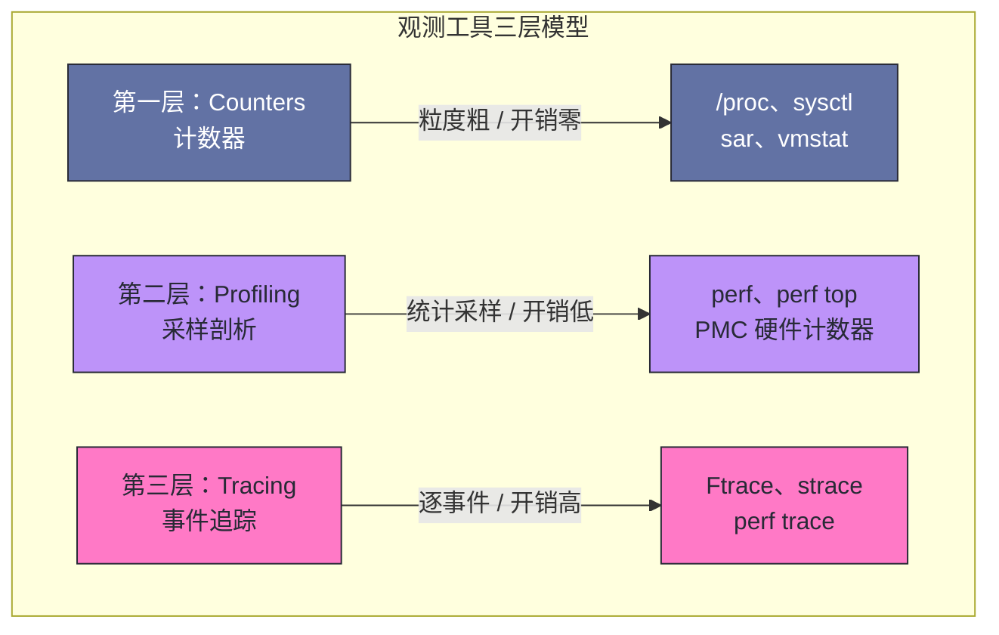
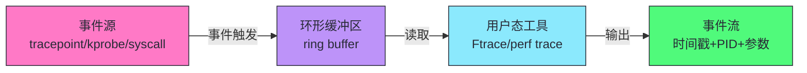
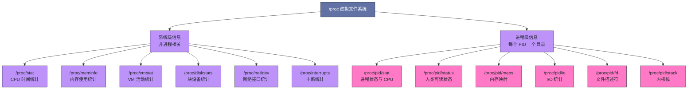
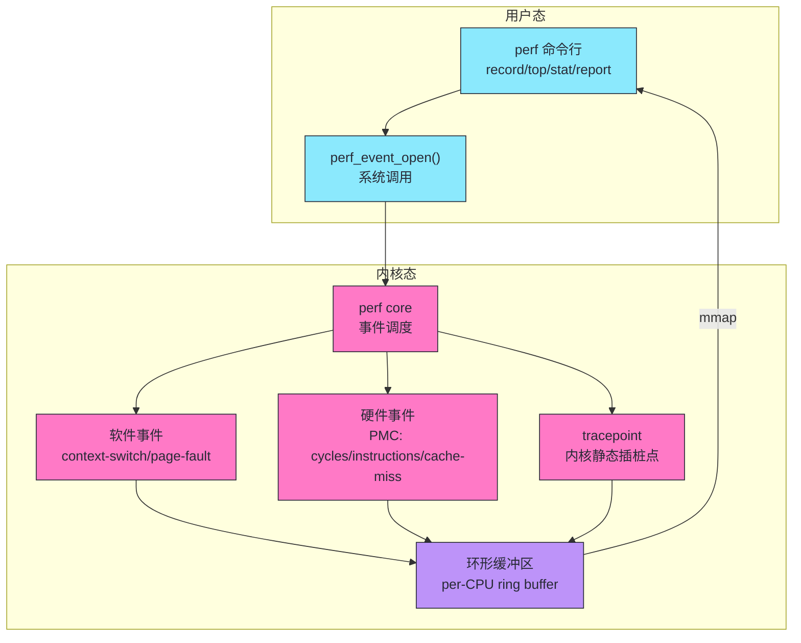
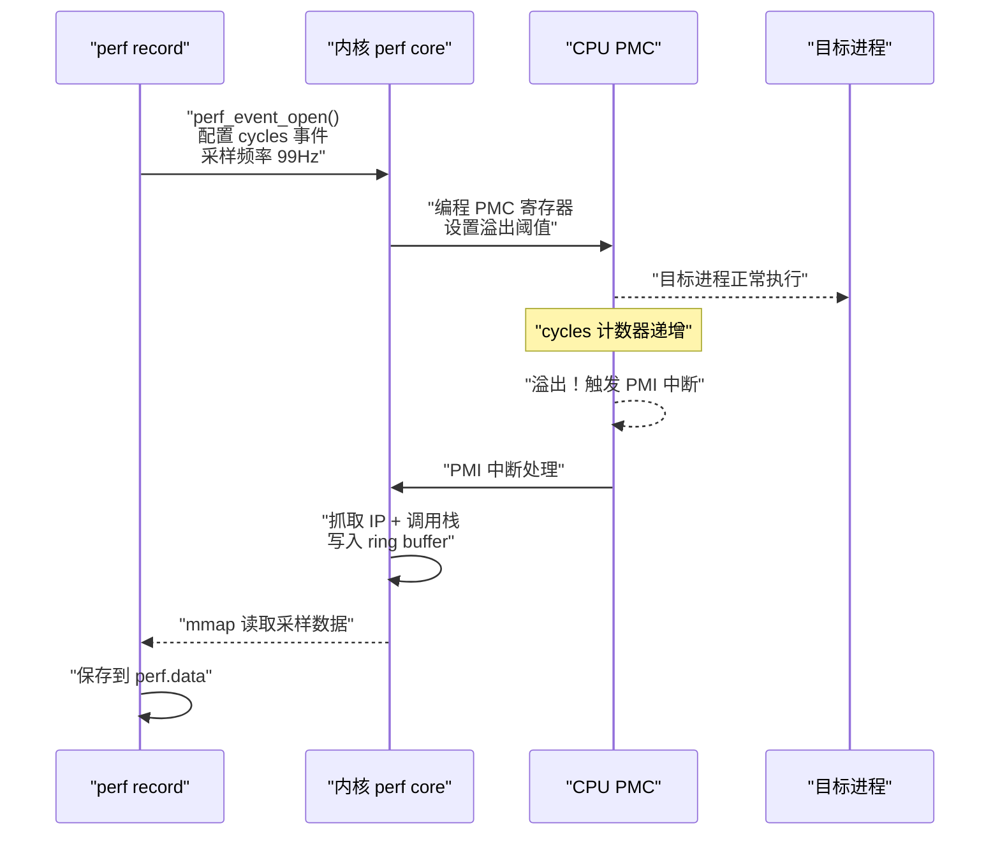
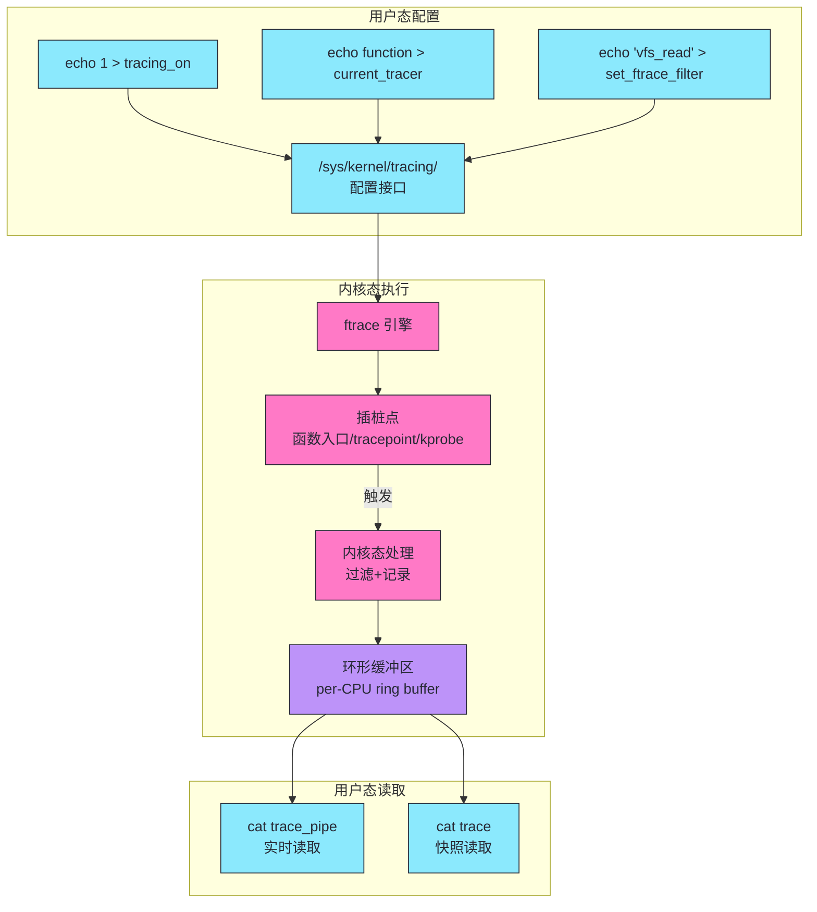
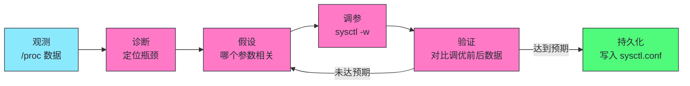
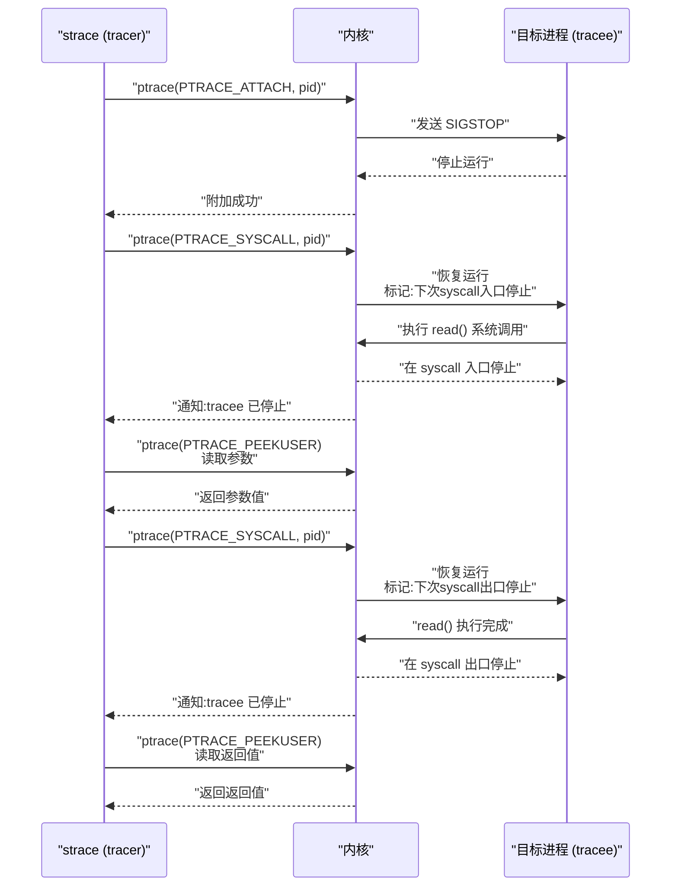
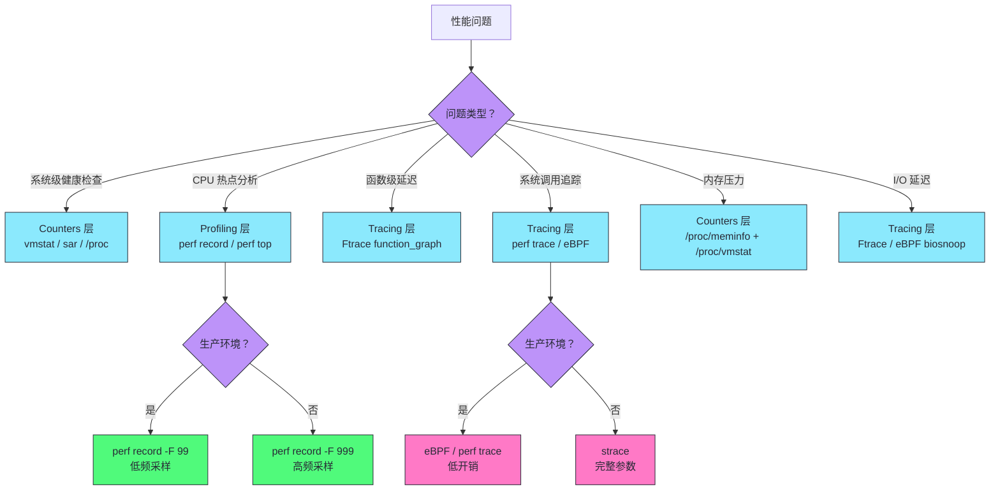

# 02 系统级性能观测：从 proc 到 perf 与 Ftrace

> [!abstract] 摘要
> 本文是系统性能工程实战系列的第二篇，聚焦 Linux 系统级性能观测工具栈的三个层次：Counters、Tracing、Profiling。文章从观测工具的三层模型切入，讲清楚为什么性能观测不是"一个工具搞定一切"，而是需要不同抽象层级的工具配合。随后逐层展开：第一层是 `/proc` 虚拟文件系统与 `sysctl`——内核暴露的"免费"计数器，零开销但粒度粗；第二层是 `perf`——基于 PMC 硬件计数器的采样式 Profiler，以统计采样换取低开销，是生产环境 CPU 性能分析的主力；第三层是 Ftrace——内核函数级追踪器，能精确记录函数调用链和延迟，但开销随事件率线性增长。最后深入剖析 strace 的 ptrace 机制为什么会让生产应用性能下降 10 倍以上，以及什么时候该用 strace、什么时候必须换工具。阅读本文后，你将建立一个清晰的观测工具选型框架：什么场景用什么工具，为什么用它，以及它的代价是什么。

---

## 第 1 章 观测工具的三层模型：Counters、Tracing、Profiling

### 1.1 为什么需要三层模型

性能问题的诊断，本质上是"从现象到根因"的推理过程。一个进程变慢了，可能是 CPU 瓶颈、内存瓶颈、I/O 瓶颈、锁竞争、调度延迟——每一种根因需要不同层级的观测手段才能定位。没有一种工具能覆盖所有层级的观测需求，这不是工具做得不够好，而是观测本身存在一个根本性的权衡：**观测的精度越高，开销越大；开销越小，精度越低**。

Brendan Gregg 在《Systems Performance》中把所有观测工具归纳为三种范式：Counters（计数器）、Tracing（追踪）、Profiling（采样剖析）。这三种范式不是并列关系，而是递进关系——从粗粒度到细粒度，从低开销到高开销，从"知道发生了什么"到"知道为什么发生"。



### 1.2 Counters：内核的"免费"账本

**是什么。** Counters 是内核维护的统计计数器，记录"从系统启动到现在，某件事发生了多少次"。Linux 内核在运行过程中天然需要维护各种统计信息——调度器需要记录上下文切换次数、内存管理需要记录页面分配/回收次数、块设备层需要记录 I/O 完成次数。这些计数器本来就在内核数据结构里，只需要暴露给用户态就能用，不需要额外开销。

**为什么出现。** 最早期的 Unix 性能观测就是基于计数器——`iostat`、`vmstat`、`sar` 这些工具的历史可以追溯到 1980 年代。它们的共同特点是读取内核维护的累计计数器，计算两次读取之间的差值，得到速率。这种方式的优点是开销几乎为零：计数器本来就在内核里，用户态只是读一下。

**不这样会怎样。** 如果没有 Counters，你想知道"系统每秒有多少次上下文切换"，唯一的办法是挂一个 tracepoint 到调度器，记录每次 `context_switch` 事件。一个繁忙系统每秒可能有数十万次上下文切换，逐事件记录的开销足以影响测量结果本身——这就是"观测者效应"。Counters 避免了这个问题：内核只维护一个整数，每次 `context_switch` 时自增，开销是单条指令级别。

**如何落地。** Linux 的 Counters 主要通过 `/proc` 虚拟文件系统暴露：

| 接口 | 位置 | 典型内容 | 读取方式 |
|------|------|---------|---------|
| `/proc/stat` | 全局 CPU 统计 | user/nice/system/idle/iowait 时间 | 文本读取 |
| `/proc/<pid>/stat` | 进程级统计 | CPU 时间、内存、页面错误 | 文本读取 |
| `/proc/diskstats` | 块设备统计 | 读写完成数、扇区数、延迟 | 文本读取 |
| `/proc/net/dev` | 网络接口统计 | 收发包数、字节数、错误数 | 文本读取 |
| `/proc/vmstat` | 内存管理统计 | 页面分配/回收/swap 活动 | 文本读取 |

**边界与反例。** Counters 的根本局限是**只有"量"没有"分布"**。`/proc/stat` 告诉你系统累计花了 100 秒在 iowait 上，但不会告诉你这 100 秒是均匀分布的还是集中在某一次 I/O 风暴。它告诉你发生了 1000 次上下文切换，但不会告诉你哪 10 次切换的延迟最高。Counters 能回答"有没有问题"，但不能回答"问题出在哪里"。这就是为什么需要 Tracing 和 Profiling。

> [!note] 设计哲学：Counters 是"体温计"不是"X 光"
> Counters 的价值在于快速判断"系统是否健康"，就像体温计能告诉你发烧了但不能告诉你哪里发炎。生产环境的监控告警系统（Prometheus、node_exporter）本质上就是 Counters 的持续采集和阈值判断。但当你收到告警需要定位根因时，Counters 就不够了——你需要进入 Tracing 和 Profiling 层级。

### 1.3 Tracing：逐事件的精确记录

**是什么。** Tracing 是"记录每一个感兴趣的事件"。与 Counters 只维护累计数字不同，Tracing 会为每个事件生成一条记录，包含时间戳、PID、CPU、事件参数等完整信息。Ftrace、strace、`perf trace` 都属于这一层。

**为什么出现。** Counters 无法回答"分布"问题——不知道延迟分布、不知道调用链、不知道哪个进程在哪个时间点做了什么。Tracing 的出现就是为了填补这个空白。当你需要知道"每次 I/O 请求的延迟是多少微秒"、"进程 A 在时间 T 调用了哪些系统调用"、"函数 `vfs_read` 的调用栈是什么"——这些都需要 Tracing。

**不这样会怎样。** 没有 Tracing，你只能看到聚合后的数字，看不到个体事件。一个 I/O 延迟 P99 从 1ms 涨到 50ms，Counters 只会显示"总 I/O 时间增加了"，但你看不出是所有请求都变慢了还是只有少数请求变慢了。这种分布信息对于根因分析至关重要——均匀变慢和尾部延迟突刺是完全不同的问题，需要不同的解决方案。

**如何落地。** Tracing 的核心机制是"事件源 + 环形缓冲区 + 用户态读取"：



**边界与反例。** Tracing 的致命问题是**开销与事件率成正比**。一个每秒 10 万 IOPS 的数据库，如果用 Tracing 记录每个 I/O 事件的完整信息，每秒要产生 10 万条记录、每条几十字节、总共数 MB 的数据需要从内核态传到用户态。这不仅消耗 CPU，还会改变缓存行为和调度模式，导致测量结果失真。这就是为什么 strace 不能在生产环境用——它的开销足以让应用性能下降一个数量级（详见第 6 章）。

### 1.4 Profiling：统计采样的艺术

**是什么。** Profiling 是介于 Counters 和 Tracing 之间的折中方案。它不记录每个事件，而是以固定频率"采样"——每隔一段时间抓取一次系统状态（通常是 CPU 上的指令地址和调用栈），用统计方法推断整体行为。`perf record`、`perf top` 是典型的 Profiling 工具。

**为什么出现。** Tracing 太贵，Counters 太粗。Profiling 填补了中间的空白：用"采样"代替"全量记录"，用"统计推断"代替"精确计数"。在 99Hz 的采样频率下，每秒只抓取 99 个样本，无论系统负载多高，开销都是固定的、可预测的。这使得 Profiling 可以在生产环境长期运行，而 Tracing 通常只能在排障时短时间开启。

**不这样会怎样。** 没有 Profiling，你要分析 CPU 热点只有两个选择：要么用 Counters 看聚合数据（只知道 CPU 利用率高但不知道在执行什么代码），要么用 Tracing 记录每次函数调用（开销太大）。Profiling 用统计采样的方式，在可接受的开销下给出"代码热点分布"——哪个函数占了最多 CPU 时间、调用栈最频繁的路径是什么。

**如何落地。** Profiling 的采样源有两种：

| 采样源 | 触发方式 | 精度 | 典型用途 |
|--------|---------|------|---------|
| 软件定时器（HRTIMER） | 周期性中断 | 低（受中断延迟影响） | 通用 CPU Profiling |
| PMC 硬件计数器 | 硬件溢出中断 | 高（精确到指令） | 指令级热点分析、Cache Miss 分析 |

> [!info] 核心概念：为什么 Profiling 用"采样"而不是"全量"
> 采样的本质是"用部分推断整体"。一个函数在 99Hz 采样中被抓到 30 次（占 30%），统计上意味着它大约占了 30% 的 CPU 时间。这个推断是否准确取决于样本量——99Hz 采样 10 秒 = 990 个样本，对于识别占 5% 以上 CPU 的热点足够可靠；但对于占 0.1% 的冷函数，990 个样本中可能只出现 1 次，统计误差很大。提高精度的方法是提高采样频率或延长采样时间，但两者都会增加开销。**Profiling 的核心权衡是：采样频率越高，结果越精确，但开销也越大**。

### 1.5 三层模型的对比总结

| 维度 | Counters | Profiling | Tracing |
|------|---------|-----------|---------|
| 记录方式 | 累计计数 | 统计采样 | 逐事件记录 |
| 开销 | 几乎为零 | 低且固定 | 随事件率线性增长 |
| 精度 | 只有总量 | 统计推断 | 精确到每个事件 |
| 分布信息 | 无 | 有（直方图） | 有（完整分布） |
| 调用栈 | 无 | 有 | 取决于工具 |
| 生产可用性 | 完全可用 | 可用（低频率） | 谨慎使用 |
| 典型工具 | vmstat、sar、/proc | perf record、perf top | Ftrace、strace |
| 回答的问题 | "有没有问题" | "问题在哪段代码" | "问题怎么发生的" |

> [!note] 设计哲学：观测工具的"不可能三角"
> 精度、开销、覆盖范围——这三者构成观测工具的"不可能三角"。Counters 选择了低开销加广覆盖但牺牲精度；Tracing 选择了高精度加广覆盖但牺牲低开销；Profiling 是折中——中等精度、中等开销、中等覆盖。没有任何工具能同时做到高精度、低开销、全覆盖。理解这个不可能三角，是观测工具选型的第一原则。

---

## 第 2 章 /proc 虚拟文件系统：内核的"自助服务窗口"

### 2.1 /proc 是什么：一个不占磁盘的文件系统

`/proc` 是 Linux 内核提供的一个虚拟文件系统（pseudo-filesystem）。它不对应磁盘上的任何文件——文件的内容是内核在每次 `read()` 系统调用时动态生成的。当你在 shell 里执行 `cat /proc/stat` 时，内核的 `proc` 模块拦截这次读取，实时从内核各子系统的数据结构中提取统计信息，格式化为文本返回。

这个设计看似简单，但它的优雅之处在于：**用文件系统接口暴露内核状态，让用户态工具不需要任何特殊 API 就能读取内核信息**。任何能读文件的工具——`cat`、`grep`、`awk`、Python 的 `open()`——都能读取 `/proc`。这是 Unix 哲学"一切皆文件"在内核观测领域的体现。

`/proc` 的内容分为两类：



### 2.2 /proc/stat：CPU 时间的天书

`/proc/stat` 是 `/proc` 中最常被读取的文件之一。它的第一行 `cpu` 行记录了系统启动以来所有 CPU 的时间消耗分布：

```
cpu  33589978 1032 19238457 89823456 2348923 0 456782 0 0 0
```

这些数字依次是：user、nice、system、idle、iowait、irq、softirq、steal、guest、guest_nice——单位是 `USER_HZ`（通常 1/100 秒，即 10ms）。

理解每一列的含义是分析 CPU 瓶颈的基础：

| 字段 | 含义 | 性能诊断意义 |
|------|------|-------------|
| user | 用户态时间 | 高 → CPU 被应用逻辑消耗 |
| nice | 低优先级用户态时间 | 高 → 有 nice 值为正的进程在跑 |
| system | 内核态时间 | 高 → 大量系统调用或内核处理 |
| idle | 空闲时间 | 低 → CPU 瓶颈；高 → CPU 不是瓶颈 |
| iowait | 等 I/O 完成的空闲 | 高 → I/O 瓶颈（但需谨慎解读） |
| irq | 硬中断处理时间 | 高 → 硬件中断风暴 |
| softirq | 软中断处理时间 | 高 → 网络/块设备软中断繁忙 |
| steal | 被宿主偷走的时间 | 高 → 虚拟化超卖（仅云环境） |

> [!warning] 生产避坑：iowait 是最容易误读的指标
> iowait 的定义是"CPU 空闲（idle）且有待完成的 I/O 请求"的时间。它不是"I/O 等待时间"，而是"因为等 I/O 而空闲的 CPU 时间"。这导致两个常见的误读：
> 1. **iowait 高不等于 I/O 慢**。如果系统 I/O 很快但请求很密集，CPU 在 I/O 完成间隙没有其他事做，iowait 也会高。反之，如果系统有足够多的计算任务，即使 I/O 很慢，CPU 也不会 idle，iowait 反而低——但 I/O 瓶颈依然存在。
> 2. **iowait 会随 CPU 负载波动**。同一台机器、同样的 I/O 负载，在 CPU 空闲时 iowait 高，在 CPU 繁忙时 iowait 低。这导致 iowait 不是一个稳定的 I/O 性能指标。
> **正确做法**：判断 I/O 瓶颈用 `/proc/diskstats` 中的队列长度和完成延迟，而不是 iowait。iowait 只适合作为"CPU 是否因 I/O 而闲置"的辅助参考。

### 2.3 /proc/meminfo：内存状态的完整画像

`/proc/meminfo` 提供了系统内存使用的详细分解。这个文件有几十行，但性能分析时最关键的是以下几个字段：

| 字段 | 含义 | 性能诊断意义 |
|------|------|-------------|
| MemTotal | 物理内存总量 | 基线参考 |
| MemFree | 完全未使用的内存 | **单独看无意义**（见下方解释） |
| MemAvailable | 估算的可用内存 | 判断内存压力的首选指标 |
| Buffers | 块设备缓冲区 | 内核对块 I/O 的缓存 |
| Cached | [[Page Cache]] | 文件数据的缓存 |
| SwapCached | 被 swap 出又 swap 回的页 | 高 → 内存压力导致频繁 swap |
| Active/Inactive | 活跃/非活跃页链表 | Inactive 高 → 有可回收内存 |
| Slab | 内核 slab 分配器占用 | 高 → 内核对象缓存占用大 |
| Mapped | 被映射到用户地址空间的页 | mmap 相关分析 |

**为什么 MemFree 单独看无意义。** Linux 的内存管理哲学是"闲着的内存是浪费的内存"。内核会主动把空闲内存用于 [[Page Cache]]——缓存磁盘文件数据，加速后续的文件读取。因此一个健康运行的 Linux 系统，MemFree 通常很低（可能只有几百 MB），但这不代表内存紧张——因为 Page Cache 在内存压力时可以被回收。

MemAvailable 是 Linux 3.14 引入的字段，它估算的是"如果需要分配内存，能拿到多少"——包括 MemFree 加上可回收的 Page Cache 和可回收的 Slab。这个数字比 MemFree 更能反映真实的内存可用性。

> [!info] 核心概念：MemAvailable 的计算逻辑
> MemAvailable 的估算公式大致是：`MemFree + Active(file) + Inactive(file) - 预留阈值`。内核假设大部分文件缓存（file-backed pages）在内存压力时可以被回收（直接丢弃，因为数据在磁盘上有副本）。但这个估算不是精确的——某些 Page Cache 可能正在被写入（dirty），不能立即回收；某些 Slab 缓存（dentry、inode）可以回收但需要时间。因此 MemAvailable 是一个"乐观估算"，在极端情况下可能高估可用内存。

### 2.4 /proc/diskstats：块设备性能的真相

`/proc/diskstats` 是分析磁盘 I/O 性能的核心数据源。每个块设备一行，包含 20 个字段。对于性能分析，最关键的是以下几个：

| 字段序号 | 含义 | 性能诊断用法 |
|---------|------|-------------|
| 1 | 读完成次数 | IOPS 的读分量 |
| 2 | 读合并次数 | 高 → I/O 调度器合并效果好 |
| 3 | 读扇区数 | 吞吐量的读分量 |
| 4 | 读花费时间（ms） | 读延迟累计 |
| 5 | 写完成次数 | IOPS 的写分量 |
| 8 | 写花费时间（ms） | 写延迟累计 |
| 9 | 当前 I/O 请求数 | 队列深度 |
| 10 | I/O 总花费时间（ms） | 包含等待+服务时间 |
| 11 | 加权 I/O 时间（ms） | 队列深度加权时间 |

从这些字段可以计算出两个关键派生指标：

**平均队列长度** = 字段 10 / 采样间隔时间。如果采样间隔是 1 秒，字段 10 是 500ms，说明平均有 0.5 个请求在队列中等待。

**平均服务时间** = 字段 4 / 字段 1。如果读花费 1000ms 完成了 1000 次读，平均每次读服务时间 1ms。这个数字接近磁盘的物理性能极限。

`iostat -x` 命令就是读取 `/proc/diskstats` 并计算这些派生指标的封装。理解 `/proc/diskstats` 的字段含义，能让你在不依赖 `iostat` 的情况下直接分析原始数据——在容器环境或最小化系统中，`iostat` 可能未安装，但 `/proc/diskstats` 永远存在。

### 2.5 /proc/<pid>/：进程级观测

每个运行中的进程在 `/proc` 下有一个以 PID 命名的目录，包含该进程的详细信息。性能分析时最常用的文件：

**/proc/\<pid\>/stat** 包含进程的调度和 CPU 信息。第 14 字段（utime）和第 15 字段（stime）分别是用户态和内核态 CPU 时间，第 17 字段（num_threads）是线程数，第 20 字段是启动后的上下文切换次数。`top` 和 `ps` 命令的 CPU 使用率数据就来自这里。

**/proc/\<pid\>/io** 包含进程级 I/O 统计——读写字节数、实际产生 I/O 的字节数（rchar/wchar vs read_bytes/write_bytes 的区别是前者包含 Page Cache 命中，后者只统计实际到设备的 I/O）。这个文件需要进程有 `CAP_SYS_RESOURCE` 能力或属于同一用户才能读取。

**/proc/\<pid\>/stack** 包含进程当前的内核栈回溯。这是一个"瞬时快照"——每次读取时捕获当前时刻的内核栈。如果你在一个循环里反复读取 `/proc/<pid>/stack`，相当于在做手动采样（poor man's profiler）。Brendan Gregg 的 off-CPU 分析技术中，有一种方法就是用 `perf` 采样 `/proc/<pid>/stack`。

> [!note] 设计哲学：/proc 的"零 API 成本"设计
> `/proc` 的设计让内核观测不需要专门的库或 API——标准文件 I/O 就是接口。这意味着任何语言、任何工具都能读取内核状态，不需要链接内核库或调用特殊系统调用。这个设计降低了内核观测的门槛，也使得 `/proc` 成为 Linux 性能工具生态的基础设施。vmstat、sar、top、iostat、free——这些工具底层都在读 `/proc`。理解 `/proc` 就是理解这些工具的数据来源和局限。

### 2.6 sysctl：/proc/sys 的可写接口

`/proc/sys` 是 `/proc` 中一个特殊的子目录——它不仅可读，还可写。通过写入 `/proc/sys` 下的文件，可以动态修改内核运行时参数。`sysctl` 命令就是 `/proc/sys` 的封装。

| 路径 | sysctl 参数 | 作用 | 性能相关场景 |
|------|-----------|------|-------------|
| `/proc/sys/vm/swappiness` | vm.swappiness | swap 倾向度（0-100） | 内存压力调优 |
| `/proc/sys/vm/dirty_ratio` | vm.dirty_ratio | dirty page 占内存百分比上限 | I/O 突发写入控制 |
| `/proc/sys/vm/dirty_background_ratio` | vm.dirty_background_ratio | 后台刷脏页阈值 | I/O 平滑控制 |
| `/proc/sys/net/core/somaxconn` | net.core.somaxconn | accept 队列上限 | 高并发连接调优 |
| `/proc/sys/net/ipv4/tcp_tw_reuse` | net.ipv4.tcp_tw_reuse | TIME_WAIT 端口复用 | 短连接高频场景 |
| `/proc/sys/kernel/sched_migration_cost_ns` | kernel.sched_migration_cost_ns | 任务迁移成本阈值 | NUMA 调度调优 |
| `/proc/sys/fs/file-max` | fs.file-max | 系统级文件描述符上限 | 高并发连接数 |

**sysctl 的两个关键特性：**

第一，**动态生效**。`sysctl -w vm.swappiness=10` 立即修改内核参数，不需要重启。这使得 sysctl 成为运行时调优的主要手段。但动态修改的参数在重启后会丢失——永久生效需要写入 `/etc/sysctl.conf` 或 `/etc/sysctl.d/` 目录。

第二，**命名空间隔离**。部分 sysctl 参数是 per-namespace 的——容器有自己的 `/proc/sys` 视图，修改容器内的 sysctl 只影响容器自身。但并非所有参数都能在容器中修改：`vm.swappiness` 等全局参数是只读的（容器看不到宿主的真实值，也改不了），`net.ipv4.*` 等网络参数在容器自己的 network namespace 中可改。

> [!warning] 生产避坑：sysctl 调优不是"抄配置"
> 网上流传的"Linux 性能调优 sysctl 配置"清单，很多是特定场景下的参数（如高并发 Web 服务器、数据库），直接照搬到你的环境可能适得其反。例如 `tcp_tw_reuse=1` 在短连接高频场景有用，但在长连接场景无意义；`vm.swappiness=0` 在数据库场景合理（避免 swap 干扰），但在内存紧张且 I/O 负载高的场景可能导致 OOM 更早触发。**sysctl 调优的前提是先观测、后调参——用 `/proc` 数据确认瓶颈在哪里，再针对性调整对应参数**。

---

## 第 3 章 perf：基于 PMC 的采样剖析引擎

### 3.1 perf 是什么：Linux 内核的性能分析瑞士军刀

`perf` 是 Linux 内核源码树中自带的性能分析工具（位于 `tools/perf/`），它通过 `perf_event_open` 系统调用与内核的 perf 子系统交互。perf 的能力覆盖了 Profiling（采样剖析）和 Tracing（事件追踪）两个层级，但它的核心价值在于 Profiling——基于硬件性能计数器（PMC）的采样分析。

perf 的架构分为用户态前端和内核态后端：



perf 能观测的事件分三类：

| 事件类型 | 来源 | 示例 | 开销 |
|---------|------|------|------|
| 硬件事件（PMC） | CPU 性能监控单元 | cycles、instructions、cache-misses、branch-misses | 极低（硬件计数） |
| 软件事件 | 内核软件计数器 | context-switches、page-faults、task-clock | 低 |
| tracepoint | 内核静态插桩点 | syscalls:sys_enter_read、sched:sched_switch | 中（取决于事件率） |

### 3.2 PMC 硬件计数器：perf 的性能基础

**是什么。** PMC（Performance Monitoring Counter）是现代 CPU 内置的硬件计数器，专门用于性能监控。一颗典型的 x86 CPU 有 3-8 个通用 PMC 寄存器，每个寄存器可以独立配置为计数某种硬件事件——如已执行的指令数、发生的 Cache Miss 数、分支预测失败数。计数器溢出时可以触发中断，perf 利用这个机制实现精确的采样。

**为什么出现。** 纯软件的性能分析有根本性的盲区：软件能看到"哪个函数在执行"，但看不到"这个函数为什么慢"——是因为 Cache Miss？分支预测失败？还是指令依赖导致的流水线停顿？这些是 CPU 微架构层面的问题，只有硬件计数器能观测。PMC 的出现让性能分析从"代码级"深入到"微架构级"。

**不这样会怎样。** 没有 PMC，你看到 `memcpy` 占了 30% CPU，但不知道为什么它这么慢——是数据不在 Cache 里导致每次都要访问内存？还是数据对齐不好导致多次 Cache Line 访问？没有 PMC 你只能猜。有了 PMC，你可以直接测量 `memcpy` 执行期间的 L1/L2/L3 Cache Miss 率，精确定位瓶颈来源。

**如何落地。** perf 通过 `perf stat` 命令读取 PMC 计数器：

```bash
# 统计某命令的 PMC 事件
perf stat -e cycles,instructions,cache-references,cache-misses,branch-misses ./my_app

# 输出示例：
#   1,234,567,890      cycles
#     890,123,456      instructions   #    0.72  insn per cycle
#      12,345,678      cache-references
#       1,234,567      cache-misses    #   10.0% of all cache refs
#         567,890      branch-misses
```

几个关键派生指标：

| 指标 | 计算方式 | 含义 | 健康范围 |
|------|---------|------|---------|
| IPC | instructions / cycles | 每周期执行指令数 | >1.0 为好，<0.5 需关注 |
| Cache Miss 率 | cache-misses / cache-references | Cache 失败比例 | <5% 为好，>20% 需关注 |
| 分支预测失败率 | branch-misses / branches | 分支预测错误比例 | <1% 为好，>5% 需关注 |

> [!info] 核心概念：IPC（Instructions Per Cycle）的含义
> IPC 是衡量 CPU 执行效率的核心指标。现代 x86 CPU 理论上可以每个周期执行 4-6 条指令（超标量），但由于指令依赖、Cache Miss、分支预测失败等原因，实际 IPC 通常远低于理论值。
> - IPC > 1.0：CPU 利用率良好，指令流水线基本打满
> - IPC 0.5-1.0：CPU 有一定程度的停顿，可能是轻量 Cache Miss 或分支预测问题
> - IPC < 0.5：CPU 严重停顿，通常是大量 Cache Miss（数据在内存而非 Cache 中）或锁等待
> IPC 低不一定是代码写得差——内存密集型应用（如数据库扫描大表）天然 IPC 低，因为数据量大 Cache 装不下。IPC 要结合应用类型一起解读。

### 3.3 perf record：采样式 CPU Profiling

`perf record` 是 perf 最常用的子命令，用于采集 CPU 采样数据。它的工作原理：

1. 用户指定采样频率（如 `-F 99` 表示 99Hz，每秒采样 99 次）
2. perf 通过 `perf_event_open` 配置 PMC 的 cycles 计数器，设置溢出周期
3. CPU 执行指令时，cycles 计数器递增；溢出时触发 PMI（Performance Monitoring Interrupt）
4. PMI 处理器在内核态抓取当前 CPU 上正在执行的指令地址（IP）和调用栈
5. 采样数据写入 per-CPU 的环形缓冲区，perf 用户态前端通过 mmap 读取
6. 采集结束后，数据保存到 `perf.data` 文件，用 `perf report` 分析



**为什么默认采样频率是 99Hz 而不是更高。** perf 的默认采样频率是 99Hz（`-F 99`）。这个数字不是随意的——它避开了 100Hz 和 1000Hz 这两个"危险频率"。许多系统定时器以 100Hz 或 1000Hz 运行，如果 perf 采样频率与定时器频率同步，采样会总是落在定时器中断处理函数上，导致采样偏差（总是抓到中断处理代码而不是应用代码）。99Hz 是一个质数频率，与常见定时器频率互质，能避免这种同步偏差。

**调用栈采集：fp 模式与 dwarf 模式。** `perf record` 采集调用栈有两种模式：

| 模式 | 命令参数 | 原理 | 优点 | 缺点 |
|------|---------|------|------|------|
| fp（Frame Pointer） | `-g`（默认） | 沿着 rbp 寄存器遍历栈帧 | 快（无额外内存访问） | 要求编译时未省略 fp（`-fomit-frame-pointer`） |
| dwarf（DWARF 调试信息） | `--call-graph dwarf` | 用 DWARF 调试信息 unwind 栈 | 兼容省略 fp 的二进制 | 慢（需读取调试信息和内存） |
| lbr（Last Branch Record） | `--call-graph lbr` | 用 CPU 的 LBR 硬件寄存器 | 极快（硬件辅助） | 栈深度有限（通常 16-32 层） |

> [!warning] 生产避坑：fp 模式在现代 Linux 发行版上可能失效
> 许多现代 Linux 发行版（如 Ubuntu、RHEL）默认用 `-fomit-frame-pointer` 编译系统库，导致 fp 模式无法回溯调用栈——你会看到只有一层的栈帧，看不到调用链。解决方案有两个：
> 1. 用 `--call-graph dwarf` 模式（需要安装 debuginfo 包）
> 2. 重新编译你的应用时加 `-fno-omit-frame-pointer`（只影响你自己的代码，系统库仍无 fp）
> **生产环境推荐 dwarf 模式**，虽然采样开销略高，但调用栈完整性有保障。

### 3.4 perf top：实时 CPU 热点

`perf top` 类似 `top` 命令，但显示的不是进程的 CPU 使用率，而是函数级别的 CPU 热点。它以默认 99Hz 频率采样全系统 CPU，实时统计每个函数被采样到的次数。

```bash
# 采样全系统 CPU 热点
sudo perf top

# 只采样特定进程
sudo perf top -p <pid>

# 只采样用户态函数（不采样内核态）
sudo perf top -e cycles:u
```

`perf top` 的典型输出：

```
   PerfTop:    1234 irqs/sec  kernel:42.1%  exact: 100.0% [cache-misses/1]
    12.34%  my_app   libc-2.31.so   [.] __memcpy_avx_unaligned
     8.21%  my_app   my_app         [.] process_data
     5.67%  [kernel] [k] __do_softirq
     3.45%  my_app   libc-2.31.so   [.] __strcmp_sse42
```

`perf top` 适合快速判断"系统当前在执行什么代码"。它的局限是不保留历史数据——如果问题已经过去，`perf top` 看不到了。需要持续记录的场景应该用 `perf record`。

### 3.5 perf report：离线分析采样数据

`perf record` 采集的数据保存在 `perf.data` 中，用 `perf report` 分析。`perf report` 提供交互式 TUI 界面，可以按调用栈层级展开、按调用者/被调用者排序、过滤特定进程或符号。

```bash
# 采集 10 秒的全系统 CPU 采样
sudo perf record -F 99 -ag -- sleep 10

# 分析
sudo perf report

# 生成文本报告（用于脚本处理）
sudo perf report --stdio --no-children
```

几个关键参数解读：

- `-F 99`：采样频率 99Hz
- `-a`：采样全系统（所有 CPU），不限于特定进程
- `-g`：采集调用栈
- `--no-children`：在报告中只显示函数自身开销，不包含其调用的子函数开销（Self vs Inclusive）

**Self vs Inclusive 的区别。** 这是 Profiling 报告中最容易混淆的概念：

| 概念 | 含义 | 典型场景 |
|------|------|---------|
| Self（自身开销） | 函数自身指令执行占的采样比例 | 函数内有大量计算 |
| Inclusive（包含子调用） | 函数及其所有子调用占的采样比例 | 函数是调用链入口 |

一个函数 Self 开销低但 Inclusive 开销高，说明它本身没做什么计算，但调用的子函数很耗时——这种函数是"调度者"而非"执行者"。优化时应该深入它的子调用链找真正的热点，而不是优化这个调度函数本身。

### 3.6 perf 的火焰图：可视化调用栈

`perf record` 的数据可以用 [[Brendan Gregg]] 的 FlameGraph 工具可视化成火焰图。火焰图的横轴是采样次数（即 CPU 占比），纵轴是调用栈深度，每个矩形代表一个函数。

```bash
# 采集数据
sudo perf record -F 99 -ag -- sleep 30

# 折叠调用栈
sudo perf script | ./stackcollapse-perf.pl > out.folded

# 生成火焰图 SVG
./flamegraph.pl out.folded > flame.svg
```

火焰图的阅读方法：

- **宽度** = 函数的 Inclusive CPU 占比。越宽越热。
- **高度** = 调用栈深度。从下往上是调用关系（下方函数调用上方函数）。
- **寻找"宽 plateau"** = 一个函数很宽且上方栈帧少，说明这个函数自身是热点，应该优先优化。
- **寻找"高塔"** = 调用栈很深但顶部函数不宽，说明调用链长但每层开销不大，通常不是优化重点。

> [!note] 设计哲学：火焰图为什么用"宽度"而不是"高度"表示热度
> Brendan Gregg 设计火焰图时选择宽度表示 CPU 占比，是因为人眼对宽度的比较比对高度的比较更敏感。一个占 30% CPU 的函数在火焰图上是一个很宽的矩形，一眼就能看到；如果用高度表示，30% 和 10% 的差异在视觉上不明显。此外，宽度方向可以无限延伸（多 CPU 栈帧并排），而高度受屏幕高度限制。这个设计选择让火焰图成为 CPU Profiling 最直观的可视化工具。

### 3.7 perf 的边界与局限

perf 虽然强大，但有几个必须了解的局限：

**第一，采样偏差。** perf 是统计采样，不是全量记录。如果某个函数执行时间极短但被频繁调用，它可能在采样中完全不可见——因为采样间隔（99Hz = 10.2ms）远大于函数执行时间（可能只有几微秒）。这种"短而频"的函数在 perf 中会被低估。解决方案是提高采样频率（如 `-F 999`），但开销也会增加。

**第二，PMU 限制。** CPU 的通用 PMC 寄存器数量有限（通常 3-8 个），同时能计数的硬件事件种类有限。如果你想同时测量 cycles、instructions、cache-misses、branch-misses、L1-dcache-load-misses 五个事件，可能超出 PMC 寄存器数量，perf 会用"多路复用"（multiplexing）——轮流计数不同事件，每个事件只被计数一部分时间，然后用比例换算。这会导致计数不精确。`perf stat` 输出中的 "not counted" 或 "not supported" 就是这个原因。

**第三，内核版本依赖。** perf 的功能与内核版本强相关——用户态 perf 工具的版本必须与内核版本匹配，否则某些事件可能不可用或行为异常。在容器环境中，容器内的 perf 工具版本可能与宿主内核版本不一致，导致问题。最佳实践是 perf 工具与内核同源安装。

---

## 第 4 章 Ftrace：内核函数追踪的基石

### 4.1 Ftrace 是什么：内核内置的追踪框架

Ftrace（Function Tracer）是 Linux 内核 2.6.27 引入的内置追踪框架。它的名字容易误导——虽然叫"Function Tracer"，但 Ftrace 早已不限于函数追踪，它是一个通用的内核追踪基础设施，支持 tracepoint、kprobe、函数追踪、事件触发、直方图统计等多种功能。

Ftrace 的核心设计是**完全在内核态完成追踪和过滤**，不需要用户态工具参与事件处理。用户通过 `/sys/kernel/debug/tracing/`（或 `/sys/kernel/tracing/`）目录下的文件配置追踪参数，内核完成追踪并把结果写入环形缓冲区，用户再读取缓冲区内容。



### 4.2 Ftrace 的追踪器类型

Ftrace 支持多种"追踪器"（tracer），每种追踪器关注不同的观测维度：

| 追踪器 | 功能 | 典型用途 |
|--------|------|---------|
| function | 追踪内核函数调用 | 内核调用流分析 |
| function_graph | 追踪函数调用+返回（带耗时） | 函数延迟分析 |
| nop | 不追踪（用于 tracepoint 事件） | 事件追踪 |
| hwlat | 检测硬件延迟 | 实时性测试 |
| irqsoff | 追踪中断关闭最长时间 | 中关延迟分析 |
| preemptoff | 追踪抢占关闭最长时间 | 调度延迟分析 |
| wakeup | 追踪最高优先级进程被唤醒的延迟 | 调度延迟 |
| wakeup_rt | 追踪实时进程唤醒延迟 | RT 调度分析 |

**function 追踪器** 是最基础的。它通过编译时在内核函数入口插入对 `__fentry__`（x86）或 `mcount` 的调用来实现。当 function 追踪器启用时，每个内核函数入口都会调用 ftrace 的处理函数，记录函数名和时间戳。当追踪器禁用时，`__fentry__` 调用被替换为 NOP 指令，开销为零——这是 Ftrace 的"零成本禁用"设计。

**function_graph 追踪器** 在 function 的基础上增加了函数返回追踪。它不仅记录"调用了什么函数"，还记录"函数执行了多久"。这是分析内核函数延迟的利器——你可以看到 `vfs_read` 花了 200 微秒，其中 `ext4_file_read_iter` 花了 180 微秒，其中 `mpage_readpage` 花了 170 微秒——延迟在调用链上层层分解。

### 4.3 Ftrace 的过滤机制：set_ftrace_filter

function 追踪器默认会追踪所有内核函数——一个繁忙系统每秒有数百万次内核函数调用，全部记录会瞬间填满缓冲区并带来巨大开销。Ftrace 提供了过滤机制来缩小追踪范围：

```bash
# 只追踪 vfs_read 和 vfs_write
echo 'vfs_read vfs_write' > /sys/kernel/tracing/set_ftrace_filter

# 用通配符追踪 ext4 开头的所有函数
echo 'ext4_*' > /sys/kernel/tracing/set_ftrace_filter

# 追踪特定模块的函数
echo ':mod:ext4' > /sys/kernel/tracing/set_ftrace_filter

# 查看可追踪的函数列表
cat /sys/kernel/tracing/available_filter_functions | head
```

过滤是在内核态完成的——函数入口的 ftrace 调用会先检查过滤列表，只有匹配的函数才记录到缓冲区。这意味着不匹配的函数虽然也执行了 `__fentry__` 调用，但只做一次字符串比较就返回，开销极小。这是 Ftrace 比 strace 高效的关键原因之一——**过滤在内核态完成，不需要切换到用户态**。

### 4.4 Ftrace 事件追踪：tracepoint

除了函数追踪，Ftrace 还能追踪内核 tracepoint。tracepoint 是内核开发者预先在代码中埋设的静态追踪点，比函数追踪更稳定（API 有保证）且语义更清晰。

```bash
# 查看可用的事件
ls /sys/kernel/tracing/events/

# 启用调度类事件
echo 1 > /sys/kernel/tracing/events/sched/enable

# 启用特定事件
echo 1 > /sys/kernel/tracing/events/sched/sched_switch/enable

# 设置过滤器：只追踪 PID 1234 的调度事件
echo 'pid == 1234' > /sys/kernel/tracing/events/sched/sched_switch/filter

# 开始追踪
echo 1 > /sys/kernel/tracing/tracing_on

# 读取结果
cat /sys/kernel/tracing/trace_pipe
```

典型的事件输出：

```
<...>-1234  [003] d..2 1234567.890123: sched_switch: prev_comm=my_app prev_pid=1234 prev_prio=120 prev_state=R+ next_comm=kworker next_pid=5678 next_prio=120
```

这行记录包含了时间戳、CPU 编号、进程名、PID、调度优先级、进程状态等完整信息。通过分析 `sched_switch` 事件，可以计算每个进程的运行时间（on-CPU time）和等待时间（off-CPU time），这是调度延迟分析的基础。

### 4.5 Ftrace 的 function_graph：函数延迟分析

function_graph 追踪器是 Ftrace 最有特色的功能之一。它的输出格式直观地展示了函数调用层次和耗时：

```bash
# 启用 function_graph 追踪器
echo function_graph > /sys/kernel/tracing/current_tracer

# 只追踪 vfs_read 的调用子树
echo 'vfs_read' > /sys/kernel/tracing/set_graph_function

# 读取结果
cat /sys/kernel/tracing/trace_pipe
```

输出示例：

```
my_app-1234  |   1.234 ms  |        vfs_read() {
my_app-1234  |   0.012 ms  |          rw_verify_area();
my_app-1234  |   1.198 ms  |          ext4_file_read_iter() {
my_app-1234  |   0.045 ms  |            generic_file_read_iter();
my_app-1234  |   1.123 ms  |            mpage_readpage();
my_app-1234  |   1.198 ms  |          }
my_app-1234  |   1.234 ms  |        }
```

从这个输出可以直接看到：`vfs_read` 总共花了 1.234ms，其中绝大部分时间（1.198ms）花在 `ext4_file_read_iter` 里，而 `ext4_file_read_iter` 的时间又主要花在 `mpage_readpage`（1.123ms）上——延迟在调用链上层层分解，根因指向 `mpage_readpage`。

> [!info] 核心概念：function_graph 的"叶子函数"开销
> function_graph 追踪器只显示被追踪函数的耗时。当你用 `set_graph_function` 限定只追踪 `vfs_read` 时，`vfs_read` 调用的所有子函数都会被追踪（因为它们在 `vfs_read` 的调用子树内）。但如果你没有设置过滤，function_graph 会追踪所有内核函数，输出会极其冗长——一个简单的 `read()` 系统调用可能涉及上百个内核函数。**生产环境使用 function_graph 时，务必用 `set_graph_function` 限定到目标函数**。

### 4.6 Ftrace 的触发器机制：trigger

Ftrace 的触发器（trigger）机制允许在事件发生时执行特定动作，如打印栈、开始/停止追踪、计数等。这是一个强大的条件追踪能力：

```bash
# 当 vfs_read 被调用且返回值大于 1ms 时打印调用栈
echo 'vfs_read:traceoff if latency > 1000000' > /sys/kernel/tracing/events/ext4/ext4_file_read_iter/trigger

# 当某个 tracepoint 触发时打印调用栈
echo 'stacktrace' > /sys/kernel/tracing/events/sched/sched_switch/trigger

# 限制只触发一次
echo 'stacktrace:1' > /sys/kernel/tracing/events/sched/sched_switch/trigger
```

触发器的典型应用场景是"条件触发追踪"——平时不追踪（避免开销），当特定条件满足时（如延迟超过阈值）自动开始追踪，捕获问题发生时的完整上下文。这种"守株待兔"式的追踪是排查间歇性性能问题的关键技术。

### 4.7 Ftrace 的边界与局限

**第一，函数追踪的开销不可忽视。** 虽然 Ftrace 禁用时零开销（NOP 指令），但启用 function 追踪器时，每个内核函数入口都要执行 ftrace 处理函数，开销在百纳秒级别。一个繁忙系统每秒数百万次内核函数调用，总开销可能达到 5-15% CPU。**function 追踪器不适合在生产环境长期开启**，只适合短时间排障。

**第二，tracepoint 的稳定性 vs kprobe 的灵活性。** Ftrace 通过 tracepoint 追踪的事件是内核稳定的 API，但覆盖范围有限——只有内核开发者埋设了 tracepoint 的位置才能追踪。如果你想追踪一个没有 tracepoint 的内核函数，只能用 kprobe 动态插桩，但 kprobe 的稳定性不保证（函数可能在新内核版本中改名或移除）。

**第三，环形缓冲区的容量限制。** Ftrace 的环形缓冲区大小有限（默认每 CPU 几 MB），在高事件率下会很快填满。填满后新事件会覆盖旧事件（默认行为）或停止记录（取决于配置）。这意味着 Ftrace 捕获的是"最近的事件窗口"，不是完整历史。如果问题发生在一小时前，Ftrace 的缓冲区早就被后续事件覆盖了。

> [!warning] 生产避坑：Ftrace 需要 root 和 debugfs
> Ftrace 的配置接口在 debugfs（`/sys/kernel/debug/tracing/`）或 tracefs（`/sys/kernel/tracing/`），需要 root 权限访问。在容器环境中，debugfs/tracefs 通常不挂载或不可访问，导致 Ftrace 无法在容器内使用。如果需要在容器中做内核追踪，通常需要在宿主机上操作。这也是 [[eBPF]] 工具（如 bpftrace）在某些场景下更方便的原因——部分 eBPF 工具支持非 root 用户（通过 BPF capability）。

---

## 第 5 章 sysctl 深度实践：从观测到调优的闭环

### 5.1 观测驱动的调优方法论

sysctl 调优的前提是观测。没有观测的调优是盲调——改了参数不知道有没有效果，出了问题不知道是哪个参数导致的。正确的调优流程是：



### 5.2 内存调优案例：swappiness 与 dirty_ratio

**场景**：一台数据库服务器，16GB 内存，运行 PostgreSQL。监控显示偶尔出现 I/O 突刺，导致查询延迟抖动。`/proc/vmstat` 显示 `pgsteal_kswapd` 在突刺时刻激增，`/proc/meminfo` 显示 `SwapCached` 非零。

**诊断**：内核在内存压力时回收页面，部分匿名页被 swap 出去，导致后续访问时需要从 swap 读回，产生 I/O 突刺。对于数据库来说，swap 是性能杀手——数据库的共享缓冲池（shared_buffers）被 swap 出去后，下次访问要等磁盘 I/O。

**调参**：

```bash
# 降低 swap 倾向（0 = 尽可能不 swap，100 = 积极 swap）
sysctl -w vm.swappiness=1

# 降低 dirty page 比例，减少突发刷盘
sysctl -w vm.dirty_ratio=10
sysctl -w vm.dirty_background_ratio=5
```

**验证**：调参后持续观察 `/proc/vmstat` 中的 `pswpin`/`pswpout`（swap 页面读写次数）是否归零，`/proc/meminfo` 中 `SwapCached` 是否稳定为零。如果 I/O 突刺消失，说明调优有效。

**边界**：`vm.swappiness=0` 不是"完全不 swap"——在内存严重不足时内核仍会 swap。对于数据库场景，更彻底的方案是关闭 swap（`swapoff -a`），但这需要确保物理内存足够。`dirty_ratio` 调低会减少突发刷盘，但也会增加刷盘频率（更频繁地小批量刷脏页），在 I/O 密集场景需要权衡。

### 5.3 网络调优案例：somaxconn 与 tcp_tw_reuse

**场景**：一个高并发 Web 服务，QPS 10 万+，偶发连接超时。`/proc/net/netstat` 显示 `ListenOverflows`（accept 队列溢出）在高峰时段非零。

**诊断**：应用的 `listen()` backlog 设置为 128，但内核的 `somaxconn` 默认也是 128（旧内核）或 4096（新内核）。当并发连接突增时，accept 队列满，新连接被丢弃。

**调参**：

```bash
# 提高 accept 队列上限
sysctl -w net.core.somaxconn=8192
sysctl -w net.ipv4.tcp_max_syn_backlog=8192

# 启用 TIME_WAIT 端口复用（短连接场景）
sysctl -w net.ipv4.tcp_tw_reuse=1

# 增加本地端口范围（作为客户端发起连接时）
sysctl -w net.ipv4.ip_local_port_range="10000 65535"
```

**验证**：调参后观察 `/proc/net/netstat` 中 `ListenOverflows` 是否归零，应用侧的连接超时是否消失。

> [!note] 设计哲学：somaxconn 是"内核与应用的契约"
> `somaxconn` 是内核允许的 accept 队列最大长度，但实际队列长度是 `min(application_backlog, somaxconn)`。如果应用 `listen(128)` 而内核 `somaxconn=8192`，实际队列只有 128；反过来如果应用 `listen(8192)` 而内核 `somaxconn=128`，实际队列也只有 128。**调优时必须同时修改应用侧的 listen backlog 和内核的 somaxconn**，只改一边无效。这是"观测驱动的调优"的典型例子——你需要先观测确认瓶颈在 accept 队列（`ListenOverflows`），再同时调整应用和内核参数。

### 5.4 调优的反模式

| 反模式 | 表现 | 正确做法 |
|--------|------|---------|
| 抄配置 | 从网上复制 sysctl 配置文件直接应用 | 先观测，确认瓶颈，再针对性调参 |
| 全量调优 | 一次性修改 20 个 sysctl 参数 | 每次只改一个参数，验证效果后再改下一个 |
| 不验证 | 改完参数不持续观测 | 调参前后对比 `/proc` 数据，量化效果 |
| 不持久化 | 只用 `sysctl -w`，重启后丢失 | 写入 `/etc/sysctl.d/` 持久化 |
| 忽视副作用 | 只看目标指标，不看其他指标 | 调参后全面观测系统状态，警惕副作用 |

---

## 第 6 章 strace：为什么它会拖垮生产应用

### 6.1 strace 是什么：系统调用追踪器

strace 是 Linux 上最广为人知的排障工具之一。它能追踪一个进程的所有系统调用——调用名、参数、返回值、耗时。对于"这个进程在干什么"这类问题，strace 往往是第一时间被想到的工具。

```bash
# 追踪进程的所有系统调用
strace -p <pid>

# 追踪并统计系统调用次数和耗时
strace -c -p <pid>

# 只追踪文件相关系统调用
strace -e trace=file ./my_app

# 追踪并打印时间戳
strace -t -p <pid>
```

strace 的输出直观明了：

```
1234  14:23:01.123456 read(3, "hello world\n", 4096) = 12 <0.000123>
1234  14:23:01.123579 write(1, "hello world\n", 12) = 12 <0.000045>
1234  14:23:01.123624 mmap(NULL, 1048576, PROT_READ|PROT_WRITE, MAP_PRIVATE|MAP_ANONYMOUS, -1, 0) = 0x7f1234560000 <0.000067>
```

每行包含：PID、时间戳、系统调用名、参数、返回值、耗时（`<...>` 内）。这种完整的信息让 strace 成为理解进程行为的利器——你能精确看到进程在什么时间调用了什么系统调用、传了什么参数、花了多久。

### 6.2 strace 的底层机制：ptrace

**是什么。** strace 的底层依赖 `ptrace` 系统调用。ptrace 是 Linux 提供的进程追踪机制，允许一个进程（tracer）观察和控制另一个进程（tracee）的执行。strace 用 ptrace 附加到目标进程，在每次系统调用入口和出口时暂停目标进程，读取参数和返回值，然后恢复执行。

**ptrace 的工作流程：**



**关键问题在于：每次系统调用，目标进程要被暂停两次（入口和出口），每次暂停都要做上下文切换（从 tracee 切到 tracer 再切回来）。** 一个典型的应用每秒执行数千到数万次系统调用，strace 会让每次系统调用的开销从微秒级膨胀到几十微秒甚至更高——因为每次系统调用都多了两次 ptrace 停止-恢复的往返。

### 6.3 strace 的开销实测

strace 的开销有多大？Brendan Gregg 曾做过一个经典实验：用 strace 追踪一个简单的 I/O 密集型应用，应用吞吐量下降了 10 倍以上。这个结果并非夸张——ptrace 的暂停-恢复机制让每次系统调用都付出固定开销，这个开销与系统调用频率成正比。

| 场景 | 无 strace | 有 strace | 下降幅度 |
|------|----------|----------|---------|
| I/O 密集（10k IOPS） | 10000 IOPS | ~800 IOPS | 92% |
| 网络密集（10k req/s） | 10000 req/s | ~1500 req/s | 85% |
| CPU 密集（少 syscall） | 100% CPU | 98% CPU | 2% |
| 混合负载 | 100% | ~30% | 70% |

> [!warning] 生产避坑：strace 绝不能在生产环境对高负载服务使用
> strace 的开销与系统调用频率成正比。I/O 密集和网络密集型应用（数据库、Web 服务、消息队列）的系统调用频率极高，strace 会让它们性能下降一个数量级。在 生产 环境 对这类服务执行 `strace -p <pid>`，等同于发起一次"性能攻击"——服务可能直接超时雪崩。
> **正确做法**：生产环境用 [[eBPF]] 工具替代 strace。`bpftrace` 或 BCC 的 `execsnoop`、`opensnoop`、`biosnoop` 能在不使用 ptrace 的情况下追踪系统调用，开销在 1-5% 而非 90%+。strace 留给开发/测试环境对低频进程的排障使用。

### 6.4 strace 的替代方案

| 工具 | 机制 | 开销 | 适用场景 |
|------|------|------|---------|
| strace | ptrace（暂停-恢复） | 极高（10x 降速） | 开发环境、低频进程 |
| perf trace | tracepoint + ring buffer | 中等（取决于事件率） | 生产环境、短时间追踪 |
| bpftrace | [[eBPF]] 内核态过滤 | 低（1-5%） | 生产环境、高频追踪 |
| BCC tools | eBPF + Python 前端 | 低（1-5%） | 生产环境、预构建工具 |
| perf trace -e | tracepoint 事件 | 中等 | 特定事件追踪 |

**perf trace 替代 strace 的示例：**

```bash
# 用 perf trace 追踪系统调用（基于 tracepoint，不用 ptrace）
perf trace -p <pid>

# 追踪特定系统调用
perf trace -e read,write,openat -p <pid>

# 统计系统调用次数和耗时
perf trace -p <pid> --summary
```

`perf trace` 的输出格式与 strace 类似，但底层机制完全不同——它用 tracepoint 而非 ptrace，目标进程不会被暂停，开销远低于 strace。在高频系统调用场景下，`perf trace` 的开销约为 strace 的 1/10 到 1/100。

### 6.5 strace 什么时候仍然有用

尽管 strace 在生产环境有严重开销问题，但它在以下场景仍然是首选工具：

**第一，开发/测试环境。** 在非生产环境，strace 的开销不是问题，而它的完整参数输出和易用性是优势——不需要 root 权限（只需追踪自己的进程），不需要安装 perf 或 eBPF 工具，任何 Linux 系统都有 strace。

**第二，低频进程排障。** 如果目标进程的系统调用频率很低（如一个每秒只做几次系统调用的守护进程），strace 的开销可忽略。一个每秒 10 次系统调用的进程，strace 带来的额外开销是 10 × 50微秒 = 0.5ms/s，完全可接受。

**第三，需要完整参数值。** strace 会打印系统调用的完整参数（如 `read()` 的 buffer 内容、`open()` 的文件路径），而 perf trace 和 eBPF 工具默认只打印参数指针或部分信息。如果你需要看到"进程读了什么内容"，strace 的 `-s` 参数可以指定字符串截断长度，直接显示 buffer 内容。

**第四，快速验证假设。** 当你怀疑"进程卡在某个系统调用上"时，strace -c 能在几秒内给出系统调用的统计分布（哪个调用最多、哪个最慢），快速验证或排除假设。在开发环境中这是最快的排查路径。

> [!note] 设计哲学：strace 的问题不是"慢"，而是"机制不对"
> strace 的开销问题本质上是**架构层面**的，而非实现层面的优化能解决的。ptrace 的设计初衷是调试器（gdb 也用 ptrace），不是高频事件追踪。调试器需要"在每个指令点暂停检查"的能力，这天然与"高性能追踪"矛盾。eBPF 和 perf trace 用 tracepoint 机制绕过了 ptrace——事件在内核态处理，不暂停目标进程，从根本上解决了开销问题。**工具选型的核心是理解工具的底层机制是否匹配你的场景**，而不是简单地比较"哪个工具更好"。

---

## 第 7 章 工具选型框架：什么场景用什么工具

### 7.1 选型决策树

面对一个性能问题，如何选择观测工具？以下是基于本文三层模型的选型决策框架：



### 7.2 场景速查表

| 性能问题 | 首选工具 | 次选工具 | 关键指标 |
|---------|---------|---------|---------|
| CPU 利用率高 | perf top | perf record + 火焰图 | 函数 CPU 占比 |
| CPU 利用率低但延迟高 | perf record + off-CPU 分析 | Ftrace function_graph | off-CPU 时间分布 |
| 内存使用持续增长 | /proc/\<pid\>/smaps | pmap | RSS 增长趋势 |
| I/O 延迟高 | /proc/diskstats + iostat | eBPF biosnoop | await、svctm |
| 系统调用开销大 | perf trace -c | eBPF execsnoop | syscall 频率+耗时 |
| 调度延迟高 | Ftrace wakeup tracer | eBPF runqlat | 唤醒到运行延迟 |
| 网络吞吐低 | /proc/net/dev + ss | eBPF tcplife | 收发包数、重传 |
| 进程行为异常 | strace（开发环境） | perf trace（生产环境） | syscall 序列 |
| 内核函数延迟 | Ftrace function_graph | eBPF kprobe | 函数耗时 |
| Cache Miss 高 | perf stat -e cache-misses | perf record -e cache-misses | Miss 率 |

### 7.3 生产环境安全准则

在生产环境使用观测工具时，必须遵守以下安全准则：

**第一，Counters 类工具（vmstat、sar、/proc）完全安全。** 它们只读取内核已有的计数器，不改变任何运行时行为，可以长期持续运行。Prometheus node_exporter 本质上就是在持续读取 `/proc`。

**第二，perf record 在低频率（99Hz）下可安全使用。** 99Hz 采样的开销约 1-3% CPU，对生产服务影响可忽略。但避免使用 999Hz 或更高频率，尤其是在多核系统上——每核 999Hz 意味着每秒数千次 PMI 中断。

**第三，Ftrace function/function_graph 追踪器谨慎使用。** 它们的开销与内核函数调用频率成正比，繁忙系统可达 5-15% CPU。只用于短时间排障（秒级到分钟级），不要长期开启。tracepoint 事件追踪的开销取决于事件率，低频事件（如进程创建）安全，高频事件（如网络包）需谨慎。

**第四，strace 绝不用于生产高负载服务。** 如果必须追踪系统调用，用 perf trace 或 eBPF 替代。唯一例外是低频守护进程（如 cron、sshd 的子进程），它们的系统调用频率低到 strace 开销可忽略。

**第五，所有追踪类工具使用前先评估事件率。** 评估方法：先用 Counters（如 `/proc/<pid>/io` 或 `strace -c` 在测试环境）估算事件频率，再决定追踪方案。一个每秒 10 万事件的路径，任何逐事件追踪都会带来显著开销——这种场景只适合 eBPF 内核态聚合或 perf 采样。

> [!info] 核心概念：观测的"最小权限原则"
> 生产环境观测应遵循"最小权限原则"——用能解决问题的最低开销工具。先用 Counters 判断有没有问题，再用 Profiling 定位问题范围，最后用 Tracing 精确定位根因。不要一上来就用最重型的追踪工具——那就像用显微镜做体检，既浪费又可能伤到"病人"（生产服务）。

---

## 第 8 章 总结：从 /proc 到 Ftrace 的观测能力阶梯

### 8.1 三层工具的能力边界回顾

| 层级 | 工具 | 能回答的问题 | 不能回答的问题 |
|------|------|------------|--------------|
| Counters | /proc、sysctl、vmstat、sar | 系统是否健康？哪里有瓶颈？ | 瓶颈的根因是什么？ |
| Profiling | perf record、perf top | CPU 时间花在哪个函数？ | 每个事件的精确延迟是多少？ |
| Tracing | Ftrace、perf trace、strace | 事件序列是什么？延迟分布如何？ | （低开销下）高频事件的完整记录 |

### 8.2 工具间的协作关系

观测工具不是互斥的，而是互补的。一个完整的性能排查流程通常涉及多个层级工具的协作：

1. **Counters 层发现问题**：Prometheus 告警显示某服务 P99 延迟从 50ms 涨到 200ms。
2. **Counters 层定位方向**：`/proc/stat` 显示 iowait 上升，`/proc/diskstats` 显示磁盘 await 从 2ms 涨到 20ms——I/O 瓶颈。
3. **Profiling 层确认热点**：`perf record` 采样显示 40% CPU 花在 `ext4_file_read_iter`——I/O 路径确实是热点。
4. **Tracing 层定位根因**：Ftrace function_graph 追踪 `vfs_read` 调用链，发现 `mpage_readpage` 延迟集中在 10-20ms——磁盘随机读延迟高。
5. **回到 Counters 层验证**：`/proc/diskstats` 确认磁盘队列深度从 1 涨到 8——I/O 请求堆积。

这个流程体现了观测工具的"漏斗"模型——从宽到窄，从粗到细，每一层缩小问题范围，最终定位根因。

### 8.3 与 eBPF 的关系预告

本文覆盖的 perf 和 Ftrace 是 Linux 性能观测的传统主力工具。但它们有一个共同局限：**追踪能力受限于内核已有设施**——perf 依赖 PMC 和 tracepoint，Ftrace 依赖函数插桩和 tracepoint。如果你想追踪一个"没有现成 tracepoint、没有函数入口可插桩"的自定义逻辑（如"统计每个 TCP 连接的建连延迟分布"），perf 和 Ftrace 都难以直接做到。

这正是 [[eBPF 与动态追踪：性能观测的革命|eBPF]] 要解决的问题。eBPF 允许在内核中运行用户定义的观测程序，实现内核态聚合和自定义逻辑，把追踪的开销从"随事件率线性增长"降到"固定低开销"。eBPF 不是 perf 和 Ftrace 的替代品，而是它们的补充——perf 擅长 PMC 采样，Ftrace 擅长函数追踪，eBPF 擅长自定义聚合。三者结合，构成了 Linux 性能观测的完整工具栈。

> [!note] 设计哲学：观测工具的"瑞士军刀"不是一把刀
> Linux 性能观测没有"银弹"——没有一个工具能解决所有问题。perf、Ftrace、eBPF、strace、/proc，每个工具有自己的设计目标和能力边界。优秀的性能工程师不是"精通某个工具"，而是"理解每个工具的底层机制和适用场景，能在正确的时间选择正确的工具"。本文的核心目标不是教你每个工具的用法（手册页做得更好），而是帮你建立工具选型的思维框架——为什么用这个工具、它的代价是什么、什么时候该换工具。

### 8.4 关键要点速记

- **Counters 是免费的**：`/proc` 提供零开销的内核统计，是监控和快速排障的第一站。
- **Profiling 是折中的**：perf 用统计采样在低开销下给出代码热点分布，是生产环境 CPU 分析的主力。
- **Tracing 是精确的但昂贵的**：Ftrace 能追踪函数级延迟，但开销随事件率增长，不适合生产长期开启。
- **strace 是危险的**：ptrace 机制让 strace 的开销与系统调用频率成正比，生产环境高负载服务禁用。
- **工具选型遵循漏斗模型**：Counters 发现问题 → Profiling 定位范围 → Tracing 精确定位根因。
- **观测驱动的调优**：sysctl 调参前先观测 `/proc` 数据确认瓶颈，调参后验证效果，避免盲调。
- **PMC 是 perf 的性能基础**：硬件计数器让 perf 能分析 Cache Miss、分支预测失败等微架构级问题。
- **Ftrace 的零成本禁用**：禁用时 `__fentry__` 被替换为 NOP，开销为零；启用时开销取决于追踪范围。

---

## 参考

- Brendan Gregg,《Systems Performance》2nd Edition, Chapter 6-7（观测工具章节）
- Linux 内核文档, `Documentation/trace/ftrace.rst`
- Linux 内核文档, `Documentation/admin-guide/sysctl/`
- perf 用户手册, `man perf-record`、`man perf-stat`
- Brendan Gregg, FlameGraph 工具文档, https://www.brendangregg.com/flamegraphs.html
- LWN.net, "A look at the performance monitoring unit", https://lwn.net/Articles/291221/

## 相关文章

- [[03 eBPF 与动态追踪：性能观测的革命]]
- [[01 性能工程的本质：延迟、吞吐与资源饱和的三角]]
- [[Page Cache]]
- [[CPU 调度器]]
- [[内存管理]]

---

> [!note] 思考题
> 1. 为什么 iowait 高不能直接断定 I/O 瓶颈？构造一个"iowait 高但 I/O 正常"的场景，并说明正确的 I/O 判断指标是什么。
> 2. strace 的 ptrace 机制为什么会让应用性能下降一个数量级？eBPF 工具（如 opensnoop）是如何绕过这个问题的？
> 3. 你需要排查"进程每秒做了多少次系统调用、每次耗时多少"，生产环境。列出你会用的工具和命令，并说明为什么不用 strace。
> 4. perf 的 99Hz 采样频率有什么讲究？提高采样频率到 999Hz 会带来什么问题？
